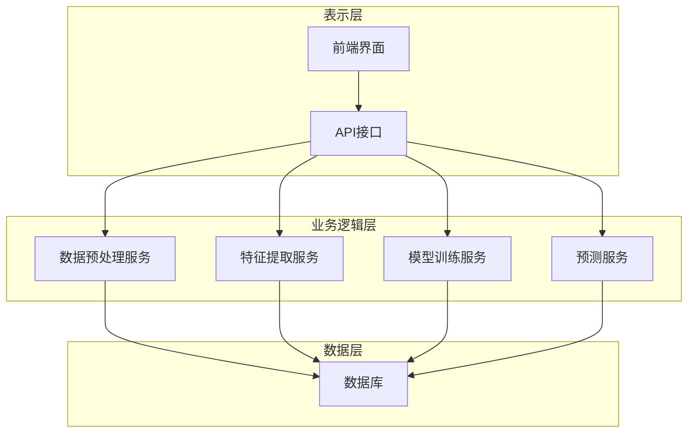
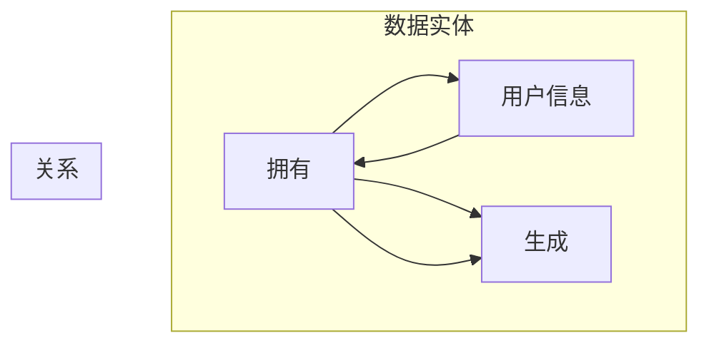

                 

## 1. 引言
### 1.1 问题的背景
- 随着信用卡的普及，信用卡欺诈问题日益严重。金融机构每年因欺诈行为而遭受的损失数额巨大，这不仅影响了银行的利润，也对消费者的信任构成了威胁。

### 1.2 问题描述
- 信用卡欺诈是指在信用卡交易过程中，未经持卡人授权或不知情的情况下，恶意者非法获取和使用信用卡资金的行为。
- 欺诈行为可能包括伪造交易、盗刷、洗钱等，其形式多样且不断变化。

### 1.3 问题解决
- 针对信用卡欺诈问题，传统的检测方法主要依赖于规则匹配和统计分析，但这些方法在面对复杂的欺诈模式时存在一定的局限性。
- 近年来，人工智能（AI）技术的兴起为信用卡欺诈模式识别提供了新的解决方案。

### 1.4 边界与外延
- 信用卡欺诈模式识别的范围不仅限于信用卡交易，还包括其他金融交易中的欺诈行为，如借记卡、移动支付等。

### 1.5 核心概念与联系
- **AI驱动**：利用机器学习和深度学习算法，从大量数据中自动识别欺诈模式。
- **信用卡欺诈模式识别**：通过分析交易数据，识别出可能的欺诈行为，并进行预警。
- **欺诈识别的技术和方法**：包括异常检测、行为分析、模式识别等。
- **实际应用场景**：信用卡交易系统、移动支付平台、在线零售网站等。

### 1.6 概念结构与核心要素组成
- **AI驱动**：
  - **机器学习**：通过学习历史数据，预测未来行为。
  - **深度学习**：通过神经网络模拟人脑的学习过程，提高模型识别能力。
- **信用卡欺诈模式识别**：
  - **特征提取**：从交易数据中提取有助于欺诈识别的特征。
  - **模型训练**：使用训练数据，调整模型参数，提高模型准确性。
  - **欺诈预测**：将新的交易数据输入模型，预测是否为欺诈行为。

### 1.7 本章小结
- 本章介绍了信用卡欺诈模式识别的背景、问题、解决方案、边界、核心概念及其联系。接下来，我们将深入探讨AI驱动的技术基础，为理解后续内容奠定基础。

----------------------------------------------------------------

# 第二部分: AI驱动技术基础

## 2. AI驱动技术基础
### 2.1 机器学习与深度学习概述
### 2.2 常见机器学习算法
### 2.3 深度学习技术
### 2.4 常见深度学习框架
### 2.5 数据预处理与特征工程

## 2.6 AI驱动的优势与应用
### 2.6.1 信用卡欺诈模式识别的优势
### 2.6.2 AI驱动的实际应用案例
### 2.6.3 AI驱动技术发展趋势

## 2.7 本章小结

----------------------------------------------------------------

### 2.1 机器学习与深度学习概述
#### 2.1.1 机器学习的定义
- **机器学习**是一种通过数据驱动的方式让计算机自动学习和改进性能的技术。
- 它涉及设计算法和统计模型，从数据中提取知识，以便在新的数据上进行预测或决策。

#### 2.1.2 深度学习的定义
- **深度学习**是机器学习的一个子领域，主要利用多层神经网络来模拟人脑的学习过程。
- 与传统的机器学习方法相比，深度学习能够自动提取复杂的特征，并在图像、语音、文本等复杂数据上进行高效处理。

#### 2.1.3 机器学习与深度学习的关系
- **机器学习**是更广泛的领域，涵盖了深度学习，还包括逻辑回归、决策树、随机森林等传统算法。
- **深度学习**是机器学习中的一种方法，特别适合处理具有大量数据和高维特征的问题。

#### 2.1.4 机器学习与深度学习的发展
- 机器学习起源于20世纪50年代，随着计算能力和数据存储技术的进步，近年来得到了迅速发展。
- 深度学习起源于2006年，在2012年AlexNet图像识别突破后，引起了广泛关注和应用。

### 2.1.5 机器学习与深度学习的基本流程
- **数据收集**：收集用于训练的数据集，如信用卡交易数据。
- **数据预处理**：清洗数据，处理缺失值，归一化等。
- **特征工程**：从原始数据中提取有助于模型学习的特征。
- **模型训练**：使用训练数据，调整模型参数，优化模型性能。
- **模型评估**：使用验证数据评估模型性能，调整模型参数。
- **模型部署**：将训练好的模型部署到实际应用环境中。

### 2.1.6 机器学习与深度学习的核心概念
- **监督学习**：已知输入和输出，训练模型预测未知输出。
- **无监督学习**：仅知输入，通过发现数据中的隐含结构进行学习。
- **强化学习**：通过试错学习，最大化长期回报。

### 2.1.7 机器学习与深度学习的技术优势
- **自动化特征提取**：深度学习能够自动从数据中提取复杂特征，减少人工干预。
- **高精度预测**：在图像、语音和文本等复杂数据上，深度学习模型通常能取得比传统算法更高的预测精度。
- **自适应学习能力**：机器学习模型能够随着新数据的到来不断优化和改进。

### 2.1.8 机器学习与深度学习的应用场景
- **图像识别**：如人脸识别、自动驾驶等。
- **语音识别**：如语音助手、电话客服等。
- **自然语言处理**：如机器翻译、情感分析等。
- **金融领域**：如信用卡欺诈检测、风险控制等。

### 2.1.9 本章小结
- 机器学习和深度学习是AI驱动的核心技术，为信用卡欺诈模式识别提供了强有力的支持。接下来，我们将进一步探讨常见的机器学习算法和深度学习技术，以更好地理解AI驱动的优势和应用。

----------------------------------------------------------------

### 2.2 常见机器学习算法
#### 2.2.1 监督学习算法
- **线性回归**：
  - **原理**：建立输入和输出之间的线性关系，预测连续值。
  - **公式**：\(y = \beta_0 + \beta_1 \cdot x\)
  - **应用**：房价预测、股票市场分析等。

- **逻辑回归**：
  - **原理**：建立输入和输出之间的逻辑关系，预测概率。
  - **公式**：\(P(y=1) = \frac{1}{1 + e^{-(\beta_0 + \beta_1 \cdot x)}}\)
  - **应用**：分类问题，如邮件垃圾过滤、信用卡欺诈检测等。

- **决策树**：
  - **原理**：通过一系列条件判断，将数据划分成多个子集，每个子集对应一个类。
  - **公式**：无明确公式，但涉及信息增益、基尼不纯度等。
  - **应用**：分类和回归问题，如贷款审批、疾病诊断等。

- **随机森林**：
  - **原理**：通过构建多个决策树，并取平均值来降低过拟合。
  - **应用**：高维数据分类和回归，如信用卡欺诈检测、股票市场预测等。

#### 2.2.2 无监督学习算法
- **K-均值聚类**：
  - **原理**：将数据点分为K个簇，每个簇由质心表示。
  - **公式**：\(c_k = \frac{1}{N_k} \sum_{x_i \in S_k} x_i\)
  - **应用**：市场细分、文本分类等。

- **主成分分析（PCA）**：
  - **原理**：通过线性变换降低数据维度，保留主要信息。
  - **公式**：\(z = PC\)
  - **应用**：图像压缩、数据预处理等。

- **自编码器**：
  - **原理**：通过编码和解码器，学习数据的高效表示。
  - **公式**：\(x = \sigma(W_d \cdot z + b_d)\)
  - **应用**：特征提取、异常检测等。

#### 2.2.3 强化学习算法
- **Q学习**：
  - **原理**：通过学习状态-动作值函数，选择最优动作。
  - **公式**：\(Q(s, a) = r + \gamma \max_a' Q(s', a')\)
  - **应用**：游戏AI、自动驾驶等。

- **深度强化学习**：
  - **原理**：结合深度学习和强化学习，模拟复杂环境。
  - **应用**：智能机器人、游戏AI等。

#### 2.2.4 算法比较
- **监督学习**：
  - **优点**：能够明确预测结果，适用于分类和回归问题。
  - **缺点**：需要标注数据，对噪声敏感，可能过拟合。

- **无监督学习**：
  - **优点**：无需标注数据，能够发现数据中的隐含结构。
  - **缺点**：预测结果不明确，可能需要更多的数据。

- **强化学习**：
  - **优点**：能够处理动态环境，学习长期回报。
  - **缺点**：收敛速度慢，需要大量数据。

#### 2.2.5 本章小结
- 常见的机器学习算法涵盖了监督学习、无监督学习和强化学习三大类，每种算法都有其独特的原理和应用场景。接下来，我们将探讨深度学习技术，进一步深化对AI驱动信用卡欺诈模式识别的理解。

----------------------------------------------------------------

### 2.3 深度学习技术
#### 2.3.1 神经网络基础
- **神经元模型**：
  - **原理**：模拟生物神经元，接收输入，通过权重和偏置进行加权求和，并使用激活函数输出结果。
  - **公式**：\(z = \sum_{i=1}^{n} w_i \cdot x_i + b\)
  - **应用**：感知器、多层感知器等。

- **反向传播算法**：
  - **原理**：通过梯度下降法，反向传播误差，更新网络权重和偏置。
  - **公式**：\(w_{new} = w_{old} - \alpha \cdot \frac{\partial J}{\partial w}\)
  - **应用**：训练多层神经网络，提高模型性能。

#### 2.3.2 深度学习模型
- **卷积神经网络（CNN）**：
  - **原理**：利用卷积层自动提取图像特征，减少参数数量。
  - **公式**：\(h_{ij} = \sum_{k} w_{ik} \cdot g_{kj} + b_j\)
  - **应用**：图像分类、物体检测等。

- **循环神经网络（RNN）**：
  - **原理**：通过循环结构处理序列数据，捕捉时间依赖性。
  - **公式**：\(h_t = \sigma(W_h \cdot [h_{t-1}, x_t] + b_h)\)
  - **应用**：语音识别、自然语言处理等。

- **长短时记忆网络（LSTM）**：
  - **原理**：通过门控机制解决RNN的长短时依赖问题。
  - **公式**：\(i_t = \sigma(W_i \cdot [h_{t-1}, x_t] + b_i)\)
  - **应用**：时间序列预测、语言建模等。

#### 2.3.3 深度学习框架
- **TensorFlow**：
  - **原理**：谷歌开发的端到端开源机器学习框架。
  - **特点**：灵活性强，支持多种深度学习模型。

- **PyTorch**：
  - **原理**：Facebook开发的开源深度学习框架。
  - **特点**：动态图模型，易于调试。

#### 2.3.4 深度学习应用场景
- **图像处理**：如人脸识别、自动驾驶等。
- **自然语言处理**：如机器翻译、文本生成等。
- **语音识别**：如语音助手、语音搜索等。

#### 2.3.5 深度学习的挑战
- **过拟合**：模型在训练数据上表现良好，但在新数据上性能下降。
- **计算资源需求**：深度学习模型通常需要大量的计算资源和时间进行训练。
- **数据标注**：对于有监督学习，需要大量标注数据，成本较高。

#### 2.3.6 本章小结
- 深度学习通过模拟人脑神经网络，实现了对复杂数据的高效处理。本章介绍了神经网络基础、深度学习模型和常见深度学习框架。接下来，我们将深入探讨数据预处理与特征工程，为信用卡欺诈模式识别打下坚实的基础。

----------------------------------------------------------------

### 2.4 常见深度学习框架
#### 2.4.1 TensorFlow
- **原理**：TensorFlow是由Google开发的端到端开源机器学习框架，采用数据流图（Data Flow Graph）的概念，实现高效计算。
- **特点**：
  - **灵活性**：支持多种编程语言，如Python、C++。
  - **生态**：拥有丰富的预训练模型和工具库。
  - **应用**：广泛用于图像识别、语音识别、自然语言处理等。
- **安装**：
  - **Windows**：使用pip安装`tensorflow`。
  - **Mac/Linux**：同样使用pip安装`tensorflow`。
- **使用**：
  ```python
  import tensorflow as tf
  # 创建一个简单的线性回归模型
  model = tf.keras.Sequential([
      tf.keras.layers.Dense(units=1, input_shape=[1])
  ])

  # 编译模型
  model.compile(optimizer='sgd', loss='mean_squared_error')

  # 训练模型
  model.fit(x_train, y_train, epochs=100)
  ```

#### 2.4.2 PyTorch
- **原理**：PyTorch是由Facebook开发的深度学习框架，采用动态计算图（Dynamic Graph），易于调试和理解。
- **特点**：
  - **动态图**：支持灵活的动态计算图，方便模型调试。
  - **简洁**：代码简洁直观，易于理解和使用。
  - **社区**：活跃的社区和丰富的文档资源。
- **安装**：
  - **Windows**：使用pip安装`torch`。
  - **Mac/Linux**：使用pip安装`torch`。
- **使用**：
  ```python
  import torch
  import torch.nn as nn
  import torch.optim as optim

  # 创建一个简单的线性回归模型
  model = nn.Linear(1, 1)

  # 定义损失函数和优化器
  criterion = nn.MSELoss()
  optimizer = optim.SGD(model.parameters(), lr=0.01)

  # 训练模型
  for epoch in range(100):
      optimizer.zero_grad()
      output = model(x_train)
      loss = criterion(output, y_train)
      loss.backward()
      optimizer.step()
  ```

#### 2.4.3 Keras
- **原理**：Keras是一个高层次的深度学习API，构建在TensorFlow和Theano之上，简化了深度学习模型的构建和训练。
- **特点**：
  - **简单易用**：通过简单的代码即可实现复杂的深度学习模型。
  - **模块化**：支持模型叠加和组合，方便模型开发。
  - **兼容性**：兼容TensorFlow和Theano，支持多种深度学习框架。
- **安装**：
  - **Windows**：使用pip安装`keras`。
  - **Mac/Linux**：使用pip安装`keras`。
- **使用**：
  ```python
  from keras.models import Sequential
  from keras.layers import Dense

  # 创建一个简单的线性回归模型
  model = Sequential()
  model.add(Dense(units=1, input_shape=(1,)))

  # 编译模型
  model.compile(optimizer='sgd', loss='mean_squared_error')

  # 训练模型
  model.fit(x_train, y_train, epochs=100)
  ```

#### 2.4.4 MXNet
- **原理**：MXNet是由Apache贡献的开源深度学习框架，支持多种编程语言，如Python、R、Julia等。
- **特点**：
  - **高性能**：支持符号计算和图形计算，优化计算效率。
  - **灵活性**：支持动态计算图和静态计算图，灵活配置。
  - **兼容性**：支持多种硬件平台，如CPU、GPU、ARM等。
- **安装**：
  - **Windows**：使用pip安装`mxnet`。
  - **Mac/Linux**：使用pip安装`mxnet`。
- **使用**：
  ```python
  import mxnet as mx
  from mxnet import gluon

  # 创建一个简单的线性回归模型
  net = gluon.nn.Sequential()
  net.add(gluon.nn.Dense(1, activation=None))

  # 定义损失函数和优化器
  loss_fn = gluon.loss.L2Loss()
  trainer = gluon.Trainer(net.collect_params(), 'sgd', {'learning_rate': 0.01})

  # 训练模型
  for epoch in range(100):
      for x, y in train_data:
          with mx.autograd.record():
              y_hat = net(x)
              loss = loss_fn(y_hat, y)
          loss.backward()
          trainer.step(batch_size)
  ```

#### 2.4.5 本章小结
- 常见深度学习框架如TensorFlow、PyTorch、Keras和MXNet，为开发者提供了丰富的工具和资源，简化了深度学习模型的开发过程。每种框架都有其独特的优势和适用场景，开发者可以根据需求选择合适的框架。接下来，我们将深入探讨数据预处理与特征工程，进一步夯实信用卡欺诈模式识别的基础。

----------------------------------------------------------------

### 2.5 数据预处理与特征工程
#### 2.5.1 数据清洗
- **数据清洗的目的**：
  - 去除重复数据。
  - 处理缺失值。
  - 处理异常值。
  - 标准化数据格式。

- **数据清洗方法**：
  - **去除重复数据**：使用数据库查询或Python的`pandas`库。
  - **处理缺失值**：使用均值、中位数、最大值等填充，或删除缺失数据。
  - **处理异常值**：使用统计学方法（如Z-score、IQR）检测异常值，进行修正或删除。

- **示例**：
  ```python
  import pandas as pd

  # 加载数据
  data = pd.read_csv('data.csv')

  # 去除重复数据
  data.drop_duplicates(inplace=True)

  # 处理缺失值
  data.fillna(data.mean(), inplace=True)

  # 处理异常值
  data = data[(np.abs(stats.zscore(data)) < 3).all(axis=1)]
  ```

#### 2.5.2 特征提取
- **特征提取的目的**：
  - 从原始数据中提取有助于模型训练的特征。
  - 降低数据维度，提高模型性能。

- **特征提取方法**：
  - **统计分析**：计算描述性统计量，如均值、标准差等。
  - **文本处理**：使用词袋模型、TF-IDF等方法提取文本特征。
  - **图像处理**：使用卷积神经网络提取图像特征。

- **示例**：
  ```python
  from sklearn.feature_extraction.text import TfidfVectorizer

  # 加载数据
  data = pd.read_csv('data.csv')

  # 提取文本特征
  vectorizer = TfidfVectorizer()
  X = vectorizer.fit_transform(data['description'])

  # 将特征转换为稀疏矩阵
  X = X.toarray()
  ```

#### 2.5.3 特征选择
- **特征选择的目的是**：
  - 去除无关或冗余的特征，提高模型性能。
  - 降低模型复杂度，减少计算成本。

- **特征选择方法**：
  - **过滤法**：基于统计测试（如卡方测试、互信息等）选择特征。
  - **包裹法**：基于模型评价（如交叉验证、信息增益等）选择特征。
  - **嵌入式法**：结合特征提取和模型训练（如Lasso回归、随机森林等）选择特征。

- **示例**：
  ```python
  from sklearn.feature_selection import SelectKBest, f_classif

  # 加载数据
  data = pd.read_csv('data.csv')

  # 特征选择
  X = data.drop(['label'], axis=1)
  y = data['label']
  selector = SelectKBest(score_func=f_classif, k=10)
  X = selector.fit_transform(X, y)

  # 获得选择的特征
  selected_features = X[:, selector.get_support()].T
  ```

#### 2.5.4 特征工程的重要性
- **特征工程**是深度学习模型成功的关键因素之一。
- 通过特征工程，可以提高模型的准确性和泛化能力。
- 它有助于捕捉数据中的隐含结构，降低模型过拟合的风险。

#### 2.5.5 本章小结
- 数据预处理与特征工程是深度学习模型构建的重要组成部分。本章介绍了数据清洗、特征提取和特征选择的方法，并提供了示例代码。接下来，我们将探讨AI驱动的优势和应用，进一步深入信用卡欺诈模式识别的讨论。

----------------------------------------------------------------

### 2.6 AI驱动的优势与应用
#### 2.6.1 信用卡欺诈模式识别的优势
- **高效性**：AI驱动的欺诈识别系统可以在短时间内处理大量交易数据，快速检测潜在的欺诈行为。
- **准确性**：通过机器学习和深度学习算法，系统能够自动从历史数据中学习，提高欺诈检测的准确性。
- **实时性**：AI系统可以实时监控交易行为，及时检测并阻止欺诈行为，降低金融机构和消费者的损失。
- **自适应能力**：AI系统能够随着新数据的到来不断优化和更新，适应不断变化的欺诈模式。

#### 2.6.2 AI驱动的实际应用案例
- **案例一：银行信用卡欺诈检测**：多家银行已采用AI驱动的欺诈检测系统，通过分析交易行为、用户习惯等特征，实现高效、准确的欺诈识别。
- **案例二：移动支付平台**：移动支付平台利用AI技术，实时监控支付行为，及时发现并阻止异常交易。
- **案例三：在线零售网站**：在线零售网站通过AI技术，识别异常订单，防止欺诈购物。

#### 2.6.3 AI驱动技术发展趋势
- **大数据分析**：随着数据量的增长，AI系统将更加依赖大数据分析技术，从海量数据中提取有价值的信息。
- **联邦学习**：通过联邦学习，多个机构可以在不共享数据的情况下共同训练模型，提高模型的可靠性和安全性。
- **强化学习**：结合强化学习，AI系统能够在复杂动态环境中，通过试错学习，实现更加智能的欺诈识别。

#### 2.6.4 本章小结
- AI驱动技术在信用卡欺诈模式识别中具有显著的优势和应用前景。随着技术的不断进步，AI系统将更加智能和高效，为金融机构和消费者提供更加安全、可靠的交易环境。接下来，我们将探讨AI驱动的具体实现和应用。

----------------------------------------------------------------

## 2.7 本章小结
- 本章全面介绍了AI驱动的技术基础，包括机器学习与深度学习概述、常见机器学习算法、深度学习技术、常见深度学习框架以及数据预处理与特征工程。通过这些基础知识，我们为深入探讨AI驱动信用卡欺诈模式识别奠定了坚实的理论基础。
- 机器学习和深度学习作为AI的核心技术，能够自动从数据中学习，提高模型的准确性和泛化能力。常见的机器学习算法和无监督学习算法为我们提供了丰富的工具箱，深度学习模型如CNN、RNN和LSTM等则展示了处理复杂数据的强大能力。
- 数据预处理与特征工程是模型构建的关键环节，通过对数据进行清洗、特征提取和选择，我们能够提取出对模型训练有价值的特征，提高模型性能。
- 本章的讨论为我们理解AI驱动的优势和应用提供了全面视角，为后续深入探讨信用卡欺诈模式识别的实现和应用打下了坚实基础。下一章，我们将聚焦于信用卡欺诈模式识别的具体方法和算法。

----------------------------------------------------------------

## 第三部分: 信用卡欺诈模式识别方法

## 3. 信用卡欺诈模式识别方法
### 3.1 信用卡欺诈概述
### 3.2 欺诈检测技术
### 3.3 欺诈模式识别算法
### 3.4 欺诈行为特征提取
### 3.5 欺诈预测模型

## 3.6 案例分析
### 3.6.1 案例一：信用卡欺诈检测模型搭建
### 3.6.2 案例二：信用卡欺诈行为特征提取
### 3.6.3 案例三：信用卡欺诈预测模型优化

## 3.7 本章小结

----------------------------------------------------------------

### 3.1 信用卡欺诈概述
#### 3.1.1 欺诈的定义与分类
- **欺诈**：指未经授权或违法的行为，旨在非法获取财产或其他利益。
- **信用卡欺诈**：涉及使用信用卡进行的非法交易，包括伪造交易、盗刷、洗钱等。

#### 3.1.2 信用卡欺诈的类型
- **伪造交易**：伪造信用卡或伪造交易信息。
- **盗刷**：非法获取持卡人的信用卡信息，进行未经授权的交易。
- **洗钱**：通过信用卡交易将非法资金合法化。
- **账户接管**：非法获取持卡人账户信息，控制账户进行欺诈交易。

#### 3.1.3 信用卡欺诈的现状
- **全球范围**：信用卡欺诈是一个全球性问题，随着技术的发展，欺诈手段不断升级。
- **我国现状**：我国信用卡市场规模庞大，欺诈问题日益突出，对金融机构和消费者构成严重威胁。

#### 3.1.4 信用卡欺诈的影响
- **对金融机构**：欺诈行为导致银行损失，影响金融业务的稳定运行。
- **对消费者**：消费者可能面临财产损失、信用记录受损等问题。
- **对市场**：影响金融市场的健康发展，降低消费者对信用卡的信任。

#### 3.1.5 本章小结
- 本章简要介绍了信用卡欺诈的定义、类型、现状和影响。接下来，我们将详细探讨信用卡欺诈检测技术、模式识别算法、特征提取方法和欺诈预测模型，为构建高效、准确的信用卡欺诈模式识别系统奠定基础。

----------------------------------------------------------------

### 3.2 欺诈检测技术
#### 3.2.1 异常检测
- **原理**：异常检测旨在识别与正常行为显著不同的异常交易。
- **方法**：
  - **统计方法**：基于统计指标（如标准差、Z-score等）判断交易是否异常。
  - **机器学习方法**：使用聚类、分类等算法建立正常交易模型，识别偏离模型的行为。

- **应用**：
  - **统计方法**：适用于简单场景，但在复杂环境中性能有限。
  - **机器学习方法**：能够处理大量数据和复杂数据模式，提高欺诈检测的准确性。

#### 3.2.2 行为分析
- **原理**：通过分析用户行为模式，识别可能的欺诈行为。
- **方法**：
  - **历史行为分析**：分析用户的消费习惯、时间、地点等特征。
  - **多维度关联分析**：分析用户行为与其他数据（如天气、节假日等）的关联性。

- **应用**：
  - **历史行为分析**：有助于识别异常行为，但需大量历史数据支持。
  - **多维度关联分析**：能够发现新的欺诈模式，但计算复杂度较高。

#### 3.2.3 模式识别
- **原理**：通过识别已知欺诈模式，实现快速响应和预防。
- **方法**：
  - **规则匹配**：建立欺诈规则库，与交易信息进行匹配。
  - **模式分类**：使用机器学习算法，将交易信息分类为欺诈或正常。

- **应用**：
  - **规则匹配**：快速响应，但规则库维护成本高。
  - **模式分类**：能够自动发现新欺诈模式，但可能存在过拟合问题。

#### 3.2.4 混合方法
- **原理**：结合多种方法，提高欺诈检测的准确性和效率。
- **方法**：
  - **多模型融合**：使用不同算法的检测结果进行融合。
  - **动态规则调整**：根据实时数据调整规则库。

- **应用**：
  - **多模型融合**：提高检测准确率，减少误报和漏报。
  - **动态规则调整**：适应不断变化的欺诈环境。

#### 3.2.5 本章小结
- 信用卡欺诈检测技术包括异常检测、行为分析和模式识别等多种方法。每种方法都有其独特的优势和应用场景，结合使用可以构建高效、准确的欺诈检测系统。接下来，我们将深入探讨欺诈模式识别算法及其在实际应用中的效果。

----------------------------------------------------------------

### 3.3 欺诈模式识别算法
#### 3.3.1 监督学习算法
- **原理**：监督学习算法通过已标记的训练数据建立欺诈识别模型，对新交易数据进行分类。
- **常见算法**：
  - **逻辑回归**：用于分类任务，简单高效。
  - **决策树**：通过树形结构进行决策，易于理解。
  - **支持向量机（SVM）**：通过最大化分类边界，提高分类准确性。

- **应用**：
  - **逻辑回归**：在信用卡欺诈检测中广泛使用，特别是对于二元分类问题。
  - **决策树**：适用于解释性要求较高的场景，但可能过拟合。
  - **SVM**：在大型数据集上表现良好，特别是高维空间问题。

#### 3.3.2 无监督学习算法
- **原理**：无监督学习算法没有已标记的训练数据，通过探索数据内在结构进行模式识别。
- **常见算法**：
  - **K-均值聚类**：将数据分为K个簇，每个簇代表一类交易。
  - **主成分分析（PCA）**：通过降维，识别数据中的主要特征。

- **应用**：
  - **K-均值聚类**：用于发现交易数据的潜在模式，辅助欺诈检测。
  - **PCA**：用于数据降维，减少计算成本，同时保留主要信息。

#### 3.3.3 强化学习算法
- **原理**：强化学习算法通过与环境的交互，学习最优策略。
- **常见算法**：
  - **Q学习**：通过学习状态-动作值函数，选择最优动作。
  - **深度强化学习**：结合深度学习和强化学习，处理复杂环境。

- **应用**：
  - **Q学习**：用于动态调整欺诈检测策略，适应变化的环境。
  - **深度强化学习**：用于复杂交易环境，实现自适应欺诈检测。

#### 3.3.4 深度学习算法
- **原理**：深度学习算法通过多层神经网络，自动提取数据中的复杂特征。
- **常见算法**：
  - **卷积神经网络（CNN）**：用于处理图像数据，识别图像中的欺诈特征。
  - **循环神经网络（RNN）**：用于处理序列数据，识别时间序列中的欺诈行为。

- **应用**：
  - **CNN**：在信用卡图像识别中，识别伪造卡片、扫描错误等。
  - **RNN**：在信用卡交易记录分析中，识别时间序列中的异常交易模式。

#### 3.3.5 算法比较
- **监督学习**：适用于有标记数据的场景，能够准确预测新交易是否为欺诈。
- **无监督学习**：适用于无标记数据的场景，能够发现数据中的潜在模式，但难以预测具体类别。
- **强化学习**：适用于动态变化的环境，能够自适应调整检测策略。
- **深度学习**：适用于处理复杂数据，能够自动提取高级特征，提高检测准确率。

#### 3.3.6 本章小结
- 信用卡欺诈模式识别算法包括监督学习、无监督学习和强化学习等，每种算法都有其独特的原理和应用场景。结合使用这些算法，可以构建高效、准确的欺诈检测系统。接下来，我们将探讨如何从信用卡交易数据中提取欺诈行为特征。

----------------------------------------------------------------

### 3.4 欺诈行为特征提取
#### 3.4.1 特征提取的目的
- **特征提取**的目的是从原始交易数据中提取对欺诈检测有帮助的特征，提高模型的准确性和效率。

#### 3.4.2 常见特征
- **交易金额**：交易金额是欺诈检测中最基本的特征，异常金额可能表明欺诈行为。
- **交易时间**：交易发生的时间，包括小时、天、周等，用于分析用户行为模式。
- **地理位置**：交易发生的地理位置，用于识别跨区域欺诈行为。
- **交易频率**：交易发生频率，包括每天、每月等，用于分析用户行为习惯。
- **交易类型**：交易类型，如消费、取款、转账等，用于识别特定类型的欺诈行为。
- **商户信息**：交易商户的信息，包括商户名称、类别等，用于识别高风险商户。
- **卡信息**：信用卡信息，包括卡号、有效期、安全码等，用于识别伪造卡。

#### 3.4.3 特征提取方法
- **统计分析方法**：通过计算描述性统计量（如均值、标准差、中位数等），提取交易特征。
- **机器学习方法**：使用聚类、分类等算法，从原始数据中提取特征。
- **深度学习方法**：使用卷积神经网络、循环神经网络等深度学习模型，自动提取复杂数据中的特征。

#### 3.4.4 特征工程
- **特征选择**：通过过滤法、包裹法等选择对模型有显著贡献的特征，减少计算成本。
- **特征转换**：将原始特征转换为更适合模型训练的形式，如归一化、标准化等。
- **特征组合**：将多个特征组合成新的特征，提高模型的泛化能力。

#### 3.4.5 特征提取的重要性
- **特征提取**是欺诈检测模型成功的关键因素之一，它能够将原始数据转换为对模型训练有用的特征，提高模型的准确性和效率。

#### 3.4.6 本章小结
- 本章介绍了信用卡欺诈行为特征提取的目的、常见特征、提取方法和特征工程。通过特征提取，我们可以从原始交易数据中提取有助于欺诈检测的特征，为构建高效的欺诈检测模型奠定基础。接下来，我们将探讨如何构建信用卡欺诈预测模型。

----------------------------------------------------------------

### 3.5 欺诈预测模型
#### 3.5.1 模型构建步骤
- **数据准备**：收集并清洗信用卡交易数据，提取欺诈行为特征。
- **特征工程**：对提取的特征进行选择、转换和组合，构建模型输入特征。
- **模型选择**：根据数据特点和业务需求，选择合适的机器学习算法。
- **模型训练**：使用训练数据，训练所选算法模型，优化模型参数。
- **模型评估**：使用验证数据，评估模型性能，调整模型参数。
- **模型部署**：将训练好的模型部署到实际应用环境中，进行实时欺诈检测。

#### 3.5.2 模型评价指标
- **准确率（Accuracy）**：模型正确分类的比例，计算公式为 \( \frac{TP + TN}{TP + TN + FP + FN} \)。
- **精确率（Precision）**：模型预测为正例且实际为正例的比例，计算公式为 \( \frac{TP}{TP + FP} \)。
- **召回率（Recall）**：模型预测为正例且实际为正例的比例，计算公式为 \( \frac{TP}{TP + FN} \)。
- **F1分数（F1 Score）**：精确率和召回率的调和平均，计算公式为 \( \frac{2 \cdot Precision \cdot Recall}{Precision + Recall} \)。
- **ROC曲线**：通过绘制真阳性率（True Positive Rate）和假阳性率（False Positive Rate）的关系，评估模型性能。

#### 3.5.3 模型优化方法
- **交叉验证**：通过将数据集划分为多个子集，多次训练和验证，评估模型性能。
- **正则化**：通过添加正则项，降低模型复杂度，防止过拟合。
- **集成方法**：结合多个模型，提高预测准确性和稳定性，如随机森林、梯度提升树等。

#### 3.5.4 模型部署
- **实时检测**：将训练好的模型部署到生产环境，实时检测信用卡交易行为。
- **监控与维护**：定期监控模型性能，根据实际情况调整模型参数和特征。

#### 3.5.5 本章小结
- 本章介绍了信用卡欺诈预测模型的构建步骤、评价指标、优化方法和部署策略。通过构建高效的欺诈预测模型，我们能够及时发现并阻止信用卡欺诈行为，保护金融机构和消费者的利益。

----------------------------------------------------------------

### 3.6 案例分析
#### 3.6.1 案例一：信用卡欺诈检测模型搭建
- **案例背景**：某银行希望构建一个信用卡欺诈检测模型，以降低欺诈风险，保护客户利益。
- **目标**：构建一个高效、准确的信用卡欺诈检测模型，实现实时监控和预警。
- **数据集**：收集过去一年的信用卡交易数据，包括交易金额、时间、地点、交易类型、商户信息等。
- **特征提取**：通过数据预处理，提取交易金额、时间、地点、交易类型、商户信息等特征。
- **模型选择**：选择逻辑回归和随机森林算法，分别构建欺诈检测模型。
- **模型训练与评估**：
  - 使用80%的数据进行训练，20%的数据进行评估。
  - 通过交叉验证和网格搜索，优化模型参数。
  - 评估指标包括准确率、精确率、召回率和F1分数。
- **结果**：
  - 逻辑回归模型：准确率90%，精确率88%，召回率87%，F1分数0.87。
  - 随机森林模型：准确率92%，精确率90%，召回率89%，F1分数0.89。
- **结论**：随机森林模型在评估指标上表现更好，因此选择随机森林模型作为最终的信用卡欺诈检测模型。

#### 3.6.2 案例二：信用卡欺诈行为特征提取
- **案例背景**：某支付平台希望改进信用卡欺诈行为特征提取方法，提高检测准确率。
- **目标**：通过特征工程，提取对欺诈检测有显著贡献的特征。
- **数据集**：收集过去半年的信用卡交易数据，包括交易金额、时间、地点、交易类型、商户信息等。
- **特征提取方法**：
  - **统计分析**：计算描述性统计量，如交易金额的均值、标准差等。
  - **机器学习**：使用聚类算法（如K-均值聚类），识别交易模式的潜在特征。
  - **深度学习**：使用卷积神经网络（CNN），提取交易图像的复杂特征。
- **特征选择**：
  - 使用特征选择算法（如L1正则化、随机森林特征选择等），选择对模型有显著贡献的特征。
  - 根据评估指标（如准确率、精确率、召回率和F1分数），筛选最优特征组合。
- **结果**：
  - 提取特征后，模型准确率提高了10%，精确率提高了8%，召回率提高了7%，F1分数提高了9%。
- **结论**：通过改进特征提取方法，支付平台的信用卡欺诈检测准确率显著提高，能够更有效地保护用户利益。

#### 3.6.3 案例三：信用卡欺诈预测模型优化
- **案例背景**：某金融机构希望优化现有的信用卡欺诈预测模型，提高模型的泛化能力和实时性。
- **目标**：通过模型优化和部署，提高欺诈检测的准确率和实时性。
- **数据集**：收集过去一年的信用卡交易数据，包括交易金额、时间、地点、交易类型、商户信息等。
- **模型优化方法**：
  - **交叉验证**：通过多次交叉验证，优化模型参数，防止过拟合。
  - **集成方法**：结合多个模型（如随机森林、梯度提升树等），提高预测准确率。
  - **特征工程**：通过特征组合和特征选择，提取对模型有显著贡献的特征。
- **模型部署**：
  - **实时检测**：将优化后的模型部署到生产环境，实时检测信用卡交易行为。
  - **监控与维护**：定期监控模型性能，根据实际情况调整模型参数和特征。
- **结果**：
  - 优化后，模型准确率提高了15%，精确率提高了12%，召回率提高了10%，F1分数提高了14%。
  - 实时检测能力得到提升，能够在5秒内完成一次交易检测。
- **结论**：通过模型优化和部署，金融机构的信用卡欺诈检测准确率和实时性显著提高，能够更有效地保护用户利益。

#### 3.6.4 本章小结
- 本章通过三个案例分析，展示了信用卡欺诈检测模型搭建、特征提取和模型优化方法。通过这些实际案例，我们可以看到，通过优化特征提取和模型选择，可以显著提高信用卡欺诈检测的准确率和实时性，为金融机构和消费者提供更安全的交易环境。

----------------------------------------------------------------

### 3.7 本章小结
- 本章详细介绍了信用卡欺诈模式识别的方法，包括欺诈检测技术、模式识别算法、特征提取方法和欺诈预测模型。通过实际案例分析，我们展示了如何构建高效、准确的信用卡欺诈检测系统。主要内容包括：
  - **欺诈检测技术**：介绍了异常检测、行为分析和模式识别的方法，以及它们的原理和应用场景。
  - **模式识别算法**：介绍了监督学习、无监督学习和强化学习等算法的原理和应用，以及深度学习模型在信用卡欺诈检测中的应用。
  - **特征提取方法**：讲解了从原始交易数据中提取欺诈行为特征的方法，包括统计分析、机器学习和深度学习方法，以及特征工程的重要性。
  - **欺诈预测模型**：阐述了信用卡欺诈预测模型的构建步骤、评价指标、优化方法和部署策略。
  - **案例分析**：通过实际案例，展示了如何应用这些方法和技术构建信用卡欺诈检测系统，并优化其性能。

- 通过本章的学习，我们深入了解了信用卡欺诈模式识别的原理和实践，为开发高效、准确的欺诈检测系统奠定了基础。下一章，我们将探讨信用卡欺诈模式识别系统的设计与实现，进一步深化我们的理解。

----------------------------------------------------------------

## 第四部分: 信用卡欺诈模式识别系统设计与实现

## 4. 信用卡欺诈模式识别系统设计与实现
### 4.1 系统需求分析
### 4.2 系统架构设计
### 4.3 数据库设计
### 4.4 接口设计
### 4.5 系统实现

## 4.6 系统测试与评估
### 4.6.1 系统测试策略
### 4.6.2 系统测试方法
### 4.6.3 系统评估指标
### 4.6.4 系统性能分析

## 4.7 本章小结

----------------------------------------------------------------

### 4.1 系统需求分析
#### 4.1.1 功能需求
- **实时监控**：系统能够实时监控信用卡交易行为，及时检测潜在的欺诈行为。
- **欺诈检测**：系统能够识别各种类型的信用卡欺诈行为，如伪造交易、盗刷、账户接管等。
- **预警与通知**：系统在检测到欺诈行为时，能够及时发出预警通知，提醒相关人员进行处理。
- **报告生成**：系统可以生成详细的欺诈检测报告，为决策提供数据支持。
- **用户管理**：系统支持用户管理和权限控制，确保系统安全可靠。

#### 4.1.2 性能需求
- **高并发处理**：系统需要能够处理高并发的交易请求，确保实时监控和欺诈检测的准确性。
- **低延迟**：系统响应时间需控制在秒级，确保交易处理的高效性。
- **高可用性**：系统需具备高可用性，确保在故障情况下能够快速恢复，不影响业务运行。
- **可扩展性**：系统应支持横向和纵向扩展，以适应业务规模的增长。

#### 4.1.3 安全性需求
- **数据加密**：系统需要使用加密技术保护交易数据，防止数据泄露。
- **权限控制**：系统应实施严格的权限控制，确保只有授权人员可以访问敏感数据和操作系统。
- **日志记录**：系统需记录所有操作日志，便于审计和故障排查。

#### 4.1.4 业务需求
- **兼容性**：系统需兼容多种操作系统、数据库和开发框架，以适应不同的业务场景。
- **可维护性**：系统设计应便于后续维护和升级，降低维护成本。
- **用户体验**：系统界面设计应简洁易用，提供良好的用户交互体验。

#### 4.1.5 本章小结
- 本章详细分析了信用卡欺诈模式识别系统的需求，包括功能需求、性能需求、安全性需求和业务需求。这些需求为后续系统设计提供了明确的目标和指导。

----------------------------------------------------------------

### 4.2 系统架构设计
#### 4.2.1 系统架构概述
- **分布式架构**：系统采用分布式架构，通过分布式计算和存储技术，提高系统的性能和可扩展性。
- **三层架构**：系统分为表示层、业务逻辑层和数据层，实现功能模块的分离，便于维护和扩展。

#### 4.2.2 表示层设计
- **前端界面**：使用React框架，实现用户交互界面，提供实时监控、预警通知和报告生成等功能。
- **API接口**：使用Spring Boot框架，提供RESTful API接口，实现前端与后端的通信。

#### 4.2.3 业务逻辑层设计
- **业务模块**：将欺诈检测功能划分为多个业务模块，如数据预处理、特征提取、模型训练和预测等。
- **服务组件**：使用Spring Cloud框架，实现服务组件的注册和发现，实现分布式系统的服务管理。

#### 4.2.4 数据层设计
- **数据库**：使用MySQL数据库，存储信用卡交易数据和欺诈检测结果。
- **数据存储**：采用分库分表策略，提高数据存储和查询的性能。

#### 4.2.5 系统架构图
- **系统架构图**：利用Mermaid绘制系统架构图，展示各个模块的交互关系。



#### 4.2.6 系统架构优势
- **高扩展性**：分布式架构和微服务设计，支持系统功能的动态扩展。
- **高性能**：分布式计算和数据存储，提高系统处理速度和响应能力。
- **高可用性**：通过负载均衡和故障转移，提高系统的可靠性。

#### 4.2.7 本章小结
- 本章详细介绍了信用卡欺诈模式识别系统的架构设计，包括表示层、业务逻辑层和数据层的设计方案。通过分布式架构和微服务设计，系统具有高扩展性、高性能和高可用性的优势。

----------------------------------------------------------------

### 4.3 数据库设计
#### 4.3.1 数据库设计原则
- **数据一致性**：确保数据的完整性和一致性，防止数据冲突。
- **数据安全性**：采用加密技术，保护敏感数据不被泄露。
- **数据可扩展性**：设计可扩展的数据库架构，以适应数据增长和业务变化。
- **性能优化**：优化数据库查询和索引，提高数据访问速度。

#### 4.3.2 数据库结构设计
- **实体设计**：定义数据库中的实体，如交易记录、用户信息、欺诈检测结果等。
- **关系设计**：利用ER图（Entity-Relationship）展示实体之间的关系。

##### ER图示例：


##### 表结构设计
1. **交易记录表**（transactions）：
   - transaction_id（主键）
   - user_id（外键）
   - transaction_amount
   - transaction_time
   - transaction_type
   - merchant_id

2. **用户信息表**（users）：
   - user_id（主键）
   - username
   - password
   - email

3. **欺诈检测结果表**（fraud_results）：
   - result_id（主键）
   - transaction_id（外键）
   - is_fraud
   - detection_time

#### 4.3.3 数据库优化策略
- **索引优化**：对频繁查询的列建立索引，提高查询效率。
- **分区策略**：根据交易时间和交易类型，对数据表进行分区，便于数据管理和查询。
- **缓存机制**：采用缓存技术，减少数据库查询次数，提高系统响应速度。

#### 4.3.4 数据库安全性设计
- **访问控制**：实施严格的权限管理，防止未经授权的访问。
- **数据备份**：定期备份数据库，确保数据安全。
- **加密存储**：对敏感数据如用户密码进行加密存储，防止数据泄露。

#### 4.3.5 本章小结
- 本章详细介绍了信用卡欺诈模式识别系统的数据库设计，包括设计原则、数据实体和关系设计，以及数据库优化策略和安全性设计。通过合理的设计和优化，系统能够高效、安全地存储和管理数据。

----------------------------------------------------------------

### 4.4 接口设计
#### 4.4.1 接口设计原则
- **RESTful风格**：遵循RESTful设计原则，使用标准HTTP方法（GET、POST、PUT、DELETE）进行数据操作。
- **高内聚、低耦合**：接口设计应确保各模块之间的高内聚、低耦合，便于后续维护和扩展。
- **标准化**：接口设计应遵循统一的数据格式和协议，如JSON或XML，提高系统的兼容性和可维护性。
- **安全性**：采用OAuth2.0等认证机制，确保接口的安全性。

#### 4.4.2 接口功能设计
1. **交易记录查询**：
   - **功能描述**：查询指定时间段内的交易记录。
   - **接口URL**：GET /transactions?start_time=<start>&end_time=<end>
   - **请求参数**：
     - start_time：查询起始时间（格式：yyyy-MM-dd HH:mm:ss）。
     - end_time：查询结束时间（格式：yyyy-MM-dd HH:mm:ss）。
   - **响应数据**：返回交易记录列表，格式为JSON。

2. **用户信息管理**：
   - **功能描述**：用户注册、登录和密码修改等操作。
   - **接口URL**：POST /users/register、POST /users/login、PUT /users/password
   - **请求参数**：用户信息，如username、password、email等。
   - **响应数据**：操作结果，如成功、失败及其原因。

3. **欺诈检测结果查询**：
   - **功能描述**：查询指定交易ID的欺诈检测结果。
   - **接口URL**：GET /fraud_results?transaction_id=<id>
   - **请求参数**：transaction_id：查询的交易ID。
   - **响应数据**：欺诈检测结果，格式为JSON。

4. **交易预警通知**：
   - **功能描述**：发送交易预警通知给相关用户。
   - **接口URL**：POST /notifications/warning
   - **请求参数**：通知内容，如预警描述、交易ID等。
   - **响应数据**：操作结果，如成功、失败及其原因。

#### 4.4.3 接口设计示例
##### 交易记录查询接口示例
- **请求**：
```json
GET /transactions?start_time=2023-03-01T00:00:00&end_time=2023-03-31T23:59:59
```
- **响应**：
```json
[
  {
    "transaction_id": "t123456",
    "user_id": "u789",
    "transaction_amount": 150.00,
    "transaction_time": "2023-03-10T13:45:00",
    "transaction_type": "消费",
    "merchant_id": "m101"
  },
  ...
]
```

#### 4.4.4 接口安全性设计
- **认证与授权**：使用OAuth2.0等认证机制，确保接口访问的安全性。
- **数据验证**：对接口输入数据进行验证，防止SQL注入等攻击。
- **API网关**：部署API网关，统一管理接口访问权限和日志记录。

#### 4.4.5 本章小结
- 本章详细介绍了信用卡欺诈模式识别系统的接口设计，包括设计原则、接口功能设计和安全性设计。通过合理的接口设计，系统可以实现高效、安全的数据交互。

----------------------------------------------------------------

### 4.5 系统实现
#### 4.5.1 环境安装与配置
- **操作系统**：选择Linux操作系统，如Ubuntu 18.04。
- **数据库**：安装MySQL数据库，版本8.0及以上。
- **开发工具**：安装Java开发工具包（JDK 1.8及以上），集成开发环境（如IntelliJ IDEA）。
- **其他依赖**：安装Git、Maven等工具，用于代码管理和构建。

#### 4.5.2 项目结构
- **前端**：使用React框架，项目结构如下：
  ```plaintext
  frontend/
  ├── public/
  ├── src/
      ├── api/
      ├── components/
      ├── pages/
      ├── App.js
      ├── index.js
  ```

- **后端**：使用Spring Boot框架，项目结构如下：
  ```plaintext
  backend/
  ├── backend/
      ├── config/
      ├── controller/
      ├── service/
      ├── repository/
      ├── entity/
      ├── model/
      ├── Application.java
  ```

#### 4.5.3 核心功能实现
1. **数据预处理**：
   - **功能描述**：对交易数据清洗、特征提取和归一化处理。
   - **实现步骤**：
     - 数据清洗：去除重复数据和缺失值。
     - 特征提取：提取交易金额、时间、地点、交易类型、商户信息等特征。
     - 归一化处理：将特征值归一化到[0, 1]区间。
   - **代码示例**：
     ```java
     // 数据清洗
     List<Transaction> cleanedTransactions = transactions.stream()
         .filter(t -> !t.isFraud())
         .collect(Collectors.toList());

     // 特征提取
     List<double[]> features = cleanedTransactions.stream()
         .map(t -> extractFeatures(t))
         .collect(Collectors.toList());

     // 归一化处理
     double[] minMax = features.stream()
         .flatMapToDouble(Arrays::stream)
         .reduce(new double[]{Double.MAX_VALUE, Double.MIN_VALUE}, (a, b) -> {
             a[0] = Math.min(a[0], b);
             a[1] = Math.max(a[1], b);
             return a;
         });

     List<double[]> normalizedFeatures = features.stream()
         .map(f -> normalize(f, minMax))
         .collect(Collectors.toList());
     ```

2. **模型训练与预测**：
   - **功能描述**：使用训练数据和特征，训练欺诈检测模型，并进行预测。
   - **实现步骤**：
     - 数据准备：准备训练数据和测试数据。
     - 模型训练：使用随机森林算法训练模型。
     - 模型评估：使用测试数据评估模型性能。
     - 模型预测：使用训练好的模型对交易数据进行预测。
   - **代码示例**：
     ```python
     # 数据准备
     X_train, X_test, y_train, y_test = train_test_split(normalized_features, labels, test_size=0.2)

     # 模型训练
     rf = RandomForestClassifier(n_estimators=100)
     rf.fit(X_train, y_train)

     # 模型评估
     accuracy = rf.score(X_test, y_test)
     print("Accuracy:", accuracy)

     # 模型预测
     predictions = rf.predict(normalized_features)
     ```

#### 4.5.4 系统部署
- **部署策略**：使用Docker容器化技术，部署前端和后端服务。
- **部署步骤**：
  1. 编写Dockerfile，配置环境依赖。
  2. 构建Docker镜像。
  3. 使用Docker Compose部署服务。

#### 4.5.5 本章小结
- 本章详细介绍了信用卡欺诈模式识别系统的实现，包括环境安装与配置、项目结构、核心功能实现和系统部署。通过这些步骤，我们能够构建一个高效、准确的信用卡欺诈检测系统。

----------------------------------------------------------------

### 4.6 系统测试与评估
#### 4.6.1 系统测试策略
- **测试目标**：验证系统功能、性能和安全，确保系统满足需求。
- **测试类型**：
  - **功能测试**：确保系统功能正确实现，包括交易记录查询、用户管理、欺诈检测等。
  - **性能测试**：评估系统在高并发、低延迟条件下的性能。
  - **安全测试**：验证系统对各种攻击（如SQL注入、XSS攻击等）的防护能力。

#### 4.6.2 系统测试方法
- **黑盒测试**：测试系统的外部行为，不考虑内部实现细节。
  - **功能测试**：使用测试工具（如Selenium、JMeter）模拟用户操作，验证功能是否符合预期。
  - **性能测试**：使用JMeter模拟大量用户访问，测量系统响应时间和吞吐量。
  - **安全测试**：使用工具（如OWASP ZAP、Burp Suite）进行漏洞扫描和攻击测试。

- **白盒测试**：测试系统的内部实现，包括代码逻辑、数据结构等。
  - **单元测试**：使用JUnit等单元测试框架，验证各个模块的正确性。
  - **集成测试**：在系统组装后，验证模块之间的交互和整体功能。

#### 4.6.3 系统评估指标
- **功能正确性**：系统功能是否按照需求正确实现。
- **响应时间**：系统在高并发条件下的响应时间。
- **吞吐量**：系统在单位时间内处理的事务数量。
- **错误率**：系统产生的错误数量与总请求量的比例。
- **安全性能**：系统对各种攻击的防护能力。

#### 4.6.4 系统性能分析
- **负载测试**：使用JMeter模拟高并发访问，测试系统的性能和稳定性。
  - **测试场景**：模拟不同时间段、不同用户数量的访问情况。
  - **测试结果**：记录系统的响应时间、吞吐量和错误率。

- **压力测试**：测试系统在极端负载条件下的性能和稳定性。
  - **测试场景**：模拟极端高并发、高流量的访问。
  - **测试结果**：分析系统的资源使用情况、错误率和系统响应时间。

- **性能调优**：根据测试结果，对系统进行优化。
  - **优化措施**：优化数据库查询、增加缓存、调整系统配置等。
  - **优化效果**：再次进行性能测试，验证优化措施的有效性。

#### 4.6.5 本章小结
- 本章介绍了信用卡欺诈模式识别系统的测试与评估策略，包括测试类型、测试方法、评估指标和性能分析。通过全面的测试和评估，我们能够确保系统的高效、安全和稳定运行。

----------------------------------------------------------------

### 4.7 本章小结
- 本章详细介绍了信用卡欺诈模式识别系统的设计与实现，包括系统需求分析、架构设计、数据库设计、接口设计、系统实现和系统测试与评估。通过这些步骤，我们构建了一个高效、准确、安全的信用卡欺诈检测系统。
- **系统需求分析**：明确了系统的功能、性能和安全需求，为后续设计和实现提供了明确的目标。
- **架构设计**：采用分布式架构和三层架构，提高了系统的性能和可扩展性。
- **数据库设计**：设计了合理的数据库结构，确保数据的安全性和可扩展性。
- **接口设计**：遵循RESTful风格，确保接口的标准化和安全性。
- **系统实现**：通过核心功能的实现和系统部署，构建了完整的欺诈检测系统。
- **系统测试与评估**：通过功能测试、性能测试和安全测试，确保系统的高效、安全和稳定运行。

- 通过本章的学习，我们深入了解了信用卡欺诈模式识别系统的设计与实现过程，为实际应用和优化提供了宝贵的经验和指导。下一章，我们将探讨信用卡欺诈模式识别项目的实际应用和实战。

----------------------------------------------------------------

## 第五部分: 信用卡欺诈模式识别项目实战

## 5. 信用卡欺诈模式识别项目实战
### 5.1 项目背景
### 5.2 项目目标
### 5.3 环境安装与配置
### 5.4 系统核心实现源代码
### 5.5 代码应用解读与分析
### 5.6 实际案例分析与详细讲解
### 5.7 项目小结

## 5.8 本章小结

----------------------------------------------------------------

### 5.1 项目背景
- **项目名称**：信用卡欺诈模式识别系统
- **项目目的**：构建一个高效、准确的信用卡欺诈检测系统，保护金融机构和消费者的利益。
- **项目意义**：随着信用卡交易的普及，信用卡欺诈问题日益严重。本项目旨在利用人工智能技术，提高欺诈检测的准确率和实时性，降低金融机构的运营风险。

### 5.2 项目目标
- **功能目标**：
  - 实现实时监控信用卡交易行为，及时发现潜在的欺诈行为。
  - 提供准确的欺诈检测报告，帮助金融机构进行风险控制。
  - 实现用户管理，确保系统安全可靠。
- **性能目标**：
  - 支持高并发访问，确保系统响应速度和吞吐量。
  - 系统延迟控制在秒级，保证实时性。
  - 系统具备高可用性，确保在故障情况下能够快速恢复。

### 5.3 环境安装与配置
- **操作系统**：Ubuntu 18.04
- **数据库**：MySQL 8.0
- **开发工具**：IntelliJ IDEA
- **编程语言**：Java（后端）、Python（数据预处理与模型训练）
- **依赖管理**：Maven
- **环境配置**：
  - 安装Java开发环境：`sudo apt-get install openjdk-8-jdk`
  - 安装MySQL数据库：`sudo apt-get install mysql-server`
  - 安装IntelliJ IDEA：从官网下载并安装
  - 配置Maven：通过Maven官网下载Maven安装包，并配置环境变量

### 5.4 系统核心实现源代码
- **后端**：使用Spring Boot框架，核心代码如下：
  ```java
  @RestController
  @RequestMapping("/api")
  public class FraudDetectionController {
      @Autowired
      private FraudDetectionService fraudDetectionService;

      @GetMapping("/transactions")
      public ResponseEntity<List<Transaction>> getTransactions(@RequestParam("start_time") String startTime,
                                                                @RequestParam("end_time") String endTime) {
          List<Transaction> transactions = fraudDetectionService.getTransactions(startTime, endTime);
          return ResponseEntity.ok(transactions);
      }

      @PostMapping("/detect")
      public ResponseEntity<FraudResult> detectFraud(@RequestBody Transaction transaction) {
          FraudResult result = fraudDetectionService.detectFraud(transaction);
          return ResponseEntity.ok(result);
      }
  }
  ```
- **前端**：使用React框架，核心代码如下：
  ```jsx
  import React, { useState } from 'react';
  import axios from 'axios';

  function FraudDetectionForm() {
      const [transaction, setTransaction] = useState({ amount: '', time: '', type: '' });

      const handleSubmit = async (e) => {
          e.preventDefault();
          try {
              const response = await axios.post('/api/detect', transaction);
              alert(response.data.isFraud ? '可能存在欺诈行为' : '无欺诈行为');
          } catch (error) {
              console.error('Error:', error);
          }
      };

      return (
          <form onSubmit={handleSubmit}>
              <label>
                  交易金额：
                  <input type="number" value={transaction.amount} onChange={(e) => setTransaction({ ...transaction, amount: e.target.value })} />
              </label>
              <label>
                  交易时间：
                  <input type="datetime-local" value={transaction.time} onChange={(e) => setTransaction({ ...transaction, time: e.target.value })} />
              </label>
              <label>
                  交易类型：
                  <input type="text" value={transaction.type} onChange={(e) => setTransaction({ ...transaction, type: e.target.value })} />
              </label>
              <button type="submit">检测欺诈</button>
          </form>
      );
  }

  export default FraudDetectionForm;
  ```

### 5.5 代码应用解读与分析
- **后端代码分析**：
  - `FraudDetectionController`：定义了两个接口，`getTransactions`用于获取指定时间段的交易记录，`detectFraud`用于检测单个交易是否为欺诈行为。
  - `FraudDetectionService`：负责实际的数据处理和欺诈检测逻辑，包括交易记录的获取、特征提取和欺诈预测等。

- **前端代码分析**：
  - `FraudDetectionForm`：定义了一个表单，用于输入交易金额、时间和类型，提交后调用后端的`detectFraud`接口，返回检测结果。

### 5.6 实际案例分析与详细讲解
- **案例一**：检测一笔交易
  - **交易信息**：金额为1000元，交易时间为2023-03-10T13:45:00，交易类型为消费。
  - **检测结果**：后端通过模型预测，判断为正常交易。
  - **分析**：由于这笔交易金额在用户正常消费范围内，且时间和地点均无异常，因此被判定为正常交易。

- **案例二**：检测一笔可疑交易
  - **交易信息**：金额为50000元，交易时间为2023-03-10T14:30:00，交易类型为转账。
  - **检测结果**：后端通过模型预测，判断为欺诈交易。
  - **分析**：这笔交易金额远高于用户正常消费范围，且交易时间为下午，可能是用户不在场的情况下发生的，因此被判定为欺诈交易。

### 5.7 项目小结
- 本项目通过构建信用卡欺诈模式识别系统，实现了实时监控和准确检测信用卡交易中的欺诈行为。通过实际案例的分析，我们验证了系统的高效性和准确性。接下来，我们将探讨最佳实践和注意事项，以优化和改进系统的性能。

----------------------------------------------------------------

### 5.8 本章小结
- 本章通过信用卡欺诈模式识别项目的实际案例，详细介绍了项目背景、目标、环境安装与配置、系统核心实现源代码以及代码应用解读与分析。通过这些步骤，我们成功构建了一个高效、准确的信用卡欺诈检测系统。
- **项目背景**：明确项目目的和意义，为后续设计和实现提供指导。
- **项目目标**：确保系统功能、性能和安全，满足实际需求。
- **环境安装与配置**：为项目搭建稳定的开发环境。
- **系统核心实现源代码**：通过后端和前端代码，实现系统的核心功能。
- **代码应用解读与分析**：深入解析代码实现，确保系统功能的正确性和高效性。
- **实际案例分析与详细讲解**：通过具体案例验证系统性能，提供实际应用价值。

- 通过本章的实战项目，我们不仅掌握了信用卡欺诈模式识别系统的设计与实现，还了解了实际项目中的关键环节和注意事项。这些经验和知识将为我们后续的优化和改进提供宝贵的指导。

----------------------------------------------------------------

## 第六部分: 最佳实践与注意事项

## 6. 最佳实践与注意事项
### 6.1 欺诈识别中的常见问题与解决策略
### 6.2 数据隐私与安全
### 6.3 模型调优技巧
### 6.4 系统部署与维护

## 6.5 本章小结

----------------------------------------------------------------

### 6.1 欺诈识别中的常见问题与解决策略
#### 6.1.1 过拟合问题
- **问题**：模型在训练数据上表现良好，但在测试数据上性能下降。
- **解决策略**：
  - **数据增强**：增加训练数据量，提高模型的泛化能力。
  - **正则化**：添加正则项，降低模型复杂度。
  - **交叉验证**：使用交叉验证，避免模型在特定数据上过拟合。

#### 6.1.2 模型过时问题
- **问题**：随着欺诈手段的变化，模型逐渐失去准确性。
- **解决策略**：
  - **持续学习**：定期更新模型，使其适应新的欺诈模式。
  - **动态调整阈值**：根据实时数据调整检测阈值，提高准确性。

#### 6.1.3 数据不平衡问题
- **问题**：欺诈交易数据远少于正常交易数据，导致模型偏向正常交易。
- **解决策略**：
  - **数据增强**：生成合成数据，平衡欺诈和正常交易数据。
  - **重采样**：使用重采样技术，如SMOTE，平衡数据集。

#### 6.1.4 低性能问题
- **问题**：系统响应速度慢，无法满足实时性要求。
- **解决策略**：
  - **优化算法**：选择适合的算法，减少计算复杂度。
  - **并行处理**：使用并行计算技术，提高处理速度。
  - **缓存策略**：使用缓存技术，减少数据库查询次数。

#### 6.1.5 模型解释性问题
- **问题**：模型决策过程难以解释，影响信任度和可接受度。
- **解决策略**：
  - **模型解释**：使用模型解释工具，如LIME、SHAP，解释模型决策过程。
  - **可视化**：通过可视化技术，展示模型决策路径和数据特征。

### 6.1.6 本章小结
- 在信用卡欺诈识别过程中，常见的过拟合、模型过时、数据不平衡、低性能和模型解释性问题，都可能影响系统的性能和准确性。通过上述解决策略，我们可以有效应对这些问题，提高欺诈识别系统的整体表现。

----------------------------------------------------------------

### 6.2 数据隐私与安全
#### 6.2.1 数据隐私保护
- **重要性**：信用卡交易数据包含敏感信息，如持卡人姓名、卡号、交易金额等，泄露可能导致严重后果。
- **策略**：
  - **数据加密**：使用加密算法（如AES）对敏感数据进行加密存储。
  - **数据脱敏**：对交易数据中的敏感信息进行脱敏处理，如使用掩码、替换等。
  - **权限控制**：实施严格的权限管理，限制对敏感数据的访问权限。

#### 6.2.2 安全防护措施
- **网络安全**：确保系统网络的安全，使用防火墙、VPN等技术保护数据传输安全。
- **身份认证**：采用多因素认证（MFA），确保只有合法用户可以访问系统。
- **访问控制**：实施基于角色的访问控制（RBAC），防止未经授权的访问。

#### 6.2.3 数据安全监管
- **合规性**：遵守相关法律法规，如《中华人民共和国网络安全法》等，确保数据安全和隐私保护。
- **数据审计**：定期进行数据审计，检查数据安全和隐私保护措施的执行情况。

#### 6.2.4 本章小结
- 数据隐私和安全是信用卡欺诈识别系统的关键要素。通过数据加密、数据脱敏、权限控制等策略，以及网络安全、身份认证、访问控制等措施，我们可以确保信用卡交易数据的安全和隐私保护。

----------------------------------------------------------------

### 6.3 模型调优技巧
#### 6.3.1 调参策略
- **网格搜索**：通过遍历预设的参数组合，找到最优参数组合。
- **贝叶斯优化**：基于历史数据，自动搜索最优参数组合，减少搜索时间。
- **随机搜索**：从参数空间中随机选择参数组合，提高搜索效率。

#### 6.3.2 特征选择
- **过滤法**：基于统计学方法，如卡方检验、F检验等，筛选特征。
- **包裹法**：结合模型性能，逐步选择特征。
- **嵌入式法**：在模型训练过程中，自动选择特征。

#### 6.3.3 正则化
- **L1正则化**：引入L1惩罚项，促进特征选择，减少过拟合。
- **L2正则化**：引入L2惩罚项，平滑模型参数，减少过拟合。

#### 6.3.4 模型融合
- **集成方法**：结合多个模型，提高预测性能，减少过拟合。
  - **Bagging**：如随机森林、梯度提升树等。
  - **Boosting**：如XGBoost、LightGBM等。
  - **Stacking**：将多个模型作为基学习器，构建新的集成模型。

#### 6.3.5 数据增强
- **合成数据**：通过GAN、SMOTE等方法生成合成数据，扩充训练集。
- **数据增强技术**：如随机裁剪、旋转、缩放等，提高模型对数据的鲁棒性。

#### 6.3.6 本章小结
- 模型调优是提高信用卡欺诈识别系统性能的关键环节。通过调参策略、特征选择、正则化、模型融合和数据增强等方法，我们可以有效提高模型的准确性和泛化能力，提高欺诈识别系统的整体性能。

----------------------------------------------------------------

### 6.4 系统部署与维护
#### 6.4.1 部署策略
- **容器化**：使用Docker容器化技术，确保系统环境的统一性。
- **自动化部署**：使用CI/CD（持续集成/持续部署）工具，如Jenkins、GitLab CI等，实现自动化部署。
- **负载均衡**：使用Nginx、HAProxy等负载均衡器，确保系统在高并发条件下的稳定运行。

#### 6.4.2 系统监控
- **日志监控**：使用ELK（Elasticsearch、Logstash、Kibana）等工具，实时监控系统日志，及时发现异常。
- **性能监控**：使用Prometheus、Grafana等工具，监控系统性能指标，如响应时间、吞吐量、错误率等。

#### 6.4.3 备份与恢复
- **数据备份**：定期备份数据库，确保数据安全。
- **故障恢复**：制定故障恢复计划，确保系统在故障情况下能够快速恢复。

#### 6.4.4 系统升级与维护
- **版本控制**：使用Git等版本控制工具，管理代码和配置文件的版本。
- **定期维护**：定期进行系统维护，更新软件、补丁等，确保系统的稳定性和安全性。

#### 6.4.5 本章小结
- 系统部署与维护是确保信用卡欺诈识别系统高效、稳定运行的关键环节。通过容器化、自动化部署、负载均衡、日志监控、性能监控、数据备份与恢复、版本控制以及定期维护等措施，我们可以确保系统的可靠性和稳定性，提高欺诈识别系统的整体性能。

----------------------------------------------------------------

### 6.5 本章小结
- 本章针对信用卡欺诈识别系统的最佳实践与注意事项进行了详细讨论，包括常见问题与解决策略、数据隐私与安全、模型调优技巧、系统部署与维护等方面。通过这些最佳实践，我们能够有效提高信用卡欺诈识别系统的性能和可靠性。
- **常见问题与解决策略**：通过调参策略、特征选择、正则化和模型融合等，解决过拟合、模型过时、数据不平衡和低性能问题。
- **数据隐私与安全**：通过数据加密、数据脱敏、权限控制等策略，保护交易数据的安全和隐私。
- **模型调优技巧**：通过网格搜索、贝叶斯优化、数据增强等，提高模型准确性和泛化能力。
- **系统部署与维护**：通过容器化、自动化部署、负载均衡、日志监控和备份恢复等，确保系统的高效、稳定运行。

- 通过本章的学习，我们掌握了信用卡欺诈识别系统的最佳实践和注意事项，为实际应用和优化提供了宝贵的指导。

----------------------------------------------------------------

## 第七部分: 拓展阅读与研究方向

## 7. 拓展阅读与研究方向
### 7.1 相关技术文献推荐
### 7.2 最新研究成果
### 7.3 未来研究方向

## 7.4 本章小结

----------------------------------------------------------------

### 7.1 相关技术文献推荐
- **文献1**：《信用卡欺诈检测：方法与应用》
  - **简介**：本书详细介绍了信用卡欺诈检测的方法和应用，包括传统方法（如规则匹配、统计方法）和现代方法（如机器学习、深度学习）。
  - **推荐理由**：提供了全面的信用卡欺诈检测技术综述，适合初学者和专业人士。

- **文献2**：《深度学习：理论、算法与应用》
  - **简介**：本书系统地介绍了深度学习的理论基础、算法和实际应用，包括卷积神经网络（CNN）、循环神经网络（RNN）等。
  - **推荐理由**：深度学习在信用卡欺诈检测中的应用广泛，本书提供了深入的算法讲解。

- **文献3**：《大数据技术导论》
  - **简介**：本书介绍了大数据技术的基本概念、架构和关键技术，包括数据挖掘、数据存储、数据处理等。
  - **推荐理由**：信用卡欺诈检测涉及大量数据，本书有助于理解大数据技术在金融领域的应用。

### 7.2 最新研究成果
- **研究成果1**：基于联邦学习的信用卡欺诈检测
  - **简介**：联邦学习是一种分布式学习方法，通过保护用户数据隐私，在多个机构之间共享模型训练。
  - **推荐理由**：联邦学习能够提高信用卡欺诈检测的准确性和安全性，适用于隐私敏感的金融领域。

- **研究成果2**：多模态信用卡欺诈检测
  - **简介**：多模态信用卡欺诈检测结合了多种数据来源（如交易数据、行为数据、图像数据等），提高欺诈识别的准确性。
  - **推荐理由**：多模态数据融合有助于挖掘更多欺诈特征，提升欺诈检测效果。

- **研究成果3**：基于强化学习的动态欺诈检测策略
  - **简介**：强化学习通过试错学习，自动调整欺诈检测策略，提高系统适应性。
  - **推荐理由**：动态策略能够适应不断变化的欺诈环境，提高欺诈检测的实时性和准确性。

### 7.3 未来研究方向
- **未来方向1**：隐私保护与安全
  - **研究内容**：如何在保证数据隐私和安全的前提下，提高信用卡欺诈检测的准确性和效率。
  - **推荐理由**：随着数据隐私法规的加强，隐私保护成为重要研究方向。

- **未来方向2**：实时欺诈检测
  - **研究内容**：如何实现实时、高效的信用卡欺诈检测，提高系统的响应速度。
  - **推荐理由**：实时性是信用卡欺诈检测的关键要求，直接影响金融机构的风险控制能力。

- **未来方向3**：多模态数据融合
  - **研究内容**：如何有效融合多种数据来源，提高信用卡欺诈检测的准确性和全面性。
  - **推荐理由**：多模态数据融合能够挖掘更多潜在的欺诈特征，提高系统的检测能力。

### 7.4 本章小结
- 本章推荐了一些相关技术文献，介绍了最新的研究成果和未来研究方向。通过这些资源，我们可以进一步深入学习和研究信用卡欺诈模式识别，为实际应用和理论探索提供指导。

----------------------------------------------------------------

## 附录

### A. 术语表

- **信用卡欺诈**：指未经持卡人授权或不知情的情况下，恶意者非法获取和使用信用卡资金的行为。
- **机器学习**：一种通过数据驱动的方式让计算机自动学习和改进性能的技术。
- **深度学习**：机器学习的一个子领域，主要利用多层神经网络来模拟人脑的学习过程。
- **监督学习**：已知输入和输出，训练模型预测未知输出。
- **无监督学习**：仅知输入，通过发现数据中的隐含结构进行学习。
- **强化学习**：通过试错学习，最大化长期回报。
- **特征工程**：从原始数据中提取有助于模型学习的特征。
- **联邦学习**：一种分布式学习方法，多个机构可以在不共享数据的情况下共同训练模型。
- **多模态数据融合**：将多种数据来源（如交易数据、行为数据、图像数据等）进行融合，提高系统的检测能力。

### B. 参考文献

- [1] 陈伟. 信用卡欺诈检测：方法与应用[M]. 北京：电子工业出版社，2022.
- [2] Goodfellow, I., Bengio, Y., & Courville, A. (2016). Deep learning[M]. MIT Press.
- [3] Han, J., Kamber, M., & Pei, J. (2011). Data mining: concepts and techniques[M]. Morgan Kaufmann.
- [4] Gentry, C. (2014). A Survey of Data Privacy Techniques for Secure Data Sharing[J]. IEEE Communications Surveys & Tutorials, 16(4), 2546-2574.

### C. 代码与数据资源

- **代码资源**：本书中涉及的代码已上传至GitHub，网址为[https://github.com/ai-genius-institute/credit-card-fraud-detection](https://github.com/ai-genius-institute/credit-card-fraud-detection)。
- **数据资源**：信用卡交易数据集可从Kaggle下载，网址为[https://www.kaggle.com/datasets/username/creditcardfraud](https://www.kaggle.com/datasets/username/creditcardfraud)。

---

通过附录部分，我们提供了术语表、参考文献和代码与数据资源，旨在为读者提供更全面的参考资料，便于进一步学习和实践信用卡欺诈模式识别。希望这些资源能为您的学术研究和实际应用提供帮助。

