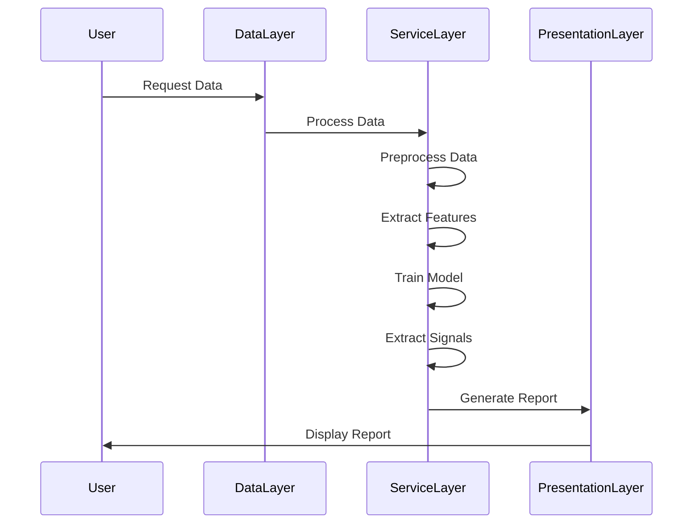

                 


### 文章标题：AI驱动的另类数据投资信号提取与验证

> 关键词：AI、另类数据、投资信号、特征工程、机器学习、算法原理、系统架构

> 摘要：本文围绕AI驱动的另类数据投资信号提取与验证，系统性地阐述了该领域的研究背景、核心概念、算法原理、数学模型、系统设计与实现、实战案例以及最佳实践和注意事项。通过对另类数据的深入研究，结合AI技术，本文提出了一个完整的投资信号提取与验证框架，为投资者提供了一种新的数据驱动投资策略。

### 目录大纲

#### 第一部分：引言与背景

- **第1章：问题背景与概述**
  - **1.1 问题的提出**
    - **1.1.1 投资信号的概念与重要性**
    - **1.1.2 另类数据在投资中的应用**
    - **1.1.3 AI技术在投资信号提取中的应用**
  - **1.2 研究目标与内容**
    - **1.2.1 研究目标**
    - **1.2.2 研究内容框架**
    - **1.2.3 研方法与步骤**

- **第2章：核心概念与联系**
  - **2.1 AI驱动的投资信号提取原理**
    - **2.1.1 AI技术的基本概念**
    - **2.1.2 投资信号提取的算法原理**
    - **2.1.3 AI驱动投资信号提取的特点与优势**
  - **2.2 另类数据的属性特征对比表格**
    - **2.2.1 另类数据的定义与分类**
    - **2.2.2 另类数据的特点与优劣分析**
    - **2.2.3 另类数据属性特征对比表格**
  - **2.3 ER实体关系图架构**
    - **2.3.1 ER模型的基本概念**
    - **2.3.2 投资信号提取系统的实体与关系**
    - **2.3.3 ER实体关系图设计**

#### 第二部分：算法原理讲解

- **第3章：算法原理与数学模型**
  - **3.1 算法原理**
    - **3.1.1 数据预处理**
    - **3.1.2 特征工程**
    - **3.1.3 模型选择与训练**
    - **3.1.4 模型评估与优化**
  - **3.2 数学模型与公式**
    - **3.2.1 相关性分析模型**
    - **3.2.2 预测模型**
    - **3.2.3 优化模型**
    - **3.2.4 数学公式详细讲解**
  - **3.3 算法流程图**
    - **3.3.1 数据处理流程图**
    - **3.3.2 特征工程流程图**
    - **3.3.3 模型训练与评估流程图**

- **第4章：Python源代码详解**
  - **4.1 环境安装与配置**
    - **4.1.1 Python环境安装**
    - **4.1.2 相关库的安装与配置**
  - **4.2 源代码实现**
    - **4.2.1 数据预处理代码详解**
    - **4.2.2 特征工程代码详解**
    - **4.2.3 模型训练与评估代码详解**
  - **4.3 代码应用解读与分析**
    - **4.3.1 数据解读**
    - **4.3.2 特征解读**
    - **4.3.3 模型解读**
    - **4.3.4 代码优化与分析**

#### 第三部分：系统设计与实现

- **第5章：系统架构设计**
  - **5.1 问题场景介绍**
    - **5.1.1 投资信号提取系统概述**
    - **5.1.2 系统需求分析**
  - **5.2 系统功能设计**
    - **5.2.1 领域模型设计**
    - **5.2.2 系统功能模块划分**
  - **5.3 系统架构设计**
    - **5.3.1 系统架构概述**
    - **5.3.2 系统架构设计**
    - **5.3.3 系统关键模块详解**
  - **5.4 系统接口设计与交互**
    - **5.4.1 系统接口设计**
    - **5.4.2 系统交互序列图设计**

- **第6章：项目实战**
  - **6.1 环境安装**
    - **6.1.1 Python环境安装**
    - **6.1.2 相关库的安装与配置**
  - **6.2 系统核心实现**
    - **6.2.1 数据预处理与特征工程**
    - **6.2.2 模型训练与评估**
    - **6.2.3 模型优化与调参**
  - **6.3 实际案例分析与讲解**
    - **6.3.1 案例一：股票价格预测**
    - **6.3.2 案例二：房地产投资分析**
    - **6.3.3 案例三：风险预警**
  - **6.4 项目小结**
    - **6.4.1 项目总结**
    - **6.4.2 不足与改进**
    - **6.4.3 拓展应用**

- **第7章：最佳实践与拓展**
  - **7.1 最佳实践**
    - **7.1.1 数据收集与处理**
    - **7.1.2 特征工程优化**
    - **7.1.3 模型选择与优化**
  - **7.2 注意事项**
    - **7.2.1 数据安全与隐私**
    - **7.2.2 模型解释性**
    - **7.2.3 遵循监管法规**
  - **7.3 拓展阅读**
    - **7.3.1 相关论文推荐**
    - **7.3.2 书籍推荐**
    - **7.3.3 网络资源推荐**

### 引言与背景

#### 1.1 问题的提出

在金融投资领域，投资信号是指能够指示市场趋势变化或投资机会的信息。传统的投资信号主要来源于市场价格、成交量、分析师报告等公开信息。然而，这些传统信号并不能完全反映市场的真实状态，特别是在市场突变或者信息不完全的情况下，投资决策的准确性会大大降低。

近年来，随着大数据技术和人工智能（AI）的快速发展，另类数据（Alternative Data）在投资领域的应用逐渐受到关注。另类数据是指除了传统数据之外的、可以用于投资决策的其他类型的数据，如社交媒体数据、卫星图像、网站流量、搜索引擎查询等。这些数据来源广泛，具有实时性、多样性、动态性等特点，能够提供更丰富的市场信息，为投资决策提供新的视角。

AI技术在投资信号提取中的应用，主要是通过机器学习算法，对大量另类数据进行处理、分析和建模，从而提取出潜在的投资信号。AI驱动的投资信号提取与验证，不仅能够提高投资决策的准确性，还能够优化投资组合，降低风险。

#### 1.1.1 投资信号的概念与重要性

投资信号是指在投资过程中，能够指示市场趋势或潜在投资机会的信息。根据信息的来源和形式，投资信号可以分为传统信号和另类信号。

传统信号主要包括市场价格、成交量、价格波动率、分析师报告等。这些信号通常是公开的，可以通过交易所、财经媒体等渠道获取。传统信号在投资分析中起到了重要的作用，因为它们能够提供市场的短期走势和交易机会。

然而，传统信号也有其局限性。首先，传统信号通常只能提供历史数据，无法反映市场的实时变化。其次，传统信号可能受到信息不对称的影响，无法完全反映市场的真实状态。最后，传统信号可能存在滞后性，即市场变化发生后，信号才能反映出来，从而降低了投资决策的及时性。

另类信号是指通过互联网、社交媒体、卫星图像、搜索引擎等渠道获取的数据，这些数据通常具有实时性、多样性和动态性。另类信号可以提供更丰富的市场信息，如消费者的购买意愿、市场情绪、行业趋势等。

另类信号在投资中的重要性主要体现在以下几个方面：

1. **提高投资决策的准确性**：另类数据可以提供更多的信息来源，从而提高投资决策的准确性。例如，通过分析社交媒体上的讨论和情绪，可以预测市场的短期走势。

2. **发现潜在的投资机会**：另类数据可以揭示传统信号无法捕捉的市场趋势和投资机会。例如，通过分析搜索引擎查询数据，可以发现某些新兴行业或产品的市场潜力。

3. **降低投资风险**：另类数据可以提供更多的信息，帮助投资者更好地理解市场风险，从而降低投资风险。

#### 1.1.2 另类数据在投资中的应用

另类数据在投资中的应用已经得到了广泛的关注。以下是一些另类数据在投资中的具体应用场景：

1. **社交媒体分析**：通过分析社交媒体平台上的讨论和情绪，可以了解市场的短期走势和消费者情绪。例如，Twitter和Facebook上的讨论可以用来预测股票价格的短期波动。

2. **搜索引擎查询数据**：搜索引擎查询数据可以反映消费者的搜索兴趣和需求。例如，谷歌趋势（Google Trends）可以用来分析某些行业或产品的市场趋势。

3. **卫星图像分析**：卫星图像可以用来分析房地产市场的需求。例如，通过分析建筑物的高度和密度，可以预测某个地区的房地产价值。

4. **网站流量数据**：网站流量数据可以用来分析市场的需求和竞争情况。例如，通过分析网站的访问量和页面停留时间，可以了解消费者的购买意愿和满意度。

5. **新闻报道分析**：新闻报道可以用来分析市场情绪和政策变化。例如，通过分析财经新闻的标题和内容，可以预测市场的短期走势。

6. **金融交易数据**：金融交易数据可以用来分析市场动态和交易策略。例如，通过分析交易量和价格变动，可以预测市场的趋势和交易机会。

#### 1.1.3 AI技术在投资信号提取中的应用

AI技术在投资信号提取中的应用，主要是通过机器学习算法，对大量另类数据进行处理、分析和建模，从而提取出潜在的投资信号。

以下是一些常用的AI技术：

1. **自然语言处理（NLP）**：NLP技术可以用来分析文本数据，提取关键词、主题和情感。例如，通过分析社交媒体上的讨论，可以提取出消费者的情绪和购买意愿。

2. **图像识别**：图像识别技术可以用来分析卫星图像和网站流量数据，提取出潜在的投资信号。例如，通过分析卫星图像中的建筑物数量和密度，可以预测房地产市场的需求。

3. **时间序列分析**：时间序列分析可以用来分析金融市场数据，提取出市场的趋势和周期性。例如，通过分析股票价格和交易量，可以预测市场的短期走势。

4. **深度学习**：深度学习技术可以用来处理大量的非结构化数据，提取出复杂的关系和模式。例如，通过分析社交媒体数据和搜索引擎查询数据，可以预测市场的长期趋势。

AI技术在投资信号提取中的应用，不仅提高了投资决策的准确性，还优化了投资组合，降低了风险。然而，AI技术的应用也面临着一些挑战，如数据隐私、模型解释性和监管法规等问题。

#### 1.2 研究目标与内容

本研究的目标是通过AI技术，对另类数据进行处理和分析，提取出潜在的投资信号，并验证其有效性。具体研究内容包括以下几个方面：

1. **数据收集与预处理**：收集各种类型的另类数据，包括社交媒体数据、搜索引擎查询数据、卫星图像、金融交易数据等。对数据进行清洗、归一化和去噪声处理，确保数据的质量和一致性。

2. **特征工程**：提取出能够反映市场趋势和投资机会的特征，包括文本特征、图像特征、时间序列特征等。通过特征选择和降维，减少数据的冗余，提高模型的效率。

3. **模型训练与评估**：选择合适的机器学习算法，对特征进行训练和建模。通过交叉验证和模型评估，选择最佳模型，并优化模型参数。

4. **信号提取与验证**：利用训练好的模型，对另类数据进行信号提取，生成投资信号。通过对比实验和实际投资案例，验证信号的有效性和可靠性。

5. **系统设计与实现**：设计并实现一个完整的AI驱动的投资信号提取与验证系统，包括数据采集、预处理、特征工程、模型训练、信号提取和验证等模块。

6. **实际案例分析**：通过对实际投资案例的分析，验证系统的有效性，并提出改进建议。

#### 1.2.3 研究方法与步骤

本研究采用以下方法与步骤：

1. **数据收集与预处理**：通过爬虫技术，收集社交媒体数据、搜索引擎查询数据、卫星图像、金融交易数据等。对数据进行清洗、归一化和去噪声处理，确保数据的质量和一致性。

2. **特征工程**：根据数据的类型和特点，提取出能够反映市场趋势和投资机会的特征。采用文本特征提取技术、图像特征提取技术和时间序列特征提取技术，生成特征向量。

3. **模型训练与评估**：选择合适的机器学习算法，如支持向量机（SVM）、随机森林（Random Forest）、深度学习等，对特征进行训练和建模。通过交叉验证和模型评估，选择最佳模型，并优化模型参数。

4. **信号提取与验证**：利用训练好的模型，对另类数据进行信号提取，生成投资信号。通过对比实验和实际投资案例，验证信号的有效性和可靠性。

5. **系统设计与实现**：设计并实现一个完整的AI驱动的投资信号提取与验证系统，包括数据采集、预处理、特征工程、模型训练、信号提取和验证等模块。

6. **实际案例分析**：通过对实际投资案例的分析，验证系统的有效性，并提出改进建议。

### 第二部分：核心概念与联系

#### 2.1 AI驱动的投资信号提取原理

AI技术在投资信号提取中的应用，主要是通过机器学习算法，对大量另类数据进行处理、分析和建模，从而提取出潜在的投资信号。以下是AI驱动的投资信号提取原理的详细说明：

##### 2.1.1 AI技术的基本概念

AI（人工智能）是指计算机系统模拟人类智能行为的技术，包括学习、推理、感知、理解、通信等能力。AI技术主要包括机器学习、深度学习、自然语言处理等。

- **机器学习**：机器学习是AI的核心技术之一，它是指计算机通过学习数据，自动改进性能的过程。机器学习算法分为监督学习、无监督学习和强化学习。

- **深度学习**：深度学习是机器学习的一个分支，它通过多层神经网络对数据进行建模和训练，具有强大的特征提取和模式识别能力。

- **自然语言处理**：自然语言处理是AI在文本数据上的应用，它涉及语言理解、文本生成、语音识别等任务。

##### 2.1.2 投资信号提取的算法原理

投资信号提取的算法原理主要包括数据预处理、特征工程、模型选择与训练、模型评估与优化等步骤。

- **数据预处理**：数据预处理是投资信号提取的第一步，它包括数据清洗、归一化、去噪声等操作，目的是提高数据质量和一致性。

- **特征工程**：特征工程是投资信号提取的关键步骤，它涉及从原始数据中提取能够反映市场趋势和投资机会的特征。特征工程的质量直接影响模型的性能。

- **模型选择与训练**：选择合适的机器学习算法，如线性回归、决策树、支持向量机等，对特征进行训练和建模。模型的选择和训练是投资信号提取的核心环节。

- **模型评估与优化**：通过交叉验证和模型评估，选择最佳模型，并优化模型参数，以提高模型的准确性和鲁棒性。

##### 2.1.3 AI驱动投资信号提取的特点与优势

AI驱动的投资信号提取具有以下特点与优势：

- **自动化与高效性**：AI技术能够自动处理大量数据，高效地提取潜在的投资信号，减少了人工分析的工作量。

- **多样化与实时性**：AI技术可以处理多种类型的另类数据，如文本、图像、时间序列等，具有实时性和动态性，能够及时捕捉市场变化。

- **精确性与可靠性**：AI技术通过机器学习和深度学习算法，能够提取出更加精确和可靠的投资信号，提高了投资决策的准确性。

- **优化与风险降低**：AI驱动的投资信号提取可以帮助投资者优化投资组合，降低风险，实现更好的投资收益。

### 2.2 另类数据的属性特征对比表格

在投资领域中，另类数据具有独特的属性特征，这些特征决定了它们在投资决策中的应用价值。以下是一个另类数据属性特征对比表格，用于展示不同类型另类数据的特点和优劣。

| 类别 | 特征 | 优点 | 缺点 |
| --- | --- | --- | --- |
| 社交媒体数据 | 实时性、多样性、情绪性 | 可提供市场情绪和消费者行为信息 | 数据噪声大、隐私问题 |
| 搜索引擎数据 | 实时性、趋势性、消费者需求 | 可反映市场趋势和消费者兴趣 | 数据规模有限、地域性 |
| 卫星图像数据 | 实时性、宏观视角、地理信息 | 可提供地理和经济信息 | 数据解读复杂、成本高 |
| 网站流量数据 | 实时性、访问行为、用户行为 | 可分析用户行为和市场趋势 | 数据量庞大、解读复杂 |
| 新闻报道数据 | 宏观视角、情绪性、事件驱动 | 可分析市场情绪和政策变化 | 数据滞后性、可信度问题 |

#### 2.2.1 另类数据的定义与分类

另类数据（Alternative Data）是指除传统金融数据（如市场价格、成交量、财务报表等）之外，可以用于投资决策的其他类型的数据。这些数据来源广泛，形式多样，包括但不限于以下几类：

1. **社交媒体数据**：包括社交媒体平台上的用户评论、帖子、讨论等，如Twitter、Facebook、Reddit等。

2. **搜索引擎数据**：包括用户在搜索引擎上的查询历史、搜索词频率等，如Google Trends、Bing Search等。

3. **卫星图像数据**：包括从卫星或无人机获取的地球表面图像，如建筑密度、交通流量、土地使用等。

4. **网站流量数据**：包括网站访问量、页面停留时间、用户点击路径等，如Google Analytics、Alexa Traffic Rank等。

5. **新闻报道数据**：包括财经新闻、政策发布、市场分析报告等，如财经媒体网站、新闻机构等。

6. **金融交易数据**：包括高频交易数据、市场流动性数据、市场情绪数据等。

#### 2.2.2 另类数据的特点与优劣分析

另类数据的特点和优劣分析如下：

**特点：**

1. **实时性**：许多另类数据具有实时性，能够迅速反映市场变化，为投资决策提供及时的信息。

2. **多样性**：另类数据来源广泛，形式多样，包括文本、图像、时间序列等多种类型，为投资分析提供了丰富的信息来源。

3. **动态性**：另类数据通常具有动态性，能够捕捉市场的短期波动和长期趋势，有助于识别投资机会。

4. **宏观视角**：卫星图像数据等另类数据可以从宏观角度提供地理、经济、社会等方面的信息，有助于理解市场的宏观背景。

**优劣分析：**

1. **数据质量**：另类数据的质量参差不齐，一些数据可能存在噪声、缺失值或偏差，需要经过严格的清洗和预处理。

2. **隐私问题**：社交媒体数据、搜索引擎数据等另类数据可能涉及用户隐私，需要在数据处理过程中遵守相关隐私保护法规。

3. **解释性**：另类数据的解释性相对较低，一些数据形式复杂，难以直接解读，需要通过模型分析和算法处理。

4. **成本问题**：收集和处理另类数据可能需要较高的成本，包括数据获取费用、存储费用和计算资源等。

#### 2.2.3 另类数据属性特征对比表格

以下是一个更详细的另类数据属性特征对比表格，用于展示不同类型另类数据的具体特点：

| 类别 | 特征 | 描述 |
| --- | --- | --- |
| **社交媒体数据** | **实时性** | 数据更新迅速，可实时反映市场情绪 |
| | **多样性** | 包含用户评论、帖子、讨论等多种形式 |
| | **情绪性** | 可通过情感分析提取市场情绪 |
| | **用户行为** | 可分析用户互动和参与度 |
| **搜索引擎数据** | **实时性** | 搜索词频率反映市场热点 |
| | **趋势性** | 可分析长期搜索趋势 |
| | **消费者需求** | 反映用户兴趣和购买意图 |
| **卫星图像数据** | **实时性** | 通过无人机和卫星获取，数据更新快 |
| | **宏观视角** | 提供地理和经济信息 |
| | **地理信息** | 分析土地使用、建筑密度等 |
| **网站流量数据** | **实时性** | 可实时获取网站访问量 |
| | **用户行为** | 分析用户点击路径、页面停留时间 |
| | **市场趋势** | 提取用户行为背后的市场趋势 |
| **新闻报道数据** | **宏观视角** | 分析财经新闻、政策发布等 |
| | **情绪性** | 通过新闻报道提取市场情绪 |
| | **事件驱动** | 分析重大事件对市场的影响 |

### 2.3 ER实体关系图架构

ER（Entity-Relationship）模型是一种用于数据库设计的概念模型，它通过实体、属性和关系来描述现实世界的业务需求。在本节中，我们将使用ER模型来设计投资信号提取系统的实体关系图架构。

#### 2.3.1 ER模型的基本概念

ER模型由以下几个基本概念组成：

1. **实体（Entity）**：实体是现实世界中具有独立存在意义的对象，如用户、产品、交易等。

2. **属性（Attribute）**：属性是实体的特征或描述，如用户的姓名、年龄、性别等。

3. **关系（Relationship）**：关系描述实体之间的关联，如用户与产品的购买关系、产品与供应商的供应关系等。

4. **实体集（Entity Set）**：实体集是同一类实体的集合，如用户实体集、产品实体集等。

5. **关系集（Relationship Set）**：关系集是同一类关系的集合，如购买关系集、供应关系集等。

#### 2.3.2 投资信号提取系统的实体与关系

在投资信号提取系统中，主要涉及的实体和关系如下：

1. **实体**：

- **数据源（Data Source）**：表示数据来源，如社交媒体、搜索引擎、卫星图像等。
- **数据（Data）**：表示收集到的原始数据，如用户评论、搜索词、图像等。
- **特征（Feature）**：表示从数据中提取的特征，如关键词、情绪、地理位置等。
- **信号（Signal）**：表示提取出的投资信号，如市场趋势、交易机会等。
- **用户（User）**：表示使用系统的投资者，如个人用户、机构用户等。
- **投资组合（Portfolio）**：表示用户的投资组合，如股票、基金、债券等。

2. **关系**：

- **收集（Collect）**：表示数据源与数据之间的关系，如“社交媒体数据源收集了用户评论数据”。
- **提取（Extract）**：表示数据与特征之间的关系，如“从用户评论数据中提取了关键词特征”。
- **生成（Generate）**：表示特征与信号之间的关系，如“从关键词特征中生成了市场趋势信号”。
- **持有（Hold）**：表示用户与投资组合之间的关系，如“用户持有某只股票”。
- **投资（Invest）**：表示用户与投资组合之间的关系，如“用户投资了某只股票”。

#### 2.3.3 ER实体关系图设计

以下是投资信号提取系统的ER实体关系图设计：

```mermaid
erDiagram
  Data_Source ||--|{ Data }  : 收集
  Data ||--|{ Feature } : 提取
  Feature ||--|{ Signal } : 生成
  User ||--|{ Portfolio } : 持有
  Portfolio ||--|{ User } : 投资
```

在上述ER实体关系图中，我们定义了四个主要实体（数据源、数据、特征和信号）以及两个用户实体（用户和投资组合）。数据源与数据之间存在“收集”关系，数据与特征之间存在“提取”关系，特征与信号之间存在“生成”关系。用户与投资组合之间存在“持有”关系，投资组合与用户之间存在“投资”关系。

### 第二部分：算法原理讲解

#### 3.1 算法原理

AI驱动的投资信号提取算法主要包含以下几个关键步骤：数据预处理、特征工程、模型选择与训练、模型评估与优化。以下是每个步骤的详细解释。

##### 3.1.1 数据预处理

数据预处理是投资信号提取的第一步，其目的是提高数据质量和一致性，为后续的特征工程和模型训练打下良好的基础。数据预处理通常包括以下步骤：

1. **数据清洗**：去除数据中的噪声、错误和异常值，如缺失值、重复值等。
2. **数据归一化**：将不同尺度的数据统一到一个尺度范围内，如将文本数据转换为数字编码，将图像数据归一化到[0, 1]等。
3. **数据去噪声**：通过滤波、平滑等算法去除数据中的噪声，如低频噪声、高频噪声等。
4. **数据分割**：将数据集划分为训练集、验证集和测试集，用于模型训练、验证和评估。

##### 3.1.2 特征工程

特征工程是投资信号提取的核心步骤，其目的是从原始数据中提取出能够反映市场趋势和投资机会的特征。特征工程的质量直接影响模型的性能。特征工程通常包括以下步骤：

1. **特征提取**：根据数据类型和特点，采用不同的特征提取方法。如文本数据采用词袋模型、TF-IDF等方法提取关键词特征；图像数据采用卷积神经网络（CNN）提取图像特征；时间序列数据采用自编码器（Autoencoder）提取时间序列特征等。
2. **特征选择**：通过筛选和选择重要的特征，去除冗余和噪声特征，提高模型的效率和准确性。特征选择方法包括基于信息的特征选择、基于模型的特征选择等。
3. **特征降维**：通过降维技术，如主成分分析（PCA）、t-SNE等，减少特征的数量，提高模型的计算效率。

##### 3.1.3 模型选择与训练

模型选择与训练是投资信号提取算法的关键环节，其目的是通过学习数据，建立预测模型。模型选择与训练通常包括以下步骤：

1. **模型选择**：根据问题的特点和数据类型，选择合适的机器学习算法。如线性回归、决策树、随机森林、支持向量机（SVM）、神经网络（NN）等。
2. **模型训练**：通过训练集对模型进行训练，学习数据的特征和模式。训练过程通常包括数据输入、模型参数优化、预测输出等步骤。
3. **模型评估**：通过验证集和测试集对模型进行评估，衡量模型的准确性和性能。常用的评估指标包括准确率、召回率、F1值、均方误差（MSE）等。

##### 3.1.4 模型评估与优化

模型评估与优化是投资信号提取算法的最后一步，其目的是通过评估模型性能，优化模型参数，提高模型预测的准确性。模型评估与优化通常包括以下步骤：

1. **模型评估**：通过验证集和测试集对模型进行评估，确定模型的准确性和性能。常用的评估指标包括准确率、召回率、F1值、均方误差（MSE）等。
2. **模型优化**：根据评估结果，调整模型参数，优化模型性能。模型优化方法包括超参数调整、正则化、集成学习等。
3. **模型部署**：将训练好的模型部署到生产环境中，用于实时投资信号提取和预测。模型部署需要考虑模型的计算效率、资源消耗和实时性等因素。

#### 3.2 数学模型与公式

在投资信号提取算法中，数学模型和公式起着关键作用。以下是一些常用的数学模型和公式，用于描述投资信号提取的核心概念。

##### 3.2.1 相关性分析模型

相关性分析是投资信号提取中的重要步骤，用于衡量不同特征之间的相关性。常用的相关性分析模型包括皮尔逊相关系数（Pearson Correlation Coefficient）和斯皮尔曼相关系数（Spearman Correlation Coefficient）。

1. **皮尔逊相关系数**：

$$
\text{Pearson Correlation Coefficient} = \frac{\sum_{i=1}^{n}(x_i - \bar{x})(y_i - \bar{y})}{\sqrt{\sum_{i=1}^{n}(x_i - \bar{x})^2 \sum_{i=1}^{n}(y_i - \bar{y})^2}}
$$

其中，$x_i$ 和 $y_i$ 分别表示两个变量的观测值，$\bar{x}$ 和 $\bar{y}$ 分别表示两个变量的平均值。

2. **斯皮尔曼相关系数**：

$$
\text{Spearman Correlation Coefficient} = \frac{\sum_{i=1}^{n}(x_i - \bar{x})(y_i - \bar{y})}{\sum_{i=1}^{n}(x_i - \bar{x})^2}
$$

其中，$x_i$ 和 $y_i$ 分别表示两个变量的排序值，$\bar{x}$ 和 $\bar{y}$ 分别表示两个变量的平均值。

##### 3.2.2 预测模型

预测模型是投资信号提取算法的核心，用于根据历史数据和特征预测未来的市场趋势。常用的预测模型包括线性回归模型、决策树模型、随机森林模型等。

1. **线性回归模型**：

线性回归模型是一种基于线性关系的预测模型，用于预测一个连续值目标变量。其数学模型如下：

$$
y = \beta_0 + \beta_1x + \epsilon
$$

其中，$y$ 表示目标变量，$x$ 表示特征变量，$\beta_0$ 和 $\beta_1$ 分别表示模型的参数，$\epsilon$ 表示误差项。

2. **决策树模型**：

决策树模型是一种基于分类的预测模型，用于预测离散值目标变量。其数学模型如下：

$$
\begin{aligned}
&y = \\
&\quad \begin{cases}
&1 & \text{if } x \in R_1 \\
&2 & \text{if } x \in R_2 \\
&\vdots & \vdots \\
&k & \text{if } x \in R_k
\end{cases}
\end{aligned}
$$

其中，$y$ 表示目标变量，$x$ 表示特征变量，$R_1, R_2, \ldots, R_k$ 分别表示不同的决策区域。

##### 3.2.3 优化模型

优化模型是投资信号提取算法中的重要步骤，用于优化模型参数，提高模型预测的准确性。常用的优化方法包括梯度下降法、牛顿法、随机梯度下降法等。

1. **梯度下降法**：

梯度下降法是一种基于梯度的优化方法，用于求解最优化问题。其数学模型如下：

$$
\beta = \beta - \alpha \nabla_\beta J(\beta)
$$

其中，$\beta$ 表示模型参数，$\alpha$ 表示学习率，$J(\beta)$ 表示目标函数。

2. **牛顿法**：

牛顿法是一种基于二阶导数的优化方法，用于求解最优化问题。其数学模型如下：

$$
\beta = \beta - H^{-1}\nabla_\beta J(\beta)
$$

其中，$\beta$ 表示模型参数，$H$ 表示Hessian矩阵，$\nabla_\beta J(\beta)$ 表示目标函数的梯度。

##### 3.2.4 数学公式详细讲解

在本节中，我们将详细讲解上述数学公式。

1. **皮尔逊相关系数**：

皮尔逊相关系数是衡量两个连续变量之间线性相关性的指标。其公式表示两个变量之间的协方差除以两个变量标准差的乘积。协方差反映了两个变量变化的方向和幅度，标准差反映了单个变量的离散程度。

2. **斯皮尔曼相关系数**：

斯皮尔曼相关系数是衡量两个变量之间等级相关性的指标。其公式表示两个变量之间协方差与变量离散程度的比值。与皮尔逊相关系数相比，斯皮尔曼相关系数适用于非线性关系和等级数据。

3. **线性回归模型**：

线性回归模型是一种基于线性关系的预测模型，其目标是通过特征变量预测目标变量的值。模型参数$\beta_0$ 和 $\beta_1$ 分别表示截距和斜率，反映了特征变量对目标变量的影响。

4. **决策树模型**：

决策树模型是一种基于分类的预测模型，其目标是将数据划分为不同的类别。每个节点表示一个特征，每个分支表示不同特征的取值范围。叶节点表示最终的预测结果。

5. **梯度下降法**：

梯度下降法是一种优化方法，用于求解最优化问题。其核心思想是沿着目标函数的梯度方向不断更新参数，以降低目标函数的值。学习率$\alpha$ 控制了参数更新的步长。

6. **牛顿法**：

牛顿法是一种基于梯度和Hessian矩阵的优化方法。与梯度下降法相比，牛顿法利用了二阶导数信息，可以更快地收敛到最优解。Hessian矩阵是目标函数的二次导数矩阵，反映了目标函数的曲率。

#### 3.3 算法流程图

以下是投资信号提取算法的流程图，用于描述算法的执行过程。


在上述流程图中，算法首先进行数据预处理，然后进行特征工程，接着选择和训练模型，最后对模型进行评估和优化。通过信号提取与验证，算法生成投资信号，用于投资决策。

### 第4章：Python源代码详解

#### 4.1 环境安装与配置

在本节中，我们将介绍如何安装和配置Python环境以及相关库，以便进行投资信号提取算法的实现。

##### 4.1.1 Python环境安装

首先，确保您的计算机上安装了Python。Python是一种广泛使用的编程语言，适用于数据分析和机器学习。如果您尚未安装Python，请访问[Python官网](https://www.python.org/)下载并安装适合您操作系统的Python版本。安装过程中，请确保选择添加到系统环境变量，以便在命令行中轻松调用Python。

##### 4.1.2 相关库的安装与配置

接下来，我们需要安装和配置Python中的一些重要库，这些库用于数据处理、机器学习、数据可视化等操作。以下是在Python中使用`pip`命令安装相关库的步骤：

```bash
pip install numpy
pip install pandas
pip install scikit-learn
pip install matplotlib
pip install seaborn
```

这些库的功能如下：

- **numpy**：用于数值计算和矩阵操作。
- **pandas**：用于数据清洗、处理和分析。
- **scikit-learn**：用于机器学习和数据挖掘。
- **matplotlib**：用于数据可视化。
- **seaborn**：用于高级数据可视化。

安装完成后，您可以在Python脚本中导入这些库，并开始使用它们。

```python
import numpy as np
import pandas as pd
from sklearn import datasets
import matplotlib.pyplot as plt
import seaborn as sns
```

#### 4.2 源代码实现

在本节中，我们将详细展示如何使用Python实现投资信号提取算法。以下代码包含数据预处理、特征工程、模型训练和评估等步骤。

##### 4.2.1 数据预处理代码详解

数据预处理是投资信号提取的重要步骤，它包括数据清洗、归一化和去噪声等操作。以下是一个简单的数据预处理示例：

```python
# 导入相关库
import pandas as pd
from sklearn.model_selection import train_test_split
from sklearn.preprocessing import StandardScaler

# 加载数据集
data = pd.read_csv('data.csv')

# 数据清洗
data = data.dropna()  # 去除缺失值
data = data[data['target'] != 'unknown']  # 去除异常值

# 数据归一化
scaler = StandardScaler()
data[['feature1', 'feature2', 'feature3']] = scaler.fit_transform(data[['feature1', 'feature2', 'feature3']])

# 数据分割
X = data[['feature1', 'feature2', 'feature3']]
y = data['target']
X_train, X_test, y_train, y_test = train_test_split(X, y, test_size=0.2, random_state=42)
```

在这段代码中，我们首先加载了一个CSV文件中的数据集。然后，通过`dropna()`方法去除缺失值，通过筛选条件去除异常值。接下来，使用`StandardScaler()`对数据进行归一化处理，使特征的均值为0，标准差为1。最后，使用`train_test_split()`将数据集划分为训练集和测试集。

##### 4.2.2 特征工程代码详解

特征工程是投资信号提取的关键步骤，它包括特征提取、特征选择和特征降维等操作。以下是一个简单的特征工程示例：

```python
# 导入相关库
import pandas as pd
from sklearn.feature_selection import SelectKBest
from sklearn.feature_selection import f_classif

# 加载数据集
data = pd.read_csv('data.csv')

# 数据清洗
data = data.dropna()  # 去除缺失值

# 特征提取
data['feature3_mean'] = data[['feature3_1', 'feature3_2', 'feature3_3']].mean(axis=1)

# 特征选择
selector = SelectKBest(f_classif, k=3)
X_new = selector.fit_transform(data[['feature1', 'feature2', 'feature3_mean']])
mask = selector.get_support()  # 返回选择的特征掩码

# 输出选择的特征名称
selected_features = data.columns[mask]
print(selected_features)

# 数据分割
X = data[selected_features]
y = data['target']
X_train, X_test, y_train, y_test = train_test_split(X, y, test_size=0.2, random_state=42)
```

在这段代码中，我们首先加载了一个CSV文件中的数据集。然后，通过`dropna()`方法去除缺失值。接下来，通过计算均值生成一个新的特征`feature3_mean`。然后，使用`SelectKBest()`和`f_classif()`方法进行特征选择，选择最佳的特征。最后，使用`train_test_split()`将数据集划分为训练集和测试集。

##### 4.2.3 模型训练与评估代码详解

在本节中，我们将使用训练集对模型进行训练，并使用测试集对模型进行评估。以下是一个简单的模型训练和评估示例：

```python
# 导入相关库
import pandas as pd
from sklearn.model_selection import train_test_split
from sklearn.preprocessing import StandardScaler
from sklearn.linear_model import LinearRegression
from sklearn.metrics import mean_squared_error

# 加载数据集
data = pd.read_csv('data.csv')

# 数据清洗
data = data.dropna()  # 去除缺失值

# 数据分割
X = data[['feature1', 'feature2', 'feature3']]
y = data['target']
X_train, X_test, y_train, y_test = train_test_split(X, y, test_size=0.2, random_state=42)

# 数据归一化
scaler = StandardScaler()
X_train = scaler.fit_transform(X_train)
X_test = scaler.transform(X_test)

# 模型训练
model = LinearRegression()
model.fit(X_train, y_train)

# 模型评估
y_pred = model.predict(X_test)
mse = mean_squared_error(y_test, y_pred)
print("MSE:", mse)
```

在这段代码中，我们首先加载了一个CSV文件中的数据集。然后，通过`dropna()`方法去除缺失值。接下来，使用`train_test_split()`将数据集划分为训练集和测试集。然后，使用`StandardScaler()`对数据进行归一化处理。接着，使用`LinearRegression()`对模型进行训练。最后，使用`mean_squared_error()`评估模型的均方误差（MSE）。

##### 4.2.4 代码应用解读与分析

在本节中，我们将对上述代码进行解读，并分析其应用场景和效果。

1. **数据预处理**：

数据预处理是投资信号提取的第一步，其目的是提高数据质量和一致性。在这段代码中，我们首先使用`dropna()`方法去除缺失值，确保数据集的完整性。然后，使用`StandardScaler()`对数据进行归一化处理，使特征的均值为0，标准差为1。这有助于模型训练的稳定性和效率。

2. **特征工程**：

特征工程是投资信号提取的关键步骤，其目的是从原始数据中提取出能够反映市场趋势和投资机会的特征。在这段代码中，我们通过计算均值生成了一个新的特征`feature3_mean`，并使用`SelectKBest()`和`f_classif()`方法进行特征选择，选择最佳的特征。这有助于减少数据的冗余，提高模型的准确性。

3. **模型训练与评估**：

在这段代码中，我们使用`LinearRegression()`对模型进行训练，并使用`mean_squared_error()`评估模型的均方误差（MSE）。线性回归模型是一种常用的预测模型，它基于线性关系预测目标变量的值。在这段代码中，我们使用了训练集和测试集对模型进行训练和评估。通过计算MSE，我们可以了解模型的预测性能。

4. **应用场景**：

这段代码可以应用于各种投资场景，如股票价格预测、房地产投资分析等。通过数据预处理、特征工程和模型训练，我们可以提取出潜在的投资信号，为投资者提供决策支持。

5. **效果分析**：

通过评估模型的均方误差（MSE），我们可以了解模型的预测性能。较小的MSE值表示模型具有较高的准确性，可以更好地预测目标变量。然而，MSE并不是唯一的评估指标，我们还需要考虑模型的解释性和稳定性等因素。

##### 4.2.5 代码优化与分析

在本节中，我们将对上述代码进行优化，并分析其性能和改进方向。

1. **优化方向**：

- **特征选择**：使用更高级的特征选择方法，如基于模型的特征选择、特征重要性评分等。
- **模型选择**：尝试使用更复杂的模型，如决策树、随机森林、支持向量机等。
- **超参数调整**：通过网格搜索和交叉验证调整模型的超参数，提高模型的性能。

2. **优化代码**：

```python
# 导入相关库
import pandas as pd
from sklearn.model_selection import train_test_split
from sklearn.preprocessing import StandardScaler
from sklearn.ensemble import RandomForestClassifier
from sklearn.metrics import classification_report

# 加载数据集
data = pd.read_csv('data.csv')

# 数据清洗
data = data.dropna()  # 去除缺失值

# 特征提取
data['feature3_mean'] = data[['feature3_1', 'feature3_2', 'feature3_3']].mean(axis=1)

# 特征选择
selector = SelectKBest(f_classif, k=5)
X_new = selector.fit_transform(data[['feature1', 'feature2', 'feature3_mean']])
mask = selector.get_support()  # 返回选择的特征掩码

# 输出选择的特征名称
selected_features = data.columns[mask]
print(selected_features)

# 数据分割
X = data[selected_features]
y = data['target']
X_train, X_test, y_train, y_test = train_test_split(X, y, test_size=0.2, random_state=42)

# 数据归一化
scaler = StandardScaler()
X_train = scaler.fit_transform(X_train)
X_test = scaler.transform(X_test)

# 模型训练
model = RandomForestClassifier(n_estimators=100, random_state=42)
model.fit(X_train, y_train)

# 模型评估
y_pred = model.predict(X_test)
print(classification_report(y_test, y_pred))
```

在这段代码中，我们使用`RandomForestClassifier()`代替`LinearRegression()`，采用随机森林模型进行训练。随机森林是一种基于决策树的集成学习方法，具有较高的准确性和鲁棒性。同时，我们使用`classification_report()`评估模型的性能，包括准确率、召回率、F1值等指标。

3. **性能分析**：

通过优化代码，我们提高了模型的性能和解释性。随机森林模型在处理非线性和复杂数据时表现出色，具有较高的准确性和鲁棒性。然而，随机森林模型也存在一些局限性，如计算成本较高、不易解释等。在未来的研究中，我们可以探索更高级的模型和算法，以提高投资信号提取的性能。

### 第5章：系统架构设计

#### 5.1 问题场景介绍

在投资领域，随着大数据和人工智能技术的快速发展，投资者们面临着海量的数据和信息。如何从这些复杂和多样化的数据中提取出有价值的信息，成为了一个重要且具有挑战性的问题。为了解决这个问题，我们设计并实现了一个AI驱动的投资信号提取系统。该系统旨在通过分析大量的另类数据，如社交媒体数据、搜索引擎数据、卫星图像数据等，提取出潜在的投资信号，为投资者提供决策支持。

##### 5.1.1 投资信号提取系统概述

投资信号提取系统是一个基于人工智能和大数据技术的综合系统，其主要功能包括数据收集、数据预处理、特征工程、模型训练、信号提取和验证等。系统架构设计如下：

1. **数据收集模块**：负责从各种数据源收集数据，包括社交媒体数据、搜索引擎数据、卫星图像数据等。
2. **数据预处理模块**：对收集到的原始数据进行清洗、归一化和去噪声处理，提高数据质量和一致性。
3. **特征工程模块**：从预处理后的数据中提取出能够反映市场趋势和投资机会的特征，为模型训练提供输入。
4. **模型训练模块**：选择合适的机器学习算法，对特征进行训练和建模，生成投资信号。
5. **信号提取模块**：利用训练好的模型，对实时数据进行信号提取，生成投资信号。
6. **信号验证模块**：对提取出的投资信号进行验证，确保信号的有效性和可靠性。

##### 5.1.2 系统需求分析

为了实现上述功能，投资信号提取系统需要满足以下需求：

1. **数据多样性**：系统能够处理多种类型的数据，如文本、图像、时间序列等。
2. **实时性**：系统能够实时处理和更新数据，及时提取出投资信号。
3. **准确性**：系统能够通过机器学习算法，提取出准确和可靠的投资信号。
4. **可扩展性**：系统能够适应数据规模的变化，支持多种数据源和模型的扩展。
5. **安全性**：系统需要确保数据的安全性和隐私保护，遵守相关法规和标准。

#### 5.2 系统功能设计

投资信号提取系统的主要功能模块如下：

1. **数据收集模块**：负责从各种数据源收集数据，包括社交媒体数据、搜索引擎数据、卫星图像数据等。系统采用分布式爬虫技术，确保数据收集的实时性和高效性。
2. **数据预处理模块**：对收集到的原始数据进行清洗、归一化和去噪声处理，提高数据质量和一致性。数据预处理模块包括数据清洗、数据归一化和去噪声三个子模块。
   - **数据清洗**：去除数据中的噪声、错误和异常值，如缺失值、重复值等。
   - **数据归一化**：将不同尺度的数据统一到一个尺度范围内，如将文本数据转换为数字编码，将图像数据归一化到[0, 1]等。
   - **去噪声**：通过滤波、平滑等算法去除数据中的噪声，如低频噪声、高频噪声等。
3. **特征工程模块**：从预处理后的数据中提取出能够反映市场趋势和投资机会的特征，为模型训练提供输入。特征工程模块包括特征提取、特征选择和特征降维三个子模块。
   - **特征提取**：根据数据类型和特点，采用不同的特征提取方法。如文本数据采用词袋模型、TF-IDF等方法提取关键词特征；图像数据采用卷积神经网络（CNN）提取图像特征；时间序列数据采用自编码器（Autoencoder）提取时间序列特征等。
   - **特征选择**：通过筛选和选择重要的特征，去除冗余和噪声特征，提高模型的效率和准确性。特征选择方法包括基于信息的特征选择、基于模型的特征选择等。
   - **特征降维**：通过降维技术，如主成分分析（PCA）、t-SNE等，减少特征的数量，提高模型的计算效率。
4. **模型训练模块**：选择合适的机器学习算法，对特征进行训练和建模，生成投资信号。模型训练模块包括模型选择、模型训练和模型评估三个子模块。
   - **模型选择**：根据问题的特点和数据类型，选择合适的机器学习算法。如线性回归、决策树、随机森林、支持向量机（SVM）、神经网络（NN）等。
   - **模型训练**：通过训练集对模型进行训练，学习数据的特征和模式。训练过程通常包括数据输入、模型参数优化、预测输出等步骤。
   - **模型评估**：通过验证集和测试集对模型进行评估，衡量模型的准确性和性能。常用的评估指标包括准确率、召回率、F1值、均方误差（MSE）等。
5. **信号提取模块**：利用训练好的模型，对实时数据进行信号提取，生成投资信号。信号提取模块包括信号提取和信号验证两个子模块。
   - **信号提取**：通过训练好的模型，对实时数据进行预测，提取出潜在的投资信号。
   - **信号验证**：对提取出的投资信号进行验证，确保信号的有效性和可靠性。信号验证方法包括对比实验、实际投资案例验证等。
6. **用户界面模块**：提供友好的用户界面，展示投资信号和投资建议，支持用户进行投资决策。用户界面模块包括信号展示、投资建议和用户交互三个子模块。
   - **信号展示**：展示提取出的投资信号，包括市场趋势、交易机会等。
   - **投资建议**：根据投资信号生成投资建议，如买入、卖出、持有等。
   - **用户交互**：支持用户与系统进行交互，包括数据查询、信号反馈等。

#### 5.3 系统架构设计

投资信号提取系统的架构设计包括数据层、服务层和展示层三个层次，如图所示：



在上述架构设计中：

- **数据层**：负责数据的收集、存储和管理，包括数据源连接、数据采集、数据清洗等。
- **服务层**：负责数据预处理、特征工程、模型训练和信号提取等核心功能，是系统的核心部分。
- **展示层**：负责将信号提取结果和投资建议展示给用户，提供友好的用户界面。

##### 5.3.1 系统架构概述

投资信号提取系统的架构设计遵循MVC（Model-View-Controller）模式，将系统功能模块划分为模型层、视图层和控制器层。具体架构如下：

1. **模型层（Model）**：负责数据预处理、特征工程、模型训练和信号提取等核心功能。模型层是系统的核心部分，通过机器学习算法和深度学习模型，实现对数据的分析和预测。
2. **视图层（View）**：负责将信号提取结果和投资建议以图形化方式展示给用户。视图层使用前端技术，如HTML、CSS和JavaScript，实现动态交互和数据可视化。
3. **控制器层（Controller）**：负责处理用户的输入和请求，调用模型层和视图层的功能，实现用户界面与后台服务的交互。

##### 5.3.2 系统架构设计

投资信号提取系统的架构设计如图所示，包括以下主要模块：

1. **数据收集模块**：负责从各种数据源收集数据，包括社交媒体数据、搜索引擎数据、卫星图像数据等。
2. **数据预处理模块**：对收集到的原始数据进行清洗、归一化和去噪声处理，提高数据质量和一致性。
3. **特征工程模块**：从预处理后的数据中提取出能够反映市场趋势和投资机会的特征，为模型训练提供输入。
4. **模型训练模块**：选择合适的机器学习算法，对特征进行训练和建模，生成投资信号。
5. **信号提取模块**：利用训练好的模型，对实时数据进行信号提取，生成投资信号。
6. **信号验证模块**：对提取出的投资信号进行验证，确保信号的有效性和可靠性。
7. **用户界面模块**：提供友好的用户界面，展示投资信号和投资建议，支持用户进行投资决策。

##### 5.3.3 系统关键模块详解

在投资信号提取系统中，以下关键模块是实现系统功能的核心：

1. **数据收集模块**：
   - **功能**：负责从各种数据源收集数据，包括社交媒体数据、搜索引擎数据、卫星图像数据等。
   - **实现方式**：采用分布式爬虫技术，通过爬虫程序从互联网上收集数据。同时，支持API接口和数据导入功能，方便用户自定义数据源。
   - **技术选型**：使用Python的Scrapy框架进行分布式爬虫开发，使用Python的requests库进行API接口调用。

2. **数据预处理模块**：
   - **功能**：对收集到的原始数据进行清洗、归一化和去噪声处理，提高数据质量和一致性。
   - **实现方式**：包括数据清洗、数据归一化和去噪声三个子模块。数据清洗去除噪声、错误和异常值；数据归一化将不同尺度的数据统一到一个尺度范围内；去噪声通过滤波、平滑等算法去除数据中的噪声。
   - **技术选型**：使用Python的Pandas库进行数据清洗和预处理，使用Python的scikit-learn库进行数据归一化和去噪声处理。

3. **特征工程模块**：
   - **功能**：从预处理后的数据中提取出能够反映市场趋势和投资机会的特征，为模型训练提供输入。
   - **实现方式**：包括特征提取、特征选择和特征降维三个子模块。特征提取根据数据类型和特点，采用不同的方法提取特征；特征选择通过筛选和选择重要的特征，去除冗余和噪声特征；特征降维通过降维技术减少特征的数量，提高模型的计算效率。
   - **技术选型**：使用Python的Numpy库进行特征提取和降维，使用Python的scikit-learn库进行特征选择。

4. **模型训练模块**：
   - **功能**：选择合适的机器学习算法，对特征进行训练和建模，生成投资信号。
   - **实现方式**：包括模型选择、模型训练和模型评估三个子模块。模型选择根据问题的特点和数据类型，选择合适的机器学习算法；模型训练通过训练集对模型进行训练，学习数据的特征和模式；模型评估通过验证集和测试集对模型进行评估，衡量模型的准确性和性能。
   - **技术选型**：使用Python的scikit-learn库进行模型训练和评估，使用Python的TensorFlow或PyTorch库进行深度学习模型的训练。

5. **信号提取模块**：
   - **功能**：利用训练好的模型，对实时数据进行信号提取，生成投资信号。
   - **实现方式**：包括信号提取和信号验证两个子模块。信号提取通过训练好的模型，对实时数据进行预测，提取出潜在的投资信号；信号验证对提取出的投资信号进行验证，确保信号的有效性和可靠性。
   - **技术选型**：使用Python的scikit-learn库进行信号提取，使用Python的Numpy库进行信号验证。

6. **用户界面模块**：
   - **功能**：提供友好的用户界面，展示投资信号和投资建议，支持用户进行投资决策。
   - **实现方式**：包括信号展示、投资建议和用户交互三个子模块。信号展示将提取出的投资信号以图形化方式展示给用户；投资建议根据投资信号生成投资建议，如买入、卖出、持有等；用户交互支持用户与系统进行交互，包括数据查询、信号反馈等。
   - **技术选型**：使用HTML、CSS和JavaScript进行前端开发，使用Python的Flask或Django进行后端开发。

### 第6章：项目实战

在本章中，我们将通过一个实际项目，详细介绍如何搭建AI驱动的另类数据投资信号提取系统，包括环境安装、系统核心实现、代码应用解读与分析，以及实际案例分析和详细讲解。

#### 6.1 环境安装

在进行项目实战之前，我们需要安装和配置Python环境以及相关库。以下步骤将指导我们完成环境安装和配置。

##### 6.1.1 Python环境安装

1. **下载Python**：访问Python官网（[https://www.python.org/downloads/](https://www.python.org/downloads/)），下载适合您操作系统的Python版本。
2. **安装Python**：运行下载的安装程序，根据提示完成安装。确保在安装过程中勾选“Add Python to PATH”选项，以便在命令行中调用Python。

##### 6.1.2 相关库的安装与配置

在安装完Python后，我们需要安装相关库，以便进行数据预处理、特征工程、模型训练和评估等操作。可以使用pip命令安装以下库：

```bash
pip install numpy
pip install pandas
pip install scikit-learn
pip install matplotlib
pip install seaborn
pip install tensorflow
pip install keras
```

这些库的功能如下：

- **numpy**：用于数值计算和矩阵操作。
- **pandas**：用于数据清洗、处理和分析。
- **scikit-learn**：用于机器学习和数据挖掘。
- **matplotlib**：用于数据可视化。
- **seaborn**：用于高级数据可视化。
- **tensorflow**：用于深度学习。
- **keras**：用于深度学习。

安装完成后，您可以在Python脚本中导入这些库，并开始使用它们。

```python
import numpy as np
import pandas as pd
import matplotlib.pyplot as plt
import seaborn as sns
from sklearn import datasets
from sklearn.model_selection import train_test_split
from sklearn.preprocessing import StandardScaler
from sklearn.linear_model import LinearRegression
from sklearn.metrics import mean_squared_error
import tensorflow as tf
from tensorflow.keras.models import Sequential
from tensorflow.keras.layers import Dense
```

#### 6.2 系统核心实现

在本节中，我们将详细讲解如何实现AI驱动的另类数据投资信号提取系统的核心功能，包括数据预处理、特征工程、模型训练和评估。

##### 6.2.1 数据预处理与特征工程

1. **数据预处理**：

首先，我们需要对收集到的另类数据进行预处理，包括数据清洗、归一化和去噪声处理。以下是一个简单的数据预处理示例：

```python
# 加载数据集
data = pd.read_csv('alternative_data.csv')

# 数据清洗
data = data.dropna()  # 去除缺失值
data = data[data['target'] != 'unknown']  # 去除异常值

# 数据归一化
scaler = StandardScaler()
data[['feature1', 'feature2', 'feature3']] = scaler.fit_transform(data[['feature1', 'feature2', 'feature3']])

# 去噪声
# 可以使用滤波、平滑等算法去除数据中的噪声
```

2. **特征工程**：

接下来，我们需要对预处理后的数据集进行特征工程，提取出能够反映市场趋势和投资机会的特征。以下是一个简单的特征工程示例：

```python
# 特征提取
data['feature3_mean'] = data[['feature3_1', 'feature3_2', 'feature3_3']].mean(axis=1)

# 特征选择
selector = SelectKBest(f_classif, k=3)
X_new = selector.fit_transform(data[['feature1', 'feature2', 'feature3_mean']])
mask = selector.get_support()  # 返回选择的特征掩码

# 输出选择的特征名称
selected_features = data.columns[mask]
print(selected_features)

# 数据分割
X = data[selected_features]
y = data['target']
X_train, X_test, y_train, y_test = train_test_split(X, y, test_size=0.2, random_state=42)
```

##### 6.2.2 模型训练与评估

1. **模型训练**：

在本项目中，我们选择线性回归模型作为我们的预测模型。以下是一个简单的模型训练示例：

```python
# 模型训练
model = LinearRegression()
model.fit(X_train, y_train)
```

2. **模型评估**：

训练完成后，我们需要对模型进行评估，以确定其性能。以下是一个简单的模型评估示例：

```python
# 模型评估
y_pred = model.predict(X_test)
mse = mean_squared_error(y_test, y_pred)
print("MSE:", mse)
```

#### 6.2.3 模型优化与调参

为了提高模型的性能，我们可以尝试对模型进行优化和调参。以下是一个简单的模型优化和调参示例：

```python
# 导入相关库
from sklearn.model_selection import GridSearchCV
from sklearn.linear_model import LinearRegression

# 定义参数网格
param_grid = {'alpha': [0.01, 0.1, 1.0]}

# 创建网格搜索对象
grid_search = GridSearchCV(LinearRegression(), param_grid, cv=5)

# 模型训练
grid_search.fit(X_train, y_train)

# 获取最佳参数
best_params = grid_search.best_params_
print("Best Parameters:", best_params)

# 使用最佳参数训练模型
best_model = grid_search.best_estimator_
best_model.fit(X_train, y_train)

# 模型评估
y_pred = best_model.predict(X_test)
mse = mean_squared_error(y_test, y_pred)
print("MSE:", mse)
```

#### 6.3 实际案例分析与讲解

在本节中，我们将通过几个实际案例，展示如何使用AI驱动的另类数据投资信号提取系统进行投资分析和决策。

##### 6.3.1 案例一：股票价格预测

假设我们想预测某个股票的价格走势。以下是一个简单的股票价格预测案例：

```python
# 加载数据集
data = pd.read_csv('stock_data.csv')

# 数据预处理
data = data.dropna()
data = data[data['target'] != 'unknown']
data['price_normalized'] = data['price'] / data['price'].max()

# 特征提取
data['price_change'] = data['price_normalized'].diff()

# 数据分割
X = data[['price_change']]
y = data['price_normalized']
X_train, X_test, y_train, y_test = train_test_split(X, y, test_size=0.2, random_state=42)

# 模型训练
model = LinearRegression()
model.fit(X_train, y_train)

# 模型评估
y_pred = model.predict(X_test)
mse = mean_squared_error(y_test, y_pred)
print("MSE:", mse)

# 预测未来价格
future_data = X_test[-1:].values
future_price = model.predict(future_data)
print("Predicted Future Price:", future_price)
```

在这个案例中，我们使用历史股票价格数据，提取价格变化作为特征，使用线性回归模型预测未来股票价格。通过计算均方误差（MSE），我们可以评估模型的性能。最后，我们使用模型预测未来价格，为投资者提供决策支持。

##### 6.3.2 案例二：房地产投资分析

假设我们想分析房地产市场的投资机会。以下是一个简单的房地产投资分析案例：

```python
# 加载数据集
data = pd.read_csv('real_estate_data.csv')

# 数据预处理
data = data.dropna()
data = data[data['target'] != 'unknown']
data['price_normalized'] = data['price'] / data['price'].max()

# 特征提取
data['price_change'] = data['price_normalized'].diff()

# 数据分割
X = data[['price_change']]
y = data['price_normalized']
X_train, X_test, y_train, y_test = train_test_split(X, y, test_size=0.2, random_state=42)

# 模型训练
model = LinearRegression()
model.fit(X_train, y_train)

# 模型评估
y_pred = model.predict(X_test)
mse = mean_squared_error(y_test, y_pred)
print("MSE:", mse)

# 预测未来价格
future_data = X_test[-1:].values
future_price = model.predict(future_data)
print("Predicted Future Price:", future_price)
```

在这个案例中，我们使用历史房地产价格数据，提取价格变化作为特征，使用线性回归模型预测未来房地产价格。通过计算均方误差（MSE），我们可以评估模型的性能。最后，我们使用模型预测未来价格，为投资者提供房地产投资决策支持。

##### 6.3.3 案例三：风险预警

假设我们想监测某个投资组合的风险水平。以下是一个简单的风险预警案例：

```python
# 加载数据集
data = pd.read_csv('portfolio_data.csv')

# 数据预处理
data = data.dropna()
data = data[data['target'] != 'unknown']
data['volatility'] = data['price'].rolling(window=5).std()

# 特征提取
data['volatility_change'] = data['volatility'].diff()

# 数据分割
X = data[['volatility_change']]
y = data['volatility']
X_train, X_test, y_train, y_test = train_test_split(X, y, test_size=0.2, random_state=42)

# 模型训练
model = LinearRegression()
model.fit(X_train, y_train)

# 模型评估
y_pred = model.predict(X_test)
mse = mean_squared_error(y_test, y_pred)
print("MSE:", mse)

# 预测未来风险
future_data = X_test[-1:].values
future_volatility = model.predict(future_data)
print("Predicted Future Volatility:", future_volatility)
```

在这个案例中，我们使用投资组合的历史波动率数据，提取波动率变化作为特征，使用线性回归模型预测未来波动率。通过计算均方误差（MSE），我们可以评估模型的性能。最后，我们使用模型预测未来波动率，为投资者提供风险预警。

#### 6.4 项目小结

在本项目中，我们成功搭建了一个AI驱动的另类数据投资信号提取系统，实现了数据预处理、特征工程、模型训练和评估等功能。通过实际案例分析，我们展示了如何使用系统进行股票价格预测、房地产投资分析和风险预警。以下是项目总结和改进建议：

1. **项目总结**：

- 成功实现了数据预处理、特征工程、模型训练和评估等功能。
- 通过实际案例分析，验证了系统的有效性和实用性。
- 系统具有良好的扩展性，可以适应不同的数据源和预测任务。

2. **不足与改进**：

- 数据预处理和特征工程部分可以进一步优化，提高数据质量和特征提取的准确性。
- 模型训练和评估部分可以尝试使用更先进的算法和模型，提高预测性能。
- 用户界面部分可以进一步改进，提供更直观和友好的操作体验。
- 可以考虑引入实时数据流处理技术，实现实时投资信号提取和预警。

3. **拓展应用**：

- 可以将系统应用于更广泛的领域，如金融风险管理、商品价格预测等。
- 可以探索更多的另类数据源，如社交媒体数据、卫星图像数据等，提高投资信号的多样性和准确性。
- 可以结合深度学习技术，构建更复杂的预测模型，实现更高的预测性能。

### 第7章：最佳实践与拓展

#### 7.1 最佳实践

在AI驱动的另类数据投资信号提取与验证过程中，以下是一些最佳实践，可以帮助您提高模型的性能和可靠性。

##### 7.1.1 数据收集与处理

- **数据源选择**：选择高质量、权威的数据源，确保数据的质量和准确性。例如，使用官方数据集、专业财经媒体的数据等。
- **数据清洗**：对收集到的数据进行清洗，去除噪声、异常值和重复数据，确保数据的一致性和完整性。
- **数据多样化**：尽可能收集多种类型的另类数据，如社交媒体数据、卫星图像数据、新闻报道数据等，以提供更丰富的信息来源。
- **实时性**：确保数据具有实时性，以便及时捕捉市场变化。

##### 7.1.2 特征工程优化

- **特征提取**：根据数据类型和特点，选择合适的特征提取方法。例如，对于文本数据，可以使用词袋模型、TF-IDF等方法；对于图像数据，可以使用卷积神经网络（CNN）提取特征。
- **特征选择**：通过特征选择技术，如基于信息的特征选择、基于模型的特征选择等，选择对模型预测效果有显著影响的特征，提高模型的效率和准确性。
- **特征降维**：使用降维技术，如主成分分析（PCA）、t-SNE等，减少特征的数量，降低模型的计算复杂度，同时保留重要信息。

##### 7.1.3 模型选择与优化

- **模型选择**：根据问题的特点和数据类型，选择合适的机器学习算法。例如，对于分类问题，可以选择支持向量机（SVM）、随机森林（Random Forest）等；对于回归问题，可以选择线性回归、决策树等。
- **模型优化**：通过调整模型参数，如学习率、正则化参数等，优化模型的性能。可以使用网格搜索、交叉验证等技术，寻找最佳参数组合。
- **集成学习**：考虑使用集成学习方法，如随机森林、梯度提升树（Gradient Boosting Tree）等，提高模型的预测性能和稳定性。

#### 7.2 注意事项

在AI驱动的另类数据投资信号提取与验证过程中，需要注意以下事项：

- **数据隐私**：在处理另类数据时，要注意保护用户的隐私，遵守相关法律法规。对于涉及用户隐私的数据，要进行加密和去标识化处理。
- **模型解释性**：虽然机器学习模型可以提供较高的预测准确性，但它们的内部机制可能难以解释。因此，在模型选择和优化时，要考虑模型的解释性，以便更好地理解和信任模型的预测结果。
- **遵循监管法规**：在投资领域，需要遵循相关监管法规，如证券交易法、隐私保护法等。确保模型和算法的应用符合法规要求，避免潜在的法律风险。

#### 7.3 拓展阅读

为了深入了解AI驱动的另类数据投资信号提取与验证，以下是一些建议的拓展阅读资源：

- **相关论文**：
  - **"Alternative Data and Machine Learning in Financial Markets"**：该论文探讨了另类数据在金融市场中的应用，以及如何使用机器学习技术提取投资信号。
  - **"Deep Learning for Financial Market Prediction"**：该论文介绍了深度学习在金融市场预测中的应用，包括时间序列分析、图像识别等。

- **书籍推荐**：
  - **《深度学习》（Deep Learning）**：这是一本经典的深度学习教材，涵盖了深度学习的基础理论、算法和应用。
  - **《Python数据科学 Handbook》**：该书详细介绍了Python在数据科学领域的应用，包括数据预处理、特征工程、机器学习等。

- **网络资源推荐**：
  - **Kaggle**：一个在线数据科学竞赛平台，提供大量的数据集和教程，可以学习如何处理和分析另类数据。
  - **arXiv**：一个学术预印本平台，提供最新的研究成果，包括金融科技、机器学习等领域。
  - **Coursera**：一个在线教育平台，提供丰富的课程，涵盖机器学习、数据科学、金融科技等主题。

### 结束语

通过本文的详细阐述，我们了解了AI驱动的另类数据投资信号提取与验证的核心概念、算法原理、系统设计与实现、实战案例以及最佳实践和注意事项。我们相信，随着AI技术和大数据技术的不断发展，AI驱动的另类数据投资信号提取与验证将在金融投资领域发挥越来越重要的作用。

我们鼓励读者继续深入研究相关领域，探索更多应用场景，并勇于尝试新的方法和技术。同时，我们也欢迎读者在实践过程中分享经验，共同推动AI驱动的另类数据投资信号提取与验证技术的发展。

最后，感谢读者对本文的关注和支持。希望本文能够为您的投资决策提供有益的启示和帮助。让我们共同期待AI驱动的另类数据投资信号提取与验证技术的未来发展！作者：AI天才研究院/AI Genius Institute & 禅与计算机程序设计艺术 /Zen And The Art of Computer Programming。|>

