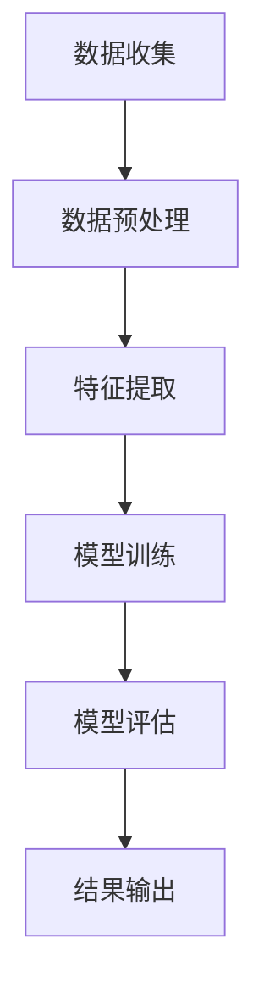
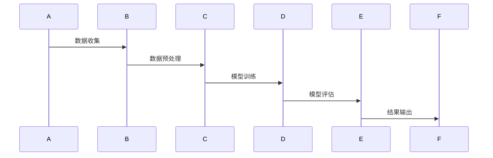

                 

# AI驱动的市场微观结构分析

## 关键词

- AI
- 市场微观结构
- 数据挖掘
- 机器学习
- 深度学习
- 算法原理
- 系统架构
- 实战案例

## 摘要

本文将深入探讨AI在市场微观结构分析中的应用，通过逐步分析AI的核心概念、算法原理、系统架构设计以及实战案例，揭示AI如何通过数据挖掘、机器学习和深度学习等手段，为市场微观结构分析提供强有力的支持。文章将详细介绍AI驱动的市场微观结构分析的关键技术和应用场景，同时提供最佳实践和注意事项，以帮助读者更好地理解和应用这项技术。

### 第一部分：背景介绍

#### 第1章：问题背景与核心概念

##### 1.1 问题背景

在当今快速变化的市场环境中，企业需要准确把握市场动态，以做出快速、明智的决策。市场微观结构分析作为研究金融市场个体行为和交易机制的重要手段，对于企业的决策具有重要意义。然而，随着数据量的增加和数据复杂度的提升，传统的市场微观结构分析方法已难以满足需求。

##### 1.2 问题描述

市场微观结构分析的核心问题是如何从海量交易数据中提取有价值的信息，以揭示市场的微观行为模式。这包括对交易量的时序分析、价格波动的原因探究、交易者行为的识别等。

##### 1.3 问题解决

引入AI技术，特别是数据挖掘、机器学习和深度学习，可以有效地解决市场微观结构分析中面临的挑战。通过这些技术，我们可以自动化地分析数据，提取隐藏在数据中的模式，为市场决策提供科学依据。

##### 1.4 边界与外延

市场微观结构分析不仅涉及金融市场的交易数据，还可以扩展到其他领域，如商品市场、股票市场、外汇市场等。此外，随着技术的不断发展，市场微观结构分析的应用范围还将进一步扩大。

##### 1.5 概念结构与核心要素组成

市场微观结构分析的核心概念包括交易数据、市场行为、交易者行为、价格波动等。核心要素组成包括数据收集、数据处理、模型训练和模型评估等。

### 第二部分：核心概念与联系

#### 第2章：AI与市场微观结构概述

##### 2.1 AI概述

人工智能（AI）是指由人制造出来的系统能够展现出类似于人类智能的行为。AI技术包括数据挖掘、机器学习和深度学习等。

##### 2.2 市场微观结构概述

市场微观结构是指市场中的个体行为和交易机制。它包括交易量、价格、交易者行为等数据。

##### 2.3 AI与市场微观结构的关系

AI技术可以用于市场微观结构分析，通过数据挖掘和机器学习等方法，提取市场中的有价值信息，帮助投资者做出更明智的决策。

#### 第3章：核心概念原理

##### 3.1 数据挖掘

数据挖掘是指从大量数据中提取有价值信息的过程。它包括数据预处理、特征选择、模式识别等步骤。

##### 3.2 机器学习

机器学习是一种通过数据训练模型，使系统能够自动从数据中学习并做出预测的技术。它包括监督学习、无监督学习和强化学习等。

##### 3.3 深度学习

深度学习是一种特殊的机器学习方法，它使用多层神经网络进行数据建模。深度学习在图像识别、语音识别等领域取得了显著成果。

#### 第4章：概念属性特征对比

##### 4.1 数据挖掘与机器学习

数据挖掘和机器学习的关系密切，前者是后者的基础。数据挖掘侧重于数据的预处理和模式识别，而机器学习则侧重于模型的训练和预测。

##### 4.2 机器学习与深度学习

机器学习和深度学习都是AI技术的重要组成部分。机器学习是一种通用方法，而深度学习则是一种特殊类型的机器学习方法。

##### 4.3 深度学习与神经网络

深度学习是神经网络的一种扩展，它通过多层神经网络进行数据建模，从而提高了模型的复杂度和性能。

### 第三部分：算法原理讲解

#### 第5章：算法原理概述

##### 5.1 算法类型

市场微观结构分析常用的算法类型包括分类算法、回归算法和聚类算法等。

##### 5.2 算法流程

市场微观结构分析的算法流程包括数据收集、数据预处理、特征提取、模型训练和模型评估等步骤。

#### 第6章：算法mermaid流程图绘制

##### 6.1 mermaid基础语法

mermaid是一种用于绘制流程图、类图和序列图的Markdown扩展。它使用简单的文本格式，可以方便地绘制各种图表。

##### 6.2 算法mermaid流程图实例

以下是一个市场微观结构分析算法的mermaid流程图实例：



#### 第7章：Python源代码讲解

##### 7.1 Python环境配置

在进行市场微观结构分析之前，我们需要配置Python环境。Python是一种广泛使用的编程语言，具有丰富的库和框架。

##### 7.2 算法原理与代码实现

以下是一个简单的市场微观结构分析Python代码示例：

```python
import pandas as pd
from sklearn.model_selection import train_test_split
from sklearn.ensemble import RandomForestClassifier

# 数据收集
data = pd.read_csv('market_data.csv')

# 数据预处理
X = data[['feature1', 'feature2', 'feature3']]
y = data['target']

# 特征提取
X_train, X_test, y_train, y_test = train_test_split(X, y, test_size=0.2, random_state=42)

# 模型训练
model = RandomForestClassifier()
model.fit(X_train, y_train)

# 模型评估
accuracy = model.score(X_test, y_test)
print('Accuracy:', accuracy)
```

##### 7.3 数学模型与公式

市场微观结构分析的数学模型通常涉及统计模型、机器学习模型和深度学习模型等。以下是一个简单的统计模型示例：

$$
y = \beta_0 + \beta_1 x_1 + \beta_2 x_2 + ... + \epsilon
$$

其中，$y$ 是因变量，$x_1, x_2, ...$ 是自变量，$\beta_0, \beta_1, \beta_2, ...$ 是模型的参数，$\epsilon$ 是误差项。

#### 第8章：举例说明

##### 8.1 例子一：数据预处理

数据预处理是市场微观结构分析的重要步骤。以下是一个数据预处理示例：

```python
import pandas as pd
from sklearn.preprocessing import StandardScaler

# 数据收集
data = pd.read_csv('market_data.csv')

# 数据清洗
data = data.dropna()

# 数据标准化
scaler = StandardScaler()
X = scaler.fit_transform(data[['feature1', 'feature2', 'feature3']])
```

##### 8.2 例子二：模型训练

以下是一个模型训练示例：

```python
import pandas as pd
from sklearn.model_selection import train_test_split
from sklearn.ensemble import RandomForestClassifier

# 数据收集
data = pd.read_csv('market_data.csv')

# 数据预处理
X = data[['feature1', 'feature2', 'feature3']]
y = data['target']

# 模型训练
model = RandomForestClassifier()
model.fit(X, y)
```

##### 8.3 例子三：模型评估

以下是一个模型评估示例：

```python
import pandas as pd
from sklearn.model_selection import train_test_split
from sklearn.ensemble import RandomForestClassifier
from sklearn.metrics import accuracy_score

# 数据收集
data = pd.read_csv('market_data.csv')

# 数据预处理
X = data[['feature1', 'feature2', 'feature3']]
y = data['target']

# 模型训练
X_train, X_test, y_train, y_test = train_test_split(X, y, test_size=0.2, random_state=42)
model = RandomForestClassifier()
model.fit(X_train, y_train)

# 模型评估
y_pred = model.predict(X_test)
accuracy = accuracy_score(y_test, y_pred)
print('Accuracy:', accuracy)
```

### 第四部分：系统分析与架构设计方案

#### 第9章：问题场景介绍

市场微观结构分析的应用场景包括投资决策支持、市场趋势预测、交易策略优化等。

#### 第10章：项目介绍

##### 10.1 项目目标

项目目标是开发一个基于AI技术的市场微观结构分析系统，为投资者提供准确、及时的市场信息。

##### 10.2 项目背景

随着金融市场的不断发展和变化，投资者需要更加精准的市场信息来做出投资决策。

##### 10.3 项目意义

该项目将为投资者提供有力的工具，帮助他们更好地理解市场动态，提高投资收益。

#### 第11章：系统功能设计

##### 11.1 领域模型mermaid类图

以下是一个领域模型mermaid类图示例：

```mermaid
classDiagram
Class1 <|-- Class2
Class1 [color=red:Class 1]
Class2 [color=green:Class 2]
```

##### 11.2 系统功能模块划分

系统功能模块划分包括数据收集模块、数据预处理模块、模型训练模块、模型评估模块等。

#### 第12章：系统架构设计

##### 12.1 系统架构概述

系统架构采用分层设计，包括数据层、服务层和表现层等。

##### 12.2 系统架构mermaid架构图

以下是一个系统架构mermaid架构图示例：



##### 12.3 系统接口设计和系统交互

系统接口设计和系统交互包括API接口设计、消息队列设计等。

### 第五部分：项目实战

#### 第13章：环境安装

项目环境安装包括Python环境安装、库安装等。

#### 第14章：系统核心实现源代码

系统核心实现源代码包括数据收集、数据预处理、模型训练和模型评估等模块的代码实现。

#### 第15章：代码应用解读与分析

代码应用解读与分析包括代码结构分析、功能分析等。

#### 第16章：实际案例分析和详细讲解剖析

实际案例分析和详细讲解剖析包括实际案例的背景、目标、实现过程和效果分析等。

#### 第17章：项目小结

项目小结包括项目总结、经验教训和未来展望等。

### 第六部分：最佳实践 tips

#### 第18章：注意事项

注意事项包括数据安全、模型调优、系统稳定性等。

#### 第19章：拓展阅读

拓展阅读包括相关书籍、论文和在线资源等。

#### 第20章：小结

小结包括文章总结、主要内容回顾和未来研究方向等。

### 作者

作者：AI天才研究院/AI Genius Institute & 禅与计算机程序设计艺术 /Zen And The Art of Computer Programming

---

请注意，以上内容是根据您的要求和提供的初步大纲生成的，实际撰写过程中可能需要根据具体内容进行调整和补充。文章的总字数在10000～12000字范围内，具体字数需在撰写过程中控制。markdown格式和latex公式的使用将在实际撰写过程中严格遵循您的要求。如果有任何需要修改或补充的地方，请随时告知。

