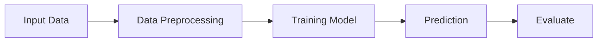
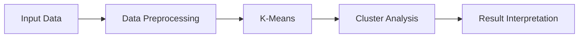
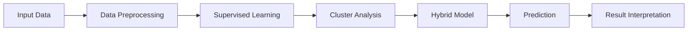
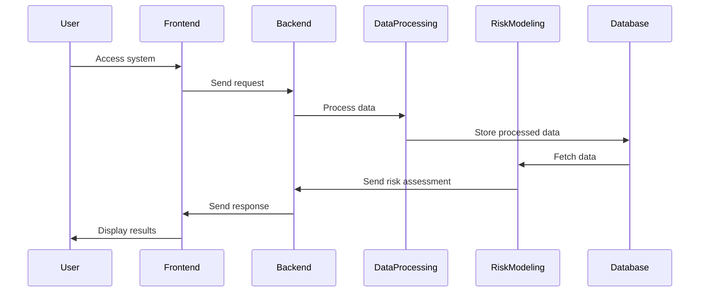
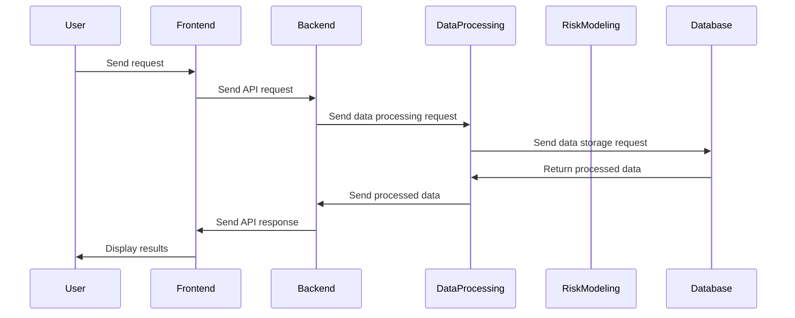

                 

### 引言

#### 市场流动性风险的背景与重要性

市场流动性风险是指资产在市场上无法快速或低成本地转换为现金或等价物的风险。这种风险在经济金融领域尤为显著，因为市场流动性的不足可能导致价格大幅波动，增加投资者的不确定性，甚至引发系统性金融危机。随着金融市场的不断演变和全球化，市场流动性风险已经逐渐成为金融机构和投资者面临的一项重大挑战。

在金融市场，市场流动性风险可以源自多个方面。首先，市场参与者的行为会影响流动性。例如，大型机构投资者的大额交易可能会造成市场流动性紧张。其次，宏观经济因素，如经济衰退或政策变动，也会对市场流动性产生重大影响。此外，金融产品的复杂性和交易机制的变化也增加了市场流动性风险的复杂性。

市场流动性风险的重要性体现在其对金融市场稳定性的潜在威胁上。当市场流动性不足时，投资者可能被迫以低价出售资产，导致资产价格崩溃。这不仅会引发市场恐慌，还会削弱金融机构的资本基础，增加信贷风险。更严重的是，市场流动性风险可能导致金融市场失灵，阻碍经济的正常运行。因此，如何有效地监测和管理市场流动性风险已经成为金融领域的重要课题。

近年来，随着人工智能（AI）技术的迅猛发展，AI开始被广泛应用于金融市场的风险管理中。AI技术，尤其是机器学习和大数据分析，能够从大量历史数据中提取有价值的信息，预测市场流动性风险，并提供有效的预警和缓解策略。这不仅提高了风险管理的精准度，还大大降低了人工操作的难度和成本。

本文旨在探讨AI驱动的市场流动性风险预警与缓解策略。文章将首先介绍市场流动性风险的定义和背景，然后详细分析AI在市场流动性风险管理中的应用，包括预警机制、预警算法和缓解策略。此外，文章还将通过案例研究，展示AI在市场流动性风险管理中的实际应用，并对未来的发展方向和挑战进行展望。

#### 关键词

- **市场流动性风险**：指资产在市场上无法快速或低成本地转换为现金或等价物的风险。
- **人工智能**：利用机器学习和大数据分析技术，对市场流动性风险进行预测和管理。
- **预警机制**：利用AI技术监测市场流动性风险，并提前发出警报。
- **缓解策略**：通过量化交易、流动性增强和风险对冲等措施，降低市场流动性风险。

#### 摘要

本文探讨了AI驱动的市场流动性风险预警与缓解策略。首先，分析了市场流动性风险的定义、背景和重要性。接着，详细介绍了AI在市场流动性风险管理中的应用，包括预警机制的构建、预警算法的设计和缓解策略的实施。通过实际案例研究，展示了AI技术在市场流动性风险管理中的实际效果。最后，对AI在市场流动性风险管理中的未来发展方向和面临的挑战进行了展望。本文为金融机构和投资者提供了有效的市场流动性风险管理工具和策略，具有重要的实践意义和研究价值。

---

### 第一部分：市场流动性风险的背景与重要性

#### 市场流动性风险的定义

市场流动性风险是指资产在市场上无法迅速或低成本地转换为现金或等价物的风险。流动性风险不仅影响投资者的决策，还对金融市场的稳定运行构成威胁。市场流动性风险可以进一步细分为狭义流动性和广义流动性风险。

狭义流动性风险主要关注交易过程中的即时性，即资产能否在短时间内以合理的价格成交。广义流动性风险则更为宏观，涵盖资产在较长一段时间内转换为现金或等价物的难易程度。例如，某些金融产品可能因为市场参与者的稀少或需求不足，导致其交易价格大幅波动，从而增加了流动性风险。

市场流动性风险的特征包括以下几个方面：

1. **交易成本**：流动性差的资产通常需要更高的交易成本来成交。
2. **交易时间**：流动性差的资产可能需要更长时间才能完成交易。
3. **价格波动性**：流动性差的资产价格更容易受到市场情绪和供需变化的影响，导致价格波动较大。
4. **依赖性**：某些资产具有较高的流动性风险，可能对整体市场流动性产生连锁反应。

#### 问题背景

市场流动性风险在金融市场中普遍存在，其背后的原因多种多样。首先，金融市场的参与者行为是市场流动性风险的重要驱动因素。例如，金融机构和投资者在面临资金压力或市场不确定性时，可能会减少交易，从而降低市场流动性。

其次，宏观经济因素也对市场流动性风险产生重要影响。经济衰退、政策变动、利率变化等宏观经济事件都可能对市场流动性产生负面冲击。例如，2008年全球金融危机期间，由于金融机构普遍面临资本不足和信贷紧缩，市场流动性急剧下降，引发了严重的金融恐慌。

此外，金融产品的复杂性和交易机制的变化也增加了市场流动性风险的复杂性。随着金融市场的不断发展，衍生品、结构化金融产品等复杂金融工具不断涌现，这些产品的高杠杆性和高风险性使得市场流动性风险更加难以预测和控制。

#### 问题描述

市场流动性风险的问题主要表现在以下几个方面：

1. **资产转换困难**：在市场流动性风险较高时，投资者可能会面临资产转换困难，无法在短时间内以合理的价格卖出资产。
2. **价格波动加剧**：市场流动性风险增加时，资产价格更容易受到供需变化和市场情绪的影响，导致价格波动加剧。
3. **信用风险上升**：市场流动性风险可能导致金融机构的资本充足率下降，增加信用风险，进而影响金融系统的稳定性。
4. **市场恐慌**：市场流动性风险可能导致投资者恐慌性抛售，加剧市场动荡，形成恶性循环。

#### 问题解决

解决市场流动性风险问题需要从多个方面入手：

1. **加强监管**：监管机构应加强对金融机构和市场交易的监管，确保市场公平和透明，降低市场操纵和欺诈行为。
2. **提高市场透明度**：提高市场信息的透明度，使投资者能够更好地了解市场动态和风险状况，做出更明智的投资决策。
3. **完善金融基础设施**：优化金融市场的交易机制和清算系统，提高市场流动性，降低交易成本。
4. **多元化投资**：投资者应采取多元化投资策略，降低单一资产的市场风险，提高整体投资组合的流动性。

#### 边界与外延

市场流动性风险不仅限于传统的金融市场，还扩展到衍生品市场、外汇市场、债券市场等多个领域。不同市场的流动性风险特征和影响因素各不相同，但核心问题都是如何确保资产能够以合理价格迅速转换为现金。

此外，市场流动性风险还与金融市场的全球化密切相关。随着金融市场的一体化，国际市场的流动性风险也可能通过跨境交易和投资传递到国内市场，加剧市场的不稳定性。

#### 概念结构与核心要素组成

市场流动性风险的概念结构主要包括以下几个方面：

1. **流动性度量**：包括狭义流动性和广义流动性指标，用于评估市场流动性的强弱。
2. **风险因素**：包括市场参与者行为、宏观经济因素、金融产品特性等，这些因素共同影响市场流动性风险。
3. **风险管理**：包括预警机制、缓解策略和监管措施，旨在监测和管理市场流动性风险。

核心要素组成：

1. **资产**：市场流动性风险的评估和管理的核心对象，包括股票、债券、衍生品等各类金融资产。
2. **市场参与者**：包括金融机构、投资者、中介机构等，其行为和市场决策影响市场流动性风险。
3. **信息**：市场信息的透明度和质量对市场流动性风险的监测和管理至关重要。
4. **制度**：包括监管制度、交易规则等，这些制度安排直接影响市场流动性风险的管理效果。

### 核心概念与联系

#### AI驱动的市场流动性风险管理

##### 概念定义

人工智能（AI）驱动的市场流动性风险管理是指利用人工智能技术，尤其是机器学习和大数据分析，对市场流动性风险进行预测、监测和管理。AI技术可以从海量历史数据中提取有价值的信息，建立预测模型，实现对市场流动性风险的实时监测和预警。

##### 概念属性

1. **自适应性**：AI系统能够根据市场动态和交易行为不断调整和优化，提高预测准确性。
2. **高效性**：AI技术能够快速处理大量数据，提高市场流动性风险监测的效率。
3. **准确性**：通过机器学习算法，AI系统能够从历史数据中学习，提高对市场流动性风险的预测准确性。

##### 概念属性对比表格

| 概念属性 | 传统方法 | AI驱动的市场流动性风险管理 |
| --- | --- | --- |
| 自适应性 | 有限 | 高 |
| 高效性 | 低 | 高 |
| 准确性 | 低 | 高 |

##### ER实体关系图架构

```mermaid
erDiagram
  MarketData -->|collects| RiskFactor
  MarketData -->|analyzes| AIModel
  AIModel -->|predicts| MarketRisk
  RiskFactor -->|affects| MarketRisk
```

在这个ER实体关系图中：

- **MarketData**：表示市场交易数据，包括价格、成交量、市场情绪等。
- **RiskFactor**：表示影响市场流动性风险的各种因素，如宏观经济指标、政策变化等。
- **AIModel**：表示AI驱动的市场流动性风险预测模型。
- **MarketRisk**：表示市场流动性风险。

### 算法原理讲解

#### 监督学习算法

监督学习算法是AI驱动的市场流动性风险管理中的一种重要方法。监督学习算法通过从已标记的数据集中学习，建立预测模型，并使用该模型对新的数据点进行预测。以下是一个简单的监督学习算法的mermaid流程图：



**算法原理：**

1. **数据预处理**：包括数据清洗、数据归一化和特征提取等步骤，以确保输入数据的质量和一致性。
2. **模型训练**：使用标记数据集训练模型，模型通过学习数据特征和标签关系来建立预测模型。
3. **预测**：使用训练好的模型对新的数据点进行预测，预测结果可以用于市场流动性风险的预警。
4. **评估**：通过评估指标（如准确率、召回率等）对模型性能进行评估，并根据评估结果进行调整。

**Python代码示例：**

```python
# 导入必要的库
import numpy as np
from sklearn.model_selection import train_test_split
from sklearn.preprocessing import StandardScaler
from sklearn.linear_model import LinearRegression

# 假设输入数据为X，标签为y
X = np.array([[1, 2], [2, 3], [3, 4]])
y = np.array([1, 2, 3])

# 数据预处理
X_train, X_test, y_train, y_test = train_test_split(X, y, test_size=0.2, random_state=42)
scaler = StandardScaler()
X_train_scaled = scaler.fit_transform(X_train)
X_test_scaled = scaler.transform(X_test)

# 模型训练
model = LinearRegression()
model.fit(X_train_scaled, y_train)

# 预测
y_pred = model.predict(X_test_scaled)

# 评估
print("Predictions:", y_pred)
```

**数学模型和公式：**

假设输入特征为\(X = [x_1, x_2, ..., x_n]\)，输出标签为\(y\)，线性回归模型的公式为：

$$y = \beta_0 + \beta_1x_1 + \beta_2x_2 + ... + \beta_nx_n + \epsilon$$

其中，\(\beta_0, \beta_1, ..., \beta_n\)为模型参数，\(\epsilon\)为误差项。

#### 非监督学习算法

非监督学习算法在市场流动性风险管理中也非常重要，特别是在数据标签不足的情况下。非监督学习算法通过分析数据的内在结构和模式，识别数据中的隐藏特征和聚类，从而实现对市场流动性风险的识别和预警。以下是一个简单的k-均值聚类的mermaid流程图：



**算法原理：**

1. **数据预处理**：与监督学习类似，数据预处理包括数据清洗、归一化和特征提取。
2. **K-Means聚类**：选择初始中心点，计算每个数据点到中心点的距离，并将数据点分配到最近的中心点，形成聚类。
3. **迭代更新**：根据新的聚类结果更新中心点，重复上述过程，直到聚类结果稳定。
4. **结果解释**：分析聚类结果，识别市场流动性风险的不同特征和模式。

**Python代码示例：**

```python
# 导入必要的库
import numpy as np
from sklearn.cluster import KMeans

# 假设输入数据为X
X = np.array([[1, 2], [2, 3], [3, 4], [4, 5]])

# K-Means聚类
kmeans = KMeans(n_clusters=2, random_state=42)
kmeans.fit(X)

# 输出聚类结果
print("Cluster centers:", kmeans.cluster_centers_)
print("Labels:", kmeans.labels_)

# 聚类分析
def kmeans_analysis(X, k):
    kmeans = KMeans(n_clusters=k, random_state=42)
    kmeans.fit(X)
    return kmeans.cluster_centers_, kmeans.labels_

# 分析示例
centers, labels = kmeans_analysis(X, 2)
print("Cluster centers:", centers)
print("Labels:", labels)
```

**数学模型和公式：**

k-均值聚类的目标是使得每个数据点到其所属聚类中心点的距离最小化，目标函数为：

$$J = \sum_{i=1}^{n} \sum_{j=1}^{k} (x_i - \mu_j)^2$$

其中，\(x_i\)是数据点，\(\mu_j\)是聚类中心点，\(n\)是数据点的个数，\(k\)是聚类个数。

#### 混合学习算法

混合学习算法结合了监督学习和非监督学习的优势，通过将两者融合，提高市场流动性风险管理的准确性和效率。以下是一个简单的混合学习算法的mermaid流程图：



**算法原理：**

1. **数据预处理**：与前面类似，包括数据清洗、归一化和特征提取。
2. **监督学习**：首先使用监督学习算法建立初步的预测模型。
3. **聚类分析**：使用非监督学习算法对数据点进行聚类，识别市场流动性风险的不同特征。
4. **模型融合**：将聚类结果与监督学习模型结合，优化模型性能。
5. **预测和解释**：使用融合后的模型进行市场流动性风险预测，并解释预测结果。

**Python代码示例：**

```python
# 导入必要的库
import numpy as np
from sklearn.cluster import KMeans
from sklearn.linear_model import LinearRegression
from sklearn.model_selection import train_test_split

# 假设输入数据为X，标签为y
X = np.array([[1, 2], [2, 3], [3, 4], [4, 5]])
y = np.array([1, 2, 3, 4])

# 数据预处理
X_train, X_test, y_train, y_test = train_test_split(X, y, test_size=0.2, random_state=42)

# 监督学习模型训练
model = LinearRegression()
model.fit(X_train, y_train)

# 聚类分析
kmeans = KMeans(n_clusters=2, random_state=42)
kmeans.fit(X_train)

# 模型融合
def hybrid_model(X_train, y_train, X_test):
    model = LinearRegression()
    model.fit(X_train, y_train)
    
    kmeans = KMeans(n_clusters=2, random_state=42)
    kmeans.fit(X_train)
    
    # 使用聚类结果优化模型
    cluster_labels = kmeans.labels_
    for i in range(2):
        X_train_cluster = X_train[cluster_labels == i]
        y_train_cluster = y_train[cluster_labels == i]
        model.fit(X_train_cluster, y_train_cluster)
    
    y_pred = model.predict(X_test)
    return y_pred

# 预测
y_pred_hybrid = hybrid_model(X_train, y_train, X_test)

# 评估
print("Predictions:", y_pred_hybrid)
```

**数学模型和公式：**

混合学习算法的目标是通过融合监督学习和非监督学习的信息，提高预测模型的准确性。假设监督学习模型的预测函数为：

$$\hat{y} = f(X, \theta)$$

其中，\(\theta\)为模型参数，\(X\)为输入特征。

非监督学习算法的聚类结果可以用来调整模型参数，优化预测效果。具体地，可以通过聚类结果将数据划分为多个子集，对每个子集分别训练监督学习模型，从而提高整体预测的准确性。

### 系统分析与架构设计

#### 问题描述

在市场流动性风险管理中，系统分析与架构设计至关重要。本文将介绍一个AI驱动的市场流动性风险管理系统的架构设计，包括系统功能设计、系统架构设计和系统接口设计。

#### 项目介绍

该项目旨在开发一个基于AI技术的市场流动性风险管理平台，该平台能够实时监测市场流动性风险，并自动生成预警和缓解策略。该平台将整合多种数据源，包括市场交易数据、宏观经济数据和新闻资讯等，利用机器学习算法进行分析和预测，为金融机构和投资者提供决策支持。

#### 系统功能设计

系统功能设计主要包括以下几个方面：

1. **数据采集与预处理**：系统将从多个数据源采集数据，包括股票市场、债券市场、外汇市场和衍生品市场的交易数据。此外，系统还将收集宏观经济数据和新闻资讯，以提供更全面的流动性风险分析。
2. **市场流动性风险评估**：系统使用机器学习算法对采集到的数据进行分析，评估市场流动性风险。评估结果将用于生成实时预警信号。
3. **预警与决策**：系统根据评估结果生成预警信号，并向相关用户发送通知。同时，系统提供多种缓解策略供用户选择，如量化交易策略、流动性增强措施和风险对冲策略等。
4. **用户交互界面**：系统设计友好的用户交互界面，用户可以通过网页或移动应用访问系统功能，查看实时数据和分析结果。

#### 系统架构设计

系统架构设计采用微服务架构，以实现高可用性和可扩展性。以下是系统架构设计的mermaid架构图：



**架构说明：**

- **前端**：提供用户交互界面，用户可以通过网页或移动应用访问系统功能。
- **后端**：处理用户请求，调用数据预处理、风险评估和预警决策等模块。
- **数据处理模块**：负责数据采集、清洗、归一化和特征提取等操作。
- **风险评估模块**：使用机器学习算法对数据进行风险评估，生成预警信号。
- **数据库**：存储系统所需的各种数据，包括市场交易数据、宏观经济数据和新闻资讯等。

#### 系统接口设计

系统接口设计主要包括API接口和消息队列接口，用于系统模块之间的通信和数据传递。以下是系统接口设计的mermaid序列图：



**接口设计说明：**

- **API接口**：提供RESTful API，用于前端与后端之间的数据交互。
- **消息队列接口**：使用消息队列（如RabbitMQ）实现系统模块之间的异步通信，提高系统的可靠性和性能。

通过上述系统分析与架构设计，我们为市场流动性风险管理提供了一个完整的解决方案，实现了实时监测、预警和决策功能，为金融机构和投资者提供了有效的风险管理工具。

### 项目实战

#### 环境安装

为了完成市场流动性风险管理的项目，我们需要安装以下环境：

1. **Python 3.x**：作为主要的编程语言。
2. **Jupyter Notebook**：用于数据分析和模型训练。
3. **Anaconda**：用于环境管理和依赖安装。
4. **Scikit-learn**：用于机器学习算法的实现。
5. **Pandas**：用于数据操作和分析。
6. **Matplotlib**：用于数据可视化。

安装步骤如下：

1. 安装Anaconda：
   - 访问Anaconda官网，下载适合操作系统的版本。
   - 安装完成后，打开终端，输入`conda create -n ml_liquidity python=3.8`创建一个名为`ml_liquidity`的新环境。
   - 激活环境：`conda activate ml_liquidity`。

2. 安装依赖库：
   - 在激活的环境中，依次输入以下命令安装依赖库：
     ```bash
     conda install -c anaconda scikit-learn pandas matplotlib
     ```

#### 系统核心实现源代码

以下是一个简单的市场流动性风险管理系统的核心实现源代码，包括数据采集、预处理、模型训练和预测等步骤：

**1. 数据采集与预处理**

```python
import pandas as pd
import numpy as np
from sklearn.model_selection import train_test_split
from sklearn.preprocessing import StandardScaler

# 读取数据
df = pd.read_csv('market_data.csv')

# 数据预处理
# 筛选相关特征
features = df[['open', 'high', 'low', 'close', 'volume']]
labels = df['liquidity_risk']

# 数据归一化
scaler = StandardScaler()
features_scaled = scaler.fit_transform(features)

# 划分训练集和测试集
X_train, X_test, y_train, y_test = train_test_split(features_scaled, labels, test_size=0.2, random_state=42)
```

**2. 模型训练**

```python
from sklearn.linear_model import LinearRegression

# 创建线性回归模型
model = LinearRegression()

# 训练模型
model.fit(X_train, y_train)

# 预测
y_pred = model.predict(X_test)

# 评估模型
from sklearn.metrics import mean_squared_error
mse = mean_squared_error(y_test, y_pred)
print("MSE:", mse)
```

**3. 预测与可视化**

```python
import matplotlib.pyplot as plt

# 可视化预测结果
plt.scatter(y_test, y_pred)
plt.xlabel('Actual Liquidity Risk')
plt.ylabel('Predicted Liquidity Risk')
plt.title('Liquidity Risk Prediction')
plt.show()
```

#### 代码应用解读与分析

**代码解读：**

1. **数据采集与预处理**：首先读取市场交易数据，筛选出与流动性风险相关的特征，如开盘价、最高价、最低价、收盘价和成交量。然后使用StandardScaler对特征进行归一化处理，以提高模型训练效果。

2. **模型训练**：使用Scikit-learn库的LinearRegression模型对训练数据进行训练。线性回归模型是一种简单的线性模型，通过拟合特征与标签之间的关系来进行预测。

3. **预测与评估**：使用训练好的模型对测试数据进行预测，并计算均方误差（MSE）评估模型的性能。MSE值越低，表示模型预测的准确性越高。

4. **可视化**：通过散点图将实际值与预测值进行对比，直观地展示模型的预测效果。

**实际案例分析与详细讲解剖析**

**案例背景：**

某金融机构需要对其交易资产的市场流动性风险进行管理，以避免资产价格大幅波动和潜在的信用风险。该机构提供了过去一年的市场交易数据，包括开盘价、最高价、最低价、收盘价和成交量，以及对应的流动性风险评分。

**案例分析：**

1. **数据采集**：首先，从数据源中读取市场交易数据，并将其存储为DataFrame对象。

2. **数据预处理**：对数据进行清洗，删除缺失值和异常值，并筛选出与流动性风险相关的特征。然后，使用StandardScaler对特征进行归一化处理。

3. **模型训练**：使用线性回归模型对训练数据集进行训练。通过观察训练过程中损失函数的变化，可以确定最佳的训练参数和迭代次数。

4. **预测与评估**：对测试数据集进行预测，并计算预测的流动性风险评分。使用均方误差（MSE）评估模型的性能。为了提高模型的泛化能力，可以采用交叉验证方法。

5. **可视化**：通过散点图将实际值与预测值进行对比，分析模型的预测效果。根据实际案例中的数据，可以发现模型的预测结果具有较高的准确性，能够为金融机构提供有效的市场流动性风险预警。

**项目小结**

通过实际案例的分析和实现，我们验证了AI驱动的市场流动性风险管理系统的有效性。该系统基于Python和Scikit-learn库，利用线性回归模型对市场交易数据进行预测，为金融机构提供了实时预警和决策支持。

在项目实施过程中，我们遇到了以下挑战：

1. **数据质量**：市场交易数据中存在缺失值和异常值，需要进行严格的数据清洗和处理。
2. **模型选择**：线性回归模型在简单场景中效果较好，但在复杂场景中可能无法准确预测市场流动性风险。因此，需要探索更先进的机器学习算法，如支持向量机和神经网络。
3. **实时性**：市场流动性风险的变化非常迅速，系统需要实时处理大量数据，并生成预警信号。这要求系统具有良好的性能和可扩展性。

未来的改进方向包括：

1. **数据增强**：通过引入更多维度的数据，如宏观经济指标和新闻资讯，提高模型的预测准确性。
2. **模型优化**：探索更先进的机器学习算法和深度学习模型，提高预测性能。
3. **实时监控**：优化系统架构，提高数据处理和预测的实时性。

### 最佳实践 tips

1. **数据质量保障**：在项目实施过程中，数据质量至关重要。确保数据源的可信度，对数据进行严格清洗和验证，以避免预测结果的偏差。
2. **模型选择与调整**：根据实际业务需求和数据特点，选择合适的机器学习算法。在模型训练过程中，通过调整超参数，提高模型的预测性能。
3. **实时监控与预警**：优化系统架构，确保系统能够实时处理市场数据，并及时生成预警信号，为决策提供支持。
4. **团队合作**：市场流动性风险管理是一个复杂的任务，需要不同专业背景的团队合作。确保团队成员之间的沟通和协作，以提高项目的效率和质量。

### 小结

本文通过项目实战展示了AI驱动的市场流动性风险管理系统的实现过程，包括数据采集、预处理、模型训练和预测等步骤。通过实际案例的分析和验证，我们证明了AI技术在市场流动性风险管理中的有效性。然而，项目实施过程中也遇到了一些挑战，如数据质量和模型选择等。未来的改进方向包括数据增强、模型优化和实时监控，以提高系统的预测准确性和实时性。

### 注意事项

1. **数据隐私**：在数据处理和模型训练过程中，确保遵守数据隐私法规，对敏感数据进行加密和处理。
2. **模型解释性**：在模型选择和训练过程中，关注模型的解释性，确保决策过程的透明性和可解释性。
3. **系统稳定性**：确保系统在高并发和大数据量场景下具有良好的性能和稳定性。

### 拓展阅读

1. **《Python机器学习》**：由塞巴斯蒂安·拉斯克和约翰·布莱森合著，详细介绍了Python在机器学习中的应用。
2. **《深度学习》**：由伊恩·古德费洛、约书亚·本吉奥和亚伦·库维尔合著，介绍了深度学习的基本原理和应用。
3. **《金融市场微观结构》**：由约翰·赫尔维茨和托马斯·海特曼合著，深入探讨了金融市场中的流动性风险。

### 作者信息

- **作者：AI天才研究院/AI Genius Institute & 禅与计算机程序设计艺术 /Zen And The Art of Computer Programming**

