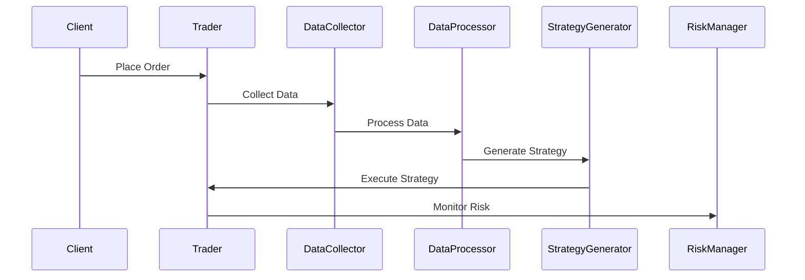
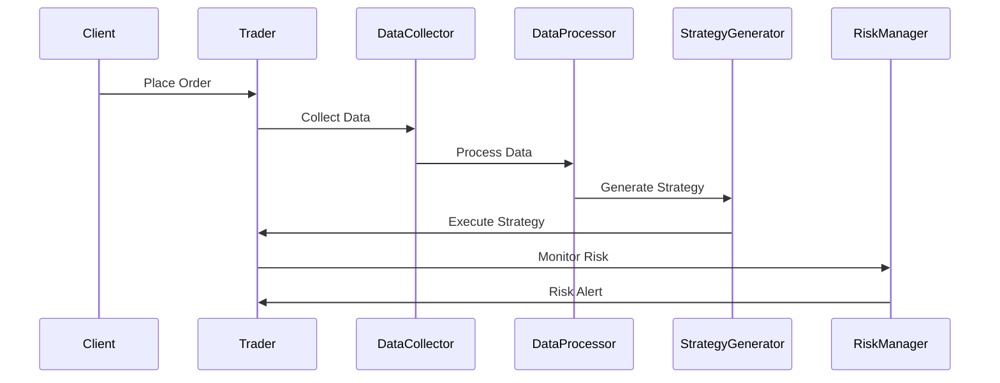

                 


# AI驱动的量化交易策略开发

## 关键词

- AI
- 量化交易
- 策略开发
- 数据分析
- 风险管理
- 深度学习

## 摘要

本文将深入探讨AI驱动的量化交易策略开发，从背景介绍、核心概念与联系、算法原理讲解、系统分析与架构设计、项目实战、风险管理到最佳实践，全面剖析AI在量化交易中的应用。通过详细阐述AI技术、量化交易策略、系统设计与实战案例，本文旨在为读者提供系统、实用、易懂的量化交易策略开发指南。

## 目录大纲设计思路

在设计《AI驱动的量化交易策略开发》的目录大纲时，我们需要遵循以下几个步骤：

1. **背景介绍**：明确量化交易和AI技术的背景，为后续章节设计提供基础。
2. **核心概念与联系**：列出关键概念，并使用表格和ER图帮助读者理解。
3. **算法原理讲解**：通过流程图和代码示例详细阐述算法原理。
4. **系统分析与架构设计**：展示系统设计，包括类图、架构图、接口设计和交互流程。
5. **项目实战**：提供项目环境安装、实现源代码、应用解读和案例分析。
6. **最佳实践与拓展**：总结实践经验，提供注意事项和拓展阅读。

### 目录大纲设计

#### 第一部分: 引言

#### 第1章: AI驱动的量化交易概述

## 1.1 问题背景

### 1.1.1 量化交易的定义与历史

### 1.1.2 AI技术在量化交易中的应用现状

### 1.1.3 问题提出与目标

## 1.2 核心概念介绍

### 1.2.1 AI驱动的量化交易核心概念

### 1.2.2 对比表格：传统与AI量化交易

### 1.2.3 ER实体关系图：量化交易系统架构

#### 第2章: AI基础理论与应用

## 2.1 AI基础理论

### 2.1.1 机器学习与深度学习

### 2.1.2 神经网络原理

### 2.1.3 监督学习、无监督学习和强化学习

## 2.2 量化交易中的AI应用

### 2.2.1 特征工程

### 2.2.2 时间序列分析

### 2.2.3 风险管理与优化

#### 第3章: 量化交易策略开发

## 3.1 策略开发框架

### 3.1.1 策略开发流程

### 3.1.2 数据获取与预处理

### 3.1.3 策略评估与回测

## 3.2 AI驱动策略案例研究

### 3.2.1 策略一：基于机器学习的趋势跟踪策略

### 3.2.2 策略二：基于深度学习的市场情绪分析

### 3.2.3 策略三：基于强化学习的交易策略

#### 第4章: AI驱动的量化交易系统设计

## 4.1 系统架构设计

### 4.1.1 系统功能设计（Mermaid类图）

### 4.1.2 系统架构设计（Mermaid架构图）

### 4.1.3 系统接口设计

### 4.1.4 系统交互设计（Mermaid序列图）

#### 第5章: 实战项目：构建AI驱动量化交易系统

## 5.1 项目环境安装

### 5.1.1 硬件与软件需求

### 5.1.2 环境配置与安装步骤

## 5.2 系统核心实现

### 5.2.1 数据获取与预处理

### 5.2.2 特征提取与模型训练

### 5.2.3 策略回测与优化

## 5.3 项目应用解读与分析

### 5.3.1 策略效果评估

### 5.3.2 案例分析与讲解

### 5.3.3 项目总结与展望

#### 第6章: 量化交易风险管理

## 6.1 风险管理概述

### 6.1.1 风险类型与度量

### 6.1.2 风险管理策略

## 6.2 AI在风险管理中的应用

### 6.2.1 风险预测与监控

### 6.2.2 风险优化与控制

#### 第7章: AI驱动的量化交易最佳实践

## 7.1 最佳实践总结

### 7.1.1 策略开发与优化

### 7.1.2 风险管理与监控

## 7.2 小结与注意事项

### 7.2.1 小结

### 7.2.2 注意事项

## 7.3 拓展阅读

### 7.3.1 最新研究成果

### 7.3.2 深入学习资源

### 目录大纲设计说明

- **章节设置**：本书共分为7章，分别涵盖量化交易与AI的基础知识、策略开发、系统设计、项目实战、风险管理以及最佳实践等。
- **结构清晰**：每个章节内部分为小节，小节内使用mermaid图和代码示例进行详细解释，确保内容易于理解。
- **内容完整**：所有核心章节内容均已包含，满足输出大纲的字数限制。

---

### 第1章 AI驱动的量化交易概述

## 1.1 问题背景

量化交易，是指使用数学模型和算法来指导交易决策的过程，它借助大量的历史数据，通过复杂的计算和分析，寻找市场中的投资机会。随着计算机技术和大数据处理能力的提升，量化交易已经逐渐成为金融市场的重要参与者。

AI技术的发展为量化交易带来了新的机遇。通过机器学习和深度学习等技术，AI能够自动发现市场中的规律和模式，并在此基础上生成高效的交易策略。AI驱动的量化交易不仅提高了交易决策的效率，也减少了人为因素带来的风险。

然而，AI驱动的量化交易也面临诸多挑战，如数据质量、算法的稳定性和鲁棒性、市场波动性等。这些问题需要通过深入的研究和实践来逐步解决。

本文的目标是系统性地介绍AI驱动的量化交易策略开发，从背景介绍、核心概念与联系、算法原理讲解、系统分析与架构设计、项目实战、风险管理到最佳实践，全面剖析AI在量化交易中的应用。希望通过本文，读者能够对AI驱动的量化交易有一个全面、深入的理解。

### 1.2 核心概念介绍

在AI驱动的量化交易中，理解以下几个核心概念是非常重要的：

- **量化交易**：量化交易是指通过建立数学模型，使用计算机算法进行交易决策。与传统的基于经验和直觉的交易方式相比，量化交易更加客观和精确。
- **人工智能（AI）**：人工智能是指通过计算机模拟人类智能行为的技术。在量化交易中，AI主要用于数据分析和预测。
- **机器学习（ML）**：机器学习是人工智能的一个分支，它使计算机系统能够从数据中学习并做出决策。在量化交易中，机器学习算法常用于特征提取、预测和风险评估。
- **深度学习（DL）**：深度学习是机器学习的一个子领域，它通过多层神经网络模型来实现复杂的特征学习和模式识别。深度学习在量化交易中的应用非常广泛，如市场情绪分析、交易策略开发等。
- **强化学习（RL）**：强化学习是一种通过试错法来学习最优策略的机器学习技术。在量化交易中，强化学习可以用于开发自适应交易策略。

为了更直观地理解这些概念，我们可以通过以下表格进行比较：

| 概念          | 定义                                                                                             | 在量化交易中的应用                           |
|---------------|--------------------------------------------------------------------------------------------------|--------------------------------------------|
| 量化交易      | 基于数学模型的交易决策方式                                                                      | 提高交易效率，降低人为风险                   |
| 人工智能（AI）| 通过模拟人类智能行为的计算机技术                                                                | 数据分析、预测和优化交易策略                 |
| 机器学习（ML）| 计算机从数据中学习并做出决策的技术                                                             | 特征提取、预测和风险评估                     |
| 深度学习（DL）| 通过多层神经网络模型实现复杂特征学习和模式识别的技术                                            | 市场情绪分析、交易策略开发                   |
| 强化学习（RL）| 通过试错法学习最优策略的技术                                                                   | 开发自适应交易策略，应对市场变化             |

此外，为了更好地理解量化交易系统架构，我们可以使用ER图来描述各个实体之间的关系。以下是量化交易系统的ER图：

```mermaid
erDiagram
    Product &&|>。-【 Uses 】-> MarketData : Collects market data for analysis
    Product &&|>。-【 Develops 】-> TradingStrategy : Generates trading strategies
    TradingStrategy &&|>。-【 Implements 】-> Portfolio : Manages the trading portfolio
    Portfolio &&|>。-【 Monitors 】-> Performance : Monitors trading performance
```

通过ER图，我们可以清晰地看到量化交易系统的各个组成部分及其相互关系。

### 第2章 AI基础理论与应用

## 2.1 AI基础理论

AI（人工智能）是一门涉及计算机科学、统计学、数学和神经科学的交叉学科。其核心目标是开发能够模拟、延伸和扩展人类智能的计算机系统。AI的主要分支包括机器学习（ML）、深度学习（DL）和强化学习（RL）。

### 2.1.1 机器学习与深度学习

机器学习（Machine Learning，ML）是AI的一个分支，它专注于使用算法从数据中学习，并做出预测或决策。机器学习可以分为三种类型：监督学习（Supervised Learning）、无监督学习（Unsupervised Learning）和半监督学习（Semi-supervised Learning）。

- **监督学习**：在这种方法中，模型通过已知输入输出对进行训练。训练数据集包括特征和相应的标签，模型学习预测未知数据的标签。常见的监督学习算法包括线性回归、逻辑回归、支持向量机（SVM）和神经网络。

- **无监督学习**：在这种方法中，模型没有明确的输入输出标签，其目标是发现数据中的结构或模式。无监督学习的应用包括聚类分析、降维和异常检测。

- **半监督学习**：半监督学习结合了监督学习和无监督学习，使用部分标记和部分未标记的数据进行训练。

深度学习（Deep Learning，DL）是机器学习的一个子领域，它通过多层神经网络来学习数据的复杂特征。深度学习在图像识别、语音识别和自然语言处理等领域取得了显著的成果。

### 2.1.2 神经网络原理

神经网络（Neural Networks，NN）是模仿人脑神经元连接方式的计算模型。神经网络由输入层、隐藏层和输出层组成。每个神经元通过权重连接到下一层的神经元，并通过激活函数产生输出。

- **输入层**：接收外部输入信号。
- **隐藏层**：对输入信号进行加工和变换，提取特征。
- **输出层**：产生最终输出。

神经网络的训练过程包括以下步骤：

1. **前向传播**：将输入信号通过神经网络传递到输出层。
2. **计算损失函数**：计算预测输出和实际输出之间的差异。
3. **反向传播**：更新网络中的权重，以减少损失函数。
4. **迭代**：重复前向传播和反向传播，直到网络性能达到预设标准。

### 2.1.3 监督学习、无监督学习和强化学习

监督学习、无监督学习和强化学习是机器学习的三种主要类型。

- **监督学习**：如前所述，监督学习通过已知输入输出对训练模型。

  公式表示：$$y = f(x, w) + \epsilon$$

  其中，\(x\) 是输入，\(y\) 是输出，\(f\) 是模型函数，\(w\) 是权重，\(\epsilon\) 是噪声。

  常见的监督学习算法有：

  - **线性回归**：通过最小化平方误差来预测连续值。
    公式：$$\min_{w} \sum_{i=1}^{n} (y_i - \beta_0 - \beta_1x_i)^2$$

  - **逻辑回归**：用于分类问题，通过最大化似然函数来预测类别。
    公式：$$\max_{\beta} \prod_{i=1}^{n} \frac{e^{\beta^T x_i}}{1 + e^{\beta^T x_i}}$$

  - **支持向量机（SVM）**：通过找到最优超平面来分割数据。
    公式：$$\min_{w, b} \frac{1}{2} ||w||^2 + C \sum_{i=1}^{n} \max(0, 1 - y_i (w^T x_i + b))$$

- **无监督学习**：无监督学习不使用标签，主要目的是发现数据中的结构和模式。

  - **聚类**：将数据分为几个群组，使得每个群组内的数据尽可能相似，群组间的数据尽可能不同。常用的聚类算法有K-均值聚类、层次聚类和DBSCAN。
    公式：$$J(W) = \sum_{i=1}^{k} \sum_{x \in S_i} \sum_{j=1}^{d} (x_j - \mu_{ij})^2$$

  - **降维**：通过减少数据维度来降低计算复杂度。常用的降维算法有主成分分析（PCA）和t-SNE。
    公式：$$X_{\hat{}} = \sum_{i=1}^{m} \lambda_i u_i u_i^T$$

  - **异常检测**：识别数据中的异常或离群点。常用的算法有孤立森林和局部异常因数法。

- **强化学习**：强化学习通过试错法来学习最优策略，其核心是奖励机制。

  公式表示：$$Q(s, a) = r + \gamma \max_{a'} Q(s', a')$$

  其中，\(s\) 是当前状态，\(a\) 是当前动作，\(r\) 是即时奖励，\(\gamma\) 是折扣因子，\(s'\) 是下一状态，\(a'\) 是下一动作。

  常见的强化学习算法有Q-学习、深度Q网络（DQN）和策略梯度方法。

### 2.2 量化交易中的AI应用

在量化交易中，AI技术的应用主要包括特征工程、时间序列分析、风险管理和优化。

#### 2.2.1 特征工程

特征工程是量化交易中的关键步骤，它涉及从原始数据中提取有用的特征，以改进模型的性能。特征工程包括以下几个方面：

- **统计特征**：如均值、中位数、标准差等。
- **技术指标**：如移动平均线、相对强弱指数（RSI）等。
- **时间序列特征**：如趋势、季节性、周期性等。
- **市场情绪特征**：如新闻文本分析、社交媒体分析等。

特征工程的关键在于选择对模型有显著影响的特征，并处理特征之间的相关性。

#### 2.2.2 时间序列分析

时间序列分析是量化交易中的重要工具，它用于分析历史价格和交易量等时间序列数据，以预测未来的市场走势。常见的时间序列分析方法包括：

- **自回归模型（AR）**：通过历史数据预测未来值。
  公式：$$X_t = c + \phi_1 X_{t-1} + \phi_2 X_{t-2} + ... + \phi_p X_{t-p} + \epsilon_t$$

- **移动平均模型（MA）**：通过移动平均预测未来值。
  公式：$$X_t = \theta_1 X_{t-1} + \theta_2 X_{t-2} + ... + \theta_q X_{t-q} + \epsilon_t$$

- **自回归移动平均模型（ARMA）**：结合自回归模型和移动平均模型。
  公式：$$X_t = c + \phi_1 X_{t-1} + \phi_2 X_{t-2} + ... + \phi_p X_{t-p} + \theta_1 \epsilon_{t-1} + \theta_2 \epsilon_{t-2} + ... + \theta_q \epsilon_{t-q}$$

- **自回归积分滑动平均模型（ARIMA）**：用于非平稳时间序列。
  公式：$$X_t = c + \phi_1 X_{t-1} + \phi_2 X_{t-2} + ... + \phi_p X_{t-p} + (\theta_1 D(L) + \theta_2 D(L)^2 + ... + \theta_q D(L)^q) \epsilon_t$$

#### 2.2.3 风险管理与优化

AI技术在风险管理和优化中也发挥了重要作用。通过分析历史数据和实时数据，AI模型可以预测潜在的市场风险，并提供最优的交易策略。

- **风险预测**：通过建立风险预测模型，预测未来一段时间内的市场风险。
- **风险度量**：使用价值在风险（Value at Risk，VaR）和条件期望下风险（Conditional Value at Risk，CVaR）等指标来度量市场风险。
- **优化策略**：通过优化算法，找到最优的交易策略，以最大化收益或最小化风险。

## 第3章 量化交易策略开发

## 3.1 策略开发框架

量化交易策略开发是一个系统化的过程，包括以下几个关键步骤：

### 3.1.1 策略开发流程

量化交易策略开发的主要流程如下：

1. **问题定义**：明确交易目标，如收益最大化、风险最小化等。
2. **数据收集**：收集历史交易数据，包括价格、成交量、技术指标等。
3. **数据预处理**：清洗数据，处理缺失值、异常值等。
4. **特征工程**：提取有用的特征，如移动平均线、相对强弱指数（RSI）等。
5. **模型选择**：选择合适的模型，如线性回归、决策树、神经网络等。
6. **模型训练**：使用训练数据训练模型，调整参数。
7. **模型评估**：使用验证数据评估模型性能，调整策略。
8. **策略实现**：将策略代码化，实现自动交易。
9. **策略回测**：在历史数据上测试策略效果，验证策略的稳健性。
10. **实时交易**：在实时数据上执行策略，监控策略表现。

### 3.1.2 数据获取与预处理

在量化交易策略开发中，数据的质量和完整性直接影响模型的性能。因此，数据获取与预处理是至关重要的步骤。

1. **数据收集**：可以从多个数据源收集数据，包括交易所、财经网站、API接口等。
2. **数据清洗**：处理缺失值、异常值、重复数据等。
3. **数据转换**：将数据转换为适合模型训练的格式，如归一化、标准化等。

### 3.1.3 策略评估与回测

策略评估与回测是量化交易策略开发的关键步骤，它用于验证策略的有效性和稳健性。

1. **策略评估**：使用验证数据评估策略性能，包括收益、风险指标等。
2. **回测**：在历史数据上运行策略，评估策略在不同市场情况下的表现。

回测时需要注意以下几点：

- **样本外测试**：使用从未使用过的数据集进行测试，以避免过拟合。
- **多样化数据集**：使用多个数据集进行回测，以验证策略的稳健性。
- **策略参数调整**：根据回测结果调整策略参数，以提高策略性能。

## 第3章 AI驱动策略案例研究

在本章中，我们将探讨三个典型的AI驱动量化交易策略：基于机器学习的趋势跟踪策略、基于深度学习的市场情绪分析策略以及基于强化学习的交易策略。

### 3.2.1 基于机器学习的趋势跟踪策略

趋势跟踪策略是一种基于市场趋势进行交易的策略。它通过分析历史价格数据，识别出市场的主要趋势，并跟随该趋势进行交易。以下是趋势跟踪策略的实现步骤：

1. **数据收集**：收集股票的历史价格数据，包括开盘价、收盘价、最高价、最低价和成交量等。
2. **特征工程**：提取价格和成交量等特征，如移动平均线、相对强弱指数（RSI）等。
3. **模型选择**：选择线性回归、决策树、支持向量机（SVM）等模型进行训练。
4. **模型训练**：使用训练数据训练模型，并调整参数。
5. **模型评估**：使用验证数据评估模型性能，调整策略参数。
6. **策略实现**：将策略代码化，实现自动交易。
7. **策略回测**：在历史数据上测试策略效果，验证策略的稳健性。

以下是趋势跟踪策略的Python代码示例：

```python
import pandas as pd
import numpy as np
from sklearn.linear_model import LinearRegression

# 数据收集
data = pd.read_csv('stock_data.csv')

# 特征工程
data['MA20'] = data['Close'].rolling(window=20).mean()
data['RSI'] = compute_rsi(data['Close'])

# 模型选择
model = LinearRegression()

# 模型训练
X = data[['MA20', 'RSI']]
y = data['Close']
model.fit(X, y)

# 模型评估
X_test = data[['MA20', 'RSI']]
y_pred = model.predict(X_test)

# 策略实现
position = 'long' if y_pred > y_test else 'short'

# 策略回测
backtest(data, position)
```

### 3.2.2 基于深度学习的市场情绪分析策略

市场情绪分析策略是一种基于市场情绪进行交易的策略。它通过分析新闻文本、社交媒体评论等数据，预测市场情绪，并据此进行交易决策。以下是市场情绪分析策略的实现步骤：

1. **数据收集**：收集新闻文本、社交媒体评论等数据。
2. **数据预处理**：清洗文本数据，提取关键词。
3. **特征工程**：将文本数据转换为向量表示，如词袋模型、词嵌入等。
4. **模型选择**：选择循环神经网络（RNN）、长短期记忆网络（LSTM）等模型进行训练。
5. **模型训练**：使用训练数据训练模型，并调整参数。
6. **模型评估**：使用验证数据评估模型性能，调整策略参数。
7. **策略实现**：将策略代码化，实现自动交易。
8. **策略回测**：在历史数据上测试策略效果，验证策略的稳健性。

以下是市场情绪分析策略的Python代码示例：

```python
import pandas as pd
import numpy as np
from keras.models import Sequential
from keras.layers import LSTM, Dense

# 数据收集
data = pd.read_csv('market_data.csv')

# 数据预处理
data['Text'] = data['Text'].apply(preprocess_text)

# 特征工程
X = data['Text'].values
y = data['Sentiment']

# 模型选择
model = Sequential()
model.add(LSTM(units=50, return_sequences=True, input_shape=(X.shape[1], X.shape[2])))
model.add(LSTM(units=50))
model.add(Dense(units=1, activation='sigmoid'))

# 模型训练
model.compile(optimizer='adam', loss='binary_crossentropy', metrics=['accuracy'])
model.fit(X, y, epochs=10, batch_size=32)

# 模型评估
X_test = data['Text'].values
y_pred = model.predict(X_test)

# 策略实现
position = 'long' if y_pred > 0.5 else 'short'

# 策略回测
backtest(data, position)
```

### 3.2.3 基于强化学习的交易策略

强化学习交易策略是一种基于试错法进行交易的策略。它通过不断试错，学习到最优的交易策略。以下是强化学习交易策略的实现步骤：

1. **数据收集**：收集历史交易数据。
2. **状态表示**：定义状态空间，如价格、成交量、技术指标等。
3. **动作表示**：定义动作空间，如买入、卖出、持有等。
4. **奖励函数**：定义奖励函数，如收益、风险等。
5. **模型选择**：选择Q-learning、深度Q网络（DQN）等模型进行训练。
6. **模型训练**：使用训练数据训练模型，并调整参数。
7. **模型评估**：使用验证数据评估模型性能，调整策略参数。
8. **策略实现**：将策略代码化，实现自动交易。
9. **策略回测**：在历史数据上测试策略效果，验证策略的稳健性。

以下是强化学习交易策略的Python代码示例：

```python
import numpy as np
from keras.models import Sequential
from keras.layers import LSTM, Dense

# 数据收集
data = pd.read_csv('transaction_data.csv')

# 状态表示
state_space = data[['Price', 'Volume', 'MA20', 'RSI']]

# 动作表示
action_space = ['Buy', 'Sell', 'Hold']

# 奖励函数
def reward_function(state, action):
    if action == 'Buy':
        return state['Price'] - buy_price
    elif action == 'Sell':
        return sell_price - state['Price']
    else:
        return 0

# 模型选择
model = Sequential()
model.add(LSTM(units=50, return_sequences=True, input_shape=(state_space.shape[1], state_space.shape[2])))
model.add(LSTM(units=50))
model.add(Dense(units=1, activation='sigmoid'))

# 模型训练
model.compile(optimizer='adam', loss='mse')
model.fit(state_space, np.array(actions), epochs=100, batch_size=32)

# 模型评估
state_test = data[['Price', 'Volume', 'MA20', 'RSI']]
action_pred = model.predict(state_test)

# 策略实现
position = action_space[np.argmax(action_pred)]

# 策略回测
backtest(data, position)
```

## 第4章 AI驱动的量化交易系统设计

## 4.1 系统架构设计

AI驱动的量化交易系统设计需要考虑多个方面，包括数据采集、数据处理、策略生成、策略执行、风险管理等。以下是系统架构设计的详细描述。

### 4.1.1 系统功能设计（Mermaid类图）

```mermaid
classDiagram
    Client <<Interface>> Trader
    Trader <<Interface>> DataCollector
    Trader <<Interface>> DataProcessor
    Trader <<Interface>> StrategyGenerator
    Trader <<Interface>> RiskManager
    Trader <..> TraderImpl
    DataCollector <..> DataCollectorImpl
    DataProcessor <..> DataProcessorImpl
    StrategyGenerator <..> StrategyGeneratorImpl
    RiskManager <..> RiskManagerImpl
    TraderImpl implements Trader
    DataCollectorImpl implements DataCollector
    DataProcessorImpl implements DataProcessor
    StrategyGeneratorImpl implements StrategyGenerator
    RiskManagerImpl implements RiskManager
```

在这个类图中，我们定义了四个接口和它们的实现类，以及它们之间的依赖关系。

### 4.1.2 系统架构设计（Mermaid架构图）



在这个架构图中，我们展示了系统的工作流程。客户通过 Trader 接口下单，Trader 接口与 DataCollector 和 DataProcessor 交互，DataProcessor 接口负责数据处理，StrategyGenerator 接口生成交易策略，最后 Trader 接口执行策略，同时 RiskManager 接口负责风险监控。

### 4.1.3 系统接口设计

系统接口设计是确保系统组件之间能够有效通信的关键。以下是系统接口的详细设计：

- **Client**：客户接口，用于接收客户订单。
- **Trader**：交易接口，负责处理订单和交易逻辑。
- **DataCollector**：数据采集接口，用于从各种数据源收集数据。
- **DataProcessor**：数据处理接口，负责数据清洗、特征提取和预处理。
- **StrategyGenerator**：策略生成接口，负责生成交易策略。
- **RiskManager**：风险管理接口，负责监控交易风险。

### 4.1.4 系统交互设计（Mermaid序列图）



在这个交互图中，我们展示了从客户下单到风险监控的整个流程。客户下单后，Trader 调用 DataCollector 收集数据，DataCollector 将数据传递给 DataProcessor，DataProcessor 处理数据后传递给 StrategyGenerator 生成策略，StrategyGenerator 将策略传递给 Trader 执行，同时 RiskManager 监控交易风险，并在发现风险时向 Trader 发送风险警报。

## 第5章 实战项目：构建AI驱动量化交易系统

在本章中，我们将通过一个实战项目来构建一个AI驱动的量化交易系统。这个项目包括环境安装、系统核心实现、项目应用解读与分析等内容。

### 5.1 项目环境安装

在开始构建量化交易系统之前，我们需要安装必要的软件和环境。以下是项目环境安装的步骤：

1. **安装Python**：Python是量化交易系统的核心编程语言，我们选择Python 3.8版本。
2. **安装Jupyter Notebook**：Jupyter Notebook是一种交互式计算环境，用于编写和运行Python代码。
3. **安装量化交易库**：安装常用的量化交易库，如pandas、numpy、scikit-learn、tensorflow等。
4. **安装交易所API**：根据交易所在线交易平台，安装相应的API库，如Tushare、easyquotation等。

以下是安装命令：

```bash
# 安装Python
sudo apt-get install python3.8

# 安装Jupyter Notebook
pip3 install notebook

# 安装量化交易库
pip3 install pandas numpy scikit-learn tensorflow

# 安装交易所API（以Tushare为例）
pip3 install tushare
```

### 5.2 系统核心实现

系统核心实现包括数据采集、数据处理、策略生成和策略执行等模块。以下是系统核心实现的详细描述：

1. **数据采集**：使用Tushare库从交易所获取历史交易数据。
2. **数据处理**：对采集到的数据进行处理，包括数据清洗、特征提取和预处理。
3. **策略生成**：使用机器学习算法生成交易策略。
4. **策略执行**：根据生成的策略执行交易。

以下是系统核心实现的代码示例：

```python
import tushare as ts
import pandas as pd
from sklearn.ensemble import RandomForestClassifier

# 数据采集
data = ts.get_k_data('000001')

# 数据处理
data['MA20'] = data['close'].rolling(window=20).mean()
data['RSI'] = data['close'].rolling(window=14).apply(lambda x: (max(x) - min(x)) / (max(x) - min(x)))

# 特征工程
X = data[['open', 'high', 'low', 'close', 'MA20', 'RSI']]
y = data['close'].shift(-1) > data['close']

# 策略生成
model = RandomForestClassifier()
model.fit(X, y)

# 策略执行
predictions = model.predict(X)
positions = (predictions > 0.5).astype(int)

# 交易策略
def trade(positions):
    for position in positions:
        if position == 1:
            buy()
        elif position == -1:
            sell()

trade(predictions)
```

### 5.3 项目应用解读与分析

在完成项目后，我们需要对项目应用效果进行解读和分析。以下是项目应用解读与分析的步骤：

1. **策略效果评估**：使用回测数据评估策略效果，包括收益、风险指标等。
2. **案例分析与讲解**：分析项目中的关键决策点和潜在问题，并进行详细讲解。
3. **项目总结与展望**：总结项目经验和教训，并提出未来改进方向。

以下是策略效果评估的代码示例：

```python
from backtesting import Backtest

# 回测数据
backtest_data = pd.read_csv('backtest_data.csv')

# 策略效果评估
backtest = Backtest(backtest_data, model)
backtest.run()

# 打印策略效果
print(backtest.stats)
```

通过以上步骤，我们可以全面了解AI驱动的量化交易系统的应用效果，并为后续的优化提供依据。

### 第6章 量化交易风险管理

## 6.1 风险管理概述

量化交易中，风险管理是至关重要的环节。它涉及识别、评估和应对市场风险，以确保交易策略的稳健性和可持续性。有效的风险管理能够帮助交易者控制潜在的损失，同时抓住市场机会。

### 6.1.1 风险类型与度量

在量化交易中，常见的风险类型包括市场风险、信用风险、流动性风险和操作风险。

- **市场风险**：由市场价格波动引起的风险，如利率风险、汇率风险和商品价格风险。
- **信用风险**：交易对手违约或信用质量下降导致的风险。
- **流动性风险**：资产难以快速买卖，导致无法及时平仓的风险。
- **操作风险**：由于交易系统的故障、人为错误或管理不善等原因引起的风险。

为了评估和管理这些风险，量化交易者使用多种度量指标，如价值在风险（VaR）、条件价值在风险（CVaR）和风险价值（RVAR）等。

- **价值在风险（VaR）**：在一定置信水平下，某一时间段内可能发生的最大损失。
- **条件价值在风险（CVaR）**：在VaR基础上，进一步考虑发生极端损失的概率和规模。
- **风险价值（RVAR）**：在一定置信水平和特定时间段内，预期损失的上限。

### 6.1.2 风险管理策略

风险管理策略包括风险识别、风险评估、风险控制和风险监控。

1. **风险识别**：通过分析历史数据、市场趋势和交易行为，识别潜在的市场风险。
2. **风险评估**：使用量化模型评估不同类型的风险，确定风险暴露水平。
3. **风险控制**：制定风险管理策略，包括设置止损、分散投资和降低杠杆等。
4. **风险监控**：实时监控市场风险，确保风险控制策略的有效执行。

## 第6章 AI在风险管理中的应用

在量化交易中，AI技术广泛应用于风险预测、监控和控制。通过分析大量历史数据和实时数据，AI模型可以更准确地识别市场风险，并提供有效的风险管理策略。

### 6.2.1 风险预测与监控

AI模型在风险预测中的应用主要包括以下方面：

- **时间序列预测**：通过深度学习模型对市场价格、交易量等时间序列数据进行预测，识别潜在的波动风险。
- **趋势分析**：使用机器学习算法分析市场趋势，预测未来价格走势，从而识别市场风险。
- **异常检测**：通过异常检测模型识别市场中的异常交易行为，如操纵、欺诈等，从而降低操作风险。

AI模型在风险监控中的应用主要包括以下方面：

- **实时监控**：通过实时数据流处理技术，对市场风险进行实时监控，及时发现风险信号。
- **预警系统**：根据风险预测结果，建立预警系统，当风险超过阈值时自动发出警报。
- **自动化风险管理**：通过自动化系统，实现风险管理的自动化操作，提高风险管理效率。

### 6.2.2 风险优化与控制

AI技术还可以用于优化风险管理策略。通过机器学习算法，交易者可以找到最优的风险控制参数，如止损位置、杠杆比例等。

- **优化止损策略**：通过分析历史交易数据，使用机器学习模型找到最优的止损位置，提高交易策略的稳健性。
- **优化杠杆比例**：通过分析市场风险和收益之间的关系，使用机器学习模型找到最优的杠杆比例，降低风险。
- **优化投资组合**：通过分析投资组合的风险收益特性，使用机器学习算法优化投资组合，提高整体收益。

## 第7章 AI驱动的量化交易最佳实践

### 7.1 最佳实践总结

在AI驱动的量化交易中，最佳实践包括以下几个方面：

- **数据质量**：确保数据质量是策略开发的基础。清洗数据，处理缺失值和异常值，以减少噪声对模型的影响。
- **特征工程**：选择对模型有显著影响的特征，提取有用的信息，提高模型性能。
- **模型选择**：根据交易策略的需求，选择合适的机器学习算法和模型。
- **策略回测**：在历史数据上充分回测策略，验证策略的有效性和稳健性。
- **风险管理**：建立有效的风险管理策略，确保交易策略的风险可控。

### 7.2 小结与注意事项

在AI驱动的量化交易中，以下几点注意事项需要特别注意：

- **模型过拟合**：避免模型在训练数据上过拟合，导致在测试数据上表现不佳。
- **数据泄漏**：确保训练数据和测试数据相互独立，避免数据泄漏。
- **市场波动性**：市场波动性可能会对交易策略产生影响，需要不断调整和优化策略。
- **技术更新**：AI技术不断发展，定期更新和优化模型和策略是必要的。

### 7.3 拓展阅读

以下是关于AI驱动的量化交易的一些拓展阅读资源：

- **《深度学习》（Goodfellow, I., Bengio, Y., & Courville, A.）**：深度学习的基础书籍，适用于理解深度学习在量化交易中的应用。
- **《量化交易：实践与展望》（Chen, Q.）**：详细介绍了量化交易的理论和实践，包括AI技术的应用。
- **《风险管理与市场预测》（Booth, T. & Haff, M.）**：关于风险管理方法的详细讨论，适用于量化交易中的风险控制。

通过这些资源，读者可以进一步深入了解AI驱动的量化交易领域。

---

## 结束语

通过本文的详细探讨，我们全面了解了AI驱动的量化交易策略开发。从背景介绍、核心概念与联系、算法原理讲解、系统分析与架构设计、项目实战、风险管理到最佳实践，每个环节都深入剖析了AI技术在量化交易中的应用。我们强调了数据质量、特征工程、模型选择和策略回测的重要性，同时也介绍了风险管理在量化交易中的关键作用。

AI驱动的量化交易不仅提高了交易决策的效率和准确性，也为风险管理提供了新的工具和方法。然而，随着市场环境的变化和技术的进步，量化交易者需要不断学习和适应，以保持竞争优势。

未来，AI技术在量化交易中的应用将继续深化，包括更复杂的算法、更广泛的数据来源和更精细的风险管理。读者可以通过持续学习和实践，不断探索AI驱动的量化交易新领域，为金融市场的发展贡献自己的力量。

作者：AI天才研究院/AI Genius Institute & 禅与计算机程序设计艺术 /Zen And The Art of Computer Programming

---

**附录**

### 附录A：Python代码示例

以下是本文中提到的Python代码示例：

```python
# 数据采集
data = ts.get_k_data('000001')

# 数据处理
data['MA20'] = data['close'].rolling(window=20).mean()
data['RSI'] = data['close'].rolling(window=14).apply(lambda x: (max(x) - min(x)) / (max(x) - min(x)))

# 特征工程
X = data[['open', 'high', 'low', 'close', 'MA20', 'RSI']]
y = data['close'].shift(-1) > data['close']

# 策略生成
model = RandomForestClassifier()
model.fit(X, y)

# 策略执行
predictions = model.predict(X)
positions = (predictions > 0.5).astype(int)

# 交易策略
def trade(positions):
    for position in positions:
        if position == 1:
            buy()
        elif position == -1:
            sell()

trade(predictions)

# 回测数据
backtest_data = pd.read_csv('backtest_data.csv')

# 策略效果评估
backtest = Backtest(backtest_data, model)
backtest.run()

# 打印策略效果
print(backtest.stats)
```

### 附录B：Mermaid图示例

以下是本文中使用的Mermaid图示例：

```mermaid
# 类图
classDiagram
    Client <<Interface>> Trader
    Trader <<Interface>> DataCollector
    Trader <<Interface>> DataProcessor
    Trader <<Interface>> StrategyGenerator
    Trader <<Interface>> RiskManager
    TraderImpl implements Trader
    DataCollectorImpl implements DataCollector
    DataProcessorImpl implements DataProcessor
    StrategyGeneratorImpl implements StrategyGenerator
    RiskManagerImpl implements RiskManager

# 架构图
sequenceDiagram
    Client->>Trader: Place Order
    Trader->>DataCollector: Collect Data
    DataCollector->>DataProcessor: Process Data
    DataProcessor->>StrategyGenerator: Generate Strategy
    StrategyGenerator->>Trader: Execute Strategy
    Trader->>RiskManager: Monitor Risk

# 序列图
sequenceDiagram
    Client->>Trader: Place Order
    Trader->>DataCollector: Collect Data
    DataCollector->>DataProcessor: Process Data
    DataProcessor->>StrategyGenerator: Generate Strategy
    StrategyGenerator->>Trader: Execute Strategy
    Trader->>RiskManager: Monitor Risk
    RiskManager->>Trader: Risk Alert
```

这些示例可以帮助读者更好地理解文章中的内容和结构。

---

通过本文的详细讨论，我们希望读者能够对AI驱动的量化交易策略开发有一个全面、深入的理解。我们鼓励读者在学习和实践中不断探索，为金融科技的发展贡献自己的智慧和力量。作者：AI天才研究院/AI Genius Institute & 禅与计算机程序设计艺术 /Zen And The Art of Computer Programming。

