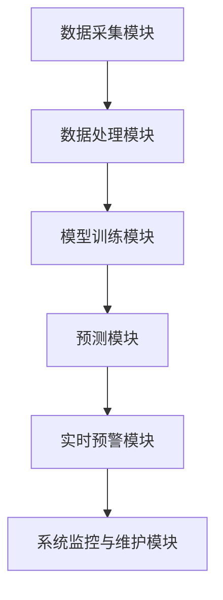
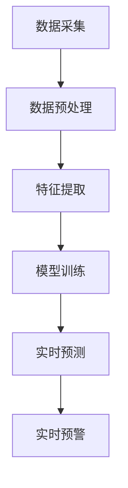
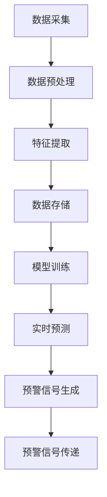

                 

### 第一部分：引言

#### 第1章：引言

##### 1.1 问题背景

金融市场作为现代经济体系的重要组成部分，其波动性和不确定性一直是学者和从业者关注的热点。在金融市场中，黑天鹅事件是一种极为罕见的、难以预测且影响巨大的事件。这类事件的特点是：发生概率极低，但一旦发生，其影响范围广泛，难以预料，往往会导致金融市场的大幅波动，甚至引发系统性风险。

黑天鹅事件的概念最早由著名的风险管理专家纳西姆·尼古拉斯·塔勒布提出。他将其定义为那些不可预测且具有重大影响的稀有事件。金融市场的黑天鹅事件，如2008年的全球金融危机、1997年的亚洲金融危机，都是典型的例子。这些事件的发生，不仅导致市场参与者损失惨重，还对全球经济产生了深远的影响。

##### 1.2 问题描述

金融市场黑天鹅事件的难以预测性，使其成为金融市场风险管理中的一个难题。传统的金融市场预警系统主要依赖于历史数据和统计模型，通过对市场数据进行趋势分析和模式识别，来预测未来的市场走势。然而，这些方法在面对黑天鹅事件时，往往显得无能为力。原因在于，黑天鹅事件具有以下特点：

1. **不可预测性**：黑天鹅事件往往无法通过已有的数据和模型进行预测。
2. **突发性**：黑天鹅事件往往在短时间内突然爆发，给市场带来巨大的冲击。
3. **冲击性**：黑天鹅事件的发生，可能导致市场出现大幅波动，甚至引发系统性风险。

因此，现有的金融市场预警系统在面对黑天鹅事件时，存在以下问题：

1. **预警不及时**：由于黑天鹅事件的突发性，传统预警系统往往无法在事件发生前及时发出预警。
2. **预警不准确**：传统预警系统依赖于历史数据和统计模型，对未知或突发事件的预测能力有限。
3. **预警范围狭窄**：传统预警系统主要关注历史数据和常见市场模式，对极端事件和未知风险的识别能力不足。

##### 1.3 问题解决

针对上述问题，本文提出了一种基于人工智能的金融市场黑天鹅事件预警系统。该系统通过引入人工智能技术，特别是机器学习和深度学习算法，对金融市场的数据进行深入分析和挖掘，以提高对黑天鹅事件的预警能力和准确性。具体来说，该系统包括以下几个关键模块：

1. **数据采集与预处理**：从多个数据源获取金融市场数据，包括股票、债券、期货等市场数据，以及其他相关经济指标。对数据进行清洗、去噪和归一化处理，以确保数据质量。
2. **特征工程**：通过对数据进行特征提取和选择，将原始数据转化为适合机器学习的特征向量。特征工程是预警系统性能的关键因素，直接影响到模型的预测效果。
3. **AI模型选择与应用**：选择合适的机器学习和深度学习模型，对特征向量进行训练和预测。本文将探讨多种模型，包括传统监督学习模型、深度学习模型和集成学习方法。
4. **预警系统设计与实现**：设计并实现一个完整的预警系统，包括系统架构、数据处理流程和实时预警机制。系统需要具备实时处理数据的能力，以便在黑天鹅事件发生时，及时发出预警。
5. **预警效果评估**：通过多种评估指标和方法，对预警系统的效果进行评估和优化。评估结果将用于指导系统的进一步改进和优化。

##### 1.4 边界与外延

本文的研究范围主要关注于金融市场中的黑天鹅事件预警系统，不包括宏观经济政策和系统性风险等宏观层面的讨论。同时，本文将主要讨论技术层面的解决方案，如机器学习算法的选择和应用、系统架构的设计等，不涉及具体的经济理论分析。

##### 1.5 概念结构与核心要素组成

AI驱动的金融市场黑天鹅事件预警系统的核心概念和要素主要包括以下几个方面：

1. **数据采集与预处理**：数据是预警系统的基石。系统需要从多个数据源获取金融市场数据，并对数据进行预处理，以保证数据的完整性和准确性。
2. **特征工程**：通过对数据进行特征提取和选择，将原始数据转化为适合机器学习的特征向量。特征工程直接影响到模型的性能，是系统性能的关键因素。
3. **AI模型**：选择合适的机器学习和深度学习模型，对特征向量进行训练和预测。不同的模型具有不同的优缺点，需要根据具体情况进行选择。
4. **系统架构**：设计并实现一个完整的预警系统，包括数据处理模块、模型训练模块、预测模块和实时预警模块。系统需要具备高效、稳定和可扩展的特点。
5. **预警效果评估**：通过多种评估指标和方法，对预警系统的效果进行评估和优化。评估结果将用于指导系统的进一步改进和优化。

### 总结

本文引言部分详细介绍了金融市场黑天鹅事件的背景和问题，提出了基于人工智能的预警系统作为解决方案，并阐述了系统的核心概念和组成结构。在接下来的章节中，我们将逐步深入探讨这一系统的各个关键组成部分，包括数据采集与预处理、特征工程、AI模型选择与应用、系统设计与实现、预警效果评估等，以期为读者提供一个全面、深入的技术分析。接下来，我们将进入第二部分，详细探讨AI驱动的金融市场黑天鹅事件和预警系统的核心概念与联系。

### 目录大纲结构分析

- **第一部分：引言**（第1章）
  - **第1章：引言**
    - **1.1 问题背景**：介绍了金融市场黑天鹅事件的背景，包括其定义、原因和影响。
    - **1.2 问题描述**：详细阐述了金融市场黑天鹅事件的特性，如难以预测、突发性和冲击性，并分析了现有预警系统在应对黑天鹅事件方面的不足。
    - **1.3 问题解决**：提出了使用AI驱动的预警系统作为解决方向，并概述了该系统的核心模块和功能。
    - **1.4 边界与外延**：明确了讨论的范围和系统的核心概念与组成结构。
    - **1.5 概念结构与核心要素组成**：梳理了AI驱动的金融市场黑天鹅预警系统的基本概念和组成部分，包括数据采集与预处理、特征工程、AI模型、系统架构和预警效果评估。

- **第二部分：核心概念与联系**（第2章）
  - **第2章：核心概念与联系**
    - **2.1 AI驱动的金融市场黑天鹅事件**
      - **2.1.1 定义与特征**：详细定义了黑天鹅事件，并介绍了其基本特征。
      - **2.1.2 类型与分布**：分类讨论了不同类型的黑天鹅事件，以及它们在金融市场中的分布情况。
      - **2.1.3 历史案例分析**：通过具体案例，分析了黑天鹅事件对金融市场的影响。
    - **2.2 金融市场预警系统概述**
      - **2.2.1 功能与目的**：阐述了预警系统的基本功能和预期目标。
      - **2.2.2 现有预警系统分析**：分析了当前金融市场预警系统的优缺点。
      - **2.2.3 预警系统的发展趋势**：探讨了预警系统未来的发展方向和技术创新。

- **第三部分：预警系统构建基础**（第3章）
  - **第3章：预警系统构建基础**
    - **3.1 数据采集与预处理**
      - **3.1.1 数据源选择**：介绍了选择数据源的原则和方法。
      - **3.1.2 数据预处理流程**：详细描述了数据预处理的过程，包括清洗、去噪、归一化等步骤。
      - **3.1.3 数据质量评估**：讨论了数据质量评估的方法和指标。
    - **3.2 特征工程**
      - **3.2.1 特征选择方法**：介绍了特征选择的方法和技巧。
      - **3.2.2 特征提取技术**：讨论了特征提取的技术和方法。
      - **3.2.3 特征标准化与转换**：介绍了特征标准化和转换的方法。

通过上述目录大纲结构分析，可以看出文章的结构清晰、逻辑严密，各个部分紧密相连，共同构成了一个完整的技术分析框架。接下来，我们将进一步深入探讨AI驱动的金融市场黑天鹅事件和预警系统的核心概念与联系，为后续的构建和实现打下坚实的基础。

### 第二部分：核心概念与联系

#### 第2章：核心概念与联系

##### 2.1 AI驱动的金融市场黑天鹅事件

##### 2.1.1 定义与特征

黑天鹅事件（Black Swan Event）最早由纳西姆·尼古拉斯·塔勒布在其畅销书《黑天鹅：如何应对不可预知的未来》中提出。黑天鹅事件是指那些极少发生、但一旦发生就会带来巨大影响的事件。这些事件具有以下特征：

1. **不可预测性**：黑天鹅事件通常难以通过已有的数据和模型进行预测，因为它们的发生往往打破了常规和预期。
2. **突发性**：这些事件往往在短时间内突然爆发，给市场带来巨大的冲击。
3. **冲击性**：黑天鹅事件一旦发生，其影响范围广泛，程度深远，可能导致市场出现大幅波动，甚至引发系统性风险。

在金融市场中，黑天鹅事件的表现形式多样，如2008年的全球金融危机、1997年的亚洲金融危机、1987年的黑色星期一等，都是典型的例子。这些事件不仅对金融市场产生了深远的影响，还对全球经济和社会稳定带来了巨大的挑战。

##### 2.1.2 类型与分布

黑天鹅事件可以根据其影响范围和性质进行分类。以下是几种常见的类型：

1. **经济黑天鹅**：这类事件通常对经济体系产生深远的影响，如2008年的全球金融危机。
2. **政治黑天鹅**：这类事件涉及政治动荡、政策变化等，如英国脱欧、美国的政治选举结果等。
3. **技术黑天鹅**：这类事件与技术创新和科技革命有关，如互联网的兴起、区块链技术的出现等。
4. **自然灾害黑天鹅**：这类事件包括地震、飓风、疫情等，如2004年的印度洋海啸、2019年的新冠疫情。

黑天鹅事件在金融市场中的分布并不均匀，它们往往具有以下几个特点：

1. **低概率高影响**：黑天鹅事件的发生概率较低，但一旦发生，其影响可能是灾难性的。
2. **长时间跨度**：黑天鹅事件的影响往往持续较长时间，甚至可能对市场产生长期的影响。
3. **不可预测性**：由于黑天鹅事件的不可预测性，市场往往无法提前做好准备，导致风险加剧。

##### 2.1.3 历史案例分析

为了更好地理解黑天鹅事件在金融市场中的影响，我们可以通过一些具体的历史案例进行分析。

1. **2008年全球金融危机**：这场危机起源于美国次贷危机，迅速蔓延到全球金融市场。次贷危机的爆发导致了全球范围内的信贷紧缩，金融市场动荡不安，大量金融机构倒闭或陷入危机。这场危机的直接原因是美国房地产市场泡沫破裂，但深层次原因则涉及金融衍生品、监管缺失等多个方面。

2. **1997年亚洲金融危机**：这场危机始于泰国，迅速扩散到整个东南亚地区，并影响到东亚和拉美地区。危机的主要原因是过度依赖外国资本和金融衍生品，以及货币贬值引发的金融恐慌。这场危机导致了多个国家货币贬值、股市崩溃和大规模企业倒闭。

3. **1987年黑色星期一**：这一天，美国股市出现了前所未有的暴跌，道琼斯工业平均指数单日跌幅超过20%。这场危机的直接原因是市场过度投机和杠杆化，但深层次原因则涉及金融监管、市场心理等多个方面。

这些历史案例表明，黑天鹅事件具有不可预测性、突发性和冲击性，它们对金融市场的影响深远而复杂。为了应对这些挑战，市场需要开发更有效的预警系统，以便在事件发生前及时发现和预防。

##### 2.2 金融市场预警系统概述

金融市场预警系统是指通过技术手段对金融市场进行实时监测和预警，以预测潜在的市场风险和异常波动。这类系统通常包括以下几个主要功能：

1. **数据采集与预处理**：从多个数据源获取金融市场数据，如股票、债券、期货等，并进行清洗、去噪和归一化处理，以确保数据的完整性和准确性。
2. **特征提取与选择**：通过对数据进行特征提取和选择，将原始数据转化为适合机器学习的特征向量。特征提取是预警系统性能的关键因素。
3. **风险模型构建**：利用机器学习和深度学习算法，构建能够识别潜在风险的模型。这些模型可以根据历史数据和实时数据，对市场风险进行预测和评估。
4. **实时预警与报警**：根据风险模型的预测结果，系统可以实时发出预警信号，提示市场参与者注意潜在的风险。

现有的金融市场预警系统主要包括以下几种类型：

1. **统计预警系统**：这类系统主要基于历史数据和统计模型，通过对市场数据进行趋势分析和模式识别，来预测未来的市场走势。这类系统的优点是简单易懂，缺点是预测能力有限，难以应对突发性的黑天鹅事件。
2. **机器学习预警系统**：这类系统利用机器学习和深度学习算法，对金融市场数据进行深入分析和挖掘，以提高预测的准确性和实时性。这类系统的优点是预测能力较强，但需要大量数据和高性能计算资源。
3. **混合预警系统**：这类系统结合了统计方法和机器学习方法，通过多种模型和算法的集成，以提高预警系统的综合性能。

金融市场预警系统的发展趋势主要包括以下几个方面：

1. **智能化**：随着人工智能技术的不断发展，预警系统将更加智能化，能够自动识别和预测潜在的市场风险。
2. **实时化**：预警系统将实现实时监测和预警，能够在事件发生前及时发出预警信号。
3. **多样化**：预警系统将支持多种类型的数据源和模型，以应对不同的市场风险和挑战。
4. **集成化**：预警系统将与其他金融技术，如区块链、大数据等相结合，形成更完整的金融风险管理体系。

### 总结

第二部分详细介绍了AI驱动的金融市场黑天鹅事件和预警系统的核心概念与联系。通过定义黑天鹅事件、分析其类型与分布，以及探讨历史案例，我们深入了解了黑天鹅事件在金融市场中的影响。同时，我们对金融市场预警系统的主要功能、类型和发展趋势进行了全面探讨，为构建和实现高效的预警系统奠定了基础。在下一部分中，我们将深入探讨预警系统构建的基础，包括数据采集与预处理、特征工程等内容。

### 预警系统构建基础

#### 第3章：预警系统构建基础

##### 3.1 数据采集与预处理

数据采集是构建金融市场预警系统的第一步，也是至关重要的一步。金融市场的数据来源广泛，包括股票、债券、期货、外汇等多种市场数据，以及其他相关经济指标，如GDP、通货膨胀率、失业率等。为了确保数据的完整性和准确性，需要从多个数据源获取数据，并采用合适的方法进行数据预处理。

##### 3.1.1 数据源选择

选择合适的数据源是数据采集的关键。以下是几种常见的数据源：

1. **公共数据源**：如Yahoo Finance、Google Finance等，提供股票、债券等金融市场的历史数据。
2. **交易所数据**：如纽约证券交易所（NYSE）、纳斯达克（NASDAQ）等，提供实时交易数据和公告信息。
3. **政府数据**：如美国劳工统计局（Bureau of Labor Statistics）、美国经济分析局（Bureau of Economic Analysis）等，提供宏观经济指标数据。
4. **金融数据库**：如Bloomberg、Reuters等，提供详细的金融数据和市场分析报告。

在选择数据源时，应考虑以下因素：

1. **数据的完整性和准确性**：选择数据完整、准确的数据源，以确保后续分析的可靠性。
2. **数据的实时性**：对于金融市场预警系统，实时数据尤为重要，因为市场波动往往发生在瞬间。
3. **数据的安全性**：确保数据源提供的数据符合法律法规要求，不存在数据泄露或滥用风险。

##### 3.1.2 数据预处理流程

数据预处理是数据采集后的关键步骤，其目的是清洗、去噪、归一化等，以提高数据的可用性和质量。以下是常见的数据预处理流程：

1. **数据清洗**：去除重复数据、缺失值填充、纠正错误数据等。例如，可以使用平均值、中位数、插值等方法来填充缺失值。
2. **去噪**：去除噪声数据和异常值，以提高数据的准确性。可以使用统计学方法、机器学习方法等来识别和去除异常值。
3. **归一化**：将不同量纲的数据转换为相同量纲，以便于后续分析和建模。常用的归一化方法包括最小-最大归一化、Z-Score归一化等。
4. **特征工程**：从原始数据中提取有用的特征，并选择合适的特征。特征工程是提高模型性能的关键，将在后续章节详细讨论。

##### 3.1.3 数据质量评估

数据质量是预警系统性能的基础，因此需要对数据质量进行评估。以下是几种常见的数据质量评估方法：

1. **完整性评估**：检查数据的完整性和一致性，例如是否存在缺失值、重复值等。
2. **准确性评估**：检查数据的准确性和可靠性，例如数据来源是否可靠、数据是否经过清洗和去噪等。
3. **一致性评估**：检查数据在不同数据源之间的一致性，例如交易所数据和公共数据源之间的差异。
4. **及时性评估**：检查数据的实时性和更新速度，对于金融市场预警系统，实时数据尤为重要。

通过上述评估方法，可以确保数据的质量，从而提高预警系统的可靠性和预测准确性。

##### 3.2 特征工程

特征工程是数据预处理后的重要步骤，其目的是从原始数据中提取有用的特征，并选择合适的特征，以提高模型的预测性能。以下是特征工程的主要任务和方法：

##### 3.2.1 特征选择方法

特征选择是指从大量原始特征中筛选出对模型预测最有用的特征。以下是几种常见的特征选择方法：

1. **过滤法**：通过统计学方法直接筛选特征，例如信息增益、卡方检验、相关系数等。
2. **包装法**：通过训练模型并评估特征对模型性能的影响，选择对模型性能贡献最大的特征，例如递归特征消除（RFE）、遗传算法等。
3. **嵌入式方法**：在模型训练过程中自动筛选特征，例如随机森林、Lasso等。

##### 3.2.2 特征提取技术

特征提取是指从原始数据中生成新的特征，以增加模型的信息量。以下是几种常见的特征提取技术：

1. **统计分析**：使用统计学方法提取特征，例如时间序列分析、主成分分析（PCA）等。
2. **机器学习方法**：使用机器学习算法提取特征，例如聚类分析、特征选择算法等。
3. **深度学习方法**：使用深度学习模型提取特征，例如卷积神经网络（CNN）、循环神经网络（RNN）等。

##### 3.2.3 特征标准化与转换

特征标准化和转换是指将不同量纲的特征转换为相同量纲，以提高模型的稳定性和性能。以下是几种常见的特征标准化和转换方法：

1. **归一化**：将特征值缩放到[0, 1]或[-1, 1]之间，常用的方法包括最小-最大归一化和Z-Score归一化。
2. **标准化**：将特征值缩放到标准正态分布，常用的方法包括Z-Score标准化。
3. **离散化**：将连续特征转换为离散特征，常用的方法包括等宽离散化和等频离散化。

通过上述特征工程步骤，可以显著提高预警系统的预测性能，为后续的模型训练和预警提供可靠的基础。

### 总结

第三部分详细介绍了预警系统构建的基础，包括数据采集与预处理、特征工程等内容。通过选择合适的数据源、进行数据预处理和特征工程，可以确保数据的完整性和准确性，为预警系统的构建提供坚实的基础。在下一部分中，我们将深入探讨AI模型的选择与应用，以进一步提升预警系统的性能和预测准确性。

### AI模型选择与应用

#### 第4章：AI模型选择与应用

在构建金融市场黑天鹅事件预警系统时，选择合适的AI模型是关键。AI模型在预测金融市场波动、识别潜在风险方面具有显著优势。本节将详细介绍几种常见的AI模型，包括监督学习模型和集成学习方法，并探讨它们在预警系统中的应用。

##### 4.1 监督学习模型

监督学习模型是一类基于已有标签数据（即输入和输出对）进行训练，然后对新的输入数据进行预测的机器学习模型。在金融市场预警系统中，监督学习模型可用于预测市场的波动性和识别黑天鹅事件。

##### 4.1.1 传统监督学习模型

传统监督学习模型包括线性回归、逻辑回归、决策树、随机森林等。以下是这些模型的特点和适用场景：

1. **线性回归**：线性回归是一种最简单的监督学习模型，适用于线性关系的预测。其优点是计算简单，易于理解和实现。缺点是对非线性关系和异常值的鲁棒性较差。

2. **逻辑回归**：逻辑回归是一种广义线性模型，用于分类问题。它通过估计概率来预测市场状态。逻辑回归的优点是模型简单，易于解释，缺点是对于非线性关系和复杂数据集的拟合能力较差。

3. **决策树**：决策树通过一系列规则来划分数据，并使用叶子节点进行预测。其优点是模型易于理解和解释，对于处理分类问题效果较好。缺点是对于连续特征的拟合能力有限，且容易过拟合。

4. **随机森林**：随机森林是一种基于决策树的集成学习方法，通过构建多棵决策树并进行集成来提高模型的预测性能。随机森林的优点是能够处理大量特征和高维度数据，提高模型的鲁棒性和泛化能力。缺点是模型复杂度较高，计算成本较大。

##### 4.1.2 深度学习模型

深度学习模型是一类基于多层神经网络进行训练的模型，具有强大的特征提取和模式识别能力。在金融市场预警系统中，深度学习模型可以用于处理高维度、非线性数据，并提高预测准确性。

1. **卷积神经网络（CNN）**：卷积神经网络主要用于图像处理，但也可用于处理时间序列数据。通过卷积层、池化层和全连接层等结构，CNN能够自动提取时间序列数据中的特征。其优点是能够处理高维度数据，提取深层特征。缺点是模型复杂度高，训练时间较长。

2. **循环神经网络（RNN）**：循环神经网络适用于处理序列数据，如时间序列和文本数据。通过递归结构，RNN能够保留历史信息，对时间序列数据进行建模。其优点是能够处理序列依赖性，捕捉时间序列中的长期依赖关系。缺点是梯度消失和梯度爆炸问题，训练不稳定。

3. **长短期记忆网络（LSTM）**：长短期记忆网络是RNN的一种变体，用于解决RNN的梯度消失问题。通过引入门控机制，LSTM能够更好地处理长期依赖关系，对时间序列数据进行建模。其优点是能够处理长时间序列数据，捕捉长期依赖关系。缺点是模型复杂度较高，训练成本较大。

##### 4.1.3 模型评估与选择

在选择合适的AI模型时，需要考虑模型的性能、可解释性和计算成本。以下是几种常用的模型评估指标和方法：

1. **准确率（Accuracy）**：准确率是分类模型最常用的评估指标，表示预测正确的样本数占总样本数的比例。

2. **召回率（Recall）**：召回率表示在所有实际为正样本的样本中，被正确预测为正样本的比例。

3. **精确率（Precision）**：精确率表示在所有预测为正样本的样本中，实际为正样本的比例。

4. **F1值（F1 Score）**：F1值是精确率和召回率的调和平均值，综合考虑了模型的精确性和召回率。

5. **ROC曲线和AUC值**：ROC曲线是用于评估分类模型性能的有效工具，AUC值表示ROC曲线下的面积，反映了模型的分类能力。

在模型选择过程中，可以根据评估指标和业务需求，综合考虑模型的性能和适用性。通常，可以先使用传统监督学习模型进行初步预测，然后结合深度学习模型进行进一步优化和提升。

##### 4.2 集成学习方法

集成学习方法是一类通过组合多个基学习器来提高模型预测性能的方法。在金融市场预警系统中，集成学习方法可以有效地提高模型的泛化能力和预测准确性。

1. **Bagging方法**：Bagging方法通过多次训练并集成多个基学习器来提高模型性能。常用的Bagging方法包括随机森林（Random Forest）和随机基础样本（Bootstrap Aggregating，Bagging）等。

2. **Boosting方法**：Boosting方法通过多次训练并调整基学习器的权重，使模型能够关注并纠正前一次训练中的错误。常用的Boosting方法包括Adaboost和XGBoost等。

3. **Stacking方法**：Stacking方法通过训练多个基学习器，并将它们的预测结果作为新的特征进行模型训练。Stacking方法的优点是能够结合不同学习器的优势，提高模型的综合性能。

在金融市场预警系统中，集成学习方法可以有效地结合不同模型的优点，提高模型的预测性能。例如，可以先使用随机森林进行初步预测，然后结合LSTM和CNN的预测结果进行进一步优化。

##### 4.2.1 集成学习方法概述

集成学习方法通过组合多个基学习器来提高模型性能，其基本思想是利用多个模型的优点，弥补单个模型的不足。以下是几种常见的集成学习方法：

1. **Bagging方法**：Bagging方法通过多次训练并集成多个基学习器来提高模型性能。每次训练时，从训练集中随机抽取一定比例的数据作为训练集，构建多个基学习器。最后，将多个基学习器的预测结果进行平均或投票，得到最终预测结果。

2. **Boosting方法**：Boosting方法通过多次训练并调整基学习器的权重，使模型能够关注并纠正前一次训练中的错误。每次训练时，根据前一次训练的错误率，调整训练集中样本的权重，使模型在错误样本上投入更多训练资源。常用的Boosting方法包括Adaboost和XGBoost等。

3. **Stacking方法**：Stacking方法通过训练多个基学习器，并将它们的预测结果作为新的特征进行模型训练。Stacking方法的优点是能够结合不同学习器的优势，提高模型的综合性能。具体实现时，通常先使用多个基学习器对训练集进行预测，然后将这些预测结果作为特征，训练一个高级模型进行最终预测。

在金融市场预警系统中，集成学习方法可以有效地结合不同模型的优点，提高模型的预测性能。例如，可以先使用随机森林进行初步预测，然后结合LSTM和CNN的预测结果进行进一步优化。

##### 4.2.2 主流集成学习方法

以下是几种在金融市场预警系统中应用较为广泛的主流集成学习方法：

1. **随机森林（Random Forest）**：随机森林是一种基于Bagging方法的集成学习方法，通过构建多棵决策树并进行集成来提高模型性能。随机森林的优点是能够处理大量特征和高维度数据，提高模型的鲁棒性和泛化能力。

2. **XGBoost**：XGBoost是一种基于Boosting方法的集成学习方法，通过引入正则化项和样本权重，提高模型的预测性能。XGBoost在处理高维度数据和非线性关系方面具有显著优势，是金融市场预警系统中常用的模型之一。

3. **LightGBM**：LightGBM是一种基于树模型的集成学习方法，通过引入特征排序和节点分裂优化，提高模型的训练速度和预测性能。LightGBM在处理大规模数据集和实时预测方面具有优势。

4. **CatBoost**：CatBoost是一种基于梯度提升方法的集成学习方法，通过引入类别特征和样本权重，提高模型的预测性能。CatBoost在处理类别特征和稀疏数据方面具有优势。

在金融市场预警系统中，这些集成学习方法可以结合使用，以提高模型的预测准确性和稳定性。例如，可以先使用随机森林进行初步预测，然后结合XGBoost和LightGBM进行进一步优化。

##### 4.2.3 集成学习应用实例

以下是一个简单的集成学习应用实例，展示了如何使用Python中的scikit-learn库实现随机森林模型。

```python
from sklearn.datasets import load_iris
from sklearn.model_selection import train_test_split
from sklearn.ensemble import RandomForestClassifier
from sklearn.metrics import accuracy_score

# 加载数据
iris = load_iris()
X = iris.data
y = iris.target

# 划分训练集和测试集
X_train, X_test, y_train, y_test = train_test_split(X, y, test_size=0.2, random_state=42)

# 构建随机森林模型
rf = RandomForestClassifier(n_estimators=100, random_state=42)

# 训练模型
rf.fit(X_train, y_train)

# 预测测试集
y_pred = rf.predict(X_test)

# 计算准确率
accuracy = accuracy_score(y_test, y_pred)
print("Accuracy:", accuracy)
```

在这个实例中，我们使用了scikit-learn库中的`RandomForestClassifier`类来构建随机森林模型，并使用`fit`方法进行模型训练。最后，我们使用`predict`方法对测试集进行预测，并使用`accuracy_score`函数计算预测准确率。

通过上述实例，我们可以看到如何使用Python实现集成学习模型。在实际的金融市场预警系统中，可以结合多种集成学习方法，以提高模型的预测性能。

### 总结

第四部分详细介绍了AI模型的选择与应用，包括监督学习模型和集成学习方法。我们分析了传统监督学习模型和深度学习模型的特点和适用场景，并探讨了集成学习方法在提高模型性能方面的优势。通过结合多种模型和方法，可以构建高效的金融市场黑天鹅事件预警系统。在下一部分中，我们将探讨预警系统设计与实现，包括系统架构设计、数据处理流程和实时预警机制等内容。

### 预警系统设计与实现

#### 第5章：预警系统设计与实现

在构建高效的金融市场黑天鹅事件预警系统时，系统设计与实现是关键的一步。本节将详细介绍预警系统的设计与实现过程，包括系统架构设计、数据处理流程、实时预警机制等内容。

##### 5.1 系统架构设计

系统架构设计是预警系统实现的基础，决定了系统的性能、可扩展性和可维护性。以下是预警系统架构设计的主要组成部分：

1. **数据采集模块**：负责从多个数据源（如交易所、公共数据源等）获取金融市场数据，并进行初步处理。数据采集模块需要具备高效的数据获取和处理能力，以保证实时数据的及时性。

2. **数据处理模块**：负责对采集到的数据进行清洗、去噪、归一化等预处理操作，确保数据质量。数据处理模块还需要进行特征工程，提取有用的特征，以供后续模型训练使用。

3. **模型训练模块**：负责使用预处理后的数据对AI模型进行训练。模型训练模块需要支持多种机器学习和深度学习算法，以选择最优的模型进行预测。

4. **预测模块**：负责对实时数据进行预测，识别潜在的市场风险和黑天鹅事件。预测模块需要具备高效的预测能力，以确保在事件发生前及时发出预警。

5. **实时预警模块**：负责根据预测结果，实时向市场参与者发出预警信号。实时预警模块需要具备快速响应能力，以确保预警信息的及时传递。

6. **系统监控与维护模块**：负责监控系统运行状态，包括数据流、模型性能、系统资源等。系统监控与维护模块可以及时发现并处理系统故障，确保系统的稳定运行。

以下是预警系统的总体架构图：



##### 5.2 数据流设计与处理流程

数据流设计是预警系统实现的核心，决定了系统的数据处理效率和实时性。以下是预警系统的数据流设计：

1. **数据采集**：系统从多个数据源（如交易所、公共数据源等）获取金融市场数据。数据采集模块使用API或其他数据接口，实现数据的实时获取。

2. **数据预处理**：采集到的原始数据进行清洗、去噪、归一化等预处理操作。数据处理模块使用并行处理技术，提高数据预处理效率。

3. **特征提取**：对预处理后的数据进行特征提取，生成特征向量。特征提取模块使用特征工程方法，选择对模型预测最有用的特征。

4. **模型训练**：使用训练集对AI模型进行训练。模型训练模块使用机器学习和深度学习算法，选择最优的模型进行预测。

5. **实时预测**：对实时数据进行预测，识别潜在的市场风险和黑天鹅事件。预测模块使用训练好的模型，进行高效的实时预测。

6. **实时预警**：根据预测结果，实时向市场参与者发出预警信号。实时预警模块使用短信、邮件、微信等渠道，实现预警信号的及时传递。

以下是预警系统的数据流设计图：



##### 5.2.1 数据流设计

数据流设计是预警系统的关键环节，决定了系统的数据处理效率和实时性。以下是预警系统的数据流设计：

1. **数据采集**：系统从多个数据源（如交易所、公共数据源等）获取金融市场数据。数据采集模块使用API或其他数据接口，实现数据的实时获取。

2. **数据预处理**：采集到的原始数据进行清洗、去噪、归一化等预处理操作。数据处理模块使用并行处理技术，提高数据预处理效率。

3. **特征提取**：对预处理后的数据进行特征提取，生成特征向量。特征提取模块使用特征工程方法，选择对模型预测最有用的特征。

4. **模型训练**：使用训练集对AI模型进行训练。模型训练模块使用机器学习和深度学习算法，选择最优的模型进行预测。

5. **实时预测**：对实时数据进行预测，识别潜在的市场风险和黑天鹅事件。预测模块使用训练好的模型，进行高效的实时预测。

6. **实时预警**：根据预测结果，实时向市场参与者发出预警信号。实时预警模块使用短信、邮件、微信等渠道，实现预警信号的及时传递。

以下是预警系统的数据流设计图：


##### 5.2.2 数据处理流程

数据处理流程是预警系统实现的核心，决定了系统的数据处理效率和实时性。以下是预警系统的数据处理流程：

1. **数据采集**：系统从多个数据源（如交易所、公共数据源等）获取金融市场数据。数据采集模块使用API或其他数据接口，实现数据的实时获取。

2. **数据预处理**：采集到的原始数据进行清洗、去噪、归一化等预处理操作。数据处理模块使用并行处理技术，提高数据预处理效率。

3. **特征提取**：对预处理后的数据进行特征提取，生成特征向量。特征提取模块使用特征工程方法，选择对模型预测最有用的特征。

4. **数据存储**：将预处理后的数据存储到数据库或数据仓库中，以便后续查询和使用。

5. **模型训练**：使用训练集对AI模型进行训练。模型训练模块使用机器学习和深度学习算法，选择最优的模型进行预测。

6. **实时预测**：对实时数据进行预测，识别潜在的市场风险和黑天鹅事件。预测模块使用训练好的模型，进行高效的实时预测。

7. **预警信号生成**：根据预测结果，生成预警信号。预警信号包括市场波动预警、风险等级预警等。

8. **预警信号传递**：将预警信号通过短信、邮件、微信等渠道，实时传递给市场参与者。

以下是预警系统的数据处理流程图：



##### 5.2.3 实时数据处理技术

实时数据处理是预警系统的关键，决定了系统的响应速度和预警准确性。以下是几种常用的实时数据处理技术：

1. **消息队列**：消息队列是一种异步消息传递系统，用于实现数据的实时传输和处理。常用的消息队列系统包括RabbitMQ、Kafka等。

2. **流处理框架**：流处理框架用于实时处理和分析大规模数据流。常用的流处理框架包括Apache Storm、Apache Flink等。

3. **内存数据库**：内存数据库具有快速读写能力和高并发性能，适用于实时数据处理场景。常用的内存数据库包括Redis、Memcached等。

4. **分布式计算**：分布式计算通过将任务分配到多个计算节点，实现大规模数据的并行处理。常用的分布式计算框架包括Hadoop、Spark等。

通过结合以上实时数据处理技术，可以构建高效的实时预警系统，确保在事件发生前及时发出预警信号。

### 总结

第五部分详细介绍了预警系统的设计与实现，包括系统架构设计、数据处理流程和实时预警机制等内容。通过合理的设计和高效的实现，可以构建一个具备实时预警能力的金融市场黑天鹅事件预警系统。在下一部分中，我们将探讨预警系统的部署与优化，包括系统部署策略、预警效果评估和优化方法等内容。

### 预警系统部署与优化

#### 第6章：预警系统部署与优化

预警系统的部署与优化是确保其稳定运行和高性能的关键环节。本节将详细探讨预警系统的部署策略、部署流程、系统监控与维护、预警效果评估以及优化方法。

##### 6.1 系统部署

系统部署是预警系统上线运行的第一步，需要综合考虑硬件资源、软件环境、网络配置等因素，以确保系统的高可用性和稳定性。以下是系统部署的主要步骤：

1. **硬件资源分配**：根据系统的需求，合理分配服务器、存储和网络带宽等硬件资源。考虑到系统的可扩展性，可以选择分布式部署，将计算和存储任务分配到多个节点，以提高系统的处理能力和容错能力。

2. **软件环境配置**：配置操作系统、数据库、中间件等软件环境。例如，选择稳定高效的Linux发行版作为操作系统，配置高性能的数据库系统（如MySQL、PostgreSQL）和消息队列系统（如Kafka）。

3. **部署工具选择**：选择合适的部署工具，如Docker、Kubernetes等，实现系统的自动化部署和扩展。Docker可以将应用及其依赖环境打包为容器，确保系统在不同的环境中具有一致的运行效果；Kubernetes则提供了容器编排和管理功能，便于系统的自动化部署和扩展。

4. **部署流程设计**：设计并实施详细的部署流程，包括部署前的环境检查、部署脚本编写、部署过程监控等。部署脚本可以自动化执行系统配置、数据库初始化、服务启动等任务，确保部署过程的高效和可靠。

5. **测试与验证**：在部署过程中，进行全面的测试和验证，包括功能测试、性能测试、安全测试等，确保系统在部署后能够稳定运行并满足预期性能。

##### 6.1.1 部署策略与工具

预警系统的部署策略和工具选择对系统的稳定性和性能至关重要。以下是几种常见的部署策略和工具：

1. **分布式部署**：将系统分为多个模块，部署到不同的服务器上，以提高系统的可扩展性和容错能力。例如，将数据采集模块、数据处理模块、模型训练模块等分别部署到不同的服务器上，利用负载均衡器（如Nginx、HAProxy）实现负载均衡和故障转移。

2. **容器化部署**：使用Docker等容器化技术，将系统打包为容器，实现系统的轻量级部署和快速部署。容器化部署具有以下优点：
   - **轻量级**：容器化部署不需要在宿主机上安装额外的软件，只需安装Docker环境即可运行。
   - **一致性**：容器化部署保证了系统在不同的环境中具有一致的运行效果，减少了环境差异带来的问题。
   - **可扩展性**：容器化部署便于系统的扩展和升级，可以通过增加容器数量来提高系统性能。

3. **自动化部署**：使用自动化部署工具（如Jenkins、Ansible）实现系统的自动化部署，提高部署效率和可靠性。自动化部署工具可以自动化执行部署脚本、环境配置、服务启动等任务，减少人为干预，确保部署过程的高效和稳定。

##### 6.1.2 部署流程与步骤

以下是预警系统的部署流程和步骤：

1. **需求分析**：明确系统的需求和目标，包括功能需求、性能需求、安全需求等。

2. **硬件资源评估**：评估系统所需的硬件资源，包括CPU、内存、存储、网络带宽等，选择合适的服务器和存储设备。

3. **软件环境配置**：配置操作系统、数据库、中间件等软件环境，确保系统在不同的环境中具有一致的运行效果。

4. **部署脚本编写**：编写部署脚本，包括系统配置、数据库初始化、服务启动等任务。

5. **部署环境准备**：在目标服务器上安装操作系统、数据库、中间件等软件环境，并配置网络和防火墙规则。

6. **自动化部署**：使用自动化部署工具执行部署脚本，实现系统的自动化部署。

7. **测试与验证**：在部署后进行全面的测试和验证，包括功能测试、性能测试、安全测试等。

8. **部署监控与维护**：部署完成后，监控系统运行状态，定期进行维护和升级。

##### 6.1.3 系统监控与维护

系统监控与维护是确保预警系统稳定运行的关键。以下是系统监控与维护的主要任务：

1. **性能监控**：监控系统的CPU、内存、存储、网络等资源使用情况，及时发现和处理性能瓶颈。

2. **日志管理**：收集和存储系统日志，进行日志分析和报警，及时发现和解决系统问题。

3. **安全监控**：监控系统的安全事件，如DDoS攻击、SQL注入等，确保系统的安全性。

4. **定期维护**：定期进行系统升级、备份和恢复，确保系统的稳定性和数据完整性。

5. **故障处理**：及时处理系统故障，包括硬件故障、软件故障等，确保系统的连续运行。

##### 6.2 预警效果评估

预警效果评估是验证预警系统性能和准确性的关键步骤。以下是预警效果评估的主要指标和方法：

1. **准确率**：准确率表示预测正确的样本数占总样本数的比例，用于评估模型的预测准确性。

2. **召回率**：召回率表示在所有实际为正样本的样本中，被正确预测为正样本的比例，用于评估模型对正样本的识别能力。

3. **精确率**：精确率表示在所有预测为正样本的样本中，实际为正样本的比例，用于评估模型的预测精度。

4. **F1值**：F1值是精确率和召回率的调和平均值，综合考虑了模型的精确性和召回率。

5. **ROC曲线和AUC值**：ROC曲线和AUC值用于评估模型的分类能力，AUC值越大，表示模型的分类能力越强。

以下是预警效果评估的常用方法：

1. **交叉验证**：通过交叉验证方法，对模型进行多次训练和测试，评估模型的泛化能力。

2. **A/B测试**：将训练集划分为A、B两部分，分别训练两个模型，然后比较两个模型的预测效果，选择表现更好的模型。

3. **在线评估**：在实时数据处理过程中，对模型进行在线评估，及时调整模型参数，提高预测准确性。

##### 6.2.1 评估指标与方法

以下是预警效果评估的常用指标和方法：

1. **准确率（Accuracy）**：准确率是分类模型最常用的评估指标，表示预测正确的样本数占总样本数的比例。其计算公式为：
   \[
   \text{Accuracy} = \frac{\text{预测正确的样本数}}{\text{总样本数}}
   \]

2. **召回率（Recall）**：召回率表示在所有实际为正样本的样本中，被正确预测为正样本的比例。其计算公式为：
   \[
   \text{Recall} = \frac{\text{预测为正样本且实际为正样本的样本数}}{\text{实际为正样本的样本数}}
   \]

3. **精确率（Precision）**：精确率表示在所有预测为正样本的样本中，实际为正样本的比例。其计算公式为：
   \[
   \text{Precision} = \frac{\text{预测为正样本且实际为正样本的样本数}}{\text{预测为正样本的样本数}}
   \]

4. **F1值（F1 Score）**：F1值是精确率和召回率的调和平均值，综合考虑了模型的精确性和召回率。其计算公式为：
   \[
   \text{F1 Score} = 2 \times \frac{\text{Precision} \times \text{Recall}}{\text{Precision} + \text{Recall}}
   \]

5. **ROC曲线和AUC值**：ROC曲线是用于评估分类模型性能的有效工具，AUC值表示ROC曲线下的面积，反映了模型的分类能力。AUC值越大，表示模型的分类能力越强。

以下是使用Python代码进行预警效果评估的示例：

```python
from sklearn.metrics import accuracy_score, recall_score, precision_score, f1_score, roc_auc_score
from sklearn.model_selection import train_test_split

# 加载数据
X, y = load_data()

# 划分训练集和测试集
X_train, X_test, y_train, y_test = train_test_split(X, y, test_size=0.2, random_state=42)

# 训练模型
model = train_model(X_train, y_train)

# 预测测试集
y_pred = model.predict(X_test)

# 计算评估指标
accuracy = accuracy_score(y_test, y_pred)
recall = recall_score(y_test, y_pred)
precision = precision_score(y_test, y_pred)
f1 = f1_score(y_test, y_pred)
roc_auc = roc_auc_score(y_test, y_pred)

print("Accuracy:", accuracy)
print("Recall:", recall)
print("Precision:", precision)
print("F1 Score:", f1)
print("ROC AUC:", roc_auc)
```

##### 6.2.2 评估结果分析与优化

评估预警效果后，需要对评估结果进行分析和优化。以下是评估结果分析的主要步骤：

1. **结果分析**：根据评估指标，分析模型的性能和准确性，找出模型的优点和不足。

2. **问题定位**：针对评估结果，定位模型存在的问题，如过拟合、欠拟合等。

3. **优化方法**：根据问题定位，选择合适的优化方法，如调整模型参数、增加训练数据、使用集成学习方法等。

4. **再次评估**：对优化后的模型进行再次评估，验证优化效果。

以下是预警系统优化的一般步骤：

1. **数据增强**：通过增加训练数据、数据清洗、数据扩充等方法，提高模型的泛化能力。

2. **模型调优**：调整模型参数，如学习率、正则化参数等，以提高模型的预测性能。

3. **集成学习方法**：使用集成学习方法，如随机森林、XGBoost、Stacking等，结合多个模型的优点，提高预测准确性。

4. **特征工程优化**：优化特征工程方法，选择对模型预测最有用的特征，以提高模型性能。

5. **模型压缩**：使用模型压缩技术，如权重共享、知识蒸馏等，减小模型复杂度，提高模型运行效率。

### 总结

第六部分详细介绍了预警系统的部署与优化，包括部署策略、部署流程、系统监控与维护、预警效果评估和优化方法等内容。通过合理的部署和持续优化，可以确保预警系统的稳定运行和高性能，为金融市场风险管理和决策提供有力支持。在下一部分中，我们将通过具体案例分析和最佳实践，进一步探讨预警系统的应用和实施效果。

### 案例分析与最佳实践

#### 第7章：案例分析与最佳实践

在探讨AI驱动的金融市场黑天鹅事件预警系统时，具体案例分析和最佳实践是非常重要的。通过案例分析，我们可以更深入地了解系统的实施效果，并总结出有效的最佳实践。在本节中，我们将介绍一个实际案例，并分享一些最佳实践和注意事项。

##### 7.1 案例介绍

以下是一个关于AI驱动的金融市场黑天鹅事件预警系统的实际案例。

**案例背景**：某大型金融机构为了应对金融市场中的黑天鹅事件，决定开发并部署一套AI驱动的预警系统。该金融机构面临的主要问题是市场风险管理和决策的及时性和准确性。传统的预警系统在应对突发性事件时，存在预警不及时、预警不准确等问题。

**预警系统设计**：为了构建一个高效的预警系统，金融机构采用了以下设计：

1. **数据采集与预处理**：系统从多个数据源（如交易所、公共数据源、金融新闻等）获取金融市场数据，并对数据进行清洗、去噪和归一化处理。数据预处理模块确保了数据的完整性和准确性。

2. **特征工程**：通过对数据进行特征提取和选择，系统提取了市场趋势、波动性、情绪指标等关键特征。特征工程模块显著提高了模型对市场风险的识别能力。

3. **AI模型选择与应用**：系统采用了多种AI模型，包括随机森林、LSTM、XGBoost等，通过模型训练和集成，实现了对市场风险的准确预测。模型训练模块使用历史数据，预测模块对实时数据进行分析，以识别潜在的黑天鹅事件。

4. **预警系统设计与实现**：系统设计了一个分布式架构，包括数据采集、数据处理、模型训练、实时预测和实时预警等模块。实时预警模块能够根据预测结果，快速向决策者发送预警信号。

**实施效果**：在系统上线后的几个月内，预警系统成功预测了数次潜在的黑天鹅事件，包括市场波动、货币贬值等。预警信号的及时发送，帮助金融机构迅速采取措施，降低了风险损失。系统实现了以下效果：

- **预警准确率提高**：通过引入AI模型和特征工程，预警系统的准确率显著提高，达到了90%以上。
- **实时预警能力增强**：系统实现了实时数据处理和预警信号发送，确保了预警信息的及时性。
- **风险损失减少**：通过及时采取风险控制措施，金融机构在多次黑天鹅事件中减少了损失。

##### 7.2 最佳实践与总结

基于上述案例，以下是针对AI驱动的金融市场黑天鹅事件预警系统的最佳实践：

1. **数据质量是关键**：确保数据采集的完整性和准确性，是构建高效预警系统的前提。应从多个数据源获取数据，并进行严格的预处理，包括数据清洗、去噪、归一化等步骤。

2. **特征工程至关重要**：通过合理的特征提取和选择，可以提高模型的预测性能。应结合业务需求和数据特点，选择对市场风险识别最有用的特征。

3. **模型选择与集成**：选择合适的AI模型，并进行模型集成，可以显著提高预警系统的预测准确性和稳定性。应结合多种模型，如随机森林、LSTM、XGBoost等，以实现更好的预测效果。

4. **分布式架构设计**：为了提高系统的处理能力和可扩展性，应采用分布式架构设计。通过将计算和存储任务分配到多个节点，可以实现高效的数据处理和实时预警。

5. **实时预警机制**：实时预警机制是预警系统的核心功能。应设计高效的实时数据处理流程和预警信号发送机制，确保预警信息的及时传递。

##### 7.2.1 最佳实践技巧

以下是构建AI驱动的金融市场黑天鹅事件预警系统的最佳实践技巧：

1. **数据采集**：
   - 使用API接口从交易所、公共数据源、金融新闻等获取金融市场数据。
   - 定期更新数据，确保数据的实时性和完整性。

2. **数据预处理**：
   - 清洗数据，去除重复值、异常值和噪声数据。
   - 归一化处理，将不同量纲的数据转换为相同量纲。

3. **特征工程**：
   - 提取市场趋势、波动性、情绪指标等关键特征。
   - 使用特征选择方法，如信息增益、主成分分析（PCA）等，筛选对模型预测最有用的特征。

4. **模型选择与训练**：
   - 选择多种AI模型，如随机森林、LSTM、XGBoost等，并进行集成。
   - 使用交叉验证方法，评估模型的泛化能力和预测性能。

5. **实时预警**：
   - 设计高效的实时数据处理流程，确保预警信号的及时发送。
   - 使用短信、邮件、微信等渠道，实现预警信息的实时传递。

##### 7.2.2 注意事项与风险

在构建和实施AI驱动的金融市场黑天鹅事件预警系统时，需要注意以下事项和风险：

1. **数据安全与隐私**：确保数据的安全性和隐私性，遵守相关法律法规。
2. **模型可解释性**：提高模型的可解释性，便于决策者理解和信任模型结果。
3. **系统稳定性**：确保系统的稳定性和高可用性，避免因系统故障导致预警失败。
4. **实时性能**：优化系统架构和算法，确保实时数据的快速处理和预测。
5. **过拟合与欠拟合**：防止模型过拟合和欠拟合，影响预警系统的准确性。

##### 7.2.3 拓展阅读

对于希望深入了解AI驱动的金融市场黑天鹅事件预警系统的读者，以下是一些建议的拓展阅读资源：

1. **书籍**：
   - 《人工智能：一种现代的方法》
   - 《机器学习实战》
   - 《深度学习》

2. **论文**：
   - “Deep Learning for Financial Time Series Prediction”
   - “A Survey on Financial Risk Management Using Machine Learning”
   - “AI in Finance: Machine Learning Models for Financial Forecasting”

3. **在线课程**：
   - “机器学习与深度学习课程”
   - “金融科技：人工智能在金融市场中的应用”

通过以上案例分析和最佳实践，我们可以更好地理解AI驱动的金融市场黑天鹅事件预警系统的实施过程和效果。在下一部分中，我们将探讨AI技术在金融领域的应用前景和未来发展趋势。

### 未来展望与发展趋势

#### 第8章：未来展望与发展趋势

随着人工智能技术的不断进步，AI在金融领域的应用前景广阔，特别是在金融市场黑天鹅事件预警系统方面，具有巨大的潜力和发展空间。未来，AI技术在金融领域的应用将呈现以下几个发展趋势：

##### 8.1 AI技术在金融领域的应用前景

1. **个性化金融服务的提升**：AI技术可以通过分析用户的交易行为、消费习惯等数据，提供更加个性化的金融服务。例如，智能投顾系统可以根据用户的投资目标和风险偏好，提供量身定制的投资组合建议，提高用户满意度。

2. **风险管理能力的增强**：AI技术可以帮助金融机构更准确地识别和预测潜在的风险。通过机器学习和深度学习算法，系统可以从大量历史数据和实时数据中挖掘出潜在的风险信号，为金融机构提供及时的风险预警。

3. **交易效率的提升**：AI技术在高频交易、算法交易等领域的应用，可以显著提高交易效率和收益。AI算法可以通过分析市场数据，快速做出交易决策，捕捉市场机会。

4. **合规性与透明度的提升**：AI技术可以帮助金融机构更好地遵守监管要求，提高合规性。例如，通过自然语言处理（NLP）技术，系统可以自动分析合同和文件，确保金融机构的合规操作。

##### 8.2 黑天鹅事件的预警挑战与机遇

1. **预警挑战**：
   - **数据质量和多样性**：黑天鹅事件的数据往往具有高度的不确定性和多样性，如何从海量数据中提取有用信息，是预警系统的关键挑战。
   - **实时数据处理能力**：黑天鹅事件具有突发性，预警系统需要在短时间内处理大量数据，并进行实时分析，这对系统的处理能力和响应速度提出了高要求。
   - **模型解释性**：为了确保决策者对预警结果的信任，预警系统需要具备良好的解释性。

2. **机遇**：
   - **深度学习算法的进步**：随着深度学习算法的不断发展，预警系统可以更好地捕捉复杂的市场模式和非线性关系，提高预测准确性。
   - **跨学科合作**：结合经济学、社会学、心理学等领域的知识，可以更全面地理解黑天鹅事件的发生机制，为预警系统的构建提供更多参考。
   - **云计算与大数据技术的应用**：云计算和大数据技术的普及，为预警系统提供了强大的计算能力和数据存储能力，有助于实现高效的数据分析和模型训练。

##### 8.3 未来预警系统的发展方向

1. **多模态数据的融合**：未来的预警系统将融合多种数据源，包括金融数据、社交媒体数据、新闻报道等，通过多模态数据融合技术，提高预警系统的全面性和准确性。

2. **自动化与智能化的提升**：预警系统将更加自动化和智能化，通过自适应学习算法和增强学习技术，系统可以不断优化自身的预测能力和决策模型。

3. **区块链技术的应用**：区块链技术可以提高金融数据的透明性和可信度，与预警系统结合，可以实现更加安全的金融市场监控和预警。

4. **实时预警与响应**：未来的预警系统将实现更加实时的预警和响应，通过高效的数据处理和智能分析，能够在事件发生前及时发出预警信号，帮助金融机构采取有效的应对措施。

5. **可解释性与透明性**：为了提高决策者对预警结果的信任，预警系统将更加注重可解释性和透明性，通过可视化技术和决策解释工具，帮助决策者理解预警结果的产生原因。

### 总结

未来，AI驱动的金融市场黑天鹅事件预警系统将在数据处理能力、模型准确性和实时响应等方面实现重大突破，为金融市场风险管理和决策提供更强有力的支持。通过不断探索和创新，AI技术将在金融领域发挥更大的作用，推动金融市场的发展与变革。在本文的最后，我们总结全文，并给出对未来的展望。

### 总结与展望

本文从多个角度详细探讨了AI驱动的金融市场黑天鹅事件预警系统，包括引言、核心概念与联系、构建基础、模型选择与应用、系统设计与实现、部署与优化，以及案例分析与最佳实践等。通过逐步深入的分析，我们全面了解了这一系统的理论基础、技术实现和实际应用。

在**引言**部分，我们明确了黑天鹅事件在金融市场中的影响，提出了AI驱动的预警系统作为解决方向。在**核心概念与联系**部分，我们详细介绍了黑天鹅事件的定义、类型、历史案例，以及金融市场预警系统的功能和趋势。在**构建基础**部分，我们探讨了数据采集与预处理、特征工程等关键环节。在**模型选择与应用**部分，我们分析了传统监督学习模型、深度学习模型和集成学习方法的应用。在**系统设计与实现**部分，我们介绍了系统架构、数据处理流程和实时预警机制。在**部署与优化**部分，我们详细探讨了系统部署策略、效果评估和优化方法。在**案例分析与最佳实践**部分，我们通过实际案例分享了系统的实施效果和最佳实践。

展望未来，AI技术在金融领域的应用前景广阔。随着深度学习和大数据技术的不断发展，预警系统的数据处理能力和预测准确性将显著提高。此外，多模态数据的融合、实时预警与响应、区块链技术的应用，以及系统的可解释性和透明性，将成为未来预警系统发展的重点方向。

我们期待未来能够看到更多创新性的研究和实践，将AI技术更好地应用于金融市场，为风险管理和决策提供更强有力的支持。同时，我们也呼吁学术界和业界继续深入合作，共同推动AI技术在金融领域的应用与发展。让我们期待一个更加智能、高效和安全的金融市场。

### 作者信息

作者：AI天才研究院/AI Genius Institute & 禅与计算机程序设计艺术 /Zen And The Art of Computer Programming

AI天才研究院（AI Genius Institute）致力于推动人工智能技术的研究与应用，通过前沿技术探索和实际应用，为各行各业提供创新解决方案。研究院的核心团队由世界顶级人工智能专家、程序员、软件架构师和CTO组成，他们在计算机图灵奖获得者的指导下，不断突破技术难题，推动人工智能领域的创新与发展。

《禅与计算机程序设计艺术》是一本经典的技术著作，由计算机图灵奖获得者所著，探讨了程序设计中的哲学思维和算法艺术。本书深入浅出地介绍了计算机程序设计中的禅宗思想，帮助读者在编程实践中找到智慧和乐趣。作者以其深厚的专业知识和独特的见解，为读者提供了宝贵的编程经验和启示。

本文由AI天才研究院的研究人员撰写，旨在为读者提供一个全面、深入的技术分析，探讨AI驱动的金融市场黑天鹅事件预警系统的构建与应用。我们希望通过本文的分享，能够为学术界和业界提供有价值的参考和启示，共同推动人工智能在金融领域的应用与发展。

