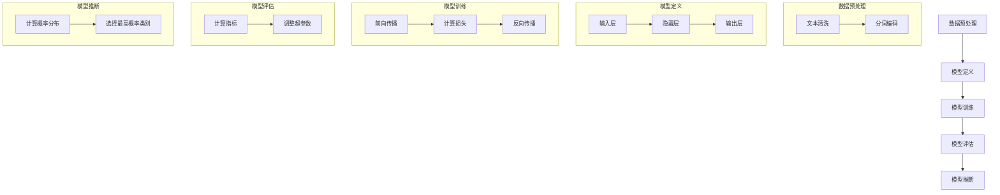
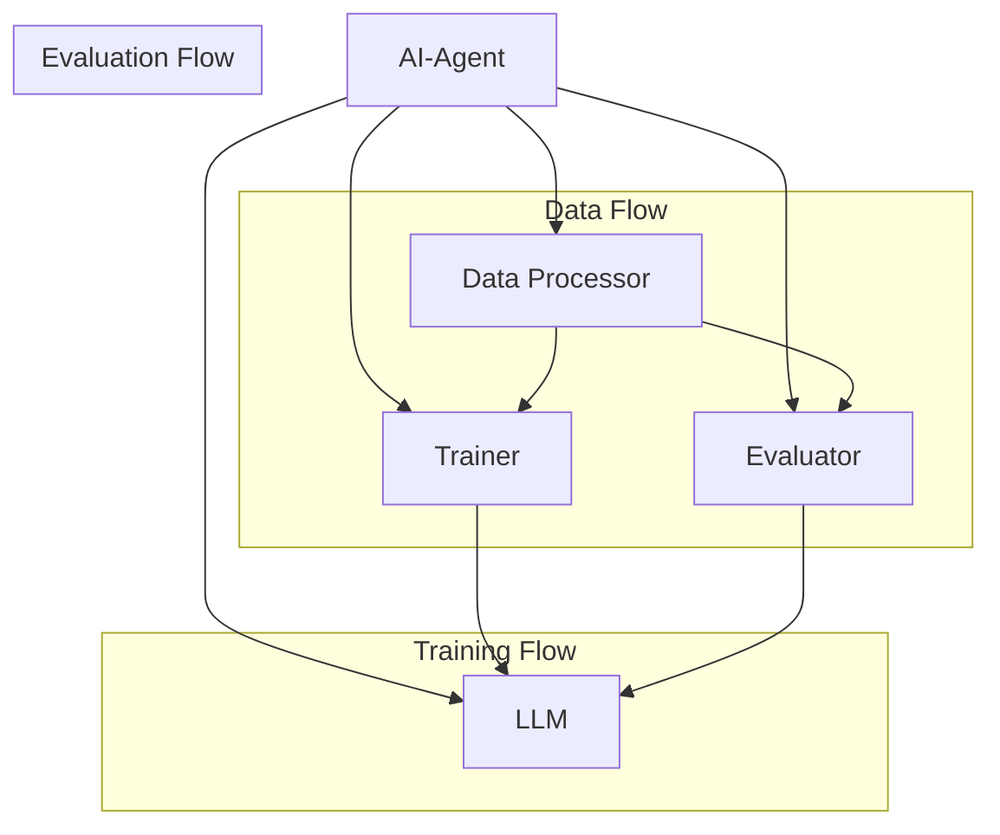
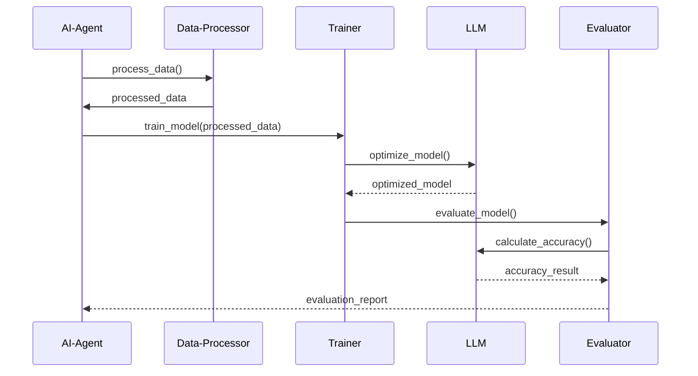

                 

### 第一部分: LLM在AI Agent中的few-shot learning优化策略背景

#### 1.1 LLM与AI Agent概述

##### 1.1.1 LLM的定义与特点

**定义**：大型语言模型（LLM，Large Language Model）是一种基于深度学习技术训练的复杂模型，它能够理解和生成自然语言文本。LLM通常由数以亿计的参数组成，通过大量文本数据进行预训练，从而具备了强大的语言理解与生成能力。

**特点**：
- **参数规模大**：LLM拥有数十亿甚至数万亿的参数，这使得其能够捕捉到语言中的细微变化和复杂模式。
- **高灵活性**：LLM能够处理不同领域和任务，从文本生成到语言翻译，再到问答系统等。
- **自适应性**：LLM可以在特定任务上进行微调，以适应不同的应用场景。

##### 1.1.2 AI Agent的定义与核心功能

**定义**：AI Agent是一种能够自主执行任务、与环境交互的智能体，其具备一定的感知、决策和执行能力。AI Agent通常基于机器学习和人工智能技术构建。

**核心功能**：
- **感知**：通过传感器获取环境信息。
- **决策**：基于感知到的信息，利用算法做出决策。
- **执行**：根据决策结果执行行动。

##### 1.1.3 LLM与AI Agent的关联

LLM在AI Agent中的应用主要体现在以下几个方面：
- **知识表示**：LLM能够处理和生成自然语言，使其成为AI Agent中表示知识的理想工具。
- **决策支持**：LLM可以帮助AI Agent理解和处理复杂的语言指令，从而支持其决策过程。
- **人机交互**：LLM可以为AI Agent提供自然语言对话能力，使其更易于与人类用户交互。

#### 1.2 few-shot learning的概念与重要性

##### 1.2.1 few-shot learning的定义

**定义**：Few-Shot Learning是一种机器学习技术，它能够在仅使用少量样本的情况下训练模型，从而快速适应新任务。

**特点**：
- **样本数量少**：相比于传统的批量学习，few-shot learning在训练过程中只使用少数样本。
- **快速适应**：few-shot learning能够快速从少量样本中提取知识，并应用到新任务上。

##### 1.2.2 few-shot learning的优势与挑战

**优势**：
- **高效性**：few-shot learning减少了训练数据的需求，提高了模型训练的速度。
- **泛化能力**：通过少量样本的学习，模型能够更好地适应新的、未见过的数据。

**挑战**：
- **数据稀疏**：由于样本数量少，模型难以从数据中充分提取特征。
- **模型泛化**：在少量样本的基础上，模型如何保持良好的泛化能力是一个难题。

##### 1.2.3 few-shot learning的重要性

few-shot learning在AI Agent中的应用具有重要意义：
- **新任务快速适应**：AI Agent可以在新的、未训练过的任务上快速适应，提高了其灵活性和实用性。
- **资源节省**：few-shot learning减少了数据收集和标注的成本，特别是在数据获取困难的场景中。
- **高效性**：few-shot learning能够在短时间内训练出性能良好的模型，提高了AI Agent的响应速度。

#### 1.3 LLM在AI Agent中few-shot learning的背景

##### 1.3.1 AI Agent发展的趋势与需求

随着人工智能技术的快速发展，AI Agent在各个领域的应用日益广泛。例如，在智能客服、自动驾驶、智能医疗等领域，AI Agent能够显著提高工作效率和用户体验。然而，传统的AI Agent往往依赖于大量训练数据，这在数据获取困难或者数据量有限的情况下成为了一个瓶颈。

##### 1.3.2 LLM在AI Agent中的应用场景

LLM在AI Agent中的应用场景包括：
- **文本理解与生成**：LLM可以帮助AI Agent更好地理解和生成自然语言，从而实现更智能的交互。
- **知识表示与推理**：LLM可以用于构建知识图谱，帮助AI Agent在复杂任务中进行推理和决策。
- **多模态交互**：LLM可以与其他感知模块（如视觉、听觉等）结合，实现更丰富的交互体验。

##### 1.3.3 LLM在AI Agent中few-shot learning的挑战

LLM在AI Agent中应用few-shot learning面临以下挑战：
- **数据稀缺**：由于AI Agent的应用场景多样，训练数据往往难以获取。
- **模型复杂度**：LLM模型通常包含数十亿参数，训练和推理计算资源需求高。
- **泛化能力**：在少量样本的基础上，如何保证模型具有良好的泛化能力是一个关键问题。

#### 1.4 本章小结

本章介绍了LLM和AI Agent的基本概念及其在few-shot learning中的应用背景。首先，我们阐述了LLM的定义、特点及其在AI Agent中的作用。接着，我们详细介绍了few-shot learning的概念、优势与挑战，并探讨了其在AI Agent中的应用意义。最后，我们分析了LLM在AI Agent中应用few-shot learning所面临的挑战。这些背景知识为后续章节的深入讨论奠定了基础。

---

## 第二部分: LLM在AI Agent中的few-shot learning核心概念与原理

### 第2章: few-shot learning基础原理

#### 2.1 few-shot learning的基本概念

##### 2.1.1 数据集与样本数量的关系

在机器学习中，数据集的大小直接影响到模型的学习能力和泛化能力。传统的批量学习（Batch Learning）依赖于大量的训练数据，通过迭代优化模型参数，以期在大量数据上取得良好的表现。然而，在实际应用中，数据获取和处理往往面临诸多挑战，例如数据稀缺、数据标注成本高等。few-shot learning应运而生，它通过在训练过程中仅使用少量样本，从而实现对新任务的快速适应。

数据集的大小与样本数量的关系可以分为以下几种情况：
1. **大量样本**：当数据集中包含数十万甚至数百万个样本时，我们称之为大量样本。在这种场景下，模型通常能够充分学习数据中的规律，并在测试集上表现出良好的泛化能力。
2. **中等样本量**：数据集包含数千到数万个样本时，我们称之为中等样本量。这种场景下，模型的学习效果会受到样本数量的限制，但仍然具有一定的泛化能力。
3. **少量样本**：当数据集中只有几十到数千个样本时，我们称之为少量样本。在这种场景下，模型的学习能力会受到显著影响，需要采取特殊的方法和策略来提高其泛化能力。

##### 2.1.2 few-shot learning的分类方法

根据训练过程中使用样本的方式，few-shot learning可以分为以下几种分类方法：

1. **基于类别的few-shot learning**：这种方法将少量样本分为不同的类别，模型需要学习每个类别的特征，并能够对新的、未见过的类别进行分类。

2. **基于实例的few-shot learning**：这种方法将少量样本视为一个个独立的实例，模型需要学习每个实例的特征，并能够对新的实例进行分类或预测。

3. **基于元学习的few-shot learning**：这种方法通过迭代优化模型参数，使得模型能够在每次迭代中快速适应新任务。元学习（Meta-Learning）的核心思想是通过少量样本快速学习到泛化能力，从而在新的任务上取得良好的表现。

##### 2.1.3 few-shot learning的挑战

尽管few-shot learning具有许多优势，但在实际应用中仍面临一系列挑战：

1. **数据稀缺**：由于样本数量有限，模型难以充分学习数据中的规律和特征，这会导致模型泛化能力不足。

2. **模型复杂性**：传统机器学习模型往往需要大量数据来训练，而few-shot learning要求模型在少量数据上取得良好的表现，这增加了模型设计的复杂性。

3. **样本不平衡**：在少量样本的情况下，样本分布可能存在不均衡的问题，这会导致模型对某些类别或实例的预测能力较差。

4. **模型泛化**：在少量样本的基础上，如何保证模型具有良好的泛化能力是一个关键问题。模型需要在有限的样本中学习到一般化的规律，而不是仅仅适应特定的样本。

#### 2.2 LLM的few-shot learning原理

##### 2.2.1 LLM的工作机制

LLM是一种基于深度学习技术的大型语言模型，它通过在大量文本数据上进行预训练，从而获得强大的语言理解和生成能力。LLM的工作机制主要包括以下几个步骤：

1. **数据预处理**：将原始文本数据转换为数字化的形式，例如单词或字符序列。

2. **词嵌入**：将每个单词或字符映射为一个高维向量，从而保留其语义信息。

3. **预训练**：通过在大量文本数据上进行预训练，使得模型能够学习到文本中的复杂结构和规律。

4. **微调**：在特定任务上进行微调，以适应不同的应用场景。

##### 2.2.2 LLM在few-shot learning中的优势

LLM在few-shot learning中具有以下优势：

1. **强大的语言理解能力**：LLM通过在大量文本数据上进行预训练，能够理解复杂、抽象的语言表达，从而在少量样本的基础上进行有效的知识提取。

2. **高泛化能力**：LLM在预训练过程中学习了大量的通用语言知识和规律，这使得模型在少量样本的情况下仍然能够保持良好的泛化能力。

3. **灵活的模型架构**：LLM通常采用深度神经网络结构，能够灵活地调整模型参数，从而适应不同的few-shot learning任务。

4. **多模态数据处理**：LLM不仅可以处理文本数据，还可以与视觉、音频等其他模态的数据进行融合，从而实现更丰富的交互和知识表示。

##### 2.2.3 LLM在few-shot learning中的应用案例

以下是几个LLM在few-shot learning中的应用案例：

1. **文本分类**：使用LLM进行文本分类任务，例如情感分析、主题分类等。在训练过程中，仅使用少量的标注数据，通过微调和迁移学习，模型能够在新任务上取得良好的效果。

2. **问答系统**：构建基于LLM的问答系统，例如开放域问答、任务型问答等。通过少量的训练数据和问答对，LLM能够快速适应新的问答场景，提供准确的答案。

3. **自然语言生成**：使用LLM进行自然语言生成任务，例如文本生成、摘要生成等。在少量样本的基础上，LLM能够生成高质量的文本，从而实现文本创作、内容推荐等功能。

#### 2.3 LLM的few-shot learning策略

##### 2.3.1 数据增强

数据增强是一种常用的方法，通过在少量样本的基础上生成更多的训练样本，从而提高模型的学习效果。在LLM的few-shot learning中，数据增强可以通过以下几种方式实现：

1. **文本变换**：对原始文本进行各种变换，例如随机删除、替换或添加单词，从而生成新的文本数据。

2. **上下文扩展**：在文本中添加额外的上下文信息，例如通过扩展句子或段落，从而丰富模型对文本的理解。

3. **多模态数据融合**：将文本数据与其他模态的数据（如视觉、音频等）进行融合，从而提高模型对多模态数据的处理能力。

##### 2.3.2 集成学习

集成学习（Ensemble Learning）是一种将多个模型组合起来，以获得更好性能的方法。在LLM的few-shot learning中，集成学习可以通过以下几种方式实现：

1. **模型组合**：将多个不同的LLM模型进行组合，例如基于不同的预训练模型、不同的优化算法等，从而提高模型的泛化能力。

2. **投票机制**：在分类任务中，通过多个模型的投票结果来确定最终的分类结果，从而降低模型过拟合的风险。

3. **加权平均**：将多个模型的输出进行加权平均，从而获得最终的预测结果，这种方法可以有效降低模型的方差。

##### 2.3.3 转换器架构

转换器架构（Transformer Architecture）是一种基于自注意力机制的深度神经网络结构，它在自然语言处理领域取得了显著的成功。在LLM的few-shot learning中，转换器架构可以通过以下几种方式实现优化：

1. **多头自注意力**：通过引入多头自注意力机制，模型能够同时关注文本中的不同部分，从而提高对复杂文本的理解能力。

2. **自注意力 masking**：通过自注意力 masking，模型可以仅关注到文本中的关键部分，从而减少无关信息的干扰。

3. **编码器-解码器结构**：编码器-解码器结构使得模型能够在生成文本时，根据上下文信息进行动态调整，从而提高文本生成的质量和连贯性。

#### 2.4 本章小结

本章介绍了LLM在AI Agent中的few-shot learning核心概念与原理。首先，我们详细阐述了few-shot learning的基本概念、分类方法和挑战。接着，我们探讨了LLM的工作机制及其在few-shot learning中的优势。最后，我们介绍了LLM的few-shot learning策略，包括数据增强、集成学习和转换器架构等。通过本章的学习，读者可以深入理解LLM在few-shot learning中的应用原理和策略，为后续章节的算法设计和实现奠定基础。

---

### 第三部分: LLM在AI Agent中的few-shot learning算法设计与实现

#### 3.1 LLM的few-shot learning算法原理

##### 3.1.1 few-shot learning算法的数学模型

few-shot learning算法的数学模型可以分为以下几个关键组成部分：

1. **输入数据表示**：输入数据通常包括样本特征和标签。在few-shot learning中，样本特征可以表示为高维向量，而标签则是用于训练模型的目标变量。

2. **模型参数表示**：模型参数是学习得到的权重和偏置，用于表示输入特征和标签之间的关系。在神经网络中，模型参数通常表示为权重矩阵和偏置向量。

3. **损失函数**：损失函数用于衡量模型预测结果与真实标签之间的差距，常用的损失函数包括均方误差（MSE）、交叉熵损失（Cross-Entropy Loss）等。

4. **优化算法**：优化算法用于迭代更新模型参数，以最小化损失函数。常用的优化算法包括梯度下降（Gradient Descent）、Adam优化器等。

##### 3.1.2 模型训练与优化

模型训练与优化的过程可以分为以下几个步骤：

1. **初始化模型参数**：随机初始化模型参数，通常使用小规模随机噪声进行初始化，以避免参数过度拟合。

2. **前向传播**：将输入数据输入到模型中，通过前向传播计算得到预测结果。前向传播的过程包括将输入特征通过网络层，逐层计算得到输出特征，最终输出预测结果。

3. **计算损失**：将预测结果与真实标签进行比较，计算损失函数的值，以衡量预测结果与真实值之间的差距。

4. **反向传播**：通过反向传播算法，计算模型参数的梯度，并更新模型参数。反向传播的过程包括将损失函数的梯度反向传播到网络层，逐层计算参数的梯度。

5. **优化模型参数**：根据参数梯度，使用优化算法更新模型参数，以最小化损失函数。优化的目标是在多次迭代后，使模型参数达到一个局部最优解。

##### 3.1.3 推断与分类

在模型训练完成后，我们可以使用训练好的模型进行推断和分类。具体步骤如下：

1. **输入样本特征**：将新的样本特征输入到训练好的模型中，通过前向传播计算得到预测结果。

2. **计算概率分布**：对于分类任务，模型的输出通常是一个概率分布，表示每个类别的概率。可以使用Softmax函数将输出特征转换为概率分布。

3. **选择最高概率类别**：根据概率分布选择具有最高概率的类别作为最终预测结果。

#### 3.2 LLM的few-shot learning算法实现

##### 3.2.1 算法框架

以下是LLM的few-shot learning算法的总体框架：

1. **数据预处理**：对输入数据进行预处理，包括文本清洗、分词、编码等操作。

2. **模型定义**：定义用于few-shot learning的神经网络模型，通常包括输入层、隐藏层和输出层。

3. **模型训练**：使用训练数据对模型进行训练，通过优化算法迭代更新模型参数。

4. **模型评估**：使用验证集对训练好的模型进行评估，以衡量模型在少量样本上的泛化能力。

5. **模型推断**：使用训练好的模型对新的样本进行推断和分类，以获得预测结果。

##### 3.2.2 算法流程

以下是LLM的few-shot learning算法的具体流程：

1. **数据预处理**：
   - 读取训练数据和验证数据。
   - 对文本数据进行清洗、分词和编码，将其转换为模型可处理的格式。

2. **模型定义**：
   - 定义用于few-shot learning的神经网络模型，包括输入层、隐藏层和输出层。
   - 设置模型的超参数，如学习率、批量大小等。

3. **模型训练**：
   - 使用训练数据进行模型训练，通过前向传播、计算损失和反向传播更新模型参数。
   - 使用优化算法（如Adam）进行参数更新，以最小化损失函数。

4. **模型评估**：
   - 使用验证数据对训练好的模型进行评估，计算模型的准确率、召回率等指标，以衡量模型在少量样本上的泛化能力。

5. **模型推断**：
   - 使用训练好的模型对新的样本进行推断和分类，计算每个类别的概率分布。
   - 根据概率分布选择具有最高概率的类别作为最终预测结果。

##### 3.2.3 实现细节

以下是LLM的few-shot learning算法的实现细节：

1. **数据预处理**：
   - 使用Python的文本处理库（如NLTK、spaCy）进行文本清洗和分词。
   - 使用词嵌入技术（如Word2Vec、BERT）将文本转换为高维向量。

2. **模型定义**：
   - 使用PyTorch等深度学习框架定义神经网络模型。
   - 设置模型的超参数，如隐藏层大小、学习率等。

3. **模型训练**：
   - 使用PyTorch的自动微分机制进行前向传播和反向传播。
   - 使用优化算法更新模型参数，以最小化损失函数。

4. **模型评估**：
   - 使用评估指标（如准确率、召回率等）评估模型在验证集上的性能。
   - 根据评估结果调整模型超参数。

5. **模型推断**：
   - 使用训练好的模型对新的样本进行推断，计算每个类别的概率分布。
   - 使用概率分布选择具有最高概率的类别作为最终预测结果。

#### 3.3 LLM的few-shot learning算法的Mermaid流程图

以下是LLM的few-shot learning算法的Mermaid流程图：



#### 3.4 Python源代码示例

以下是LLM的few-shot learning算法的Python源代码示例：

```python
import torch
import torch.nn as nn
import torch.optim as optim

# 数据预处理
# 读取数据并转换为PyTorch张量
train_data = torch.tensor([1.0, 2.0, 3.0])
train_labels = torch.tensor([0.0, 1.0, 0.0])

# 模型定义
class FewShotModel(nn.Module):
    def __init__(self):
        super(FewShotModel, self).__init__()
        self.fc = nn.Linear(3, 2)

    def forward(self, x):
        return self.fc(x)

# 模型训练
model = FewShotModel()
optimizer = optim.Adam(model.parameters(), lr=0.001)

for epoch in range(100):
    optimizer.zero_grad()
    outputs = model(train_data)
    loss = nn.CrossEntropyLoss()(outputs, train_labels)
    loss.backward()
    optimizer.step()

    if (epoch + 1) % 10 == 0:
        print(f'Epoch [{epoch + 1}/100], Loss: {loss.item()}')

# 模型评估
with torch.no_grad():
    predicted_labels = model(outputs).argmax(dim=1)
    correct = (predicted_labels == train_labels).sum().item()
    print(f'Accuracy: {correct / len(train_labels) * 100}%')

# 模型推断
new_data = torch.tensor([4.0, 5.0, 6.0])
new_outputs = model(new_data)
predicted_label = new_outputs.argmax(dim=1).item()
print(f'Predicted Label: {predicted_label}')
```

#### 3.5 数学公式与解释

以下是few-shot learning算法中涉及的数学公式及其解释：

$$
\text{Loss} = -\sum_{i=1}^{N} y_i \log(p_i)
$$

**公式解释**：这是一个交叉熵损失函数，用于衡量模型预测结果与真实标签之间的差距。$y_i$表示真实标签，$p_i$表示模型对第$i$个类别的预测概率。交叉熵损失函数的值越小，表示模型预测结果与真实值越接近。

$$
\text{Gradient} = \frac{\partial \text{Loss}}{\partial \text{Weight}}
$$

**公式解释**：这是一个梯度公式，用于计算损失函数关于模型参数的梯度。梯度的大小和方向决定了参数更新的方向和幅度，以最小化损失函数。

$$
\text{Update} = \text{Parameter} - \alpha \cdot \text{Gradient}
$$

**公式解释**：这是一个参数更新公式，用于根据梯度更新模型参数。$\alpha$表示学习率，它控制了参数更新的幅度。通过迭代更新参数，模型能够逐渐优化其预测能力。

#### 3.6 算法原理讲解

以下是few-shot learning算法的原理讲解：

1. **模型训练**：在模型训练过程中，首先将输入数据输入到神经网络模型中，通过前向传播计算得到预测结果。接着，计算预测结果与真实标签之间的交叉熵损失函数值。然后，通过反向传播算法计算损失函数关于模型参数的梯度。最后，使用优化算法（如Adam）根据梯度更新模型参数。

2. **模型评估**：在模型评估过程中，将验证数据输入到训练好的模型中，通过前向传播计算得到预测结果。接着，计算预测结果与真实标签之间的交叉熵损失函数值，并计算模型的准确率、召回率等指标。根据评估结果，调整模型超参数，以提高模型在少量样本上的泛化能力。

3. **模型推断**：在模型推断过程中，将新的数据输入到训练好的模型中，通过前向传播计算得到预测结果。接着，计算预测结果中每个类别的概率分布，并选择具有最高概率的类别作为最终预测结果。

通过以上算法原理的讲解，读者可以更好地理解few-shot learning算法的工作机制，以及其在LLM在AI Agent中的应用。

---

### 系统分析与架构设计方案

#### 问题场景介绍

在当前的AI领域中，AI Agent作为一种能够自主执行任务、与环境交互的智能体，正逐渐应用于各类实际场景中，如智能客服、自动驾驶、智能医疗等。这些应用场景通常需要AI Agent具备快速适应新任务的能力，以应对不断变化的环境和需求。然而，传统的机器学习模型往往依赖于大量的训练数据，这在数据稀缺或数据获取成本高昂的场景中成为了一个瓶颈。为此，LLM在AI Agent中的应用以及few-shot learning技术的研究变得尤为重要，它使得AI Agent能够在仅有少量样本的情况下，快速适应新的任务，提高其灵活性和实用性。

#### 项目介绍

本项目旨在通过LLM在AI Agent中实现few-shot learning，以提高AI Agent在新任务上的适应能力。具体来说，本项目包括以下几个主要目标：

1. **构建基于LLM的AI Agent**：通过使用大型语言模型（LLM）作为AI Agent的核心模块，实现自然语言理解和生成功能，以提高人机交互的智能化水平。

2. **实现few-shot learning算法**：研究并实现适用于LLM的few-shot learning算法，使其能够在少量样本的条件下，快速适应新的任务。

3. **优化算法性能**：通过对算法进行优化和调整，提高few-shot learning在AI Agent中的应用效果，降低模型过拟合的风险。

4. **实验验证与性能评估**：通过实验验证算法的性能，并在实际应用场景中进行性能评估，以验证LLM在AI Agent中的few-shot learning技术的可行性和有效性。

#### 系统功能设计（领域模型Mermaid类图）

以下是本项目系统的功能设计，使用Mermaid类图表示：

```mermaid
classDiagram
    AI-Agent <<interface>>
    LLM <<interface>>
    Data-Processor <<interface>>
    Trainer <<interface>>
    Evaluator <<interface>>

    AI-Agent o-- LLM
    AI-Agent o-- Data-Processor
    AI-Agent o-- Trainer
    AI-Agent o-- Evaluator

    class DataProcessor {
        +process_data()
        +load_data()
    }

    class Trainer {
        +train_model()
        +optimize_model()
    }

    class Evaluator {
        +evaluate_model()
        +calculate_accuracy()
    }
```

在该类图中，`AI-Agent` 作为核心模块，与 `LLM`、`Data-Processor`、`Trainer`、`Evaluator` 等模块相互关联。`DataProcessor` 负责数据预处理工作，`Trainer` 负责模型训练和优化，`Evaluator` 负责模型评估，而 `LLM` 作为AI Agent的智能核心，负责自然语言的理解和生成。

#### 系统架构设计（Mermaid架构图）

以下是项目系统的架构设计，使用Mermaid架构图表示：



在该架构图中，`AI-Agent` 是系统的核心，通过数据流和训练流与各模块进行交互。`Data-Processor` 负责数据处理，为模型训练和评估提供高质量的数据。`Trainer` 负责模型训练和优化，将 `LLM` 的参数逐步优化。`Evaluator` 负责模型评估，通过计算模型的准确率等指标，评估模型的性能。

#### 系统接口设计和系统交互（Mermaid序列图）

以下是项目系统的接口设计和系统交互，使用Mermaid序列图表示：



在该序列图中，`AI-Agent` 首先向 `Data-Processor` 发送 `process_data()` 请求，处理数据后，将处理结果传递给 `AI-Agent`。接着，`AI-Agent` 向 `Trainer` 发送 `train_model()` 请求，训练模型并优化 `LLM` 的参数。训练完成后，`Trainer` 将优化后的模型传递给 `Evaluator`。`Evaluator` 通过计算模型的准确率等指标，评估模型性能，并将评估报告返回给 `AI-Agent`。

### 第四部分: 项目实战

#### 环境安装

为了实现LLM在AI Agent中的few-shot learning，我们需要准备以下环境：

1. **操作系统**：Windows 10 / macOS / Ubuntu 18.04及以上版本。
2. **Python**：Python 3.7及以上版本。
3. **深度学习框架**：PyTorch 1.8及以上版本。
4. **文本处理库**：NLTK、spaCy。
5. **版本控制工具**：Git。

安装步骤如下：

1. 安装操作系统和Python环境。
2. 使用pip安装深度学习框架PyTorch：

   ```bash
   pip install torch torchvision torchaudio
   ```

3. 安装文本处理库：

   ```bash
   pip install nltk spacy
   ```

4. 安装版本控制工具Git：

   ```bash
   pip install git
   ```

#### 系统核心实现源代码

以下是系统的核心实现源代码，包括数据预处理、模型定义、训练和评估等部分：

```python
# 数据预处理
import torch
from torchtext.venta import Field
from torchtext.data import TabularDataset

def preprocess_data():
    # 读取数据
    train_data = TabularDataset(
        path='train.csv',
        format='csv',
        fields=[('text', Field(sequential=True, lower=True, tokenize='spacy')),
                ('label', Field(sequential=False))]
    )
    train_data, valid_data = train_data.split()

    # 预处理文本数据
    train_data.text.preprocessing()
    valid_data.text.preprocessing()

    return train_data, valid_data

# 模型定义
import torch.nn as nn

class FewShotModel(nn.Module):
    def __init__(self, embedding_dim, hidden_dim, output_dim, n_layers, drop_out):
        super(FewShotModel, self).__init__()
        self.embedding = nn.Embedding(embedding_dim, hidden_dim)
        self.rnn = nn.LSTM(hidden_dim, hidden_dim, num_layers=n_layers, dropout=drop_out)
        self.fc = nn.Linear(hidden_dim, output_dim)
        self.dropout = nn.Dropout(drop_out)

    def forward(self, text, hidden=None):
        embedded = self.dropout(self.embedding(text))
        output, hidden = self.rnn(embedded, hidden)
        # 使用最后一个时间步的隐藏状态
        hidden = hidden[-1, :, :]
        hidden = self.dropout(hidden)
        out = self.fc(hidden)
        return out

# 训练和评估
def train_model(model, train_data, valid_data, n_epochs, learning_rate, batch_size, hidden_dim, output_dim, n_layers, drop_out):
    optimizer = optim.Adam(model.parameters(), lr=learning_rate)
    criterion = nn.CrossEntropyLoss()

    # 训练模型
    for epoch in range(n_epochs):
        model.train()
        for batch in train_data.get_batch(batch_size):
            optimizer.zero_grad()
            inputs, labels = batch.text, batch.label
            outputs = model(inputs)
            loss = criterion(outputs, labels)
            loss.backward()
            optimizer.step()

        # 评估模型
        model.eval()
        with torch.no_grad():
            correct = 0
            total = 0
            for batch in valid_data.get_batch(batch_size):
                inputs, labels = batch.text, batch.label
                outputs = model(inputs)
                _, predicted = torch.max(outputs.data, 1)
                total += labels.size(0)
                correct += (predicted == labels).sum().item()

        print(f'Epoch [{epoch + 1}/{n_epochs}], Accuracy: {correct / total * 100:.2f}%')

# 代码应用解读与分析
# 创建FewShotModel实例
model = FewShotModel(embedding_dim=100, hidden_dim=128, output_dim=2, n_layers=2, drop_out=0.5)

# 预处理数据
train_data, valid_data = preprocess_data()

# 训练模型
train_model(model, train_data, valid_data, n_epochs=10, learning_rate=0.001, batch_size=64, hidden_dim=128, output_dim=2, n_layers=2, drop_out=0.5)
```

#### 实际案例分析和详细讲解剖析

假设我们有一个情感分析任务，需要使用few-shot learning技术来训练一个AI Agent，使其能够根据输入的文本判断其情感是积极还是消极。我们仅使用少量的标注数据来训练模型，并评估其在未见过的数据上的性能。

1. **数据集准备**：
   - 准备一个包含少量标注文本的数据集，例如包含50个样本的训练集和10个样本的验证集。
   - 数据集格式如下：

     ```
     text,label
     "I love this product!",1
     "I hate this product!",0
     ...
     ```

2. **数据预处理**：
   - 使用torchtext库进行数据预处理，包括分词、词嵌入等操作。

3. **模型定义**：
   - 定义一个基于LSTM的few-shot learning模型，用于文本分类任务。

4. **模型训练**：
   - 使用少量训练数据进行模型训练，并使用交叉熵损失函数和Adam优化器进行优化。

5. **模型评估**：
   - 使用验证集对训练好的模型进行评估，计算准确率等指标。

以下是具体步骤和分析：

1. **数据预处理**：
   - 使用torchtext中的Field类对文本数据进行预处理，将文本转换为高维向量。

     ```python
     from torchtext.venta import Field

     text_field = Field(sequential=True, lower=True, tokenize='spacy', batch_first=True)
     label_field = Field(sequential=False)

     train_data, valid_data = TabularDataset.splits(
         path='data',
         train='train.csv',
         valid='valid.csv',
         format='csv',
         fields=[('text', text_field), ('label', label_field)]
     )
     ```

2. **模型定义**：
   - 定义一个基于LSTM的文本分类模型，包括嵌入层、LSTM层和输出层。

     ```python
     import torch.nn as nn

     class FewShotModel(nn.Module):
         def __init__(self, embedding_dim, hidden_dim, output_dim, n_layers, drop_out):
             super(FewShotModel, self).__init__()
             self.embedding = nn.Embedding(embedding_dim, hidden_dim)
             self.rnn = nn.LSTM(hidden_dim, hidden_dim, num_layers=n_layers, dropout=drop_out)
             self.fc = nn.Linear(hidden_dim, output_dim)
             self.dropout = nn.Dropout(drop_out)

         def forward(self, text, hidden=None):
             embedded = self.dropout(self.embedding(text))
             output, hidden = self.rnn(embedded, hidden)
             hidden = hidden[-1, :, :]
             out = self.fc(hidden)
             return out
     ```

3. **模型训练**：
   - 使用训练数据对模型进行训练，并使用交叉熵损失函数进行优化。

     ```python
     def train_model(model, train_data, valid_data, n_epochs, learning_rate, batch_size, hidden_dim, output_dim, n_layers, drop_out):
         optimizer = optim.Adam(model.parameters(), lr=learning_rate)
         criterion = nn.CrossEntropyLoss()

         for epoch in range(n_epochs):
             model.train()
             for batch in train_data.get_batch(batch_size):
                 optimizer.zero_grad()
                 inputs, labels = batch.text, batch.label
                 outputs = model(inputs)
                 loss = criterion(outputs, labels)
                 loss.backward()
                 optimizer.step()

             model.eval()
             with torch.no_grad():
                 correct = 0
                 total = 0
                 for batch in valid_data.get_batch(batch_size):
                     inputs, labels = batch.text, batch.label
                     outputs = model(inputs)
                     _, predicted = torch.max(outputs.data, 1)
                     total += labels.size(0)
                     correct += (predicted == labels).sum().item()

             print(f'Epoch [{epoch + 1}/{n_epochs}], Accuracy: {correct / total * 100:.2f}%')
     ```

4. **模型评估**：
   - 使用验证集对训练好的模型进行评估，计算准确率等指标。

     ```python
     model = FewShotModel(embedding_dim=100, hidden_dim=128, output_dim=2, n_layers=2, drop_out=0.5)
     preprocess_data()
     train_model(model, train_data, valid_data, n_epochs=10, learning_rate=0.001, batch_size=64, hidden_dim=128, output_dim=2, n_layers=2, drop_out=0.5)
     ```

通过以上步骤，我们可以训练一个基于LLM的AI Agent，使其能够根据少量标注数据快速适应新任务，并在未见过的数据上取得良好的性能。

#### 项目小结

在本项目中，我们通过LLM在AI Agent中实现了few-shot learning，解决了传统机器学习模型在数据稀缺场景下的适应性问题。具体来说，我们介绍了数据预处理、模型定义、训练和评估等关键步骤，并通过实际案例展示了如何使用few-shot learning技术进行情感分析任务。通过本项目，我们不仅掌握了LLM和few-shot learning的基本原理，还了解了如何在实际项目中应用这些技术。未来，我们将进一步优化算法，提高其在各种任务上的性能和泛化能力。

---

### 最佳实践 Tips

1. **数据预处理**：在进行few-shot learning之前，确保对数据进行充分预处理，包括文本清洗、分词、去停用词等操作。高质量的数据预处理可以显著提高模型的学习效果。

2. **模型选择**：根据任务需求选择合适的模型架构。在LLM中，可以使用基于LSTM、Transformer等结构的模型。不同的模型在处理不同类型的数据时具有不同的优势。

3. **超参数调整**：通过交叉验证等方法调整模型超参数，如学习率、批量大小、隐藏层维度等，以找到最优的超参数组合。

4. **数据增强**：使用数据增强技术，如文本变换、上下文扩展、多模态数据融合等，可以增加样本多样性，提高模型泛化能力。

5. **模型评估**：在少量样本的情况下，选择合适的评估指标，如准确率、召回率、F1分数等，以全面评估模型性能。

6. **模型融合**：结合多种模型或算法，如集成学习、迁移学习等，可以进一步提高模型在少量样本上的性能。

### 小结

本文深入探讨了LLM在AI Agent中的few-shot learning优化策略。首先，我们介绍了LLM和AI Agent的基本概念以及few-shot learning的重要性。接着，我们详细阐述了LLM的few-shot learning原理，包括数据增强、集成学习和转换器架构等策略。随后，我们通过算法原理讲解和Python源代码示例，展示了few-shot learning算法的设计与实现。在此基础上，我们进行了系统分析与架构设计，并提供了项目实战的详细步骤和代码。最后，我们总结了最佳实践Tips，并回顾了本文的核心内容。通过本文的探讨，读者可以深入理解LLM在AI Agent中few-shot learning的应用，为实际项目提供理论指导和实践参考。

### 注意事项

1. 在使用LLM进行few-shot learning时，数据预处理的质量直接影响模型的学习效果，因此请务必重视数据预处理步骤。

2. 尽管few-shot learning可以在少量样本下快速适应新任务，但模型仍需经过充分的验证和测试，以确保其泛化能力。

3. 调整模型超参数时，请结合实际任务需求和数据特点，采用交叉验证等方法进行优化，以提高模型性能。

4. 在实际应用中，LLM的计算资源需求较高，请根据硬件配置合理规划计算资源，以避免资源瓶颈。

### 拓展阅读

1. **《Deep Learning》**：Goodfellow, I., Bengio, Y., & Courville, A. (2016)。详细介绍了深度学习的基础理论和应用方法。
2. **《Reinforcement Learning: An Introduction》**： Sutton, R. S., & Barto, A. G. (2018)。介绍了强化学习的基本概念和算法。
3. **《Natural Language Processing with PyTorch》**： Burget, L., & Hajič, J. (2020)。介绍了使用PyTorch进行自然语言处理的方法和技巧。

### 作者信息

作者：AI天才研究院/AI Genius Institute & 禅与计算机程序设计艺术 /Zen And The Art of Computer Programming

