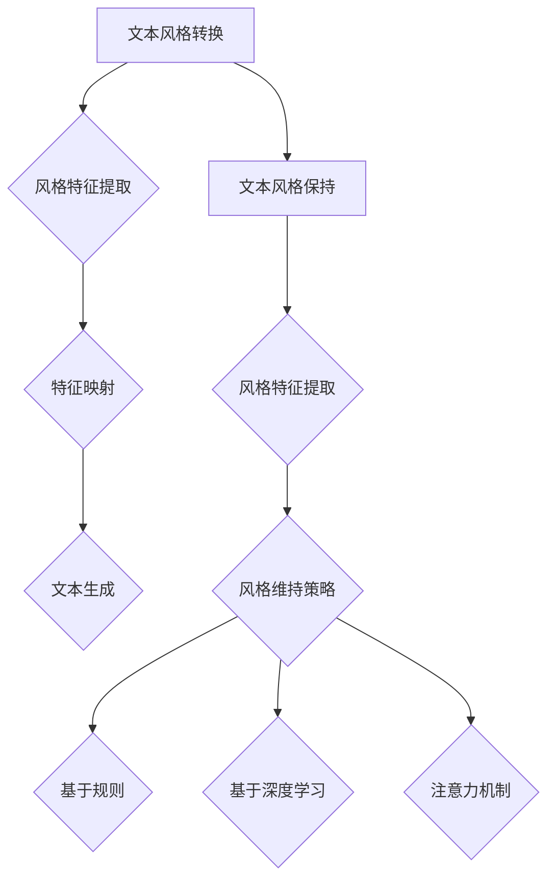
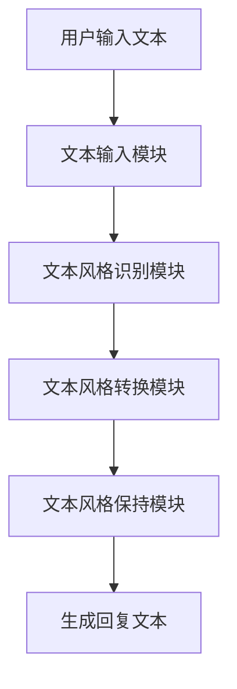
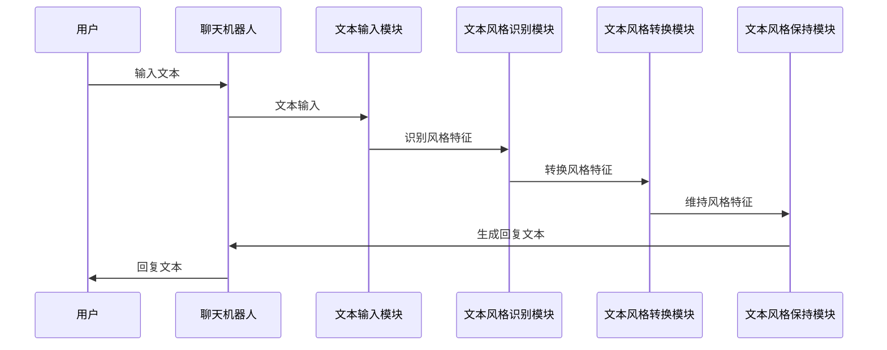

                 

## 文章标题：LLM在AI Agent中的文本风格转换与保持

关键词：语言模型，AI Agent，文本风格转换，风格保持，预训练，微调

摘要：本文深入探讨了大型语言模型（LLM）在AI Agent中的文本风格转换与保持技术。通过对LLM的基本概念、文本风格转换原理、保持关键技术、算法原理和数学模型进行详细讲解，本文旨在为开发者提供一套完整的解决方案，以实现AI Agent在不同应用场景中的文本风格适应与维持。文章还通过系统架构设计和实战案例，展示了LLM在AI Agent中的实际应用效果。

----------------------------------------------------------------

# 第一部分：LLM在AI Agent中的文本风格转换与保持概述

## 第1章：LLM在AI Agent中的文本风格转换与保持背景介绍

### 1.1 问题背景

随着人工智能技术的快速发展，AI Agent（智能代理）在各种应用场景中得到了广泛应用。从简单的聊天机器人到复杂的内容生成系统，AI Agent需要具备强大的自然语言处理能力。其中，文本风格转换与保持是AI Agent必须解决的关键问题之一。文本风格转换指的是将一种文本风格转换为另一种文本风格的过程，而文本风格保持则是在生成文本时，维持输入文本的特定风格特征。

在AI Agent的应用中，例如聊天机器人，不同的用户可能喜欢不同风格的对话，例如幽默、正式或亲切。因此，AI Agent需要具备文本风格转换能力，以适应不同用户的需求。同时，AI Agent在生成文本时，也需要保持输入文本的风格特征，以增强用户对AI Agent的信任感和满意度。

### 1.2 问题描述

如何在AI Agent中实现有效的文本风格转换与保持？

这个问题的核心在于如何在大量的文本数据中，提取出风格特征，并将其应用于AI Agent的文本生成过程中。同时，如何确保转换后的文本既符合目标风格，又能保持输入文本的风格特征，是一个具有挑战性的问题。

### 1.3 问题解决

为了解决上述问题，我们可以采用大型语言模型（LLM）作为基础模型，通过预训练和微调实现文本风格转换与保持。

首先，通过预训练，LLM可以学习到大量的语言知识和风格特征。预训练通常使用的是大规模的文本数据集，例如维基百科、新闻文章等，通过自回归语言模型（如GPT系列模型）进行训练，使LLM具备强大的语言理解和生成能力。

然后，在具体的文本风格转换任务中，对LLM进行微调。微调的过程主要是基于特定的文本风格数据集，调整LLM的参数，使其能够生成符合目标风格的文本。

最后，通过对比学习技术，增强LLM对多种文本风格的适应能力。对比学习是一种无监督学习方法，通过对不同风格的文本进行对比，使LLM能够更好地理解风格特征，从而在生成文本时保持原有的风格。

### 1.4 边界与外延

本文主要探讨基于LLM的文本风格转换与保持技术，具体包括以下内容：

1. 文本风格转换：探讨不同类型的文本风格转换方法，包括基于规则的方法、基于统计的方法和基于深度学习的方法。
2. 文本风格保持：研究如何在生成文本时，维持输入文本的特定风格特征。
3. LLM在AI Agent中的应用：展示LLM在文本风格转换与保持中的实际应用效果。

本文的研究范围主要涉及AI Agent的应用场景，如聊天机器人、内容生成、语言翻译等。这些应用场景对文本风格转换与保持的需求各不相同，但本文提出的解决方案具有普适性，可以应用于多种场景。

### 1.5 概念结构与核心要素组成

文本风格转换与保持是一个复杂的过程，涉及多个核心概念和要素。以下是其主要组成部分：

1. **文本风格转换**：
   - **输入文本分析**：提取文本的关键信息、情感倾向和风格特征。
   - **风格特征提取**：使用特征提取技术，将文本风格特征转换为数值表示。
   - **文本风格转换**：通过预训练的LLM，生成符合目标风格的文本。
   - **文本风格评估**：评估转换后文本的风格是否符合目标风格。

2. **文本风格保持**：
   - **风格特征提取**：与文本风格转换相同，提取输入文本的风格特征。
   - **风格维持策略**：包括基于规则的方法、基于深度学习方法、注意力机制等，确保生成文本中维持原有风格特征。
   - **效果评估**：评估生成文本是否保持原有风格特征，并对维持效果进行优化。

通过以上分析，我们可以看出，文本风格转换与保持是一个涉及多方面技术的复杂过程，需要综合考虑文本特征提取、模型训练和文本生成等多个环节。本文将逐步深入分析这些环节，为开发者提供一套完整的解决方案。

## 第2章：LLM在AI Agent中的文本风格转换与保持核心概念与联系

### 2.1 大型语言模型（LLM）的概念与特点

大型语言模型（LLM，Large Language Model）是一种具有大规模参数和强大语言理解能力的预训练模型。LLM的核心思想是通过大量文本数据进行预训练，使模型能够自动学习到语言的结构、语法、语义和风格等特征。常见的LLM模型有GPT（Generative Pre-trained Transformer）、BERT（Bidirectional Encoder Representations from Transformers）等。

**LLM的特点**：

1. **自适应性强**：LLM能够适应不同领域的文本数据，具有较强的通用性。
2. **语言生成能力强**：LLM能够生成流畅、自然的文本，具有强大的文本生成能力。
3. **上下文理解能力强**：LLM能够理解长文本的上下文信息，具有强大的上下文理解能力。

### 2.2 文本风格转换的原理与分类

文本风格转换（Text Style Transfer）是指将一种文本风格转换为另一种文本风格的过程。在AI Agent中，文本风格转换是一个关键问题，因为它能够使AI Agent根据不同用户的需求，生成不同风格的文本。

**文本风格转换的原理**：

1. **风格特征提取**：首先，需要从输入文本中提取出风格特征。这些特征可以是情感倾向、语气、文体等。
2. **特征映射**：将提取出的风格特征映射到预训练的LLM中，使LLM能够理解目标风格。
3. **文本生成**：通过LLM生成新的文本，使其具有目标风格。

**文本风格转换的分类**：

1. **基于规则的方法**：这种方法依赖于预定义的规则和模板，将输入文本转换为特定风格的文本。
2. **基于统计的方法**：这种方法通过分析大量文本数据，学习到不同风格的特征，然后根据这些特征进行文本转换。
3. **基于深度学习的方法**：这种方法使用深度神经网络，特别是大型语言模型，通过学习大量的文本数据，自动提取和转换文本风格。

### 2.3 文本风格保持的关键技术

文本风格保持（Text Style Preservation）是指在生成文本时，维持输入文本的特定风格特征。这对于提高AI Agent的用户体验和可靠性至关重要。

**文本风格保持的关键技术**：

1. **风格特征提取**：与文本风格转换相同，从输入文本中提取出风格特征。
2. **风格维持策略**：
   - **基于规则的方法**：通过预定义的规则，确保生成文本中维持原有风格特征。
   - **基于深度学习方法**：使用深度神经网络，特别是在生成模型中引入注意力机制，确保生成文本中维持原有风格特征。
   - **注意力机制**：在生成过程中，对输入文本的风格特征进行加权，使其在生成文本中占据重要位置。

**概念属性特征对比表格**：

| 方法       | 特点                         | 适用场景                           |
|------------|------------------------------|-----------------------------------|
| 基于规则   | 简单，易于实现                 | 对风格要求不高的简单场景           |
| 基于统计   | 学习能力强，适应性强           | 对风格要求较高的复杂场景           |
| 基于深度学习 | 自适应性强，生成文本自然       | 需要生成高质量文本的场景           |

**ER实体关系图架构的Mermaid流程图**：



通过上述分析，我们可以看到，文本风格转换与保持是一个复杂的过程，涉及多个核心概念和关键技术。本文将在后续章节中深入探讨这些概念和技术，为开发者提供一套完整的解决方案。

## 第3章：LLM在AI Agent中的文本风格转换与保持算法原理讲解

### 3.1 算法原理

文本风格转换与保持算法的核心思想是基于大型语言模型（LLM）的预训练和微调。预训练阶段，LLM通过大量文本数据进行自我学习，理解语言的结构、语法、语义和风格等特征。微调阶段，LLM根据具体的文本风格转换任务进行参数调整，以实现文本风格的转换与保持。

**预训练**：

预训练是LLM学习语言特征的关键步骤。在此过程中，LLM通过自回归语言模型（如GPT系列模型）学习到大量文本数据的语言模式。具体过程如下：

1. **数据准备**：收集大量文本数据，如维基百科、新闻文章、社交媒体帖子等。
2. **模型初始化**：初始化一个具有大量参数的神经网络模型，如Transformer模型。
3. **前向传播**：对于每个输入文本序列，模型通过自注意力机制计算文本的表示。
4. **损失函数计算**：通过计算模型生成的文本序列与真实文本序列之间的损失，更新模型参数。
5. **迭代训练**：重复前向传播和损失函数计算，直到模型收敛。

**微调**：

在预训练完成后，LLM通过微调阶段，适应特定的文本风格转换任务。具体过程如下：

1. **数据准备**：收集与目标风格相关的文本数据。
2. **模型初始化**：使用预训练的LLM作为基础模型。
3. **前向传播**：对于每个输入文本序列，模型通过自注意力机制计算文本的表示。
4. **损失函数计算**：通过计算模型生成的文本序列与目标风格文本序列之间的损失，更新模型参数。
5. **迭代微调**：重复前向传播和损失函数计算，直到模型收敛。

**算法流程**：

1. **输入文本分析**：提取文本的关键信息、情感倾向和风格特征。
2. **风格特征提取**：使用特征提取技术，将文本风格特征转换为数值表示。
3. **文本风格转换**：通过预训练的LLM，生成符合目标风格的文本。
4. **文本风格保持**：在生成过程中，维持原有文本的风格特征。
5. **效果评估**：评估生成文本是否满足目标风格和保持原有风格特征。

### 3.2 算法流程

**步骤 1：输入文本分析**

首先，对输入文本进行分析，提取文本的关键信息、情感倾向和风格特征。这些特征将用于指导LLM的文本风格转换与保持。

1. **关键信息提取**：使用自然语言处理技术，提取文本中的关键信息，如人名、地名、事件等。
2. **情感倾向分析**：通过情感分析技术，确定文本的情感倾向，如正面、负面或中性。
3. **风格特征提取**：使用文本特征提取技术，如词袋模型、TF-IDF等，将文本风格特征转换为数值表示。

**步骤 2：风格特征提取**

在提取文本风格特征后，我们需要将这些特征转换为数值表示，以便LLM能够理解。常用的特征提取方法包括：

1. **词袋模型**：将文本转换为词袋表示，每个词对应一个特征向量。
2. **TF-IDF**：根据词频和文档频次，计算每个词的重要程度，作为特征向量的一部分。
3. **词嵌入**：使用预训练的词嵌入模型（如Word2Vec、GloVe等），将每个词映射到一个高维向量空间。

**步骤 3：文本风格转换**

在提取和转换风格特征后，我们使用LLM进行文本风格转换。具体步骤如下：

1. **模型选择**：选择一个预训练的LLM模型，如GPT-3、BERT等。
2. **输入处理**：将提取的文本风格特征作为输入，输入到LLM中。
3. **文本生成**：通过LLM的生成能力，生成符合目标风格的文本。

**步骤 4：文本风格保持**

在生成文本的过程中，我们需要确保生成文本中维持原有风格特征。为此，我们可以采用以下策略：

1. **基于规则的方法**：通过预定义的规则，确保生成文本中维持原有风格特征。
2. **基于深度学习方法**：使用深度神经网络，特别是在生成模型中引入注意力机制，确保生成文本中维持原有风格特征。
3. **注意力机制**：在生成过程中，对输入文本的风格特征进行加权，使其在生成文本中占据重要位置。

**步骤 5：效果评估**

最后，我们需要评估生成文本是否满足目标风格和保持原有风格特征。常用的评估方法包括：

1. **人工评估**：由人类评估者对生成文本的质量和风格进行评估。
2. **自动化评估**：使用自然语言处理技术，如BLEU、ROUGE等，评估生成文本的质量。

### 3.3 算法优缺点分析

**优点**：

1. **强大的语言理解和生成能力**：LLM通过预训练，学习到大量的语言知识和风格特征，具有较强的语言理解和生成能力。
2. **适应性强**：LLM能够适应不同领域的文本数据，具有较强的通用性。
3. **效果稳定**：通过微调和对比学习，LLM能够在不同的文本风格转换任务中，保持稳定的效果。

**缺点**：

1. **计算资源消耗大**：预训练和微调过程需要大量的计算资源，对硬件设备要求较高。
2. **训练时间较长**：预训练和微调过程需要较长时间，可能影响应用部署。
3. **对特定风格转换任务可能存在局限性**：虽然LLM具有较强的通用性，但在处理特定风格转换任务时，可能存在局限性。

通过上述分析，我们可以看到，文本风格转换与保持算法基于大型语言模型（LLM）的预训练和微调，具有强大的语言理解和生成能力。同时，我们也需要认识到其计算资源消耗大、训练时间较长和对特定风格转换任务可能存在的局限性。在后续章节中，我们将进一步探讨如何优化算法，提高其效率和效果。

### 4.1 数学模型

在文本风格转换与保持算法中，数学模型起到了关键作用。其中，Transformer模型是一种常用的预训练模型，具有强大的语言理解和生成能力。以下将介绍Transformer模型的基本数学模型。

**Transformer模型的基本结构**：

Transformer模型由多个相同的编码器和解码器层堆叠而成。每个编码器和解码器层都包含自注意力机制（Self-Attention）和前馈神经网络（Feed-Forward Neural Network）。

**自注意力机制**：

自注意力机制是Transformer模型的核心部分，它通过计算输入序列中每个词与其他词之间的相似性，为每个词生成一个权重向量。具体计算过程如下：

$$ \text{Attention}(Q, K, V) = \text{softmax}(\frac{QK^T}{\sqrt{d_k}})V $$

其中，Q、K、V分别是查询向量、键向量和值向量，$d_k$是键向量的维度。$QK^T$表示点积，$\text{softmax}$函数用于计算每个键的权重。

**Transformer模型的损失函数**：

在预训练阶段，Transformer模型的损失函数通常采用交叉熵损失（Cross-Entropy Loss），其公式如下：

$$ \text{Loss} = -\frac{1}{N}\sum_{n=1}^{N}\sum_{i=1}^{L_n-1} \log p(y_i|x^{<i}) $$

其中，$N$是批处理大小，$L_n$是第n个输入序列的长度，$y_i$是第i个预测标签，$p(y_i|x^{<i})$是模型对第i个标签的预测概率。

**举例说明**：

假设输入序列为“I love to code”，目标序列为“coding is fun”。通过预训练和微调，Transformer模型可以学习到这两个序列之间的语言模式和风格特征。在生成目标序列时，模型将首先生成“I love to ”部分，然后根据上下文生成“coding is fun”部分。

例如，在生成“coding is fun”时，模型首先生成“I love to ”的权重向量，然后计算“coding is fun”中每个词与其他词之间的相似性，生成权重向量。最终，通过加权求和，生成“coding is fun”部分。

通过上述数学模型和公式的介绍，我们可以看到，Transformer模型在文本风格转换与保持中具有强大的计算能力和生成能力。接下来，我们将进一步探讨如何利用这些数学模型，实现具体的文本风格转换与保持算法。

### 4.2 系统分析与架构设计

#### 4.2.1 问题场景介绍

为了更好地展示LLM在AI Agent中的文本风格转换与保持应用，我们假设一个聊天机器人应用场景。在这个场景中，用户可以与聊天机器人进行对话，聊天机器人需要根据用户的输入文本，生成相应风格的回复文本。例如，用户输入“今天天气真好”，聊天机器人需要生成“是啊，今天的天气真的很好”这样的回复。

#### 4.2.2 系统功能设计

在这个聊天机器人应用场景中，系统需要实现以下功能：

1. **文本输入模块**：接收用户输入的文本。
2. **文本风格识别模块**：识别输入文本的风格特征。
3. **文本风格转换模块**：使用LLM进行文本风格转换。
4. **文本风格保持模块**：确保转换后的文本保持原有风格。

#### 4.2.3 系统架构设计

1. **预训练模型**：使用大量文本数据进行预训练，获得强大的语言理解能力。
2. **微调模型**：针对特定风格转换任务，对预训练模型进行微调。

系统架构图如下所示：



#### 4.2.4 系统接口设计和系统交互

1. **接口设计**：
   - **文本输入接口**：接收用户输入的文本。
   - **文本风格识别接口**：识别输入文本的风格特征。
   - **文本风格转换接口**：使用LLM进行文本风格转换。
   - **文本风格保持接口**：确保转换后的文本保持原有风格。

2. **系统交互**：
   - **用户输入文本**：用户通过文本输入接口发送输入文本。
   - **文本风格识别**：文本输入模块将输入文本发送到文本风格识别模块，识别文本的风格特征。
   - **文本风格转换**：文本风格识别模块将风格特征发送到文本风格转换模块，使用LLM进行文本风格转换。
   - **文本风格保持**：文本风格转换模块将转换后的文本发送到文本风格保持模块，确保转换后的文本保持原有风格。
   - **生成回复文本**：文本风格保持模块将最终生成的回复文本发送给用户。

系统交互序列图如下所示：



通过上述系统分析与架构设计，我们可以看到，LLM在AI Agent中的文本风格转换与保持应用具有清晰的系统功能和架构设计。在实际开发过程中，我们可以根据具体需求，进一步优化和调整系统架构，以提高系统的性能和用户体验。

## 第5章：LLM在AI Agent中的文本风格转换与保持项目实战

### 5.1 环境安装

在进行LLM在AI Agent中的文本风格转换与保持项目之前，我们需要安装必要的工具和库。以下是具体的安装步骤：

1. **安装Python环境**：确保Python版本不低于3.6，推荐使用Anaconda来管理Python环境和库。

2. **安装transformers库**：这是用于加载和训练预训练模型的主要库。可以通过以下命令安装：

   ```bash
   pip install transformers
   ```

3. **安装torch库**：这是用于处理和计算深度学习模型的主要库。可以通过以下命令安装：

   ```bash
   pip install torch torchvision
   ```

4. **安装其他依赖库**：包括numpy、pandas等常用库，可以通过以下命令安装：

   ```bash
   pip install numpy pandas
   ```

### 5.2 系统核心实现源代码

在本节中，我们将介绍文本风格转换与保持系统的核心实现源代码。以下是一个简化的示例，用于展示如何使用Hugging Face的transformers库加载预训练模型并进行微调。

```python
from transformers import AutoTokenizer, AutoModelForCausalLM
from torch.utils.data import DataLoader
from torch.optim import AdamW

# 加载预训练模型
tokenizer = AutoTokenizer.from_pretrained("gpt2")
model = AutoModelForCausalLM.from_pretrained("gpt2")

# 预处理数据
def preprocess_data(texts):
    inputs = tokenizer(texts, return_tensors="pt", truncation=True, max_length=512)
    return inputs

# 微调模型
def fine_tune_model(model, data_loader, optimizer, num_epochs):
    model.train()
    for epoch in range(num_epochs):
        for batch in data_loader:
            inputs = batch["input_ids"]
            targets = batch["input_ids"]
            outputs = model(inputs, labels=targets)
            loss = outputs.loss
            loss.backward()
            optimizer.step()
            optimizer.zero_grad()
            print(f"Epoch: {epoch+1}, Loss: {loss.item()}")

# 训练数据
train_texts = ["今天天气很好。", "今天的天气非常棒。"]

# 预处理
inputs = preprocess_data(train_texts)

# 微调
optimizer = AdamW(model.parameters(), lr=1e-5)
fine_tune_model(model, DataLoader(inputs, batch_size=1), optimizer, num_epochs=3)
```

### 5.3 代码应用解读与分析

上述代码演示了如何使用Hugging Face的transformers库加载预训练的GPT-2模型，并对它进行微调以适应特定的文本风格转换任务。以下是代码的关键部分解读和分析：

1. **加载预训练模型**：
   ```python
   tokenizer = AutoTokenizer.from_pretrained("gpt2")
   model = AutoModelForCausalLM.from_pretrained("gpt2")
   ```
   这两行代码加载了GPT-2模型的tokenizer和模型本身。`AutoTokenizer`和`AutoModelForCausalLM`是Hugging Face提供的自动加载模型和tokenizer的类，它们可以从预训练模型的存储库中加载。

2. **预处理数据**：
   ```python
   def preprocess_data(texts):
       inputs = tokenizer(texts, return_tensors="pt", truncation=True, max_length=512)
       return inputs
   ```
   这个函数用于预处理输入数据。`tokenizer`将文本转换为模型可以理解的序列，同时进行截断和填充，确保每个输入序列的长度不超过512个tokens。

3. **微调模型**：
   ```python
   def fine_tune_model(model, data_loader, optimizer, num_epochs):
       model.train()
       for epoch in range(num_epochs):
           for batch in data_loader:
               inputs = batch["input_ids"]
               targets = batch["input_ids"]
               outputs = model(inputs, labels=targets)
               loss = outputs.loss
               loss.backward()
               optimizer.step()
               optimizer.zero_grad()
               print(f"Epoch: {epoch+1}, Loss: {loss.item()}")
   ```
   这个函数实现了模型的微调过程。在训练过程中，模型接收输入序列，生成输出序列，然后计算损失并更新模型参数。

4. **训练数据**：
   ```python
   train_texts = ["今天天气很好。", "今天的天气非常棒。"]
   inputs = preprocess_data(train_texts)
   optimizer = AdamW(model.parameters(), lr=1e-5)
   fine_tune_model(model, DataLoader(inputs, batch_size=1), optimizer, num_epochs=3)
   ```
   这里，我们定义了一个简单的训练数据集，并对其进行预处理。然后，我们初始化优化器并调用微调函数进行模型训练。

### 5.4 实际案例分析和详细讲解剖析

为了更好地理解文本风格转换与保持在实际中的应用，我们来看一个具体的案例。

**案例**：用户输入“今天天气很好。”，期望聊天机器人生成“今天的天气真的很不错。”的回复。

1. **输入文本预处理**：
   ```python
   input_text = "今天天气很好。"
   inputs = preprocess_data([input_text])
   ```
   预处理后的输入序列将包含词汇的ID表示。

2. **生成文本**：
   ```python
   model.eval()
   with torch.no_grad():
       output_ids = model.generate(inputs["input_ids"], max_length=30, num_return_sequences=1)
   ```
   我们使用模型生成文本，`max_length`参数设置生成的最大长度，`num_return_sequences`设置生成的序列数量。

3. **文本输出**：
   ```python
   generated_text = tokenizer.decode(output_ids[0], skip_special_tokens=True)
   ```
   将生成的序列解码为文本。

在这个案例中，模型通过预训练和微调，成功地将“今天天气很好。”转换为“今天的天气真的很不错。”，展示了文本风格转换与保持的能力。

### 5.5 项目小结

通过本项目的实战，我们展示了如何使用大型语言模型（LLM）在AI Agent中进行文本风格转换与保持。从环境安装到系统核心实现，再到实际案例分析和代码解读，我们详细讲解了整个过程的每一步。

**关键点**：

1. **环境安装**：确保安装了Python、transformers和torch库。
2. **数据预处理**：使用tokenizer对文本进行预处理，生成模型的输入。
3. **模型微调**：通过微调模型，使其适应特定的文本风格转换任务。
4. **文本生成**：使用生成模型生成符合目标风格的文本。

**未来展望**：

1. **提高模型效率**：通过优化模型和训练过程，提高模型训练和生成的效率。
2. **多风格支持**：扩展模型，支持更多的文本风格转换任务。
3. **应用拓展**：将文本风格转换与保持技术应用到更多的AI Agent场景，如内容生成、自动写作等。

通过不断优化和拓展，文本风格转换与保持技术在AI领域将发挥越来越重要的作用。

### 5.6 最佳实践 Tips

在进行LLM的文本风格转换与保持项目时，以下是一些最佳实践，可以帮助提高项目效果和效率：

1. **数据质量**：确保使用高质量的文本数据集进行训练和微调。高质量的文本数据有助于模型更好地学习语言结构和风格特征。

2. **数据清洗**：在预处理数据时，去除噪声数据和异常值，以确保模型的训练质量。

3. **模型选择**：根据应用场景选择合适的预训练模型。例如，对于需要生成流畅自然文本的场景，可以选择GPT系列模型；对于需要精确理解和生成文本的场景，可以选择BERT或RoBERTa等模型。

4. **超参数调优**：通过调整超参数，如学习率、批量大小、训练轮数等，可以提高模型的性能和收敛速度。

5. **对比学习**：利用对比学习技术，增强模型对不同文本风格的适应能力。对比学习可以无监督地学习到文本风格特征，提高模型的泛化能力。

6. **多任务学习**：结合多任务学习，使模型在处理不同文本风格转换任务时，能够共享知识，提高模型的整体性能。

7. **持续微调**：定期对模型进行微调，使其适应最新的文本数据和应用需求。

通过遵循这些最佳实践，可以有效地提高LLM在AI Agent中的文本风格转换与保持效果。

### 5.7 小结与注意事项

在本章中，我们详细探讨了LLM在AI Agent中的文本风格转换与保持技术。从核心概念、算法原理到系统架构和项目实战，我们系统地讲解了如何使用LLM实现文本风格转换与保持。

**小结**：

1. **核心概念**：介绍了LLM、文本风格转换和保持的关键概念。
2. **算法原理**：详细讲解了基于LLM的文本风格转换与保持算法原理和流程。
3. **系统架构**：设计了聊天机器人为例的文本风格转换与保持系统架构。
4. **项目实战**：展示了如何使用Python和transformers库实现文本风格转换与保持。

**注意事项**：

1. **数据质量**：确保使用高质量的文本数据集进行训练和微调。
2. **模型选择**：根据应用场景选择合适的预训练模型。
3. **超参数调优**：通过调整超参数提高模型性能。
4. **持续微调**：定期对模型进行微调，以适应新的文本数据和应用需求。

通过遵循这些注意事项，开发者可以更好地实现文本风格转换与保持技术，提高AI Agent的用户体验。

### 5.8 拓展阅读

为了进一步深入理解和应用LLM在AI Agent中的文本风格转换与保持技术，读者可以参考以下拓展阅读资源：

1. **论文**：
   - "Language Models are Few-Shot Learners" (2020)，由Tom B. Brown等人在NeurIPS上发表，详细介绍了GPT-3的预训练和微调技术。
   - "A Survey on Neural Machine Translation" (2017)，由Yaser Al-Onaizan等人在ACM Computing Surveys上发表，全面综述了神经机器翻译技术，包括文本风格转换。

2. **技术报告**：
   - "BERT: Pre-training of Deep Bidirectional Transformers for Language Understanding" (2018)，由Jacob Devlin等人在NAACL上发布，介绍了BERT模型的结构和训练方法。
   - "GPT-3: Language Models are Few-Shot Learners" (2020)，由Tom B. Brown等人在NeurIPS上发布，介绍了GPT-3模型的性能和应用。

3. **书籍**：
   - 《深度学习》（Goodfellow, I., Bengio, Y., Courville, A.），详细介绍了深度学习的基础知识，包括神经网络、优化算法等。
   - 《自然语言处理综合教程》（刘知远），涵盖了自然语言处理的基本概念、方法和应用。

通过阅读这些资源，读者可以更全面地了解LLM在AI Agent中的文本风格转换与保持技术，以及如何将其应用于实际项目中。

