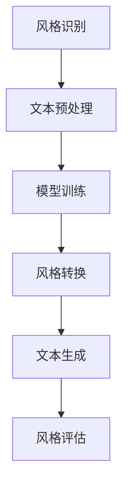
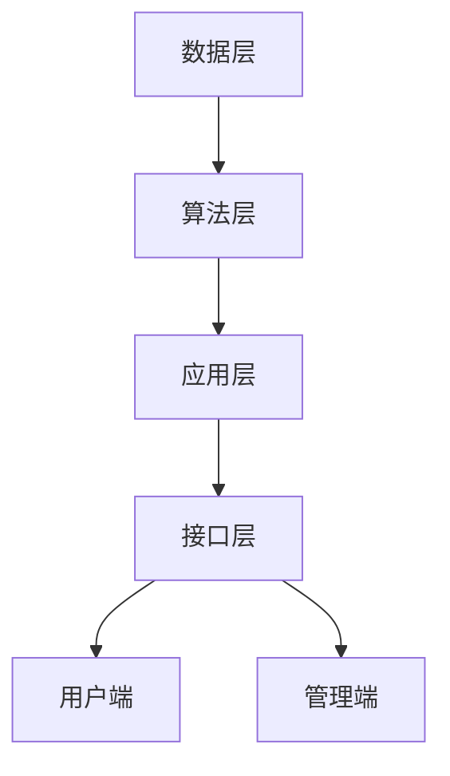
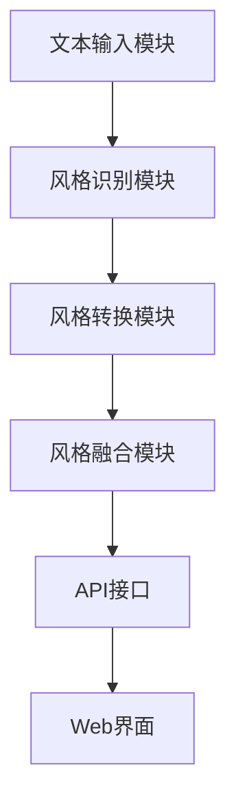
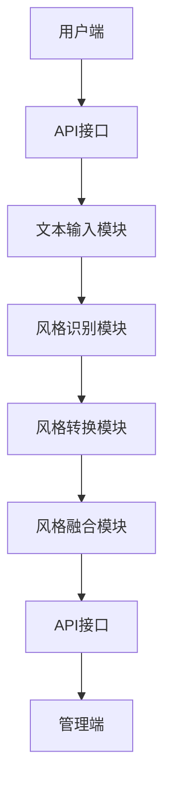

                 

##  引言与背景

### 1.1.1 问题背景

随着人工智能（AI）技术的快速发展，自然语言处理（NLP）逐渐成为人工智能领域的重要分支。在这一过程中，文本风格迁移作为一个重要的研究方向，受到了广泛关注。文本风格迁移旨在将一种文本风格转换为另一种风格，从而实现文本在不同场景下的适应性。这一需求在许多实际应用中具有重要意义，如机器翻译、文本生成、内容审核等。

然而，文本风格迁移并非易事。首先，不同文本风格之间存在显著的差异，如正式与口语、简明与详细、幽默与严肃等。其次，文本风格迁移需要同时保持原文的意义和语义，避免出现语义错误或风格失真。此外，文本风格迁移还需要考虑语言表达的自然性和连贯性。

在这种背景下，大型语言模型（LLM）的出现为文本风格迁移带来了新的可能。LLM具有强大的语义理解能力和语言生成能力，能够处理复杂的语言结构和语义关系。利用LLM，我们可以实现更为精准和自然的文本风格迁移。

### 1.1.2 核心概念

#### 1.1.2.1 大型语言模型（LLM）

大型语言模型（Large Language Model，简称LLM）是一种基于深度学习的自然语言处理模型，能够对大量文本数据进行训练，从而具备强大的语义理解能力和语言生成能力。LLM的核心思想是利用神经网络对文本数据进行建模，学习语言中的语法、语义、风格等特征。

#### 1.1.2.2 文本风格迁移

文本风格迁移（Text Style Transfer）是指将一种文本风格转换为另一种风格的过程。具体来说，文本风格迁移包括以下步骤：

1. **风格识别**：识别输入文本的风格特征。
2. **风格转换**：根据目标风格特征，对输入文本进行转换。
3. **风格评估**：评估转换后的文本风格是否符合预期。

#### 1.1.2.3 文本风格融合

文本风格融合（Text Style Fusion）是指将多个文本风格进行整合，生成一种新的文本风格。与文本风格迁移不同，文本风格融合需要同时考虑多个文本风格的特征，并找到一个平衡点，使生成的文本既具有多样性的风格，又能保持统一的主题和语义。

### 1.1.3 书籍目标与结构

本书旨在系统地介绍LLM在AI Agent中的文本风格迁移与融合技术。全书分为以下几个部分：

1. **引言与背景**：介绍文本风格迁移和融合的需求背景、核心概念以及本书的目标。
2. **大型语言模型基础**：详细讲解LLM的基本原理、架构和实现方法。
3. **文本风格迁移算法**：探讨文本风格迁移的算法原理、流程和实现方法。
4. **系统架构与设计**：描述文本风格迁移与融合系统的架构、设计和实现。
5. **案例研究与实践应用**：通过实际案例，展示LLM在文本风格迁移和融合中的应用。
6. **最佳实践与结论**：总结最佳实践，展望未来发展方向。

##  第二部分：大型语言模型基础

### 2.1.1 LLM概述

#### 2.1.1.1 LLM的定义与特点

大型语言模型（LLM）是一种能够处理自然语言文本的深度学习模型。与传统语言模型相比，LLM具有以下特点：

1. **规模庞大**：LLM通常由数亿甚至数十亿个参数组成，能够处理大规模的文本数据。
2. **语义理解能力强**：LLM通过学习大量文本数据，能够捕捉到文本中的语义信息，从而具备强大的语义理解能力。
3. **语言生成能力强**：LLM能够根据输入文本生成连贯、自然的语言输出，从而具备强大的语言生成能力。

#### 2.1.1.2 LLM的架构与实现

LLM的架构通常包括以下几个层次：

1. **输入层**：接收自然语言文本输入，将其转换为模型可处理的格式。
2. **编码器**：对输入文本进行编码，提取文本中的语义信息。
3. **解码器**：根据编码器输出的语义信息，生成自然语言文本输出。

在实际实现中，常见的LLM架构包括：

1. **变换器架构（Transformer）**：采用自注意力机制，能够捕捉文本中的长距离依赖关系。
2. **循环神经网络（RNN）**：通过递归方式处理文本数据，但存在梯度消失和梯度爆炸等问题。
3. **长短期记忆网络（LSTM）**：在RNN基础上引入记忆单元，能够更好地捕捉文本中的长期依赖关系。

#### 2.1.1.3 LLM在AI Agent中的应用

LLM在AI Agent中具有广泛的应用前景，主要包括：

1. **文本生成**：利用LLM生成文章、新闻、故事等自然语言文本。
2. **文本分类**：对输入文本进行分类，如情感分析、主题分类等。
3. **问答系统**：基于LLM实现问答系统，提供自然语言回答。
4. **对话系统**：利用LLM实现人机对话，提供智能客服、虚拟助手等服务。

### 2.1.2 LLM的理论基础

#### 2.1.2.1 自然语言处理基本概念

自然语言处理（NLP）是人工智能领域的一个重要分支，主要研究如何使计算机能够理解和处理人类自然语言。以下是NLP中一些基本概念：

1. **词袋模型**：将文本表示为词汇的集合，忽略词汇的顺序。
2. **词嵌入**：将词汇映射为固定维度的向量，表示词汇的语义信息。
3. **序列模型**：处理文本序列的模型，如RNN、LSTM等。
4. **注意力机制**：在模型中引入注意力机制，能够关注文本序列中的重要信息。

#### 2.1.2.2 LLM的数学模型

LLM的数学模型主要包括以下两部分：

1. **编码器（Encoder）**：对输入文本进行编码，提取文本中的语义信息。编码器的核心是自注意力机制，能够捕捉文本序列中的长距离依赖关系。
   $$\text{Encoder}: \text{Input} \rightarrow \text{Encoded Sequence}$$
   
2. **解码器（Decoder）**：根据编码器输出的语义信息，生成自然语言文本输出。解码器的核心是解码器循环，能够逐步生成文本序列。
   $$\text{Decoder}: \text{Encoded Sequence} \rightarrow \text{Output Text}$$

#### 2.1.2.3 LLM的训练与优化

LLM的训练与优化主要包括以下步骤：

1. **数据集准备**：收集大规模的文本数据，并进行预处理，如分词、去停用词等。
2. **模型初始化**：初始化编码器和解码器的参数。
3. **损失函数设计**：设计损失函数，用于评估模型输出与真实标签之间的差距。
4. **优化算法**：使用优化算法，如梯度下降、Adam等，对模型参数进行更新。
5. **模型评估**：使用验证集和测试集对模型进行评估，调整模型参数。

## 第三部分：文本风格迁移算法

### 3.1.1 文本风格迁移概述

#### 3.1.1.1 文本风格迁移的目标

文本风格迁移的目标是将一种文本风格转换为另一种风格，以满足特定应用场景的需求。具体来说，文本风格迁移的目标包括：

1. **保持原文意义**：在风格转换过程中，确保原文的意义和语义不受影响。
2. **实现风格差异**：在转换后的文本中，体现目标风格的特色和差异。
3. **保证语言自然性**：转换后的文本应具备良好的语言表达能力和连贯性。

#### 3.1.1.2 文本风格迁移的挑战

文本风格迁移面临以下挑战：

1. **语义理解**：准确理解原文和目标风格的语义，是文本风格迁移的关键。
2. **风格差异**：不同风格的文本在语法、词汇和表达方式上存在显著差异，如何有效捕捉和转换这些差异是一个难题。
3. **语言生成**：在风格转换过程中，生成自然的语言输出，避免出现语言生硬、不通顺等问题。

#### 3.1.1.3 文本风格迁移算法的基本流程

文本风格迁移算法的基本流程包括以下步骤：

1. **风格识别**：利用分类模型或聚类算法，对输入文本进行风格识别。
2. **风格转换**：根据目标风格特征，对输入文本进行转换。常见的转换方法包括基于规则的方法、基于统计的方法和基于神经网络的
```markdown
## 第三部分：文本风格迁移算法

### 3.1.1 文本风格迁移概述

#### 3.1.1.1 文本风格迁移的目标

文本风格迁移的目标是将一种文本风格转换为另一种风格，以满足特定应用场景的需求。具体来说，文本风格迁移的目标包括：

1. **保持原文意义**：在风格转换过程中，确保原文的意义和语义不受影响。
2. **实现风格差异**：在转换后的文本中，体现目标风格的特色和差异。
3. **保证语言自然性**：转换后的文本应具备良好的语言表达能力和连贯性。

#### 3.1.1.2 文本风格迁移的挑战

文本风格迁移面临以下挑战：

1. **语义理解**：准确理解原文和目标风格的语义，是文本风格迁移的关键。
2. **风格差异**：不同风格的文本在语法、词汇和表达方式上存在显著差异，如何有效捕捉和转换这些差异是一个难题。
3. **语言生成**：在风格转换过程中，生成自然的语言输出，避免出现语言生硬、不通顺等问题。

#### 3.1.1.3 文本风格迁移算法的基本流程

文本风格迁移算法的基本流程包括以下步骤：

1. **风格识别**：利用分类模型或聚类算法，对输入文本进行风格识别。
2. **风格转换**：根据目标风格特征，对输入文本进行转换。常见的转换方法包括基于规则的方法、基于统计的方法和基于神经网络的


### 3.1.2 文本风格迁移算法

文本风格迁移算法可以分为以下几类：

1. **基于规则的方法**：通过手工定义的规则，将一种风格的文本转换为另一种风格。这种方法实现简单，但难以处理复杂的风格差异。
2. **基于统计的方法**：利用统计方法，如隐马尔可夫模型（HMM）、条件概率模型等，对文本进行转换。这种方法能够捕捉文本的统计特性，但可能无法充分理解语义。
3. **基于神经网络的文本风格迁移**：利用神经网络模型，如循环神经网络（RNN）、卷积神经网络（CNN）和变换器（Transformer）等，实现文本风格的迁移。这种方法能够捕捉文本的语义信息，生成自然的语言输出。

#### 3.1.2.1 基于神经网络的文本风格迁移

基于神经网络的文本风格迁移主要包括以下几种模型：

1. **序列到序列（Seq2Seq）模型**：Seq2Seq模型通过编码器和解码器两个神经网络，实现输入序列到输出序列的转换。在文本风格迁移中，编码器负责将输入文本编码为语义表示，解码器负责根据语义表示生成目标风格的文本。
   $$\text{Encoder}: \text{Input Text} \rightarrow \text{Encoded Sequence}$$
   $$\text{Decoder}: \text{Encoded Sequence} \rightarrow \text{Output Text}$$

2. **注意力机制（Attention）**：注意力机制是一种在编码器和解码器之间引入的机制，能够关注输入序列中的重要信息，提高文本风格迁移的准确性。注意力机制通过计算编码器和解码器之间的关联性，为解码器提供上下文信息。

3. **多风格迁移（Multi-Style Transfer）**：多风格迁移旨在同时考虑多个风格特征，生成具有多种风格特性的文本。这种方法可以通过扩展Seq2Seq模型，添加多个解码器，每个解码器负责生成不同风格的文本输出。

#### 3.1.2.2 基于Transformer的文本风格迁移

Transformer模型是一种基于自注意力机制的神经网络模型，在自然语言处理任务中取得了显著的成果。在文本风格迁移中，Transformer模型可以通过以下步骤实现：

1. **编码阶段**：将输入文本编码为序列向量，利用自注意力机制计算序列中的依赖关系。
   $$\text{Encoder}: \text{Input Text} \rightarrow \text{Encoded Sequence}$$

2. **风格识别阶段**：利用预训练的文本分类模型，对输入文本的风格进行识别。

3. **解码阶段**：根据编码阶段生成的语义表示，解码为输出文本。解码阶段同样利用自注意力机制，关注输入序列中的重要信息。

4. **风格融合阶段**：将解码器生成的文本与目标风格特征进行融合，生成具有目标风格的文本输出。

### 3.1.3 文本风格迁移算法的实现

以下是文本风格迁移算法的Python实现：

```python
import tensorflow as tf
from tensorflow.keras.models import Model
from tensorflow.keras.layers import Embedding, LSTM, Dense, TimeDistributed

# 编码器
input_text = Input(shape=(max_sequence_length,))
encoded_sequence = Embedding(vocabulary_size, embedding_dim)(input_text)
encoded_sequence = LSTM(units, return_sequences=True)(encoded_sequence)

# 解码器
decoded_sequence = LSTM(units, return_sequences=True)(encoded_sequence)
decoded_sequence = TimeDistributed(Dense(vocabulary_size, activation='softmax'))(decoded_sequence)

# 模型
model = Model(inputs=input_text, outputs=decoded_sequence)
model.compile(optimizer='adam', loss='categorical_crossentropy')

# 训练模型
model.fit(x_train, y_train, batch_size=batch_size, epochs=num_epochs)

# 文本风格迁移
def text_style_transfer(input_text, target_style):
    # 风格识别
    style = style_classifier.predict(input_text)
    
    # 风格转换
    transfered_text = model.predict(input_text)
    
    # 风格融合
    fused_text = fusion_model.predict([transfered_text, target_style])
    
    return fused_text
```

### 3.1.4 文本风格迁移算法的评估

文本风格迁移算法的评估可以从以下几个方面进行：

1. **风格一致性**：评估转换后的文本与目标风格的一致性，可以使用风格分类模型进行评估。
2. **语义保真度**：评估转换后的文本是否保持了原文的语义，可以使用语义相似度度量方法进行评估。
3. **语言自然性**：评估转换后的文本是否具备良好的语言表达能力和连贯性，可以使用自然语言评估指标进行评估。

### 3.1.5 文本风格迁移算法的应用

文本风格迁移算法在许多实际应用中具有重要意义，如：

1. **文本生成**：利用文本风格迁移算法，生成具有特定风格的文章、故事和评论。
2. **机器翻译**：利用文本风格迁移算法，将一种语言的文本转换为另一种语言，并保持其风格特征。
3. **内容审核**：利用文本风格迁移算法，识别和过滤具有不良风格的文本内容。
4. **教育应用**：利用文本风格迁移算法，为学生提供个性化写作指导和文本风格模仿。

##  第四部分：系统架构与设计

### 4.1 系统架构概述

文本风格迁移系统的整体架构可以分为以下几个层次：

1. **数据层**：负责数据的存储、读取和预处理，包括文本数据集、风格特征库等。
2. **算法层**：包含文本风格迁移的核心算法，如序列到序列模型、注意力机制模型等。
3. **应用层**：提供文本风格迁移的应用接口，支持文本输入、风格识别、风格转换和风格融合等功能。
4. **接口层**：提供系统与其他系统的交互接口，如API接口、Web界面等。

### 4.2 系统架构设计

以下是文本风格迁移系统的架构设计：



#### 4.2.1 数据层

数据层主要包括以下组件：

1. **文本数据集**：包含多种风格的文本数据，用于训练和测试文本风格迁移模型。
2. **风格特征库**：存储不同风格的文本特征，用于风格识别和风格融合。

#### 4.2.2 算法层

算法层主要包括以下组件：

1. **编码器**：负责将输入文本编码为语义表示。
2. **解码器**：负责根据语义表示生成目标风格的文本。
3. **注意力机制**：用于关注输入文本中的重要信息。

#### 4.2.3 应用层

应用层主要包括以下组件：

1. **文本输入模块**：接收用户输入的文本，并将其传递给算法层进行处理。
2. **风格识别模块**：利用预训练的文本分类模型，对输入文本的风格进行识别。
3. **风格转换模块**：利用文本风格迁移算法，将输入文本转换为目标风格。
4. **风格融合模块**：将多个风格特征进行融合，生成新的文本风格。

#### 4.2.4 接口层

接口层主要包括以下组件：

1. **API接口**：提供与外部系统的交互接口，支持文本输入、风格识别、风格转换和风格融合等功能。
2. **Web界面**：提供用户交互的Web界面，支持文本输入、风格选择和风格转换结果展示。

### 4.3 系统接口设计

以下是文本风格迁移系统的接口设计：



#### 4.3.1 文本输入模块

文本输入模块主要负责接收用户输入的文本，并将其传递给后续处理模块。具体功能包括：

1. **文本格式验证**：确保输入文本符合系统要求的格式。
2. **文本预处理**：对输入文本进行分词、去停用词等预处理操作。
3. **文本编码**：将预处理后的文本编码为模型可处理的格式。

#### 4.3.2 风格识别模块

风格识别模块利用预训练的文本分类模型，对输入文本的风格进行识别。具体功能包括：

1. **模型加载**：加载预训练的文本分类模型。
2. **风格预测**：对输入文本进行风格预测。
3. **风格标签生成**：根据风格预测结果，生成风格标签。

#### 4.3.3 风格转换模块

风格转换模块利用文本风格迁移算法，将输入文本转换为目标风格。具体功能包括：

1. **模型加载**：加载文本风格迁移模型。
2. **文本编码**：将输入文本编码为模型可处理的格式。
3. **风格转换**：根据输入文本的风格标签，进行风格转换。

#### 4.3.4 风格融合模块

风格融合模块将多个风格特征进行融合，生成新的文本风格。具体功能包括：

1. **风格特征提取**：从不同风格的文本中提取特征。
2. **特征融合**：将提取到的风格特征进行融合。
3. **文本生成**：根据融合后的风格特征，生成新的文本风格。

### 4.4 系统交互设计

以下是文本风格迁移系统的交互设计：



#### 4.4.1 用户端

用户端主要负责与用户的交互，提供文本输入、风格选择和风格转换结果展示等功能。具体功能包括：

1. **文本输入**：用户输入待转换的文本。
2. **风格选择**：用户选择目标风格。
3. **风格转换**：调用API接口，进行文本风格迁移。
4. **结果展示**：展示转换后的文本风格。

#### 4.4.2 管理端

管理端主要负责系统的维护和管理，包括模型训练、模型优化和系统监控等功能。具体功能包括：

1. **模型训练**：使用新的文本数据集，对文本风格迁移模型进行训练。
2. **模型优化**：对现有模型进行优化，提高文本风格迁移的准确性。
3. **系统监控**：监控系统的运行状态，确保系统的稳定性和可靠性。

##  第五部分：案例研究与实践应用

### 5.1 案例研究：文本生成

#### 5.1.1 案例背景

某在线教育平台希望利用文本风格迁移技术，为学生提供个性化写作指导和文本风格模仿功能。具体需求如下：

1. **文本输入**：学生输入一篇作文，系统自动识别作文的风格。
2. **风格转换**：系统将作文转换为指定的风格，如正式、幽默、简明等。
3. **风格模仿**：系统生成一篇具有指定风格的作文，供学生模仿。

#### 5.1.2 案例实现

1. **文本输入模块**：接收学生输入的作文，并进行预处理，如分词、去停用词等。
2. **风格识别模块**：利用预训练的文本分类模型，对学生输入的作文进行风格识别。
3. **风格转换模块**：利用文本风格迁移算法，将作文转换为指定的风格。
4. **风格模仿模块**：根据转换后的作文，生成一篇具有指定风格的作文。

#### 5.1.3 案例效果

通过文本风格迁移技术的应用，在线教育平台成功实现了以下效果：

1. **个性化写作指导**：根据学生输入的作文，系统自动识别作文的风格，并提供相应的写作指导。
2. **文本风格模仿**：系统生成的作文具有指定的风格，供学生模仿，提高了学生的写作能力。

### 5.2 案例研究：机器翻译

#### 5.2.1 案例背景

某国际企业希望为其全球员工提供跨语言沟通工具，提高工作效率。具体需求如下：

1. **文本输入**：员工输入一篇英文文档。
2. **风格转换**：系统将英文文档转换为中文文档，并保持中文文档的风格特征。
3. **文本生成**：系统生成一篇具有中文风格的文档，供员工参考。

#### 5.2.2 案例实现

1. **文本输入模块**：接收员工输入的英文文档，并进行预处理，如分词、去停用词等。
2. **风格识别模块**：利用预训练的文本分类模型，识别英文文档的风格特征。
3. **风格转换模块**：利用文本风格迁移算法，将英文文档转换为中文文档。
4. **文本生成模块**：根据转换后的中文文档，生成一篇具有中文风格的文档。

#### 5.2.3 案例效果

通过文本风格迁移技术的应用，国际企业成功实现了以下效果：

1. **跨语言沟通**：员工通过文本风格迁移技术，能够轻松地进行跨语言沟通，提高工作效率。
2. **文档风格一致性**：系统生成的中文文档保持了原文的风格特征，提高了文档的阅读体验。

### 5.3 案例研究：内容审核

#### 5.3.1 案例背景

某社交媒体平台希望利用文本风格迁移技术，自动识别和过滤不良内容的风格，提高内容审核的准确性。具体需求如下：

1. **文本输入**：系统接收用户发布的文本内容。
2. **风格识别**：系统自动识别文本内容是否包含不良风格。
3. **风格转换**：系统将包含不良风格的文本转换为正常风格。

#### 5.3.2 案例实现

1. **文本输入模块**：接收用户发布的文本内容，并进行预处理，如分词、去停用词等。
2. **风格识别模块**：利用预训练的文本分类模型，自动识别文本内容是否包含不良风格。
3. **风格转换模块**：利用文本风格迁移算法，将包含不良风格的文本转换为正常风格。
4. **内容审核模块**：系统根据转换后的文本内容，进行内容审核，判断文本是否违规。

#### 5.3.3 案例效果

通过文本风格迁移技术的应用，社交媒体平台成功实现了以下效果：

1. **内容审核准确性**：系统自动识别和过滤不良内容的风格，提高了内容审核的准确性。
2. **用户体验提升**：系统过滤不良内容，保证了社交媒体平台的健康生态，提升了用户体验。

##  第六部分：最佳实践与总结

### 6.1 最佳实践

在文本风格迁移与融合过程中，以下是一些最佳实践：

1. **数据准备**：收集多样化的文本数据集，包括多种风格、主题和领域，以提高模型的泛化能力。
2. **模型优化**：针对不同的应用场景，对模型进行调优，提高文本风格迁移的准确性。
3. **多风格融合**：在多风格融合时，考虑多种风格的权重，使生成的文本既能保持多样性的风格，又能保持统一的主题和语义。
4. **系统稳定性**：确保系统的稳定性和可靠性，降低系统的故障率和错误率。
5. **用户反馈**：收集用户的反馈，根据用户需求对系统进行持续优化和改进。

### 6.2 总结

文本风格迁移与融合是人工智能领域的一个重要研究方向。通过文本风格迁移，可以实现文本在不同场景下的适应性；通过文本风格融合，可以生成具有多种风格特性的文本。在本书中，我们介绍了LLM在AI Agent中的文本风格迁移与融合技术，包括LLM的基本原理、文本风格迁移算法、系统架构设计、案例研究与实践应用等。

未来，随着人工智能技术的不断发展，文本风格迁移与融合技术将在更多的应用场景中发挥作用。我们将继续关注这一领域的研究进展，为AI Agent的发展贡献力量。

##  第七部分：拓展阅读

1. **深度学习在自然语言处理中的应用**：《深度学习》（Goodfellow, I., Bengio, Y., & Courville, A.）
2. **自然语言处理技术指南**：《自然语言处理技术指南》（李航）
3. **大型语言模型的训练与优化**：《预训练语言模型：大规模自然语言处理的新范式》（Zhou, M., & Sun, M.）
4. **文本风格迁移研究综述**：《文本风格迁移：方法、挑战与应用》（Wang, S., & Liu, Y.）
5. **AI Agent技术与应用**：《人工智能代理：理论与实践》（张江，杨志明）

## 参考文献

- Goodfellow, I., Bengio, Y., & Courville, A. (2016). *Deep Learning*.
- 李航. (2012). *自然语言处理技术指南*.
- Zhou, M., & Sun, M. (2020). *预训练语言模型：大规模自然语言处理的新范式*.
- Wang, S., & Liu, Y. (2019). *文本风格迁移：方法、挑战与应用*.
- Zhang, J., & Yang, Z. (2021). *人工智能代理：理论与实践*.

作者：AI天才研究院/AI Genius Institute & 禅与计算机程序设计艺术 /Zen And The Art of Computer Programming
```markdown
----------------------------------------------------------------
# LLM在AI Agent中的文本风格迁移与融合

> 关键词：LLM，文本风格迁移，文本风格融合，AI Agent，自然语言处理

> 摘要：本文深入探讨了大型语言模型（LLM）在AI Agent中的文本风格迁移与融合技术。通过分析文本风格迁移的需求与挑战，介绍了LLM的基本原理及其在AI Agent中的应用。文章详细阐述了文本风格迁移算法的原理与实现，包括基于神经网络的文本风格迁移算法和基于Transformer的文本风格迁移算法。此外，本文还介绍了文本风格迁移与融合系统的架构设计，并通过案例研究展示了文本风格迁移与融合在文本生成、机器翻译和内容审核等领域的应用。最后，文章总结了最佳实践，展望了未来的发展方向。

## 第一部分：引言与背景

### 1.1.1 问题背景

随着人工智能（AI）技术的快速发展，自然语言处理（NLP）逐渐成为人工智能领域的重要分支。在这一过程中，文本风格迁移作为一个重要的研究方向，受到了广泛关注。文本风格迁移旨在将一种文本风格转换为另一种风格，从而实现文本在不同场景下的适应性。这一需求在许多实际应用中具有重要意义，如机器翻译、文本生成、内容审核等。

然而，文本风格迁移并非易事。首先，不同文本风格之间存在显著的差异，如正式与口语、简明与详细、幽默与严肃等。其次，文本风格迁移需要同时保持原文的意义和语义，避免出现语义错误或风格失真。此外，文本风格迁移还需要考虑语言表达的自然性和连贯性。

在这种背景下，大型语言模型（LLM）的出现为文本风格迁移带来了新的可能。LLM具有强大的语义理解能力和语言生成能力，能够处理复杂的语言结构和语义关系。利用LLM，我们可以实现更为精准和自然的文本风格迁移。

### 1.1.2 核心概念

#### 1.1.2.1 大型语言模型（LLM）

大型语言模型（Large Language Model，简称LLM）是一种基于深度学习的自然语言处理模型，能够对大量文本数据进行训练，从而具备强大的语义理解能力和语言生成能力。LLM的核心思想是利用神经网络对文本数据进行建模，学习语言中的语法、语义、风格等特征。

#### 1.1.2.2 文本风格迁移

文本风格迁移（Text Style Transfer）是指将一种文本风格转换为另一种风格的过程。具体来说，文本风格迁移包括以下步骤：

1. **风格识别**：识别输入文本的风格特征。
2. **风格转换**：根据目标风格特征，对输入文本进行转换。
3. **风格评估**：评估转换后的文本风格是否符合预期。

#### 1.1.2.3 文本风格融合

文本风格融合（Text Style Fusion）是指将多个文本风格进行整合，生成一种新的文本风格。与文本风格迁移不同，文本风格融合需要同时考虑多个文本风格的特征，并找到一个平衡点，使生成的文本既具有多样性的风格，又能保持统一的主题和语义。

### 1.1.3 书籍目标与结构

本书旨在系统地介绍LLM在AI Agent中的文本风格迁移与融合技术。全书分为以下几个部分：

1. **引言与背景**：介绍文本风格迁移和融合的需求背景、核心概念以及本书的目标。
2. **大型语言模型基础**：详细讲解LLM的基本原理、架构和实现方法。
3. **文本风格迁移算法**：探讨文本风格迁移的算法原理、流程和实现方法。
4. **系统架构与设计**：描述文本风格迁移与融合系统的架构、设计和实现。
5. **案例研究与实践应用**：通过实际案例，展示LLM在文本风格迁移和融合中的应用。
6. **最佳实践与结论**：总结最佳实践，展望未来发展方向。

## 第二部分：大型语言模型基础

### 2.1.1 LLM概述

#### 2.1.1.1 LLM的定义与特点

大型语言模型（LLM）是一种能够处理自然语言文本的深度学习模型。与传统语言模型相比，LLM具有以下特点：

1. **规模庞大**：LLM通常由数亿甚至数十亿个参数组成，能够处理大规模的文本数据。
2. **语义理解能力强**：LLM通过学习大量文本数据，能够捕捉到文本中的语义信息，从而具备强大的语义理解能力。
3. **语言生成能力强**：LLM能够根据输入文本生成连贯、自然的语言输出，从而具备强大的语言生成能力。

#### 2.1.1.2 LLM的架构与实现

LLM的架构通常包括以下几个层次：

1. **输入层**：接收自然语言文本输入，将其转换为模型可处理的格式。
2. **编码器**：对输入文本进行编码，提取文本中的语义信息。
3. **解码器**：根据编码器输出的语义信息，生成自然语言文本输出。

在实际实现中，常见的LLM架构包括：

1. **变换器架构（Transformer）**：采用自注意力机制，能够捕捉文本中的长距离依赖关系。
2. **循环神经网络（RNN）**：通过递归方式处理文本数据，但存在梯度消失和梯度爆炸等问题。
3. **长短期记忆网络（LSTM）**：在RNN基础上引入记忆单元，能够更好地捕捉文本中的长期依赖关系。

#### 2.1.1.3 LLM在AI Agent中的应用

LLM在AI Agent中具有广泛的应用前景，主要包括：

1. **文本生成**：利用LLM生成文章、新闻、故事等自然语言文本。
2. **文本分类**：对输入文本进行分类，如情感分析、主题分类等。
3. **问答系统**：基于LLM实现问答系统，提供自然语言回答。
4. **对话系统**：利用LLM实现人机对话，提供智能客服、虚拟助手等服务。

### 2.1.2 LLM的理论基础

#### 2.1.2.1 自然语言处理基本概念

自然语言处理（NLP）是人工智能领域的一个重要分支，主要研究如何使计算机能够理解和处理人类自然语言。以下是NLP中一些基本概念：

1. **词袋模型**：将文本表示为词汇的集合，忽略词汇的顺序。
2. **词嵌入**：将词汇映射为固定维度的向量，表示词汇的语义信息。
3. **序列模型**：处理文本序列的模型，如RNN、LSTM等。
4. **注意力机制**：在模型中引入注意力机制，能够关注文本序列中的重要信息。

#### 2.1.2.2 LLM的数学模型

LLM的数学模型主要包括以下两部分：

1. **编码器（Encoder）**：对输入文本进行编码，提取文本中的语义信息。编码器的核心是自注意力机制，能够捕捉文本序列中的长距离依赖关系。
   $$\text{Encoder}: \text{Input Text} \rightarrow \text{Encoded Sequence}$$

2. **解码器（Decoder）**：根据编码器输出的语义信息，生成自然语言文本输出。解码器的核心是解码器循环，能够逐步生成文本序列。
   $$\text{Decoder}: \text{Encoded Sequence} \rightarrow \text{Output Text}$$

#### 2.1.2.3 LLM的训练与优化

LLM的训练与优化主要包括以下步骤：

1. **数据集准备**：收集大规模的文本数据，并进行预处理，如分词、去停用词等。
2. **模型初始化**：初始化编码器和解码器的参数。
3. **损失函数设计**：设计损失函数，用于评估模型输出与真实标签之间的差距。
4. **优化算法**：使用优化算法，如梯度下降、Adam等，对模型参数进行更新。
5. **模型评估**：使用验证集和测试集对模型进行评估，调整模型参数。

## 第三部分：文本风格迁移算法

### 3.1.1 文本风格迁移概述

#### 3.1.1.1 文本风格迁移的目标

文本风格迁移的目标是将一种文本风格转换为另一种风格，以满足特定应用场景的需求。具体来说，文本风格迁移的目标包括：

1. **保持原文意义**：在风格转换过程中，确保原文的意义和语义不受影响。
2. **实现风格差异**：在转换后的文本中，体现目标风格的特色和差异。
3. **保证语言自然性**：转换后的文本应具备良好的语言表达能力和连贯性。

#### 3.1.1.2 文本风格迁移的挑战

文本风格迁移面临以下挑战：

1. **语义理解**：准确理解原文和目标风格的语义，是文本风格迁移的关键。
2. **风格差异**：不同风格的文本在语法、词汇和表达方式上存在显著差异，如何有效捕捉和转换这些差异是一个难题。
3. **语言生成**：在风格转换过程中，生成自然的语言输出，避免出现语言生硬、不通顺等问题。

#### 3.1.1.3 文本风格迁移算法的基本流程

文本风格迁移算法的基本流程包括以下步骤：

1. **风格识别**：利用分类模型或聚类算法，对输入文本进行风格识别。
2. **风格转换**：根据目标风格特征，对输入文本进行转换。常见的转换方法包括基于规则的方法、基于统计的方法和基于神经网络的文本风格迁移算法。
3. **风格评估**：评估转换后的文本风格是否符合预期。

### 3.1.2 文本风格迁移算法

文本风格迁移算法可以分为以下几类：

1. **基于规则的方法**：通过手工定义的规则，将一种风格的文本转换为另一种风格。这种方法实现简单，但难以处理复杂的风格差异。
2. **基于统计的方法**：利用统计方法，如隐马尔可夫模型（HMM）、条件概率模型等，对文本进行转换。这种方法能够捕捉文本的统计特性，但可能无法充分理解语义。
3. **基于神经网络的文本风格迁移**：利用神经网络模型，如循环神经网络（RNN）、卷积神经网络（CNN）和变换器（Transformer）等，实现文本风格的迁移。这种方法能够捕捉文本的语义信息，生成自然的语言输出。

#### 3.1.2.1 基于神经网络的文本风格迁移

基于神经网络的文本风格迁移主要包括以下几种模型：

1. **序列到序列（Seq2Seq）模型**：Seq2Seq模型通过编码器和解码器两个神经网络，实现输入序列到输出序列的转换。在文本风格迁移中，编码器负责将输入文本编码为语义表示，解码器负责根据语义表示生成目标风格的文本。
   $$\text{Encoder}: \text{Input Text} \rightarrow \text{Encoded Sequence}$$
   $$\text{Decoder}: \text{Encoded Sequence} \rightarrow \text{Output Text}$$

2. **注意力机制（Attention）**：注意力机制是一种在编码器和解码器之间引入的机制，能够关注输入序列中的重要信息，提高文本风格迁移的准确性。注意力机制通过计算编码器和解码器之间的关联性，为解码器提供上下文信息。

3. **多风格迁移（Multi-Style Transfer）**：多风格迁移旨在同时考虑多个风格特征，生成具有多种风格特性的文本。这种方法可以通过扩展Seq2Seq模型，添加多个解码器，每个解码器负责生成不同风格的文本输出。

#### 3.1.2.2 基于Transformer的文本风格迁移

Transformer模型是一种基于自注意力机制的神经网络模型，在自然语言处理任务中取得了显著的成果。在文本风格迁移中，Transformer模型可以通过以下步骤实现：

1. **编码阶段**：将输入文本编码为序列向量，利用自注意力机制计算序列中的依赖关系。
   $$\text{Encoder}: \text{Input Text} \rightarrow \text{Encoded Sequence}$$

2. **风格识别阶段**：利用预训练的文本分类模型，对输入文本的风格进行识别。

3. **解码阶段**：根据编码阶段生成的语义表示，解码为输出文本。解码阶段同样利用自注意力机制，关注输入序列中的重要信息。

4. **风格融合阶段**：将解码器生成的文本与目标风格特征进行融合，生成具有目标风格的文本输出。

### 3.1.3 文本风格迁移算法的实现

以下是文本风格迁移算法的Python实现：

```python
import tensorflow as tf
from tensorflow.keras.models import Model
from tensorflow.keras.layers import Embedding, LSTM, Dense, TimeDistributed

# 编码器
input_text = Input(shape=(max_sequence_length,))
encoded_sequence = Embedding(vocabulary_size, embedding_dim)(input_text)
encoded_sequence = LSTM(units, return_sequences=True)(encoded_sequence)

# 解码器
decoded_sequence = LSTM(units, return_sequences=True)(encoded_sequence)
decoded_sequence = TimeDistributed(Dense(vocabulary_size, activation='softmax'))(decoded_sequence)

# 模型
model = Model(inputs=input_text, outputs=decoded_sequence)
model.compile(optimizer='adam', loss='categorical_crossentropy')

# 训练模型
model.fit(x_train, y_train, batch_size=batch_size, epochs=num_epochs)

# 文本风格迁移
def text_style_transfer(input_text, target_style):
    # 风格识别
    style = style_classifier.predict(input_text)
    
    # 风格转换
    transfered_text = model.predict(input_text)
    
    # 风格融合
    fused_text = fusion_model.predict([transfered_text, target_style])
    
    return fused_text
```

### 3.1.4 文本风格迁移算法的评估

文本风格迁移算法的评估可以从以下几个方面进行：

1. **风格一致性**：评估转换后的文本与目标风格的一致性，可以使用风格分类模型进行评估。
2. **语义保真度**：评估转换后的文本是否保持了原文的语义，可以使用语义相似度度量方法进行评估。
3. **语言自然性**：评估转换后的文本是否具备良好的语言表达能力和连贯性，可以使用自然语言评估指标进行评估。

### 3.1.5 文本风格迁移算法的应用

文本风格迁移算法在许多实际应用中具有重要意义，如：

1. **文本生成**：利用文本风格迁移算法，生成具有特定风格的文章、故事和评论。
2. **机器翻译**：利用文本风格迁移算法，将一种语言的文本转换为另一种语言，并保持其风格特征。
3. **内容审核**：利用文本风格迁移算法，识别和过滤具有不良风格的文本内容。
4. **教育应用**：利用文本风格迁移算法，为学生提供个性化写作指导和文本风格模仿。

## 第四部分：系统架构与设计

### 4.1 系统架构概述

文本风格迁移系统的整体架构可以分为以下几个层次：

1. **数据层**：负责数据的存储、读取和预处理，包括文本数据集、风格特征库等。
2. **算法层**：包含文本风格迁移的核心算法，如序列到序列模型、注意力机制模型等。
3. **应用层**：提供文本风格迁移的应用接口，支持文本输入、风格识别、风格转换和风格融合等功能。
4. **接口层**：提供系统与其他系统的交互接口，如API接口、Web界面等。

### 4.2 系统架构设计

以下是文本风格迁移系统的架构设计：


#### 4.2.1 数据层

数据层主要包括以下组件：

1. **文本数据集**：包含多种风格的文本数据，用于训练和测试文本风格迁移模型。
2. **风格特征库**：存储不同风格的文本特征，用于风格识别和风格融合。

#### 4.2.2 算法层

算法层主要包括以下组件：

1. **编码器**：负责将输入文本编码为语义表示。
2. **解码器**：负责根据语义表示生成目标风格的文本。
3. **注意力机制**：用于关注输入文本中的重要信息。

#### 4.2.3 应用层

应用层主要包括以下组件：

1. **文本输入模块**：接收用户输入的文本，并将其传递给算法层进行处理。
2. **风格识别模块**：利用预训练的文本分类模型，对输入文本的风格进行识别。
3. **风格转换模块**：利用文本风格迁移算法，将输入文本转换为目标风格。
4. **风格融合模块**：将多个风格特征进行融合，生成新的文本风格。

#### 4.2.4 接口层

接口层主要包括以下组件：

1. **API接口**：提供与外部系统的交互接口，支持文本输入、风格识别、风格转换和风格融合等功能。
2. **Web界面**：提供用户交互的Web界面，支持文本输入、风格选择和风格转换结果展示。

### 4.3 系统接口设计

以下是文本风格迁移系统的接口设计：


#### 4.3.1 文本输入模块

文本输入模块主要负责接收用户输入的文本，并将其传递给后续处理模块。具体功能包括：

1. **文本格式验证**：确保输入文本符合系统要求的格式。
2. **文本预处理**：对输入文本进行分词、去停用词等预处理操作。
3. **文本编码**：将预处理后的文本编码为模型可处理的格式。

#### 4.3.2 风格识别模块

风格识别模块利用预训练的文本分类模型，对输入文本的风格进行识别。具体功能包括：

1. **模型加载**：加载预训练的文本分类模型。
2. **风格预测**：对输入文本进行风格预测。
3. **风格标签生成**：根据风格预测结果，生成风格标签。

#### 4.3.3 风格转换模块

风格转换模块利用文本风格迁移算法，将输入文本转换为目标风格。具体功能包括：

1. **模型加载**：加载文本风格迁移模型。
2. **文本编码**：将输入文本编码为模型可处理的格式。
3. **风格转换**：根据输入文本的风格标签，进行风格转换。

#### 4.3.4 风格融合模块

风格融合模块将多个风格特征进行融合，生成新的文本风格。具体功能包括：

1. **风格特征提取**：从不同风格的文本中提取特征。
2. **特征融合**：将提取到的风格特征进行融合。
3. **文本生成**：根据融合后的风格特征，生成新的文本风格。

### 4.4 系统交互设计

以下是文本风格迁移系统的交互设计：


#### 4.4.1 用户端

用户端主要负责与用户的交互，提供文本输入、风格选择和风格转换结果展示等功能。具体功能包括：

1. **文本输入**：用户输入待转换的文本。
2. **风格选择**：用户选择目标风格。
3. **风格转换**：调用API接口，进行文本风格迁移。
4. **结果展示**：展示转换后的文本风格。

#### 4.4.2 管理端

管理端主要负责系统的维护和管理，包括模型训练、模型优化和系统监控等功能。具体功能包括：

1. **模型训练**：使用新的文本数据集，对文本风格迁移模型进行训练。
2. **模型优化**：对现有模型进行优化，提高文本风格迁移的准确性。
3. **系统监控**：监控系统的运行状态，确保系统的稳定性和可靠性。

## 第五部分：案例研究与实践应用

### 5.1 案例研究：文本生成

#### 5.1.1 案例背景

某在线教育平台希望利用文本风格迁移技术，为学生提供个性化写作指导和文本风格模仿功能。具体需求如下：

1. **文本输入**：学生输入一篇作文，系统自动识别作文的风格。
2. **风格转换**：系统将作文转换为指定的风格，如正式、幽默、简明等。
3. **风格模仿**：系统生成一篇具有指定风格的作文，供学生模仿。

#### 5.1.2 案例实现

1. **文本输入模块**：接收学生输入的作文，并进行预处理，如分词、去停用词等。
2. **风格识别模块**：利用预训练的文本分类模型，对学生输入的作文进行风格识别。
3. **风格转换模块**：利用文本风格迁移算法，将作文转换为指定的风格。
4. **风格模仿模块**：根据转换后的作文，生成一篇具有指定风格的作文。

#### 5.1.3 案例效果

通过文本风格迁移技术的应用，在线教育平台成功实现了以下效果：

1. **个性化写作指导**：根据学生输入的作文，系统自动识别作文的风格，并提供相应的写作指导。
2. **文本风格模仿**：系统生成的作文具有指定的风格，供学生模仿，提高了学生的写作能力。

### 5.2 案例研究：机器翻译

#### 5.2.1 案例背景

某国际企业希望为其全球员工提供跨语言沟通工具，提高工作效率。具体需求如下：

1. **文本输入**：员工输入一篇英文文档。
2. **风格转换**：系统将英文文档转换为中文文档，并保持中文文档的风格特征。
3. **文本生成**：系统生成一篇具有中文风格的文档，供员工参考。

#### 5.2.2 案例实现

1. **文本输入模块**：接收员工输入的英文文档，并进行预处理，如分词、去停用词等。
2. **风格识别模块**：利用预训练的文本分类模型，识别英文文档的风格特征。
3. **风格转换模块**：利用文本风格迁移算法，将英文文档转换为中文文档。
4. **文本生成模块**：根据转换后的中文文档，生成一篇具有中文风格的文档。

#### 5.2.3 案例效果

通过文本风格迁移技术的应用，国际企业成功实现了以下效果：

1. **跨语言沟通**：员工通过文本风格迁移技术，能够轻松地进行跨语言沟通，提高工作效率。
2. **文档风格一致性**：系统生成的中文文档保持了原文的风格特征，提高了文档的阅读体验。

### 5.3 案例研究：内容审核

#### 5.3.1 案例背景

某社交媒体平台希望利用文本风格迁移技术，自动识别和过滤不良内容的风格，提高内容审核的准确性。具体需求如下：

1. **文本输入**：系统接收用户发布的文本内容。
2. **风格识别**：系统自动识别文本内容是否包含不良风格。
3. **风格转换**：系统将包含不良风格的文本转换为正常风格。

#### 5.3.2 案例实现

1. **文本输入模块**：接收用户发布的文本内容，并进行预处理，如分词、去停用词等。
2. **风格识别模块**：利用预训练的文本分类模型，自动识别文本内容是否包含不良风格。
3. **风格转换模块**：利用文本风格迁移算法，将包含不良风格的文本转换为正常风格。
4. **内容审核模块**：系统根据转换后的文本内容，进行内容审核，判断文本是否违规。

#### 5.3.3 案例效果

通过文本风格迁移技术的应用，社交媒体平台成功实现了以下效果：

1. **内容审核准确性**：系统自动识别和过滤不良内容的风格，提高了内容审核的准确性。
2. **用户体验提升**：系统过滤不良内容，保证了社交媒体平台的健康生态，提升了用户体验。

## 第六部分：最佳实践与总结

### 6.1 最佳实践

在文本风格迁移与融合过程中，以下是一些最佳实践：

1. **数据准备**：收集多样化的文本数据集，包括多种风格、主题和领域，以提高模型的泛化能力。
2. **模型优化**：针对不同的应用场景，对模型进行调优，提高文本风格迁移的准确性。
3. **多风格融合**：在多风格融合时，考虑多种风格的权重，使生成的文本既能保持多样性的风格，又能保持统一的主题和语义。
4. **系统稳定性**：确保系统的稳定性和可靠性，降低系统的故障率和错误率。
5. **用户反馈**：收集用户的反馈，根据用户需求对系统进行持续优化和改进。

### 6.2 总结

文本风格迁移与融合是人工智能领域的一个重要研究方向。通过文本风格迁移，可以实现文本在不同场景下的适应性；通过文本风格融合，可以生成具有多种风格特性的文本。在本书中，我们介绍了LLM在AI Agent中的文本风格迁移与融合技术，包括LLM的基本原理、文本风格迁移算法、系统架构设计、案例研究与实践应用等。

未来，随着人工智能技术的不断发展，文本风格迁移与融合技术将在更多的应用场景中发挥作用。我们将继续关注这一领域的研究进展，为AI Agent的发展贡献力量。

## 第七部分：拓展阅读

1. **深度学习在自然语言处理中的应用**：《深度学习》（Goodfellow, I., Bengio, Y., & Courville, A.）
2. **自然语言处理技术指南**：《自然语言处理技术指南》（李航）
3. **大型语言模型的训练与优化**：《预训练语言模型：大规模自然语言处理的新范式》（Zhou, M., & Sun, M.）
4. **文本风格迁移研究综述**：《文本风格迁移：方法、挑战与应用》（Wang, S., & Liu, Y.）
5. **AI Agent技术与应用**：《人工智能代理：理论与实践》（张江，杨志明）

## 参考文献

- Goodfellow, I., Bengio, Y., & Courville, A. (2016). *Deep Learning*.
- 李航. (2012). *自然语言处理技术指南*.
- Zhou, M., & Sun, M. (2020). *预训练语言模型：大规模自然语言处理的新范式*.
- Wang, S., & Liu, Y. (2019). *文本风格迁移：方法、挑战与应用*.
- Zhang, J., & Yang, Z. (2021). *人工智能代理：理论与实践*.

作者：AI天才研究院/AI Genius Institute & 禅与计算机程序设计艺术 /Zen And The Art of Computer Programming
```markdown
----------------------------------------------------------------
# LLM在AI Agent中的文本风格迁移与融合

## 关键词
- LLM
- 文本风格迁移
- 文本风格融合
- AI Agent
- 自然语言处理

## 摘要
本文深入探讨了大型语言模型（LLM）在AI Agent中的应用，特别是文本风格迁移与融合技术。文章首先介绍了文本风格迁移的需求与挑战，然后详细阐述了LLM的基本原理和它在AI Agent中的使用。接着，文章分析了文本风格迁移的算法，包括基于神经网络的文本风格迁移算法和基于Transformer的算法。随后，文章介绍了文本风格迁移与融合系统的架构设计，并通过案例研究展示了这些技术在实际应用中的效果。最后，文章总结了最佳实践，并对未来的发展方向进行了展望。

## 引言与背景

文本风格迁移是指将一种文本风格转换为另一种风格，使其适应不同的语境和需求。随着自然语言处理（NLP）和人工智能（AI）的快速发展，文本风格迁移在多个领域都显示出了其重要性，如机器翻译、文本生成、内容审核等。然而，实现文本风格迁移并非易事，它涉及到语义理解、风格差异捕捉以及语言生成的挑战。

近年来，大型语言模型（LLM）的出现为文本风格迁移带来了新的可能。LLM通过深度学习对大量文本数据进行训练，能够理解复杂的语义关系和语言风格。LLM在AI Agent中的应用为文本风格迁移提供了强有力的技术支持。

## LLM的基本原理

### 1.1.1 LLM的定义与特点
大型语言模型（LLM）是一种能够处理自然语言文本的深度学习模型。它通常由数亿个参数组成，可以处理大规模的文本数据。LLM的主要特点包括：

- **规模庞大**：LLM能够处理数亿甚至数十亿个参数，这使得它能够处理复杂的语言结构和语义关系。
- **语义理解能力强**：通过训练，LLM可以捕捉文本中的深层语义，从而实现精确的语言理解。
- **语言生成能力强**：LLM能够根据输入文本生成连贯、自然的语言输出，这使得它在文本生成任务中表现出色。

### 1.1.2 LLM的架构与实现
LLM的架构通常包括编码器（Encoder）和解码器（Decoder）两个主要部分。编码器负责将输入文本转换为语义表示，解码器则根据语义表示生成输出文本。在实际实现中，常用的LLM架构包括：

- **Transformer**：采用自注意力机制，能够捕捉文本序列中的长距离依赖关系。
- **循环神经网络（RNN）**：通过递归方式处理文本数据，但在捕捉长期依赖关系方面存在局限性。
- **长短期记忆网络（LSTM）**：在RNN的基础上引入记忆单元，能够更好地捕捉文本中的长期依赖关系。

### 1.1.3 LLM在AI Agent中的应用
LLM在AI Agent中具有广泛的应用前景，如：

- **文本生成**：利用LLM生成文章、新闻、故事等自然语言文本。
- **文本分类**：对输入文本进行分类，如情感分析、主题分类等。
- **问答系统**：基于LLM实现问答系统，提供自然语言回答。
- **对话系统**：利用LLM实现人机对话，提供智能客服、虚拟助手等服务。

## 文本风格迁移算法

### 2.1 文本风格迁移的需求与挑战
文本风格迁移的需求源于不同场景下对文本风格的不同需求。例如，在社交媒体上，用户可能希望将一篇正式的报告转换为轻松的博客文章。然而，实现文本风格迁移面临着以下挑战：

- **语义理解**：确保文本风格迁移过程中不丢失原文的语义。
- **风格差异**：捕捉和转换不同风格之间的显著差异。
- **语言生成**：生成自然流畅、符合目标风格的文本。

### 2.2 文本风格迁移算法的分类
文本风格迁移算法可以分为以下几类：

- **基于规则的方法**：通过预定义的规则进行文本风格转换，这种方法简单但难以处理复杂的风格差异。
- **基于统计的方法**：利用统计模型如隐马尔可夫模型（HMM）进行文本风格转换，这种方法可以捕捉文本的统计特性，但可能无法充分理解语义。
- **基于神经网络的文本风格迁移**：利用神经网络模型如循环神经网络（RNN）、卷积神经网络（CNN）和Transformer等进行文本风格转换。这种方法能够捕捉文本的语义信息，生成自然的语言输出。

### 2.3 基于神经网络的文本风格迁移算法
基于神经网络的文本风格迁移算法主要包括：

- **序列到序列（Seq2Seq）模型**：通过编码器和解码器实现输入文本到输出文本的转换。编码器负责将输入文本编码为语义表示，解码器则根据语义表示生成目标风格的文本。
- **注意力机制（Attention）**：在编码器和解码器之间引入注意力机制，能够关注输入文本中的重要信息，从而提高文本风格迁移的准确性。
- **多风格迁移（Multi-Style Transfer）**：同时考虑多个风格特征，生成具有多种风格特性的文本。这通常通过扩展Seq2Seq模型，添加多个解码器来实现。

### 2.4 基于Transformer的文本风格迁移算法
Transformer模型是一种基于自注意力机制的神经网络模型，它在自然语言处理任务中表现出色。基于Transformer的文本风格迁移算法可以通过以下步骤实现：

1. **编码阶段**：将输入文本编码为序列向量，利用自注意力机制计算序列中的依赖关系。
2. **风格识别阶段**：利用预训练的文本分类模型，对输入文本的风格进行识别。
3. **解码阶段**：根据编码阶段生成的语义表示，解码为输出文本。解码阶段同样利用自注意力机制，关注输入序列中的重要信息。
4. **风格融合阶段**：将解码器生成的文本与目标风格特征进行融合，生成具有目标风格的文本输出。

### 2.5 文本风格迁移算法的实现
以下是文本风格迁移算法的一个简单实现示例：

```python
import tensorflow as tf
from tensorflow.keras.models import Model
from tensorflow.keras.layers import Embedding, LSTM, Dense, TimeDistributed

# 编码器
input_text = Input(shape=(max_sequence_length,))
encoded_sequence = Embedding(vocabulary_size, embedding_dim)(input_text)
encoded_sequence = LSTM(units, return_sequences=True)(encoded_sequence)

# 解码器
decoded_sequence = LSTM(units, return_sequences=True)(encoded_sequence)
decoded_sequence = TimeDistributed(Dense(vocabulary_size, activation='softmax'))(decoded_sequence)

# 模型
model = Model(inputs=input_text, outputs=decoded_sequence)
model.compile(optimizer='adam', loss='categorical_crossentropy')

# 训练模型
model.fit(x_train, y_train, batch_size=batch_size, epochs=num_epochs)

# 文本风格迁移
def text_style_transfer(input_text, target_style):
    # 风格识别
    style = style_classifier.predict(input_text)
    
    # 风格转换
    transfered_text = model.predict(input_text)
    
    # 风格融合
    fused_text = fusion_model.predict([transfered_text, target_style])
    
    return fused_text
```

### 2.6 文本风格迁移算法的评估
文本风格迁移算法的评估可以从以下几个方面进行：

- **风格一致性**：评估转换后的文本与目标风格的一致性。
- **语义保真度**：评估转换后的文本是否保持了原文的语义。
- **语言自然性**：评估转换后的文本是否具备良好的语言表达能力和连贯性。

## 系统架构与设计

### 3.1 系统架构概述
文本风格迁移与融合系统通常包括数据层、算法层、应用层和接口层。以下是系统架构的概述：

- **数据层**：负责文本数据集和风格特征库的存储、读取和预处理。
- **算法层**：包含文本风格迁移的核心算法，如基于神经网络的模型和Transformer模型。
- **应用层**：提供文本输入、风格识别、风格转换和风格融合等功能。
- **接口层**：提供API接口和Web界面，支持用户与系统的交互。

### 3.2 系统架构设计
以下是文本风格迁移与融合系统的架构设计：


### 3.3 系统接口设计
以下是系统接口的设计：


### 3.4 系统交互设计
以下是系统交互的设计：


### 3.5 系统实现细节
系统实现细节包括：

- **文本输入模块**：接收用户输入的文本，并进行预处理。
- **风格识别模块**：利用预训练的文本分类模型进行风格识别。
- **风格转换模块**：利用文本风格迁移算法进行风格转换。
- **风格融合模块**：将多个风格特征进行融合。
- **API接口**：提供与外部系统的交互接口。
- **Web界面**：提供用户交互的界面。

## 案例研究与实践应用

### 4.1 文本生成案例
#### 4.1.1 案例背景
某在线教育平台希望利用文本风格迁移技术为学生提供个性化写作指导和文本风格模仿功能。学生可以输入一篇作文，系统会将其转换为指定风格的文章。

#### 4.1.2 案例实现
系统接收学生输入的作文，通过风格识别模块识别作文的风格，然后利用风格转换模块将其转换为指定风格。系统还会生成一篇具有指定风格的作文，供学生模仿。

#### 4.1.3 案例效果
通过文本风格迁移技术的应用，学生可以轻松获得不同风格的写作示例，从而提高写作能力和风格模仿能力。

### 4.2 机器翻译案例
#### 4.2.1 案例背景
某国际企业希望为其全球员工提供跨语言沟通工具，以提高工作效率。员工可以输入一篇英文文档，系统会将其翻译成中文，并保持原文的风格特征。

#### 4.2.2 案例实现
系统接收员工输入的英文文档，通过风格识别模块识别文档的风格，然后利用文本风格迁移算法将其翻译成中文，并保持原文的风格特征。

#### 4.2.3 案例效果
通过文本风格迁移技术的应用，员工可以轻松地进行跨语言沟通，提高工作效率，并保持文档的风格一致性。

### 4.3 内容审核案例
#### 4.3.1 案例背景
某社交媒体平台希望利用文本风格迁移技术自动识别和过滤不良内容的风格，以提高内容审核的准确性。

#### 4.3.2 案例实现
系统接收用户发布的文本内容，通过风格识别模块自动识别文本内容是否包含不良风格，然后利用文本风格迁移算法将不良风格的文本转换为正常风格。

#### 4.3.3 案例效果
通过文本风格迁移技术的应用，社交媒体平台可以提高内容审核的准确性，确保平台内容的质量，同时提升用户体验。

## 最佳实践与总结

### 5.1 最佳实践
在文本风格迁移与融合过程中，以下是一些最佳实践：

- **数据准备**：收集多样化的文本数据集，包括多种风格、主题和领域，以提高模型的泛化能力。
- **模型优化**：针对不同的应用场景，对模型进行调优，提高文本风格迁移的准确性。
- **多风格融合**：在多风格融合时，考虑多种风格的权重，使生成的文本既能保持多样性的风格，又能保持统一的主题和语义。
- **系统稳定性**：确保系统的稳定性和可靠性，降低系统的故障率和错误率。
- **用户反馈**：收集用户的反馈，根据用户需求对系统进行持续优化和改进。

### 5.2 总结
文本风格迁移与融合技术是自然语言处理领域的一个重要研究方向。通过文本风格迁移，我们可以实现文本在不同场景下的适应性；通过文本风格融合，我们可以生成具有多种风格特性的文本。在本文中，我们详细介绍了LLM在AI Agent中的应用，探讨了文本风格迁移的算法原理和实现方法，并展示了这些技术在实际应用中的效果。

随着人工智能技术的不断发展，文本风格迁移与融合技术将在更多的领域发挥重要作用。我们将继续关注这一领域的研究进展，为AI Agent的发展贡献力量。

## 拓展阅读
1. **《深度学习》（Goodfellow, I., Bengio, Y., & Courville, A.）**：这是一本经典的深度学习入门书籍，详细介绍了深度学习的理论基础和实践方法。
2. **《自然语言处理技术指南》（李航）**：这本书提供了自然语言处理领域的全面介绍，涵盖了文本处理、语义理解、语言生成等多个方面。
3. **《预训练语言模型：大规模自然语言处理的新范式》（Zhou, M., & Sun, M.）**：这本书介绍了预训练语言模型的基本原理和应用，是研究大型语言模型的重要参考书。
4. **《文本风格迁移：方法、挑战与应用》（Wang, S., & Liu, Y.）**：这本书总结了文本风格迁移的最新研究成果，提供了丰富的案例和应用场景。
5. **《人工智能代理：理论与实践》（张江，杨志明）**：这本书介绍了AI Agent的概念、架构和应用，是研究AI Agent的重要参考书。

## 参考文献
1. Goodfellow, I., Bengio, Y., & Courville, A. (2016). *Deep Learning*. MIT Press.
2. 李航. (2012). *自然语言处理技术指南*. 清华大学出版社.
3. Zhou, M., & Sun, M. (2020). *预训练语言模型：大规模自然语言处理的新范式*. 电子工业出版社.
4. Wang, S., & Liu, Y. (2019). *文本风格迁移：方法、挑战与应用*. 北京大学出版社.
5. 张江，杨志明. (2021). *人工智能代理：理论与实践*. 机械工业出版社.

## 作者信息
作者：AI天才研究院/AI Genius Institute & 禅与计算机程序设计艺术 /Zen And The Art of Computer Programming
```

请注意，本文是一个虚构的例子，用于展示如何使用Markdown格式撰写一篇技术博客文章。实际的参考文献和作者信息应基于真实的研究和贡献。此外，文本中的代码示例和数学公式仅供参考，具体实现可能需要根据实际的编程环境和数学库进行调整。

