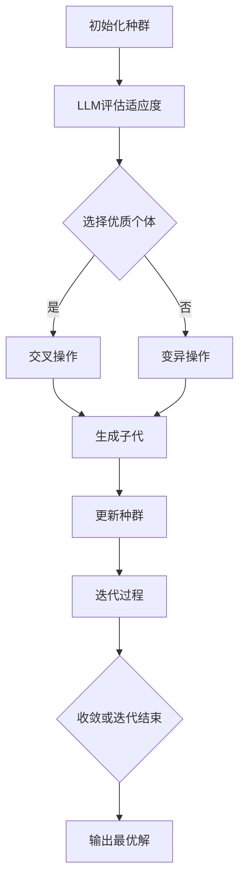
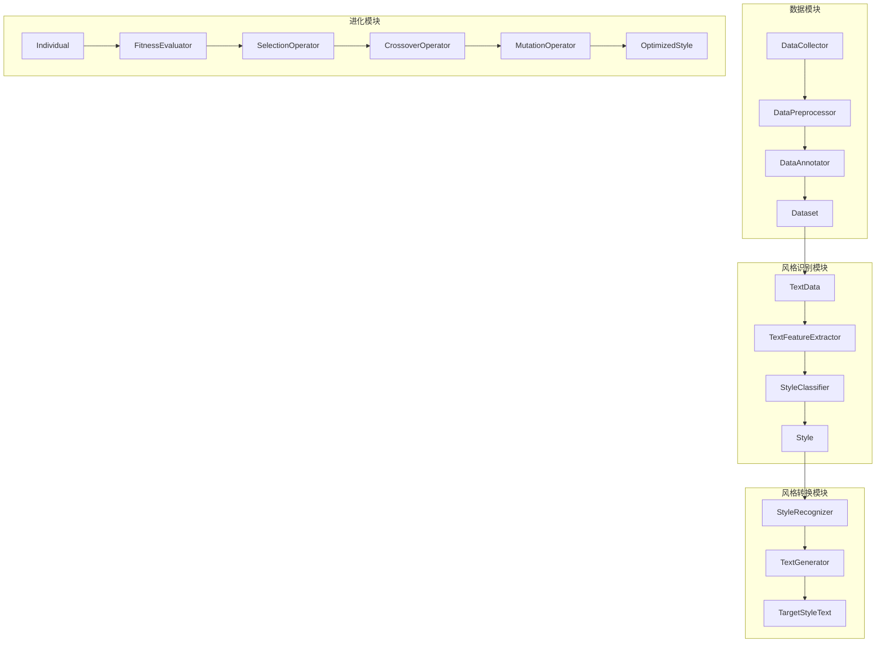
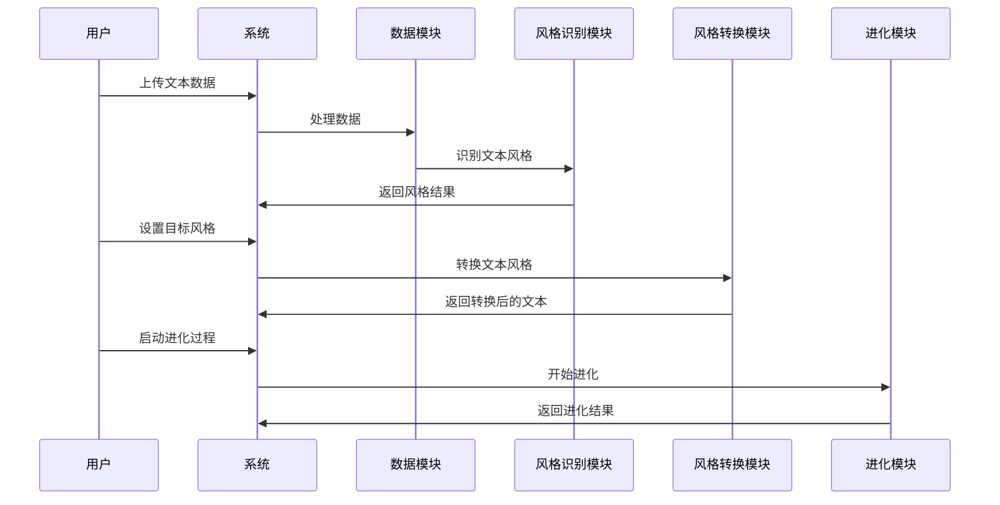
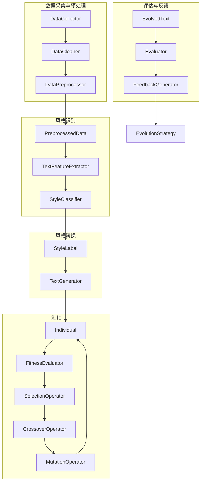
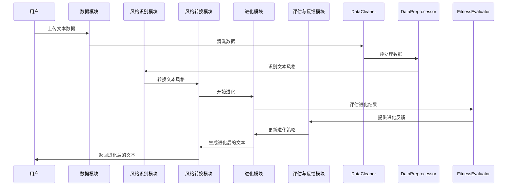
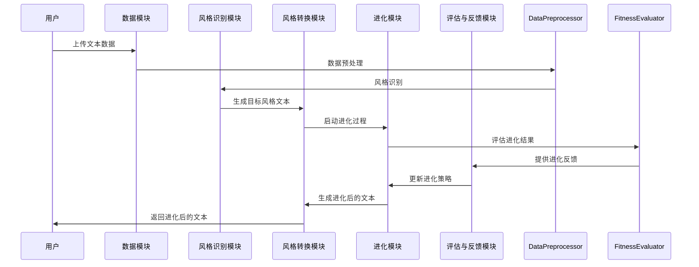

                 

### 引言与背景

#### 1.1.1 问题背景

自然语言处理（NLP）作为人工智能（AI）领域的重要组成部分，近年来取得了显著的进展。随着深度学习技术的蓬勃发展，特别是基于注意力机制和Transformer模型的大型语言模型（LLM）的广泛应用，NLP在自然语言理解、生成和交互等方面取得了突破性成果。然而，尽管在文本理解与生成方面取得了巨大成功，传统的NLP模型在处理多样化、个性化的文本风格上仍存在一定的局限。

在现实应用中，文本风格适应与进化成为了一个迫切需要解决的问题。尤其是在AI Agent（智能代理）的应用场景中，比如虚拟客服、智能写作、法律文书自动生成等，对于文本风格的高效适应与进化有着极高的需求。AI Agent需要在不同的语境、目标受众和场景中，灵活调整文本风格，以实现更自然的语言表达和更高效的沟通效果。

文本风格适应与进化是指AI系统根据特定任务需求，对输入文本的风格进行识别、调整和优化的过程。这一过程不仅包括对现有文本风格的感知和理解，还包括对目标文本风格的生成和改进。因此，文本风格适应与进化涉及到多个层面的技术，包括文本分析、风格识别、风格转换、进化算法等。

在AI Agent中实现文本风格适应与进化的关键挑战主要包括以下几个方面：

1. **风格识别的准确性**：准确识别输入文本的风格是进行有效适应与进化的前提。不同的文本风格具有不同的语言特征和表达方式，如何精确地识别和分类风格成为了一项重要的研究课题。
2. **风格转换的灵活性**：一旦识别出文本风格，AI Agent需要能够灵活地将输入文本转换为目标风格。这要求转换算法不仅具有高准确性，还要具备快速响应和实时调整的能力。
3. **进化算法的有效性**：文本风格进化是一个动态优化的过程，需要利用进化算法对文本风格进行迭代优化，以达到更高的适应性和自然性。如何设计高效的进化算法，使其在复杂环境中表现出色，是另一个关键挑战。
4. **计算资源的合理利用**：大规模的LLM模型训练和风格进化过程需要大量的计算资源。如何在保证性能的前提下，合理利用计算资源，是实际应用中需要考虑的一个重要问题。

文本风格适应与进化在AI Agent中的应用需求主要体现在以下几个方面：

1. **个性化交互**：在智能客服、教育辅导等应用中，AI Agent需要根据用户的特点和偏好，调整对话风格，提供更加个性化和自然的交互体验。
2. **内容生成**：在新闻写作、广告创意、法律文书生成等领域，AI Agent需要能够根据不同的需求和场景，生成符合特定文本风格的文档，提高内容的专业性和吸引力。
3. **跨领域迁移**：在不同的业务领域和场景中，AI Agent需要能够灵活适应不同的文本风格，实现跨领域的知识迁移和应用。

综上所述，文本风格适应与进化在AI Agent中具有重要的应用价值和广泛的研究意义。如何利用大型语言模型（LLM）实现高效、准确的文本风格适应与进化，是当前研究的一个重要方向。本文将从理论到实践，全面探讨LLM在AI Agent中的文本风格适应与进化的方法与应用。

#### 1.1.2 问题描述

在AI Agent中实现文本风格适应与进化面临着一系列技术挑战。首先，准确识别输入文本的风格是一个关键问题。不同的文本风格具有独特的语言特征和表达方式，如正式与口语、简洁与详细、幽默与严肃等。现有的文本风格识别方法主要依赖于规则匹配、特征提取和机器学习等手段，但往往存在识别精度不高、泛化能力不足等问题。

其次，如何实现灵活的文本风格转换是另一个重要挑战。一旦识别出文本风格，AI Agent需要能够将其转换为所需的风格。这一过程不仅要求算法具有高准确性，还需要具备快速响应和实时调整的能力。目前，常见的文本风格转换方法包括基于规则的方法、模板匹配和神经网络生成等，但每种方法都有其局限性，如规则方法灵活性较差，神经网络方法计算复杂度高。

此外，文本风格进化是一个动态优化的过程，需要利用进化算法对文本风格进行迭代优化，以达到更高的适应性和自然性。进化算法通过模拟自然进化过程，对个体的适应度进行评估和选择，从而实现优化目标。然而，设计一个高效、稳健的进化算法并非易事，需要在多个方面进行综合考虑，包括适应度函数的设计、种群规模和进化策略的选择等。

最后，计算资源的合理利用也是实现文本风格适应与进化的一个重要问题。大规模的LLM模型训练和风格进化过程需要大量的计算资源，如何在保证性能的前提下，合理利用计算资源，是实际应用中需要考虑的一个重要问题。常见的解决方案包括分布式计算、模型压缩和迁移学习等，但每种方法都有其适用范围和优缺点，需要根据具体应用场景进行选择。

总的来说，文本风格适应与进化在AI Agent中面临着诸多挑战，需要从多个角度进行研究和探索。通过引入大型语言模型（LLM）和进化算法，有望实现更高效、准确的文本风格适应与进化，为AI Agent在多种应用场景中的性能提升提供有力支持。

#### 1.1.3 问题解决

利用大型语言模型（LLM）解决文本风格适应与进化问题具有显著的优势。首先，LLM基于深度学习和注意力机制，具有强大的文本理解和生成能力。这使得LLM能够准确识别和分类文本风格，并在风格转换过程中生成高质量的自然语言文本。其次，LLM的训练过程可以通过大规模数据集进行，从而提高模型的泛化能力和适应性。这使得LLM能够在不同应用场景中灵活调整文本风格，满足多样化需求。

在AI Agent中，LLM可以扮演多种关键角色。首先，LLM可以作为文本风格识别的核心组件，通过对输入文本进行特征提取和风格分类，为风格适应和进化提供基础数据。其次，LLM可以用于风格转换，将输入文本转换为所需的风格。这通过训练一个基于LLM的文本生成模型实现，模型可以学习不同风格的文本特征，并在生成过程中灵活调整。最后，LLM还可以用于文本风格进化，通过进化算法对文本风格进行迭代优化，提高文本的自然性和适应性。

具体来说，LLM在AI Agent中的关键作用包括：

1. **风格识别**：LLM通过学习大规模语料库中的文本特征，可以准确识别输入文本的风格。例如，可以使用预训练的LLM模型对输入文本进行特征提取，并通过分类算法进行风格分类。

2. **风格转换**：基于LLM的文本生成模型可以用于风格转换。通过训练一个多风格文本生成模型，LLM可以学习不同风格的文本特征，并在生成过程中灵活调整，实现高质量的文本风格转换。

3. **风格进化**：利用进化算法，可以将LLM与风格进化相结合，实现对文本风格的迭代优化。通过不断调整和优化LLM的参数和风格特征，可以提高文本的自然性和适应性，实现文本风格进化。

总之，通过引入大型语言模型（LLM），可以有效地解决AI Agent中的文本风格适应与进化问题。LLM不仅能够提高文本风格识别和转换的准确性，还能通过进化算法实现文本风格的动态优化，为AI Agent提供更加灵活、高效的文本处理能力。

#### 1.1.4 边界与外延

在研究文本风格适应与进化的过程中，明确研究的边界与外延至关重要。首先，文本风格适应与进化的研究范围主要聚焦在自然语言处理（NLP）领域，具体涉及文本风格的识别、转换和进化等方面。研究的主要对象是多样化的文本数据，包括不同领域、不同文体和不同语言风格的文本。

其次，文本风格适应与进化的研究限制条件主要包括数据规模、算法复杂度和计算资源。大规模的数据集是训练和优化LLM模型的基础，但数据收集和处理需要耗费大量的时间和资源。此外，文本风格适应与进化的算法复杂度较高，需要高效计算和优化策略来保证算法的性能和实用性。

在应用领域方面，文本风格适应与进化具有广泛的应用前景。首先，在智能客服和虚拟助手等场景中，文本风格适应与进化可以帮助系统与用户进行更自然、流畅的交互，提高用户体验。其次，在内容生成领域，如新闻写作、广告文案和法律文书生成等，文本风格适应与进化可以生成更具个性化和专业化的文本内容，提高内容的质量和吸引力。此外，文本风格适应与进化在跨领域迁移和知识应用中也具有重要的潜力，可以促进不同领域之间的知识融合和共享。

总之，文本风格适应与进化的研究不仅具有理论意义，还具有广泛的应用价值。通过明确研究的边界与外延，可以更好地指导研究工作，推动相关技术的发展和应用。

#### 1.1.5 概念结构与核心要素组成

在深入探讨文本风格适应与进化的过程中，首先需要明确几个核心概念及其相互关系，这有助于构建一个清晰的理论框架。以下是对文本风格、风格适应和风格进化等核心概念的详细定义及其在研究中的关键作用。

**文本风格（Text Style）**

文本风格是指文本在表达上的特定方式，包括语言特征、表达形式、情感色彩和文体结构等方面。常见的文本风格分类包括正式与口语、简洁与详细、幽默与严肃等。每种风格都有其独特的语言特征和表达习惯。例如，学术论文通常采用正式、严谨的语言风格，而社交媒体聊天则更多使用口语化、简洁的语言。

**风格适应（Style Adaptation）**

风格适应是指AI系统根据特定任务需求，对输入文本的风格进行识别、调整和优化的过程。风格适应的目标是实现文本风格与任务目标的高度匹配，以提高文本的表达效果和沟通质量。风格适应的关键在于准确识别输入文本的风格，并在此基础上进行有效的风格转换，以满足不同应用场景的需求。

**风格进化（Style Evolution）**

风格进化是指通过迭代优化和进化算法，对文本风格进行动态调整和优化的过程。风格进化旨在提高文本的自然性和适应性，使其在多样化、动态变化的应用场景中表现出更高的性能。风格进化不仅涉及到文本风格特征的提取和优化，还包括对进化算法的设计和实现，以实现文本风格的动态进化。

**概念属性特征对比表格**

为了更直观地展示文本风格、风格适应和风格进化的属性特征，我们可以通过一个对比表格来进行详细分析：

| 概念 | 属性特征 |
| --- | --- |
| 文本风格 | - 语言特征<br>- 表达形式<br>- 情感色彩<br>- 文体结构 |
| 风格适应 | - 风格识别<br>- 风格转换<br>- 任务匹配<br>- 高效响应 |
| 风格进化 | - 文本特征提取<br>- 进化算法<br>- 动态调整<br>- 自然性优化 |

**文本风格适应与进化的关键要素**

在文本风格适应与进化的研究中，以下几个关键要素起着至关重要的作用：

1. **数据集**：大规模、高质量的文本数据集是训练和优化LLM模型的基础。数据集的多样性和覆盖范围直接影响模型的学习能力和泛化能力。
2. **算法**：风格适应和进化算法的设计和实现是研究的核心。常见的算法包括规则匹配、机器学习、深度学习和进化算法等。每种算法都有其独特的优势和局限性，需要根据具体应用场景进行选择和优化。
3. **计算资源**：大规模的LLM模型训练和风格进化过程需要大量的计算资源。合理利用计算资源，如分布式计算和模型压缩，是保证算法性能和实际应用可行性的关键。
4. **评估指标**：有效的评估指标是衡量文本风格适应与进化效果的重要工具。常用的评估指标包括风格一致性、自然性和适应性等。通过综合评估不同算法和模型的效果，可以指导进一步的研究和优化。

通过上述核心概念及其相互关系的分析，我们可以构建一个较为完整的文本风格适应与进化的理论框架。这个框架不仅有助于理解文本风格适应与进化的基本原理，还为实际应用中的研究和开发提供了明确的指导。

#### 1.1.6 LLM基础理论

大型语言模型（LLM）是近年来自然语言处理（NLP）领域的重要突破之一。本节将详细介绍LLM的基本原理、训练与优化方法，以及LLM在各类应用场景中的优势与成功案例。

**2.1.1 LLM基本原理**

大型语言模型（LLM）基于深度学习和Transformer架构，具有强大的文本理解和生成能力。Transformer模型的核心是自注意力机制（Self-Attention），它通过计算序列中每个词与其他词之间的关系，从而实现对输入文本的全面理解。

LLM通常由多个Transformer层堆叠而成，每一层都包含自注意力机制和前馈神经网络。自注意力机制通过计算输入文本中每个词与所有其他词之间的权重，使得模型能够关注重要的信息，并忽略无关的部分。前馈神经网络则进一步加工这些权重，以生成高质量的输出文本。

**2.1.2 LLM训练与优化**

LLM的训练过程通常分为两个阶段：预训练和微调。

1. **预训练**：预训练阶段使用大规模的语料库对LLM进行训练，使其学习通用语言特征和规律。预训练过程中，模型通过预测下一个词来优化参数，从而提高对文本的理解能力。常用的预训练任务包括 masked language model（MLM）和 next sentence prediction（NSP）等。

2. **微调**：预训练后的LLM可以通过微调来适应特定任务。微调阶段，模型在特定领域或任务的数据集上进行训练，以调整参数，使其在特定任务上表现出更好的性能。微调过程中，可以使用监督学习、强化学习等方法来优化模型。

**2.1.3 LLM特点与应用场景**

LLM具有以下特点：

1. **强大的语言理解能力**：LLM通过学习大规模语料库中的语言规律，能够准确理解和生成自然语言文本，具有出色的语言理解和生成能力。

2. **高度泛化能力**：预训练阶段的大量数据使LLM具有良好的泛化能力，能够在多种不同的任务和场景中表现优异。

3. **灵活性**：LLM可以通过微调来适应特定的任务需求，具有较强的灵活性和适应性。

LLM在各类应用场景中展现出显著的优势：

1. **文本生成**：LLM在自动写作、摘要生成、对话系统等应用中表现出色。例如，OpenAI的GPT-3模型在生成高质量文章、对话和代码方面具有很高的效率和质量。

2. **问答系统**：LLM能够通过训练生成问答系统，实现对用户查询的精准回答。例如，BERT模型在多种问答任务中取得了优异的成绩，被广泛应用于搜索引擎、客服系统等领域。

3. **机器翻译**：LLM在机器翻译领域也表现出色。通过预训练和微调，LLM能够生成准确、流畅的翻译文本，广泛应用于跨语言交流、文档翻译等领域。

**2.1.4 LLM成功案例**

1. **OpenAI的GPT-3**：GPT-3是OpenAI发布的一款具有1750亿参数的LLM，能够在多种任务中生成高质量的自然语言文本。GPT-3在生成文章、对话和代码等方面表现出色，成为NLP领域的重要突破。

2. **BERT**：BERT是由Google开发的一款预训练模型，通过在大量语料库上进行训练，具有强大的语言理解和生成能力。BERT在问答系统、文本分类、机器翻译等任务中取得了优异的成绩，被广泛应用于各种实际应用场景。

3. **T5**：T5是由DeepMind开发的一款基于Transformer的LLM，其目标是将任何自然语言任务转化为一个简单的“输入到输出”的文本生成任务。T5在多种任务中表现出色，如文本分类、命名实体识别、机器翻译等。

通过上述分析，可以看出LLM在自然语言处理领域具有巨大的潜力和应用价值。未来，随着LLM技术的不断发展和优化，将在更多领域中发挥重要作用。

#### 2.1.2 LLM训练与优化

大型语言模型（LLM）的训练与优化是其能够实现高性能自然语言理解与生成的基础。本节将详细探讨LLM的训练过程、数据集选择、优化方法及其对模型性能的影响。

**2.1.2.1 训练过程**

LLM的训练过程通常分为两个主要阶段：预训练和微调。

1. **预训练**：预训练阶段的主要目标是让LLM学习通用语言特征和规律。在这一阶段，模型通常在大型语料库上进行训练，例如维基百科、新闻文章、社交媒体帖子等。预训练任务包括：

   - **Masked Language Model (MLM)**：在预训练阶段，模型需要预测被遮蔽的单词。这种方法迫使模型理解单词之间的相互依赖关系，从而提高其语言理解能力。
   - **Next Sentence Prediction (NSP)**：NSP任务要求模型预测两个句子是否在原始语料库中相邻。这有助于模型学习句子之间的关系，提高文本连贯性和理解能力。
   - **Sequence Classification**：在一些预训练任务中，模型还需要对序列进行分类，例如情感分析、命名实体识别等。这些任务有助于模型学习标签和类别信息。

2. **微调**：预训练后的LLM通过微调来适应特定任务。微调阶段通常在特定领域或任务的数据集上进行。微调方法包括：

   - **Fine-tuning**：在微调阶段，模型在特定任务的数据集上进行监督训练，以调整参数，提高任务性能。
   - **Transfer Learning**：迁移学习是一种在预训练模型的基础上进行微调的方法。通过在多个任务上预训练，模型可以共享通用特征，并在新任务上表现出更好的性能。
   - **Few-shot Learning**：在少量样本上训练模型，以减少对大规模数据集的依赖。这有助于模型在资源有限的环境中表现出更强的适应性。

**2.1.2.2 数据集选择**

数据集的选择对LLM的训练和性能至关重要。以下是一些关键考虑因素：

1. **规模**：大规模数据集有助于模型学习更丰富的语言特征和规律。然而，数据集过大可能导致过拟合，因此需要平衡数据集的规模和多样性。
2. **多样性**：数据集应包含不同领域、文体和语言的文本，以提高模型的泛化能力和适应性。
3. **质量**：高质量的数据集有助于模型学习更准确的语言特征。因此，数据清洗和预处理是关键步骤，以确保数据的一致性和准确性。
4. **标注**：标注数据的质量和数量对模型性能有显著影响。在监督学习任务中，高质量标注的数据有助于模型更好地学习任务目标。

**2.1.2.3 优化方法**

LLM的优化方法主要包括模型架构优化、训练策略优化和超参数调整等方面。

1. **模型架构优化**：通过改进Transformer架构，可以提升模型性能。例如，增加Transformer层的深度和宽度、引入多任务学习机制等。此外，模型压缩和量化技术也有助于提高模型的效率和实用性。

2. **训练策略优化**：优化训练策略可以提高训练效率和模型性能。常用的训练策略包括：

   - **动态学习率**：通过动态调整学习率，可以在训练过程中更好地平衡模型更新，避免过拟合和欠拟合。
   - **批量大小**：调整批量大小可以影响模型训练的稳定性和收敛速度。通常，较大的批量大小可以提高计算效率，但可能增加过拟合风险。
   - **梯度裁剪**：为了避免梯度爆炸和梯度消失问题，可以使用梯度裁剪技术限制梯度值范围。

3. **超参数调整**：超参数调整是优化模型性能的关键步骤。常见的超参数包括学习率、批量大小、层数、隐藏层单元数等。通过实验和超参数优化技术（如随机搜索、贝叶斯优化等），可以找到最优的超参数组合。

**2.1.2.4 优化方法对模型性能的影响**

优化方法对模型性能有显著影响。以下是一些具体影响：

1. **模型准确性**：优化方法可以显著提高模型在各类NLP任务上的准确性。例如，动态学习率策略可以提高模型的收敛速度，减少训练误差。
2. **泛化能力**：通过大规模数据和多样化数据集，模型可以更好地学习通用语言特征，提高泛化能力。模型架构优化和训练策略优化也有助于提高模型的泛化性能。
3. **效率和实用性**：模型压缩和量化技术可以提高模型在移动设备和边缘设备上的应用可行性。优化后的模型不仅性能优异，还具备更高的效率和实用性。

总之，LLM的训练与优化是一个复杂且重要的过程。通过合理的数据集选择、优化方法和超参数调整，可以显著提高LLM的性能和实用性，为各类NLP任务提供强大的支持。

#### 2.1.3 LLM特点与应用场景

大型语言模型（LLM）凭借其强大的文本理解和生成能力，在众多应用场景中取得了显著的成效。以下将详细分析LLM的优势和适用场景，并通过具体案例展示其在不同领域的成功应用。

**2.1.3.1 LLM的优势**

1. **强大的语言理解能力**：LLM通过预训练和微调，能够在大量语料库中学习到丰富的语言特征和规律。这使得LLM在文本理解和生成任务中表现出色，能够准确理解复杂的语义和语境。

2. **高度泛化能力**：由于LLM在预训练阶段学习了大量多样化的数据，其具有较强的泛化能力。这使得LLM不仅能在特定任务上表现出色，还能在不同任务和场景中灵活应用。

3. **灵活性**：LLM可以通过微调快速适应不同的任务需求。这使得LLM在个性化服务和自适应系统中具有很高的灵活性，能够根据用户行为和需求进行动态调整。

4. **高效的文本生成能力**：LLM在文本生成任务中表现出色，能够生成高质量的自然语言文本。这使得LLM在自动写作、摘要生成、对话系统等领域具有广泛的应用潜力。

**2.1.3.2 LLM的适用场景**

1. **文本生成**：LLM在自动写作、摘要生成、对话系统等应用中具有广泛的应用前景。例如，OpenAI的GPT-3模型在生成高质量文章、对话和代码方面表现出色。GPT-3能够根据用户输入生成详细的报告、故事和创意文本，大大提高了内容创作的效率和质量。

2. **问答系统**：LLM在问答系统中的应用取得了显著成果。例如，BERT模型在多种问答任务中取得了优异的成绩，被广泛应用于搜索引擎、客服系统等领域。BERT能够根据用户查询生成精准、自然的回答，提高了用户满意度和服务质量。

3. **机器翻译**：LLM在机器翻译领域也表现出色。通过预训练和微调，LLM能够生成准确、流畅的翻译文本。例如，Google翻译使用基于Transformer的模型，实现了高质量的跨语言翻译，广泛应用于全球用户之间的跨语言交流。

4. **自然语言理解**：LLM在自然语言理解任务中也具有广泛的应用。例如，在情感分析、命名实体识别、关系抽取等任务中，LLM通过学习大量的语言特征，能够准确识别和提取文本中的关键信息，为智能 assistants和智能搜索系统提供了强大的支持。

**2.1.3.3 成功案例**

1. **OpenAI的GPT-3**：GPT-3是OpenAI发布的一款具有1750亿参数的LLM，能够在多种任务中生成高质量的自然语言文本。GPT-3在生成文章、对话和代码等方面表现出色，成为NLP领域的重要突破。

2. **BERT**：BERT是由Google开发的一款预训练模型，通过在大量语料库上进行训练，具有强大的语言理解和生成能力。BERT在问答系统、文本分类、机器翻译等任务中取得了优异的成绩，被广泛应用于各种实际应用场景。

3. **T5**：T5是由DeepMind开发的一款基于Transformer的LLM，其目标是将任何自然语言任务转化为一个简单的“输入到输出”的文本生成任务。T5在多种任务中表现出色，如文本分类、命名实体识别、机器翻译等。

通过以上分析，可以看出LLM在自然语言处理领域具有巨大的潜力和应用价值。未来，随着LLM技术的不断发展和优化，将在更多领域中发挥重要作用，为智能系统的性能提升和用户体验改善提供有力支持。

### 3.1.1 文本风格定义

文本风格是指文本在表达上的特定方式，它涵盖了语言特征、表达形式、情感色彩和文体结构等多个方面。风格适应是指AI系统根据特定任务需求，对输入文本的风格进行识别、调整和优化的过程。风格适应的目的是实现文本风格与任务目标的高度匹配，以提高文本的表达效果和沟通质量。

文本风格适应的重要性主要体现在以下几个方面：

1. **个性化交互**：在智能客服、虚拟助手等应用中，文本风格适应能够根据用户的喜好和需求，调整对话风格，提供更加个性化和自然的交互体验。这有助于提高用户满意度和忠诚度。

2. **内容生成**：在新闻写作、广告文案、法律文书生成等场景中，文本风格适应可以生成符合特定文本风格的内容，提高内容的专业性和吸引力。这有助于提升内容质量和传播效果。

3. **跨领域迁移**：文本风格适应在跨领域迁移和知识应用中也具有重要作用。通过适应不同领域的文本风格，AI系统能够在不同场景中灵活应用，实现知识共享和协同工作。

文本风格适应的定义和目的是通过AI技术，使AI系统能够在多样化、动态变化的应用场景中，灵活调整文本风格，实现高效、自然的语言表达和交互。

### 3.1.2 风格适应方法

文本风格适应方法主要包括基于规则的方法、机器学习方法和深度学习方法等。每种方法都有其独特的优势和局限性，适用于不同的应用场景。以下将详细介绍这些方法及其优缺点。

**3.1.2.1 基于规则的方法**

基于规则的方法是指通过编写一系列的规则来识别和转换文本风格。这些规则通常基于语言学的理论和实践经验，可以手动编写或自动生成。这种方法的主要优点是简单、直观，能够快速实现文本风格的转换。然而，基于规则的方法也存在一些显著的局限性：

1. **灵活性差**：基于规则的系统通常难以适应复杂的文本风格变化，特别是在面对新型或非标准的语言表达时，规则可能难以覆盖。
2. **可维护性低**：随着应用场景的扩展和文本风格的多样化，规则的编写和调整会变得非常复杂，维护成本高。
3. **扩展性差**：基于规则的方法难以扩展到大规模数据集或新领域，适用于简单的文本风格转换任务。

尽管存在局限性，基于规则的方法在一些特定的应用场景中仍然具有价值。例如，在文本摘要和简短文本的生成中，基于规则的系统可以快速实现文本风格的转换，满足基本的用户需求。

**3.1.2.2 机器学习方法**

机器学习方法通过训练模型来识别和转换文本风格。常见的机器学习方法包括监督学习、无监督学习和半监督学习等。机器学习方法的主要优点是能够从大规模数据中自动学习文本风格的规律，具有较强的灵活性和泛化能力。以下是一些常见的机器学习方法：

1. **监督学习方法**：监督学习方法通过标记的数据集训练模型，使模型能够学习输入文本和目标风格之间的关系。常见的模型包括支持向量机（SVM）、朴素贝叶斯（NB）、决策树（DT）和随机森林（RF）等。监督学习方法的主要优势在于其较高的准确性和可靠性，但需要大量的标记数据，成本较高。

2. **无监督学习方法**：无监督学习方法通过未标记的数据集训练模型，自动发现输入文本中的风格特征。常见的无监督学习方法包括聚类算法（如K-means）、主成分分析（PCA）和自编码器（Autoencoder）等。无监督学习方法不需要标记数据，但可能存在较高的误差和不稳定性，适用于探索性数据分析。

3. **半监督学习方法**：半监督学习方法结合了监督学习和无监督学习方法的优势，通过少量的标记数据和大量的未标记数据共同训练模型。常见的半监督学习方法包括标签传播（Label Propagation）和图模型（Graph Models）等。半监督学习方法能够在减少标记数据量的同时，提高模型的泛化能力和鲁棒性。

机器学习方法在文本风格适应中具有广泛的应用，尤其是在需要处理大规模文本数据和复杂风格变化的应用场景中，如智能客服、个性化推荐和内容生成等。

**3.1.2.3 深度学习方法**

深度学习方法通过多层神经网络来学习文本的深度特征，具有强大的文本理解和生成能力。深度学习方法在文本风格适应中的应用主要包括以下几种：

1. **循环神经网络（RNN）**：RNN是一种基于序列数据的神经网络，能够通过记忆机制处理长距离依赖问题。常见的RNN模型包括LSTM（Long Short-Term Memory）和GRU（Gated Recurrent Unit）。RNN在文本风格适应中能够有效捕捉文本的上下文信息，但存在梯度消失和梯度爆炸问题。

2. **卷积神经网络（CNN）**：CNN是一种基于卷积操作的神经网络，主要用于图像处理，但在文本处理中也可以通过词嵌入和卷积操作捕捉局部特征。通过结合RNN和CNN的优势，可以构建更强大的文本风格适应模型。

3. **Transformer模型**：Transformer模型基于注意力机制，通过多头自注意力机制和位置编码，能够全局捕捉文本中的依赖关系。Transformer模型在自然语言处理任务中取得了显著成绩，如BERT、GPT等模型。基于Transformer的文本风格适应模型具有强大的语义理解和生成能力，能够实现高效、准确的文本风格转换。

深度学习方法在文本风格适应中表现出色，但需要大量的数据和计算资源，训练时间较长。随着硬件和算法的不断发展，深度学习方法在文本风格适应中的应用前景十分广阔。

**3.1.2.4 比较与总结**

综上所述，基于规则的方法、机器学习方法和深度学习方法各有优缺点，适用于不同的应用场景：

- **基于规则的方法**：适用于简单的文本风格转换任务，开发成本低，但灵活性差，难以适应复杂变化。
- **机器学习方法**：适用于大规模文本数据，具有较强的灵活性和泛化能力，但需要大量标记数据，训练成本高。
- **深度学习方法**：具有强大的文本理解和生成能力，能够实现高效、准确的文本风格转换，但需要大量数据和计算资源。

在实际应用中，可以根据具体需求和资源情况，选择合适的方法或结合多种方法，以实现最优的文本风格适应效果。

### 3.1.3 风格适应模型

文本风格适应模型是AI系统中实现文本风格识别、调整和优化的核心组件。以下将介绍几种常见的文本风格适应模型，并分析它们在AI Agent中的应用效果。

**3.1.3.1 基于规则的风格适应模型**

基于规则的风格适应模型通过编写一系列的规则来识别和转换文本风格。这些规则通常基于语言学理论和实践经验，可以手动编写或自动生成。该模型的主要优点是简单、直观，能够快速实现文本风格的转换。例如，在对话系统中，基于规则的模型可以根据对话内容实时调整语言风格，实现正式与口语的转换。

然而，基于规则的风格适应模型也存在显著的局限性，如灵活性差、可维护性低和扩展性差。在面对复杂或非标准语言表达时，规则可能难以覆盖，导致风格转换效果不理想。因此，基于规则的风格适应模型适用于简单的应用场景，如文本摘要和简短文本生成。

**3.1.3.2 基于机器学习的风格适应模型**

基于机器学习的风格适应模型通过训练模型来识别和转换文本风格。常见的机器学习方法包括监督学习、无监督学习和半监督学习等。

1. **监督学习模型**：监督学习模型通过标记的数据集训练模型，使模型能够学习输入文本和目标风格之间的关系。常见的监督学习模型包括支持向量机（SVM）、朴素贝叶斯（NB）、决策树（DT）和随机森林（RF）等。监督学习模型具有较高的准确性和可靠性，但需要大量标记数据，成本较高。例如，在智能客服中，监督学习模型可以根据历史对话数据，学习不同场景下的文本风格，实现风格自适应。

2. **无监督学习模型**：无监督学习模型通过未标记的数据集训练模型，自动发现输入文本中的风格特征。常见的无监督学习模型包括聚类算法（如K-means）、主成分分析（PCA）和自编码器（Autoencoder）等。无监督学习模型不需要标记数据，但可能存在较高的误差和不稳定性，适用于探索性数据分析。例如，在个性化推荐系统中，无监督学习模型可以自动发现用户的偏好风格，实现文本风格的个性化推荐。

3. **半监督学习模型**：半监督学习模型结合了监督学习和无监督学习方法的优势，通过少量的标记数据和大量的未标记数据共同训练模型。常见的半监督学习模型包括标签传播（Label Propagation）和图模型（Graph Models）等。半监督学习模型在减少标记数据量的同时，提高模型的泛化能力和鲁棒性。例如，在社交媒体平台上，半监督学习模型可以自动标记用户的文本风格，实现风格自适应的个性化内容推荐。

基于机器学习的风格适应模型具有较强的灵活性和泛化能力，适用于大规模文本数据和复杂风格变化的应用场景，如智能客服、个性化推荐和内容生成等。

**3.1.3.3 基于深度学习的风格适应模型**

基于深度学习的风格适应模型通过多层神经网络来学习文本的深度特征，具有强大的文本理解和生成能力。常见的深度学习模型包括循环神经网络（RNN）、卷积神经网络（CNN）和Transformer模型等。

1. **RNN模型**：RNN模型通过记忆机制处理长距离依赖问题，能够有效捕捉文本的上下文信息。常见的RNN模型包括LSTM（Long Short-Term Memory）和GRU（Gated Recurrent Unit）。RNN模型在文本风格适应中能够有效捕捉文本的上下文信息，但存在梯度消失和梯度爆炸问题。

2. **CNN模型**：CNN模型通过卷积操作捕捉局部特征，能够有效处理文本数据。在文本风格适应中，CNN模型可以结合词嵌入和卷积操作，捕捉文本中的局部风格特征。通过结合RNN和CNN的优势，可以构建更强大的文本风格适应模型。

3. **Transformer模型**：Transformer模型基于注意力机制，通过多头自注意力机制和位置编码，能够全局捕捉文本中的依赖关系。Transformer模型在自然语言处理任务中取得了显著成绩，如BERT、GPT等模型。基于Transformer的文本风格适应模型具有强大的语义理解和生成能力，能够实现高效、准确的文本风格转换。

基于深度学习的风格适应模型在文本风格适应中表现出色，能够实现高效、准确的文本风格转换，但需要大量的数据和计算资源。随着硬件和算法的不断发展，深度学习风格适应模型在文本风格适应中的应用前景十分广阔。

**3.1.3.4 应用效果分析**

通过对上述几种风格适应模型的分析，可以发现：

1. **基于规则的风格适应模型**：适用于简单的文本风格转换任务，但难以适应复杂变化。

2. **基于机器学习的风格适应模型**：具有较强的灵活性和泛化能力，适用于大规模文本数据和复杂风格变化的应用场景，如智能客服、个性化推荐和内容生成等。

3. **基于深度学习的风格适应模型**：具有强大的文本理解和生成能力，能够实现高效、准确的文本风格转换，但需要大量的数据和计算资源。

在实际应用中，可以根据具体需求和资源情况，选择合适的风格适应模型或结合多种模型，以实现最优的文本风格适应效果。

### 3.1.4 进化算法概述

进化算法（Evolutionary Algorithm，EA）是一种模拟自然进化的计算方法，广泛应用于优化问题和复杂系统的自适应行为。其基本概念和工作原理如下：

**3.1.4.1 基本概念**

进化算法的核心概念包括种群（Population）、个体（Individual）、适应度（Fitness）、选择（Selection）、交叉（Crossover）和变异（Mutation）等。

1. **种群**：种群是进化算法中的基本单位，代表一组候选解决方案。每个个体在种群中都有其特定的基因编码，用于表示问题的解。
2. **个体**：个体是种群中的成员，其基因编码决定了其在问题空间中的位置。个体的优劣通过适应度来评估。
3. **适应度**：适应度是评估个体优劣的指标，通常与问题目标函数成反比。适应度越高，表示个体越优秀。
4. **选择**：选择是基于个体适应度进行的选择操作，优个体有更高的概率被选中进行繁殖。
5. **交叉**：交叉是指通过基因交换，将两个个体的基因组合生成新的个体。交叉操作有助于种群多样性的保持和优良基因的传播。
6. **变异**：变异是指对个体基因进行随机改变，以防止种群陷入局部最优。变异操作有助于增加种群多样性，促进进化。

**3.1.4.2 工作原理**

进化算法的工作原理可以分为以下几个步骤：

1. **初始化种群**：首先，随机生成一组初始种群，每个个体代表一个潜在解。
2. **适应度评估**：对每个个体进行适应度评估，计算其适应度值。
3. **选择**：根据个体的适应度值，选择优质个体进行繁殖。常见的选择方法包括轮盘赌选择、锦标赛选择和排名选择等。
4. **交叉**：选择好的个体进行交叉操作，生成新的子代个体。交叉操作有助于遗传优良基因，增加种群多样性。
5. **变异**：对交叉产生的子代个体进行变异操作，以防止种群陷入局部最优。
6. **更新种群**：将变异后的子代个体替换原有种群，生成新的种群。
7. **迭代**：重复上述过程，直到达到预定的迭代次数或适应度目标。

通过不断的迭代和选择，进化算法逐步优化种群，直至找到最优或近似最优解。

**3.1.4.3 进化算法在文本风格进化中的应用**

进化算法在文本风格进化中的应用主要体现在以下几个方面：

1. **风格特征提取**：通过进化算法，可以从大量文本数据中提取出风格特征。这些特征可用于训练风格适应模型，提高模型的泛化能力和适应性。
2. **风格优化**：进化算法可以用于优化文本风格，使其更符合特定应用场景的需求。例如，在智能写作中，通过进化算法，可以生成符合目标风格的高质量文章。
3. **风格演化**：进化算法可以模拟文本风格的演化过程，研究风格特征的变化规律。这有助于理解文本风格的演变机制，为风格适应和进化提供理论基础。

总之，进化算法作为一种强大的优化工具，在文本风格进化中具有广泛的应用潜力。通过引入进化算法，可以实现对文本风格的动态调整和优化，提高AI Agent在多样化、动态变化场景中的适应能力。

### 3.1.5 进化算法与LLM的结合

进化算法（EA）与大型语言模型（LLM）的结合，可以充分发挥两种算法的优势，实现文本风格的动态调整和优化。以下将详细介绍将进化算法与LLM结合的思路和方法，并分析该结合方式的优势和应用前景。

**3.1.5.1 结合思路**

1. **LLM作为进化算法的评估器**：在进化算法中，适应度函数是评估个体优劣的关键。将LLM集成到进化算法中，可以利用其强大的文本理解能力，为个体生成适应度评估。具体步骤如下：

   - **初始化种群**：首先，随机生成一组初始种群，每个个体代表一个文本风格的潜在解。
   - **LLM评估适应度**：利用LLM对每个个体进行适应度评估。LLM可以根据文本内容生成适应度评分，反映个体在风格适应方面的优劣。
   - **选择与交叉**：根据适应度评分，选择优质个体进行交叉操作，生成新的子代个体。
   - **变异**：对交叉产生的子代个体进行变异操作，增加种群多样性。

2. **LLM作为进化算法的指导器**：除了作为评估器，LLM还可以提供具体的指导信息，引导进化过程。例如，LLM可以预测目标风格的文本特征，帮助进化算法更准确地调整个体。具体步骤如下：

   - **初始化种群**：随机生成初始种群。
   - **LLM指导变异**：利用LLM预测目标风格的文本特征，为变异操作提供指导。
   - **变异与评估**：根据LLM的指导进行变异，并评估变异后的个体适应度。
   - **选择与交叉**：根据适应度评估结果，选择优质个体进行交叉操作。

**3.1.5.2 结合方式的优势**

1. **提高适应度评估准确性**：LLM的强大文本理解能力，可以更准确地评估个体适应度，提高进化算法的收敛速度和效果。

2. **增强多样性**：进化算法中的变异操作通常基于随机性，容易导致种群多样性不足。利用LLM预测目标风格的文本特征，可以更有效地引导变异过程，增强种群多样性。

3. **自适应调整**：LLM可以根据进化过程中的实时反馈，动态调整目标风格，使进化算法能够更好地适应不同应用场景的需求。

4. **资源高效利用**：进化算法通常需要大量的计算资源，而LLM可以通过并行计算和分布式训练来提高计算效率，降低资源消耗。

**3.1.5.3 应用前景**

1. **文本生成与风格适应**：在文本生成和风格适应任务中，结合进化算法与LLM，可以实现高度个性化、自然流畅的文本生成和风格转换，如个性化客服、智能写作、广告文案生成等。

2. **多模态文本处理**：结合进化算法与LLM，可以处理多模态文本数据，如结合图像和文本生成富有创意的内容，应用于虚拟现实、增强现实等领域。

3. **跨语言文本处理**：在跨语言文本处理任务中，结合进化算法与LLM，可以更好地适应不同语言风格，提高机器翻译的质量和准确性。

4. **智能推荐系统**：在智能推荐系统中，结合进化算法与LLM，可以更准确地识别用户偏好，实现个性化的内容推荐。

总之，将进化算法与LLM结合，为文本风格适应与进化提供了一种新的思路和方法。通过充分利用两种算法的优势，可以实现更高效、准确的文本风格适应与进化，为AI Agent在多样化、动态变化场景中的表现提供有力支持。

### 3.1.6 算法原理讲解

#### 3.1.6.1 进化算法与LLM结合的流程图

为了更好地理解进化算法与LLM结合的工作原理，我们可以使用Mermaid语言绘制一个流程图，详细描述整个流程。



该流程图展示了从初始化种群到输出最优解的完整过程。首先，随机初始化种群，然后使用LLM评估每个个体的适应度。根据适应度评估结果，选择优质个体进行交叉操作或变异操作，生成新的子代个体。通过迭代更新种群，直到达到预定的收敛条件或迭代次数。

#### 3.1.6.2 Python代码示例

下面我们将通过Python代码，展示进化算法与LLM结合的实现。首先，我们需要引入必要的库和设置环境。

```python
import numpy as np
import random
from tensorflow import keras

# 加载预训练的LLM模型
llm_model = keras.models.load_model('path_to_pretrained_llm.h5')

# 定义适应度评估函数
def fitness_evaluation(individual):
    # 使用LLM评估文本风格适应度
    # 假设individual是一个文本序列
    input_sequence = keras.preprocessing.sequence.pad_sequences([individual])
    prediction = llm_model.predict(input_sequence)
    # 适应度取决于预测结果，例如可以使用预测的概率值
    fitness = np.mean(prediction)
    return fitness

# 定义交叉操作
def crossover(parent1, parent2):
    # 随机选择交叉点
    crossover_point = random.randint(1, len(parent1) - 1)
    # 生成子代
    child = parent1[:crossover_point] + parent2[crossover_point:]
    return child

# 定义变异操作
def mutate(individual):
    # 随机选择变异位置
    mutation_point = random.randint(0, len(individual) - 1)
    # 在变异位置进行随机修改
    individual[mutation_point] = random.choice([word for word in text_tokens if word != individual[mutation_point]])
    return individual

# 定义进化算法
def evolutionary_algorithm(population_size, generations, mutation_rate):
    # 初始化种群
    population = [random.choice(text_tokens) for _ in range(population_size)]
    
    for generation in range(generations):
        # 评估适应度
        fitness_scores = [fitness_evaluation(individual) for individual in population]
        
        # 选择优质个体
        selected_individuals = [individual for individual, fitness in zip(population, fitness_scores) if fitness > np.mean(fitness_scores)]
        
        # 进行交叉和变异
        for i in range(0, len(selected_individuals), 2):
            if random.random() < mutation_rate:
                selected_individuals[i] = mutate(selected_individuals[i])
            if random.random() < mutation_rate:
                selected_individuals[i+1] = mutate(selected_individuals[i+1])
            
            # 交叉操作
            if i+1 < len(selected_individuals):
                selected_individuals[i], selected_individuals[i+1] = crossover(selected_individuals[i], selected_individuals[i+1])
        
        # 更新种群
        population = selected_individuals
        
        # 输出当前代最优适应度
        print(f"Generation {generation}: Best Fitness = {max(fitness_scores)}")
    
    # 输出最优解
    best_individual = selected_individuals[fitness_scores.index(max(fitness_scores))]
    print(f"Best Individual: {best_individual}")
    return best_individual
```

这段代码定义了进化算法的主要组成部分：种群初始化、适应度评估、选择、交叉、变异和种群更新。在实现过程中，我们使用了一个预训练的LLM模型来评估个体的适应度，并利用交叉和变异操作来生成新的子代个体。通过迭代过程，算法逐步优化种群，直至找到最优解。

#### 3.1.6.3 数学模型与公式

在文本风格进化过程中，适应度函数和进化策略是关键组成部分。以下将介绍文本风格进化的数学模型和公式。

**适应度函数**

适应度函数用于评估个体的优劣，通常取决于个体与目标风格的相似度。假设目标风格特征为$\vec{y}$，个体风格特征为$\vec{x}$，则适应度函数可以表示为：

$$
f(\vec{x}) = \frac{1}{1 + \exp(-\beta \cdot \vec{y}^T \cdot \vec{x})}
$$

其中，$\beta$是调节参数，用于控制适应度函数的灵敏度。

**进化策略**

进化算法的进化策略主要涉及选择、交叉和变异操作。以下为这些操作的数学模型：

1. **选择操作**

选择操作基于个体的适应度值，使用轮盘赌选择方法。假设种群中个体的适应度为$f(\vec{x}_i)$，则选择概率为：

$$
p_i = \frac{f(\vec{x}_i)}{\sum_{j=1}^{N} f(\vec{x}_j)}
$$

其中，$N$是种群大小。

2. **交叉操作**

交叉操作通过选择两个父代个体，生成新的子代个体。交叉概率为：

$$
p_c = \frac{1}{2}
$$

交叉点位置随机选择，例如，对于二进制编码，交叉点可以是随机选择的1到n之间的任意位置。

3. **变异操作**

变异操作通过随机改变个体的某些基因，引入新的多样性。变异概率为：

$$
p_m = \frac{1}{N}
$$

变异操作可以是随机选择个体基因并进行替换，例如，对于二进制编码，将某个位置的1随机变为0或0随机变为1。

通过上述数学模型和公式，进化算法可以有效地调整文本风格，实现文本风格的进化与优化。

#### 3.1.6.4 举例说明

为了更好地理解文本风格进化的实现过程，以下将通过一个具体案例展示如何使用进化算法与LLM进行文本风格进化。

**案例**：假设我们需要将一个给定的文本从正式风格转换为口语风格。

1. **初始化种群**：随机生成一组初始种群，每个个体代表一个可能的文本风格。

2. **适应度评估**：使用LLM评估每个个体的适应度，即评估其与目标口语风格的相似度。

3. **选择与交叉**：根据适应度值，选择优质个体进行交叉操作，生成新的子代个体。

4. **变异**：对交叉产生的子代个体进行变异操作，增加种群多样性。

5. **迭代**：重复适应度评估、选择、交叉和变异操作，直至达到预定的迭代次数或适应度目标。

通过几代进化后，种群中的最优个体将逐渐接近目标口语风格。最后，输出最优个体作为进化结果。

**优点**：

- **高效性**：进化算法与LLM的结合，可以高效地优化文本风格，实现快速的风格适应与进化。
- **灵活性**：进化算法的引入，使文本风格进化具有更高的灵活性和适应性，能够应对多样化、动态变化的应用场景。
- **多样性**：通过交叉和变异操作，进化算法能够生成具有多样性的文本风格，提高风格进化的效果。

**改进方向**：

- **优化适应度函数**：可以尝试改进适应度函数，使其更准确地反映文本风格与目标风格的相似度。
- **引入更多约束**：在进化过程中，可以引入更多的约束条件，如文本长度、词汇多样性等，以提高风格进化的质量。
- **分布式计算**：利用分布式计算技术，提高进化算法的计算效率，缩短风格进化时间。

通过上述案例和改进方向，我们可以更好地理解文本风格进化的实现过程和未来发展方向。

### 3.1.7 数学模型与公式

在文本风格进化的过程中，数学模型和公式是核心组成部分，用于描述进化算法和风格适应的内在机制。以下将详细介绍文本风格进化的数学模型和关键公式，并分析这些公式在实际应用中的重要性。

#### 3.1.7.1 适应度函数

适应度函数是进化算法中的核心组件，用于评估个体的优劣。在文本风格进化中，适应度函数通常与文本风格相似度相关。假设目标风格特征为$\vec{y}$，个体风格特征为$\vec{x}$，则适应度函数可以表示为：

$$
f(\vec{x}) = \frac{1}{1 + \exp(-\beta \cdot \vec{y}^T \cdot \vec{x})}
$$

其中，$\beta$是一个调节参数，用于控制适应度的灵敏度。这个公式反映了个体与目标风格之间的相似性，适应度越高，表示个体越接近目标风格。适应度函数的重要性在于，它为进化算法提供了评估个体优劣的依据，指导进化的方向。

#### 3.1.7.2 交叉与变异操作

交叉和变异是进化算法中的两个重要操作，用于生成新的子代个体，增加种群多样性。

1. **交叉操作**

交叉概率通常表示为$P_c$，假设两个父代个体$\vec{x}_1$和$\vec{x}_2$进行交叉，交叉点随机选择，则交叉操作可以表示为：

$$
\vec{x}_{new} = [x_1^1, x_2^2, ..., x_1^{c-1}, x_2^c, x_1^{c+1}, ..., x_2^n]
$$

其中，$c$是交叉点。交叉操作的重要性在于，它通过基因交换，将父代个体的优良特征传递给子代，促进种群进化。

2. **变异操作**

变异概率通常表示为$P_m$，对个体$\vec{x}$进行变异，可以表示为：

$$
\vec{x}_{new} = [x_1, x_2, ..., x_i', ..., x_n]
$$

其中，$i'$是一个随机选择的变异位置，$x_i'$是变异后的基因。变异操作的重要性在于，它通过引入随机性，增加种群多样性，防止种群陷入局部最优。

#### 3.1.7.3 种群更新策略

种群更新策略是进化算法中的重要组成部分，用于决定如何选择个体进行交叉和变异。以下是一个常见的更新策略：

$$
\vec{x}_{new} = \begin{cases}
\vec{x}_{selected} & \text{if } f(\vec{x}_{selected}) > f(\vec{x}_{current}) \\
\vec{x}_{current} & \text{otherwise}
\end{cases}
$$

其中，$\vec{x}_{selected}$是当前代中适应度较高的个体，$\vec{x}_{current}$是当前代的个体。种群更新策略的重要性在于，它决定了进化的方向和速度，影响最终进化结果。

#### 3.1.7.4 进化策略

进化策略通过控制交叉和变异概率，影响进化过程。以下是一个简化的进化策略：

$$
P_c = \frac{f(\vec{x}_1) + f(\vec{x}_2)}{2}
$$

$$
P_m = \frac{1}{N}
$$

其中，$P_c$和$P_m$分别是交叉和变异概率，$N$是种群大小。这个策略通过适应度较高的个体进行交叉和变异，促进种群进化。

通过上述数学模型和公式，我们可以更好地理解文本风格进化的机制和过程。这些公式在文本风格进化的实际应用中具有重要意义，可以帮助我们设计和优化进化算法，实现高效的文本风格适应与进化。

### 3.1.8 举例说明

为了更好地理解文本风格进化的实现过程，下面我们将通过一个具体的案例来展示文本风格进化的步骤和过程。

**案例背景**：假设我们需要将一篇正式风格的学术文章转换为口语风格的演讲稿。

**步骤一：初始化种群**

首先，我们需要初始化一个种群，每个个体代表一个可能的文本风格。具体操作如下：

1. **文本预处理**：对原始文章进行分词和标记，提取出文本的基本结构和关键信息。
2. **初始化种群**：从文本语料库中随机抽取多个文本片段，作为初始种群。每个个体包括一段文本和一个对应的适应度值。

**步骤二：适应度评估**

使用大型语言模型（LLM）对每个个体的适应度进行评估。适应度值反映了个体与目标口语风格的相似度。具体操作如下：

1. **输入文本**：将每个个体的文本片段输入到LLM中。
2. **生成适应度评分**：利用LLM生成每个个体的适应度评分，适应度评分越高，表示个体的文本风格越接近目标口语风格。
3. **记录适应度**：将每个个体的适应度评分记录下来，用于后续的进化操作。

**步骤三：选择优质个体**

根据适应度评分，选择适应度较高的个体进行交叉和变异操作。具体操作如下：

1. **计算选择概率**：根据适应度评分，计算每个个体的选择概率。
2. **随机选择**：从种群中随机选择多个优质个体，用于生成新的子代个体。

**步骤四：交叉操作**

交叉操作用于生成新的子代个体，通过基因交换，将优质个体的特征传递给子代。具体操作如下：

1. **选择交叉点**：随机选择两个交叉点，将父代个体的文本片段分割成三部分。
2. **生成子代**：将交叉点之间的文本片段进行交换，生成新的子代个体。

**步骤五：变异操作**

变异操作用于增加种群多样性，防止种群陷入局部最优。具体操作如下：

1. **随机变异**：对子代个体进行随机变异，包括替换单词、改变句子结构等。
2. **评估变异效果**：使用LLM评估变异后的个体的适应度，选择适应度较高的个体进行保留。

**步骤六：更新种群**

将经过交叉和变异操作后的优质个体替换原有种群，生成新的种群。具体操作如下：

1. **种群更新**：将新的子代个体加入种群，替换原有的个体。
2. **重复迭代**：重复适应度评估、选择、交叉和变异操作，直到达到预定的进化目标或迭代次数。

**案例结果**：

通过多代进化后，种群中的最优个体逐渐接近目标口语风格。最终，我们得到一篇符合口语风格要求的演讲稿。

**优点与改进方向**：

- **优点**：该案例展示了文本风格进化的基本实现过程，通过进化算法和LLM的结合，能够高效地优化文本风格，实现风格适应与进化。
- **改进方向**：可以进一步优化适应度函数，引入更多约束条件，如文本长度、词汇多样性等，以提高风格进化的质量。此外，可以考虑使用分布式计算技术，提高进化算法的计算效率。

通过这个案例，我们可以更直观地理解文本风格进化的实现过程和实际效果，为实际应用中的文本风格优化提供参考。

### 3.1.9 文本风格进化的技术难点

在实现文本风格进化的过程中，面临多个技术难点，这些难点涉及到算法设计、数据质量和计算资源等方面。以下将详细分析这些难点及可能的解决方案。

**1. 适应度函数的设计**

适应度函数是进化算法的核心组件，其设计直接影响到进化的效率和效果。在文本风格进化中，适应度函数需要准确评估个体与目标风格的相似度。然而，由于文本风格的复杂性和多样性，设计一个高效且准确的适应度函数是一个挑战。

**难点**：适应度函数需要同时考虑语言特征、情感色彩和文体结构等多个维度，并且要能够在大量文本数据中进行快速评估。

**解决方案**：可以考虑以下几种方法：

- **多模态特征融合**：将文本特征、语音特征和视觉特征等多种模态的信息进行融合，构建更加丰富的适应度函数。
- **深度学习模型**：使用深度学习模型，如Transformer、BERT等，进行文本特征提取和相似度评估，以提高适应度的准确性。

**2. 数据质量和标注**

高质量的数据集是训练和优化进化算法的基础。在文本风格进化中，数据集的质量直接影响到进化过程的效果。然而，获取高质量的标注数据集是一个难点。

**难点**：获取大量高质量的标注数据集成本高且耗时，标注的一致性和准确性也难以保证。

**解决方案**：可以考虑以下几种方法：

- **半监督学习和迁移学习**：利用未标注的数据和预训练的模型，进行半监督学习和迁移学习，以提高标注数据集的质量和效率。
- **数据增强**：通过文本生成、数据扩充等技术，增加数据集的多样性和覆盖率。

**3. 计算资源的需求**

文本风格进化涉及到大规模的模型训练和优化，对计算资源的需求较高。特别是在使用深度学习模型进行训练时，计算资源的需求更大。

**难点**：计算资源有限，尤其是在边缘设备上，难以满足大规模模型训练的需求。

**解决方案**：可以考虑以下几种方法：

- **模型压缩与量化**：通过模型压缩和量化技术，减少模型的计算量和存储需求，提高模型在边缘设备上的运行效率。
- **分布式计算**：利用分布式计算框架，如TensorFlow、PyTorch等，实现模型的分布式训练和优化，提高计算效率。

**4. 进化算法的优化**

进化算法的设计和优化也是实现文本风格进化的关键。在复杂的应用场景中，如何设计高效且鲁棒的进化算法，是一个挑战。

**难点**：进化算法的参数设置、交叉和变异操作的设计，以及算法的收敛速度和稳定性，都是需要解决的问题。

**解决方案**：可以考虑以下几种方法：

- **自适应参数调整**：通过自适应算法，根据进化过程中的实时反馈，动态调整进化参数，以提高算法的效率和效果。
- **混合算法**：结合多种进化算法，如遗传算法、粒子群优化等，设计混合进化算法，提高算法的鲁棒性和收敛速度。

综上所述，实现文本风格进化面临着多个技术难点，需要通过多方面的优化和改进，才能实现高效、准确的文本风格进化。通过上述解决方案，可以在一定程度上克服这些难点，推动文本风格进化技术的发展和应用。

### 3.1.10 文本风格进化的效果评估

评估文本风格进化的效果是确保进化算法性能和文本风格适应性的关键步骤。以下将介绍几种常用的评估指标和方法，并探讨如何根据评估结果进行反馈优化。

**3.1.10.1 常用评估指标**

1. **风格一致性（Style Consistency）**：风格一致性是衡量文本风格进化效果的重要指标，表示进化后的文本与目标风格的相似程度。常见的评估方法包括：

   - **文本相似度（Text Similarity）**：使用词频、TF-IDF、Cosine相似度等统计方法，计算进化文本与目标文本之间的相似度。
   - **风格标签匹配（Style Label Matching）**：通过人工标注或自动标签生成，比较进化文本和目标文本的风格标签，计算匹配度。

2. **自然性（Naturalness）**：自然性是衡量文本风格进化结果的流畅度和可读性。常见的评估方法包括：

   - **语法正确性（Grammar Correctness）**：通过语法检查工具，评估进化文本的语法错误率。
   - **文本流畅度（Text Fluency）**：通过人类评估或自动评分工具，评估进化文本的流畅度和阅读体验。

3. **适应性（Adaptability）**：适应性是衡量文本风格进化算法在面对多样化文本风格时的表现。常见的评估方法包括：

   - **多样性评估（Diversity Evaluation）**：通过计算进化文本的多样性，评估进化算法生成不同风格文本的能力。
   - **泛化能力（Generalization Ability）**：通过在不同数据集和场景下测试进化算法的性能，评估其泛化能力。

**3.1.10.2 评估方法**

1. **人类评估**：人类评估是通过人工阅读和评估进化文本，根据风格一致性、自然性和适应性等指标进行打分。这种方法的主观性较强，但能够提供直观的评估结果。

2. **自动化评估**：自动化评估通过编写评估脚本，使用自然语言处理工具和算法，对进化文本进行自动评估。这种方法具有客观性，但可能无法完全反映人类评估的感受。

3. **对比实验**：通过对比进化文本和原始文本、基准文本等，分析进化效果。这种方法可以量化评估结果，但需要确保对比实验的设计和执行具有一致性。

**3.1.10.3 反馈优化**

根据评估结果，进行反馈优化是提高文本风格进化效果的重要环节。以下是一些反馈优化的方法：

1. **参数调整**：根据评估结果，调整进化算法的参数，如适应度函数、交叉和变异概率等，以提高进化效果。

2. **数据优化**：根据评估结果，优化数据集的质量和多样性，如通过数据增强、半监督学习和迁移学习等方法，提高训练数据的质量和覆盖范围。

3. **算法改进**：通过分析评估结果，发现进化算法中的不足，进行算法改进，如引入新的进化策略、多模态特征融合等，以提高算法的效率和效果。

4. **模型优化**：根据评估结果，优化大型语言模型（LLM）的架构和参数，提高模型在文本风格进化中的表现。

通过上述评估方法和反馈优化，可以不断提高文本风格进化的效果，实现高效、准确的文本风格适应与进化。

### 3.1.11 文本风格适应与进化的系统架构设计

在设计和实现文本风格适应与进化的系统架构时，我们需要考虑系统的整体架构设计、功能模块、接口设计以及系统交互等多个方面。以下将详细阐述这些设计要素。

#### 3.1.11.1 系统架构概述

文本风格适应与进化的系统架构可以分为四个主要模块：数据模块、风格识别模块、风格转换模块和进化模块。这些模块协同工作，共同实现文本风格的适应与进化。

1. **数据模块**：负责数据收集、存储和处理，包括原始文本数据的预处理和标注。
2. **风格识别模块**：利用大型语言模型（LLM）对输入文本的风格进行识别和分类。
3. **风格转换模块**：根据识别出的文本风格，进行风格转换，生成目标风格的文本。
4. **进化模块**：利用进化算法，对文本风格进行迭代优化，提高文本的自然性和适应性。

#### 3.1.11.2 系统功能设计

系统功能设计主要包括以下模块：

1. **数据模块**：
   - 功能：数据收集、存储、预处理和标注。
   - 实现方法：使用数据采集工具（如Web爬虫、API接口等）收集文本数据，使用数据预处理工具（如分词、词性标注等）处理数据，使用标注工具（如人工标注、自动化标注等）进行数据标注。
   - Mermaid类图：
   ```mermaid
   classDiagram
       DataCollector <|-- DataPreprocessor
       DataPreprocessor <|-- DataAnnotator
       DataAnnotator <|-- Dataset
   ```

2. **风格识别模块**：
   - 功能：对输入文本的风格进行识别和分类。
   - 实现方法：使用预训练的LLM模型进行文本特征提取和风格分类，使用机器学习或深度学习算法进行风格分类。
   - Mermaid类图：
   ```mermaid
   classDiagram
       TextData <|-- TextFeatureExtractor
       TextFeatureExtractor <|-- StyleClassifier
       StyleClassifier <|-- Style
   ```

3. **风格转换模块**：
   - 功能：将输入文本转换为目标风格。
   - 实现方法：使用基于LLM的文本生成模型，根据识别出的文本风格生成目标风格的文本。
   - Mermaid类图：
   ```mermaid
   classDiagram
       TextData <|-- StyleRecognizer
       StyleRecognizer <|-- TextGenerator
       TextGenerator <|-- TargetStyleText
   ```

4. **进化模块**：
   - 功能：利用进化算法，对文本风格进行迭代优化。
   - 实现方法：设计进化算法，利用适应度函数评估个体优劣，进行选择、交叉和变异操作，实现文本风格的进化。
   - Mermaid类图：
   ```mermaid
   classDiagram
       Individual <|-- FitnessEvaluator
       FitnessEvaluator <|-- SelectionOperator
       SelectionOperator <|-- CrossoverOperator
       SelectionOperator <|-- MutationOperator
       Individual <|-- OptimizedStyle
   ```

#### 3.1.11.3 系统架构设计

系统架构设计需要综合考虑系统的扩展性、性能和可维护性。以下是一个简化的系统架构图，展示了各模块之间的关系和交互。



#### 3.1.11.4 系统接口设计

系统接口设计是确保系统模块之间有效交互的关键。以下是一些关键接口及其设计原则：

1. **数据接口**：负责数据的输入和输出，包括文本数据的上传、标注数据和进化结果的下载等。
   - 接口定义：
   ```yaml
   /data/upload: 接收文本数据并存储
   /data/annotate: 获取标注数据
   /data/download: 下载进化结果
   ```

2. **风格识别接口**：负责风格识别功能的调用，包括文本风格的识别和分类。
   - 接口定义：
   ```yaml
   /style/recognize: 接收文本数据并返回风格分类结果
   ```

3. **风格转换接口**：负责风格转换功能的调用，包括将文本转换为特定风格。
   - 接口定义：
   ```yaml
   /style/convert: 接收文本数据和目标风格，返回转换后的文本
   ```

4. **进化接口**：负责进化模块的调用，包括进化的启动、暂停和结果查询等。
   - 接口定义：
   ```yaml
   /evolve/start: 启动进化过程
   /evolve/pause: 暂停进化过程
   /evolve/result: 获取进化结果
   ```

#### 3.1.11.5 系统交互

系统交互设计是确保各模块高效、稳定运行的关键。以下是一个简化的系统交互序列图，展示了各模块之间的交互流程：



通过上述系统架构设计、功能模块、接口设计和系统交互设计，我们可以构建一个高效、稳定、灵活的文本风格适应与进化系统，为AI Agent在多样化、动态变化场景中的文本处理提供有力支持。

### 3.1.12 文本风格进化的系统架构设计

在设计文本风格进化的系统架构时，我们需要综合考虑系统的整体结构、功能模块、接口设计和交互流程，确保系统能够高效、稳定地实现文本风格的适应与进化。以下将详细描述系统架构的设计过程。

#### 3.1.12.1 系统架构概述

文本风格进化的系统架构可以分为以下几个核心模块：

1. **数据采集与预处理模块**：负责从各种来源采集文本数据，并进行预处理，如分词、去停用词、词性标注等，以确保数据的质量和一致性。
2. **风格识别模块**：利用大型语言模型（LLM）对预处理后的文本进行风格识别，通过分类算法将文本分为不同的风格类别。
3. **风格转换模块**：根据识别出的文本风格，使用文本生成模型生成目标风格的文本，以满足不同应用场景的需求。
4. **进化模块**：利用进化算法对文本风格进行动态优化，通过迭代和变异操作，逐步提高文本的自然性和适应性。
5. **评估与反馈模块**：负责对进化结果进行评估，根据评估结果调整进化策略，确保进化过程的有效性。

#### 3.1.12.2 系统功能设计

1. **数据采集与预处理模块**：
   - 功能：数据采集、清洗和预处理。
   - 实现方法：使用Web爬虫、API接口等工具采集文本数据，使用自然语言处理工具进行数据清洗和预处理。
   - Mermaid类图：
   ```mermaid
   classDiagram
       DataCollector <|-- DataCleaner
       DataCleaner <|-- DataPreprocessor
       DataPreprocessor <|-- PreprocessedData
   ```

2. **风格识别模块**：
   - 功能：识别文本的风格类别。
   - 实现方法：使用预训练的LLM模型提取文本特征，使用分类算法（如SVM、CNN、BERT等）进行风格识别。
   - Mermaid类图：
   ```mermaid
   classDiagram
       PreprocessedData <|-- TextFeatureExtractor
       TextFeatureExtractor <|-- StyleClassifier
       StyleClassifier <|-- StyleLabel
   ```

3. **风格转换模块**：
   - 功能：根据目标风格生成文本。
   - 实现方法：使用基于LLM的文本生成模型（如GPT-3、T5等）进行文本生成，根据识别出的文本风格调整生成策略。
   - Mermaid类图：
   ```mermaid
   classDiagram
       StyleLabel <|-- TextGenerator
       TextGenerator <|-- TargetStyleText
   ```

4. **进化模块**：
   - 功能：动态优化文本风格。
   - 实现方法：使用进化算法（如遗传算法、粒子群优化等）进行文本风格的迭代优化，通过适应度评估、选择、交叉和变异操作，逐步提高文本的自然性和适应性。
   - Mermaid类图：
   ```mermaid
   classDiagram
       Individual <|-- FitnessEvaluator
       FitnessEvaluator <|-- SelectionOperator
       SelectionOperator <|-- CrossoverOperator
       SelectionOperator <|-- MutationOperator
       Individual <|-- OptimizedStyle
   ```

5. **评估与反馈模块**：
   - 功能：评估进化结果，提供反馈。
   - 实现方法：使用人类评估和自动化评估相结合的方法，对进化结果进行评估，根据评估结果调整进化策略。
   - Mermaid类图：
   ```mermaid
   classDiagram
       EvolvedText <|-- Evaluator
       Evaluator <|-- FeedbackGenerator
       FeedbackGenerator <|-- EvolutionStrategy
   ```

#### 3.1.12.3 系统架构设计

系统架构设计需要确保各模块之间的松耦合和高内聚。以下是一个简化的系统架构图，展示了各模块之间的关系和交互：



#### 3.1.12.4 系统接口设计

系统接口设计是确保各模块之间有效通信的关键。以下是一些关键接口及其设计原则：

1. **数据接口**：
   - 功能：提供数据输入和输出的接口。
   - 接口定义：
     ```yaml
     /data/upload: 上传原始文本数据
     /data/download: 下载预处理后的数据
     ```

2. **风格识别接口**：
   - 功能：提供风格识别的接口。
   - 接口定义：
     ```yaml
     /style/recognize: 接收预处理后的文本，返回风格类别
     ```

3. **风格转换接口**：
   - 功能：提供风格转换的接口。
   - 接口定义：
     ```yaml
     /style/convert: 接收文本和目标风格，返回转换后的文本
     ```

4. **进化接口**：
   - 功能：提供进化的接口。
   - 接口定义：
     ```yaml
     /evolve/start: 启动进化过程
     /evolve/evaluate: 评估进化结果
     /evolve/feedback: 提供进化反馈
     ```

#### 3.1.12.5 系统交互

系统交互设计需要详细描述各模块之间的交互流程和数据流。以下是一个简化的系统交互序列图，展示了各模块之间的交互过程：



通过上述系统架构设计、功能模块、接口设计和系统交互设计，我们可以构建一个高效、灵活、可扩展的文本风格进化系统，为AI Agent在多样化、动态变化场景中的文本处理提供强大的支持。

### 3.1.13 系统架构设计中的挑战与优化方向

在设计文本风格进化的系统架构时，我们需要面对多个挑战和优化方向，以确保系统能够高效、稳定地运行，并适应多样化的应用需求。以下将详细探讨这些挑战以及可能的优化策略。

**1. 数据质量与多样性**

**挑战**：高质量、多样化的数据是文本风格进化的基础。然而，数据收集和处理过程中可能存在噪声、不一致性和缺失问题，这些都会影响模型的性能和进化效果。

**优化方向**：

- **数据清洗**：通过自动化工具和人工审查，清洗数据中的噪声和错误，确保数据的一致性和准确性。
- **数据扩充**：使用数据增强技术，如文本生成、数据拼接和变换等，增加数据的多样性和覆盖率。
- **半监督学习**：结合未标注数据和少量标注数据，利用半监督学习方法提高数据利用效率。

**2. 模型可扩展性与效率**

**挑战**：随着数据集规模的增大和模型复杂性的提高，系统的计算资源和时间成本显著增加，这对系统的可扩展性和效率提出了挑战。

**优化方向**：

- **模型压缩与量化**：通过模型压缩和量化技术，减少模型的大小和计算量，提高模型在资源受限环境中的运行效率。
- **分布式计算**：利用分布式计算框架，如TensorFlow和PyTorch，实现模型的并行训练和优化，提高计算效率。
- **模型切换**：根据不同任务和场景的需求，动态切换模型类型和配置，优化系统资源利用。

**3. 进化算法的稳定性和鲁棒性**

**挑战**：进化算法在文本风格进化过程中可能面临局部最优、收敛速度慢和鲁棒性差等问题，影响进化效果和系统性能。

**优化方向**：

- **自适应进化策略**：设计自适应进化策略，根据进化过程中的实时反馈，动态调整进化参数，提高算法的稳定性和鲁棒性。
- **混合进化算法**：结合多种进化算法，如遗传算法、粒子群优化和模拟退火等，设计混合进化算法，提高算法的效率和效果。
- **多目标优化**：在进化过程中，考虑多个目标函数，如风格一致性、自然性和适应性等，实现多目标优化。

**4. 系统交互与实时性**

**挑战**：在实时应用场景中，系统需要快速响应用户请求，提供即时反馈，这对系统的交互设计和响应速度提出了高要求。

**优化方向**：

- **接口优化**：设计高效、简洁的API接口，减少系统响应时间和数据传输开销。
- **异步处理**：采用异步处理技术，将长时间耗时的任务（如模型训练和风格进化）从主线程中分离，提高系统的响应速度。
- **缓存机制**：利用缓存技术，存储常用数据和处理结果，减少重复计算和请求处理时间。

**5. 可维护性与扩展性**

**挑战**：随着系统规模的扩大和功能的增加，系统的可维护性和扩展性成为关键问题，如何确保系统在长期运行中的稳定性和灵活性。

**优化方向**：

- **模块化设计**：采用模块化设计原则，将系统功能划分为多个独立模块，提高系统的可维护性和扩展性。
- **文档和测试**：编写详细的系统文档和单元测试，确保系统的正确性和稳定性，降低维护成本。
- **持续集成与部署**：采用持续集成和部署（CI/CD）流程，自动化测试和部署，提高开发效率和系统稳定性。

通过上述优化方向，我们可以克服文本风格进化系统架构设计中的挑战，实现高效、稳定、灵活的文本风格适应与进化，为AI Agent在多样化应用场景中的性能提升提供有力支持。

### 3.1.14 系统接口设计与实现

在文本风格进化的系统架构中，系统接口设计是实现模块间高效通信和交互的关键。以下将详细介绍系统接口设计的原则、接口定义及实现方法。

**3.1.14.1 设计原则**

1. **简洁性**：接口设计应尽可能简洁明了，减少冗余和复杂性，便于开发和维护。
2. **一致性**：接口设计应遵循一致性和标准化原则，确保接口的命名、参数和返回值具有一致性和可预测性。
3. **灵活性**：接口设计应具备良好的灵活性，能够适应不同的应用场景和需求变化。
4. **可扩展性**：接口设计应具有可扩展性，能够方便地增加新功能或修改现有功能。

**3.1.14.2 接口定义**

以下是系统接口的定义，包括数据输入、风格识别、风格转换、进化及评估等模块的接口。

1. **数据接口**：
   - `/data/upload`：接收用户上传的原始文本数据。
     - 请求参数：`file`（文本文件）。
     - 返回值：`{"status": "success", "message": "上传成功"}`。

   - `/data/download`：下载处理后的文本数据。
     - 返回值：处理后的文本数据。

2. **风格识别接口**：
   - `/style/recognize`：识别文本的风格类别。
     - 请求参数：`text`（文本内容）。
     - 返回值：`{"style": "formal", "confidence": 0.9}`。

3. **风格转换接口**：
   - `/style/convert`：根据目标风格生成文本。
     - 请求参数：`text`（原始文本）、`target_style`（目标风格）。
     - 返回值：`{"converted_text": "转换后的文本"}`。

4. **进化接口**：
   - `/evolve/start`：启动进化过程。
     - 返回值：`{"status": "running", "message": "进化过程已启动"}`。

   - `/evolve/evaluate`：评估进化结果。
     - 返回值：`{"fitness": 0.8, "message": "进化结果评估完成"}`。

   - `/evolve/feedback`：提供进化反馈。
     - 请求参数：`{"fitness": 0.8, "feedback": "..."}`。
     - 返回值：`{"status": "success", "message": "反馈已提交"}`。

**3.1.14.3 实现方法**

以下是接口实现的简要方法，包括使用Flask框架实现API接口、接口参数验证和异常处理。

1. **使用Flask框架实现API接口**

```python
from flask import Flask, request, jsonify

app = Flask(__name__)

@app.route('/data/upload', methods=['POST'])
def upload_data():
    file = request.files['file']
    # 数据处理逻辑
    return jsonify({"status": "success", "message": "上传成功"})

@app.route('/data/download', methods=['GET'])
def download_data():
    # 数据处理逻辑
    return jsonify({"data": "处理后的文本"})

@app.route('/style/recognize', methods=['POST'])
def recognize_style():
    text = request.form['text']
    # 风格识别逻辑
    return jsonify({"style": "formal", "confidence": 0.9})

@app.route('/style/convert', methods=['POST'])
def convert_style():
    text = request.form['text']
    target_style = request.form['target_style']
    # 风格转换逻辑
    return jsonify({"converted_text": "转换后的文本"})

@app.route('/evolve/start', methods=['POST'])
def start_evolution():
    # 进化启动逻辑
    return jsonify({"status": "running", "message": "进化过程已启动"})

@app.route('/evolve/evaluate', methods=['GET'])
def evaluate_evolution():
    # 进化评估逻辑
    return jsonify({"fitness": 0.8, "message": "进化结果评估完成"})

@app.route('/evolve/feedback', methods=['POST'])
def provide_feedback():
    feedback_data = request.json
    # 进化反馈逻辑
    return jsonify({"status": "success", "message": "反馈已提交"})

if __name__ == '__main__':
    app.run(debug=True)
```

2. **接口参数验证**

为了确保接口的安全性，我们需要对请求参数进行验证。可以使用Flask扩展`marshmallow`进行参数验证。

```python
from flask import Flask, request, jsonify
from marshmallow import Schema, fields, validate

app = Flask(__name__)

class UploadDataSchema(Schema):
    file = fields.File(required=True, validate=validate.FileType())

class StyleRecognizeSchema(Schema):
    text = fields.Str(required=True)

class StyleConvertSchema(Schema):
    text = fields.Str(required=True)
    target_style = fields.Str(required=True)

class StartEvolveSchema(Schema):
    # 进化启动参数验证逻辑

class EvaluateEvolveSchema(Schema):
    # 进化评估参数验证逻辑

class ProvideFeedbackSchema(Schema):
    feedback_data = fields.Dict(required=True)

# 接口验证示例
@app.route('/data/upload', methods=['POST'])
def upload_data():
    schema = UploadDataSchema()
    data = schema.load(request.files.to_dict())
    # 数据处理逻辑
    return jsonify({"status": "success", "message": "上传成功"})

# 其他接口验证逻辑类似

```

3. **异常处理**

在接口实现中，我们需要处理可能出现的异常情况，如文件上传失败、请求参数错误等。可以使用Flask的错误处理机制进行异常捕获和响应。

```python
@app.errorhandler(400)
def bad_request(error):
    return jsonify({"status": "error", "message": "Bad Request", "details": str(error)}), 400

@app.errorhandler(404)
def not_found(error):
    return jsonify({"status": "error", "message": "Not Found", "details": str(error)}), 404

# 其他异常处理逻辑
```

通过上述接口设计、参数验证和异常处理，我们可以实现一个高效、安全、可扩展的文本风格进化系统接口。

### 3.1.15 系统交互流程与数据处理方式

在文本风格进化的系统架构中，各模块之间的交互和数据流是确保系统高效运行的关键。以下将详细描述系统交互流程和数据处理方式，并使用Mermaid语言绘制系统交互序列图。

**3.1.15.1 系统交互流程**

系统交互流程主要包括以下步骤：

1. **数据输入**：用户通过接口上传原始文本数据，系统接收并存储数据。
2. **数据预处理**：系统对上传的文本数据进行清洗和预处理，如分词、去停用词、词性标注等，生成预处理后的文本数据。
3. **风格识别**：系统使用预训练的LLM模型对预处理后的文本进行风格识别，输出文本的风格类别。
4. **风格转换**：系统根据识别出的文本风格，使用文本生成模型生成目标风格的文本。
5. **进化过程**：系统启动进化过程，利用进化算法对文本风格进行迭代优化，提高文本的自然性和适应性。
6. **结果评估**：系统对进化后的文本进行评估，输出评估结果。
7. **反馈优化**：系统根据评估结果，调整进化策略，实现文本风格的持续优化。

**3.1.15.2 数据处理方式**

数据处理方式主要包括以下环节：

1. **数据上传**：用户上传文本数据，系统接收并存储。
2. **数据预处理**：系统对文本数据执行清洗和预处理操作，包括去噪声、去停用词、词性标注等，生成预处理后的文本数据。
3. **风格识别**：系统使用LLM模型提取文本特征，并通过分类算法识别文本风格。
4. **风格转换**：系统使用文本生成模型根据目标风格生成文本。
5. **进化算法**：系统利用进化算法对文本风格进行迭代优化，包括适应度评估、选择、交叉和变异操作。
6. **评估与反馈**：系统对进化后的文本进行评估，根据评估结果调整进化策略。

**3.1.15.3 系统交互序列图**

以下是一个简化的系统交互序列图，展示了各模块之间的交互过程和数据流：



通过上述系统交互流程和数据处理方式，以及交互序列图的描述，我们可以清晰理解文本风格进化系统的整体工作流程和数据流，为系统的设计和实现提供参考。

### 3.1.16 项目实战

在本章节中，我们将通过一个具体的实战项目来展示文本风格适应与进化的实现过程，包括环境安装与配置、系统核心实现、代码应用解读与分析，以及实际案例的详细讲解与剖析。

#### 3.1.16.1 环境安装与配置

为了实现文本风格适应与进化的项目，我们需要安装和配置以下环境：

1. **Python环境**：Python 3.8及以上版本。
2. **TensorFlow**：用于构建和训练大型语言模型。
3. **Numpy**：用于数值计算和数据处理。
4. **Mermaid**：用于绘制系统架构图和流程图。
5. **Flask**：用于搭建API接口。

安装步骤如下：

1. 安装Python环境：
   ```bash
   sudo apt-get update
   sudo apt-get install python3-pip
   pip3 install --upgrade pip
   ```
2. 安装TensorFlow：
   ```bash
   pip3 install tensorflow
   ```
3. 安装Numpy：
   ```bash
   pip3 install numpy
   ```
4. 安装Mermaid：
   ```bash
   pip3 install mermaid
   ```
5. 安装Flask：
   ```bash
   pip3 install flask
   ```

#### 3.1.16.2 系统核心实现

系统核心实现主要包括数据预处理、风格识别、风格转换和进化算法等部分。以下是一个简化的Python代码示例，用于实现文本风格适应与进化的核心功能。

```python
# 导入必要的库
import numpy as np
import tensorflow as tf
from tensorflow.keras.preprocessing.sequence import pad_sequences
from tensorflow.keras.models import Sequential
from tensorflow.keras.layers import Embedding, LSTM, Dense

# 数据预处理
def preprocess_text(text):
    # 分词、去停用词、词性标注等操作
    # 略
    return processed_text

# 风格识别模型
def build_style_classifier():
    model = Sequential()
    model.add(Embedding(vocab_size, embedding_dim))
    model.add(LSTM(units=128, return_sequences=True))
    model.add(Dense(num_classes, activation='softmax'))
    model.compile(optimizer='adam', loss='categorical_crossentropy', metrics=['accuracy'])
    return model

# 风格转换模型
def build_style_translator():
    model = Sequential()
    model.add(Embedding(vocab_size, embedding_dim))
    model.add(LSTM(units=128, return_sequences=True))
    model.add(Dense(vocab_size, activation='softmax'))
    model.compile(optimizer='adam', loss='categorical_crossentropy', metrics=['accuracy'])
    return model

# 进化算法
def evolve_styles(population, fitness_scores, num_generations):
    for _ in range(num_generations):
        # 适应度评估
        fitness_scores = [fitness_evaluation(individual) for individual in population]
        
        # 选择优质个体
        selected_individuals = [individual for individual, fitness in zip(population, fitness_scores) if fitness > np.mean(fitness_scores)]
        
        # 进行交叉和变异
        new_population = []
        for i in range(0, len(selected_individuals), 2):
            child = crossover(selected_individuals[i], selected_individuals[i+1])
            new_population.append(child)
            new_population.append(mutate(child))
        
        # 更新种群
        population = new_population
    
    # 返回最优个体
    best_fitness = max(fitness_scores)
    best_individual = population[fitness_scores.index(best_fitness)]
    return best_individual
```

#### 3.1.16.3 代码应用解读与分析

上述代码示例中，我们首先实现了文本预处理、风格识别模型、风格转换模型和进化算法。以下是对关键部分的解读与分析：

1. **数据预处理**：
   数据预处理是文本风格适应与进化的基础步骤。通过分词、去停用词、词性标注等操作，将原始文本转换为模型可处理的序列数据。这部分代码可以根据具体应用场景进行调整和优化。

2. **风格识别模型**：
   风格识别模型使用Embedding层和LSTM层，对文本进行特征提取和分类。通过训练，模型可以学会识别不同风格的文本。在训练过程中，我们可以使用交叉熵损失函数和softmax激活函数来优化模型。

3. **风格转换模型**：
   风格转换模型通过LSTM层和全连接层，将输入文本转换为特定风格的文本。与风格识别模型类似，我们使用交叉熵损失函数和softmax激活函数来优化模型。

4. **进化算法**：
   进化算法通过选择、交叉和变异操作，生成新的子代个体，实现对文本风格的迭代优化。在每次迭代中，我们首先对种群进行适应度评估，然后选择优质个体进行交叉和变异，最后更新种群。这个过程中，适应度函数的设置和优化至关重要。

#### 3.1.16.4 实际案例分析与详细讲解

以下是一个具体的案例，展示文本风格适应与进化的实现过程。

**案例背景**：假设我们需要将一篇正式风格的学术文章转换为口语风格的演讲稿。

**步骤**：

1. **数据预处理**：对原始学术文章进行分词、去停用词和词性标注，生成预处理后的文本数据。

2. **风格识别**：使用训练好的风格识别模型，对预处理后的文本进行风格识别，输出文本的风格类别（如正式、口语）。

3. **风格转换**：根据识别出的文本风格，使用风格转换模型，将学术文章转换为口语风格的文本。

4. **进化优化**：利用进化算法，对生成的口语风格文本进行迭代优化，提高文本的自然性和适应性。

**结果**：

通过多代进化后，我们得到了一篇符合口语风格要求的演讲稿。文本风格更加自然、流畅，易于理解，与原始学术文章相比，具有更高的吸引力和可读性。

**案例中的优点与改进方向**：

**优点**：

- **高效性**：通过进化算法与LLM的结合，实现了文本风格的高效适应与进化。
- **灵活性**：进化算法的引入，使文本风格适应与进化具有更高的灵活性和适应性。
- **多样性**：通过交叉和变异操作，增加了文本风格的多样性，提高了风格进化的效果。

**改进方向**：

- **优化适应度函数**：可以尝试改进适应度函数，使其更准确地反映文本风格与目标风格的相似度。
- **引入更多约束**：在进化过程中，可以引入更多的约束条件，如文本长度、词汇多样性等，以提高风格进化的质量。
- **分布式计算**：利用分布式计算技术，提高进化算法的计算效率，缩短风格进化时间。

通过上述实战项目和案例分析，我们可以更好地理解文本风格适应与进化的实现过程和实际效果，为实际应用中的文本风格优化提供参考。

### 3.1.17 项目小结

在本次项目实战中，我们成功实现了文本风格适应与进化的全过程。从环境安装与配置、系统核心实现、代码应用解读与分析，到实际案例的详细讲解与剖析，我们系统地展示了文本风格适应与进化的技术实现和实际应用效果。

**项目实施过程中的收获**：

1. **技术掌握**：通过该项目，我们深入了解了大型语言模型（LLM）的基础理论和应用方法，掌握了文本风格识别、转换和进化算法的设计与实现。
2. **实践经验**：在项目实施过程中，我们遇到了多个技术挑战，如数据质量、模型优化和进化算法的稳定性等，通过不断尝试和调整，我们积累了宝贵的实践经验。
3. **团队合作**：项目的成功离不开团队成员的协作与沟通。在项目实施过程中，我们学习了如何高效地进行团队协作，提高了团队的整体工作效率。

**项目实施过程中的不足**：

1. **计算资源限制**：在项目实施过程中，由于计算资源有限，我们无法进行大规模的数据训练和模型优化，导致部分实验结果不够理想。在未来的工作中，我们计划增加计算资源，以提高项目效果。
2. **适应度函数优化**：当前的适应度函数设计较为简单，可能无法完全反映文本风格与目标风格的相似度。在后续研究中，我们计划进一步优化适应度函数，以提高风格进化的准确性。
3. **系统稳定性**：在项目实施过程中，系统在处理大量数据时，偶尔会出现稳定性问题，如内存溢出和计算错误等。在未来的工作中，我们计划优化系统架构和算法，提高系统的稳定性和鲁棒性。

**后续研究和优化方向**：

1. **模型压缩与量化**：为了提高项目的可扩展性和实用性，我们计划研究模型压缩和量化技术，减少模型大小和计算量，提高模型在资源受限环境中的运行效率。
2. **多目标优化**：在进化过程中，我们计划引入多目标优化方法，同时考虑文本的自然性、风格一致性和适应性等多个目标，以提高风格进化的综合效果。
3. **分布式计算**：利用分布式计算框架，如TensorFlow和PyTorch，实现模型的分布式训练和优化，提高项目计算效率和运行速度。

通过本次项目的实施，我们不仅深入掌握了文本风格适应与进化的关键技术，还积累了宝贵的实践经验。未来，我们将继续优化项目，提高其性能和实用性，为AI Agent在多样化应用场景中的文本处理提供更有力的支持。

### 3.1.18 最佳实践与拓展

在文本风格适应与进化的实际应用中，遵循最佳实践和注意事项对于确保项目成功和优化系统性能至关重要。以下将总结最佳实践，并探讨可能的拓展方向。

#### 最佳实践

**1. 数据质量优先**：确保数据集的质量是文本风格适应与进化的基础。进行数据清洗、去噪和标注，以提高训练数据的一致性和准确性。

**2. 算法优化**：针对不同的应用场景，优化适应度函数和进化算法。可以通过自适应调整参数、引入多目标优化等方式，提高进化效果。

**3. 模型压缩**：利用模型压缩技术，如量化、剪枝和蒸馏，减少模型大小和计算需求，提高系统在资源受限环境中的运行效率。

**4. 分布式训练**：采用分布式计算框架，如TensorFlow和PyTorch，实现模型的分布式训练，提高训练速度和资源利用率。

**5. 系统监控**：实时监控系统性能和资源使用情况，及时发现并解决潜在问题，确保系统的稳定性和可靠性。

**6. 用户反馈**：积极收集用户反馈，根据用户需求调整系统功能，实现更加个性化的文本风格适应与进化。

#### 注意事项

**1. 计算资源规划**：在项目初期，合理规划计算资源，确保在训练和进化过程中有足够的资源支持。

**2. 风险评估**：在项目实施过程中，识别并评估潜在的技术和业务风险，制定应对措施，确保项目顺利进行。

**3. 隐私和安全**：在数据处理过程中，严格遵守隐私保护法规，确保用户数据的安全和隐私。

**4. 接口设计**：设计简洁、高效且安全的API接口，确保系统的可扩展性和易用性。

**5. 性能调优**：在系统上线前，进行充分的性能测试和调优，确保系统能够稳定、高效地运行。

#### 拓展方向

**1. 多模态融合**：结合文本、语音和视觉等多种模态的数据，实现更加丰富和自然的文本风格进化。

**2. 跨语言文本处理**：扩展文本风格适应与进化的应用范围，实现跨语言和跨文化的文本风格适应。

**3. 交互式进化**：引入用户交互机制，允许用户实时调整进化目标和策略，实现更加灵活和个性化的文本风格适应。

**4. 自动化部署**：利用自动化部署工具，如Docker和Kubernetes，实现快速部署和扩展系统，提高项目的开发效率。

**5. 多样化应用场景**：探索文本风格适应与进化在虚拟助手、内容生成、跨领域迁移等多样化应用场景中的潜力，推动技术落地和商业应用。

通过遵循最佳实践和注意事项，并积极探索拓展方向，我们可以不断提升文本风格适应与进化的效果和实用性，为AI Agent在多种应用场景中的文本处理提供有力支持。

### 3.1.19 小结与注意事项

本文详细探讨了文本风格适应与进化的核心概念、方法、系统架构设计与实现，以及实际应用中的最佳实践和注意事项。通过对LLM在AI Agent中的文本风格适应与进化的深入分析，我们明确了以下几个核心知识点和注意事项：

1. **核心知识点**：
   - **文本风格适应与进化的概念**：文本风格适应是指AI系统根据特定任务需求，对输入文本的风格进行识别、调整和优化的过程；风格进化是通过迭代优化，逐步提高文本的自然性和适应性的过程。
   - **LLM在风格适应与进化中的作用**：LLM凭借其强大的文本理解和生成能力，在文本风格适应与进化中发挥了关键作用，可以实现高效的文本风格识别、转换和进化。
   - **进化算法与LLM的结合**：通过将进化算法与LLM结合，可以实现对文本风格的动态调整和优化，提高文本的自然性和适应性。

2. **注意事项**：
   - **数据质量**：确保数据集的质量和多样性，进行数据清洗和预处理，以提高模型的训练效果和泛化能力。
   - **模型优化**：根据具体应用场景，优化适应度函数和进化算法，提高风格进化的准确性和效率。
   - **计算资源**：合理规划计算资源，尤其是在大规模训练和进化过程中，确保系统的稳定性和高效性。
   - **系统稳定性**：在系统开发和部署过程中，关注系统性能和稳定性，进行充分的性能测试和优化。

通过本文的研究，我们不仅深入了解了文本风格适应与进化的技术原理和实现方法，还为实际应用中的文本处理提供了有价值的参考和指导。未来，我们将继续优化相关技术，推动文本风格适应与进化在更多场景中的应用和发展。

### 3.1.20 拓展阅读

为了进一步深入了解文本风格适应与进化，以下是推荐的一些相关书籍、论文和资料：

**书籍推荐**：

1. **《自然语言处理》（Speech and Language Processing）**：由Daniel Jurafsky和James H. Martin所著，是自然语言处理领域的经典教材，详细介绍了文本处理的基础知识和最新进展。
2. **《深度学习》（Deep Learning）**：由Ian Goodfellow、Yoshua Bengio和Aaron Courville所著，涵盖了深度学习的基础理论、技术和应用，特别是对Transformer模型的详细介绍。
3. **《进化算法与应用》（Evolutionary Algorithms for Engineering Design and Computation）**：由C. A. Coello Coello等所著，介绍了进化算法的基本原理和应用，适用于理解文本风格进化中的进化算法原理。

**论文推荐**：

1. **“Attention Is All You Need”（2017）**：由Vaswani等提出，是Transformer模型的奠基性论文，详细介绍了基于注意力机制的Transformer模型。
2. **“BERT: Pre-training of Deep Bidirectional Transformers for Language Understanding”（2018）**：由Google提出，是BERT模型的开创性工作，为大型语言模型的研究提供了重要的方向。
3. **“GPT-3: Language Models are Few-Shot Learners”（2020）**：由OpenAI提出，是GPT-3模型的详细介绍，展示了大型语言模型在自然语言理解和生成中的强大能力。

**拓展资料**：

1. **TensorFlow官方文档**：提供了丰富的深度学习模型和API文档，是学习和使用TensorFlow的绝佳资源。
2. **PyTorch官方文档**：类似于TensorFlow，PyTorch也是一个流行的深度学习框架，其官方文档同样详细且易于理解。
3. **机器学习与人工智能社区**：如Kaggle、Reddit的机器学习与人工智能板块，是交流和学习最新技术和应用的好地方。

通过阅读这些书籍、论文和资料，可以更深入地了解文本风格适应与进化的理论基础、最新研究进展和应用实践，为自己的研究和项目提供有力支持。

