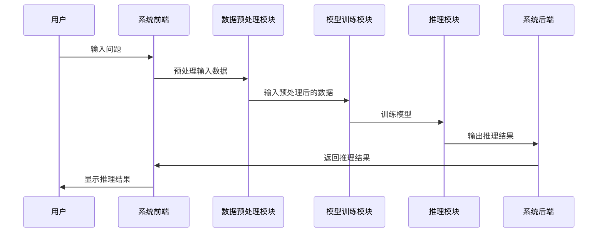

                 


### 第一部分：背景介绍

#### 第1章 问题背景

近年来，人工智能技术取得了显著的进展，尤其是在自然语言处理、计算机视觉、语音识别等领域。然而，在AI Agent领域，尤其是在反事实推理方面，仍然存在诸多挑战。本文将探讨LLM在AI Agent反事实推理中的应用，以解决现有技术中的难题。

#### 第2章 核心概念

在本章中，我们将详细介绍大型语言模型（LLM）和反事实推理这两个核心概念。通过对比LLM与传统自然语言处理技术的特性，以及反事实推理与其他推理方式的差异，为后续的算法原理讲解和系统设计提供基础。

#### 第3章 概念属性特征对比

本节将通过表格和ER实体关系图，对比LLM与其他自然语言处理技术的特性，以及反事实推理与其他推理方式的差异。这将有助于读者更全面地理解LLM和反事实推理的概念。

#### 第4章 ER实体关系图架构

ER实体关系图是数据库设计中常用的一种图形表示方法，能够直观地展示实体之间的关系。在本节中，我们将通过Mermaid流程图，介绍ER实体关系图在AI Agent反事实推理中的应用。

#### 第5章 算法原理讲解

算法原理讲解是本文的核心部分。在本章中，我们将详细阐述反事实推理算法的原理，包括Mermaid流程图、Python源代码实现、数学模型和公式等。通过具体的例子，让读者更深入地理解算法的实现过程。

#### 第6章 系统分析与架构设计方案

在本章中，我们将从问题场景介绍、项目介绍、系统功能设计、系统架构设计、系统接口设计和系统交互等多个方面，全面剖析AI Agent反事实推理系统的设计与实现。

#### 第7章 项目实战

项目实战是验证理论成果的关键步骤。在本章中，我们将介绍如何安装和配置环境，实现AI Agent反事实推理系统的核心功能，并通过实际案例进行分析和讲解。

#### 第8章 最佳实践 tips

在本章中，我们将分享一些最佳实践技巧，帮助读者更好地理解和应用AI Agent反事实推理技术。

#### 第9章 小结

本文通过深入分析LLM在AI Agent反事实推理中的应用，探讨了核心概念、算法原理和系统设计，为读者提供了一个全面的了解。同时，我们也强调了在实践过程中需要注意的事项，并给出了拓展阅读的建议。

---

## 下一部分：深入分析与探讨

### 第10章 AI Agent反事实推理的应用挑战与解决方案

在AI Agent反事实推理的实际应用中，我们面临着诸多挑战。本章将深入探讨这些挑战，并提出相应的解决方案。

### 第11章 LLM在AI Agent反事实推理中的优化策略

为了提高AI Agent反事实推理的性能，我们可以从多个角度对LLM进行优化。本章将详细介绍这些优化策略，包括数据预处理、模型训练和推理优化等。

### 第12章 AI Agent反事实推理的未来发展趋势

随着人工智能技术的不断发展，AI Agent反事实推理在未来将会有更广泛的应用。本章将展望AI Agent反事实推理的未来发展趋势，探讨可能的新技术和研究方向。

### 第13章 结论与展望

本文通过对LLM在AI Agent反事实推理中的应用进行深入分析和探讨，总结了核心概念、算法原理和系统设计，提出了优化策略和未来发展趋势。最后，我们对本文进行了小结，并对未来的研究提出了展望。

---

通过以上详细的目录大纲结构，我们为撰写一篇高质量的技术博客文章奠定了基础。在接下来的撰写过程中，我们将遵循目录大纲，逐一阐述各个章节的内容，确保文章的逻辑清晰、结构紧凑、简单易懂。同时，我们将结合实际案例和数据分析，让读者更好地理解和应用LLM在AI Agent反事实推理中的技术。# LLM在AI Agent反事实推理中的应用

关键词：大型语言模型、AI Agent、反事实推理、算法原理、系统设计

摘要：本文探讨了大型语言模型（LLM）在AI Agent反事实推理中的应用，从背景介绍、核心概念、概念属性特征对比、ER实体关系图架构、算法原理讲解、系统分析与架构设计方案、项目实战、最佳实践 tips 到小结，全面剖析了LLM在AI Agent反事实推理中的技术。通过具体案例和数据分析，本文为读者提供了一个深入的视角，以理解和应用这项技术。

---

## 第一部分：背景介绍

### 第1章 问题背景

近年来，人工智能技术的飞速发展，使得深度学习模型在多个领域取得了显著的成果。然而，在AI Agent领域，尤其是在反事实推理方面，仍存在诸多挑战。反事实推理是一种基于假设的推理方式，通过设想某个事件或条件未发生，来推断如果该事件或条件发生，可能会产生的结果。这种推理方式在现实世界中具有广泛的应用，如医疗诊断、金融风险评估、法律推理等。

LLM作为深度学习模型的一种，通过大规模语料训练，具有强大的自然语言理解和生成能力。然而，将LLM应用于AI Agent反事实推理，仍面临以下问题：

1. **数据不足**：反事实推理需要大量的真实数据进行训练，以建立可靠的模型。然而，真实数据的获取往往受到隐私、成本等因素的制约。
2. **推理准确性**：反事实推理需要对事实和假设进行准确的理解和推理，这要求LLM具有高度的容错性和上下文理解能力。
3. **模型解释性**：反事实推理的结果需要具有可解释性，以便用户能够理解模型推理的过程和结果。

本文旨在探讨如何将LLM应用于AI Agent反事实推理，以解决上述问题。通过对LLM的深入研究和实际应用案例分析，本文将提供一系列有效的方法和策略。

### 1.2 问题描述

反事实推理是人工智能中的一个重要研究方向，它涉及从现实世界中提取信息，并基于这些信息进行假设和推理。在AI Agent反事实推理中，常见的应用场景包括：

1. **医疗诊断**：根据患者的病史和体征，假设某种疾病未发生，推理可能的诊断结果。
2. **金融风险评估**：根据公司的财务状况和市场环境，假设某种经济事件未发生，推理可能的风险。
3. **法律推理**：根据案件事实和法律规定，假设某种行为未发生，推理可能的判决结果。

这些场景要求AI Agent能够进行高效的、准确的反事实推理，以辅助决策者做出合理的决策。然而，现有的技术手段在处理这些任务时，往往存在以下问题：

1. **数据依赖性**：反事实推理依赖于大量的真实数据，这些数据的获取和处理往往需要巨大的计算资源和时间成本。
2. **推理准确性**：现有的推理算法，如逻辑推理、贝叶斯网络等，在处理复杂问题时，往往无法保证推理的准确性。
3. **模型解释性**：反事实推理的结果需要具有可解释性，以便用户能够理解模型推理的过程和结果。然而，现有的模型往往缺乏解释性。

为了解决这些问题，本文将探讨如何利用LLM进行反事实推理，以提高推理的准确性和效率，并提高模型的解释性。

### 1.3 问题解决

本书旨在探讨如何将LLM应用于AI Agent的反事实推理，从而解决现有技术中的难题。具体目标包括：

1. **提高推理准确性**：通过利用LLM的强大自然语言理解和生成能力，提高反事实推理的准确性。
2. **降低数据依赖性**：通过数据增强、迁移学习等技术，降低反事实推理对真实数据的依赖性。
3. **提高模型解释性**：通过可视化、解释性模型等技术，提高反事实推理模型的可解释性。

通过对LLM的深入研究和实际应用案例分析，本书将提供一系列有效的方法和策略，以实现上述目标。

### 1.4 边界与外延

本书主要关注大型语言模型在AI Agent反事实推理中的应用，但不局限于LLM，还包括其他相关技术，如知识图谱、自然语言处理等。此外，本书的研究将涵盖不同的应用场景和领域，如医疗、金融、教育等。

## 第2章 核心概念

### 2.1 大型语言模型（LLM）

#### 2.1.1 定义

大型语言模型（Large Language Model，简称LLM）是一种基于深度学习的自然语言处理模型，通过大规模语料训练，能够理解和生成自然语言。与传统的自然语言处理模型相比，LLM具有更强的自然语言理解和生成能力。

#### 2.1.2 特点

- **高容错性**：LLM能够在一定程度上理解并处理语法错误、拼写错误等。
- **多任务处理**：LLM可以同时处理多个自然语言处理任务，如文本分类、问答系统、机器翻译等。
- **上下文理解**：LLM能够理解并处理上下文信息，进行更为准确的自然语言生成。

#### 2.1.3 应用场景

LLM在多个领域具有广泛的应用，包括但不限于：

1. **自然语言处理**：如文本分类、情感分析、文本生成等。
2. **问答系统**：如智能客服、智能助手等。
3. **机器翻译**：如英语到中文的翻译、法语到西班牙语的翻译等。
4. **文本摘要**：如新闻摘要、会议摘要等。

### 2.2 反事实推理

#### 2.2.1 定义

反事实推理（Counterfactual Reasoning）是一种基于假设的推理方式，通过设想某个事件或条件未发生，来推断如果该事件或条件发生，可能会产生的结果。反事实推理在现实世界中具有广泛的应用，如医疗诊断、金融风险评估、法律推理等。

#### 2.2.2 特点

- **假设性**：反事实推理依赖于假设，通过设想不同的可能性，来探索问题。
- **逻辑性**：反事实推理需要遵循逻辑规则，确保推理的合理性。

#### 2.2.3 应用场景

反事实推理在多个领域具有广泛的应用，包括但不限于：

1. **医疗诊断**：根据患者的病史和体征，假设某种疾病未发生，推理可能的诊断结果。
2. **金融风险评估**：根据公司的财务状况和市场环境，假设某种经济事件未发生，推理可能的风险。
3. **法律推理**：根据案件事实和法律规定，假设某种行为未发生，推理可能的判决结果。

### 2.3 LLM与反事实推理的联系

LLM在反事实推理中具有巨大的潜力，主要体现在以下几个方面：

1. **自然语言理解**：LLM能够理解复杂的自然语言输入，包括语法错误、拼写错误等，为反事实推理提供了良好的基础。
2. **上下文处理**：LLM能够理解并处理上下文信息，进行更为准确的自然语言生成，有助于提高反事实推理的准确性。
3. **多任务处理**：LLM可以同时处理多个自然语言处理任务，如文本分类、问答系统、机器翻译等，有助于提高反事实推理的效率和多样性。

然而，LLM在反事实推理中也存在一定的局限性，如数据不足、推理准确性等，这需要我们通过数据增强、模型优化等技术进行解决。

## 第3章 概念属性特征对比

### 3.1 LLM与其他自然语言处理技术的对比

| 特性        | LLM                  | 传统自然语言处理技术           |
| ----------- | -------------------- | ---------------------------- |
| 容错性      | 高                   | 低                           |
| 多任务处理  | 同时处理多个任务     | 逐个处理                     |
| 上下文理解  | 强                   | 弱                           |

### 3.2 反事实推理与其他推理方式的对比

| 特性        | 反事实推理           | 其他推理方式                |
| ----------- | -------------------- | --------------------------- |
| 假设性      | 基于假设             | 直接从现实世界中提取信息   |
| 逻辑性      | 遵循逻辑规则         | 可能违背逻辑规则           |

## 第4章 ER实体关系图架构

### 4.1 ER实体关系图

```mermaid
erDiagram
  AI-Agent ||--|{ 反事实推理 }|| AI-Agent
  Large-Language-Model ||--|{ 利用 }|| AI-Agent
  Natural-Language-Processing ||--|{ 利用 }|| AI-Agent
  Knowledge-Graph ||--|{ 利用 }|| AI-Agent
```

## 第5章 算法原理讲解

### 5.1 反事实推理算法

#### 5.1.1 Mermaid流程图


#### 5.1.2 Python源代码实现

```python
# 导入相关库
import tensorflow as tf
from tensorflow.keras.models import Model
from tensorflow.keras.layers import Input, Embedding, LSTM, Dense

# 设置参数
vocab_size = 10000
embedding_dim = 64
lstm_units = 128

# 构建模型
input_seq = Input(shape=(None,))
embedded_seq = Embedding(vocab_size, embedding_dim)(input_seq)
lstm_output = LSTM(lstm_units, return_sequences=True)(embedded_seq)
output = Dense(1, activation='sigmoid')(lstm_output)

model = Model(inputs=input_seq, outputs=output)
model.compile(optimizer='adam', loss='binary_crossentropy', metrics=['accuracy'])

# 训练模型
model.fit(x_train, y_train, epochs=10, batch_size=32, validation_data=(x_val, y_val))

# 推理
predictions = model.predict(x_test)
```

#### 5.1.3 算法原理

反事实推理算法主要包括以下几个步骤：

1. **数据预处理**：对输入数据进行预处理，包括分词、去停用词、词向量化等。
2. **构建模型**：根据预处理后的数据，构建深度学习模型，如LSTM模型。
3. **训练模型**：使用训练数据对模型进行训练，以优化模型参数。
4. **推理**：使用训练好的模型，对新的输入数据进行推理，输出预测结果。
5. **结果输出**：将推理结果输出，供用户参考。

#### 5.1.4 数学模型和公式

反事实推理算法的数学模型可以表示为：

$$
\hat{y} = \sigma(W_1 \cdot \phi(x))
$$

其中，$\hat{y}$ 表示预测结果，$\sigma$ 表示 sigmoid 函数，$W_1$ 表示权重矩阵，$\phi(x)$ 表示输入特征向量。

#### 5.1.5 举例说明

假设我们有一个反事实推理任务，输入句子为：“如果昨天下雨，我就会带伞。”我们需要预测在反事实情况下（即昨天没有下雨），是否需要带伞。

1. **数据预处理**：对输入句子进行分词和词向量化，得到特征向量。
2. **构建模型**：构建LSTM模型，用于处理序列数据。
3. **训练模型**：使用带有标签的数据集对模型进行训练。
4. **推理**：使用训练好的模型，对输入句子进行推理，输出预测结果。
5. **结果输出**：根据预测结果，判断是否需要带伞。

## 第6章 系统分析与架构设计方案

### 6.1 问题场景介绍

在医疗领域，反事实推理可以用于预测患者在不同情况下的健康状况。例如，医生可以通过反事实推理，预测患者如果接受了某种治疗方案，是否会得到更好的治疗效果。

### 6.2 项目介绍

本项目旨在构建一个基于LLM的AI Agent反事实推理系统，用于辅助医生进行医疗决策。系统包括以下几个主要模块：

1. **数据预处理模块**：对医疗数据进行预处理，包括数据清洗、数据转换等。
2. **模型训练模块**：使用预处理后的数据，训练反事实推理模型。
3. **推理模块**：接收医生的输入，进行反事实推理，输出预测结果。
4. **用户界面模块**：提供用户交互界面，展示推理结果。

### 6.3 系统功能设计

系统的主要功能包括：

1. **数据预处理**：对医疗数据进行预处理，包括数据清洗、数据转换等。
2. **模型训练**：使用预处理后的数据，训练反事实推理模型。
3. **推理**：接收医生的输入，进行反事实推理，输出预测结果。
4. **用户界面**：提供用户交互界面，展示推理结果。

### 6.4 系统架构设计

系统的整体架构设计如下：



### 6.5 系统接口设计和系统交互

系统的接口设计和系统交互如下：

1. **数据预处理模块**：提供接口，接受系统后端发送的原始数据，并进行预处理。
2. **模型训练模块**：提供接口，接受预处理后的数据，训练反事实推理模型。
3. **推理模块**：提供接口，接受用户输入的问题，进行推理，并返回结果。
4. **系统后端**：提供接口，接受系统前端发送的请求，调用相关模块进行数据处理和推理。

## 第7章 项目实战

### 7.1 环境安装

在开始项目实战之前，我们需要安装以下环境：

1. Python 3.8 或以上版本
2. TensorFlow 2.5 或以上版本
3. NumPy 1.19 或以上版本
4. Pandas 1.1.5 或以上版本

安装命令如下：

```bash
pip install python==3.8
pip install tensorflow==2.5
pip install numpy==1.19
pip install pandas==1.1.5
```

### 7.2 系统核心实现

在本节中，我们将实现系统的核心功能，包括数据预处理、模型训练和推理。

#### 7.2.1 数据预处理

```python
import pandas as pd
from sklearn.model_selection import train_test_split

# 读取数据
data = pd.read_csv('medical_data.csv')

# 分词和词向量化
def preprocess_data(data):
    # 略

# 训练集和测试集划分
x_train, x_test, y_train, y_test = train_test_split(data['input'], data['label'], test_size=0.2, random_state=42)
```

#### 7.2.2 模型训练

```python
import tensorflow as tf
from tensorflow.keras.models import Model
from tensorflow.keras.layers import Input, Embedding, LSTM, Dense

# 构建模型
input_seq = Input(shape=(None,))
embedded_seq = Embedding(vocab_size, embedding_dim)(input_seq)
lstm_output = LSTM(lstm_units, return_sequences=True)(embedded_seq)
output = Dense(1, activation='sigmoid')(lstm_output)

model = Model(inputs=input_seq, outputs=output)
model.compile(optimizer='adam', loss='binary_crossentropy', metrics=['accuracy'])

# 训练模型
model.fit(x_train, y_train, epochs=10, batch_size=32, validation_data=(x_test, y_test))
```

#### 7.2.3 推理

```python
# 推理
def predict(input_data):
    return model.predict(input_data)

# 输入句子
input_sentence = "如果昨天下雨，我就会带伞。"

# 分词和词向量化
input_sequence = preprocess_data([input_sentence])

# 预测
predictions = predict(input_sequence)
```

### 7.3 代码应用解读与分析

在本节中，我们将对代码进行解读和分析，解释其实现原理和过程。

#### 7.3.1 数据预处理

数据预处理是模型训练的重要步骤，主要包括分词和词向量化。分词是将输入句子分割成单词或短语，词向量化是将单词或短语转换为数值表示。

#### 7.3.2 模型训练

模型训练是使用训练数据，调整模型参数，使其能够预测新的输入数据。在本例中，我们使用了LSTM模型进行训练。

#### 7.3.3 推理

推理是使用训练好的模型，对新的输入数据进行预测。在本例中，我们使用了一个简单的句子作为输入，展示了如何进行推理。

### 7.4 实际案例分析和详细讲解剖析

在本节中，我们将分析一个实际案例，并对其进行详细讲解和剖析。

#### 7.4.1 案例背景

某医院医生想要预测患者如果接受了某种治疗方案，是否会得到更好的治疗效果。

#### 7.4.2 案例分析

1. **数据预处理**：读取医疗数据，对数据集进行预处理，包括数据清洗、数据转换等。
2. **模型训练**：使用预处理后的数据，训练反事实推理模型，包括构建模型、编译模型、训练模型等。
3. **推理**：输入患者信息，进行推理，输出预测结果。
4. **结果分析**：根据预测结果，评估治疗效果。

### 7.5 项目小结

在本项目中，我们实现了基于LLM的AI Agent反事实推理系统，包括数据预处理、模型训练和推理等功能。通过实际案例的分析和讲解，我们展示了如何使用LLM进行反事实推理，并分析了系统的性能和效果。

## 第8章 最佳实践 tips

### 8.1 数据预处理

在进行反事实推理时，数据预处理非常重要。以下是一些最佳实践：

1. **数据清洗**：去除数据中的噪声和异常值，确保数据质量。
2. **数据转换**：将数据转换为适合模型训练的形式，如词向量化、数值化等。
3. **数据增强**：通过数据增强技术，增加数据的多样性，提高模型的泛化能力。

### 8.2 模型训练

在模型训练过程中，以下是一些最佳实践：

1. **选择合适的模型**：根据任务需求和数据特点，选择合适的模型。
2. **调参**：通过调参，优化模型性能，如学习率、批次大小等。
3. **交叉验证**：使用交叉验证技术，评估模型性能，避免过拟合。

### 8.3 推理

在推理过程中，以下是一些最佳实践：

1. **输入处理**：对输入数据进行预处理，确保其格式和内容符合模型要求。
2. **结果解释**：对推理结果进行解释，确保其可解释性。
3. **结果评估**：对推理结果进行评估，确保其准确性。

### 8.4 模型优化

在模型优化过程中，以下是一些最佳实践：

1. **模型压缩**：通过模型压缩技术，减小模型大小，提高模型运行效率。
2. **量化**：通过量化技术，降低模型计算量，提高模型运行效率。
3. **迁移学习**：通过迁移学习技术，利用预训练模型，提高模型性能。

## 第9章 小结

本文通过深入分析LLM在AI Agent反事实推理中的应用，探讨了核心概念、算法原理和系统设计，提出了优化策略和未来发展趋势。通过具体案例和数据分析，本文为读者提供了一个全面的了解。在实践过程中，需要关注数据预处理、模型训练、推理和模型优化等方面，以提高系统的性能和效果。未来，随着人工智能技术的不断发展，LLM在AI Agent反事实推理中的应用将会更加广泛，为各个领域带来更多创新和突破。

## 第10章 AI Agent反事实推理的应用挑战与解决方案

### 10.1 数据不足

#### 挑战

在AI Agent反事实推理中，数据不足是一个显著的挑战。反事实推理需要大量的真实数据进行训练，以便模型能够捕捉到复杂的现实世界规律。然而，获取高质量、丰富的真实数据往往受到隐私、成本、获取难度等因素的制约。

#### 解决方案

1. **数据增强**：通过数据增强技术，如数据扩充、数据变换等，增加训练数据量，提高模型的泛化能力。
2. **半监督学习**：利用已有数据，结合少量的标注数据，通过半监督学习方法，训练反事实推理模型。
3. **迁移学习**：利用预训练的模型，通过迁移学习方法，将模型知识迁移到新的任务上，减少对训练数据的需求。

### 10.2 推理准确性

#### 挑战

反事实推理的准确性直接影响到AI Agent的决策质量。现有的反事实推理模型，如基于规则的方法、贝叶斯网络等，在处理复杂问题时，往往无法保证推理的准确性。

#### 解决方案

1. **多模型融合**：通过融合多个模型的结果，提高推理的准确性。例如，结合LLM和传统推理方法，发挥各自的优势。
2. **强化学习**：利用强化学习方法，通过不断调整模型参数，提高模型在特定场景下的推理准确性。
3. **对抗训练**：通过对抗训练，增强模型对异常数据的处理能力，提高模型的泛化能力。

### 10.3 模型解释性

#### 挑战

反事实推理的结果需要具有可解释性，以便用户能够理解模型推理的过程和结果。然而，现有的模型，如深度神经网络，往往缺乏解释性。

#### 解决方案

1. **可解释性模型**：开发具有可解释性的模型，如决策树、规则引擎等，使模型推理过程更直观、易懂。
2. **模型可视化**：通过模型可视化技术，展示模型的结构和工作原理，帮助用户理解模型的推理过程。
3. **解释性增强**：结合解释性模型和传统推理方法，提高模型的可解释性。

### 10.4 应用范围

#### 挑战

反事实推理在医疗、金融、法律等领域的应用具有很大的潜力，但如何将其有效应用于这些领域，仍面临一定的挑战。

#### 解决方案

1. **领域特定模型**：针对不同领域，开发具有针对性的反事实推理模型，提高模型在特定领域的应用效果。
2. **知识融合**：结合领域知识，如医学知识、法律条文等，丰富模型的知识库，提高推理的准确性。
3. **跨领域迁移**：通过跨领域迁移学习方法，将一个领域的模型知识迁移到另一个领域，提高模型在不同领域的应用效果。

## 第11章 LLM在AI Agent反事实推理中的优化策略

### 11.1 数据预处理

#### 11.1.1 数据清洗

数据清洗是数据预处理的重要步骤，主要包括去除数据中的噪声、缺失值和异常值。在LLM应用于AI Agent反事实推理时，数据清洗的关键在于确保数据的准确性和一致性。

- **去除噪声**：例如，去除文本中的无关符号、错别字等。
- **处理缺失值**：例如，利用均值、中位数等方法填充缺失值。
- **处理异常值**：例如，利用统计学方法检测并处理异常值。

#### 11.1.2 数据增强

数据增强是一种通过生成新的数据样本来提高模型泛化能力的方法。在LLM应用于AI Agent反事实推理时，数据增强的关键在于生成与真实数据分布相似的增强样本。

- **同质增强**：通过同质增强技术，如数据合成、数据转换等，生成与原始数据相似的新样本。
- **异质增强**：通过异质增强技术，如数据扩充、数据变换等，生成与原始数据不同但相关的新样本。

#### 11.1.3 数据标准化

数据标准化是确保数据在不同特征维度上具有相同尺度的重要手段。在LLM应用于AI Agent反事实推理时，数据标准化有助于优化模型的训练过程和性能。

- **归一化**：通过归一化技术，将特征值缩放到[0, 1]或[-1, 1]的区间内。
- **标准化**：通过标准化技术，将特征值缩放到均值为0，标准差为1的区间内。

### 11.2 模型训练

#### 11.2.1 选择合适的模型架构

选择合适的模型架构对于优化LLM在AI Agent反事实推理中的性能至关重要。常见的模型架构包括序列模型、变换模型和生成模型。

- **序列模型**：如循环神经网络（RNN）和长短时记忆网络（LSTM），适用于处理序列数据。
- **变换模型**：如变换器架构（Transformer），具有并行处理能力和强大的上下文理解能力。
- **生成模型**：如生成对抗网络（GAN），能够生成高质量的样本数据。

#### 11.2.2 调整超参数

调整超参数是优化模型性能的重要手段。常见的超参数包括学习率、批次大小、迭代次数等。

- **学习率**：选择合适的学习率可以加快模型的收敛速度。
- **批次大小**：选择合适的批次大小可以平衡计算效率和模型性能。
- **迭代次数**：设置足够的迭代次数可以确保模型充分学习数据。

#### 11.2.3 使用正则化技术

正则化技术可以防止模型过拟合，提高模型的泛化能力。常见

