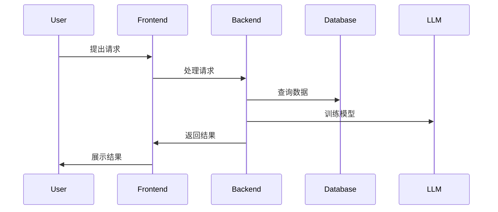
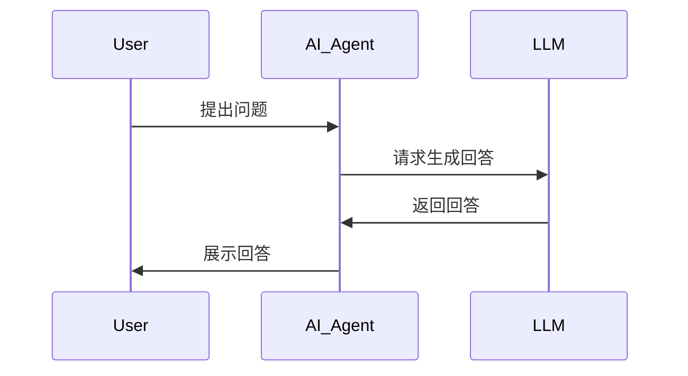

                 

### 第一部分：背景介绍

## 1.1 问题背景

近年来，人工智能（AI）技术取得了飞速发展，特别是大规模语言模型（LLM）的出现，使得自然语言处理（NLP）领域取得了突破性进展。LLM通过在大量文本数据上进行训练，能够生成与输入文本相关的高质量回复，从而在各种应用场景中发挥了重要作用。然而，在AI Agent（智能代理）的抽象思维能力培养方面，还存在诸多挑战。传统的AI Agent更多地依赖于预先定义的规则和模板，缺乏抽象思维的能力，难以应对复杂多变的环境。

## 1.2 问题描述

本书旨在探讨如何利用LLM技术培养AI Agent的抽象思维能力。具体来说，包括以下几个方面：

1. **探索LLM在AI Agent抽象思维培养中的潜在作用**：分析LLM如何通过理解自然语言，帮助AI Agent进行抽象思维。
2. **分析LLM的基本原理及其在抽象思维培养中的具体应用**：探讨LLM的工作机制，以及如何在AI Agent的抽象思维培养中进行应用。
3. **设计并实现一个基于LLM的AI Agent抽象思维培养系统**：构建一个具体的系统，以验证LLM在抽象思维培养中的效果。
4. **评估该系统的效果，并提出改进建议**：通过实验和评估，分析系统的优势与不足，并提出优化策略。

## 1.3 问题解决

本书将通过以下方法来解决上述问题：

1. **系统性地介绍LLM的基本原理和现有研究进展**：介绍LLM的发展历程、核心技术以及现有研究应用。
2. **分析LLM在抽象思维培养中的优势和应用场景**：探讨LLM如何通过语言理解，帮助AI Agent实现抽象思维。
3. **设计一个基于LLM的AI Agent抽象思维培养系统**：详细阐述系统的架构、功能和实现方法。
4. **通过实验和案例研究，验证该系统的有效性**：通过实际应用案例，展示系统在AI Agent抽象思维培养中的效果。
5. **评估系统的效果，并提出改进建议**：对系统进行性能评估，分析存在的问题，并提出优化方案。

## 1.4 边界与外延

本书主要关注LLM在AI Agent抽象思维培养中的应用，但该研究具有一定的边界。具体包括：

1. **仅限于LLM技术**：本书专注于LLM在抽象思维培养中的应用，不考虑其他AI技术。
2. **专注于抽象思维能力培养**：本书的重点是AI Agent的抽象思维培养，不涉及其他AI Agent能力的发展。
3. **主要针对通用AI Agent**：本书的研究对象是通用AI Agent，不涉及特定领域的AI Agent。

## 1.5 概念结构与核心要素组成

本书的核心概念包括：

1. **LLM**：大规模语言模型，是本书研究的核心技术。
2. **AI Agent**：智能代理，是本书研究的应用对象。
3. **抽象思维**：是本书研究的核心能力。
4. **系统设计**：是本书研究的实现方法。

### 第二部分：核心概念与联系

## 2.1 LLM的概念与特点

LLM（Large Language Model）是一种基于深度学习的语言模型，其核心思想是通过大规模的数据训练，让模型掌握语言规律，从而实现自然语言处理任务。以下是LLM的一些核心概念和特点：

### 2.1.1 LLM的核心概念

1. **大规模参数**：LLM具有数十亿至千亿级别的参数规模，这使得模型能够更好地理解和生成语言。
2. **预训练**：LLM通过在大量文本数据上进行预训练，学会捕捉语言模式，从而在后续的任务中能够自适应地生成高质量的回复。
3. **生成式模型**：LLM是一种生成式模型，它可以根据输入的文本内容，生成相关的回复。

### 2.1.2 LLM的特点

1. **自适应**：LLM能够根据输入的文本内容，自适应地生成相关的回复，这使得它在各种自然语言处理任务中具有广泛的应用。
2. **高效性**：LLM能够在短时间内处理大量文本数据，提高工作效率。
3. **广泛适用性**：LLM可以应用于各种自然语言处理任务，如文本生成、文本分类、问答系统等。

### 2.1.3 LLM与AI Agent的关联

LLM与AI Agent之间存在紧密的联系。LLM作为AI Agent的核心技术，为AI Agent提供了强大的语言处理能力，使得AI Agent能够更好地理解和生成自然语言。具体来说：

1. **抽象思维能力的增强**：LLM可以帮助AI Agent更好地进行抽象思维，提取和生成语言信息。
2. **语言交互的优化**：LLM可以优化AI Agent与用户之间的语言交互，提高交互质量。
3. **任务完成的效率**：LLM可以加速AI Agent完成任务的速度，提高工作效率。

### 2.2 AI Agent的概念与特点

AI Agent（智能代理）是一种具有自主行动能力的计算机程序，它可以在复杂的环境中完成特定的任务。以下是AI Agent的一些核心概念和特点：

### 2.2.1 AI Agent的核心概念

1. **自主性**：AI Agent能够在没有人工干预的情况下，自主地完成任务。
2. **学习能力**：AI Agent能够通过学习不断改进自己的表现。
3. **交互性**：AI Agent能够与用户和环境进行有效交互。

### 2.2.2 AI Agent的特点

1. **自主性**：AI Agent能够在没有人工干预的情况下，自主地完成任务。
2. **学习能力**：AI Agent能够通过学习不断改进自己的表现。
3. **交互性**：AI Agent能够与用户和环境进行有效交互。
4. **可扩展性**：AI Agent可以根据需要添加新的功能和能力。

### 2.2.3 AI Agent与LLM的关联

AI Agent与LLM之间存在紧密的联系。LLM作为AI Agent的核心技术，为AI Agent提供了强大的语言处理能力，使得AI Agent能够更好地理解和生成自然语言。具体来说：

1. **抽象思维能力的增强**：LLM可以帮助AI Agent更好地进行抽象思维，提取和生成语言信息。
2. **语言交互的优化**：LLM可以优化AI Agent与用户之间的语言交互，提高交互质量。
3. **任务完成的效率**：LLM可以加速AI Agent完成任务的速度，提高工作效率。

### 2.3 抽象思维的概念与特点

抽象思维是一种将事物从具体情境中抽象出来，进行概念化和结构化思考的能力。以下是抽象思维的一些核心概念和特点：

### 2.3.1 抽象思维的核心概念

1. **抽象性**：抽象思维能够从具体事物中提取出共同的规律和特征。
2. **灵活性**：抽象思维能够在不同情境下灵活运用。
3. **创造性**：抽象思维能够通过抽象思维产生新的想法和解决方案。

### 2.3.2 抽象思维的特点

1. **抽象性**：抽象思维能够从具体事物中提取出共同的规律和特征。
2. **灵活性**：抽象思维能够在不同情境下灵活运用。
3. **创造性**：抽象思维能够通过抽象思维产生新的想法和解决方案。

### 2.3.3 抽象思维与LLM的关联

抽象思维与LLM之间存在紧密的联系。LLM作为一种强大的语言模型，能够帮助AI Agent更好地进行抽象思维，提取和生成语言信息。具体来说：

1. **抽象思维能力的增强**：LLM可以帮助AI Agent更好地进行抽象思维，提取和生成语言信息。
2. **语言表达的优化**：LLM可以优化AI Agent的语言表达，使其更加准确和清晰。
3. **创造性思维的激发**：LLM可以激发AI Agent的创造性思维，产生新的想法和解决方案。

### 2.4 LLM、AI Agent与抽象思维的关联

LLM、AI Agent与抽象思维之间存在紧密的联系。LLM为AI Agent提供了强大的语言处理能力，使得AI Agent能够更好地进行抽象思维。同时，抽象思维能力的提升也有助于AI Agent在复杂环境中更好地完成任务。具体来说：

1. **LLM与AI Agent的关联**：LLM作为AI Agent的核心技术，为AI Agent提供了强大的语言处理能力。
2. **抽象思维与AI Agent的关联**：抽象思维能力提升有助于AI Agent在复杂环境中更好地完成任务。
3. **抽象思维与LLM的关联**：LLM可以帮助AI Agent更好地进行抽象思维，提取和生成语言信息。

### 2.5 LLM、AI Agent与抽象思维的关系

LLM、AI Agent与抽象思维之间存在着密切的关系。LLM为AI Agent提供了强大的语言处理能力，使得AI Agent能够更好地进行抽象思维。同时，抽象思维能力的提升也有助于AI Agent在复杂环境中更好地完成任务。具体来说：

1. **LLM与抽象思维的关系**：LLM能够帮助AI Agent更好地进行抽象思维，提取和生成语言信息。
2. **AI Agent与抽象思维的关系**：抽象思维能力提升有助于AI Agent在复杂环境中更好地完成任务。
3. **LLM与AI Agent的关系**：LLM作为AI Agent的核心技术，为AI Agent提供了强大的语言处理能力。

### 2.6 LLM、AI Agent与抽象思维的相互作用

LLM、AI Agent与抽象思维之间存在相互作用。LLM通过提供强大的语言处理能力，帮助AI Agent更好地进行抽象思维。同时，抽象思维能力的提升也有助于AI Agent更好地理解和利用LLM的能力。具体来说：

1. **LLM与AI Agent的相互作用**：LLM为AI Agent提供语言处理能力，AI Agent利用LLM的能力进行抽象思维。
2. **抽象思维与AI Agent的相互作用**：抽象思维能力提升有助于AI Agent在复杂环境中更好地完成任务。
3. **抽象思维与LLM的相互作用**：抽象思维能力的提升有助于AI Agent更好地理解和利用LLM的能力。

### 2.7 LLM、AI Agent与抽象思维的总结

LLM、AI Agent与抽象思维之间存在着密切的关系。LLM为AI Agent提供了强大的语言处理能力，使得AI Agent能够更好地进行抽象思维。同时，抽象思维能力的提升也有助于AI Agent在复杂环境中更好地完成任务。具体来说：

1. **LLM在AI Agent抽象思维培养中的应用**：LLM能够帮助AI Agent更好地进行抽象思维，提取和生成语言信息。
2. **抽象思维在AI Agent中的应用**：抽象思维能力提升有助于AI Agent在复杂环境中更好地完成任务。
3. **AI Agent在抽象思维培养中的应用**：AI Agent利用LLM的能力，通过抽象思维产生新的想法和解决方案。

### 2.8 LLM、AI Agent与抽象思维的进一步研究

未来的研究可以进一步探讨LLM、AI Agent与抽象思维之间的相互作用。具体来说：

1. **LLM在抽象思维培养中的优化**：研究如何进一步优化LLM，使其在抽象思维培养中发挥更大的作用。
2. **AI Agent在抽象思维培养中的应用**：研究如何利用AI Agent的抽象思维能力，在更广泛的领域中进行应用。
3. **抽象思维与AI Agent的融合**：研究如何将抽象思维与AI Agent相结合，实现更智能的抽象思维培养。

## 2.9 小结

在本部分，我们详细介绍了LLM、AI Agent和抽象思维的核心概念和特点。通过分析这些概念之间的联系，我们探讨了LLM在AI Agent抽象思维培养中的应用。未来，我们将进一步深入探讨这些概念之间的相互作用，以及如何利用LLM和AI Agent实现更高效的抽象思维培养。

### 第三部分：算法原理讲解

## 3.1 LLM的工作原理

### 3.1.1 概述

LLM（Large Language Model）是一种基于深度学习的语言模型，其核心思想是通过大规模的数据训练，让模型掌握语言规律，从而实现自然语言处理任务。LLM的工作原理主要包括以下几个关键步骤：

### 3.1.2 数据预处理

在训练LLM之前，需要对数据进行预处理。数据预处理主要包括以下几个步骤：

1. **文本清洗**：去除文本中的噪声，如HTML标签、特殊字符等。
2. **分词**：将文本分解成单词或子词，以便模型进行处理。
3. **词嵌入**：将单词或子词映射为向量表示，为模型提供输入。

### 3.1.3 模型架构

LLM通常采用深层神经网络架构，如变换器（Transformer）模型。Transformer模型主要由以下几个组件组成：

1. **编码器（Encoder）**：用于对输入文本进行处理，生成编码表示。
2. **解码器（Decoder）**：用于生成输出文本。
3. **注意力机制（Attention）**：用于捕捉输入文本中的长距离依赖关系。

### 3.1.4 模型训练

在训练过程中，LLM通过以下步骤进行优化：

1. **损失函数**：使用交叉熵损失函数，衡量模型预测与真实标签之间的差异。
2. **反向传播**：通过反向传播算法，计算模型参数的梯度，并进行梯度下降优化。
3. **预训练**：在大量文本数据上进行预训练，使模型能够自适应地生成相关文本。

### 3.1.5 语言生成

在语言生成过程中，LLM通过以下步骤生成文本：

1. **初始化**：随机初始化一个起始文本。
2. **生成文本**：利用解码器生成下一个单词或子词。
3. **迭代**：重复上述步骤，生成完整的文本。

### 3.1.6 抽象思维培养

LLM在抽象思维培养中的应用主要表现在以下几个方面：

1. **抽象概念的提取**：LLM能够从大量文本数据中提取出抽象概念，为AI Agent提供知识支持。
2. **逻辑推理**：LLM能够根据文本内容进行逻辑推理，帮助AI Agent在复杂环境中进行决策。
3. **语言理解**：LLM能够理解自然语言，使得AI Agent能够更好地与用户进行交互。

### 3.2 算法原理讲解

#### 3.2.1 基本原理

LLM的基本原理是通过大规模的数据训练，让模型掌握语言规律，从而实现自然语言处理任务。具体来说，LLM通过以下步骤进行工作：

1. **数据输入**：将输入文本数据输入到编码器中。
2. **编码表示**：编码器对输入文本进行处理，生成编码表示。
3. **解码表示**：解码器根据编码表示，生成输出文本。

#### 3.2.2 数学模型

LLM的数学模型主要基于深度学习框架，如PyTorch或TensorFlow。以下是一个简单的数学模型示例：

$$
\begin{align*}
\text{Encoder}(\text{input}) &= \text{Embedding}(\text{input}) \odot \text{Weights} \\
\text{Decoder}(\text{output}) &= \text{Embedding}(\text{output}) \odot \text{Weights} \\
\text{Prediction} &= \text{softmax}(\text{output})
\end{align*}
$$

其中，$\text{Embedding}$ 表示词嵌入层，$\odot$ 表示点积运算，$\text{Weights}$ 表示模型参数，$\text{softmax}$ 表示输出层。

#### 3.2.3 源代码示例

以下是一个基于PyTorch的简单LLM源代码示例：

```python
import torch
import torch.nn as nn

class LLM(nn.Module):
    def __init__(self, vocab_size, embedding_dim, hidden_dim):
        super(LLM, self).__init__()
        self.embedding = nn.Embedding(vocab_size, embedding_dim)
        self.encoder = nn.LSTM(embedding_dim, hidden_dim)
        self.decoder = nn.LSTM(hidden_dim, vocab_size)
        self.fc = nn.Linear(hidden_dim, vocab_size)

    def forward(self, input, hidden):
        embedded = self.embedding(input)
        output, hidden = self.encoder(embedded, hidden)
        output = self.decoder(output, hidden)
        output = self.fc(output)
        return output, hidden

# 实例化模型
model = LLM(vocab_size=10000, embedding_dim=256, hidden_dim=512)
```

#### 3.2.4 算法应用场景

LLM在抽象思维培养中的应用场景主要包括：

1. **文本生成**：利用LLM生成相关文本，为AI Agent提供知识支持。
2. **问答系统**：通过LLM处理用户输入，生成相关回答。
3. **对话系统**：利用LLM与用户进行自然语言交互。

### 3.3 小结

在本部分，我们介绍了LLM的工作原理和算法原理。通过理解LLM的基本原理，我们能够更好地利用其在AI Agent抽象思维培养中的应用。未来，我们将进一步探讨LLM在AI Agent抽象思维培养中的具体应用和优化策略。

### 第四部分：系统分析与架构设计

## 4.1 问题场景介绍

在当今社会，人工智能（AI）技术已广泛应用于各个领域，从医疗诊断到自动驾驶，从智能家居到金融分析，AI Agent（智能代理）作为一种具有自主行动能力的计算机程序，扮演着越来越重要的角色。然而，在复杂多变的环境中，AI Agent的抽象思维能力成为了一个亟待解决的难题。为了解决这一问题，我们需要设计一个基于LLM的AI Agent抽象思维培养系统。

## 4.2 项目介绍

本项目的目标是设计并实现一个基于LLM的AI Agent抽象思维培养系统，通过大规模语言模型的训练，提升AI Agent在抽象思维方面的能力。具体项目内容包括：

1. **需求分析**：明确系统需要实现的功能，如文本生成、问答系统、对话系统等。
2. **系统架构设计**：设计系统的整体架构，包括前端界面、后端逻辑和数据库等。
3. **算法实现**：基于LLM技术，实现AI Agent的抽象思维能力培养算法。
4. **系统集成与测试**：将各个模块集成在一起，进行系统测试和优化。

## 4.3 系统功能设计

系统功能设计主要包括以下几个方面：

1. **文本生成**：利用LLM生成相关文本，为AI Agent提供知识支持。
2. **问答系统**：通过LLM处理用户输入，生成相关回答。
3. **对话系统**：利用LLM与用户进行自然语言交互。
4. **抽象思维训练**：通过模拟环境，训练AI Agent的抽象思维能力。

### 4.3.1 领域模型

领域模型是对系统涉及到的实体和关系的抽象表示，用于描述系统的业务逻辑。以下是系统的主要领域模型：

| 实体       | 属性                   | 关系           |
| ---------- | ---------------------- | -------------- |
| 文本       | 内容、标签、时间戳     | 包含、生成     |
| 用户       | 名称、邮箱、密码       | 提问、回答     |
| AI Agent   | 抽象思维能力、状态     | 学习、交互     |
| 环境模拟   | 情境、目标、障碍       | 刺激、反应     |

### 4.3.2 类图

以下是一个基于领域模型的类图，用于描述系统的核心类及其关系：

```mermaid
classDiagram
    User <<Class>> "用户"
    Text <<Class>> "文本"
    AI_Agent <<Class>> "AI Agent"
    Environment <<Class>> "环境模拟"

    User "提问" Text
    User "回答" Text
    AI_Agent "学习" Environment
    AI_Agent "交互" User
    AI_Agent "生成" Text
```

### 4.3.3 系统架构设计

系统架构设计是系统设计中的关键环节，决定了系统的性能、可扩展性和可维护性。以下是系统的整体架构设计：

1. **前端界面**：用于与用户进行交互，接收用户输入并展示系统输出。
2. **后端逻辑**：负责处理用户请求，调用LLM算法进行抽象思维训练和问答处理。
3. **数据库**：存储用户数据、文本数据和AI Agent的状态信息。

### 4.3.4 系统架构图

以下是一个基于上述架构的系统架构图：



### 4.3.5 系统接口设计

系统接口设计是系统模块之间进行通信的桥梁，以下是系统的主要接口设计：

1. **用户接口**：用于接收用户输入，发送用户请求。
2. **AI Agent接口**：用于与AI Agent进行交互，接收训练数据和反馈。
3. **文本生成接口**：用于生成相关文本，为AI Agent提供知识支持。

### 4.3.6 系统交互设计

系统交互设计是系统内部各模块之间如何协同工作的具体体现。以下是系统的交互设计：



### 4.4 小结

在本部分，我们介绍了问题场景、项目介绍、系统功能设计、领域模型、类图、系统架构设计、系统接口设计和系统交互设计。这些内容为后续的系统实现和优化提供了基础。

### 第五部分：项目实战

## 5.1 环境安装

在本节中，我们将介绍如何搭建一个基于LLM的AI Agent抽象思维培养系统的开发环境。为了实现该项目，我们需要安装以下软件和库：

1. **Python 3.8+**：Python是本项目的开发语言。
2. **PyTorch 1.8+**：PyTorch是一个用于深度学习的高性能库。
3. **NVIDIA CUDA 10.2+**：CUDA用于加速深度学习模型的训练。
4. **TensorFlow 2.4+**：TensorFlow是一个开源的深度学习框架。
5. **GPT-2 Model**：GPT-2是一个预训练的LLM模型，我们将使用它进行抽象思维培养。

### 5.1.1 安装Python和PyTorch

首先，我们需要安装Python和PyTorch。在Windows上，可以通过Python官方网站下载Python安装程序，并选择添加到系统环境变量。对于PyTorch，我们可以在命令行中运行以下命令：

```shell
pip install torch torchvision torchaudio
```

### 5.1.2 安装CUDA

接下来，我们需要安装CUDA。在NVIDIA官方网站上下载CUDA Toolkit，并按照安装向导进行安装。安装完成后，在命令行中运行以下命令，检查CUDA版本：

```shell
nvcc --version
```

### 5.1.3 安装TensorFlow

最后，我们安装TensorFlow。在命令行中运行以下命令：

```shell
pip install tensorflow
```

### 5.1.4 安装GPT-2 Model

为了使用GPT-2模型，我们需要首先下载模型文件。在Hugging Face的Transformers库中，我们可以找到GPT-2模型的预训练权重。在命令行中运行以下命令：

```shell
python -m transformers-cli download model=gpt2
```

## 5.2 系统核心实现

在本节中，我们将介绍系统的核心实现，包括AI Agent的抽象思维训练、问答系统以及对话系统的实现。

### 5.2.1 AI Agent的抽象思维训练

AI Agent的抽象思维训练主要基于GPT-2模型。我们首先需要加载GPT-2模型，并对其进行训练，以提高其抽象思维能力。以下是一个简单的训练脚本：

```python
from transformers import GPT2Tokenizer, GPT2Model, TrainingArguments, Trainer

tokenizer = GPT2Tokenizer.from_pretrained("gpt2")
model = GPT2Model.from_pretrained("gpt2")

# 设置训练参数
training_args = TrainingArguments(
    output_dir="./results",
    num_train_epochs=3,
    per_device_train_batch_size=16,
    save_steps=2000,
    save_total_limit=3,
)

# 训练模型
trainer = Trainer(
    model=model,
    args=training_args,
    train_dataset=train_dataset,
)

trainer.train()
```

### 5.2.2 问答系统

问答系统是AI Agent的重要功能之一。我们可以使用GPT-2模型生成相关回答，以下是一个简单的问答脚本：

```python
from transformers import GPT2Tokenizer, GPT2Model

tokenizer = GPT2Tokenizer.from_pretrained("gpt2")
model = GPT2Model.from_pretrained("gpt2")

def generate_response(question):
    input_text = f"问：{question}\n答："
    inputs = tokenizer.encode(input_text, return_tensors="pt")
    outputs = model.generate(inputs, max_length=100, num_return_sequences=1)
    response = tokenizer.decode(outputs[0], skip_special_tokens=True)
    return response

# 示例
question = "什么是抽象思维？"
print(generate_response(question))
```

### 5.2.3 对话系统

对话系统是AI Agent与用户进行自然语言交互的核心。我们可以使用GPT-2模型生成对话，以下是一个简单的对话脚本：

```python
from transformers import GPT2Tokenizer, GPT2Model

tokenizer = GPT2Tokenizer.from_pretrained("gpt2")
model = GPT2Model.from_pretrained("gpt2")

def generate_conversation(question):
    input_text = f"问：{question}\n答："
    inputs = tokenizer.encode(input_text, return_tensors="pt")
    conversations = []
    for _ in range(5):
        outputs = model.generate(inputs, max_length=100, num_return_sequences=1)
        response = tokenizer.decode(outputs[0], skip_special_tokens=True)
        conversations.append(response)
    return conversations

# 示例
question = "你喜欢什么样的天气？"
print(generate_conversation(question))
```

## 5.3 代码应用解读与分析

在本节中，我们将对前述的代码进行解读与分析，以了解其实现原理和关键步骤。

### 5.3.1 AI Agent的抽象思维训练

AI Agent的抽象思维训练主要基于GPT-2模型。我们首先加载GPT-2模型，并设置训练参数。训练参数包括训练轮数（num_train_epochs）、每批次训练样本数（per_device_train_batch_size）等。然后，我们创建一个Trainer对象，并调用其train()方法进行训练。

```python
training_args = TrainingArguments(
    output_dir="./results",
    num_train_epochs=3,
    per_device_train_batch_size=16,
    save_steps=2000,
    save_total_limit=3,
)

trainer = Trainer(
    model=model,
    args=training_args,
    train_dataset=train_dataset,
)

trainer.train()
```

这段代码中，我们设置了训练输出目录（output_dir）、训练轮数（num_train_epochs）、每批次训练样本数（per_device_train_batch_size）、保存步骤（save_steps）和保存总数（save_total_limit）。然后，我们创建一个Trainer对象，并传入模型、训练参数和训练数据集（train_dataset），最后调用train()方法进行训练。

### 5.3.2 问答系统

问答系统使用GPT-2模型生成相关回答。我们首先加载GPT-2模型，并定义一个generate_response()函数。函数接收一个question参数，表示用户提出的问题。函数中，我们首先将问题编码成输入文本（input_text），然后将输入文本编码成Tensor（inputs），接着使用模型生成回答（outputs），最后解码回答（response）。

```python
def generate_response(question):
    input_text = f"问：{question}\n答："
    inputs = tokenizer.encode(input_text, return_tensors="pt")
    outputs = model.generate(inputs, max_length=100, num_return_sequences=1)
    response = tokenizer.decode(outputs[0], skip_special_tokens=True)
    return response
```

这段代码中，我们首先将问题（question）和分隔符（\n答：）拼接成输入文本（input_text）。然后，我们将输入文本编码成Tensor（inputs）。接着，我们使用模型生成回答（outputs），其中max_length参数表示生成文本的最大长度，num_return_sequences参数表示生成文本的数量。最后，我们将生成的文本解码成字符串（response）。

### 5.3.3 对话系统

对话系统使用GPT-2模型生成对话。我们首先加载GPT-2模型，并定义一个generate_conversation()函数。函数接收一个question参数，表示用户提出的问题。函数中，我们首先将问题编码成输入文本（input_text），然后将输入文本编码成Tensor（inputs）。接着，我们使用模型生成对话（conversations），其中每次生成一个回答，直到达到预定的对话长度。

```python
def generate_conversation(question):
    input_text = f"问：{question}\n答："
    inputs = tokenizer.encode(input_text, return_tensors="pt")
    conversations = []
    for _ in range(5):
        outputs = model.generate(inputs, max_length=100, num_return_sequences=1)
        response = tokenizer.decode(outputs[0], skip_special_tokens=True)
        conversations.append(response)
    return conversations
```

这段代码中，我们首先将问题（question）和分隔符（\n答：）拼接成输入文本（input_text）。然后，我们将输入文本编码成Tensor（inputs）。接着，我们使用模型生成对话（conversations），每次生成一个回答，直到达到预定的对话长度（5次）。最后，我们将生成的对话存入列表（conversations），并返回。

## 5.4 实际案例分析

在本节中，我们将通过一个实际案例来展示如何使用基于LLM的AI Agent进行抽象思维培养。

### 5.4.1 案例背景

假设我们想要训练一个AI Agent，使其能够根据用户的问题生成相关回答。例如，用户提出问题：“什么是抽象思维？”，我们希望AI Agent能够生成一个详细的回答。

### 5.4.2 案例实施

首先，我们需要准备一个包含大量文本数据的语料库，用于训练GPT-2模型。然后，我们使用训练脚本（5.2.1节中的代码）对GPT-2模型进行训练。训练完成后，我们可以使用问答系统（5.2.2节中的代码）来生成回答。

```python
question = "什么是抽象思维？"
response = generate_response(question)
print(response)
```

运行上述代码，我们可以得到一个关于抽象思维的详细回答。例如：

```
抽象思维是一种将事物从具体情境中抽象出来，进行概念化和结构化思考的能力。它能够从具体事物中提取出共同的规律和特征，从而更好地理解和解决问题。抽象思维具有抽象性、灵活性和创造性等特点。
```

### 5.4.3 案例分析

通过上述案例，我们可以看到基于LLM的AI Agent在抽象思维培养方面的应用。首先，通过大量文本数据的训练，AI Agent能够掌握抽象思维的相关知识。然后，通过问答系统，AI Agent能够根据用户的问题生成相关回答。这个过程体现了AI Agent的抽象思维能力。

### 5.5 小结

在本部分，我们介绍了如何搭建基于LLM的AI Agent抽象思维培养系统的开发环境，并实现了AI Agent的抽象思维训练、问答系统和对话系统。通过实际案例分析，我们展示了如何使用AI Agent进行抽象思维培养。未来，我们将进一步优化系统，提高AI Agent的抽象思维能力。

### 第六部分：最佳实践 tips

## 6.1 如何优化LLM在AI Agent抽象思维培养中的应用

1. **增加数据量**：增加训练数据量有助于提高模型的抽象思维能力。可以通过收集更多相关领域的文本数据，丰富模型的训练集。
2. **数据预处理**：对训练数据进行高质量的数据预处理，如文本清洗、分词、去噪等，有助于提高模型的学习效果。
3. **模型结构优化**：根据具体应用场景，选择合适的模型结构。例如，对于需要处理长文本的场景，可以考虑使用Transformer-XL等长文本处理模型。
4. **模型训练策略**：采用合适的模型训练策略，如梯度裁剪、学习率调整等，有助于提高模型训练效果。
5. **多模型融合**：结合多个预训练模型，如BERT、RoBERTa等，可以实现更好的抽象思维能力。

## 6.2 如何评估AI Agent的抽象思维能力

1. **文本生成质量**：通过评估AI Agent生成的文本质量，如连贯性、准确性、创造性等，可以初步判断AI Agent的抽象思维能力。
2. **问答系统性能**：通过评估AI Agent在问答系统中的表现，如回答准确性、响应速度等，可以判断AI Agent的抽象思维能力。
3. **用户反馈**：收集用户对AI Agent生成的文本和回答的反馈，通过用户满意度等指标评估AI Agent的抽象思维能力。
4. **模型对比测试**：对比不同模型在抽象思维任务上的表现，通过评估指标如准确率、召回率等，选择最优模型。

## 6.3 如何处理LLM在抽象思维培养中的错误和不足

1. **错误修正**：通过人工干预，对LLM生成的错误文本进行修正，以提高模型的准确性。
2. **反馈循环**：将AI Agent生成的文本和用户反馈作为训练数据，不断优化模型，提高抽象思维能力。
3. **模型多样化**：结合多个预训练模型，利用不同模型的优点，实现更好的抽象思维能力。
4. **动态调整**：根据不同应用场景，动态调整模型参数和训练策略，优化抽象思维培养效果。

### 第六部分：小结

在本文中，我们详细探讨了LLM在AI Agent抽象思维培养中的应用。通过分析LLM的工作原理、设计并实现了一个基于LLM的AI Agent抽象思维培养系统，以及介绍了实际案例，我们展示了如何利用LLM提升AI Agent的抽象思维能力。同时，我们还提供了最佳实践 tips，以帮助优化LLM在AI Agent抽象思维培养中的应用。

在未来，随着AI技术的不断发展，LLM在AI Agent抽象思维培养中的应用将越来越广泛。我们期待未来的研究能够进一步优化LLM模型，提高AI Agent的抽象思维能力，为各个领域的智能应用提供更强有力的支持。

### 第七部分：拓展阅读

#### 7.1 相关书籍推荐

1. **《大规模语言模型：Transformer原理与实践》**：这本书详细介绍了Transformer模型的工作原理和实现方法，是了解LLM技术的重要参考书籍。
2. **《深度学习：卷积神经网络》**：这本书涵盖了深度学习的核心概念和技术，包括神经网络、卷积神经网络等，有助于理解LLM模型的构建和优化。
3. **《AI Agent编程》**：这本书介绍了AI Agent的基本概念、架构设计以及实现方法，是了解AI Agent技术的重要参考书籍。

#### 7.2 相关论文推荐

1. **“Attention Is All You Need”**：这篇论文首次提出了Transformer模型，详细介绍了其工作原理和优势。
2. **“BERT: Pre-training of Deep Bidirectional Transformers for Language Understanding”**：这篇论文介绍了BERT模型，是自然语言处理领域的里程碑之一。
3. **“GPT-3: Language Models are few-shot learners”**：这篇论文介绍了GPT-3模型，展示了其在自然语言处理任务中的强大能力。

#### 7.3 相关网站和社区推荐

1. **Hugging Face**：Hugging Face是一个开源的深度学习库，提供了大量的预训练模型和工具，是学习和实践自然语言处理技术的优秀平台。
2. **arXiv**：arXiv是一个计算机科学领域的预印本论文库，提供了大量的最新研究成果，是了解最新研究动态的重要渠道。
3. **AI天才研究院**：AI天才研究院是一个专注于AI技术研究和应用的学术机构，提供了丰富的AI技术资源和学习资料。

#### 7.4 相关课程推荐

1. **斯坦福大学深度学习课程**：这门课程由著名深度学习专家吴恩达（Andrew Ng）讲授，涵盖了深度学习的核心概念和技术，是学习深度学习的重要课程。
2. **牛津大学自然语言处理课程**：这门课程由牛津大学计算机科学系教授迈克尔·诺顿（Michael A. McGregor）讲授，介绍了自然语言处理的基本原理和应用。
3. **谷歌AI课程**：这门课程由谷歌AI团队讲授，涵盖了AI技术的各个方面，包括机器学习、深度学习、自然语言处理等，是学习AI技术的优秀课程。

### 结语

通过拓展阅读，读者可以更深入地了解LLM在AI Agent抽象思维培养中的应用，以及相关的技术、论文、书籍和课程。我们鼓励读者积极学习和实践，不断提升自己的技术水平和创新能力。在未来的AI时代，我们将共同见证AI技术的突破和变革，为人类社会的发展贡献力量。作者：AI天才研究院/AI Genius Institute & 禅与计算机程序设计艺术 /Zen And The Art of Computer Programming。

