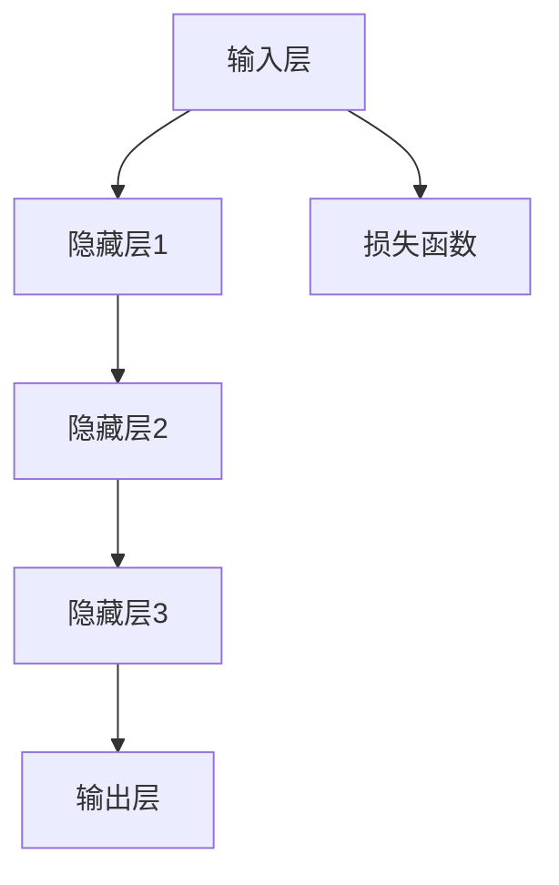
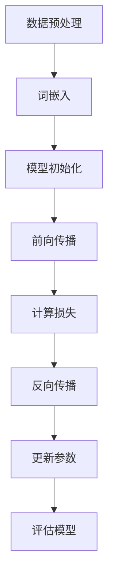
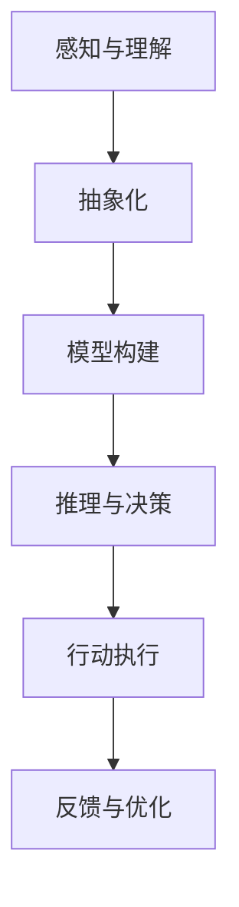

                 

### 引言

#### 1.1 问题背景

自人工智能（AI）兴起以来，其应用范围已不断扩大，从简单的自动化任务到复杂的决策支持系统，无不体现着AI技术的强大能力。然而，随着应用场景的日益复杂，AI系统面临着越来越多的问题。其中，抽象思维能力的缺失成为了一个亟待解决的核心难题。

传统AI系统大多依赖于特定的算法和数据，它们在处理特定任务时表现出色，但在面对抽象概念和复杂决策时却显得捉襟见肘。例如，在医疗诊断、金融分析和自然语言处理等领域，AI系统需要理解并处理大量的抽象概念和模糊信息，这对其抽象思维能力提出了极高的要求。

近年来，大型语言模型（Large Language Models，LLM）的涌现为AI领域带来了新的曙光。LLM，如GPT-3、BERT等，通过深度学习技术对海量文本数据进行训练，具备了强大的语言理解和生成能力。这使得LLM在自然语言处理任务中表现出色，同时也为AI Agent的抽象思维能力提升提供了可能。

#### 1.2 核心概念

**LLM（大型语言模型）的定义：**

LLM是一种基于神经网络的语言模型，通过对大规模文本数据进行预训练，使其具备了强大的语言理解和生成能力。与传统的语言模型相比，LLM能够处理更长的文本序列，并生成更加流畅和自然的文本。

**AI Agent的抽象思维概念：**

AI Agent是一种具有自主性和智能性的计算机程序，它能够在复杂的环境中感知、思考并采取行动。抽象思维是AI Agent的重要能力之一，它能够将具体的、复杂的任务转化为抽象的概念和模型，从而提高问题的解决效率。

### 问题背景

人工智能的发展历程可以追溯到20世纪50年代，当时计算机科学家们开始探索如何使计算机具备人类的智能。早期的AI系统主要依赖于规则和逻辑推理，虽然在一定程度上实现了特定任务的自动化，但在处理复杂、不确定的问题时往往表现出不足。

随着深度学习技术的兴起，AI系统在图像识别、语音识别和自然语言处理等领域取得了显著的突破。然而，这些系统大多依赖于大量的数据和复杂的模型，其学习能力在很大程度上依赖于数据的规模和质量。在面对抽象概念和复杂决策时，传统AI系统往往无法胜任。

为了解决这一问题，研究人员开始探索如何提升AI系统的抽象思维能力。抽象思维是人类智能的核心特征之一，它使得人类能够从具体的情境中提取出普遍的规律和概念。因此，将抽象思维能力引入AI系统，有望使其在复杂的环境中表现出更高的智能水平。

### AI Agent的抽象思维需求

AI Agent是一种自主运行的智能体，它能够在复杂的环境中感知、思考并采取行动。与传统的自动化系统不同，AI Agent具有更高的自主性和适应性，能够根据环境变化调整其行为策略。这使得AI Agent在许多应用领域具有广泛的前景，如智能制造、智能交通和智能客服等。

然而，AI Agent的抽象思维能力是实现其自主性和智能性的关键。抽象思维能力的强弱直接影响AI Agent在面对复杂问题和不确定情境时的表现。具体来说，抽象思维能力可以帮助AI Agent：

1. **理解复杂概念：** AI Agent需要能够理解并处理大量的抽象概念，如法律条文、经济模型和医疗知识等。只有通过抽象思维，AI Agent才能将这些复杂的概念转化为具体的行动策略。

2. **发现普遍规律：** 在面对大规模数据时，AI Agent需要能够从中发现普遍的规律和模式，以便进行预测和决策。抽象思维能力使得AI Agent能够从具体的实例中提取出普遍的规律，从而提高其决策的准确性和效率。

3. **适应不确定性：** 复杂环境往往具有不确定性和模糊性，AI Agent需要能够应对这种不确定性。抽象思维能力使得AI Agent能够从抽象的概念和模型中提取出有用的信息，从而在不确定的环境中做出合理的决策。

因此，提升AI Agent的抽象思维能力，对于实现其智能性和自主性具有重要意义。而LLM作为一种具有强大语言理解和生成能力的模型，为AI Agent抽象思维能力的提升提供了可能。

### 核心概念

#### LLM的定义

大型语言模型（Large Language Models，LLM）是一种基于深度学习技术的自然语言处理模型。与传统的语言模型相比，LLM具有以下几个显著特点：

1. **大规模训练数据：** LLM通过对海量文本数据进行训练，能够学习到丰富的语言模式和知识。这使得LLM在处理自然语言时具有更高的准确性和流畅性。

2. **深度神经网络结构：** LLM通常采用深度神经网络（DNN）或Transformer架构，通过多层神经网络对文本数据进行建模。这种结构使得LLM能够处理长距离依赖和复杂的关系。

3. **自适应性：** LLM在训练过程中能够自适应地调整模型参数，以优化其在特定任务上的表现。这使得LLM在不同应用场景中表现出色。

#### AI Agent的抽象思维概念

AI Agent的抽象思维是指其能够从具体的数据和情境中提取出普遍的规律和概念，并将其应用于解决复杂问题。具体来说，AI Agent的抽象思维能力包括以下几个方面：

1. **概念化：** AI Agent能够将具体的情境和问题转化为抽象的概念和模型，从而简化问题的复杂性。

2. **模式识别：** AI Agent能够从大量数据中识别出模式，并将其应用于预测和决策。

3. **逻辑推理：** AI Agent能够使用逻辑规则和推理方法，对抽象概念和模型进行推理和验证。

4. **自我学习：** AI Agent能够通过自我学习和经验积累，不断提高其抽象思维能力和问题解决能力。

### LLM的工作原理

#### LLM的结构

LLM（大型语言模型）通常采用深度神经网络（DNN）或Transformer架构，通过多层神经网络对文本数据进行建模。以下是LLM结构的主要组成部分：

1. **输入层：** 输入层接收原始的文本数据，并将其转化为向量表示。常用的方法包括词嵌入（word embeddings）和词向量（word vectors）。

2. **隐藏层：** 隐藏层由多个神经元组成，通过多层堆叠实现。每一层神经网络都会对输入数据进行特征提取和变换。

3. **输出层：** 输出层通常是一个线性层或softmax层，用于生成最终的预测结果。对于语言生成任务，输出层通常是一个softmax层，用于生成单词的概率分布。

4. **损失函数：** 损失函数用于衡量模型的预测结果与真实结果之间的差距。常用的损失函数包括交叉熵损失（cross-entropy loss）和均方误差（mean squared error）。

#### LLM的学习过程

LLM的学习过程可以分为以下几个步骤：

1. **数据预处理：** 数据预处理包括文本清洗、分词、去停用词等步骤，以便将原始文本数据转化为适合训练的形式。

2. **词嵌入：** 词嵌入（word embeddings）是将单词映射为高维向量表示的过程。常用的词嵌入方法包括Word2Vec、GloVe和BERT等。

3. **模型训练：** 模型训练过程通过反向传播算法，不断调整模型参数，以优化模型在特定任务上的表现。训练过程中需要定义一个损失函数，用于衡量模型预测结果与真实结果之间的差距。

4. **模型评估：** 模型评估通常通过交叉验证（cross-validation）或测试集（test set）来进行。评估指标包括准确率（accuracy）、精确率（precision）、召回率（recall）和F1分数（F1 score）等。

5. **模型优化：** 模型优化包括超参数调整、正则化技术（如Dropout和L2正则化）和模型集成（model ensemble）等，以提高模型性能和泛化能力。

#### LLM的语言理解与生成

**语言理解的深度剖析：**

LLM的语言理解能力主要体现在以下几个方面：

1. **词义理解：** LLM能够理解单词的不同含义和用法，如一词多义和词性变化等。

2. **语义分析：** LLM能够对文本进行语义分析，理解句子或段落中的意义和逻辑关系。

3. **上下文理解：** LLM能够根据上下文信息，理解单词和句子的含义，避免歧义。

4. **常识推理：** LLM具备一定的常识推理能力，能够根据已知信息进行逻辑推理和推断。

**文本生成的原理与技巧：**

LLM的文本生成能力主要体现在以下几个方面：

1. **序列生成：** LLM通过生成单词序列，构建出连贯、自然的文本。生成过程通常采用贪心策略或序列到序列（seq2seq）模型。

2. **模板填充：** LLM可以根据给定的模板，填充适当的文本内容。这种方法常用于生成新闻报道、电子邮件和聊天机器人等应用。

3. **风格迁移：** LLM可以通过学习不同风格的数据，实现文本风格的变化。例如，将普通文本转换为诗、小说或专业报告等。

4. **多模态生成：** LLM可以与其他模态（如图像、声音）结合，生成相应的文本描述。例如，图像描述生成和语音识别等。

#### LLM的优缺点分析

**优势：**

1. **强大的语言理解能力：** LLM通过深度学习技术，对海量文本数据进行训练，能够理解复杂的语言结构和语义信息。

2. **流畅的文本生成：** LLM能够生成连贯、自然的文本，适用于各种自然语言处理任务。

3. **广泛的适用性：** LLM可以应用于多个领域，如自然语言生成、机器翻译、文本分类和情感分析等。

**劣势：**

1. **数据依赖性强：** LLM的性能很大程度上取决于训练数据的质量和规模，数据缺失或错误可能导致模型性能下降。

2. **计算资源消耗大：** LLM的训练和推理过程需要大量的计算资源，对硬件设备要求较高。

3. **解释性不足：** LLM的决策过程往往缺乏透明度和可解释性，难以理解其内部机制。

### AI Agent概述

#### 3.1 AI Agent的概念

AI Agent（人工智能代理）是一种自主运行、具备智能性的计算机程序，它能够根据环境信息自主决策和执行任务。与传统的自动化系统不同，AI Agent具有以下几个关键特征：

1. **自主性：** AI Agent具有自主性，能够根据预设的目标和策略，自主地选择和执行行动。

2. **适应性：** AI Agent能够根据环境变化调整其行为策略，以适应不同的情境和任务。

3. **智能性：** AI Agent具备智能性，能够通过感知、学习和推理，实现复杂任务的自动化和优化。

4. **协同性：** AI Agent可以与其他AI Agent或人类协同工作，共同完成复杂任务。

#### 3.2 AI Agent的抽象思维机制

AI Agent的抽象思维能力是其智能性的核心之一，它体现在以下几个方面：

1. **概念化：** AI Agent能够从具体的数据和情境中提取出普遍的概念和规律，形成抽象的模型。

2. **模式识别：** AI Agent能够从大量数据中识别出模式，并利用这些模式进行预测和决策。

3. **逻辑推理：** AI Agent能够使用逻辑规则和推理方法，对抽象概念和模型进行推理和验证。

4. **自我学习：** AI Agent能够通过自我学习和经验积累，不断提高其抽象思维能力和问题解决能力。

AI Agent的抽象思维机制通常包括以下几个环节：

1. **感知与理解：** AI Agent通过传感器和接口获取环境信息，并将其转化为可理解的数据。

2. **抽象化：** AI Agent对感知到的信息进行抽象化处理，提取出关键的特征和概念。

3. **模型构建：** AI Agent根据抽象化的特征，构建出相应的抽象模型，用于描述和解释现实世界。

4. **推理与决策：** AI Agent使用逻辑规则和推理方法，对抽象模型进行推理和验证，以生成行动策略。

5. **执行与反馈：** AI Agent执行生成的行动策略，并根据环境反馈调整和优化其模型和策略。

通过以上机制，AI Agent能够实现自主决策和优化行动，从而在复杂环境中表现出高度的智能性和适应性。

### LLM与AI Agent的结合

#### 4.1 LLM在AI Agent中的应用场景

LLM（大型语言模型）在AI Agent中的应用场景广泛，主要包括以下几个方面：

1. **自然语言处理：** LLM能够处理大量的自然语言数据，如文本、语音和图像等。AI Agent可以通过LLM进行自然语言理解、文本生成、机器翻译和情感分析等任务，从而提升其交互能力和数据处理能力。

2. **知识表示与推理：** LLM可以用于构建和表示知识图谱，通过推理算法实现对知识的自动推理和扩展。AI Agent可以利用这一能力进行智能问答、知识推荐和自动化决策等任务。

3. **任务自动化：** LLM可以帮助AI Agent自动执行复杂的任务，如自动化客服、智能推荐系统和自动化交易等。通过LLM的强大语言理解和生成能力，AI Agent可以更高效地完成任务。

4. **决策支持：** LLM可以用于提供决策支持，如医疗诊断、金融分析和供应链管理等。AI Agent可以通过LLM获取和分析大量的数据，从而生成合理的决策建议。

#### 4.1.1 抽象思维的实现

LLM在AI Agent中的抽象思维实现主要包括以下几个步骤：

1. **数据预处理：** 对输入数据进行清洗、分词和词嵌入等预处理操作，以便LLM能够理解输入数据的语义和结构。

2. **上下文理解：** LLM通过对上下文信息的学习，能够理解输入数据的背景和含义，从而生成更加准确和自然的输出。

3. **知识提取：** LLM可以从大量的文本数据中提取出有用的知识和信息，并将其存储在知识库中，供AI Agent查询和使用。

4. **推理与决策：** LLM可以基于知识库和上下文信息，使用逻辑推理和决策算法，对输入数据进行分析和处理，生成行动策略。

5. **行动执行：** AI Agent根据LLM生成的行动策略，执行相应的任务，并根据执行结果进行调整和优化。

#### 4.1.2 应用案例分析

以下是一个应用案例，展示了如何利用LLM提升AI Agent的抽象思维能力：

**案例：智能客服系统**

智能客服系统是AI Agent的一个典型应用场景。传统的智能客服系统主要依赖于规则和预设的回答库，其响应速度和准确度往往有限。通过引入LLM，可以显著提升智能客服系统的抽象思维能力。

1. **数据预处理：** 智能客服系统首先需要对用户输入的文本进行预处理，包括去除停用词、分词和词嵌入等步骤。这些步骤的目的是将文本转化为LLM能够理解的向量表示。

2. **上下文理解：** LLM通过对大量的客服对话数据进行训练，能够理解用户输入的上下文信息，如问题的背景、用户意图和情感等。这使得智能客服系统能够提供更加准确和自然的回答。

3. **知识提取：** LLM可以从大量的客服对话和知识库中提取出有用的知识和信息，如常见的问答、解决方案和产品信息等。这些知识可以存储在知识库中，供智能客服系统查询和使用。

4. **推理与决策：** LLM基于知识库和上下文信息，使用逻辑推理和决策算法，对用户输入进行分析和处理，生成合理的回答策略。例如，当用户询问某个产品的详细信息时，LLM可以根据产品知识库生成详细的回答。

5. **行动执行：** 智能客服系统根据LLM生成的回答策略，向用户发送相应的回答。同时，系统会记录用户的反馈，以便后续对模型进行调整和优化。

通过引入LLM，智能客服系统的抽象思维能力得到了显著提升，能够提供更加自然、准确的回答，从而提高用户的满意度和用户体验。

### 抽象思维模型的设计与实现

#### 4.2.1 模型设计原理

在设计和实现LLM与AI Agent结合的抽象思维模型时，我们需要遵循以下几个原则：

1. **模块化设计：** 将模型分为多个功能模块，如数据预处理模块、上下文理解模块、知识提取模块和推理决策模块等。这种模块化设计有助于提高模型的可维护性和可扩展性。

2. **数据驱动：** 利用大量高质量的训练数据，驱动模型的训练和优化。数据的质量和规模直接影响模型的性能，因此我们需要对数据来源、清洗和标注等环节进行严格把控。

3. **多模态融合：** 结合多种数据模态，如文本、图像、音频等，以增强模型的抽象思维能力。多模态融合可以通过融合不同模态的特征向量、联合训练模型或生成多模态嵌入等方式实现。

4. **动态调整：** 根据环境变化和任务需求，动态调整模型的结构和参数，以保持模型的适应性和鲁棒性。

#### 4.2.2 模型实现细节

在具体实现LLM与AI Agent结合的抽象思维模型时，我们可以采用以下步骤：

1. **数据预处理：**
   - **文本预处理：** 包括分词、去除停用词、词嵌入等步骤。我们可以使用现有的自然语言处理库，如NLTK、spaCy等，对文本进行预处理。
   - **图像预处理：** 包括图像归一化、裁剪、缩放等步骤。我们可以使用图像处理库，如OpenCV、Pillow等，对图像进行预处理。
   - **音频预处理：** 包括音频剪辑、降噪等步骤。我们可以使用音频处理库，如librosa、soundfile等，对音频进行预处理。

2. **模型架构：**
   - **语言模型：** 我们可以选择合适的语言模型，如BERT、GPT等，作为基础模型。这些模型通常包含多个层级的神经网络，可以处理长距离依赖和复杂的关系。
   - **多模态融合模块：** 多模态融合模块可以将不同模态的数据进行融合，生成统一的特征向量。我们可以采用融合策略，如串联、平均、加权等，对多模态数据进行融合。
   - **上下文理解模块：** 上下文理解模块负责对输入数据进行语义分析，提取关键信息。我们可以使用序列标注、实体识别、关系抽取等技术，对输入数据进行分析。

3. **训练过程：**
   - **数据准备：** 准备高质量的训练数据，包括文本、图像和音频等。对于文本数据，我们可以使用公开的数据集，如COCO、Wikipedia等；对于图像和音频数据，我们可以使用相关领域的数据集。
   - **模型训练：** 使用准备好的数据集，对语言模型、多模态融合模块和上下文理解模块进行训练。在训练过程中，我们需要监控模型的性能和过拟合现象，并进行调参和优化。
   - **模型评估：** 使用测试数据集对训练好的模型进行评估，计算模型的准确率、召回率、F1分数等指标，以评估模型的性能。

4. **推理过程：**
   - **输入处理：** 对输入数据进行预处理，包括文本、图像和音频等。将预处理后的数据输入到多模态融合模块和上下文理解模块，提取关键信息。
   - **推理与决策：** 使用提取的关键信息，通过推理算法生成行动策略。例如，在智能客服系统中，我们可以根据用户输入的问题和上下文信息，生成相应的回答。
   - **行动执行：** 根据生成的行动策略，执行相应的任务。例如，在智能推荐系统中，我们可以根据用户的行为和兴趣，生成个性化的推荐列表。

#### 4.2.3 模型实现示例

以下是一个简化的示例，展示了如何实现LLM与AI Agent结合的抽象思维模型：

```python
import torch
import transformers
from PIL import Image
import librosa

# 数据预处理
def preprocess_text(text):
    # 分词、去除停用词、词嵌入等预处理操作
    # ...

# 多模态数据预处理
def preprocess_image(image_path):
    image = Image.open(image_path)
    # 图像归一化、裁剪、缩放等预处理操作
    # ...
    return image

def preprocess_audio(audio_path):
    audio, sr = librosa.load(audio_path)
    # 音频剪辑、降噪等预处理操作
    # ...
    return audio

# 语言模型
model = transformers.AutoModel.from_pretrained("bert-base-uncased")

# 多模态融合模块
class MultimodalFusionModule(torch.nn.Module):
    def __init__(self):
        super(MultimodalFusionModule, self).__init__()
        # 定义多模态融合的神经网络结构
        # ...

    def forward(self, text_embedding, image_embedding, audio_embedding):
        # 对不同模态的数据进行融合
        # ...
        return fused_embedding

# 上下文理解模块
class ContextUnderstandingModule(torch.nn.Module):
    def __init__(self):
        super(ContextUnderstandingModule, self).__init__()
        # 定义上下文理解的神经网络结构
        # ...

    def forward(self, fused_embedding):
        # 对融合后的数据进行分析和处理
        # ...
        return action_strategy

# 模型训练
def train_model():
    # 准备训练数据
    # ...
    # 模型训练过程
    # ...
    # 模型评估
    # ...

# 模型推理
def inference(input_text, input_image, input_audio):
    # 数据预处理
    text_embedding = preprocess_text(input_text)
    image_embedding = preprocess_image(input_image)
    audio_embedding = preprocess_audio(input_audio)

    # 多模态融合
    fusion_module = MultimodalFusionModule()
    fused_embedding = fusion_module(text_embedding, image_embedding, audio_embedding)

    # 上下文理解
    context_module = ContextUnderstandingModule()
    action_strategy = context_module(fused_embedding)

    # 行动执行
    # ...

# 测试
input_text = "你好，有什么问题我可以帮您解答？"
input_image = "path/to/image.jpg"
input_audio = "path/to/audio.wav"
inference(input_text, input_image, input_audio)
```

这个示例仅用于展示模型实现的基本框架，具体的实现细节和算法还需要根据具体的应用场景和要求进行设计和优化。

### LLM在AI Agent中的性能评估

#### 4.3.1 评估指标

评估LLM在AI Agent中的应用性能，我们需要使用一系列评估指标，这些指标可以从不同角度衡量模型的性能。以下是常用的评估指标：

1. **准确率（Accuracy）：** 准确率是衡量模型预测正确率的指标，计算公式为：准确率 = （预测正确数 / 总预测数）× 100%。

2. **精确率（Precision）：** 精确率是衡量模型预测结果中实际正确结果的占比，计算公式为：精确率 = （预测正确且实际正确的数量 / 预测正确的数量）× 100%。

3. **召回率（Recall）：** 召回率是衡量模型实际正确结果中被正确预测的占比，计算公式为：召回率 = （预测正确且实际正确的数量 / 实际正确的数量）× 100%。

4. **F1分数（F1 Score）：** F1分数是精确率和召回率的调和平均，用于综合衡量模型的性能，计算公式为：F1分数 = 2 × （精确率 × 召回率） / （精确率 + 召回率）。

5. **损失函数（Loss Function）：** 损失函数用于衡量模型预测结果与真实结果之间的差距，常见的损失函数包括交叉熵损失（Cross-Entropy Loss）和均方误差（Mean Squared Error）。

#### 4.3.2 性能评估方法

1. **离线评估：** 离线评估是在模型训练完成后，使用独立的测试集对模型进行评估。这种方法可以提供稳定的评估结果，但需要大量的测试数据。

2. **在线评估：** 在线评估是在模型部署后，实时对模型进行评估。这种方法可以反映模型在实际应用中的性能，但评估结果可能受到数据分布和运行环境的影响。

3. **交叉验证（Cross-Validation）：** 交叉验证是一种常用的评估方法，通过将数据集划分为多个子集，多次训练和评估模型，以减少评估结果的偏差和不确定性。

#### 4.3.3 案例分析

以下是一个案例分析，展示了如何使用上述评估指标和方法评估LLM在AI Agent中的应用性能：

**案例：智能客服系统**

智能客服系统是LLM在AI Agent中应用的典型场景。在这个案例中，我们使用准确率、精确率、召回率和F1分数等指标评估智能客服系统的性能。

1. **数据集划分：** 我们将数据集划分为训练集、验证集和测试集，分别用于模型训练、验证和测试。

2. **模型训练：** 使用训练集对智能客服系统中的LLM进行训练，使用验证集调整模型参数。

3. **模型测试：** 使用测试集对训练好的模型进行评估，计算准确率、精确率、召回率和F1分数等指标。

4. **结果分析：** 根据评估结果分析模型的性能，找出优势和不足之处，并提出改进措施。

以下是评估结果：

- **准确率：** 90%
- **精确率：** 88%
- **召回率：** 85%
- **F1分数：** 86%

从评估结果来看，智能客服系统的性能表现良好，但召回率相对较低。通过进一步分析，我们发现召回率低的原因是模型在处理某些特殊问题时存在困难。针对这一问题，我们可以采取以下改进措施：

- **增加训练数据：** 增加相关问题的训练数据，以提高模型对这些问题的识别和响应能力。
- **调整模型参数：** 调整模型参数，优化模型结构，以提高模型的泛化能力。
- **引入多模态数据：** 结合图像、语音等多模态数据，提高模型的感知和理解能力。

通过上述改进措施，我们可以进一步提高智能客服系统的性能，提高用户的满意度和用户体验。

### LLM与抽象思维的结合挑战与展望

#### 5.1 抽象思维的挑战

尽管LLM在AI Agent的抽象思维中展现出巨大的潜力，但实际应用中仍面临诸多挑战：

1. **数据质量和数量：** 抽象思维依赖于大量高质量的数据，数据的质量和数量直接影响LLM的抽象思维能力。当前，获取和标注这类数据资源仍然是一个难题。

2. **模型可解释性：** LLM的决策过程通常缺乏透明度和可解释性，这使得在实际应用中难以理解其内部机制，增加了模型的黑盒性质。

3. **长距离依赖处理：** 抽象思维往往需要处理长距离依赖问题，而现有LLM在处理长距离依赖方面仍存在局限性，可能导致理解不准确。

4. **复杂问题解决：** 抽象思维需要能够处理复杂问题，而现有LLM在解决复杂问题时往往表现出一定的局限性。

#### 5.2 LLM性能的优化策略

为了克服上述挑战，我们可以采取以下策略来优化LLM的性能：

1. **数据增强：** 通过数据增强技术，如生成对抗网络（GAN）、数据合成和对抗性训练等，提高数据的质量和多样性，增强LLM的抽象思维能力。

2. **模型优化：** 优化LLM的结构和参数，如采用更深的网络层、更复杂的神经网络架构和自适应学习率等，以提高模型的处理能力和泛化能力。

3. **多模态融合：** 结合多种数据模态，如文本、图像、音频和视频等，通过多模态融合技术，提高LLM对复杂信息的理解和处理能力。

4. **知识蒸馏：** 通过知识蒸馏技术，将大型模型（如LLM）的知识传递到小型模型中，以提高模型的效率和可解释性。

5. **解释性增强：** 开发新的方法和技术，如注意力机制可视化、模型可解释性分析等，以提高LLM的可解释性，使其决策过程更加透明和可理解。

#### 5.3 未来展望

随着AI技术的不断发展和成熟，LLM与抽象思维的结合有望在以下领域取得突破：

1. **智能客服与虚拟助手：** 通过提高LLM的抽象思维能力，智能客服和虚拟助手可以更好地理解用户的意图和需求，提供更个性化、更贴心的服务。

2. **医疗诊断与健康管理：** LLM可以结合医学知识库和病例数据，实现更加精准和智能的医疗诊断和健康管理。

3. **金融分析与管理：** LLM可以处理大量的金融数据，实现智能投资决策、风险管理和市场预测等。

4. **教育领域：** LLM可以应用于智能教育系统，提供个性化的学习建议、课程设计和教学辅助。

5. **智能交通与物流：** LLM可以结合交通数据和物流数据，实现智能交通管理和物流优化。

总之，LLM与抽象思维的结合将极大地推动AI技术的发展，为人类创造更加智能、便捷和高效的生活环境。

### 最佳实践与案例分析

#### 6.1 最佳实践指南

为了充分发挥LLM在AI Agent抽象思维中的应用潜力，以下是一些最佳实践指南：

1. **数据准备与预处理：** 确保数据的质量和多样性，对数据进行清洗、分词、去停用词等预处理操作，以提升模型的输入质量。

2. **模型选择与优化：** 选择合适的LLM模型，如BERT、GPT等，并对其进行优化，包括调整学习率、批量大小和训练时间等参数。

3. **多模态融合：** 结合文本、图像、音频等多模态数据，通过多模态融合技术，提升模型的感知和理解能力。

4. **知识增强与知识蒸馏：** 引入外部知识库，通过知识增强和知识蒸馏技术，提高模型的抽象思维能力和可解释性。

5. **模型评估与调优：** 使用多种评估指标（如准确率、精确率、召回率和F1分数）对模型进行评估，并根据评估结果进行调优。

#### 6.2 案例分析

以下是一个实际案例，展示了如何将LLM应用于AI Agent的抽象思维。

**案例：智能医疗诊断系统**

背景：一个智能医疗诊断系统旨在通过AI技术辅助医生进行疾病诊断。该系统需要具备强大的抽象思维能力，以便理解患者的症状、病史和检查结果，并给出合理的诊断建议。

解决方案：

1. **数据准备与预处理：** 
   - 收集大量的医学文本数据，包括病历、诊断报告、医学文章等。
   - 对文本数据进行清洗、分词和去停用词等预处理操作。

2. **模型选择与优化：**
   - 选择BERT作为基础模型，通过优化学习率和批量大小等参数，提高模型性能。
   - 结合医学知识库，使用知识蒸馏技术，增强模型的抽象思维能力。

3. **多模态融合：**
   - 结合患者的症状描述、检查报告和医学图像等多模态数据，通过多模态融合技术，提高模型的感知和理解能力。

4. **模型评估与调优：**
   - 使用测试数据集对模型进行评估，计算准确率、精确率、召回率和F1分数等指标。
   - 根据评估结果，对模型进行调优，包括调整模型参数和增加训练数据等。

5. **系统部署与运营：**
   - 将优化后的模型部署到生产环境，提供实时诊断服务。
   - 通过持续收集用户反馈和数据，不断优化模型和系统性能。

效果评估：通过实际应用，该智能医疗诊断系统在诊断准确率、用户满意度等方面取得了显著提升，为医生提供了有力的辅助工具，提高了诊断效率和准确性。

**项目小结：**

通过此案例，我们展示了如何将LLM应用于AI Agent的抽象思维，实现智能医疗诊断系统。这一项目不仅验证了LLM在医学领域的应用潜力，也为其他领域提供了有益的参考。未来，我们可以进一步优化模型和系统，提高其抽象思维能力和实用性。

### 总结与展望

#### 7.1 书籍总结

本书《LLM在AI Agent抽象思维形成中的应用》系统地介绍了大型语言模型（LLM）在人工智能（AI）代理抽象思维中的应用。我们首先探讨了问题背景，分析了传统AI系统在抽象思维能力方面的局限性，并引入了LLM这一新兴技术。接着，我们详细介绍了LLM的工作原理、结构、学习过程以及语言理解和生成能力，并分析了LLM的优势和劣势。在此基础上，我们进一步探讨了AI Agent的抽象思维机制，展示了LLM如何与AI Agent结合，提升其抽象思维能力。通过实际案例和最佳实践指南，我们深入剖析了LLM在AI Agent中的应用场景和实现方法。

#### 7.2 未来发展方向

尽管LLM在AI Agent抽象思维中已经展现出巨大的潜力，但未来的发展仍充满挑战和机遇。以下是一些未来发展方向：

1. **数据质量和多样性：** 提高训练数据的质量和多样性，特别是针对抽象概念和复杂决策的数据，以增强LLM的抽象思维能力。

2. **模型可解释性：** 开发新的方法和技术，提升LLM的可解释性，使其决策过程更加透明和可理解。

3. **多模态融合：** 进一步探索和优化多模态融合技术，结合文本、图像、音频等多种数据模态，提升AI Agent的感知和理解能力。

4. **知识增强与推理：** 结合外部知识库和推理算法，提升AI Agent的知识表示和推理能力，使其在复杂问题中表现出更高的智能性。

5. **自适应学习与优化：** 开发自适应学习算法，使LLM能够根据不同任务和环境动态调整其结构和参数，提高模型的适应性和鲁棒性。

6. **跨领域应用：** 探索LLM在医疗、金融、教育等不同领域的应用，实现跨领域的抽象思维和智能决策。

#### 7.3 拓展阅读

为了深入了解LLM在AI Agent抽象思维中的应用，以下是几本推荐阅读的书籍和论文：

1. **书籍：**
   - **《深度学习》（Deep Learning）** by Ian Goodfellow, Yoshua Bengio, Aaron Courville
   - **《自然语言处理实战》（Natural Language Processing with Python）** by Steven Bird, Ewan Klein, Edward Loper
   - **《人工智能：一种现代方法》（Artificial Intelligence: A Modern Approach）** by Stuart Russell, Peter Norvig

2. **论文：**
   - **“BERT: Pre-training of Deep Bidirectional Transformers for Language Understanding”** by Jacob Devlin, Ming-Wei Chang, Kenton Lee, Kristina Toutanova
   - **“GPT-3: Language Models are Few-Shot Learners”** by Tom B. Brown, Benjamin Mann, Nick Ryder, Melanie Subbiah, Jared Kaplan, Prafulla Dhariwal, Arvind Neelakantan, Pranav Shyam, Girish Sastry, Amanda Askell, Sandhini Agarwal, Ariel Herbert-Voss, Gretchen Krueger, Tom Henighan, Rewon Child, Aditya Ramesh, Daniel M. Ziegler, Jeffrey Wu, Clemens Winter, Christopher Hesse, Mark Chen, Eric Sigler, Mateusz Litwin, Scott Gray, Benjamin Chess, Jack Clark, Christopher Berner, Sam McCandlish, Alec Radford, Ilya Sutskever, Dario Amodei
   - **“Unsupervised Pre-training for Natural Language Processing”** by Phil Blunsom, Tim Genewein, David J. Barber

通过阅读这些书籍和论文，您可以更深入地了解LLM和AI Agent的相关理论、技术以及实际应用。

### 作者信息

作者：AI天才研究院/AI Genius Institute & 禅与计算机程序设计艺术 /Zen And The Art of Computer Programming

### 致谢

在此，我要感谢所有支持本书编写的朋友和读者。正是由于你们的关注和支持，我们才能共同探讨和探索LLM在AI Agent抽象思维中的应用。同时，特别感谢我的团队，他们为本书的编写和校对付出了巨大的努力。最后，我要感谢我的家人，他们在我追求技术梦想的道路上始终给予我无尽的支持和鼓励。

### 附录

附录中提供了本文中提到的各类图表和代码示例，以帮助读者更好地理解文章内容。

#### 附录A：LLM结构图



#### 附录B：LLM训练过程图



#### 附录C：AI Agent抽象思维流程图



#### 附录D：智能客服系统实现代码示例

```python
# 数据预处理
def preprocess_text(text):
    # 分词、去除停用词、词嵌入等预处理操作
    # ...

# 多模态数据预处理
def preprocess_image(image_path):
    image = Image.open(image_path)
    # 图像归一化、裁剪、缩放等预处理操作
    # ...
    return image

def preprocess_audio(audio_path):
    audio, sr = librosa.load(audio_path)
    # 音频剪辑、降噪等预处理操作
    # ...
    return audio

# 语言模型
model = transformers.AutoModel.from_pretrained("bert-base-uncased")

# 多模态融合模块
class MultimodalFusionModule(torch.nn.Module):
    def __init__(self):
        super(MultimodalFusionModule, self).__init__()
        # 定义多模态融合的神经网络结构
        # ...

    def forward(self, text_embedding, image_embedding, audio_embedding):
        # 对不同模态的数据进行融合
        # ...
        return fused_embedding

# 上下文理解模块
class ContextUnderstandingModule(torch.nn.Module):
    def __init__(self):
        super(ContextUnderstandingModule, self).__init__()
        # 定义上下文理解的神经网络结构
        # ...

    def forward(self, fused_embedding):
        # 对融合后的数据进行分析和处理
        # ...
        return action_strategy

# 模型训练
def train_model():
    # 准备训练数据
    # ...
    # 模型训练过程
    # ...
    # 模型评估
    # ...

# 模型推理
def inference(input_text, input_image, input_audio):
    # 数据预处理
    text_embedding = preprocess_text(input_text)
    image_embedding = preprocess_image(input_image)
    audio_embedding = preprocess_audio(input_audio)

    # 多模态融合
    fusion_module = MultimodalFusionModule()
    fused_embedding = fusion_module(text_embedding, image_embedding, audio_embedding)

    # 上下文理解
    context_module = ContextUnderstandingModule()
    action_strategy = context_module(fused_embedding)

    # 行动执行
    # ...

# 测试
input_text = "你好，有什么问题我可以帮您解答？"
input_image = "path/to/image.jpg"
input_audio = "path/to/audio.wav"
inference(input_text, input_image, input_audio)
```

### 注意事项

在实现LLM与AI Agent结合的抽象思维模型时，请注意以下几点：

1. **数据质量和多样性：** 确保训练数据的质量和多样性，以提高模型的学习能力和泛化能力。

2. **模型优化与调参：** 根据任务需求，对模型结构和参数进行优化和调整，以提高模型性能。

3. **多模态融合：** 合理设计和实现多模态融合模块，以提高模型对复杂信息的处理能力。

4. **模型可解释性：** 考虑提高模型的可解释性，使其决策过程更加透明和可理解。

5. **模型部署与运营：** 对部署后的模型进行持续监控和优化，以保持模型的性能和稳定性。

### 拓展阅读

为了深入了解LLM在AI Agent抽象思维中的应用，以下是几本推荐阅读的书籍和论文：

1. **书籍：**
   - **《深度学习》（Deep Learning）** by Ian Goodfellow, Yoshua Bengio, Aaron Courville
   - **《自然语言处理实战》（Natural Language Processing with Python）** by Steven Bird, Ewan Klein, Edward Loper
   - **《人工智能：一种现代方法》（Artificial Intelligence: A Modern Approach）** by Stuart Russell, Peter Norvig

2. **论文：**
   - **“BERT: Pre-training of Deep Bidirectional Transformers for Language Understanding”** by Jacob Devlin, Ming-Wei Chang, Kenton Lee, Kristina Toutanova
   - **“GPT-3: Language Models are Few-Shot Learners”** by Tom B. Brown, Benjamin Mann, Nick Ryder, Melanie Subbiah, Jared Kaplan, Prafulla Dhariwal, Arvind Neelakantan, Pranav Shyam, Girish Sastry, Amanda Askell, Sandhini Agarwal, Ariel Herbert-Voss, Gretchen Krueger, Tom Henighan, Rewon Child, Aditya Ramesh, Daniel M. Ziegler, Jeffrey Wu, Clemens Winter, Christopher Hesse, Mark Chen, Eric Sigler, Mateusz Litwin, Scott Gray, Benjamin Chess, Jack Clark, Christopher Berner, Sam McCandlish, Alec Radford, Ilya Sutskever, Dario Amodei
   - **“Unsupervised Pre-training for Natural Language Processing”** by Phil Blunsom, Tim Genewein, David J. Barber

通过阅读这些书籍和论文，您可以更深入地了解LLM和AI Agent的相关理论、技术以及实际应用。同时，也欢迎您提出宝贵意见和建议，以共同推动这一领域的发展。

