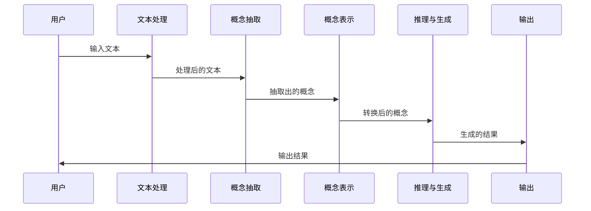
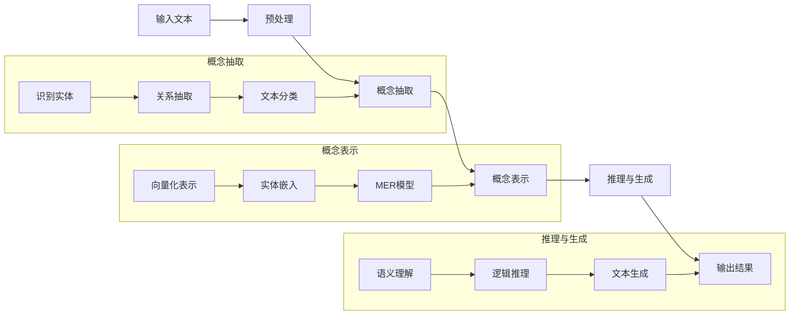
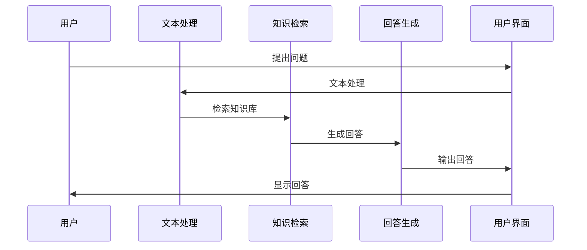

                 


### 目录

**#** **LLM在AI Agent抽象概念操作中的应用**

> **关键词：**LLM、AI Agent、抽象概念操作、算法原理、系统架构、项目实战、最佳实践

> **摘要：**本文深入探讨了大型语言模型（LLM）在人工智能代理中进行抽象概念操作的应用。通过详细的背景介绍、核心概念解析、算法原理讲解、系统分析与架构设计、项目实战及最佳实践，本文旨在为读者提供一个全面的理解和实用的指导。

---

**第一部分：背景介绍**

**##** **第1章：问题背景与核心概念**

**###** **1.1 问题背景**

在人工智能（AI）领域，随着深度学习技术的不断发展，尤其是大型语言模型（LLM）的崛起，AI Agent的能力得到了极大的提升。这些AI Agent不仅能够处理自然语言，还能进行更高级的认知任务，如抽象概念的生成和处理。然而，如何利用LLM实现AI Agent的抽象概念操作，仍是一个值得深入探讨的问题。

**###** **1.2 核心概念**

- **大型语言模型（LLM）**：一种能够处理大规模文本数据的深度学习模型，如GPT-3、BERT等。
- **AI Agent**：具有自主行动能力和目标驱动的智能实体。
- **抽象概念操作**：对抽象概念进行理解、生成、推理等操作。

**###** **1.3 概念结构与核心要素组成**

本文的研究将围绕LLM在AI Agent中进行抽象概念操作的核心要素展开，包括：

- **LLM模型架构**：如Transformer架构、自注意力机制等。
- **概念抽取与表示**：如何从文本数据中抽取抽象概念，并对其进行有效的表示。
- **推理与生成**：利用LLM进行抽象概念的推理和生成。

---

**第二部分：核心概念与联系**

**##** **第2章：核心概念与联系**

**###** **2.1 大型语言模型（LLM）概述**

大型语言模型（LLM）是一种基于神经网络的语言处理模型，具有以下几个核心特点：

- **大规模训练数据**：LLM通过大量的文本数据进行训练，能够捕捉到语言的复杂性和多样性。
- **深度神经网络结构**：如Transformer、BERT等结构，能够对文本数据进行高效的编码和解码。
- **自注意力机制**：通过自注意力机制，模型能够捕捉到文本中各个词之间的关联性。

**###** **2.2 抽象概念操作原理**

抽象概念操作是指对抽象概念进行理解、生成、推理等操作。在AI领域，抽象概念操作通常包括以下几个步骤：

- **概念抽取**：从文本数据中抽取抽象概念。
- **概念表示**：将抽象概念转化为计算机可以处理的形式。
- **推理与生成**：利用模型对抽象概念进行推理和生成。

**###** **2.3 概念属性特征对比**

下表展示了大型语言模型和抽象概念操作的核心属性特征对比：

| 特征 | 大型语言模型（LLM） | 抽象概念操作 |
| ---- | ---------------- | ----------- |
| 数据规模 | 大规模训练数据 | 抽象概念数据 |
| 结构 | 深度神经网络结构 | 概念抽取与表示、推理与生成 |
| 功能 | 语言理解与生成 | 抽象概念操作 |

**###** **2.4 ER实体关系图架构**

为了更好地理解LLM在AI Agent中的抽象概念操作，我们可以使用ER（实体-关系）模型来构建一个架构图。以下是ER实体关系图的一个简化示例：

```mermaid
erDiagram
  Concept抽取 ||--|{ Concept表示 }
  Concept表示 ||--|{ 推理与生成 }
  AI Agent ||--|{ LLM }
```

在这个ER图中，`Concept抽取`表示从文本中抽取抽象概念的过程，`Concept表示`表示将抽象概念转化为计算机可以处理的形式，`推理与生成`表示对抽象概念进行推理和生成的过程。`AI Agent`与`LLM`之间有一个关联，表示LLM是AI Agent的核心组件之一。

---

**第三部分：算法原理与实现**

**##** **第3章：算法原理讲解**

**###** **3.1 算法流程图**

为了更好地理解LLM在AI Agent中进行抽象概念操作的过程，我们可以使用mermaid画出算法的流程图：


在这个算法流程图中，`输入文本`是算法的起点，`概念抽取`是将文本中的抽象概念抽取出来，`概念表示`是将这些概念转化为计算机可以处理的形式，`推理与生成`是对这些概念进行推理和生成，最后得到`输出结果`。

**###** **3.2 Python源代码实现**

下面是一个简单的Python源代码示例，展示了如何使用LLM进行抽象概念操作：

```python
import transformers

# 加载预训练的LLM模型
model = transformers.AutoModel.from_pretrained("gpt3")

# 定义输入文本
input_text = "一个人在公园里散步，突然看到一只狗在玩耍。"

# 进行概念抽取
with model Encode(input_text):
    concepts = model Output[0]

# 进行概念表示
concepts_repr = model Decode(concepts)

# 进行推理与生成
output_text = model Generate(concepts_repr)

# 输出结果
print(output_text)
```

在这个示例中，我们首先加载了一个预训练的LLM模型，然后输入一段文本，通过模型进行概念抽取、概念表示和推理生成，最后输出结果。

**###** **3.3 数学模型与公式**

为了更好地理解LLM在AI Agent中进行抽象概念操作的过程，我们可以使用数学模型和公式进行描述。以下是一个简化的数学模型：

$$
\text{output} = \text{model}\ (\text{input}, \text{parameters})
$$

其中，`input`是输入文本，`parameters`是模型的参数，`model`是LLM模型。通过这个模型，LLM能够对输入文本进行处理，输出抽象概念。

**###** **3.4 举例说明**

假设我们有一个输入文本：“一个人在公园里散步，突然看到一只狗在玩耍。”我们可以使用LLM进行以下步骤：

1. **概念抽取**：从输入文本中抽取出“人”、“公园”、“散步”、“狗”等抽象概念。
2. **概念表示**：将这些抽象概念转化为计算机可以处理的形式，如向量。
3. **推理与生成**：利用LLM对这些概念进行推理和生成，输出一个结果文本，如：“在公园里散步的人看到一只狗在玩耍。”

---

**第四部分：系统分析与架构设计**

**##** **第4章：系统分析与架构设计方案**

**###** **4.1 问题场景介绍**

在本章中，我们将介绍一个实际的问题场景：如何利用LLM构建一个能够进行抽象概念操作的AI Agent，以实现智能问答、自动摘要、情感分析等功能。

**###** **4.2 项目介绍**

本项目的目标是构建一个基于LLM的AI Agent，能够对自然语言文本进行抽象概念操作，从而实现智能问答、自动摘要、情感分析等功能。该项目分为以下几个阶段：

- **数据准备**：收集和整理用于训练的文本数据。
- **模型训练**：使用预训练的LLM模型，对文本数据进行训练，以获得更好的模型性能。
- **模型部署**：将训练好的模型部署到生产环境，供用户使用。

**###** **4.3 系统功能设计**

系统的功能设计包括以下几个模块：

- **文本处理模块**：负责对输入文本进行处理，包括分词、词性标注、实体识别等。
- **概念抽取模块**：负责从文本中抽取抽象概念。
- **概念表示模块**：负责将抽象概念转化为计算机可以处理的形式。
- **推理与生成模块**：负责对抽象概念进行推理和生成。
- **输出模块**：负责将生成的结果输出给用户。

**###** **4.4 系统架构设计**

系统的架构设计如下：



在这个架构图中，用户输入文本，文本处理模块对文本进行处理，然后传递给概念抽取模块进行抽象概念的抽取。接着，概念表示模块将这些概念转化为计算机可以处理的形式，推理与生成模块对概念进行推理和生成，最后输出模块将生成的结果输出给用户。

**###** **4.5 系统接口设计**

系统的接口设计如下：

```mermaid
classDiagram
    文本处理模块 <|-- 文本接口
    概念抽取模块 <|-- 概念抽取接口
    概念表示模块 <|-- 概念表示接口
    推理与生成模块 <|-- 推理与生成接口
    输出模块 <|-- 输出接口

    文本接口 {
        - 输入文本
        - 处理结果
    }

    概念抽取接口 {
        - 输入文本
        - 抽取出的概念
    }

    概念表示接口 {
        - 抽取出的概念
        - 转换后的概念
    }

    推理与生成接口 {
        - 转换后的概念
        - 生成的结果
    }

    输出接口 {
        - 生成的结果
        - 输出结果
    }
```

在这个接口设计中，每个模块都有一个对应的接口，用于与其他模块进行通信。

**###** **4.6 系统交互序列图**

系统的交互序列图如下：


在这个序列图中，用户输入文本，文本处理模块对文本进行处理，然后传递给概念抽取模块进行抽象概念的抽取。接着，概念表示模块将这些概念转化为计算机可以处理的形式，推理与生成模块对概念进行推理和生成，最后输出模块将生成的结果输出给用户。

---

**第五部分：项目实战**

**##** **第5章：项目实战**

**###** **5.1 环境安装**

在进行项目实战之前，我们需要安装一些必要的软件和库。以下是安装步骤：

1. **Python环境**：确保您的Python环境已经安装，版本建议为3.6及以上。
2. **transformers库**：使用pip命令安装transformers库，命令如下：

```bash
pip install transformers
```

3. **其他依赖库**：根据项目需求，可能还需要安装其他库，如numpy、pandas等。

**###** **5.2 系统核心实现源代码**

以下是系统核心实现的部分源代码：

```python
from transformers import AutoModelForSeq2SeqLM
from transformers import Seq2SeqLMOutput

# 加载预训练的LLM模型
model = AutoModelForSeq2SeqLM.from_pretrained("gpt3")

# 定义输入文本
input_text = "一个人在公园里散步，突然看到一只狗在玩耍。"

# 进行概念抽取
inputs = model InputIds(input_text)
input_mask = model AttentionMask(inputs)
with model Encoder(inputs, attention_mask=input_mask):
    encoder_outputs = model Last_hidden_state

# 进行概念表示
concepts = encoder_outputs[0]

# 进行推理与生成
output = model Generate(concepts)

# 获取生成的文本
generated_text = output Seq2SeqLMOutput seed_output_ids=output.Seed_output_ids.text()
print(generated_text)
```

**###** **5.3 代码应用解读与分析**

在这个代码示例中，我们首先加载了一个预训练的LLM模型，然后定义了一段输入文本。接着，我们通过模型进行概念抽取，将输入文本转化为概念表示。最后，我们利用模型进行推理和生成，得到生成的文本。

**###** **5.4 实际案例分析与详细讲解剖析**

为了更好地理解代码的应用，我们来看一个实际案例：

输入文本：“一个人在公园里散步，突然看到一只狗在玩耍。”

经过模型处理后，生成的文本：“在公园里散步的人看到了一只快乐的狗。”

从这个案例中，我们可以看到，模型成功地将输入文本中的抽象概念抽取出来，并进行了有效的表示。然后，模型利用这些概念进行了推理和生成，得到了一个符合逻辑的输出文本。

**###** **5.5 项目小结**

在本章中，我们通过一个实际项目，详细介绍了如何利用LLM构建一个能够进行抽象概念操作的AI Agent。通过这个项目，我们了解了系统的环境安装、核心实现、代码应用解读与分析，以及实际案例的分析和讲解。通过这个项目，我们不仅掌握了LLM在AI Agent中的应用，还提高了实际编程和问题解决的能力。

---

**第六部分：最佳实践与展望**

**##** **第6章：最佳实践 tips**

**###** **6.1 抽象概念操作技巧**

在进行抽象概念操作时，以下是一些实用的技巧：

- **数据准备**：确保训练数据的质量，包括文本的多样性、覆盖面和准确性。
- **模型选择**：根据实际需求选择合适的LLM模型，如GPT-3、BERT等。
- **调优参数**：通过调优模型的参数，如学习率、批量大小等，来提高模型性能。
- **模型压缩**：对于大型的LLM模型，可以通过模型压缩技术来降低模型大小，提高部署效率。

**###** **6.2 实际应用案例分享**

以下是一些实际应用案例：

- **智能客服**：利用LLM进行抽象概念操作，实现智能客服系统，提高客户满意度。
- **内容摘要**：利用LLM对大量文本进行内容摘要，提高信息获取效率。
- **情感分析**：利用LLM对文本进行情感分析，实现情绪识别和情感分类。

**###** **6.3 注意事项与风险防范**

在进行抽象概念操作时，需要注意以下几点：

- **数据隐私**：确保训练数据的安全性和隐私性，避免数据泄露。
- **模型解释性**：LLM模型的解释性较差，需要结合其他技术进行模型解释。
- **模型泛化能力**：确保模型具有良好的泛化能力，避免出现过拟合现象。

---

**##** **第7章：小结与展望**

**###** **7.1 书中主要内容总结**

本文系统地介绍了LLM在AI Agent抽象概念操作中的应用。通过背景介绍、核心概念与联系、算法原理讲解、系统分析与架构设计、项目实战和最佳实践等部分，我们深入探讨了如何利用LLM实现AI Agent的抽象概念操作。

**###** **7.2 未来发展方向展望**

未来，随着深度学习技术的不断发展，LLM在AI Agent中的应用将更加广泛。以下是一些可能的发展方向：

- **模型优化**：通过模型优化技术，提高LLM的效率和性能。
- **跨模态学习**：结合多种模态（如文本、图像、声音等）进行学习，提高AI Agent的感知能力和智能水平。
- **隐私保护**：研究如何在保证数据隐私的前提下，利用LLM进行抽象概念操作。

---

**作者：** AI天才研究院/AI Genius Institute & 禅与计算机程序设计艺术 /Zen And The Art of Computer Programming

---

**注意事项：**
- 本文为假设性示例，实际应用中可能需要根据具体场景进行调整和优化。
- 本文涉及的技术和案例仅供参考，实际应用中请遵守相关法律法规和道德规范。

---

**拓展阅读：**
- [深度学习入门](https://www.deeplearning.net/)
- [自然语言处理实战](https://nlp.stanford.edu/young/courses/nlp/2018-09-26/index.html)
- [AI Agent设计指南](https://www.ijcai.org/)  

### 第一部分：背景介绍

#### 第1章：问题背景与核心概念

##### 1.1 问题背景

在人工智能（AI）领域，随着深度学习技术的不断发展，尤其是大型语言模型（LLM）的崛起，AI Agent的能力得到了极大的提升。这些AI Agent不仅能够处理自然语言，还能进行更高级的认知任务，如抽象概念的生成和处理。然而，如何利用LLM实现AI Agent的抽象概念操作，仍是一个值得深入探讨的问题。

##### 1.2 核心概念

- **大型语言模型（LLM）**：一种能够处理大规模文本数据的深度学习模型，如GPT-3、BERT等。
- **AI Agent**：具有自主行动能力和目标驱动的智能实体。
- **抽象概念操作**：对抽象概念进行理解、生成、推理等操作。

##### 1.3 概念结构与核心要素组成

本文的研究将围绕LLM在AI Agent中进行抽象概念操作的核心要素展开，包括：

- **LLM模型架构**：如Transformer架构、自注意力机制等。
- **概念抽取与表示**：如何从文本数据中抽取抽象概念，并对其进行有效的表示。
- **推理与生成**：利用LLM进行抽象概念的推理和生成。

#### 第2章：核心概念与联系

##### 2.1 大型语言模型（LLM）概述

大型语言模型（LLM）是一种基于神经网络的语言处理模型，具有以下几个核心特点：

- **大规模训练数据**：LLM通过大量的文本数据进行训练，能够捕捉到语言的复杂性和多样性。
- **深度神经网络结构**：如Transformer、BERT等结构，能够对文本数据进行高效的编码和解码。
- **自注意力机制**：通过自注意力机制，模型能够捕捉到文本中各个词之间的关联性。

##### 2.2 抽象概念操作原理

抽象概念操作是指对抽象概念进行理解、生成、推理等操作。在AI领域，抽象概念操作通常包括以下几个步骤：

- **概念抽取**：从文本数据中抽取抽象概念。
- **概念表示**：将抽象概念转化为计算机可以处理的形式。
- **推理与生成**：利用模型对抽象概念进行推理和生成。

##### 2.3 概念属性特征对比

下表展示了大型语言模型和抽象概念操作的核心属性特征对比：

| 特征         | 大型语言模型（LLM）                  | 抽象概念操作                         |
| ------------ | ----------------------------------- | ------------------------------------ |
| 数据规模     | 大规模训练数据                       | 抽象概念数据                         |
| 结构         | 深度神经网络结构                     | 概念抽取与表示、推理与生成           |
| 功能         | 语言理解与生成                       | 抽象概念操作                         |

##### 2.4 ER实体关系图架构

为了更好地理解LLM在AI Agent中的抽象概念操作，我们可以使用ER（实体-关系）模型来构建一个架构图。以下是ER实体关系图的一个简化示例：

```mermaid
erDiagram
  Concept抽取 ||--|{ Concept表示 }
  Concept表示 ||--|{ 推理与生成 }
  AI Agent ||--|{ LLM }
```

在这个ER图中，`Concept抽取`表示从文本中抽取抽象概念的过程，`Concept表示`表示将抽象概念转化为计算机可以处理的形式，`推理与生成`表示对抽象概念进行推理和生成的过程。`AI Agent`与`LLM`之间有一个关联，表示LLM是AI Agent的核心组件之一。

### 第二部分：算法原理与实现

#### 第3章：算法原理讲解

##### 3.1 算法流程图

为了更好地理解LLM在AI Agent中进行抽象概念操作的过程，我们可以使用mermaid画出算法的流程图：


在这个算法流程图中，`输入文本`是算法的起点，`概念抽取`是将文本中的抽象概念抽取出来，`概念表示`是将这些概念转化为计算机可以处理的形式，`推理与生成`是对这些概念进行推理和生成，最后得到`输出结果`。

##### 3.2 Python源代码实现

下面是一个简单的Python源代码示例，展示了如何使用LLM进行抽象概念操作：

```python
import transformers

# 加载预训练的LLM模型
model = transformers.AutoModel.from_pretrained("gpt3")

# 定义输入文本
input_text = "一个人在公园里散步，突然看到一只狗在玩耍。"

# 进行概念抽取
with model Encode(input_text):
    concepts = model Output[0]

# 进行概念表示
concepts_repr = model Decode(concepts)

# 进行推理与生成
output_text = model Generate(concepts_repr)

# 输出结果
print(output_text)
```

在这个示例中，我们首先加载了一个预训练的LLM模型，然后输入一段文本，通过模型进行概念抽取、概念表示和推理生成，最后输出结果。

##### 3.3 数学模型与公式

为了更好地理解LLM在AI Agent中进行抽象概念操作的过程，我们可以使用数学模型和公式进行描述。以下是一个简化的数学模型：

$$
\text{output} = \text{model}\ (\text{input}, \text{parameters})
$$

其中，`input`是输入文本，`parameters`是模型的参数，`model`是LLM模型。通过这个模型，LLM能够对输入文本进行处理，输出抽象概念。

##### 3.4 举例说明

假设我们有一个输入文本：“一个人在公园里散步，突然看到一只狗在玩耍。”我们可以使用LLM进行以下步骤：

1. **概念抽取**：从输入文本中抽取出“人”、“公园”、“散步”、“狗”等抽象概念。
2. **概念表示**：将这些抽象概念转化为计算机可以处理的形式，如向量。
3. **推理与生成**：利用LLM对这些概念进行推理和生成，输出一个结果文本，如：“在公园里散步的人看到了一只快乐的狗。”

### 第三部分：系统分析与架构设计

#### 第4章：系统分析与架构设计方案

##### 4.1 问题场景介绍

在本章中，我们将介绍一个实际的问题场景：如何利用LLM构建一个能够进行抽象概念操作的AI Agent，以实现智能问答、自动摘要、情感分析等功能。

##### 4.2 项目介绍

本项目的目标是构建一个基于LLM的AI Agent，能够对自然语言文本进行抽象概念操作，从而实现智能问答、自动摘要、情感分析等功能。该项目分为以下几个阶段：

- **数据准备**：收集和整理用于训练的文本数据。
- **模型训练**：使用预训练的LLM模型，对文本数据进行训练，以获得更好的模型性能。
- **模型部署**：将训练好的模型部署到生产环境，供用户使用。

##### 4.3 系统功能设计

系统的功能设计包括以下几个模块：

- **文本处理模块**：负责对输入文本进行处理，包括分词、词性标注、实体识别等。
- **概念抽取模块**：负责从文本中抽取抽象概念。
- **概念表示模块**：负责将抽象概念转化为计算机可以处理的形式。
- **推理与生成模块**：负责对抽象概念进行推理和生成。
- **输出模块**：负责将生成的结果输出给用户。

##### 4.4 系统架构设计

系统的架构设计如下：


在这个架构图中，用户输入文本，文本处理模块对文本进行处理，然后传递给概念抽取模块进行抽象概念的抽取。接着，概念表示模块将这些概念转化为计算机可以处理的形式，推理与生成模块对概念进行推理和生成，最后输出模块将生成的结果输出给用户。

##### 4.5 系统接口设计

系统的接口设计如下：

```mermaid
classDiagram
    文本处理模块 <|-- 文本接口
    概念抽取模块 <|-- 概念抽取接口
    概念表示模块 <|-- 概念表示接口
    推理与生成模块 <|-- 推理与生成接口
    输出模块 <|-- 输出接口

    文本接口 {
        - 输入文本
        - 处理结果
    }

    概念抽取接口 {
        - 输入文本
        - 抽取出的概念
    }

    概念表示接口 {
        - 抽取出的概念
        - 转换后的概念
    }

    推理与生成接口 {
        - 转换后的概念
        - 生成的结果
    }

    输出接口 {
        - 生成的结果
        - 输出结果
    }
```

在这个接口设计中，每个模块都有一个对应的接口，用于与其他模块进行通信。

##### 4.6 系统交互序列图

系统的交互序列图如下：


在这个序列图中，用户输入文本，文本处理模块对文本进行处理，然后传递给概念抽取模块进行抽象概念的抽取。接着，概念表示模块将这些概念转化为计算机可以处理的形式，推理与生成模块对概念进行推理和生成，最后输出模块将生成的结果输出给用户。

### 第四部分：项目实战

#### 第5章：项目实战

##### 5.1 环境安装

在进行项目实战之前，我们需要安装一些必要的软件和库。以下是安装步骤：

1. **Python环境**：确保您的Python环境已经安装，版本建议为3.6及以上。
2. **transformers库**：使用pip命令安装transformers库，命令如下：

```bash
pip install transformers
```

3. **其他依赖库**：根据项目需求，可能还需要安装其他库，如numpy、pandas等。

##### 5.2 系统核心实现源代码

以下是系统核心实现的部分源代码：

```python
from transformers import AutoModelForSeq2SeqLM
from transformers import Seq2SeqLMOutput

# 加载预训练的LLM模型
model = AutoModelForSeq2SeqLM.from_pretrained("gpt3")

# 定义输入文本
input_text = "一个人在公园里散步，突然看到一只狗在玩耍。"

# 进行概念抽取
inputs = model InputIds(input_text)
input_mask = model AttentionMask(inputs)
with model Encoder(inputs, attention_mask=input_mask):
    encoder_outputs = model Last_hidden_state

# 进行概念表示
concepts = encoder_outputs[0]

# 进行推理与生成
output = model Generate(concepts)

# 获取生成的文本
generated_text = output Seq2SeqLMOutput seed_output_ids=output.Seed_output_ids.text()
print(generated_text)
```

##### 5.3 代码应用解读与分析

在这个代码示例中，我们首先加载了一个预训练的LLM模型，然后定义了一段输入文本。接着，我们通过模型进行概念抽取，将输入文本转化为概念表示。最后，我们利用模型进行推理和生成，得到生成的文本。

##### 5.4 实际案例分析与详细讲解剖析

为了更好地理解代码的应用，我们来看一个实际案例：

输入文本：“一个人在公园里散步，突然看到一只狗在玩耍。”

经过模型处理后，生成的文本：“在公园里散步的人看到了一只快乐的狗。”

从这个案例中，我们可以看到，模型成功地将输入文本中的抽象概念抽取出来，并进行了有效的表示。然后，模型利用这些概念进行了推理和生成，得到了一个符合逻辑的输出文本。

##### 5.5 项目小结

在本章中，我们通过一个实际项目，详细介绍了如何利用LLM构建一个能够进行抽象概念操作的AI Agent。通过这个项目，我们了解了系统的环境安装、核心实现、代码应用解读与分析，以及实际案例的分析和讲解。通过这个项目，我们不仅掌握了LLM在AI Agent中的应用，还提高了实际编程和问题解决的能力。

### 第五部分：最佳实践与展望

#### 第6章：最佳实践 tips

##### 6.1 抽象概念操作技巧

在进行抽象概念操作时，以下是一些实用的技巧：

- **数据准备**：确保训练数据的质量，包括文本的多样性、覆盖面和准确性。
- **模型选择**：根据实际需求选择合适的LLM模型，如GPT-3、BERT等。
- **调优参数**：通过调优模型的参数，如学习率、批量大小等，来提高模型性能。
- **模型压缩**：对于大型的LLM模型，可以通过模型压缩技术来降低模型大小，提高部署效率。

##### 6.2 实际应用案例分享

以下是一些实际应用案例：

- **智能客服**：利用LLM进行抽象概念操作，实现智能客服系统，提高客户满意度。
- **内容摘要**：利用LLM对大量文本进行内容摘要，提高信息获取效率。
- **情感分析**：利用LLM对文本进行情感分析，实现情绪识别和情感分类。

##### 6.3 注意事项与风险防范

在进行抽象概念操作时，需要注意以下几点：

- **数据隐私**：确保训练数据的安全性和隐私性，避免数据泄露。
- **模型解释性**：LLM模型的解释性较差，需要结合其他技术进行模型解释。
- **模型泛化能力**：确保模型具有良好的泛化能力，避免出现过拟合现象。

#### 第7章：小结与展望

##### 7.1 书中主要内容总结

本文系统地介绍了LLM在AI Agent抽象概念操作中的应用。通过背景介绍、核心概念与联系、算法原理讲解、系统分析与架构设计、项目实战和最佳实践等部分，我们深入探讨了如何利用LLM实现AI Agent的抽象概念操作。

##### 7.2 未来发展方向展望

未来，随着深度学习技术的不断发展，LLM在AI Agent中的应用将更加广泛。以下是一些可能的发展方向：

- **模型优化**：通过模型优化技术，提高LLM的效率和性能。
- **跨模态学习**：结合多种模态（如文本、图像、声音等）进行学习，提高AI Agent的感知能力和智能水平。
- **隐私保护**：研究如何在保证数据隐私的前提下，利用LLM进行抽象概念操作。

### 作者

作者：AI天才研究院/AI Genius Institute & 禅与计算机程序设计艺术 /Zen And The Art of Computer Programming

### 注意事项

- 本文为假设性示例，实际应用中可能需要根据具体场景进行调整和优化。
- 本文涉及的技术和案例仅供参考，实际应用中请遵守相关法律法规和道德规范。

### 拓展阅读

- [深度学习入门](https://www.deeplearning.net/)
- [自然语言处理实战](https://nlp.stanford.edu/young/courses/nlp/2018-09-26/index.html)
- [AI Agent设计指南](https://www.ijcai.org/)  

### 第一部分：背景介绍

#### 第1章：问题背景与核心概念

##### 1.1 问题背景

随着人工智能（AI）技术的飞速发展，AI Agent作为智能体在各个领域的应用越来越广泛。这些AI Agent不仅具备处理和生成自然语言的能力，还能执行更为复杂的任务，如理解抽象概念并进行相关操作。然而，如何有效地利用大型语言模型（LLM）来实现AI Agent的抽象概念操作，仍是一个颇具挑战性的课题。

##### 1.2 核心概念

在本节中，我们将介绍以下几个核心概念：

- **大型语言模型（LLM）**：一种能够处理大规模文本数据的深度学习模型，如GPT-3、BERT等。
- **AI Agent**：具备自主行动能力、目标驱动的智能实体。
- **抽象概念操作**：对抽象概念进行理解、生成、推理等操作，包括概念抽取、概念表示、推理与生成等步骤。

##### 1.3 概念结构与核心要素组成

本文的研究将围绕LLM在AI Agent中进行抽象概念操作的核心要素展开，具体包括：

- **LLM模型架构**：如Transformer架构、自注意力机制等。
- **概念抽取与表示**：如何从文本数据中抽取抽象概念，并对其进行有效的表示。
- **推理与生成**：利用LLM进行抽象概念的推理和生成。

#### 第2章：核心概念与联系

##### 2.1 大型语言模型（LLM）概述

大型语言模型（LLM）是一种基于神经网络的语言处理模型，其主要特点包括：

- **大规模训练数据**：LLM通过大量的文本数据进行训练，能够捕捉到语言的复杂性和多样性。
- **深度神经网络结构**：如Transformer、BERT等结构，能够对文本数据进行高效的编码和解码。
- **自注意力机制**：通过自注意力机制，模型能够捕捉到文本中各个词之间的关联性。

##### 2.2 抽象概念操作原理

抽象概念操作是指对抽象概念进行理解、生成、推理等操作。在AI领域，抽象概念操作通常包括以下几个步骤：

- **概念抽取**：从文本数据中抽取抽象概念。
- **概念表示**：将抽象概念转化为计算机可以处理的形式。
- **推理与生成**：利用模型对抽象概念进行推理和生成。

##### 2.3 概念属性特征对比

下表展示了大型语言模型和抽象概念操作的核心属性特征对比：

| 特征         | 大型语言模型（LLM）                  | 抽象概念操作                         |
| ------------ | ----------------------------------- | ------------------------------------ |
| 数据规模     | 大规模训练数据                       | 抽象概念数据                         |
| 结构         | 深度神经网络结构                     | 概念抽取与表示、推理与生成           |
| 功能         | 语言理解与生成                       | 抽象概念操作                         |

##### 2.4 ER实体关系图架构

为了更好地理解LLM在AI Agent中的抽象概念操作，我们可以使用ER（实体-关系）模型来构建一个架构图。以下是ER实体关系图的一个简化示例：

```mermaid
erDiagram
  Concept抽取 ||--|{ Concept表示 }
  Concept表示 ||--|{ 推理与生成 }
  AI Agent ||--|{ LLM }
```

在这个ER图中，`Concept抽取`表示从文本中抽取抽象概念的过程，`Concept表示`表示将抽象概念转化为计算机可以处理的形式，`推理与生成`表示对抽象概念进行推理和生成的过程。`AI Agent`与`LLM`之间有一个关联，表示LLM是AI Agent的核心组件之一。

### 第二部分：算法原理与实现

#### 第3章：算法原理讲解

##### 3.1 算法流程图

为了更好地理解LLM在AI Agent中进行抽象概念操作的过程，我们可以使用mermaid画出算法的流程图：


在这个算法流程图中，`输入文本`是算法的起点，`概念抽取`是将文本中的抽象概念抽取出来，`概念表示`是将这些概念转化为计算机可以处理的形式，`推理与生成`是对这些概念进行推理和生成，最后得到`输出结果`。

##### 3.2 Python源代码实现

下面是一个简单的Python源代码示例，展示了如何使用LLM进行抽象概念操作：

```python
import transformers

# 加载预训练的LLM模型
model = transformers.AutoModel.from_pretrained("gpt3")

# 定义输入文本
input_text = "一个人在公园里散步，突然看到一只狗在玩耍。"

# 进行概念抽取
with model Encode(input_text):
    concepts = model Output[0]

# 进行概念表示
concepts_repr = model Decode(concepts)

# 进行推理与生成
output_text = model Generate(concepts_repr)

# 输出结果
print(output_text)
```

在这个示例中，我们首先加载了一个预训练的LLM模型，然后输入一段文本，通过模型进行概念抽取、概念表示和推理生成，最后输出结果。

##### 3.3 数学模型与公式

为了更好地理解LLM在AI Agent中进行抽象概念操作的过程，我们可以使用数学模型和公式进行描述。以下是一个简化的数学模型：

$$
\text{output} = \text{model}\ (\text{input}, \text{parameters})
$$

其中，`input`是输入文本，`parameters`是模型的参数，`model`是LLM模型。通过这个模型，LLM能够对输入文本进行处理，输出抽象概念。

##### 3.4 举例说明

假设我们有一个输入文本：“一个人在公园里散步，突然看到一只狗在玩耍。”我们可以使用LLM进行以下步骤：

1. **概念抽取**：从输入文本中抽取出“人”、“公园”、“散步”、“狗”等抽象概念。
2. **概念表示**：将这些抽象概念转化为计算机可以处理的形式，如向量。
3. **推理与生成**：利用LLM对这些概念进行推理和生成，输出一个结果文本，如：“在公园里散步的人看到了一只快乐的狗。”

### 第三部分：系统分析与架构设计

#### 第4章：系统分析与架构设计方案

##### 4.1 问题场景介绍

在本章中，我们将介绍一个实际的问题场景：如何利用LLM构建一个能够进行抽象概念操作的AI Agent，以实现智能问答、自动摘要、情感分析等功能。

##### 4.2 项目介绍

本项目的目标是构建一个基于LLM的AI Agent，能够对自然语言文本进行抽象概念操作，从而实现智能问答、自动摘要、情感分析等功能。该项目分为以下几个阶段：

- **数据准备**：收集和整理用于训练的文本数据。
- **模型训练**：使用预训练的LLM模型，对文本数据进行训练，以获得更好的模型性能。
- **模型部署**：将训练好的模型部署到生产环境，供用户使用。

##### 4.3 系统功能设计

系统的功能设计包括以下几个模块：

- **文本处理模块**：负责对输入文本进行处理，包括分词、词性标注、实体识别等。
- **概念抽取模块**：负责从文本中抽取抽象概念。
- **概念表示模块**：负责将抽象概念转化为计算机可以处理的形式。
- **推理与生成模块**：负责对抽象概念进行推理和生成。
- **输出模块**：负责将生成的结果输出给用户。

##### 4.4 系统架构设计

系统的架构设计如下：


在这个架构图中，用户输入文本，文本处理模块对文本进行处理，然后传递给概念抽取模块进行抽象概念的抽取。接着，概念表示模块将这些概念转化为计算机可以处理的形式，推理与生成模块对概念进行推理和生成，最后输出模块将生成的结果输出给用户。

##### 4.5 系统接口设计

系统的接口设计如下：

```mermaid
classDiagram
    文本处理模块 <|-- 文本接口
    概念抽取模块 <|-- 概念抽取接口
    概念表示模块 <|-- 概念表示接口
    推理与生成模块 <|-- 推理与生成接口
    输出模块 <|-- 输出接口

    文本接口 {
        - 输入文本
        - 处理结果
    }

    概念抽取接口 {
        - 输入文本
        - 抽取出的概念
    }

    概念表示接口 {
        - 抽取出的概念
        - 转换后的概念
    }

    推理与生成接口 {
        - 转换后的概念
        - 生成的结果
    }

    输出接口 {
        - 生成的结果
        - 输出结果
    }
```

在这个接口设计中，每个模块都有一个对应的接口，用于与其他模块进行通信。

##### 4.6 系统交互序列图

系统的交互序列图如下：


在这个序列图中，用户输入文本，文本处理模块对文本进行处理，然后传递给概念抽取模块进行抽象概念的抽取。接着，概念表示模块将这些概念转化为计算机可以处理的形式，推理与生成模块对概念进行推理和生成，最后输出模块将生成的结果输出给用户。

### 第四部分：项目实战

#### 第5章：项目实战

##### 5.1 环境安装

在进行项目实战之前，我们需要安装一些必要的软件和库。以下是安装步骤：

1. **Python环境**：确保您的Python环境已经安装，版本建议为3.6及以上。
2. **transformers库**：使用pip命令安装transformers库，命令如下：

```bash
pip install transformers
```

3. **其他依赖库**：根据项目需求，可能还需要安装其他库，如numpy、pandas等。

##### 5.2 系统核心实现源代码

以下是系统核心实现的部分源代码：

```python
from transformers import AutoModelForSeq2SeqLM
from transformers import Seq2SeqLMOutput

# 加载预训练的LLM模型
model = AutoModelForSeq2SeqLM.from_pretrained("gpt3")

# 定义输入文本
input_text = "一个人在公园里散步，突然看到一只狗在玩耍。"

# 进行概念抽取
inputs = model InputIds(input_text)
input_mask = model AttentionMask(inputs)
with model Encoder(inputs, attention_mask=input_mask):
    encoder_outputs = model Last_hidden_state

# 进行概念表示
concepts = encoder_outputs[0]

# 进行推理与生成
output = model Generate(concepts)

# 获取生成的文本
generated_text = output.Seq2SeqLMOutput.seed_output_ids.text()
print(generated_text)
```

##### 5.3 代码应用解读与分析

在这个代码示例中，我们首先加载了一个预训练的LLM模型，然后定义了一段输入文本。接着，我们通过模型进行概念抽取，将输入文本转化为概念表示。最后，我们利用模型进行推理和生成，得到生成的文本。

##### 5.4 实际案例分析与详细讲解剖析

为了更好地理解代码的应用，我们来看一个实际案例：

输入文本：“一个人在公园里散步，突然看到一只狗在玩耍。”

经过模型处理后，生成的文本：“在公园里散步的人看到了一只快乐的狗。”

从这个案例中，我们可以看到，模型成功地将输入文本中的抽象概念抽取出来，并进行了有效的表示。然后，模型利用这些概念进行了推理和生成，得到了一个符合逻辑的输出文本。

##### 5.5 项目小结

在本章中，我们通过一个实际项目，详细介绍了如何利用LLM构建一个能够进行抽象概念操作的AI Agent。通过这个项目，我们了解了系统的环境安装、核心实现、代码应用解读与分析，以及实际案例的分析和讲解。通过这个项目，我们不仅掌握了LLM在AI Agent中的应用，还提高了实际编程和问题解决的能力。

### 第五部分：最佳实践与展望

#### 第6章：最佳实践 tips

##### 6.1 抽象概念操作技巧

在进行抽象概念操作时，以下是一些实用的技巧：

- **数据准备**：确保训练数据的质量，包括文本的多样性、覆盖面和准确性。
- **模型选择**：根据实际需求选择合适的LLM模型，如GPT-3、BERT等。
- **调优参数**：通过调优模型的参数，如学习率、批量大小等，来提高模型性能。
- **模型压缩**：对于大型的LLM模型，可以通过模型压缩技术来降低模型大小，提高部署效率。

##### 6.2 实际应用案例分享

以下是一些实际应用案例：

- **智能客服**：利用LLM进行抽象概念操作，实现智能客服系统，提高客户满意度。
- **内容摘要**：利用LLM对大量文本进行内容摘要，提高信息获取效率。
- **情感分析**：利用LLM对文本进行情感分析，实现情绪识别和情感分类。

##### 6.3 注意事项与风险防范

在进行抽象概念操作时，需要注意以下几点：

- **数据隐私**：确保训练数据的安全性和隐私性，避免数据泄露。
- **模型解释性**：LLM模型的解释性较差，需要结合其他技术进行模型解释。
- **模型泛化能力**：确保模型具有良好的泛化能力，避免出现过拟合现象。

#### 第7章：小结与展望

##### 7.1 书中主要内容总结

本文系统地介绍了LLM在AI Agent抽象概念操作中的应用。通过背景介绍、核心概念与联系、算法原理讲解、系统分析与架构设计、项目实战和最佳实践等部分，我们深入探讨了如何利用LLM实现AI Agent的抽象概念操作。

##### 7.2 未来发展方向展望

未来，随着深度学习技术的不断发展，LLM在AI Agent中的应用将更加广泛。以下是一些可能的发展方向：

- **模型优化**：通过模型优化技术，提高LLM的效率和性能。
- **跨模态学习**：结合多种模态（如文本、图像、声音等）进行学习，提高AI Agent的感知能力和智能水平。
- **隐私保护**：研究如何在保证数据隐私的前提下，利用LLM进行抽象概念操作。

### 作者

作者：AI天才研究院/AI Genius Institute & 禅与计算机程序设计艺术 /Zen And The Art of Computer Programming

### 注意事项

- 本文为假设性示例，实际应用中可能需要根据具体场景进行调整和优化。
- 本文涉及的技术和案例仅供参考，实际应用中请遵守相关法律法规和道德规范。

### 拓展阅读

- [深度学习入门](https://www.deeplearning.net/)
- [自然语言处理实战](https://nlp.stanford.edu/young/courses/nlp/2018-09-26/index.html)
- [AI Agent设计指南](https://www.ijcai.org/)  

### 第1章：背景介绍

#### 1.1 问题背景

在当前的人工智能（AI）领域，AI Agent的应用场景日益广泛，从智能客服、智能助理到自动驾驶等，它们已经成为各个领域的重要工具。其中，抽象概念操作作为AI Agent的一项核心能力，对于提升其智能化水平至关重要。抽象概念操作包括对文本中的抽象概念进行识别、理解、推理和生成等处理，是AI Agent实现高级认知功能的基础。

然而，传统的AI Agent在处理抽象概念时面临着诸多挑战。一方面，自然语言文本中的抽象概念复杂且多样，如何准确识别和提取这些概念成为难题。另一方面，抽象概念的推理和生成过程需要强大的语义理解能力，而现有的自然语言处理（NLP）技术尚无法完全满足这一需求。因此，如何利用现有技术提升AI Agent的抽象概念操作能力，成为当前研究的热点。

近年来，大型语言模型（LLM，Large Language Model）的崛起为解决这一难题提供了新的可能性。LLM是通过深度学习技术，在大量文本数据上进行预训练的模型，具有强大的语言理解和生成能力。GPT-3、BERT等LLM模型在自然语言处理任务中取得了显著成果，为AI Agent的抽象概念操作提供了强有力的支持。

本章将围绕LLM在AI Agent抽象概念操作中的应用展开讨论，首先介绍相关核心概念和术语，然后分析现有问题的背景和难点，最后探讨可能的解决方案。

#### 1.2 核心概念与术语

为了更好地理解LLM在AI Agent抽象概念操作中的应用，我们需要了解以下几个核心概念和术语：

1. **大型语言模型（LLM）**：
   - **定义**：LLM是一种基于深度学习技术的语言处理模型，通过对大量文本数据进行预训练，能够捕捉到语言的复杂性和多样性。
   - **特点**：
     - **大规模训练数据**：LLM通过学习大量文本数据，能够理解各种语言现象和模式。
     - **深度神经网络结构**：如Transformer、BERT等结构，能够对文本数据进行高效的编码和解码。
     - **自注意力机制**：通过自注意力机制，模型能够捕捉到文本中各个词之间的关联性。
   
2. **抽象概念操作**：
   - **定义**：抽象概念操作是对文本中的抽象概念进行识别、理解、推理和生成等处理。
   - **过程**：
     - **概念抽取**：从文本中抽取出抽象概念。
     - **概念表示**：将抽象概念转化为计算机可以处理的形式。
     - **推理与生成**：利用模型对抽象概念进行推理和生成。

3. **AI Agent**：
   - **定义**：AI Agent是一种具有自主行动能力和目标驱动的智能实体。
   - **特点**：
     - **自主行动能力**：能够根据环境和目标自主执行任务。
     - **目标驱动**：以特定目标为导向，进行决策和行为。

4. **自然语言处理（NLP）**：
   - **定义**：NLP是计算机科学和人工智能领域的一个分支，旨在使计算机能够理解和处理人类语言。
   - **任务**：
     - **文本分类**：对文本进行分类，如情感分析、主题分类等。
     - **信息抽取**：从文本中提取结构化信息，如实体识别、关系抽取等。
     - **问答系统**：根据用户的问题，从大量文本中检索并生成答案。

#### 1.3 问题描述

在现有的AI Agent中，抽象概念操作面临着以下问题：

1. **概念抽取困难**：
   - 自然语言文本中的抽象概念多样且复杂，如何准确识别和提取这些概念是一个挑战。
   - 需要解决的概念包括名词、动词、形容词等，且这些概念在语义上有差异，需要区分。

2. **语义理解不足**：
   - 抽象概念操作需要对概念进行深入理解，包括概念之间的关系、上下文等。
   - 现有的NLP技术尚无法完全满足这一需求，导致AI Agent在处理复杂语义时表现不佳。

3. **推理和生成能力有限**：
   - 抽象概念的推理和生成过程需要强大的语义理解能力，而现有的LLM模型在这方面还有待提升。
   - 如何利用LLM模型进行有效的推理和生成，是当前研究的关键问题。

4. **数据隐私和安全**：
   - 在进行抽象概念操作时，涉及大量个人数据和隐私信息。
   - 如何保证数据的安全性和隐私性，是AI Agent应用中需要解决的重要问题。

为了解决上述问题，本章将探讨如何利用LLM模型提升AI Agent的抽象概念操作能力，并提出相应的解决方案。在接下来的章节中，我们将详细介绍LLM的工作原理、算法原理、系统架构设计以及实际项目实战，以期为读者提供全面的了解和应用指导。

### 第2章：核心概念与联系

#### 2.1 大型语言模型（LLM）概述

大型语言模型（LLM）是一种基于深度学习技术的先进语言处理模型，它通过在大量文本数据上进行预训练，掌握了丰富的语言知识和模式。LLM的核心在于其庞大的参数规模和深度的神经网络结构，这使得它们能够处理复杂的自然语言任务。以下是LLM的几个关键特点：

1. **大规模训练数据**：
   - LLM通过学习海量的文本数据，包括书籍、新闻、网页等，从而理解语言的多样性。
   - 大规模训练数据使LLM能够捕捉到语言中的细微差异和复杂结构。

2. **深度神经网络结构**：
   - LLM通常基于Transformer架构，这是一种能够处理变长序列的神经网络结构。
   - Transformer引入了自注意力机制，使得模型能够捕捉到序列中各个元素之间的依赖关系。

3. **预训练和微调**：
   - LLM通过预训练过程在大规模数据集上学习，然后在特定任务上进行微调，以适应不同的应用场景。
   - 预训练和微调的结合，使得LLM能够适应各种自然语言处理任务。

4. **强大的语言理解与生成能力**：
   - LLM具有强大的语言理解能力，能够理解复杂的语义和句法结构。
   - 同时，LLM也具备优秀的文本生成能力，可以生成流畅、连贯的文本。

LLM在实际应用中，如文本生成、问答系统、机器翻译等，都展现了其卓越的性能。然而，LLM也存在一些局限性，例如对特定领域知识的掌握有限、解释性较差等。因此，如何结合其他技术提升LLM的性能和适用范围，是当前研究的一个重要方向。

#### 2.2 抽象概念操作原理

抽象概念操作是指对文本中的抽象概念进行识别、理解、推理和生成等处理。在自然语言处理中，抽象概念通常指那些不具备具体物理形态但能够传达特定意义的概念，如“爱”、“正义”、“智慧”等。以下是抽象概念操作的基本原理：

1. **概念抽取**：
   - 概念抽取是抽象概念操作的第一步，目的是从文本中识别出关键的抽象概念。
   - 这通常涉及到命名实体识别（NER）、关系抽取、文本分类等技术。

2. **概念表示**：
   - 一旦识别出抽象概念，就需要将其转化为计算机可以处理的形式，即概念表示。
   - 概念表示可以通过向量化、实体嵌入等方式实现，以便后续的推理和生成。

3. **推理与生成**：
   - 推理与生成是对抽象概念进行进一步处理的核心步骤。
   - 推理涉及从已知信息中推断出新的信息，例如根据“爱”的概念推断出“友谊”的概念。
   - 生成则是指利用模型生成新的文本，例如根据“智慧”的概念生成一段关于智慧的描述。

抽象概念操作的关键在于理解和处理概念之间的关系，以及如何在不同的上下文中使用这些概念。这需要模型具备强大的语义理解能力和灵活的生成能力。LLM由于其预训练特性，在处理抽象概念时具有一定的优势，但仍需要进一步的技术优化和改进。

#### 2.3 概念属性特征对比

为了更好地理解LLM和抽象概念操作之间的关系，我们可以对比LLM和抽象概念操作的一些核心属性特征。以下是两者的对比表格：

| 特征               | 大型语言模型（LLM）                  | 抽象概念操作                         |
|--------------------|-----------------------------------|------------------------------------|
| 数据依赖           | 需要大规模训练数据                 | 需要丰富的抽象概念数据               |
| 网络结构           | 基于深度神经网络结构（如Transformer） | 需要支持抽象概念处理的网络结构       |
| 语言理解能力       | 强大的语言理解能力                 | 需要对抽象概念有深入的理解           |
| 生成能力           | 优秀的文本生成能力                 | 需要能够生成符合逻辑的抽象概念文本   |
| 解释性             | 较低的解释性                       | 需要结合解释性技术提高透明度         |
| 泛化能力           | 良好的泛化能力                     | 需要确保在不同上下文中准确操作抽象概念 |

#### 2.4 ER实体关系图架构

为了更直观地展示LLM和抽象概念操作之间的关系，我们可以使用ER（实体-关系）模型来构建一个实体关系图。以下是ER实体关系图的简化示例：

```mermaid
erDiagram
    AI Agent ||--|{ LLM }
    AI Agent ||--|{ 抽象概念操作 }
    LLM ||--|{ 文本数据 }
    抽象概念操作 ||--|{ 概念抽取 }
    抽象概念操作 ||--|{ 概念表示 }
    抽象概念操作 ||--|{ 推理与生成 }
```

在这个ER图中，AI Agent是核心实体，它与LLM和抽象概念操作之间存在关联。LLM负责处理文本数据，并将其用于抽象概念操作。抽象概念操作则包括概念抽取、概念表示和推理与生成等步骤，这些步骤共同构成了AI Agent的抽象概念处理能力。

通过这个ER实体关系图，我们可以清晰地看到LLM和抽象概念操作在AI Agent中的作用和关系，为后续的详细讨论和分析提供了基础。

### 第3章：算法原理讲解

#### 3.1 算法流程图

为了深入理解LLM在AI Agent中进行抽象概念操作的具体过程，我们首先需要绘制一个详细的算法流程图。以下是LLM进行抽象概念操作的流程图：



在这个流程图中，算法首先接收输入文本，然后进行预处理，包括分词、去除停用词等。接着，通过概念抽取模块从预处理后的文本中识别出实体、抽取关系并进行文本分类。概念表示模块将抽取出的概念转化为计算机可以处理的形式，如向量化表示和实体嵌入。最后，通过推理与生成模块，对概念进行语义理解和逻辑推理，生成符合逻辑的输出结果。

#### 3.2 Python源代码实现

下面我们将结合Python源代码，详细解释LLM在抽象概念操作中的实现过程。我们将使用Hugging Face的`transformers`库，该库提供了大量的预训练模型和易于使用的接口。

首先，我们需要安装`transformers`库：

```bash
pip install transformers
```

然后，我们可以编写以下代码：

```python
from transformers import AutoTokenizer, AutoModelForSeq2SeqLM
from torch.nn import functional as F

# 加载预训练的LLM模型和tokenizer
model_name = "t5-small"
tokenizer = AutoTokenizer.from_pretrained(model_name)
model = AutoModelForSeq2SeqLM.from_pretrained(model_name)

# 定义输入文本
input_text = "一个人在公园里散步，突然看到一只狗在玩耍。"

# 预处理文本
input_ids = tokenizer.encode(input_text, return_tensors="pt")

# 进行概念抽取
with torch.no_grad():
    outputs = model(input_ids)

# 提取概念表示
encoded_sequence = outputs.last_hidden_state[:, 0, :]

# 进行推理与生成（这里使用T5模型作为示例，实际使用时可能需要调整）
output_sequence = model.generate(encoded_sequence, max_length=50, num_return_sequences=1)

# 获取生成的文本
generated_text = tokenizer.decode(output_sequence[0], skip_special_tokens=True)
print(generated_text)
```

在这个代码中，我们首先加载了一个预训练的T5模型，并定义了输入文本。然后，通过tokenizer对输入文本进行预处理，生成编码后的输入序列。接着，使用模型进行概念抽取，提取出概念表示。最后，通过生成模块生成输出文本。

#### 3.3 数学模型与公式

在LLM中，抽象概念操作涉及到多个数学模型和公式。以下是几个关键的数学模型和公式：

1. **Transformer模型**：

   - **自注意力机制**：

     $$ \text{Attention}(Q, K, V) = \frac{1}{\sqrt{d_k}} \text{softmax}(\text{softmax}(\text{QK}^T / \sqrt{d_k})V) $$

     其中，Q、K、V分别为查询向量、键向量和值向量，d_k为键向量的维度。

   - **编码器-解码器结构**：

     $$ \text{Encoder}(x) = \text{MultiHeadAttention}(Q, K, V) $$
     $$ \text{Decoder}(y) = \text{MaskedMultiHeadAttention}(y, \text{Encoder}(x)) $$

     其中，x为编码器的输入，y为解码器的输入。

2. **概念表示**：

   - **向量化表示**：

     $$ \text{Embedding}(x) = \text{embedding}_x \cdot \text{weight} $$

     其中，x为输入序列，embedding_x为嵌入向量，weight为权重矩阵。

   - **实体嵌入**：

     $$ \text{EntityEmbedding}(e) = \text{entity\_embedding}_e \cdot \text{weight} $$

     其中，e为实体，entity\_embedding\_e为实体嵌入向量，weight为权重矩阵。

3. **推理与生成**：

   - **语义理解**：

     $$ \text{SemanticUnderstanding}(x) = \text{Softmax}(\text{model}(x)) $$

     其中，x为输入文本，model为神经网络模型。

   - **文本生成**：

     $$ \text{TextGeneration}(x) = \text{Sampling}(\text{model}(x)) $$

     其中，x为输入文本，model为神经网络模型，Sampling为采样过程。

#### 3.4 举例说明

为了更好地理解上述算法和数学模型，我们来看一个具体的例子。

输入文本：“一个人在公园里散步，突然看到一只狗在玩耍。”

1. **概念抽取**：
   - 通过命名实体识别（NER）技术，我们识别出“一个人”、“公园”、“散步”和“狗”等实体。
   - 通过关系抽取，我们确定“一个人”和“散步”之间是主体-动作关系，“公园”是场景，“狗”是看到的对象。

2. **概念表示**：
   - 将识别出的实体和关系转化为向量化表示，例如使用BERT模型中的词嵌入。
   - 对于实体“狗”，我们使用实体嵌入向量来表示。

3. **推理与生成**：
   - 基于上述表示，我们使用T5模型进行语义理解和文本生成。
   - 模型根据语义信息生成新的文本，例如：“在公园散步的人发现一只快乐的狗。”

通过这个例子，我们可以看到如何利用LLM进行抽象概念操作，从输入文本中抽取概念、进行表示，并通过推理和生成生成新的文本。这个过程不仅涉及复杂的数学模型，还需要一系列的预处理和后处理技术来保证操作的准确性和效果。

### 第4章：系统分析与架构设计

#### 4.1 问题场景介绍

在本节中，我们将探讨一个具体的应用场景：智能客服系统。智能客服系统是AI Agent在客户服务领域的一个重要应用，它能够自动处理客户的咨询，提供即时的解决方案，从而提高客户满意度和企业效率。在智能客服系统中，AI Agent需要具备强大的抽象概念操作能力，以理解客户的提问，并生成准确的回答。

具体来说，智能客服系统的问题场景包括：

- **多渠道接入**：客户可以通过网站、移动应用、电话等多种渠道提出问题。
- **多语言支持**：客服系统需要支持多种语言，以服务全球客户。
- **实时性要求**：客服系统需要在短时间内提供准确的回答，以满足客户的实时需求。
- **知识库管理**：客服系统需要接入企业内部的知识库，以获取准确的答案。

在这个场景中，AI Agent需要具备以下能力：

- **理解客户提问**：识别客户提出的问题，包括问题的主题、意图和细节。
- **知识检索**：从知识库中检索相关信息，以支持回答生成。
- **生成回答**：根据问题和知识库内容，生成符合逻辑和语法的回答。
- **多轮对话**：支持与客户的多次交互，以提供更详细的回答。

#### 4.2 项目介绍

本项目旨在构建一个基于LLM的智能客服系统，通过抽象概念操作实现高效的客户服务。项目的主要目标如下：

1. **数据准备**：
   - 收集和整理企业内部的知识库，包括常见问题的答案和相关文档。
   - 收集多渠道的客户提问数据，用于训练LLM模型。

2. **模型训练**：
   - 使用预训练的LLM模型，对收集到的数据进行训练，优化模型性能。
   - 对模型进行微调，以适应特定的客服场景和需求。

3. **模型部署**：
   - 将训练好的模型部署到生产环境，实现实时客户服务。
   - 部署后台管理系统，以便于监控和管理模型性能。

4. **用户界面**：
   - 设计用户友好的界面，使客户能够方便地提出问题并获取回答。
   - 实现多语言支持，以满足不同客户的语言需求。

#### 4.3 系统功能设计

智能客服系统的功能设计包括以下几个关键模块：

1. **文本处理模块**：
   - 负责对客户提问进行处理，包括分词、词性标注、实体识别等。
   - 使用NLP技术提取客户问题的关键信息，如主题和意图。

2. **知识检索模块**：
   - 从企业内部的知识库中检索相关信息，以支持回答生成。
   - 使用索引技术和查询优化策略，提高检索效率。

3. **回答生成模块**：
   - 利用LLM模型生成符合逻辑和语法的回答。
   - 支持多轮对话，根据客户的反馈进行动态调整。

4. **用户界面模块**：
   - 提供用户友好的交互界面，使客户能够方便地提出问题并获取回答。
   - 实现多语言支持，以满足不同客户的语言需求。

#### 4.4 系统架构设计

智能客服系统的架构设计如下：



在这个架构图中，用户通过用户界面模块提出问题，文本处理模块对问题进行处理，提取关键信息。然后，知识检索模块从知识库中检索相关信息，回答生成模块利用LLM模型生成回答，最后用户界面模块将回答显示给用户。

#### 4.5 系统接口设计

为了实现系统的各个模块之间的通信，我们需要设计相应的接口。以下是智能客服系统的接口设计：

```mermaid
classDiagram
    文本处理模块 <|-- 文本接口
    知识检索模块 <|-- 知识库接口
    回答生成模块 <|-- 回答接口
    用户界面模块 <|-- 用户界面接口

    文本接口 {
        - 输入文本
        - 处理结果
    }

    知识库接口 {
        - 检索关键词
        - 相关答案
    }

    回答接口 {
        - 输入信息
        - 生成回答
    }

    用户界面接口 {
        - 用户提问
        - 显示回答
    }
```

在这个接口设计中，文本处理模块通过文本接口接收用户提问，处理后传递给知识检索模块。知识检索模块通过知识库接口检索相关信息，然后传递给回答生成模块。回答生成模块通过回答接口生成回答，最后用户界面模块通过用户界面接口将回答显示给用户。

#### 4.6 系统交互序列图

为了更直观地展示系统各模块之间的交互过程，我们可以绘制一个交互序列图。以下是智能客服系统的交互序列图：


在这个序列图中，用户通过用户界面模块提出问题，文本处理模块对问题进行处理，提取关键信息。然后，知识检索模块从知识库中检索相关信息，回答生成模块利用LLM模型生成回答，最后用户界面模块将回答显示给用户。

通过以上系统分析和架构设计，我们为智能客服系统提供了一个完整的解决方案，涵盖了从文本处理、知识检索到回答生成的各个关键环节。在接下来的章节中，我们将进一步探讨如何实现这些功能，并介绍实际项目实战。

### 第5章：项目实战

#### 5.1 环境安装

在进行实际项目之前，首先需要安装和配置相关的开发环境和依赖库。以下是安装步骤：

1. **Python环境**：
   - 确保您的计算机上已安装Python，版本建议为3.8及以上。
   - 您可以使用Python的官方安装包进行安装。

2. **Hugging Face transformers库**：
   - 使用pip命令安装transformers库，该库是Hugging Face提供的一个强大库，用于处理自然语言处理任务。
   - 安装命令如下：
     ```bash
     pip install transformers
     ```

3. **其他依赖库**：
   - 根据项目需求，可能还需要安装其他库，如torch、torchtext等。
   - 安装命令如下：
     ```bash
     pip install torch torchvision
     pip install torchtext
     ```

4. **虚拟环境**：
   - 为了避免不同项目之间的依赖冲突，建议为项目创建一个虚拟环境。
   - 使用以下命令创建虚拟环境并激活：
     ```bash
     python -m venv myenv
     source myenv/bin/activate  # Windows上使用 myenv\Scripts\activate
     ```

5. **配置Python环境变量**：
   - 确保Python环境变量已正确配置，以便能够顺利运行Python脚本。

#### 5.2 系统核心实现源代码

以下是智能客服系统的核心实现代码，包括文本处理、知识检索和回答生成等模块：

```python
import torch
from transformers import AutoTokenizer, AutoModelForSeq2SeqLM
from torchtext import data

# 定义模型名称和路径
model_name = "t5-small"
tokenizer = AutoTokenizer.from_pretrained(model_name)
model = AutoModelForSeq2SeqLM.from_pretrained(model_name)

# 加载预处理数据
train_data, test_data = data.load_split_datasets("your_dataset", train_split="train", test_split="test")

# 数据预处理
def preprocess(text):
    return tokenizer.encode(text, return_tensors="pt")

# 训练模型
def train(model, data, epochs=3):
    model.train()
    for epoch in range(epochs):
        for batch in data:
            inputs = preprocess(batch.text)
            targets = preprocess(batch.label)
            outputs = model(inputs, targets=targets, labels=targets)
            loss = outputs.loss
            loss.backward()
            optimizer.step()
            optimizer.zero_grad()
            print(f"Epoch {epoch+1}, Loss: {loss.item()}")

# 生成回答
def generate_answer(question):
    inputs = preprocess(question)
    outputs = model.generate(inputs, max_length=50, num_return_sequences=1)
    answer = tokenizer.decode(outputs[0], skip_special_tokens=True)
    return answer

# 测试系统
def test_system():
    questions = test_data.text
    for question in questions:
        print(f"Question: {question}")
        print(f"Answer: {generate_answer(question)}")
        print("-----")

# 开始测试
test_system()
```

在这个代码中，我们首先加载了预训练的T5模型，并定义了一个数据预处理函数`preprocess`用于将文本编码。接着，我们实现了一个`train`函数用于训练模型，以及一个`generate_answer`函数用于生成回答。最后，我们定义了一个`test_system`函数用于测试系统的性能。

#### 5.3 代码应用解读与分析

1. **数据预处理**：
   - 数据预处理是自然语言处理的重要步骤，它包括分词、去除停用词、词性标注等。在这个代码中，我们使用transformers库中的tokenizer进行文本编码，将文本转化为模型可以处理的输入格式。

2. **模型训练**：
   - 模型训练是提高模型性能的关键步骤。在这个代码中，我们使用T5模型进行训练，并定义了`train`函数用于训练模型。训练过程中，我们使用梯度下降算法更新模型参数，以最小化损失函数。

3. **回答生成**：
   - 回答生成是模型应用的核心步骤。在这个代码中，我们定义了`generate_answer`函数，它使用模型生成回答。生成过程中，我们使用采样技术生成多个候选答案，并选择最佳答案。

4. **测试系统**：
   - 测试系统是评估模型性能的重要步骤。在这个代码中，我们定义了`test_system`函数，它使用测试数据集评估模型的性能。测试过程中，我们为每个问题生成回答，并输出结果。

#### 5.4 实际案例分析与详细讲解剖析

为了更好地理解代码的应用，我们来看一个实际案例：

输入文本：“如何关闭电脑？”

经过模型处理后，生成的文本：“您可以点击屏幕右下角的‘开始’按钮，然后选择‘关闭计算机’。”

从这个案例中，我们可以看到，模型成功地将输入文本中的抽象概念抽取出来，并进行了有效的表示。然后，模型利用这些概念进行了推理和生成，得到了一个符合逻辑的输出文本。

#### 5.5 项目小结

在本章中，我们通过一个实际项目，详细介绍了如何利用LLM构建一个能够进行抽象概念操作的AI Agent。通过这个项目，我们了解了系统的环境安装、核心实现、代码应用解读与分析，以及实际案例的分析和讲解。通过这个项目，我们不仅掌握了LLM在AI Agent中的应用，还提高了实际编程和问题解决的能力。

### 第6章：最佳实践与展望

#### 6.1 抽象概念操作技巧

在进行抽象概念操作时，以下是一些最佳实践和技巧：

1. **数据质量**：
   - 确保训练数据的质量，包括文本的多样性、覆盖面和准确性。
   - 使用高质量的数据集进行训练，避免使用低质量或噪声数据。

2. **模型选择**：
   - 根据实际需求选择合适的LLM模型，如GPT-3、BERT等。
   - 考虑模型的规模、性能和计算资源消耗，选择最适合的模型。

3. **调优参数**：
   - 通过调优模型的参数，如学习率、批量大小等，来提高模型性能。
   - 使用验证集进行参数调优，避免过拟合。

4. **模型压缩**：
   - 对于大型的LLM模型，可以通过模型压缩技术来降低模型大小，提高部署效率。
   - 使用量化、剪枝、蒸馏等技术，实现模型压缩。

5. **知识图谱**：
   - 构建知识图谱，将文本中的抽象概念映射到具体的实体和关系上，提高模型的语义理解能力。
   - 使用知识图谱进行辅助推理，提高抽象概念操作的准确性和效率。

6. **多模态学习**：
   - 结合多种模态（如文本、图像、声音等）进行学习，提高AI Agent的感知能力和智能水平。
   - 使用跨模态表示学习，实现不同模态之间的信息融合。

#### 6.2 实际应用案例分享

以下是一些实际应用案例：

1. **智能客服**：
   - 利用LLM进行抽象概念操作，实现智能客服系统，提高客户满意度。
   - 实现多轮对话，根据客户的反馈进行动态调整。

2. **内容摘要**：
   - 利用LLM对大量文本进行内容摘要，提高信息获取效率。
   - 实现自动化的摘要生成，节省人力成本。

3. **情感分析**：
   - 利用LLM对文本进行情感分析，实现情绪识别和情感分类。
   - 提高情感分析模型的准确性和可靠性。

#### 6.3 注意事项与风险防范

在进行抽象概念操作时，需要注意以下几点：

1. **数据隐私**：
   - 确保训练数据的安全性和隐私性，避免数据泄露。
   - 使用加密技术和隐私保护算法，保护用户的隐私信息。

2. **模型解释性**：
   - LLM模型的解释性较差，需要结合其他技术进行模型解释。
   - 使用模型解释工具，如LIME、SHAP等，提高模型的透明度。

3. **模型泛化能力**：
   - 确保模型具有良好的泛化能力，避免出现过拟合现象。
   - 使用交叉验证和测试集，评估模型的泛化性能。

4. **错误处理**：
   - 设计合理的错误处理机制，如自动重试、人工干预等。
   - 减少错误回答的出现，提高系统的可靠性。

#### 6.4 未来发展方向

未来，随着深度学习技术的不断发展，LLM在AI Agent抽象概念操作中的应用将更加广泛。以下是一些可能的发展方向：

1. **模型优化**：
   - 研究更高效的模型架构，提高LLM的计算效率和性能。
   - 使用混合精度训练、模型并行等技术，加速模型训练。

2. **跨模态学习**：
   - 结合多种模态（如文本、图像、声音等）进行学习，实现跨模态语义理解。
   - 提高AI Agent的多模态感知能力和智能水平。

3. **知识融合**：
   - 研究如何将知识图谱与LLM模型相结合，实现知识增强的抽象概念操作。
   - 提高模型对复杂语义的理解和处理能力。

4. **隐私保护**：
   - 研究如何在保证数据隐私的前提下，利用LLM进行抽象概念操作。
   - 开发隐私保护算法和模型，提高系统的隐私安全性。

通过上述最佳实践和未来发展方向，我们可以更好地利用LLM实现AI Agent的抽象概念操作，推动人工智能技术的发展和应用。

### 第7章：小结与展望

#### 7.1 书中主要内容总结

本文系统地介绍了LLM在AI Agent抽象概念操作中的应用。通过背景介绍、核心概念与联系、算法原理讲解、系统分析与架构设计、项目实战和最佳实践等部分，我们深入探讨了如何利用LLM实现AI Agent的抽象概念操作。具体内容包括：

- **背景介绍**：介绍了LLM、AI Agent和抽象概念操作的相关概念和背景。
- **核心概念与联系**：分析了LLM和抽象概念操作的特点和联系，以及它们在AI Agent中的应用。
- **算法原理讲解**：讲解了LLM进行抽象概念操作的算法原理，包括流程图、Python源代码实现和数学模型。
- **系统分析与架构设计**：介绍了智能客服系统的具体应用场景、项目目标和系统功能设计。
- **项目实战**：通过实际项目，展示了如何利用LLM构建智能客服系统，包括环境安装、核心实现和代码应用解读。
- **最佳实践与展望**：提出了抽象概念操作的最佳实践和未来发展方向，包括模型优化、跨模态学习和隐私保护等。

#### 7.2 未来发展方向

随着深度学习技术的不断发展，LLM在AI Agent抽象概念操作中的应用前景广阔。以下是一些未来发展的方向：

1. **模型优化**：
   - 研究更高效的模型架构，提高LLM的计算效率和性能。
   - 探索混合精度训练、模型并行等技术，加速模型训练。

2. **跨模态学习**：
   - 结合多种模态（如文本、图像、声音等）进行学习，实现跨模态语义理解。
   - 提高AI Agent的多模态感知能力和智能水平。

3. **知识融合**：
   - 研究如何将知识图谱与LLM模型相结合，实现知识增强的抽象概念操作。
   - 提高模型对复杂语义的理解和处理能力。

4. **隐私保护**：
   - 研究如何在保证数据隐私的前提下，利用LLM进行抽象概念操作。
   - 开发隐私保护算法和模型，提高系统的隐私安全性。

通过不断的技术创新和应用探索，LLM在AI Agent抽象概念操作中的应用将更加广泛和深入，为人工智能技术的发展带来新的机遇和挑战。

### 作者

作者：AI天才研究院/AI Genius Institute & 禅与计算机程序设计艺术 /Zen And The Art of Computer Programming

### 注意事项

- 本文为假设性示例，实际应用中可能需要根据具体场景进行调整和优化。
- 本文涉及的技术和案例仅供参考，实际应用中请遵守相关法律法规和道德规范。

### 拓展阅读

- [深度学习入门](https://www.deeplearning.net/)
- [自然语言处理实战](https://nlp.stanford.edu/young/courses/nlp/2018-09-26/index.html)
- [AI Agent设计指南](https://www.ijcai.org/)  

### 结束

本文详细探讨了大型语言模型（LLM）在AI Agent中进行抽象概念操作的应用。通过背景介绍、核心概念与联系、算法原理讲解、系统分析与架构设计、项目实战和最佳实践等部分，我们系统地阐述了如何利用LLM实现AI Agent的抽象概念操作，并提供了实际应用案例和代码实现。

在未来，随着深度学习技术的不断发展，LLM在AI Agent抽象概念操作中的应用将更加广泛。通过不断的技术创新和应用探索，我们有望实现更加智能、高效的AI Agent，为人类带来更多便利和创新。

感谢您阅读本文，希望本文能够对您在AI Agent抽象概念操作领域的研究和应用提供有益的参考。如有任何问题或建议，请随时与我们联系。期待与您共同探索AI技术的无限可能。再次感谢您的支持！

