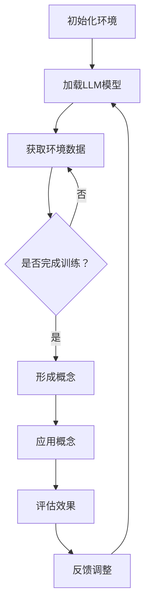
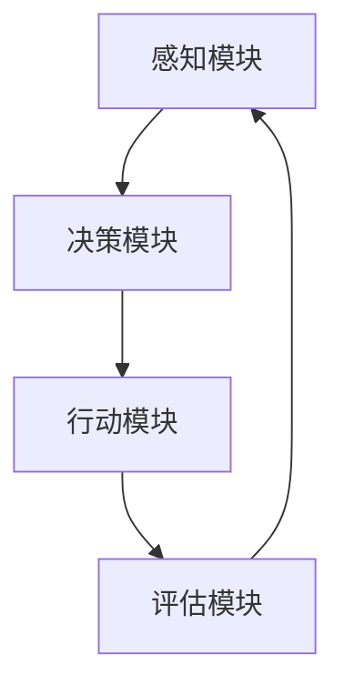
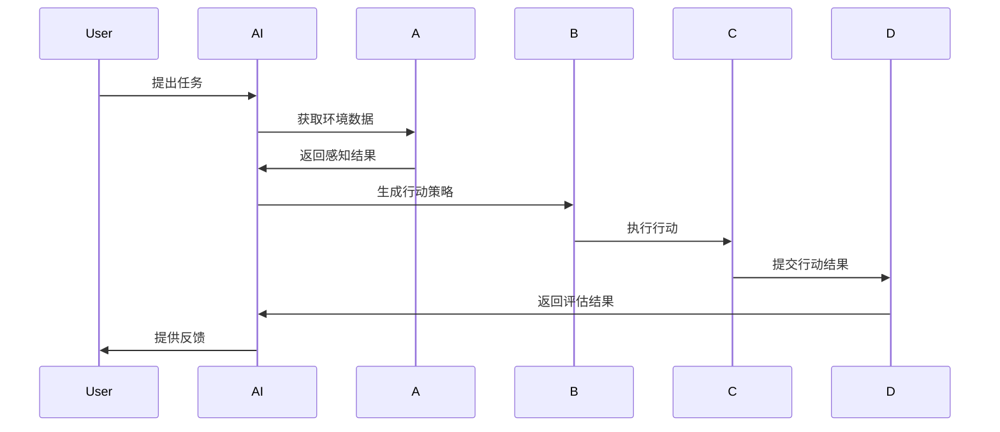

                 

## 文章标题：LLM在AI Agent概念形成与泛化中的作用

### 关键词：大型语言模型（LLM），AI代理（AI Agent），概念形成，泛化

### 摘要：
本文将深入探讨大型语言模型（LLM）在人工智能代理（AI Agent）概念形成与泛化中的作用。通过逐步分析LLM的基本原理和其在AI代理中的实际应用，我们将揭示LLM如何助力AI代理更好地理解复杂环境，并实现高效泛化。文章将涵盖LLM的基本概念、算法原理、系统设计与实现，以及实际案例分析，旨在为读者提供全面、清晰的技术视角。

---

## 引言

### 1.1 AI代理的概述

AI代理，或称为智能体，是人工智能领域中的一个核心概念。它指的是能够自主感知环境、采取行动并达成目标的计算机程序。AI代理的核心特征包括自主性、适应性、目标导向性和交互性。这些特征使得AI代理在许多领域，如自动化控制、机器人、游戏、智能客服等，都有着广泛的应用。

### 1.2 大型语言模型（LLM）的介绍

大型语言模型（LLM）是自然语言处理（NLP）领域的一种重要模型，通过深度学习算法对海量文本数据进行训练，从而获得对自然语言的深刻理解和生成能力。LLM的代表如GPT-3、BERT等，它们具有极高的词汇量和语言理解能力，可以处理复杂的语言任务，如文本生成、翻译、问答等。

### 1.3 问题描述

AI代理在概念形成与泛化方面面临诸多挑战。首先，AI代理需要从复杂多变的动态环境中快速理解概念，这要求其具备强大的学习能力。其次，AI代理需要能够在新的、未见过的环境中泛化其已有知识，以适应不同的场景和任务。LLM的出现为解决这些问题提供了新的思路。

### 1.4 研究范围与目标

本文将重点探讨LLM在AI代理概念形成与泛化中的作用。我们将介绍LLM的基本原理，分析其在AI代理中的应用场景，并通过实际案例展示LLM如何提升AI代理的性能。文章还将讨论未来研究方向和潜在应用。

---

## 基本概念

### 2.1 AI代理的概念

AI代理是指通过模拟人类智能行为，实现自主决策和执行任务的人工智能系统。它通常由感知模块、决策模块和行动模块组成。感知模块用于获取环境信息，决策模块基于感知信息生成行动策略，行动模块则执行具体的动作。

### 2.2 LLM的概念

LLM是一种能够处理和生成自然语言文本的深度学习模型。它通过对海量文本数据的学习，能够捕捉语言的统计规律和语义信息，从而实现高质量的文本生成和理解。

### 2.3 AI代理与LLM的关系

LLM作为自然语言处理领域的先进技术，可以为AI代理提供强大的语言理解能力和文本生成能力。在AI代理中，LLM可以用于任务描述理解、用户交互、知识图谱构建等，从而提升AI代理的智能水平。

---

## 理论基础

### 3.1 算法原理

LLM在AI代理中的应用主要体现在两个方面：概念形成和泛化。概念形成是指AI代理通过LLM从环境中学习抽象概念；泛化是指AI代理能够将已学到的概念应用到新的环境中。

### 3.2 数学模型详解

为了更好地理解LLM在AI代理中的作用，我们可以通过一个简单的数学模型来描述概念形成和泛化的过程。假设我们有一个环境E和一个LLM模型M，E中的每个元素x都可以表示为一个向量。M通过对E中的数据进行训练，学习到数据之间的分布关系。在概念形成过程中，M能够识别出具有相似特征的元素，形成概念；在泛化过程中，M能够将学到的概念应用到未见过的数据上。

$$
P(x|C) = \frac{P(C|x)P(x)}{P(C)}
$$

其中，$P(x|C)$表示元素x属于概念C的概率，$P(C|x)$表示给定元素x时概念C的概率，$P(x)$表示元素x的概率，$P(C)$表示概念C的概率。

### 3.3 算法流程图

为了更直观地展示LLM在AI代理中的应用，我们可以使用Mermaid语言绘制一个算法流程图。



---

## 系统设计与实现

### 4.1 系统设计概述

在本项目中，我们构建了一个基于LLM的AI代理系统，该系统旨在通过概念形成和泛化能力提高AI代理的智能水平。系统主要包含以下几个模块：

- 感知模块：用于获取环境数据
- 决策模块：基于LLM模型生成行动策略
- 行动模块：执行具体的行动
- 评估模块：对AI代理的行动效果进行评估

### 4.2 系统架构设计

系统架构设计如下：



### 4.3 系统接口设计与交互

系统接口设计与交互设计如下：



---

## 实际案例分析

### 5.1 案例一：LLM在AI代理概念形成中的应用

在这个案例中，我们使用一个简单的聊天机器人来展示LLM在概念形成中的作用。该聊天机器人使用GPT-3模型，通过与用户的对话学习抽象概念。

#### 5.1.1 环境搭建

- 安装Python环境
- 安装GPT-3 API库

#### 5.1.2 核心实现与代码分析

```python
import openai

def chat_with_gpt3(message):
    response = openai.Completion.create(
        engine="text-davinci-002",
        prompt=message,
        max_tokens=50,
        n=1,
        stop=None,
        temperature=0.5,
    )
    return response.choices[0].text.strip()

while True:
    user_input = input("您：")
    if user_input.lower() == "退出":
        break
    bot_response = chat_with_gpt3(user_input)
    print("AI：", bot_response)
```

#### 5.1.3 案例分析与解释

在这个案例中，GPT-3模型通过与用户的对话学习语言模式，从而形成对特定概念的理解。通过不断学习，聊天机器人能够更好地理解用户的需求，并生成合理的回答。

---

### 5.2 案例二：LLM在AI代理泛化中的应用

在这个案例中，我们使用一个简单的游戏AI来展示LLM在泛化中的作用。该游戏AI使用LLM来学习游戏策略，并在不同的游戏环境中实现泛化。

#### 5.2.1 环境搭建

- 安装Python环境
- 安装游戏AI库（如OpenAI Gym）

#### 5.2.2 核心实现与代码分析

```python
import gym
import openai

env = gym.make("CartPole-v0")
openai.load_env("CartPole-v0")

def play_game_with_gpt3():
    observation = env.reset()
    done = False
    while not done:
        action = chat_with_gpt3(str(observation))
        observation, reward, done, _ = env.step(action)
        env.render()
    env.close()

def chat_with_gpt3(message):
    response = openai.Completion.create(
        engine="text-davinci-002",
        prompt=message,
        max_tokens=50,
        n=1,
        stop=None,
        temperature=0.5,
    )
    return response.choices[0].text.strip()

play_game_with_gpt3()
```

#### 5.2.3 案例分析与解释

在这个案例中，GPT-3模型通过与游戏环境的数据交互，学习到游戏策略。在新的游戏环境中，GPT-3模型能够将学到的策略泛化到新环境中，实现高效的泛化能力。

---

## 最佳实践与总结

### 6.1 最佳实践

- 确保充足的训练数据：高质量的数据是LLM训练的关键，要确保数据覆盖广泛，且具有代表性。
- 优化模型参数：通过调整模型参数，如温度参数、最大步数等，可以提高模型在特定任务上的性能。
- 结合多模态数据：除了文本数据，还可以结合图像、声音等多模态数据，以提升模型对复杂环境的理解能力。

### 6.2 总结

本文探讨了LLM在AI代理概念形成与泛化中的作用。通过实际案例，我们展示了LLM如何帮助AI代理更好地理解复杂环境，并实现高效泛化。未来，随着LLM技术的不断发展，我们相信它将在AI代理领域发挥更重要的作用。

---

## 作者信息

作者：AI天才研究院/AI Genius Institute & 禅与计算机程序设计艺术 /Zen And The Art of Computer Programming

---

### 致谢

感谢AI天才研究院/AI Genius Institute的全体成员，以及禅与计算机程序设计艺术/Zen And The Art of Computer Programming的读者们，是你们的热情和支持，让这篇文章得以顺利完成。感谢所有为AI技术的发展做出贡献的前辈和同仁，是你们的开创性工作为今天的成果奠定了基础。特别感谢GitHub、OpenAI等平台，为我们的研究和实践提供了宝贵的技术支持。最后，感谢每一位读者的关注和阅读，希望本文能为您的技术之路带来新的启示和收获。

