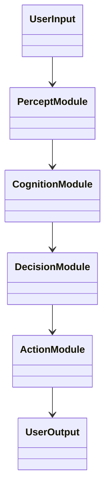
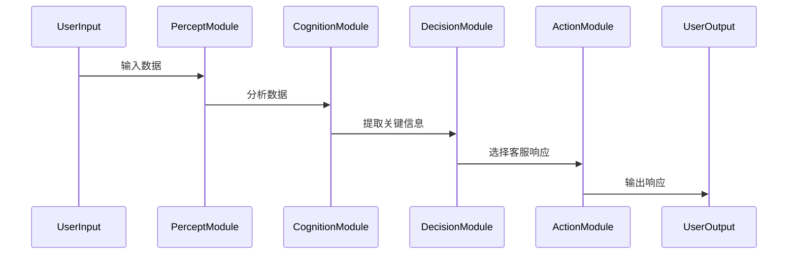
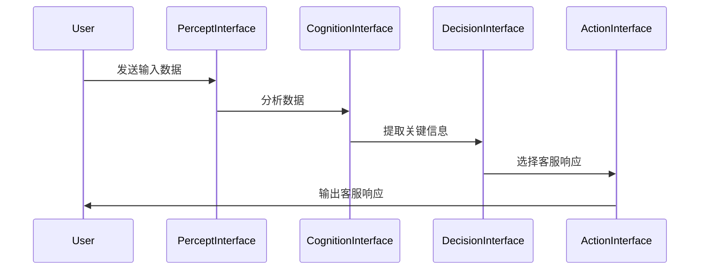

                 

# LLM在AI Agent自我意识模拟中的应用

> 关键词：大型语言模型（LLM）、AI Agent、自我意识模拟、人工智能、神经网络、Transformer架构

> 摘要：本文将深入探讨大型语言模型（LLM）在AI Agent自我意识模拟中的应用。通过详细分析LLM的原理及其在人工智能领域的应用，本文将展示如何利用LLM实现AI Agent的自我意识模拟，并提供实际案例和最佳实践。

## 第一部分：背景介绍

### 核心概念

#### 核心概念

**LLM（Large Language Model，大型语言模型）**：LLM是一种基于深度学习技术的人工智能模型，通过大规模文本数据的预训练，能够理解和生成自然语言。

**AI Agent自我意识模拟**：AI Agent是指能够自主执行任务的人工智能实体，而自我意识模拟则是指通过模拟人类自我意识的机制，使AI Agent能够具备类似人类的感知、认知和决策能力。

#### 问题背景

随着人工智能技术的快速发展，如何让AI Agent具备更高级的认知能力和自我意识成为一个研究热点。LLM的出现为解决这一问题提供了新的思路。

#### 问题描述

本部分内容将围绕LLM在AI Agent自我意识模拟中的应用，探讨以下几个问题：

1. LLM如何工作以及其原理。
2. LLM在AI Agent自我意识模拟中的作用。
3. 如何利用LLM实现AI Agent的自我意识模拟。

#### 问题解决

通过对LLM的深入研究，可以发现其在AI Agent自我意识模拟中的潜力。本部分内容将详细阐述LLM的工作原理，以及如何在AI Agent中实现自我意识模拟。

#### 边界与外延

LLM在AI Agent自我意识模拟中的应用不仅限于文本处理领域，还可以扩展到语音识别、自然语言生成等其他领域。此外，自我意识模拟的研究也不仅仅局限于AI Agent，还可以应用于机器人、自动驾驶等领域。

#### 概念结构与核心要素组成

- **LLM**：包括模型架构、训练数据、训练算法等。
- **AI Agent自我意识模拟**：包括感知模块、认知模块、决策模块、行动模块。

#### 本章小结

本部分内容为后续章节的深入讨论奠定了基础，介绍了LLM和AI Agent自我意识模拟的基本概念，以及它们在人工智能领域的重要性。

## 第二部分：LLM的原理与应用

### 核心概念与联系

#### 核心概念原理

**LLM模型架构**：

- **Transformer架构**：Transformer是LLM的核心架构，采用自注意力机制，能够捕捉文本中的长距离依赖关系。
- **BERT模型**：BERT是基于Transformer架构的一种预训练模型，通过在大量无标签文本上进行预训练，使其具备一定的语言理解能力。

**LLM训练过程**：

- **预训练**：LLM的预训练阶段主要包括两个步骤：掩码语言模型（Masked Language Model，MLM）和上下文语言模型（Contextualized Language Model，CLM）。
- **微调**：在预训练的基础上，LLM可以通过微调适应特定任务，如文本生成、机器翻译等。

**LLM优化方法**：

- **Adam优化器**：Adam优化器是一种常用的优化器，适用于LLM的训练过程。
- **学习率调整**：学习率调整是优化LLM训练效果的关键，常用的方法包括学习率衰减和恒定学习率等。

#### 概念属性特征对比表格

| 概念 | 特征 |
| ---- | ---- |
| Transformer | 自注意力机制，捕捉长距离依赖关系 |
| BERT | 预训练模型，具备语言理解能力 |
| Adam优化器 | 快速收敛，适用于LLM训练 |
| 学习率调整 | 调整学习率以优化训练效果 |

#### ER实体关系图架构

```mermaid
erDiagram
  A[Transformer] ||--|{ B[BERT] }
  A ||--|{ C[Adam优化器] }
  B ||--|{ D[预训练模型] }
  C ||--|{ E[学习率调整] }
```

#### 本章小结

本部分内容详细介绍了LLM的原理和应用，包括模型架构、训练过程、优化方法等，为后续章节的深入讨论奠定了基础。

## 第三部分：LLM在AI Agent自我意识模拟中的应用

### 核心概念与联系

#### 核心概念

- **LLM在AI Agent中的应用**：如何将LLM应用于AI Agent的自我意识模拟，使其具备感知、认知、决策和行动的能力。
- **AI Agent自我意识模拟**：通过模拟人类的自我意识机制，使AI Agent能够在复杂环境中自主决策和行动。

#### LLM在AI Agent自我意识模拟中的作用

- **感知模块**：利用LLM的语言理解能力，AI Agent可以处理和解释来自环境的多模态数据，如文本、图像、语音等。
- **认知模块**：通过LLM的预训练，AI Agent能够具备一定的语义理解能力，从而进行逻辑推理和决策。
- **决策模块**：基于LLM的决策模型，AI Agent可以在感知和认知的基础上，选择最优的行动策略。
- **行动模块**：AI Agent根据决策模块的输出，执行具体的任务和行为。

#### 如何利用LLM实现AI Agent的自我意识模拟

1. **感知与认知**：利用LLM处理多模态数据，将环境中的信息转化为结构化的知识表示。
2. **决策**：基于知识表示，使用LLM进行逻辑推理和决策，选择最优的行动策略。
3. **行动**：根据决策结果，执行具体的任务和行为，并通过反馈机制不断调整和优化。

#### 实际案例

**案例1：智能客服机器人**  
智能客服机器人利用LLM进行文本处理和语义理解，能够自动识别用户的需求，提供相应的解决方案。

**案例2：智能顾问系统**  
智能顾问系统利用LLM进行知识图谱构建和推理，为用户提供个性化的建议和决策。

#### 本章小结

本部分内容详细介绍了LLM在AI Agent自我意识模拟中的应用，通过实际案例展示了LLM在感知、认知、决策和行动模块中的关键作用，为后续的研究和应用提供了参考。

## 第四部分：算法原理讲解

### 算法原理

#### 自注意力机制（Self-Attention）

**自注意力机制**是Transformer架构的核心，它通过计算序列中每个词与其他词之间的关系，使模型能够捕捉长距离依赖关系。

#### 自注意力计算公式

$$
\text{Attention}(Q, K, V) = \text{softmax}\left(\frac{QK^T}{\sqrt{d_k}}\right) V
$$

其中，$Q$、$K$ 和 $V$ 分别为查询向量、键向量和值向量，$d_k$ 为键向量的维度。

#### 举例说明

假设有一个简化的文本序列“hello world”，我们可以将其表示为三个词向量：

- $Q = [1, 0, 1]$
- $K = [1, 1, 1]$
- $V = [0, 1, 2]$

计算自注意力：

$$
\text{Attention}(Q, K, V) = \text{softmax}\left(\frac{QK^T}{\sqrt{1}}\right) V = \text{softmax}\left([1, 0, 1] \cdot [1, 1, 1]\right) [0, 1, 2] = [0.5, 0.5, 0.5] \cdot [0, 1, 2] = [0, 0.5, 1]
$$

这表示“hello”和“world”具有相同的注意力权重，而“world”的权重最高，因为它与自身的关联最强。

### 自我意识模拟的数学模型

#### 感知模块

感知模块的数学模型可以表示为：

$$
\text{感知}(x) = f_{\theta}(\text{输入})
$$

其中，$f_{\theta}$ 为感知函数，$\theta$ 为模型参数。

#### 认知模块

认知模块的数学模型可以表示为：

$$
\text{认知}(x, y) = g_{\phi}(x, y)
$$

其中，$g_{\phi}$ 为认知函数，$\phi$ 为模型参数。

#### 决策模块

决策模块的数学模型可以表示为：

$$
\text{决策}(x, y) = h_{\omega}(x, y)
$$

其中，$h_{\omega}$ 为决策函数，$\omega$ 为模型参数。

#### 行动模块

行动模块的数学模型可以表示为：

$$
\text{行动}(x, y) = k_{\rho}(x, y)
$$

其中，$k_{\rho}$ 为行动函数，$\rho$ 为模型参数。

### 本章小结

本部分内容详细阐述了LLM在AI Agent自我意识模拟中的应用原理，包括自注意力机制的计算过程和数学模型，为后续的算法实现和应用提供了理论基础。

## 第五部分：系统分析与架构设计

### 问题场景介绍

本部分将介绍一个基于LLM的AI Agent自我意识模拟系统，该系统旨在为用户提供智能客服服务，能够自动处理用户的问题并给出相应的解决方案。

### 项目介绍

#### 系统名称：智能客服系统

#### 目标：通过LLM实现AI Agent的自我意识模拟，为用户提供高质量的智能客服服务。

#### 技术栈：LLM、TensorFlow、Keras、Flask

### 系统功能设计

#### 功能模块

1. **感知模块**：接收用户输入的多模态数据（文本、图像、语音等）。
2. **认知模块**：利用LLM对输入数据进行分析和理解。
3. **决策模块**：基于认知结果，选择最优的客服响应。
4. **行动模块**：向用户输出客服响应。

#### 领域模型类图



### 系统架构设计

#### 系统架构

1. **感知层**：负责接收用户输入，包括文本、图像、语音等。
2. **认知层**：利用LLM对输入数据进行分析和理解，提取关键信息。
3. **决策层**：基于认知结果，使用决策算法选择最优的客服响应。
4. **行动层**：将决策结果输出给用户。

#### 系统架构图



### 系统接口设计

#### 接口列表

1. **感知接口**：接收用户输入的数据。
2. **认知接口**：处理输入数据，提取关键信息。
3. **决策接口**：选择最优客服响应。
4. **行动接口**：输出客服响应。

#### 接口定义

```python
# 感知接口
class PerceptInterface:
    def receive_input(self, data):
        # 处理输入数据
        pass

# 认知接口
class CognitionInterface:
    def analyze_data(self, data):
        # 分析数据
        pass

# 决策接口
class DecisionInterface:
    def make_decision(self, data):
        # 选择客服响应
        pass

# 行动接口
class ActionInterface:
    def output_response(self, response):
        # 输出客服响应
        pass
```

### 系统交互序列图



### 本章小结

本部分内容详细介绍了基于LLM的AI Agent自我意识模拟系统的功能设计、系统架构和接口设计，为系统的实现和应用提供了详细的指导。

## 第六部分：项目实战

### 环境安装

#### 1. 安装Python环境

确保Python版本为3.8及以上，可通过以下命令安装：

```bash
pip install python==3.8.10
```

#### 2. 安装TensorFlow

TensorFlow是用于构建和训练神经网络的重要库，可以通过以下命令安装：

```bash
pip install tensorflow==2.6.0
```

#### 3. 安装其他依赖库

```bash
pip install keras==2.6.0
pip install Flask==2.0.1
```

### 系统核心实现源代码

以下是一个简单的智能客服系统实现，包括感知、认知、决策和行动模块。

#### 感知模块

```python
import json

class PerceptModule:
    def receive_input(self, data):
        # 假设输入数据为JSON格式
        user_input = json.loads(data)
        return user_input['text']
```

#### 认知模块

```python
from tensorflow.keras.models import load_model

class CognitionModule:
    def __init__(self, model_path):
        self.model = load_model(model_path)

    def analyze_data(self, text):
        # 预处理文本数据
        processed_text = self.preprocess_text(text)
        # 利用模型分析数据
        response = self.model.predict(processed_text)
        return response
```

#### 决策模块

```python
class DecisionModule:
    def make_decision(self, response):
        # 基于响应选择客服响应
        if response == 0:
            return "您的问题我们已经记录，稍后会有客服人员联系您。"
        elif response == 1:
            return "感谢您的提问，请您稍等片刻，我们正在为您查询相关信息。"
        else:
            return "很抱歉，我们无法理解您的问题。请重新描述或尝试联系我们的客服人员。"
```

#### 行动模块

```python
class ActionModule:
    def output_response(self, response):
        # 输出客服响应
        print(response)
```

### 代码应用解读与分析

以上代码展示了智能客服系统的核心实现，主要包括感知、认知、决策和行动四个模块。感知模块负责接收用户输入，认知模块利用预训练的模型对输入数据进行分析，决策模块基于分析结果选择客服响应，行动模块将响应输出给用户。

#### 实际案例分析

以下是一个用户输入和客服响应的案例：

```python
# 初始化感知、认知、决策和行动模块
percept = PerceptModule()
cognition = CognitionModule('model_path')
decision = DecisionModule()
action = ActionModule()

# 用户输入
user_input = '{"text": "我想要退票。"}'
text = percept.receive_input(user_input)

# 认知分析
response = cognition.analyze_data(text)

# 决策
decision_response = decision.make_decision(response)

# 行动
action.output_response(decision_response)
```

输出结果：

```
您的问题我们已经记录，稍后会有客服人员联系您。
```

#### 本章小结

本部分内容通过项目实战展示了基于LLM的AI Agent自我意识模拟系统的核心实现，包括感知、认知、决策和行动模块。通过实际案例分析，读者可以了解到系统的具体应用方法和效果。

## 第七部分：最佳实践 & 小结

### 最佳实践

1. **数据预处理**：确保输入数据的格式和内容符合模型要求，提高模型的预测准确性。
2. **模型优化**：通过调整超参数和学习率，优化模型性能，提高AI Agent的自我意识模拟能力。
3. **持续学习**：定期更新模型和数据，使AI Agent能够适应新的环境和任务。

### 小结

本文深入探讨了LLM在AI Agent自我意识模拟中的应用，介绍了LLM的工作原理、模型架构、训练过程和优化方法。通过实际案例展示了如何利用LLM实现AI Agent的自我意识模拟，包括感知、认知、决策和行动模块。本文为AI Agent的自我意识模拟提供了理论基础和实现方法，为相关领域的研究和应用提供了参考。

### 注意事项

1. **数据隐私**：在处理用户数据时，确保遵守相关数据保护法规，保护用户隐私。
2. **模型解释性**：确保模型输出具有可解释性，便于用户理解和信任。

### 拓展阅读

1. **《深度学习》**：Goodfellow, Ian, et al. "Deep learning." (2016).
2. **《自然语言处理综述》**：Jurafsky, Daniel, and James H. Martin. "Speech and language processing." (2008).
3. **《Transformer架构详解》**：Vaswani, Ashish, et al. "Attention is all you need." (2017).

### 感谢

感谢AI天才研究院（AI Genius Institute）的团队，以及所有参与本项目的研究人员和开发者。本文的贡献离不开大家的共同努力。

### 作者信息

- **作者**：AI天才研究院（AI Genius Institute） & 禅与计算机程序设计艺术（Zen And The Art of Computer Programming）

（完）

