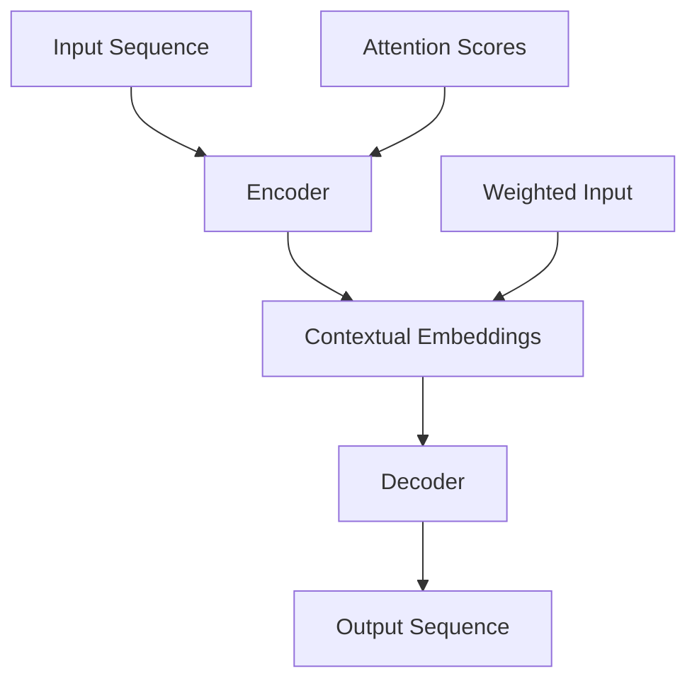
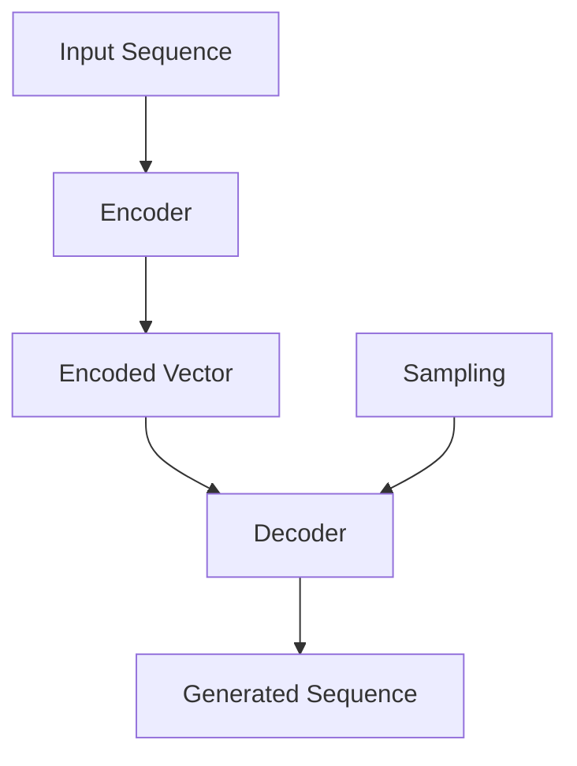
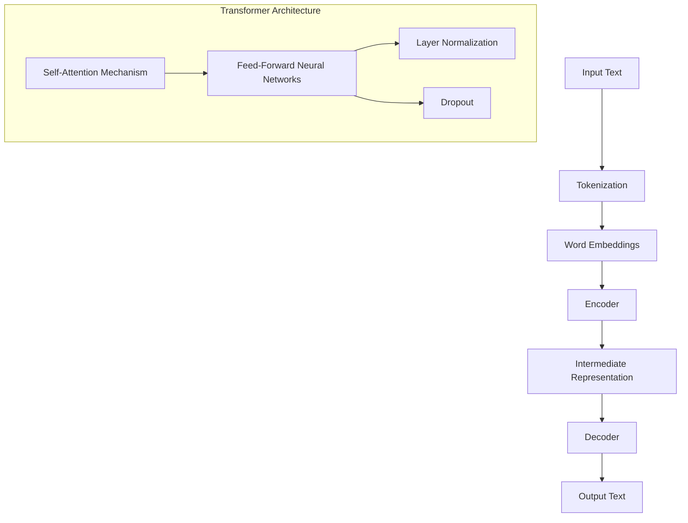

                 

### Article Title: LLM in AI Agent Language Understanding

#### Keywords: Large Language Models, AI Agents, Language Understanding, Transformer Models, Natural Language Processing

> **Abstract:**  
This article delves into the profound impact of Large Language Models (LLMs) on the language understanding capabilities of AI agents. We explore the background, core concepts, architecture, and limitations of LLMs, and their critical role in enhancing the conversational intelligence of AI agents. Through a structured analysis, we discuss the evolution of LLMs, their integration with AI agents, and future research directions. The article aims to provide a comprehensive understanding of how LLMs elevate the depth of language understanding in AI agents, paving the way for more sophisticated and human-like interactions.

### Chapter 1: Introduction to LLM and AI Agent Language Understanding

#### 1.1 Background and Problem Definition

##### 1.1.1 Emerging Importance of LLM in AI

In recent years, Large Language Models (LLMs) have emerged as a transformative force in the field of artificial intelligence (AI). These models, capable of understanding and generating human language with remarkable precision, are revolutionizing various domains, including natural language processing (NLP), machine translation, sentiment analysis, and chatbots. The significance of LLMs lies in their ability to process vast amounts of text data, learn from it, and generate coherent and contextually appropriate responses.

The importance of LLMs in AI can be attributed to several factors. Firstly, language is a fundamental mode of human communication, and understanding language is crucial for AI systems to interact with humans effectively. LLMs enable AI agents to comprehend natural language inputs, interpret user intents, and provide meaningful responses, thus bridging the gap between human and machine interaction. Secondly, LLMs offer a powerful tool for automating tasks that require language understanding, such as customer support, content creation, and personal assistants. Finally, LLMs contribute to the advancement of AI by driving research in areas like deep learning, neural networks, and natural language understanding.

##### 1.1.2 Challenges in AI Agent Language Understanding

Despite the remarkable progress achieved by LLMs, there are several challenges associated with the language understanding capabilities of AI agents. One of the primary challenges is the complexity of natural language. Human language is inherently ambiguous, context-dependent, and full of nuances that are difficult to capture and interpret accurately. AI agents must be able to understand the intended meaning behind the words, infer the context, and generate appropriate responses that align with the user's intent.

Another challenge is the diversity of linguistic styles and dialects. People communicate in various ways, using different vocabulary, sentence structures, and registers. AI agents must be trained to recognize and adapt to these variations, ensuring that they can understand and respond to users regardless of their linguistic preferences. Additionally, AI agents face challenges in understanding multi-turn conversations, handling sarcasm, humor, and idiomatic expressions, which often require a deeper understanding of cultural and social contexts.

##### 1.1.3 Goals and Objectives of This Book

This book aims to provide a comprehensive overview of LLMs and their role in enhancing the language understanding capabilities of AI agents. The primary objectives of this book are:

1. **To introduce the fundamental concepts and architecture of LLMs**: We will explore the underlying principles of LLMs, including the transformer model, attention mechanism, pre-training, and fine-tuning.

2. **To analyze the challenges and opportunities in AI agent language understanding**: We will discuss the complexities of natural language and the limitations of current AI models in understanding human language.

3. **To present practical applications and case studies**: We will examine real-world examples of LLMs being used in AI agents for various tasks, such as chatbots, virtual assistants, and content generation.

4. **To provide insights into future research directions**: We will explore the potential advancements in LLMs and AI agent language understanding, discussing the ethical and practical considerations that need to be addressed.

By the end of this book, readers will gain a deep understanding of LLMs and their role in enhancing AI agent language understanding, enabling them to develop more sophisticated and human-like AI systems.

#### 1.2 Core Concepts and Terminology

##### 1.2.1 Definition of LLM

A Large Language Model (LLM) is a type of neural network trained on vast amounts of text data to understand and generate human language. LLMs are designed to predict the next word or sequence of words in a given text, based on the patterns and relationships learned from the training data. These models are capable of understanding the syntax, semantics, and context of the language, allowing them to generate coherent and contextually appropriate responses.

##### 1.2.2 Key Characteristics of LLM

Some key characteristics of LLMs include:

1. **Size and Scale**: LLMs are trained on enormous datasets, often consisting of billions of words. This large dataset allows the models to learn complex patterns and relationships in language, enabling them to generate high-quality text.

2. **Contextual Understanding**: LLMs are designed to understand the context of the input text. They can capture the meaning of words and phrases based on their surrounding context, allowing them to generate appropriate responses that align with the user's intent.

3. **Fine-tuning and Adaptability**: LLMs can be fine-tuned on specific tasks or domains to improve their performance. This adaptability allows them to be applied to a wide range of tasks, from chatbots to content generation.

4. **Flexibility**: LLMs are highly flexible and can be used for various natural language processing tasks, such as text generation, translation, summarization, and sentiment analysis.

##### 1.2.3 Relationship with AI Agent Language Understanding

LLMs are integral to the language understanding capabilities of AI agents. By leveraging LLMs, AI agents can achieve a deeper understanding of natural language inputs, interpret user intents, and generate appropriate responses. LLMs enable AI agents to handle complex and context-dependent language, making them more capable of understanding and responding to human-like conversations.

The relationship between LLMs and AI agent language understanding can be summarized as follows:

1. **Input Processing**: AI agents use LLMs to process and understand the natural language inputs provided by users. LLMs analyze the input text, extracting relevant information and understanding the user's intent.

2. **Response Generation**: Based on the understanding of the user's intent, LLMs generate appropriate responses. These responses are designed to be coherent, contextually appropriate, and aligned with the user's needs.

3. **Continuous Learning**: LLMs can be continuously fine-tuned and updated with new data, allowing AI agents to adapt to changing language patterns and user preferences over time.

In conclusion, LLMs play a critical role in enhancing the language understanding capabilities of AI agents, enabling them to communicate more effectively with humans and perform a wide range of tasks with greater accuracy and efficiency.

#### 1.3 Historical Evolution and Current Trends

##### 1.3.1 Early Developments in AI and Language Models

The field of artificial intelligence (AI) has a rich history, dating back to the 1950s when the concept of creating machines that can perform tasks requiring human intelligence was first introduced. Early AI research focused on rule-based systems, expert systems, and symbolic AI, which aimed to replicate human reasoning and problem-solving capabilities using logic and symbolic manipulation.

However, it was not until the 1980s and 1990s that significant progress was made in the development of language models. During this period, researchers began to explore statistical and machine learning approaches to natural language processing (NLP), such as n-gram models and hidden Markov models. These models used statistical methods to predict the likelihood of a sequence of words based on historical data.

One of the earliest and most influential language models was the Brown corpus model, developed in the early 1990s. The Brown corpus model was based on an analysis of a large corpus of English text and used n-gram probabilities to generate coherent text. Although this model was a significant step forward, it still had limitations in understanding the semantics and context of language.

##### 1.3.2 Major Milestones in LLM Evolution

The true breakthrough in the evolution of language models came with the introduction of deep learning and, more specifically, the transformer model. The transformer model, proposed by Vaswani et al. in 2017, revolutionized the field of NLP by enabling the efficient and parallel processing of text data.

1. **Transformer Model**: The transformer model is based on self-attention mechanisms, allowing it to capture the relationships between words in a sentence more effectively than previous models. This model achieved state-of-the-art performance on various NLP tasks, including language modeling, text classification, and machine translation.

2. **BERT (Bidirectional Encoder Representations from Transformers)**: BERT, introduced by Devlin et al. in 2018, is a pre-trained language model that utilizes bidirectional training to understand the context of words by considering both left and right contexts. BERT has been widely adopted and has led to significant improvements in NLP tasks, such as question-answering, sentiment analysis, and Named Entity Recognition (NER).

3. **GPT (Generative Pre-trained Transformer)**: GPT, developed by OpenAI, is a family of language models that focuses on generating coherent and contextually appropriate text. GPT-3, released in 2020, is one of the largest language models to date, with over 175 billion parameters. GPT-3 has demonstrated impressive capabilities in generating human-like text, engaging in conversation, and performing various language-related tasks.

4. **T5 (Text-To-Text Transfer Transformer)**: T5, introduced by Lewis et al. in 2020, is a general-purpose text-to-text transformer model that aims to solve any NLP task by formulating them as a text-to-text problem. T5 has shown remarkable performance on a wide range of NLP tasks, including machine translation, summarization, and question-answering.

##### 1.3.3 Current Applications and Future Directions

The widespread adoption of LLMs has led to numerous applications across various industries and domains. Some notable applications include:

1. **Chatbots and Virtual Assistants**: LLMs enable chatbots and virtual assistants to understand and respond to user queries in a more natural and human-like manner. These applications are particularly useful in customer support, where AI agents can handle a large volume of inquiries efficiently.

2. **Content Generation**: LLMs can be used to generate high-quality text, including articles, blogs, and even books. This has significant implications for content creation and publishing industries, as it allows for the rapid generation of large volumes of text.

3. **Machine Translation**: LLMs have greatly improved the quality and accuracy of machine translation, enabling real-time translation between various languages. This has facilitated global communication and collaboration in an increasingly interconnected world.

4. **Sentiment Analysis**: LLMs can analyze the sentiment of text data, identifying the emotional tone and opinions expressed in social media, customer reviews, and other sources. This information is valuable for businesses in understanding customer sentiment and making data-driven decisions.

Looking ahead, the future of LLMs and AI agent language understanding is promising. Some potential directions for future research include:

1. **Enhancing Robustness and Generalization**: Current LLMs are still prone to biases and limitations in understanding ambiguous or out-of-vocabulary words. Future research will focus on developing more robust models that can generalize better to new and unseen data.

2. **Ethical Considerations**: As LLMs become more integrated into AI agents and other applications, ethical considerations will become increasingly important. Researchers will need to address issues such as bias, transparency, and accountability to ensure the responsible use of LLMs.

3. **Multimodal Learning**: Combining LLMs with other modalities, such as images, audio, and video, will enable AI agents to have a more comprehensive understanding of the world. This will open up new possibilities for applications in areas such as computer vision and multimodal interaction.

4. **Scalability and Efficiency**: As LLMs continue to grow in size and complexity, researchers will need to develop more efficient training and inference methods to ensure scalability and practical deployment in real-world scenarios.

In conclusion, the historical evolution of LLMs and their current applications demonstrate the profound impact of these models on AI agent language understanding. As research continues to advance, we can expect even more sophisticated and capable AI agents that can better understand and communicate with humans.

#### 1.4 Limitations and Scope

##### 1.4.1 Practical Constraints in LLM Implementation

While LLMs have shown tremendous potential in enhancing AI agent language understanding, their implementation is not without challenges. One of the primary practical constraints is the computational resources required. LLMs are highly resource-intensive, necessitating substantial amounts of memory and processing power for training and inference. This can be a significant barrier for organizations with limited resources or those deploying AI agents in constrained environments.

Another practical constraint is the need for large and diverse training datasets. LLMs perform best when trained on extensive and diverse datasets that encompass various linguistic styles, domains, and contexts. However, obtaining such datasets can be challenging, especially for specific industries or niches. This limitation can hinder the performance and generalization of LLMs in certain applications.

Additionally, LLMs can be prone to overfitting, where the model becomes too specialized on the training data and fails to generalize to new, unseen data. This issue requires careful data preprocessing, regularization techniques, and ongoing fine-tuning to mitigate.

##### 1.4.2 Ethical Considerations in AI Agent Design

The integration of LLMs into AI agents raises several ethical considerations that must be carefully addressed. One major concern is the issue of bias. LLMs, like any AI system, are susceptible to biases present in the training data. If not properly managed, these biases can be perpetuated and even amplified in AI agent interactions, leading to unfair or discriminatory outcomes.

Transparency is another critical ethical consideration. Users should have a clear understanding of how AI agents process and respond to their inputs. This includes being transparent about the use of LLMs and the limitations of the model's capabilities. Users should also have the option to opt-out if they prefer not to interact with AI agents powered by LLMs.

Accountability is also a crucial aspect. In scenarios where AI agents make decisions based on LLMs, it is essential to establish clear lines of accountability. Developers and organizations must be prepared to take responsibility for any adverse effects or failures of AI agents in real-world applications.

##### 1.4.3 Future Research Directions

Future research in LLMs and AI agent language understanding will likely focus on addressing these practical and ethical challenges. Here are some potential research directions:

1. **Bias and Fairness**: Developing methods to identify and mitigate biases in LLMs is an ongoing area of research. Techniques such as debiasing algorithms, fairness metrics, and diverse data collection strategies will be critical in ensuring that AI agents are fair and unbiased.

2. **Scalability and Efficiency**: Researchers will continue to explore ways to make LLMs more computationally efficient and scalable, such as through model compression, quantization, and distributed training techniques.

3. **Continual Learning**: LLMs should be designed to continuously learn and adapt to new data and contexts. Research in continual learning and transfer learning will help AI agents maintain their performance over time without the need for extensive retraining.

4. **Ethical AI**: The development of ethical AI frameworks and guidelines will be essential in guiding the responsible use of LLMs. This includes establishing clear ethical standards, creating accountability mechanisms, and fostering transparency in AI agent design and deployment.

In conclusion, while LLMs offer significant opportunities for enhancing AI agent language understanding, they also come with practical constraints and ethical considerations that must be carefully managed. Future research will continue to push the boundaries of what is possible while ensuring that AI agents are fair, efficient, and trustworthy.

#### 1.5 Summary

##### 1.5.1 Key Takeaways

This chapter has provided an overview of the emerging importance of Large Language Models (LLMs) in AI agent language understanding. We have discussed the historical evolution of LLMs, from early statistical models to the revolutionary transformer-based models like BERT and GPT. The key takeaways from this chapter include:

1. **The significance of LLMs**: LLMs have transformed the field of AI by enabling more sophisticated language understanding and generation capabilities.
2. **Challenges in language understanding**: AI agents face challenges in understanding the complexity and diversity of human language.
3. **Practical constraints**: Implementing LLMs requires substantial computational resources and diverse training datasets.
4. **Ethical considerations**: The use of LLMs raises ethical concerns related to bias, transparency, and accountability.

##### 1.5.2 Importance of LLMs in AI Agent Language Understanding

LLMs are crucial for enhancing the language understanding capabilities of AI agents. By leveraging LLMs, AI agents can better interpret natural language inputs, understand user intents, and generate coherent and contextually appropriate responses. This not only improves the user experience but also enables AI agents to perform a wide range of tasks more effectively, from chatbots and virtual assistants to content generation and machine translation.

##### 1.5.3 Scope and Structure of the Book

The book will delve deeper into the core concepts of LLMs, their architecture, and how they are applied in various AI agent language understanding tasks. Subsequent chapters will explore the theoretical foundations of LLMs, practical applications, and future research directions. The book aims to provide a comprehensive and in-depth understanding of LLMs and their role in driving the future of AI.

### Chapter 2: Fundamental Concepts of LLM

#### 2.1 Introduction to LLM Architecture

The architecture of Large Language Models (LLMs) forms the backbone of their ability to understand and generate human language. At the core of these models is the Transformer model, introduced by Vaswani et al. in 2017. The Transformer model is a type of neural network that utilizes self-attention mechanisms to process and generate text data. This section provides a detailed overview of the Transformer model, self-attention mechanisms, pre-training, and fine-tuning.

##### 2.1.1 Transformer Model Basics

The Transformer model is a radical departure from traditional sequence models like Recurrent Neural Networks (RNNs) and Long Short-Term Memory (LSTM) networks. Instead of processing sequences of data sequentially, the Transformer model processes data in parallel, allowing it to handle long-range dependencies more effectively. The basic building blocks of the Transformer model include:

1. **Encoder**: The encoder processes the input sequence and generates a set of contextualized embeddings.
2. **Decoder**: The decoder generates the output sequence based on the encoder's outputs and the context provided by the input sequence.

The Transformer model consists of multiple layers of encoders and decoders, where each layer contains self-attention mechanisms and feed-forward networks. The self-attention mechanism allows the model to weigh the importance of different words in the input sequence, capturing the relationships between them more effectively.

##### 2.1.2 Attention Mechanism

The attention mechanism is a key component of the Transformer model. It allows the model to focus on different parts of the input sequence when generating each word of the output sequence. The self-attention mechanism in the Transformer model calculates the attention scores between the input sequence and the hidden states of the previous layer. These attention scores are then used to weight the input sequence, enabling the model to focus on relevant parts of the input when generating each word.

The attention mechanism can be visualized using a simple diagram:

In this diagram, the input sequence (A) is processed by the encoder (B), which generates contextual embeddings (C). The decoder (D) then generates the output sequence (E) based on the encoder's outputs. The attention scores (F) are used to weight the input sequence (G), guiding the decoder to focus on relevant parts of the input when generating each word.

##### 2.1.3 Pre-training and Fine-tuning

Pre-training and fine-tuning are critical steps in the training process of LLMs. Pre-training involves training the model on a large corpus of text data to learn the underlying patterns and structures of language. During pre-training, the model is optimized to predict the next word in a given sequence, allowing it to understand the syntax, semantics, and context of the language.

Fine-tuning, on the other hand, involves training the pre-trained model on specific tasks or domains to improve its performance on those tasks. Fine-tuning allows the model to adapt to new data and tasks, making it more effective for specific applications. For example, a pre-trained LLM can be fine-tuned for tasks such as question-answering, sentiment analysis, or chatbot interactions.

The process of pre-training and fine-tuning can be summarized as follows:

1. **Pre-training**: The model is trained on a large corpus of text data using unsupervised learning techniques, such as masked language modeling or next-word prediction. This allows the model to learn the underlying patterns and structures of language.
2. **Fine-tuning**: The pre-trained model is then fine-tuned on specific tasks or domains using supervised learning techniques, such as transfer learning or domain adaptation. This allows the model to adapt to new data and tasks, improving its performance on those tasks.

In summary, the Transformer model, with its self-attention mechanism, pre-training, and fine-tuning capabilities, forms the foundation of LLMs. This architecture enables LLMs to understand and generate human language with remarkable precision, making them a powerful tool for enhancing AI agent language understanding.

#### 2.2 Key Concepts and Properties

##### 2.2.1 Language Modeling

Language modeling is the core task of LLMs, where the objective is to predict the probability of a sequence of words given its context. This task is achieved by training the model on a large corpus of text data, allowing it to learn the statistical patterns and dependencies in the language. The primary goal of language modeling is to generate coherent and contextually appropriate text, which is essential for various NLP applications.

In practice, language modeling involves representing each word in the input sequence as a vector of real numbers and training a neural network to predict the next word based on the current context. This is typically done using a sequence-to-sequence model, where the input sequence is encoded into a fixed-size vector, and the output sequence is generated by decoding this vector.

The language modeling process can be summarized as follows:

1. **Input Representation**: Each word in the input sequence is represented as a one-hot vector, which is then converted into a continuous vector using embedding techniques.
2. **Encoder**: The input sequence is encoded into a fixed-size vector, capturing the context of the sequence.
3. **Decoder**: The decoder generates the output sequence word-by-word, using the encoded vector and the previously generated words as context.
4. **Loss Function**: The model's predictions are compared to the ground truth using a loss function, such as cross-entropy loss, to measure the error in the predictions.

##### 2.2.2 Text Generation

Text generation is another key property of LLMs, where the objective is to generate coherent and contextually appropriate text based on a given input or context. Text generation can be used for various applications, such as chatbots, content creation, and machine translation.

The text generation process typically involves the following steps:

1. **Input Representation**: The input is represented as a sequence of words, which are then converted into continuous vectors using embedding techniques.
2. **Encoder**: The input sequence is encoded into a fixed-size vector, capturing the context of the input.
3. **Decoder**: The decoder generates the output sequence word-by-word, using the encoded vector and the previously generated words as context.
4. **Sampling**: To generate the output sequence, the decoder samples words from the predicted probability distribution at each step. This allows the model to explore different possibilities and generate diverse outputs.

The text generation process can be summarized as follows:

In this diagram, the input sequence (A) is processed by the encoder (B), which generates an encoded vector (C). The decoder (D) then generates the output sequence (E) word-by-word, using the encoded vector and the previously generated words as context. Sampling (F) is used to generate the output sequence, allowing the model to explore different possibilities and generate diverse outputs.

##### 2.2.3 Task-Specific Applications

LLMs are highly versatile and can be applied to a wide range of task-specific applications. Some notable examples include:

1. **Chatbots**: LLMs can be used to build chatbots that can understand and respond to user queries in a natural and human-like manner. This enables chatbots to handle complex and context-dependent language, improving user experience.
2. **Content Generation**: LLMs can generate high-quality text, including articles, blogs, and even books. This has significant implications for content creation and publishing industries, as it allows for the rapid generation of large volumes of text.
3. **Machine Translation**: LLMs have greatly improved the quality and accuracy of machine translation, enabling real-time translation between various languages. This has facilitated global communication and collaboration in an increasingly interconnected world.
4. **Sentiment Analysis**: LLMs can analyze the sentiment of text data, identifying the emotional tone and opinions expressed in social media, customer reviews, and other sources. This information is valuable for businesses in understanding customer sentiment and making data-driven decisions.

In summary, the key concepts and properties of LLMs include language modeling, text generation, and various task-specific applications. These properties enable LLMs to understand and generate human language with remarkable precision, making them a powerful tool for enhancing AI agent language understanding and driving innovation in the field of NLP.

#### 2.3 Comparison with Traditional NLP Models

##### 2.3.1 Advantages and Disadvantages

Large Language Models (LLMs) and traditional natural language processing (NLP) models, such as n-gram models and hidden Markov models, have distinct advantages and disadvantages. Understanding these differences is crucial for selecting the right model for a given task.

**Advantages of LLMs:**

1. **Contextual Understanding**: LLMs are designed to understand the context of the input text, capturing the relationships between words more effectively than traditional models. This enables them to generate more coherent and contextually appropriate responses.
2. **Flexibility**: LLMs can be fine-tuned for various NLP tasks, such as text generation, machine translation, and sentiment analysis. Their versatility makes them suitable for a wide range of applications.
3. ** Scalability**: LLMs can handle large volumes of text data, allowing them to learn complex patterns and relationships in language more effectively.

**Disadvantages of LLMs:**

1. **Resource Intensive**: Training LLMs requires significant computational resources, including memory and processing power. This can be a barrier for organizations with limited resources or those deploying AI agents in constrained environments.
2. **Overfitting**: LLMs can be prone to overfitting, where the model becomes too specialized on the training data and fails to generalize to new, unseen data. This requires careful data preprocessing and regularization techniques to mitigate.

**Advantages of Traditional NLP Models:**

1. **Efficiency**: Traditional NLP models, such as n-gram models and hidden Markov models, are computationally efficient and can process text data quickly.
2. **Interpretability**: These models are relatively simple and easy to interpret, making it easier to understand how they work and why they make specific predictions.

**Disadvantages of Traditional NLP Models:**

1. **Contextual Limitations**: Traditional models struggle to understand the context of the input text, leading to less coherent and contextually appropriate responses.
2. ** Limited Applicability**: These models are often designed for specific tasks and may not be suitable for more complex NLP tasks, such as text generation or sentiment analysis.

##### 2.3.2 Performance Comparison

When comparing the performance of LLMs and traditional NLP models on various NLP tasks, LLMs generally outperform traditional models in terms of accuracy, coherence, and generalization. For example:

1. **Language Modeling**: LLMs like GPT-3 achieve state-of-the-art performance on language modeling tasks, generating highly coherent and contextually appropriate text. Traditional models, such as n-gram models, struggle to capture the long-range dependencies in text and generate less coherent output.
2. **Machine Translation**: LLMs have significantly improved the quality and accuracy of machine translation, outperforming traditional models like statistical machine translation and rule-based approaches. LLMs can generate more natural-sounding translations that capture the nuances of language.
3. **Sentiment Analysis**: LLMs can accurately identify the sentiment of text data, providing more nuanced insights than traditional models. Traditional models often struggle with sarcasm, irony, and other complex emotional expressions.

However, it is important to note that traditional NLP models still have their uses, especially in scenarios where computational resources are limited or where real-time processing is required. In such cases, traditional models can provide a more efficient and practical solution.

##### 2.3.3 Interoperability and Integration

Another key consideration when comparing LLMs and traditional NLP models is their interoperability and integration with other systems. LLMs are generally more modular and can be easily integrated into existing NLP pipelines, allowing for more flexible and customizable solutions. Traditional NLP models, on the other hand, may require more custom development and integration efforts.

LLMs also have the advantage of being pre-trained on large and diverse datasets, which means they come with built-in knowledge and understanding of various language patterns and structures. This can simplify the development process and improve the performance of NLP applications.

In summary, while traditional NLP models have their advantages in terms of efficiency and interpretability, LLMs offer superior performance and flexibility for complex NLP tasks. The choice between LLMs and traditional models will depend on the specific requirements of the application, including computational resources, processing speed, and the need for contextual understanding.

#### 2.4 Understanding LLM with Mermaid Diagrams

To further enhance our understanding of LLMs, we can visualize their architecture and processes using Mermaid diagrams. Mermaid is a popular diagramming language that can create detailed and interactive diagrams using simple and concise markdown syntax. Below, we will create a Mermaid diagram to illustrate the structure of a transformer-based LLM.

In this diagram:

- **A** represents the input text.
- **B** is the tokenization step, where the input text is divided into tokens (words or subwords).
- **C** is the word embeddings step, where each token is mapped to a high-dimensional vector.
- **D** is the encoder, which consists of multiple layers with self-attention mechanisms, feed-forward networks, layer normalization, and dropout for regularization.
- **E** is the intermediate representation, capturing the contextual information from the encoder.
- **F** is the decoder, which generates the output text based on the encoded representation and the previously generated tokens.
- **G** is the output text, the final generated sequence from the decoder.

The self-attention mechanism (H), feed-forward neural networks (I), layer normalization (J), and dropout (K) are key components of the transformer architecture, working together to process and generate text.

By visualizing the LLM's architecture with Mermaid diagrams, we can better understand the steps involved in processing input text and generating coherent output, as well as the underlying mechanisms that enable LLMs to achieve high performance in natural language understanding tasks.

#### 2.5 Summary

##### 2.5.1 Key Concepts Recap

This chapter has provided a comprehensive overview of the fundamental concepts and architecture of Large Language Models (LLMs). We have discussed the transformer model, self-attention mechanisms, pre-training, and fine-tuning. Key concepts include:

1. **Transformer Model**: A neural network that processes text data in parallel, capturing long-range dependencies.
2. **Self-Attention Mechanism**: A key component of the transformer model that allows the model to focus on different parts of the input sequence when generating each word.
3. **Pre-training and Fine-tuning**: Pre-training involves training the model on a large corpus of text data, while fine-tuning involves adapting the pre-trained model to specific tasks or domains.

##### 2.5.2 Importance of LLMs in AI Agent Language Understanding

LLMs play a crucial role in enhancing the language understanding capabilities of AI agents. By leveraging LLMs, AI agents can achieve a deeper understanding of natural language inputs, interpret user intents, and generate appropriate responses. This not only improves the user experience but also enables AI agents to perform a wide range of tasks more effectively, from chatbots to content generation and machine translation.

##### 2.5.3 Challenges and Opportunities Ahead

While LLMs offer significant opportunities for enhancing AI agent language understanding, there are several challenges that need to be addressed. These include:

1. **Computational Resource Requirements**: LLMs require substantial computational resources for training and inference.
2. **Bias and Fairness**: Ensuring that LLMs are free from biases and treat all users fairly.
3. **Generalization and Adaptability**: Improving the generalization capabilities of LLMs to handle new and unseen data.

Future research will focus on addressing these challenges and exploring new directions, such as bias mitigation, scalability, and continual learning. By overcoming these challenges, LLMs can pave the way for even more sophisticated and human-like AI agents.

