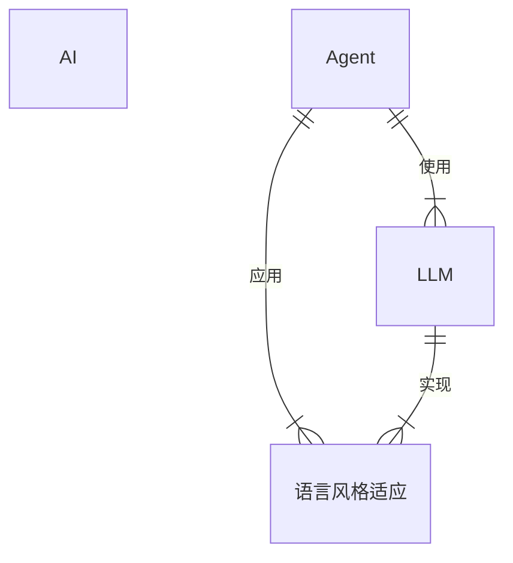

                 

# LLM在AI Agent语言风格适应中的应用

## 关键词

**大型语言模型 (LLM)**，**AI Agent**，**语言风格适应**，**预训练**，**风格迁移**，**文本生成**

## 摘要

随着人工智能技术的发展，AI Agent作为智能实体在各个领域发挥着越来越重要的作用。然而，AI Agent的语言能力，特别是语言风格的适应性，成为了一个关键问题。本文主要探讨了大型语言模型（LLM）在AI Agent语言风格适应中的应用，包括LLM的基本原理、算法实现以及应用实例。通过逐步分析，本文为读者提供了一个全面而深入的了解。

### 1.1 引言

在过去的几年里，人工智能（AI）技术取得了飞速的发展，特别是深度学习在自然语言处理（NLP）领域的突破，使得AI Agent能够更加自然地与人类交流。然而，不同领域的语言风格各异，如何在AI Agent中实现语言风格的适应，成为了当前研究的热点问题。大型语言模型（LLM）作为一种强大的AI技术，在解决这一问题中展现了巨大的潜力。

### 1.2 语言风格适应的重要性

语言风格适应是指AI系统在不同上下文中能够生成符合特定语言风格的文本。在AI Agent的应用中，语言风格适应的重要性体现在以下几个方面：

1. **提高交互体验**：符合用户期望的语言风格能够提高用户与AI Agent之间的交互体验，使交流更加自然和流畅。
2. **增强业务能力**：在特定业务场景中，如客服、教育和媒体等领域，具备良好语言风格的AI Agent能够更好地满足用户需求，提高业务效率。
3. **减少误解**：语言风格适应能够减少因语言风格不匹配导致的误解和歧义，提高AI Agent的可靠性和准确性。

### 1.3 LLM的基本原理

LLM是一种基于深度学习的自然语言处理模型，通过大规模无监督预训练和有监督微调，获得了强大的语言理解和生成能力。LLM的基本原理主要包括：

1. **预训练**：LLM在大规模的文本语料库上进行无监督预训练，通过自主学习语言模式和规律，形成对语言的深刻理解。
2. **微调**：在特定任务上，LLM通过有监督微调，进一步优化模型参数，使其在特定领域上表现出色。
3. **生成文本**：LLM利用其强大的语言理解能力，生成符合上下文和风格要求的自然语言文本。

### 1.4 LLM与传统AI技术的区别

与传统AI技术相比，LLM具有以下显著特点：

1. **更强的语言理解能力**：LLM通过大规模预训练，能够理解复杂多样的语言表达，远超传统的规则基AI系统。
2. **更好的泛化能力**：LLM在多个任务上表现出色，无需为每个任务重新训练模型，具有良好的泛化能力。
3. **更高的生成质量**：LLM生成的文本质量更高，更符合人类语言习惯，能够生成多样性和连贯性的文本。

### 1.5 LLM在AI Agent中的应用

LLM在AI Agent中的应用主要体现在以下几个方面：

1. **交互式对话**：LLM能够理解用户输入，并根据对话上下文生成自然、流畅的回复。
2. **文本生成**：LLM可以生成各种类型的文本，如文章、报告、电子邮件等，满足不同场景的需求。
3. **情感分析**：LLM能够分析文本中的情感色彩，为AI Agent提供情感识别和情绪响应的能力。

### 1.6 第1章小结

在本章中，我们首先对LLM在AI Agent语言风格适应中的应用进行了背景介绍，解释了为什么语言风格适应是一个关键问题，并概述了LLM在这一领域的重要性。接着，我们对LLM进行了深入探讨，详细介绍了其定义、特点以及与传统AI技术的区别。

### 1.7 核心概念与联系

在本节中，我们将列出与LLM在AI Agent语言风格适应中的应用相关的核心概念，并比较它们的属性特征。以下是一个表格示例：

| 核心概念 | 定义 | 属性特征 |
|----------|------|----------|
| LLM（大型语言模型） | 一种能够理解并生成自然语言文本的深度学习模型。 | 大规模训练数据、复杂模型结构、强大的语言理解能力。 |
| 语言风格适应 | 模型能够根据不同上下文生成符合特定语言风格的文本。 | 上下文感知、风格迁移、多样性生成。 |
| AI Agent | 具有目标、感知环境、自主行动能力的智能实体。 | 自主决策、交互能力、学习与适应。 |

为了进一步理解这些概念之间的关系，我们可以绘制一个ER实体关系图，如下：



### 1.8 算法原理讲解

在本节中，我们将讨论用于实现LLM在AI Agent语言风格适应中的主要算法原理。首先，我们使用mermaid绘制一个算法流程图：


#### 模型预训练

LLM通常通过大规模无监督预训练来获得强大的语言理解能力。我们使用Python代码片段来简要说明这一过程：

```python
from transformers import AutoModelForCausalLM

model = AutoModelForCausalLM.from_pretrained('gpt2')

# 预训练模型
model.train()
# 使用自定义数据集进行训练
# train_dataset = ...
# model.fit(train_dataset)
```

#### 风格迁移训练

在风格迁移训练阶段，我们需要加载特定的风格化数据，并对LLM进行调整，以适应目标风格。以下是算法的核心部分：

```python
from transformers import AutoTokenizer

tokenizer = AutoTokenizer.from_pretrained('gpt2')

def train_style_transfer(model, style_data, num_epochs):
    model.train()
    for epoch in range(num_epochs):
        for style_input in style_data:
            inputs = tokenizer(style_input, return_tensors='pt')
            outputs = model(inputs)
            loss = outputs.loss
            loss.backward()
            model.step()

# 风格化数据加载和处理
# style_dataset = ...

# 开始风格迁移训练
# train_style_transfer(model, style_dataset, num_epochs=5)
```

#### 模型评估

在训练完成后，我们需要评估模型在风格适应方面的性能。可以使用如下的评估指标：

```python
from sklearn.metrics import accuracy_score

def evaluate_model(model, test_data):
    model.eval()
    with torch.no_grad():
        for input_text, target_text in test_data
```

