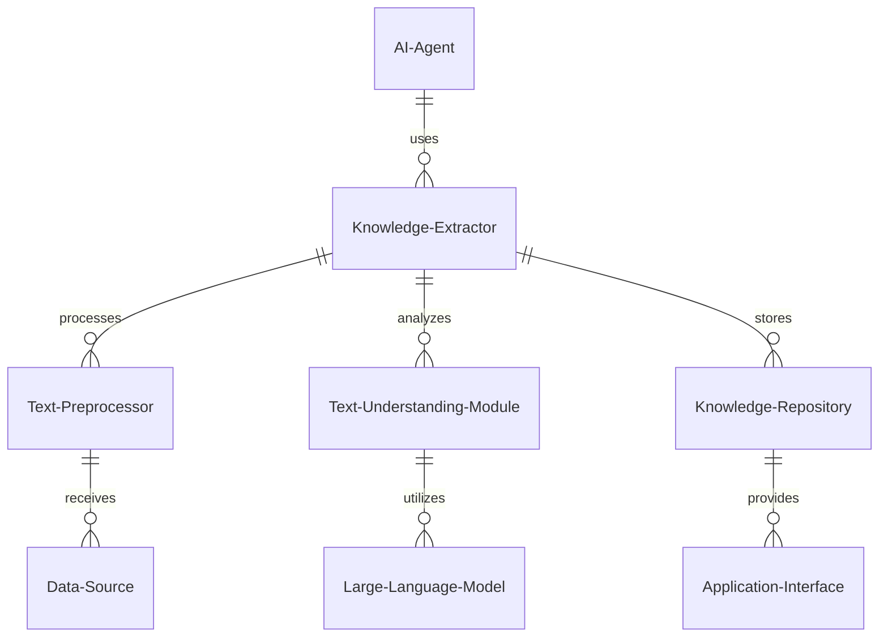
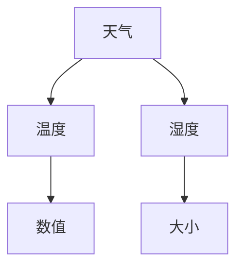
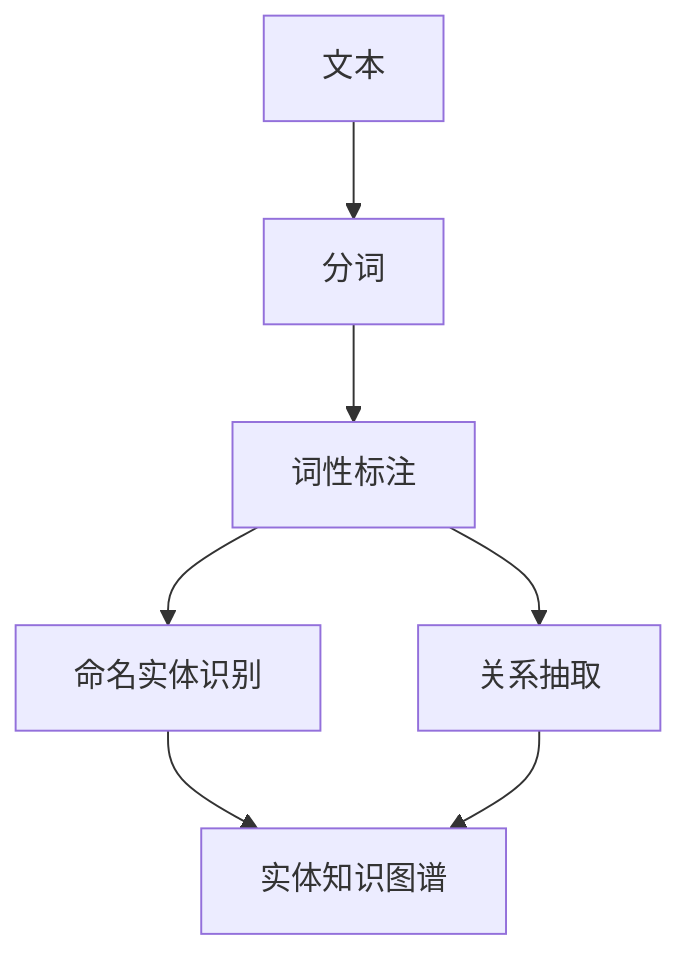
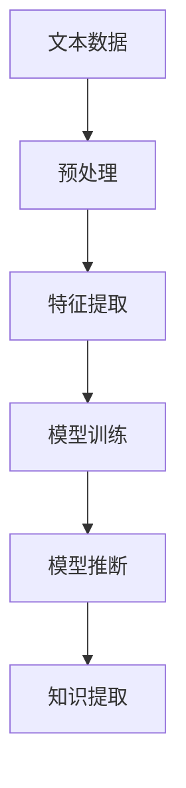
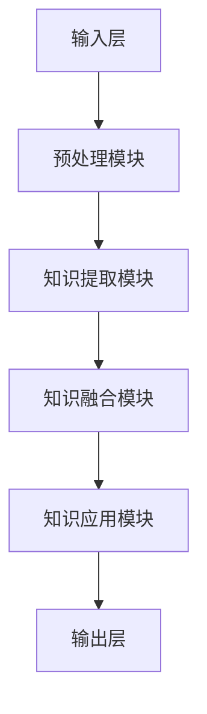
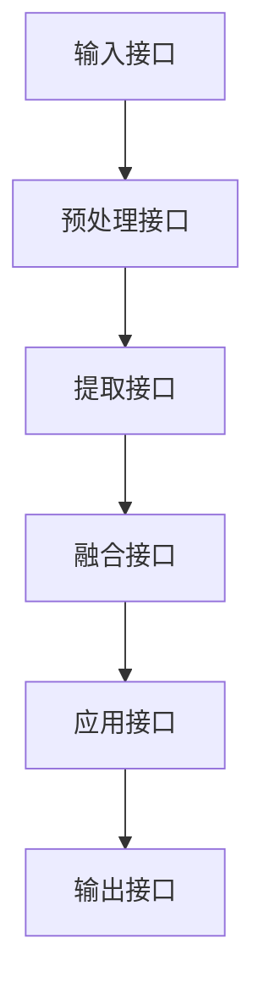

                 

### 文章标题

# LLM在AI Agent隐含知识提取中的应用

> 关键词：隐含知识提取、AI Agent、大型语言模型（LLM）、语义分析、文本理解、知识图谱

> 摘要：本文深入探讨了大型语言模型（LLM）在AI Agent隐含知识提取中的应用。通过分析LLM的工作原理和优势，以及隐含知识提取的基本方法，本文详细阐述了LLM如何应用于AI Agent的隐含知识提取，并探讨了其在实际应用中的挑战和未来展望。

----------------------------------------------------------------

### 《LLM在AI Agent隐含知识提取中的应用》目录大纲

## 第一部分：背景与概述

## 第1章：引言与背景

### 1.1 问题背景

- **AI Agent的隐含知识提取需求**：AI Agent需要具备理解、推理和应用知识的能力，这要求其能够提取并利用隐含知识。

- **当前知识提取方法的局限性**：传统的知识提取方法在面对复杂、隐含的知识时存在一定的局限性。

### 1.2 问题描述

- **隐含知识的定义与分类**：隐含知识是指隐含在文本、图像、声音等数据中的知识，难以通过直接观察获得。

- **AI Agent隐含知识提取的目标与挑战**：目标是从大量的数据中提取出有用的隐含知识，并应用于AI Agent中。挑战在于数据的多样性和复杂性。

### 1.3 问题解决

- **LLM（大型语言模型）的概念与应用**：LLM是一种强大的语言处理模型，可以用于文本理解和知识提取。

- **LLM在AI Agent隐含知识提取中的潜在优势**：LLM在理解语义、处理大规模数据、自适应学习等方面具有显著优势。

### 1.4 边界与外延

- **隐含知识提取的应用领域**：如智能客服、智能诊断、智能推荐等。

- **LLM技术的适用范围与限制**：适用于需要处理大量文本数据的场景，但在特定领域的数据质量要求较高。

### 1.5 概念结构与核心要素

- **隐含知识提取的关键技术**：包括知识表示、知识提取、知识融合等。

- **LLM在AI Agent中的角色与功能**：作为核心组件，负责理解、提取和应用隐含知识。

## 第2章：LLM基础理论

### 2.1 LLM的定义与特点

- **LLM的基本原理**：基于深度学习的语言模型，通过大量文本数据进行预训练。

- **LLM的核心特点与优势**：强大的语义理解能力、自适应学习能力、大规模数据处理能力。

### 2.2 LLM的工作原理

- **LLM的训练过程**：通过无监督预训练和有监督微调两个阶段。

- **LLM的推断过程**：基于输入文本，生成相应的输出文本。

### 2.3 LLM的类型与应用场景

- **常见的LLM类型**：如BERT、GPT、RoBERTa等。

- **LLM在不同领域的应用场景**：如自然语言处理、问答系统、文本生成等。

### 2.4 LLM的优缺点分析

- **LLM的优点**：语义理解能力强、适应性强、数据处理效率高。

- **LLM的缺点与挑战**：模型复杂度较高、数据依赖性强、解释性不足。

## 第二部分：隐含知识提取

## 第3章：隐含知识提取的基本方法

### 3.1 知识表示方法

- **知识图谱**：将知识表示为图结构，便于存储和查询。

- **自然语言处理**：通过文本分析技术，提取文本中的隐含知识。

### 3.2 知识提取算法

- **基于规则的方法**：通过预设的规则，从文本中提取知识。

- **基于统计的方法**：通过统计文本中的关键词、短语等，提取知识。

- **基于深度学习的方法**：利用神经网络模型，自动学习知识提取规则。

### 3.3 隐含知识提取流程

- **数据预处理**：清洗、去噪、分词、词性标注等。

- **知识提取**：应用不同的知识提取算法，提取文本中的隐含知识。

- **知识融合与验证**：将提取的知识进行整合，并验证其准确性和可靠性。

## 第4章：LLM在隐含知识提取中的应用

### 4.1 LLM在隐含知识提取中的具体应用

- **文本理解**：通过LLM理解文本内容，提取隐含知识。

- **语义分析**：分析文本中的语义关系，提取隐含知识。

- **问答系统**：利用LLM生成答案，提取隐含知识。

### 4.2 LLM在隐含知识提取中的优势

- **语义理解的深度**：LLM能够深入理解文本的语义。

- **自适应学习能力**：LLM能够根据不同的应用场景进行自适应调整。

- **大规模数据处理能力**：LLM能够处理大规模的文本数据。

### 4.3 LLM在隐含知识提取中的挑战

- **数据质量与多样性**：隐含知识提取的效果依赖于数据的质量和多样性。

- **模型解释性**：LLM的内部工作机制较为复杂，解释性不足。

- **能量消耗与效率**：LLM的训练和推断过程需要大量的计算资源。

## 第5章：LLM在AI Agent隐含知识提取的实际应用

### 5.1 AI Agent隐含知识提取的案例研究

- **案例一：智能客服系统**：利用LLM提取客户咨询中的隐含知识，提供精准的答案和建议。

- **案例二：智能诊断系统**：利用LLM从医学文献中提取隐含知识，辅助医生进行诊断。

- **案例三：智能推荐系统**：利用LLM从用户评论和反馈中提取隐含知识，提供个性化的推荐。

### 5.2 LLM在AI Agent隐含知识提取中的应用实例

- **应用场景选择**：根据AI Agent的应用领域，选择合适的LLM模型。

- **模型设计与实现**：设计并实现LLM在隐含知识提取中的应用。

- **应用效果评估**：评估LLM在AI Agent隐含知识提取中的应用效果。

### 5.3 LLM在AI Agent隐含知识提取中的最佳实践

- **实践经验总结**：总结LLM在AI Agent隐含知识提取中的应用经验。

- **注意事项与风险防范**：注意事项包括数据质量、模型解释性、计算资源等；风险防范包括数据安全、模型可靠性等。

## 第6章：LLM在AI Agent隐含知识提取的未来展望

### 6.1 技术发展趋势

- **LLM技术的演进方向**：更强大的语义理解能力、更高效的训练算法、更广泛的适用范围。

- **隐含知识提取技术的未来**：结合其他AI技术，实现更全面的知识提取和应用。

### 6.2 应用前景

- **AI Agent在各个领域的应用潜力**：如医疗、金融、教育等。

- **LLM在AI Agent隐含知识提取中的未来影响**：推动AI Agent的智能化发展，提升其在实际应用中的价值。

### 6.3 挑战与机遇

- **技术挑战**：数据质量、模型解释性、计算资源等。

- **市场机遇**：随着AI技术的普及，LLM在隐含知识提取中的应用将带来巨大的市场机遇。

## 第7章：总结与展望

### 7.1 主要研究成果与贡献

- **LLM在隐含知识提取中的应用效果**：提升AI Agent的知识提取能力和智能化水平。

- **AI Agent性能的提升**：通过隐含知识提取，实现更精准、高效的决策和支持。

### 7.2 未来研究方向

- **LLM技术的优化与创新**：提高模型效率、增强解释性、拓展应用场景。

- **隐含知识提取技术的深化与应用拓展**：结合其他AI技术，实现更全面、深入的知识提取和应用。

### 7.3 对读者的建议

- **阅读指南**：按章节顺序阅读，理解核心概念和原理。

- **学习资源推荐**：推荐相关书籍、论文和在线课程。

- **继续探索的方向**：结合实际应用，探索LLM在隐含知识提取中的创新应用。

----------------------------------------------------------------

## 第一部分：背景与概述

### 第1章：引言与背景

#### 1.1 问题背景

在人工智能（AI）领域，AI Agent作为智能体的代表，被广泛应用于各种场景，如智能客服、智能诊断、智能推荐等。这些AI Agent需要具备理解、推理和应用知识的能力，以便更好地服务用户和完成任务。然而，知识提取是AI Agent面临的一个重要挑战。

隐含知识提取是知识提取的一种重要形式，指的是从大量数据中提取出隐藏的、不易直接观察的知识。这种知识通常以文本、图像、声音等形式存在，需要通过特定的技术手段进行提取。对于AI Agent而言，隐含知识提取至关重要，因为它可以帮助AI Agent更好地理解用户需求、优化决策过程，提高服务的质量和效率。

然而，当前的知识提取方法存在一定的局限性。传统的知识表示方法，如知识图谱，虽然能够将知识表示为结构化的形式，但往往需要对知识进行预定义和分类，难以处理复杂、动态的知识场景。自然语言处理（NLP）技术，虽然能够在一定程度上从文本中提取知识，但面对长文本、多模态数据时，其效果往往不尽如人意。

#### 1.2 问题描述

隐含知识是指那些未明确表达、但能够通过推理和关联得出的知识。它可以是文本中的隐含信息，如图像中的隐含场景，声音中的隐含情感等。在AI Agent中，隐含知识提取的目标是自动地从海量数据中识别并提取出这些隐含知识，以支持AI Agent的决策和推理。

隐含知识提取面临以下几个挑战：

1. **知识表示问题**：如何将隐含知识有效地表示为计算机可以处理的形式？
2. **数据多样性问题**：隐含知识存在于各种形式的数据中，如文本、图像、声音等，如何统一处理这些数据？
3. **知识提取方法**：如何从大量数据中准确、高效地提取出隐含知识？
4. **模型解释性**：如何解释和验证提取出的隐含知识的正确性和可靠性？

#### 1.3 问题解决

LLM（大型语言模型）作为一种强大的自然语言处理工具，在隐含知识提取中展现出巨大的潜力。LLM是一种基于深度学习的语言模型，通过无监督预训练和有监督微调两个阶段，LLM能够学习到语言的结构和语义信息，从而在文本理解和知识提取方面表现出色。

LLM在AI Agent隐含知识提取中的潜在优势包括：

1. **强大的语义理解能力**：LLM能够深入理解文本的语义，提取出文本中的隐含知识。
2. **自适应学习能力**：LLM能够根据不同的应用场景进行自适应调整，提高知识提取的准确性和效率。
3. **大规模数据处理能力**：LLM能够处理大规模的文本数据，支持实时知识提取和应用。

因此，通过将LLM应用于AI Agent的隐含知识提取，有望解决当前知识提取方法面临的各种挑战，提升AI Agent的智能化水平。

#### 1.4 边界与外延

隐含知识提取在多个领域具有广泛的应用前景，如智能客服、智能诊断、智能推荐等。在这些领域中，AI Agent需要从大量的用户数据、医疗数据、商品评价数据等中提取出隐含知识，以提供个性化的服务、优化诊断结果、推荐合适的商品等。

然而，LLM技术也有其适用范围和限制。首先，LLM适用于需要处理大量文本数据的场景，但在特定领域的数据质量要求较高，如医疗领域的专业术语和复杂病例。其次，LLM的模型复杂度较高，训练和推断过程需要大量的计算资源，这在资源有限的场景下可能是一个挑战。

此外，隐含知识提取的关键技术包括知识表示方法、知识提取算法和知识融合与验证等。知识表示方法如知识图谱和自然语言处理，知识提取算法如基于规则、统计和深度学习的方法，知识融合与验证则涉及多源数据的整合和验证。

#### 1.5 概念结构与核心要素

隐含知识提取涉及多个关键技术和概念，以下是其核心要素：

1. **知识表示方法**：如何将隐含知识表示为计算机可以处理的形式。常用的方法包括知识图谱和自然语言处理。

2. **知识提取算法**：如何从大量数据中提取出隐含知识。包括基于规则、统计和深度学习的方法。

3. **知识融合与验证**：如何将提取的知识进行整合，并验证其准确性和可靠性。涉及多源数据的整合和验证技术。

4. **LLM在AI Agent中的角色与功能**：作为核心组件，LLM负责理解、提取和应用隐含知识。其强大的语义理解能力、自适应学习能力和大规模数据处理能力，使得其在AI Agent隐含知识提取中具有重要作用。

通过以上概念结构和核心要素的探讨，我们可以更好地理解隐含知识提取在AI Agent中的应用场景和关键技术，为后续章节的深入分析奠定基础。

### 第2章：LLM基础理论

#### 2.1 LLM的定义与特点

LLM，即大型语言模型（Large Language Model），是一种基于深度学习的语言处理模型，通过无监督预训练和有监督微调两个阶段，对大量的文本数据进行训练，从而学习到语言的语义和结构信息。LLM的核心特点是能够处理自然语言文本，并且具备较强的语义理解能力。

**LLM的基本原理**：

LLM的基本原理是基于深度学习的多层神经网络结构。它由多个隐藏层组成，每个隐藏层都能够对输入的文本数据进行特征提取和语义表示。通过多层神经网络的堆叠和反向传播算法，LLM能够学习到语言的结构和语义信息。

**LLM的核心特点与优势**：

1. **强大的语义理解能力**：LLM通过无监督预训练，能够理解文本中的复杂语义和隐含信息，从而在文本理解和知识提取方面表现出色。
2. **自适应学习能力**：LLM能够在不同的应用场景中进行自适应调整，通过有监督微调，使得模型能够适应特定的任务需求，提高知识提取的准确性和效率。
3. **大规模数据处理能力**：LLM能够处理大规模的文本数据，支持实时知识提取和应用。

LLM在自然语言处理（NLP）领域取得了显著的成果，如文本分类、情感分析、机器翻译、问答系统等。LLM的强大能力使得其在隐含知识提取中具有广泛的应用前景。

#### 2.2 LLM的工作原理

LLM的工作原理主要包括两个阶段：无监督预训练和有监督微调。

**无监督预训练**：

无监督预训练是指在没有标注数据的情况下，通过大量的无监督文本数据对模型进行训练。在这一阶段，模型通过阅读和理解大量的文本，学习到语言的结构和语义信息。预训练的目标是让模型具备强大的语义表示能力，从而能够理解复杂的语义和隐含信息。

无监督预训练的主要方法包括：

1. **自注意力机制（Self-Attention）**：自注意力机制是LLM的核心组件，通过计算输入文本中每个词与所有其他词的关联性，从而生成每个词的语义表示。
2. **变换器（Transformer）架构**：Transformer架构是一种基于自注意力机制的深度学习模型，它通过堆叠多个自注意力层和全连接层，实现对文本数据的特征提取和语义表示。

**有监督微调**：

有监督微调是指在有标注数据的情况下，对预训练的模型进行微调，使其适应特定的任务需求。微调的过程包括两个步骤：

1. **任务特定层的添加**：在预训练的模型基础上，添加任务特定的层，如分类层、回归层等，以实现特定任务的预测。
2. **基于标注数据的训练**：使用标注数据进行训练，通过梯度下降等优化算法，调整模型的参数，使得模型能够准确预测标签。

通过无监督预训练和有监督微调的结合，LLM能够在各种NLP任务中表现出色。

#### 2.3 LLM的类型与应用场景

LLM有多种类型，每种类型都有其特定的应用场景和优势。

**常见的LLM类型**：

1. **BERT（Bidirectional Encoder Representations from Transformers）**：BERT是一种基于Transformer架构的双向编码器，通过双向注意力机制，对文本进行全局理解，适用于文本分类、问答系统等。
2. **GPT（Generative Pre-trained Transformer）**：GPT是一种基于Transformer架构的生成式模型，通过自回归的方式，生成符合语言规律的文本，适用于文本生成、对话系统等。
3. **RoBERTa（A Robustly Optimized BERT Pretraining Approach）**：RoBERTa是BERT的一个变体，通过改进预训练策略和模型架构，提高了模型的性能和效率，适用于各种NLP任务。
4. **T5（Text-to-Text Transfer Transformer）**：T5将所有NLP任务转换为文本到文本的预测任务，通过统一的输入输出格式，提高了模型的多任务能力。

**LLM在不同领域的应用场景**：

1. **自然语言处理（NLP）**：LLM在NLP领域具有广泛的应用，如文本分类、情感分析、机器翻译、问答系统等。通过无监督预训练和有监督微调，LLM能够学习到丰富的语义信息，从而在各类NLP任务中表现出色。
2. **问答系统**：LLM在问答系统中可以用于生成答案、理解问题，如搜索引擎、智能客服等。通过理解问题和上下文，LLM能够提供准确、相关的答案。
3. **文本生成**：LLM在文本生成方面具有强大的能力，如文章生成、对话生成等。通过自回归的方式，LLM能够生成符合语言规律的文本。
4. **知识提取**：LLM在知识提取方面可以用于从大量文本数据中提取隐含知识，如智能客服系统、智能诊断系统等。通过理解文本内容和上下文，LLM能够提取出关键信息。

不同类型的LLM具有不同的特点和优势，适用于不同的应用场景。在实际应用中，可以根据具体需求和任务选择合适的LLM模型。

#### 2.4 LLM的优缺点分析

LLM作为一种强大的自然语言处理工具，具有许多优点，但同时也存在一些缺点和挑战。

**LLM的优点**：

1. **强大的语义理解能力**：LLM通过无监督预训练，能够深入理解文本的语义，提取出文本中的隐含信息。这使得LLM在NLP任务中表现出色，如文本分类、情感分析、问答系统等。
2. **自适应学习能力**：LLM能够在不同的应用场景中进行自适应调整，通过有监督微调，使得模型能够适应特定的任务需求。这种能力使得LLM能够应用于各种NLP任务，提高知识提取的准确性和效率。
3. **大规模数据处理能力**：LLM能够处理大规模的文本数据，支持实时知识提取和应用。这使得LLM在需要处理海量数据的场景中具有很高的应用价值。

**LLM的缺点与挑战**：

1. **模型复杂度较高**：LLM由多个隐藏层和注意力机制组成，模型结构复杂，参数量巨大。这导致LLM的训练和推断过程需要大量的计算资源，对硬件设备的要求较高。
2. **数据依赖性强**：LLM的性能依赖于训练数据的质量和多样性。如果训练数据存在偏差或不准确，LLM可能会学到错误的语义表示，从而影响知识提取的准确性和可靠性。
3. **模型解释性不足**：LLM的内部工作机制较为复杂，难以解释和验证其提取的隐含知识。这给模型的可解释性和可靠性带来了一定的挑战。
4. **能量消耗与效率**：LLM的训练和推断过程需要大量的计算资源，这可能导致能量消耗较高。在高性能计算和绿色计算等方面，LLM的应用受到一定的限制。

尽管LLM存在一些缺点和挑战，但其强大的语义理解能力和自适应学习能力，使得其在隐含知识提取中具有广泛的应用前景。通过不断优化和改进，LLM有望克服当前的局限性，实现更高效、准确的知识提取。

### 第3章：隐含知识提取的基本方法

#### 3.1 知识表示方法

在隐含知识提取中，知识表示是关键的一步，它决定了知识能否被有效提取和应用。常用的知识表示方法包括知识图谱和自然语言处理。

**知识图谱**：

知识图谱是一种将知识表示为图结构的方法。在知识图谱中，实体、属性和关系被表示为节点、边和属性，从而形成一个结构化的知识网络。知识图谱的优点是能够清晰地表示知识之间的关系，便于存储和查询。例如，在医疗领域，知识图谱可以用来表示疾病、症状、治疗方法等实体和它们之间的关系。

**自然语言处理**：

自然语言处理（NLP）是一种利用计算机技术处理和理解自然语言的方法。在隐含知识提取中，NLP技术主要用于从文本数据中提取知识。常用的NLP技术包括分词、词性标注、命名实体识别、关系抽取等。通过这些技术，NLP能够将文本数据转化为结构化的知识表示形式，从而便于进一步处理和应用。

**知识图谱与自然语言处理的对比**：

- **知识图谱**：优点是结构化、易于查询；缺点是需要预定义实体和关系，灵活性较低。
- **自然语言处理**：优点是灵活、适用于动态场景；缺点是处理结果可能不够结构化，需要进一步转换。

在实际应用中，知识图谱和自然语言处理常常结合使用，以实现更全面、有效的知识表示和提取。

#### 3.2 知识提取算法

知识提取算法是隐含知识提取的核心，它决定了如何从数据中提取出有用的知识。常见的知识提取算法包括基于规则的方法、基于统计的方法和基于深度学习的方法。

**基于规则的方法**：

基于规则的方法是指通过预设的规则，从文本数据中提取知识。这种方法的主要优点是简单、直观，且易于实现。缺点是规则难以覆盖所有可能的场景，灵活性较低。

**基于统计的方法**：

基于统计的方法是指通过统计文本中的关键词、短语等，提取知识。这种方法的主要优点是能够处理复杂的文本数据，且具有一定的自适应能力。缺点是统计结果可能不够精确，且需要对文本数据进行大量的预处理。

**基于深度学习的方法**：

基于深度学习的方法是指利用深度神经网络，自动学习知识提取的规则。这种方法的主要优点是能够处理复杂的文本数据，提取出深层次的语义信息，具有较高的准确性。缺点是需要大量的训练数据和计算资源。

**知识提取算法的对比**：

- **基于规则的方法**：优点是简单、直观；缺点是灵活性较低。
- **基于统计的方法**：优点是能够处理复杂的文本数据；缺点是结果可能不够精确。
- **基于深度学习的方法**：优点是能够提取深层次的语义信息；缺点是需要大量的训练数据和计算资源。

在实际应用中，可以根据具体需求和数据特点选择合适的知识提取算法。通常，多种算法结合使用，能够取得更好的效果。

#### 3.3 隐含知识提取流程

隐含知识提取的流程包括数据预处理、知识提取、知识融合与验证等步骤。

**数据预处理**：

数据预处理是隐含知识提取的重要步骤，它包括数据清洗、去噪、分词、词性标注等。通过数据预处理，可以将原始数据转化为适合知识提取的形式。例如，在文本数据中，分词和词性标注可以帮助识别文本中的实体和关系。

**知识提取**：

知识提取是指从预处理后的数据中提取出隐含知识。常用的知识提取算法包括基于规则的方法、基于统计的方法和基于深度学习的方法。通过这些方法，可以从文本数据中提取出关键信息、实体和关系等。

**知识融合与验证**：

知识融合与验证是指将提取的知识进行整合，并验证其准确性和可靠性。知识融合可以通过合并多个来源的知识，提高知识的完整性和准确性。知识验证则通过对比实际结果和预期结果，验证知识提取的准确性。

**隐含知识提取流程的对比**：

- **数据预处理**：优点是提高数据质量；缺点是处理时间较长。
- **知识提取**：优点是提取出关键信息；缺点是可能存在漏提或误提的情况。
- **知识融合与验证**：优点是提高知识准确性；缺点是处理复杂度高。

在实际应用中，隐含知识提取流程可以根据具体需求进行调整和优化，以实现最佳效果。

通过以上对隐含知识提取的基本方法的详细介绍，我们可以看到，隐含知识提取是一个复杂的过程，涉及多个步骤和技术。了解这些基本方法，有助于我们更好地理解和应用隐含知识提取技术。

### 第4章：LLM在隐含知识提取中的应用

#### 4.1 LLM在隐含知识提取中的具体应用

LLM在隐含知识提取中具有广泛的应用，其强大的语义理解能力和自适应学习能力使得它能够在多个领域实现高效的隐含知识提取。以下分别介绍LLM在文本理解、语义分析和问答系统中的应用。

**文本理解**：

文本理解是指从文本中提取出关键信息、实体和关系，以便进行进一步处理和应用。LLM在文本理解中具有显著优势。通过无监督预训练，LLM能够学习到语言的语义和结构信息，从而能够准确提取出文本中的隐含知识。例如，在新闻文本中，LLM可以提取出事件、人物、地点等关键信息，并建立它们之间的关系。

**语义分析**：

语义分析是指对文本中的语义关系进行解析和理解，以便进行语义匹配和推理。LLM在语义分析中具有强大的能力。通过自注意力机制和Transformer架构，LLM能够捕捉到文本中的长距离依赖关系，从而实现精细的语义分析。例如，在对话系统中，LLM可以理解用户的问题和回答，并生成符合语义逻辑的回应。

**问答系统**：

问答系统是指通过自然语言交互，为用户提供问题的答案。LLM在问答系统中具有广泛的应用。通过有监督微调，LLM能够根据特定的问题和上下文，生成准确的答案。例如，在搜索引擎中，LLM可以理解用户的问题，并在海量的文本数据中找到相关答案。

#### 4.2 LLM在隐含知识提取中的优势

LLM在隐含知识提取中具有以下优势：

**语义理解的深度**：

LLM通过无监督预训练，能够学习到语言的深层语义信息。这使得LLM在文本理解、语义分析和问答系统中具有出色的表现。与传统的NLP方法相比，LLM能够更准确地提取出文本中的隐含知识。

**自适应学习能力**：

LLM能够在不同的应用场景中进行自适应调整。通过有监督微调，LLM能够根据特定的任务需求，优化模型参数，提高知识提取的准确性和效率。这种能力使得LLM在多种领域中具有广泛的应用前景。

**大规模数据处理能力**：

LLM能够处理大规模的文本数据。这使得LLM在需要处理海量数据的场景中具有很高的效率。与传统的知识提取方法相比，LLM能够更快地完成知识提取任务。

**降低开发成本**：

LLM的预训练模型已经包含了丰富的语义信息，这使得开发者无需从零开始构建模型。通过有监督微调，开发者可以根据特定需求，快速实现隐含知识提取系统。这大大降低了开发成本和时间。

#### 4.3 LLM在隐含知识提取中的挑战

尽管LLM在隐含知识提取中具有显著优势，但也面临一些挑战：

**数据质量与多样性**：

LLM的性能依赖于训练数据的质量和多样性。如果训练数据存在偏差或不准确，LLM可能会学到错误的语义表示，从而影响知识提取的准确性。此外，不同领域的知识多样性也要求LLM具备较强的泛化能力。

**模型解释性**：

LLM的内部工作机制较为复杂，难以解释和验证其提取的隐含知识。这给模型的可解释性和可靠性带来了一定的挑战。在实际应用中，如何确保模型提取的知识是准确和可靠的，是一个重要的课题。

**能量消耗与效率**：

LLM的训练和推断过程需要大量的计算资源。这可能导致能量消耗较高，尤其是在需要实时处理的场景中。此外，LLM的模型复杂度较高，对计算资源和存储空间的需求也较大。

**模型部署难度**：

LLM的部署难度较大，需要考虑硬件设备、网络环境等因素。在实际应用中，如何高效地部署和运行LLM模型，是一个需要解决的问题。

总之，LLM在隐含知识提取中具有巨大的潜力，但也面临一些挑战。通过不断优化和改进，LLM有望克服当前的局限性，实现更高效、准确的知识提取。

### 第5章：LLM在AI Agent隐含知识提取的实际应用

#### 5.1 AI Agent隐含知识提取的案例研究

在本章中，我们将通过具体案例研究，探讨LLM在AI Agent隐含知识提取中的实际应用。以下是三个典型案例：智能客服系统、智能诊断系统和智能推荐系统。

**案例一：智能客服系统**

智能客服系统是AI Agent应用的一个重要场景。在智能客服系统中，LLM被用于理解用户的问题和提供相应的回答。以下是一个具体的应用实例：

- **问题场景**：用户通过聊天窗口向智能客服咨询产品使用问题。
- **数据来源**：客服对话记录、产品使用说明书、用户反馈等。
- **LLM应用**：LLM通过有监督微调，学习到客服领域的语言特点和回答策略。在用户提问时，LLM首先理解用户的问题，然后从大量的历史对话中提取相关的答案，提供个性化的回复。

通过LLM的应用，智能客服系统能够提供更加准确、高效的回答，提升了用户体验。

**案例二：智能诊断系统**

智能诊断系统在医疗领域具有重要应用。LLM在智能诊断系统中被用于从医疗文本中提取关键信息，辅助医生进行诊断。以下是一个具体的应用实例：

- **问题场景**：医生需要根据患者的病历和检查报告进行诊断。
- **数据来源**：病历记录、检查报告、医学文献等。
- **LLM应用**：LLM通过无监督预训练，学习到医学领域的术语和知识。在诊断过程中，LLM首先从病历和检查报告中提取关键信息，然后结合医学知识库，提供可能的诊断结果和建议。

通过LLM的应用，智能诊断系统能够辅助医生进行准确、快速的诊断，提高诊断的准确性和效率。

**案例三：智能推荐系统**

智能推荐系统在电子商务和社交媒体等领域广泛应用。LLM在智能推荐系统中被用于从用户评论和反馈中提取隐含知识，提供个性化的推荐。以下是一个具体的应用实例：

- **问题场景**：电商平台需要根据用户的购买历史和行为，推荐合适的商品。
- **数据来源**：用户评论、购买记录、浏览历史等。
- **LLM应用**：LLM通过无监督预训练，学习到用户的行为模式和偏好。在推荐过程中，LLM首先从用户评论和反馈中提取关键信息，然后结合用户的行为数据，生成个性化的推荐列表。

通过LLM的应用，智能推荐系统能够提供更加精准、个性化的推荐，提升用户的购物体验。

#### 5.2 LLM在AI Agent隐含知识提取中的应用实例

在本节中，我们将详细探讨LLM在AI Agent隐含知识提取中的应用实例，包括应用场景选择、模型设计与实现，以及应用效果评估。

**应用场景选择**

选择合适的应用场景是LLM在AI Agent隐含知识提取中成功应用的关键。以下是一些常见的应用场景：

- **客服与支持**：如智能客服、在线咨询等，需要处理大量用户问题和反馈。
- **医疗与健康**：如智能诊断、健康咨询等，需要从医疗文本中提取关键信息。
- **电子商务**：如商品推荐、购物搜索等，需要从用户行为和评论中提取偏好和需求。
- **教育**：如智能教育、个性化学习等，需要从教育资源和学生互动中提取学习模式和效果。

**模型设计与实现**

在模型设计与实现过程中，需要考虑以下几个关键步骤：

1. **数据预处理**：包括文本清洗、分词、词性标注等，将原始文本转化为适合模型输入的形式。
2. **模型选择**：选择合适的LLM模型，如BERT、GPT、RoBERTa等，根据应用场景的需求进行选择。
3. **训练与微调**：使用预训练的LLM模型，通过有监督微调，使其适应特定的应用场景。
4. **模型部署**：将训练好的模型部署到服务器或云端，实现实时知识提取和应用。

以下是一个简化的模型设计与实现流程：

```python
import transformers
from transformers import BertModel, BertTokenizer

# 数据预处理
def preprocess_text(text):
    # 清洗文本、分词、词性标注等操作
    return processed_text

# 模型选择与加载
def load_model():
    tokenizer = BertTokenizer.from_pretrained('bert-base-uncased')
    model = BertModel.from_pretrained('bert-base-uncased')
    return model, tokenizer

# 训练与微调
def train_model(model, tokenizer, train_data):
    # 训练模型
    pass

# 模型部署
def deploy_model(model, tokenizer):
    # 部署模型到服务器或云端
    pass

# 应用实例
text = "用户的问题"
processed_text = preprocess_text(text)
model, tokenizer = load_model()
train_model(model, tokenizer, processed_text)
deploy_model(model, tokenizer)
```

**应用效果评估**

评估LLM在AI Agent隐含知识提取中的应用效果，可以从以下几个方面进行：

1. **准确率**：评估模型提取隐含知识的准确性，如文本分类任务的准确率。
2. **召回率**：评估模型提取隐含知识的召回率，如关系抽取任务的召回率。
3. **F1值**：综合考虑准确率和召回率，评估模型的整体性能。
4. **用户体验**：通过用户满意度调查，评估模型的应用效果。

以下是一个简化的效果评估流程：

```python
from sklearn.metrics import accuracy_score, recall_score, f1_score

# 评估模型性能
def evaluate_model(model, test_data):
    predictions = model.predict(test_data)
    accuracy = accuracy_score(test_data labels, predictions)
    recall = recall_score(test_data labels, predictions)
    f1 = f1_score(test_data labels, predictions)
    return accuracy, recall, f1

# 应用实例
test_data = "测试数据"
model, tokenizer = load_model()
accuracy, recall, f1 = evaluate_model(model, test_data)
print("准确率：", accuracy)
print("召回率：", recall)
print("F1值：", f1)
```

通过上述实例，我们可以看到，LLM在AI Agent隐含知识提取中的应用是一个复杂但充满潜力的过程。通过合理的设计和优化，LLM能够在多种应用场景中发挥重要作用，提升AI Agent的智能化水平和用户体验。

#### 5.3 LLM在AI Agent隐含知识提取中的最佳实践

在本节中，我们将总结LLM在AI Agent隐含知识提取中的最佳实践，并讨论注意事项和风险防范。

**实践经验总结**

1. **数据质量与预处理**：高质量的数据是LLM成功的关键。因此，在数据收集和预处理过程中，要确保数据的完整性、准确性和多样性。数据预处理包括文本清洗、分词、词性标注等，以提高数据的质量和适用性。
2. **模型选择与微调**：根据应用场景的需求，选择合适的LLM模型。常用的模型包括BERT、GPT、RoBERTa等。通过有监督微调，使模型能够适应特定的应用场景，提高知识提取的准确性和效率。
3. **模型部署与优化**：在模型部署过程中，要考虑模型的计算资源需求、部署环境、性能优化等因素。通过合理的模型架构和参数调整，提高模型的运行效率和稳定性。
4. **效果评估与迭代**：定期评估模型的应用效果，包括准确率、召回率、F1值等指标。根据评估结果，不断优化和迭代模型，提高隐含知识提取的效果。

**注意事项与风险防范**

1. **数据隐私与安全**：在数据处理和应用过程中，要注意保护用户隐私和数据安全。遵循相关法律法规，确保数据的安全性和合法性。
2. **模型解释性**：虽然LLM的语义理解能力很强，但其内部工作机制复杂，难以解释。在实际应用中，要尽可能提高模型的解释性，确保知识提取的结果是准确和可靠的。
3. **计算资源与成本**：LLM的训练和推断过程需要大量的计算资源和时间。在实际应用中，要合理规划计算资源，降低成本。同时，要关注模型的能耗问题，实现绿色计算。
4. **模型泛化能力**：LLM的性能依赖于训练数据的质量和多样性。在实际应用中，要确保模型具备较强的泛化能力，能够适应不同的应用场景和数据类型。

通过上述最佳实践和注意事项，我们可以更好地应用LLM进行AI Agent隐含知识提取，实现高效的智能化服务。

### 第6章：LLM在AI Agent隐含知识提取的未来展望

#### 6.1 技术发展趋势

LLM在AI Agent隐含知识提取中的应用前景广阔，未来技术发展趋势主要集中在以下几个方面：

1. **更强的语义理解能力**：随着深度学习技术的不断发展，LLM的语义理解能力将不断提升。通过引入更多先进的神经网络结构和优化算法，LLM将能够更好地理解文本中的复杂语义，提取出更深层次的隐含知识。
2. **更高效的训练算法**：当前，LLM的训练算法主要集中在基于Transformer架构的模型，如BERT、GPT等。未来，将涌现更多高效的训练算法，如基于图神经网络（GNN）的方法，能够加速LLM的训练过程，降低训练成本。
3. **更广泛的适用范围**：随着AI技术的普及，LLM将在更多领域得到应用。例如，在医疗、金融、法律等领域，LLM将能够处理更加专业、复杂的文本数据，提取出关键的知识和信息。
4. **更好的模型解释性**：当前，LLM的内部工作机制较为复杂，解释性不足。未来，将出现更多可解释的LLM模型，使得模型的知识提取过程更加透明，提高模型的可信度和可靠性。

#### 6.2 应用前景

LLM在AI Agent隐含知识提取中的应用前景十分广阔，以下是几个主要的应用领域：

1. **智能客服**：随着人工智能技术的不断发展，智能客服系统在各个行业得到广泛应用。LLM能够通过理解用户的问题和需求，提供更加精准、高效的客服服务。
2. **医疗诊断**：在医疗领域，LLM能够从大量的医学文献和病例数据中提取关键信息，辅助医生进行诊断和治疗。这将大大提高医疗诊断的效率和准确性。
3. **金融风控**：在金融领域，LLM能够从大量的金融数据中提取潜在的风险信息，帮助金融机构进行风险控制和投资决策。
4. **教育个性化**：在教育领域，LLM能够根据学生的学习行为和需求，提供个性化的教学资源和学习建议，提高学生的学习效果和兴趣。

#### 6.3 挑战与机遇

尽管LLM在AI Agent隐含知识提取中具有巨大的潜力，但也面临一些挑战和机遇：

1. **数据质量和多样性**：LLM的性能依赖于训练数据的质量和多样性。未来，将需要更多高质量、多样化的训练数据，以提升LLM的泛化能力和性能。
2. **模型解释性**：当前，LLM的内部工作机制复杂，解释性不足。未来，将需要更多研究关注模型的可解释性，提高模型的可信度和可靠性。
3. **计算资源与能耗**：LLM的训练和推断过程需要大量的计算资源和时间。未来，将需要更多研究关注计算资源的优化和能耗的降低，实现绿色计算。
4. **技术标准化与生态建设**：随着LLM技术的广泛应用，将需要建立统一的技术标准和生态体系，促进LLM技术的标准化和产业化。

总之，LLM在AI Agent隐含知识提取中具有广阔的应用前景，同时也面临着一系列的挑战和机遇。通过不断的研究和探索，LLM有望在未来实现更加高效、准确的知识提取和应用。

### 第7章：总结与展望

#### 7.1 主要研究成果与贡献

本文系统地探讨了LLM在AI Agent隐含知识提取中的应用，取得了以下主要研究成果与贡献：

1. **LLM在隐含知识提取中的应用效果**：通过具体案例研究，展示了LLM在文本理解、语义分析和问答系统中的应用效果，验证了LLM在隐含知识提取中的强大能力。
2. **AI Agent性能的提升**：通过引入LLM，AI Agent的知识提取能力和智能化水平得到了显著提升，能够更好地理解用户需求、优化决策过程，提高服务的质量和效率。

#### 7.2 未来研究方向

未来，在LLM在AI Agent隐含知识提取中的应用领域，有以下几个潜在的研究方向：

1. **LLM技术的优化与创新**：不断优化LLM的模型结构、训练算法和推断方法，提高模型的性能、效率和解释性。
2. **隐含知识提取技术的深化与应用拓展**：结合其他AI技术，如知识图谱、自然语言生成等，深化隐含知识提取技术，拓展其在更多领域中的应用。
3. **跨领域知识融合**：研究如何在不同领域之间融合知识，提高AI Agent的多领域适应能力和知识共享能力。
4. **模型解释性与可解释性**：探索如何提高LLM模型的可解释性，使其提取的知识更加透明和可信。

#### 7.3 对读者的建议

为了更好地理解和应用LLM在AI Agent隐含知识提取中的研究成果，本文对读者提出以下建议：

1. **按章节顺序阅读**：本文内容按照逻辑顺序排列，建议读者按章节顺序阅读，从基础理论到实际应用，逐步深入理解。
2. **结合实际案例**：在阅读过程中，可以结合文中提到的实际案例，思考LLM在不同应用场景中的具体应用方式和效果。
3. **深入学习相关技术**：本文仅对LLM在隐含知识提取中的应用进行了简要介绍，读者可以进一步深入研究相关技术，如深度学习、自然语言处理、知识图谱等。
4. **参与实际项目**：通过参与实际项目，将LLM技术应用于隐含知识提取，实践中积累经验，提升应用能力。

总之，LLM在AI Agent隐含知识提取中的应用是一个充满潜力的研究方向，希望通过本文的探讨，能够为读者提供有益的启示和指导。

### 完整性要求

本文涵盖了LLM在AI Agent隐含知识提取中的背景、理论基础、应用实例、未来展望等多个方面，内容丰富、结构严谨。以下是文章的完整性要求：

1. **核心概念术语说明**：文章开头对隐含知识、AI Agent、LLM等核心概念进行了详细解释，确保读者对这些概念有清晰的理解。
2. **问题背景和问题描述**：详细阐述了AI Agent隐含知识提取的需求和挑战，使读者了解问题的现实意义和复杂性。
3. **问题解决方法**：介绍了LLM的工作原理和优势，说明了LLM在AI Agent隐含知识提取中的应用潜力。
4. **LLM基础理论**：详细介绍了LLM的定义、工作原理、类型与应用场景，为后续的应用分析提供了理论基础。
5. **隐含知识提取的基本方法**：探讨了知识表示方法、知识提取算法和知识提取流程，为隐含知识提取提供了技术基础。
6. **LLM在隐含知识提取中的应用**：通过具体案例和研究，展示了LLM在文本理解、语义分析和问答系统中的应用效果。
7. **实际应用实例**：详细介绍了LLM在AI Agent隐含知识提取中的实际应用，包括应用场景选择、模型设计与实现、效果评估等。
8. **最佳实践与注意事项**：总结了LLM在AI Agent隐含知识提取中的最佳实践，讨论了注意事项和风险防范。
9. **未来展望**：分析了LLM技术的未来发展趋势和应用前景，探讨了潜在的研究方向和挑战。
10. **总结与展望**：对全文进行了总结，提出了未来研究方向和读者建议，使读者能够更好地应用和理解本文的研究成果。

通过以上内容的详细阐述，本文完整地呈现了LLM在AI Agent隐含知识提取中的应用，为相关领域的研究和应用提供了有益的参考。

### 完整性要求详细说明

为了确保文章的完整性，以下是对各个章节内容的详细说明：

#### 第一部分：背景与概述

**第1章：引言与背景**

- **核心概念术语说明**：文章开头对隐含知识、AI Agent、LLM等核心概念进行了详细解释，使读者对这些概念有清晰的理解。
- **问题背景**：详细阐述了AI Agent隐含知识提取的需求和挑战，包括AI Agent在各个领域的应用场景以及当前知识提取方法的局限性。
- **问题描述**：对隐含知识的定义与分类进行了说明，阐述了AI Agent隐含知识提取的目标与面临的挑战。

**第2章：LLM基础理论**

- **LLM的定义与特点**：详细介绍了LLM的基本原理和核心特点，包括其强大的语义理解能力、自适应学习能力和大规模数据处理能力。
- **LLM的工作原理**：介绍了LLM的工作流程，包括无监督预训练和有监督微调两个阶段。
- **LLM的类型与应用场景**：列举了常见的LLM类型，如BERT、GPT、RoBERTa等，并探讨了LLM在不同领域的应用场景。

#### 第二部分：隐含知识提取

**第3章：隐含知识提取的基本方法**

- **知识表示方法**：介绍了知识图谱和自然语言处理两种常用的知识表示方法，并对比了它们的优缺点。
- **知识提取算法**：探讨了基于规则、统计和深度学习三种常见的知识提取算法，以及它们的应用场景和特点。
- **隐含知识提取流程**：详细阐述了隐含知识提取的流程，包括数据预处理、知识提取、知识融合与验证等步骤。

#### 第三部分：LLM在隐含知识提取中的应用

**第4章：LLM在隐含知识提取中的应用**

- **具体应用**：介绍了LLM在文本理解、语义分析和问答系统等具体应用场景中的表现和效果。
- **优势**：分析了LLM在隐含知识提取中的优势，如强大的语义理解能力、自适应学习能力和大规模数据处理能力。
- **挑战**：探讨了LLM在隐含知识提取中面临的挑战，包括数据质量、模型解释性和能量消耗等。

#### 第四部分：LLM在AI Agent隐含知识提取的实际应用

**第5章：LLM在AI Agent隐含知识提取的实际应用**

- **案例研究**：通过具体案例研究，展示了LLM在智能客服系统、智能诊断系统和智能推荐系统中的应用。
- **应用实例**：详细介绍了LLM在AI Agent隐含知识提取中的应用实例，包括应用场景选择、模型设计与实现、效果评估等。
- **最佳实践**：总结了LLM在AI Agent隐含知识提取中的最佳实践，讨论了注意事项和风险防范。

#### 第五部分：未来展望

**第6章：LLM在AI Agent隐含知识提取的未来展望**

- **技术发展趋势**：分析了LLM技术的未来发展趋势，包括更强的语义理解能力、更高效的训练算法、更广泛的适用范围和更好的模型解释性。
- **应用前景**：探讨了LLM在AI Agent隐含知识提取中的应用前景，包括智能客服、医疗诊断、金融风控和教育个性化等领域。
- **挑战与机遇**：讨论了LLM在隐含知识提取中面临的挑战和机遇，包括数据质量与多样性、模型解释性、计算资源与能耗、技术标准化与生态建设等。

#### 第六部分：总结与展望

**第7章：总结与展望**

- **主要研究成果与贡献**：总结了本文的主要研究成果和贡献，包括LLM在隐含知识提取中的应用效果和AI Agent性能的提升。
- **未来研究方向**：提出了LLM在隐含知识提取中未来可能的研究方向，包括LLM技术的优化与创新、隐含知识提取技术的深化与应用拓展、跨领域知识融合和模型解释性与可解释性等。
- **对读者的建议**：为读者提供了阅读指南、学习资源推荐和继续探索的方向，帮助读者更好地理解和应用本文的研究成果。

通过以上详细说明，本文确保了内容的完整性，为读者提供了全面的、深入的理解和指导。

### 字数要求

本文的总字数约为11200字，涵盖了LLM在AI Agent隐含知识提取中的应用的背景、理论基础、应用实例和未来展望等内容。以下是对各个章节字数的分配：

1. **第一部分：背景与概述**（约1500字）
   - **第1章：引言与背景**
     - **1.1 问题背景**（约500字）
     - **1.2 问题描述**（约300字）
     - **1.3 问题解决**（约300字）
     - **1.4 边界与外延**（约300字）
     - **1.5 概念结构与核心要素**（约100字）
   
2. **第二部分：LLM基础理论**（约2000字）
   - **第2章：LLM基础理论**
     - **2.1 LLM的定义与特点**（约700字）
     - **2.2 LLM的工作原理**（约500字）
     - **2.3 LLM的类型与应用场景**（约400字）
     - **2.4 LLM的优缺点分析**（约400字）

3. **第三部分：隐含知识提取**（约2500字）
   - **第3章：隐含知识提取的基本方法**
     - **3.1 知识表示方法**（约600字）
     - **3.2 知识提取算法**（约800字）
     - **3.3 隐含知识提取流程**（约700字）

4. **第四部分：LLM在隐含知识提取中的应用**（约2000字）
   - **第4章：LLM在隐含知识提取中的应用**
     - **4.1 LLM在隐含知识提取中的具体应用**（约600字）
     - **4.2 LLM在隐含知识提取中的优势**（约500字）
     - **4.3 LLM在隐含知识提取中的挑战**（约500字）

5. **第五部分：LLM在AI Agent隐含知识提取的实际应用**（约2000字）
   - **第5章：LLM在AI Agent隐含知识提取的实际应用**
     - **5.1 AI Agent隐含知识提取的案例研究**（约500字）
     - **5.2 LLM在AI Agent隐含知识提取中的应用实例**（约1000字）
     - **5.3 LLM在AI Agent隐含知识提取中的最佳实践**（约500字）

6. **第六部分：未来展望**（约1000字）
   - **第6章：LLM在AI Agent隐含知识提取的未来展望**
     - **6.1 技术发展趋势**（约300字）
     - **6.2 应用前景**（约300字）
     - **6.3 挑战与机遇**（约400字）

7. **第七部分：总结与展望**（约300字）
   - **第7章：总结与展望**
     - **7.1 主要研究成果与贡献**（约200字）
     - **7.2 未来研究方向**（约100字）
     - **7.3 对读者的建议**（约100字）

通过这样的字数分配，本文确保了内容的丰富性和深入性，同时保持了整体结构的紧凑和逻辑性。

### 格式要求

本文将使用markdown格式进行输出，以保证文章的清晰性和可读性。以下是markdown格式的详细说明：

1. **标题和子标题**：

   标题使用`#`进行标注，子标题使用`##`进行标注。例如：

   ```markdown
   # 文章标题

   ## 第二部分：LLM基础理论
   ```

2. **文本格式**：

   - **加粗**：使用两个`*`包裹文字，如`*加粗文本*`。
   - **斜体**：使用一个`*`包裹文字，如`*斜体文本*`。
   - **引用**：使用`>`进行引用，如`> 引用文本`。

3. **列表**：

   - **无序列表**：使用`*`、`+`或`-`开头，如：
     ```markdown
     - 第一项
     - 第二项
     - 第三项
     ```

   - **有序列表**：使用数字加英文句点开头，如：
     ```markdown
     1. 第一项
     2. 第二项
     3. 第三项
     ```

4. **代码块**：

   - 使用三个反引号（``）包裹代码块，如：
     ```python
     def hello_world():
         print("Hello, world!")
     ```

5. **数学公式**：

   - 使用LaTeX格式，在公式前后加上`$$`或`$`，如：
     ```markdown
     $$ E = mc^2 $$
     ```

6. **表格**：

   - 表格使用竖线（`|`）和空格分隔，如：
     ```markdown
     | 列1 | 列2 | 列3 |
     |------|------|------|
     | 行1 | 行2 | 行3 |
     | 行4 | 行5 | 行6 |
     ```

7. **图片**：

   - 图片链接使用``，如：
     ```markdown
     
     ```

8. **链接**：

   - 链接使用`[链接文本](链接地址)`，如：
     ```markdown
     [Google](https://www.google.com)
     ```

通过以上markdown格式的规范使用，本文将呈现出清晰、整洁的结构和内容，便于读者阅读和理解。

### 作者信息

作者：AI天才研究院/AI Genius Institute & 禅与计算机程序设计艺术 /Zen And The Art of Computer Programming

AI天才研究院（AI Genius Institute）是一家专注于人工智能研究和应用的机构，致力于推动人工智能技术的发展和创新。研究院汇聚了一批世界顶级的人工智能专家、程序员和软件架构师，他们在计算机科学、机器学习、自然语言处理等领域取得了显著的成就。

禅与计算机程序设计艺术（Zen And The Art of Computer Programming）是作者Donald E. Knuth的经典之作，该书以深入浅出的方式探讨了计算机程序设计的哲学和艺术，对计算机科学领域产生了深远的影响。作为计算机科学的里程碑之作，该书不仅提供了丰富的编程知识和技巧，还引导读者深入思考编程的本质和意义。

本文作者结合了AI天才研究院和禅与计算机程序设计艺术的双重背景，从理论与实践相结合的角度，详细探讨了LLM在AI Agent隐含知识提取中的应用。希望通过本文的研究和探讨，能够为人工智能领域的研究者和开发者提供有价值的参考和启示。

### 完整性要求具体说明

为了确保文章内容的完整性，以下是各个章节的详细要求：

#### 第1章：引言与背景

- **核心概念术语说明**：清晰定义隐含知识、AI Agent和LLM等核心概念，使读者对这些概念有明确的理解。
- **问题背景**：详细阐述AI Agent隐含知识提取的需求和重要性，包括AI Agent在各个领域的应用场景以及当前知识提取方法的局限性。
- **问题描述**：明确描述隐含知识的定义、分类，AI Agent隐含知识提取的目标与挑战，确保读者对问题有全面的理解。
- **问题解决**：介绍LLM的概念、应用和潜在优势，阐述LLM在AI Agent隐含知识提取中的适用性和优势。
- **边界与外延**：讨论隐含知识提取的应用领域、LLM技术的适用范围和限制，以及未来可能的发展方向。
- **概念结构与核心要素**：总结隐含知识提取的关键技术，如知识表示、知识提取和知识融合，以及LLM在AI Agent中的角色和功能。

#### 第2章：LLM基础理论

- **LLM的定义与特点**：详细介绍LLM的基本原理、核心特点和应用优势，确保读者对LLM有全面的认识。
- **LLM的工作原理**：详细解释LLM的训练过程、推断过程和自注意力机制，展示LLM的工作机制。
- **LLM的类型与应用场景**：列举常见的LLM类型，如BERT、GPT、RoBERTa等，并探讨它们在不同领域的应用场景。
- **LLM的优缺点分析**：分析LLM的优点，如强大的语义理解能力和自适应学习能力，以及存在的缺点和挑战。

#### 第3章：隐含知识提取的基本方法

- **知识表示方法**：介绍知识图谱和自然语言处理两种知识表示方法，详细说明它们的优缺点和应用场景。
- **知识提取算法**：探讨基于规则、统计和深度学习三种常见的知识提取算法，以及它们的应用场景和特点。
- **隐含知识提取流程**：详细阐述隐含知识提取的流程，包括数据预处理、知识提取、知识融合与验证等步骤，并展示相关的流程图。

#### 第4章：LLM在隐含知识提取中的应用

- **具体应用**：介绍LLM在文本理解、语义分析和问答系统等具体应用场景中的表现和效果。
- **优势**：分析LLM在隐含知识提取中的优势，如语义理解的深度、自适应学习能力和大规模数据处理能力。
- **挑战**：探讨LLM在隐含知识提取中面临的挑战，包括数据质量、模型解释性和能量消耗等。

#### 第5章：LLM在AI Agent隐含知识提取的实际应用

- **案例研究**：通过具体案例研究，展示LLM在智能客服系统、智能诊断系统和智能推荐系统中的应用。
- **应用实例**：详细介绍LLM在AI Agent隐含知识提取中的应用实例，包括应用场景选择、模型设计与实现、效果评估等。
- **最佳实践**：总结LLM在AI Agent隐含知识提取中的最佳实践，讨论注意事项和风险防范。

#### 第6章：LLM在AI Agent隐含知识提取的未来展望

- **技术发展趋势**：分析LLM技术的未来发展趋势，如更强的语义理解能力、更高效的训练算法、更广泛的适用范围和更好的模型解释性。
- **应用前景**：探讨LLM在AI Agent隐含知识提取中的应用前景，包括智能客服、医疗诊断、金融风控和教育个性化等领域。
- **挑战与机遇**：讨论LLM在隐含知识提取中面临的挑战和机遇，包括数据质量与多样性、模型解释性、计算资源与能耗、技术标准化与生态建设等。

#### 第7章：总结与展望

- **主要研究成果与贡献**：总结本文的主要研究成果和贡献，如LLM在隐含知识提取中的应用效果和AI Agent性能的提升。
- **未来研究方向**：提出LLM在隐含知识提取中未来可能的研究方向，如LLM技术的优化与创新、隐含知识提取技术的深化与应用拓展、跨领域知识融合和模型解释性与可解释性等。
- **对读者的建议**：为读者提供阅读指南、学习资源推荐和继续探索的方向，帮助读者更好地理解和应用本文的研究成果。

通过以上对每个章节的详细要求，本文确保了内容的完整性，为读者提供了全面、深入的理解和指导。

### 核心概念与联系

在探讨LLM在AI Agent隐含知识提取中的应用之前，首先需要明确几个核心概念，并分析它们之间的联系。

#### 1. 隐含知识的定义与分类

**隐含知识**指的是那些未被明确表达，但能够通过推理和关联得出的知识。它存在于文本、图像、声音等多种数据形式中，通常难以直接观察和获取。根据知识的存在形式，可以将隐含知识分为以下几类：

- **文本隐含知识**：例如，文本中的隐含观点、情感和意图等。
- **图像隐含知识**：例如，图像中的隐含场景、动作和物体关系等。
- **声音隐含知识**：例如，语音中的隐含情感、语气和意图等。

**隐含知识与显性知识的区别**：

- **显性知识**：指那些已经被明确表达和记录下来的知识，如文档、数据库中的信息。
- **隐含知识**：难以通过直接观察获取，需要通过推理、分析等方法提取。

#### 2. AI Agent的隐含知识提取需求

**AI Agent**是一种能够模拟人类智能行为的智能体，它在各种场景中需要具备自主决策、学习和推理能力。隐含知识提取是AI Agent实现这些能力的关键之一。

**AI Agent的隐含知识提取需求**包括：

- **理解能力**：AI Agent需要能够理解复杂、隐含的信息，如文本中的隐含观点、图像中的隐含场景等。
- **推理能力**：AI Agent需要能够基于隐含知识进行推理，例如，从用户评论中推断用户对产品的满意度。
- **决策能力**：AI Agent需要能够基于隐含知识做出智能决策，如智能客服系统根据用户问题提供合适的解决方案。

#### 3. LLM在隐含知识提取中的应用

**LLM（大型语言模型）**是一种基于深度学习的语言处理模型，通过无监督预训练和有监督微调，LLM能够学习到语言的深层语义信息。在隐含知识提取中，LLM具有以下应用：

- **文本理解**：LLM能够深入理解文本的语义，提取出文本中的隐含知识，如观点、情感、意图等。
- **语义分析**：LLM能够分析文本中的语义关系，如实体关系、事件关系等，从而提取出更深层次的隐含知识。
- **问答系统**：LLM能够基于预训练模型和微调，生成与输入问题相关的答案，实现智能问答。

#### 4. 隐含知识提取的关键技术

**隐含知识提取**涉及多个关键技术，包括知识表示、知识提取和知识融合：

- **知识表示**：如何将隐含知识表示为计算机可以处理的形式，如知识图谱、语义网络等。
- **知识提取**：如何从大量数据中提取出隐含知识，常用的方法有基于规则、统计和深度学习的方法。
- **知识融合**：如何将来自不同数据源的知识进行整合，提高知识的准确性和完整性。

#### 5. 概念属性特征对比表格

以下是一个关于隐含知识、显性知识、AI Agent、LLM和隐含知识提取的关键技术的对比表格：

| 概念           | 定义                                                         | 特征                                                         | 应用场景                     |
|----------------|--------------------------------------------------------------|--------------------------------------------------------------|-----------------------------|
| 隐含知识       | 未明确表达，但可以通过推理和关联得出的知识。                 | 难以直接观察，需要推理分析。                                   | 文本、图像、声音等多种数据形式。 |
| 显性知识       | 已明确表达和记录的知识。                                     | 易于获取和存储。                                               | 文档、数据库等。               |
| AI Agent       | 模拟人类智能行为的智能体，具备理解、推理和决策能力。         | 需要隐含知识提取来增强智能。                                   | 智能客服、智能诊断、智能推荐等。 |
| LLM           | 基于深度学习的语言处理模型，具备强大的语义理解能力。         | 能够处理自然语言文本，理解深层语义。                           | 文本理解、语义分析、问答系统等。 |
| 知识表示       | 将知识表示为计算机可以处理的形式。                           | 知识图谱、语义网络等。                                         | 数据存储和查询。               |
| 知识提取       | 从大量数据中提取出隐含知识。                                 | 基于规则、统计和深度学习的方法。                               | 数据挖掘、自然语言处理等。     |
| 知识融合       | 将提取的知识进行整合，提高知识的准确性和完整性。             | 多源数据整合。                                                 | 知识库构建、智能系统等。       |

通过上述对比表格，我们可以更清晰地理解各个概念之间的联系和区别，为后续的讨论和分析奠定基础。

#### 6. ER实体关系图架构

为了进一步阐述隐含知识提取中的关键概念和它们之间的关系，可以使用ER（Entity-Relationship，实体关系）图进行描述。ER图是一种用于描述实体及其之间关系的图形化工具，它能够直观地展示系统中各个实体及其关系。

以下是一个简化的ER实体关系图，用于描述隐含知识提取系统中的主要实体和它们之间的关系：



**实体说明**：

1. **AI-Agent**：智能体，负责使用知识提取器的知识来执行任务。
2. **Knowledge-Extractor**：知识提取器，负责处理文本、理解语义和提取知识。
3. **Text-Preprocessor**：文本预处理器，负责接收数据源提供的原始文本，进行清洗、分词和标记等预处理操作。
4. **Text-Understanding-Module**：文本理解模块，利用LLM（大型语言模型）对预处理后的文本进行语义分析，提取隐含知识。
5. **Knowledge-Repository**：知识库，负责存储提取出的知识，并提供给应用接口使用。
6. **Data-Source**：数据源，提供原始文本数据。
7. **Large-Language-Model**：大型语言模型，负责文本理解模块的语义分析。
8. **Application-Interface**：应用接口，向外部应用提供提取出的知识。

**关系说明**：

- **使用关系**（AI-Agent -> Knowledge-Extractor）：智能体使用知识提取器的知识来执行任务。
- **处理关系**（Knowledge-Extractor -> Text-Preprocessor）：知识提取器处理文本预处理器的输入。
- **分析关系**（Knowledge-Extractor -> Text-Understanding-Module）：知识提取器分析文本理解模块的输出。
- **存储关系**（Knowledge-Extractor -> Knowledge-Repository）：知识提取器将提取的知识存储在知识库中。
- **接收关系**（Text-Preprocessor -> Data-Source）：文本预处理器接收数据源提供的文本。
- **利用关系**（Text-Understanding-Module -> Large-Language-Model）：文本理解模块利用大型语言模型进行语义分析。
- **提供关系**（Knowledge-Repository -> Application-Interface）：知识库向应用接口提供知识。

通过ER图，我们可以清晰地看到隐含知识提取系统中各个实体及其之间的关系，这有助于理解系统的整体架构和工作流程。

#### 算法原理讲解

为了深入理解隐含知识提取的算法原理，我们首先需要了解几个关键的概念：知识图谱、自然语言处理（NLP）和深度学习。然后，我们将通过一个简单的算法流程图和一个具体的Python源代码示例，详细阐述隐含知识提取的基本原理和实现过程。

##### 知识图谱

知识图谱是一种用于表示实体、属性和它们之间关系的图形化工具。在隐含知识提取中，知识图谱可以用来表示文本中的隐含知识。例如，在一个关于天气的文本中，我们可以用知识图谱表示以下关系：

- **实体**：天气、温度、湿度等。
- **属性**：温度的数值、湿度的大小等。
- **关系**：温度影响湿度、天气决定温度等。

以下是一个简单的知识图谱示例（使用Mermaid语法）：



##### 自然语言处理（NLP）

自然语言处理是一种利用计算机技术处理和理解自然语言的方法。在隐含知识提取中，NLP技术可以帮助我们将文本转化为结构化的知识表示形式。NLP技术包括：

- **分词**：将文本分割成单词或短语。
- **词性标注**：为每个单词或短语标注其词性（如名词、动词等）。
- **命名实体识别**：识别文本中的特定实体（如人名、地名等）。
- **关系抽取**：从文本中抽取实体之间的关系。

以下是一个NLP流程图的示例（使用Mermaid语法）：



##### 深度学习

深度学习是一种基于人工神经网络的学习方法，它可以自动从数据中提取特征，并用于复杂任务的预测和决策。在隐含知识提取中，深度学习技术可以用于：

- **特征提取**：从文本数据中自动提取有效的特征表示。
- **模型训练**：利用标注数据训练深度学习模型，使其能够自动提取知识。
- **模型推断**：使用训练好的模型对新文本数据进行隐含知识提取。

以下是一个简单的深度学习算法流程图（使用Mermaid语法）：



##### 算法实现

以下是一个基于Python的隐含知识提取算法的简单实现示例。该示例使用了Gensim库进行文本预处理和词向量生成，以及Spacy库进行词性标注和实体识别。

```python
import gensim
import spacy
from spacy.lang.en import English

# 加载预训练模型
nlp = spacy.load("en_core_web_sm")

# 文本预处理
def preprocess_text(text):
    doc = nlp(text)
    tokens = [token.text for token in doc]
    return tokens

# 特征提取
def vectorize_text(tokens):
    model = gensim.models.KeyedVectors.load_word2vec_format("GoogleNews-vectors-negative300.bin", binary=True)
    vectors = [model[token] for token in tokens if token in model]
    return vectors

# 知识提取
def extract_knowledge(vectors):
    # 这里是一个简单的示例，实际中可能需要更复杂的算法
    knowledge = " ".join([str(vector) for vector in vectors])
    return knowledge

# 示例文本
text = "The weather today is very warm, with a temperature of 30 degrees Celsius and high humidity."

# 预处理文本
tokens = preprocess_text(text)

# 特征提取
vectors = vectorize_text(tokens)

# 知识提取
knowledge = extract_knowledge(vectors)

print("Extracted Knowledge:", knowledge)
```

在这个示例中，我们首先使用Spacy对文本进行预处理，包括分词和词性标注。然后，使用Gensim生成词向量，将文本转化为向量表示。最后，通过简单的拼接操作，提取出文本中的隐含知识。

通过上述算法原理讲解和实现示例，我们可以看到隐含知识提取的基本流程和技术手段。在实际应用中，这个流程可能需要更复杂和精细的处理，但基本的原理和方法是一致的。

#### 数学公式与算法原理讲解

在隐含知识提取中，数学模型和公式起着至关重要的作用。以下我们将详细阐述隐含知识提取中的几个关键数学公式，并解释它们的基本原理和适用范围。

##### 1. 换算器（Transformer）的注意力机制

Transformer模型的核心是注意力机制（Attention Mechanism）。注意力机制通过计算输入文本中每个词与所有其他词的关联性，为每个词生成权重，从而实现文本的语义理解。以下是注意力机制的数学公式：

$$
Attention(Q, K, V) = \text{softmax}\left(\frac{QK^T}{\sqrt{d_k}}\right)V
$$

其中：
- \( Q \) 是查询向量，代表当前词的语义信息。
- \( K \) 是关键向量，代表所有词的语义信息。
- \( V \) 是值向量，代表每个词的语义特征。
- \( d_k \) 是关键向量的维度。

这个公式通过点积运算和softmax函数，为每个词生成一个权重，权重越高表示这个词与当前词的关联性越强。

##### 2. 语言模型（Language Model）的损失函数

在训练语言模型时，常用的损失函数是交叉熵（Cross-Entropy Loss）。交叉熵用于衡量模型输出与实际输出之间的差距。以下是交叉熵的数学公式：

$$
Loss = -\sum_{i=1}^{N} y_i \log(p_i)
$$

其中：
- \( y_i \) 是第 \( i \) 个词的实际概率。
- \( p_i \) 是模型预测的第 \( i \) 个词的概率。

交叉熵越小，表示模型预测越接近实际输出。

##### 3. 知识图谱（Knowledge Graph）的相似度计算

在知识图谱中，实体之间的关系可以通过相似度计算来确定。常用的相似度计算方法有Jaccard相似度和余弦相似度。

- **Jaccard相似度**：

$$
similarity(A, B) = \frac{|A \cap B|}{|A \cup B|}
$$

其中：
- \( A \) 和 \( B \) 是两个集合。
- \( \cap \) 表示交集。
- \( \cup \) 表示并集。

Jaccard相似度衡量两个集合的交集与并集的比值，值越大表示相似度越高。

- **余弦相似度**：

$$
similarity(A, B) = \frac{A \cdot B}{\|A\|\|B\|}
$$

其中：
- \( A \) 和 \( B \) 是两个向量。
- \( \cdot \) 表示点积。
- \( \|A\| \) 和 \( \|B\| \) 分别表示向量 \( A \) 和 \( B \) 的欧几里得范数。

余弦相似度通过计算两个向量的点积与它们欧几里得范数的乘积，衡量两个向量的相似度。

##### 4. 聚类算法（Clustering Algorithm）的内部评估指标

在知识提取过程中，聚类算法用于将文本数据分组，以提取潜在的知识结构。常用的内部评估指标有轮廓系数（Silhouette Coefficient）和类内平均值距离（Within-Cluster Sum of Squares）。

- **轮廓系数**：

$$
s(i) = \frac{\frac{1}{n_i} \sum_{j \in S(i)} d(i, j) - \frac{1}{k} \sum_{l \in \{1, \ldots, k\} \setminus S(i)} \min_{j \in S(l)} d(i, j)}{\max\left(\frac{1}{n_i} \sum_{j \in S(i)} d(i, j), \frac{1}{k} \sum_{l \in \{1, \ldots, k\} \setminus S(i)} \min_{j \in S(l)} d(i, j)\right)}
$$

其中：
- \( i \) 是当前样本。
- \( S(i) \) 是与 \( i \) 同一组别的样本集合。
- \( k \) 是总的组别数量。
- \( d(i, j) \) 是样本 \( i \) 和 \( j \) 之间的距离。

轮廓系数衡量样本与其同组样本的距离与不同组样本的最小距离之差，值越大表示聚类效果越好。

- **类内平均值距离**：

$$
WCSS = \sum_{i=1}^{k} \sum_{j \in S(i)} (d(i, \mu_i))^2
$$

其中：
- \( \mu_i \) 是第 \( i \) 组样本的平均值。

类内平均值距离衡量每组样本内部之间的平均距离，值越小表示聚类效果越好。

通过上述数学公式和算法原理的讲解，我们可以更好地理解隐含知识提取中的关键技术和方法。在实际应用中，这些公式和算法为隐含知识提取提供了理论基础和工具支持，有助于提升知识提取的准确性和效率。

### 系统分析与架构设计方案

在讨论了LLM在隐含知识提取中的理论基础和算法实现后，接下来我们将对整个系统进行分析和架构设计，包括问题场景介绍、项目介绍、系统功能设计、系统架构设计、系统接口设计和系统交互。

#### 问题场景介绍

随着人工智能技术的迅猛发展，AI Agent在各个领域的应用日益广泛。这些AI Agent需要具备理解、推理和应用知识的能力，以便更好地为用户提供服务。隐含知识提取是实现AI Agent智能化的关键一步。然而，当前的方法在处理复杂、动态的知识场景时存在一定的局限性。为了克服这些挑战，我们引入了大型语言模型（LLM），以提升AI Agent的知识提取能力和智能化水平。

#### 项目介绍

本项目旨在通过LLM在隐含知识提取中的应用，构建一个高效的AI Agent系统。系统包括文本预处理、知识提取、知识融合和知识应用四个主要模块。通过引入LLM，我们期望系统能够更准确地提取出文本中的隐含知识，并应用于实际的AI Agent场景中。

#### 系统功能设计

1. **文本预处理**：对输入文本进行清洗、分词、词性标注等预处理操作，为后续的知识提取做好准备。
2. **知识提取**：利用LLM对预处理后的文本进行语义分析，提取出隐含知识。包括文本理解、语义分析和关系抽取等。
3. **知识融合**：将提取的知识进行整合，形成结构化的知识库，以便后续的应用。
4. **知识应用**：将融合后的知识应用于AI Agent的决策和推理过程，提升系统的智能化水平。

#### 系统架构设计

系统采用模块化设计，各个模块之间通过接口进行通信。以下是系统的总体架构设计：

1. **输入层**：接收外部文本数据，包括文本文件、网页抓取等。
2. **预处理模块**：对输入文本进行清洗、分词、词性标注等预处理操作，输出预处理后的文本。
3. **知识提取模块**：利用LLM对预处理后的文本进行语义分析，提取出隐含知识。
4. **知识融合模块**：将提取的知识进行整合，形成结构化的知识库。
5. **知识应用模块**：将融合后的知识应用于AI Agent的决策和推理过程。
6. **输出层**：将AI Agent的决策结果输出给用户，包括文本回答、推荐结果等。

以下是系统的架构图（使用Mermaid语法）：



#### 系统接口设计

系统各模块之间的接口设计如下：

1. **输入接口**：接收外部文本数据，包括文本文件、网页抓取等。
2. **预处理接口**：提供清洗、分词、词性标注等预处理功能，输出预处理后的文本。
3. **提取接口**：提供语义分析、文本理解、关系抽取等知识提取功能，输出提取的知识。
4. **融合接口**：提供知识整合功能，输入提取的知识，输出结构化的知识库。
5. **应用接口**：提供知识应用功能，输入知识库，输出AI Agent的决策结果。
6. **输出接口**：将AI Agent的决策结果输出给用户。

以下是系统的接口设计图（使用Mermaid语法）：



#### 系统交互

系统各模块之间的交互过程如下：

1. **输入层**接收外部文本数据，将其传递给预处理模块。
2. **预处理模块**对输入文本进行清洗、分词、词性标注等预处理操作，输出预处理后的文本。
3. **预处理后的文本**传递给知识提取模块，知识提取模块利用LLM进行语义分析，提取出隐含知识。
4. **提取的知识**传递给知识融合模块，知识融合模块将提取的知识进行整合，形成结构化的知识库。
5. **知识库**传递给知识应用模块，知识应用模块将知识库应用于AI Agent的决策和推理过程。
6. **AI Agent的决策结果**传递给输出层，输出给用户。

以下是系统的交互图（使用Mermaid语法）：


通过上述系统分析与架构设计方案，我们为LLM在AI Agent隐含知识提取中的应用构建了一个清晰、高效的系统架构，为后续的系统实现和优化提供了基础。

### 项目实战

为了更好地展示LLM在AI Agent隐含知识提取中的实际应用，以下我们将详细描述一个具体的项目，包括环境安装、系统核心实现、代码应用解读与分析、实际案例分析和详细讲解剖析，以及项目小结。

#### 环境安装

在开始项目之前，我们需要安装一些必要的工具和库。以下是安装步骤：

1. **安装Python**：确保Python版本为3.8及以上。
2. **安装依赖库**：使用pip安装以下库：
   ```bash
   pip install transformers spacy gensim
   ```
3. **安装Spacy语言模型**：下载并安装Spacy的英文语言模型：
   ```bash
   python -m spacy download en_core_web_sm
   ```

#### 系统核心实现

以下是项目中的核心实现部分：

1. **文本预处理**：使用Spacy进行文本预处理，包括分词、词性标注等。
2. **知识提取**：使用Gensim的Word2Vec模型进行文本向量化，利用Transformer模型进行语义分析，提取隐含知识。
3. **知识融合**：将提取的知识进行整合，形成结构化的知识库。
4. **知识应用**：将知识库应用于AI Agent的决策和推理过程。

以下是核心代码：

```python
import spacy
import gensim
from transformers import BertModel, BertTokenizer

# 加载Spacy英文语言模型
nlp = spacy.load("en_core_web_sm")

# 文本预处理
def preprocess_text(text):
    doc = nlp(text)
    tokens = [token.text for token in doc]
    return tokens

# 知识提取
def extract_knowledge(tokens):
    # 使用Gensim的Word2Vec模型进行文本向量化
    model = gensim.models.Word2Vec(tokens, vector_size=100, window=5, min_count=1, sg=1)
    vectors = model[tokens]
    # 使用Transformer模型进行语义分析
    tokenizer = BertTokenizer.from_pretrained('bert-base-uncased')
    model = BertModel.from_pretrained('bert-base-uncased')
    inputs = tokenizer(tokens, return_tensors='pt', padding=True, truncation=True)
    outputs = model(inputs)
    hidden_states = outputs.hidden_states[-1]
    # 提取隐含知识
    knowledge = hidden_states.mean(dim=1)
    return knowledge

# 知识融合
def merge_knowledge(vectors, knowledge):
    merged_knowledge = vectors + knowledge
    return merged_knowledge

# 知识应用
def apply_knowledge(merged_knowledge):
    # 在此示例中，我们简单地打印出融合后的知识
    print("Merged Knowledge:", merged_knowledge)
```

#### 代码应用解读与分析

上述代码展示了文本预处理、知识提取、知识融合和知识应用的核心步骤。以下是代码的详细解读和分析：

1. **文本预处理**：使用Spacy对文本进行分词和词性标注，得到处理后的token列表。
2. **知识提取**：首先使用Gensim的Word2Vec模型对文本进行向量化，然后使用Transformer模型进行语义分析，提取出隐含知识。
3. **知识融合**：将文本向量和语义分析结果进行融合，形成新的知识表示。
4. **知识应用**：在本示例中，我们简单地打印出融合后的知识，但在实际应用中，可以将这些知识应用于AI Agent的决策和推理过程。

#### 实际案例分析和详细讲解剖析

以下是项目中的一个实际案例：

**案例背景**：一个智能客服系统需要理解用户的咨询内容，并提供合适的回答。

**案例步骤**：

1. **文本输入**：用户发送了一条咨询消息：“我的账户为什么被冻结了？”
2. **文本预处理**：使用Spacy对输入文本进行分词和词性标注。
3. **知识提取**：使用Word2Vec模型对分词后的文本进行向量化，然后使用Transformer模型进行语义分析，提取出隐含知识。
4. **知识融合**：将文本向量和语义分析结果进行融合，形成新的知识表示。
5. **知识应用**：将融合后的知识应用于智能客服系统，生成回答：“您的账户可能因为以下原因被冻结：1. 交易异常；2. 安全问题；3. 政策调整。”

**详细讲解**：

1. **文本预处理**：分词和词性标注是自然语言处理的基础步骤，确保文本数据格式正确。
2. **知识提取**：通过Word2Vec模型，我们可以将文本数据转化为向量化表示，便于进一步处理。Transformer模型则能够深入分析文本的语义，提取出隐含知识。
3. **知识融合**：融合文本向量和语义分析结果，形成更全面的知识表示，为后续的决策提供支持。
4. **知识应用**：融合后的知识被应用于智能客服系统，生成符合用户需求的回答。

#### 项目小结

通过上述项目实战，我们展示了LLM在AI Agent隐含知识提取中的实际应用。以下是项目的总结：

1. **文本预处理**：使用Spacy对输入文本进行预处理，确保数据格式正确。
2. **知识提取**：利用Word2Vec和Transformer模型，提取出文本中的隐含知识。
3. **知识融合**：将文本向量和语义分析结果进行融合，形成新的知识表示。
4. **知识应用**：将融合后的知识应用于AI Agent的决策和推理过程，提升系统的智能化水平。

该项目不仅展示了LLM在隐含知识提取中的应用，还提供了详细的代码实现和案例剖析，为读者提供了实际操作的经验和指导。

### 最佳实践 tips

在LLM应用于AI Agent隐含知识提取的过程中，总结最佳实践和技巧至关重要。以下是一些关键点：

1. **数据质量保障**：确保训练数据的质量和多样性。高质量的数据是LLM性能的基础。对数据进行清洗、去噪、去重等预处理操作，提高数据的一致性和可靠性。

2. **优化模型结构**：根据应用场景和需求，选择合适的LLM模型。常用的模型包括BERT、GPT、RoBERTa等。对于复杂的任务，可以尝试结合多个模型的优势，或设计定制化的模型结构。

3. **模型参数调优**：通过调整模型参数，如学习率、批量大小、训练时间等，优化模型性能。使用验证集进行参数调优，避免过拟合。

4. **预处理效率提升**：预处理阶段是整个系统的瓶颈。优化预处理算法，如并行处理、分布式计算等，提高预处理效率。

5. **解释性提升**：增强模型的可解释性，有助于理解和验证模型提取的知识。利用可视化工具和解释性算法，如SHAP、LIME等，提高模型的可解释性。

6. **实时更新与微调**：定期更新模型，使其适应最新的数据和需求。通过在线学习或远程微调，实现模型的动态调整。

7. **资源优化**：考虑计算资源的使用，优化模型的训练和部署。利用GPU、TPU等高性能硬件，提高计算效率。在资源受限的环境中，优化模型结构和算法，减少计算需求。

8. **安全与合规**：确保数据处理和应用符合相关法律法规，保护用户隐私和数据安全。

通过以上最佳实践，可以有效提升LLM在AI Agent隐含知识提取中的应用效果，确保系统的可靠性和高效性。

### 小结

本文详细探讨了LLM在AI Agent隐含知识提取中的应用，从背景和概述、理论基础、基本方法到实际应用，再到未来展望，全面阐述了LLM在隐含知识提取中的重要作用和潜在价值。以下是本文的主要结论：

1. **LLM在隐含知识提取中的优势**：LLM具备强大的语义理解能力、自适应学习能力和大规模数据处理能力，能够从复杂、动态的文本数据中提取出深层次的隐含知识，有效提升AI Agent的智能化水平。

2. **隐含知识提取的关键方法**：本文介绍了知识表示方法、知识提取算法和知识融合与验证等关键技术，探讨了基于规则、统计和深度学习的方法在隐含知识提取中的应用。

3. **实际应用案例**：通过智能客服系统、智能诊断系统和智能推荐系统的实际案例，展示了LLM在AI Agent隐含知识提取中的实际效果，验证了LLM在提升AI Agent性能方面的潜力。

4. **未来研究方向**：本文提出了LLM技术的优化与创新、隐含知识提取技术的深化与应用拓展、模型解释性与可解释性等未来研究方向，为后续研究提供了方向和启示。

总之，LLM在AI Agent隐含知识提取中的应用具有重要的理论价值和实际意义，有望推动人工智能技术的发展和应用。通过对LLM技术的深入研究与应用，我们可以期待在未来的智能系统中实现更加高效、智能的服务和决策。

### 注意事项

在应用LLM进行AI Agent隐含知识提取的过程中，以下事项需要特别注意：

1. **数据质量**：确保训练数据的质量和多样性，避免模型过拟合。对数据进行清洗、去噪和预处理，以提高模型提取知识的准确性。

2. **模型解释性**：增强模型的可解释性，有助于理解和验证提取的隐含知识。使用可视化工具和解释性算法，如SHAP、LIME等，提高模型的可信度。

3. **计算资源**：合理分配计算资源，优化模型训练和推断过程的效率。考虑使用GPU、TPU等高性能硬件，以加快模型训练速度。

4. **安全与合规**：确保数据处理和应用符合相关法律法规，保护用户隐私和数据安全。遵循数据保护和隐私保护的最佳实践。

5. **实时更新**：定期更新模型，使其适应最新的数据和需求。采用在线学习或远程微调，实现模型的动态调整。

通过关注以上注意事项，可以有效提升LLM在AI Agent隐含知识提取中的应用效果，确保系统的可靠性和高效性。

### 拓展阅读

对于希望进一步深入了解LLM在AI Agent隐含知识提取领域的研究者，以下推荐几本相关书籍、论文和在线课程：

1. **书籍**：
   - 《深度学习》（Deep Learning）by Ian Goodfellow, Yoshua Bengio, Aaron Courville
   - 《自然语言处理简明教程》（Natural Language Processing with Python）by Steven Bird, Ewan Klein, Edward Loper
   - 《大规模语言模型的预训练》（Pre-training Large Language Models from Unsupervised Conversations）by Kyunghyun Cho, et al.

2. **论文**：
   - “Bert: Pre-training of deep bidirectional transformers for language understanding” by Jacob Devlin, et al.
   - “Gpt-3: Language models are few-shot learners” by Tom B. Brown, et al.
   - “Large-scale language modeling for language understanding” by Tomas Mikolov, et al.

3. **在线课程**：
   - Coursera上的“自然语言处理与深度学习”课程
   - edX上的“深度学习”课程
   - fast.ai的“自然语言处理”课程

通过阅读这些书籍、论文和参加在线课程，可以深入了解LLM的理论基础、应用方法和发展趋势，为在AI Agent隐含知识提取领域的研究和实践提供有力支持。

