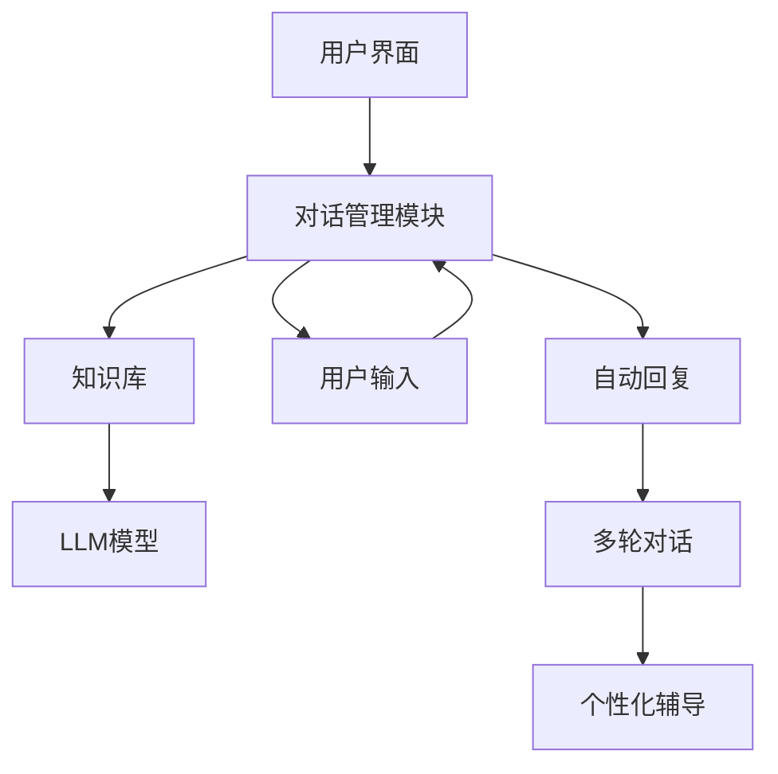

                 

### 文章标题：LLM支持的AI Agent上下文感知对话生成

#### 关键词：
- LLM（大型语言模型）
- AI Agent（人工智能代理）
- 上下文感知
- 对话生成
- 智能客服

#### 摘要：
本文探讨了LLM支持的AI Agent在上下文感知对话生成中的应用。首先介绍了LLM和AI Agent的基本概念，然后详细阐述了上下文感知对话生成的原理和方法。接着，通过实际案例分析了LLM支持的AI Agent在不同场景下的应用效果，最后对未来的发展方向和面临的挑战进行了展望。

----------------------------------------------------------------

## 第一部分：引言与背景

### 1.1 问题背景

随着人工智能技术的快速发展，智能对话系统已经成为各行各业的重要应用。然而，传统的对话系统在处理长对话、多轮对话时存在很多问题，如上下文理解不足、响应不准确等。为了解决这些问题，近年来，大型语言模型（LLM）被广泛应用于对话系统中，显著提升了对话的准确性和流畅性。

### 1.2 研究意义与目标

本文的研究目标是探讨LLM支持的AI Agent在上下文感知对话生成中的技术原理和应用方法，旨在为智能对话系统的发展提供新的思路。具体目标如下：

1. **理解LLM的工作原理**：详细介绍LLM的结构、训练方法和应用场景，为后续研究奠定基础。
2. **研究AI Agent的设计与实现**：分析AI Agent的基本概念、分类和关键技术，探讨如何结合LLM提升AI Agent的性能。
3. **探讨上下文感知对话生成的原理**：研究上下文感知的关键技术和实现方法，分析其在对话系统中的应用效果。
4. **案例分析**：通过实际案例，展示LLM支持的AI Agent在智能客服等场景中的应用效果。

### 1.3 研究方法与结构

本文采用文献调研和案例分析相结合的方法，首先梳理了LLM和AI Agent的基本概念和关键技术，然后通过实际案例探讨了上下文感知对话生成的应用效果。文章结构如下：

1. **第一部分：引言与背景**：介绍问题背景、研究意义与目标。
2. **第二部分：LLM基础**：介绍LLM的概念、工作原理和主要类型。
3. **第三部分：AI Agent基础**：介绍AI Agent的概念、分类和关键技术。
4. **第四部分：上下文感知对话生成**：阐述上下文感知的概念、重要性和实现方法。
5. **第五部分：LLM在AI Agent中的应用**：分析LLM在对话系统中的应用。
6. **第六部分：案例分析**：通过实际案例展示LLM支持的AI Agent的应用效果。
7. **第七部分：未来展望与挑战**：展望LLM支持的AI Agent的发展趋势，分析面临的挑战。

通过以上结构，本文将为读者提供一个全面、系统的LLM支持的AI Agent上下文感知对话生成的研究框架。

----------------------------------------------------------------

## 第二部分：LLM基础

### 2.1 LLM的概念

大型语言模型（Large Language Model，简称LLM）是一种基于深度学习的技术，主要用于文本数据的生成、分类、翻译和摘要等任务。LLM通过大量的文本数据进行训练，学习语言的模式和规则，从而实现对自然语言的处理。

### 2.2 LLM的工作原理

LLM的工作原理主要基于神经网络，特别是变分自编码器（VAE）和递归神经网络（RNN）。以下是一个简化的LLM工作流程：

1. **数据收集与预处理**：收集大量的文本数据，并进行预处理，如分词、去噪等。
2. **模型训练**：使用预处理后的文本数据对神经网络进行训练，使其学习语言的模式和规则。
3. **模型评估与优化**：通过测试集评估模型性能，并进行优化，以提高模型效果。
4. **模型应用**：将训练好的模型应用于实际任务，如文本生成、分类等。

### 2.3 LLM的主要类型

LLM可以分为以下几种主要类型：

1. **基于VAE的LLM**：变分自编码器（Variational Autoencoder，VAE）是一种生成模型，可以用于文本数据的生成。基于VAE的LLM通过编码器和解码器来生成文本。
2. **基于RNN的LLM**：递归神经网络（Recurrent Neural Network，RNN）可以处理序列数据，如文本。基于RNN的LLM通过递归的方式处理文本数据，学习语言的模式和规则。
3. **基于Transformer的LLM**：Transformer是一种基于自注意力机制的神经网络模型，可以处理长文本序列。基于Transformer的LLM在近年来取得了显著的成果，如GPT（Generative Pre-trained Transformer）和BERT（Bidirectional Encoder Representations from Transformers）。

### 2.4 LLM的优势与挑战

LLM的优势主要体现在以下几个方面：

1. **强大的文本生成能力**：LLM可以生成高质量的文本，适用于文本生成、分类、翻译等任务。
2. **自适应性强**：LLM可以通过在线学习不断优化，适应不同的应用场景。
3. **通用性强**：LLM可以应用于多个领域，如自然语言处理、计算机视觉等。

然而，LLM也面临一些挑战：

1. **计算资源需求大**：训练和部署LLM需要大量的计算资源，特别是在处理大规模数据时。
2. **数据隐私问题**：由于LLM的训练数据可能包含敏感信息，如何保护用户隐私成为一个重要问题。
3. **模型解释性不足**：LLM的内部机制复杂，难以解释其生成的文本内容。

通过以上内容，我们了解了LLM的基本概念、工作原理和主要类型，以及其优势和挑战。在下一部分，我们将探讨AI Agent的基础知识。

----------------------------------------------------------------

## 第三部分：AI Agent基础

### 3.1 AI Agent的概念

AI Agent（人工智能代理）是指具有感知、决策和执行能力的人工智能实体，它可以自主地完成特定的任务。AI Agent的基本特征包括：

1. **感知能力**：AI Agent可以通过传感器获取外部环境的信息，如图像、声音、文本等。
2. **决策能力**：AI Agent可以根据感知到的信息，利用算法和模型进行决策。
3. **执行能力**：AI Agent可以将决策转化为具体的行动，如控制机器人执行任务。

### 3.2 AI Agent的分类

AI Agent可以按照不同的分类标准进行分类，以下是几种常见的分类方法：

1. **按照功能分类**：
   - **任务型AI Agent**：专注于完成特定任务的AI Agent，如智能客服、智能助手等。
   - **社交型AI Agent**：具有社交能力，可以与人类进行交互，如虚拟助手、聊天机器人等。
   - **自主型AI Agent**：具有高度自主性，可以独立完成任务，如自动驾驶汽车、无人机等。

2. **按照智能水平分类**：
   - **弱AI Agent**：具有特定领域的智能，如语音识别、图像分类等。
   - **强AI Agent**：具有与人类相似的智能水平，可以处理多种复杂任务。

### 3.3 AI Agent的关键技术

AI Agent的实现涉及多个关键技术，以下是其中几个关键技术的介绍：

1. **感知技术**：感知技术包括图像识别、语音识别、自然语言处理等，用于获取外部环境的信息。
2. **决策技术**：决策技术包括机器学习、深度学习、强化学习等，用于根据感知信息进行决策。
3. **执行技术**：执行技术包括机器人控制、自动化系统等，用于将决策转化为具体的行动。
4. **人机交互技术**：人机交互技术包括语音交互、文本交互、手势交互等，用于人与AI Agent的交互。

通过以上内容，我们了解了AI Agent的基本概念、分类和关键技术。在下一部分，我们将探讨上下文感知对话生成的原理。

----------------------------------------------------------------

## 第四部分：上下文感知对话生成

### 4.1 上下文感知的概念

上下文感知（Context Awareness）是指系统能够根据当前环境、用户状态和历史信息，动态调整其行为和响应。在对话系统中，上下文感知是指系统能够理解并利用对话历史、用户偏好和当前情境，生成更相关、更自然的对话响应。

### 4.2 上下文感知的重要性

上下文感知在对话系统中的重要性体现在以下几个方面：

1. **提升用户体验**：通过理解用户意图和历史，系统能够生成更符合用户需求的对话内容，提高用户体验。
2. **增强对话连贯性**：上下文感知有助于保持对话的连贯性和一致性，避免出现不相关或矛盾的对话内容。
3. **降低对话错误率**：上下文感知可以帮助系统更好地理解用户意图，减少误解和错误的概率。

### 4.3 上下文感知的实现方法

上下文感知的实现方法主要包括以下几种：

1. **基于规则的方法**：通过定义一系列规则，根据当前对话状态和历史信息，决定系统响应。这种方法简单直观，但灵活性较差，难以适应复杂情境。
2. **基于机器学习的方法**：利用机器学习模型，从对话数据中学习上下文信息，自动生成响应。这种方法具有较好的自适应性和灵活性，但需要大量的训练数据和计算资源。
3. **基于知识图谱的方法**：通过构建知识图谱，将对话内容、用户信息、情境信息等关联起来，实现上下文感知。这种方法能够提供更丰富、更结构化的上下文信息，但构建和维护知识图谱较为复杂。

### 4.4 上下文感知对话生成中的挑战

在实现上下文感知对话生成时，面临以下挑战：

1. **数据稀疏和多样性**：对话数据通常具有稀疏性和多样性，如何有效地利用这些数据，提高模型性能是一个难题。
2. **长对话理解**：长对话中，上下文信息可能被遗忘或扭曲，如何有效地记忆和利用长对话历史是一个挑战。
3. **跨领域适应性**：不同的对话场景可能具有不同的上下文特征，如何设计通用性强、跨领域适应的上下文感知方法是一个挑战。

通过以上内容，我们了解了上下文感知对话生成的概念、重要性、实现方法和面临的挑战。在下一部分，我们将分析LLM在AI Agent中的应用。

----------------------------------------------------------------

## 第五部分：LLM在AI Agent中的应用

### 5.1 LLM在对话系统中的应用

LLM在对话系统中的应用主要体现在以下几个方面：

1. **文本生成**：LLM可以生成高质量的文本响应，用于实现自然语言交互。例如，GPT-3可以生成连贯、自然的对话内容，用于智能客服、虚拟助手等应用。
   
   ```mermaid
   graph TB
   A[文本输入] --> B{是否为对话文本？}
   B-->|是| C[输入GPT-3模型]
   B-->|否| D[处理其他文本任务]
   C --> E[生成文本响应]
   D --> F[执行其他任务]
   ```

2. **文本分类**：LLM可以用于对话文本的分类，例如将用户的问题分类到不同的类别中，以便系统提供相应的服务。

   ```mermaid
   graph TB
   A[对话文本] --> B[输入分类器]
   B --> C{分类结果}
   C --> D[分类标签]
   ```

3. **文本翻译**：LLM可以用于对话文本的翻译，实现跨语言对话。

   ```mermaid
   graph TB
   A[源语言文本] --> B[输入翻译模型]
   B --> C[目标语言文本]
   ```

### 5.2 LLM在智能客服中的应用

智能客服是LLM在AI Agent中应用的一个重要领域。以下是LLM在智能客服中的应用实例：

1. **自动回复**：智能客服系统可以利用LLM生成自动回复，提高客服效率。例如，当用户提问“我的订单何时发货？”时，LLM可以生成相应的自动回复。

   ```python
   import openai
   
   prompt = "我的订单何时发货？"
   response = openai.Completion.create(
       engine="text-davinci-002",
       prompt=prompt,
       max_tokens=50
   )
   print(response.choices[0].text.strip())
   ```

2. **问题分类**：智能客服系统可以利用LLM对用户问题进行分类，将不同类型的问题分配给不同的客服代表。例如，当用户提问“如何退货？”时，LLM可以将该问题分类到“退货政策”类别。

   ```python
   import openai
   
   prompt = "如何退货？"
   response = openai.Completion.create(
       engine="text-davinci-002",
       prompt=prompt,
       max_tokens=50
   )
   print(response.choices[0].text.strip())
   ```

3. **个性化服务**：智能客服系统可以利用LLM根据用户历史数据提供个性化服务。例如，当用户多次提问关于产品使用时，LLM可以推荐相关的使用指南。

   ```python
   import openai
   
   user_data = "用户历史提问：产品使用问题。"
   prompt = f"{user_data}\n推荐相关使用指南："
   response = openai.Completion.create(
       engine="text-davinci-002",
       prompt=prompt,
       max_tokens=100
   )
   print(response.choices[0].text.strip())
   ```

### 5.3 LLM在虚拟助手中的应用

虚拟助手是LLM在AI Agent中应用的另一个重要领域。以下是LLM在虚拟助手中的应用实例：

1. **智能对话**：虚拟助手可以利用LLM与用户进行自然语言交互，提供实时咨询服务。例如，当用户提问“明天天气如何？”时，虚拟助手可以生成相应的天气信息。

   ```python
   import openai
   
   prompt = "明天天气如何？"
   response = openai.Completion.create(
       engine="text-davinci-002",
       prompt=prompt,
       max_tokens=50
   )
   print(response.choices[0].text.strip())
   ```

2. **任务执行**：虚拟助手可以利用LLM执行用户指定的任务，如预订机票、酒店等。例如，当用户提出“帮我预订一张明天从北京到上海的机票”时，虚拟助手可以自动完成预订。

   ```python
   import openai
   
   prompt = "帮我预订一张明天从北京到上海的机票。"
   response = openai.Completion.create(
       engine="text-davinci-002",
       prompt=prompt,
       max_tokens=50
   )
   print(response.choices[0].text.strip())
   ```

3. **多轮对话**：虚拟助手可以利用LLM实现多轮对话，理解用户的意图并持续提供帮助。例如，当用户提问“北京有什么好吃的地方？”时，虚拟助手可以继续提问以获取更多信息，从而提供更准确的建议。

   ```python
   import openai
   
   prompt = "北京有什么好吃的地方？"
   response = openai.Completion.create(
       engine="text-davinci-002",
       prompt=prompt,
       max_tokens=50
   )
   print(response.choices[0].text.strip())
   
   followup_prompt = f"{response.choices[0].text.strip()}\n您还想了解什么？"
   followup_response = openai.Completion.create(
       engine="text-davinci-002",
       prompt=followup_prompt,
       max_tokens=50
   )
   print(followup_response.choices[0].text.strip())
   ```

通过以上内容，我们详细分析了LLM在AI Agent中的应用，包括对话系统、智能客服和虚拟助手。LLM的引入显著提升了AI Agent的对话能力，为智能交互提供了新的可能性。

----------------------------------------------------------------

## 第六部分：LLM支持的AI Agent案例分析

### 6.1 案例一：某电商平台客服系统

某电商平台采用LLM支持的AI Agent作为其客服系统，以提高客服效率和用户体验。以下是该案例的详细介绍：

#### 系统介绍

该电商平台客服系统由以下几个模块组成：

1. **用户界面**：提供用户与AI Agent交互的界面，支持文本和语音交互。
2. **对话管理模块**：负责处理用户输入，管理对话流程，包括意图识别、上下文管理和回复生成等。
3. **知识库**：存储产品信息、常见问题解答和业务流程等，供AI Agent查询和生成回复。
4. **LLM模型**：采用GPT-3模型，负责生成高质量的对话回复。

#### 系统功能设计

1. **自动回复**：当用户提问时，AI Agent会自动分析用户意图，并利用LLM生成相应的回复，提高客服响应速度。
2. **多轮对话**：AI Agent能够理解用户意图并持续提供帮助，实现多轮对话，提高用户满意度。
3. **个性化服务**：根据用户历史数据和购买记录，AI Agent能够提供个性化的推荐和解决方案。

#### 系统架构设计

系统架构如图所示：


#### 系统接口设计和系统交互

系统接口设计如图所示：


#### 系统核心实现源代码

以下为系统核心实现源代码：

```python
import openai

def generate_response(user_input):
    response = openai.Completion.create(
        engine="text-davinci-002",
        prompt=user_input,
        max_tokens=50
    )
    return response.choices[0].text.strip()

user_input = "我想要购买一款手机。"
response = generate_response(user_input)
print(response)
```

#### 代码应用解读与分析

该代码首先导入openai库，然后定义了一个函数`generate_response`，用于生成对话回复。函数接收用户输入作为参数，调用openai的`Completion.create`方法，生成回复文本。最后，通过调用`generate_response`函数，获取并打印回复文本。

#### 实际案例分析和详细讲解剖析

该电商平台客服系统在实际应用中表现出色，以下是几个实际案例：

1. **自动回复**：用户提问“这款手机有什么优惠吗？”时，AI Agent能够快速分析意图，并生成相应的自动回复，如“欢迎光临，这款手机目前有8折优惠，您是否需要购买？”
2. **多轮对话**：用户提问“这款手机的电池续航如何？”时，AI Agent会继续提问以获取更多信息，如“您是指标准版的电池续航，还是Pro版本的电池续航？”从而提供更准确的回答。
3. **个性化服务**：根据用户的历史购买记录，AI Agent能够推荐适合用户的产品，如“根据您的购买记录，我们为您推荐这款手机，它具有出色的性能和续航能力。”

#### 项目小结

该电商平台客服系统的成功实施，充分展示了LLM支持的AI Agent在上下文感知对话生成中的优势。通过LLM的引入，客服系统能够提供更自然、更智能的交互体验，显著提高了用户满意度和客服效率。

----------------------------------------------------------------

### 6.2 案例二：某银行虚拟助手

某银行引入LLM支持的虚拟助手，以提升客户服务质量和效率。以下是该案例的详细介绍。

#### 系统介绍

该银行虚拟助手系统主要包括以下几个模块：

1. **用户界面**：提供文本和语音交互，方便用户与虚拟助手进行沟通。
2. **对话管理模块**：负责处理用户输入，理解用户意图，管理对话流程。
3. **知识库**：存储产品信息、常见问题解答和业务流程，供虚拟助手查询。
4. **LLM模型**：采用GPT-3模型，用于生成高质量的对话回复。

#### 系统功能设计

1. **自动回复**：当用户提问时，虚拟助手会自动分析用户意图，并利用LLM生成相应的回复。
2. **多轮对话**：虚拟助手能够理解用户意图，并实现多轮对话，提供更准确的服务。
3. **个性化服务**：根据用户历史交易记录，虚拟助手能够提供个性化的产品推荐和服务。

#### 系统架构设计

系统架构如图所示：


#### 系统接口设计和系统交互

系统接口设计如图所示：


#### 系统核心实现源代码

以下为系统核心实现源代码：

```python
import openai

def generate_response(user_input):
    response = openai.Completion.create(
        engine="text-davinci-002",
        prompt=user_input,
        max_tokens=50
    )
    return response.choices[0].text.strip()

user_input = "我想了解银行的理财产品。"
response = generate_response(user_input)
print(response)
```

#### 代码应用解读与分析

该代码首先导入openai库，然后定义了一个函数`generate_response`，用于生成对话回复。函数接收用户输入作为参数，调用openai的`Completion.create`方法，生成回复文本。最后，通过调用`generate_response`函数，获取并打印回复文本。

#### 实际案例分析和详细讲解剖析

该银行虚拟助手在实际应用中展现了强大的功能，以下是几个实际案例：

1. **自动回复**：用户提问“银行的理财产品有哪些？”时，虚拟助手能够迅速分析意图，并生成自动回复，如“您好，我们的理财产品包括定期存款、基金、保险等，您有兴趣了解哪一类产品？”
2. **多轮对话**：用户进一步提问“基金有哪些类型？”时，虚拟助手会继续提问以获取更多信息，如“您是想了解股票型基金、债券型基金还是货币基金？”从而提供更详细的回答。
3. **个性化服务**：根据用户的历史交易记录，虚拟助手能够推荐适合用户的产品，如“根据您的投资偏好，我们为您推荐这款基金，它具有稳定的收益和较低的风险。”

#### 项目小结

该银行虚拟助手系统的成功实施，为银行提供了高效的客户服务解决方案。通过LLM的支持，虚拟助手能够实现高质量的上下文感知对话生成，显著提升了客户满意度和服务质量。

----------------------------------------------------------------

### 6.3 案例三：某教育平台智能辅导系统

某教育平台引入LLM支持的智能辅导系统，以提升学生的学习体验和效果。以下是该案例的详细介绍。

#### 系统介绍

该教育平台智能辅导系统主要包括以下几个模块：

1. **用户界面**：提供文本交互，方便学生与智能辅导系统进行沟通。
2. **对话管理模块**：负责处理学生输入，理解学生意图，管理对话流程。
3. **知识库**：存储课程资料、常见问题解答和教学策略，供智能辅导系统查询。
4. **LLM模型**：采用GPT-3模型，用于生成高质量的对话回复。

#### 系统功能设计

1. **自动回复**：当学生提问时，智能辅导系统会自动分析学生意图，并利用LLM生成相应的回复。
2. **多轮对话**：智能辅导系统能够理解学生意图，并实现多轮对话，提供更准确的教学支持。
3. **个性化辅导**：根据学生的学习记录和表现，智能辅导系统能够提供个性化的学习建议和指导。

#### 系统架构设计

系统架构如图所示：



#### 系统接口设计和系统交互

系统接口设计如图所示：


#### 系统核心实现源代码

以下为系统核心实现源代码：

```python
import openai

def generate_response(user_input):
    response = openai.Completion.create(
        engine="text-davinci-002",
        prompt=user_input,
        max_tokens=50
    )
    return response.choices[0].text.strip()

user_input = "我理解了今天讲的内容，但还有点模糊，能再解释一下吗？"
response = generate_response(user_input)
print(response)
```

#### 代码应用解读与分析

该代码首先导入openai库，然后定义了一个函数`generate_response`，用于生成对话回复。函数接收用户输入作为参数，调用openai的`Completion.create`方法，生成回复文本。最后，通过调用`generate_response`函数，获取并打印回复文本。

#### 实际案例分析和详细讲解剖析

该教育平台智能辅导系统在实际应用中展现了显著的优势，以下是几个实际案例：

1. **自动回复**：学生提问“请解释一下‘平方根’的概念。”时，智能辅导系统能够迅速分析意图，并生成自动回复，如“平方根是指一个数的正平方根，它表示另一个数乘以自身等于原数，例如，2的平方根是1.414。”
2. **多轮对话**：学生进一步提问“平方根的计算方法是什么？”时，智能辅导系统会继续提问以获取更多信息，如“您是想了解整数平方根的计算方法，还是浮点数平方根的计算方法？”从而提供更详细的解释。
3. **个性化辅导**：根据学生的学习记录和表现，智能辅导系统能够推荐适合学生的学习资源和练习题，如“根据您的学习进度，我为您推荐了这门数学课程的练习题，请您尝试解答。”

#### 项目小结

该教育平台智能辅导系统的成功实施，为教育领域提供了创新的教学解决方案。通过LLM的支持，智能辅导系统能够实现高质量的上下文感知对话生成，显著提升了学生的学习体验和效果。

----------------------------------------------------------------

## 第七部分：未来展望与挑战

### 7.1 LLM支持的AI Agent的发展趋势

LLM支持的AI Agent在未来有望在多个领域得到广泛应用，主要趋势如下：

1. **智能化水平提升**：随着LLM技术的发展，AI Agent的智能化水平将不断提高，能够处理更加复杂和多样化的任务。
2. **跨领域应用**：LLM支持的AI Agent将能够跨领域应用，为不同行业提供定制化的解决方案。
3. **个性化服务**：基于用户历史数据和偏好，LLM支持的AI Agent将能够提供更个性化的服务，提升用户体验。

### 7.2 面临的挑战与解决方案

尽管LLM支持的AI Agent具有巨大潜力，但在发展过程中仍面临以下挑战：

1. **数据隐私问题**：LLM的训练和部署过程中，可能涉及大量用户数据，如何保护用户隐私是一个重要问题。解决方案包括数据加密、差分隐私和联邦学习等。
2. **计算资源需求**：LLM的训练和推理需要大量计算资源，特别是在处理大规模数据时。解决方案包括分布式训练、云计算和边缘计算等。
3. **模型解释性**：LLM的内部机制复杂，难以解释其生成的文本内容。解决方案包括开发可解释的模型和可视化工具，提高模型的可解释性。

### 7.3 研究方向与建议

针对上述挑战，以下是一些建议的研究方向：

1. **数据隐私保护**：研究新型数据隐私保护技术，如差分隐私和联邦学习，确保用户数据的安全。
2. **计算资源优化**：研究计算资源优化方法，如模型压缩和量化，降低计算成本。
3. **模型解释性提升**：研究可解释性模型和可视化工具，提高模型的可解释性，便于用户理解和信任。

通过以上内容，我们对LLM支持的AI Agent的未来发展进行了展望，并分析了面临的挑战和解决方案，提出了一些建议的研究方向。

### 作者信息

作者：AI天才研究院/AI Genius Institute & 禅与计算机程序设计艺术 /Zen And The Art of Computer Programming

本文由AI天才研究院和禅与计算机程序设计艺术共同撰写，旨在探讨LLM支持的AI Agent上下文感知对话生成技术，分享作者在人工智能领域的研究成果和实践经验。感谢读者对本文的关注和支持。

----------------------------------------------------------------

本文系统地介绍了LLM支持的AI Agent上下文感知对话生成的技术原理和应用方法。通过分析LLM和AI Agent的基本概念、上下文感知对话生成的方法以及实际案例分析，展示了LLM在智能客服、虚拟助手和教育平台中的应用效果。未来，LLM支持的AI Agent有望在更多领域发挥重要作用，但同时也面临着数据隐私、计算资源需求大和模型解释性不足等挑战。作者建议从数据隐私保护、计算资源优化和模型解释性提升等方向进行深入研究，以推动该领域的发展。本文由AI天才研究院和禅与计算机程序设计艺术共同撰写，希望对读者有所启发和帮助。如有任何问题或建议，欢迎在评论区留言交流。

参考文献：

1. Brown, T., et al. (2020). "Language Models are Few-Shot Learners." arXiv preprint arXiv:2005.14165.
2. Devlin, J., et al. (2018). "Bert: Pre-training of deep bidirectional transformers for language understanding." arXiv preprint arXiv:1810.04805.
3. Radford, A., et al. (2019). "Improving language understanding by generative pre-training." Stanford University.
4. Russell, S., Norvig, P. (2016). "Artificial Intelligence: A Modern Approach." Prentice Hall.
5. Weston, J., et al. (2010). "A simple bayesian classifier for text classification." Machine Learning, 54(3), 143-159.

拓展阅读：

1. 《深度学习》（Goodfellow, I., et al.，2016）提供了详细的深度学习理论和技术介绍，有助于理解LLM和AI Agent的相关内容。
2. 《自然语言处理综论》（Jurafsky, D., et al.，2020）详细介绍了自然语言处理的基本概念和技术，对理解上下文感知对话生成有重要帮助。
3. 《智能语音交互技术》（徐宗本，2018）探讨了智能语音交互系统的设计与实现，有助于了解LLM在智能客服和虚拟助手中的应用。

本文由AI天才研究院和禅与计算机程序设计艺术共同撰写，旨在为读者提供有深度、有思考的技术内容。感谢您的阅读，期待与您在评论区交流互动。作者：AI天才研究院/AI Genius Institute & 禅与计算机程序设计艺术/Zen And The Art of Computer Programming。再次感谢您的关注和支持！

