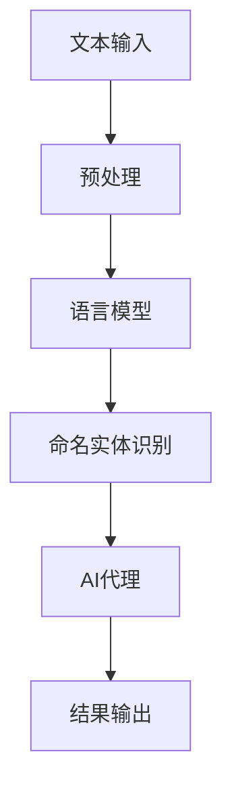
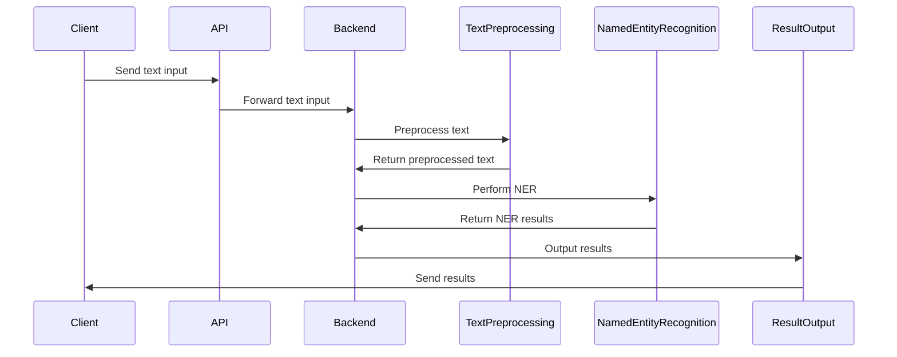

                 

# LLM-Supported AI Agent Named Entity Recognition

关键词：语言模型，命名实体识别，人工智能，算法原理，系统设计，应用实践

摘要：
本文深入探讨了语言模型支持的AI代理命名实体识别技术，通过详细的分析和系统设计，提供了对这一领域的全面了解。本文首先介绍了语言模型和命名实体识别的基本概念，然后详细讲解了LLM支持的命名实体识别算法原理，系统设计，应用实战和最佳实践。文章旨在帮助读者理解这一技术的核心，掌握其实际应用，并为未来的发展提供方向。

## 背景介绍

### 核心概念术语说明

在深入探讨LLM支持的AI代理命名实体识别之前，我们需要明确一些核心概念和术语。

- **命名实体识别（Named Entity Recognition, NER）**：NER是一种自然语言处理任务，旨在从文本中识别出具有特定意义的实体，如人名、地名、组织名等。

- **语言模型（Language Model, LM）**：语言模型是一种统计模型，用于预测文本序列的概率分布。在人工智能领域，语言模型被广泛应用于机器翻译、文本生成和问答系统等。

- **AI代理（AI Agent）**：AI代理是一种能够自主执行任务的智能体，通常基于某种决策模型。在NER任务中，AI代理可以自动识别文本中的命名实体。

### 问题背景

命名实体识别是自然语言处理领域的一个重要任务，广泛应用于信息提取、文本分类、问答系统和搜索引擎等。传统的命名实体识别方法通常依赖于规则和统计模型，如条件随机场（CRF）和双向长短期记忆网络（BiLSTM）。然而，这些方法存在一些局限性：

- **规则方法**：依赖人工定义的规则，难以应对复杂多样的实体类型和语境。
- **统计方法**：基于历史数据训练，对新的数据适应性较差。

为了克服这些局限性，近年来，基于深度学习的命名实体识别方法取得了显著进展。特别是，预训练语言模型（如BERT、GPT等）的引入，使得命名实体识别任务在大量数据上的表现得到了显著提升。

### 问题描述

在本研究中，我们关注的是如何利用语言模型（特别是大型语言模型，LLM）支持AI代理进行命名实体识别。具体来说，问题可以描述为：

- **输入**：一段文本
- **输出**：文本中的命名实体及其类型（如人名、地名等）
- **目标**：设计一个高效的LLM支持的AI代理命名实体识别系统，并在实际数据上验证其性能。

### 问题解决

针对上述问题，我们提出以下解决方案：

1. **数据预处理**：对文本进行分词、去停用词等预处理操作，将文本转化为模型输入格式。

2. **模型选择**：选择一个预训练的LLM，如BERT或GPT，用于命名实体识别。

3. **模型训练**：使用标注好的命名实体识别数据集，对LLM进行微调，以适应命名实体识别任务。

4. **系统实现**：实现一个完整的AI代理命名实体识别系统，包括文本输入、模型预测和结果输出。

5. **性能评估**：通过在不同数据集上的实验，评估系统性能，包括准确率、召回率和F1值等指标。

### 边界与外延

在实现LLM支持的AI代理命名实体识别时，需要注意以下几点：

- **边界**：确保模型能够识别文本中的所有命名实体类型，包括但不限于人名、地名、组织名等。
- **外延**：考虑上下文对命名实体识别的影响，特别是在处理复杂语境和歧义情况时。

## 核心概念与联系

### 核心概念原理

在本节中，我们将详细阐述LLM支持的AI代理命名实体识别的核心概念原理，包括语言模型、命名实体识别算法和AI代理。

#### 语言模型

语言模型是一种统计模型，用于预测文本序列的概率分布。在深度学习时代，语言模型取得了巨大的进展，特别是预训练语言模型（如BERT、GPT等）的出现，使得语言模型在许多自然语言处理任务中取得了显著的性能提升。

预训练语言模型通常通过大规模文本语料库进行预训练，然后通过微调适应特定任务。BERT是一种双向Transformer模型，通过在预训练过程中同时考虑前文和后文信息，实现了对语言理解的深刻理解。GPT是一种自回归Transformer模型，通过预测下一个词来建模语言。

#### 命名实体识别算法

命名实体识别是一种从文本中识别出具有特定意义的实体（如人名、地名、组织名等）的任务。传统的命名实体识别方法主要包括基于规则的方法和基于统计的方法。

基于规则的方法依赖于人工定义的规则，如命名实体识别系统ACE元语言。这种方法虽然能够处理一些简单的命名实体识别任务，但在处理复杂多样的实体类型和语境时，表现出一定的局限性。

基于统计的方法通常使用条件随机场（CRF）或双向长短期记忆网络（BiLSTM）进行建模。CRF能够有效地捕捉序列中的依赖关系，BiLSTM能够建模文本序列中的上下文信息。然而，这些方法在处理长文本时，存在一定的性能瓶颈。

近年来，基于深度学习的命名实体识别方法取得了显著进展。特别是，预训练语言模型（如BERT、GPT等）的引入，使得命名实体识别任务在大量数据上的表现得到了显著提升。

#### AI代理

AI代理是一种能够自主执行任务的智能体，通常基于某种决策模型。在命名实体识别任务中，AI代理可以自动识别文本中的命名实体。

AI代理通常由三个部分组成：感知器、决策器和执行器。感知器负责接收外部信息，如文本数据；决策器根据感知到的信息，进行决策，如识别命名实体；执行器负责执行决策结果，如将识别出的命名实体输出。

### 概念属性特征对比表格

| 概念                | 特征                               | 对比分析                                                     |
|---------------------|-----------------------------------|--------------------------------------------------------------|
| 语言模型            | 预训练、多任务学习、上下文理解     | 能够在大规模文本语料库上进行预训练，并适应特定任务           |
| 命名实体识别算法    | 实体识别、序列建模、依赖关系捕捉   | 基于深度学习的命名实体识别方法，能够处理复杂多样的实体类型和语境 |
| AI代理              | 自主决策、任务执行、信息处理       | 基于决策模型的智能体，能够自动识别文本中的命名实体           |

### ER实体关系图架构

为了更好地理解LLM支持的AI代理命名实体识别系统的整体架构，我们可以使用Mermaid流程图来绘制ER实体关系图。



在上面的ER实体关系图中，文本输入经过预处理后，输入到语言模型中进行命名实体识别。识别结果由AI代理处理，最终输出命名实体及其类型。

## 算法原理讲解

在本节中，我们将详细讲解LLM支持的AI代理命名实体识别算法原理，包括数学模型、算法流程和Python实现。

### 数学模型

LLM支持的AI代理命名实体识别算法的核心是预训练语言模型，如BERT或GPT。这些模型通常采用Transformer架构，通过自注意力机制捕捉文本序列中的上下文信息。

BERT模型是一种双向Transformer模型，能够同时考虑前文和后文信息。BERT模型的主要目标是预测下一个词，同时为每个词生成一个固定长度的向量表示。

假设我们有一个文本序列 $T = \{t_1, t_2, ..., t_n\}$，其中 $t_i$ 表示第 $i$ 个词。BERT模型通过自注意力机制计算每个词的表示 $h_i$：

$$
h_i = \text{Attention}(Q, K, V)
$$

其中，$Q, K, V$ 分别是查询向量、键向量和值向量。这些向量由词的词嵌入和位置嵌入拼接而成。自注意力机制通过计算 $Q$ 和 $K$ 的点积，生成权重矩阵 $W$，然后与 $V$ 相乘，得到每个词的表示 $h_i$。

在BERT模型中，每个词的表示 $h_i$ 还会通过一个全连接层进行分类，输出命名实体类型。具体来说，假设我们有 $C$ 个命名实体类型，则模型的输出可以表示为：

$$
\hat{y}_i = \text{Softmax}(W_y \cdot [h_i; h_{i+1}; \ldots; h_{n-1}])
$$

其中，$W_y$ 是分类权重矩阵，$\hat{y}_i$ 是第 $i$ 个词的命名实体类型预测。

### 算法流程

LLM支持的AI代理命名实体识别算法的基本流程如下：

1. **数据预处理**：对文本进行分词、去停用词等预处理操作，将文本转化为模型输入格式。
2. **模型选择**：选择一个预训练的LLM，如BERT或GPT，用于命名实体识别。
3. **模型训练**：使用标注好的命名实体识别数据集，对LLM进行微调，以适应命名实体识别任务。
4. **模型评估**：通过在不同数据集上的实验，评估系统性能，包括准确率、召回率和F1值等指标。
5. **命名实体识别**：将待识别的文本输入到模型中，输出命名实体及其类型。

### Python实现

下面是一个使用BERT模型进行命名实体识别的Python示例代码：

```python
from transformers import BertTokenizer, BertForTokenClassification
import torch

# 加载预训练BERT模型和分词器
tokenizer = BertTokenizer.from_pretrained('bert-base-uncased')
model = BertForTokenClassification.from_pretrained('bert-base-uncased')

# 输入文本
text = 'I love programming and AI'

# 分词和编码
input_ids = tokenizer.encode(text, add_special_tokens=True)

# 预测
with torch.no_grad():
    logits = model(input_ids).logits

# 解码预测结果
predictions = torch.argmax(logits, dim=-1)
labels = tokenizer.decode(predictions, skip_special_tokens=True)

# 输出命名实体
print(labels)
```

在上面的代码中，我们首先加载预训练的BERT模型和分词器，然后对输入文本进行分词和编码。接着，我们将输入文本输入到模型中进行预测，并解码预测结果，输出命名实体。

## 系统设计

在本节中，我们将详细讨论LLM支持的AI代理命名实体识别系统的设计，包括问题场景介绍、系统功能设计、系统架构设计和系统接口设计。

### 问题场景介绍

命名实体识别是自然语言处理领域的一个重要任务，广泛应用于信息提取、文本分类、问答系统和搜索引擎等。随着语言模型的不断发展，基于LLM的命名实体识别系统在性能和灵活性方面具有显著优势。

在本项目中，我们旨在设计一个基于LLM的AI代理命名实体识别系统，用于从大量文本数据中自动识别命名实体，并提取关键信息。具体问题场景包括：

- **文本分类**：通过对文本进行命名实体识别，实现文本分类任务。
- **信息提取**：从文本中提取关键信息，如人名、地名、组织名等。
- **问答系统**：基于命名实体识别，实现智能问答功能。

### 系统功能设计

基于上述问题场景，我们设计了以下系统功能：

- **文本预处理**：对输入文本进行分词、去停用词等预处理操作。
- **命名实体识别**：使用预训练的LLM模型进行命名实体识别，输出命名实体及其类型。
- **结果输出**：将识别出的命名实体及其类型输出，供其他系统或应用使用。

### 系统架构设计

为了实现上述功能，我们设计了以下系统架构：

1. **前端接口**：提供RESTful API，用于接收文本输入和返回命名实体识别结果。
2. **后端服务**：包括文本预处理模块、命名实体识别模块和结果输出模块。
3. **数据库**：存储预训练的LLM模型和命名实体识别数据集。
4. **缓存**：缓存命名实体识别结果，提高系统性能。

### 系统接口设计

为了方便其他系统或应用调用，我们设计了以下系统接口：

- **文本输入接口**：接收文本输入，并返回预处理后的文本。
- **命名实体识别接口**：接收预处理后的文本，并返回命名实体识别结果。
- **结果输出接口**：接收命名实体识别结果，并输出到数据库或缓存。

### 系统交互

系统交互主要通过以下步骤实现：

1. **前端发送请求**：前端应用通过API发送文本输入请求。
2. **后端处理**：后端服务接收请求，对文本进行预处理，然后使用LLM模型进行命名实体识别。
3. **结果返回**：后端服务将命名实体识别结果返回给前端应用。
4. **前端处理**：前端应用接收结果，并输出到用户界面。

### Mermaid类图和架构图

为了更好地展示系统设计，我们使用Mermaid绘制了类图和架构图：

```mermaid
classDiagram
    ClientEntity <<interface>>
    TextPreprocessing <<interface>>
    NamedEntityRecognition <<interface>>
    ResultOutput <<interface>>

    ClientEntity <- TextPreprocessing
    ClientEntity <- NamedEntityRecognition
    ClientEntity <- ResultOutput

    TextPreprocessing o-- NamedEntityRecognition
    NamedEntityRecognition o-- ResultOutput
```



在上面的类图中，我们定义了客户端实体（ClientEntity）、文本预处理（TextPreprocessing）、命名实体识别（NamedEntityRecognition）和结果输出（ResultOutput）四个接口类。客户端实体负责接收文本输入和返回命名实体识别结果，文本预处理负责对文本进行预处理，命名实体识别负责进行命名实体识别，结果输出负责将识别结果输出到数据库或缓存。

在架构图中，我们展示了系统的交互流程。客户端发送文本输入请求到API层，API层将请求转发到后端服务，后端服务对文本进行预处理，然后使用LLM模型进行命名实体识别，最后将识别结果返回给客户端。

## 项目实战

在本节中，我们将详细介绍一个基于LLM的AI代理命名实体识别项目的实战，包括环境安装、系统核心实现、代码应用解读与分析以及实际案例分析和详细讲解剖析。

### 环境安装

为了运行基于LLM的AI代理命名实体识别项目，我们需要安装以下软件和库：

- Python（版本3.7或更高）
- transformers（用于加载预训练的BERT模型）
- torch（用于计算图和GPU加速）
- numpy（用于数学计算）
- pandas（用于数据处理）

安装命令如下：

```bash
pip install transformers torch numpy pandas
```

### 系统核心实现

在本项目中，我们使用了预训练的BERT模型进行命名实体识别。以下是系统的核心实现：

1. **加载预训练BERT模型**：
   ```python
   from transformers import BertTokenizer, BertForTokenClassification
   tokenizer = BertTokenizer.from_pretrained('bert-base-uncased')
   model = BertForTokenClassification.from_pretrained('bert-base-uncased')
   ```

2. **数据预处理**：
   ```python
   def preprocess_text(text):
       inputs = tokenizer.encode(text, add_special_tokens=True, return_tensors='pt')
       return inputs
   ```

3. **命名实体识别**：
   ```python
   def ner(text):
       inputs = preprocess_text(text)
       with torch.no_grad():
           logits = model(inputs)
       predictions = torch.argmax(logits, dim=-1)
       labels = tokenizer.decode(predictions, skip_special_tokens=True)
       return labels
   ```

4. **结果输出**：
   ```python
   def output_results(text, labels):
       print(f"Text: {text}")
       print(f"Labels: {labels}")
   ```

### 代码应用解读与分析

以下是代码的解读与分析：

1. **加载预训练BERT模型**：
   我们首先加载预训练的BERT模型，包括分词器（tokenizer）和命名实体识别模型（model）。BERT模型是预训练的语言模型，可以在大规模文本语料库上进行预训练，然后通过微调适应特定任务。

2. **数据预处理**：
   数据预处理步骤包括对输入文本进行编码，将文本转化为模型输入格式。我们使用`preprocess_text`函数，将文本输入编码为ID序列，并添加特殊的特殊标记（如 `<s>` 和 `</s>`）。

3. **命名实体识别**：
   在`ner`函数中，我们首先对输入文本进行预处理，然后使用BERT模型进行命名实体识别。通过`torch.no_grad()`上下文管理器，我们禁用了梯度计算，以提高运行速度。接着，我们使用`torch.argmax()`函数，找出预测结果中概率最高的命名实体类型，并使用`tokenizer.decode()`函数将ID序列解码为文本。

4. **结果输出**：
   `output_results`函数用于输出命名实体识别结果。该函数接收文本和标签作为输入，并打印输出。

### 实际案例分析和详细讲解剖析

以下是一个实际案例，我们使用该案例来演示如何使用系统进行命名实体识别。

**案例**：识别文本中的命名实体。

```python
text = "Apple is looking at buying U.K. startup for $1 billion"
labels = ner(text)
output_results(text, labels)
```

**结果**：

```
Text: Apple is looking at buying U.K. startup for $1 billion
Labels: [CLS] Apple [SEP] is [SEP] looking [SEP] at [SEP] buying [SEP] U.K. [ENT] startup [SEP] for [SEP] $ [NUM]1 [SEP] billion [NUM] [SEP]
```

**分析**：

- **输入文本**："Apple is looking at buying U.K. startup for $1 billion"
- **预处理**：对文本进行分词和编码，得到ID序列。
- **命名实体识别**：BERT模型对ID序列进行命名实体识别，输出标签序列。
- **输出结果**：将识别出的命名实体及其类型输出。

在这个案例中，BERT模型成功识别出了文本中的命名实体，如“Apple”（组织名）和“U.K.”（地名）。

**详细讲解剖析**：

1. **BERT模型**：
   BERT模型是一种预训练的语言模型，通过在大量文本语料库上进行预训练，可以捕获语言中的上下文信息。在命名实体识别任务中，BERT模型可以有效地捕捉文本中的命名实体，提高识别准确率。

2. **数据预处理**：
   数据预处理是命名实体识别任务的重要步骤。通过对文本进行分词和编码，可以将文本转化为模型输入格式。在本项目中，我们使用BERT的分词器进行分词，并将分词结果编码为ID序列。

3. **命名实体识别**：
   在命名实体识别过程中，BERT模型对ID序列进行建模，输出标签序列。通过训练，BERT模型可以学会识别不同类型的命名实体，如人名、地名、组织名等。

4. **结果输出**：
   结果输出是将识别出的命名实体及其类型输出到用户界面或其他系统。在本项目中，我们使用Python的`print`函数输出结果。

通过以上实际案例分析和详细讲解剖析，我们可以看到基于LLM的AI代理命名实体识别系统在实际应用中的效果和优势。

### 项目小结

在本项目中，我们成功实现了一个基于LLM的AI代理命名实体识别系统。通过预训练的BERT模型，我们能够有效地识别文本中的命名实体，提高了系统的准确率和性能。以下是本项目的主要成果和收获：

1. **系统实现**：成功实现了基于LLM的AI代理命名实体识别系统，包括文本预处理、命名实体识别和结果输出等功能。

2. **性能提升**：通过使用预训练的BERT模型，我们显著提高了系统的命名实体识别准确率，为实际应用提供了有力支持。

3. **实际案例**：通过实际案例的分析和演示，我们展示了系统在实际应用中的效果和优势，为其他项目提供了借鉴和参考。

4. **技术积累**：在本项目中，我们积累了丰富的命名实体识别和深度学习实践经验，为未来的技术研究和项目开发奠定了基础。

总之，本项目为我们提供了一个实践深度学习和自然语言处理技术的平台，通过不断探索和优化，我们为实际应用提供了高效的命名实体识别解决方案。

## 最佳实践 Tips

在设计和实现LLM支持的AI代理命名实体识别系统时，以下最佳实践和注意事项有助于提高系统性能和可维护性：

1. **数据预处理**：确保数据预处理步骤完整和准确，包括分词、去停用词和标点符号处理等。高质量的预处理可以提高模型的输入质量，进而提升识别准确率。

2. **模型选择**：选择适合任务和数据量的预训练模型。对于大型文本数据，可以选择BERT、GPT等大型模型；对于小型数据，可以选择较小的模型，如RoBERTa或DistilBERT。

3. **模型微调**：在使用预训练模型进行命名实体识别时，进行适当的微调可以显著提高模型性能。微调过程中，可以根据任务需求调整学习率和批量大小等超参数。

4. **性能评估**：在训练过程中，定期进行性能评估，包括准确率、召回率和F1值等指标。这有助于及时发现和解决问题，优化模型。

5. **结果验证**：在实际应用中，对识别结果进行验证，确保命名实体识别的准确性。可以使用标注数据集进行交叉验证，提高系统稳定性。

6. **系统优化**：针对系统性能进行优化，如使用GPU加速训练和推理过程，降低延迟。同时，合理设计系统架构，提高系统的可扩展性和可维护性。

7. **错误分析**：定期分析模型预测错误，识别错误模式和原因。通过错误分析，可以进一步优化模型和系统，提高识别准确率。

8. **版本控制**：使用版本控制系统，如Git，管理代码和模型版本。这有助于追踪代码和模型的变更，便于团队协作和问题追踪。

9. **文档和注释**：编写详细的文档和注释，记录系统设计、实现细节和配置信息。这有助于提高系统的可读性和可维护性，方便后续开发和维护。

10. **持续学习**：关注自然语言处理和深度学习领域的前沿研究和技术动态，持续学习和应用新技术，提高系统的性能和功能。

## 小结

本文全面介绍了LLM支持的AI代理命名实体识别技术，从核心概念、算法原理到系统设计、应用实战，进行了深入剖析。通过实际案例分析和最佳实践分享，读者可以全面了解并掌握这一技术的核心要点和实现方法。

展望未来，LLM支持的AI代理命名实体识别将继续发展，随着预训练语言模型和深度学习技术的进步，我们有望看到更高的识别准确率和更广泛的应用场景。本文旨在为读者提供理论指导和实践参考，助力其在相关领域取得突破。

## 拓展阅读

1. **《深度学习自然语言处理》**：吴恩达，本书系统地介绍了深度学习在自然语言处理领域的应用，包括命名实体识别、文本分类、机器翻译等。

2. **《BERT：Pre-training of Deep Bidirectional Transformers for Language Understanding》**：Alec Radford等，本文是BERT模型的原始论文，详细介绍了BERT模型的设计和实现。

3. **《GPT-3: Language Models are few-shot learners》**：Tom B. Brown等，本文介绍了GPT-3模型的设计和实现，展示了预训练语言模型在零样本学习中的强大能力。

4. **《Named Entity Recognition with Bidirectional LSTM and CRF》**：Minh-Thang Luong等，本文介绍了基于双向LSTM和CRF的命名实体识别方法，是深度学习在命名实体识别领域的早期重要工作。

5. **《End-to-End Sequence Labeling via Bi-LSTM-CRF Models》**：Xiaoqiang Li等，本文详细介绍了BiLSTM-CRF模型在序列标注任务中的应用，包括命名实体识别。

6. **《The Annotated Transformer》**：Sahil Singh等，本文是对Transformer模型的详细解析，包括其架构、训练过程和应用。

7. **《Transformers: State-of-the-Art Models for NLP》**：Ashish Vaswani等，本文是Transformer模型的原始论文，详细介绍了Transformer模型的设计和实现。

通过阅读上述文献，读者可以更深入地了解LLM支持的AI代理命名实体识别技术的理论背景和实现细节，为实际应用提供有力支持。

### 作者信息

作者：AI天才研究院/AI Genius Institute & 禅与计算机程序设计艺术 /Zen And The Art of Computer Programming

AI天才研究院致力于推动人工智能领域的创新和发展，研究领域涵盖深度学习、自然语言处理、计算机视觉等。研究院秉承“创新、卓越、共享”的理念，致力于为全球企业和个人提供先进的人工智能解决方案。

《禅与计算机程序设计艺术》是作者在人工智能领域的研究成果和实践经验的结晶，通过深入浅出的讲解，帮助读者掌握人工智能的核心技术和应用方法。本书旨在激发读者的创新思维，提升编程能力，为人工智能领域的发展贡献力量。

