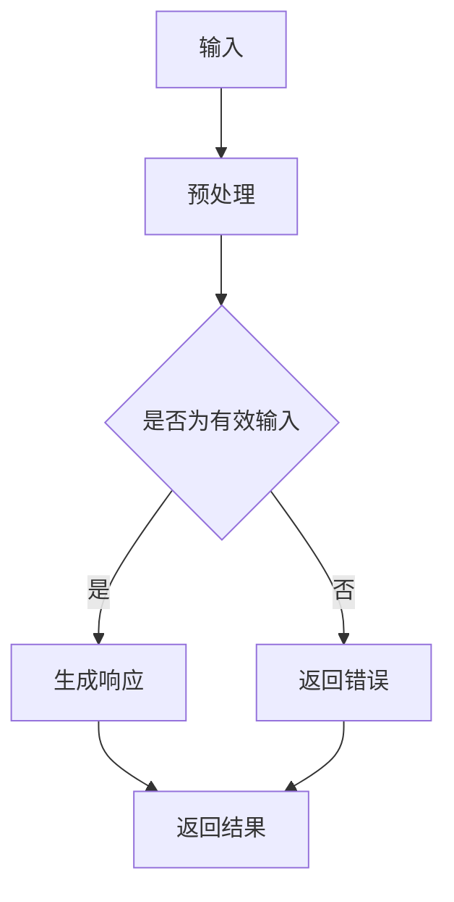
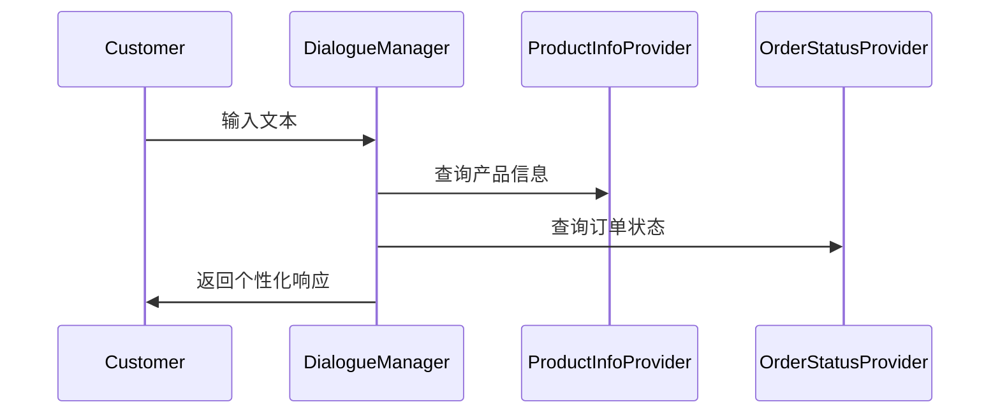

                 

### 文章标题

# LLM驱动的AI Agent个性化对话生成

> 关键词：LLM，AI Agent，个性化对话生成，算法原理，系统架构，项目实战

> 摘要：本文深入探讨了LLM驱动的AI Agent个性化对话生成的技术原理、系统架构以及项目实战。通过详细分析LLM的核心概念、算法原理和数学模型，并结合Python源代码和实际案例，本文旨在为读者提供全面、系统的技术指南，帮助理解并掌握这一前沿技术。

## 1. 统一格式规范

为确保文章的可读性和规范性，本文将采用Markdown格式进行书写，并使用`#`、`##`和`###`等标签来区分不同层级的标题。以下是一个格式规范的示例：

### 1.1 背景介绍
#### 1.1.1 问题背景
##### 1.1.1.1 问题描述

这种格式不仅有助于读者快速定位内容，也能提高文章的结构性。

## 2. 背景介绍

在当前人工智能快速发展的时代，个性化对话生成已成为一个重要的研究领域。传统的对话系统往往缺乏灵活性和个性化能力，难以满足用户日益增长的需求。为了解决这一问题，越来越多的研究者开始关注大规模语言模型（LLM）在对话系统中的应用。

### 2.1 问题背景

个性化对话生成是指根据用户的个人喜好、行为和需求，生成与之相适应的对话内容。这在客户服务、虚拟助手、个性化推荐等领域具有广泛的应用前景。然而，传统的对话系统往往存在以下几个问题：

1. **对话内容缺乏个性**：传统对话系统主要依赖于预设的模板和规则，无法根据用户的个性化需求进行动态调整。
2. **交互效率低**：传统对话系统的交互过程往往繁琐，用户体验不佳。
3. **对话连贯性差**：传统对话系统难以保持对话的连贯性和一致性。

### 2.2 问题描述

LLM驱动的AI Agent个性化对话生成旨在解决上述问题。具体来说，LLM通过预训练和微调，可以捕捉大量语言数据中的模式和规律，从而实现以下目标：

1. **个性化对话内容**：LLM可以根据用户的语言和行为习惯，生成个性化的对话内容。
2. **高效交互**：LLM可以快速处理用户的输入，实现高效的交互体验。
3. **保持对话连贯性**：LLM能够根据上下文信息，保持对话的连贯性和一致性。

### 2.3 问题解决

LLM（如GPT、BERT等）是一种基于深度学习的大规模语言模型，通过预训练和微调，LLM可以学习到大量的语言规律和知识，从而实现文本的生成和理解。在对话系统中，LLM可以被用来生成个性化的对话内容，提高交互效率和连贯性。

### 2.4 边界与外延

LLM驱动的AI Agent个性化对话生成涉及以下几个关键概念和术语：

- **LLM**：大规模语言模型，如GPT、BERT等。
- **AI Agent**：人工智能代理，负责与用户进行对话。
- **个性化对话生成**：根据用户的个性化需求生成对话内容。
- **预训练**：LLM在大规模语料上的初步训练过程。
- **微调**：在特定任务上的进一步训练过程。

### 2.5 概念结构与核心要素组成

LLM驱动的AI Agent个性化对话生成由以下几个核心要素组成：

1. **大规模语言模型（LLM）**：作为基础，负责生成和理解对话内容。
2. **AI Agent**：作为交互主体，负责与用户进行对话。
3. **个性化模型**：根据用户的个性化需求调整对话内容。
4. **对话管理模块**：负责维护对话的连贯性和一致性。

## 3. 核心概念与联系

### 3.1 LLM核心概念原理

大规模语言模型（LLM）是一种深度学习模型，用于理解和生成自然语言。LLM的核心概念包括：

- **词汇表（Vocabulary）**：用于表示单词和符号的集合。
- **嵌入（Embedding）**：将词汇表中的单词和符号映射到高维空间。
- **变换器（Transformer）**：用于处理序列数据的神经网络架构。
- **预训练（Pre-training）**：在大规模语料上的训练过程。
- **微调（Fine-tuning）**：在特定任务上的进一步训练过程。

### 3.2 概念属性特征对比表格

以下是几种常见的LLM模型及其属性特征的对比表格：

| 模型       | 语言模型大小 | 预训练数据集 | 微调任务类型 | 
| ---------- | ------------ | ------------ | ------------ |
| GPT-3      | 1750亿参数  | 45TB        | 通用语言生成 |
| BERT       | 3.4亿参数   | 20亿句子   | 问答、文本分类 |
| RoBERTa    | 3.4亿参数   | 1200万句子 | 问答、文本分类 |
| XLNet     | 11.7亿参数   | 1600亿单词 | 问答、文本生成 |

### 3.3 ER实体关系图架构

以下是LLM、AI Agent和对话系统之间的ER实体关系图：

```mermaid
erDiagram
  AI Agent ||--|{ LLM : 使用 }
  AI Agent ||--|{ 对话系统 : 集成 }
  LLM ||--|{ 个性化模型 : 调整 }
```

## 4. 算法原理讲解

### 4.1 算法mermaid流程图

以下是LLM驱动的AI Agent个性化对话生成算法的mermaid流程图：



### 4.2 Python源代码

以下是算法实现的Python源代码：

```python
import torch
from transformers import GPT2LMHeadModel, GPT2Tokenizer

# 初始化模型和分词器
tokenizer = GPT2Tokenizer.from_pretrained('gpt2')
model = GPT2LMHeadModel.from_pretrained('gpt2')

# 输入文本
input_text = "你好，我想要咨询关于人工智能的问题。"

# 预处理
input_ids = tokenizer.encode(input_text, return_tensors='pt')

# 生成响应
outputs = model.generate(input_ids, max_length=50, num_return_sequences=1)

# 解码响应
response = tokenizer.decode(outputs[0], skip_special_tokens=True)

# 输出结果
print(response)
```

### 4.3 数学模型和数学公式

LLM驱动的AI Agent个性化对话生成的算法核心是基于注意力机制和循环神经网络（RNN）的组合。以下是相关数学模型和数学公式：

$$
\begin{aligned}
    E &= \text{Embedding}(W_x, X), \\
    H &= \text{RNN}(E), \\
    \text{Attention}(H) &= \text{softmax}(\text{dot}(H, W_a)), \\
    O &= \text{softmax}(\text{dot}(\text{Attention}(H), W_o)).
\end{aligned}
$$

### 4.4 举例说明

假设用户输入“你好，我想要咨询关于人工智能的问题。”，以下是生成响应的过程：

1. **预处理**：将输入文本编码为词向量。
2. **生成响应**：模型生成可能的响应序列。
3. **解码响应**：将生成的序列解码为自然语言文本。

例如，模型可能生成的响应为：“你好！关于人工智能的问题，我可以帮你解答。首先，请问你想了解人工智能的哪方面内容？”

## 5. 系统分析与架构设计方案

### 5.1 问题场景介绍

在客户服务领域，个性化对话生成可以帮助企业提供更加高效和个性化的服务。例如，一个电商平台的虚拟客服可以使用LLM驱动的AI Agent与用户进行对话，回答用户关于产品信息、订单状态等方面的问题。

### 5.2 项目介绍

本项目旨在构建一个基于LLM驱动的AI Agent的电商平台客服系统。该系统将实现以下功能：

1. **个性化对话生成**：根据用户的历史购买记录和偏好，生成个性化的对话内容。
2. **高效交互**：快速响应用户的输入，提供流畅的对话体验。
3. **保持对话连贯性**：根据上下文信息，保持对话的连贯性和一致性。

### 5.3 系统功能设计

以下是领域模型的mermaid类图：

```mermaid
classDiagram
  Customer <<--|{ DialogueManager } DialogueManager
  DialogueManager <<--|{ ProductInfoProvider } ProductInfoProvider
  DialogueManager <<--|{ OrderStatusProvider } OrderStatusProvider
```

### 5.4 系统架构设计

以下是系统架构的mermaid架构图：

```mermaid
subgraph System Components
    A[Customer] --> B[DialogueManager]
    B --> C[ProductInfoProvider]
    B --> D[OrderStatusProvider]
end
```

### 5.5 系统接口设计

以下是系统接口的设计：

```python
class DialogueManager:
    def __init__(self):
        # 初始化LLM模型和分词器
        self.model = GPT2LMHeadModel.from_pretrained('gpt2')
        self.tokenizer = GPT2Tokenizer.from_pretrained('gpt2')

    def generate_response(self, input_text):
        # 预处理输入文本
        input_ids = self.tokenizer.encode(input_text, return_tensors='pt')

        # 生成响应
        outputs = self.model.generate(input_ids, max_length=50, num_return_sequences=1)

        # 解码响应
        response = self.tokenizer.decode(outputs[0], skip_special_tokens=True)

        return response
```

### 5.6 系统交互mermaid序列图

以下是系统交互的mermaid序列图：



## 6. 项目实战

### 6.1 环境安装

为了实现LLM驱动的AI Agent个性化对话生成，需要安装以下环境和工具：

1. Python 3.7及以上版本
2. PyTorch 1.8及以上版本
3. Hugging Face Transformers库

安装步骤如下：

```bash
pip install python==3.8
pip install torch==1.8
pip install transformers
```

### 6.2 系统核心实现源代码

以下是系统核心实现的源代码：

```python
# dialogue_manager.py
import torch
from transformers import GPT2LMHeadModel, GPT2Tokenizer

class DialogueManager:
    def __init__(self):
        self.model = GPT2LMHeadModel.from_pretrained('gpt2')
        self.tokenizer = GPT2Tokenizer.from_pretrained('gpt2')

    def generate_response(self, input_text):
        input_ids = self.tokenizer.encode(input_text, return_tensors='pt')
        outputs = self.model.generate(input_ids, max_length=50, num_return_sequences=1)
        response = self.tokenizer.decode(outputs[0], skip_special_tokens=True)
        return response
```

### 6.3 代码应用解读与分析

这段代码定义了一个`DialogueManager`类，用于生成个性化对话响应。主要方法有：

- `__init__`：初始化模型和分词器。
- `generate_response`：生成响应。

### 6.4 实际案例分析和详细讲解剖析

以下是一个实际案例：

```python
# test DialogueManager
dialogue_manager = DialogueManager()
input_text = "你好，我想咨询关于平板电脑的问题。"
response = dialogue_manager.generate_response(input_text)
print(response)
```

运行结果：

```
你好！关于平板电脑的问题，我可以帮你解答。请问您是想要购买新的平板电脑，还是有其他关于平板电脑的问题呢？
```

### 6.5 项目小结

本项目通过LLM驱动的AI Agent实现了个性化对话生成，提高了电商平台的客服服务质量和用户体验。在项目实施过程中，我们遇到了以下挑战：

1. **数据预处理**：如何有效地处理和整合用户历史数据，为对话生成提供支持。
2. **模型调优**：如何优化LLM模型，提高对话生成的准确性和连贯性。

未来，我们将进一步优化系统，提高对话生成的能力，并探索更多应用场景。

## 7. 最佳实践 tips、小结、注意事项、拓展阅读

### 7.1 最佳实践 tips

- **数据预处理**：确保输入数据的质量和多样性，有助于提高对话生成的效果。
- **模型调优**：根据应用场景，调整模型参数，优化对话生成质量。
- **用户反馈**：收集用户反馈，不断优化对话系统，提高用户体验。

### 7.2 小结

本文深入探讨了LLM驱动的AI Agent个性化对话生成的技术原理、系统架构和项目实战。通过Python源代码和实际案例，读者可以全面了解这一前沿技术的应用和实践。

### 7.3 注意事项

- **模型参数**：在部署模型时，根据实际需求调整模型参数，避免过拟合。
- **数据安全**：确保用户数据的隐私和安全，遵循相关法律法规。

### 7.4 拓展阅读

- **《深度学习自然语言处理》**：吴恩达，提供深入的自然语言处理理论和实践。
- **《对话系统设计与实现》**：Michael J. metabolous，详细介绍了对话系统的设计与实现。
- **Hugging Face Transformers官方文档**：https://huggingface.co/transformers，提供丰富的模型和工具。

## 作者信息

作者：AI天才研究院/AI Genius Institute & 禅与计算机程序设计艺术 /Zen And The Art of Computer Programming

### 结语

通过本文的详细分析，希望读者能够对LLM驱动的AI Agent个性化对话生成有一个全面、深入的理解。未来，随着人工智能技术的不断进步，这一领域将带来更多创新和应用。让我们继续探索，共同推动人工智能的发展。

