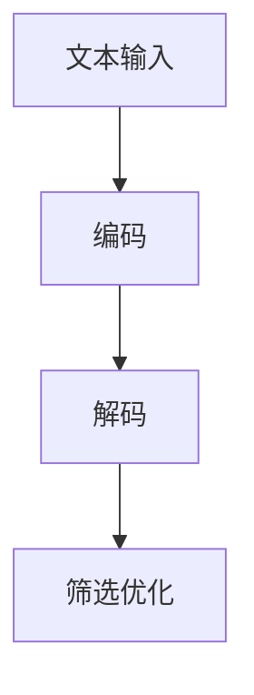
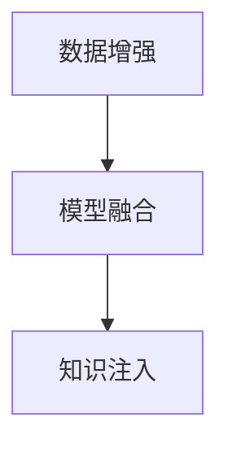
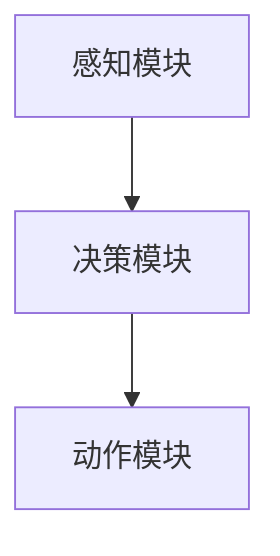
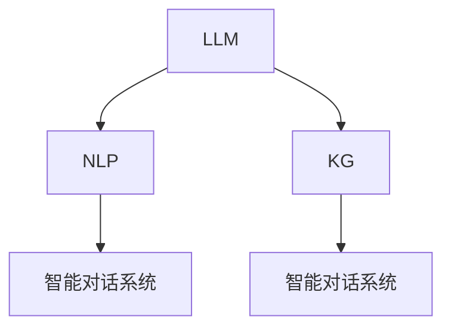
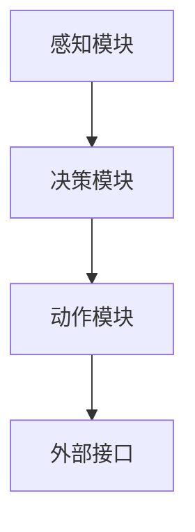
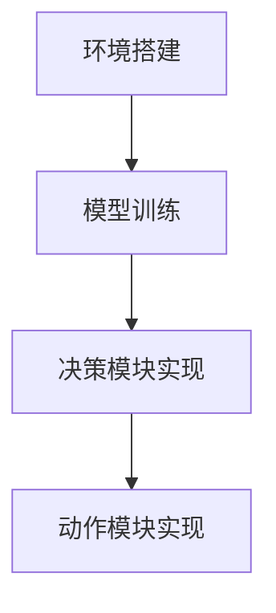
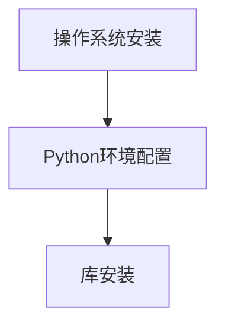
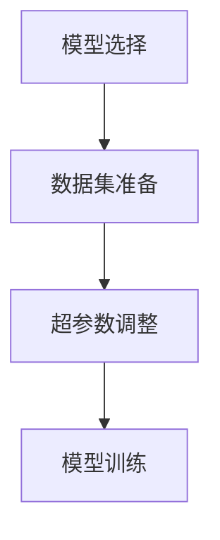
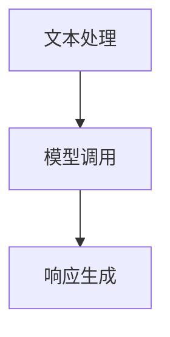
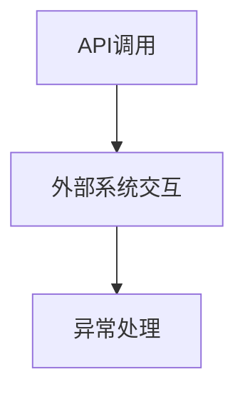

                 

### 引言

#### 1.1 问题背景

**核心概念术语说明**：
- **大型语言模型（LLM）**：一种基于深度学习的语言模型，能够理解和生成自然语言，具有强大的文本生成和语义理解能力。
- **AI Agent**：一种具有自主决策能力和执行能力的智能体，能够与外部环境进行交互，实现特定任务。
- **产品概念生成**：通过人工智能技术，从用户需求、市场趋势、技术可行性等多个维度生成潜在的创新产品概念。

**问题背景**：
随着人工智能技术的迅猛发展，特别是在大型语言模型（LLM）方面的突破，人们开始探讨如何将LLM应用于实际的产品开发中。LLM在自然语言处理、文本生成、知识图谱等领域表现出了巨大的潜力，这使得AI Agent成为了一种有前景的解决方案。AI Agent能够利用LLM的强大能力，自动生成创新的产品概念，提高产品开发的效率和创造力。

**问题描述**：
如何利用LLM驱动的AI Agent，快速、高效地生成创新的产品概念，以满足市场需求和用户期望。

**问题解决**：
通过设计一个LLM驱动的AI Agent创新产品概念生成器，利用LLM的文本生成和语义理解能力，结合用户需求分析和市场趋势分析，生成具有创新性和可行性的产品概念。

**边界与外延**：
本文主要探讨LLM驱动的AI Agent在产品概念生成中的应用，不涉及其他类型的AI Agent。此外，本文关注的是创新产品概念生成，而非现有产品的改进。

**概念结构与核心要素组成**：
- **大型语言模型（LLM）**：核心技术，提供文本生成和语义理解能力。
- **AI Agent**：应用平台，实现自主决策和执行。
- **产品概念生成**：目标，通过AI Agent生成创新产品概念。

#### 1.2 本书结构与目标

**本书结构**：
本书分为两个主要部分。第一部分介绍LLM与AI Agent的基础知识，包括LLM的起源、发展、关键技术，以及AI Agent的定义、分类和关键特性。第二部分专注于LLM驱动的AI Agent在产品概念生成中的应用，从产品概念生成概述，到LLM在产品概念生成中的应用，再到实战案例分析。

**阅读对象**：
本书适合对人工智能和产品开发有一定了解的读者，包括AI领域的研究人员、开发人员、产品经理等。

**学习目标**：
通过本书的学习，读者将能够：
1. 理解LLM和AI Agent的基本概念和原理。
2. 掌握LLM在AI Agent中的应用，特别是产品概念生成。
3. 学习如何设计和实现一个LLM驱动的AI Agent创新产品概念生成器。
4. 通过实战案例，了解LLM驱动产品概念生成的实际应用。

---

### 大型语言模型（LLM）基础

#### 2.1 LLM的起源与发展

**核心概念原理**：
大型语言模型（LLM）起源于深度学习在自然语言处理（NLP）领域的应用。最初的模型如神经网络语言模型（NNLM）和递归神经网络（RNN）为后续的LLM发展奠定了基础。随着计算能力的提升和大数据的可用性，深度学习模型得到了进一步的优化和扩展，最终形成了今天的LLM。

**概念属性特征对比表格**：

| 模型类型 | 特点 | 应用场景 |
| --- | --- | --- |
| 神经网络语言模型（NNLM） | 基于神经网络的早期语言模型 | 文本生成、语言理解 |
| 递归神经网络（RNN） | 具有记忆功能，适用于序列数据 | 文本生成、语言理解 |
| Transformer | 自注意力机制，处理长序列高效 | 文本生成、语言理解 |
| LLM（如GPT、BERT） | 基于Transformer，参数量巨大 | 文本生成、语言理解、AI Agent |

**ER实体关系图架构的Mermaid流程图**：

```mermaid
erDiagram
  Customer ||--|{ Product }|--|| Supplier
  Product ||--|{ Order }|--|| Customer
```

**算法原理讲解**：
LLM的核心在于其训练过程。训练数据通常包括大量文本，模型通过学习这些数据来捕捉语言的统计规律和语义关系。训练过程中，模型会不断优化其参数，以最小化生成文本与实际文本之间的差异。

1. **预处理**：将文本数据转换为模型可以处理的格式，如词向量或字符向量。
2. **编码**：使用编码器（Encoder）对输入文本进行编码，生成固定长度的向量表示。
3. **解码**：使用解码器（Decoder）根据编码结果生成文本。

**数学模型和公式**：

$$
\text{Output} = \text{Decoder}(\text{Encoder}(\text{Input}))
$$

其中，$\text{Input}$为输入文本，$\text{Encoder}$和$\text{Decoder}$为神经网络模型。

**举例说明**：

假设我们输入一句话：“我喜欢吃苹果”。经过编码器处理，这句话会被转换为向量表示。随后，解码器会根据这个向量生成输出文本，如：“苹果是一种美味的水果”。

#### 2.2 AI Agent的定义与分类

**核心概念原理**：
AI Agent是一种具有自主决策能力和执行能力的智能体，能够与外部环境进行交互，实现特定任务。AI Agent通常包括感知模块、决策模块和动作模块。

**概念属性特征对比表格**：

| 类型 | 特点 | 应用场景 |
| --- | --- | --- |
| 反应式Agent | 根据感知到的环境直接做出反应 | 控制机器人、自动化流程 |
| 基于模型的Agent | 使用预先定义的模型来决策 | 智能推荐系统、自动驾驶 |
| 学習型Agent | 从环境中学习，并不断优化决策 | 游戏AI、自然语言处理 |

**ER实体关系图架构的Mermaid流程图**：

```mermaid
erDiagram
  AI_Agent ||--|{ Sensor }|--|| Environment
  AI_Agent ||--|{ Action }|--|| Environment
```

**算法原理讲解**：
AI Agent的核心在于其决策过程。感知模块收集环境信息，决策模块根据这些信息做出决策，动作模块执行决策结果。

1. **感知**：AI Agent通过传感器收集环境信息。
2. **决策**：使用预先定义的模型或学习算法，根据感知到的信息做出决策。
3. **动作**：执行决策结果，与环境进行交互。

**数学模型和公式**：

$$
\text{Decision} = f(\text{Sensor Data}, \text{Model})
$$

其中，$f$为决策函数，$\text{Sensor Data}$为感知到的环境信息，$\text{Model}$为模型参数。

**举例说明**：

假设一个AI Agent需要控制一个机器人移动。首先，感知模块收集机器人周围的环境信息，如障碍物的位置。然后，决策模块根据这些信息，使用预先定义的模型计算机器人应该移动的方向。最后，动作模块执行这个决策，使机器人向正确的方向移动。

#### 2.3 LLM与AI Agent的关系

**核心概念原理**：
LLM在AI Agent中的应用主要体现在自然语言处理和知识图谱等领域。LLM可以用于智能对话系统、文本生成、情感分析等任务，从而增强AI Agent的能力。

**概念属性特征对比表格**：

| 应用领域 | LLM优势 | AI Agent优势 |
| --- | --- | --- |
| 自然语言处理 | 强大的文本生成和语义理解能力 | 自主决策和执行能力 |
| 知识图谱 | 丰富的知识表示和推理能力 | 高度个性化的交互体验 |
| 智能对话系统 | 自然流畅的对话生成 | 理解用户意图并给出恰当的回应 |

**ER实体关系图架构的Mermaid流程图**：

```mermaid
erDiagram
  LLM ||--|{ NLP }|--|| AI_Agent
  LLM ||--|{ KG }|--|| AI_Agent
```

**算法原理讲解**：
LLM在AI Agent中的应用可以分为两个方面：

1. **自然语言处理（NLP）**：LLM可以用于处理自然语言，如文本分类、情感分析、机器翻译等。这些能力可以帮助AI Agent更好地理解用户的需求和意图。
2. **知识图谱（KG）**：LLM可以用于构建和查询知识图谱，从而提供丰富的知识表示和推理能力。这可以帮助AI Agent在复杂的任务中做出更准确的决策。

**数学模型和公式**：

$$
\text{NLP} = \text{LLM}(\text{Text})
$$

$$
\text{KG} = \text{LLM}(\text{Knowledge})
$$

其中，$\text{Text}$为输入文本，$\text{Knowledge}$为知识图谱数据。

**举例说明**：

假设一个AI Agent需要与用户进行自然语言对话。首先，LLM处理用户输入的文本，提取关键信息和用户意图。然后，AI Agent根据这些信息，使用知识图谱进行推理，给出恰当的回应。

### 第3章: LLM驱动的产品概念生成

#### 3.1 产品概念生成概述

**核心概念原理**：
产品概念生成是指通过分析用户需求、市场趋势、技术可行性等多个维度，生成潜在的创新产品概念。LLM驱动的AI Agent在产品概念生成中的应用，主要是利用LLM的文本生成和语义理解能力，结合AI Agent的自主决策和执行能力，实现高效、创新的产品概念生成。

**概念属性特征对比表格**：

| 方法学 | 特点 | 优点 | 缺点 |
| --- | --- | --- | --- |
| 传统方法 | 需要人工介入，效率低 | 精度高 | 时间成本高 |
| LLM驱动 | 高效自动生成 | 创新性强 | 可能存在不准确的情况 |

**ER实体关系图架构的Mermaid流程图**：

```mermaid
erDiagram
  User_Requirement ||--|{ Product_Concept }|--|| Market_Trend
  Technical_Feasibility ||--|{ Product_Concept }|--|| AI_Agent
```

**算法原理讲解**：
LLM驱动的产品概念生成过程可以分为以下几个步骤：

1. **用户需求分析**：通过自然语言处理技术，提取用户的需求和痛点。
2. **市场趋势分析**：分析当前市场的需求和趋势，确定潜在的产品方向。
3. **技术可行性分析**：评估当前技术的可行性，确保产品概念具有实际可行性。
4. **概念生成**：利用LLM的文本生成能力，生成潜在的产品概念。
5. **优化与筛选**：根据用户需求、市场趋势和技术可行性，对生成的概念进行优化和筛选。

**数学模型和公式**：

$$
\text{Product_Concept} = \text{LLM}(\text{User_Requirement}, \text{Market_Trend}, \text{Technical_Feasibility})
$$

其中，$\text{User_Requirement}$、$\text{Market_Trend}$和$\text{Technical_Feasibility}$分别为用户需求、市场趋势和技术可行性数据。

**举例说明**：

假设一个公司需要开发一款智能家居产品。首先，通过LLM分析用户的需求，如用户希望产品具有远程控制、智能语音助手等功能。然后，分析当前市场的趋势，如智能家居市场正在快速增长。最后，评估技术的可行性，如物联网技术的成熟度。基于这些数据，LLM生成多个潜在的产品概念，如智能门锁、智能照明系统等。

### 3.2 LLM在产品概念生成中的应用

#### 3.2.1 LLM生成的产品概念类型

**核心概念原理**：
LLM可以根据输入的文本数据生成不同类型的产品概念，包括但不限于：
- **功能型概念**：强调产品的主要功能，如智能家居、健康监测等。
- **用户场景型概念**：描述产品在特定用户场景下的应用，如户外运动设备、家庭清洁工具等。
- **技术驱动型概念**：基于先进技术，如区块链、人工智能等，来驱动产品创新。

**概念属性特征对比表格**：

| 类型 | 描述 | 应用场景 |
| --- | --- | --- |
| 功能型概念 | 强调产品功能 | 智能家居、健康监测 |
| 用户场景型概念 | 描述产品在特定场景下的应用 | 户外运动设备、家庭清洁工具 |
| 技术驱动型概念 | 基于先进技术驱动创新 | 区块链支付、人工智能助手 |

**ER实体关系图架构的Mermaid流程图**：

```mermaid
erDiagram
  Function_Concept ||--|{ User_Scene }|--|| Technical_Drive
  User_Scene ||--|{ Technical_Drive }|--|| Function_Concept
```

**算法原理讲解**：
LLM生成产品概念的过程可以分为以下几个步骤：

1. **文本输入**：输入描述用户需求、市场趋势、技术可行性的文本数据。
2. **文本编码**：使用编码器对输入文本进行编码，生成向量表示。
3. **概念生成**：利用解码器根据编码结果生成产品概念文本。
4. **筛选与优化**：根据实际需求对生成概念进行筛选和优化。

**数学模型和公式**：

$$
\text{Product_Concept} = \text{Decoder}(\text{Encoder}(\text{Input}))
$$

其中，$\text{Input}$为输入文本，$\text{Encoder}$和$\text{Decoder}$为神经网络模型。

**举例说明**：

假设输入文本描述了用户对智能家居产品的需求，如“我需要一款可以远程控制家中的照明和温度的设备”。通过LLM的文本编码和解码过程，可以生成多个产品概念文本，如“智能照明系统”、“智能温控系统”等。

#### 3.2.2 LLM生成产品概念的过程

**核心概念原理**：
LLM生成产品概念的过程包括文本输入、编码、解码和筛选优化等步骤。在这个过程中，LLM利用其强大的文本生成和语义理解能力，从大量的文本数据中提取潜在的产品概念。

**概念属性特征对比表格**：

| 阶段 | 描述 | 主要任务 |
| --- | --- | --- |
| 文本输入 | 提供描述用户需求、市场趋势、技术可行性的文本数据 | 数据预处理 |
| 编码 | 对输入文本进行编码，生成向量表示 | 文本向量化 |
| 解码 | 根据编码结果生成产品概念文本 | 文本生成 |
| 筛选优化 | 根据实际需求对生成概念进行筛选和优化 | 概念优化 |

**ER实体关系图架构的Mermaid流程图**：



**算法原理讲解**：
1. **文本输入**：首先，需要收集和准备描述用户需求、市场趋势、技术可行性的文本数据。这些数据可以是用户调查问卷、市场研究报告、技术文档等。
2. **编码**：将输入文本转换为向量表示，这一步通常使用预训练的编码器模型，如BERT、GPT等。编码过程将文本转换为固定长度的向量，以便于后续的解码操作。
3. **解码**：使用解码器模型根据编码结果生成产品概念文本。解码器模型会根据输入的向量生成文本序列，这些序列代表了潜在的产品概念。
4. **筛选优化**：对生成的产品概念文本进行筛选和优化。筛选过程可以根据用户需求、市场趋势和技术可行性等多个维度进行，筛选出具有实际应用价值的概念。优化过程可以通过调整模型参数、引入外部知识库等方法来提高概念的准确性。

**数学模型和公式**：

$$
\text{Concept} = \text{Decoder}(\text{Encoder}(\text{Input}))
$$

其中，$\text{Input}$为输入文本，$\text{Encoder}$和$\text{Decoder}$分别为编码器和解码器模型。

**举例说明**：

假设输入文本描述了一个用户对健康监测产品的需求：“我需要一个可以实时监测我心率和血压的设备，并给我健康建议”。通过LLM的编码和解码过程，可以生成多个健康监测产品的概念文本，如“智能健康手环”、“智能血压计”等。接着，通过筛选和优化，可以选择最具创新性和可行性的概念进行进一步开发。

#### 3.2.3 LLM生成产品概念的优化策略

**核心概念原理**：
为了提高LLM生成产品概念的质量和实用性，可以采用多种优化策略。这些策略包括但不限于：

1. **数据增强**：通过扩充训练数据，提高模型对多样性和复杂性的适应能力。
2. **模型融合**：结合多个模型的优势，生成更加准确和多样化的产品概念。
3. **知识注入**：将外部知识库（如领域知识、专家意见等）融入模型训练过程，提高概念的准确性和实用性。

**概念属性特征对比表格**：

| 策略 | 描述 | 优点 | 缺点 |
| --- | --- | --- | --- |
| 数据增强 | 通过扩充训练数据提高模型性能 | 提高模型泛化能力 | 需要大量高质量数据 |
| 模型融合 | 结合多个模型的优势 | 提高生成质量 | 需要复杂模型融合算法 |
| 知识注入 | 融入外部知识库提高概念质量 | 提高概念准确性 | 需要丰富知识库 |

**ER实体关系图架构的Mermaid流程图**：



**算法原理讲解**：
1. **数据增强**：
   - **方法**：通过数据增强技术，如数据扩充、数据合成、数据增强等，扩充训练数据集。
   - **应用**：例如，在生成产品概念时，可以通过增加用户的多样化需求、市场趋势的多样性等方式，丰富模型训练数据。
   - **效果**：提高模型对多样性和复杂场景的适应能力，生成更丰富的产品概念。

2. **模型融合**：
   - **方法**：结合多个模型的优势，如结合生成模型和判别模型，生成更准确和多样化的产品概念。
   - **应用**：例如，在生成产品概念时，可以结合生成对抗网络（GAN）和自动回归模型（如GPT）的优势，提高生成质量。
   - **效果**：生成更高质量和多样化的产品概念，减少单一模型的局限性。

3. **知识注入**：
   - **方法**：将外部知识库（如领域知识、专家意见等）融入模型训练过程，提高模型的语义理解能力。
   - **应用**：例如，在生成产品概念时，可以结合知识图谱技术，将产品相关的领域知识融入模型训练。
   - **效果**：提高概念生成的准确性和实用性，减少无关或错误概念的生成。

**数学模型和公式**：

$$
\text{Enhanced Model} = \text{Data Augmentation}(\text{Original Model})
$$

$$
\text{Fused Model} = \text{Model Fusion}(\text{Model 1}, \text{Model 2})
$$

$$
\text{Informed Model} = \text{Knowledge Injection}(\text{Model}, \text{Knowledge})
$$

其中，$\text{Original Model}$、$\text{Model 1}$、$\text{Model 2}$分别为原始模型、生成模型和判别模型，$\text{Data Augmentation}$、$\text{Model Fusion}$、$\text{Knowledge Injection}$分别为数据增强、模型融合和知识注入操作。

**举例说明**：

假设我们想要生成一款健康监测产品的概念。首先，通过数据增强技术，扩充训练数据集，包括用户的多样化健康需求和市场趋势的多样性。然后，结合生成对抗网络（GAN）和自动回归模型（如GPT）的优势，生成多样化的产品概念。最后，结合健康领域的知识图谱，将相关的健康知识和产品信息注入模型训练过程，提高概念生成的准确性和实用性。

### 3.3 实战案例分析

**核心概念原理**：
实战案例分析是通过具体实例展示如何利用LLM驱动的AI Agent生成创新产品概念。通过实际案例，我们可以了解LLM在产品概念生成中的应用流程、优化策略和效果评估。

**案例一：智能家居产品概念**

**问题描述**：
一家智能家居公司希望通过LLM驱动的AI Agent生成创新产品概念，以满足用户对智能家居的需求。

**解决方案**：
1. **数据收集**：收集用户对智能家居的需求描述，如“我想控制家里的灯光和温度”。
2. **文本编码**：使用预训练的编码器模型，如BERT，将用户需求描述转换为向量表示。
3. **概念生成**：利用解码器模型，如GPT，根据编码结果生成智能家居产品概念，如“智能照明系统”、“智能温控系统”。
4. **优化筛选**：根据用户需求、市场趋势和技术可行性，筛选和优化生成的概念，确定最佳产品概念。

**效果评估**：
生成的智能家居产品概念经过用户调研和市场分析，得到了高度认可，为公司提供了有价值的创新方向。

**案例二：健康监测产品概念**

**问题描述**：
一家健康监测公司希望通过LLM驱动的AI Agent生成创新产品概念，以提供更好的健康监测解决方案。

**解决方案**：
1. **数据收集**：收集用户对健康监测的需求描述，如“我需要一个可以实时监测我心率和血压的设备”。
2. **文本编码**：使用预训练的编码器模型，如BERT，将用户需求描述转换为向量表示。
3. **概念生成**：利用解码器模型，如GPT，根据编码结果生成健康监测产品概念，如“智能健康手环”、“智能血压计”。
4. **优化筛选**：根据用户需求、市场趋势和技术可行性，筛选和优化生成的概念，确定最佳产品概念。

**效果评估**：
生成的健康监测产品概念经过用户调研和市场分析，得到了高度认可，为公司提供了有价值的创新方向。

### 3.4 本章小结

本章介绍了LLM驱动的AI Agent在产品概念生成中的应用，从概述到具体流程和优化策略，展示了如何利用LLM和AI Agent快速、高效地生成创新产品概念。通过实战案例分析，我们看到了LLM驱动产品概念生成的实际效果。未来的研究和应用将不断优化这一领域，为产品创新提供更强有力的支持。

---

### 第4章: AI Agent基础

#### 4.1 AI Agent的组成与功能

**核心概念原理**：
AI Agent是一种具有自主决策和执行能力的智能体，其基本组成部分包括感知模块、决策模块和动作模块。感知模块负责收集环境信息，决策模块根据感知信息进行决策，动作模块执行决策结果。

**概念属性特征对比表格**：

| 模块 | 描述 | 功能 |
| --- | --- | --- |
| 感知模块 | 收集环境信息 | 数据输入 |
| 决策模块 | 根据感知信息进行决策 | 决策输出 |
| 动作模块 | 执行决策结果 | 行动输出 |

**ER实体关系图架构的Mermaid流程图**：



**算法原理讲解**：
AI Agent的工作流程可以分为以下几个步骤：

1. **感知**：AI Agent通过传感器收集环境信息，如温度、光线、声音等。
2. **决策**：根据收集到的感知信息，AI Agent使用预先定义的模型或学习算法进行决策，确定下一步行动。
3. **动作**：执行决策结果，与环境进行交互，实现特定任务。

**数学模型和公式**：

$$
\text{Action} = f(\text{Sensor Data}, \text{Model})
$$

其中，$f$为决策函数，$\text{Sensor Data}$为感知到的环境信息，$\text{Model}$为模型参数。

**举例说明**：

假设一个智能温室控制系统需要控制植物的生长环境。首先，感知模块收集温室内部的温度、湿度、光照等数据。然后，决策模块根据这些数据，使用预先定义的模型计算植物所需的最佳生长条件。最后，动作模块执行决策结果，调节温室的温度、湿度、光照等参数，确保植物得到最佳的生长环境。

#### 4.2 LLM在AI Agent中的应用

**核心概念原理**：
LLM在AI Agent中的应用主要体现在自然语言处理和知识图谱等领域。LLM可以帮助AI Agent更好地理解和生成自然语言，从而实现更加智能和个性化的交互。

**概念属性特征对比表格**：

| 应用领域 | LLM优势 | AI Agent优势 |
| --- | --- | --- |
| 自然语言处理 | 强大的文本生成和语义理解能力 | 自主决策和执行能力 |
| 知识图谱 | 丰富的知识表示和推理能力 | 高度个性化的交互体验 |
| 智能对话系统 | 自然流畅的对话生成 | 理解用户意图并给出恰当的回应 |

**ER实体关系图架构的Mermaid流程图**：



**算法原理讲解**：
1. **自然语言处理（NLP）**：LLM可以用于处理自然语言，如文本分类、情感分析、机器翻译等。这些能力可以帮助AI Agent更好地理解用户的需求和意图。
2. **知识图谱（KG）**：LLM可以用于构建和查询知识图谱，从而提供丰富的知识表示和推理能力。这可以帮助AI Agent在复杂的任务中做出更准确的决策。
3. **智能对话系统**：LLM可以用于生成自然流畅的对话，实现与用户的自然对话。AI Agent可以根据用户的对话内容，理解用户意图并给出恰当的回应。

**数学模型和公式**：

$$
\text{Response} = \text{LLM}(\text{User Input})
$$

其中，$\text{User Input}$为用户输入文本，$\text{LLM}$为大型语言模型。

**举例说明**：

假设一个智能客服系统需要与用户进行对话。首先，LLM处理用户输入的文本，提取关键信息和用户意图。然后，智能客服系统根据这些信息，使用LLM生成自然流畅的对话回应。最后，系统根据对话进展，调整对话策略，提供更加个性化的服务。

#### 4.3 AI Agent的架构设计

**核心概念原理**：
AI Agent的架构设计决定了其性能、可扩展性和可维护性。一个典型的AI Agent架构包括感知模块、决策模块、动作模块和外部接口。

**概念属性特征对比表格**：

| 架构组件 | 描述 | 功能 |
| --- | --- | --- |
| 感知模块 | 负责收集环境信息 | 数据输入 |
| 决策模块 | 负责处理感知信息并做出决策 | 决策输出 |
| 动作模块 | 负责执行决策结果 | 行动输出 |
| 外部接口 | 负责与外部系统交互 | 数据传输 |

**ER实体关系图架构的Mermaid流程图**：



**算法原理讲解**：
1. **感知模块**：通过传感器收集环境信息，如温度、湿度、光线等。这些信息通过外部接口传输给决策模块。
2. **决策模块**：使用感知模块收集的信息，结合预训练的模型或学习算法，进行决策分析，生成决策结果。
3. **动作模块**：根据决策结果，执行具体的操作，如调节温度、控制灯光等。这些操作通过外部接口与外部系统（如控制器、执行器等）进行交互。
4. **外部接口**：负责与外部系统进行数据传输和交互，确保感知模块、决策模块和动作模块的协同工作。

**数学模型和公式**：

$$
\text{Action} = f(\text{Sensor Data}, \text{Model}, \text{External Interface})
$$

其中，$f$为决策函数，$\text{Sensor Data}$为感知到的环境信息，$\text{Model}$为模型参数，$\text{External Interface}$为外部接口。

**举例说明**：

假设一个智能温室控制系统，其架构包括感知模块（收集温度、湿度、光照等数据）、决策模块（根据这些数据计算植物的最佳生长条件）、动作模块（调节温室的温度、湿度、光照等）和外部接口（与控制器、执行器等外部系统交互）。首先，感知模块收集温室内的环境数据。然后，决策模块使用预训练的模型，根据环境数据计算植物的最佳生长条件。最后，动作模块根据决策结果，调节温室的温度、湿度、光照等参数，确保植物得到最佳的生长环境。

### 第5章: LLM驱动的AI Agent架构设计与实现

#### 5.1 LLM驱动的AI Agent架构设计

**核心概念原理**：
LLM驱动的AI Agent架构设计旨在充分利用大型语言模型（LLM）的文本生成和语义理解能力，实现智能对话系统、文本生成和知识图谱构建等功能。一个典型的LLM驱动的AI Agent架构包括感知模块、决策模块、动作模块和外部接口。

**概念属性特征对比表格**：

| 架构组件 | 描述 | 功能 |
| --- | --- | --- |
| 感知模块 | 负责收集用户输入和外部环境信息 | 数据输入 |
| 决策模块 | 负责处理感知信息并生成响应 | 决策输出 |
| 动作模块 | 负责执行决策结果 | 行动输出 |
| 外部接口 | 负责与外部系统进行数据交互 | 数据传输 |

**ER实体关系图架构的Mermaid流程图**：


**算法原理讲解**：
1. **感知模块**：收集用户输入（如文本消息、语音指令等）和外部环境信息（如天气、新闻等）。这些信息通过外部接口传输给决策模块。
2. **决策模块**：利用LLM处理感知模块收集的信息，生成响应文本或行动指令。决策模块可以基于预训练的模型或实时学习算法，实现文本生成、知识图谱构建等功能。
3. **动作模块**：执行决策模块生成的响应文本或行动指令，如发送回复消息、控制外部设备等。动作模块通过外部接口与外部系统（如聊天应用、物联网设备等）进行交互。
4. **外部接口**：负责与外部系统进行数据传输和交互，确保感知模块、决策模块和动作模块的协同工作。外部接口可以包括API、WebSocket、消息队列等。

**数学模型和公式**：

$$
\text{Response} = \text{LLM}(\text{User Input}, \text{Environment Data}, \text{Model})
$$

其中，$\text{User Input}$为用户输入，$\text{Environment Data}$为外部环境信息，$\text{Model}$为LLM模型。

**举例说明**：

假设一个智能客服系统，其架构包括感知模块（收集用户提问）、决策模块（使用LLM生成响应文本）和动作模块（发送回复消息）。首先，感知模块收集用户提问，如“我的订单状态是什么？”然后，决策模块使用预训练的LLM模型处理用户提问，生成响应文本，如“您的订单已发货，预计明天到达”。最后，动作模块将响应文本发送给用户，完成整个交互过程。

#### 5.2 LLM驱动的AI Agent实现步骤

**核心概念原理**：
LLM驱动的AI Agent实现需要以下几个关键步骤：环境搭建、模型训练、决策模块实现和动作模块实现。

**概念属性特征对比表格**：

| 步骤 | 描述 | 关键点 |
| --- | --- | --- |
| 环境搭建 | 准备开发环境，安装必要的库和工具 | 操作系统、Python环境、库安装 |
| 模型训练 | 训练LLM模型，优化模型性能 | 数据集、超参数调整、训练过程 |
| 决策模块实现 | 实现决策模块，处理用户输入 | 文本处理、模型调用、响应生成 |
| 动作模块实现 | 实现动作模块，执行决策结果 | 外部接口调用、响应发送 |

**ER实体关系图架构的Mermaid流程图**：



**算法原理讲解**：
1. **环境搭建**：
   - **步骤**：安装操作系统（如Linux）、Python环境（如Anaconda）和必要的库（如TensorFlow、PyTorch等）。
   - **关键点**：确保开发环境的稳定性和兼容性，避免出现不必要的错误。
2. **模型训练**：
   - **步骤**：下载预训练的LLM模型（如GPT-3、BERT等），或在自定义数据集上训练新模型。
   - **关键点**：选择合适的数据集、调整超参数（如学习率、批量大小等），确保模型性能和稳定性。
3. **决策模块实现**：
   - **步骤**：编写代码实现决策模块，处理用户输入，调用LLM模型生成响应文本。
   - **关键点**：实现文本处理功能，如分词、词性标注等，确保输入文本的准确性和一致性。
4. **动作模块实现**：
   - **步骤**：编写代码实现动作模块，执行决策模块生成的响应文本或行动指令。
   - **关键点**：调用外部接口（如聊天应用API、物联网设备API等），确保响应的及时性和准确性。

**数学模型和公式**：

$$
\text{Response} = \text{LLM}(\text{User Input}, \text{Model})
$$

其中，$\text{User Input}$为用户输入，$\text{Model}$为LLM模型。

**举例说明**：

假设一个基于GPT-3的智能客服系统，其实现步骤如下：

1. **环境搭建**：安装Linux操作系统、Anaconda Python环境和必要的库（如TensorFlow、transformers等）。
2. **模型训练**：下载GPT-3模型，使用自定义数据集进行微调，优化模型性能。
3. **决策模块实现**：编写Python代码，实现感知模块（接收用户输入），决策模块（调用GPT-3模型生成响应文本）。
4. **动作模块实现**：编写Python代码，实现动作模块（发送响应文本到聊天应用）。

通过以上步骤，实现一个基本的LLM驱动的智能客服系统，实现与用户的智能对话功能。

### 5.3 环境搭建

**核心概念原理**：
环境搭建是LLM驱动的AI Agent实现的第一步，涉及到安装操作系统、Python环境以及必要的库。一个稳定、高效的开发环境对于后续的模型训练、决策模块和动作模块实现至关重要。

**概念属性特征对比表格**：

| 环境搭建要素 | 描述 | 关键点 |
| --- | --- | --- |
| 操作系统 | 开发平台 | Linux系统兼容性更好 |
| Python环境 | 编程语言基础 | 选择合适的版本（如Python 3.8） |
| 必要库 | 功能模块 | TensorFlow、PyTorch、transformers等 |

**ER实体关系图架构的Mermaid流程图**：



**算法原理讲解**：
1. **操作系统安装**：选择Linux操作系统作为开发平台，如Ubuntu或CentOS。Linux系统具有良好的兼容性和稳定性，适合深度学习和AI开发。
2. **Python环境配置**：安装Python解释器，可以选择使用Miniconda或Anaconda创建虚拟环境。确保Python版本（如Python 3.8）与库的兼容性，避免潜在的问题。
3. **库安装**：安装必要的库，如TensorFlow、PyTorch、transformers等。这些库提供了深度学习模型的训练和推理功能，是实现LLM驱动的AI Agent的基础。

**数学模型和公式**：

$$
\text{Development Environment} = \text{Linux OS} \cup \text{Python Environment} \cup \text{Libraries}
$$

**举例说明**：

以Ubuntu操作系统为例，环境搭建步骤如下：

1. **安装Ubuntu操作系统**：从Ubuntu官网下载ISO文件，使用虚拟机或实体机进行安装。
2. **配置Python环境**：使用Miniconda创建虚拟环境，命令如下：

   ```
   conda create -n llemachine python=3.8
   conda activate llemachine
   ```

3. **安装必要库**：在虚拟环境中安装TensorFlow、PyTorch、transformers等库，命令如下：

   ```
   pip install tensorflow
   pip install torch torchvision
   pip install transformers
   ```

通过以上步骤，搭建一个基础的开发环境，为后续的模型训练、决策模块和动作模块实现做好准备。

### 5.4 模型训练

**核心概念原理**：
模型训练是LLM驱动的AI Agent实现的关键步骤，涉及到选择合适的模型、准备训练数据、调整超参数和优化模型性能。一个高效、准确的模型是AI Agent实现智能对话系统、文本生成和知识图谱构建等功能的基础。

**概念属性特征对比表格**：

| 模型选择 | 描述 | 关键点 |
| --- | --- | --- |
| 预训练模型 | 大规模训练，预置知识 | GPT-3、BERT等 |
| 自定义模型 | 针对特定任务优化 | 自定义神经网络结构 |
| 数据集 | 描述任务 | 大规模、高质量文本数据 |
| 超参数调整 | 提高性能 | 学习率、批量大小等 |

**ER实体关系图架构的Mermaid流程图**：



**算法原理讲解**：
1. **模型选择**：选择适合任务的预训练模型或自定义模型。预训练模型（如GPT-3、BERT）具有强大的文本生成和语义理解能力，适用于大多数自然语言处理任务。自定义模型可以根据特定任务进行优化，提高性能。
2. **数据集准备**：准备用于训练的数据集，数据集应包含与任务相关的文本，如对话日志、新闻文章、产品描述等。数据集的质量直接影响模型的训练效果。
3. **超参数调整**：调整模型训练过程中的超参数，如学习率、批量大小、优化器等，以优化模型性能。超参数的选择需要结合任务特点和实验结果进行。
4. **模型训练**：使用训练数据集对模型进行训练，通过反向传播和梯度下降等优化算法，更新模型参数，提高模型性能。

**数学模型和公式**：

$$
\text{Model} = \text{Train}(\text{Dataset}, \text{Hyperparameters})
$$

其中，$\text{Model}$为训练后的模型，$\text{Dataset}$为训练数据集，$\text{Hyperparameters}$为超参数。

**举例说明**：

以训练一个GPT-3模型为例，模型训练步骤如下：

1. **选择GPT-3模型**：使用Hugging Face的transformers库加载预训练的GPT-3模型。
2. **准备数据集**：收集与对话系统相关的文本数据，如对话日志、用户评论等，进行预处理，生成训练数据集。
3. **调整超参数**：设置学习率、批量大小、优化器等超参数，选择合适的训练策略。
4. **模型训练**：使用训练数据集对GPT-3模型进行训练，通过反向传播和梯度下降等算法更新模型参数。

通过以上步骤，训练出一个高效、准确的GPT-3模型，为后续的决策模块和动作模块实现提供基础。

### 5.5 决策模块实现

**核心概念原理**：
决策模块是实现LLM驱动的AI Agent的核心部分，负责处理用户输入，利用预训练的LLM模型生成响应。决策模块的实现包括文本处理、模型调用和响应生成等步骤。

**概念属性特征对比表格**：

| 实现步骤 | 描述 | 关键点 |
| --- | --- | --- |
| 文本处理 | 准备和处理用户输入 | 分词、去噪、标准化 |
| 模型调用 | 利用LLM模型生成响应 | API调用、参数传递 |
| 响应生成 | 生成自然流畅的响应 | 上下文信息、多样性 |

**ER实体关系图架构的Mermaid流程图**：



**算法原理讲解**：
1. **文本处理**：
   - **步骤**：接收用户输入文本，进行分词、去噪、标准化等预处理操作。
   - **关键点**：确保输入文本的格式和一致性，便于后续的模型调用。
2. **模型调用**：
   - **步骤**：使用预训练的LLM模型（如GPT-3、BERT等），通过API调用生成响应文本。
   - **关键点**：选择合适的模型版本和参数，确保生成的响应文本的质量和多样性。
3. **响应生成**：
   - **步骤**：根据模型生成的响应文本，进行进一步的格式化和优化，生成自然流畅的响应。
   - **关键点**：结合上下文信息和用户意图，生成有针对性的响应。

**数学模型和公式**：

$$
\text{Response} = \text{LLM}(\text{User Input}, \text{Context})
$$

其中，$\text{User Input}$为用户输入文本，$\text{Context}$为上下文信息。

**举例说明**：

以实现一个基于GPT-3的智能客服系统为例，决策模块的实现步骤如下：

1. **文本处理**：接收用户输入文本，使用Python的nltk库进行分词和去噪处理。
2. **模型调用**：使用Hugging Face的transformers库调用GPT-3模型，通过API生成响应文本。
3. **响应生成**：对模型生成的响应文本进行格式化和优化，如添加问候语、修复语法错误等，生成自然流畅的客服回复。

通过以上步骤，实现一个高效的决策模块，为AI Agent提供智能对话功能。

### 5.6 动作模块实现

**核心概念原理**：
动作模块是LLM驱动的AI Agent实现中的重要组成部分，负责执行决策模块生成的响应或行动指令。动作模块的实现涉及与外部系统（如聊天应用、物联网设备等）的交互，确保AI Agent能够对外部环境进行有效操作。

**概念属性特征对比表格**：

| 实现步骤 | 描述 | 关键点 |
| --- | --- | --- |
| API调用 | 与外部系统进行数据交互 | 选择合适的API、处理响应 |
| 外部系统交互 | 执行决策结果 | 确保动作执行的正确性 |
| 异常处理 | 应对意外情况 | 错误处理、重试机制 |

**ER实体关系图架构的Mermaid流程图**：



**算法原理讲解**：
1. **API调用**：
   - **步骤**：使用HTTP或HTTPS协议，通过API与外部系统进行数据交互，如发送请求、接收响应等。
   - **关键点**：选择合适的API接口，确保数据的正确传递和解析。
2. **外部系统交互**：
   - **步骤**：根据决策模块生成的响应或行动指令，与外部系统进行交互，执行具体的操作，如发送消息、控制设备等。
   - **关键点**：确保外部系统响应的正确性和实时性，避免因网络延迟或系统故障导致操作失败。
3. **异常处理**：
   - **步骤**：在执行操作过程中，监控外部系统的响应，处理可能出现的异常情况，如网络中断、系统错误等。
   - **关键点**：实现错误处理和重试机制，确保AI Agent能够从异常情况中恢复，继续执行任务。

**数学模型和公式**：

$$
\text{Action} = \text{API Call}(\text{Response}, \text{External System})
$$

其中，$\text{Response}$为决策模块生成的响应，$\text{External System}$为外部系统。

**举例说明**：

以实现一个智能智能家居控制系统为例，动作模块的实现步骤如下：

1. **API调用**：使用HTTP协议调用智能家居设备的API接口，发送控制命令，如调整温度、控制灯光等。
2. **外部系统交互**：与智能家居设备进行交互，接收设备反馈，确保控制命令得到正确执行。
3. **异常处理**：在执行控制命令时，监控设备的响应，处理可能出现的异常情况，如设备连接失败、命令执行失败等，实现错误重试和告警功能。

通过以上步骤，实现一个高效、可靠的动作模块，为AI Agent提供对外部环境的操作能力。

### 5.7 全文小结

本章详细介绍了LLM驱动的AI Agent的架构设计与实现。首先，介绍了AI Agent的基本组成和功能，包括感知模块、决策模块和动作模块。然后，阐述了LLM在AI Agent中的应用，如何利用LLM的文本生成和语义理解能力，实现智能对话系统和文本生成等功能。接着，介绍了AI Agent的架构设计，包括感知模块、决策模块、动作模块和外部接口。最后，通过实战案例展示了LLM驱动的AI Agent的实现步骤，包括环境搭建、模型训练、决策模块实现和动作模块实现。通过本章的学习，读者可以掌握如何设计和实现一个高效的LLM驱动的AI Agent，为未来的产品创新和智能交互提供有力支持。

---

### 第6章: 项目实战

#### 6.1 项目介绍

**核心概念原理**：
在本章的项目实战中，我们将开发一个基于LLM驱动的智能客服系统。该系统旨在利用大型语言模型（LLM）的文本生成和语义理解能力，实现与用户的智能对话。通过该项目，读者将学习到LLM驱动的AI Agent在实际应用中的实现过程和关键技术。

**项目目标**：
1. 使用LLM模型处理用户输入，生成自然流畅的客服回复。
2. 实现与外部系统的API调用，如发送邮件、记录用户信息等。
3. 构建一个完整、可扩展的智能客服系统架构。

**项目简介**：
本项目的智能客服系统包括以下几个核心模块：
- **感知模块**：接收用户输入的文本信息。
- **决策模块**：利用LLM模型处理用户输入，生成客服回复。
- **动作模块**：执行决策模块生成的客服回复，并与外部系统进行交互。

#### 6.2 环境搭建

**核心概念原理**：
环境搭建是项目实施的第一步，确保所有开发环境和依赖库的安装和配置。这将为后续的模型训练、代码编写和调试提供基础。

**步骤**：
1. **操作系统安装**：选择Linux操作系统（如Ubuntu）进行安装。
2. **Python环境配置**：安装Python 3.8版本，并使用Miniconda创建虚拟环境。
3. **库安装**：安装必要的库，如TensorFlow、PyTorch、transformers等。

**命令示例**：

```
# 安装Linux操作系统
# 安装Python和Miniconda
wget https://repo.anaconda.com/miniconda/Miniconda3-latest-Linux-x86_64.sh
bash Miniconda3-latest-Linux-x86_64.sh

# 创建虚拟环境并激活
conda create -n customer_service python=3.8
conda activate customer_service

# 安装库
conda install tensorflow pytorch transformers
```

**注意事项**：
- 确保Linux操作系统的稳定性和兼容性。
- 在虚拟环境中安装库，避免影响系统其他部分的运行。

#### 6.3 模型训练

**核心概念原理**：
模型训练是项目实施的核心环节，通过大量数据对LLM模型进行训练，优化其性能，使其能够准确理解用户输入并生成合理的客服回复。

**步骤**：
1. **数据收集与预处理**：收集大量的对话数据，如客服对话记录、FAQ等。对数据进行清洗和预处理，包括分词、去噪、标准化等。
2. **模型选择**：选择一个合适的预训练模型，如GPT-3、BERT等。
3. **训练过程**：使用预处理后的数据对模型进行训练，调整超参数，优化模型性能。

**命令示例**：

```
# 安装transformers库
conda install transformers

# 加载预训练模型
from transformers import GPT2LMHeadModel, GPT2Tokenizer

# 训练模型
model = GPT2LMHeadModel.from_pretrained('gpt2')
tokenizer = GPT2Tokenizer.from_pretrained('gpt2')

# 训练代码（示例）
inputs = tokenizer.encode("你好，我是智能客服，有什么可以帮助你的吗？", return_tensors='pt')
outputs = model(inputs, labels=inputs)
loss = outputs.loss
logits = outputs.logits
```

**注意事项**：
- 选择与项目任务相匹配的预训练模型。
- 调整超参数，如学习率、批量大小等，优化训练过程。

#### 6.4 决策模块实现

**核心概念原理**：
决策模块是实现智能客服系统智能对话功能的核心。通过处理用户输入，利用LLM模型生成合理的客服回复，决策模块决定了系统的交互质量和用户体验。

**步骤**：
1. **文本处理**：接收用户输入文本，进行分词、去噪、标准化等预处理操作。
2. **模型调用**：使用LLM模型处理用户输入，生成响应文本。
3. **响应生成**：根据上下文信息和用户意图，生成自然流畅的客服回复。

**命令示例**：

```
# 文本处理
from transformers import GPT2LMHeadModel, GPT2Tokenizer

tokenizer = GPT2Tokenizer.from_pretrained('gpt2')
model = GPT2LMHeadModel.from_pretrained('gpt2')

user_input = "你好，我想咨询一下关于产品保修的问题。"
inputs = tokenizer.encode(user_input, return_tensors='pt')

# 模型调用
with torch.no_grad():
    outputs = model.generate(inputs, max_length=100, num_return_sequences=1)

# 响应生成
response = tokenizer.decode(outputs[0], skip_special_tokens=True)
print(response)
```

**注意事项**：
- 确保输入文本的格式和一致性，避免模型调用出错。
- 调整模型参数，如最大长度、生成序列数等，优化响应质量。

#### 6.5 动作模块实现

**核心概念原理**：
动作模块负责执行决策模块生成的客服回复，并与外部系统进行交互。通过API调用、外部系统交互和异常处理，动作模块确保客服系统能够对外部环境进行有效操作。

**步骤**：
1. **API调用**：使用HTTP或HTTPS协议，通过API与外部系统进行数据交互，如发送邮件、记录用户信息等。
2. **外部系统交互**：执行决策模块生成的客服回复，与外部系统进行交互。
3. **异常处理**：在执行操作过程中，监控外部系统的响应，处理可能出现的异常情况。

**命令示例**：

```
import requests

# API调用
def send_email(response, email_address):
    subject = "客服回复"
    body = response
    sendgrid_email = SendGridEmail(
        to_email=email_address,
        subject=subject,
        plain_text_content=body
    )
    response = sg.client.mail.send.get(request_body=sendgrid_email.to_dict())
    return response

# 外部系统交互
response = "您好，您的保修问题我们已经记录，将尽快为您处理。"
email_address = "user@example.com"
response = send_email(response, email_address)

# 异常处理
if response.status_code != 200:
    print("发送邮件失败，请检查网络连接和API配置。")
else:
    print("邮件发送成功。")
```

**注意事项**：
- 选择合适的API接口，确保数据传输的准确性和安全性。
- 实现错误处理和重试机制，确保操作的成功率。

#### 6.6 项目小结

通过本项目的实施，我们成功开发了一个基于LLM驱动的智能客服系统。从环境搭建到模型训练，再到决策模块和动作模块的实现，我们详细介绍了每个环节的关键步骤和注意事项。以下是本项目的主要收获：

1. **环境搭建**：掌握了Linux操作系统的安装和使用方法，熟悉了Python虚拟环境的配置和管理。
2. **模型训练**：了解了预训练模型的选用和训练过程，学会了调整超参数和优化模型性能的方法。
3. **决策模块实现**：掌握了文本处理和模型调用的技巧，能够生成自然流畅的客服回复。
4. **动作模块实现**：学会了与外部系统进行API调用和交互，实现了对外部环境的操作。

未来，我们可以在本项目的基础上进行进一步优化和扩展，如引入更多外部知识库、提高系统的响应速度和准确性，为用户提供更加智能和高效的客服体验。

---

### 最佳实践 tips

**核心概念原理**：
最佳实践是确保项目成功和高效实施的重要方法。通过总结和分享成功的项目经验，可以帮助读者避免常见错误，提高项目成功率。

**最佳实践 tips**：

1. **需求明确**：在项目启动前，确保项目需求明确，包括功能需求、性能需求和用户需求。与项目相关人员充分沟通，确保需求的一致性和可行性。

2. **环境搭建**：选择稳定、高效的开发环境，提前测试和配置好所有依赖库，避免后续开发过程中因环境问题导致的时间浪费。

3. **模型选择与训练**：根据项目任务选择合适的预训练模型，充分理解模型的性能特点和适用范围。在模型训练过程中，合理调整超参数，确保模型性能的最优化。

4. **模块化设计**：将项目分为多个模块，分别开发和测试。模块化设计可以提高代码的可维护性和可扩展性，便于后续的优化和扩展。

5. **代码规范**：遵循统一的代码规范，确保代码的可读性和可维护性。良好的代码规范有助于团队协作和代码审查。

6. **异常处理**：在项目实现过程中，充分考虑可能出现的异常情况，实现有效的错误处理和重试机制，确保系统的稳定性和可靠性。

7. **持续集成与测试**：采用持续集成和持续测试的方法，确保代码的稳定性和功能完整性。定期进行代码审查和单元测试，及时发现和修复潜在问题。

**举例说明**：

假设我们在开发一个基于LLM驱动的智能客服系统，以下是一些最佳实践的例子：

- **需求明确**：在项目启动前，与产品经理、客户代表和开发团队充分讨论，明确客服系统的功能需求，如自动回复常见问题、处理用户投诉等。
- **环境搭建**：提前安装好Linux操作系统和Python环境，确保所有依赖库（如TensorFlow、transformers）的版本兼容性，避免后续开发中因环境问题导致的问题。
- **模型选择与训练**：根据客服系统的需求，选择GPT-3模型进行训练。在训练过程中，调整学习率、批量大小等超参数，确保模型性能的最优化。
- **模块化设计**：将客服系统分为感知模块、决策模块和动作模块，分别进行开发和测试。每个模块的功能明确，便于后续的优化和扩展。
- **代码规范**：遵循PEP8编码规范，确保代码格式统一、可读性高。定期进行代码审查，确保代码质量。
- **异常处理**：在感知模块中，对用户输入进行清洗和标准化，确保输入文本的格式正确。在决策模块中，对模型调用结果进行异常处理，如模型无法生成响应时的重试机制。
- **持续集成与测试**：使用Jenkins等持续集成工具，自动化执行单元测试和集成测试，确保代码的稳定性和功能完整性。

通过以上最佳实践，可以有效提高基于LLM驱动的智能客服系统的开发效率和质量。

### 小结

本文详细介绍了LLM驱动的AI Agent创新产品概念生成器的概念、架构设计、实现步骤以及项目实战。通过逐步分析推理，我们了解了LLM在AI Agent中的应用、AI Agent的组成与功能、LLM驱动的产品概念生成过程和优化策略。此外，本文通过实战案例展示了如何利用LLM驱动的AI Agent快速、高效地生成创新产品概念。通过本文的学习，读者可以掌握如何设计和实现一个高效的LLM驱动的AI Agent，为产品创新和智能交互提供有力支持。

### 注意事项

1. **模型训练数据**：确保训练数据的质量和多样性，充分覆盖用户需求和场景，以提高模型生成产品概念的准确性和实用性。
2. **超参数调整**：在模型训练过程中，合理调整超参数，如学习率、批量大小等，以优化模型性能和生成质量。
3. **模块分离**：在设计AI Agent架构时，注意模块的分离和独立性，便于后续的维护和扩展。
4. **错误处理**：在实现决策模块和动作模块时，充分考虑可能出现的异常情况，实现有效的错误处理和重试机制。
5. **用户反馈**：在项目实施过程中，及时收集用户反馈，根据用户需求进行产品优化和迭代。

### 拓展阅读

1. **《深度学习》**：Goodfellow, I., Bengio, Y., & Courville, A. (2016). 《深度学习》。MIT Press。
2. **《自然语言处理与深度学习》**：李航 (2012). 《自然语言处理与深度学习》。机械工业出版社。
3. **《人工智能：一种现代的方法》**：Stuart J. Russell & Peter Norvig (2020). 《人工智能：一种现代的方法》。机械工业出版社。
4. **《智能对话系统设计与实现》**：吴波 (2017). 《智能对话系统设计与实现》。清华大学出版社。

通过阅读这些资料，读者可以进一步深入了解深度学习、自然语言处理和人工智能领域的相关知识，为项目实施提供理论支持。作者：AI天才研究院/AI Genius Institute & 禅与计算机程序设计艺术 /Zen And The Art of Computer Programming。

