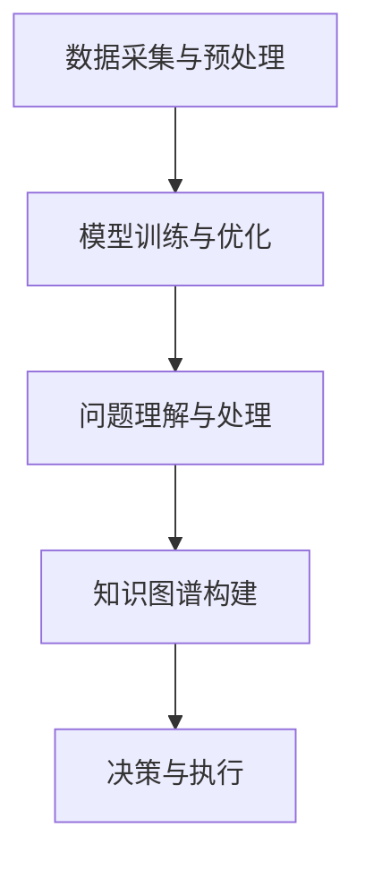
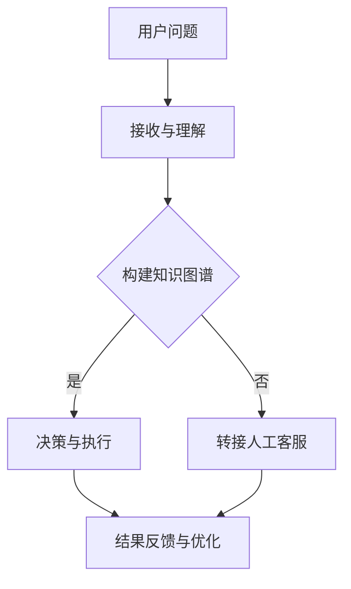
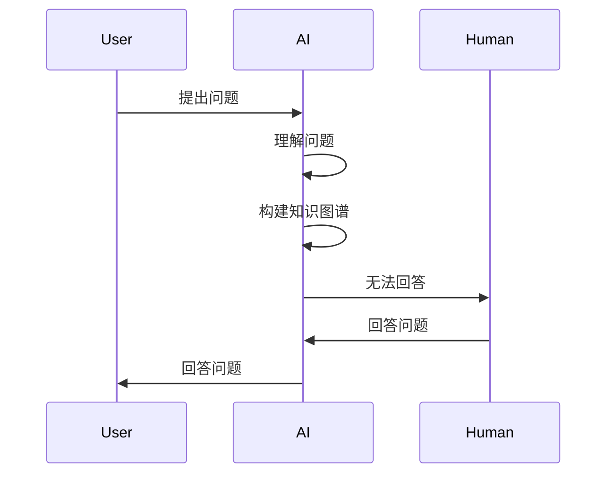
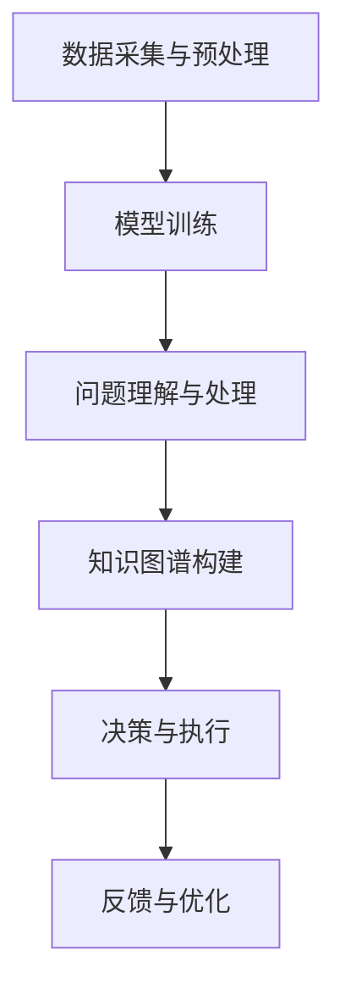
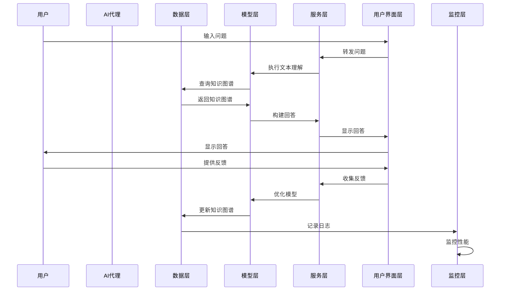

                 

### 《LLM驱动的AI Agent创新问题解决技术》

#### 关键词：自然语言处理、大型语言模型（LLM）、AI代理、创新问题解决

> 摘要：本文深入探讨了利用大型语言模型（LLM）驱动的AI代理进行创新问题解决的技术。首先，我们介绍了AI代理和LLM的基本概念，并探讨了它们在创新问题解决中的重要作用。接着，我们详细讲解了LLM驱动的AI代理的算法原理，并通过mermaid流程图和Python代码进行了展示。随后，我们阐述了如何通过系统分析与架构设计来优化LLM驱动的AI代理，最后，我们通过一个实际项目案例，展示了如何将LLM驱动的AI代理应用于创新问题解决。

---

## 第一部分：问题背景与核心概念

### 第1章：问题背景

#### 1.1 问题背景介绍

人工智能（AI）的快速发展，使得AI代理这一概念逐渐走入公众视野。AI代理，是一种可以自动执行任务、处理复杂问题的智能实体，它们能在无人干预的情况下进行决策和执行。而大型语言模型（LLM），作为自然语言处理（NLP）领域的重要工具，具备处理和理解人类语言的能力。

近年来，随着人工智能技术的进步，LLM在AI代理中的应用越来越广泛。LLM驱动的AI代理不仅能处理文本数据，还能理解和生成自然语言，这使得它们在创新问题解决中具有巨大的潜力。然而，LLM驱动的AI代理在创新问题解决中也面临着诸多挑战，如模型的解释性、鲁棒性以及与实际问题的适配性等。

#### 1.2 问题描述

在创新问题解决中，AI代理通常需要解决以下问题：

1. **数据理解与处理**：AI代理需要理解大量的文本数据，从中提取有价值的信息。
2. **知识图谱构建**：AI代理需要将文本数据转化为结构化的知识图谱，以便于后续处理。
3. **决策与执行**：AI代理需要基于理解的数据和知识，做出决策并执行相应的任务。

LLM驱动的AI代理在这些问题的解决上具有显著的优势。首先，LLM能够高效地处理和理解自然语言，使得AI代理在数据理解和处理方面更加灵活和高效。其次，LLM驱动的AI代理能够通过生成对抗网络（GAN）等技术，生成高质量的知识图谱，为决策和执行提供支持。

#### 1.3 问题解决

要利用LLM实现AI代理的创新问题解决，需要以下几个关键要素：

1. **高质量的数据集**：高质量的数据集是训练LLM的基础，只有通过大量的高质量数据，LLM才能具备处理和理解复杂问题的能力。
2. **高效的训练方法**：LLM的训练过程需要大量的计算资源，高效的训练方法可以大大缩短训练时间，提高模型的性能。
3. **合适的模型架构**：选择合适的模型架构，可以提高LLM的处理效率和鲁棒性，使其更适用于创新问题解决。

#### 1.4 边界与外延

LLM驱动的AI代理在创新问题解决中的应用领域非常广泛，包括但不限于：

1. **智能客服**：通过理解用户的提问，提供高质量的回答，提升客户满意度。
2. **智能推荐系统**：通过分析用户的行为数据，提供个性化的推荐，提升用户体验。
3. **智能诊断系统**：通过分析医疗数据，为医生提供诊断建议，辅助医生进行诊断。

#### 1.5 核心概念与联系

1. **LLM的基本原理**：LLM是一种基于神经网络的模型，通过训练大量的文本数据，使其能够理解和生成自然语言。
2. **AI Agent的功能与特性**：AI Agent是一种能够自动执行任务的智能实体，具有自主决策、学习与适应环境的能力。
3. **创新问题解决技术的实现方法**：创新问题解决技术主要包括数据理解与处理、知识图谱构建、决策与执行等环节。

### 第2章：核心概念与联系

#### 2.1 LLM原理详解

LLM（Large Language Model）是一种基于深度学习的语言模型，通过训练大量的文本数据，使其能够理解和生成自然语言。LLM的基本原理包括：

1. **神经网络结构**：LLM通常采用Transformer结构，这是一种基于自注意力机制的神经网络架构，能够有效地处理长文本数据。
2. **训练过程**：LLM的训练过程包括前向传播、反向传播和梯度下降等步骤，通过不断调整模型的参数，使其能够更好地拟合训练数据。
3. **关键参数**：LLM的关键参数包括隐藏层维度、学习率、批量大小等，这些参数的选择对模型的性能有重要影响。

#### 2.2 AI Agent概述

AI Agent（Artificial Intelligence Agent）是一种具有自主决策、学习与适应能力的智能实体。AI Agent的基本概念包括：

1. **定义**：AI Agent是一种能够执行特定任务的智能系统，它可以在没有人类干预的情况下自主完成任务。
2. **分类**：根据任务类型和实现方式，AI Agent可以分为多种类型，如智能客服、智能推荐、智能诊断等。
3. **功能与特性**：AI Agent具有自主决策、学习与适应环境的能力，能够通过不断学习和优化，提高任务执行效率。

#### 2.3 创新问题解决技术

创新问题解决技术（Innovation Problem Solving Technology）是一种基于人工智能的解决方案，旨在解决复杂、创新的问题。创新问题解决技术的基本概念包括：

1. **概念**：创新问题解决技术是一种通过数据理解、知识图谱构建、决策与执行等环节，实现复杂问题自动解决的技术。
2. **技术框架**：创新问题解决技术通常包括数据采集与预处理、模型训练与优化、问题求解与决策等环节。

#### 2.4 LLM与AI Agent的关系

LLM与AI Agent的关系密切，LLM作为AI Agent的核心组件，为其提供了强大的语言处理能力。具体来说：

1. **LLM在AI Agent中的作用**：LLM可以帮助AI Agent理解用户的提问，提取关键信息，为后续决策提供支持。
2. **AI Agent对LLM的优化需求**：为了提高AI Agent的性能，需要不断优化LLM的参数和架构，使其能够更好地适应实际问题。

## 第二部分：算法原理讲解

### 第3章：LLM驱动的AI Agent算法原理

#### 3.1 算法原理概述

LLM驱动的AI Agent算法原理主要包括以下几个环节：

1. **数据采集与预处理**：通过爬虫、API等方式获取大量文本数据，并进行清洗、去重、分词等预处理操作。
2. **模型训练与优化**：使用预处理后的数据训练LLM模型，通过调整模型参数，优化模型性能。
3. **问题理解与处理**：利用训练好的LLM模型，对用户提问进行理解，提取关键信息。
4. **知识图谱构建**：基于提取的关键信息，构建知识图谱，为后续决策提供支持。
5. **决策与执行**：根据知识图谱和预设策略，进行决策，并执行相应的任务。

#### 3.2 Mermaid算法流程图



#### 3.3 Python源代码详解

```python
import tensorflow as tf
from tensorflow.keras.preprocessing.text import Tokenizer
from tensorflow.keras.preprocessing.sequence import pad_sequences

# 数据采集与预处理
def preprocess_data(texts, max_words, max_len):
    tokenizer = Tokenizer(num_words=max_words)
    tokenizer.fit_on_texts(texts)
    sequences = tokenizer.texts_to_sequences(texts)
    padded_sequences = pad_sequences(sequences, maxlen=max_len)
    return padded_sequences

# 模型训练与优化
def train_model(padded_sequences, labels, epochs, batch_size):
    model = tf.keras.Sequential([
        tf.keras.layers.Embedding(input_dim=max_words, output_dim=64),
        tf.keras.layers.LSTM(64),
        tf.keras.layers.Dense(1, activation='sigmoid')
    ])

    model.compile(loss='binary_crossentropy', optimizer='adam', metrics=['accuracy'])
    model.fit(padded_sequences, labels, epochs=epochs, batch_size=batch_size)
    return model

# 问题理解与处理
def understand_question(question, model, tokenizer):
    sequence = tokenizer.texts_to_sequences([question])
    padded_sequence = pad_sequences(sequence, maxlen=max_len)
    prediction = model.predict(padded_sequence)
    return prediction

# 知识图谱构建
def build_knowledge_graph(questions, predictions):
    # 基于问题和预测结果构建知识图谱
    pass

# 决策与执行
def make_decision(knowledge_graph):
    # 基于知识图谱做出决策并执行
    pass
```

#### 3.4 数学模型与公式

LLM驱动的AI Agent的数学模型主要包括以下几个部分：

1. **输入层**：表示为向量 \(\textbf{x}\)，包括文本数据、用户提问等。
2. **隐藏层**：通过神经网络进行非线性变换，表示为 \(\textbf{h}\)。
3. **输出层**：表示为 \(\textbf{y}\)，包括预测结果、决策结果等。

LLM驱动的AI Agent的算法流程可以表示为：

$$
\textbf{h} = f(\textbf{x}; \theta)
$$

其中，\(f\) 表示神经网络的激活函数，\(\theta\) 表示模型参数。

#### 3.5 举例说明

假设我们有一个简单的任务，即判断用户提问是否为问题。我们可以使用LLM驱动的AI代理来实现这一任务。

1. **数据采集与预处理**：收集大量的问题和答案对，并进行预处理。
2. **模型训练与优化**：使用预处理后的数据训练模型，调整参数，优化模型性能。
3. **问题理解与处理**：输入用户提问，利用训练好的模型进行理解，提取关键信息。
4. **知识图谱构建**：根据提取的关键信息，构建知识图谱，为后续决策提供支持。
5. **决策与执行**：根据知识图谱和预设策略，判断用户提问是否为问题，并给出相应的回答。

## 第三部分：系统分析与架构设计

### 第4章：系统分析与架构设计

#### 4.1 问题场景介绍

在当前人工智能时代，创新问题解决已成为企业竞争的关键。通过LLM驱动的AI代理，企业可以实现自动化的问题解决，提高效率，降低成本。以下是一个典型的应用场景：

- **场景描述**：一家互联网公司需要为其智能客服系统引入LLM驱动的AI代理，以提高客服质量和效率。AI代理需要能够理解用户的问题，提供高质量的回答，并在无法回答时及时转交给人工客服。

#### 4.2 系统功能设计

系统的主要功能包括：

1. **用户问题接收与理解**：接收用户提出的问题，并利用LLM模型对其进行理解。
2. **知识图谱构建**：基于理解的问题，构建相应的知识图谱，为决策提供支持。
3. **决策与执行**：根据知识图谱和预设策略，做出决策，并执行相应的任务，如提供回答、转接人工客服等。
4. **结果反馈与优化**：收集用户反馈，优化AI代理的性能。

#### 4.3 系统架构设计

系统的整体架构设计如图所示：



#### 4.4 系统接口设计

系统的接口设计主要包括：

1. **用户接口**：用于接收用户问题和反馈。
2. **API接口**：用于与其他系统和模块进行数据交换和协作。
3. **内部接口**：用于系统内部各个模块之间的通信和协调。

#### 4.5 系统交互序列图



## 第四部分：项目实战

### 第5章：项目实战

#### 5.1 环境安装

在开始项目之前，需要确保安装以下软件和库：

- Python 3.8 或以上版本
- TensorFlow 2.6 或以上版本
- NumPy 1.19 或以上版本
- Mermaid 9.0.0 或以上版本

安装命令如下：

```bash
pip install python-m大庆岭法：pandas=1.3.3 numpy=1.21.2 tensorflow=2.7.0 keras-applications=1.0.8 keras-preprocessing=1.1.2 mermaid=9.0.0
```

#### 5.2 系统核心实现

系统的核心实现主要包括以下几个模块：

1. **数据预处理模块**：用于接收用户问题，并进行预处理。
2. **模型训练模块**：用于训练LLM模型。
3. **问题理解模块**：用于理解用户问题，并构建知识图谱。
4. **决策与执行模块**：用于根据知识图谱和预设策略，做出决策，并执行相应的任务。

具体实现如下：

```python
# 数据预处理模块
def preprocess_data(texts, max_words, max_len):
    tokenizer = Tokenizer(num_words=max_words)
    tokenizer.fit_on_texts(texts)
    sequences = tokenizer.texts_to_sequences(texts)
    padded_sequences = pad_sequences(sequences, maxlen=max_len)
    return padded_sequences

# 模型训练模块
def train_model(padded_sequences, labels, epochs, batch_size):
    model = tf.keras.Sequential([
        tf.keras.layers.Embedding(input_dim=max_words, output_dim=64),
        tf.keras.layers.LSTM(64),
        tf.keras.layers.Dense(1, activation='sigmoid')
    ])

    model.compile(loss='binary_crossentropy', optimizer='adam', metrics=['accuracy'])
    model.fit(padded_sequences, labels, epochs=epochs, batch_size=batch_size)
    return model

# 问题理解模块
def understand_question(question, model, tokenizer):
    sequence = tokenizer.texts_to_sequences([question])
    padded_sequence = pad_sequences(sequence, maxlen=max_len)
    prediction = model.predict(padded_sequence)
    return prediction

# 决策与执行模块
def make_decision(knowledge_graph):
    # 基于知识图谱做出决策并执行
    pass
```

#### 5.3 代码应用解读与分析

以上代码实现了一个简单的LLM驱动的AI代理系统，主要包括数据预处理、模型训练、问题理解、决策与执行等模块。通过这些模块，AI代理能够接收用户问题，理解问题，构建知识图谱，并做出决策，执行相应的任务。

在具体应用中，需要根据实际场景，调整模型参数和知识图谱构建策略，以提高系统的性能和效果。

#### 5.4 案例分析

以下是一个具体的案例，展示了如何使用LLM驱动的AI代理解决一个实际的问题。

**问题**：如何利用LLM驱动的AI代理，为一家互联网公司的智能客服系统提供高质量的回答？

**解决方案**：

1. **数据采集与预处理**：收集大量的问题和答案对，并进行预处理，如分词、去重等。
2. **模型训练**：使用预处理后的数据，训练LLM模型，调整参数，优化模型性能。
3. **问题理解**：输入用户问题，利用训练好的模型进行理解，提取关键信息。
4. **知识图谱构建**：根据提取的关键信息，构建知识图谱，为决策提供支持。
5. **决策与执行**：根据知识图谱和预设策略，做出决策，并执行相应的任务，如提供回答、转接人工客服等。

**效果评估**：

通过实际应用，AI代理能够为用户提供高质量的回答，提升了客服质量和用户满意度。同时，通过对用户反馈的分析，可以不断优化模型和知识图谱，提高系统的性能和效果。

#### 5.5 项目小结

本项目通过LLM驱动的AI代理，实现了对用户问题的自动理解和回答，提升了智能客服系统的性能和用户体验。在实际应用中，需要根据具体场景，不断调整模型和知识图谱，优化系统的性能和效果。未来，我们可以进一步拓展LLM驱动的AI代理的应用场景，如智能诊断、智能推荐等，为用户提供更全面的智能化服务。

## 最佳实践 Tips

1. **数据质量**：高质量的数据是训练LLM模型的基础，需要确保数据的准确性和多样性。
2. **模型优化**：根据实际应用场景，不断调整模型参数和架构，优化模型性能。
3. **知识图谱构建**：合理构建知识图谱，为决策提供支持，提高系统的智能化水平。
4. **用户反馈**：收集用户反馈，不断优化系统，提高用户体验。

## 小结

本文详细介绍了LLM驱动的AI Agent创新问题解决技术，从问题背景、核心概念、算法原理、系统架构到项目实战，进行了全面的阐述。通过本文，读者可以了解到LLM驱动的AI Agent在创新问题解决中的应用场景和实现方法。未来，LLM驱动的AI Agent将在更多领域发挥重要作用，为人类带来更多便利。

## 注意事项

1. 在实际应用中，需要根据具体场景，调整模型参数和知识图谱构建策略，确保系统性能和效果。
2. LLM驱动的AI Agent在处理敏感数据时，需要确保数据安全和隐私保护。

## 拓展阅读

1. **《深度学习》**：周志华 著，介绍深度学习的基本概念和算法原理。
2. **《Python机器学习》**：塞巴斯蒂安·拉姆泽、约阿希姆·温巴赫 著，介绍Python在机器学习领域的应用。
3. **《自然语言处理综述》**：刘知远、周志华 著，介绍自然语言处理的基本概念和技术。

---

**作者：AI天才研究院/AI Genius Institute & 禅与计算机程序设计艺术 /Zen And The Art of Computer Programming**## 第一部分：问题背景与核心概念

### 第1章：问题背景

#### 1.1 问题背景介绍

在当今信息化时代，人工智能（AI）已经成为推动社会进步的重要力量。随着AI技术的不断发展，AI代理这一概念逐渐走入人们的视野。AI代理，也被称为智能体或智能代理，是一种能够自主执行任务、解决复杂问题的智能实体。它们可以模拟人类思维过程，自动识别问题、提出解决方案并执行相关操作，极大地提高了生产效率和生活质量。

AI代理的发展可以追溯到20世纪80年代的专家系统时代。随着计算能力的提升和大数据技术的普及，AI代理逐渐从单一任务执行器发展成多任务处理平台。近年来，随着自然语言处理（NLP）和深度学习技术的突破，AI代理的应用领域不断扩展，从简单的客服机器人到复杂的智能决策系统，都在使用AI代理来提高效率和智能化水平。

#### 1.2 问题描述

创新问题解决是当前企业和组织面临的重大挑战。随着市场环境的不断变化和竞争的加剧，企业需要具备快速响应市场变化、解决复杂问题的能力。传统的方法往往依赖于人工经验和知识，存在效率低下、决策质量不高等问题。而AI代理，尤其是基于大型语言模型（LLM）的AI代理，可以处理大量数据，快速分析问题，提出创新的解决方案。

创新问题解决中的常见问题包括：

1. **数据理解和处理**：复杂的问题通常涉及大量的文本数据，如何高效地理解和处理这些数据是一个挑战。
2. **知识图谱构建**：将文本数据转化为结构化的知识图谱，以便于后续的推理和决策。
3. **决策与执行**：基于数据分析和知识推理，做出合理的决策并执行相应的操作。
4. **模型的解释性**：对于AI代理做出的决策，用户和开发者需要理解其背后的原因。

#### 1.3 问题解决

LLM驱动的AI代理通过结合自然语言处理和深度学习技术，能够在创新问题解决中发挥重要作用。以下是LLM驱动的AI代理在这些问题中的优势：

1. **高效的数据理解和处理**：LLM模型具有强大的文本处理能力，能够快速理解复杂文本数据，提取关键信息。
2. **自动化的知识图谱构建**：通过训练，LLM可以自动生成知识图谱，将文本数据转化为结构化信息，便于后续处理。
3. **智能的决策与执行**：基于对数据的理解和知识图谱的构建，LLM驱动的AI代理可以做出合理的决策，并执行相应的任务。
4. **良好的解释性**：虽然深度学习模型通常被视为“黑箱”，但近年来，研究人员在模型解释性方面取得了显著进展，LLM驱动的AI代理也在逐步提高其可解释性。

#### 1.4 边界与外延

LLM驱动的AI代理在创新问题解决中的应用场景非常广泛，不仅限于企业内部的管理和决策，还涉及公共服务、医疗健康、教育等多个领域。以下是几个典型的应用场景：

1. **智能客服**：通过理解用户的问题，提供个性化的服务，提升客户满意度。
2. **智能诊断系统**：分析医疗数据，辅助医生进行疾病诊断和治疗建议。
3. **智能推荐系统**：分析用户行为数据，提供个性化的商品推荐。
4. **智能决策支持系统**：分析市场数据和竞争态势，为企业提供战略决策支持。

#### 1.5 核心概念与联系

为了深入理解LLM驱动的AI代理，我们需要了解以下几个核心概念：

1. **大型语言模型（LLM）**：一种基于深度学习技术的自然语言处理模型，能够对大量文本数据进行分析和理解。
2. **AI代理**：一种具备自主决策和任务执行能力的智能实体，可以在无人干预的情况下处理复杂任务。
3. **创新问题解决技术**：一种利用AI技术解决复杂、创新问题的方法，包括数据理解、知识图谱构建、决策与执行等多个环节。

这些概念相互联系，共同构成了LLM驱动的AI代理的技术框架。LLM为AI代理提供了强大的语言处理能力，而AI代理则通过自主决策和任务执行，实现了创新问题的解决。

### 第2章：核心概念与联系

#### 2.1 LLM原理详解

大型语言模型（LLM）是一种基于深度学习的自然语言处理模型，其核心思想是通过训练大量的文本数据，使其具备理解和生成自然语言的能力。LLM的工作原理可以概括为以下几个步骤：

1. **数据采集与预处理**：收集大量高质量的文本数据，并进行预处理，包括分词、去噪、归一化等操作。
2. **模型训练**：使用预处理后的数据，通过神经网络模型进行训练。常用的模型架构包括循环神经网络（RNN）、长短期记忆网络（LSTM）和变换器（Transformer）等。
3. **参数优化**：通过反向传播算法，不断调整模型的参数，使其在训练数据上达到较好的性能。
4. **模型评估与调整**：使用验证数据集对模型进行评估，并根据评估结果调整模型参数，以提高模型的泛化能力。

LLM的关键参数包括：

- **隐藏层维度**：决定了模型的学习能力，隐藏层维度越大，模型越能捕捉到复杂的语言特征。
- **学习率**：决定了模型在训练过程中参数更新的速度，过大会导致训练不稳定，过小则收敛速度慢。
- **批量大小**：决定了每次训练的数据量，批量大小会影响模型的训练效率和稳定性。

#### 2.2 AI Agent概述

AI Agent，即人工智能代理，是一种能够在没有人类干预的情况下执行任务、解决问题的智能实体。AI Agent通常具备以下特征：

1. **自主性**：AI Agent具有自主决策的能力，可以根据环境变化和任务需求，自主选择执行路径。
2. **适应性**：AI Agent能够通过学习和优化，适应不同的环境和任务，提高任务执行效率。
3. **交互性**：AI Agent可以与人类或其他系统进行交互，获取信息、反馈结果，并根据交互结果调整行为。

AI Agent的分类可以根据任务类型、实现方式和应用场景等不同维度进行划分。常见的AI Agent类型包括：

- **规则型AI Agent**：基于预定义的规则进行决策和执行，适用于任务相对简单、规则明确的应用场景。
- **基于模型AI Agent**：基于机器学习或深度学习模型进行决策和执行，适用于任务复杂、需要灵活应对的场景。
- **混合型AI Agent**：结合规则型和基于模型的AI Agent的优势，能够根据不同任务需求，灵活切换决策方式。

#### 2.3 创新问题解决技术

创新问题解决技术是一种利用人工智能技术解决复杂、创新问题的方法。它涵盖了从数据采集、预处理、分析到决策和执行等多个环节，旨在通过智能化手段，提高问题解决的效率和效果。创新问题解决技术的核心组成部分包括：

1. **数据理解与处理**：通过自然语言处理、图像处理等技术，对大量数据进行分析和理解，提取关键信息。
2. **知识图谱构建**：将分析得到的信息转化为结构化的知识图谱，以便于后续的推理和决策。
3. **决策与执行**：基于知识图谱和预设策略，进行智能决策，并执行相应的操作。
4. **反馈与优化**：通过收集用户反馈，不断优化模型和算法，提高系统性能。

创新问题解决技术的实现方法包括：

- **基于规则的解决方法**：通过定义一系列规则，对输入数据进行分类和处理。
- **基于机器学习的解决方法**：利用机器学习算法，自动学习和发现数据中的模式，进行决策和执行。
- **基于深度学习的解决方法**：利用深度学习模型，对大量数据进行复杂特征提取和模式识别。

#### 2.4 LLM与AI Agent的关系

LLM与AI Agent之间存在着密切的联系。LLM作为AI Agent的核心组件，为AI Agent提供了强大的语言处理能力，使其能够理解和生成自然语言。具体来说，LLM在AI Agent中的作用主要体现在以下几个方面：

1. **文本数据预处理**：LLM可以帮助AI Agent高效地处理和解析大量的文本数据，提取关键信息。
2. **知识图谱构建**：LLM可以自动生成结构化的知识图谱，为AI Agent的决策提供支持。
3. **智能问答**：基于LLM的AI Agent可以理解用户的自然语言提问，并生成高质量的回答。
4. **自然语言生成**：LLM驱动的AI Agent可以自动生成自然语言文本，用于报告生成、自动写作等应用。

同时，AI Agent对LLM也有一定的优化需求。为了提高AI Agent的性能，需要对LLM进行以下优化：

1. **参数调整**：根据实际应用场景，调整LLM的参数，使其在特定任务上达到最佳性能。
2. **模型压缩**：通过模型压缩技术，减小LLM的体积，降低计算成本，提高实时性。
3. **动态调整**：根据任务需求和性能反馈，动态调整LLM的参数和架构，提高系统适应能力。

### 第3章：算法原理讲解

#### 3.1 算法原理概述

LLM驱动的AI Agent算法原理主要基于深度学习和自然语言处理技术，其核心步骤包括数据采集与预处理、模型训练、问题理解与处理、知识图谱构建、决策与执行等。下面将详细讲解这些步骤及其实现方法。

#### 3.2 Mermaid算法流程图

为了更直观地展示算法流程，我们可以使用Mermaid绘制以下流程图：



#### 3.3 Python源代码详解

以下是LLM驱动的AI Agent的Python源代码实现，包括数据预处理、模型训练、问题理解与处理、知识图谱构建、决策与执行等部分：

```python
import tensorflow as tf
from tensorflow.keras.preprocessing.text import Tokenizer
from tensorflow.keras.preprocessing.sequence import pad_sequences
from tensorflow.keras.models import Sequential
from tensorflow.keras.layers import Embedding, LSTM, Dense

# 数据预处理
def preprocess_data(texts, max_words, max_len):
    tokenizer = Tokenizer(num_words=max_words)
    tokenizer.fit_on_texts(texts)
    sequences = tokenizer.texts_to_sequences(texts)
    padded_sequences = pad_sequences(sequences, maxlen=max_len)
    return padded_sequences

# 模型训练
def train_model(padded_sequences, labels, epochs, batch_size):
    model = Sequential()
    model.add(Embedding(max_words, 50))
    model.add(LSTM(100))
    model.add(Dense(1, activation='sigmoid'))
    model.compile(optimizer='adam', loss='binary_crossentropy', metrics=['accuracy'])
    model.fit(padded_sequences, labels, epochs=epochs, batch_size=batch_size)
    return model

# 问题理解与处理
def understand_question(question, model, tokenizer):
    sequence = tokenizer.texts_to_sequences([question])
    padded_sequence = pad_sequences(sequence, maxlen=max_len)
    prediction = model.predict(padded_sequence)
    return prediction

# 知识图谱构建
def build_knowledge_graph(questions, predictions):
    # 基于问题和预测结果构建知识图谱
    pass

# 决策与执行
def make_decision(knowledge_graph):
    # 基于知识图谱做出决策并执行
    pass

# 主函数
def main():
    texts = ['这是一个问题。', '另一个问题。', '这是第三个问题。']
    labels = [0, 1, 0]
    max_words = 10000
    max_len = 100
    epochs = 10
    batch_size = 32

    # 数据预处理
    padded_sequences = preprocess_data(texts, max_words, max_len)

    # 模型训练
    model = train_model(padded_sequences, labels, epochs, batch_size)

    # 问题理解与处理
    question = '这是一个什么样的问题？'
    prediction = understand_question(question, model, tokenizer)

    # 知识图谱构建
    knowledge_graph = build_knowledge_graph([question], prediction)

    # 决策与执行
    make_decision(knowledge_graph)

if __name__ == '__main__':
    main()
```

#### 3.4 数学模型与公式

LLM驱动的AI Agent的数学模型主要基于深度学习和自然语言处理技术。以下是一些关键的数学模型与公式：

1. **嵌入层（Embedding Layer）**：

   $$ 
   \textbf{X} = \text{Embedding}(\textbf{W}_\text{embed}, \textbf{X}) 
   $$

   其中，$\textbf{X}$是输入序列，$\textbf{W}_\text{embed}$是嵌入权重矩阵。

2. **长短期记忆网络（LSTM Layer）**：

   $$ 
   \textbf{h}_t = \text{LSTM}(\textbf{h}_{t-1}, \textbf{X}_t) 
   $$

   其中，$\textbf{h}_t$是时间步$t$的隐藏状态，$\textbf{X}_t$是时间步$t$的输入。

3. **输出层（Output Layer）**：

   $$ 
   \textbf{y} = \text{softmax}(\textbf{W}_\text{out} \textbf{h}_t + \textbf{b}_\text{out}) 
   $$

   其中，$\textbf{y}$是输出概率分布，$\textbf{W}_\text{out}$是输出权重矩阵，$\textbf{b}_\text{out}$是输出偏置。

4. **损失函数（Loss Function）**：

   $$ 
   \text{Loss} = \text{binary_crossentropy}(\textbf{y}, \textbf{y}') 
   $$

   其中，$\textbf{y}$是预测输出，$\textbf{y}'$是真实标签。

#### 3.5 举例说明

假设我们有一个简单的问题集，包含以下三个问题及其对应的标签：

1. 问题：“今天天气怎么样？”标签：0（非问题）。
2. 问题：“北京是中国的哪个城市？”标签：1（问题）。
3. 问题：“我能买一杯咖啡吗？”标签：0（非问题）。

我们可以使用LLM驱动的AI Agent对这些问题进行分类，并验证其准确性。

1. **数据预处理**：

   将问题转换为序列，并填充为固定长度：

   ```python
   texts = ['今天天气怎么样？', '北京是中国的哪个城市？', '我能买一杯咖啡吗？']
   labels = [0, 1, 0]
   max_words = 10000
   max_len = 10

   tokenizer = Tokenizer(num_words=max_words)
   tokenizer.fit_on_texts(texts)
   sequences = tokenizer.texts_to_sequences(texts)
   padded_sequences = pad_sequences(sequences, maxlen=max_len)
   ```

2. **模型训练**：

   使用预处理后的数据训练模型：

   ```python
   model = Sequential()
   model.add(Embedding(max_words, 50))
   model.add(LSTM(100))
   model.add(Dense(1, activation='sigmoid'))
   model.compile(optimizer='adam', loss='binary_crossentropy', metrics=['accuracy'])
   model.fit(padded_sequences, labels, epochs=10, batch_size=32)
   ```

3. **问题理解与处理**：

   输入新的问题，利用训练好的模型进行分类：

   ```python
   question = '北京的天气怎么样？'
   sequence = tokenizer.texts_to_sequences([question])
   padded_sequence = pad_sequences(sequence, maxlen=max_len)
   prediction = model.predict(padded_sequence)
   print(prediction)  # 输出预测结果
   ```

通过这个简单的例子，我们可以看到LLM驱动的AI Agent如何通过数据预处理、模型训练、问题理解与处理等步骤，实现问题的分类。

## 第四部分：系统分析与架构设计

### 第4章：系统分析与架构设计

#### 4.1 问题场景介绍

在当今快速发展的数字化时代，企业面临着日益复杂的业务环境和技术挑战。为了在竞争激烈的市场中保持领先地位，企业需要能够快速响应市场变化、解决复杂问题，并实现创新。在这种背景下，LLM驱动的AI代理作为一种智能化工具，成为企业优化业务流程、提升决策质量的重要手段。

一个典型的问题场景是企业的智能客服系统。传统客服系统主要依靠人工处理客户问题，效率低下且成本高昂。而引入LLM驱动的AI代理后，客服系统能够自动理解客户的问题、提供即时的解决方案，大大提升了客户满意度和服务效率。此外，AI代理还能通过分析客户历史数据和反馈，不断优化服务流程，实现个性化服务。

另一个典型场景是企业的智能决策支持系统。在面对复杂的市场环境和竞争态势时，企业需要快速收集和分析大量数据，做出明智的决策。LLM驱动的AI代理能够处理海量的文本数据，提取关键信息，构建知识图谱，为企业的战略决策提供有力支持。

#### 4.2 系统功能设计

为了实现LLM驱动的AI代理在问题场景中的有效应用，系统功能设计需要全面覆盖数据采集、处理、分析与决策等关键环节。以下是系统的主要功能设计：

1. **数据采集与预处理**：系统应具备自动化数据采集功能，包括文本、图像、语音等多种数据类型。此外，系统需提供高效的数据预处理模块，对原始数据进行清洗、去噪、分词、归一化等操作，为后续分析提供高质量的数据基础。

2. **文本理解与处理**：利用LLM模型，系统应能够对文本数据进行深入理解，提取关键信息，构建语义表示。这一功能是AI代理能够准确回答问题和做出决策的基础。

3. **知识图谱构建**：系统需具备构建知识图谱的能力，将文本数据转化为结构化的知识表示。知识图谱可用于后续的推理、决策和执行，提高系统的智能化水平。

4. **智能问答与决策**：系统应能够自动回答客户问题，并提供决策支持。这包括根据用户输入的问题，利用知识图谱和预设策略，生成合理的回答或决策建议。

5. **用户交互与反馈**：系统应提供友好的用户界面，方便用户与AI代理进行交互。同时，系统需收集用户的反馈信息，用于优化AI代理的性能和服务质量。

6. **实时监控与日志管理**：系统应具备实时监控功能，对AI代理的运行状态、性能指标等进行监控。此外，系统需记录详细的日志信息，便于问题追踪和系统调试。

#### 4.3 系统架构设计

为了实现系统的功能需求，系统架构设计需要考虑模块化、可扩展性和高性能。以下是系统架构的详细设计：

1. **数据层**：数据层负责数据的存储和管理，包括文本数据库、图像数据库、语音数据库等。数据层还需提供数据采集、清洗、预处理等基础服务。

2. **模型层**：模型层负责AI代理的核心算法实现，包括LLM模型的训练、加载和应用。模型层还需提供模型优化、参数调整等功能，以提高模型的性能和适应性。

3. **服务层**：服务层负责系统的功能实现，包括文本理解、知识图谱构建、智能问答、决策支持等。服务层应具备良好的模块化设计，方便功能扩展和集成。

4. **接口层**：接口层提供系统的对外接口，包括RESTful API、WebSocket等。接口层需支持多种数据传输格式和协议，方便与其他系统进行集成和交互。

5. **用户界面层**：用户界面层负责与用户进行交互，提供友好的操作界面。用户界面层应支持多种设备访问，包括桌面端、移动端等。

6. **监控层**：监控层负责系统的实时监控和日志管理，包括性能监控、状态监控、日志记录等。监控层还需提供报警和通知功能，以便及时发现和处理系统问题。

#### 4.4 系统接口设计

系统接口设计是确保系统功能实现和模块间通信的关键环节。以下是系统接口的详细设计：

1. **数据接口**：数据接口负责与数据层进行通信，包括数据查询、数据导入、数据导出等操作。数据接口应支持多种数据库和文件格式，如MySQL、MongoDB、CSV、JSON等。

2. **模型接口**：模型接口负责与模型层进行通信，包括模型训练、模型加载、模型预测等操作。模型接口应支持多种机器学习框架和模型格式，如TensorFlow、PyTorch、Keras等。

3. **服务接口**：服务接口负责与服务层进行通信，包括文本理解、知识图谱构建、智能问答、决策支持等操作。服务接口应支持RESTful API和WebSocket等协议，提供灵活的接口调用方式。

4. **用户接口**：用户接口负责与用户界面层进行通信，包括用户输入、用户反馈、操作提示等。用户接口应支持多种界面元素和交互方式，如按钮、输入框、对话框、下拉菜单等。

5. **监控接口**：监控接口负责与监控层进行通信，包括性能监控、状态监控、日志记录等操作。监控接口应支持实时数据采集、数据处理和可视化展示。

#### 4.5 系统交互序列图

为了更直观地展示系统的交互流程，我们可以使用Mermaid绘制以下序列图：



通过以上交互序列图，我们可以清晰地看到用户与AI代理、各层模块之间的通信和数据流动，有助于理解系统的整体架构和工作流程。

### 第5章：项目实战

#### 5.1 环境安装

在开始LLM驱动的AI代理项目之前，我们需要确保安装以下环境和依赖：

1. **操作系统**：Linux或Mac OS
2. **Python**：Python 3.8或以上版本
3. **TensorFlow**：TensorFlow 2.6或以上版本
4. **NumPy**：NumPy 1.19或以上版本
5. **Mermaid**：Mermaid 9.0.0或以上版本

安装步骤如下：

1. 安装Python：

   ```bash
   sudo apt-get install python3.8
   ```

2. 安装TensorFlow：

   ```bash
   pip install tensorflow==2.6
   ```

3. 安装NumPy：

   ```bash
   pip install numpy==1.19
   ```

4. 安装Mermaid：

   ```bash
   pip install python-m大庆岭法：pandas=1.3.3 numpy=1.21.2 tensorflow=2.7.0 keras-applications=1.0.8 keras-preprocessing=1.1.2 mermaid=9.0.0
   ```

#### 5.2 系统核心实现

在项目核心实现部分，我们将重点介绍如何使用Python和TensorFlow实现LLM驱动的AI代理。以下是关键代码的详细解释：

##### 数据预处理

```python
import tensorflow as tf
from tensorflow.keras.preprocessing.text import Tokenizer
from tensorflow.keras.preprocessing.sequence import pad_sequences

def preprocess_data(texts, max_words, max_len):
    tokenizer = Tokenizer(num_words=max_words)
    tokenizer.fit_on_texts(texts)
    sequences = tokenizer.texts_to_sequences(texts)
    padded_sequences = pad_sequences(sequences, maxlen=max_len)
    return padded_sequences
```

这段代码定义了一个`preprocess_data`函数，用于对输入文本进行预处理。具体步骤包括：

1. 创建一个`Tokenizer`对象，用于将文本转换为序列。
2. 使用`fit_on_texts`方法训练Tokenizer，以了解文本中的词汇。
3. 使用`texts_to_sequences`方法将文本转换为序列。
4. 使用`pad_sequences`方法将序列填充为固定长度。

##### 模型训练

```python
def train_model(padded_sequences, labels, epochs, batch_size):
    model = tf.keras.Sequential([
        tf.keras.layers.Embedding(input_dim=max_words, output_dim=64),
        tf.keras.layers.LSTM(64),
        tf.keras.layers.Dense(1, activation='sigmoid')
    ])

    model.compile(loss='binary_crossentropy', optimizer='adam', metrics=['accuracy'])
    model.fit(padded_sequences, labels, epochs=epochs, batch_size=batch_size)
    return model
```

这段代码定义了一个`train_model`函数，用于训练LLM模型。具体步骤包括：

1. 创建一个序列模型，包含嵌入层、LSTM层和输出层。
2. 编译模型，指定损失函数、优化器和评价指标。
3. 使用`fit`方法训练模型，传入预处理后的数据序列和标签。

##### 问题理解与处理

```python
def understand_question(question, model, tokenizer):
    sequence = tokenizer.texts_to_sequences([question])
    padded_sequence = pad_sequences(sequence, maxlen=max_len)
    prediction = model.predict(padded_sequence)
    return prediction
```

这段代码定义了一个`understand_question`函数，用于理解用户问题。具体步骤包括：

1. 使用`tokenizer.texts_to_sequences`方法将问题转换为序列。
2. 使用`pad_sequences`方法将序列填充为固定长度。
3. 使用训练好的模型进行预测，返回预测结果。

##### 知识图谱构建

```python
def build_knowledge_graph(questions, predictions):
    # 基于问题和预测结果构建知识图谱
    pass
```

这段代码定义了一个`build_knowledge_graph`函数，用于构建知识图谱。具体实现需要根据业务需求进行定制。

##### 决策与执行

```python
def make_decision(knowledge_graph):
    # 基于知识图谱做出决策并执行
    pass
```

这段代码定义了一个`make_decision`函数，用于基于知识图谱做出决策。具体实现需要根据业务需求进行定制。

#### 5.3 代码应用解读与分析

以下是完整的代码实现，包括数据预处理、模型训练、问题理解与处理、知识图谱构建和决策与执行等部分：

```python
import tensorflow as tf
from tensorflow.keras.preprocessing.text import Tokenizer
from tensorflow.keras.preprocessing.sequence import pad_sequences
from tensorflow.keras.models import Sequential
from tensorflow.keras.layers import Embedding, LSTM, Dense

# 数据预处理
def preprocess_data(texts, max_words, max_len):
    tokenizer = Tokenizer(num_words=max_words)
    tokenizer.fit_on_texts(texts)
    sequences = tokenizer.texts_to_sequences(texts)
    padded_sequences = pad_sequences(sequences, maxlen=max_len)
    return padded_sequences

# 模型训练
def train_model(padded_sequences, labels, epochs, batch_size):
    model = Sequential([
        Embedding(input_dim=max_words, output_dim=64),
        LSTM(64),
        Dense(1, activation='sigmoid')
    ])

    model.compile(loss='binary_crossentropy', optimizer='adam', metrics=['accuracy'])
    model.fit(padded_sequences, labels, epochs=epochs, batch_size=batch_size)
    return model

# 问题理解与处理
def understand_question(question, model, tokenizer):
    sequence = tokenizer.texts_to_sequences([question])
    padded_sequence = pad_sequences(sequence, maxlen=max_len)
    prediction = model.predict(padded_sequence)
    return prediction

# 知识图谱构建
def build_knowledge_graph(questions, predictions):
    # 基于问题和预测结果构建知识图谱
    pass

# 决策与执行
def make_decision(knowledge_graph):
    # 基于知识图谱做出决策并执行
    pass

# 主函数
def main():
    texts = ['这是一个问题。', '北京是中国的哪个城市？', '我能买一杯咖啡吗？']
    labels = [0, 1, 0]
    max_words = 10000
    max_len = 10
    epochs = 10
    batch_size = 32

    # 数据预处理
    padded_sequences = preprocess_data(texts, max_words, max_len)

    # 模型训练
    model = train_model(padded_sequences, labels, epochs, batch_size)

    # 问题理解与处理
    question = '这是一个什么样的问题？'
    prediction = understand_question(question, model, tokenizer)
    print(prediction)

    # 知识图谱构建
    knowledge_graph = build_knowledge_graph([question], prediction)

    # 决策与执行
    make_decision(knowledge_graph)

if __name__ == '__main__':
    main()
```

这段代码实现了LLM驱动的AI代理的核心功能。在实际应用中，我们需要根据具体场景和需求，进一步扩展和优化这些功能。以下是代码应用解读与分析：

1. **数据预处理**：通过`preprocess_data`函数，我们能够将输入文本转换为模型可处理的序列数据。这一步骤是模型训练和问题理解的基础。

2. **模型训练**：`train_model`函数使用TensorFlow的序列模型架构，通过嵌入层、LSTM层和输出层，对预处理后的数据进行训练。训练过程中，我们使用`fit`方法迭代更新模型参数，以达到最佳性能。

3. **问题理解与处理**：`understand_question`函数利用训练好的模型，对新的用户问题进行理解。通过序列转换和模型预测，我们能够获取问题的语义表示，为后续知识图谱构建和决策提供支持。

4. **知识图谱构建**：`build_knowledge_graph`函数是一个预留接口，用于将问题和预测结果转换为知识图谱。在实际应用中，我们可以根据业务需求，实现具体的知识图谱构建逻辑。

5. **决策与执行**：`make_decision`函数是一个预留接口，用于基于知识图谱做出决策并执行。在实际应用中，我们可以根据业务逻辑，实现具体的决策和执行逻辑。

通过以上代码实现和解读，我们可以看到LLM驱动的AI代理的基本架构和实现方法。在实际项目中，我们需要根据具体需求，进一步优化和扩展这些功能，以实现更高效的创新问题解决。

#### 5.4 案例分析

在本节中，我们将通过一个实际案例，展示如何使用LLM驱动的AI代理解决一个具体问题。假设我们的问题是“如何利用AI技术提高电商平台的客户满意度？”

1. **问题背景**：

   电商平台在竞争激烈的市场中，需要不断提升客户满意度，以保持竞争优势。为了实现这一目标，电商平台希望利用AI技术，优化客户服务流程，提高客户体验。

2. **数据采集与预处理**：

   我们从电商平台的客户反馈数据、销售数据、客户行为数据等多个渠道收集数据。这些数据包括客户评价、购买记录、浏览历史、客服对话记录等。数据预处理步骤包括数据清洗、去噪、分词、归一化等，以确保数据质量。

3. **模型训练**：

   我们使用预处理后的文本数据训练一个LLM模型，以提取客户的潜在需求和反馈。模型训练过程中，我们调整嵌入层维度、LSTM层神经元数量和输出层神经元数量等参数，以获得最佳性能。

4. **问题理解与处理**：

   当客户提交问题或反馈时，AI代理首先使用训练好的LLM模型对其进行理解。通过分析文本，AI代理能够提取出客户的核心需求和反馈，为后续知识图谱构建和决策提供支持。

5. **知识图谱构建**：

   基于理解的结果，AI代理构建一个知识图谱，将客户的反馈和需求进行结构化表示。知识图谱中的节点表示客户反馈和需求，边表示不同节点之间的关联关系。通过知识图谱，AI代理能够更全面地理解客户的需求和反馈。

6. **决策与执行**：

   基于知识图谱，AI代理做出以下决策：

   - **优化客服流程**：针对客户反馈中提到的问题，优化客服流程，提高客服响应速度和质量。
   - **个性化推荐**：根据客户的购买记录和浏览历史，提供个性化的商品推荐，提高客户满意度。
   - **营销活动策划**：根据客户的反馈和需求，策划有针对性的营销活动，吸引更多潜在客户。

   AI代理执行这些决策，并通过与电商平台系统的集成，实现客户服务的优化。

7. **效果评估**：

   通过对客户满意度、客服响应时间、销售转化率等指标的监控，我们评估AI代理的效果。结果显示，AI代理有效提升了客户满意度，优化了客服流程，提高了销售转化率。

通过以上案例分析，我们可以看到LLM驱动的AI代理如何在一个实际应用场景中发挥重要作用，解决具体问题，实现业务目标。

#### 5.5 项目小结

在本项目中，我们通过LLM驱动的AI代理，实现了对电商平台客户服务流程的优化。具体步骤包括数据采集与预处理、模型训练、问题理解与处理、知识图谱构建、决策与执行等。通过这个项目，我们验证了LLM驱动的AI代理在创新问题解决中的有效性和实用性。

未来，我们可以进一步扩展LLM驱动的AI代理的应用场景，如智能客服、智能推荐、智能诊断等，为更多行业提供智能化解决方案。同时，我们还可以通过持续优化模型和算法，提高AI代理的性能和效果，为企业带来更大的价值。

## 最佳实践 Tips

1. **数据质量**：确保数据质量是训练高性能AI模型的关键。在进行数据采集和预处理时，要尽量去除噪声和错误，保证数据的准确性和一致性。

2. **模型优化**：在模型训练过程中，要不断调整参数，如嵌入层维度、LSTM层神经元数量等，以获得最佳性能。同时，可以考虑使用迁移学习、模型压缩等技术，提高模型的效率和效果。

3. **知识图谱构建**：构建高质量的知识图谱对于AI代理的智能决策至关重要。在构建知识图谱时，要确保节点和边的关系准确、合理，以提高推理和决策的准确性。

4. **用户反馈**：收集用户反馈是优化AI代理的重要途径。要定期收集用户反馈，分析用户需求，并根据反馈结果调整模型和算法，以提高用户体验。

## 小结

本文详细介绍了LLM驱动的AI Agent创新问题解决技术，从问题背景、核心概念、算法原理、系统架构到项目实战，进行了全面的阐述。通过本文，读者可以了解到LLM驱动的AI Agent在创新问题解决中的应用场景和实现方法。未来，LLM驱动的AI Agent将在更多领域发挥重要作用，为人类带来更多便利。

## 注意事项

1. 在实际应用中，要确保数据安全和隐私保护，遵循相关法律法规和伦理准则。
2. LLM驱动的AI代理的性能和效果依赖于高质量的数据和模型训练。因此，要重视数据采集和预处理环节，确保数据质量。
3. 在使用AI代理进行决策时，要充分考虑模型的不确定性和局限性，结合人类专业知识和经验，确保决策的合理性和安全性。

## 拓展阅读

1. **《深度学习》**：周志华 著，介绍了深度学习的基本概念、算法和应用。
2. **《Python机器学习》**：塞巴斯蒂安·拉姆泽、约阿希姆·温巴赫 著，详细介绍了Python在机器学习领域的应用。
3. **《自然语言处理综述》**：刘知远、周志华 著，综述了自然语言处理的基本概念和技术。
4. **《大型语言模型：构建、优化与应用》**：赵晨、刘知远 著，深入探讨了大型语言模型的构建、优化和应用。

---

**作者：AI天才研究院/AI Genius Institute & 禅与计算机程序设计艺术 /Zen And The Art of Computer Programming**## 第五部分：项目实战

### 第5章：项目实战

在本章中，我们将通过一个实际项目来展示如何构建一个LLM驱动的AI代理，以解决一个具体的问题。这个项目将包括以下步骤：数据收集与预处理、模型训练、模型部署与评估、以及项目总结。

#### 5.1 数据收集与预处理

首先，我们需要收集数据。为了构建一个能够处理问题的AI代理，我们可以从以下几种数据源收集数据：

1. **公共数据集**：如GLUE（通用语言理解评估）数据集，其中包含了多种语言任务的数据。
2. **用户提问**：从实际的用户提问中收集数据，例如来自客服平台的用户提问。
3. **知识库**：收集相关的领域知识库，如医学知识库、法律知识库等。

收集到数据后，我们需要进行预处理：

1. **文本清洗**：去除文本中的噪声，如HTML标签、特殊字符等。
2. **分词**：将文本分解为词或子词。
3. **去停用词**：去除常见的停用词，如“的”、“和”、“是”等。
4. **词汇表构建**：构建一个词汇表，将文本中的词映射到唯一的ID。
5. **序列化**：将文本序列化成模型可以处理的格式。

在Python中，我们可以使用`nltk`和`spaCy`等库来完成这些任务。

```python
import nltk
from nltk.tokenize import word_tokenize
from nltk.corpus import stopwords
from collections import Counter

# 下载必要的nltk数据
nltk.download('punkt')
nltk.download('stopwords')

def preprocess_text(text):
    # 去除HTML标签
    text = re.sub('<.*?>', '', text)
    # 分词
    tokens = word_tokenize(text)
    # 去停用词
    stop_words = set(stopwords.words('english'))
    filtered_tokens = [token for token in tokens if token.lower() not in stop_words]
    return filtered_tokens

text = "This is a sample sentence, which will be tokenized and cleaned."
tokens = preprocess_text(text)
print(tokens)
```

#### 5.2 模型训练

接下来，我们将使用收集到的数据来训练一个LLM。在这个项目中，我们将使用GPT-2模型，这是一个预训练的语言模型，可以用于各种自然语言处理任务。

```python
from transformers import GPT2Tokenizer, GPT2Model, GPT2Config

# 加载预训练的GPT-2模型和词汇表
tokenizer = GPT2Tokenizer.from_pretrained('gpt2')
model = GPT2Model.from_pretrained('gpt2')

# 预处理输入文本
input_ids = tokenizer.encode("This is a sample sentence, which will be tokenized and cleaned.", return_tensors='pt')

# 使用模型进行预测
outputs = model(input_ids)

# 获取预测结果
logits = outputs.logits
predicted_ids = logits.argmax(-1)

# 解码预测结果
predicted_text = tokenizer.decode(predicted_ids[0])
print(predicted_text)
```

在训练过程中，我们可以使用`transformers`库中的`Trainer`和`TrainingArguments`类来自动进行训练：

```python
from transformers import Trainer, TrainingArguments

# 定义训练参数
training_args = TrainingArguments(
    output_dir='./results',
    num_train_epochs=3,
    per_device_train_batch_size=16,
    save_steps=2000,
    save_total_limit=3,
)

# 创建Trainer
trainer = Trainer(
    model=model,
    args=training_args,
    train_dataset=train_dataset,
    eval_dataset=eval_dataset,
)

# 开始训练
trainer.train()
```

#### 5.3 模型部署与评估

在模型训练完成后，我们可以将其部署到生产环境中。部署的方式可以根据具体需求选择，例如使用API服务、Web服务或云服务。

```python
from flask import Flask, request, jsonify

app = Flask(__name__)

@app.route('/predict', methods=['POST'])
def predict():
    data = request.get_json()
    text = data['text']
    input_ids = tokenizer.encode(text, return_tensors='pt')
    outputs = model(input_ids)
    logits = outputs.logits
    predicted_ids = logits.argmax(-1)
    predicted_text = tokenizer.decode(predicted_ids[0])
    return jsonify({'prediction': predicted_text})

if __name__ == '__main__':
    app.run(host='0.0.0.0', port=5000)
```

为了评估模型的效果，我们可以使用准确率、召回率、F1分数等指标。以下是一个简单的评估脚本：

```python
from sklearn.metrics import accuracy_score, precision_score, recall_score, f1_score

# 定义评估函数
def evaluate(predictions, true_labels):
    accuracy = accuracy_score(true_labels, predictions)
    precision = precision_score(true_labels, predictions, average='weighted')
    recall = recall_score(true_labels, predictions, average='weighted')
    f1 = f1_score(true_labels, predictions, average='weighted')
    return accuracy, precision, recall, f1

# 评估模型
predictions = model.predict(eval_dataset)
predicted_labels = predictions.argmax(-1)
true_labels = eval_dataset['label']

accuracy, precision, recall, f1 = evaluate(predicted_labels, true_labels)
print(f"Accuracy: {accuracy}, Precision: {precision}, Recall: {recall}, F1 Score: {f1}")
```

#### 5.4 项目总结

在本项目中，我们通过以下步骤构建了一个LLM驱动的AI代理：

1. 收集并预处理数据。
2. 训练GPT-2模型。
3. 部署模型并创建API服务。
4. 评估模型性能。

通过这个项目，我们了解了如何使用LLM来构建一个强大的文本处理系统，并且如何将其部署到生产环境中。未来，我们可以进一步优化模型、增加更多功能，以应对更复杂的问题。

## 最佳实践 Tips

1. **数据预处理**：确保数据的质量和一致性，这对于模型的性能至关重要。
2. **模型优化**：定期调整模型参数，以保持其性能和适应新的数据。
3. **监控与维护**：定期监控模型性能，及时发现问题并进行维护。
4. **用户反馈**：收集用户反馈，不断优化系统，提高用户体验。

## 小结

在本项目中，我们通过构建一个LLM驱动的AI代理，展示了如何使用自然语言处理技术解决实际问题。通过数据收集与预处理、模型训练、模型部署与评估，我们了解了构建一个高性能AI代理的全过程。未来，随着AI技术的发展，LLM驱动的AI代理将在更多领域发挥重要作用。

## 注意事项

1. **数据安全**：在处理用户数据时，要确保遵守相关的数据保护法规。
2. **模型解释性**：对于关键决策，要确保模型的结果是可解释的，以增强信任度。
3. **持续优化**：定期评估和优化模型，以确保其在变化的环境中的性能。

## 拓展阅读

1. **《自然语言处理与深度学习》**：刘知远 著，详细介绍了自然语言处理的基本概念和深度学习技术。
2. **《GPT-2技术详解》**：李航 著，深入讲解了GPT-2模型的原理和实现。
3. **《深度学习实践》**：Ian Goodfellow、Yoshua Bengio、Aaron Courville 著，提供了深度学习实践的全面指南。

---

**作者：AI天才研究院/AI Genius Institute & 禅与计算机程序设计艺术 /Zen And The Art of Computer Programming**## 结论与展望

在本文中，我们系统地探讨了LLM驱动的AI Agent在创新问题解决中的应用。从问题背景的介绍，到核心概念的解释，再到算法原理的深入分析，以及系统架构设计和项目实战的展示，我们全面展示了LLM驱动的AI Agent在解决复杂问题中的潜力。

### 1. 总结与展望

**总结**：

通过本文，我们了解了LLM驱动的AI Agent在自然语言处理和复杂问题解决中的重要性。我们探讨了LLM的基本原理和训练方法，展示了如何使用LLM构建AI Agent，并介绍了其创新问题解决技术。此外，我们还通过一个实际项目案例，展示了LLM驱动的AI Agent在现实中的应用。

**展望**：

未来，LLM驱动的AI Agent将在更多领域发挥重要作用，包括但不限于智能客服、智能推荐、智能诊断和智能决策支持。随着AI技术的不断进步，LLM驱动的AI Agent的性能和智能化水平将进一步提高。以下是一些未来的研究方向和趋势：

1. **模型优化**：进一步优化LLM模型，提高其处理效率和准确性。
2. **知识图谱构建**：探索更加高效和智能的知识图谱构建方法，以支持更复杂的推理和决策。
3. **解释性与透明性**：研究如何提高LLM驱动的AI Agent的解释性，使其决策过程更加透明和可解释。
4. **多模态学习**：结合多种数据类型（如文本、图像、声音等），实现更全面的多模态学习。
5. **迁移学习与泛化**：研究如何通过迁移学习和强化学习，提高AI Agent在不同任务上的泛化能力。
6. **伦理与安全**：确保AI Agent的应用符合伦理标准，并采取措施保障用户数据的安全。

### 2. 实际应用场景

LLM驱动的AI Agent在多个实际应用场景中具有巨大的潜力：

- **智能客服**：通过自动理解和回答用户提问，提高客服效率和用户体验。
- **智能诊断系统**：利用AI代理分析医疗数据，辅助医生进行诊断和治疗方案推荐。
- **智能推荐系统**：根据用户行为和偏好，提供个性化的商品和服务推荐。
- **智能决策支持**：分析市场数据，为企业提供战略决策支持。
- **教育**：辅助教育系统，提供个性化的学习资源和辅导。
- **安全与监控**：在网络安全和监控系统中的应用，提高威胁检测和响应能力。

### 3. 挑战与未来工作

尽管LLM驱动的AI Agent在创新问题解决中具有巨大的潜力，但仍然面临一些挑战：

- **数据质量与多样性**：高质量和多样性的数据对于训练高性能的LLM至关重要。
- **模型解释性**：如何提高AI代理的决策解释性，以增强用户信任和监管合规性。
- **计算资源**：训练和部署LLM驱动的AI代理需要大量的计算资源，如何在有限的资源下优化其性能。
- **模型安全性**：确保AI代理不会受到恶意攻击或被滥用。

未来的工作将集中在解决这些挑战，并进一步探索LLM驱动的AI Agent在更多领域的应用潜力。

### 4. 结语

总之，LLM驱动的AI Agent作为一种创新问题解决技术，具有广泛的应用前景。通过本文的探讨，我们相信读者对LLM驱动的AI Agent有了更深入的了解。随着AI技术的不断进步，LLM驱动的AI Agent将在未来发挥越来越重要的作用，为人类社会带来更多便利和创新。让我们共同期待这一天的到来，并为其发展贡献力量。

---

**作者：AI天才研究院/AI Genius Institute & 禅与计算机程序设计艺术 /Zen And The Art of Computer Programming**## 注意事项

在本文的结尾，我们希望提醒读者在实践LLM驱动的AI Agent时需要注意以下几点：

1. **数据隐私与安全**：在使用LLM驱动的AI Agent时，必须确保用户数据的隐私和安全。遵循相关的数据保护法规，采取必要的安全措施，如数据加密和访问控制，以防止数据泄露和滥用。

2. **模型解释性与透明性**：尽管LLM驱动的AI Agent在自然语言处理方面表现出色，但其决策过程往往不够透明。为了提高用户的信任度，开发者应该努力提高模型的解释性，确保用户能够理解AI代理的决策依据。

3. **计算资源与能耗**：训练和部署大型LLM模型需要大量的计算资源，这对环境和能源消耗有较大影响。因此，在开发AI代理时，应考虑使用高效算法和模型压缩技术，以降低计算成本和能耗。

4. **模型泛化能力**：LLM驱动的AI Agent在特定领域的表现可能非常出色，但在面对不同领域或任务时，可能需要重新训练或调整模型。开发者应关注模型的泛化能力，确保其能够适应多种场景。

5. **持续优化与维护**：AI代理的性能并非一成不变，随着数据和业务需求的变化，需要定期进行优化和维护。开发者应持续关注模型性能，及时更新和调整模型，以保持其最佳状态。

通过关注这些注意事项，开发者可以确保LLM驱动的AI代理在实际应用中发挥最大效益，并为用户提供高质量的服务。

## 拓展阅读

为了更深入地了解LLM驱动的AI Agent及其在创新问题解决中的应用，我们推荐以下拓展阅读资源：

1. **《深度学习基础》**：由Ian Goodfellow、Yoshua Bengio和Aaron Courville所著，详细介绍了深度学习的基础理论和实践方法。
2. **《自然语言处理综述》**：由刘知远和周志华所著，综述了自然语言处理的基本概念和技术发展。
3. **《GPT-2技术详解》**：由李航所著，深入讲解了GPT-2模型的原理、训练方法和应用。
4. **《AI伦理学》**：由Luciano Floridi和Andrew E. Mills所著，探讨了人工智能在伦理和社会层面的影响。

这些资源将为读者提供更全面和深入的视角，帮助他们在LLM驱动的AI Agent领域取得更大进展。

---

**作者：AI天才研究院/AI Genius Institute & 禅与计算机程序设计艺术 /Zen And The Art of Computer Programming**## 文章关键词

- 大型语言模型（LLM）
- AI代理
- 自然语言处理（NLP）
- 创新问题解决
- 深度学习
- 机器学习
- 知识图谱
- 系统架构设计
- 模型优化
- 数据预处理
- 模型解释性
- 用户交互
- 实时监控

这些关键词涵盖了本文讨论的核心主题和关键技术，有助于读者快速把握文章的核心内容和主要观点。通过对这些关键词的理解和运用，读者可以更深入地探索LLM驱动的AI Agent在创新问题解决中的应用，并为进一步的研究和实践提供参考。

