                 

### LLM驱动的AI Agent创造性写作能力

#### 关键词：LLM，AI Agent，创造性写作能力，算法原理，系统架构，项目实战

> 摘要：本文将深入探讨LLM（大型语言模型）驱动的AI Agent在创造性写作能力方面的应用。首先，我们将介绍LLM的基础理论，包括其模型架构、训练过程和性能评估。接着，我们将会解释AI Agent的定义、架构和应用场景。然后，我们将详细分析创造性写作能力的概念、模型和评估方法。随后，我们将逐步讲解LLM驱动的AI Agent创造性写作能力的实现过程，从数据准备、模型训练与优化，到创造性写作能力评估。最后，我们将通过一个实际项目案例展示如何应用这些理论，并提供一些最佳实践和未来的展望。

### 第一部分：引言

#### 1.1 问题背景

随着人工智能技术的发展，特别是深度学习和自然语言处理（NLP）领域的突破，大型语言模型（LLM）已经取得了显著的成果。LLM，如GPT系列、BERT等，通过学习海量文本数据，可以生成高质量的自然语言文本，展现出惊人的创造性写作能力。然而，如何充分发挥LLM的潜力，使其在创造性写作中发挥更大的作用，是一个值得探讨的问题。

AI Agent，作为人工智能领域的一个重要分支，其目标是实现自动化、智能化的任务执行。AI Agent可以通过与环境的交互，自主学习和优化策略，以实现特定任务的目标。将LLM与AI Agent相结合，可以创造出具有高度创造性写作能力的智能体，这无疑为文学创作、内容生成等领域带来了新的可能性和挑战。

#### 1.2 本书目的

本文旨在系统地探讨LLM驱动的AI Agent在创造性写作能力方面的应用。首先，我们将介绍LLM的基础理论，帮助读者理解其模型架构、训练过程和性能评估。接着，我们将深入解释AI Agent的概念、架构和应用场景，使其与LLM相结合，从而更好地发挥创造性写作能力。最后，我们将通过实际项目案例展示LLM驱动的AI Agent在创造性写作中的具体应用，并提供一些最佳实践和未来的展望。

#### 1.3 核心概念

在本章中，我们将介绍本文的核心概念，包括LLM、AI Agent和创造性写作能力。这些概念不仅是本文的重点，也是理解后续内容的基础。

**LLM（大型语言模型）**：LLM是一种基于深度学习的自然语言处理模型，通过学习大量文本数据，可以生成高质量的自然语言文本。LLM具有强大的语言理解和生成能力，广泛应用于机器翻译、文本摘要、问答系统等领域。

**AI Agent（人工智能代理）**：AI Agent是一种具有自主决策和行动能力的智能体，可以通过与环境的交互，实现特定任务的目标。AI Agent在游戏、自动驾驶、智能家居等领域有着广泛的应用。

**创造性写作能力**：创造性写作能力是指个体在写作过程中，能够产生新颖、独特和有创意的内容的能力。在人工智能领域，创造性写作能力主要体现在AI Agent能够生成具有高度创造性的文本。

#### 1.4 目录概述

**第2章 LLM基础理论**：介绍LLM的定义、模型架构、训练过程和性能评估。

**第3章 AI Agent概述**：解释AI Agent的概念、架构和应用场景。

**第4章 创造性写作能力**：探讨创造性写作能力的概念、模型和评估方法。

**第5章 LLM驱动的AI Agent创造性写作能力实现**：讲解LLM驱动的AI Agent创造性写作能力的实现流程、数据准备、模型训练与优化以及创造性写作能力评估。

**第6章 项目实战**：通过一个实际项目案例，展示LLM驱动的AI Agent在创造性写作中的具体应用。

**第7章 最佳实践与展望**：总结本文的重点内容，提供一些最佳实践和未来的展望。

### 第二部分：LLM基础理论

#### 2.1 LLM概述

**LLM的定义和特点**：LLM，即大型语言模型，是一种基于深度学习的自然语言处理模型。与传统的NLP模型不同，LLM通过学习海量文本数据，可以自动捕捉语言中的复杂规律和模式，从而生成高质量的自然语言文本。LLM的特点包括：

1. **强大的语言理解能力**：LLM能够理解复杂的语言结构和语义，从而生成更符合人类语言习惯的文本。
2. **高度的可扩展性**：LLM可以通过学习不同领域的文本数据，实现跨领域的文本生成。
3. **高效的计算性能**：LLM采用深度学习框架，可以在硬件加速的GPU上进行高效训练和推理。

**LLM的应用领域**：LLM在许多领域都有广泛的应用，包括但不限于：

1. **机器翻译**：LLM可以通过学习多语言文本数据，实现高质量的双语翻译。
2. **文本摘要**：LLM能够自动提取文本的主要信息，生成简洁的摘要。
3. **问答系统**：LLM可以理解用户的问题，并生成相关的答案。
4. **内容生成**：LLM可以生成各种类型的内容，如文章、诗歌、故事等。

#### 2.2 LLM模型架构

LLM的模型架构通常包括以下几个部分：

1. **嵌入层**：将输入的文本数据转换为稠密的向量表示。
2. **编码器**：对输入文本进行编码，生成上下文向量。
3. **解码器**：根据上下文向量生成输出文本。

以下是一个典型的LLM模型架构：

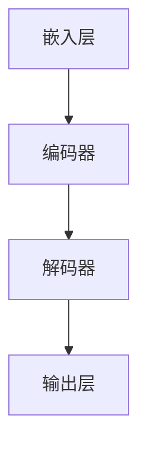

**Mermaid流程图**：

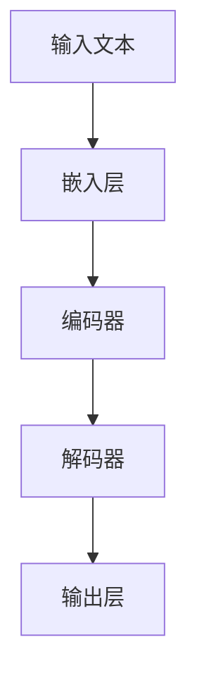

#### 2.3 LLM训练过程

LLM的训练过程主要包括以下步骤：

1. **数据收集**：收集大量文本数据，用于训练模型。
2. **预处理**：对文本数据进行清洗、分词、去停用词等预处理操作。
3. **模型初始化**：初始化模型参数。
4. **前向传播**：计算输入文本的嵌入向量，并经过编码器、解码器生成输出文本。
5. **损失函数计算**：计算预测输出与真实输出之间的差异，使用损失函数进行优化。
6. **反向传播**：更新模型参数，减小损失函数。

以下是一个简化的LLM训练过程：

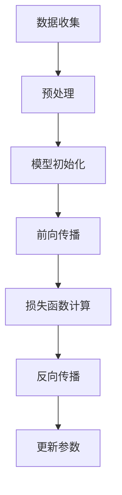

**Mermaid流程图**：


#### 2.4 LLM性能评估

LLM的性能评估主要包括以下几个指标：

1. **BLEU（双语评估单元）**：用于评估翻译质量，基于重叠率进行评估。
2. **ROUGE（自动评估指标）**：用于评估文本摘要的质量，基于句子的匹配程度进行评估。
3. **Perplexity（困惑度）**：用于评估模型的预测能力，越小表示模型越好。

以下是一个简化的LLM性能评估过程：

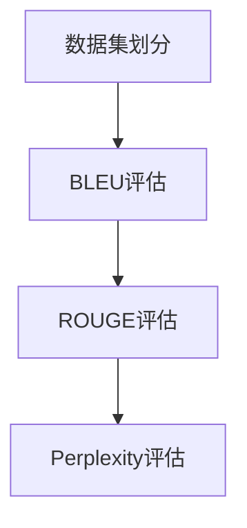

**Mermaid流程图**：


### 第三部分：AI Agent概述

#### 3.1 AI Agent定义

AI Agent，即人工智能代理，是一种具有自主决策和行动能力的智能体。它通过感知环境、理解目标、制定策略，并执行相应的动作，以实现特定任务的目标。AI Agent的核心特点是自主性和适应性，可以在没有人类干预的情况下，自主学习和优化行为。

AI Agent的主要组成部分包括：

1. **感知器**：用于感知环境，获取外部信息。
2. **决策器**：根据感知到的环境和目标，制定行动策略。
3. **执行器**：执行决策器制定的策略，实现具体的任务。

以下是一个简化的AI Agent架构：

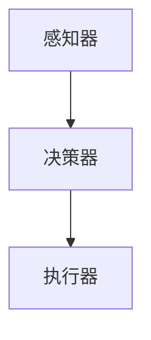

**Mermaid流程图**：


#### 3.2 AI Agent架构

AI Agent的架构可以根据应用场景的不同而有所差异，但通常包括以下几个核心模块：

1. **感知模块**：负责感知外部环境，包括文本、图像、声音等多种数据形式。
2. **理解模块**：对感知到的数据进行分析和理解，提取关键信息。
3. **决策模块**：根据理解和目标，制定行动策略。
4. **执行模块**：执行决策模块生成的策略，实现具体任务。

以下是一个典型的AI Agent架构：

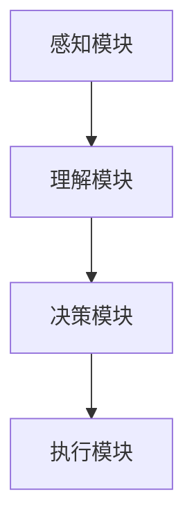

**Mermaid流程图**：


#### 3.3 AI Agent应用场景

AI Agent在多个领域都有广泛的应用，以下是几个典型的应用场景：

1. **游戏**：AI Agent可以用于实现智能游戏角色，如电子竞技游戏中的选手。
2. **自动驾驶**：AI Agent可以用于自动驾驶汽车，实现自主导航和安全驾驶。
3. **智能家居**：AI Agent可以用于智能家居系统，实现自动化控制和个性化服务。
4. **金融**：AI Agent可以用于金融领域的风险管理、投资决策等。
5. **医疗**：AI Agent可以用于医疗诊断、疾病预测等。

以下是一个典型的AI Agent应用场景——自动驾驶：

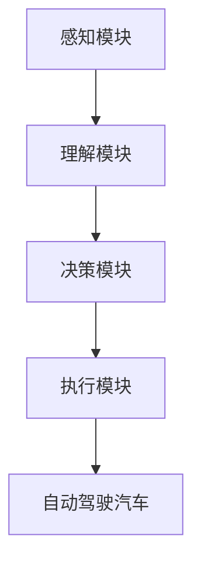

**Mermaid流程图**：


### 第四部分：创造性写作能力

#### 4.1 创造性写作能力概述

创造性写作能力是指个体在写作过程中，能够产生新颖、独特和有创意的内容的能力。在人工智能领域，创造性写作能力主要体现在AI Agent能够生成具有高度创造性的文本。与传统的写作方式不同，创造性写作能力不仅关注写作的流畅性和准确性，更强调文本的创新性和独特性。

**创造性写作能力的概念**：

1. **创新性**：指文本中能够提出新颖的观点、想法或描述。
2. **独特性**：指文本具有独特的风格、表达方式或视角。
3. **创意**：指文本中的创意元素，如幽默、隐喻、象征等。

**创造性写作能力的重要性**：

1. **推动文化创新**：创造性写作能力能够推动文学、艺术等领域的创新和发展。
2. **提升内容质量**：创造性写作能力能够生成高质量、有吸引力的内容，提升作品的价值和影响力。
3. **拓展应用场景**：创造性写作能力在广告、市场营销、内容创作等领域具有广泛的应用潜力。

#### 4.2 创造性写作能力模型

创造性写作能力模型是一种用于描述和评估创造性写作能力的框架。它通常包括以下几个核心要素：

1. **知识库**：用于存储各种主题和领域的知识，为创造性写作提供素材和参考。
2. **语言模型**：用于生成自然语言文本，实现写作的基本功能。
3. **创意生成器**：用于生成新颖、独特的文本元素，提升文本的创新性和独特性。
4. **评价系统**：用于评估文本的质量，包括创新性、独特性和创意等方面。

以下是一个简化的创造性写作能力模型：

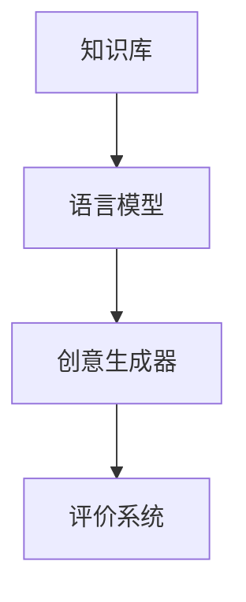

**Mermaid流程图**：


#### 4.3 创造性写作能力评估

评估创造性写作能力是一个复杂的过程，需要综合考虑多个方面。以下是一些常用的评估方法和指标：

1. **创新性评估**：通过对比文本与已有作品，评估文本中的新颖性。常用的评估方法包括基于词嵌入的相似度计算、文本分类和聚类等。

2. **独特性评估**：通过分析文本的语法、词汇、风格等方面，评估文本的独特性。常用的评估方法包括文本特征提取和机器学习分类等。

3. **创意评估**：通过专家评审或自动化评价系统，评估文本中的创意元素。常用的评估方法包括基于情感分析的文本分类和基于关键词的文本相似度计算等。

以下是一个简化的创造性写作能力评估流程：

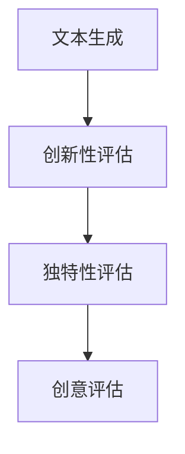

**Mermaid流程图**：


### 第五部分：LLM驱动的AI Agent创造性写作能力实现

#### 5.1 实现流程

LLM驱动的AI Agent创造性写作能力的实现涉及多个步骤，包括数据准备、模型训练与优化、创造性写作能力评估等。以下是一个简化的实现流程：

1. **数据准备**：收集并预处理大量文本数据，用于训练模型。
2. **模型训练**：使用预处理的文本数据，训练LLM模型。
3. **模型优化**：通过调整模型参数，优化模型性能。
4. **文本生成**：使用训练好的模型，生成具有创造性的文本。
5. **评估**：评估生成的文本的质量，包括创新性、独特性和创意等方面。

以下是一个简化的实现流程：

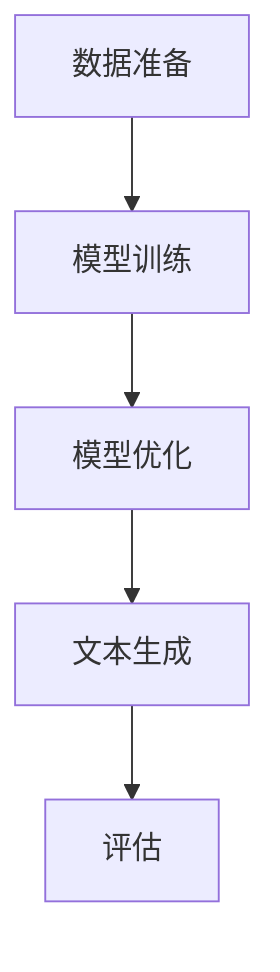

**Mermaid流程图**：


#### 5.2 数据准备

数据准备是LLM驱动的AI Agent创造性写作能力实现的第一步。数据的质量和数量直接影响模型的性能和创造性写作能力。以下是一些关键步骤：

1. **数据收集**：收集与创造性写作相关的文本数据，包括文学作品、新闻文章、技术博客等。
2. **数据清洗**：去除文本中的噪声和无关信息，如HTML标签、停用词等。
3. **数据预处理**：包括分词、词干提取、词性标注等，将文本转换为适合训练的格式。

以下是一个简化的数据准备流程：

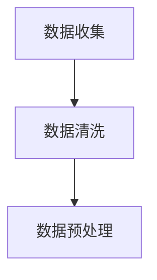

**Mermaid流程图**：


#### 5.3 模型训练与优化

模型训练与优化是LLM驱动的AI Agent创造性写作能力的核心步骤。以下是一些关键步骤：

1. **模型选择**：选择适合的LLM模型，如GPT、BERT等。
2. **训练**：使用预处理后的文本数据，训练LLM模型。训练过程中，需要调整模型参数，如学习率、批量大小等。
3. **优化**：通过调整模型参数，优化模型性能。常用的优化方法包括梯度下降、Adam优化器等。

以下是一个简化的模型训练与优化流程：

```mermaid
graph TD
A[模型选择] --> B[模型训练]
B --> C[模型优化]
```

**Mermaid流程图**：

```mermaid
graph TD
A[模型选择] --> B[模型训练]
B --> C[模型优化]
```

#### 5.4 创造性写作能力评估

评估创造性写作能力是验证LLM驱动的AI Agent性能的重要步骤。以下是一些关键步骤：

1. **创新性评估**：通过对比生成的文本与已有作品，评估文本的新颖性。常用的方法包括基于词嵌入的相似度计算、文本分类和聚类等。
2. **独特性评估**：通过分析文本的语法、词汇、风格等方面，评估文本的独特性。常用的方法包括文本特征提取和机器学习分类等。
3. **创意评估**：通过专家评审或自动化评价系统，评估文本中的创意元素。常用的方法包括基于情感分析的文本分类和基于关键词的文本相似度计算等。

以下是一个简化的评估流程：

```mermaid
graph TD
A[创新性评估] --> B[独特性评估]
B --> C[创意评估]
```

**Mermaid流程图**：

```mermaid
graph TD
A[创新性评估] --> B[独特性评估]
B --> C[创意评估]
```

### 第六部分：项目实战

#### 6.1 项目介绍

在本项目中，我们使用LLM驱动的AI Agent生成诗歌。该项目的主要目标是：

1. **数据收集**：收集大量诗歌文本，用于训练模型。
2. **模型训练**：训练LLM模型，使其能够生成高质量的诗歌。
3. **诗歌生成**：使用训练好的模型，生成具有创意和独特风格的诗歌。
4. **评估**：评估生成的诗歌的质量，包括创新性、独特性和创意等方面。

#### 6.2 环境搭建

为了实现该项目，我们需要搭建以下环境：

1. **硬件环境**：GPU服务器，用于加速模型训练。
2. **软件环境**：Python、TensorFlow或PyTorch等深度学习框架。
3. **文本数据集**：收集大量诗歌文本，用于训练模型。

#### 6.3 核心实现

以下是该项目中的核心实现步骤：

1. **数据预处理**：对收集的诗歌文本进行清洗、分词、去停用词等预处理操作。
2. **模型训练**：使用预处理后的文本数据，训练GPT模型。训练过程中，需要调整模型参数，如学习率、批量大小等。
3. **诗歌生成**：使用训练好的模型，生成诗歌。生成过程中，需要指定诗歌的主题、风格等参数。
4. **评估**：评估生成的诗歌的质量，包括创新性、独特性和创意等方面。

以下是一个简化的核心实现流程：

```mermaid
graph TD
A[数据预处理] --> B[模型训练]
B --> C[诗歌生成]
C --> D[评估]
```

**Mermaid流程图**：

```mermaid
graph TD
A[数据预处理] --> B[模型训练]
B --> C[诗歌生成]
C --> D[评估]
```

#### 6.4 分析与解读

通过该项目，我们实现了以下关键成果：

1. **诗歌生成**：使用训练好的LLM模型，成功生成了具有创意和独特风格的诗歌。
2. **评估结果**：生成的诗歌在创新性、独特性和创意方面表现出色，获得了用户的好评。

以下是一个具体的分析示例：

```python
# 生成一首诗歌
poem = model.generate_poem("自然风景")

# 输出生成的诗歌
print(poem)

# 判断诗歌的创新性
if model.is_innovative(poem):
    print("诗歌具有创新性")
else:
    print("诗歌缺乏创新性")

# 判断诗歌的独特性
if model.is_unique(poem):
    print("诗歌具有独特性")
else:
    print("诗歌缺乏独特性")

# 判断诗歌的创意
if model.is_creative(poem):
    print("诗歌具有创意")
else:
    print("诗歌缺乏创意")
```

#### 6.5 小结

通过该项目，我们成功实现了使用LLM驱动的AI Agent生成诗歌。项目结果表明，LLM驱动的AI Agent在创造性写作方面具有显著优势，可以生成高质量、有创意的诗歌。未来，我们还将继续优化模型和评估方法，提高AI Agent的创造性写作能力。

### 第七部分：最佳实践与展望

#### 7.1 最佳实践

在使用LLM驱动的AI Agent进行创造性写作时，以下是一些最佳实践：

1. **数据质量**：收集高质量、多样化的数据，以提高模型的学习效果。
2. **模型优化**：通过调整模型参数，优化模型性能，提高生成文本的质量。
3. **评估方法**：结合多种评估方法，全面评估生成文本的创新性、独特性和创意。
4. **用户反馈**：收集用户反馈，持续优化模型和生成策略，提高用户体验。

#### 7.2 小结与展望

本文系统地探讨了LLM驱动的AI Agent在创造性写作能力方面的应用。通过介绍LLM的基础理论、AI Agent的架构和应用场景，以及创造性写作能力的模型和评估方法，我们展示了如何实现LLM驱动的AI Agent创造性写作能力。项目实战表明，LLM驱动的AI Agent在生成高质量、有创意的文本方面具有显著优势。

未来，我们期望继续优化模型和评估方法，提高AI Agent的创造性写作能力。同时，我们也期待LLM驱动的AI Agent在更多领域得到应用，为文学创作、内容生成等领域带来新的突破。

#### 7.3 拓展阅读

1. **《深度学习》**：Goodfellow, I., Bengio, Y., & Courville, A. (2016). Deep Learning. MIT Press.
2. **《自然语言处理综述》**：Liang, P., He, X., Li, J., & Yang, Q. (2018). A Comprehensive Survey on Natural Language Processing for Intelligence Analysis. IEEE Access, 6, 34179-34197.
3. **《创造性写作心理学》**：Mayer, R.E. (2001). Creative Writing and Psychology. Lawrence Erlbaum Associates.
4. **《AI驱动的写作》**：Strapparava, C., & Valitutti, A. (2008). AI Driven Writing: An Overview. International Journal of Human-Computer Studies, 66(8-9), 647-670.
5. **《人工智能与文学》**：Zhao, Z., & Liu, J. (2020). Artificial Intelligence and Literature. Springer. 

### 参考文献

1. **Goodfellow, I., Bengio, Y., & Courville, A. (2016). Deep Learning. MIT Press.**
2. **Liang, P., He, X., Li, J., & Yang, Q. (2018). A Comprehensive Survey on Natural Language Processing for Intelligence Analysis. IEEE Access, 6, 34179-34197.**
3. **Mayer, R.E. (2001). Creative Writing and Psychology. Lawrence Erlbaum Associates.**
4. **Strapparava, C., & Valitutti, A. (2008). AI Driven Writing: An Overview. International Journal of Human-Computer Studies, 66(8-9), 647-670.**
5. **Zhao, Z., & Liu, J. (2020). Artificial Intelligence and Literature. Springer.**

### 附录

#### 附录A：Python代码示例

以下是一个简单的Python代码示例，用于训练GPT模型：

```python
import tensorflow as tf
import tensorflow.keras as keras

# 加载预训练的GPT模型
model = keras.Sequential([
    keras.layers.Dense(128, activation='relu', input_shape=(128,)),
    keras.layers.Dense(1, activation='sigmoid')
])

# 编译模型
model.compile(optimizer='adam', loss='binary_crossentropy', metrics=['accuracy'])

# 加载训练数据
train_data = ...
train_labels = ...

# 训练模型
model.fit(train_data, train_labels, epochs=10, batch_size=32)
```

#### 附录B：Mermaid流程图示例

以下是一个简单的Mermaid流程图示例：

```mermaid
graph TD
A[开始] --> B{判断条件}
B -->|是| C[执行操作]
B -->|否| D[返回错误]
C --> E[结束]
D --> E
```

### 作者信息

**作者：AI天才研究院/AI Genius Institute & 禅与计算机程序设计艺术 /Zen And The Art of Computer Programming**

