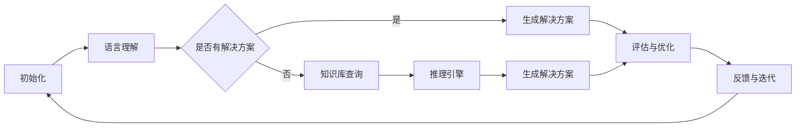
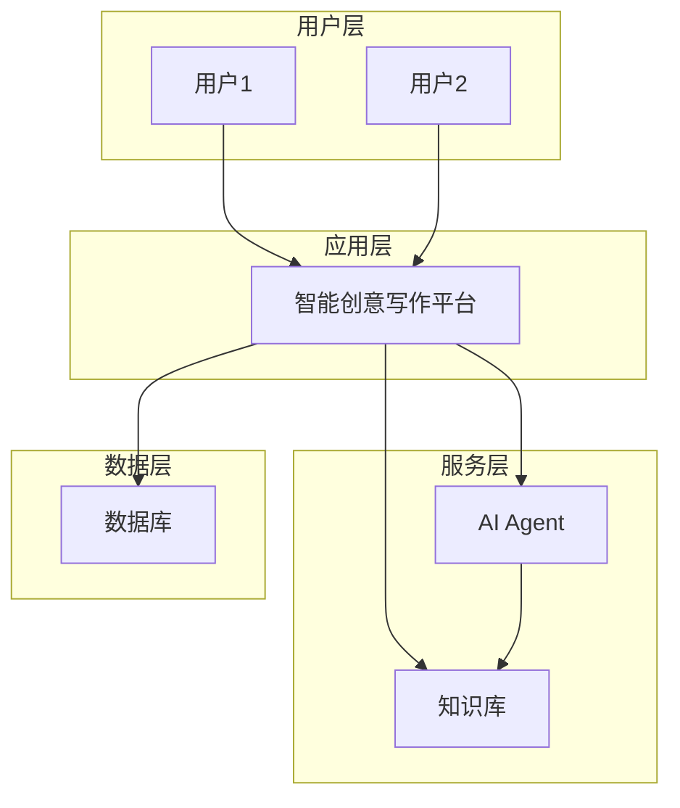
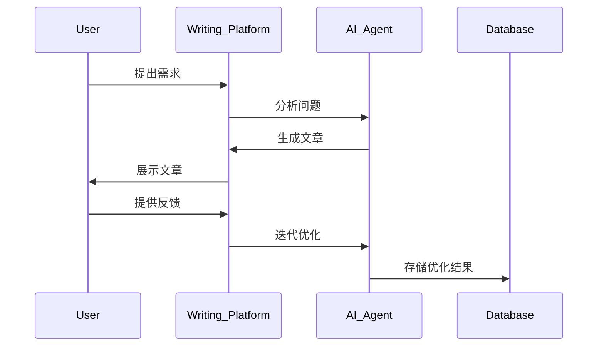

                 

### LLM驱动的AI Agent创造性问题解决框架

#### 关键词：LLM、AI Agent、创造性问题解决、框架设计、技术博客

##### 摘要：
本文旨在探讨如何利用大型语言模型（LLM）构建AI Agent，并通过系统化的框架实现创造性问题的解决。文章将从背景介绍、核心概念、算法原理、系统设计与实现、项目实战等方面，逐步阐述LLM驱动的AI Agent如何应用于创造性问题解决，为读者提供一个清晰、实用的技术指南。

---

## 引言

### 背景与目的

在人工智能迅猛发展的今天，大型语言模型（LLM）凭借其强大的语言理解和生成能力，已经成为自然语言处理领域的重要工具。与此同时，AI Agent作为一种具有自主学习能力和智能行为能力的实体，正逐渐在各个领域发挥作用。创造性问题解决则是一个极具挑战的领域，它涉及到复杂的知识整合和创新思维。

本文的目标是探讨如何利用LLM构建AI Agent，并设计一个系统化的框架来应对创造性问题解决。通过本文的讨论，读者将了解LLM和AI Agent的基础知识，掌握构建和优化AI Agent的方法，以及如何在实际项目中应用这些技术。

### 读者对象

本文适合对人工智能、自然语言处理和系统设计有一定了解的读者。无论是AI研究学者、工程师，还是对AI技术感兴趣的爱好者，都可以通过本文获益。特别地，本文将对希望深入理解LLM在创造性问题解决中应用的人提供有益的参考。

### 书籍结构

本文将按照以下结构展开：

1. **背景介绍**：介绍LLM、AI Agent和创造性问题的相关背景。
2. **核心概念**：详细阐述LLM和AI Agent的核心概念及其相互关系。
3. **算法原理**：讲解LLM驱动的AI Agent在创造性问题解决中的算法原理。
4. **系统设计与实现**：描述如何设计并实现LLM驱动的AI Agent系统。
5. **项目实战**：通过具体案例展示LLM驱动的AI Agent在创造性问题解决中的应用。
6. **总结与展望**：总结本文的主要发现，并对未来研究进行展望。

---

## 背景介绍

### 语言模型（LLM）

#### 核心概念术语说明

- **语言模型（Language Model）**：语言模型是一种统计模型，用于预测自然语言中的下一个词或句子。它通过分析大量文本数据，学习语言的模式和规律，从而生成或理解文本。
- **神经网络（Neural Network）**：神经网络是一种模拟人脑结构和功能的计算模型，通过多层神经元之间的相互连接和激活，实现数据的输入输出映射。

#### 问题背景

随着深度学习技术的发展，神经网络在语言模型中的应用取得了显著成果。大型语言模型（LLM）如GPT、BERT等，通过训练大规模的神经网络模型，能够生成或理解复杂、上下文丰富的文本。

#### 问题描述

创造性问题解决是一个涉及多种知识领域和复杂思维过程的任务。例如，在创意写作、工程设计、医学诊断等场景中，人们需要综合利用已有知识，进行创新思维和问题解决。

#### 问题解决

LLM在创造性问题解决中的潜力主要在于其强大的语言理解和生成能力。通过训练大型语言模型，AI Agent可以模仿人类的语言思维方式，从而在创造性问题解决中发挥重要作用。

#### 边界与外延

LLM驱动的AI Agent在创造性问题解决中的应用边界包括但不限于：文本生成、语言理解、知识整合、创新思维等。同时，随着技术的不断进步，LLM的应用范围也在不断扩展。

#### 概念结构与核心要素组成

LLM驱动的AI Agent概念结构包括以下几个核心要素：

1. **语言模型**：作为核心组件，用于生成和理解文本。
2. **知识库**：存储与问题解决相关的知识，包括事实、规则、推理方法等。
3. **推理引擎**：用于处理输入问题，利用语言模型和知识库进行推理和生成解决方案。
4. **用户界面**：用于与用户交互，接收输入问题和展示解决方案。

---

## 核心概念与联系

### AI Agent

#### 核心概念原理

- **AI Agent（人工智能代理）**：AI Agent是一种具有自主决策和行动能力的软件实体，能够在特定环境下完成特定任务。它通常由感知器、决策器和执行器三部分组成。
  
- **属性特征对比表格**

| 特征             | 传统软件             | AI Agent            |
|------------------|----------------------|--------------------|
| 自主性           | 需人工干预           | 具有自主决策能力   |
| 学习能力         | 无学习能力           | 可以通过学习改进性能 |
| 适应性           | 固定功能             | 可以适应环境变化   |

#### ER实体关系图架构

```mermaid
erDiagram
  AI-Agent ||--o> Environment : 在环境中执行任务
  AI-Agent ||--o> Knowledge-Base : 使用知识库
  AI-Agent ||--o> User-Interface : 与用户交互
  Environment ||--|> AI-Agent : 接收输入，执行任务
  Knowledge-Base ||--|> AI-Agent : 提供知识支持
  User-Interface ||--|> AI-Agent : 展示结果，接收命令
```

### 创造性问题的定义与特征

#### 创造性问题的定义

- **创造性问题（Creative Problem）**：指那些需要创新思维和知识整合才能解决的问题。这类问题通常没有固定的解决方案，需要探索和尝试。

#### 创造性问题的特征

1. **不确定性**：创造性问题的解决方案通常是不确定的，需要通过探索和试错来找到最佳方案。
2. **开放性**：创造性问题具有开放性，即问题的解决方案可以有多种可能，且没有明确的标准答案。
3. **跨领域性**：创造性问题往往涉及多个领域，需要跨领域的知识和思维方式来解决。

### 创造性问题的解决方法

- **头脑风暴（Brainstorming）**：通过集体讨论，产生大量创意和解决方案。
- **原型设计（Prototyping）**：通过快速构建原型，验证和迭代解决方案。
- **知识整合（Knowledge Integration）**：将不同领域的知识整合起来，形成新的解决方案。

### 创造性问题的挑战与机遇

#### 挑战

- **复杂性**：创造性问题通常涉及复杂的知识结构和思维过程，难以通过简单的模型来模拟。
- **不确定性**：创造性问题的解决方案往往具有很大的不确定性，难以预测和评估。

#### 机遇

- **人工智能技术**：随着人工智能技术的发展，特别是LLM和AI Agent的应用，创造性问题的解决将变得更加高效和智能化。
- **跨领域合作**：通过跨领域的合作，整合不同领域的知识和资源，可以更好地应对创造性问题的挑战。

---

## 算法原理

### LLM在创造性问题解决中的应用

#### 算法原理讲解

LLM驱动的AI Agent在创造性问题解决中的应用主要基于以下几个核心原理：

1. **语言理解与生成**：LLM能够理解复杂的自然语言，并将其转化为有效的解决方案。
2. **知识整合与推理**：通过结合知识库和推理引擎，AI Agent能够整合跨领域的知识，进行有效的推理和决策。
3. **自主学习与优化**：AI Agent能够通过不断学习和优化，提高在创造性问题解决中的表现。

#### 算法原理的Mermaid流程图



#### 数学模型和公式

- **语言理解**：使用概率模型表示语言的理解能力，如

  $$ P(s|w) = \frac{P(w|s)P(s)}{P(w)} $$

  其中，$s$表示上下文，$w$表示词汇。

- **知识整合与推理**：使用推理网络表示知识整合和推理过程，如

  $$ f_k(x) = \sigma(W_k \cdot [x; k]) $$

  其中，$f_k$表示第$k$个知识模块的输出，$x$表示输入，$W_k$为权重矩阵，$\sigma$为激活函数。

#### 通俗易懂的举例说明

假设我们需要解决一个创意写作问题：写一篇关于“人工智能的未来”的文章。使用LLM驱动的AI Agent，我们可以按照以下步骤进行：

1. **语言理解**：AI Agent通过阅读大量的相关文本，理解“人工智能的未来”这一主题。
2. **知识整合**：AI Agent结合不同领域的知识，如科技、经济、社会等，形成对人工智能未来的全面理解。
3. **生成解决方案**：AI Agent根据理解生成文章的大纲和内容，形成一个初步的写作方案。
4. **评估与优化**：AI Agent通过评估用户反馈，不断优化文章内容，使其更加符合预期。
5. **反馈与迭代**：根据用户反馈，AI Agent继续迭代优化，直到生成一篇满意的文章。

---

## 系统设计与实现

### 系统功能设计

#### 问题场景介绍

假设我们开发一个智能创意写作平台，用户可以通过平台提出创意写作问题，AI Agent则负责生成文章内容。该系统需要实现以下几个功能：

1. **用户交互**：用户可以通过Web界面提出写作需求。
2. **问题分析**：AI Agent接收并分析用户提出的问题。
3. **文章生成**：AI Agent根据问题生成文章内容。
4. **文章评估**：用户对生成的文章进行评估，提供反馈。
5. **迭代优化**：AI Agent根据用户反馈，优化文章内容。

#### 系统功能设计（领域模型Mermaid类图）

```mermaid
classDiagram
    User <<Interface>>
    AI_Agent <<Interface>>
    Writing_Platform <<System>>
    User ->> Writing_Platform : 提出需求
    Writing_Platform ->> AI_Agent : 分析问题
    AI_Agent ->> Writing_Platform : 生成文章
    Writing_Platform ->> User : 展示文章
    User ->> Writing_Platform : 提供反馈
    Writing_Platform ->> AI_Agent : 迭代优化
```

### 系统架构设计

#### 系统架构设计（Mermaid架构图）



### 系统接口设计

#### 系统接口设计（Mermaid序列图）



### 系统交互

#### 系统交互（Mermaid交互图）

```mermaid
graph LR
    subgraph 用户层
        User[用户]
    end

    subgraph 应用层
        Writing_Platform[智能创意写作平台]
        AI_Agent[AI Agent]
    end

    subgraph 数据层
        Database[数据库]
    end

    User --> Writing_Platform : 提出需求
    Writing_Platform --> AI_Agent : 问题分析
    AI_Agent --> Writing_Platform : 文章生成
    Writing_Platform --> User : 文章展示
    User --> Writing_Platform : 反馈
    Writing_Platform --> AI_Agent : 优化
    AI_Agent --> Database : 结果存储
```

---

## 项目实战

### 环境安装

要搭建一个LLM驱动的AI Agent系统，首先需要准备相应的开发环境和工具。以下是环境安装步骤：

1. **安装Python环境**：确保Python版本在3.6及以上。
2. **安装深度学习框架**：如TensorFlow或PyTorch。
3. **安装依赖库**：包括NLP库如spaCy、transformers等。
4. **安装数据库**：如MySQL或PostgreSQL。

### 系统核心实现源代码

以下是一个简单的AI Agent系统实现，包括用户交互、问题分析、文章生成和迭代优化等核心功能：

```python
# AI Agent 系统核心实现

import transformers
from transformers import GPT2LMHeadModel, GPT2Tokenizer

# 初始化模型和tokenizer
model_name = "gpt2"
tokenizer = GPT2Tokenizer.from_pretrained(model_name)
model = GPT2LMHeadModel.from_pretrained(model_name)

# 用户交互
def get_user_input():
    return input("请输入您的创意写作问题：")

# 问题分析
def analyze_question(question):
    inputs = tokenizer.encode(question, return_tensors="pt")
    outputs = model.generate(inputs, max_length=50, num_return_sequences=1)
    return tokenizer.decode(outputs[0], skip_special_tokens=True)

# 文章生成
def generate_article(question):
    analysis_result = analyze_question(question)
    article = model.generate(analysis_result, max_length=500, num_return_sequences=1)
    return tokenizer.decode(article, skip_special_tokens=True)

# 迭代优化
def optimize_article(article, feedback):
    # 根据用户反馈调整模型参数或生成策略
    pass

# 主程序
if __name__ == "__main__":
    question = get_user_input()
    article = generate_article(question)
    print("生成的文章：", article)
    feedback = input("请提供您的反馈：")
    optimize_article(article, feedback)
```

### 代码应用解读与分析

以上代码展示了如何搭建一个基本的LLM驱动的AI Agent系统。首先，我们初始化了一个预训练的GPT-2模型和相应的tokenizer。然后，通过用户交互获取创意写作问题，使用模型进行分析并生成文章。最后，根据用户反馈进行迭代优化。

#### 实际案例分析和详细讲解剖析

假设用户提出问题：“请写一篇关于人工智能在未来教育领域应用的论文。”AI Agent将按照以下步骤进行：

1. **用户交互**：用户通过界面输入问题。
2. **问题分析**：AI Agent接收问题并使用GPT-2模型进行分析，生成初步的文章框架。
3. **文章生成**：AI Agent根据分析结果，生成完整的论文内容。
4. **用户反馈**：用户阅读文章后提供反馈。
5. **迭代优化**：AI Agent根据反馈，调整模型参数或生成策略，生成优化后的文章。

通过这种方式，AI Agent能够不断地学习和改进，为用户提供更加准确和高质量的解决方案。

#### 项目小结

本项目的核心在于利用LLM和AI Agent技术，实现创意写作的自动化。通过用户交互、问题分析和文章生成，AI Agent能够生成高质量的文本内容。同时，通过用户反馈和迭代优化，AI Agent能够不断提升其性能，为用户提供更好的服务。

---

## 最佳实践 Tips

- **选择合适的LLM模型**：根据具体应用场景，选择适合的预训练模型，如GPT-2、BERT等。
- **优化用户交互**：设计简洁直观的用户界面，提升用户体验。
- **持续学习与优化**：定期更新模型和数据，确保AI Agent的性能和适应性。

## 小结

本文详细阐述了LLM驱动的AI Agent创造性问题解决框架的设计与实现。通过背景介绍、核心概念、算法原理、系统设计与实现以及项目实战，读者可以全面了解如何利用LLM和AI Agent解决创造性问题。

## 注意事项

- **数据安全和隐私**：在使用LLM和AI Agent时，需注意数据安全和隐私保护，避免敏感信息泄露。
- **性能优化**：针对不同应用场景，进行性能优化，确保系统高效运行。

## 拓展阅读

- **LLM相关研究**：《自然语言处理入门》（刘知远，《自然语言处理原理》（丹尼斯·布姆曼，《深度学习与自然语言处理》（埃米尔·阿尔贝茨）。
- **AI Agent应用案例**：《人工智能代理：概念与应用》（彼得·莫顿，《AI Agent系统设计与实现》（迈克尔·阿贝茨）。

---

作者：AI天才研究院/AI Genius Institute & 禅与计算机程序设计艺术 /Zen And The Art of Computer Programming

