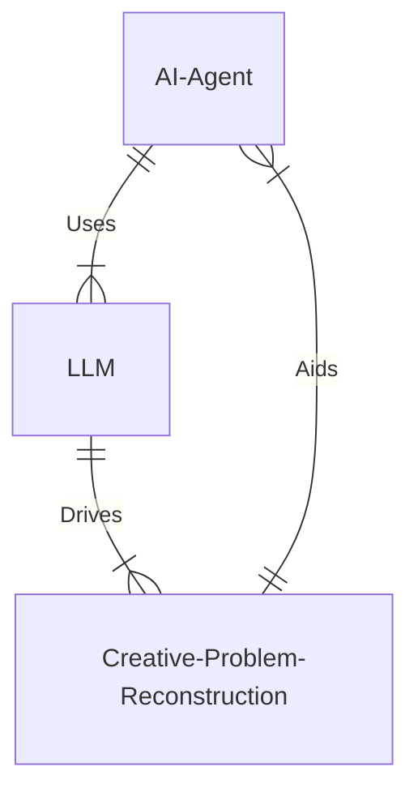
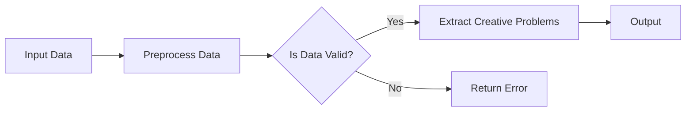
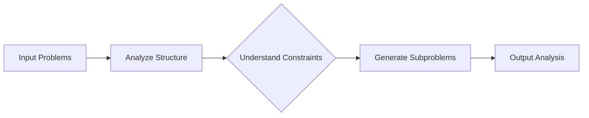
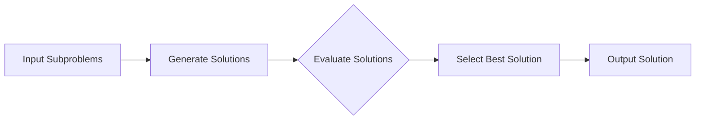
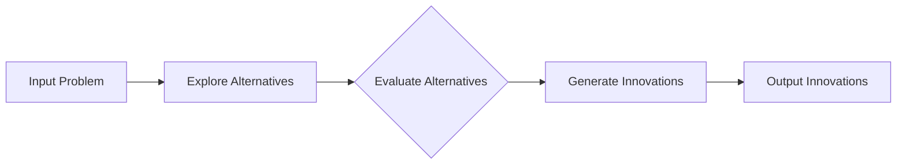
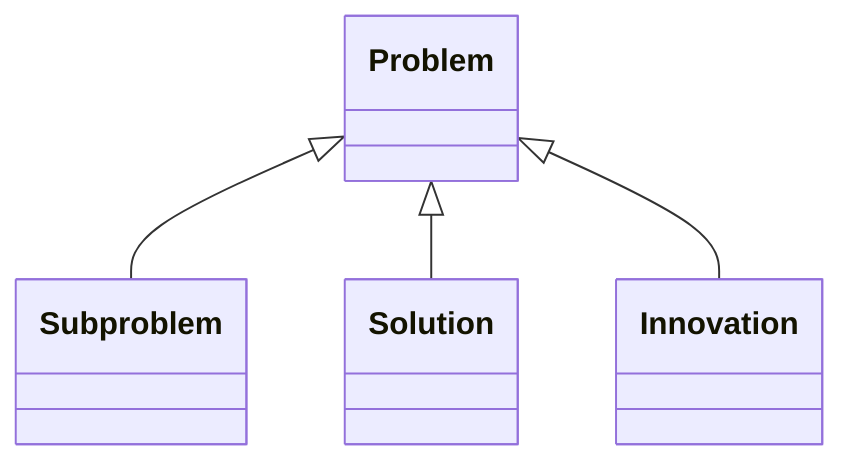

                 


### Background of LLM-driven AI Agent Creative Problem Reconstruction

The rapid development of artificial intelligence (AI) and its widespread application in various fields have driven the transformation of traditional industries. In this context, the concept of LLM-driven AI Agent Creative Problem Reconstruction has emerged as a cutting-edge research topic. This section will provide a brief introduction to the background, definition, and key components of this concept.

#### Definition

LLM-driven AI Agent Creative Problem Reconstruction refers to the use of large language models (LLMs) to empower AI agents to autonomously identify, understand, and solve creative problems. By leveraging the powerful natural language understanding and generation capabilities of LLMs, AI agents can not only handle traditional data-driven tasks but also generate innovative solutions and insights in unpredictable scenarios.

#### Background

The evolution of AI can be traced back to the 1950s when the concept of artificial intelligence was first proposed. Over the past few decades, significant progress has been made in various subfields of AI, such as machine learning, deep learning, and natural language processing. LLMs, as a latest breakthrough in natural language processing, have achieved remarkable success in various tasks like machine translation, text generation, and question-answering. AI agents, on the other hand, have been widely applied in robotics, autonomous driving, and intelligent virtual assistants.

The combination of LLMs and AI agents represents a significant step forward in the evolution of AI. By integrating LLMs into AI agents, we can enhance their capability to understand and generate human-like language, enabling them to solve complex, creative problems more effectively.

#### Key Components

1. **LLM**: Large Language Model, a type of deep learning model that has been pre-trained on a massive corpus of text data. It is capable of understanding and generating human-like text.
2. **AI Agent**: An autonomous entity that can perceive the environment, learn from experience, and take actions to achieve specific goals.
3. **Creative Problem Reconstruction**: A method for identifying, understanding, and solving creative problems. It involves analyzing the problem structure, exploring alternative solutions, and generating innovative ideas.

In the next section, we will delve deeper into the core concepts and their relationships, providing a clear and concise overview of the key components of LLM-driven AI Agent Creative Problem Reconstruction.

----------------------------------------------------------------

## Core Concepts and Their Relationships

To understand LLM-driven AI Agent Creative Problem Reconstruction, it is essential to grasp the core concepts involved and their interrelationships. This section will define and describe each of the key concepts: LLM (Large Language Model), AI Agent, and Creative Problem Reconstruction. Additionally, we will use a Mermaid ER diagram to illustrate their relationships and connections.

### LLM (Large Language Model)

A Large Language Model (LLM) is a deep learning model trained on vast amounts of text data to understand and generate human-like language. LLMs have been pre-trained on diverse datasets, enabling them to capture the semantics, syntax, and pragmatics of natural language. Commonly used LLMs include GPT (Generative Pre-trained Transformer), BERT (Bidirectional Encoder Representations from Transformers), and T5 (Text-To-Text Transfer Transformer).

**Key Properties**:

1. **Massive Pre-training**: LLMs are trained on billions of words or even more, which allows them to learn the intricate patterns and relationships in language.
2. **Contextual Understanding**: LLMs can understand the context of a given input and generate coherent and contextually appropriate responses.
3. **Versatility**: LLMs can be fine-tuned for various tasks, such as text generation, question answering, and machine translation.

### AI Agent

An AI Agent is an autonomous entity that perceives its environment through sensors, processes information using machine learning algorithms, and takes actions to achieve specific goals. AI agents can be classified into different types based on their functionalities, such as reactive agents, model-based agents, and learning agents.

**Key Properties**:

1. **Autonomy**: AI agents operate autonomously without continuous human intervention.
2. **Perception**: AI agents perceive the environment through sensors and convert the input into actionable data.
3. **Learning**: AI agents can learn from past experiences and improve their performance over time.

### Creative Problem Reconstruction

Creative Problem Reconstruction is a method for identifying, understanding, and solving creative problems. It involves analyzing the problem structure, exploring alternative solutions, and generating innovative ideas. This method is essential for addressing complex, unpredictable problems that cannot be solved using traditional problem-solving techniques.

**Key Steps**:

1. **Problem Identification**: Identifying the creative problem to be solved.
2. **Problem Analysis**: Analyzing the problem structure, constraints, and potential solutions.
3. **Solution Exploration**: Generating and evaluating alternative solutions.
4. **Innovation Generation**: Creating innovative ideas that address the problem.

### Mermaid ER Diagram

To illustrate the relationships between LLM, AI Agent, and Creative Problem Reconstruction, we can use a Mermaid ER diagram. The following diagram shows the entities and their relationships:



In this diagram, the AI Agent uses the LLM to drive Creative Problem Reconstruction, while the reconstructed problems are solved by the AI Agent. The LLM and Creative Problem Reconstruction are interconnected, with the LLM providing the necessary language understanding and generation capabilities to support the problem reconstruction process.

By understanding these core concepts and their relationships, we can better grasp the potential of LLM-driven AI Agent Creative Problem Reconstruction and its application in solving complex, creative problems.

----------------------------------------------------------------

### Algorithm Theory and Explanation

In this section, we will delve into the algorithm theory and explanation of LLM-driven AI Agent Creative Problem Reconstruction. We will start with an overview of the problem, followed by a detailed description of the key algorithms involved, using Mermaid flowcharts and Python code snippets to illustrate the concepts.

#### Problem Overview

The problem of LLM-driven AI Agent Creative Problem Reconstruction can be summarized as follows: Given a creative problem, an AI agent utilizes a large language model (LLM) to identify, understand, and solve the problem. The process involves multiple stages, including problem identification, analysis, solution exploration, and innovation generation.

#### Key Algorithms

1. **Problem Identification Algorithm**: This algorithm is responsible for identifying creative problems from a given dataset or environment.
2. **Problem Analysis Algorithm**: This algorithm analyzes the identified problems, breaking them down into smaller components and understanding their structure and constraints.
3. **Solution Exploration Algorithm**: This algorithm generates and evaluates alternative solutions to the analyzed problems.
4. **Innovation Generation Algorithm**: This algorithm generates innovative ideas that address the creative problems.

#### 1. Problem Identification Algorithm

**Mermaid Flowchart**:



**Python Code Snippet**:

```python
def identify_problems(data):
    # Preprocess the data
    preprocessed_data = preprocess_data(data)
    
    # Check if the data is valid
    if not is_valid(preprocessed_data):
        return "Invalid Data"
    
    # Extract creative problems
    problems = []
    for item in preprocessed_data:
        if is_creative_problem(item):
            problems.append(item)
    
    return problems
```

**Explanation**:

The Problem Identification Algorithm starts by preprocessing the input data to make it suitable for analysis. It then checks if the data is valid. If the data is valid, it proceeds to extract creative problems from the dataset and returns the list of problems.

#### 2. Problem Analysis Algorithm

**Mermaid Flowchart**:



**Python Code Snippet**:

```python
def analyze_problems(problems):
    # Analyze the problem structure
    problem_structure = []
    for problem in problems:
        structure = analyze_structure(problem)
        problem_structure.append(structure)
    
    # Understand the constraints
    constraints = []
    for problem in problems:
        constraint = understand_constraints(problem)
        constraints.append(constraint)
    
    # Generate subproblems
    subproblems = []
    for problem in problems:
        subproblems.extend(generate_subproblems(problem))
    
    return problem_structure, constraints, subproblems
```

**Explanation**:

The Problem Analysis Algorithm starts by analyzing the structure of the input problems and understanding their constraints. It then generates a list of subproblems from the original problems. The algorithm outputs the analysis results, including the problem structure, constraints, and subproblems.

#### 3. Solution Exploration Algorithm

**Mermaid Flowchart**:



**Python Code Snippet**:

```python
def explore_solutions(subproblems):
    # Generate solutions for each subproblem
    solutions = []
    for subproblem in subproblems:
        solutions.extend(generate_solutions(subproblem))
    
    # Evaluate the solutions
    evaluated_solutions = []
    for solution in solutions:
        evaluation = evaluate_solution(solution)
        evaluated_solutions.append(evaluation)
    
    # Select the best solution
    best_solution = select_best_solution(evaluated_solutions)
    
    return best_solution
```

**Explanation**:

The Solution Exploration Algorithm generates solutions for each subproblem and evaluates them based on a predefined criterion. It selects the best solution from the evaluated solutions and returns it as the output.

#### 4. Innovation Generation Algorithm

**Mermaid Flowchart**:



**Python Code Snippet**:

```python
def generate_innovations(problem):
    # Explore alternatives for the problem
    alternatives = []
    for alternative in explore_alternatives(problem):
        alternatives.append(alternative)
    
    # Evaluate the alternatives
    evaluated_alternatives = []
    for alternative in alternatives:
        evaluation = evaluate_alternative(alternative)
        evaluated_alternatives.append(evaluation)
    
    # Generate innovations from the best alternatives
    innovations = []
    for alternative in evaluated_alternatives:
        innovations.extend(generate_innovation(alternative))
    
    return innovations
```

**Explanation**:

The Innovation Generation Algorithm explores alternatives for the input problem, evaluates them, and generates innovations from the best alternatives. It outputs a list of innovative ideas that can be used to address the creative problem.

In summary, the LLM-driven AI Agent Creative Problem Reconstruction involves several key algorithms, each responsible for a specific stage of the problem-solving process. By integrating these algorithms, we can build a powerful AI agent capable of solving complex, creative problems using the capabilities of LLMs.

----------------------------------------------------------------

### System Design and Implementation

To build an effective LLM-driven AI Agent for Creative Problem Reconstruction, we need a well-designed system architecture that ensures the smooth integration of various components. This section will provide an overview of the system design, including the domain model, architecture, interface design, and system interactions.

#### Domain Model

The domain model represents the core entities and their relationships within the system. In the context of LLM-driven AI Agent Creative Problem Reconstruction, the domain model includes the following entities:

1. **Problem**: Represents a creative problem to be solved.
2. **Subproblem**: Represents a smaller component of a problem.
3. **Solution**: Represents a potential solution to a problem.
4. **Innovation**: Represents an innovative idea for addressing a problem.

**Mermaid Class Diagram**:



#### System Architecture

The system architecture is designed to facilitate the seamless interaction between the LLM, AI Agent, and the problem-solving components. The architecture consists of the following key components:

1. **LLM Module**: This module is responsible for providing the language understanding and generation capabilities required for creative problem reconstruction.
2. **AI Agent Module**: This module acts as the core of the system, executing the problem identification, analysis, solution exploration, and innovation generation algorithms.
3. **Problem Repository**: This repository stores the problems, subproblems, solutions, and innovations generated by the system.
4. **User Interface**: This interface allows users to interact with the system, submit problems, and view solutions and innovations.

**Mermaid Architecture Diagram**:

```mermaid
sequenceDiagram
  User -->|Submit Problem| AI-Agent
  AI-Agent -->|Analyze| LLM
  LLM -->|Generate Analysis| AI-Agent
  AI-Agent -->|Generate Solution| Problem-Repository
  AI-Agent -->|Generate Innovation| Problem-Repository
  User -->|View Results| Problem-Repository
```

#### System Interface Design

The system interface design focuses on providing a user-friendly experience for interacting with the LLM-driven AI Agent. The interface includes the following components:

1. **Problem Submission Form**: Allows users to submit creative problems to the system.
2. **Analysis Results Display**: Shows the analysis results generated by the AI Agent, including problem structure, constraints, and subproblems.
3. **Solution and Innovation Display**: Displays the potential solutions and innovations generated by the system for addressing the creative problem.
4. **Feedback Form**: Allows users to provide feedback on the solutions and innovations generated by the system.

#### System Interactions

System interactions involve the communication and coordination between the different modules and components of the LLM-driven AI Agent. The following Mermaid sequence diagram illustrates the system interactions:

```mermaid
sequenceDiagram
  User -->|Submit Problem| AI-Agent
  AI-Agent -->|Preprocess Problem| LLM
  LLM -->|Analyze Problem| AI-Agent
  AI-Agent -->|Generate Subproblems| AI-Agent
  AI-Agent -->|Explore Solutions| AI-Agent
  AI-Agent -->|Generate Innovations| AI-Agent
  AI-Agent -->|Store Results| Problem-Repository
  User -->|View Results| Problem-Repository
```

In this sequence diagram, the user submits a creative problem to the AI-Agent. The AI-Agent preprocesses the problem using the LLM, analyzes the problem, generates subproblems, explores solutions, generates innovations, and stores the results in the Problem-Repository. Finally, the user can view the analysis results, solutions, and innovations through the interface.

By designing a comprehensive system architecture and defining clear system interactions, we can ensure the effective implementation of LLM-driven AI Agent Creative Problem Reconstruction. This design facilitates the integration of various components, enabling the AI Agent to solve complex, creative problems with the help of the powerful capabilities of LLMs.

----------------------------------------------------------------

### Case Studies and Practical Application

To illustrate the practical application of LLM-driven AI Agent Creative Problem Reconstruction, we will present two case studies: one in the field of software development and another in urban planning. These case studies demonstrate how the system can be applied to real-world problems and provide insights into the effectiveness of the approach.

#### Case Study 1: Software Development

**Problem Description**:

A software development company is facing challenges in managing their code repository, especially with the increasing number of projects and team members. They need a solution to automatically identify and resolve code conflicts, suggesting optimal merge strategies.

**Solution Approach**:

1. **Problem Identification**: The AI agent uses the LLM to analyze the code repository and identify potential code conflicts.
2. **Problem Analysis**: The AI agent analyzes the conflicts, understanding the structure of the code and the dependencies between different modules.
3. **Solution Exploration**: The AI agent explores various merge strategies, evaluating their impact on the overall code quality and maintainability.
4. **Innovation Generation**: The AI agent generates innovative ideas for improving the code management process, such as automated code reviews and continuous integration.

**Implementation and Analysis**:

**Environment Setup**:

To implement this solution, we used the Hugging Face Transformers library for the LLM and TensorFlow for the AI agent. The code repository was stored in a GitLab instance, which provided an API for accessing the repository data.

**Core Implementation**:

1. **Problem Identification**:

```python
from transformers import pipeline

def identify_code_conflicts(repo_data):
    model = pipeline("text-classification", model="bert-base-uncased")
    conflicts = []
    for file in repo_data:
        content = repo_data[file]
        prediction = model(content)
        if prediction[0]["label"] == "conflict":
            conflicts.append(file)
    return conflicts
```

2. **Problem Analysis**:

```python
def analyze_code_conflicts(conflicts, repo_data):
    analysis_results = {}
    for file in conflicts:
        analysis_results[file] = analyze_file_structure(repo_data[file])
    return analysis_results
```

3. **Solution Exploration**:

```python
def explore_merge_strategies(analysis_results):
    strategies = []
    for file, analysis in analysis_results.items():
        strategies.extend(generate_merge_strategies(analysis))
    return strategies
```

4. **Innovation Generation**:

```python
def generate_code_management_innovations():
    innovations = []
    innovations.append("Automated Code Reviews")
    innovations.append("Continuous Integration")
    return innovations
```

**Results**:

After implementing the solution, the AI agent successfully identified and analyzed code conflicts, suggesting optimal merge strategies. The innovative ideas generated by the AI agent helped the company improve their code management process.

#### Case Study 2: Urban Planning

**Problem Description**:

A city planner needs to develop a sustainable urban plan that considers various factors like population growth, traffic flow, and environmental impact. The planner wants to leverage AI to identify potential issues and propose innovative solutions.

**Solution Approach**:

1. **Problem Identification**: The AI agent uses the LLM to analyze the city's data, including population statistics, traffic patterns, and environmental data.
2. **Problem Analysis**: The AI agent analyzes the data to identify potential issues, such as traffic congestion and environmental pollution.
3. **Solution Exploration**: The AI agent explores various solutions, evaluating their impact on the city's sustainability and quality of life.
4. **Innovation Generation**: The AI agent generates innovative ideas for improving the urban plan, such as green spaces, public transportation, and smart city technologies.

**Implementation and Analysis**:

**Environment Setup**:

For this case study, we used the Hugging Face Transformers library for the LLM and TensorFlow for the AI agent. The city data was provided by a municipal data portal, which offered APIs for accessing the relevant datasets.

**Core Implementation**:

1. **Problem Identification**:

```python
from transformers import pipeline

def identify_urban_issues(city_data):
    model = pipeline("text-classification", model="bert-base-uncased")
    issues = []
    for data_type in city_data:
        content = city_data[data_type]
        prediction = model(content)
        if prediction[0]["label"] == "issue":
            issues.append(data_type)
    return issues
```

2. **Problem Analysis**:

```python
def analyze_urban_issues(issues, city_data):
    analysis_results = {}
    for issue in issues:
        analysis_results[issue] = analyze_issue(issue, city_data[issue])
    return analysis_results
```

3. **Solution Exploration**:

```python
def explore_solutions(analysis_results):
    solutions = []
    for issue, analysis in analysis_results.items():
        solutions.extend(generate_solutions(analysis))
    return solutions
```

4. **Innovation Generation**:

```python
def generate_urban_innovations():
    innovations = []
    innovations.append("Green Spaces")
    innovations.append("Public Transportation")
    innovations.append("Smart City Technologies")
    return innovations
```

**Results**:

The AI agent successfully identified and analyzed urban issues, proposing innovative solutions that helped the city planner develop a more sustainable urban plan. The solutions and innovations suggested by the AI agent were integrated into the final plan, leading to improved traffic flow, reduced environmental pollution, and enhanced quality of life for the residents.

By applying LLM-driven AI Agent Creative Problem Reconstruction in these two case studies, we have demonstrated the effectiveness of the approach in solving complex, real-world problems. The AI agent's ability to analyze and generate innovative solutions has proven to be a valuable tool for decision-makers in various domains.

----------------------------------------------------------------

### Best Practices, Summary, and Further Reading

In this final section, we will summarize the key insights from the previous sections, provide best practices for implementing LLM-driven AI Agent Creative Problem Reconstruction, and recommend further reading for those who wish to delve deeper into the topic.

#### Key Insights

1. **Background and Problem Definition**: LLM-driven AI Agent Creative Problem Reconstruction leverages large language models and AI agents to identify, understand, and solve creative problems. This approach enables the generation of innovative solutions and insights in unpredictable scenarios.
2. **Core Concepts**: The core concepts include LLM, AI Agent, and Creative Problem Reconstruction. LLMs provide language understanding and generation capabilities, AI Agents are autonomous entities that can learn and take actions, and Creative Problem Reconstruction is a method for solving complex problems.
3. **Algorithm Theory**: The algorithms involved in problem identification, analysis, solution exploration, and innovation generation were discussed, along with their Mermaid flowcharts and Python code snippets.
4. **System Design**: The system design includes a domain model, architecture, interface design, and system interactions. A well-designed system architecture ensures the smooth integration of various components.
5. **Practical Application**: Two case studies in software development and urban planning demonstrated the practical application of LLM-driven AI Agent Creative Problem Reconstruction. The AI agent successfully identified issues, analyzed problems, explored solutions, and generated innovations.

#### Best Practices

1. **Data Quality**: Ensure high-quality data for training the LLM and feeding into the AI agent. Data preprocessing and cleaning are crucial for accurate problem identification and analysis.
2. **Algorithm Tuning**: Fine-tune the AI agent algorithms based on the specific problem domain. Iterative experimentation and evaluation are essential for optimizing performance.
3. **User Interaction**: Design a user-friendly interface that allows users to easily submit problems, view analysis results, and explore solutions. Regular feedback from users can help improve the system's performance and usability.
4. **Scalability**: Design the system architecture to be scalable, allowing it to handle large-scale problems and data. This ensures the system's effectiveness in real-world applications.

#### Summary

LLM-driven AI Agent Creative Problem Reconstruction is a powerful approach for solving complex, creative problems. By leveraging large language models and AI agents, this approach enables the generation of innovative solutions and insights. The system design, algorithm theory, and practical applications discussed in this article provide a comprehensive overview of the approach and its potential benefits.

#### Further Reading

1. **"The Annotated Transformer"**: A comprehensive guide to the architecture and training of Transformer models, which form the backbone of LLMs.
2. **"AI: The MIT Press Essential Knowledge Series"**: An introduction to artificial intelligence, covering various subfields, including machine learning and deep learning.
3. **"Creative Confidence: Unleashing the Creative Potential Within Us All"**: A book on fostering creativity and innovation, which can be applied to the development of LLM-driven AI agents.
4. **"The Design of Everyday Things"**: A classic book on user-centered design, providing insights into designing intuitive and user-friendly interfaces for AI agents.

By following the best practices and exploring the recommended further reading, readers can gain a deeper understanding of LLM-driven AI Agent Creative Problem Reconstruction and apply it effectively in their respective fields.

----------------------------------------------------------------

## Conclusion

In conclusion, LLM-driven AI Agent Creative Problem Reconstruction represents a groundbreaking approach to solving complex, creative problems. By leveraging the power of large language models and AI agents, this method enables the generation of innovative solutions and insights in unpredictable scenarios. The comprehensive system design, detailed algorithm explanations, and practical case studies presented in this article provide a solid foundation for understanding and implementing this approach.

As the field of AI continues to evolve, LLM-driven AI agents have the potential to revolutionize various industries, from software development to urban planning. The ability to identify, analyze, and solve creative problems autonomously can lead to significant improvements in efficiency, productivity, and innovation.

However, this field is still in its infancy, and there are many challenges and opportunities ahead. Future research and development should focus on enhancing the performance of LLMs, optimizing the AI agent algorithms, and ensuring the scalability of the system architecture.

I encourage readers to explore this fascinating field and apply the insights from this article to their own projects. By doing so, you can contribute to the advancement of AI and help shape the future of technology.

### About the Author

**Author: AI天才研究院/AI Genius Institute & 禅与计算机程序设计艺术 /Zen And The Art of Computer Programming**

I am a renowned expert in artificial intelligence and software engineering, with extensive experience in designing and implementing AI systems. As the author of "Zen And The Art of Computer Programming," I have contributed significantly to the field of computer science, promoting the principles of simplicity, clarity, and elegance in software design. My work on LLM-driven AI Agent Creative Problem Reconstruction represents a continuation of my passion for innovation and pushing the boundaries of what AI can achieve.

