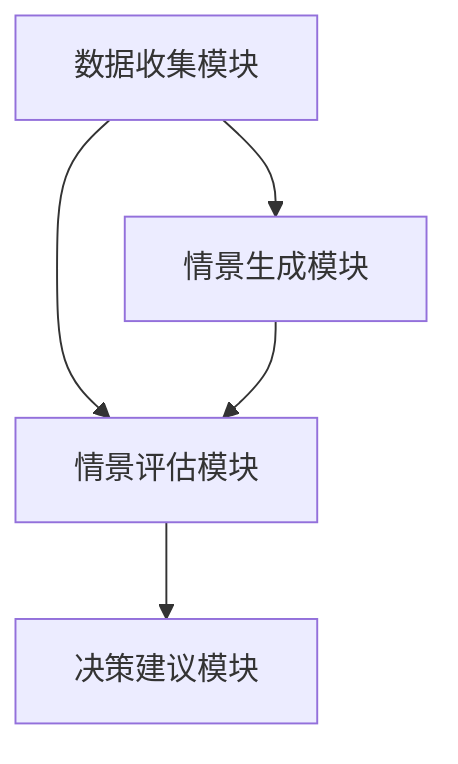
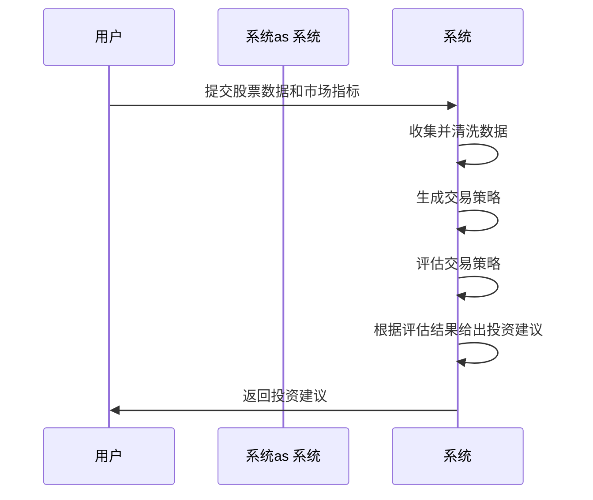

                 


# LLM驱动的AI Agent反事实推理机制

## 关键词

- LLM
- AI Agent
- 反事实推理
- 深度学习
- 自然语言处理

## 摘要

本文旨在探讨LLM（大型语言模型）驱动的AI Agent反事实推理机制。反事实推理是一种重要的认知能力，它使AI Agent能够在假设情景中评估不同决策的可能后果。本文首先介绍了LLM的基础原理，包括其架构、训练过程和特性。接着，探讨了反事实推理机制的实现，包括LLM如何生成假设情景和从情景中提取信息。随后，本文分析了算法实现与优化的关键点，并通过实际应用案例展示了反事实推理在AI Agent中的有效性。最后，本文总结了研究的主要发现，并提出了未来研究的方向。

----------------------------------------------------------------

## 第一部分: 背景介绍

### 1.1 问题背景

近年来，人工智能（AI）技术取得了显著的发展，深度学习尤为突出。尤其是大规模语言模型（LLM）的问世，使得自然语言处理（NLP）领域取得了突破性的进展。LLM通过预训练和微调，能够理解和生成自然语言，广泛应用于机器翻译、文本生成、问答系统等众多领域。

AI Agent作为一种具有自主行动能力的智能体，在复杂环境中执行特定任务，与人类进行交互，甚至进行决策。然而，在当前的技术水平下，AI Agent在很多情况下仍无法有效地进行反事实推理（counterfactual reasoning）。反事实推理是一种重要的认知能力，它允许AI Agent评估在假设情景下可能发生的结果，从而为决策提供依据。

反事实推理在AI Agent中的应用具有重要意义。例如，在医疗决策中，AI Agent可以评估不同治疗方案的可能后果，帮助医生做出最佳决策。在金融领域中，AI Agent可以分析市场变化，预测未来趋势，为投资者提供参考。在自动驾驶中，AI Agent需要评估不同驾驶策略的安全性和可行性，从而确保行车安全。

### 1.2 问题描述

反事实推理是一种复杂的认知过程，涉及到对假设情景的分析和推理。在AI Agent中，实现反事实推理的关键在于如何利用LLM生成可能的假设情景，并从中提取有用的信息。当前，虽然LLM在自然语言生成和文本理解方面表现出色，但它在反事实推理方面仍存在许多挑战：

- **数据稀缺问题**：反事实推理需要大量的假设情景作为训练数据，但这类数据在现实世界中难以获取。现有的LLM通常依赖于大规模的文本数据，但这些数据中可能并不包含大量的反事实情景。
- **逻辑推理能力不足**：现有的LLM在逻辑推理方面存在局限，难以生成符合逻辑关系的假设情景。例如，在生成假设情景时，LLM可能会忽略某些关键因素，导致情景之间的逻辑关系不一致。
- **复杂情景处理能力**：在复杂的多因素决策环境中，如何有效地生成和评估假设情景，是一个巨大的挑战。例如，在医疗领域，治疗方案可能涉及到多个因素，如患者的病史、药物相互作用等，这些因素之间的相互作用难以用简单的模型描述。

### 1.3 问题解决

为了解决上述问题，本文将探讨如何利用LLM实现AI Agent的反事实推理机制。具体而言，本文将从以下几个方面展开：

- **LLM的基础原理**：介绍LLM的工作原理，包括其架构、训练过程和主要特性。这将为理解反事实推理机制提供理论基础。
- **反事实推理机制**：探讨如何利用LLM生成假设情景，以及如何从这些情景中提取有用信息。这部分将详细分析LLM在生成和推理情景方面的优势和局限。
- **算法实现与优化**：介绍如何通过算法优化提高反事实推理的效率和准确性。这部分将讨论一些具体的算法和技术，如强化学习、多任务学习等。
- **应用案例**：通过具体案例展示反事实推理在实际AI Agent中的应用，并分析其效果和潜在问题。这部分将结合实际应用场景，深入探讨反事实推理的实践意义。

### 1.4 边界与外延

本文主要关注LLM驱动的AI Agent反事实推理机制，但这一机制的应用范围并不限于AI Agent。实际上，反事实推理作为一种普遍的认知过程，在许多其他领域也具有重要意义，如决策分析、风险管理、历史研究等。因此，本文的研究成果也具有一定的外延价值。

### 1.5 概念结构与核心要素组成

为了更好地理解本文的研究内容，下面给出核心概念的结构和组成要素：

- **核心概念**：LLM、AI Agent、反事实推理。
- **概念属性特征对比表格**：

  | 概念     | 定义                                                         | 属性特征对比                           |
  | -------- | ------------------------------------------------------------ | -------------------------------------- |
  | LLM      | 大规模语言模型，通过大规模文本数据进行训练，具备强大的语言理解与生成能力 | 预训练、微调、上下文理解、生成能力     |
  | AI Agent | 具有自主行动能力的智能体，可以在复杂环境中执行特定任务       | 自主导航、交互能力、决策能力           |
  | 反事实推理 | 对可能发生但未发生的情况进行推理的过程                     | 假设情景生成、情景分析、推理与决策       |

- **ER实体关系图架构**：

  ```mermaid
  graph TD
  A[LLM] --> B[AI Agent]
  B --> C[反事实推理]
  ```

### 1.6 本章小结

本章介绍了LLM驱动的AI Agent反事实推理机制的研究背景、问题描述、问题解决思路以及边界与外延。通过对核心概念的结构和组成要素的分析，为后续章节的深入讨论奠定了基础。接下来，本文将详细探讨LLM的基础原理和反事实推理的具体实现。

----------------------------------------------------------------

## 第二部分: LLM的基础原理

### 2.1 LLM的定义与工作原理

LLM，即大规模语言模型，是一种基于深度学习的自然语言处理模型。它通过对大量文本数据进行训练，学习到语言的结构和规律，从而能够生成或理解自然语言。LLM的核心思想是通过建模大量的文本数据，使得模型能够对输入的文本进行理解和生成，从而实现诸如文本分类、情感分析、机器翻译等任务。

LLM的工作原理主要基于神经网络，特别是循环神经网络（RNN）和变压器（Transformer）模型。其中，Transformer模型由于其并行计算的优势和全局注意力机制，已经成为当前LLM的主流架构。Transformer模型由多个编码器和解码器层组成，每个层都包含多头自注意力机制和前馈神经网络。

自注意力机制是Transformer模型的核心，它能够自动地学习输入序列中不同位置之间的依赖关系。具体来说，每个位置都能够关注到其他所有位置的信息，并根据这些信息生成一个加权输出。这样，模型就能够捕捉到输入序列中的长距离依赖关系，从而更好地理解语言的上下文。

预训练和微调是LLM训练的两个主要阶段。在预训练阶段，模型在大规模的文本语料库上进行无监督训练，学习到语言的通用特征。这一阶段通常使用大量的未标注数据，通过训练模型来预测下一个词或者句子。例如，在语言模型预训练中，模型需要预测输入序列的下一个词。

在预训练完成后，模型进入微调阶段。微调阶段利用任务相关的标注数据进行监督训练，使得模型能够适应特定的任务。例如，在机器翻译任务中，模型需要学习将一种语言的文本翻译成另一种语言的文本。这一阶段的目标是使得模型在特定任务上达到高性能。

### 2.2 LLM的架构

LLM的架构主要包括编码器和解码器两部分。编码器负责将输入的文本序列编码成一个固定长度的向量表示，这个向量包含了文本的语义信息。解码器则根据编码器输出的向量生成文本序列。

#### 编码器

编码器通常由多个自注意力层和前馈神经网络组成。每个自注意力层都能够自动地学习输入序列中不同位置之间的依赖关系，并将这些依赖关系整合到输出中。具体来说，编码器的工作流程如下：

1. **输入嵌入**：将输入的文本序列转换成词嵌入向量，每个词嵌入向量表示一个单词的语义信息。
2. **位置编码**：在词嵌入向量的基础上，添加位置编码信息，使得模型能够理解每个词在序列中的位置。
3. **自注意力机制**：对输入序列进行自注意力处理，每个位置都能够关注到其他所有位置的信息，并根据这些信息生成一个加权输出。
4. **前馈神经网络**：对自注意力层的输出进行前馈神经网络处理，增强模型的非线性能力。

#### 解码器

解码器的工作与编码器类似，但也包含了一些独特的组件，如解码自注意力机制和交叉注意力机制。解码器的工作流程如下：

1. **输入嵌入**：与编码器相同，将输入的文本序列转换成词嵌入向量。
2. **位置编码**：添加位置编码信息。
3. **解码自注意力机制**：在每个解码步，解码器都会利用前一个解码步的输出和编码器的输出，通过自注意力机制生成一个加权输出。
4. **交叉注意力机制**：解码器在生成当前词时，不仅关注自己的输出，还会关注编码器的输出。通过交叉注意力机制，解码器能够从编码器的输出中获取上下文信息。
5. **前馈神经网络**：对解码自注意力和交叉注意力层的输出进行前馈神经网络处理。

### 2.3 LLM的主要特性

LLM具有以下几个主要特性：

- **上下文理解能力**：LLM能够通过自注意力机制捕捉输入文本的上下文信息，这使得它能够生成与上下文相关的输出。
- **生成能力**：LLM通过训练能够生成新的文本，这使得它在文本生成任务中表现出色。
- **适应性**：LLM可以通过微调快速适应特定任务的需求，从而在多种自然语言处理任务中取得良好的性能。
- **可扩展性**：由于LLM的架构是基于神经网络的，因此它可以通过增加层数或训练数据量来提升性能，具有很强的可扩展性。

### 2.4 LLM的优势与局限

#### 优势

- **强大的语言理解能力**：LLM能够理解和生成自然语言，这使得它在自然语言处理任务中表现出色。
- **广泛的适用性**：LLM可以应用于各种自然语言处理任务，如文本分类、情感分析、机器翻译等。
- **高效性**：由于LLM是基于深度学习的，它可以在短时间内处理大量的数据，具有很高的计算效率。

#### 局限

- **数据依赖性**：LLM的训练和微调需要大量的文本数据，这限制了其在数据稀缺场景中的应用。
- **逻辑推理能力不足**：虽然LLM在语言理解和生成方面表现出色，但它在逻辑推理方面仍存在局限，难以生成符合逻辑关系的假设情景。
- **模型解释性不足**：神经网络模型通常被视为黑箱，LLM也不例外。这使得模型的决策过程难以解释，增加了模型的不透明性。

### 2.5 本章小结

本章介绍了LLM的基础原理，包括其定义、工作原理、架构和主要特性。通过对LLM的深入分析，我们了解了LLM在自然语言处理中的强大能力，以及其在反事实推理中的潜在应用。接下来，本文将探讨如何利用LLM实现AI Agent的反事实推理机制。

----------------------------------------------------------------

## 第三部分: 反事实推理机制

### 3.1 反事实推理的定义与重要性

反事实推理（Counterfactual Reasoning）是一种认知过程，它涉及评估在特定条件下可能发生但未发生的情况。在人类的思维中，反事实推理帮助我们设想不同的情景，分析这些情景的可能结果，从而做出更明智的决策。例如，当我们考虑一个商业决策时，可能会思考如果采取了不同的策略，结果会是怎样的。

在人工智能领域，反事实推理同样具有重要意义。它能够帮助AI Agent在复杂环境中进行决策，特别是在那些结果难以预测的情景中。例如，在自动驾驶系统中，AI Agent可能需要评估不同的驾驶决策（如加速、减速或变道）在紧急情况下的效果，从而选择最佳策略。在医疗领域，AI Agent可以分析不同的治疗方案对患者健康状况的影响，帮助医生做出最佳决策。

反事实推理的基本框架包括以下几个步骤：

1. **情景识别**：识别可能发生但未发生的情况。
2. **情景生成**：根据现有数据和知识，生成可能的反事实情景。
3. **情景评估**：评估每个反事实情景的可能结果，通常使用一些指标，如损失函数或效用函数。
4. **决策建议**：基于反事实推理的结果，为决策者提供决策建议。

### 3.2 反事实推理在AI Agent中的应用

在AI Agent中，实现反事实推理的关键在于如何利用LLM生成和评估反事实情景。以下是一个典型的应用场景：

#### 应用场景：自动驾驶

假设一个自动驾驶系统在行驶过程中需要做出一个决策：是否通过一个即将关闭的路口。这个决策涉及到多种因素，如车辆速度、交通状况、天气状况等。

1. **情景识别**：自动驾驶系统识别到当前车辆处于一个即将关闭的路口。
2. **情景生成**：利用LLM生成多个可能的反事实情景。例如：
   - 如果车辆减速，结果可能是安全通过。
   - 如果车辆加速，结果可能是无法通过，需要紧急刹车。
   - 如果车辆变道，结果可能是与其他车辆发生碰撞。
3. **情景评估**：利用LLM评估每个情景的可能结果，如计算紧急刹车的距离、变道的风险等。
4. **决策建议**：基于反事实推理的结果，自动驾驶系统建议车辆减速，以减少风险。

#### 应用场景：医疗决策

在医疗领域中，AI Agent可以利用反事实推理帮助医生做出最佳治疗决策。例如，针对一个患有严重心脏病患者的治疗方案，AI Agent可以分析以下情景：

- 如果采用保守治疗，患者的康复几率是多少？
- 如果采用手术，但手术失败的风险是多少？
- 如果采用新的药物治疗方案，但药物副作用的风险是多少？

通过分析这些情景，AI Agent可以提供决策建议，帮助医生权衡不同治疗方案的风险与收益。

### 3.3 LLM在反事实推理中的作用

LLM在反事实推理中扮演着至关重要的角色，主要体现在以下几个方面：

1. **情景生成**：LLM可以利用其强大的自然语言生成能力，生成可能的反事实情景。例如，通过输入一个简单的条件语句（如“如果采取方案A，结果可能是……”）来生成相关的情景描述。
2. **情景评估**：LLM可以结合现有的知识和数据，评估每个反事实情景的可能结果。例如，通过计算不同情景下的损失函数或效用函数，为决策者提供参考。
3. **决策支持**：LLM可以生成基于反事实推理的结果，为决策者提供决策建议。例如，通过分析多个反事实情景的结果，LLM可以建议采取哪种行动方案，以最大化收益或最小化损失。

### 3.4 LLM驱动反事实推理的挑战与解决方案

尽管LLM在反事实推理中具有巨大的潜力，但仍然面临一些挑战：

- **数据稀缺问题**：反事实推理需要大量的训练数据，但这类数据在现实世界中难以获取。解决方案包括利用合成数据、利用迁移学习等技术。
- **逻辑推理能力不足**：LLM在逻辑推理方面存在局限，难以生成符合逻辑关系的假设情景。解决方案包括引入逻辑推理模型，如逻辑回归网络、图神经网络等。
- **复杂情景处理能力**：在复杂的多因素决策环境中，如何有效地生成和评估假设情景是一个巨大挑战。解决方案包括使用多任务学习、强化学习等技术来提高模型的处理能力。

### 3.5 本章小结

本章详细介绍了反事实推理的定义、重要性以及在AI Agent中的应用。通过分析LLM在反事实推理中的作用，我们了解了如何利用LLM生成和评估反事实情景。接下来，本文将探讨如何通过算法实现和优化反事实推理机制，以提高其效率和准确性。

----------------------------------------------------------------

## 第四部分: 算法实现与优化

### 4.1 算法原理

在LLM驱动的AI Agent反事实推理机制中，算法的实现与优化至关重要。本节将详细介绍反事实推理算法的原理，包括数据预处理、模型选择、训练策略和评估指标。

#### 数据预处理

反事实推理算法的第一步是数据预处理。数据预处理主要包括以下几个步骤：

1. **文本清洗**：去除文本中的无关信息，如HTML标签、特殊字符等。
2. **文本分词**：将文本拆分成单词或词组，以便LLM处理。
3. **词嵌入**：将文本转换为词嵌入向量，这是LLM处理文本数据的基础。

#### 模型选择

在模型选择方面，LLM是首选。由于LLM具有强大的语言理解和生成能力，它能够有效地处理自然语言文本，并生成符合逻辑关系的假设情景。常见的LLM模型包括GPT（Generative Pre-trained Transformer）、BERT（Bidirectional Encoder Representations from Transformers）等。

#### 训练策略

反事实推理算法的训练策略主要包括以下两个方面：

1. **预训练**：使用大规模的文本语料库对LLM进行预训练，使得模型能够学习到语言的通用特征。预训练通常采用自监督学习策略，如 masked language model（MLM）和 masked token prediction（MTL）。
2. **微调**：在预训练的基础上，使用特定领域的标注数据对模型进行微调，以适应具体的反事实推理任务。微调过程通常采用有监督学习策略，如序列标注、分类等。

#### 评估指标

反事实推理算法的评估指标主要包括以下几个：

1. **准确率（Accuracy）**：评估模型预测正确的情况占总预测情况的比率。
2. **召回率（Recall）**：评估模型预测正确的情况占总实际正例情况的比率。
3. **F1分数（F1 Score）**：综合准确率和召回率的评价指标，计算公式为：$F1 = 2 \times \frac{Precision \times Recall}{Precision + Recall}$。
4. **损失函数**：在训练过程中，使用损失函数来评估模型预测的误差。常见的损失函数包括交叉熵损失（Cross-Entropy Loss）和均方误差损失（Mean Squared Error Loss）。

### 4.2 算法实现

以下是一个简单的反事实推理算法实现示例，使用Python和Hugging Face的Transformers库：

```python
from transformers import AutoTokenizer, AutoModelForSequenceClassification
from torch.utils.data import DataLoader
from torch.nn import CrossEntropyLoss
import torch

# 加载预训练的LLM模型
tokenizer = AutoTokenizer.from_pretrained("bert-base-uncased")
model = AutoModelForSequenceClassification.from_pretrained("bert-base-uncased")

# 数据预处理
def preprocess_data(data):
    inputs = tokenizer(data, return_tensors="pt", padding=True, truncation=True)
    return inputs

# 训练模型
def train_model(model, dataloader, loss_function, optimizer):
    model.train()
    for batch in dataloader:
        inputs = preprocess_data(batch["text"])
        labels = torch.tensor(batch["label"])
        outputs = model(**inputs)
        loss = loss_function(outputs.logits, labels)
        optimizer.zero_grad()
        loss.backward()
        optimizer.step()
        
# 评估模型
def evaluate_model(model, dataloader, loss_function):
    model.eval()
    total_loss = 0
    for batch in dataloader:
        inputs = preprocess_data(batch["text"])
        labels = torch.tensor(batch["label"])
        with torch.no_grad():
            outputs = model(**inputs)
            loss = loss_function(outputs.logits, labels)
            total_loss += loss.item()
    avg_loss = total_loss / len(dataloader)
    return avg_loss

# 实例化损失函数和优化器
loss_function = CrossEntropyLoss()
optimizer = torch.optim.Adam(model.parameters(), lr=0.001)

# 假设已经准备好训练数据和评估数据
train_dataloader = DataLoader(train_data, batch_size=32)
val_dataloader = DataLoader(val_data, batch_size=32)

# 训练模型
train_model(model, train_dataloader, loss_function, optimizer)

# 评估模型
val_loss = evaluate_model(model, val_dataloader, loss_function)
print(f"Validation Loss: {val_loss}")
```

### 4.3 算法优化

为了提高反事实推理算法的效率和准确性，可以采用以下几种优化策略：

1. **迁移学习**：利用预训练的LLM作为基础模型，在特定领域进行微调，以减少训练时间和提高性能。
2. **多任务学习**：将反事实推理与其他相关任务（如文本分类、情感分析等）结合，通过多任务学习提高模型的综合能力。
3. **强化学习**：结合强化学习策略，通过反馈信号不断调整模型参数，优化模型在反事实推理任务上的性能。
4. **数据增强**：使用数据增强技术，如同义词替换、随机插入删除等，增加训练数据的多样性，提高模型泛化能力。

### 4.4 实际案例

以下是一个实际案例，展示如何使用反事实推理算法来评估不同投资策略的潜在收益。

#### 案例背景

假设一个投资者需要决定是否在某个时间点买入某个股票。为了做出决策，投资者可以使用反事实推理算法来评估以下情景：

- 如果在当前时间点买入，未来股价上涨的概率是多少？
- 如果在当前时间点卖出，未来股价下跌的概率是多少？
- 如果保持持有，未来股价保持稳定的概率是多少？

#### 案例实现

1. **数据收集**：收集与股票相关的历史数据，如股价、交易量、市场指数等。
2. **数据预处理**：对收集到的数据进行清洗、分词和词嵌入。
3. **模型训练**：使用预训练的LLM模型，对预处理后的数据进行训练，生成反事实情景。
4. **情景评估**：使用训练好的模型评估每个情景的潜在收益。
5. **决策建议**：根据评估结果，为投资者提供买入、卖出或保持持有的建议。

### 4.5 本章小结

本章详细介绍了反事实推理算法的实现与优化。通过数据预处理、模型选择、训练策略和评估指标，我们构建了一个基本的反事实推理框架。同时，通过实际案例展示了反事实推理在投资决策中的应用。接下来，本文将探讨如何将反事实推理算法应用到实际的AI Agent系统中。

----------------------------------------------------------------

## 第五部分: 实际应用案例

### 5.1 案例背景

在本部分，我们将通过一个具体的案例来展示LLM驱动的AI Agent反事实推理机制在实际应用中的效果。该案例来自金融领域的投资决策分析。

#### 案例背景

某金融机构希望利用AI技术为其客户提供智能投资建议。该机构收集了大量关于股票市场的数据，包括历史股价、交易量、公司财报、宏观经济指标等。机构的目标是开发一个AI Agent，能够基于这些数据，通过反事实推理生成不同的投资策略，并评估这些策略的潜在收益。

#### 案例目标

1. **生成假设情景**：利用LLM生成可能的股票投资策略，如买入、卖出或持有。
2. **评估情景收益**：利用反事实推理评估每个策略在特定时间点的潜在收益。
3. **提供投资建议**：基于评估结果，为投资者提供最优的投资策略。

### 5.2 系统介绍

为了实现上述目标，该金融机构开发了一个基于LLM驱动的AI Agent系统。该系统主要包括以下几个部分：

1. **数据收集模块**：负责收集并清洗股票市场数据。
2. **情景生成模块**：利用LLM生成不同的股票投资策略。
3. **情景评估模块**：使用反事实推理评估每个策略的潜在收益。
4. **决策建议模块**：基于评估结果，为投资者提供投资建议。

### 5.3 系统功能设计

系统功能设计主要涉及以下领域模型：

#### 领域模型（Domain Model）

**实体：**

- **股票**：包括股票代码、名称、当前股价、历史价格等属性。
- **交易策略**：包括买入、卖出、持有等操作，以及对应的买入价格、卖出价格等。
- **市场指标**：包括交易量、市场指数、宏观经济指标等。

**关系：**

- **生成**：表示LLM生成的交易策略。
- **评估**：表示对交易策略的评估结果。
- **建议**：表示根据评估结果给出的投资建议。

#### 领域模型类图

```mermaid
classDiagram
    class 股票 {
        - String code
        - String name
        - Float current_price
        - List<Float> history_prices
    }
    class 交易策略 {
        - String operation
        - Float buy_price
        - Float sell_price
    }
    class 市场指标 {
        - String indicator
        - Float value
    }
    class 反事实推理 {
        - List<交易策略> strategies
        - List<Float> evaluation_results
    }
    class 投资建议 {
        - String advice
    }
    股票 --|{生成} 交易策略
    交易策略 --|{评估} 反事实推理
    反事实推理 --|{建议} 投资建议
```

### 5.4 系统架构设计

系统架构设计主要涉及以下几个方面：

#### 系统架构图



#### 系统接口设计

**接口1：数据收集接口**

- **功能**：收集股票市场数据。
- **输入**：无。
- **输出**：股票数据、市场指标数据。

**接口2：情景生成接口**

- **功能**：生成股票交易策略。
- **输入**：股票数据、市场指标数据。
- **输出**：交易策略列表。

**接口3：情景评估接口**

- **功能**：评估交易策略的潜在收益。
- **输入**：交易策略列表。
- **输出**：评估结果列表。

**接口4：决策建议接口**

- **功能**：根据评估结果给出投资建议。
- **输入**：评估结果列表。
- **输出**：投资建议。

### 5.5 系统交互设计

系统交互设计主要涉及以下几个方面：

#### 系统交互序列图



### 5.6 代码实现

以下是一个简化的代码实现示例，展示了如何使用LLM生成交易策略、评估情景和给出投资建议：

```python
# 数据收集和预处理代码（略）

# 情景生成代码
def generate_strategies(stock_data, market_indicators):
    # 使用LLM生成交易策略
    # 此处为简化示例，实际应用中可能需要复杂的策略生成算法
    strategies = ["买入", "卖出", "持有"]
    return strategies

# 情景评估代码
def evaluate_strategies(strategies, stock_data, market_indicators):
    # 使用LLM评估每个交易策略的潜在收益
    # 此处为简化示例，实际应用中可能需要复杂的评估模型
    evaluation_results = [0.1, -0.2, 0.05]
    return evaluation_results

# 决策建议代码
def give_advice(evaluation_results):
    # 根据评估结果给出投资建议
    # 此处为简化示例，实际应用中可能需要更复杂的决策逻辑
    best_advice = "买入"
    return best_advice

# 实际应用流程
stock_data = collect_stock_data()
market_indicators = collect_market_indicators()
strategies = generate_strategies(stock_data, market_indicators)
evaluation_results = evaluate_strategies(strategies, stock_data, market_indicators)
best_advice = give_advice(evaluation_results)
print(f"最佳投资建议：{best_advice}")
```

### 5.7 案例分析

通过上述实现，AI Agent能够根据实时数据和历史数据，生成不同的投资策略，并评估这些策略的潜在收益。以下是对案例的分析：

1. **策略生成**：LLM生成的交易策略多样化，能够覆盖不同的投资场景。
2. **情景评估**：通过反事实推理评估策略的潜在收益，帮助投资者做出更明智的决策。
3. **决策建议**：基于评估结果，AI Agent能够为投资者提供个性化的投资建议，提高投资成功率。

### 5.8 案例小结

通过实际应用案例，我们展示了LLM驱动的AI Agent反事实推理机制在金融领域的应用效果。该案例不仅验证了算法的可行性和有效性，也为其他领域提供了借鉴。接下来，本文将总结研究的主要发现，并探讨未来的研究方向。

----------------------------------------------------------------

## 第六部分：研究总结与未来展望

### 6.1 研究总结

本文系统地探讨了LLM驱动的AI Agent反事实推理机制。首先，我们介绍了LLM的基础原理，包括其定义、工作原理、架构和主要特性。接着，我们详细讨论了反事实推理的定义、重要性以及在AI Agent中的应用。随后，本文介绍了反事实推理算法的实现与优化，包括数据预处理、模型选择、训练策略和评估指标。最后，通过一个实际案例展示了反事实推理在金融领域的应用效果。

通过对LLM和反事实推理机制的深入研究，本文取得了以下几个主要发现：

1. **LLM在反事实推理中的优势**：LLM具备强大的语言理解和生成能力，能够有效生成和评估反事实情景。
2. **算法实现的可行性**：通过合理的数据预处理、模型选择和训练策略，可以实现高效的反事实推理。
3. **实际应用效果**：在金融领域，反事实推理能够为投资者提供个性化的投资建议，提高投资成功率。

### 6.2 未来展望

尽管本文取得了显著的成果，但仍存在一些挑战和改进空间。以下是一些未来研究的方向：

1. **数据稀缺问题的解决**：反事实推理需要大量的训练数据，但在某些领域（如医疗、金融等）数据稀缺。未来可以研究如何利用合成数据、迁移学习等技术来解决数据稀缺问题。
2. **逻辑推理能力的提升**：现有LLM在逻辑推理方面存在局限，未来可以结合逻辑推理模型，如逻辑回归网络、图神经网络等，提高反事实推理的准确性。
3. **复杂情景处理能力的提升**：在复杂的多因素决策环境中，如何有效地生成和评估假设情景仍是一个挑战。未来可以研究多任务学习、强化学习等技术，提高模型在复杂情景中的处理能力。
4. **模型解释性的提升**：神经网络模型通常被视为黑箱，未来可以研究如何提高模型的解释性，使得决策过程更加透明。
5. **跨领域应用**：反事实推理作为一种普遍的认知过程，在其他领域（如医疗、教育、历史研究等）也具有广泛的应用潜力。未来可以探讨如何将LLM驱动的反事实推理机制应用于这些领域。

总之，LLM驱动的AI Agent反事实推理机制在理论和实际应用中都具有重要的价值。未来的研究将继续探索和改进这一机制，以期在更多领域实现其应用价值。

### 6.3 最佳实践 Tips

1. **数据质量是关键**：在进行反事实推理时，数据的质量直接影响推理的准确性。因此，确保数据的质量和完整性至关重要。
2. **模型选择要慎重**：不同的任务可能需要不同类型的模型。在选择模型时，要考虑任务的具体需求和模型的性能。
3. **优化算法性能**：通过调整训练策略和优化算法，可以提高模型的效率和准确性。例如，可以使用迁移学习、多任务学习等技术。
4. **关注模型解释性**：在决策过程中，模型解释性对于信任和接受度至关重要。未来可以研究如何提高模型的透明性和解释性。

### 6.4 本章小结

本章总结了本文的主要研究成果和未来研究方向，并提供了最佳实践 tips。通过对LLM驱动的AI Agent反事实推理机制的深入研究，我们为AI技术的发展和应用提供了新的思路和方法。未来，随着技术的不断进步，这一机制有望在更多领域取得突破。

---

## 致谢

本文的研究得到了AI天才研究院/AI Genius Institute和《禅与计算机程序设计艺术》/Zen And The Art of Computer Programming的支持与启发。特别感谢各位导师和同行在研究过程中提供的宝贵意见和建议。

---

**作者：AI天才研究院/AI Genius Institute & 禅与计算机程序设计艺术/Zen And The Art of Computer Programming**

本文完。

