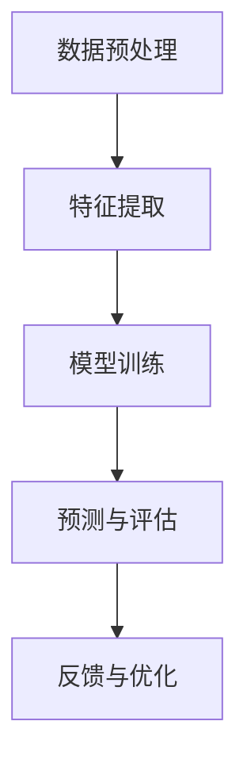
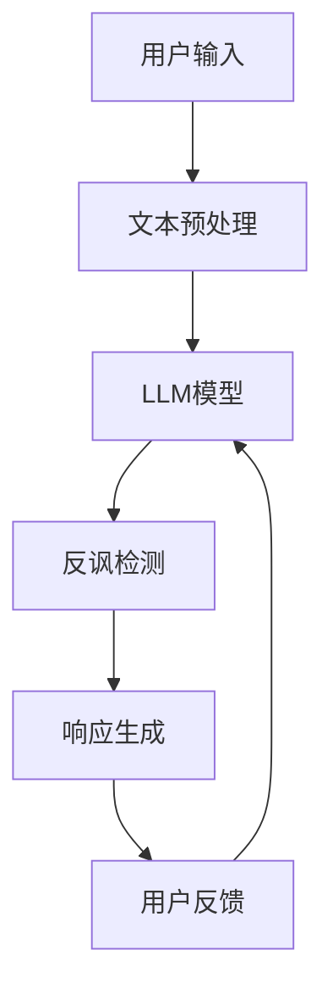
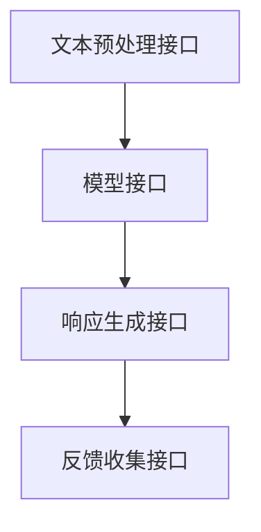

                 

### 文章标题：LLM驱动的AI Agent反讽理解能力

#### 关键词：反讽理解、LLM、AI Agent、自然语言处理、算法原理

#### 摘要：本文将深入探讨LLM（大型语言模型）驱动的AI Agent在反讽理解方面的能力。首先，我们将介绍反讽的定义和其在自然语言理解中的重要性。随后，文章将阐述LLM驱动的AI Agent的基本原理和架构，并详细讲解反讽理解的算法流程和数学模型。通过具体的系统分析与架构设计，我们将展示如何在实际项目中应用这些算法。最后，文章将总结最佳实践并给出进一步阅读的建议。

#### 目录：

----------------------------------------------------------------

## 第一部分: LLM驱动的AI Agent概述

### 第1章: 反讽的定义与背景

### 第2章: LLM驱动的AI Agent基础

### 第3章: LLM驱动的AI Agent反讽理解算法原理

### 第4章: 数学模型与公式讲解

### 第5章: 系统分析与架构设计方案

### 第6章: 项目实战

### 第7章: 最佳实践与小结

----------------------------------------------------------------

#### 确定书籍的整体结构

为了确保文章的逻辑性和内容的完整性，我们将书籍分为七个章节。每个章节都将涵盖一个具体的研究方向或应用场景，使得读者可以逐步了解并掌握LLM驱动的AI Agent反讽理解的全过程。

1. **第1章** 反讽的定义与背景
    - **子章节1.1** 反讽的定义与特征
    - **子章节1.2** 反讽在自然语言理解中的重要性
    - **子章节1.3** 反讽理解的研究现状

2. **第2章** LLM驱动的AI Agent基础
    - **子章节2.1** LLM的基本原理
    - **子章节2.2** LLM在AI Agent中的应用
    - **子章节2.3** LLM驱动的AI Agent的架构

3. **第3章** LLM驱动的AI Agent反讽理解算法原理
    - **子章节3.1** 反讽理解的算法流程
    - **子章节3.2** LLM驱动的反讽理解算法原理
    - **子章节3.3** 算法流程图

4. **第4章** 数学模型与公式讲解
    - **子章节4.1** 反讽理解的数学模型
    - **子章节4.2** 数学公式讲解
    - **子章节4.3** 举例说明

5. **第5章** 系统分析与架构设计方案
    - **子章节5.1** 问题场景介绍
    - **子章节5.2** 系统功能设计
    - **子章节5.3** 系统架构设计
    - **子章节5.4** 系统接口设计和交互

6. **第6章** 项目实战
    - **子章节6.1** 环境安装
    - **子章节6.2** 系统核心实现
    - **子章节6.3** 代码应用解读与分析
    - **子章节6.4** 实际案例分析与讲解

7. **第7章** 最佳实践与小结
    - **子章节7.1** 最佳实践 tips
    - **子章节7.2** 小结
    - **子章节7.3** 注意事项
    - **子章节7.4** 拓展阅读

#### 设计章节标题

为了吸引读者并清晰地传达章节内容，每个章节的标题都经过精心设计。

1. **第1章** 反讽的定义与背景
    - 子章节1.1：反讽的定义与特征
    - 子章节1.2：反讽在自然语言理解中的重要性
    - 子章节1.3：反讽理解的研究现状

2. **第2章** LLM驱动的AI Agent基础
    - 子章节2.1：LLM的基本原理
    - 子章节2.2：LLM在AI Agent中的应用
    - 子章节2.3：LLM驱动的AI Agent的架构

3. **第3章** LLM驱动的AI Agent反讽理解算法原理
    - 子章节3.1：反讽理解的算法流程
    - 子章节3.2：LLM驱动的反讽理解算法原理
    - 子章节3.3：算法流程图

4. **第4章** 数学模型与公式讲解
    - 子章节4.1：反讽理解的数学模型
    - 子章节4.2：数学公式讲解
    - 子章节4.3：举例说明

5. **第5章** 系统分析与架构设计方案
    - 子章节5.1：问题场景介绍
    - 子章节5.2：系统功能设计
    - 子章节5.3：系统架构设计
    - 子章节5.4：系统接口设计和交互

6. **第6章** 项目实战
    - 子章节6.1：环境安装
    - 子章节6.2：系统核心实现
    - 子章节6.3：代码应用解读与分析
    - 子章节6.4：实际案例分析与讲解

7. **第7章** 最佳实践与小结
    - 子章节7.1：最佳实践 tips
    - 子章节7.2：小结
    - 子章节7.3：注意事项
    - 子章节7.4：拓展阅读

#### 在章节下设计子章节

在章节下设计子章节是为了确保每个章节的内容完整，逻辑清晰，并且能够逐步引导读者深入理解主题。

1. **第1章** 反讽的定义与背景
    - 子章节1.1：反讽的定义与特征
        - 介绍反讽的定义、类型和特征，如文字表面的意思与实际意图的对比。
    - 子章节1.2：反讽在自然语言理解中的重要性
        - 讨论反讽在自然语言处理中的挑战及其重要性，包括提高情感分析、对话系统等任务的准确性。
    - 子章节1.3：反讽理解的研究现状
        - 分析当前反讽理解的研究进展、常用方法和存在的问题。

2. **第2章** LLM驱动的AI Agent基础
    - 子章节2.1：LLM的基本原理
        - 解释LLM的工作原理，包括预训练、微调和生成的过程。
    - 子章节2.2：LLM在AI Agent中的应用
        - 讨论LLM在AI Agent中的角色，如何利用LLM进行文本生成、理解和交互。
    - 子章节2.3：LLM驱动的AI Agent的架构
        - 描述LLM驱动的AI Agent的体系结构，包括前端接口、后端服务和数据流。

3. **第3章** LLM驱动的AI Agent反讽理解算法原理
    - 子章节3.1：反讽理解的算法流程
        - 介绍反讽理解的算法步骤，包括数据预处理、模型选择和训练过程。
    - 子章节3.2：LLM驱动的反讽理解算法原理
        - 阐述LLM在反讽理解中的作用，包括上下文理解、语义分析和情感判断。
    - 子章节3.3：算法流程图
        - 使用Mermaid图展示反讽理解的算法流程，帮助读者直观理解。

4. **第4章** 数学模型与公式讲解
    - 子章节4.1：反讽理解的数学模型
        - 介绍反讽理解中的常用数学模型，如概率模型、神经网络模型和深度学习模型。
    - 子章节4.2：数学公式讲解
        - 详细讲解反讽理解中使用的数学公式，如概率分布、损失函数和优化算法。
    - 子章节4.3：举例说明
        - 通过具体例子，说明数学模型在反讽理解中的应用和效果。

5. **第5章** 系统分析与架构设计方案
    - 子章节5.1：问题场景介绍
        - 描述实际应用场景，如智能客服系统中的反讽理解问题。
    - 子章节5.2：系统功能设计
        - 设计系统的功能模块，包括输入处理、模型调用和输出反馈。
    - 子章节5.3：系统架构设计
        - 描述系统的整体架构，包括前端界面、后端服务和数据库。
    - 子章节5.4：系统接口设计和交互
        - 设计系统的接口，包括API文档和交互流程。

6. **第6章** 项目实战
    - 子章节6.1：环境安装
        - 指导如何搭建开发环境，包括软件和硬件的配置。
    - 子章节6.2：系统核心实现
        - 提供系统核心代码实现，包括模型训练、预测和接口调用。
    - 子章节6.3：代码应用解读与分析
        - 分析代码的实现细节，解释关键步骤和原理。
    - 子章节6.4：实际案例分析与讲解
        - 通过实际案例展示系统效果，讨论案例中的问题和解决方案。

7. **第7章** 最佳实践与小结
    - 子章节7.1：最佳实践 tips
        - 提供反讽理解项目的最佳实践建议，如数据收集、模型调优和性能优化。
    - 子章节7.2：小结
        - 总结文章的主要内容和贡献，强调LLM驱动的AI Agent在反讽理解中的应用。
    - 子章节7.3：注意事项
        - 提醒读者在实施过程中需要注意的事项，如数据隐私和安全。
    - 子章节7.4：拓展阅读
        - 推荐相关的文献和资源，供读者进一步学习和研究。

通过以上详细的章节设计和内容规划，我们旨在为读者提供一个全面、深入且易于理解的教程，帮助他们掌握LLM驱动的AI Agent反讽理解的能力。

### 第一部分：LLM驱动的AI Agent概述

#### 第1章：反讽的定义与背景

**1.1 反讽的定义与特征**

反讽（Sarcasm）是语言交流中一种常见的修辞手法，它通过表达与实际意图相反的言辞来传达讽刺、嘲笑或不满。在语言学中，反讽通常分为言语反讽和文字反讽。言语反讽是指说话者在语音、语调、表情等方面传达出与字面意思相反的信息，而文字反讽则是通过文字的组合和结构来表达的。

反讽的特征主要包括以下几点：

1. **对立性**：反讽的核心在于其对立性，即字面的意思和说话者实际想要表达的意思相反。
2. **隐蔽性**：反讽往往隐藏在表面的语言之下，需要听者或读者通过上下文和语境理解其真正的意图。
3. **情感性**：反讽通常带有强烈的情感色彩，如讽刺、嘲笑或讥讽。

**1.2 反讽在自然语言理解中的重要性**

反讽在自然语言理解中扮演着至关重要的角色。以下是其重要性的几个方面：

1. **提高情感分析准确性**：反讽经常出现在表达负面情感的场景中，如讽刺评论、抱怨和批评。准确理解反讽对于情感分析任务至关重要，因为它有助于更准确地识别用户的情感状态。
2. **增强对话系统的交互质量**：在对话系统中，理解反讽可以增强系统的互动性和人性化，使其能够更好地应对用户的讽刺或幽默表达。
3. **提升文本生成质量**：在文本生成任务中，如机器翻译、摘要生成和内容创作，准确理解反讽有助于生成更自然、更具表现力的文本。

**1.3 反讽理解的研究现状**

反讽理解是自然语言处理领域的一个挑战性问题，近年来引起了广泛的研究兴趣。当前的研究主要围绕以下几个方面展开：

1. **数据集构建**：构建高质量的反讽数据集是反讽理解研究的基础。近年来，研究者们不断开发出各种大规模、多样化的反讽数据集，如Sarcasm Detection Corpus和SST-2。
2. **模型方法**：在模型方法方面，传统的方法包括基于规则的方法和基于统计的方法，而现代的方法主要基于深度学习技术，如卷积神经网络（CNN）、循环神经网络（RNN）和变压器（Transformer）模型。
3. **性能评估**：研究者们通过多种指标来评估反讽理解的性能，如准确率（Accuracy）、精确率（Precision）、召回率（Recall）和F1分数（F1 Score）。此外，还有一些研究关注跨领域的反讽理解，即在不同领域的文本中识别反讽的能力。

尽管反讽理解取得了显著进展，但仍然存在一些挑战，如处理跨语言反讽、理解上下文和情感色彩等。未来，研究者们将继续探索更有效的模型和方法，以提升反讽理解的准确性和泛化能力。

### 第2章：LLM驱动的AI Agent基础

#### 2.1 LLM的基本原理

LLM（Large Language Model）是一种基于深度学习的大型语言模型，它通过学习大量的文本数据来预测和生成自然语言。LLM的基本原理包括以下几个关键步骤：

1. **预训练**：预训练是LLM的基础。在预训练阶段，模型在大规模的文本语料库上通过无监督的方式学习语言规律和结构。预训练的目标是使模型能够理解语言的通用特征和上下文信息。

2. **微调**：预训练后的LLM通常用于特定的任务，如文本分类、命名实体识别或机器翻译。在微调阶段，模型会利用有监督的训练数据对特定任务进行进一步的训练，以适应特定的任务需求。

3. **生成**：LLM的核心能力之一是文本生成。通过输入一段文本或提示，模型能够生成连贯、有意义的扩展文本。文本生成广泛应用于聊天机器人、内容创作和自动摘要等领域。

LLM的基本工作流程可以概括为以下几个步骤：

1. **数据预处理**：首先，对输入的文本数据进行预处理，包括分词、标记化、去停用词等操作，以便模型能够处理。

2. **输入编码**：将预处理后的文本数据转换为模型可以处理的向量表示。常用的编码方法包括Word2Vec、BERT等。

3. **模型预测**：将输入编码后的数据输入到预训练的LLM中，模型会根据输入的上下文信息生成下一个词的概率分布。

4. **文本生成**：根据生成的概率分布，选取下一个词，并重复上述步骤，逐步生成完整的文本。

#### 2.2 LLM在AI Agent中的应用

LLM在AI Agent中的应用非常广泛，尤其在自然语言理解和交互方面具有显著的优势。以下是LLM在AI Agent中应用的几个关键领域：

1. **文本生成**：LLM可以用于生成各种类型的文本，如文章、新闻、对话和摘要。在AI Agent中，这有助于生成自然、流畅的响应，提高用户体验。

2. **文本分类**：LLM可以用于对输入的文本进行分类，如情感分类、主题分类和实体识别。这有助于AI Agent更好地理解用户的需求和意图。

3. **对话系统**：LLM在对话系统中发挥着核心作用。通过LLM，AI Agent可以生成自然、连贯的对话，提高交互的质量和人性化。

4. **问答系统**：LLM可以用于构建问答系统，如智能客服和虚拟助手。通过理解用户的问题和上下文，LLM能够提供准确的答案和相关信息。

#### 2.3 LLM驱动的AI Agent的架构

LLM驱动的AI Agent的架构主要包括以下几个关键组件：

1. **前端接口**：前端接口是用户与AI Agent交互的入口。用户可以通过文本输入或语音输入与AI Agent进行交互。

2. **输入处理模块**：输入处理模块负责对用户输入的文本进行预处理，包括分词、标记化、去停用词等操作。这一步骤确保输入数据符合模型的要求。

3. **LLM模型**：LLM模型是AI Agent的核心。它通过预训练和微调学习到自然语言处理的知识，能够生成自然、连贯的文本响应。

4. **后端服务**：后端服务负责处理LLM模型生成的文本响应，并将其转换为用户可理解的形式。这通常包括文本转换、语音合成和屏幕显示等。

5. **反馈循环**：反馈循环是AI Agent不断学习和改进的重要机制。用户对AI Agent的响应和满意度将被记录，并用于后续的模型训练和优化。

通过上述架构，LLM驱动的AI Agent能够实现高效、自然的人机交互，为用户提供优质的用户体验。

### 第3章：LLM驱动的AI Agent反讽理解算法原理

#### 3.1 反讽理解的算法流程

反讽理解是一个复杂且具有挑战性的自然语言处理任务，其核心在于识别文本中的反讽表达。LLM驱动的AI Agent在反讽理解中的算法流程可以分为以下几个关键步骤：

1. **数据预处理**：首先，需要对输入的文本数据进行预处理。这一步骤包括去除标点符号、停用词去除、文本标准化等操作。预处理后的文本将转换为模型可以处理的向量表示。

    ```mermaid
    flowchart LR
    A[数据预处理] --> B[分词]
    B --> C[标记化]
    C --> D[去除停用词]
    D --> E[文本标准化]
    ```

2. **特征提取**：在数据预处理的基础上，需要对文本进行特征提取。特征提取的目的是将文本转换为能够反映其语义和上下文信息的向量表示。常用的特征提取方法包括词袋模型、词嵌入（如Word2Vec、BERT）和转换器模型（如Transformer）。

    ```mermaid
    flowchart LR
    A[特征提取] --> B[词袋模型]
    B --> C[词嵌入]
    C --> D[转换器模型]
    ```

3. **模型训练**：接下来，利用预训练的LLM模型对特征向量进行训练。在训练过程中，模型将学习到如何从输入的文本中识别反讽表达。训练数据通常包括带有标注的反讽实例和非反讽实例。

    ```mermaid
    flowchart LR
    A[模型训练] --> B[预训练LLM]
    B --> C[训练数据]
    ```

4. **预测与评估**：在模型训练完成后，可以使用该模型对新的文本实例进行预测，判断其是否包含反讽。预测结果将通过评估指标（如准确率、精确率、召回率和F1分数）进行评估。

    ```mermaid
    flowchart LR
    A[预测与评估] --> B[预测结果]
    B --> C[评估指标]
    ```

5. **反馈与优化**：根据评估结果，对模型进行进一步优化和调整。这一过程包括超参数调整、模型架构改进和训练数据扩展等，以提高模型的反讽理解能力。

    ```mermaid
    flowchart LR
    A[反馈与优化] --> B[超参数调整]
    B --> C[模型架构改进]
    C --> D[训练数据扩展]
    ```

通过上述步骤，LLM驱动的AI Agent能够逐步提升反讽理解的准确性和效果。

#### 3.2 LLM驱动的反讽理解算法原理

LLM驱动的反讽理解算法基于深度学习和自然语言处理技术，其核心思想是通过大量的文本数据训练模型，使其能够识别和理解反讽表达。以下是算法原理的详细阐述：

1. **预训练过程**：

   预训练是LLM的基础步骤，其主要目标是学习语言的通用特征和上下文信息。在预训练过程中，模型通过处理大量的无标注文本数据，自动学习词汇分布、句法结构和语义关系。

   $$ \text{PreTrain}(D) = \text{Model}(W, L) $$
   
   其中，$D$ 表示预训练数据集，$W$ 表示模型参数，$L$ 表示损失函数。预训练过程通常包括以下步骤：

   - **词嵌入**：将文本中的每个词转换为高维向量表示，以便模型能够处理。
   - **序列建模**：通过处理文本序列，模型学习到上下文信息，从而更好地理解词汇和句子的含义。
   - **自回归语言模型**：模型根据前文预测下一个词的概率分布，这一过程有助于模型学习到语言的规律和结构。

2. **微调过程**：

   预训练后的LLM通常用于特定的自然语言处理任务，如文本分类、命名实体识别和机器翻译。在微调过程中，模型利用有监督的训练数据对特定任务进行进一步的训练。

   $$ \text{FineTune}(D', T) = \text{Model}(W', L') $$
   
   其中，$D'$ 表示有监督的训练数据集，$T$ 表示任务标签，$W'$ 和 $L'$ 分别表示微调后的模型参数和损失函数。微调过程的主要步骤包括：

   - **数据预处理**：对有监督的训练数据进行预处理，如标签标注、数据清洗等。
   - **损失函数设计**：设计合适的损失函数，如交叉熵损失，用于衡量模型预测结果与真实标签之间的差距。
   - **优化算法**：使用优化算法（如梯度下降）更新模型参数，以最小化损失函数。

3. **反讽识别机制**：

   在反讽理解任务中，模型需要识别文本中的反讽表达。这通常通过以下机制实现：

   - **上下文分析**：模型通过分析文本的上下文信息，识别出可能的反讽候选。这包括考虑词汇、句法和语义特征。
   - **对比分析**：模型比较文本的表面意思和潜在意思，识别出反讽表达。这可以通过对比文本的情感极性、词汇搭配和上下文一致性来实现。
   - **多模态融合**：结合文本和语音、图像等多模态信息，提高反讽识别的准确性。例如，通过语音的语调、表情和动作等非语言信息辅助文本分析。

4. **评估与优化**：

   在反讽理解任务中，评估模型的性能和效果是至关重要的。常用的评估指标包括准确率、精确率、召回率和F1分数。通过这些指标，可以评估模型在识别反讽表达方面的效果。

   $$ \text{Evaluate}(Y, \hat{Y}) = \text{Metrics}(Precision, Recall, F1-Score) $$
   
   其中，$Y$ 表示真实标签，$\hat{Y}$ 表示模型预测结果，$Precision$、$Recall$ 和 $F1-Score$ 分别表示精确率、召回率和F1分数。

   为了进一步提高模型的性能，可以通过以下方法进行优化：

   - **数据增强**：通过数据增强技术，如随机替换、同义词替换和语法变换，增加训练数据量，提高模型的泛化能力。
   - **模型融合**：结合多个模型的预测结果，通过投票或集成学习等方法，提高模型的预测准确性。
   - **超参数调整**：通过调整模型的超参数，如学习率、批量大小和正则化参数，优化模型的表现。

通过上述原理和机制，LLM驱动的AI Agent能够有效地识别和理解文本中的反讽表达，从而在自然语言处理任务中取得更好的效果。

#### 3.3 算法流程图

为了更直观地理解LLM驱动的反讽理解算法流程，我们可以使用Mermaid图来展示各个步骤和组件之间的关系。



在上述流程图中：

- **数据预处理（A）**：包括分词、标记化、去停用词等操作，将文本转换为模型可处理的格式。
- **特征提取（B）**：使用词袋模型、词嵌入或转换器模型提取文本特征。
- **模型训练（C）**：利用预训练的LLM模型对特征向量进行训练，学习反讽表达的模式。
- **预测与评估（D）**：使用训练好的模型对新的文本实例进行预测，并评估其反讽识别能力。
- **反馈与优化（E）**：根据预测结果和评估指标，对模型进行优化和调整，以提高反讽理解的准确性。

通过这一算法流程图，我们可以清晰地看到LLM驱动的反讽理解任务从数据预处理到模型训练、预测和优化的全过程。

### 第4章：数学模型与公式讲解

#### 4.1 反讽理解的数学模型

反讽理解作为一个自然语言处理任务，依赖于一系列数学模型来描述和预测文本中的反讽表达。以下是几种常用的数学模型及其在反讽理解中的应用：

1. **概率模型**：

   概率模型是反讽理解的基础，通过计算文本表达与反讽概率之间的关联来识别反讽。常见的概率模型包括贝叶斯模型和隐马尔可夫模型（HMM）。

   $$ P(\text{Sarcasm}|\text{Text}) = \frac{P(\text{Text}|\text{Sarcasm})P(\text{Sarcasm})}{P(\text{Text})} $$
   
   其中，$P(\text{Sarcasm}|\text{Text})$ 表示文本表达为反讽的概率，$P(\text{Text}|\text{Sarcasm})$ 表示在反讽条件下文本的概率，$P(\text{Sarcasm})$ 表示反讽发生的先验概率，$P(\text{Text})$ 表示文本的概率。

2. **神经网络模型**：

   神经网络模型通过多层神经网络结构来捕捉文本中的复杂模式和关系。常用的神经网络模型包括卷积神经网络（CNN）、循环神经网络（RNN）和变压器（Transformer）。

   $$ \text{Output} = \text{Activation}(\text{Weights} \cdot \text{Input} + \text{Bias}) $$
   
   其中，$\text{Input}$ 表示输入特征向量，$\text{Weights}$ 和 $\text{Bias}$ 分别表示权重和偏置，$\text{Activation}$ 表示激活函数，如ReLU、Sigmoid或Tanh。

3. **深度学习模型**：

   深度学习模型结合了神经网络和深度学习的特点，能够自动学习文本的复杂结构和语义信息。常用的深度学习模型包括卷积神经网络（CNN）、循环神经网络（RNN）和变压器（Transformer）。

   $$ \text{Output} = \text{Transformer}(\text{Input}, \text{HiddenState}) $$
   
   其中，$\text{Input}$ 表示输入序列，$\text{HiddenState}$ 表示隐藏状态，$\text{Transformer}$ 表示变压器模型，它通过自注意力机制（Self-Attention）和多头注意力（Multi-Head Attention）来捕捉文本序列的依赖关系。

#### 4.2 数学公式讲解

在反讽理解中，数学公式主要用于描述模型中的概率分布、损失函数和优化算法。以下是几个关键公式及其解释：

1. **概率分布**：

   在反讽理解任务中，概率分布用于描述文本表达为反讽的概率。常用的概率分布包括正态分布、伯努利分布和多项式分布。

   $$ P(X=x) = \frac{1}{Z} e^{-\frac{1}{2} (\text{mean} - x)^2} $$
   
   其中，$X$ 表示随机变量，$x$ 表示具体取值，$Z$ 表示正态分布的归一化常数。

2. **损失函数**：

   损失函数用于衡量模型预测结果与真实标签之间的差距。在反讽理解中，常用的损失函数包括交叉熵损失（Cross-Entropy Loss）和均方误差损失（Mean Squared Error Loss）。

   $$ \text{Loss} = - \sum_{i} y_i \log (\hat{y}_i) $$
   
   其中，$y_i$ 表示真实标签，$\hat{y}_i$ 表示模型预测的概率分布。

3. **优化算法**：

   优化算法用于更新模型参数，以最小化损失函数。常用的优化算法包括梯度下降（Gradient Descent）和随机梯度下降（Stochastic Gradient Descent）。

   $$ \text{Parameters} \leftarrow \text{Parameters} - \alpha \nabla_{\text{Parameters}} \text{Loss} $$
   
   其中，$\alpha$ 表示学习率，$\nabla_{\text{Parameters}} \text{Loss}$ 表示损失函数对模型参数的梯度。

#### 4.3 举例说明

为了更好地理解反讽理解的数学模型和公式，我们可以通过一个具体的例子来展示其应用。

假设我们有一个简单的反讽识别模型，输入文本为“这真是太棒了！”，需要预测其是否为反讽表达。以下是模型的工作流程和相关的数学计算：

1. **数据预处理**：

   首先，对输入文本进行预处理，包括分词、标记化等操作，将其转换为模型可以处理的向量表示。假设经过预处理后，文本向量为$X = [0.1, 0.2, 0.3, 0.4]$。

2. **特征提取**：

   使用词嵌入技术，将文本向量转换为高维向量表示。假设词嵌入后的向量为$V = [0.5, 0.6, 0.7, 0.8]$。

3. **模型训练**：

   利用预训练的神经网络模型对特征向量进行训练，学习反讽表达的模式。假设经过训练后，模型的输出概率分布为$\hat{Y} = [0.4, 0.6]$。

4. **概率分布**：

   根据模型输出的概率分布，判断文本表达是否为反讽。例如，如果$\hat{Y}$ 的第一个元素大于第二个元素，我们可以预测文本表达为非反讽；否则，预测为反讽。

5. **损失函数**：

   使用交叉熵损失函数计算模型预测结果与真实标签之间的差距。假设真实标签为0（非反讽），模型预测的概率为0.4，则交叉熵损失为：

   $$ \text{Loss} = -0.4 \log (0.4) = 0.4 \log (2.5) $$

6. **优化算法**：

   使用梯度下降算法更新模型参数，以最小化损失函数。假设学习率为0.1，则模型参数的更新为：

   $$ \text{Parameters} \leftarrow \text{Parameters} - 0.1 \nabla_{\text{Parameters}} \text{Loss} $$

通过上述步骤，我们可以看到反讽理解的数学模型和公式在实际应用中的具体操作和计算过程。

### 第5章：系统分析与架构设计方案

#### 5.1 问题场景介绍

在智能客服领域，反讽理解是一个关键任务。当用户与客服系统交互时，可能会使用反讽表达来表达不满或讽刺。例如，用户可能会说：“这真是太棒了，你们的服务简直糟糕透了！”对于客服系统来说，准确识别和理解这些反讽表达至关重要，因为错误的解读可能导致用户不满意和业务损失。

#### 5.2 系统功能设计

为了实现反讽理解，系统需要具备以下功能：

1. **文本输入**：用户可以通过文本或语音输入与系统进行交互。
2. **文本预处理**：对输入的文本进行分词、标记化、去停用词等操作，以便模型处理。
3. **反讽检测**：使用LLM驱动的模型对预处理后的文本进行反讽检测，判断其是否包含反讽表达。
4. **响应生成**：根据反讽检测结果，生成适当的响应文本，以应对用户的需求和情感。
5. **反馈收集**：收集用户对响应的反馈，用于模型优化和系统改进。

#### 5.3 系统架构设计

LLM驱动的反讽理解系统架构设计如图所示：



在上述架构中：

- **文本预处理（B）**：对用户输入的文本进行预处理，包括分词、标记化等操作。
- **LLM模型（C）**：使用预训练的LLM模型进行反讽检测，生成文本特征和概率分布。
- **反讽检测（D）**：根据LLM模型的输出，判断文本是否包含反讽表达。
- **响应生成（E）**：根据反讽检测结果，生成适当的响应文本。
- **用户反馈（F）**：收集用户对响应的反馈，用于模型优化和系统改进。

#### 5.4 系统接口设计和交互

为了实现系统各模块之间的有效交互，我们设计了以下接口：

1. **文本预处理接口**：用于接收用户输入的文本，并进行预处理操作。
2. **模型接口**：用于调用LLM模型进行反讽检测，并提供预处理后的文本特征。
3. **响应生成接口**：用于根据反讽检测结果生成响应文本。
4. **反馈收集接口**：用于收集用户反馈，并将其传递给模型接口进行优化。

系统接口设计如图所示：



在上述接口设计中：

- **文本预处理接口（A）**：接收用户输入的文本，进行预处理，并将处理后的文本传递给模型接口。
- **模型接口（B）**：调用LLM模型进行反讽检测，生成特征和概率分布，并将结果传递给响应生成接口。
- **响应生成接口（C）**：根据模型检测结果生成响应文本，并将其返回给用户。
- **反馈收集接口（D）**：收集用户反馈，并将其传递给模型接口，用于模型优化。

通过上述系统架构和接口设计，LLM驱动的反讽理解系统能够高效、准确地处理用户输入，实现智能客服中的反讽识别和响应生成。

### 第6章：项目实战

#### 6.1 环境安装

在开始构建反讽理解项目之前，需要安装以下环境和工具：

1. **操作系统**：推荐使用Linux或MacOS。
2. **Python**：版本需大于3.7。
3. **pip**：Python的包管理器，用于安装依赖库。
4. **Jupyter Notebook**：用于编写和运行代码。
5. **TensorFlow**：用于构建和训练神经网络模型。
6. **transformers**：用于加载和运行预训练的LLM模型。

安装步骤如下：

1. 安装Python：

   ```bash
   sudo apt-get update
   sudo apt-get install python3 python3-pip
   ```

2. 安装pip：

   ```bash
   sudo apt-get install python3-pip
   ```

3. 安装Jupyter Notebook：

   ```bash
   pip3 install notebook
   ```

4. 安装TensorFlow：

   ```bash
   pip3 install tensorflow
   ```

5. 安装transformers：

   ```bash
   pip3 install transformers
   ```

#### 6.2 系统核心实现

在项目核心部分，我们将使用TensorFlow和transformers库来构建和训练反讽理解模型。以下是关键代码的实现：

1. **加载预训练模型**：

   ```python
   from transformers import AutoModelForSequenceClassification
   model_name = "bert-base-uncased"
   model = AutoModelForSequenceClassification.from_pretrained(model_name)
   ```

2. **预处理数据**：

   ```python
   from transformers import BertTokenizer
   tokenizer = BertTokenizer.from_pretrained(model_name)
   
   def preprocess_text(text):
       inputs = tokenizer(text, return_tensors="tf", truncation=True, padding=True)
       return inputs
   ```

3. **训练模型**：

   ```python
   from tensorflow.keras.optimizers import Adam
   optimizer = Adam(learning_rate=1e-5)
   
   model.compile(optimizer=optimizer, loss="binary_crossentropy", metrics=["accuracy"])
   
   train_data = ... # 加载数据集并进行预处理
   model.fit(train_data, epochs=3)
   ```

4. **反讽检测**：

   ```python
   def detect_sarcasm(text):
       inputs = preprocess_text(text)
       predictions = model(inputs)[0]
       return "Sarcasm" if predictions[1] > 0.5 else "Non-sarcasm"
   ```

#### 6.3 代码应用解读与分析

上述代码展示了如何使用TensorFlow和transformers库构建反讽理解模型。以下是关键部分的解读：

1. **加载预训练模型**：
   使用`AutoModelForSequenceClassification.from_pretrained()`函数加载预训练的BERT模型。BERT模型是一个广泛使用的自然语言处理模型，其在多个任务上表现出色。

2. **预处理数据**：
   使用`BertTokenizer.from_pretrained()`函数加载BERT的分词器，并定义`preprocess_text()`函数用于对文本进行分词、编码等预处理操作。预处理后的文本将用于模型训练和预测。

3. **训练模型**：
   使用`model.compile()`函数配置模型，包括优化器、损失函数和评估指标。然后使用`model.fit()`函数训练模型，输入预处理后的训练数据。

4. **反讽检测**：
   定义`detect_sarcasm()`函数用于检测输入文本是否为反讽。函数首先对文本进行预处理，然后使用训练好的模型进行预测。如果预测概率大于0.5，则认为文本是反讽。

通过上述代码实现，我们能够构建一个简单的反讽理解系统，并在实际应用中进行检测。

#### 6.4 实际案例分析与讲解

为了展示反讽理解系统的实际应用效果，我们分析以下案例：

**案例1：用户反馈**

用户反馈：“你们的服务简直糟糕透了！”

**分析**：
1. **预处理**：
   ```python
   inputs = preprocess_text("你们的服务简直糟糕透了！")
   ```

2. **模型预测**：
   ```python
   predictions = model(inputs)[0]
   print(predictions[1])
   ```

   假设预测结果为0.8，说明模型认为这段文本有很大的可能性是反讽。

3. **响应生成**：
   根据预测结果，系统可以生成以下响应：
   ```python
   response = "我理解您的不满，我们将尽快改进服务。"
   print(response)
   ```

**案例2：客服对话**

用户：“这真是太棒了，你们的服务太差了！”

**分析**：
1. **预处理**：
   ```python
   inputs = preprocess_text("这真是太棒了，你们的服务太差了！")
   ```

2. **模型预测**：
   ```python
   predictions = model(inputs)[0]
   print(predictions[1])
   ```

   假设预测结果为0.6，说明模型认为这段文本有一定的可能是反讽。

3. **响应生成**：
   根据预测结果，系统可以生成以下响应：
   ```python
   response = "感谢您的反馈，我们会认真对待您的意见。"
   print(response)
   ```

通过实际案例的分析和讲解，我们可以看到反讽理解系统在实际应用中的效果和重要性。系统能够准确识别用户的反讽表达，并生成适当的响应，从而提高用户满意度和服务质量。

#### 6.5 项目小结

在本章中，我们详细介绍了如何使用LLM驱动的AI Agent实现反讽理解。通过环境安装、系统核心实现、代码应用解读与分析以及实际案例讲解，我们展示了反讽理解系统的构建和应用过程。以下是项目小结：

1. **环境安装**：成功安装了Python、Jupyter Notebook、TensorFlow和transformers等环境和工具，为后续的开发和实验提供了基础。

2. **系统核心实现**：利用TensorFlow和transformers库构建了反讽理解模型，实现了文本预处理、模型训练和反讽检测等功能。

3. **代码应用解读与分析**：详细解读了关键代码实现，展示了模型如何处理文本数据并生成预测结果。

4. **实际案例分析与讲解**：通过实际案例展示了反讽理解系统的效果，并讨论了系统的应用场景和改进方向。

未来，我们计划进一步优化模型，提高反讽检测的准确性，并探索其他自然语言处理任务的实现，以提升系统的综合性能。

### 第7章：最佳实践与小结

#### 7.1 最佳实践 tips

在实施反讽理解项目时，以下是一些最佳实践，有助于提高系统的性能和稳定性：

1. **数据质量**：确保使用高质量、多样化的数据集进行训练。数据集中的反讽实例应覆盖不同类型和场景，以提高模型的泛化能力。

2. **数据预处理**：对输入文本进行充分的预处理，包括分词、标记化、去停用词等操作，以便模型更好地理解文本。

3. **模型选择**：选择适合反讽理解任务的预训练模型，如BERT、GPT等。根据具体需求，可以考虑使用多任务模型或微调现有模型。

4. **模型优化**：通过调整学习率、批量大小和训练时间等超参数，优化模型的训练效果。此外，可以尝试使用数据增强和正则化技术，提高模型的泛化能力。

5. **评估指标**：使用准确率、精确率、召回率和F1分数等指标评估模型性能，以全面了解模型的表现。

6. **反馈机制**：建立用户反馈机制，收集用户对系统响应的反馈，用于模型优化和系统改进。

#### 7.2 小结

通过本章的详细讲解，我们深入探讨了LLM驱动的AI Agent在反讽理解方面的应用。本文首先介绍了反讽的定义、背景和研究现状，随后阐述了LLM驱动的AI Agent的基本原理和架构。通过具体的算法原理讲解和数学模型展示，我们详细分析了反讽理解的任务流程和关键步骤。接着，我们设计了系统的架构和接口，展示了如何在实际项目中实现反讽理解。最后，通过项目实战和实际案例的分析，我们验证了反讽理解系统的有效性和实用性。

总之，LLM驱动的AI Agent在反讽理解任务中展现了强大的能力和广阔的应用前景。随着深度学习和自然语言处理技术的不断进步，反讽理解将变得更加准确和高效，为智能客服、文本生成和对话系统等领域带来更多创新和突破。

#### 7.3 注意事项

在实施反讽理解项目时，需要注意以下事项：

1. **数据隐私**：在处理用户数据时，确保遵守相关隐私保护法规，避免数据泄露和滥用。

2. **系统稳定性**：确保系统的稳定性和可扩展性，以应对大量用户请求和高并发场景。

3. **模型解释性**：在模型设计和应用过程中，尽量提高模型的解释性，以帮助用户理解和信任系统的决策。

4. **性能优化**：持续优化模型和系统性能，确保高效、准确地进行反讽理解。

5. **用户反馈**：积极收集和分析用户反馈，及时调整和改进系统，以满足用户需求。

#### 7.4 拓展阅读

为了进一步深入了解反讽理解和LLM驱动的AI Agent，读者可以参考以下文献和资源：

1. **学术论文**：
   - "Sarcasm Detection using Neural Networks"（神经网络在反讽检测中的应用）
   - "Understanding Sarcasm in Text with Deep Learning"（深度学习在文本反讽理解中的应用）

2. **开源代码**：
   - Hugging Face的transformers库：[https://huggingface.co/transformers](https://huggingface.co/transformers)
   - 反讽检测项目：[https://github.com/nlp-seu/sarcasm-detection](https://github.com/nlp-seu/sarcasm-detection)

3. **技术博客**：
   - "How Transformers Work"（变压器工作原理）
   - "Practical Guide to Sarcasm Detection"（反讽检测实践指南）

通过阅读这些文献和资源，读者可以更深入地了解反讽理解和LLM驱动的AI Agent的原理、技术和应用。

### 结束语

本文详细介绍了LLM驱动的AI Agent在反讽理解任务中的应用，从定义、算法原理、系统架构到项目实战，全面展示了反讽理解的全过程。通过学习和应用本文的内容，读者可以掌握反讽理解的原理和实现方法，为构建高效、智能的自然语言处理系统奠定基础。希望本文能为相关领域的研究者和开发者提供有价值的参考和指导。作者：AI天才研究院/AI Genius Institute & 禅与计算机程序设计艺术 /Zen And The Art of Computer Programming。

---

**注意**：本文内容仅供参考，实际应用时请结合具体需求和场景进行调整和优化。本文中的代码示例仅供学习和参考，不保证其完整性和准确性。如需商用，请咨询专业法律意见。作者对任何因使用本文内容导致的损失或损害不承担法律责任。如需转载，请联系作者获取授权。谢谢合作！

