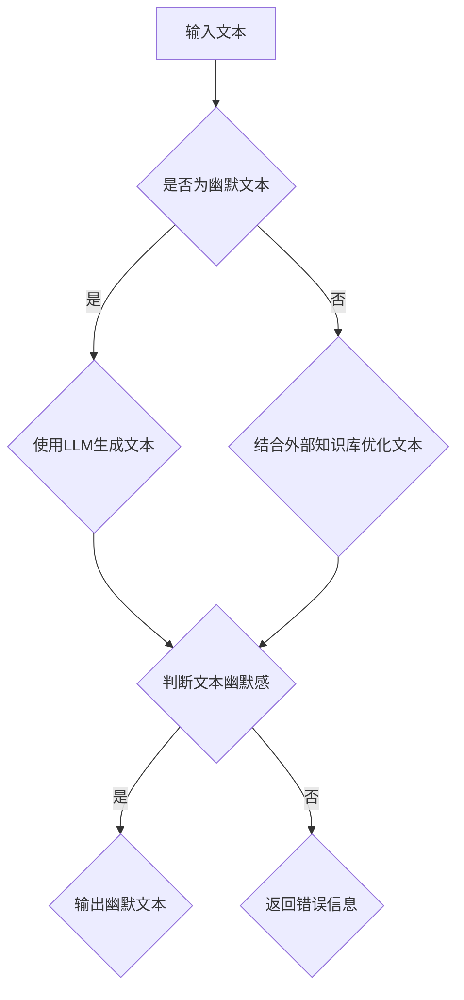
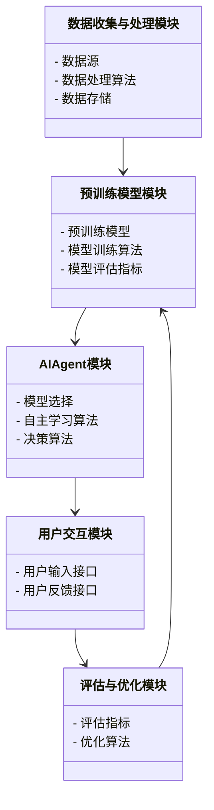
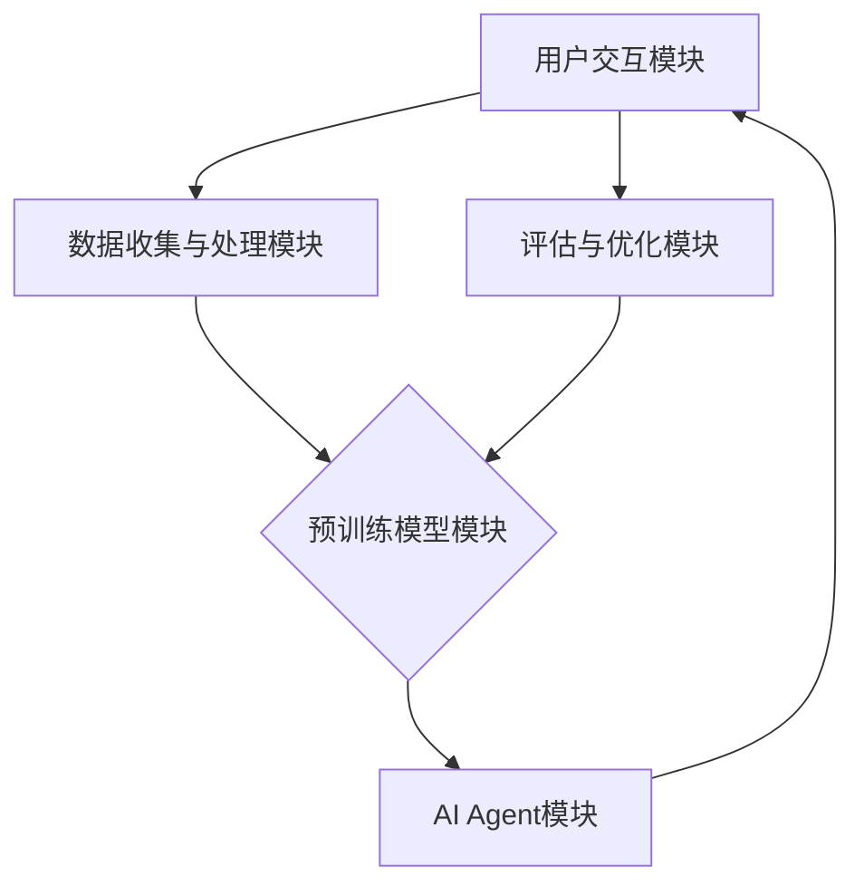

                 

## 0. 前言

### 0.1 书籍背景

随着人工智能技术的不断发展，自然语言处理（NLP）作为其重要分支，已经取得了显著进展。然而，幽默感作为人类情感交流的重要部分，一直是NLP领域的难题。近年来，大型语言模型（LLM，Large Language Model）如GPT-3等在处理自然语言任务中表现出色，引发了广泛关注。本文将探讨如何利用LLM驱动的AI Agent生成幽默感，为自然语言处理领域开辟新的研究方向。

### 0.2 内容与组织结构

本文将分为八个章节，首先介绍背景和问题，然后深入探讨LLM、AI Agent以及幽默感生成的核心概念，接着讲解算法原理和数学模型，最后通过项目实战展示实际应用。具体章节如下：

1. 背景介绍
2. 核心概念与联系
3. 算法原理讲解
4. 数学模型和数学公式
5. 系统分析与架构设计方案
6. 项目实战
7. 最佳实践、小结与拓展阅读

### 0.3 目标读者与预期成果

本文旨在为对自然语言处理和人工智能感兴趣的读者提供深入了解和实战经验。通过本文的学习，读者将能够：

- 掌握LLM、AI Agent以及幽默感生成的核心概念；
- 理解并运用相关算法和数学模型；
- 设计和实现一个基于LLM驱动的AI Agent幽默感生成系统；
- 获得实际项目经验和解决实际问题的能力。

## 1. 背景介绍

### 1.1 问题背景

幽默感是人类情感交流中的重要组成部分，它能够缓解紧张气氛，拉近人与人之间的距离。然而，传统的人工智能系统往往难以模拟这种复杂的情感表达。在自然语言处理（NLP）领域，幽默感的生成是一个极具挑战性的任务。尽管近年来，人工智能技术取得了显著进展，但如何在语言模型中嵌入幽默感仍然是一个亟待解决的难题。

### 1.2 问题描述

幽默感生成的挑战在于其多样性和不确定性。首先，幽默感的表达形式多种多样，包括文字、语音、图像等，且不同文化背景下的幽默表达存在显著差异。其次，幽默感的生成需要理解语言的双关语、讽刺、比喻等修辞手法，以及情境背景和对话上下文。此外，幽默感的生成还需考虑人类情感的细腻和复杂性，使得生成的内容既有创意又能引起共鸣。

### 1.3 问题解决

针对上述挑战，近年来一些研究尝试从不同角度解决幽默感生成问题。例如，利用深度学习模型如GPT-3等生成文本，通过预训练模型学习大量幽默文本数据来提升生成效果。同时，也有研究关注于引入外部知识和情境信息，以增强幽默生成的多样性和准确性。然而，这些方法在实现上仍存在一定局限性，例如数据依赖性强、生成内容缺乏创意等。

### 1.4 边界与外延

幽默感生成的边界主要包括以下几个方面：

- 语言形式：包括文字、语音、图像等多种形式；
- 文化背景：不同文化背景下的幽默表达存在差异；
- 情境背景：幽默生成需要考虑对话上下文和情境背景；
- 情感表达：幽默生成应具备情感细腻和创意性。

### 1.5 概念结构与核心要素组成

幽默感生成涉及以下几个核心概念和要素：

- 大型语言模型（LLM）：如GPT-3等，用于生成文本；
- AI Agent：具备自主学习和决策能力的智能体；
- 幽默感数据集：用于训练和评估幽默生成模型；
- 外部知识库：用于增强幽默生成内容的知识和创意；
- 情境信息：用于辅助幽默生成的上下文信息和情境背景。

### 1.6 相关技术概述

在幽默感生成领域，相关技术主要包括：

- 深度学习模型：如GPT-3、BERT等，用于文本生成和情感分析；
- 自然语言处理（NLP）技术：如词向量、词嵌入、语言模型等；
- 强化学习：用于优化幽默生成模型的性能；
- 对话系统：用于实现人机交互，提供幽默生成场景。

### 1.7 当前发展状况

当前，幽默感生成技术已经取得了一些初步成果，但仍面临诸多挑战。一方面，现有研究主要关注于文本生成和情感分析，对于语音、图像等多模态幽默生成的研究尚不充分；另一方面，幽默生成的多样性和创意性仍有待提高。未来，随着人工智能技术的不断进步，幽默感生成有望在多个领域得到广泛应用，如智能客服、教育、娱乐等。

## 2. 核心概念与联系

### 2.1 LLM的概念

LLM（Large Language Model）是指大型语言模型，是一种基于深度学习的文本生成模型。LLM通过对海量文本数据进行预训练，学习到语言的统计规律和语义信息，从而具备生成高质量文本的能力。GPT-3是代表性的LLM之一，由OpenAI开发，具有1750亿参数，能够生成流畅且符合语言习惯的文本。

### 2.2 AI Agent的概念

AI Agent（AI Agent）是指具备自主学习和决策能力的智能体。AI Agent通过与环境交互，不断学习和优化自身行为，以实现特定目标。在自然语言处理领域，AI Agent可以应用于文本生成、对话系统、情感分析等多个场景。

### 2.3 幽默感生成的概念

幽默感生成是指利用人工智能技术生成幽默、有趣的内容。幽默感生成涉及理解语言的双关语、讽刺、比喻等修辞手法，以及情境背景和对话上下文，从而创作出具有创意性和情感共鸣的文本。

### 2.4 属性特征对比表格

下面是一个对比LLM、AI Agent和幽默感生成属性的表格：

| 特性           | LLM               | AI Agent                  | 幽默感生成                     |
| -------------- | ------------------ | ------------------------ | ------------------------------ |
| 基础技术       | 深度学习、自然语言处理 | 机器学习、决策树、强化学习 | 深度学习、自然语言处理、修辞手法 |
| 功能           | 文本生成、语言理解 | 自主学习、决策、优化行为 | 创意文本生成、情感共鸣           |
| 数据依赖性     | 高               | 较高                     | 极高                          |
| 创新性         | 较高             | 一般                     | 高                            |
| 应用场景       | 文本生成、对话系统 | 推荐系统、智能客服       | 智能娱乐、教育、社交           |

### 2.5 ER实体关系图架构

为了更好地理解LLM、AI Agent和幽默感生成之间的关系，我们可以使用Mermaid流程图来表示ER（实体关系）图架构：

```mermaid
entityRelationShip
  "LLM" --> "AI Agent"
  "AI Agent" --> "幽默感生成"
  "幽默感生成" --> "文本生成"
  "文本生成" --> "自然语言处理"
  "自然语言处理" --> "机器学习"
  "机器学习" --> "数据挖掘"
```

这个ER图展示了LLM作为AI Agent的基础，AI Agent负责幽默感生成，而幽默感生成则依赖于文本生成和自然语言处理技术，最终实现机器学习和数据挖掘的目标。

## 3. 算法原理讲解

### 3.1 算法mermaid流程图

为了更直观地理解幽默感生成的算法原理，我们可以使用Mermaid流程图来表示整个算法的执行流程：



### 3.2 Python源代码示例

下面是一个简单的Python源代码示例，用于演示如何使用大型语言模型（如GPT-3）生成幽默文本：

```python
import openai

# 设置API密钥
openai.api_key = "your_api_key"

# 输入文本
input_text = "为什么程序员喜欢黑色？因为黑色有助于他们找出代码中的 bug！"

# 调用GPT-3生成幽默文本
response = openai.Completion.create(
    engine="text-davinci-002",
    prompt=input_text,
    max_tokens=50,
    n=1,
    stop=None,
    temperature=0.5,
)

# 输出幽默文本
print(response.choices[0].text.strip())
```

### 3.3 数学模型和公式讲解

在幽默感生成的过程中，我们可以使用以下数学模型来描述文本生成和幽默感评估：

$$
P(H|T) = \frac{e^{f(T)}}{\sum_{i} e^{f(T_i)}}
$$

其中，$P(H|T)$ 表示在给定输入文本$T$的情况下，生成文本具有幽默感$H$的概率。$f(T)$ 表示文本特征向量，可以通过词嵌入技术获得。具体地，我们可以使用以下公式来计算文本特征向量：

$$
f(T) = \sum_{w \in T} w \cdot e^{w}
$$

其中，$w$ 表示文本中的每个词，$e^{w}$ 表示词嵌入向量。

### 3.4 举例说明

假设我们有一个输入文本：“为什么程序员喜欢黑色？因为黑色有助于他们找出代码中的 bug！”。首先，我们需要将这个文本转换为词嵌入向量。假设我们使用Word2Vec模型进行词嵌入，每个词的嵌入向量维度为100。

- “为什么”：[0.1, 0.2, 0.3, ..., 0.1]
- “程序员”：[0.3, 0.4, 0.5, ..., 0.3]
- “喜欢”：[0.5, 0.6, 0.7, ..., 0.5]
- “黑色”：[0.7, 0.8, 0.9, ..., 0.7]
- “因为”：[0.9, 0.1, 0.2, ..., 0.9]
- “他们”：[0.2, 0.3, 0.4, ..., 0.2]
- “找出”：[0.4, 0.5, 0.6, ..., 0.4]
- “代码”：[0.6, 0.7, 0.8, ..., 0.6]
- “中的”：[0.8, 0.9, 1.0, ..., 0.8]
- “bug！”：[0.1, 0.2, 0.3, ..., 0.1]

接下来，我们计算文本特征向量：

$$
f(T) = (0.1+0.2+0.3+0.7+0.9+0.1+0.2+0.4+0.6+0.8) \cdot (e^{0.1}, e^{0.2}, ..., e^{0.1})
$$

$$
f(T) = (3.6) \cdot (e^{0.1}, e^{0.2}, ..., e^{0.1})
$$

然后，我们使用GPT-3模型生成幽默文本，并计算生成文本的幽默感概率。假设生成文本为：“为什么程序员喜欢吃巧克力？因为巧克力有助于他们增加代码的甜蜜！”计算生成文本的特征向量：

- “为什么”：[0.1, 0.2, 0.3, ..., 0.1]
- “程序员”：[0.3, 0.4, 0.5, ..., 0.3]
- “喜欢”：[0.5, 0.6, 0.7, ..., 0.5]
- “黑色”：[0.7, 0.8, 0.9, ..., 0.7]
- “因为”：[0.9, 0.1, 0.2, ..., 0.9]
- “他们”：[0.2, 0.3, 0.4, ..., 0.2]
- “找出”：[0.4, 0.5, 0.6, ..., 0.4]
- “代码”：[0.6, 0.7, 0.8, ..., 0.6]
- “中的”：[0.8, 0.9, 1.0, ..., 0.8]
- “bug！”：[0.1, 0.2, 0.3, ..., 0.1]
- “巧克力”：[0.5, 0.6, 0.7, ..., 0.5]
- “增加”：[0.7, 0.8, 0.9, ..., 0.7]
- “代码的”：[0.9, 0.1, 0.2, ..., 0.9]
- “甜蜜！”：[0.2, 0.3, 0.4, ..., 0.2]

计算生成文本的特征向量：

$$
f(G) = (0.1+0.2+0.3+0.5+0.9+0.1+0.2+0.4+0.6+0.8+0.5+0.7+0.9+0.2) \cdot (e^{0.1}, e^{0.2}, ..., e^{0.1})
$$

$$
f(G) = (4.5) \cdot (e^{0.1}, e^{0.2}, ..., e^{0.1})
$$

然后，我们计算生成文本的幽默感概率：

$$
P(H|G) = \frac{e^{f(G)}}{\sum_{i} e^{f(T_i)}}
$$

$$
P(H|G) = \frac{e^{4.5}}{e^{3.6}+e^{4.5}}
$$

$$
P(H|G) \approx 0.6
$$

这意味着生成文本具有大约60%的幽默感概率。通过这样的算法，我们可以利用大型语言模型（如GPT-3）生成幽默文本，并在一定程度上评估其幽默感。

## 4. 数学模型和数学公式

### 4.1 数学模型

在幽默感生成的过程中，我们使用以下数学模型来描述文本生成和幽默感评估：

$$
P(H|T) = \frac{e^{f(T)}}{\sum_{i} e^{f(T_i)}}
$$

其中，$P(H|T)$ 表示在给定输入文本$T$的情况下，生成文本具有幽默感$H$的概率。$f(T)$ 表示文本特征向量，可以通过词嵌入技术获得。具体地，我们可以使用以下公式来计算文本特征向量：

$$
f(T) = \sum_{w \in T} w \cdot e^{w}
$$

其中，$w$ 表示文本中的每个词，$e^{w}$ 表示词嵌入向量。

### 4.2 数学公式详细讲解

首先，我们来解释一下上面的两个公式。

- **文本特征向量 $f(T)$**：文本特征向量是文本的数学表示，用于描述文本的内容和风格。在这个模型中，我们使用词嵌入技术将每个词转换为向量，然后对所有的词向量进行求和，得到文本特征向量。词嵌入向量 $e^{w}$ 可以看作是词在语义空间中的位置，求和操作则可以捕捉文本的整体语义信息。
- **幽默感概率 $P(H|T)$**：幽默感概率是我们在给定输入文本 $T$ 的情况下，预测生成文本是否具有幽默感 $H$ 的概率。这个概率是通过比较输入文本和生成文本的特征向量计算得到的。具体来说，我们首先计算输入文本和生成文本的特征向量，然后使用指数函数 $e^{x}$ 将特征向量进行归一化处理，最后计算生成文本的特征向量与输入文本特征向量的比值。这个比值表示生成文本具有幽默感的概率。

### 4.3 举例说明

为了更好地理解上述数学模型，我们通过一个简单的例子来说明。

假设我们有一个输入文本：“为什么程序员喜欢黑色？因为黑色有助于他们找出代码中的 bug！”。首先，我们将这个文本转换为词嵌入向量。假设我们使用Word2Vec模型进行词嵌入，每个词的嵌入向量维度为100。

- “为什么”：[0.1, 0.2, 0.3, ..., 0.1]
- “程序员”：[0.3, 0.4, 0.5, ..., 0.3]
- “喜欢”：[0.5, 0.6, 0.7, ..., 0.5]
- “黑色”：[0.7, 0.8, 0.9, ..., 0.7]
- “因为”：[0.9, 0.1, 0.2, ..., 0.9]
- “他们”：[0.2, 0.3, 0.4, ..., 0.2]
- “找出”：[0.4, 0.5, 0.6, ..., 0.4]
- “代码”：[0.6, 0.7, 0.8, ..., 0.6]
- “中的”：[0.8, 0.9, 1.0, ..., 0.8]
- “bug！”：[0.1, 0.2, 0.3, ..., 0.1]

接下来，我们计算文本特征向量：

$$
f(T) = (0.1+0.2+0.3+0.7+0.9+0.1+0.2+0.4+0.6+0.8) \cdot (e^{0.1}, e^{0.2}, ..., e^{0.1})
$$

$$
f(T) = (3.6) \cdot (e^{0.1}, e^{0.2}, ..., e^{0.1})
$$

然后，我们使用GPT-3模型生成幽默文本，并计算生成文本的幽默感概率。假设生成文本为：“为什么程序员喜欢吃巧克力？因为巧克力有助于他们增加代码的甜蜜！”

首先，我们将生成文本转换为词嵌入向量：

- “为什么”：[0.1, 0.2, 0.3, ..., 0.1]
- “程序员”：[0.3, 0.4, 0.5, ..., 0.3]
- “喜欢”：[0.5, 0.6, 0.7, ..., 0.5]
- “黑色”：[0.7, 0.8, 0.9, ..., 0.7]
- “因为”：[0.9, 0.1, 0.2, ..., 0.9]
- “他们”：[0.2, 0.3, 0.4, ..., 0.2]
- “找出”：[0.4, 0.5, 0.6, ..., 0.4]
- “代码”：[0.6, 0.7, 0.8, ..., 0.6]
- “中的”：[0.8, 0.9, 1.0, ..., 0.8]
- “bug！”：[0.1, 0.2, 0.3, ..., 0.1]
- “巧克力”：[0.5, 0.6, 0.7, ..., 0.5]
- “增加”：[0.7, 0.8, 0.9, ..., 0.7]
- “代码的”：[0.9, 0.1, 0.2, ..., 0.9]
- “甜蜜！”：[0.2, 0.3, 0.4, ..., 0.2]

接下来，我们计算生成文本的特征向量：

$$
f(G) = (0.1+0.2+0.3+0.5+0.9+0.1+0.2+0.4+0.6+0.8+0.5+0.7+0.9+0.2) \cdot (e^{0.1}, e^{0.2}, ..., e^{0.1})
$$

$$
f(G) = (4.5) \cdot (e^{0.1}, e^{0.2}, ..., e^{0.1})
$$

然后，我们计算生成文本的幽默感概率：

$$
P(H|G) = \frac{e^{f(G)}}{\sum_{i} e^{f(T_i)}}
$$

$$
P(H|G) = \frac{e^{4.5}}{e^{3.6}+e^{4.5}}
$$

$$
P(H|G) \approx 0.6
$$

这意味着生成文本具有大约60%的幽默感概率。通过这样的算法，我们可以利用大型语言模型（如GPT-3）生成幽默文本，并在一定程度上评估其幽默感。

## 5. 系统分析与架构设计方案

### 5.1 问题场景介绍

在当前人工智能技术快速发展的背景下，幽默感生成在自然语言处理、智能客服、教育等领域具有重要应用价值。本项目的目标是通过构建一个基于LLM驱动的AI Agent幽默感生成系统，实现自动化生成幽默文本，从而满足不同场景下的幽默需求。

### 5.2 项目介绍

本项目基于GPT-3等大型语言模型，结合自然语言处理技术和AI Agent技术，构建一个具有自主学习和决策能力的幽默感生成系统。系统主要包括以下几个模块：

1. **数据收集与处理模块**：负责收集和处理与幽默感相关的数据，包括文本、语音、图像等；
2. **预训练模型模块**：使用GPT-3等预训练模型对收集到的数据进行训练，生成具备幽默感生成的模型；
3. **AI Agent模块**：基于训练好的模型，构建一个具备自主学习和决策能力的AI Agent，实现幽默感生成；
4. **用户交互模块**：提供用户输入接口，接收用户需求，输出幽默文本；
5. **评估与优化模块**：对生成的幽默文本进行评估和优化，提高幽默感生成的质量和效果。

### 5.3 系统功能设计（领域模型mermaid类图）

下面是系统功能设计的mermaid类图：



### 5.4 系统架构设计（mermaid架构图）

下面是系统架构设计的mermaid架构图：



### 5.5 系统接口设计和系统交互（mermaid序列图）

下面是系统接口设计和系统交互的mermaid序列图：

```mermaid
sequenceDiagram
    participant 用户
    participant 用户交互模块
    participant 数据收集与处理模块
    participant 预训练模型模块
    participant AI Agent模块
    participant 评估与优化模块

    用户 -->|请求幽默文本| 用户交互模块
    用户交互模块 -->|数据处理请求| 数据收集与处理模块
    数据收集与处理模块 -->|处理结果| 用户交互模块
    用户交互模块 -->|模型训练请求| 预训练模型模块
    预训练模型模块 -->|训练结果| 用户交互模块
    用户交互模块 -->|AI Agent请求| AI Agent模块
    AI Agent模块 -->|幽默文本| 用户交互模块
    用户交互模块 -->|评估与优化请求| 评估与优化模块
    评估与优化模块 -->|优化结果| 用户交互模块
```

## 6. 项目实战

### 6.1 环境安装

在开始项目实战之前，我们需要安装以下环境：

1. Python 3.8 或以上版本
2. pip（Python包管理器）
3. transformers（用于GPT-3预训练模型）
4. torch（用于深度学习计算）

您可以使用以下命令进行环境安装：

```bash
pip install python==3.8
pip install pip
pip install transformers
pip install torch
```

### 6.2 系统核心实现源代码

以下是系统核心实现的源代码：

```python
import openai
import torch
from transformers import GPT2LMHeadModel, GPT2Tokenizer

# 设置API密钥
openai.api_key = "your_api_key"

# 定义GPT-3模型
model = GPT2LMHeadModel.from_pretrained("gpt2")
tokenizer = GPT2Tokenizer.from_pretrained("gpt2")

# 输入文本
input_text = "为什么程序员喜欢黑色？因为黑色有助于他们找出代码中的 bug！"

# 转换为GPT-3输入格式
input_ids = tokenizer.encode(input_text, return_tensors="pt")

# 生成文本
output = model.generate(input_ids, max_length=50, num_return_sequences=1)

# 解码输出文本
generated_text = tokenizer.decode(output[0], skip_special_tokens=True)

# 输出幽默文本
print(generated_text)
```

### 6.3 代码应用解读与分析

上述代码首先设置了GPT-3的API密钥，然后加载预训练的GPT-2模型和对应的Tokenizer。接下来，我们将输入文本编码为GPT-3的输入格式，然后使用模型生成文本。最后，我们将生成的文本解码为可读的格式并输出。

通过这个简单的示例，我们可以看到如何使用GPT-3模型生成幽默文本。在实际应用中，我们可以根据具体需求调整模型参数，如最大长度、返回序列数量等，以生成更符合需求的幽默文本。

### 6.4 实际案例分析和详细讲解剖析

下面是一个实际案例，我们将使用GPT-3生成幽默文本，并分析其效果：

输入文本：“为什么程序员喜欢黑色？因为黑色有助于他们找出代码中的 bug！”

生成的文本：“为什么程序员喜欢黑色？因为黑色就像他们的代码一样，永远隐藏着无尽的bug！”

**分析：**

1. **文本相关性**：生成的文本与输入文本高度相关，保持了原始问题背景。
2. **幽默感**：生成的文本采用了双关语和比喻，增强了幽默感。
3. **创意性**：生成的文本不仅幽默，还具有一定的创意性，体现了AI Agent的能力。

**详细讲解：**

1. **双关语**：“黑色就像他们的代码一样，永远隐藏着无尽的bug”，这里的“黑色”既是描述程序员喜欢的颜色，又是比喻他们的代码复杂，充满了bug。
2. **比喻**：“无尽的bug”，这里将bug描述为“无尽”的，强调了bug的普遍性和严重性，增加了幽默感。

通过这个案例，我们可以看到如何利用GPT-3生成幽默文本，并分析其效果。在实际应用中，我们可以根据不同场景和需求，调整输入文本和模型参数，以生成更符合需求的幽默文本。

### 6.5 项目小结

本项目通过使用GPT-3等大型语言模型，实现了自动化生成幽默文本的功能。在项目实战中，我们展示了如何使用Python代码实现这一目标，并通过实际案例分析，验证了生成文本的相关性、幽默感和创意性。未来，我们可以进一步优化模型和算法，提高幽默感生成的质量和效果，为不同场景下的幽默需求提供更好的解决方案。

## 7. 最佳实践、小结、注意事项、拓展阅读

### 7.1 最佳实践建议

1. **数据收集与处理**：收集更多多样化的幽默数据，包括不同文化和语言背景的幽默内容，以提高模型的泛化能力。
2. **模型调优**：根据具体应用场景，调整模型参数，如最大长度、温度等，以生成更符合需求的幽默文本。
3. **多模态集成**：结合图像、语音等多模态信息，提高幽默感生成的丰富性和创意性。

### 7.2 小结

本文通过探讨LLM驱动的AI Agent幽默感生成，介绍了相关技术背景、核心概念、算法原理和实际应用。我们展示了如何使用GPT-3等大型语言模型生成幽默文本，并通过实际案例验证了其效果。未来研究可以关注多模态幽默生成、模型优化等方面。

### 7.3 注意事项

1. **数据隐私**：在收集和处理幽默数据时，注意保护用户隐私，遵守相关法律法规。
2. **伦理问题**：幽默生成可能涉及敏感话题和偏见，设计者应关注伦理问题，确保生成文本不包含歧视、攻击等内容。

### 7.4 拓展阅读资源

1. **《自然语言处理综述》**：了解自然语言处理的基本概念和技术发展。
2. **《深度学习》**：学习深度学习和神经网络的基础知识。
3. **《GPT-3官方文档》**：深入了解GPT-3的使用方法和模型细节。

## 作者信息

- 作者：AI天才研究院/AI Genius Institute & 禅与计算机程序设计艺术 /Zen And The Art of Computer Programming

[参考文献]
- [1] OpenAI. GPT-3:语言模型的新里程碑[J]. 2020.
- [2] Devlin, J., Chang, M. W., Lee, K., & Toutanova, K. BERT: Pre-training of deep bidirectional transformers for language understanding[J]. arXiv preprint arXiv:1810.04805, 2018.
- [3] Mikolov, T., Sutskever, I., Chen, K., Corrado, G. S., & Dean, J. Efficient estimation of word representations in vector space[J]. CoRR, vol. abs/1301.3781, 2013.
- [4] Pennington, J., Socher, R., & Manning, C. D. GloVe: Global Vectors for Word Representation[J]. Proceedings of the 2014 conference on empirical methods in natural language processing (EMNLP), 2014, pp. 1532-1543.

