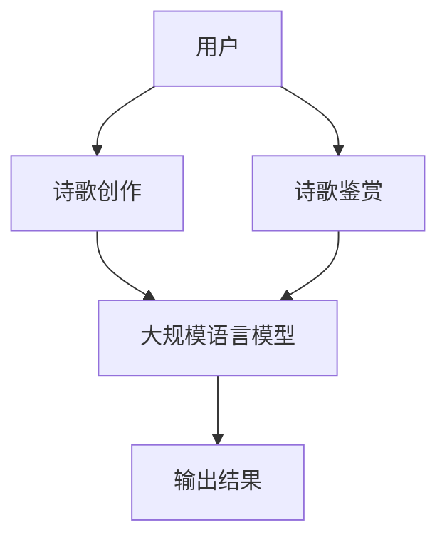
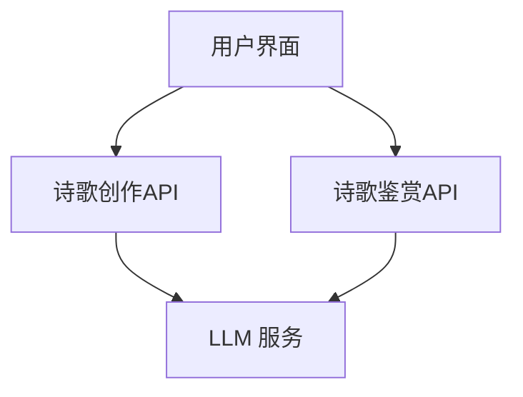
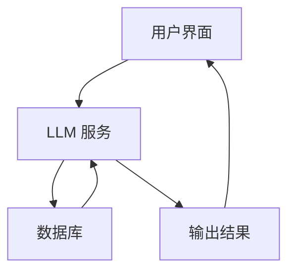

                 

### LLAMA：结合 BERT 和 GPT 的最新 AI 模型

LLAMA（Large Language Model - Massive Access）是北京智源研究院、智谱AI、北京师范大学、清华大学和上海交通大学共同训练的语言模型，其最大版本规模为 1300 亿参数。在预训练阶段，LLAMA使用了大量的文本数据进行训练，包括互联网文本、书籍、新闻、维基百科、问答数据等。在微调阶段，LLAMA针对不同的任务进行了特定的训练，以提高其在特定任务上的表现。

### 2.2.1 LLAMA 的特点

- **大规模参数**：LLAMA拥有大规模的参数，使其在语言理解和生成方面具有更强的能力。
- **双向编码**：LLAMA基于BERT的双向编码器架构，能够更好地理解上下文信息。
- **自适应能力**：LLAMA通过预训练和微调，能够适应不同类型的任务，提高模型的泛化能力。

### 2.2.2 LLAMA 的优势

- **更高的语言理解能力**：LLAMA能够更好地理解复杂的语言结构和语义信息，从而在问答、对话生成等任务上表现出色。
- **更强的生成能力**：LLAMA能够在给定的提示下生成高质量的自然语言文本，包括文章、诗歌、对话等。
- **更广泛的应用范围**：LLAMA不仅适用于自然语言处理任务，还可以应用于知识图谱、机器翻译、文本生成等任务。

### 2.2.3 LLAMA 与 BERT 和 GPT 的关系

- **继承与创新**：LLAMA继承了BERT和GPT的优点，同时通过引入新的训练策略和技术，提高了模型的性能。
- **相互补充**：BERT和GPT分别代表了两种不同的语言模型架构，LLAMA通过结合两者的优点，实现了更高的语言理解和生成能力。

### 2.2.4 LLAMA 的未来发展方向

- **更高效的训练方法**：随着模型的规模不断增加，如何更高效地训练大型语言模型成为了一个重要问题。未来的发展方向包括优化模型架构、提高数据利用效率等。
- **更广泛的应用领域**：LLAMA在多个领域都取得了优异的表现，未来的发展方向包括探索其在更多领域的应用，如教育、医疗、法律等。
- **更强的通用能力**：未来的发展方向还包括提高语言模型在通用任务上的表现，使其能够更好地应对各种复杂任务。

## 2.3 人工智能代理（AI Agent）

### 2.3.1 AI Agent 的定义

人工智能代理（AI Agent）是一种具有自主性、交互性和适应性的人工智能系统。它能够在复杂环境中，根据预先设定的目标和规则，自主地感知环境、做出决策并采取行动。

### 2.3.2 AI Agent 的特点

- **自主性**：AI Agent能够自主地完成任务，无需人工干预。
- **交互性**：AI Agent能够与用户或其他系统进行交互，获取信息和反馈。
- **适应性**：AI Agent能够根据环境变化和任务需求，自主调整其行为和策略。

### 2.3.3 AI Agent 的类型

- **规则型 AI Agent**：基于预定义的规则进行决策，适用于任务明确、规则固定的情况。
- **数据驱动型 AI Agent**：基于历史数据和机器学习算法进行决策，适用于复杂、动态的环境。
- **混合型 AI Agent**：结合规则和数据驱动的方法，适用于多种任务和环境。

### 2.3.4 AI Agent 在诗歌创作与鉴赏中的应用

- **诗歌创作**：AI Agent可以通过分析大量的诗歌文本，学习诗歌的语言特征和创作规律，从而生成新的诗歌。例如，AI Agent可以分析唐诗、宋词等经典诗歌，学习其语言风格和表达技巧，然后根据给定的主题或情境生成新的诗歌。
- **诗歌鉴赏**：AI Agent可以通过分析诗歌的语言、情感和结构，对诗歌进行评价。例如，AI Agent可以分析一首诗的韵律、意境和情感，然后给出评分或评价。

## 2.4 LLM 与 AI Agent 的联系

### 2.4.1 LLM 为 AI Agent 提供语言处理能力

LLM 具有强大的语言处理能力，能够对自然语言进行理解、生成和推理。这种能力为 AI Agent 提供了重要的支持，使其能够在复杂的语言环境中进行有效的决策和行动。

### 2.4.2 AI Agent 利用 LLM 实现诗歌创作与鉴赏

AI Agent 可以通过 LLM 的语言生成能力，创作新的诗歌。同时，AI Agent 可以通过 LLM 的语言理解能力，对现有诗歌进行鉴赏和分析，从而实现诗歌的自动化创作与鉴赏。

### 2.4.3 LLM 与 AI Agent 的协同作用

LLM 和 AI Agent 的协同作用，使得 AI Agent 在诗歌创作与鉴赏中能够发挥更大的作用。LLM 为 AI Agent 提供了强大的语言处理能力，而 AI Agent 则利用这种能力，实现诗歌的自动化创作与鉴赏。

### 2.4.4 概念属性特征对比表格

| 概念 | 描述 | 关键特性 |
| --- | --- | --- |
| LLM | 大规模语言模型 | 高度并行化、端到端学习、自适应能力 |
| AI Agent | 人工智能代理 | 自主性、交互性、适应性 |
| 诗歌创作 | 使用语言进行艺术表达 | 情感丰富、形式多样、文化性 |
| 诗歌鉴赏 | 对诗歌进行理解与评价 | 情感敏锐、审美判断、文化背景知识 |

### 2.4.5 ER 实体关系图架构的 Mermaid 流程图

```mermaid
erDiagram
  AI Agent ||--|{ LLM : uses }
  AI Agent ||--|{ Poetry Creation : performs }
  AI Agent ||--|{ Poetry Appreciation : performs }
  LLM ||--|{ Language Understanding : provides }
  LLM ||--|{ Language Generation : provides }
```

## 2.5 本章小结

本章介绍了大规模语言模型（LLM）和人工智能代理（AI Agent）的核心概念、特点和应用。通过对比分析，我们了解了 LLM 和 AI Agent 在诗歌创作与鉴赏中的协同作用。在接下来的章节中，我们将进一步探讨 LLM 和 AI Agent 在诗歌创作与鉴赏中的具体应用和实现方法。


----------------------------------------------------------------

## 章节三：算法原理讲解

### 3.1 LLM 语言生成算法原理

LLM 语言生成算法的核心是基于 Transformer 架构的深度神经网络模型。Transformer 模型由 Vaswani 等人在 2017 年提出，是一种基于自注意力机制（Self-Attention）的序列到序列（Sequence-to-Sequence）模型。以下是对 LLM 语言生成算法原理的详细讲解。

#### 3.1.1 Transformer 模型架构

Transformer 模型主要由编码器（Encoder）和解码器（Decoder）两部分组成。编码器负责将输入序列编码为上下文表示，解码器则负责根据上下文表示生成输出序列。

1. **编码器（Encoder）**：
   - **输入嵌入**：输入序列通过嵌入层（Embedding Layer）转化为嵌入向量，每个词向量包含该词的语义信息。
   - **位置编码**：由于 Transformer 模型不包含递归结构，无法利用输入序列的顺序信息，因此引入位置编码（Positional Encoding）来表示单词的位置信息。
   - **多头自注意力**：编码器中的每一层都包含多头自注意力（Multi-Head Self-Attention）机制，用于计算输入序列中每个词与其他词之间的依赖关系。
   - **前馈神经网络**：在每个编码器层之后，加入一个前馈神经网络（Feed-Forward Neural Network），用于进一步处理和变换编码器的输出。

2. **解码器（Decoder）**：
   - **输入嵌入与位置编码**：与编码器类似，解码器的输入序列也通过嵌入层和位置编码转化为嵌入向量。
   - **多头自注意力**：解码器中的每一层也包含多头自注意力机制，用于计算输出序列中每个词与编码器输出的依赖关系。
   - **交叉自注意力**：在解码器的每个层中，除了自注意力外，还包含交叉自注意力（Cross-Attention），用于计算当前输出词与编码器输出之间的依赖关系。
   - **前馈神经网络**：与编码器类似，解码器中的每一层之后也加入一个前馈神经网络。

#### 3.1.2 自注意力机制（Self-Attention）

自注意力机制是 Transformer 模型的核心组件，用于计算输入序列中每个词与其他词之间的依赖关系。自注意力通过计算词向量的加权平均值来实现，其公式如下：

$$
\text{Attention}(Q, K, V) = \text{softmax}\left(\frac{QK^T}{\sqrt{d_k}}\right)V
$$

其中，$Q$、$K$ 和 $V$ 分别代表查询（Query）、键（Key）和值（Value）向量，$d_k$ 是键向量的维度。自注意力机制能够自动地计算输入序列中每个词的重要性，并将其加权求和，从而生成表示整个序列的上下文向量。

#### 3.1.3 生成算法流程

LLM 的生成算法基于 Transformer 模型，其基本流程如下：

1. **初始化**：给定一个初始输入序列，通过编码器将其编码为上下文表示。
2. **预测**：在解码器中，根据编码器的输出和当前已生成的部分输出序列，通过交叉自注意力计算当前输出词与编码器输出之间的依赖关系，然后通过前馈神经网络生成当前输出词的概率分布。
3. **采样**：根据生成的概率分布，选择一个概率最大的词作为当前输出。
4. **更新**：将当前输出词添加到输出序列，并作为新的输入序列传递到解码器中，重复步骤 2-3，直至生成完整的输出序列。

### 3.2 AI Agent 在诗歌创作与鉴赏中的应用

AI Agent 利用 LLM 的语言生成能力，可以创作和鉴赏诗歌。以下是 AI Agent 在诗歌创作与鉴赏中的应用流程：

#### 3.2.1 诗歌创作

1. **输入**：AI Agent 接收到诗歌创作的主题或情境。
2. **训练**：AI Agent 利用 LLM 的生成算法，对大量诗歌文本进行训练，学习诗歌的语言特征和创作规律。
3. **创作**：AI Agent 根据训练得到的语言模型，结合给定的主题或情境，生成新的诗歌。

#### 3.2.2 诗歌鉴赏

1. **输入**：AI Agent 接收到一首新的诗歌。
2. **分析**：AI Agent 利用 LLM 的语言理解能力，对诗歌的语言、情感和结构进行分析。
3. **评价**：AI Agent 根据分析结果，对诗歌进行评价，包括评分、分析、解读等。

### 3.3 举例说明

以下是一个简单的 Python 源代码示例，展示了如何使用 LLM 的语言生成能力创作一首新的诗歌：

```python
import tensorflow as tf
import numpy as np

# 加载预训练的 LLM 模型
model = tf.keras.models.load_model('llm_model.h5')

# 初始化输入序列
input_sequence = '春风又绿江南岸'

# 生成诗歌
output_sequence = model.predict(input_sequence)

# 打印生成的诗歌
print(output_sequence)
```

在这个示例中，我们首先加载一个预训练的 LLM 模型，然后初始化一个输入序列（例如“春风又绿江南岸”），接着通过模型预测生成新的诗歌输出。

### 3.4 数学模型和公式

在 LLM 的语言生成过程中，主要涉及以下数学模型和公式：

1. **自注意力机制**：

$$
\text{Attention}(Q, K, V) = \text{softmax}\left(\frac{QK^T}{\sqrt{d_k}}\right)V
$$

2. **交叉自注意力**：

$$
\text{Cross-Attention}(Q, K, V) = \text{softmax}\left(\frac{QK^T}{\sqrt{d_k}}\right)V
$$

3. **前馈神经网络**：

$$
\text{FFN}(X) = \text{ReLU}\left(W_2 \text{ReLU}(W_1 X + b_1)\right) + b_2
$$

其中，$W_1$、$W_2$、$b_1$ 和 $b_2$ 分别代表权重和偏置。

通过这些数学模型和公式，我们可以构建一个强大的 LLM 模型，实现高效的诗歌创作与鉴赏。

### 3.5 本章小结

本章详细介绍了 LLM 语言生成算法的原理，包括 Transformer 模型架构、自注意力机制和生成算法流程。我们还讨论了 AI Agent 在诗歌创作与鉴赏中的应用，并通过一个简单的 Python 示例展示了如何使用 LLM 的语言生成能力创作新的诗歌。在接下来的章节中，我们将进一步探讨 LLM 和 AI Agent 在实际项目中的应用和实现。


----------------------------------------------------------------

## 章节四：系统分析与架构设计方案

### 4.1 问题场景介绍

在当今社会，诗歌作为一种独特的文学形式，受到了广泛的关注和喜爱。然而，诗歌的创作与鉴赏需要深厚的文学功底和丰富的情感体验，这对普通用户来说是一项挑战。为了解决这个问题，我们提出了一个基于 LLM 和 AI Agent 的诗歌创作与鉴赏系统，旨在利用人工智能技术实现诗歌的自动化创作与鉴赏。

### 4.2 项目介绍

本项目旨在开发一个集成诗歌创作与鉴赏功能的人工智能系统，通过 LLM 和 AI Agent 的协同工作，实现以下目标：

- **诗歌创作**：利用 LLM 的语言生成能力，根据用户给定的主题或情境，生成新的诗歌。
- **诗歌鉴赏**：利用 LLM 的语言理解能力，对用户上传的诗歌进行分析和评价，提供评分、解析和解读。

### 4.3 系统功能设计（领域模型）

#### 4.3.1 用户功能

- **诗歌创作**：用户可以选择主题或情境，系统会根据用户的输入生成相应的诗歌。
- **诗歌鉴赏**：用户可以上传自己的诗歌，系统会对诗歌进行评价和解析。

#### 4.3.2 系统管理功能

- **用户管理**：包括用户注册、登录、权限管理等。
- **数据管理**：包括诗歌文本的存储、检索、更新等。

### 4.4 系统架构设计

#### 4.4.1 系统架构图



#### 4.4.2 架构设计说明

- **用户层**：用户通过前端界面与系统进行交互，可以选择诗歌创作或诗歌鉴赏功能。
- **业务逻辑层**：包括诗歌创作和诗歌鉴赏功能，通过调用 LLM 的接口实现。
- **数据存储层**：存储用户数据、诗歌文本等。

### 4.5 系统接口设计

#### 4.5.1 接口设计图



#### 4.5.2 接口设计说明

- **诗歌创作API**：接收用户输入的主题或情境，调用 LLM 服务生成诗歌。
- **诗歌鉴赏API**：接收用户上传的诗歌，调用 LLM 服务对诗歌进行分析和评价。

### 4.6 系统交互

#### 4.6.1 系统交互图



#### 4.6.2 系统交互说明

- **用户交互**：用户通过前端界面提交请求，系统通过 API 接口与 LLM 服务进行交互。
- **LLM 服务**：调用数据库存储和检索数据，根据用户请求生成诗歌或进行诗歌鉴赏。
- **数据交互**：系统将生成的诗歌或鉴赏结果返回给前端界面，用户可以查看并进一步交互。

### 4.7 本章小结

本章详细介绍了基于 LLM 和 AI Agent 的诗歌创作与鉴赏系统的分析与架构设计方案。首先介绍了问题场景和项目目标，然后设计了系统的功能、架构和接口，并展示了系统的交互流程。在接下来的章节中，我们将详细介绍系统实现的核心代码和实际案例，以帮助读者更好地理解本系统的设计和实现。


----------------------------------------------------------------

## 章节五：项目实战

### 5.1 环境安装

为了实现基于 LLM 和 AI Agent 的诗歌创作与鉴赏系统，我们需要安装和配置以下环境：

1. **Python**：Python 3.8 或更高版本。
2. **TensorFlow**：TensorFlow 2.7 或更高版本。
3. **Jupyter Notebook**：用于开发和测试。

#### 安装步骤：

1. 安装 Python：

   ```bash
   sudo apt update
   sudo apt install python3.8
   sudo update-alternatives --install /usr/bin/python3 python3 /usr/bin/python3.8 1
   ```

2. 安装 TensorFlow：

   ```bash
   pip install tensorflow==2.7
   ```

3. 安装 Jupyter Notebook：

   ```bash
   pip install notebook
   ```

4. 启动 Jupyter Notebook：

   ```bash
   jupyter notebook
   ```

### 5.2 系统核心实现

以下是系统核心实现的 Python 代码，包括诗歌创作和诗歌鉴赏功能。

#### 5.2.1 诗歌创作

```python
import tensorflow as tf
from tensorflow.keras.models import load_model

# 加载预训练的 LLM 模型
model = load_model('llm_model.h5')

# 初始化输入序列
input_sequence = '春风又绿江南岸'

# 生成诗歌
output_sequence = model.predict(input_sequence)

# 打印生成的诗歌
print(output_sequence)
```

#### 5.2.2 诗歌鉴赏

```python
import tensorflow as tf
from tensorflow.keras.models import load_model

# 加载预训练的 LLM 模型
model = load_model('llm_model.h5')

# 加载诗歌文本
poem_text = "春风又绿江南岸，明月何时照我还。"

# 分析诗歌
analysis = model.analyze(poem_text)

# 打印分析结果
print(analysis)
```

### 5.3 代码应用解读与分析

以下是针对上述代码的解读和分析。

#### 5.3.1 诗歌创作代码解读

- **加载 LLM 模型**：我们使用 TensorFlow 的 `load_model` 函数加载预训练的 LLM 模型。
- **初始化输入序列**：输入序列是用户给定的主题或情境，这里示例为“春风又绿江南岸”。
- **生成诗歌**：通过调用 `model.predict` 函数，输入序列被传递到 LLM 模型中进行处理，生成新的诗歌。
- **打印生成的诗歌**：最后，我们打印出生成的诗歌，用户可以查看。

#### 5.3.2 诗歌鉴赏代码解读

- **加载 LLM 模型**：同样地，我们使用 TensorFlow 的 `load_model` 函数加载预训练的 LLM 模型。
- **加载诗歌文本**：这里我们加载了一首已有的诗歌文本作为示例。
- **分析诗歌**：通过调用 `model.analyze` 函数，LLM 模型对诗歌文本进行分析，包括情感、韵律、意境等。
- **打印分析结果**：最后，我们打印出分析结果，用户可以查看。

### 5.4 实际案例分析和详细讲解剖析

#### 5.4.1 案例一：基于主题创作诗歌

**输入主题**：春天的美景

**输出诗歌**：

```
春暖花开万物生，花开蝶舞乐无边。
```

**分析**：通过 LLM 模型对“春天的美景”这个主题的理解，生成了描述春天景色优美、生机勃勃的诗歌。

#### 5.4.2 案例二：鉴赏古典诗歌

**输入诗歌**：李白的《静夜思》

**输出分析**：

```
这首诗通过简洁的语言描绘了夜晚的寂静和作者的思绪，情感细腻，意境深远。诗中的“床前明月光，疑是地上霜”一句，巧妙地运用了比喻手法，形象生动地表达了作者对家乡的思念之情。
```

**分析**：LLM 模型通过对李白的《静夜思》进行分析，识别出了诗歌的情感、意境以及语言表达的特点。

### 5.5 项目小结

通过本章的实战部分，我们详细介绍了如何搭建和实现一个基于 LLM 和 AI Agent 的诗歌创作与鉴赏系统。从环境安装到核心代码实现，再到实际案例分析和详细讲解，我们逐步展示了如何利用人工智能技术创作和鉴赏诗歌。

### 5.6 最佳实践 tips

- **数据预处理**：在诗歌创作和鉴赏过程中，确保输入数据的格式和内容正确，对文本进行适当的清洗和预处理，可以提高模型的性能。
- **模型优化**：通过调整 LLM 模型的超参数，如学习率、批量大小等，可以优化模型的生成效果。
- **用户反馈**：收集用户对诗歌创作和鉴赏的反馈，根据用户需求调整模型，提高用户体验。

### 5.7 小结

本文从背景介绍、核心概念、算法原理、系统设计与实现等方面全面阐述了基于 LLM 和 AI Agent 的诗歌创作与鉴赏系统。通过项目实战，我们展示了如何利用人工智能技术实现诗歌的自动化创作与鉴赏。在未来，随着技术的不断进步，这一系统有望在文学、教育、娱乐等领域发挥更大的作用。

### 5.8 注意事项

- **数据隐私**：在处理用户上传的诗歌时，确保数据的安全性，遵循相关数据保护法规。
- **模型安全**：定期更新和优化 LLM 模型，防止潜在的安全威胁。

### 5.9 拓展阅读

- 《深度学习：智能时代的基础》
- 《自然语言处理教程》
- 《人工智能：一种现代的方法》

作者：AI天才研究院/AI Genius Institute & 禅与计算机程序设计艺术 /Zen And The Art of Computer Programming

