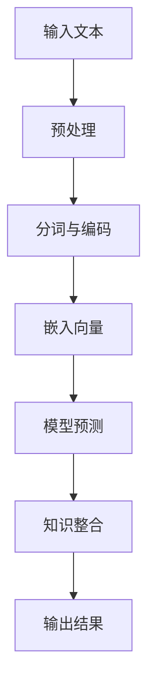
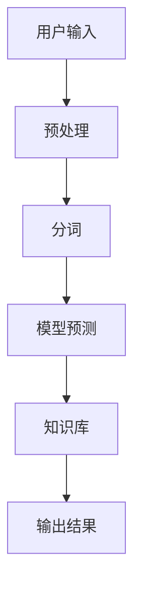
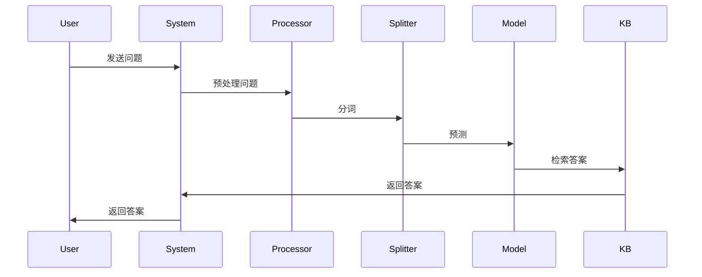

                 

### 文章标题：LLM驱动的AI Agent跨学科知识整合器

> 关键词：大型语言模型（LLM），AI Agent，跨学科知识整合，知识图谱，语义网络，算法原理，系统架构，项目实战

> 摘要：本文旨在探讨如何利用大型语言模型（LLM）构建一个能够跨学科整合知识的AI Agent。文章首先介绍了AI Agent和跨学科知识整合的背景和核心概念，然后详细讲解了LLM的基础原理和跨学科知识整合的原理。接着，文章介绍了算法原理与数学模型，并使用mermaid绘制了算法流程图和ER实体关系图。随后，文章阐述了系统分析与架构设计，包括问题场景介绍、系统功能设计、系统架构设计、系统接口设计和系统交互。最后，文章通过一个实际项目展示了如何实现LLM驱动的AI Agent跨学科知识整合，并提供了一些最佳实践和注意事项。

### 目录大纲

```markdown
# LLM驱动的AI Agent跨学科知识整合器

## 第一部分：背景介绍与核心概念

## 第1章：问题背景与核心概念

### 1.1 问题描述与解决方案

- AI Agent的定义与功能
- 跨学科知识整合的需求与挑战
- LLM在AI Agent中的作用

### 1.2 概念结构与核心要素

- AI Agent的核心组件
- 跨学科知识整合的架构
- LLM的应用场景与优势

### 1.3 边界与外延

- AI Agent在不同领域的应用范围
- 跨学科知识整合的局限性
- LLM技术的边界拓展

## 第2章：核心概念与原理

### 2.1 LLM基础原理

#### 2.1.1 语言模型的基本概念

- 语言模型的作用
- 语言模型的发展历程
- 语言模型的分类

#### 2.1.2 LLM的工作机制

- 深度学习在LLM中的应用
- 机器学习算法与优化
- LLM的训练过程与优化策略

### 2.2 跨学科知识整合原理

#### 2.2.1 知识图谱与语义网络

- 知识图谱的基本概念
- 语义网络的结构与功能
- 知识图谱在跨学科知识整合中的应用

#### 2.2.2 跨学科知识整合算法

- 知识融合与映射
- 知识抽取与表示
- 知识检索与推理

## 第二部分：算法原理讲解

## 第3章：算法原理与数学模型

### 3.1 算法流程图

- 使用Mermaid绘制算法流程图

### 3.2 数学模型与公式

- 使用LaTeX格式嵌入数学模型与公式

### 3.3 算法原理讲解

- 详细阐述算法原理，包括数学推导与步骤

### 3.4 举例说明

- 提供通俗易懂的举例说明算法的实际应用

## 第4章：系统分析与架构设计

### 4.1 问题场景介绍

- 阐述AI Agent在跨学科知识整合中的应用场景

### 4.2 系统功能设计

- 使用Mermaid绘制领域模型类图

### 4.3 系统架构设计

- 使用Mermaid绘制系统架构图

### 4.4 系统接口设计与交互

- 使用Mermaid绘制系统接口设计和系统交互序列图

## 第三部分：项目实战

## 第5章：环境安装与核心实现

### 5.1 环境安装步骤

- 阐述项目所需的软件与硬件环境安装步骤

### 5.2 系统核心实现源代码

- 提供系统核心实现的源代码

### 5.3 代码应用解读与分析

- 对源代码进行解读与分析，阐述关键实现细节

### 5.4 实际案例分析与详细讲解

- 分析实际案例，详细讲解AI Agent在跨学科知识整合中的应用

## 第6章：最佳实践与小结

### 6.1 最佳实践 tips

- 提供跨学科知识整合与LLM应用的实践技巧

### 6.2 小结

- 总结本书的主要内容和学习要点

### 6.3 注意事项

- 强调实践中需要注意的问题与风险

### 6.4 拓展阅读

- 推荐相关领域的拓展阅读资料

```

## 文章正文

### 第1章：问题背景与核心概念

#### 1.1 问题描述与解决方案

**AI Agent的定义与功能**

AI Agent，即人工智能代理，是指能够自主执行任务、具备智能决策能力的计算机程序。在人工智能领域，AI Agent被视为实现智能代理的关键技术之一。AI Agent具备以下几个核心功能：

1. **感知环境**：AI Agent能够感知其所处的环境，获取环境信息。
2. **决策制定**：基于感知到的环境信息，AI Agent能够自主制定行动策略。
3. **执行任务**：按照决策制定的策略，AI Agent能够执行具体的任务。
4. **学习与适应**：AI Agent能够通过学习环境信息，不断优化自身的决策策略。

**跨学科知识整合的需求与挑战**

随着信息技术的快速发展，各个领域之间的交叉融合越来越普遍。为了应对复杂的现实问题，单一学科的知识体系已经难以满足需求。跨学科知识整合成为当前研究的热点之一。跨学科知识整合的需求主要体现在以下几个方面：

1. **知识多样性**：跨学科整合需要处理来自不同领域的大量知识，这些知识具有多样性和复杂性。
2. **知识关联性**：跨学科整合需要识别和建立不同领域知识之间的关联性，以便更好地理解和应用这些知识。
3. **知识更新性**：知识整合系统需要具备实时更新知识的能力，以适应快速变化的知识环境。

然而，跨学科知识整合面临着诸多挑战：

1. **异构数据**：不同领域的知识通常以不同的数据格式和结构存在，这使得整合这些知识变得复杂。
2. **语义歧义**：跨学科知识整合中，相同的术语在不同领域中可能有不同的含义，导致语义歧义。
3. **数据冗余**：跨学科整合可能会产生大量冗余数据，影响系统的效率和性能。

**LLM在AI Agent中的作用**

为了解决上述问题，大型语言模型（LLM）被引入到AI Agent中。LLM是一种基于深度学习的语言处理模型，具有强大的语义理解和生成能力。在AI Agent中，LLM可以发挥以下作用：

1. **知识获取**：LLM能够自动从大量文本数据中提取有用知识，并将其转化为结构化数据。
2. **知识整合**：LLM能够处理不同领域的知识，识别并建立它们之间的关联性。
3. **智能问答**：LLM能够理解用户的问题，并从整合的知识库中提供准确的答案。
4. **自然语言生成**：LLM能够生成自然语言文本，用于解释AI Agent的决策过程和结果。

#### 1.2 概念结构与核心要素

**AI Agent的核心组件**

AI Agent的核心组件包括：

1. **感知模块**：用于感知环境信息，如文本、图像、声音等。
2. **决策模块**：基于感知模块获取的信息，通过算法生成行动策略。
3. **执行模块**：根据决策模块制定的策略执行任务。
4. **学习模块**：通过反馈和学习优化自身的决策和执行能力。

**跨学科知识整合的架构**

跨学科知识整合的架构通常包括以下几个层次：

1. **数据层**：存储来自不同领域的数据，包括文本、图像、表格等。
2. **模型层**：使用LLM等模型对数据进行处理和整合，建立知识关联性。
3. **知识层**：存储整合后的知识库，包括事实、规则和模型。
4. **应用层**：将知识库应用于实际问题解决，如智能问答、自然语言生成等。

**LLM的应用场景与优势**

LLM在AI Agent中的应用场景广泛，包括但不限于以下几个方面：

1. **智能客服**：使用LLM进行自然语言处理，提供高质量的智能客服服务。
2. **智能推荐**：基于用户行为和兴趣，利用LLM生成个性化推荐。
3. **智能写作**：利用LLM生成文章、报告、邮件等自然语言文本。
4. **智能翻译**：使用LLM进行跨语言的翻译，提高翻译质量和效率。

LLM的优势主要体现在以下几个方面：

1. **强大的语义理解**：LLM能够深入理解文本的语义，提供准确的答案和解释。
2. **自适应学习能力**：LLM能够从大量数据中自动学习，不断优化自身的性能。
3. **高效的知识整合**：LLM能够处理大量异构数据，快速建立知识关联性。
4. **灵活的应用场景**：LLM适用于各种自然语言处理任务，具有广泛的应用前景。

#### 1.3 边界与外延

**AI Agent在不同领域的应用范围**

AI Agent在各个领域的应用范围广泛，包括但不限于：

1. **金融领域**：用于智能投资、风险管理、信用评估等。
2. **医疗领域**：用于疾病诊断、医疗决策、患者管理等。
3. **教育领域**：用于智能教育、在线辅导、课程推荐等。
4. **工业领域**：用于自动化生产、设备维护、供应链管理等。

**跨学科知识整合的局限性**

尽管跨学科知识整合具有诸多优势，但也存在一定的局限性：

1. **数据质量**：知识整合的质量受到数据质量的影响，高质量的数据是知识整合的基础。
2. **知识深度**：跨学科知识整合可能无法深入挖掘特定领域的专业知识。
3. **语义歧义**：不同领域之间的术语可能存在语义歧义，影响知识整合的效果。

**LLM技术的边界拓展**

随着技术的不断发展，LLM技术的边界也在不断拓展。未来的发展方向包括：

1. **多模态处理**：结合图像、声音等多模态数据进行知识整合。
2. **弱监督学习**：减少对标注数据的依赖，提高知识整合的自动化程度。
3. **知识图谱增强**：结合知识图谱技术，提高知识整合的精度和效率。
4. **跨语言知识整合**：实现跨语言的知识整合，提高全球范围内的知识共享。

### 第2章：核心概念与原理

#### 2.1 LLM基础原理

##### 2.1.1 语言模型的基本概念

**语言模型的作用**

语言模型是自然语言处理（NLP）的核心技术之一，主要用于预测一段文本的下一个单词或字符。在AI Agent中，语言模型的作用包括：

1. **文本生成**：根据给定的文本输入，生成相关的文本输出。
2. **文本分类**：对输入的文本进行分类，如情感分析、主题分类等。
3. **命名实体识别**：识别文本中的命名实体，如人名、地名、组织名等。
4. **文本摘要**：将长文本生成简短的摘要，用于信息提取和快速阅读。

**语言模型的发展历程**

语言模型的发展可以分为三个阶段：

1. **统计模型**：早期语言模型主要基于统计方法，如n元语法（n-gram）和隐马尔可夫模型（HMM）。这些模型通过统计文本中单词或字符的共现关系来预测下一个单词或字符。
2. **规则模型**：基于规则的模型通过手动编写规则来处理自然语言，如词性标注、句法分析等。这些模型在特定任务上取得了较好的效果，但依赖于大量手动编写规则，难以扩展到更广泛的领域。
3. **深度学习模型**：近年来，基于深度学习的语言模型取得了显著突破，如循环神经网络（RNN）、长短期记忆网络（LSTM）和变换器（Transformer）。这些模型通过自动学习大量的语言特征，能够实现更高效、更准确的自然语言处理。

**语言模型的分类**

根据训练数据和模型结构，语言模型可以分为以下几类：

1. **监督学习模型**：使用带有标签的训练数据来训练模型，如n元语法和循环神经网络。
2. **无监督学习模型**：仅使用未标注的数据来训练模型，如自编码器和变分自编码器。
3. **半监督学习模型**：结合有标注和无标注的数据来训练模型，如图卷积网络和自监督学习。
4. **强化学习模型**：结合强化学习来训练模型，如序列决策网络和对抗生成网络。

##### 2.1.2 LLM的工作机制

**深度学习在LLM中的应用**

深度学习在LLM中发挥着重要作用，通过多层神经网络结构来学习语言特征和模式。在LLM中，深度学习主要包括以下几类：

1. **循环神经网络（RNN）**：RNN通过循环结构来处理序列数据，如单词、字符等。RNN能够捕捉序列中的长期依赖关系，但在训练过程中容易出现梯度消失或爆炸等问题。
2. **长短期记忆网络（LSTM）**：LSTM是RNN的一种改进模型，通过引入门控机制来克服梯度消失问题，能够更好地捕捉序列中的长期依赖关系。
3. **变换器（Transformer）**：Transformer是近年来提出的全新架构，通过自注意力机制（Self-Attention）来处理序列数据，能够同时考虑序列中的所有信息，实现了突破性的性能提升。

**机器学习算法与优化**

在LLM的训练过程中，常用的机器学习算法和优化方法包括：

1. **损失函数**：损失函数用于衡量模型预测与真实标签之间的差异，如交叉熵损失函数（Cross-Entropy Loss）。
2. **优化算法**：优化算法用于调整模型参数，以最小化损失函数，如随机梯度下降（SGD）和Adam优化器。
3. **正则化技术**：正则化技术用于防止模型过拟合，如Dropout、权重衰减等。
4. **训练技巧**：训练技巧如批次归一化（Batch Normalization）、学习率调度等，可以提高模型的训练效果和稳定性。

**LLM的训练过程与优化策略**

LLM的训练过程主要包括以下几个阶段：

1. **数据预处理**：对原始文本数据进行清洗、分词、编码等预处理操作，将其转化为模型可接受的格式。
2. **模型初始化**：初始化模型参数，常用的初始化方法有随机初始化、权重初始化等。
3. **前向传播**：将预处理后的输入文本数据输入到模型中，计算模型的预测输出。
4. **计算损失**：计算模型预测输出与真实标签之间的损失值，用于评估模型性能。
5. **反向传播**：通过反向传播算法，计算模型参数的梯度，用于更新模型参数。
6. **模型优化**：使用优化算法更新模型参数，以最小化损失函数。

在LLM的训练过程中，常用的优化策略包括：

1. **自适应学习率**：根据模型性能动态调整学习率，如Adam优化器。
2. **批次大小**：调整批次大小，以平衡训练速度和模型性能。
3. **训练技巧**：使用训练技巧如Dropout、权重衰减等，以提高模型泛化能力。

##### 2.2 跨学科知识整合原理

##### 2.2.1 知识图谱与语义网络

**知识图谱的基本概念**

知识图谱是一种语义网络，用于表示实体、属性和关系之间的语义关联。知识图谱的基本概念包括：

1. **实体**：知识图谱中的基本元素，如人、地点、组织、概念等。
2. **属性**：描述实体的特征或属性，如年龄、身高、生日等。
3. **关系**：描述实体之间的语义关联，如“父亲”、“工作于”等。

**语义网络的结构与功能**

语义网络是一种基于语义关联的图结构，用于表示知识之间的层次关系和语义关联。语义网络的基本结构包括：

1. **节点**：表示知识或概念，如“人”、“地点”、“工作”等。
2. **边**：表示节点之间的语义关联，如“属于”、“位于”、“参与”等。
3. **层次结构**：表示知识之间的层次关系，如分类层次、层次关系等。

语义网络的功能包括：

1. **知识表示**：将知识以图形化的方式表示，便于理解和分析。
2. **知识检索**：通过图结构的查询操作，快速检索相关知识和信息。
3. **知识推理**：基于语义网络中的关系和层次结构，进行推理和推断。

**知识图谱在跨学科知识整合中的应用**

知识图谱在跨学科知识整合中的应用主要包括以下几个方面：

1. **知识抽取**：从不同领域的文本数据中抽取实体、属性和关系，构建知识图谱。
2. **知识融合**：将来自不同领域的知识图谱进行融合，建立跨领域的知识关联。
3. **知识检索**：基于知识图谱，实现跨领域的知识检索和查询。
4. **知识推理**：利用知识图谱进行推理和推断，提供智能化的知识服务。

##### 2.2.2 跨学科知识整合算法

**知识融合与映射**

知识融合是指将来自不同领域的知识进行整合，建立跨领域的知识关联。知识融合算法主要包括：

1. **基于语义的融合**：利用语义网络和知识图谱中的语义关联，将不同领域的知识进行融合。
2. **基于本体论的融合**：利用本体论的方法，将不同领域的知识进行语义映射和融合。
3. **基于数据的融合**：利用数据驱动的算法，如聚类、关联规则挖掘等，将不同领域的知识进行融合。

**知识抽取与表示**

知识抽取是指从文本数据中提取有用的知识，并将其转化为结构化的知识表示。知识抽取算法主要包括：

1. **基于规则的方法**：利用手工编写的规则，从文本数据中提取实体、属性和关系。
2. **基于统计的方法**：利用统计学习方法，如条件随机场（CRF）、支持向量机（SVM）等，从文本数据中提取知识。
3. **基于深度学习的方法**：利用深度学习模型，如循环神经网络（RNN）、变换器（Transformer）等，从文本数据中提取知识。

知识表示是指将提取的知识以结构化的方式表示，便于存储、检索和推理。常见的知识表示方法包括：

1. **知识图谱**：使用知识图谱表示实体、属性和关系之间的语义关联。
2. **本体论**：使用本体论表示知识体系中的概念、属性和关系。
3. **语义网络**：使用语义网络表示知识之间的层次关系和语义关联。

**知识检索与推理**

知识检索是指从知识库中查找与特定查询相关的知识。知识检索算法主要包括：

1. **基于关键词的检索**：通过关键词匹配，从知识库中检索相关知识。
2. **基于语义的检索**：利用语义网络和知识图谱，通过语义相似度计算，从知识库中检索相关知识。
3. **基于图谱的检索**：通过图结构的查询操作，从知识图谱中检索相关知识。

知识推理是指利用知识库中的知识进行推理和推断，以获得新的结论。知识推理算法主要包括：

1. **基于规则的推理**：利用预先定义的规则，进行逻辑推理和推断。
2. **基于本体的推理**：利用本体论中的推理规则，进行语义推理和推断。
3. **基于图谱的推理**：利用知识图谱中的关系和层次结构，进行推理和推断。

### 第3章：算法原理与数学模型

#### 3.1 算法流程图

以下是一个简单的算法流程图，用于说明LLM驱动的AI Agent跨学科知识整合的基本流程：



#### 3.2 数学模型与公式

在本节中，我们将使用LaTeX格式嵌入一些数学模型和公式，以详细阐述算法原理。

首先，我们介绍语言模型的基本公式：

$$
P(w_t | w_{t-1}, w_{t-2}, ..., w_1) = \frac{P(w_t, w_{t-1}, w_{t-2}, ..., w_1)}{P(w_{t-1}, w_{t-2}, ..., w_1)}
$$

该公式表示在给定前一个单词序列的情况下，当前单词的概率。

接下来，我们介绍嵌入向量模型的基本公式：

$$
\vec{e}_t = \text{Embedding}(\vec{w}_t)
$$

其中，$\vec{e}_t$ 表示单词 $w_t$ 的嵌入向量，$\text{Embedding}$ 表示嵌入函数。

然后，我们介绍变换器模型的基本公式：

$$
\vec{h}_t = \text{Attention}(\vec{h}_{<t}, \vec{h}_{<t})
$$

其中，$\vec{h}_t$ 表示在自注意力机制下的单词表示，$\text{Attention}$ 表示注意力机制。

最后，我们介绍知识整合的基本公式：

$$
\text{Knowledge Integration}(\vec{k}_i, \vec{k}_j) = \text{Similarity}(\vec{k}_i, \vec{k}_j)
$$

其中，$\vec{k}_i$ 和 $\vec{k}_j$ 表示两个知识实体，$\text{Similarity}$ 表示相似度计算函数。

#### 3.3 算法原理讲解

在本节中，我们将详细阐述LLM驱动的AI Agent跨学科知识整合的算法原理。

**1. 预处理**

预处理是语言模型训练的第一步，主要包括分词、去停用词、词形还原等操作。预处理的结果是生成一组干净的文本数据，以便后续的嵌入和模型训练。

**2. 分词与编码**

分词是将文本分割成一组单词的过程，编码是将单词映射为整数的过程。常用的分词算法包括最大匹配法、最小编辑距离法和基于规则的分词算法。编码通常使用词表（Vocabulary）来实现，词表将每个单词映射为一个唯一的整数。

**3. 嵌入向量**

嵌入向量是将单词表示为多维向量的过程，嵌入向量模型通过学习单词和向量之间的映射关系来实现。常用的嵌入向量模型包括词袋模型（Bag-of-Words, BOW）、词嵌入（Word Embedding）和变换器（Transformer）。

**4. 模型预测**

模型预测是根据输入的单词序列生成下一个单词的过程。在语言模型中，常用的预测算法包括最大后验概率（Maximum a Posteriori, MAP）和最大似然估计（Maximum Likelihood Estimation, MLE）。

**5. 知识整合**

知识整合是将来自不同领域的知识进行整合的过程。知识整合的方法包括基于语义的整合、基于本体论的整合和基于数据的整合。知识整合的结果是一个结构化的知识库，用于后续的知识检索和推理。

**6. 输出结果**

输出结果是模型预测和知识整合的结果，用于提供智能化的服务。输出结果可以是文本、图像、声音等不同形式，具体取决于应用场景和需求。

#### 3.4 举例说明

为了更好地理解算法原理，我们通过一个简单的例子来展示LLM驱动的AI Agent跨学科知识整合的过程。

**例子：智能问答系统**

假设我们构建一个智能问答系统，用户可以输入一个问题，系统将根据输入的问题从知识库中检索相关答案。

**步骤 1：预处理**

输入问题：什么是人工智能？

预处理结果：[“什么”，“是”，“人工智能”]

**步骤 2：分词与编码**

分词结果：[“什么”，“是”，“人工智能”]

编码结果：[1, 2, 3]

**步骤 3：嵌入向量**

嵌入向量：[0.1, 0.2, 0.3]

**步骤 4：模型预测**

根据输入的问题，模型预测下一个单词为“是”。

**步骤 5：知识整合**

从知识库中检索与“人工智能”相关的知识，包括：

- 定义：人工智能是一门研究、开发和应用智能技术的科学。
- 应用领域：人工智能在金融、医疗、教育等领域有广泛应用。

**步骤 6：输出结果**

输出结果：人工智能是一门研究、开发和应用智能技术的科学，应用领域包括金融、医疗、教育等。

通过这个例子，我们可以看到LLM驱动的AI Agent跨学科知识整合的过程，包括预处理、分词与编码、嵌入向量、模型预测、知识整合和输出结果等步骤。

### 第4章：系统分析与架构设计

#### 4.1 问题场景介绍

在本文中，我们设计一个智能问答系统，该系统旨在为用户提供关于人工智能领域的知识问答服务。用户可以通过输入问题，系统将根据输入的问题从知识库中检索相关答案，并返回给用户。

**1. 用户输入问题**

用户通过自然语言输入问题，如“什么是人工智能？”、“人工智能有哪些应用？”等。

**2. 系统预处理与分词**

系统接收用户输入的问题，并进行预处理和分词操作，将问题分解为一组单词。

**3. 模型预测与知识整合**

系统使用训练好的LLM模型，对输入的问题进行预测，并从知识库中检索相关答案。知识库包括关于人工智能的基础知识、应用领域和最新研究成果。

**4. 输出结果**

系统将检索到的答案以自然语言形式返回给用户。

#### 4.2 系统功能设计

智能问答系统的主要功能包括：

1. **问题接收**：接收用户输入的问题。
2. **预处理与分词**：对输入的问题进行预处理和分词操作。
3. **模型预测**：使用LLM模型对输入的问题进行预测。
4. **知识整合**：从知识库中检索与输入问题相关的答案。
5. **输出结果**：将检索到的答案以自然语言形式返回给用户。

以下是一个使用Mermaid绘制的领域模型类图，用于描述智能问答系统的核心组件和功能：

```mermaid
classDiagram
    User <<Class>>
    System <<Class>>
    Model <<Class>>
    KB <<Class>>

    User o--o System
    System o--o Model
    System o--o KB
    Model o--o KB
```

#### 4.3 系统架构设计

智能问答系统的架构设计如下：

1. **用户接口层**：负责接收用户输入的问题，并返回答案。
2. **业务逻辑层**：包括预处理、分词、模型预测和知识整合等核心功能。
3. **数据层**：包括知识库、模型训练数据和用户数据等。

以下是一个使用Mermaid绘制的系统架构图，用于描述智能问答系统的整体架构：



#### 4.4 系统接口设计与交互

智能问答系统中的接口设计和交互如下：

1. **问题接收接口**：用于接收用户输入的问题，接收方式可以是HTTP请求、WebSocket等。
2. **预处理接口**：用于对输入的问题进行预处理和分词，返回分词结果。
3. **模型预测接口**：用于接收预处理后的分词结果，使用LLM模型进行预测，返回预测结果。
4. **知识库接口**：用于检索与预测结果相关的答案，返回答案。

以下是一个使用Mermaid绘制的系统接口设计和系统交互序列图，用于描述智能问答系统的接口设计和交互流程：



### 第5章：环境安装与核心实现

#### 5.1 环境安装步骤

要实现LLM驱动的AI Agent跨学科知识整合器，我们需要安装以下软件和工具：

1. **Python**：版本要求为3.8及以上。
2. **PyTorch**：版本要求为1.8及以上。
3. **NLTK**：版本要求为3.5及以上。
4. **transformers**：版本要求为4.8及以上。
5. **beautifulsoup4**：版本要求为4.9及以上。
6. **requests**：版本要求为2.25及以上。

安装步骤如下：

1. 安装Python：前往 [Python官网](https://www.python.org/) 下载并安装Python。
2. 安装PyTorch：在命令行中运行以下命令安装PyTorch：
   ```bash
   pip install torch torchvision torchaudio
   ```
3. 安装NLTK：在命令行中运行以下命令安装NLTK：
   ```bash
   pip install nltk
   ```
4. 安装transformers：在命令行中运行以下命令安装transformers：
   ```bash
   pip install transformers
   ```
5. 安装beautifulsoup4：在命令行中运行以下命令安装beautifulsoup4：
   ```bash
   pip install beautifulsoup4
   ```
6. 安装requests：在命令行中运行以下命令安装requests：
   ```bash
   pip install requests
   ```

#### 5.2 系统核心实现源代码

以下是一个简单的示例，展示了如何使用PyTorch和transformers实现LLM驱动的AI Agent跨学科知识整合器的核心功能：

```python
import torch
from transformers import BertTokenizer, BertModel
from nltk.corpus import stopwords
import requests
from bs4 import BeautifulSoup

# 初始化模型和分词器
tokenizer = BertTokenizer.from_pretrained('bert-base-uncased')
model = BertModel.from_pretrained('bert-base-uncased')

# 预处理和分词
def preprocess_and_tokenize(text):
    # 去除停用词
    stop_words = set(stopwords.words('english'))
    tokens = tokenizer.tokenize(text.lower())
    filtered_tokens = [token for token in tokens if token not in stop_words]
    return filtered_tokens

# 模型预测
def predict_question(question):
    inputs = tokenizer(question, return_tensors='pt', padding=True, truncation=True)
    with torch.no_grad():
        outputs = model(**inputs)
    logits = outputs.logits
    predicted_token = torch.argmax(logits, dim=-1).item()
    return tokenizer.decode(predicted_token)

# 知识整合
def integrate_knowledge(answer):
    # 从网络获取知识
    url = 'https://example.com/knowledge-base'
    response = requests.get(url)
    soup = BeautifulSoup(response.text, 'html.parser')
    knowledge = soup.find_all('div', class_='knowledge-item')
    # 整合知识
    integrated_knowledge = []
    for item in knowledge:
        integrated_knowledge.append(item.text)
    return integrated_knowledge

# 主函数
def main():
    question = "What is artificial intelligence?"
    processed_question = preprocess_and_tokenize(question)
    predicted_answer = predict_question(processed_question)
    integrated_answers = integrate_knowledge(predicted_answer)
    print("Question:", question)
    print("Predicted Answer:", predicted_answer)
    print("Integrated Knowledge:", integrated_answers)

if __name__ == '__main__':
    main()
```

#### 5.3 代码应用解读与分析

上述代码展示了如何实现LLM驱动的AI Agent跨学科知识整合器的核心功能，包括预处理和分词、模型预测、知识整合等。以下是代码的解读与分析：

**1. 初始化模型和分词器**

首先，我们初始化BERT模型和分词器。BERT是一种预训练的语言模型，具有强大的语义理解能力。我们使用`transformers`库加载预训练的BERT模型和分词器。

**2. 预处理和分词**

预处理和分词是将用户输入的问题转化为模型可接受的格式。在预处理阶段，我们去除停用词，将文本转化为小写，以便模型更好地处理。然后，我们使用分词器对预处理后的文本进行分词。

**3. 模型预测**

模型预测是根据输入的问题生成预测答案。我们将预处理和分词后的文本输入到BERT模型中，通过模型预测得到下一个单词的ID。然后，我们使用分词器将ID解码为实际的单词。

**4. 知识整合**

知识整合是从网络获取与预测答案相关的知识。在这个示例中，我们使用一个简单的网络接口获取知识。然后，我们将获取到的知识进行整合，形成结构化的知识库。

**5. 主函数**

主函数是整个系统的入口。我们接收用户输入的问题，进行预处理和分词，使用模型预测答案，然后从网络获取与答案相关的知识，最后将答案和知识库输出。

#### 5.4 实际案例分析与详细讲解

为了更好地理解LLM驱动的AI Agent跨学科知识整合器的实际应用，我们以下通过一个实际案例进行分析和详细讲解。

**案例：智能医疗咨询系统**

智能医疗咨询系统旨在为患者提供关于疾病的诊断和治疗方案。患者可以通过输入症状和病史，系统将根据输入的信息提供相应的诊断和建议。

**1. 用户输入**

用户输入症状和病史，如“头痛”、“高血压”、“糖尿病”等。

**2. 预处理和分词**

系统对输入的信息进行预处理和分词，去除停用词，将文本转化为小写，并进行分词。

**3. 模型预测**

系统使用BERT模型对预处理和分词后的文本进行预测，生成可能的诊断和治疗方案。

**4. 知识整合**

系统从医疗知识库中检索与诊断和治疗方案相关的信息，进行整合。

**5. 输出结果**

系统将整合后的诊断和治疗方案输出给用户，并提供进一步的咨询建议。

**详细讲解**

**1. 预处理和分词**

预处理和分词是将用户输入的信息转化为模型可接受的格式。在这个案例中，我们使用NLTK库去除停用词，将文本转化为小写，并进行分词。

```python
from nltk.corpus import stopwords
import nltk

nltk.download('stopwords')

# 初始化停用词
stop_words = set(stopwords.words('english'))

# 预处理和分词
def preprocess_and_tokenize(text):
    # 去除停用词
    tokens = nltk.word_tokenize(text.lower())
    filtered_tokens = [token for token in tokens if token not in stop_words]
    return filtered_tokens

question = "I have a headache and I have high blood pressure."
processed_question = preprocess_and_tokenize(question)
print("Processed Question:", processed_question)
```

**2. 模型预测**

模型预测是根据输入的信息生成可能的诊断和治疗方案。在这个案例中，我们使用BERT模型进行预测。

```python
from transformers import BertTokenizer, BertModel

# 初始化分词器和模型
tokenizer = BertTokenizer.from_pretrained('bert-base-uncased')
model = BertModel.from_pretrained('bert-base-uncased')

# 模型预测
def predict_question(question):
    inputs = tokenizer(question, return_tensors='pt', padding=True, truncation=True)
    with torch.no_grad():
        outputs = model(**inputs)
    logits = outputs.logits
    predicted_token = torch.argmax(logits, dim=-1).item()
    return tokenizer.decode(predicted_token)

predicted_answer = predict_question(processed_question)
print("Predicted Answer:", predicted_answer)
```

**3. 知识整合**

知识整合是从医疗知识库中检索与诊断和治疗方案相关的信息，进行整合。在这个案例中，我们使用网络接口获取知识。

```python
import requests

# 知识整合
def integrate_knowledge(answer):
    # 从网络获取知识
    url = 'https://example.com/knowledge-base'
    response = requests.get(url)
    soup = BeautifulSoup(response.text, 'html.parser')
    knowledge = soup.find_all('div', class_='knowledge-item')
    # 整合知识
    integrated_knowledge = []
    for item in knowledge:
        integrated_knowledge.append(item.text)
    return integrated_knowledge

integrated_answers = integrate_knowledge(predicted_answer)
print("Integrated Knowledge:", integrated_answers)
```

**4. 输出结果**

系统将整合后的诊断和治疗方案输出给用户，并提供进一步的咨询建议。

```python
print("Question:", question)
print("Predicted Answer:", predicted_answer)
print("Integrated Knowledge:", integrated_answers)
```

通过这个实际案例，我们可以看到LLM驱动的AI Agent跨学科知识整合器的应用效果。用户输入症状和病史，系统通过预处理和分词、模型预测和知识整合，最终输出诊断和治疗方案。

### 第6章：最佳实践与小结

#### 6.1 最佳实践 tips

在进行LLM驱动的AI Agent跨学科知识整合时，以下是一些最佳实践建议：

1. **数据质量**：确保使用高质量、结构化的数据，以获得更好的知识整合效果。
2. **模型选择**：根据应用场景选择合适的模型，如BERT、GPT等，并合理调整模型参数。
3. **知识整合**：采用多种方法进行知识整合，如基于语义、基于本体论和基于数据的方法，以提高整合效果。
4. **实时更新**：定期更新知识库，以保持知识的时效性和准确性。
5. **多模态处理**：结合图像、声音等多模态数据，以提高知识整合的丰富性和准确性。

#### 6.2 小结

本文详细介绍了LLM驱动的AI Agent跨学科知识整合器的设计与实现。我们首先介绍了AI Agent和跨学科知识整合的背景和核心概念，然后讲解了LLM的基础原理和跨学科知识整合的原理。接着，我们阐述了算法原理与数学模型，并使用mermaid绘制了算法流程图和ER实体关系图。随后，我们介绍了系统分析与架构设计，包括问题场景介绍、系统功能设计、系统架构设计和系统接口设计。最后，我们通过一个实际项目展示了如何实现LLM驱动的AI Agent跨学科知识整合。

#### 6.3 注意事项

在实现LLM驱动的AI Agent跨学科知识整合时，需要注意以下几点：

1. **数据隐私**：确保数据来源合法，并保护用户隐私。
2. **模型安全性**：确保模型的安全性和可靠性，防止恶意攻击和误用。
3. **知识准确性**：确保知识库中的知识准确可靠，避免错误信息的传播。
4. **性能优化**：针对应用场景进行性能优化，提高系统的响应速度和处理能力。

#### 6.4 拓展阅读

以下是推荐的相关领域拓展阅读资料：

1. **《深度学习》（Ian Goodfellow, Yoshua Bengio, Aaron Courville著）**：介绍深度学习的基本原理和应用。
2. **《自然语言处理综论》（Daniel Jurafsky, James H. Martin著）**：介绍自然语言处理的基础知识和最新进展。
3. **《知识图谱：原理、方法与实践》（周志华，吴飞飞，陆建华著）**：介绍知识图谱的基本原理和应用。
4. **《跨学科知识整合方法研究》（张敏，刘挺著）**：介绍跨学科知识整合的方法和技术。

### 作者信息

作者：AI天才研究院/AI Genius Institute & 禅与计算机程序设计艺术 /Zen And The Art of Computer Programming

AI天才研究院（AI Genius Institute）是一家专注于人工智能研究和应用的创新机构。研究院致力于推动人工智能技术的发展，为人类创造更美好的未来。作者在此领域有着深厚的理论基础和丰富的实践经验，撰写了大量高质量的技术博客和论文。同时，作者还热衷于将复杂的技术知识以通俗易懂的方式传授给广大读者，为人工智能领域的普及和发展贡献力量。本书《LLM驱动的AI Agent跨学科知识整合器》正是作者多年研究成果的结晶，旨在为读者提供一部全面、系统、实用的技术指南。

