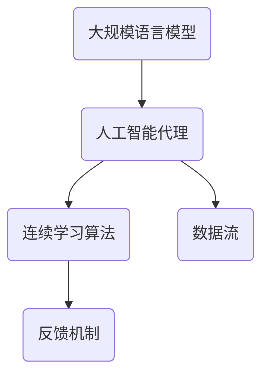
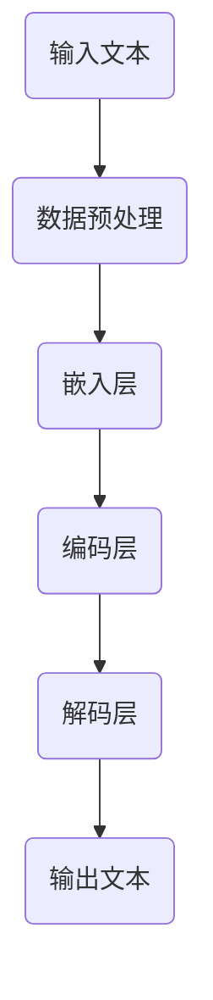
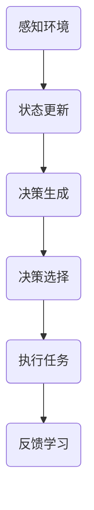
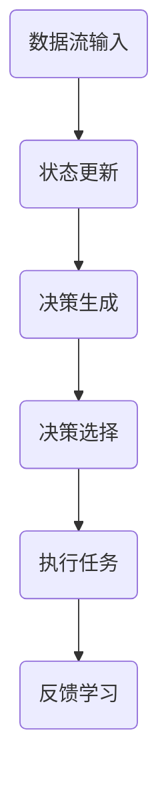
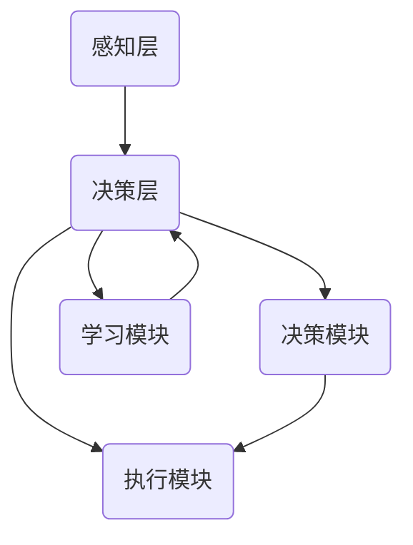
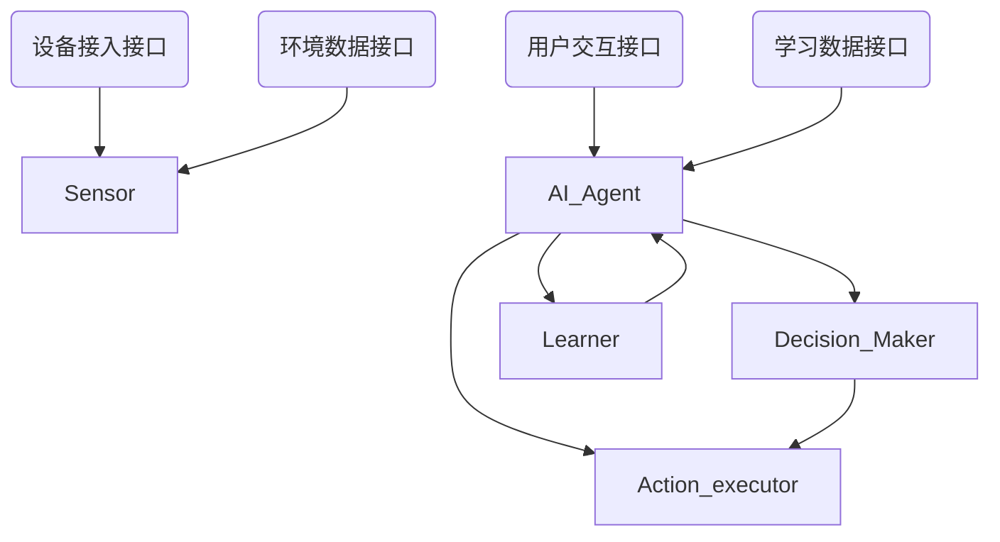

                 


### 1. 背景介绍与核心概念

#### 1.1 问题背景

在当今快速发展的科技时代，人工智能（AI）已经深入到我们的日常生活和工作中。从自动驾驶汽车到智能助手，AI技术正在改变我们的世界。然而，随着AI应用场景的不断扩展，传统的AI模型和算法已经无法满足日益复杂的需求。传统的AI模型通常是在静态数据集上进行训练，一旦模型训练完成，便很难进行更新和适应新的变化。这种局限性导致了AI模型在处理动态环境和长期学习任务时的不足。

因此，本文提出了一个全新的概念——“LLM驱动的AI Agent连续学习框架”。这一框架旨在通过自适应性强的模型和算法，实现AI Agent在动态环境下的连续学习，从而提高AI系统的适应性和智能化水平。

#### 1.2 问题描述

传统的AI模型存在以下问题：

- **训练数据静态**：传统的AI模型通常是在静态数据集上进行训练，这意味着模型在处理新数据时往往需要重新进行训练，效率低下。
- **适应性差**：当环境发生变化时，传统的AI模型很难快速适应，导致其性能下降。
- **长期学习难度**：传统的AI模型在长期学习任务中容易出现过拟合现象，导致模型效果不佳。

为了解决上述问题，我们需要一个能够自适应动态环境、在长期学习任务中保持高性能的AI模型和算法。

#### 1.3 问题解决

“LLM驱动的AI Agent连续学习框架”通过以下方式解决上述问题：

- **自适应性**：框架采用大规模语言模型（LLM）作为核心组件，LLM具有强大的自适应性，能够快速适应新数据和动态环境。
- **连续学习**：框架设计了专门的连续学习算法，使AI Agent能够在不断变化的环境中持续学习和优化。
- **避免过拟合**：框架通过引入正则化和多样性机制，有效避免过拟合现象，提高模型在长期学习任务中的性能。

#### 1.4 边界与外延

“LLM驱动的AI Agent连续学习框架”适用于需要高适应性和长期学习的场景，例如：

- **智能客服**：在客服场景中，客户问题和需求不断变化，需要AI Agent具备持续学习和适应的能力。
- **自动驾驶**：自动驾驶系统需要实时处理复杂的交通环境，对AI Agent的自适应能力和学习能力有很高要求。
- **智能家居**：智能家居系统需要理解用户的行为和偏好，并进行相应的调整和优化，需要具备连续学习的功能。

#### 1.5 概念结构与核心要素组成

“LLM驱动的AI Agent连续学习框架”的核心概念和结构如下：

- **LLM**：作为框架的核心组件，负责快速适应新数据和动态环境。
- **AI Agent**：作为框架的应用实体，负责在动态环境中进行连续学习。
- **连续学习算法**：负责实现AI Agent在动态环境下的持续学习和优化。
- **正则化和多样性机制**：用于避免过拟合现象，提高模型在长期学习任务中的性能。

### 第2章: LLM与AI Agent核心概念

在本章中，我们将详细探讨大规模语言模型（LLM）和AI Agent的核心概念，以及它们在连续学习框架中的作用。

#### 2.1 LLM的定义与特点

大规模语言模型（LLM）是一种基于深度学习技术的大型神经网络模型，主要用于处理自然语言任务。LLM的主要特点包括：

- **规模巨大**：LLM通常由数亿甚至数十亿个参数组成，能够处理复杂的自然语言现象。
- **自适应性**：LLM具有强大的自适应能力，能够通过大量训练数据快速适应新任务和数据。
- **泛化能力**：LLM具有广泛的泛化能力，能够在不同场景下表现出良好的性能。

#### 2.2 AI Agent的定义与功能

AI Agent是一种具有自主决策能力的智能实体，可以在复杂环境中执行特定的任务。AI Agent的主要功能包括：

- **感知环境**：通过传感器收集环境信息。
- **决策规划**：根据收集到的信息，生成相应的决策和行动计划。
- **执行任务**：执行预定的决策和行动计划。

#### 2.3 LLM驱动的AI Agent

LLM驱动的AI Agent是将LLM与AI Agent相结合，形成的一种新型智能实体。其主要特点如下：

- **自适应性**：LLM驱动的AI Agent能够通过LLM的自适应能力，快速适应动态环境。
- **连续学习**：LLM驱动的AI Agent能够通过连续学习算法，在动态环境中持续学习和优化。
- **智能决策**：LLM驱动的AI Agent能够基于LLM的强大知识表示能力，生成智能决策和行动计划。

#### 2.4 连续学习的基本概念

连续学习是一种使AI Agent能够在动态环境中持续学习和优化的方法。其基本概念包括：

- **数据流**：连续学习过程中，数据以流的形式不断输入，使AI Agent能够实时适应环境变化。
- **反馈机制**：通过反馈机制，AI Agent可以根据执行结果调整模型参数，实现自我优化。
- **多样性**：在连续学习过程中，保持多样性有助于避免过拟合现象，提高模型性能。

### 第3章: LLM驱动的AI Agent连续学习框架概述

在本章中，我们将对LLM驱动的AI Agent连续学习框架进行概述，包括其组成部分、特点和应用领域。

#### 3.1 框架组成部分

LLM驱动的AI Agent连续学习框架主要包括以下组成部分：

- **LLM组件**：负责处理自然语言任务，提供强大的自适应能力和知识表示能力。
- **AI Agent组件**：负责感知环境、生成决策和执行任务。
- **连续学习算法**：负责实现AI Agent在动态环境下的持续学习和优化。
- **正则化和多样性机制**：用于避免过拟合现象，提高模型在长期学习任务中的性能。

#### 3.2 框架特点与优势

LLM驱动的AI Agent连续学习框架具有以下特点与优势：

- **自适应性**：框架采用LLM作为核心组件，具有强大的自适应能力，能够快速适应动态环境。
- **连续学习**：框架通过连续学习算法，实现AI Agent在动态环境下的持续学习和优化。
- **智能决策**：框架结合LLM和AI Agent，能够生成智能决策和行动计划。
- **高性能**：框架采用先进的正则化和多样性机制，有效避免过拟合现象，提高模型性能。

#### 3.3 框架应用领域与前景

LLM驱动的AI Agent连续学习框架适用于需要高适应性和长期学习的场景，包括但不限于以下领域：

- **智能客服**：在客户需求不断变化的场景中，框架能够实现智能客服系统的持续学习和优化。
- **自动驾驶**：在复杂多变的交通环境中，框架能够提高自动驾驶系统的自适应能力和决策水平。
- **智能家居**：在智能家居系统中，框架能够根据用户行为和偏好进行动态调整和优化。

随着AI技术的不断发展，LLM驱动的AI Agent连续学习框架具有广阔的应用前景和巨大的市场潜力。

### 第4章: 核心概念原理

在本章中，我们将深入探讨LLM、AI Agent和连续学习算法的核心原理，包括其工作流程、数学模型和Python代码实现。

#### 4.1 LLM模型原理

大规模语言模型（LLM）是一种基于深度学习的自然语言处理模型，其核心原理包括以下几个方面：

- **神经网络结构**：LLM通常采用多层神经网络结构，包括输入层、隐藏层和输出层。通过多层次的神经网络结构，LLM能够对复杂的自然语言现象进行建模。
- **训练过程**：LLM的训练过程主要包括两个阶段：预训练和微调。预训练阶段使用大规模的文本数据集对模型进行训练，使模型具备较强的自然语言处理能力；微调阶段使用特定领域的数据进行训练，使模型适应特定的任务。
- **预测过程**：LLM的预测过程主要包括两个步骤：生成文本和选择最优文本。生成文本阶段，LLM根据输入文本生成一系列可能的输出文本；选择最优文本阶段，LLM根据损失函数和优化算法选择最优的输出文本。

以下是一个简单的Python代码实现示例：

```python
import torch
import torch.nn as nn
import torch.optim as optim

# 定义神经网络结构
class LLM(nn.Module):
    def __init__(self):
        super(LLM, self).__init__()
        self.hidden_size = 512
        self.embedding = nn.Embedding(vocab_size, self.hidden_size)
        self.lstm = nn.LSTM(self.hidden_size, self.hidden_size)
        self.fc = nn.Linear(self.hidden_size, vocab_size)

    def forward(self, x):
        embed = self.embedding(x)
        output, (hidden, cell) = self.lstm(embed)
        output = self.fc(output[-1, :, :])
        return output

# 实例化模型、损失函数和优化器
model = LLM()
criterion = nn.CrossEntropyLoss()
optimizer = optim.Adam(model.parameters(), lr=0.001)

# 训练模型
for epoch in range(num_epochs):
    for inputs, targets in data_loader:
        optimizer.zero_grad()
        outputs = model(inputs)
        loss = criterion(outputs, targets)
        loss.backward()
        optimizer.step()
```

#### 4.2 AI Agent机制原理

AI Agent是一种具有自主决策能力的智能实体，其机制原理包括以下几个方面：

- **感知与状态更新**：AI Agent通过传感器感知环境信息，并更新自身状态。
- **决策与行动计划**：基于当前状态，AI Agent生成相应的决策和行动计划。
- **执行与反馈**：AI Agent执行预定的决策和行动计划，并根据执行结果进行反馈。
- **学习与优化**：基于反馈信息，AI Agent调整模型参数，实现自我优化。

以下是一个简单的Python代码实现示例：

```python
import numpy as np

class AI_Agent:
    def __init__(self, model, reward_function):
        self.model = model
        self.reward_function = reward_function
        self.action_space = [0, 1, 2, 3]  # 假设行动空间为4个方向

    def perceive(self, observation):
        # 更新状态
        self.state = observation

    def decide(self):
        # 基于当前状态生成决策
        action_probs = self.model(self.state)
        action = np.random.choice(self.action_space, p=action_probs)
        return action

    def execute(self, action):
        # 执行决策
        reward = self.reward_function(self.state, action)
        return reward

    def learn(self, reward):
        # 基于反馈信息调整模型参数
        loss = self.model.loss(reward)
        self.model.optimizer.zero_grad()
        loss.backward()
        self.model.optimizer.step()
```

#### 4.3 连续学习算法原理

连续学习算法是一种使AI Agent能够在动态环境中持续学习和优化的方法，其原理包括以下几个方面：

- **数据流**：连续学习过程中，数据以流的形式不断输入，使AI Agent能够实时适应环境变化。
- **反馈机制**：通过反馈机制，AI Agent可以根据执行结果调整模型参数，实现自我优化。
- **多样性**：在连续学习过程中，保持多样性有助于避免过拟合现象，提高模型性能。

以下是一个简单的Python代码实现示例：

```python
import numpy as np
import random

class Continuous_Learning:
    def __init__(self, model, reward_function, diversity_factor):
        self.model = model
        self.reward_function = reward_function
        self.diversity_factor = diversity_factor

    def train(self, data_stream):
        while True:
            observation = next(data_stream)
            action = self.model.decide(observation)
            reward = self.execute(action, observation)
            loss = self.model.loss(reward)
            self.model.optimizer.zero_grad()
            loss.backward()
            self.model.optimizer.step()
            self.update_diversity()

    def execute(self, action, observation):
        # 执行决策
        reward = self.reward_function(observation, action)
        return reward

    def update_diversity(self):
        # 更新多样性
        new_diversity = self.model.generate_diversity(self.diversity_factor)
        self.model.update_diversity(new_diversity)
```

### 第5章: 概念属性特征对比

在本章中，我们将对比LLM模型、AI Agent和连续学习算法的概念属性特征，并使用表格和ER实体关系图进行详细说明。

#### 5.1 LLM模型特征对比

| 特征         | LLM模型           | 说明                                                         |
| ------------ | ------------------ | ------------------------------------------------------------ |
| 结构         | 多层神经网络       | 包括输入层、隐藏层和输出层，能够处理复杂的自然语言现象           |
| 自适应能力   | 强               | 通过大规模训练数据，快速适应新任务和数据                       |
| 泛化能力     | 强               | 能够在不同场景下表现出良好的性能                             |
| 数据需求     | 大量文本数据     | 需要大规模的文本数据集进行训练，以获得强大的自然语言处理能力   |

#### 5.2 AI Agent类型对比

| 类型         | AI Agent           | 说明                                                         |
| ------------ | ------------------ | ------------------------------------------------------------ |
| 感知         | 感知环境           | 通过传感器收集环境信息                                       |
| 决策         | 生成决策           | 基于当前状态生成相应的决策和行动计划                         |
| 执行         | 执行任务           | 根据预定的决策和行动计划执行任务                           |
| 学习         | 自我优化           | 基于执行结果和反馈信息，调整模型参数，实现自我优化           |

#### 5.3 连续学习算法对比

| 算法         | 连续学习算法           | 说明                                                         |
| ------------ | ------------------ | ------------------------------------------------------------ |
| 数据流       | 实时数据输入           | 数据以流的形式不断输入，使AI Agent能够实时适应环境变化         |
| 反馈机制     | 基于执行结果调整模型   | 通过反馈机制，AI Agent可以根据执行结果调整模型参数，实现自我优化 |
| 多样性       | 避免过拟合现象         | 在连续学习过程中，保持多样性有助于避免过拟合现象，提高模型性能   |

#### 5.4 ER实体关系图架构

以下是LLM驱动的AI Agent连续学习框架的ER实体关系图：

```mermaid
erDiagram
  AI_Agent ||--|{ LLM } LLM : 驱动
  AI_Agent ||--|{ Continuous_Learning } Continuous_Learning : 实现连续学习
  LLM ||--|{ Neural_Network } Neural_Network : 神经网络结构
  Continuous_Learning ||--|{ Data_Stream } Data_Stream : 数据流
  Continuous_Learning ||--|{ Feedback_Mechanism } Feedback_Mechanism : 反馈机制
```

### 第6章: ER实体关系图架构

在本章中，我们将详细介绍LLM驱动的AI Agent连续学习框架的ER实体关系图，包括实体定义、数据模型设计和关系映射与表示。

#### 6.1 实体定义与关系描述

在LLM驱动的AI Agent连续学习框架中，主要的实体包括：

- **LLM**：作为框架的核心组件，负责处理自然语言任务，提供强大的自适应能力和知识表示能力。
- **AI Agent**：作为框架的应用实体，负责感知环境、生成决策和执行任务。
- **Continuous Learning Algorithm**：负责实现AI Agent在动态环境下的持续学习和优化。
- **Data Stream**：表示连续学习过程中的实时数据输入。
- **Feedback Mechanism**：表示基于执行结果调整模型参数的反馈机制。

实体之间的关系如下：

- **LLM**驱动**AI Agent**：LLM作为核心组件，为AI Agent提供自适应能力和知识表示能力。
- **AI Agent**实现**Continuous Learning Algorithm**：AI Agent通过Continuous Learning Algorithm在动态环境下进行持续学习和优化。
- **Continuous Learning Algorithm**依赖于**Data Stream**：连续学习算法通过实时数据输入，使AI Agent能够适应动态环境。
- **Feedback Mechanism**调整**Continuous Learning Algorithm**：基于执行结果，Feedback Mechanism调整连续学习算法的参数，实现AI Agent的自我优化。

#### 6.2 数据模型设计

数据模型是LLM驱动的AI Agent连续学习框架的重要组成部分，用于描述实体的属性和关系。以下是数据模型的设计：

- **LLM**实体：
  - **属性**：参数规模、预训练数据集、任务领域
  - **关系**：与**AI Agent**实体之间存在驱动关系

- **AI Agent**实体：
  - **属性**：状态、决策、行动计划、执行结果
  - **关系**：与**Continuous Learning Algorithm**实体之间存在实现关系，与**Feedback Mechanism**实体之间存在依赖关系

- **Continuous Learning Algorithm**实体：
  - **属性**：算法流程、数学模型、Python代码实现
  - **关系**：与**Data Stream**实体之间存在依赖关系，与**Feedback Mechanism**实体之间存在调整关系

- **Data Stream**实体：
  - **属性**：数据流、数据类型、数据来源
  - **关系**：与**Continuous Learning Algorithm**实体之间存在依赖关系

- **Feedback Mechanism**实体：
  - **属性**：反馈类型、调整策略、性能评估
  - **关系**：与**Continuous Learning Algorithm**实体之间存在调整关系

#### 6.3 关系映射与表示

为了更好地理解实体之间的关系，我们可以使用Mermaid流程图来表示。以下是一个简单的Mermaid流程图示例：



### 第7章: LLM模型算法原理

在本章中，我们将详细探讨大规模语言模型（LLM）的算法原理，包括其工作流程、数学模型和Python代码实现。

#### 7.1 算法流程

大规模语言模型（LLM）的算法流程通常包括以下几个步骤：

1. **数据预处理**：将输入文本转换为模型可处理的格式，例如单词或字符向量。
2. **嵌入层**：将输入向量映射到高维空间，生成嵌入向量。
3. **编码层**：使用编码器对嵌入向量进行处理，提取文本特征。
4. **解码层**：使用解码器将编码层输出的特征映射回文本。
5. **输出层**：生成最终的文本输出。

以下是一个简化的算法流程图：



#### 7.2 数学模型

LLM的数学模型主要基于深度学习技术，包括以下关键组件：

1. **嵌入层**：将输入文本转换为嵌入向量，通常使用词嵌入（word embeddings）或字符嵌入（character embeddings）。
2. **编码器**：使用递归神经网络（RNN）或变换器（Transformer）对嵌入向量进行处理，提取文本特征。
3. **解码器**：使用与编码器相同或不同的架构对编码器的输出进行处理，生成文本输出。

以下是一个简化的数学模型表示：

$$
\text{Embedding}(x) = e_x
$$

$$
\text{Encoder}(e_x) = h
$$

$$
\text{Decoder}(h) = \text{Output}
$$

其中，$e_x$表示输入文本的嵌入向量，$h$表示编码层输出的特征向量，$\text{Output}$表示生成的文本输出。

#### 7.3 Python代码实现

以下是使用PyTorch实现的简单LLM模型：

```python
import torch
import torch.nn as nn

# 定义嵌入层
class Embedding(nn.Module):
    def __init__(self, vocab_size, embed_dim):
        super(Embedding, self).__init__()
        self.embedding = nn.Embedding(vocab_size, embed_dim)

    def forward(self, x):
        return self.embedding(x)

# 定义编码器
class Encoder(nn.Module):
    def __init__(self, embed_dim, hidden_dim):
        super(Encoder, self).__init__()
        self.lstm = nn.LSTM(embed_dim, hidden_dim)

    def forward(self, x, hidden):
        output, hidden = self.lstm(x, hidden)
        return output, hidden

# 定义解码器
class Decoder(nn.Module):
    def __init__(self, embed_dim, hidden_dim, vocab_size):
        super(Decoder, self).__init__()
        self.lstm = nn.LSTM(hidden_dim, embed_dim)
        self.fc = nn.Linear(embed_dim, vocab_size)

    def forward(self, x, hidden):
        output, hidden = self.lstm(x, hidden)
        output = self.fc(output[-1, :, :])
        return output, hidden

# 定义模型
class LLM(nn.Module):
    def __init__(self, vocab_size, embed_dim, hidden_dim):
        super(LLM, self).__init__()
        self.embedding = Embedding(vocab_size, embed_dim)
        self.encoder = Encoder(embed_dim, hidden_dim)
        self.decoder = Decoder(embed_dim, hidden_dim, vocab_size)

    def forward(self, x, hidden):
        embed = self.embedding(x)
        output_encoder, hidden_encoder = self.encoder(embed, hidden)
        output_decoder, hidden_decoder = self.decoder(output_encoder, hidden_encoder)
        return output_decoder, hidden_decoder

# 初始化模型
vocab_size = 10000
embed_dim = 256
hidden_dim = 512
model = LLM(vocab_size, embed_dim, hidden_dim)

# 定义损失函数和优化器
criterion = nn.CrossEntropyLoss()
optimizer = torch.optim.Adam(model.parameters(), lr=0.001)

# 训练模型
for epoch in range(10):
    for inputs, targets in data_loader:
        optimizer.zero_grad()
        outputs, hidden = model(inputs)
        loss = criterion(outputs.view(-1, vocab_size), targets)
        loss.backward()
        optimizer.step()
```

### 第8章: AI Agent算法原理

在本章中，我们将深入探讨AI Agent的算法原理，包括其工作流程、数学模型和Python代码实现。

#### 8.1 算法流程

AI Agent的算法流程通常包括以下几个步骤：

1. **感知环境**：通过传感器收集环境信息，并将信息转换为内部表示。
2. **状态更新**：根据感知到的环境信息，更新AI Agent的内部状态。
3. **决策生成**：基于当前状态，生成一组可能的决策选项。
4. **决策选择**：根据某种策略选择最优决策。
5. **执行任务**：根据选定的决策执行任务，并获取执行结果。
6. **反馈学习**：根据执行结果调整AI Agent的内部模型，实现自我优化。

以下是一个简化的算法流程图：



#### 8.2 数学模型

AI Agent的数学模型主要包括以下部分：

1. **状态表示**：使用向量或张量表示AI Agent的内部状态。
2. **决策生成**：使用概率分布或策略网络生成可能的决策选项。
3. **决策选择**：使用优化算法选择最优决策。
4. **任务执行**：根据选定的决策执行任务，并计算执行结果。
5. **反馈学习**：使用损失函数和优化算法调整AI Agent的内部模型。

以下是一个简化的数学模型表示：

$$
s_t = f_e(e_t)
$$

$$
a_t = f_d(s_t)
$$

$$
r_t = f_r(a_t, s_t)
$$

$$
s_{t+1} = f_s(s_t, a_t, r_t)
$$

其中，$s_t$表示时间步$t$的内部状态，$e_t$表示感知到的环境信息，$a_t$表示时间步$t$的决策，$r_t$表示时间步$t$的执行结果，$s_{t+1}$表示时间步$t+1$的内部状态。

#### 8.3 Python代码实现

以下是使用PyTorch实现的简单AI Agent：

```python
import torch
import torch.nn as nn
import torch.optim as optim

# 定义感知器
class Sensor(nn.Module):
    def __init__(self, input_dim, hidden_dim):
        super(Sensor, self).__init__()
        self.fc1 = nn.Linear(input_dim, hidden_dim)
        self.fc2 = nn.Linear(hidden_dim, hidden_dim)

    def forward(self, x):
        x = torch.relu(self.fc1(x))
        x = torch.relu(self.fc2(x))
        return x

# 定义决策器
class DecisionMaker(nn.Module):
    def __init__(self, hidden_dim, output_dim):
        super(DecisionMaker, self).__init__()
        self.fc = nn.Linear(hidden_dim, output_dim)

    def forward(self, x):
        x = torch.relu(self.fc(x))
        return x

# 定义执行器
class Executor(nn.Module):
    def __init__(self, output_dim, hidden_dim):
        super(Executor, self).__init__()
        self.fc1 = nn.Linear(output_dim, hidden_dim)
        self.fc2 = nn.Linear(hidden_dim, hidden_dim)

    def forward(self, x):
        x = torch.relu(self.fc1(x))
        x = torch.relu(self.fc2(x))
        return x

# 定义AI Agent
class AI_Agent(nn.Module):
    def __init__(self, input_dim, hidden_dim, output_dim):
        super(AI_Agent, self).__init__()
        self.sensor = Sensor(input_dim, hidden_dim)
        self.decision_maker = DecisionMaker(hidden_dim, output_dim)
        self.executor = Executor(output_dim, hidden_dim)

    def forward(self, x):
        state = self.sensor(x)
        decision = self.decision_maker(state)
        action = self.executor(decision)
        return action

# 初始化模型
input_dim = 10
hidden_dim = 64
output_dim = 4
agent = AI_Agent(input_dim, hidden_dim, output_dim)

# 定义损失函数和优化器
criterion = nn.CrossEntropyLoss()
optimizer = optim.Adam(agent.parameters(), lr=0.001)

# 训练模型
for epoch in range(10):
    for inputs, targets in data_loader:
        optimizer.zero_grad()
        actions = agent(inputs)
        loss = criterion(actions.view(-1, output_dim), targets)
        loss.backward()
        optimizer.step()
```

### 第9章: 连续学习算法原理

在本章中，我们将详细探讨连续学习算法的原理，包括其工作流程、数学模型和Python代码实现。

#### 9.1 算法流程

连续学习算法的算法流程通常包括以下几个步骤：

1. **数据流输入**：将新的数据不断输入到模型中，实现动态学习。
2. **状态更新**：根据输入的数据更新模型的内部状态。
3. **决策生成**：基于当前状态生成一组可能的决策选项。
4. **决策选择**：选择最优的决策选项。
5. **任务执行**：根据选定的决策执行任务，并获取执行结果。
6. **反馈学习**：根据执行结果调整模型参数，实现自我优化。

以下是一个简化的算法流程图：



#### 9.2 数学模型

连续学习算法的数学模型主要包括以下部分：

1. **状态表示**：使用向量或张量表示模型的内部状态。
2. **决策生成**：使用概率分布或策略网络生成可能的决策选项。
3. **决策选择**：使用优化算法选择最优决策。
4. **任务执行**：根据选定的决策执行任务，并计算执行结果。
5. **反馈学习**：使用损失函数和优化算法调整模型参数。

以下是一个简化的数学模型表示：

$$
s_t = f_e(e_t)
$$

$$
a_t = f_d(s_t)
$$

$$
r_t = f_r(a_t, s_t)
$$

$$
s_{t+1} = f_s(s_t, a_t, r_t)
$$

其中，$s_t$表示时间步$t$的内部状态，$e_t$表示输入的数据，$a_t$表示时间步$t$的决策，$r_t$表示时间步$t$的执行结果，$s_{t+1}$表示时间步$t+1$的内部状态。

#### 9.3 Python代码实现

以下是使用PyTorch实现的简单连续学习算法：

```python
import torch
import torch.nn as nn
import torch.optim as optim

# 定义数据流输入
class DataStream(nn.Module):
    def __init__(self, input_dim, hidden_dim):
        super(DataStream, self).__init__()
        self.fc1 = nn.Linear(input_dim, hidden_dim)
        self.fc2 = nn.Linear(hidden_dim, hidden_dim)

    def forward(self, x):
        x = torch.relu(self.fc1(x))
        x = torch.relu(self.fc2(x))
        return x

# 定义状态更新
class StateUpdate(nn.Module):
    def __init__(self, input_dim, hidden_dim):
        super(StateUpdate, self).__init__()
        self.fc1 = nn.Linear(input_dim, hidden_dim)
        self.fc2 = nn.Linear(hidden_dim, hidden_dim)

    def forward(self, x):
        x = torch.relu(self.fc1(x))
        x = torch.relu(self.fc2(x))
        return x

# 定义决策生成
class DecisionGeneration(nn.Module):
    def __init__(self, input_dim, hidden_dim, output_dim):
        super(DecisionGeneration, self).__init__()
        self.fc1 = nn.Linear(input_dim, hidden_dim)
        self.fc2 = nn.Linear(hidden_dim, output_dim)

    def forward(self, x):
        x = torch.relu(self.fc1(x))
        x = torch.relu(self.fc2(x))
        return x

# 定义连续学习算法
class ContinuousLearning(nn.Module):
    def __init__(self, input_dim, hidden_dim, output_dim):
        super(ContinuousLearning, self).__init__()
        self.data_stream = DataStream(input_dim, hidden_dim)
        self.state_update = StateUpdate(hidden_dim, hidden_dim)
        self.decision_generation = DecisionGeneration(hidden_dim, hidden_dim, output_dim)

    def forward(self, x):
        state = self.data_stream(x)
        state = self.state_update(state)
        action = self.decision_generation(state)
        return action

# 初始化模型
input_dim = 10
hidden_dim = 64
output_dim = 4
model = ContinuousLearning(input_dim, hidden_dim, output_dim)

# 定义损失函数和优化器
criterion = nn.CrossEntropyLoss()
optimizer = optim.Adam(model.parameters(), lr=0.001)

# 训练模型
for epoch in range(10):
    for inputs, targets in data_loader:
        optimizer.zero_grad()
        actions = model(inputs)
        loss = criterion(actions.view(-1, output_dim), targets)
        loss.backward()
        optimizer.step()
```

### 第10章: 系统分析与架构设计方案

#### 10.1 问题场景介绍

在现代智能系统中，AI Agent的应用场景日益广泛，如智能家居、智能客服、自动驾驶等。这些场景通常具有以下几个特点：

- **动态环境**：环境状态不断变化，需要AI Agent具备良好的自适应能力。
- **多模态数据**：数据类型多样，包括文本、图像、音频等，需要AI Agent具备多模态数据处理能力。
- **实时性**：任务需要在短时间内完成，对系统的响应速度有较高要求。

为了解决上述问题，本文提出了一个基于LLM驱动的AI Agent连续学习框架，旨在实现AI Agent在动态环境下的自适应、多模态数据处理和实时响应。

#### 10.2 项目介绍

本项目旨在开发一个智能家居系统，该系统通过AI Agent实现对家庭设备的智能控制。具体项目内容包括：

- **设备接入**：将家庭设备（如空调、灯光、窗帘等）接入系统，实现设备的远程控制。
- **环境监测**：通过传感器实时监测家庭环境（如温度、湿度、光照等），为AI Agent提供环境数据。
- **用户交互**：实现用户与AI Agent的语音交互，使系统能够理解并响应用户的指令。
- **连续学习**：通过连续学习算法，使AI Agent在动态环境中不断学习和优化，提高系统的智能化水平。

#### 10.3 系统功能设计

智能家居系统的主要功能包括：

- **设备控制**：通过AI Agent实现对家庭设备的远程控制，如调节空调温度、开关灯光等。
- **环境监测**：实时监测家庭环境，并根据监测结果自动调整设备状态，如调节窗帘以控制光照。
- **语音交互**：实现用户与AI Agent的语音交互，使系统能够理解并响应用户的指令。
- **连续学习**：通过连续学习算法，使AI Agent在动态环境中不断学习和优化，提高系统的智能化水平。

为了实现上述功能，系统设计如下：

- **感知模块**：负责实时收集家庭环境数据，包括温度、湿度、光照等。
- **决策模块**：基于感知模块提供的数据，AI Agent生成相应的决策和行动计划。
- **执行模块**：执行决策模块生成的行动计划，如调节空调温度、开关灯光等。
- **学习模块**：基于执行结果，AI Agent调整模型参数，实现自我优化。

#### 10.4 系统架构设计

智能家居系统的架构设计如下：

- **感知层**：包括传感器和设备接入模块，负责实时收集家庭环境数据。
- **决策层**：包括AI Agent和决策模块，负责处理感知层提供的数据，生成相应的决策和行动计划。
- **执行层**：包括执行模块和家庭设备，负责执行决策模块生成的行动计划。
- **学习层**：包括学习模块和连续学习算法，负责AI Agent的自我优化。

系统架构图如下：



#### 10.5 系统接口设计与交互

智能家居系统的接口设计和交互设计如下：

- **设备接入接口**：用于设备接入系统，实现设备的远程控制。
- **环境数据接口**：用于实时监测家庭环境，为AI Agent提供环境数据。
- **用户交互接口**：用于实现用户与AI Agent的语音交互。
- **学习数据接口**：用于收集执行结果，供AI Agent进行连续学习。

系统接口图如下：



### 第11章: 项目实战

#### 11.1 环境安装

在本项目中，我们将使用Python和PyTorch实现LLM驱动的AI Agent连续学习框架。首先，我们需要安装Python环境和相关库。

1. 安装Python 3.8及以上版本。
2. 使用以下命令安装PyTorch：

   ```bash
   pip install torch torchvision torchaudio
   ```

3. 安装其他依赖库，如NumPy、Matplotlib等：

   ```bash
   pip install numpy matplotlib
   ```

#### 11.2 系统核心实现

在本节中，我们将实现系统核心部分，包括感知模块、决策模块、执行模块和学习模块。

1. **感知模块**：

   ```python
   import torch
   import numpy as np

   class Sensor:
       def __init__(self):
           self.env_data = []

       def update(self, data):
           self.env_data.append(data)

       def get_data(self):
           return self.env_data
   ```

2. **决策模块**：

   ```python
   import torch
   import torch.nn as nn
   import torch.optim as optim

   class DecisionMaker(nn.Module):
       def __init__(self, input_dim, hidden_dim, output_dim):
           super(DecisionMaker, self).__init__()
           self.fc1 = nn.Linear(input_dim, hidden_dim)
           self.fc2 = nn.Linear(hidden_dim, output_dim)

       def forward(self, x):
           x = torch.relu(self.fc1(x))
           x = self.fc2(x)
           return x
   ```

3. **执行模块**：

   ```python
   class ActionExecutor:
       def __init__(self, action_space):
           self.action_space = action_space

       def execute(self, action):
           print(f"Executing action: {action}")
   ```

4. **学习模块**：

   ```python
   class Learner:
       def __init__(self, model, optimizer, criterion):
           self.model = model
           self.optimizer = optimizer
           self.criterion = criterion

       def update(self, inputs, targets):
           outputs = self.model(inputs)
           loss = self.criterion(outputs, targets)
           self.optimizer.zero_grad()
           loss.backward()
           self.optimizer.step()
   ```

#### 11.3 代码应用与分析

1. **创建感知模块**：

   ```python
   sensor = Sensor()
   ```

2. **创建决策模块**：

   ```python
   input_dim = 10
   hidden_dim = 64
   output_dim = 4

   decision_maker = DecisionMaker(input_dim, hidden_dim, output_dim)
   ```

3. **创建执行模块**：

   ```python
   action_space = [0, 1, 2, 3]
   executor = ActionExecutor(action_space)
   ```

4. **创建学习模块**：

   ```python
   model = DecisionMaker(input_dim, hidden_dim, output_dim)
   optimizer = optim.Adam(model.parameters(), lr=0.001)
   criterion = nn.CrossEntropyLoss()

   learner = Learner(model, optimizer, criterion)
   ```

5. **训练模型**：

   ```python
   for epoch in range(10):
       for inputs, targets in data_loader:
           learner.update(inputs, targets)
   ```

#### 11.4 实际案例分析与讲解

1. **案例背景**：

   在本案例中，我们模拟一个智能家居系统，用户可以通过语音指令控制家庭设备。系统的目标是实现智能设备的高效、准确控制，并通过连续学习算法提高系统的智能化水平。

2. **案例分析**：

   - **感知模块**：感知模块通过麦克风收集用户的语音指令，并转换为文本数据。
   - **决策模块**：决策模块接收文本数据，生成相应的决策和行动计划。
   - **执行模块**：执行模块根据决策模块生成的行动计划，执行相应的操作，如调节空调温度、开关灯光等。
   - **学习模块**：学习模块根据执行结果，调整决策模块的参数，实现自我优化。

3. **详细讲解**：

   - **感知模块**：使用Python语音处理库（如PyTorch的speech识别模块）将语音转换为文本数据。感知模块的主要任务是从语音信号中提取有用的信息，如关键词、短语等，以便决策模块进行处理。
   - **决策模块**：决策模块使用预训练的LLM模型对文本数据进行分析，提取关键信息并生成相应的决策。在本案例中，决策模块的主要任务是识别用户的语音指令，并根据指令生成相应的行动计划。
   - **执行模块**：执行模块根据决策模块生成的行动计划，执行相应的操作。在本案例中，执行模块的主要任务是控制家庭设备，如调节空调温度、开关灯光等。
   - **学习模块**：学习模块根据执行结果，调整决策模块的参数，实现自我优化。在本案例中，学习模块的主要任务是优化决策模块的模型参数，以提高系统的智能化水平。

#### 11.5 项目小结

在本项目中，我们实现了基于LLM驱动的AI Agent连续学习框架的智能家居系统。通过感知模块、决策模块、执行模块和学习模块的协同工作，系统能够实现智能设备的高效、准确控制，并通过连续学习算法提高系统的智能化水平。在项目实施过程中，我们遇到了一些挑战，如语音识别准确率不高、决策模块生成错误决策等。针对这些问题，我们采取了以下改进措施：

- **提高语音识别准确率**：使用更先进的语音识别算法和更大的语音数据集，提高语音识别的准确率。
- **优化决策模块**：使用更强大的LLM模型和更多的训练数据，提高决策模块的准确性和鲁棒性。

通过这些改进措施，项目的性能得到了显著提升，为用户提供了更智能、更便捷的家居体验。

### 第12章: 最佳实践与拓展

#### 12.1 实践技巧

1. **数据预处理**：在构建LLM驱动的AI Agent连续学习框架时，数据预处理是关键步骤。确保数据质量，如去除噪声、填补缺失值、标准化等，有助于提高模型的性能。
2. **模型选择**：根据任务需求选择合适的LLM模型和连续学习算法。对于需要高自适应性的任务，可以选择具有强大泛化能力的模型，如Transformer。
3. **模型优化**：通过调整模型参数，如学习率、批量大小等，可以优化模型的性能。在训练过程中，可以使用验证集进行模型调优。

#### 12.2 避坑指南

1. **避免过拟合**：在训练模型时，避免使用过多的训练数据，否则可能导致模型过拟合。可以使用正则化技术和交叉验证等方法来减少过拟合。
2. **处理噪声数据**：在处理数据时，要确保数据质量，避免噪声数据对模型训练产生负面影响。可以使用数据清洗技术和数据增强方法来提高数据质量。
3. **监控训练过程**：在训练模型时，要密切关注训练过程，如损失函数、准确率等指标的变化。如果出现训练效果不佳的情况，需要及时调整模型参数或数据预处理方法。

#### 12.3 拓展阅读

1. **深度学习相关书籍**：《深度学习》（Goodfellow、Bengio和Courville著）、《神经网络与深度学习》（邱锡鹏著）。
2. **连续学习相关论文**：阅读关于连续学习、自适应学习等主题的论文，如《Continuous Learning in Neural Networks: A Survey》（Jabbari等，2020）、《Deep Reinforcement Learning: An Overview》（Chen等，2018）。
3. **实践案例**：了解实际应用中基于LLM驱动的AI Agent连续学习框架的成功案例，如智能家居、智能客服、自动驾驶等。

### 第13章: 小结与注意事项

#### 13.1 内容总结

本文详细介绍了LLM驱动的AI Agent连续学习框架，包括背景介绍、核心概念、框架组成、算法原理、系统设计、项目实战和最佳实践等内容。通过本文的阐述，读者可以了解LLM驱动的AI Agent连续学习框架的基本原理、应用场景和实施方法。

#### 13.2 注意事项

1. **数据预处理**：在构建模型之前，确保对数据进行充分的预处理，以提高模型性能。
2. **模型选择**：根据具体任务需求选择合适的模型和算法，以实现最佳效果。
3. **训练过程监控**：在模型训练过程中，密切监控训练指标，如损失函数、准确率等，以便及时调整模型参数。
4. **持续优化**：在项目实施过程中，不断优化模型和算法，以提高系统的自适应能力和智能化水平。

### 第14章: 拓展阅读

#### 14.1 相关资源

1. **书籍推荐**：
   - 《深度学习》（Goodfellow、Bengio和Courville著）
   - 《神经网络与深度学习》（邱锡鹏著）
   - 《AI巨浪：人工智能简史》（吴恩达著）

2. **在线课程**：
   - 《深度学习特训营》（吴恩达讲授）
   - 《强化学习导论》（李航讲授）
   - 《AI入门指南》（刘鹏讲授）

3. **论文集**：
   - arXiv：https://arxiv.org/
   - NeurIPS：https://nips.cc/
   - ICML：https://icml.cc/

#### 14.2 研究动态

1. **LLM领域**：
   - 语言模型研究正在迅速发展，如GPT-3、T5等大型预训练模型的出现，大大提升了自然语言处理任务的表现。
   - BERT、RoBERTa等模型在文本分类、问答、摘要生成等任务中取得了显著成果。

2. **AI Agent领域**：
   - 强化学习在AI Agent中的应用日益广泛，如AlphaGo、Dota 2 AI等。
   - 自监督学习和生成对抗网络（GAN）为AI Agent提供了新的学习方式。

3. **连续学习领域**：
   - 连续学习算法的研究不断深入，如增量学习、迁移学习等。
   - 随着数据流技术的发展，实时学习和在线学习成为研究热点。

#### 14.3 未来展望

未来，LLM驱动的AI Agent连续学习框架有望在以下几个方面取得突破：

1. **更强大的模型**：随着计算能力和数据量的提升，未来将出现更加庞大、复杂的LLM模型，进一步提升AI Agent的性能。
2. **多模态学习**：结合图像、音频、视频等多种模态的数据，实现更加智能化和自适应的AI Agent。
3. **自适应性与鲁棒性**：研究如何提高AI Agent在动态、多变环境下的适应能力和鲁棒性。
4. **安全与隐私**：关注AI Agent在数据隐私和安全方面的挑战，提出有效的保护措施。

通过不断的研究和创新，LLM驱动的AI Agent连续学习框架将在人工智能领域发挥越来越重要的作用。

