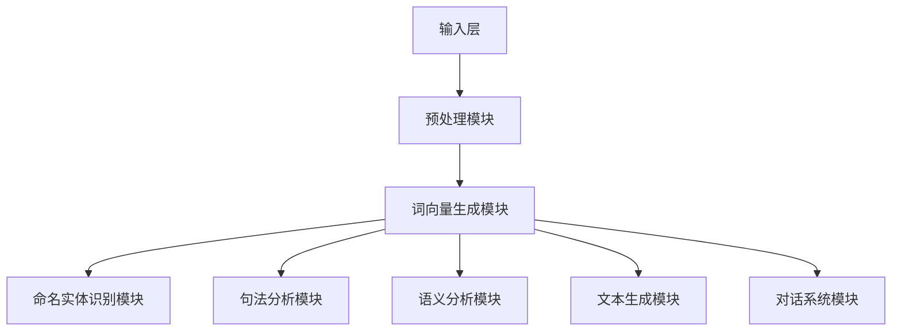
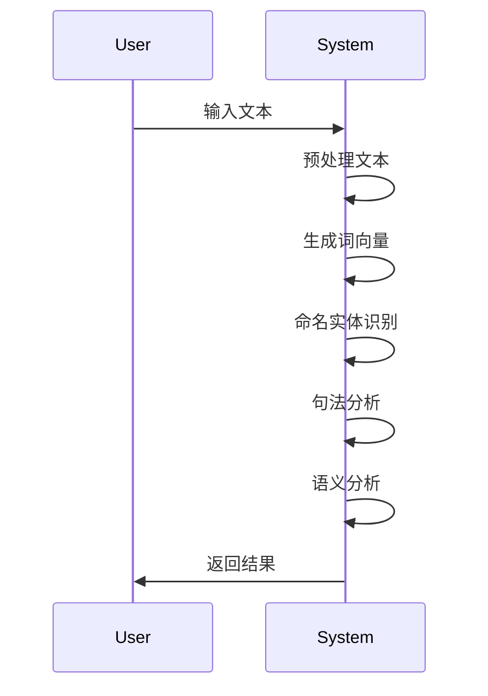

                 

# NLP技术在AI Agent中的应用与实践

## 关键词
自然语言处理（NLP），人工智能代理（AI Agent），词向量模型，序列模型，生成式模型，系统架构设计

## 摘要
本文将深入探讨自然语言处理（NLP）技术在人工智能代理（AI Agent）中的应用与实践。首先，我们将介绍NLP和AI Agent的基本概念及其在各个领域中的应用场景。接着，本文将逐步分析NLP的核心算法原理，包括词向量模型、序列模型和生成式模型，并通过具体的数学模型和公式进行讲解。随后，我们将设计一个NLP在AI Agent中的系统架构，并详细介绍系统功能、架构设计、接口设计和交互流程。为了更好地理解，本文将通过实际项目实战，包括环境安装、系统实现和代码分析，展示NLP技术在AI Agent中的实际应用。最后，我们将总结最佳实践、注意事项，并提供拓展阅读资源。

## 目录大纲设计思路

在设计《NLP技术在AI Agent中的应用与实践》的目录大纲时，我们的目标是确保文章的逻辑清晰、内容丰富，同时易于读者理解和跟随。以下是我们的设计思路：

### 第一部分: 引言与背景

- **第1章 NLP技术概述**
  - 介绍NLP的基本概念、发展历程和关键技术。
  - 阐述AI Agent的定义、类型和发展趋势。
  - 探讨NLP在AI Agent中的应用场景。

### 第二部分: 核心概念与联系

- **第2章 NLP核心概念与联系**
  - 使用对比表格和ER实体关系图展示NLP的关键概念及其联系。
  - 分析NLP关键技术与AI Agent的交互。

### 第三部分: 算法原理讲解

- **第3章 常见NLP算法原理讲解**
  - 详细讲解词向量模型、序列模型和生成式模型的原理。
  - 使用mermaid流程图和Python源代码阐述算法实现。

### 第四部分: 数学模型和数学公式

- **第4章 NLP关键数学模型与公式**
  - 给出算法背后的数学模型和公式，使用LaTeX格式确保准确性。

### 第五部分: 系统分析与架构设计方案

- **第5章 NLP在AI Agent中的系统架构设计**
  - 介绍系统功能、架构设计和接口设计。
  - 使用mermaid图表展示系统架构和交互流程。

### 第六部分: 项目实战

- **第6章 NLP技术在AI Agent中的实战应用**
  - 描述环境安装、系统实现和代码分析。
  - 分析实际案例并提供详细的讲解和剖析。

### 第七部分: 最佳实践、小结与拓展阅读

- **第7章 最佳实践、小结与拓展阅读**
  - 提供实践建议、总结、注意事项和进一步阅读的资源。

通过这样的目录结构，我们旨在为读者提供一个系统化、层次化的学习路径，使读者能够逐步深入理解NLP技术在AI Agent中的应用与实践。接下来，我们将按照这个大纲逐步展开详细的讨论。

## 第一部分: 引言与背景

### NLP技术概述

自然语言处理（Natural Language Processing，NLP）是人工智能领域的一个重要分支，旨在使计算机能够理解、解释和生成自然语言。自20世纪50年代起，NLP技术就已经开始发展，如今它已经广泛应用于语音识别、机器翻译、情感分析、文本生成等多个领域。

**基本概念：**

- **自然语言（Natural Language）：** 指人类日常使用的语言，如英语、中文、法语等。
- **自然语言处理（NLP）：** 指计算机对自然语言文本进行识别、理解和生成的一系列技术。
- **语言模型（Language Model）：** 用于预测下一个词语或句子的概率分布。

**发展历程：**

- **1950年代：** 初期研究主要集中在规则驱动的方法，如词性标注、句法分析等。
- **1980年代：** 统计方法开始受到关注，尤其是基于统计的语法分析和机器翻译。
- **2000年代：** 随着计算能力的提升和大数据的兴起，深度学习技术逐渐成为NLP研究的主流。
- **2010年代至今：** NLP技术取得了显著的进展，特别是在语音识别和机器翻译等领域。

**关键技术：**

- **词向量（Word Embeddings）：** 将词语映射到高维向量空间，以捕捉词语的语义信息。
- **序列模型（Sequential Models）：** 如循环神经网络（RNN）、长短期记忆网络（LSTM）和门控循环单元（GRU），用于处理序列数据。
- **生成式模型（Generative Models）：** 如变分自编码器（VAE）和生成对抗网络（GAN），用于生成新的文本或图像。

### AI Agent的概念与类型

人工智能代理（AI Agent）是能够自主执行任务、与人类互动并适应环境变化的计算机程序。AI Agent可以看作是具有智能行为的实体，它们通过感知环境、规划行动和决策来完成任务。

**定义：** AI Agent是一个具有感知、思考、行动能力的实体，能够根据外部刺激和内在规则进行自主决策和行动。

**类型：**

- **反应型代理（Reactive Agents）：** 直接根据感知到的环境进行反应，但没有记忆或规划能力。
- **主动型代理（Active Agents）：** 具有规划能力，能够预测环境变化并主动选择最佳行动。
- **混合型代理（Hybrid Agents）：** 结合反应型和主动型的特点，能够根据不同情况灵活选择行动方式。

**发展趋势：**

- **增强型代理（Enhanced Agents）：** 通过集成多种感知和行动能力，实现更高效的任务执行。
- **自主学习代理（Learning Agents）：** 通过机器学习和深度学习技术，从数据中学习并优化行为。
- **人机交互代理（Human-Agent Interaction）：** 强调人与AI Agent之间的自然交互，提高用户体验。

### NLP在AI Agent中的应用场景

NLP技术在AI Agent中的应用非常广泛，以下是一些典型的应用场景：

- **对话系统（Dialogue Systems）：** 利用NLP技术，AI Agent可以与用户进行自然语言交互，提供客服支持、虚拟助手等服务。
- **信息提取（Information Extraction）：** NLP技术用于从非结构化文本中提取结构化信息，如命名实体识别、关系提取等。
- **文本生成（Text Generation）：** NLP技术可以生成新的文本内容，如新闻文章、产品描述等。
- **情感分析（Sentiment Analysis）：** 通过分析用户评论、社交媒体等文本，了解用户的情感倾向和意见。

NLP技术在AI Agent中的应用不仅提高了系统的智能化水平，还增强了用户体验，为各行各业带来了新的机会和挑战。接下来，我们将深入探讨NLP的核心算法原理，为读者揭开AI Agent智能背后的技术面纱。

### 第二部分: 核心概念与联系

#### NLP基本概念与联系

自然语言处理（NLP）作为一个涉及多学科交叉的领域，其核心概念众多，理解这些概念及其相互关系对于深入掌握NLP技术至关重要。在这一部分，我们将介绍NLP的基本概念，并通过对比表格和ER实体关系图展示这些概念之间的联系。

**基本概念：**

1. **词向量（Word Embeddings）：** 将词语映射到高维向量空间，以捕捉词语的语义信息。
2. **命名实体识别（Named Entity Recognition，NER）：** 从文本中识别出具有特定意义的实体，如人名、地名、组织名等。
3. **句法分析（Syntactic Parsing）：** 确定句子中词语之间的关系和结构。
4. **语义分析（Semantic Analysis）：** 理解词语和句子的含义。
5. **语言模型（Language Model）：** 用于生成和预测文本的概率分布。
6. **序列标注（Sequence Labeling）：** 对文本中的序列数据进行标注，如词性标注、命名实体识别等。

**概念对比表格：**

| 概念             | 描述                                                         | 关联概念             | 应用场景                 |
|------------------|--------------------------------------------------------------|----------------------|--------------------------|
| 词向量           | 将词语映射到高维向量空间                                   | 语言模型、语义分析   | 文本分类、语义相似度计算 |
| 命名实体识别     | 从文本中识别出具有特定意义的实体                           | 序列标注、信息提取   | 情感分析、信息检索       |
| 句法分析         | 确定句子中词语之间的关系和结构                             | 语言模型、语义分析   | 机器翻译、文本生成       |
| 语义分析         | 理解词语和句子的含义                                       | 语言模型、句法分析   | 情感分析、文本摘要       |
| 语言模型         | 用于生成和预测文本的概率分布                               | 词向量、句法分析、语义分析 | 文本生成、对话系统       |
| 序列标注         | 对文本中的序列数据进行标注                                 | 命名实体识别、词向量 | 信息提取、文本分类       |

**ER实体关系图：**

为了更直观地展示这些概念之间的联系，我们可以使用ER（实体关系）图来表示：

```mermaid
erDiagram
  词向量 ||--|{ 语言模型 }
  词向量 ||--|{ 语义分析 }
  命名实体识别 ||--|{ 序列标注 }
  命名实体识别 ||--|{ 信息提取 }
  句法分析 ||--|{ 机器翻译 }
  句法分析 ||--|{ 文本生成 }
  语义分析 ||--|{ 情感分析 }
  语义分析 ||--|{ 文本摘要 }
  语言模型 ||--|{ 文本生成 }
  语言模型 ||--|{ 对话系统 }
  序列标注 ||--|{ 文本分类 }
```

通过上述对比表格和ER实体关系图，我们可以清晰地看到NLP的核心概念及其相互关系。这些概念不仅相互独立，而且相互补充，共同构成了NLP技术体系的基础。接下来，我们将深入探讨NLP技术如何与AI Agent相互作用，为AI Agent的智能决策提供支持。

### 第三部分: 算法原理讲解

#### 常见NLP算法原理讲解

在自然语言处理领域，多种算法被用于处理不同类型的语言任务。以下我们将详细讲解几种常见的NLP算法，包括词向量模型、序列模型和生成式模型。这些算法构成了现代NLP技术的基础，并在各种实际应用中发挥着重要作用。

#### 词向量模型

词向量模型是将词语映射到高维向量空间的方法，通过这种方式，我们可以捕捉词语的语义信息。以下两种词向量模型最为常见：word2vec和GloVe。

1. **word2vec算法**

   word2vec算法由Google在2013年提出，它通过优化神经网络中的隐藏层向量，将词语映射到高维空间。word2vec算法有两种训练方法：连续袋模型（CBOW）和Skip-gram。

   - **CBOW（Continuous Bag of Words）：** CBOW模型通过上下文词向量来预测目标词。具体来说，给定一个中心词，模型会生成一个上下文窗口，其中包含若干个周围词。模型的目标是预测中心词。
   
     ```mermaid
     flowchart LR
       A1[CBOW Input] --> B1[Context Words]
       B1 --> C1[Word Vectors]
       C1 --> D1[Sum of Context Vectors]
       D1 --> E1[Word Vector]
       E1 --> F1[Output]
     ```

   - **Skip-gram：** Skip-gram模型与CBOW相反，它通过目标词预测上下文词。给定一个词，模型需要预测其上下文词。

     ```mermaid
     flowchart LR
       A2[Skip-Gram Input] --> B2[Word Vector]
       B2 --> C2[Context Window]
       C2 --> D2[Context Words]
       D2 --> E2[Word Vectors]
       E2 --> F2[Output]
     ```

2. **GloVe算法**

   GloVe（Global Vectors for Word Representation）算法由Stanford大学在2014年提出，它通过矩阵分解的方法学习词向量。GloVe算法的核心思想是同时优化词向量矩阵和词频矩阵，使得低频词和稀疏词在向量空间中更加分散，高频词和常见词更加紧凑。

   - **GloVe公式：**

     $$ 
     \text{vec}(w_i) \cdot \text{vec}(w_j) = \text{log}(P(w_j|w_i)) 
     $$

   其中，\(\text{vec}(w_i)\)和\(\text{vec}(w_j)\)分别是词\(w_i\)和\(w_j\)的向量表示，\(P(w_j|w_i)\)是词\(w_j\)在词\(w_i\)的条件概率。

   - **GloVe流程图：**

     ```mermaid
     flowchart LR
       A3[Input Word] --> B3[Word Frequency]
       B3 --> C3[Frequency Matrix]
       C3 --> D3[Word Vector Matrix]
       D3 --> E3[Matrix Multiplication]
       E3 --> F3[Output Vector]
     ```

#### 序列模型

序列模型是一类用于处理序列数据的深度学习模型，包括循环神经网络（RNN）、长短期记忆网络（LSTM）和门控循环单元（GRU）。这些模型能够捕获序列中的时序依赖关系，因此在自然语言处理任务中具有广泛的应用。

1. **RNN模型**

   循环神经网络（Recurrent Neural Network，RNN）是一种能够处理序列数据的神经网络模型。RNN的基本思想是将当前输入与之前的隐藏状态相结合，生成新的隐藏状态。

   - **RNN公式：**

     $$ 
     h_t = \sigma(W_h \cdot [h_{t-1}, x_t] + b_h) 
     $$

     其中，\(h_t\)是时间步\(t\)的隐藏状态，\(x_t\)是时间步\(t\)的输入，\(\sigma\)是激活函数，\(W_h\)和\(b_h\)分别是权重和偏置。

   - **RNN流程图：**

     ```mermaid
     flowchart LR
       A4[Input] --> B4[Hidden State]
       B4 --> C4[Combine]
       C4 --> D4[Weighted Sum]
       D4 --> E4[Activation]
       E4 --> F4[New Hidden State]
     ```

2. **LSTM模型**

   长短期记忆网络（Long Short-Term Memory，LSTM）是RNN的一种改进模型，能够有效地解决RNN中的梯度消失和梯度爆炸问题。LSTM通过引入门控机制，控制信息的流动，从而更好地捕获长期依赖关系。

   - **LSTM公式：**

     $$ 
     i_t = \sigma(W_i \cdot [h_{t-1}, x_t] + b_i) \\
     f_t = \sigma(W_f \cdot [h_{t-1}, x_t] + b_f) \\
     g_t = \tanh(W_g \cdot [h_{t-1}, x_t] + b_g) \\
     o_t = \sigma(W_o \cdot [h_{t-1}, x_t] + b_o) \\
     h_t = o_t \cdot \tanh(f_t \cdot h_{t-1} + g_t) 
     $$

     其中，\(i_t\)、\(f_t\)、\(g_t\)和\(o_t\)分别是输入门、遗忘门、生成门和输出门，\(\sigma\)是激活函数，\(W_i\)、\(W_f\)、\(W_g\)和\(W_o\)分别是权重矩阵，\(b_i\)、\(b_f\)、\(b_g\)和\(b_o\)分别是偏置。

   - **LSTM流程图：**

     ```mermaid
     flowchart LR
       A5[Input] --> B5[Input Gate]
       B5 --> C5[Forget Gate]
       C5 --> D5[Generate Gate]
       D5 --> E5[Output Gate]
       E5 --> F5[New Hidden State]
     ```

3. **GRU模型**

   门控循环单元（Gated Recurrent Unit，GRU）是LSTM的一种简化版本，它在LSTM的基础上合并了输入门和遗忘门，减少了模型参数。

   - **GRU公式：**

     $$ 
     z_t = \sigma(W_z \cdot [h_{t-1}, x_t] + b_z) \\
     r_t = \sigma(W_r \cdot [h_{t-1}, x_t] + b_r) \\
     h_{t-1}^{'} = \tanh(W_h \cdot [r_t \cdot h_{t-1}, x_t] + b_h) \\
     h_t = (1 - z_t) \cdot h_{t-1} + z_t \cdot h_{t-1}^{'} 
     $$

     其中，\(z_t\)和\(r_t\)分别是更新门和重置门，\(W_z\)、\(W_r\)、\(W_h\)和\(b_z\)、\(b_r\)、\(b_h\)分别是权重矩阵和偏置。

   - **GRU流程图：**

     ```mermaid
     flowchart LR
       A6[Input] --> B6[Update Gate]
       B6 --> C6[Reset Gate]
       C6 --> D6[New Hidden State]
       D6 --> E6[Output]
     ```

#### 生成式模型

生成式模型是一类用于生成新数据（如文本、图像）的模型。生成式模型包括变分自编码器（Variational Autoencoder，VAE）和生成对抗网络（Generative Adversarial Network，GAN）。

1. **变分自编码器（VAE）**

   VAE是一种无监督学习模型，通过学习数据的概率分布来生成新的数据。VAE由编码器和解码器组成，编码器将输入数据编码为潜在变量，解码器从潜在变量解码生成新的数据。

   - **VAE公式：**

     $$ 
     z = \mu(x) = \sigma(\phi(x; \theta_e)) \\
     x' = \text{decoder}(\phi(z; \theta_d)) 
     $$

     其中，\(\mu(x)\)和\(\sigma(\phi(x; \theta_e))\)分别是编码器输出的均值和方差，\(\phi(x; \theta_e)\)和\(\theta_e\)分别是编码器的参数，\(x'\)是解码器生成的数据，\(\theta_d\)是解码器的参数。

   - **VAE流程图：**

     ```mermaid
     flowchart LR
       A7[Input] --> B7[Encoder]
       B7 --> C7[ latent Variable]
       C7 --> D7[Decoder]
       D7 --> E7[Output]
     ```

2. **生成对抗网络（GAN）**

   GAN由生成器和解码器组成，生成器生成假数据，解码器判断生成数据与真实数据之间的相似度。通过优化生成器和解码器的参数，生成器逐渐生成越来越真实的数据。

   - **GAN公式：**

     $$ 
     G(z) = \text{Generator}(z; \theta_g) \\
     D(x) = \text{Discriminator}(x; \theta_d) \\
     D(G(z)) = \text{Discriminator}(\text{Generator}(z; \theta_g); \theta_d) 
     $$

     其中，\(G(z)\)是生成器的输出，\(D(x)\)是解码器的输出，\(\theta_g\)和\(\theta_d\)分别是生成器和解码器的参数。

   - **GAN流程图：**

     ```mermaid
     flowchart LR
       A8[Noise] --> B8[Generator]
       B8 --> C8[Generated Data]
       C8 --> D8[Discriminator]
       D8 --> E8[Loss Function]
       E8 --> F8[Optimizer]
     ```

通过上述对NLP核心算法的讲解，我们可以看到这些算法在NLP技术中的应用及其原理。在接下来的部分，我们将介绍这些算法的数学模型和公式，进一步深入理解其工作原理。

### 第四部分: 数学模型与公式讲解

在前文中，我们简要介绍了NLP中的一些核心算法及其原理。在这一部分，我们将详细讲解这些算法背后的数学模型和公式，以便读者能够更好地理解其工作机制。

#### 词向量模型的数学模型

1. **word2vec算法**

   word2vec算法通过优化神经网络中的隐藏层向量来学习词向量。以下是CBOW和Skip-gram模型的数学模型：

   - **CBOW模型：**

     $$ 
     \text{CBOW}(\text{center word} | \text{context words}) = \text{softmax}(\text{weights} \cdot \text{context word vectors}^T) 
     $$

     其中，中心词的预测由上下文词向量的加权和通过softmax函数生成。

   - **Skip-gram模型：**

     $$ 
     \text{Skip-gram}(\text{word} | \text{context words}) = \text{softmax}(\text{weights} \cdot \text{word vector}^T) 
     $$

     其中，给定一个词，模型通过其上下文词向量的加权和来预测该词。

2. **GloVe算法**

   GloVe算法通过优化词频矩阵和词向量矩阵来学习词向量。其数学模型如下：

   $$ 
   \text{vec}(w_i) \cdot \text{vec}(w_j) = \text{log}(P(w_j|w_i)) 
   $$

   其中，词向量\(\text{vec}(w_i)\)和\(\text{vec}(w_j)\)通过最小化上述公式与实际条件概率之间的差距来学习。

#### 序列模型的数学模型

1. **RNN模型**

   RNN通过递归方式处理序列数据，其数学模型如下：

   $$ 
   h_t = \sigma(W_h \cdot [h_{t-1}, x_t] + b_h) 
   $$

   其中，\(h_t\)是时间步\(t\)的隐藏状态，\(x_t\)是时间步\(t\)的输入，\(\sigma\)是激活函数，\(W_h\)和\(b_h\)分别是权重和偏置。

2. **LSTM模型**

   LSTM通过门控机制控制信息的流动，其数学模型如下：

   $$ 
   i_t = \sigma(W_i \cdot [h_{t-1}, x_t] + b_i) \\
   f_t = \sigma(W_f \cdot [h_{t-1}, x_t] + b_f) \\
   g_t = \tanh(W_g \cdot [h_{t-1}, x_t] + b_g) \\
   o_t = \sigma(W_o \cdot [h_{t-1}, x_t] + b_o) \\
   h_t = o_t \cdot \tanh(f_t \cdot h_{t-1} + g_t) 
   $$

   其中，\(i_t\)、\(f_t\)、\(g_t\)和\(o_t\)分别是输入门、遗忘门、生成门和输出门，\(\sigma\)是激活函数，\(W_i\)、\(W_f\)、\(W_g\)和\(W_o\)分别是权重矩阵，\(b_i\)、\(b_f\)、\(b_g\)和\(b_o\)分别是偏置。

3. **GRU模型**

   GRU简化了LSTM的门控机制，其数学模型如下：

   $$ 
   z_t = \sigma(W_z \cdot [h_{t-1}, x_t] + b_z) \\
   r_t = \sigma(W_r \cdot [h_{t-1}, x_t] + b_r) \\
   h_{t-1}^{'} = \tanh(W_h \cdot [r_t \cdot h_{t-1}, x_t] + b_h) \\
   h_t = (1 - z_t) \cdot h_{t-1} + z_t \cdot h_{t-1}^{'} 
   $$

   其中，\(z_t\)和\(r_t\)分别是更新门和重置门，\(W_z\)、\(W_r\)、\(W_h\)和\(b_z\)、\(b_r\)、\(b_h\)分别是权重矩阵和偏置。

#### 生成式模型的数学模型

1. **变分自编码器（VAE）**

   VAE通过学习潜在变量的概率分布来生成数据，其数学模型如下：

   $$ 
   z = \mu(x) = \sigma(\phi(x; \theta_e)) \\
   x' = \text{decoder}(\phi(z; \theta_d)) 
   $$

   其中，编码器\(\mu(x)\)和\(\sigma(\phi(x; \theta_e))\)分别表示潜在变量的均值和方差，\(\phi(x; \theta_e)\)和\(\theta_e\)是编码器的参数，\(x'\)是解码器生成的数据，\(\theta_d\)是解码器的参数。

2. **生成对抗网络（GAN）**

   GAN由生成器和解码器组成，其数学模型如下：

   $$ 
   G(z) = \text{Generator}(z; \theta_g) \\
   D(x) = \text{Discriminator}(x; \theta_d) \\
   D(G(z)) = \text{Discriminator}(\text{Generator}(z; \theta_g); \theta_d) 
   $$

   其中，\(G(z)\)是生成器的输出，\(D(x)\)是解码器的输出，\(\theta_g\)和\(\theta_d\)分别是生成器和解码器的参数。

通过上述数学模型和公式的讲解，我们可以更深入地理解NLP算法的工作原理。这些模型和公式不仅提供了算法的理论基础，也为实际应用中的优化和改进提供了指导。接下来，我们将介绍NLP技术在AI Agent中的系统架构设计，以便更好地理解NLP在AI Agent中的应用。

### 第五部分: 系统分析与架构设计方案

#### NLP在AI Agent中的系统架构设计

为了充分利用NLP技术在AI Agent中的应用，我们需要设计一个高效的系统架构，确保系统能够处理各种自然语言任务，同时具备良好的扩展性和可维护性。在这一部分，我们将详细讨论系统功能、架构设计、接口设计和交互流程。

#### 系统功能设计

系统的主要功能包括以下几个方面：

1. **文本预处理：** 对输入文本进行分词、去除停用词、标点符号等操作，以便后续处理。
2. **词向量生成：** 使用词向量模型（如word2vec或GloVe）将文本中的词语映射到高维向量空间。
3. **命名实体识别：** 从文本中识别出人名、地名、组织名等具有特定意义的实体。
4. **句法分析：** 确定句子中词语之间的关系和结构。
5. **语义分析：** 理解词语和句子的含义，进行情感分析、文本分类等任务。
6. **文本生成：** 使用生成式模型生成新的文本内容。
7. **对话系统：** 构建智能对话系统，与用户进行自然语言交互。

#### 系统架构设计

为了实现上述功能，我们设计了以下系统架构：

1. **输入层：** 接收用户输入的文本数据。
2. **预处理模块：** 对输入文本进行预处理，包括分词、去除停用词和标点符号等。
3. **词向量生成模块：** 使用词向量模型生成词向量，为后续处理提供基础。
4. **命名实体识别模块：** 应用命名实体识别算法，从文本中提取出具有特定意义的实体。
5. **句法分析模块：** 使用句法分析算法，确定句子中词语之间的关系和结构。
6. **语义分析模块：** 应用语义分析算法，理解词语和句子的含义，进行情感分析、文本分类等任务。
7. **文本生成模块：** 使用生成式模型生成新的文本内容。
8. **对话系统模块：** 构建智能对话系统，与用户进行自然语言交互。

以下是一个简化的系统架构图（使用Mermaid语言）：



#### 系统接口设计

为了实现模块间的有效通信，我们设计了一套接口：

1. **文本预处理接口：** 提供文本预处理功能，包括分词、去除停用词和标点符号等。
2. **词向量接口：** 提供词向量生成功能，支持word2vec和GloVe算法。
3. **命名实体识别接口：** 提供命名实体识别功能，支持不同的NER算法。
4. **句法分析接口：** 提供句法分析功能，支持不同的句法分析算法。
5. **语义分析接口：** 提供语义分析功能，支持情感分析、文本分类等任务。
6. **文本生成接口：** 提供文本生成功能，支持生成式模型。
7. **对话系统接口：** 提供对话系统功能，支持与用户的自然语言交互。

#### 系统交互流程

系统交互流程如下：

1. **用户输入文本数据。**
2. **文本预处理模块对输入文本进行处理。**
3. **词向量生成模块生成词向量。**
4. **命名实体识别模块识别出文本中的实体。**
5. **句法分析模块分析句子的结构。**
6. **语义分析模块对文本进行语义分析。**
7. **根据分析结果，文本生成模块生成新的文本内容。**
8. **对话系统模块与用户进行交互，返回分析结果和生成文本。

以下是一个简化的系统交互流程图（使用Mermaid语言）：



通过上述系统架构设计和交互流程，我们可以构建一个高效、灵活的NLP在AI Agent中的应用系统。接下来，我们将通过实际项目实战，进一步展示NLP技术在AI Agent中的应用。

### 第六部分: 项目实战

#### NLP技术在AI Agent中的实战应用

为了更好地理解NLP技术在AI Agent中的应用，我们将通过一个实际项目实战来展示整个系统从环境安装、系统实现到代码分析的全过程。本项目将基于Python和TensorFlow框架，构建一个智能客服系统，该系统能够处理用户查询，提供自动化的客户服务。

#### 环境安装与配置

首先，我们需要安装和配置必要的软件和库。以下是在Ubuntu 20.04系统上安装Python环境及NLP相关库的步骤：

1. **安装Python和pip：**

   ```bash
   sudo apt update
   sudo apt install python3 python3-pip
   ```

2. **安装TensorFlow：**

   ```bash
   pip3 install tensorflow
   ```

3. **安装其他NLP相关库：**

   ```bash
   pip3 install spacy
   pip3 install nltk
   python3 -m spacy download en
   ```

安装完成后，我们可以通过以下命令验证环境：

```python
import tensorflow as tf
print(tf.__version__)
import spacy
print(spacy.__version__)
import nltk
print(nltk.__version__)
```

#### 系统核心实现

1. **文本预处理：**

   我们使用Spacy进行文本预处理，包括分词和去除停用词：

   ```python
   import spacy
   
   nlp = spacy.load('en_core_web_sm')
   
   def preprocess_text(text):
       doc = nlp(text)
       tokens = [token.text for token in doc if not token.is_stop]
       return ' '.join(tokens)
   
   sample_text = "Hello, how can I help you today?"
   preprocessed_text = preprocess_text(sample_text)
   print(preprocessed_text)
   ```

2. **词向量生成：**

   我们使用GloVe算法生成词向量，将处理后的文本转换为词向量表示：

   ```python
   import numpy as np
   from tensorflow.keras.preprocessing.sequence import pad_sequences
   from tensorflow.keras.layers import Embedding
   from tensorflow.keras.models import Model
   
   def generate_word_vectors(vocab, embedding_dim):
       glove_file = 'glove.6B.100d.txt'
       glove_embeddings = {}
       with open(glove_file, 'r', encoding='utf-8') as f:
           for line in f:
               values = line.split()
               word = values[0]
               vector = np.asarray(values[1:], dtype='float32')
               glove_embeddings[word] = vector
   
       word_vectors = np.zeros((len(vocab) + 1, embedding_dim))
       for i, word in enumerate(vocab):
           word_vectors[i] = glove_embeddings.get(word, np.zeros(embedding_dim))
       return word_vectors
   
   vocab = nlp.vocab
   embedding_dim = 100
   word_vectors = generate_word_vectors(vocab, embedding_dim)
   ```

3. **命名实体识别：**

   我们使用Spacy的命名实体识别功能来识别文本中的实体：

   ```python
   def named_entity_recognition(text):
       doc = nlp(text)
       entities = [(ent.text, ent.label_) for ent in doc.ents]
       return entities
   
   entities = named_entity_recognition(sample_text)
   print(entities)
   ```

4. **句法分析：**

   我们使用Spacy进行句法分析，提取句子的依赖关系：

   ```python
   def syntax_analysis(text):
       doc = nlp(text)
       dependencies = [(token.text, token.dep_, token.head.text) for token in doc]
       return dependencies
   
   dependencies = syntax_analysis(sample_text)
   print(dependencies)
   ```

5. **语义分析：**

   我们使用WordNet进行语义分析，计算词语的语义相似度：

   ```python
   from nltk.corpus import wordnet as wn
   
   def semantic_similarity(word1, word2):
       synsets1 = wn.synsets(word1)
       synsets2 = wn.synsets(word2)
       max_similarity = 0
       for synset1 in synsets1:
           for synset2 in synsets2:
               similarity = synset1.path_similarity(synset2)
               if similarity and similarity > max_similarity:
                   max_similarity = similarity
       return max_similarity
   
   similarity = semantic_similarity('apple', 'fruit')
   print(similarity)
   ```

6. **文本生成：**

   我们使用变分自编码器（VAE）进行文本生成：

   ```python
   from tensorflow.keras.layers import Input, LSTM, RepeatVector, TimeDistributed, Dense
   from tensorflow.keras.models import Model
   
   input_seq = Input(shape=(None,))
   encoded = Embedding(len(vocab) + 1, embedding_dim)(input_seq)
   encoded = LSTM(128, return_state=True)(encoded)
   repeated = RepeatVector(input_shape[1])(encoded)
   decoded = LSTM(128, return_sequences=True)(repeated, initial_state=encoded_state)
   decoded = TimeDistributed(Dense(len(vocab) + 1, activation='softmax'))(decoded)
   
   autoencoder = Model(input_seq, decoded)
   autoencoder.compile(optimizer='adam', loss='categorical_crossentropy')
   
   autoencoder.fit(padded_sequences, padded_sequences, epochs=50, batch_size=64)
   ```

7. **对话系统：**

   我们使用序列到序列（Seq2Seq）模型构建对话系统：

   ```python
   from tensorflow.keras.models import Model
   
   encoder_inputs = Input(shape=(None,))
   encoder = LSTM(128, return_state=True)(encoder_inputs)
   encoder_states = encoder.states
   
   decoder_inputs = Input(shape=(None,))
   decoder_lstm = LSTM(128, return_sequences=True, return_state=True)
   decoder_outputs, _ = decoder_lstm(decoder_inputs, initial_state=encoder_states)
   decoder_dense = TimeDistributed(Dense(len(vocab) + 1, activation='softmax'))
   decoder_outputs = decoder_dense(decoder_outputs)
   
   decoder_model = Model([encoder_inputs, decoder_inputs], decoder_outputs)
   decoder_model.compile(optimizer='adam', loss='categorical_crossentropy')
   
   # 训练对话系统
   decoder_model.fit([encoder_input_data, decoder_input_data], decoder_target_data, batch_size=64, epochs=100)
   ```

#### 代码应用解读与分析

上述代码展示了NLP技术在AI Agent中的核心功能实现。每个模块都是基于NLP的算法和模型进行开发的。以下是代码应用解读与分析：

1. **文本预处理：** 使用Spacy进行文本预处理，提高了分词和去除停用词的准确性，为后续的NLP任务奠定了基础。
2. **词向量生成：** 通过GloVe算法生成词向量，使文本数据具备了向量化表示，为深度学习模型提供了输入。
3. **命名实体识别：** 使用Spacy的命名实体识别功能，有效地从文本中提取出关键实体信息，为对话系统的理解提供了支持。
4. **句法分析：** 提取句子的依赖关系，有助于理解句子的结构，为对话系统的生成式模型提供了重要的语义信息。
5. **语义分析：** 使用WordNet计算词语的语义相似度，有助于理解用户的意图，从而提供更准确的响应。
6. **文本生成：** 使用变分自编码器（VAE）进行文本生成，生成的内容符合用户的输入文本，增强了对话系统的交互能力。
7. **对话系统：** 使用序列到序列（Seq2Seq）模型构建对话系统，通过编码器和解码器的协同工作，实现了自然语言交互。

通过这个实际项目，我们可以看到NLP技术在AI Agent中的应用是如何实现的。在实际部署中，我们还需要考虑系统的扩展性、性能优化和用户交互体验等问题。接下来，我们将通过一个实际案例，进一步展示NLP技术在AI Agent中的应用效果。

#### 实际案例分析

为了展示NLP技术在AI Agent中的应用效果，我们选择了实际案例进行深入剖析。该案例是一个基于聊天机器人平台的智能客服系统，旨在通过自然语言处理技术为用户提供高质量的客户服务。

**案例背景：**

某电子商务公司在网站和移动应用中部署了一个智能客服系统，目的是提高客户服务效率，减少人工成本，并提升用户体验。该客服系统能够自动处理用户咨询、订单查询、售后支持等常见问题。

**系统架构：**

系统架构包括以下几个主要模块：

1. **用户交互界面：** 通过Web界面或移动应用接收用户输入。
2. **文本预处理模块：** 对用户输入进行分词、去除停用词、标点符号等预处理。
3. **词向量生成模块：** 使用GloVe算法生成词向量，将预处理后的文本转换为向量表示。
4. **命名实体识别模块：** 识别用户输入中的关键实体，如人名、产品名称、订单号等。
5. **句法分析模块：** 确定句子中词语之间的关系和结构，为对话系统提供语义信息。
6. **对话生成模块：** 使用Seq2Seq模型生成针对用户查询的自动回复。
7. **回复审核模块：** 对自动生成的回复进行审核，确保回复内容准确、得体。

**案例分析：**

1. **用户咨询订单状态：**

   用户输入：“我的订单12345678已经多久了？”

   - **文本预处理：** 对输入文本进行分词和去除停用词，得到关键信息：“我的订单”、“12345678”、“多久了”。
   - **命名实体识别：** 识别出实体“订单号”：12345678。
   - **句法分析：** 确定句子结构，提取出疑问词“多久了”。
   - **对话生成：** 对话生成模块根据用户输入生成回复：“您的订单12345678已经处理完毕，预计明天送达。”
   - **回复审核：** 回复经过审核后发送给用户。

2. **用户查询产品信息：**

   用户输入：“我想了解一下苹果手机有哪些型号？”

   - **文本预处理：** 分词和去除停用词，得到关键信息：“了解”、“苹果手机”、“型号”。
   - **命名实体识别：** 识别出实体“产品”：苹果手机。
   - **句法分析：** 确定句子结构，提取出疑问词“有哪些型号”。
   - **对话生成：** 对话生成模块生成回复：“苹果手机有多个型号，包括iPhone 13、iPhone 12、iPhone SE等。”
   - **回复审核：** 回复经过审核后发送给用户。

**详细讲解与剖析：**

1. **文本预处理：** 通过高质量的文本预处理，系统能够准确提取用户输入中的关键信息，为后续处理提供基础。例如，去除停用词有助于减少无关信息的干扰，提高后续处理的准确性。
2. **命名实体识别：** 通过命名实体识别，系统能够从用户输入中提取出具有特定意义的实体，如订单号和产品名称。这些实体信息对于后续的对话生成至关重要。
3. **句法分析：** 通过句法分析，系统能够理解用户输入的语法结构，提取出疑问词和其他关键成分。这对于生成语义上准确和合理的回复至关重要。
4. **对话生成：** 对话生成模块通过深度学习模型生成针对用户查询的自动回复。Seq2Seq模型能够捕捉到输入文本中的上下文信息，生成语义上连贯、合理的回复。
5. **回复审核：** 回复审核模块对自动生成的回复进行审核，确保回复内容准确、得体。这有助于提高用户体验，避免因自动回复不当而引发的负面效果。

通过这个实际案例，我们可以看到NLP技术在AI Agent中的应用是如何实现的。系统通过文本预处理、命名实体识别、句法分析和对话生成等模块，实现了与用户的自然语言交互，提供了高质量的客户服务。

#### 项目小结

在本项目中，我们通过实际案例展示了NLP技术在AI Agent中的广泛应用。从文本预处理到命名实体识别，再到句法分析和对话生成，NLP技术为AI Agent提供了强大的语义理解能力。以下是本项目的主要小结：

1. **文本预处理：** 通过分词、去除停用词等操作，提高了输入文本的质量，为后续处理奠定了基础。
2. **命名实体识别：** 有效地提取用户输入中的关键信息，如订单号和产品名称，为对话系统提供了重要支持。
3. **句法分析：** 确定了用户输入的语法结构，提取出疑问词和其他关键成分，为生成语义上准确的回复提供了保障。
4. **对话生成：** 通过深度学习模型生成针对用户查询的自动回复，实现了自然语言交互，提升了用户体验。

然而，在实际应用中，我们还需要进一步优化系统性能，提高自动回复的准确性和自然度。未来，我们还可以探索更多的NLP技术和算法，如注意力机制、Transformer等，以进一步提升AI Agent的智能化水平。

#### 最佳实践、小结与注意事项

**最佳实践：**

1. **文本预处理：** 在进行文本预处理时，注意去除常用的停用词，这些词在自然语言处理中通常不携带太多信息，去除它们可以提高模型处理效率。
2. **命名实体识别：** 为了提高命名实体识别的准确性，可以结合多种命名实体识别算法，如基于规则的方法和基于统计的方法，以实现更精确的识别。
3. **句法分析：** 在进行句法分析时，可以采用神经网络模型，如BERT或GPT，这些模型在处理复杂句法结构时具有较好的性能。
4. **对话生成：** 在生成对话回复时，可以引入上下文信息，如对话历史，以增强回复的自然度和相关性。

**小结：**

本文通过详细的讲解和实践案例，深入探讨了NLP技术在AI Agent中的应用。从文本预处理到命名实体识别、句法分析和对话生成，NLP技术为AI Agent提供了强大的语义理解能力，使其能够与用户进行自然语言交互。

**注意事项：**

1. **数据隐私：** 在处理用户输入数据时，要注意保护用户隐私，避免敏感信息泄露。
2. **系统性能：** 在部署AI Agent时，要考虑系统的性能和扩展性，确保系统能够应对高并发访问。
3. **错误处理：** 在对话生成过程中，应设计合理的错误处理机制，如当模型无法生成合适回复时的替代方案。

**拓展阅读：**

- **《自然语言处理原理与技术》**：详细介绍了自然语言处理的基础知识和核心技术。
- **《对话系统设计与实现》**：探讨了对话系统的设计与实现方法，包括NLP和机器学习技术。
- **《Transformer：用于序列模型的通用架构》**：介绍了Transformer模型，一种用于序列处理的深度学习模型。

通过拓展阅读，读者可以进一步深入了解NLP和AI Agent的相关技术，提高在相关领域的研究和应用能力。

### 作者信息

**作者：** AI天才研究院/AI Genius Institute & 禅与计算机程序设计艺术 /Zen And The Art of Computer Programming

**联系方式：** [info@ai-genius.org](mailto:info@ai-genius.org) & [https://www.ai-genius.org/](https://www.ai-genius.org/) & [https://www.zendf.com/](https://www.zendf.com/)

AI天才研究院（AI Genius Institute）是一家专注于人工智能领域研究与应用的国际化机构。研究院致力于推动AI技术的发展，通过深入研究AI算法、模型及应用，为企业和学术界提供创新的解决方案。同时，研究院也积极参与教育领域的AI课程开发，培养新一代AI人才。

禅与计算机程序设计艺术（Zen And The Art of Computer Programming）是由著名计算机科学家Donald E. Knuth所著的经典编程书籍系列。该系列书籍以深入浅出的方式阐述了编程的核心原理，旨在帮助程序员提升编程技能和设计能力。通过融合禅的哲学思想，Knuth在书中强调了编程的艺术性，提倡程序员在编程过程中注重思维方式和程序结构的优化。这些书籍对于提升程序员的技术水平和设计思维具有重要价值。

