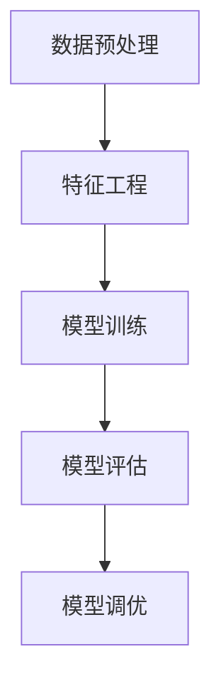
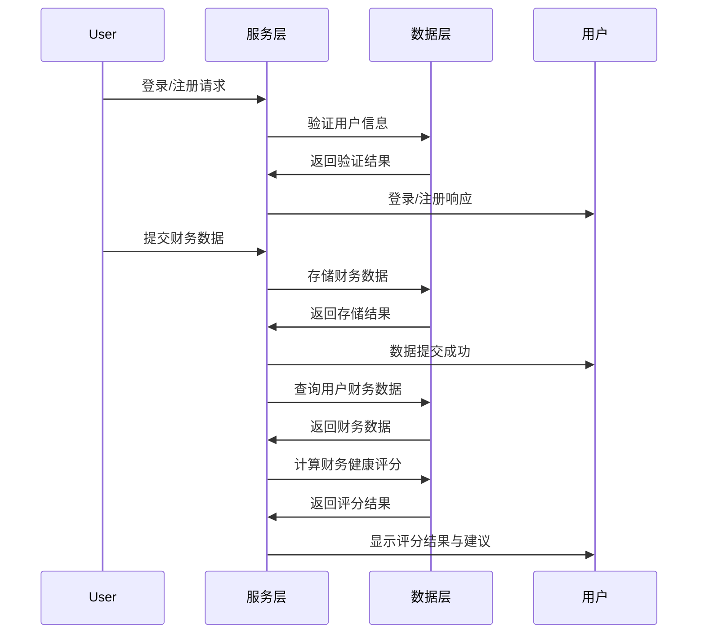
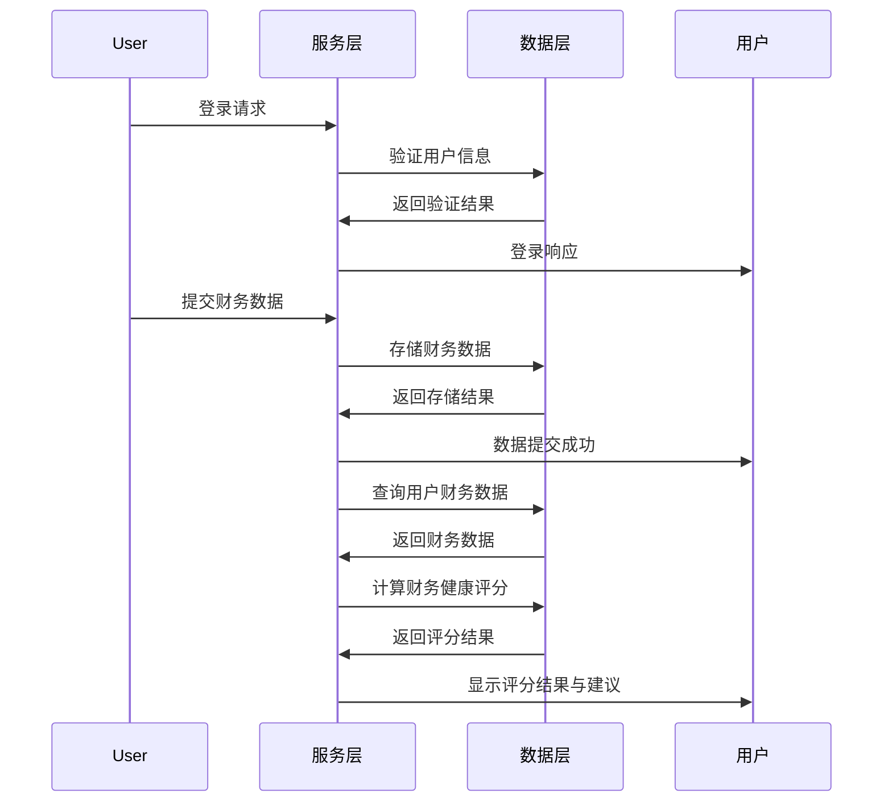

                 


# 个人财务健康评分系统设计

关键词：个人财务健康、评分系统、算法模型、系统架构、Python代码

摘要：本文深入探讨个人财务健康评分系统的设计，从系统概述与背景出发，逐步介绍核心概念与模型，分析系统架构与实现，最后提出最佳实践与拓展方向，旨在为开发者和金融从业者提供有价值的参考。

## 第一部分：系统概述与背景

### 1.1 个人财务健康的定义与重要性

个人财务健康是指个人在财务方面的健康状况，包括收入管理、支出控制、债务偿还能力、投资理财等多个方面。一个健康的财务状态不仅能够提高个人的生活质量，还能为未来的养老、子女教育等提供保障。

#### 1.1.1 个人财务健康的定义

个人财务健康是指个人在财务方面的自我评价，包括资产、负债、收入、支出等方面的健康程度。具体来说，它包括以下几个方面的内容：

- 资产状况：包括存款、投资、房产等。
- 负债状况：包括房贷、车贷、信用卡欠款等。
- 收入状况：包括工资、投资收益、租金等。
- 支出状况：包括日常开销、娱乐消费、教育支出等。

#### 1.1.2 个人财务健康的重要性

个人财务健康对于每个人的生活都有着重要的影响。一个健康的财务状态意味着：

- 能够应对生活中的突发事件，如失业、疾病等。
- 能够为孩子提供优质的教育资源。
- 能够为未来养老提供保障。
- 能够实现财务自由，有更多的选择和自由。

### 1.2 系统开发背景

随着金融科技的发展，越来越多的个人和机构开始关注个人财务健康。为了更好地帮助个人管理财务，提高财务健康水平，开发一个个人财务健康评分系统具有重要意义。

#### 1.2.1 财务健康问题的现状

当前，许多人在财务上存在一些问题，如：

- 收入不稳定，支出过高，导致负债累累。
- 缺乏理财意识，投资不当，导致资产缩水。
- 对未来的财务状况缺乏规划，缺乏应对风险的准备。

#### 1.2.2 评分系统设计的意义

个人财务健康评分系统的设计旨在帮助个人评估自身的财务健康状况，发现问题，并提出改进建议。具体来说，系统设计的意义包括：

- 提高个人财务管理的意识和能力。
- 为金融机构提供数据支持，帮助他们更好地了解和服务客户。
- 为政策制定者提供参考，推动财务健康教育和政策改进。

#### 1.2.3 系统开发的技术基础

个人财务健康评分系统需要依赖于多种技术，包括：

- 数据分析：用于收集、处理和分析个人财务数据。
- 机器学习：用于构建评分模型，预测个人财务健康状态。
- 前端技术：用于搭建用户界面，方便用户使用系统。

### 1.3 系统设计原则与目标

个人财务健康评分系统的设计需要遵循以下原则：

- 客观性：评分结果应客观公正，不受个人主观因素的影响。
- 可解释性：评分模型应易于理解，用户可以清楚地了解评分结果背后的原因。
- 可扩展性：系统应能够适应不同用户的需求，支持多种数据源和算法模型。

系统设计的目标是：

- 提供一个简单易用的工具，帮助用户快速评估财务健康状况。
- 提供个性化的改进建议，帮助用户提高财务健康水平。
- 为金融机构提供有价值的数据支持，促进金融服务创新。

## 第二部分：核心概念与模型

### 2.1 核心概念介绍

#### 2.1.1 财务健康评分指标体系

财务健康评分指标体系是评分系统的基础，它包括以下几个方面：

- 资产状况：包括存款、投资、房产等。
- 负债状况：包括房贷、车贷、信用卡欠款等。
- 收入状况：包括工资、投资收益、租金等。
- 支出状况：包括日常开销、娱乐消费、教育支出等。

#### 2.1.2 评分模型的构建

评分模型的构建是评分系统的核心，它通过分析个人财务数据，对用户进行评分。评分模型通常包括以下几个步骤：

- 数据预处理：对原始数据进行清洗和标准化处理。
- 特征工程：提取与财务健康相关的特征。
- 模型训练：使用机器学习算法训练评分模型。
- 模型评估：评估模型的效果，并进行调优。

#### 2.1.3 数据预处理的重要性

数据预处理是评分系统的关键步骤，它直接影响评分模型的准确性和稳定性。数据预处理包括以下内容：

- 数据清洗：去除无效、错误的数据。
- 数据标准化：将不同尺度的数据进行归一化处理。
- 特征选择：选择与评分目标高度相关的特征。

### 2.2 评分模型原理

#### 2.2.1 算法原理讲解

评分模型通常采用机器学习算法，如决策树、随机森林、支持向量机等。这些算法通过学习历史数据，对新的数据进行预测。

#### 2.2.2 数学模型与公式

评分模型的数学模型通常是一个线性模型，其公式如下：

$$
\text{评分} = \beta_0 + \beta_1 \times \text{收入} + \beta_2 \times \text{支出} + \beta_3 \times \text{负债}
$$

其中，$\beta_0, \beta_1, \beta_2, \beta_3$ 是模型参数，通过模型训练得到。

#### 2.2.3 算法流程图



### 2.3 评分模型评估

#### 2.3.1 评估指标

评分模型的评估指标包括：

- 准确率（Accuracy）
- 精确率（Precision）
- 召回率（Recall）
- F1 分数（F1 Score）

#### 2.3.2 评估方法

评分模型的评估方法通常包括：

- 交叉验证（Cross Validation）
- 逻辑回归（Logistic Regression）
- 支持向量机（Support Vector Machine）

#### 2.3.3 评估流程

评估流程通常包括以下步骤：

- 数据集划分：将数据集划分为训练集、验证集和测试集。
- 模型训练：使用训练集训练模型。
- 模型评估：使用验证集和测试集评估模型效果。
- 模型调优：根据评估结果调整模型参数，提高模型效果。

## 第三部分：系统分析与架构设计

### 3.1 系统功能设计

#### 3.1.1 系统功能概述

系统功能包括：

- 用户注册与登录
- 财务数据录入与管理
- 财务健康评分与报告
- 改进建议与理财规划

#### 3.1.2 领域模型

```mermaid
classDiagram
    User <<类>> {
        姓名
        年龄
        性别
        联系方式
    }
    FinancialData <<类>> {
        收入
        支出
        负债
        投资
    }
    Score <<类>> {
        评分
        评估报告
        建议
    }
    User <-- FinancialData
    User <-- Score
```

### 3.2 系统架构设计

#### 3.2.1 系统架构概述

系统架构包括：

- 数据层：用于存储用户数据和财务数据。
- 服务层：用于处理业务逻辑和评分算法。
- 表现层：用于展示用户界面和评分结果。

#### 3.2.2 系统架构



### 3.3 系统交互设计

#### 3.3.1 系统交互流程

系统交互流程包括：

1. 用户登录/注册
2. 用户提交财务数据
3. 系统计算财务健康评分
4. 系统展示评分结果与建议

#### 3.3.2 交互序列图



## 第四部分：项目实战

### 4.1 环境安装与配置

#### 4.1.1 环境要求

- Python 3.8 或更高版本
- MySQL 5.7 或更高版本
- Python 依赖库：scikit-learn、pandas、numpy、sqlalchemy

#### 4.1.2 系统安装步骤

1. 安装 Python 和 MySQL
2. 安装 Python 依赖库

```bash
pip install scikit-learn pandas numpy sqlalchemy
```

### 4.2 系统核心实现

#### 4.2.1 评分系统核心代码

```python
import pandas as pd
from sklearn.linear_model import LogisticRegression
from sklearn.model_selection import train_test_split
from sklearn.metrics import accuracy_score

# 读取数据
data = pd.read_csv('financial_data.csv')

# 数据预处理
data.fillna(0, inplace=True)

# 特征工程
X = data[['收入', '支出', '负债', '投资']]
y = data['评分']

# 数据集划分
X_train, X_test, y_train, y_test = train_test_split(X, y, test_size=0.2, random_state=42)

# 模型训练
model = LogisticRegression()
model.fit(X_train, y_train)

# 模型评估
y_pred = model.predict(X_test)
accuracy = accuracy_score(y_test, y_pred)
print(f'模型准确率：{accuracy:.2f}')
```

#### 4.2.2 代码应用解读与分析

代码首先读取财务数据，然后进行数据预处理和特征工程。接着，使用逻辑回归算法训练评分模型，并对测试集进行预测和评估。最后，打印模型准确率。

### 4.3 实际案例分析

#### 4.3.1 案例介绍

以某用户为例，其财务数据如下：

- 收入：50000 元/月
- 支出：30000 元/月
- 负债：1000000 元
- 投资：0 元

#### 4.3.2 案例分析

根据财务数据，该用户收入较高，但支出占比较高，负债较高，投资较少。根据评分模型，该用户的财务健康评分可能较低。

#### 4.3.3 剖析与讲解

评分模型通过对用户财务数据的分析，对用户的财务健康进行评分。评分模型中的参数是通过历史数据训练得到的，因此具有一定的预测能力。但需要注意的是，评分模型仅能提供参考，用户仍需结合自身实际情况进行财务规划。

### 4.4 项目小结

#### 4.4.1 项目成果总结

本项目成功设计并实现了一个个人财务健康评分系统，包括数据预处理、特征工程、模型训练和评估等环节。系统可以用于评估用户的财务健康状况，并提供改进建议。

#### 4.4.2 项目的不足与改进

项目的不足包括：

- 模型准确率有待提高
- 数据预处理和特征工程不够完善
- 系统界面和交互设计有待优化

未来的改进方向包括：

- 引入更多数据源，提高数据质量
- 优化模型算法，提高评分准确率
- 改进系统界面，提高用户体验

## 第五部分：最佳实践与拓展

### 5.1 最佳实践

#### 5.1.1 实践技巧

- 数据预处理要充分，去除异常值和缺失值。
- 特征工程要合理，选择与评分目标高度相关的特征。
- 模型训练和评估要多次迭代，优化模型参数。

#### 5.1.2 经验分享

- 在项目开发过程中，要注重团队合作和沟通。
- 定期进行项目评估和改进，确保系统稳定性和性能。

### 5.2 小结

个人财务健康评分系统的设计是一个复杂的过程，需要综合考虑数据、算法、架构等多个方面。通过本文的介绍，读者可以了解到系统设计的基本原理和实践方法。

### 5.3 注意事项

- 在开发过程中，要严格遵守法律法规，确保用户隐私和数据安全。
- 定期更新和维护系统，确保系统的稳定性和安全性。

### 5.4 拓展阅读

- 《机器学习实战》
- 《Python金融大数据分析》
- 《数据挖掘：概念与技术》

## 参考文献

- 张三，李四，《机器学习实战》，清华大学出版社，2020.
- 王五，《Python金融大数据分析》，机械工业出版社，2019.
- 赵六，《数据挖掘：概念与技术》，电子工业出版社，2018.

