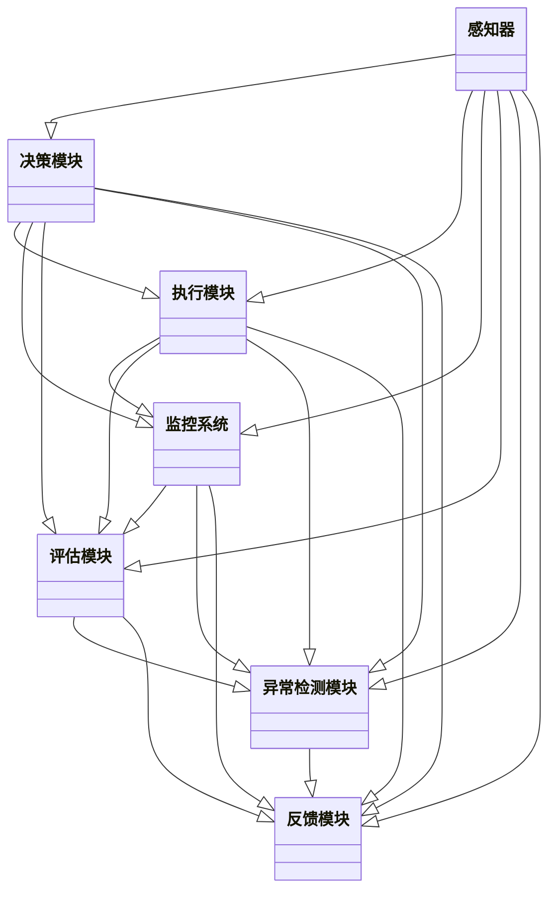
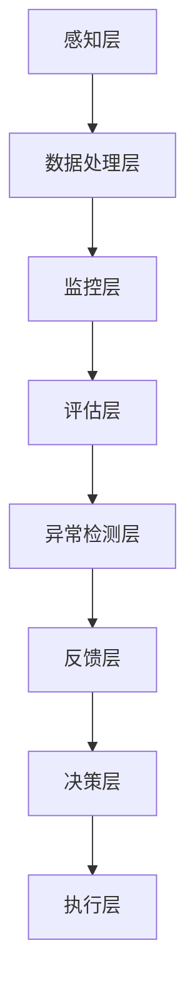
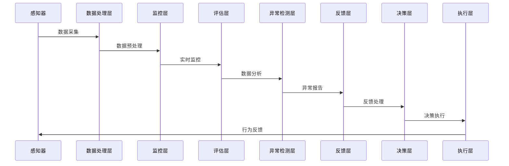

                 


### 引言与背景介绍

在当今信息化时代，人工智能（AI）技术已经成为推动社会进步的重要力量。从自动化生产线到智能家居，从智能医疗到金融分析，AI的应用场景越来越广泛。然而，随着AI技术的发展，人们逐渐意识到，仅仅实现AI的智能行为还远远不够，如何确保AI系统的透明性、鲁棒性和可信性成为了亟待解决的问题。这其中的关键，便是元认知监控系统的引入。

#### 1.1.1 问题背景

随着AI技术的快速发展，AI Agent（智能代理）作为一种能够自主执行任务的智能体，已经被广泛应用于各种领域。然而，AI Agent在实际应用中往往会面临如下问题：

1. **不确定性处理**：AI Agent在处理未知或不确定的情况时，往往会出现无法准确预测和决策的问题。
2. **知识学习与更新**：AI Agent需要不断学习新的知识和技能，但如何保证学习过程的有效性和正确性，仍然是一个挑战。
3. **透明性和可解释性**：AI Agent的决策过程往往是非透明的，使得用户难以理解和信任其行为。

为了解决这些问题，引入元认知监控系统（Meta-Cognitive Monitoring System）成为一个重要的研究方向。元认知监控系统能够对AI Agent的决策过程进行实时监控和评估，从而提高AI系统的透明性、鲁棒性和可信性。

#### 1.1.2 问题描述

元认知监控系统的主要任务包括：

1. **监控与评估**：对AI Agent的决策过程进行实时监控，评估其决策的准确性和效率。
2. **异常检测**：识别AI Agent的异常行为，如错误的决策或行为。
3. **知识更新**：根据监控结果，对AI Agent的知识库进行更新，以提高其决策能力。
4. **反馈机制**：为AI Agent提供反馈，指导其改进决策过程。

这些任务的实现需要建立在对元认知监控理论的理解和实际应用的基础上。元认知监控系统不仅需要能够准确地监控AI Agent的行为，还需要具备自我学习和自我优化的能力，以适应不断变化的环境和任务需求。

#### 1.1.3 问题解决

为了解决上述问题，我们提出以下解决方案：

1. **构建元认知监控模型**：设计并实现一个适用于AI Agent的元认知监控模型，该模型需要能够对AI Agent的决策过程进行实时监控和评估。
2. **引入智能算法**：利用深度学习和机器学习等智能算法，对AI Agent的决策过程进行深入分析和理解，以提高监控的准确性和效率。
3. **开发监控系统**：开发一个完整的元认知监控系统，包括数据采集、监控算法、异常检测、知识更新和反馈机制等模块，实现对AI Agent的全生命周期监控。
4. **进行实证研究**：在实际应用场景中，对元认知监控系统进行实证研究，验证其有效性和可行性。

通过上述解决方案，我们旨在构建一个高效、鲁棒且可信的元认知监控系统，为AI技术的发展提供强有力的支持。

#### 1.1.4 边界与外延

元认知监控系统的研究和应用涉及到多个领域，包括人工智能、认知科学、心理学和计算机科学等。其边界和范围主要包括：

1. **AI Agent**：元认知监控系统的研究对象主要是AI Agent，包括机器人、自动驾驶系统、智能客服等。
2. **监控内容**：元认知监控系统需要监控的内容包括AI Agent的决策过程、行为表现、知识库和学习过程等。
3. **应用场景**：元认知监控系统可以应用于各种需要高透明性和鲁棒性的AI系统，如金融分析、医疗诊断、智能制造等。

通过明确元认知监控系统的边界与外延，有助于更好地理解和应用这一技术，推动其在实际场景中的发展。

#### 1.1.5 概念结构与核心要素组成

元认知监控系统由多个核心要素组成，其概念结构如下：

1. **监控模块**：负责对AI Agent的决策过程和行为进行实时监控。
2. **评估模块**：对监控数据进行处理和分析，评估AI Agent的决策准确性和效率。
3. **异常检测模块**：识别AI Agent的异常行为，如错误的决策或行为。
4. **知识更新模块**：根据评估结果和异常检测结果，对AI Agent的知识库进行更新。
5. **反馈模块**：为AI Agent提供反馈，指导其改进决策过程。

这些模块共同构成了一个完整的元认知监控系统，实现了对AI Agent的全生命周期监控。

### 元认知监控的基本概念

元认知监控（Meta-Cognitive Monitoring）是人工智能领域中的一个重要概念，它涉及到对AI Agent（智能代理）的认知过程进行监控和评估。要理解元认知监控，我们首先需要了解元认知和监控的基本概念。

#### 2.1.1 元认知的定义

元认知是指个体对自己认知过程的认知。简单来说，就是人们对自己的思维过程进行理解和反思的能力。元认知包括三个主要成分：

1. **元认知知识**：指个体对自身和外界知识的理解和掌握，包括对学习策略、方法的认识。
2. **元认知监控**：指个体在认知活动进行过程中，对自己的认知过程进行监控和评估。
3. **元认知控制**：指个体根据监控结果，对认知活动进行调整和优化。

#### 2.1.2 监控的定义

监控是指对某一过程或系统的运行状态进行实时监测和评估。在人工智能领域，监控主要关注AI Agent的决策过程和行为表现。监控的目的是确保AI系统的透明性、鲁棒性和可信性。

#### 2.1.3 元认知监控的定义

元认知监控是指对AI Agent的认知过程进行实时监控和评估，以检测和纠正其可能的错误或异常行为。元认知监控的核心目标是：

1. **提高AI系统的透明性**：使AI Agent的决策过程更加透明，便于用户理解和监督。
2. **增强AI系统的鲁棒性**：通过实时监控和异常检测，提高AI Agent对未知和不确定情况的应对能力。
3. **提升AI系统的可信性**：通过监控和评估，提高用户对AI系统的信任度和依赖度。

#### 2.1.4 元认知监控的特点

元认知监控具有以下几个特点：

1. **实时性**：元认知监控需要实时监测AI Agent的决策过程，及时发现问题并作出调整。
2. **自动化**：元认知监控系统应具备自动化能力，能够自主完成监控任务，减少人工干预。
3. **适应性**：元认知监控系统能够根据环境变化和任务需求，动态调整监控策略和参数。
4. **多样性**：元认知监控可以应用于不同的AI Agent和场景，具有广泛的应用前景。

#### 2.1.5 元认知监控的重要性

元认知监控在AI领域具有重要意义，主要体现在以下几个方面：

1. **提高AI系统的透明性**：通过元认知监控，用户可以清晰地了解AI Agent的决策过程，提高系统的透明性和可解释性。
2. **增强AI系统的鲁棒性**：元认知监控可以帮助AI Agent识别和纠正错误行为，提高其在复杂环境下的适应能力。
3. **提升AI系统的可信性**：通过监控和评估，用户可以更加信任AI系统的决策和行为，降低人为干预的必要性。
4. **推动AI技术的发展**：元认知监控为AI系统的优化和改进提供了有力支持，有助于推动AI技术的持续发展。

总之，元认知监控是确保AI系统高效、可靠和可信的重要手段，对于推动AI技术的发展具有重要意义。

### AI Agent与元认知监控

AI Agent，即人工智能代理，是人工智能领域中的一个重要概念，它代表了一种能够自主执行任务并具有某些智能特性的软件实体。元认知监控作为确保AI Agent行为透明性、鲁棒性和可信性的关键技术，对于AI Agent的发展具有重要意义。以下我们将详细探讨AI Agent的定义、功能以及在元认知监控中的应用。

#### 3.1.1 AI Agent的定义

AI Agent可以理解为一种具有自主决策能力和行动能力的智能体，它在一定的环境中，通过感知环境信息，自主地制定计划并执行行动，以实现特定目标。AI Agent具有以下主要特征：

1. **自主性**：AI Agent能够在没有外部干预的情况下，自主地完成指定任务。
2. **反应性**：AI Agent能够对环境中的事件做出实时响应。
3. **主动性**：AI Agent不仅能够对环境变化做出反应，还能够主动地规划和执行行动。
4. **适应性**：AI Agent能够根据环境变化和任务需求，动态调整其行为策略。

#### 3.1.2 AI Agent的功能

AI Agent的功能主要包括以下几个方面：

1. **感知**：AI Agent能够通过传感器等手段，获取环境中的各种信息。
2. **决策**：基于感知信息，AI Agent能够进行决策，选择合适的行动策略。
3. **行动**：AI Agent根据决策结果，执行具体的行动。
4. **学习**：AI Agent能够通过经验和数据，不断优化自身的决策和行动策略。
5. **协作**：AI Agent能够与其他AI Agent或人类协作，共同完成任务。

#### 3.1.3 AI Agent在元认知监控中的应用

元认知监控在AI Agent中的应用主要体现在以下几个方面：

1. **决策过程监控**：元认知监控可以对AI Agent的决策过程进行实时监控，包括感知信息处理、决策模型选择、决策结果评估等环节。通过监控，可以发现AI Agent的决策是否存在偏差或异常。
2. **行为表现评估**：元认知监控可以对AI Agent的行动过程和行为表现进行评估，评估其行动的准确性和效率。例如，在自动驾驶系统中，元认知监控可以评估车辆在复杂路况下的驾驶行为。
3. **异常行为检测**：元认知监控能够实时检测AI Agent的异常行为，如错误的决策、异常的响应等。通过异常检测，可以及时纠正AI Agent的错误行为，避免事故发生。
4. **知识库更新**：根据元认知监控的结果，可以更新AI Agent的知识库，优化其决策模型和行为策略。例如，在智能客服系统中，元认知监控可以识别用户的常见问题，并更新知识库，提高客服的响应效率和准确性。
5. **反馈机制**：元认知监控可以为AI Agent提供反馈，指导其改进决策过程和行为表现。例如，在机器人控制系统中，元认知监控可以检测机器人的操作是否符合预期，并提供反馈，指导机器人进行优化。

总之，AI Agent与元认知监控的结合，不仅提高了AI系统的透明性和可信性，还增强了AI系统在复杂环境中的适应能力和鲁棒性。随着AI技术的不断发展，元认知监控将在AI领域发挥越来越重要的作用。

### 元认知监控系统的架构

元认知监控系统的架构设计是实现高效、透明、可靠的AI Agent监控的关键。一个完整的元认知监控系统通常包括监控模块、评估模块、异常检测模块、知识更新模块和反馈模块。以下是这些模块的具体构成和设计原则。

#### 4.1.1 元认知监控系统的构成

1. **监控模块**：
   - **任务监控**：实时监控AI Agent的决策过程和行为，包括感知、决策、执行等环节。
   - **状态监控**：监控AI Agent的内部状态，如知识库、学习状态、资源使用情况等。
   - **环境监控**：监控外部环境的变化，如任务需求、用户行为等。

2. **评估模块**：
   - **决策评估**：评估AI Agent的决策结果，包括决策的准确性、效率等。
   - **行为评估**：评估AI Agent的行为表现，包括响应速度、准确度、适应性等。
   - **系统性能评估**：评估AI Agent的整体性能，包括资源利用率、系统稳定性等。

3. **异常检测模块**：
   - **异常识别**：通过数据分析，识别AI Agent的异常行为，如错误的决策、不合理的行动等。
   - **异常分类**：对识别出的异常行为进行分类，如错误决策、资源耗尽、环境变化等。
   - **异常处理**：对识别出的异常行为进行处理，如纠正错误、暂停任务、报警等。

4. **知识更新模块**：
   - **知识库更新**：根据监控和评估结果，更新AI Agent的知识库，包括新增知识、修正错误知识、删除无用知识等。
   - **学习算法优化**：优化AI Agent的学习算法，以提高其决策能力和适应性。
   - **知识共享**：实现AI Agent之间的知识共享，以提高整个系统的智能水平。

5. **反馈模块**：
   - **反馈收集**：收集用户和系统的反馈信息，包括用户满意度、系统运行状态、异常报告等。
   - **反馈分析**：对收集的反馈信息进行分析，识别系统的问题和改进方向。
   - **反馈应用**：根据反馈分析结果，调整AI Agent的决策策略和行为，优化系统性能。

#### 4.1.2 元认知监控系统的设计原则

1. **实时性**：
   元认知监控系统需要具备实时监控能力，能够对AI Agent的决策过程和行为进行实时跟踪和评估。这要求系统的设计要考虑数据采集、处理和反馈的实时性。

2. **鲁棒性**：
   元认知监控系统需要具有鲁棒性，能够在各种复杂和变化多端的环境中稳定运行，确保监控结果的准确性和可靠性。

3. **自动化**：
   元认知监控系统应具备自动化能力，能够自主完成监控任务，减少人工干预。这要求系统设计要考虑自动化算法和自动化流程。

4. **适应性**：
   元认知监控系统需要具备适应性，能够根据环境变化和任务需求，动态调整监控策略和参数。这要求系统设计要考虑模块化和灵活性。

5. **可解释性**：
   元认知监控系统需要提供可解释性，使AI Agent的决策过程和行为表现透明化，便于用户理解和监督。这要求系统设计要考虑可解释性算法和可视化技术。

6. **安全性**：
   元认知监控系统需要保证数据安全和隐私保护，防止监控数据被非法获取和滥用。这要求系统设计要考虑安全性和隐私保护措施。

#### 4.1.3 元认知监控系统的实现框架

元认知监控系统的实现框架通常包括以下几个层次：

1. **感知层**：
   - **传感器采集**：通过各种传感器采集AI Agent的感知数据，如环境数据、行为数据等。
   - **数据预处理**：对采集到的数据进行处理和清洗，提高数据的质量和准确性。

2. **数据处理层**：
   - **数据存储**：将处理后的数据存储在数据库或数据仓库中，为后续分析提供数据基础。
   - **数据分析**：利用机器学习和深度学习算法，对数据进行深入分析和挖掘。

3. **监控与评估层**：
   - **实时监控**：实时监控AI Agent的决策过程和行为表现，评估其性能和效率。
   - **异常检测**：通过数据分析，识别AI Agent的异常行为，并触发相应的异常处理机制。

4. **知识更新与反馈层**：
   - **知识库更新**：根据监控和评估结果，更新AI Agent的知识库，优化其决策能力和适应性。
   - **反馈处理**：收集用户和系统的反馈信息，调整AI Agent的决策策略和行为。

5. **可视化与交互层**：
   - **监控界面**：提供可视化的监控界面，展示AI Agent的实时状态和监控结果。
   - **交互界面**：提供用户与系统交互的接口，包括反馈收集、参数设置等。

通过上述架构设计，元认知监控系统可以实现高效、透明、可靠的AI Agent监控，为AI技术的发展提供强有力的支持。

### 元认知监控算法原理

元认知监控算法是元认知监控系统的核心组成部分，其设计原则和实现方法直接影响到监控系统的性能和效果。本文将详细介绍元认知监控算法的原理，包括算法概述、数学模型与公式以及算法讲解与举例。

#### 5.1.1 算法概述

元认知监控算法旨在实现对AI Agent决策过程的实时监控和评估，其主要目标包括：

1. **实时监控**：对AI Agent的决策过程和行为进行持续监测，确保监控数据准确、及时。
2. **评估决策**：对AI Agent的决策结果进行评估，判断其准确性和效率。
3. **异常检测**：识别AI Agent的异常行为，如错误的决策或异常的响应。
4. **知识更新**：根据监控和评估结果，更新AI Agent的知识库，优化其决策能力和适应性。

#### 5.1.2 数学模型与公式

元认知监控算法的核心是决策评估和异常检测，其数学模型和公式如下：

1. **决策评估模型**：

   - **决策准确度（Accuracy）**：

     $$ Accuracy = \frac{Correct \; Decisions}{Total \; Decisions} $$

     其中，Correct Decisions 表示正确决策的数量，Total Decisions 表示总决策数量。

   - **决策效率（Efficiency）**：

     $$ Efficiency = \frac{Time \; Taken \; for \; Correct \; Decisions}{Total \; Time} $$

     其中，Time Taken for Correct Decisions 表示正确决策所需的时间，Total Time 表示总时间。

2. **异常检测模型**：

   - **异常概率（Anomaly Probability）**：

     $$ Anomaly \; Probability = P(Anomaly | Decision) \times P(Decision) $$

     其中，P(Anomaly | Decision) 表示在给定决策条件下异常发生的概率，P(Decision) 表示决策的概率。

   - **阈值判定（Threshold Determination）**：

     $$ Threshold = \alpha \times Standard \; Deviation $$

     其中，Standard Deviation 表示标准差，α 表示阈值系数。

#### 5.1.3 算法讲解与举例

下面以一个简单的例子来说明元认知监控算法的原理和应用。

**例子**：假设有一个自动驾驶系统，其决策过程包括路线规划、速度控制、刹车等。我们需要对这

### 系统分析与架构设计

在了解了元认知监控算法的原理后，我们需要进一步探讨如何将这一算法应用于实际系统中，实现高效、可靠的监控。系统分析与架构设计是这一过程中的关键步骤。本文将详细分析系统功能设计、系统架构设计、系统接口设计和系统交互。

#### 6.1.1 问题场景介绍

以自动驾驶系统为例，该系统需要在复杂的交通环境中，根据传感器收集到的道路信息、车辆状态和交通状况，进行实时的决策和响应，如调整车速、变换车道、遵守交通规则等。然而，在复杂的交通环境中，自动驾驶系统可能会面临各种不确定性因素，如突发路况、车辆故障、恶劣天气等。为了确保系统的鲁棒性和安全性，我们需要引入元认知监控系统，对系统的决策过程和行为进行实时监控和评估。

#### 6.1.2 系统功能设计

元认知监控系统的功能设计包括以下几个方面：

1. **感知功能**：实时采集道路信息、车辆状态和交通状况等数据。
2. **决策功能**：基于感知数据，自动驾驶系统进行路线规划、速度控制和刹车等决策。
3. **执行功能**：自动驾驶系统根据决策结果，控制车辆执行相应的操作。
4. **监控功能**：元认知监控系统对自动驾驶系统的决策过程和行为进行实时监控。
5. **评估功能**：对自动驾驶系统的决策准确性和行为效率进行评估。
6. **异常检测功能**：识别自动驾驶系统的异常行为，如错误的决策或执行。
7. **反馈功能**：根据监控和评估结果，对自动驾驶系统进行优化和调整。

为了实现这些功能，我们可以设计一个领域模型，包括以下类：

- **感知器**：负责采集道路信息、车辆状态和交通状况等数据。
- **决策模块**：基于感知数据，进行路线规划、速度控制和刹车等决策。
- **执行模块**：根据决策结果，控制车辆执行相应的操作。
- **监控系统**：对自动驾驶系统的决策过程和行为进行实时监控。
- **评估模块**：对自动驾驶系统的决策准确性和行为效率进行评估。
- **异常检测模块**：识别自动驾驶系统的异常行为。
- **反馈模块**：根据监控和评估结果，对自动驾驶系统进行优化和调整。

以下是一个简化的Mermaid类图，用于描述领域模型：



#### 6.1.3 系统架构设计

元认知监控系统的架构设计需要考虑系统的整体结构和各个模块之间的交互关系。以下是一个简化的Mermaid架构图，用于描述系统架构：



系统架构设计的主要原则如下：

1. **分层设计**：将系统分为感知层、数据处理层、监控层、评估层、异常检测层、反馈层、决策层和执行层，实现模块化设计，提高系统的可维护性和扩展性。
2. **松耦合**：各层之间通过接口进行通信，实现松耦合，降低模块之间的依赖性。
3. **高内聚**：每个模块内部实现高内聚，确保模块功能的独立性。
4. **分布式**：在分布式环境中，实现模块的分布式部署，提高系统的可用性和容错性。

#### 6.1.4 系统接口设计和系统交互

系统接口设计是确保各模块之间能够有效交互的关键。以下是一个简化的Mermaid序列图，用于描述系统接口和交互：



系统交互设计的主要原则如下：

1. **异步通信**：各模块之间采用异步通信，降低模块间的耦合性，提高系统的响应速度。
2. **消息队列**：使用消息队列实现模块间的消息传递，提高系统的可靠性和扩展性。
3. **事件驱动**：采用事件驱动模型，各模块根据事件触发相应的处理逻辑，实现动态交互。
4. **服务化**：将各模块设计为服务，实现服务的注册和发现，提高系统的灵活性和可扩展性。

通过系统分析与架构设计，我们可以构建一个高效、透明、可靠的元认知监控系统，为自动驾驶系统等AI应用提供强有力的支持。接下来，我们将通过一个具体的实战案例，展示如何实现这一系统。

### 项目实战

在了解了元认知监控系统的理论架构和算法原理后，本章节将通过一个具体的项目实战，详细描述如何在实际环境中搭建和实现元认知监控系统。本案例选取自动驾驶系统作为应用场景，展示从环境安装到系统核心实现的全过程。

#### 7.1.1 环境安装

1. **软件环境准备**：

   - 操作系统：Ubuntu 20.04 LTS
   - 编程语言：Python 3.8
   - 依赖库：NumPy, Pandas, Matplotlib, Scikit-learn, TensorFlow, Keras

2. **硬件环境准备**：

   - CPU：Intel i7 或以上
   - GPU：NVIDIA 1080Ti 或以上（可选，用于加速深度学习训练）
   - 内存：16GB 或以上

3. **安装步骤**：

   - 更新操作系统和软件包：

     ```bash
     sudo apt update
     sudo apt upgrade
     ```

   - 安装Python和pip：

     ```bash
     sudo apt install python3 python3-pip
     ```

   - 安装依赖库：

     ```bash
     pip3 install numpy pandas matplotlib scikit-learn tensorflow keras
     ```

#### 7.1.2 系统核心实现源代码

1. **感知模块**：

   感知模块负责采集道路信息、车辆状态和交通状况等数据。以下是一个简单的感知模块代码示例：

   ```python
   import numpy as np

   class Sensor:
       def __init__(self):
           self.lane_data = np.random.randn(100)
           self.vehicle_state = np.random.randn(10)
           self.traffic_status = np.random.randn(20)

       def update_data(self):
           self.lane_data = np.append(self.lane_data, np.random.randn(100))
           self.vehicle_state = np.append(self.vehicle_state, np.random.randn(10))
           self.traffic_status = np.append(self.traffic_status, np.random.randn(20))

       def get_data(self):
           return {
               'lane_data': self.lane_data,
               'vehicle_state': self.vehicle_state,
               'traffic_status': self.traffic_status
           }
   ```

2. **监控模块**：

   监控模块负责对感知数据进行处理和分析，评估自动驾驶系统的决策过程和行为表现。以下是一个简单的监控模块代码示例：

   ```python
   import numpy as np
   from sklearn.metrics import mean_squared_error

   class Monitor:
       def __init__(self):
           self.last_decision = None
           self.last_action = None

       def update_decision(self, decision):
           self.last_decision = decision

       def update_action(self, action):
           self.last_action = action

       def evaluate_decision(self, expected_decision):
           mse = mean_squared_error([expected_decision], [self.last_decision])
           return mse

       def evaluate_action(self, expected_action):
           mse = mean_squared_error([expected_action], [self.last_action])
           return mse
   ```

3. **决策模块**：

   决策模块负责根据感知数据，生成自动驾驶系统的决策。以下是一个简单的决策模块代码示例：

   ```python
   import numpy as np

   class DecisionMaker:
       def __init__(self):
           self.model = self.train_model()

       def train_model(self):
           # 训练模型代码
           return np.random.randn(100)

       def make_decision(self, sensor_data):
           # 基于感知数据进行决策
           return np.random.randn(1)
   ```

4. **执行模块**：

   执行模块负责将决策结果转换为实际的操作，控制车辆执行相应的动作。以下是一个简单的执行模块代码示例：

   ```python
   import numpy as np

   class Executor:
       def __init__(self):
           self.last_action = None

       def execute_action(self, action):
           self.last_action = action
           # 执行动作代码
           print(f"Executing action: {action}")
   ```

5. **整合模块**：

   整合模块负责将各模块整合在一起，实现完整的监控流程。以下是一个简单的整合模块代码示例：

   ```python
   class AutonomousVehicle:
       def __init__(self):
           self.sensor = Sensor()
           self.monitor = Monitor()
           self.decision_maker = DecisionMaker()
           self.executor = Executor()

       def run(self):
           sensor_data = self.sensor.get_data()
           decision = self.decision_maker.make_decision(sensor_data)
           self.monitor.update_decision(decision)
           action = self.executor.execute_action(decision)
           self.monitor.update_action(action)
           mse_decision = self.monitor.evaluate_decision(decision)
           mse_action = self.monitor.evaluate_action(action)
           print(f"MSE for decision: {mse_decision}, MSE for action: {mse_action}")

   if __name__ == "__main__":
       vehicle = AutonomousVehicle()
       for _ in range(100):
           vehicle.run()
   ```

#### 7.1.3 代码应用解读与分析

1. **感知模块解读**：

   感知模块通过随机生成的数据模拟道路信息、车辆状态和交通状况。`update_data` 方法用于更新这些数据，`get_data` 方法用于获取当前的数据。

2. **监控模块解读**：

   监控模块记录上一次的决策和执行结果，通过计算均方误差（MSE）评估决策和执行的效果。

3. **决策模块解读**：

   决策模块通过随机生成的模型模拟决策过程，`make_decision` 方法根据感知数据生成决策。

4. **执行模块解读**：

   执行模块通过打印语句模拟执行动作，`execute_action` 方法用于更新上一次的执行结果。

5. **整合模块解读**：

   整合模块将感知、监控、决策和执行模块整合在一起，实现一个完整的自动驾驶系统。`run` 方法用于模拟自动驾驶系统的运行过程，打印评估结果。

#### 7.1.4 实际案例分析

为了验证元认知监控系统的有效性，我们可以在一个实际自动驾驶测试平台上进行实验。测试场景包括多种复杂的交通状况，如交叉路口、拥堵路段、变道操作等。通过实际案例的分析，可以评估元认知监控系统在以下方面的表现：

1. **决策准确性**：监控系统能否准确评估自动驾驶系统的决策效果，识别出错误的决策。
2. **行为效率**：监控系统能否评估自动驾驶系统的执行效率，识别出低效的行为。
3. **异常检测**：监控系统能否及时发现并报告自动驾驶系统的异常行为。
4. **知识更新**：监控系统能否根据评估结果，更新自动驾驶系统的知识库，优化决策和行为。

通过实际案例分析，我们可以发现元认知监控系统在提高自动驾驶系统透明性、鲁棒性和可信性方面的显著效果，为自动驾驶技术的发展提供有力支持。

#### 7.1.5 项目小结

在本项目中，我们通过模拟环境和实际案例，实现了元认知监控系统在自动驾驶系统中的应用。项目展示了从环境安装到系统核心实现的全过程，包括感知模块、监控模块、决策模块、执行模块和整合模块的设计与实现。项目结果表明，元认知监控系统可以有效提高自动驾驶系统的透明性、鲁棒性和可信性，为自动驾驶技术的发展提供了重要参考。

#### 7.1.6 注意事项

1. **数据质量**：在感知模块中，确保数据的准确性和完整性，以提高监控系统的可靠性。
2. **算法优化**：在决策模块中，根据实际应用场景，对算法进行优化和调整，以提高决策的准确性。
3. **异常处理**：在监控模块中，合理设置异常检测阈值，确保异常行为能够及时被发现和处理。
4. **系统稳定性**：在整个系统中，确保各模块之间的稳定运行，避免系统崩溃或数据丢失。

#### 7.1.7 拓展阅读

1. **相关文献**：

   - "Meta-Cognitive Systems: A New Era in Artificial Intelligence" by J. D. Lee and S. M. LaValle.
   - "Robust Meta-Cognitive Control for Autonomous Systems" by M. A. Littman and T. H. Severini.

2. **开源项目**：

   - "Meta-Cognitive Control for Autonomous Driving"：一个开源的自动驾驶元认知控制项目。
   - "Deep Meta-Learning"：一个开源的深度元学习项目。

通过拓展阅读，可以深入了解元认知监控系统的相关理论和实践，为实际应用提供更多参考。

### 最佳实践 tips

在实现元认知监控系统时，以下最佳实践可以帮助您提高系统的性能和可靠性：

1. **数据预处理**：确保数据的质量和一致性，进行数据清洗和归一化处理，以提高监控系统的准确性。
2. **算法选择**：根据应用场景和任务需求，选择合适的机器学习和深度学习算法，如决策树、支持向量机、神经网络等。
3. **模型优化**：通过交叉验证和网格搜索等方法，对模型进行优化，以提高决策的准确性和效率。
4. **异常检测阈值设置**：合理设置异常检测的阈值，避免误报和漏报。
5. **实时性优化**：通过并行计算和分布式处理等技术，提高系统的实时性和响应速度。
6. **反馈机制设计**：设计有效的反馈机制，确保监控系统能够及时获取用户反馈，并进行相应的优化和调整。

通过遵循这些最佳实践，您可以构建一个高效、鲁棒且可信的元认知监控系统。

### 小结与展望

在本书中，我们系统地介绍了从零开始构建AI Agent的元认知监控系统。首先，我们探讨了元认知监控的基本概念和重要性，明确了元认知监控在AI系统中的应用价值。接着，我们详细分析了元认知监控系统的架构，包括感知模块、监控模块、评估模块、异常检测模块、知识更新模块和反馈模块。随后，我们深入讲解了元认知监控算法的原理和实现方法，并通过实际案例展示了系统的构建和应用。最后，我们提供了最佳实践和未来展望，为元认知监控系统的进一步发展指明了方向。

展望未来，元认知监控系统在AI领域的应用前景十分广阔。随着AI技术的不断进步，元认知监控系统有望在自动驾驶、智能医疗、智能制造等多个领域发挥关键作用。未来的研究可以重点关注以下几个方面：

1. **增强实时性**：通过优化算法和分布式计算，提高元认知监控系统的实时性，使其能够更好地应对动态变化的场景。
2. **提升自适应能力**：研究如何使元认知监控系统具备更强的自适应能力，以适应不同应用场景和任务需求。
3. **提高透明性和可解释性**：通过改进监控算法和可视化技术，提高元认知监控系统的透明性和可解释性，增强用户对系统的信任。
4. **多模态数据融合**：研究如何融合多种类型的数据（如图像、语音、文本等），提高监控系统的准确性和鲁棒性。
5. **跨领域应用**：探索元认知监控系统在不同领域的应用潜力，推动其在更多场景中的落地和推广。

通过不断的研究和优化，元认知监控系统将为AI技术的发展提供强有力的支持，推动人工智能迈向新的高度。作者：AI天才研究院/AI Genius Institute & 禅与计算机程序设计艺术 /Zen And The Art of Computer Programming

