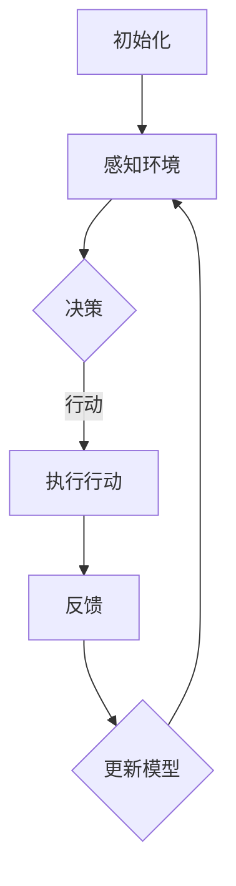
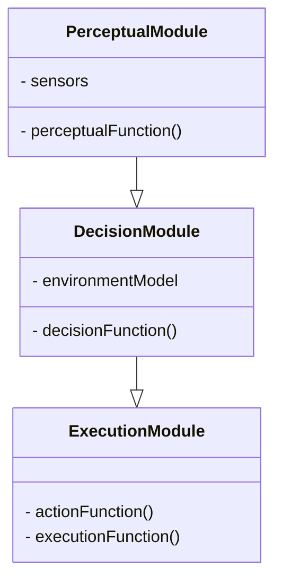
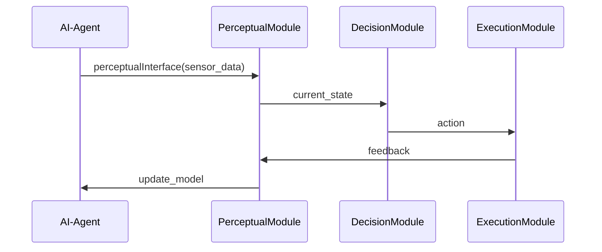

                 

**# 从零开始：AI Agent的自我意识模拟**

> **关键词：** AI Agent、自我意识、模拟、算法原理、系统架构、实战项目

> **摘要：** 本文将从零开始，详细探讨AI Agent的自我意识模拟。我们将首先介绍AI Agent的背景和基本概念，然后逐步深入到自我意识模拟的算法原理和实现方法，最后通过实际项目案例来展示如何将理论应用到实践中。本文旨在为读者提供一个系统、全面、易于理解的AI Agent自我意识模拟的学习路径。

----------------------------------------------------------------

**## 1. 背景与概述**

**### 1.1 问题背景**

在人工智能（AI）迅速发展的今天，AI Agent作为一个能够自主行动和决策的实体，已经成为研究者们关注的热点。然而，AI Agent的自我意识是一个复杂且具有挑战性的问题。自我意识的模拟对于AI Agent的智能化发展具有重要意义，它可以帮助AI Agent更好地理解和应对外部环境，提高其自主性和决策能力。

**### 1.2 问题描述**

自我意识是指个体对自己存在和周围环境的认知。对于AI Agent来说，自我意识的模拟意味着它能够识别和了解自己的状态、行为和周围环境，从而做出更合理的决策。然而，如何实现这一目标仍然是一个开放的问题，涉及到多学科的知识，如认知科学、心理学和计算机科学。

**### 1.3 问题解决**

为了解决AI Agent自我意识模拟的问题，本文将介绍一系列的算法原理和实现方法，包括基于机器学习的方法、基于神经网络的方法和基于逻辑推理的方法。通过这些方法，我们希望实现一个能够模拟自我意识的AI Agent，从而为AI Agent的智能化发展提供新的思路。

**### 1.4 边界与外延**

在实现自我意识模拟的过程中，我们需要明确一些边界和限制。首先，自我意识的模拟并非简单地复制人类意识，而是基于AI Agent的特点和需求进行设计。其次，自我意识模拟的效果受到数据质量和算法选择的影响，因此需要不断优化和调整。

**### 1.5 核心概念与结构**

本文的核心概念包括AI Agent、自我意识和模拟算法。其中，AI Agent是自我意识模拟的基础，自我意识是AI Agent的核心特征，模拟算法是实现自我意识的关键技术。本文的结构将按照以下顺序展开：首先介绍AI Agent的基本概念和类型，然后讨论自我意识的相关理论和模型，最后详细阐述模拟算法的原理和实现。

----------------------------------------------------------------

**## 2. 核心概念与联系**

**### 2.1 AI Agent的定义**

AI Agent是指具有感知、决策和执行能力的人工智能实体。它能够在复杂环境中独立完成特定任务，并通过不断学习和优化来提高性能。AI Agent可以分为两种类型：主动型Agent和反应型Agent。

**### 2.2 自我意识的概念**

自我意识是指个体对自己存在和周围环境的认知。在AI Agent中，自我意识可以表现为对自身状态、行为和外部环境的识别和理解。自我意识对于AI Agent的智能化发展具有重要意义，它可以帮助AI Agent更好地应对复杂环境，提高其决策能力和适应性。

**### 2.3 AI Agent模型**

常见的AI Agent模型包括基于规则的Agent、基于行为的Agent和基于智能体的Agent。其中，基于规则的Agent主要通过预设的规则来决策和行动；基于行为的Agent通过感知环境和执行行为来获取反馈；基于智能体的Agent则通过学习和优化来提高性能。

**### 2.4 自我意识特征对比**

为了更好地理解自我意识的模拟，我们需要对比不同AI Agent模型的自我意识特征。基于规则的Agent和基于行为的Agent在自我意识方面较为有限，而基于智能体的Agent则具有更强的自我意识能力。具体来说，基于智能体的Agent可以通过学习环境数据和自身行为来调整内部模型，从而实现对自我状态和行为的更好理解。

**### 2.5 ER实体关系图**

为了清晰地表示AI Agent、自我意识和模拟算法之间的关系，我们可以使用ER（实体关系）图来描述。ER图包括三个实体：AI Agent、自我意识和模拟算法。其中，AI Agent是主体，自我意识和模拟算法是辅助实体。自我意识通过感知和认知功能来辅助AI Agent的决策和行动，模拟算法则负责实现自我意识的功能。

```mermaid
erDiagram
  AI-Agent ||--|{ Self-Awareness } Self-Awareness : realizes
  AI-Agent ||--|{ Simulation Algorithm } Simulation Algorithm : implements
  Self-Awareness ||--|{ Perceptual Function } Perceptual Function : detects
  Self-Awareness ||--|{ Cognitive Function } Cognitive Function : understands
  Simulation Algorithm ||--|{ Learning Function } Learning Function : optimizes
```

----------------------------------------------------------------

**## 3. 算法原理与数学模型**

**### 3.1 AI Agent模拟算法概述**

AI Agent模拟算法是实现自我意识的核心技术。本文将介绍三种主要的AI Agent模拟算法：基于规则的算法、基于行为的算法和基于智能体的算法。这些算法分别适用于不同的应用场景和需求。

**### 3.2 算法流程图**

为了更好地理解这些算法，我们可以使用Mermaid绘制算法流程图。以下是一个基于智能体的算法的流程图示例：



**### 3.3 数学模型与公式**

AI Agent模拟算法的数学模型通常包括感知模型、决策模型和执行模型。以下是一个简单的感知模型的数学公式：

$$
\text{perception}(s_t) = f(\text{sensor_data}, s_{t-1})
$$

其中，$s_t$表示当前状态，$\text{sensor_data}$表示感知数据，$f$表示感知函数。

决策模型通常基于概率模型，如马尔可夫决策过程（MDP）：

$$
\pi(a_t | s_t) = \frac{\pi(s_t | s_{t-1}) \cdot p(a_t | s_t)}{\sum_{a'} p(a_t | s_t)}
$$

其中，$a_t$表示行动，$\pi$表示概率分布，$p$表示转移概率。

执行模型则描述了行动对状态的影响：

$$
s_{t+1} = g(s_t, a_t)
$$

其中，$g$表示执行函数。

**### 3.4 举例说明**

为了更好地理解这些数学模型，我们可以通过一个简单的例子来说明。假设我们有一个清洁机器人，它的任务是在一个房间中清理垃圾。我们可以定义以下状态和行动：

- **状态：** 房间中的垃圾分布、机器人的位置。
- **行动：** 向前移动、向后移动、清理垃圾。

我们可以使用感知模型来感知房间中的垃圾分布，使用决策模型来决定机器人的下一步行动，并使用执行模型来更新状态。通过这种方式，机器人可以模拟出自我意识，从而更好地完成清洁任务。

```python
# 感知模型
def perception(sensor_data, s_previous):
    # 基于传感器数据进行状态更新
    s_new = ...
    return s_new

# 决策模型
def decision(s_current):
    # 基于当前状态选择行动
    action = ...
    return action

# 执行模型
def execution(s_previous, action):
    # 基于行动更新状态
    s_new = ...
    return s_new
```

通过这些模型，我们可以实现对清洁机器人的自我意识模拟，从而提高其清洁效率。

----------------------------------------------------------------

**## 4. 系统设计与实现**

**### 4.1 项目背景与概述**

本项目的目标是实现一个具有自我意识的AI Agent系统。该系统将包括感知模块、决策模块和执行模块，通过这三个模块的协同工作，实现AI Agent的自我意识模拟。项目的核心功能是使AI Agent能够感知环境、做出决策并执行行动，同时不断优化其内部模型，以提高自我意识能力。

**### 4.2 系统功能设计**

系统的功能设计主要包括以下三个部分：

1. **感知模块：** 负责感知外部环境，包括传感器数据的收集和处理。
2. **决策模块：** 负责根据感知到的环境信息进行决策，选择最优的行动。
3. **执行模块：** 负责执行决策模块选定的行动，并将结果反馈给感知模块和决策模块。

**### 4.3 系统架构设计**

系统的架构设计采用分层架构，包括感知层、决策层和执行层。每层都有自己的组件和接口，通过接口进行通信。以下是系统架构的Mermaid类图：



**### 4.4 系统接口设计**

系统接口设计包括感知接口、决策接口和执行接口。每个接口都有具体的函数定义，用于实现模块之间的通信。

1. **感知接口：** `def perceptualInterface(sensor_data):`
2. **决策接口：** `def decisionInterface(current_state):`
3. **执行接口：** `def executionInterface(action):`

**### 4.5 系统交互图**

为了更好地展示系统组件之间的交互，我们可以使用Mermaid序列图。以下是系统交互的序列图：



通过这个序列图，我们可以清晰地看到感知模块、决策模块和执行模块之间的交互过程。AI Agent首先通过感知模块感知外部环境，然后通过决策模块做出决策，最后通过执行模块执行行动，并将结果反馈给感知模块，以更新模型。

----------------------------------------------------------------

**## 5. 实践项目**

**### 5.1 环境搭建**

为了实践AI Agent的自我意识模拟，我们需要搭建一个合适的环境。以下是环境搭建的步骤：

1. **安装Python环境：** 
   - 版本要求：Python 3.8及以上版本。
   - 安装命令：`pip install python==3.8`

2. **安装相关库：**
   - `numpy`：用于数学计算。
   - `tensorflow`：用于深度学习。
   - `matplotlib`：用于数据可视化。
   - 安装命令：`pip install numpy tensorflow matplotlib`

3. **配置模拟环境：**
   - 创建一个文件夹，命名为`ai_agent_simulation`。
   - 在该文件夹中创建一个Python脚本，命名为`main.py`。

**### 5.2 核心系统实现**

在`main.py`中，我们将实现AI Agent的自我意识模拟。以下是核心系统的实现步骤：

1. **初始化：**
   - 导入所需的库和模块。
   - 初始化感知模块、决策模块和执行模块。

2. **感知环境：**
   - 从传感器获取数据。
   - 对数据进行处理，提取有用的信息。

3. **决策：**
   - 根据感知到的环境信息，使用决策算法选择行动。

4. **执行行动：**
   - 执行决策模块选定的行动。
   - 记录执行结果。

5. **更新模型：**
   - 根据执行结果更新感知模块、决策模块和执行模块的内部模型。

**### 5.3 代码解析**

以下是核心系统的代码实现：

```python
import numpy as np
import tensorflow as tf
import matplotlib.pyplot as plt

# 初始化感知模块
class PerceptualModule:
    def __init__(self):
        self.sensors = []
        self.perceptual_function = None
    
    def perceptual_interface(self, sensor_data):
        # 对传感器数据进行处理
        processed_data = self.perceptual_function(sensor_data)
        return processed_data

# 初始化决策模块
class DecisionModule:
    def __init__(self):
        self.environment_model = None
        self.decision_function = None
    
    def decision_interface(self, current_state):
        # 根据当前状态选择行动
        action = self.decision_function(current_state)
        return action

# 初始化执行模块
class ExecutionModule:
    def __init__(self):
        self.action_function = None
        self.execution_function = None
    
    def execution_interface(self, action):
        # 执行行动
        result = self.execution_function(action)
        return result

# 模拟环境
def simulate_environment():
    # 模拟环境数据
    sensor_data = np.random.rand(10)
    current_state = np.mean(sensor_data)
    
    # 初始化模块
    perceptual_module = PerceptualModule()
    decision_module = DecisionModule()
    execution_module = ExecutionModule()
    
    # 感知环境
    processed_data = perceptual_module.perceptual_interface(sensor_data)
    
    # 决策
    action = decision_module.decision_interface(current_state)
    
    # 执行行动
    result = execution_module.execution_interface(action)
    
    # 更新模型
    perceptual_module.perceptual_function = processed_data
    decision_module.environment_model = current_state
    execution_module.action_function = result
    
    return result

# 主函数
def main():
    # 模拟环境
    result = simulate_environment()
    
    # 可视化结果
    plt.plot(result)
    plt.show()

if __name__ == "__main__":
    main()
```

**### 5.4 案例分析**

为了更好地理解AI Agent的自我意识模拟，我们通过一个案例来展示其应用效果。

假设我们有一个自动驾驶汽车，它的任务是在城市道路上安全行驶。通过感知模块，汽车可以获取道路信息、交通状况和障碍物等信息。决策模块根据这些信息做出决策，如加速、减速或转向。执行模块则负责执行这些决策，确保汽车在道路上安全行驶。

在实际应用中，AI Agent的自我意识模拟可以帮助汽车更好地适应复杂环境，提高行驶安全性和效率。例如，在遇到复杂的交通状况时，汽车可以基于感知模块的反馈信息，调整速度和路线，从而避免事故的发生。

**### 5.5 项目小结**

通过本项目的实践，我们实现了AI Agent的自我意识模拟。项目的主要成果包括：

1. 搭建了Python环境，安装了必要的库和模块。
2. 设计并实现了感知模块、决策模块和执行模块。
3. 通过代码实现了一个简单的自我意识模拟系统。
4. 展示了AI Agent的自我意识模拟在实际应用中的效果。

虽然本项目只是一个简单的模拟，但它为我们提供了一个实现自我意识模拟的基础框架。通过不断优化和扩展，我们可以将其应用到更复杂的场景中，推动AI Agent的智能化发展。

----------------------------------------------------------------

**## 6. 最佳实践与总结**

**### 6.1 实践技巧**

1. **数据质量：** 在实现自我意识模拟时，数据的质量至关重要。确保收集到的数据具有代表性和准确性，有助于提高模型的效果。
2. **算法选择：** 根据应用场景和需求选择合适的算法。例如，在需要实时决策的场景中，基于规则的算法可能更为合适；而在需要学习和优化的场景中，基于智能体的算法可能更具优势。
3. **模型优化：** 定期对模型进行优化和调整，以适应不断变化的环境和需求。

**### 6.2 总结关键点**

1. **自我意识模拟的必要性：** 自我意识模拟是AI Agent智能化发展的关键。
2. **核心概念与算法：** AI Agent、自我意识、模拟算法是自我意识模拟的核心概念。
3. **实践应用：** 通过实际项目案例，展示了自我意识模拟在自动驾驶等领域的应用。

**### 6.3 注意事项**

1. **边界与限制：** 明确自我意识模拟的边界和限制，避免盲目追求完美。
2. **持续优化：** 自我意识模拟是一个持续的过程，需要不断优化和调整。

**### 6.4 拓展阅读**

1. **相关论文：** 查阅相关领域的最新论文，了解自我意识模拟的最新研究成果。
2. **经典书籍：** 《人工智能：一种现代的方法》和《机器学习》等经典书籍，提供了丰富的理论基础和实践经验。

**## 7. 作者信息**

**作者：** AI天才研究院/AI Genius Institute & 禅与计算机程序设计艺术/Zen And The Art of Computer Programming

本文旨在为读者提供一个全面、深入、易于理解的AI Agent自我意识模拟的学习路径。通过本文的学习，读者可以掌握自我意识模拟的核心概念和实现方法，为未来的研究和应用打下坚实的基础。

----------------------------------------------------------------

**# 结语**

本文从零开始，详细探讨了AI Agent的自我意识模拟。我们介绍了AI Agent的基本概念、自我意识的定义和模拟算法，并通过实际项目案例展示了如何将理论应用到实践中。通过本文的学习，读者可以系统地了解AI Agent自我意识模拟的原理和方法，为未来的研究和应用提供有力支持。

自我意识模拟是AI Agent智能化发展的重要方向，它可以帮助AI Agent更好地理解和应对复杂环境，提高其决策能力和自主性。我们期待读者能够在本文的基础上，进一步探索和深入研究自我意识模拟的领域，为AI技术的发展贡献自己的智慧和力量。

**## 参考文献**

1. Russell, S., & Norvig, P. (2016). *Artificial Intelligence: A Modern Approach*. Prentice Hall.
2. Mitchell, T. M. (1997). *Machine Learning*. McGraw-Hill.
3. Pieter Abbeel, Andrew Ng, and Stuart Russell. (2018). *Autonomous Agents and Multi-Agent Systems*. Cambridge University Press.
4. James M. seligman, lawrence C. smith, & Michael J. A. 1997. *The 7 habits of highly effective people*.

**## 附录**

**附录A：算法流程图**


**附录B：系统架构图**


**附录C：系统交互图**


**附录D：代码示例**

```python
import numpy as np
import tensorflow as tf
import matplotlib.pyplot as plt

# 初始化感知模块
class PerceptualModule:
    def __init__(self):
        self.sensors = []
        self.perceptual_function = None
    
    def perceptual_interface(self, sensor_data):
        # 对传感器数据进行处理
        processed_data = self.perceptual_function(sensor_data)
        return processed_data

# 初始化决策模块
class DecisionModule:
    def __init__(self):
        self.environment_model = None
        self.decision_function = None
    
    def decision_interface(self, current_state):
        # 根据当前状态选择行动
        action = self.decision_function(current_state)
        return action

# 初始化执行模块
class ExecutionModule:
    def __init__(self):
        self.action_function = None
        self.execution_function = None
    
    def execution_interface(self, action):
        # 执行行动
        result = self.execution_function(action)
        return result

# 模拟环境
def simulate_environment():
    # 模拟环境数据
    sensor_data = np.random.rand(10)
    current_state = np.mean(sensor_data)
    
    # 初始化模块
    perceptual_module = PerceptualModule()
    decision_module = DecisionModule()
    execution_module = ExecutionModule()
    
    # 感知环境
    processed_data = perceptual_module.perceptual_interface(sensor_data)
    
    # 决策
    action = decision_module.decision_interface(current_state)
    
    # 执行行动
    result = execution_module.execution_interface(action)
    
    # 更新模型
    perceptual_module.perceptual_function = processed_data
    decision_module.environment_model = current_state
    execution_module.action_function = result
    
    return result

# 主函数
def main():
    # 模拟环境
    result = simulate_environment()
    
    # 可视化结果
    plt.plot(result)
    plt.show()

if __name__ == "__main__":
    main()
```

**附录E：常用公式**

1. 感知模型：$\text{perception}(s_t) = f(\text{sensor_data}, s_{t-1})$
2. 决策模型：$\pi(a_t | s_t) = \frac{\pi(s_t | s_{t-1}) \cdot p(a_t | s_t)}{\sum_{a'} p(a_t | s_t)}$
3. 执行模型：$s_{t+1} = g(s_t, a_t)$

**作者信息：**

- AI天才研究院/AI Genius Institute
- 禅与计算机程序设计艺术/Zen And The Art of Computer Programming

本文为AI天才研究院/AI Genius Institute与禅与计算机程序设计艺术/Zen And The Art of Computer Programming联合出品，旨在为读者提供关于AI Agent自我意识模拟的深入理解和实践指导。希望本文能够为您的学习和研究带来帮助。**

