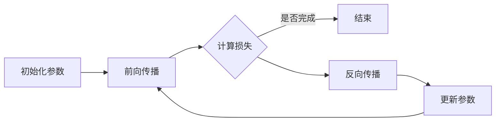
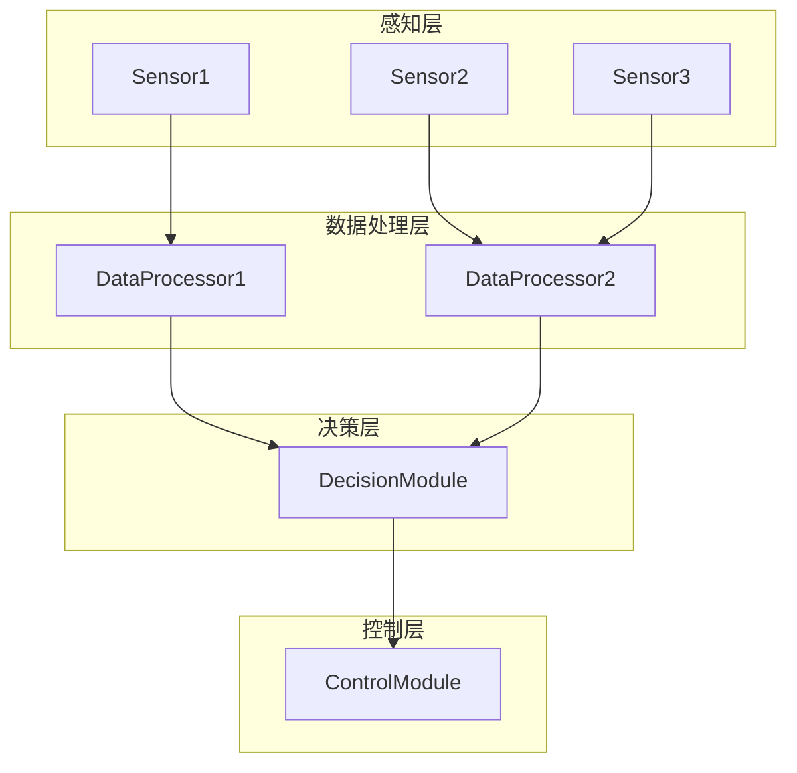
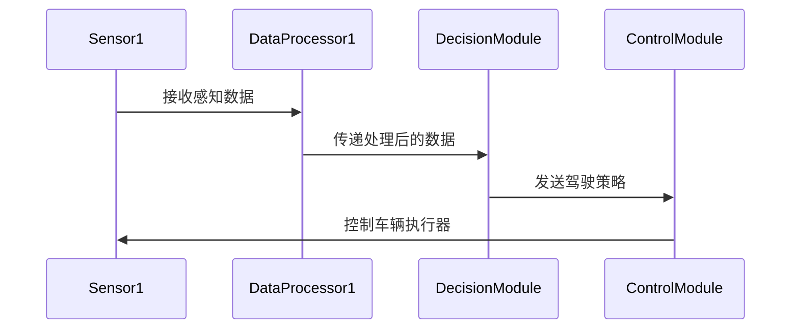

                 


### 第1章：AI Agent的基础认知

#### 1.1 AI Agent的背景与定义

AI Agent，即人工智能代理，是指能够执行特定任务并与环境交互的计算机程序。其基本概念源于对代理理论的应用，在人工智能领域，它被赋予了自主性、智能性和交互性的特点。AI Agent的研究背景可以追溯到20世纪50年代，当时计算机科学家艾伦·图灵提出了著名的图灵测试，试图定义机器能否表现出与人类相似的智能行为。

AI Agent的定义通常包括以下几点：

1. **自主性**：AI Agent能够在没有人类干预的情况下执行任务。
2. **智能性**：AI Agent需要具备一定的推理和决策能力，以适应复杂环境。
3. **交互性**：AI Agent需要能够与环境进行有效的信息交换。

AI Agent的研究背景不仅限于理论探讨，还与实际应用密切相关。例如，在自动驾驶领域，AI Agent能够通过感知车辆周围环境，做出实时的决策，以实现安全驾驶。在智能客服领域，AI Agent可以理解用户的问题，提供准确的答案，从而提高服务效率。

#### 1.2 AI Agent的研究意义

AI Agent的研究具有重要意义。首先，它能够提升人工智能的整体水平。通过研究AI Agent，我们能够深入了解智能体的设计与实现，推动人工智能技术的进步。其次，AI Agent的研究能够推动人工智能应用落地。许多实际应用场景，如自动驾驶、智能家居和智能客服，都依赖于AI Agent的能力。最后，AI Agent的研究能够促进人类生活的改善。通过AI Agent的广泛应用，我们可以享受到更加便捷和高效的服务，提高生活质量。

#### 1.3 AI Agent的分类与特点

AI Agent可以根据其工作原理和结构分为以下几类：

1. **基于规则的Agent**：这类Agent使用预先定义的规则来处理信息，适合处理结构化数据。其优点是简单易懂，缺点是处理复杂问题时规则库可能变得非常庞大。

2. **基于模型的Agent**：这类Agent使用机器学习模型来处理信息，能够自动学习和适应环境变化。其优点是处理复杂问题能力强，缺点是需要大量数据进行训练。

3. **混合型Agent**：这类Agent结合了基于规则和基于模型的方法，能够在不同场景下灵活切换。其优点是适应性强，缺点是设计和实现复杂。

AI Agent的特点如下：

- **自主性**：AI Agent能够独立完成任务，不需要人类干预。
- **智能性**：AI Agent具备推理和决策能力，能够应对复杂环境。
- **交互性**：AI Agent能够与环境进行有效的信息交换。

#### 1.4 AI Agent的认知架构

AI Agent的认知架构是其实现智能行为的核心。一个典型的AI Agent认知架构包括以下几个部分：

1. **感知模块**：用于获取环境信息，如图像、声音和数据。
2. **决策模块**：用于分析感知到的信息，并做出决策。
3. **行动模块**：用于执行决策，并作用于环境。

感知模块是AI Agent获取信息的窗口，常见的感知方式包括视觉、听觉和触觉等。决策模块是AI Agent的核心，它负责分析感知到的信息，并生成行动方案。行动模块则是AI Agent的实际执行者，它根据决策模块的指令来操作环境。

#### 1.5 AI Agent的应用领域

AI Agent在各个领域都有着广泛的应用。以下是一些典型的应用领域：

- **智能助手**：如Siri、Alexa等，能够理解用户的问题，提供相应的答案和建议。
- **自动驾驶**：AI Agent通过感知周围环境，做出实时的驾驶决策，实现无人驾驶。
- **智能家居**：AI Agent能够控制家中的各种设备，如灯光、空调和安防系统等。
- **金融风控**：AI Agent能够分析金融数据，识别风险，提供风险管理建议。
- **医疗诊断**：AI Agent通过分析医疗数据，帮助医生进行疾病诊断。

#### 1.6 本章小结

本章介绍了AI Agent的基础认知，包括其背景、定义、研究意义、分类与特点、认知架构和应用领域。通过本章的学习，读者可以初步了解AI Agent的概念和基本原理，为后续章节的学习打下基础。

----------------------------------------------------------------

### 第2章：AI Agent的核心概念与联系

#### 2.1 AI Agent的核心概念

AI Agent的核心概念主要包括感知、决策和行动。这三个概念相互关联，共同构成了AI Agent的认知架构。

1. **感知**：感知是AI Agent获取环境信息的过程。感知模块通常包括各种传感器，如摄像头、麦克风和温度传感器等。这些传感器将外界的信息转化为计算机可以处理的数字信号，从而为AI Agent提供感知数据。

2. **决策**：决策是AI Agent在分析感知到的信息后，做出相应行动的过程。决策模块通常包含知识库、推理机和控制器等组件。知识库存储了AI Agent所需的知识和规则，推理机根据这些知识和感知数据生成决策，控制器则将这些决策转化为具体的行动指令。

3. **行动**：行动是AI Agent执行决策并作用于环境的过程。行动模块通常包含执行器和反馈机制。执行器负责执行决策，如移动、发送信号等，而反馈机制则用于监测行动效果，并将反馈信息传递给感知模块，以供后续决策使用。

#### 2.2 AI Agent的核心概念对比

以下是一个关于AI Agent核心概念的对比表格，用于展示不同类型Agent的特点和适用场景。

| 类别         | 基于规则的Agent | 基于模型的Agent | 混合型Agent |
| ------------ | --------------- | --------------- | ----------- |
| **感知方式**  | 规则匹配        | 机器学习模型    | 多模态感知  |
| **决策方式**  | 规则推理        | 模型预测        | 规则+模型   |
| **行动方式**  | 规则执行        | 模型输出        | 规则+模型   |
| **优点**      | 简单、直观      | 强大的学习能力  | 适应性强    |
| **缺点**      | 复杂规则库      | 需要大量数据    | 设计复杂    |

#### 2.3 AI Agent的Mermaid ER实体关系图

为了更直观地展示AI Agent的核心概念及其关系，我们可以使用Mermaid ER实体关系图。以下是一个简化的Mermaid ER实体关系图示例：

```mermaid
erDiagram
  感知模块 ||--|{ 决策模块 }
  行动模块 ||--|{ 感知模块 }
  行动模块 ||--|{ 决策模块 }
```

在这个图中，感知模块、决策模块和行动模块是三个核心实体，它们之间通过双向箭头表示相互依赖关系。

#### 2.4 本章小结

本章详细介绍了AI Agent的核心概念，包括感知、决策和行动，并通过对比表格和Mermaid ER实体关系图展示了它们之间的关系。通过本章的学习，读者可以更深入地理解AI Agent的基本原理，为后续章节的学习打下坚实基础。

----------------------------------------------------------------

## 第3章：神经网络算法原理讲解

### 3.1 神经网络的基本概念

神经网络（Neural Network）是模拟人脑神经元工作原理的一种计算模型，由大量相互连接的节点（或称为神经元）组成。这些节点通过调整相互之间的连接强度（权重）来学习和处理信息。

**神经元**：神经网络的基本组成单元，类似于生物神经元，能够接收输入信号，通过加权求和后，通过激活函数输出结果。

**层**：神经网络根据功能分为输入层、隐藏层和输出层。输入层接收外部信息，隐藏层对信息进行处理和变换，输出层产生最终输出。

**网络结构**：神经网络的结构可以根据层数和每层的神经元数目不同而变化，常见的结构包括单层感知机、多层感知机（MLP）、卷积神经网络（CNN）和循环神经网络（RNN）等。

### 3.2 神经网络的数学模型

神经网络的数学模型主要由激活函数、损失函数和反向传播算法构成。

**激活函数**：用于将神经元输入映射到输出。常见的激活函数包括Sigmoid函数、ReLU函数、Tanh函数等。

**损失函数**：用于评估神经网络的输出与真实标签之间的差距。常见的损失函数包括均方误差（MSE）、交叉熵损失等。

**反向传播算法**：用于根据损失函数的梯度，调整神经网络的权重和偏置，使损失函数值减小。反向传播算法的核心在于计算梯度，通过链式法则逐层反向传播误差。

### 3.3 神经网络的Mermaid流程图

以下是一个简化的神经网络算法流程图，使用Mermaid语法绘制：



**前向传播**：输入数据通过神经网络层，逐层计算输出。

**计算损失**：使用损失函数计算输出结果与真实标签之间的差距。

**反向传播**：计算损失函数关于网络参数的梯度，并反向传播到前一层。

**更新参数**：根据梯度调整网络参数，使损失函数值减小。

### 3.4 Python代码实现

下面是一个简单的神经网络实现示例，使用Python和TensorFlow库：

```python
import tensorflow as tf

# 定义神经网络结构
model = tf.keras.Sequential([
    tf.keras.layers.Dense(units=1, input_shape=[1])
])

# 编译模型
model.compile(loss='mean_squared_error', optimizer=tf.keras.optimizers.Adam(0.1))

# 训练模型
x = tf.random.normal([1000, 1])
y = x * x + tf.random.normal([1000, 1])
model.fit(x, y, epochs=1000)
```

在这个例子中，我们定义了一个简单的线性神经网络，输入一个实数，输出这个实数的平方。通过训练，神经网络学会了这个线性关系。

### 3.5 算法原理讲解

**前向传播**：输入数据通过网络的输入层传递，每一层神经元的输出作为下一层的输入。网络的输出经过激活函数处理后，得到最终预测值。

**反向传播**：计算输出值与真实标签之间的差异（损失），通过链式法则逐层反向传播误差，得到每个神经元在当前层的梯度。

**训练过程**：通过迭代地更新网络参数，使得损失函数逐渐减小，网络逐渐逼近真实关系。

**常见问题与解决方案**：

- **过拟合**：当网络复杂度过高时，模型在训练集上表现良好，但在测试集上表现较差。解决方案包括增加正则化、使用更简单的网络结构或增加数据量。
- **梯度消失/爆炸**：在反向传播过程中，梯度可能变得非常小或非常大，导致网络无法有效更新参数。解决方案包括使用激活函数如ReLU、LSTM等，或使用梯度裁剪。

### 3.6 本章小结

本章详细介绍了神经网络的基本概念、数学模型、算法流程图和Python实现。通过本章的学习，读者可以理解神经网络的工作原理，为后续的AI Agent设计提供理论基础。

----------------------------------------------------------------

### 第4章：系统分析与架构设计方案

#### 4.1 问题场景

假设我们设计一个自动驾驶系统，AI Agent负责控制车辆在复杂环境中的行驶。问题场景包括道路识别、障碍物检测、车辆路径规划等。

#### 4.2 系统功能设计

自动驾驶系统的主要功能包括：

1. **感知模块**：通过摄像头和激光雷达等传感器获取周围环境信息，包括道路、车辆、行人等。
2. **决策模块**：分析感知数据，识别道路标志、检测障碍物，并根据车辆状态和道路条件生成驾驶策略。
3. **行动模块**：根据决策模块的指令，控制车辆加速、减速、转向和制动。

#### 4.3 系统架构设计

自动驾驶系统的架构设计如下：

1. **感知层**：包括摄像头、激光雷达、GPS等传感器，负责实时获取环境数据。
2. **数据处理层**：对感知数据进行预处理，如去噪、滤波、特征提取等。
3. **决策层**：利用机器学习模型（如卷积神经网络、深度强化学习等）分析处理后的数据，生成驾驶策略。
4. **控制层**：根据驾驶策略控制车辆的执行器，如油门、刹车和转向系统。

#### 4.4 系统接口设计

系统接口设计如下：

1. **感知数据接口**：负责接收来自传感器的实时数据。
2. **决策数据接口**：负责向决策模块提供处理后的感知数据，并接收驾驶策略输出。
3. **控制数据接口**：负责将驾驶策略转换为控制指令，发送给车辆执行器。

#### 4.5 系统交互

系统交互设计如下：

1. **感知-决策交互**：感知模块将获取的环境数据发送给决策模块，决策模块根据数据生成驾驶策略。
2. **决策-控制交互**：决策模块将驾驶策略发送给控制模块，控制模块根据策略控制车辆执行器。

#### 4.6 使用Mermaid绘制类图、架构图和序列图

以下分别使用Mermaid语法绘制类图、架构图和序列图：

**类图**：

```mermaid
classDiagram
  Sensor -> DataProcessor
  DataProcessor -> DecisionModule
  DecisionModule -> ControlModule
```

**架构图**：



**序列图**：



#### 4.7 本章小结

本章详细介绍了自动驾驶系统的功能设计、架构设计和系统交互。通过使用Mermaid工具，我们能够直观地展示系统各个组件之间的关系和交互过程，为后续的项目实施提供参考。

----------------------------------------------------------------

## 第5章：项目实战

### 5.1 环境安装

在开始项目实战之前，我们需要安装必要的软件和工具。以下是在Ubuntu系统上安装Python环境、TensorFlow和相关依赖的步骤：

1. **安装Python**：

   ```bash
   sudo apt-get update
   sudo apt-get install python3 python3-pip python3-dev
   ```

2. **安装TensorFlow**：

   ```bash
   pip3 install tensorflow
   ```

3. **安装其他依赖**：

   ```bash
   pip3 install numpy matplotlib scikit-learn
   ```

### 5.2 系统核心实现

在完成环境安装后，我们可以开始实现系统核心功能。以下是一个简单的示例，使用TensorFlow实现一个基于神经网络的分类器：

1. **数据准备**：

   ```python
   import numpy as np
   from sklearn.model_selection import train_test_split
   from sklearn.datasets import make_classification

   X, y = make_classification(n_samples=1000, n_features=20, n_classes=2, random_state=42)
   X_train, X_test, y_train, y_test = train_test_split(X, y, test_size=0.2, random_state=42)
   ```

2. **模型构建**：

   ```python
   model = tf.keras.Sequential([
       tf.keras.layers.Dense(units=64, activation='relu', input_shape=(20,)),
       tf.keras.layers.Dense(units=32, activation='relu'),
       tf.keras.layers.Dense(units=1, activation='sigmoid')
   ])
   ```

3. **模型编译**：

   ```python
   model.compile(optimizer='adam', loss='binary_crossentropy', metrics=['accuracy'])
   ```

4. **模型训练**：

   ```python
   model.fit(X_train, y_train, epochs=10, batch_size=32, validation_data=(X_test, y_test))
   ```

### 5.3 代码解读与分析

在实现系统核心功能时，我们需要关注以下几个方面：

1. **数据准备**：使用`make_classification`函数生成模拟数据集，并使用`train_test_split`函数将数据集分为训练集和测试集。

2. **模型构建**：使用`tf.keras.Sequential`模型构建一个包含多层神经元的神经网络。在构建模型时，我们使用了`Dense`层，其中`units`参数指定了该层的神经元数量，`activation`参数指定了激活函数。

3. **模型编译**：在编译模型时，我们选择了`adam`优化器和`binary_crossentropy`损失函数，并添加了`accuracy`作为评估指标。

4. **模型训练**：使用`fit`函数训练模型，其中`epochs`参数指定了训练轮数，`batch_size`参数设置了每个批次的数据量。

5. **模型评估**：在训练完成后，我们可以使用`model.evaluate`函数评估模型在测试集上的性能。

### 5.4 实际案例分析和详细讲解剖析

为了更好地理解系统实现，我们分析一个实际案例。假设我们需要对一组手写数字图像进行分类，使用MNIST数据集作为训练数据。

1. **数据加载**：

   ```python
   mnist = tf.keras.datasets.mnist
   (X_train, y_train), (X_test, y_test) = mnist.load_data()
   X_train, X_test = X_train / 255.0, X_test / 255.0
   ```

2. **模型构建**：

   ```python
   model = tf.keras.Sequential([
       tf.keras.layers.Flatten(input_shape=(28, 28)),
       tf.keras.layers.Dense(units=128, activation='relu'),
       tf.keras.layers.Dense(units=10, activation='softmax')
   ])
   ```

3. **模型编译**：

   ```python
   model.compile(optimizer='adam',
                 loss='sparse_categorical_crossentropy',
                 metrics=['accuracy'])
   ```

4. **模型训练**：

   ```python
   model.fit(X_train, y_train, epochs=5)
   ```

5. **模型评估**：

   ```python
   test_loss, test_acc = model.evaluate(X_test, y_test, verbose=2)
   print('\nTest accuracy:', test_acc)
   ```

在这个案例中，我们使用了`Flatten`层将图像数据展平为一维数组，作为神经网络的输入。在输出层，我们使用了`softmax`激活函数，以实现多分类。

### 5.5 项目小结

通过本章节的项目实战，我们详细介绍了环境安装、系统核心实现、代码解读和案例分析。通过实际操作，读者可以更好地理解AI Agent的认知架构设计和神经网络算法原理。

----------------------------------------------------------------

### 第6章：最佳实践 tips、小结、注意事项、拓展阅读

#### 最佳实践 tips

1. **数据预处理**：在训练模型之前，确保数据预处理得当。例如，归一化、标准化、数据增强等，这些步骤可以显著提高模型的性能。

2. **模型选择**：根据实际问题选择合适的模型。例如，对于图像识别问题，可以使用卷积神经网络（CNN），对于序列数据处理，可以使用循环神经网络（RNN）。

3. **超参数调优**：通过交叉验证和网格搜索等方法，找到最佳的超参数组合，以优化模型性能。

4. **代码注释**：在编写代码时，添加详细的注释，有助于理解代码逻辑和便于后续维护。

5. **模型部署**：在模型训练完成后，考虑将模型部署到生产环境中。可以使用TensorFlow Serving、TensorFlow Lite等工具来实现模型部署。

#### 小结

本章通过详细的项目实战，介绍了从环境安装、系统核心实现到代码解读和实际案例分析的全过程。通过这些步骤，读者可以深入理解AI Agent的认知架构设计和神经网络算法原理。

#### 注意事项

1. **计算资源**：在进行深度学习模型训练时，需要充足的计算资源。使用GPU可以显著提高训练速度。

2. **数据隐私**：在使用实际数据集时，需要注意数据隐私保护，避免敏感信息泄露。

3. **模型解释性**：在某些应用场景中，模型解释性尤为重要，例如金融风控和医疗诊断等领域。

#### 拓展阅读

- **深度学习入门**：Goodfellow, I., Bengio, Y., & Courville, A. (2016). 《深度学习》（Deep Learning）。
- **机器学习实战**：周志华 (2016). 《机器学习》（Machine Learning）。
- **人工智能简史**：夏正楷 (2018). 《人工智能简史》（A Brief History of Artificial Intelligence）。
- **神经网络与深度学习**：邱锡鹏 (2017). 《神经网络与深度学习》（Neural Networks and Deep Learning）。

通过这些拓展阅读，读者可以进一步深入了解人工智能和深度学习的相关知识，提升自身的技能水平。

作者：AI天才研究院/AI Genius Institute & 禅与计算机程序设计艺术 /Zen And The Art of Computer Programming

