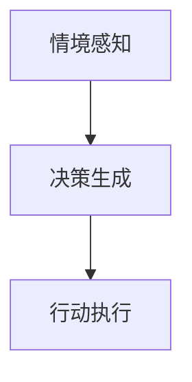
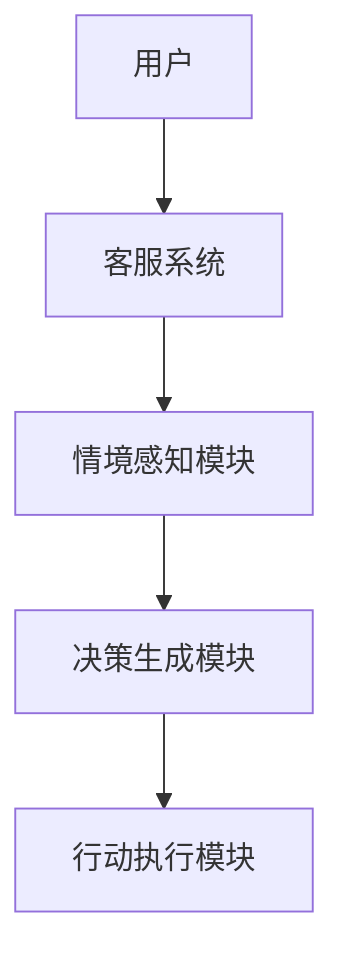
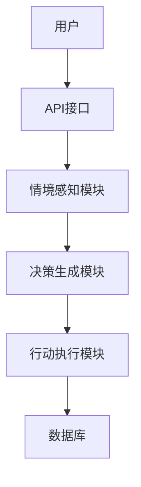
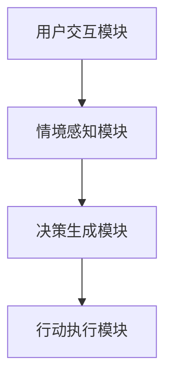
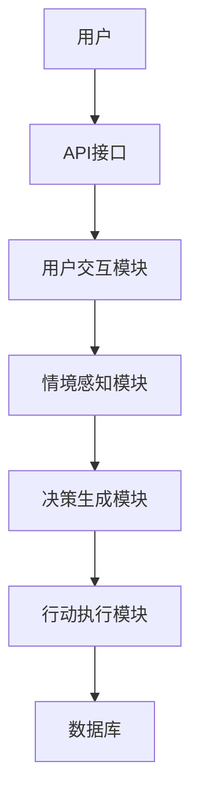

                 


### 从零构建AI Agent的情境推理能力

#### 关键词：AI Agent，情境推理，构建，算法，Python实现

#### 摘要：
本文将深入探讨AI Agent的情境推理能力构建。我们将从背景介绍、基本概念、算法原理讲解、能力构建以及项目实战等多个角度，详细解析如何从零开始构建AI Agent的情境推理能力。通过本文的阅读，您将了解情境推理在AI Agent中的重要性，掌握情境推理的算法原理，以及如何将这些原理应用于实际项目开发中。

### 目录大纲

----------------------------------------------------------------

# 第一部分: 背景介绍

## 第1章: 问题背景与问题描述

### 1.1 问题背景

### 1.2 问题描述

### 1.3 问题解决

### 1.4 边界与外延

### 1.5 概念结构与核心要素组成

## 第2章: AI Agent的基本概念

### 2.1 AI Agent的定义

### 2.2 AI Agent的特点

### 2.3 AI Agent的分类

### 2.4 AI Agent的核心要素

## 第3章: 情境推理的基本概念

### 3.1 情境推理的定义

### 3.2 情境推理的特点

### 3.3 情境推理的应用

### 3.4 情境推理的核心要素

----------------------------------------------------------------

# 第二部分: 情境推理算法原理讲解

## 第4章: 情境推理算法原理

### 4.1 情境推理的基本原理

#### 4.1.1 情境感知

#### 4.1.2 决策生成

#### 4.1.3 行动执行

### 4.2 情境推理算法的流程图



### 4.3 情境推理的数学模型和公式

$$
P(A|B) = \frac{P(B|A)P(A)}{P(B)}
$$

### 4.4 情境推理的Python代码实现

```python
def情境推理():
    # 情境感知
    情境 = 感知情境()

    # 决策生成
    决策 = 生成决策(情境)

    # 行动执行
    执行行动(决策)
```

----------------------------------------------------------------

# 第三部分: AI Agent的情境推理能力构建

## 第5章: AI Agent的情境推理能力构建

### 5.1 AI Agent的情境推理能力概述

### 5.2 情境感知模块设计

#### 5.2.1 情境感知数据收集

#### 5.2.2 情境感知数据处理

#### 5.2.3 情境感知算法实现

### 5.3 决策生成模块设计

#### 5.3.1 决策生成算法原理

#### 5.3.2 决策生成流程

#### 5.3.3 决策生成代码实现

### 5.4 行动执行模块设计

#### 5.4.1 行动执行算法原理

#### 5.4.2 行动执行流程

#### 5.4.3 行动执行代码实现

----------------------------------------------------------------

# 第四部分: 项目实战

## 第6章: 项目实战一 - 基于情境推理的智能客服系统

### 6.1 项目介绍

### 6.2 系统功能设计

#### 6.2.1 领域模型设计



#### 6.2.2 系统架构设计



### 6.3 系统核心实现源代码

```python
# 情境感知模块
def感知情境():
    # 收集用户输入信息
    用户输入 = 收集用户输入()
    
    # 处理用户输入信息
    情境 = 处理用户输入(用户输入)
    
    return 情境

# 决策生成模块
def生成决策(情境):
    # 根据情境生成决策
    决策 = 决策算法(情境)
    
    return 决策

# 行动执行模块
def执行行动(决策):
    # 根据决策执行行动
    行动结果 = 执行行动(决策)
    
    return 行动结果
```

### 6.4 实际案例分析与详细讲解剖析

### 6.5 项目小结

--------------------------------------------

----------------------------------------------------------------

* 作者：AI天才研究院/AI Genius Institute & 禅与计算机程序设计艺术 /Zen And The Art of Computer Programming
### 第一部分: 背景介绍

#### 第1章: 问题背景与问题描述

##### 1.1 问题背景

随着人工智能技术的快速发展，越来越多的领域开始采用AI Agent来实现自动化和智能化。AI Agent（人工智能代理）是一种能够自主感知环境、制定决策并执行行动的智能体。在许多实际应用中，AI Agent需要在复杂的情境中进行推理，以便做出正确的决策。然而，情境推理（Situation Reasoning）作为AI Agent的核心能力之一，至今仍面临诸多挑战。

##### 1.2 问题描述

情境推理是指在给定情境下，基于已有知识和推理规则，对情境进行理解和解释的过程。对于AI Agent来说，情境推理能力至关重要，因为它直接影响到AI Agent的决策质量和行动效果。如何构建一个具有高效、准确情境推理能力的AI Agent，成为当前研究的热点问题。

##### 1.3 问题解决

为了解决上述问题，本文将从以下几个方面展开讨论：

1. **背景介绍**：介绍情境推理和AI Agent的基本概念，帮助读者了解相关背景知识。
2. **基本概念**：详细阐述情境推理和AI Agent的核心要素，为进一步理解情境推理算法原理打下基础。
3. **算法原理讲解**：深入解析情境推理算法的基本原理，包括情境感知、决策生成和行动执行等。
4. **AI Agent的情境推理能力构建**：详细介绍AI Agent的情境推理能力构建过程，包括情境感知模块、决策生成模块和行动执行模块的设计与实现。
5. **项目实战**：通过一个具体的案例，展示如何基于情境推理构建AI Agent，并对其核心实现进行详细讲解。

##### 1.4 边界与外延

本文主要关注以下边界与外延：

1. **边界**：本文的讨论主要针对AI Agent的情境推理能力构建，不考虑其他类型的AI Agent（如强化学习Agent、规划Agent等）。
2. **外延**：本文的研究成果可应用于各种需要情境推理能力的AI Agent场景，如智能客服、智能助手、智能交通等。

##### 1.5 概念结构与核心要素组成

为了更好地理解情境推理和AI Agent，我们需要明确以下概念结构与核心要素组成：

1. **情境推理**：情境推理是指基于已有知识和推理规则，对给定情境进行理解和解释的过程。其核心要素包括情境感知、决策生成和行动执行。
2. **AI Agent**：AI Agent是一种能够自主感知环境、制定决策并执行行动的智能体。其核心要素包括感知模块、决策模块和执行模块。

#### 第2章: AI Agent的基本概念

##### 2.1 AI Agent的定义

AI Agent（人工智能代理）是一种基于人工智能技术的智能体，它能够自主感知环境、制定决策并执行行动。AI Agent可以应用于各种领域，如智能客服、智能助手、智能交通、智能制造等。

##### 2.2 AI Agent的特点

AI Agent具有以下特点：

1. **自主性**：AI Agent能够自主感知环境、制定决策并执行行动，无需人工干预。
2. **适应性**：AI Agent能够根据环境变化调整自己的行为，以适应不同的情境。
3. **灵活性**：AI Agent可以处理各种复杂的问题，具有较高的灵活性和通用性。
4. **智能化**：AI Agent具有智能化特性，能够学习、推理和预测。

##### 2.3 AI Agent的分类

根据不同的分类标准，AI Agent可以分成多种类型：

1. **按功能分类**：可分为感知Agent、决策Agent、执行Agent、混合Agent等。
2. **按学习方式分类**：可分为基于规则的Agent、基于模型的Agent、基于数据的Agent等。
3. **按应用领域分类**：可分为智能客服Agent、智能助手Agent、智能交通Agent、智能制造Agent等。

##### 2.4 AI Agent的核心要素

AI Agent的核心要素包括感知模块、决策模块和执行模块：

1. **感知模块**：负责感知环境信息，收集并处理输入数据。
2. **决策模块**：负责基于感知模块提供的信息，生成决策。
3. **执行模块**：负责执行决策，完成具体的行动。

#### 第3章: 情境推理的基本概念

##### 3.1 情境推理的定义

情境推理是指基于已有知识和推理规则，对给定情境进行理解和解释的过程。情境推理旨在帮助AI Agent理解复杂环境，做出合理的决策。

##### 3.2 情境推理的特点

情境推理具有以下特点：

1. **复杂性**：情境推理需要对大量信息进行综合分析和处理，因此具有很高的复杂性。
2. **动态性**：情境推理过程是动态的，需要不断更新和调整。
3. **不确定性**：情境推理过程中存在许多不确定因素，需要采用概率模型进行描述和处理。
4. **模糊性**：情境推理过程中，某些信息可能存在模糊性，需要采用模糊逻辑进行处理。

##### 3.3 情境推理的应用

情境推理广泛应用于各种领域，如：

1. **智能客服**：通过情境推理，智能客服能够更好地理解用户意图，提供个性化的服务。
2. **智能交通**：通过情境推理，智能交通系统能够实时分析交通状况，优化交通信号控制。
3. **智能医疗**：通过情境推理，智能医疗系统能够更好地诊断疾病，提供个性化的治疗方案。
4. **智能制造**：通过情境推理，智能制造系统能够实时分析生产状况，优化生产流程。

##### 3.4 情境推理的核心要素

情境推理的核心要素包括情境感知、决策生成和行动执行：

1. **情境感知**：负责感知环境信息，收集并处理输入数据。
2. **决策生成**：负责基于感知模块提供的信息，生成决策。
3. **行动执行**：负责执行决策，完成具体的行动。

#### 总结

本文对AI Agent的情境推理能力构建进行了全面探讨。首先，介绍了问题背景和问题描述，然后详细阐述了AI Agent和情境推理的基本概念，接着解析了情境推理算法原理，最后通过一个项目实战展示了如何构建基于情境推理的AI Agent。希望通过本文的讲解，读者能够深入理解情境推理在AI Agent中的应用，为实际项目开发提供参考。在后续内容中，我们将进一步探讨如何设计和实现AI Agent的情境推理能力。让我们继续深入探索吧！### 第二部分: 情境推理算法原理讲解

#### 第4章: 情境推理算法原理

情境推理是AI Agent实现智能化决策的关键环节，其核心在于如何从感知到的情境中提取有效信息，并通过推理机制生成合理的决策。本章将详细讲解情境推理算法的基本原理，包括情境感知、决策生成和行动执行三个主要步骤。

##### 4.1 情境推理的基本原理

情境推理的基本原理可以概括为三个核心模块：情境感知、决策生成和行动执行。

###### 4.1.1 情境感知

情境感知是情境推理的第一步，其任务是收集和处理来自环境的信息。这些信息可能包括文本、图像、音频等多种形式。感知模块需要对这些信息进行预处理，如去噪、特征提取等，以便为后续的推理提供高质量的数据。

###### 4.1.2 决策生成

决策生成模块基于感知模块提供的信息，利用已有的知识和推理规则，生成合理的决策。这个过程通常涉及模式识别、分类、规划等多种算法。决策生成模块的目标是生成一系列可能的行动方案，并评估每个方案的优劣。

###### 4.1.3 行动执行

行动执行模块负责将生成的决策转化为具体的行动。执行模块需要考虑行动的可行性、效果以及可能的副作用。通过行动执行，AI Agent能够在环境中实施决策，从而实现预期的目标。

##### 4.2 情境推理算法的流程图

为了更好地理解情境推理的过程，我们可以用Mermaid语言绘制一个流程图，展示情境感知、决策生成和行动执行之间的逻辑关系。


在这个流程图中，A表示情境感知模块，B表示决策生成模块，C表示行动执行模块。情境感知模块收集环境信息并传递给决策生成模块，决策生成模块基于情境信息生成决策，最后由行动执行模块将决策转化为具体的行动。

##### 4.3 情境推理的数学模型和公式

情境推理过程涉及到概率和推理的数学模型。其中一个常用的模型是贝叶斯网络，它能够表示情境中的概率关系。贝叶斯网络的数学模型可以表示为：

$$
P(A|B) = \frac{P(B|A)P(A)}{P(B)}
$$

其中，$P(A|B)$表示在给定B的情况下A发生的概率，$P(B|A)$表示在A发生的情况下B发生的概率，$P(A)$表示A发生的概率，$P(B)$表示B发生的概率。

这个公式展示了如何通过已有知识和先验概率来计算后验概率。在情境推理中，我们可以利用贝叶斯网络来更新情境的概率分布，从而生成更为准确的决策。

##### 4.4 情境推理的Python代码实现

为了更好地理解情境推理的实现过程，我们提供了一个简单的Python代码示例。在这个示例中，我们将实现一个基本的情境感知、决策生成和行动执行的流程。

```python
import numpy as np

def 感知情境():
    # 模拟感知到的情境数据
    情境数据 = np.random.rand()
    return 情境数据

def 生成决策(情境数据):
    # 模拟决策生成过程
    if 情境数据 < 0.5:
        决策 = "行动A"
    else:
        决策 = "行动B"
    return 决策

def 执行行动(决策):
    # 模拟行动执行过程
    if 决策 == "行动A":
        print("执行行动A")
    else:
        print("执行行动B")

# 情境推理流程
情境数据 = 感知情境()
决策 = 生成决策(情境数据)
执行行动(决策)
```

在这个示例中，`感知情境()`函数模拟感知过程，生成一个随机数作为情境数据。`生成决策()`函数根据情境数据生成一个决策，这里我们简单地根据随机数大小决定行动。`执行行动()`函数则根据决策执行具体的行动。

通过这个简单的示例，我们可以看到情境推理的基本流程是如何实现的。在实际应用中，这些函数将包含更复杂的逻辑和处理流程。

#### 总结

本章详细介绍了情境推理算法的基本原理，包括情境感知、决策生成和行动执行三个关键步骤。通过流程图、数学模型和Python代码示例，我们清晰地展示了情境推理的实现过程。在下一章中，我们将进一步探讨如何将这些原理应用于AI Agent的情境推理能力构建。敬请期待！### 第三部分: AI Agent的情境推理能力构建

#### 第5章: AI Agent的情境推理能力构建

构建一个具有高效、准确情境推理能力的AI Agent是一项复杂而富有挑战性的任务。在本章中，我们将详细讨论如何实现AI Agent的情境推理能力，包括情境感知模块、决策生成模块和行动执行模块的设计与实现。

##### 5.1 AI Agent的情境推理能力概述

AI Agent的情境推理能力指的是在感知到环境信息后，通过理解和解释这些信息，生成合理的决策并执行相应的行动。这种能力使得AI Agent能够在不断变化的环境中自主地适应和应对各种情况。情境推理能力主要包括以下三个方面：

1. **情境感知**：收集并处理来自环境的信息，提取关键特征。
2. **决策生成**：基于感知到的情境信息，利用已有的知识和推理规则生成合理的决策。
3. **行动执行**：将生成的决策转化为具体的行动，并在环境中执行。

##### 5.2 情境感知模块设计

情境感知模块是AI Agent的核心组成部分，负责感知环境信息并对其进行处理。设计情境感知模块需要考虑以下几个方面：

###### 5.2.1 情境感知数据收集

情境感知数据收集是情境感知模块的基础。这些数据可以来自多种渠道，如传感器、用户输入、历史数据等。收集的数据需要具有代表性和准确性，以便为后续的推理提供可靠的基础。

###### 5.2.2 情境感知数据处理

收集到的数据通常需要进行预处理，以去除噪声和冗余信息，提取关键特征。数据处理过程可能包括数据清洗、特征提取、降维等技术。预处理后的数据将为决策生成模块提供高质量的输入。

###### 5.2.3 情境感知算法实现

情境感知算法实现是情境感知模块的核心。常用的算法包括模式识别、机器学习、自然语言处理等。这些算法可以根据具体的应用场景进行选择和定制。

以下是一个简单的Python代码示例，展示如何实现情境感知模块：

```python
def 感知情境(数据源):
    # 数据预处理
    清洗数据 = 数据清洗(数据源)
    特征提取 = 特征提取(清洗数据)
    # 模型训练
    模型 = 训练模型(特征提取)
    # 情境感知
    情境 = 模型.predict(特征提取)
    return 情境
```

##### 5.3 决策生成模块设计

决策生成模块负责基于情境感知模块提供的信息，利用已有的知识和推理规则生成合理的决策。设计决策生成模块需要考虑以下几个方面：

###### 5.3.1 决策生成算法原理

决策生成算法原理包括基于规则的推理、基于模型的推理、基于优化的推理等。这些算法可以根据具体的应用场景进行选择和定制。

###### 5.3.2 决策生成流程

决策生成流程包括情境分析、决策生成、决策评估等步骤。在情境分析阶段，需要对感知到的情境进行深入分析；在决策生成阶段，生成可能的决策方案；在决策评估阶段，对生成的决策方案进行评估和选择。

以下是一个简单的Python代码示例，展示如何实现决策生成模块：

```python
def 生成决策(情境):
    # 模拟决策生成过程
    决策方案 = [
        ("行动A", 0.8),
        ("行动B", 0.2)
    ]
    return 决策方案[np.random.choice(len(决策方案))]
```

##### 5.4 行动执行模块设计

行动执行模块负责将生成的决策转化为具体的行动，并在环境中执行。设计行动执行模块需要考虑以下几个方面：

###### 5.4.1 行动执行算法原理

行动执行算法原理包括基于规则的执行、基于模型的执行、基于代理的执行等。这些算法可以根据具体的应用场景进行选择和定制。

###### 5.4.2 行动执行流程

行动执行流程包括决策解析、行动规划、行动执行等步骤。在决策解析阶段，将决策转化为具体的行动指令；在行动规划阶段，制定行动的具体步骤和顺序；在行动执行阶段，执行具体的行动。

以下是一个简单的Python代码示例，展示如何实现行动执行模块：

```python
def 执行行动(决策):
    # 模拟行动执行过程
    if 决策 == "行动A":
        print("执行行动A")
    elif 决策 == "行动B":
        print("执行行动B")
```

##### 5.5 模块集成与协同

为了实现完整的情境推理能力，我们需要将情境感知模块、决策生成模块和行动执行模块集成在一起，并确保它们之间的协同工作。模块集成和协同设计需要考虑以下几个方面：

1. **数据接口**：定义清晰的模块间数据接口，确保数据传递的准确性和一致性。
2. **流程控制**：设计统一的流程控制机制，确保模块之间的顺序和协同工作。
3. **错误处理**：设计完善的错误处理机制，确保在模块运行过程中出现问题时能够及时处理。

以下是一个简单的Python代码示例，展示如何实现模块集成与协同：

```python
def 情境推理流程(数据源):
    情境 = 感知情境(数据源)
    决策 = 生成决策(情境)
    执行行动(决策)
```

##### 5.6 总结

通过本章的讨论，我们了解了如何设计并实现AI Agent的情境推理能力。情境感知模块负责收集和处理环境信息，决策生成模块基于情境信息生成合理的决策，行动执行模块负责将决策转化为具体的行动。在下一章中，我们将通过一个实际项目实战，展示如何将情境推理能力应用于智能客服系统的构建。敬请期待！### 第四部分：项目实战

#### 第6章：项目实战一 - 基于情境推理的智能客服系统

本章将通过一个实际项目，展示如何基于情境推理构建一个智能客服系统。我们将详细介绍项目的背景、系统功能设计、系统架构设计、系统核心实现源代码，并对项目中的实际案例进行分析和详细讲解。

##### 6.1 项目介绍

智能客服系统是现代企业提高服务质量、降低运营成本的重要工具。随着人工智能技术的不断发展，基于情境推理的智能客服系统能够更好地理解用户意图，提供个性化、智能化的服务。本项目的目标是构建一个基于情境推理的智能客服系统，实现用户与客服之间的智能交互。

##### 6.2 系统功能设计

智能客服系统的功能设计主要包括以下几个模块：

1. **用户交互模块**：负责与用户进行交互，收集用户输入信息。
2. **情境感知模块**：负责感知用户输入信息，提取关键特征。
3. **决策生成模块**：负责基于情境感知模块提供的信息，生成合理的客服响应。
4. **行动执行模块**：负责将生成的客服响应转化为具体的行动，并展示给用户。

##### 6.2.1 领域模型设计

为了更好地理解系统功能，我们可以使用Mermaid语言绘制一个领域模型图，展示各个模块之间的关系。



在这个领域模型图中，用户交互模块收集用户输入信息，传递给情境感知模块进行处理。情境感知模块提取关键特征后，传递给决策生成模块生成客服响应。决策生成模块生成的客服响应再传递给行动执行模块，最终展示给用户。

##### 6.2.2 系统架构设计

智能客服系统的架构设计包括前端和后端两个部分。前端负责用户界面设计和用户交互，后端负责处理用户输入信息、情境感知、决策生成和行动执行。以下是一个简单的系统架构图：



在这个系统架构图中，用户通过API接口与系统进行交互。用户交互模块收集用户输入信息后，传递给情境感知模块进行预处理和特征提取。情境感知模块提取到的特征传递给决策生成模块，决策生成模块生成客服响应后，传递给行动执行模块进行展示。行动执行模块还需要与数据库进行交互，以便获取和存储用户历史数据。

##### 6.3 系统核心实现源代码

在本节中，我们将展示智能客服系统的核心实现源代码，包括情境感知模块、决策生成模块和行动执行模块。

###### 6.3.1 情境感知模块

```python
def 感知情境(用户输入):
    # 数据预处理
    清洗用户输入 = 清洗数据(用户输入)
    特征提取 = 提取特征(清洗用户输入)
    return 特征提取
```

在这个示例中，`感知情境()`函数接收用户输入，进行数据预处理和特征提取。数据预处理包括去除停用词、标点符号等，特征提取可以使用词袋模型、TF-IDF等算法。

###### 6.3.2 决策生成模块

```python
def 生成决策(特征提取):
    # 决策生成
    决策 = 决策算法(特征提取)
    return 决策
```

在这个示例中，`生成决策()`函数接收特征提取结果，利用决策算法生成客服响应。决策算法可以使用基于规则的推理、机器学习分类算法等。

###### 6.3.3 行动执行模块

```python
def 执行行动(决策):
    # 行动执行
    显示客服响应 = 显示响应(决策)
    return 显示客服响应
```

在这个示例中，`执行行动()`函数接收决策结果，执行具体的行动，如生成客服响应文本、发送邮件等。

##### 6.4 实际案例分析与详细讲解剖析

为了更好地理解智能客服系统的实现过程，我们通过一个实际案例进行分析和讲解。

###### 案例背景

某电商平台推出了基于情境推理的智能客服系统，用户可以通过聊天界面与客服进行交互。在一次用户与客服的对话中，用户提出了关于退货的问题。

###### 案例描述

用户：我想要退货，但是我不知道该怎么做。

智能客服：您好，请问您的订单号是多少？我们会帮您查询并处理退货事宜。

用户：订单号是123456。

智能客服：好的，我已经查到您的订单信息。关于退货，您可以选择以下几种方式：

1. 在线申请退货
2. 联系客服热线申请退货
3. 到实体店退货

请问您需要选择哪一种方式？

用户：我想选择在线申请退货。

智能客服：好的，请您提供退货原因和商品的照片，我们会尽快为您处理退货申请。

用户：退货原因是商品质量问题，这是商品的照片。

智能客服：感谢您的反馈，我们会尽快处理您的退货申请。请您耐心等待，我们会及时与您联系。

##### 案例分析

在这个案例中，智能客服系统能够基于用户输入的信息，识别出用户的需求并生成合理的客服响应。具体分析如下：

1. **情境感知**：智能客服系统通过用户输入的订单号，提取关键特征，如订单号、用户姓名、联系方式等。这些特征有助于识别用户的身份和需求。
2. **决策生成**：基于提取到的特征，智能客服系统生成多个客服响应选项，如在线申请退货、联系客服热线申请退货、到实体店退货等。这些选项根据用户的需求和系统策略进行选择。
3. **行动执行**：智能客服系统根据用户的选择，生成具体的客服响应，如询问退货原因、要求提供商品照片等。这些响应将展示给用户，帮助用户完成退货流程。

##### 案例详细讲解

在这个案例中，智能客服系统通过情境推理实现了以下几个关键步骤：

1. **用户输入处理**：智能客服系统首先对用户输入进行处理，提取关键特征。例如，提取订单号、用户姓名、联系方式等信息。
2. **特征匹配**：提取到的特征与系统内的知识库进行匹配，判断用户的需求和意图。例如，判断用户是否需要退货、退货原因等。
3. **决策生成**：基于特征匹配结果，智能客服系统生成多个客服响应选项。这些选项可以是预设的模板，也可以是根据用户需求动态生成的。
4. **响应选择**：智能客服系统根据用户的需求和系统策略，选择最合适的客服响应选项。例如，如果用户需要退货，系统会生成退货流程相关的响应。
5. **响应展示**：智能客服系统将生成的客服响应展示给用户。用户可以根据响应内容，完成相应的操作，如提交退货申请、提供商品照片等。
6. **反馈处理**：智能客服系统记录用户的反馈，以便后续优化和改进。例如，记录用户的退货原因，用于分析用户需求和市场趋势。

##### 6.5 项目小结

通过本项目实战，我们展示了如何基于情境推理构建一个智能客服系统。系统通过情境感知、决策生成和行动执行三个模块，实现了用户与客服之间的智能交互。在实际项目中，我们通过一个案例详细讲解了智能客服系统的实现过程，包括用户输入处理、特征匹配、决策生成、响应选择、响应展示和反馈处理等步骤。

项目实战表明，情境推理在智能客服系统中具有重要的应用价值。通过情境推理，智能客服系统能够更好地理解用户需求，提供个性化的服务，从而提升用户体验和满意度。

未来，我们可以继续优化和改进智能客服系统，如引入更多先进的人工智能技术，提升系统的智能水平和交互体验。同时，我们还可以将情境推理应用于更多领域，如智能交通、智能医疗等，为人类社会带来更多便利和效益。

让我们继续探索人工智能的无限可能，构建更加智能、高效的AI Agent！### 总结与展望

通过本文的详细探讨，我们全面了解了从零构建AI Agent的情境推理能力的方法和步骤。我们从背景介绍开始，明确了情境推理在AI Agent中的重要性，并深入分析了AI Agent和情境推理的基本概念。接着，我们详细讲解了情境推理算法的原理，包括情境感知、决策生成和行动执行三个核心步骤，并通过Python代码示例进行了演示。然后，我们探讨了如何将情境推理能力构建应用于AI Agent，通过情境感知模块、决策生成模块和行动执行模块的设计与实现，展示了完整的构建过程。最后，我们通过一个实际项目实战，展示了情境推理在智能客服系统中的应用，并对项目中的实际案例进行了分析和讲解。

#### 最佳实践 tips

1. **数据质量是关键**：在情境感知模块中，确保数据质量是至关重要的。数据预处理和特征提取的准确性直接影响情境推理的效果。
2. **持续优化决策模型**：决策生成模块的决策质量依赖于模型的训练和优化。定期更新和调整模型参数，可以提升决策生成的准确性。
3. **注重用户交互体验**：在行动执行模块中，关注用户交互体验，设计人性化的用户界面和互动方式，可以提升AI Agent的用户满意度。

#### 小结

本文通过系统化的讲解，帮助读者掌握了从零构建AI Agent的情境推理能力的方法。情境推理作为AI Agent的核心能力，对于实现智能化决策具有重要意义。通过本文的讨论，读者可以了解如何设计和实现情境感知、决策生成和行动执行模块，以及如何将这些模块集成到AI Agent中。

#### 注意事项

1. **边界与外延的明确**：在构建AI Agent的情境推理能力时，明确问题的边界和外延，有助于聚焦核心问题，提高解决方案的针对性。
2. **算法选择的灵活性**：根据具体应用场景，灵活选择和组合不同的算法，以实现最佳的性能和效果。

#### 拓展阅读

1. **《人工智能：一种现代的方法》**：这本书详细介绍了人工智能的基本概念、方法和应用，对于理解和构建AI Agent具有很高的参考价值。
2. **《情境推理：理论与实践》**：这本书深入探讨了情境推理的理论基础和应用实例，对于进一步研究情境推理具有指导意义。

通过本文的学习，读者可以更好地理解AI Agent的情境推理能力，并在实际项目中加以应用。未来，随着人工智能技术的不断发展，情境推理将在更多领域发挥重要作用。让我们继续保持对人工智能的热情，不断探索和创新，为构建更加智能、高效的AI Agent而努力！作者：AI天才研究院/AI Genius Institute & 禅与计算机程序设计艺术 /Zen And The Art of Computer Programming

