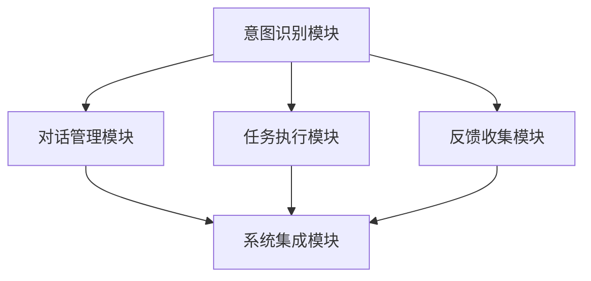
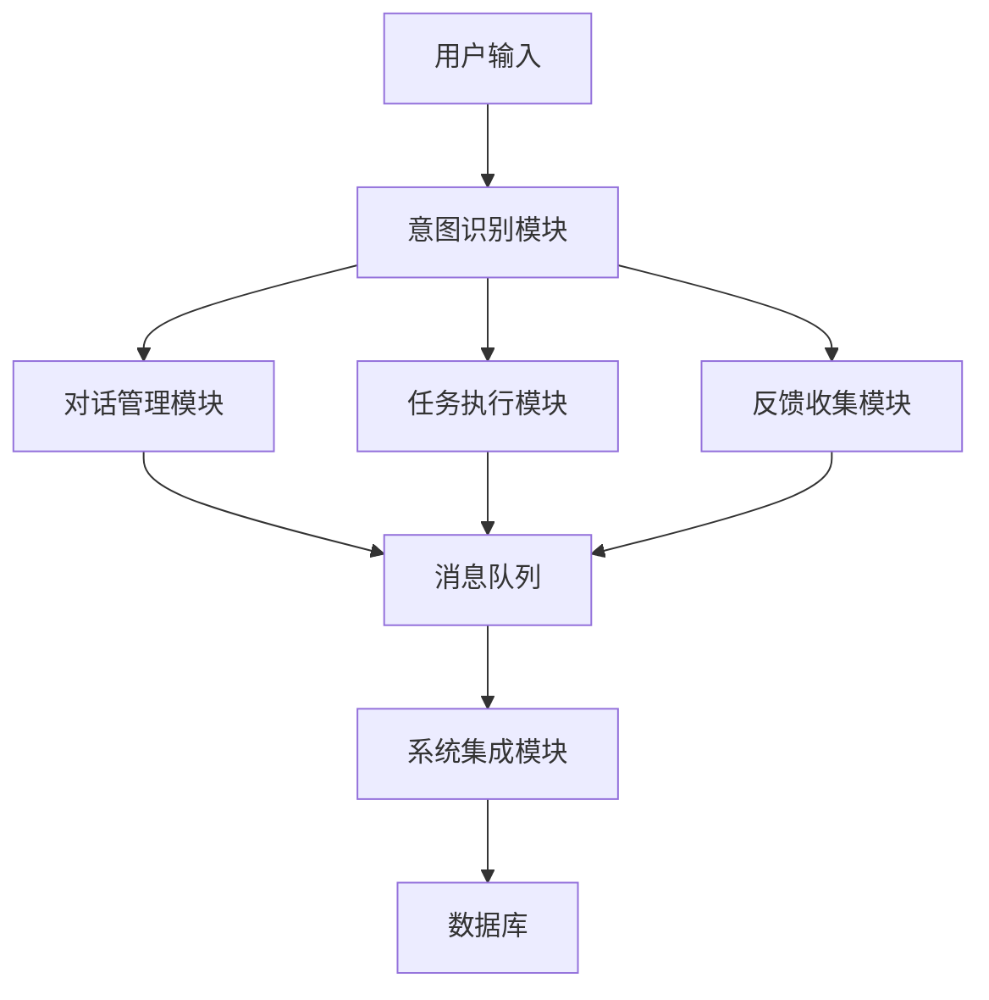
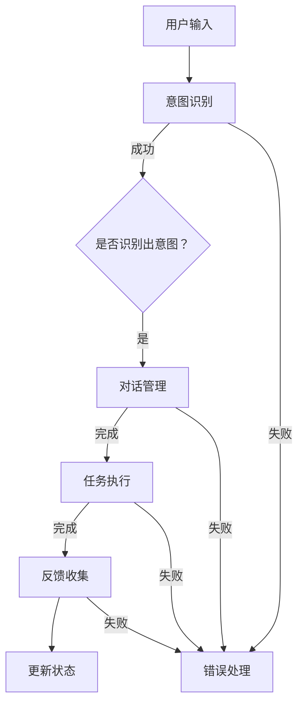

                 

### 摘要

本文将深入探讨如何从零开始构建一个目标导向的AI Agent对话系统。首先，我们将简要介绍AI Agent和目标导向对话系统的基本概念，并阐述构建这一系统的核心目标与挑战。接着，我们将逐步分析目标导向对话系统的原理，包括其核心要素、实现方式和在自然语言处理中的重要性。随后，我们将深入探讨AI Agent的关键技术，如对话系统设计、自然语言处理和机器学习与深度学习应用。在此基础上，本文将详细阐述系统需求分析、架构设计、核心模块实现以及系统集成与优化。通过实际案例分析和最佳实践分享，我们将帮助读者全面掌握构建AI Agent对话系统的全过程。最终，本文将对整个构建过程进行总结与展望，为读者提供进一步的研究和应用方向。

### 第一部分：背景介绍

#### AI Agent的概念

AI Agent，即人工智能代理，是指能够在特定环境中自主执行任务、与环境互动并做出决策的智能实体。它是一种基于人工智能技术的软件或硬件系统，能够模拟人类思维和行为，具备感知、思考、决策和执行的能力。AI Agent的核心目标是实现智能化、自动化和高效的互动，从而提高生产效率、优化服务质量和增强用户体验。

AI Agent的分类可以根据其功能、应用场景和实现技术进行多种划分。例如，基于功能，AI Agent可以分为聊天机器人、智能客服、智能助手、自动驾驶等；基于应用场景，可以分为家居自动化、工业控制、医疗诊断、金融分析等；基于实现技术，可以分为基于规则系统、基于机器学习和深度学习、基于自然语言处理等。

#### 目标导向对话系统

目标导向对话系统是一种旨在实现特定目标的对话交互系统。在这种系统中，用户与系统的对话不仅仅是简单的问答，而是一个具有明确目标导向的过程。系统通过理解用户的目标、意图和需求，提供个性化的服务和建议，引导用户实现目标。目标导向对话系统的核心在于其对用户目标的理解和响应，从而提供更加智能化和人性化的交互体验。

目标导向对话系统的基本原理包括以下几个方面：

1. **用户目标识别**：系统需要通过自然语言处理技术，理解用户的语言输入，提取出用户的目标和需求。
2. **目标规划**：系统根据用户目标，制定相应的对话策略和行动计划，以实现用户目标。
3. **对话管理**：系统需要维护对话的上下文信息，确保对话流程的自然流畅，并在必要时引导用户回到正确的轨道。
4. **任务执行**：系统根据对话策略和用户目标，执行相应的任务，如查询信息、推荐产品、安排预约等。
5. **反馈与优化**：系统需要根据用户反馈和任务执行结果，不断优化对话策略和任务执行流程，以提高系统的智能水平和用户满意度。

#### 构建AI Agent的目标与挑战

构建一个目标导向的AI Agent对话系统，既需要明确的目标导向设计，也面临诸多技术挑战。以下是构建过程中的主要目标和挑战：

1. **明确的目标导向设计**：系统的目标应当是明确的，如提供高效的客户服务、优化医疗诊断流程或提高金融分析准确性。目标导向的设计有助于系统更好地理解用户需求，提供精准的服务。

2. **自然语言处理技术**：自然语言处理（NLP）是实现AI Agent与用户有效互动的基础。NLP技术包括文本分类、情感分析、命名实体识别、语义解析等，它们能够帮助系统理解用户的语言输入，提取出关键信息和意图。

3. **机器学习与深度学习应用**：机器学习和深度学习技术在AI Agent的智能决策和任务执行中发挥着关键作用。通过大量数据训练，系统能够不断优化其模型，提高对话的准确性和效率。

4. **对话流程管理**：对话系统的流程管理需要确保对话的自然流畅和用户友好。这包括上下文维护、对话引导、错误处理等，以避免用户在对话过程中感到困惑或迷失。

5. **系统性能优化**：AI Agent对话系统的性能直接影响用户体验。系统需要具备快速响应、高准确性和高稳定性，以满足不同用户和场景的需求。

6. **用户隐私保护**：在构建AI Agent的过程中，用户隐私保护是一个重要且敏感的问题。系统需要设计安全的用户数据存储和传输机制，防止用户信息泄露。

7. **实时性与适应性**：AI Agent需要能够实时响应用户的需求，并在不同环境中灵活适应。这要求系统具备良好的扩展性和适应性，能够快速适应新的变化和需求。

通过明确构建目标与克服技术挑战，我们可以打造一个高效、智能且用户友好的AI Agent对话系统，为用户提供优质的服务和体验。

### 第二部分：理论基础

#### 目标导向对话系统原理

目标导向对话系统是一种高度智能化的交互系统，其核心在于能够理解用户的意图和目标，并通过一系列对话步骤帮助用户实现这些目标。理解目标导向对话系统的原理，是构建高效对话系统的关键。

首先，目标导向对话系统的基本原理可以概括为以下几个步骤：

1. **用户目标识别**：系统通过自然语言处理技术，分析用户的语言输入，提取出用户的目标和意图。这一步骤是整个对话系统的起点，决定了系统后续行动的方向。

2. **目标规划**：在识别出用户目标后，系统会制定相应的对话策略和行动计划，以确保能够有效地引导用户实现目标。目标规划包括确定对话内容、交互方式以及所需的资源。

3. **对话管理**：对话管理是目标导向对话系统的核心，它负责维护对话的上下文信息，确保对话流程的自然流畅。对话管理包括对话引导、上下文切换、错误处理等，确保用户在对话过程中能够获得清晰、有效的帮助。

4. **任务执行**：在对话管理的基础上，系统根据对话策略和用户目标，执行具体的任务，如查询信息、推荐产品、安排预约等。这一步骤实现了用户目标的实际操作。

5. **反馈与优化**：系统在执行任务后，会收集用户的反馈信息，并根据反馈结果对对话策略和任务执行流程进行优化，以提高系统的智能水平和用户满意度。

接下来，我们详细探讨目标导向对话系统的核心要素：

1. **意图识别**：意图识别是目标导向对话系统的第一步，它通过自然语言处理技术，分析用户的语言输入，识别出用户的意图。常见的意图识别技术包括基于规则的方法、机器学习方法和深度学习方法。例如，用户输入“我想要预订一张机票”，系统需要识别出其意图是“预订机票”。

2. **上下文管理**：上下文管理是确保对话流畅和用户友好的关键。系统需要能够维护对话的上下文信息，如用户的历史对话记录、用户偏好和对话状态。上下文管理包括上下文提取、上下文更新和上下文利用。例如，当用户询问“最近有哪些电影推荐”时，系统需要利用之前的对话上下文信息，提供更加个性化的推荐。

3. **对话策略**：对话策略决定了系统在对话过程中的行动方向和决策。对话策略可以是基于规则的，也可以是基于机器学习的。基于规则的策略适用于简单、明确的对话场景，而基于机器学习的策略则适用于复杂、多变的对话场景。对话策略包括对话流程设计、对话分支管理和对话反馈机制。

4. **任务执行**：任务执行是系统根据对话策略和用户目标，执行具体任务的过程。任务执行包括信息检索、任务分配、任务监控和任务反馈。例如，当用户请求“帮我预订一张机票”时，系统需要执行机票查询、价格比较、用户确认等任务，最终完成预订。

5. **反馈与学习**：反馈与学习是目标导向对话系统不断优化和提升智能水平的重要环节。系统需要能够收集用户的反馈信息，如满意度、请求改进等，并根据反馈结果对对话策略、任务执行流程和系统性能进行优化。例如，如果用户对某次对话体验不满意，系统可以记录这一反馈，并在未来的对话中进行改进。

通过理解目标导向对话系统的原理和核心要素，我们可以设计出更加高效、智能且用户友好的对话系统，为用户提供优质的交互体验。

### 目标导向对话系统的核心要素与实现方式

目标导向对话系统的实现依赖于几个关键要素，这些要素相互作用，共同确保系统的有效运行和用户的良好体验。以下是这些核心要素及其实现方式的详细探讨。

#### 意图识别

意图识别是目标导向对话系统的第一步，也是最为关键的一步。它涉及到分析用户的语言输入，以识别用户的意图或目标。意图识别的实现方式有多种：

1. **基于规则的方法**：这种方法通过预定义的规则集来匹配用户的输入。规则可以是简单的关键词匹配，也可以是复杂的模式识别。基于规则的方法适用于对话流程明确、规则固定的场景，但其灵活性较差，难以应对复杂的对话情景。

2. **机器学习方法**：利用机器学习技术，特别是监督学习和深度学习，可以从大量标注数据中学习到用户的意图。例如，可以使用神经网络模型对用户输入进行分类。这种方法的优势在于其能够自适应地处理复杂、多变的对话情景，提高识别的准确性。

3. **基于语义的方法**：这种方法通过语义分析来识别用户的意图，如使用词向量和语义角色标注。语义分析方法能够更准确地理解用户的语言输入，从而提高意图识别的精度。

#### 上下文管理

上下文管理是确保对话流畅和用户友好的关键。有效的上下文管理能够帮助系统在对话过程中维护用户信息的连贯性，避免用户的误解或困惑。上下文管理包括以下几个步骤：

1. **上下文提取**：系统需要从用户的输入中提取出与当前对话相关的上下文信息，如用户的历史对话记录、用户偏好和对话状态。

2. **上下文更新**：随着对话的进行，系统需要不断更新上下文信息，以反映对话的最新状态。例如，如果用户更改了请求的选项，系统需要更新上下文，以适应新的需求。

3. **上下文利用**：系统需要利用上下文信息来生成合适的响应，以提高对话的自然性和有效性。例如，当用户询问“你有什么推荐的电影吗？”时，系统可以利用之前关于用户偏好的信息，提供更加个性化的推荐。

#### 对话策略

对话策略决定了系统在对话过程中的行动方向和决策。对话策略的实现方式包括：

1. **基于规则的方法**：这种方法通过预定义的对话规则来指导系统的行为。对话规则可以是简单的条件-行动对，也可以是复杂的决策树。基于规则的方法适用于对话流程简单、规则固定的场景。

2. **基于机器学习的方法**：使用机器学习技术，特别是强化学习，可以训练出能够自适应调整对话策略的模型。这种方法能够更好地处理复杂、多变的对话情景，提高用户的满意度。

3. **混合方法**：结合基于规则和基于机器学习的方法，可以在保证灵活性同时保持系统性能。例如，可以采用规则来处理常见的对话情景，而使用机器学习来应对复杂的、非预期的对话情景。

#### 任务执行

任务执行是系统根据对话策略和用户目标，执行具体任务的过程。任务执行包括以下几个步骤：

1. **信息检索**：系统需要根据用户目标和上下文信息，检索出相关的数据或信息。例如，当用户请求“帮我查一下明天的天气”时，系统需要查询天气数据。

2. **任务分配**：系统需要将任务分配给相应的模块或组件进行处理。例如，查询天气的任务可能需要由天气数据模块来处理。

3. **任务监控**：系统需要监控任务的执行进度，确保任务能够按时完成。例如，如果任务需要依赖外部服务，系统需要监控服务的响应时间。

4. **任务反馈**：系统需要将任务的执行结果反馈给用户，并收集用户的反馈信息，以进行进一步的优化。

#### 反馈与学习

反馈与学习是目标导向对话系统不断优化和提升智能水平的重要环节。系统需要能够收集用户的反馈信息，如满意度、请求改进等，并根据反馈结果对对话策略、任务执行流程和系统性能进行优化。反馈与学习包括以下几个步骤：

1. **反馈收集**：系统需要设计有效的反馈收集机制，如用户满意度调查、错误报告等，以收集用户的真实体验和反馈。

2. **反馈分析**：系统需要对收集到的反馈进行分析，识别出存在的问题和改进的机会。

3. **学习与优化**：基于反馈分析的结果，系统需要调整对话策略、优化任务执行流程和提升系统性能，以提高用户的满意度和系统的整体表现。

通过以上核心要素及其实现方式的详细探讨，我们可以构建出一个高效、智能且用户友好的目标导向对话系统，为用户提供优质的交互体验。

#### AI Agent的核心概念与原理

AI Agent，即人工智能代理，是人工智能领域的一个重要研究方向。其核心概念和原理不仅决定了AI Agent的功能和能力，也影响了其应用范围和性能。以下将详细探讨AI Agent的核心概念和原理。

首先，AI Agent的定义是理解其核心概念和原理的基础。AI Agent可以被视为一种具有自主性和智能性的软件实体，它能够在特定环境下感知环境信息、制定决策并执行行动，以实现预定的目标或任务。AI Agent的核心在于其自主性和智能性，这使得它们能够在复杂和动态的环境中自主运行，无需人为干预。

AI Agent的自主性体现在其能够独立完成一系列任务，而不依赖于人类的直接控制。这种自主性不仅包括执行特定任务的决策，还涉及环境感知、任务规划、执行和评估等过程。例如，自动驾驶汽车中的AI Agent需要实时感知路况、规划行驶路径并执行驾驶操作，以确保行驶安全和效率。

AI Agent的智能性是其区别于传统自动化系统的关键。智能性指的是AI Agent能够理解、学习和适应复杂环境的能力。这种能力通常通过机器学习和深度学习技术来实现。AI Agent的智能性包括多个方面，如自然语言理解、图像识别、决策制定、问题解决等。例如，智能客服机器人需要能够理解用户的语言输入，并生成合适的响应，以提供有效的帮助。

接下来，探讨AI Agent的工作原理。AI Agent的工作原理可以分为以下几个主要部分：

1. **感知**：AI Agent首先需要感知环境信息，这通常通过传感器、摄像头、麦克风等设备实现。感知模块负责收集环境数据，并将其转换为适合处理的形式。

2. **理解**：在感知到环境信息后，AI Agent需要理解这些信息。理解模块通常包括自然语言处理（NLP）、图像识别、语音识别等技术，用于提取关键信息并理解其含义。

3. **决策**：理解环境信息后，AI Agent需要根据目标和当前状态制定决策。决策模块通常基于机器学习和深度学习算法，如决策树、神经网络等，以实现智能决策。

4. **行动**：决策制定后，AI Agent需要执行具体的行动。行动模块负责将决策转化为实际操作，如移动、发送消息、执行任务等。

5. **评估**：行动完成后，AI Agent需要评估行动效果，并根据评估结果调整后续行为。评估模块用于收集行动结果数据，并分析这些数据以优化决策过程。

此外，AI Agent的架构设计是确保其有效运行的关键。常见的AI Agent架构包括以下几种：

1. **基于规则的架构**：这种架构使用预定义的规则来指导AI Agent的行为。规则可以是简单的条件-行动对，也可以是复杂的决策树。基于规则的架构适用于对话流程简单、规则固定的场景。

2. **基于机器学习的架构**：这种架构通过机器学习和深度学习算法，从大量数据中学习到行为模式，并自动生成决策规则。基于机器学习的架构适用于对话流程复杂、多变且需要自适应调整的场景。

3. **混合架构**：这种架构结合了基于规则和基于机器学习的方法，以平衡灵活性和性能。例如，可以在规则基础上引入机器学习算法，以处理复杂和未预期的对话情景。

通过理解AI Agent的核心概念和原理，我们可以更好地设计和实现高效的AI Agent系统，为各种应用场景提供智能化的解决方案。

### 第三部分：关键技术

#### 对话系统设计

对话系统设计是构建AI Agent的核心环节之一，其目标是实现用户与AI Agent之间的有效互动。对话系统设计包括多个关键组件和步骤，下面我们将详细探讨这些内容。

首先，对话系统设计原则是确保对话系统用户体验的关键。以下是一些主要的设计原则：

1. **用户中心**：对话系统应始终以用户为中心，关注用户的实际需求和体验。设计过程中应进行用户研究和用户测试，确保系统符合用户的期望和行为习惯。

2. **简洁性**：对话系统应设计得简洁直观，用户能够快速理解并使用系统的功能。避免过于复杂的对话流程和术语，确保用户界面友好。

3. **一致性**：对话系统应保持一致的用户体验，包括语音、语调和交互风格。这有助于建立用户对系统的信任和熟悉度。

4. **灵活性**：对话系统应具备一定的灵活性，能够适应不同的用户需求和场景。系统应能够处理多种类型的输入和问题，并能够进行适当的上下文切换。

其次，对话流程设计是构建对话系统的基础。以下是常见的对话流程设计步骤：

1. **初始交互**：系统应设计一个友好而引人入胜的初始交互，以吸引用户的注意力并引导他们进入对话流程。例如，系统可以问候用户并询问他们的需求或问题。

2. **意图识别**：系统需要通过自然语言处理技术识别用户的意图。意图识别可以是基于关键词匹配、机器学习或深度学习模型。系统应设计多个意图分类，以便准确理解用户的请求。

3. **对话管理**：对话管理涉及维护对话上下文、处理用户输入和生成响应。系统应设计一个对话管理模块，负责解析用户输入、理解上下文和生成合适的响应。

4. **任务执行**：在识别用户意图后，系统需要执行相应的任务，如查询信息、执行操作或提供建议。任务执行模块应确保任务高效且准确完成。

5. **反馈收集**：系统应设计一个机制来收集用户的反馈，以评估系统的性能并不断优化。反馈可以是显式的，如用户满意度调查，也可以是隐式的，如行为分析。

此外，对话系统设计还需考虑以下技术细节：

1. **语言模型**：对话系统应使用强大的语言模型，如基于词嵌入的模型或变换器模型，以提高对话的自然性和准确性。

2. **上下文维护**：系统应设计有效的上下文维护机制，以保持对话的连贯性和一致性。上下文可以包括用户历史交互、偏好和当前对话状态。

3. **错误处理**：对话系统应设计良好的错误处理机制，以处理用户的无效输入、未预见的情境或系统故障。错误处理应确保系统能够恢复并继续对话。

4. **个性化**：对话系统应具备个性化能力，根据用户的偏好和行为调整对话内容和响应。个性化可以显著提升用户的满意度和体验。

综上所述，对话系统设计是构建高效、智能的AI Agent的关键。通过遵循设计原则、设计合理的对话流程和利用先进的技术，我们可以打造出用户体验极佳的对话系统。

#### 自然语言处理基础

自然语言处理（NLP）是构建AI Agent的核心技术之一，它使得机器能够理解和生成人类语言。NLP技术在对话系统中发挥着至关重要的作用，包括文本分类、情感分析、命名实体识别和语义解析等。以下将详细探讨这些NLP技术的基本概念和实现方法。

##### 文本分类

文本分类是将文本数据按照其内容或主题划分到不同的类别中的一种任务。常见的文本分类方法包括：

1. **基于规则的方法**：这种方法通过预定义的规则来分类文本。例如，可以使用关键词匹配或模式识别来将文本分类为新闻、评论、社交媒体等类别。

2. **基于统计的方法**：这种方法使用统计模型，如朴素贝叶斯、支持向量机（SVM）和随机森林，来训练分类器。这些模型通过分析文本的词频、词向量或文本特征来预测文本的类别。

3. **基于深度学习的方法**：深度学习方法，如卷积神经网络（CNN）和循环神经网络（RNN），可以用于文本分类。这些方法能够捕捉文本的复杂结构和上下文信息，提高分类的准确率。

在实际应用中，文本分类可以用于过滤垃圾邮件、情感分析、主题建模和舆情监测等。

##### 情感分析

情感分析，也称为意见挖掘，是评估文本表达的情感倾向的一种任务。常见的情感分析模型包括：

1. **基于规则的方法**：这种方法使用预定义的规则来识别文本中的情感词和情感极性。例如，可以使用词典或规则库来分类文本为正面、负面或中性。

2. **基于机器学习的方法**：这种方法使用机器学习算法，如朴素贝叶斯、SVM和RNN，来训练情感分类器。这些模型通过分析文本的特征和上下文信息来预测情感极性。

3. **基于深度学习的方法**：深度学习方法，如长短期记忆网络（LSTM）和变换器（Transformer）模型，可以捕捉文本中的复杂情感表达，提高分类的准确率。

情感分析可以应用于社交媒体分析、客户反馈分析和市场调研等领域。

##### 命名实体识别

命名实体识别（NER）是一种识别文本中的特定实体，如人名、地名、组织名、时间等的方法。常见的NER模型包括：

1. **基于规则的方法**：这种方法使用预定义的规则和模式来识别命名实体。例如，可以使用正则表达式或上下文匹配来识别人名或地名。

2. **基于统计的方法**：这种方法使用统计模型，如条件随机场（CRF）和隐马尔可夫模型（HMM），来训练NER模型。这些模型通过分析文本的特征和上下文信息来预测命名实体的类别。

3. **基于深度学习的方法**：深度学习方法，如LSTM和Transformer，可以用于NER任务。这些模型能够捕捉文本中的复杂结构和上下文信息，提高识别的准确率。

NER在信息提取、知识图谱构建和自然语言生成等领域有广泛应用。

##### 语义解析

语义解析是将自然语言文本转化为计算机可以理解和处理的形式的一种任务。常见的语义解析方法包括：

1. **基于词典的方法**：这种方法使用预定义的词典和词库来解析文本语义。例如，可以使用WordNet或BERT等词典库来获取单词的含义和关系。

2. **基于统计的方法**：这种方法使用统计模型，如词嵌入（Word Embedding）和语义角色标注（Semantic Role Labeling），来解析文本的语义。这些模型通过分析文本的词频、词向量和上下文信息来理解文本的语义。

3. **基于深度学习的方法**：深度学习方法，如变换器（Transformer）和BERT模型，可以用于语义解析。这些模型能够捕捉文本中的复杂结构和上下文信息，提高语义解析的准确率。

语义解析可以用于问答系统、自然语言生成和对话系统等应用领域。

综上所述，自然语言处理技术为构建智能对话系统提供了强大的支持。通过文本分类、情感分析、命名实体识别和语义解析等技术，我们可以使AI Agent更好地理解和响应用户的指令和需求，提供更加智能化的服务。

#### 机器学习与深度学习应用

机器学习和深度学习在AI Agent中扮演着至关重要的角色，它们使得AI Agent能够从数据中学习，并逐步提高其智能水平。以下是机器学习与深度学习在AI Agent中的应用场景、具体实现方法和优缺点分析。

##### 机器学习应用

**场景**：机器学习在AI Agent中的应用非常广泛，包括意图识别、情感分析、对话生成等。

**具体实现方法**：

1. **监督学习**：监督学习是一种常见的方法，它通过大量标注数据训练模型，使模型能够根据输入数据预测输出标签。例如，在意图识别中，可以使用监督学习算法（如SVM、随机森林和神经网络）来训练分类器，从而识别用户的意图。

2. **无监督学习**：无监督学习适用于无法获取标注数据的场景。它通过分析未标注的数据，发现数据中的结构和模式。例如，在聚类分析中，可以使用K-means或层次聚类等方法来发现用户群组。

3. **半监督学习**：半监督学习结合了监督学习和无监督学习的优点，通过利用少量标注数据和大量未标注数据来训练模型。这种方法可以显著提高模型训练效率。

**优点**：

- **泛化能力强**：机器学习模型可以从大量数据中学习，并能够对未见过的数据进行预测。
- **灵活性高**：机器学习算法可以适应不同的应用场景和数据类型。

**缺点**：

- **依赖大量标注数据**：监督学习需要大量高质量的标注数据，数据获取和处理成本较高。
- **训练时间较长**：对于复杂的模型和大量数据，训练时间可能会非常长。

##### 深度学习应用

**场景**：深度学习在AI Agent中的应用包括图像识别、语音识别、对话生成和文本生成等。

**具体实现方法**：

1. **卷积神经网络（CNN）**：CNN在图像识别和视觉任务中表现优异。它通过多个卷积层和池化层提取图像特征，最后通过全连接层进行分类。例如，在人脸识别中，可以使用CNN来识别和分类人脸。

2. **循环神经网络（RNN）**：RNN在序列数据（如文本、语音）的处理中表现良好。它通过记忆机制处理前后文信息，适用于对话生成和语言模型训练。例如，在聊天机器人中，可以使用RNN生成自然流畅的对话。

3. **变换器（Transformer）**：Transformer是一种基于注意力机制的深度学习模型，在自然语言处理任务中取得了显著的成果。它通过多头自注意力机制和全连接层来处理文本序列，适用于对话生成、机器翻译和文本分类。

**优点**：

- **强大的表征能力**：深度学习模型能够自动学习复杂的特征表示，提高了模型的性能。
- **无需大量标注数据**：深度学习模型可以通过无监督或半监督学习从大量未标注数据中学习。
- **高效的处理速度**：深度学习模型通常具有更高的计算效率，可以在实时应用中快速响应。

**缺点**：

- **计算资源需求高**：深度学习模型通常需要大量的计算资源和时间进行训练。
- **解释性差**：深度学习模型的决策过程较为复杂，难以解释和理解。

##### 综合优势与应用

机器学习和深度学习各自具有独特的优势和局限性，在实际应用中，通常结合使用以发挥最大效果。例如，在意图识别中，可以结合使用机器学习的规则方法和深度学习的特征提取方法，以提高识别的准确性和鲁棒性。在对话系统中，深度学习可以用于生成自然流畅的对话内容，而机器学习则可以用于处理对话中的上下文和用户意图。

通过合理应用机器学习和深度学习技术，我们可以构建出高效、智能的AI Agent，为用户提供优质的交互体验。未来，随着算法和硬件的发展，这些技术将在更多应用场景中发挥重要作用。

### 第四部分：构建实践

#### 系统需求分析

构建一个高效的AI Agent对话系统，首先需要进行详尽的系统需求分析。系统需求分析是确保系统能够满足用户需求并实现预期功能的关键步骤。以下是系统需求分析的主要内容和方法。

**1. 系统需求概述**

系统需求概述包括对系统总体目标的描述，以及系统需要实现的主要功能。具体来说，系统需求概述应该涵盖以下几个方面：

- **用户目标**：明确用户希望通过AI Agent实现的目标，如提供智能客服、个性化推荐、任务管理等。
- **功能需求**：详细列出系统需要实现的具体功能，如意图识别、对话生成、任务执行、反馈收集等。
- **非功能需求**：包括系统的性能、可靠性、安全性、可扩展性等要求。

**2. 用户需求分析**

用户需求分析是理解用户需求和行为的关键环节。以下方法可以帮助进行用户需求分析：

- **问卷调查**：设计问卷，通过线上或线下方式收集用户的意见和需求。
- **用户访谈**：与目标用户进行面对面访谈，深入了解用户的实际需求和偏好。
- **用户观察**：观察用户在使用现有系统或产品时的行为，发现用户面临的问题和挑战。

通过用户需求和行为的分析，可以识别出用户的关键需求和痛点，为后续系统设计提供依据。

**3. 功能需求分析**

功能需求分析涉及详细描述系统需要实现的具体功能，这些功能应基于用户需求进行分析。以下是功能需求分析的主要内容：

- **意图识别**：分析用户输入，识别出用户的意图和目标。例如，用户输入“预订机票”，系统需要识别出其意图是“预订机票”。
- **对话生成**：根据用户的意图，生成合适的对话响应。对话生成应确保对话的自然流畅性和用户友好性。
- **任务执行**：系统需要根据对话策略和用户目标，执行具体的任务，如查询信息、推荐产品、安排预约等。
- **反馈收集**：系统需要收集用户的反馈，以评估系统的性能并不断优化。

**4. 非功能需求分析**

非功能需求分析涉及对系统性能、可靠性、安全性等方面的要求。以下是主要内容：

- **性能需求**：系统需要能够快速响应用户请求，处理大量的并发请求，并提供高效的对话服务。
- **可靠性需求**：系统应具备高可靠性，确保在故障情况下能够快速恢复，并保证数据的完整性和安全性。
- **安全性需求**：系统需要设计安全机制，保护用户隐私和数据安全，防止数据泄露和恶意攻击。
- **可扩展性需求**：系统应具备良好的扩展性，能够支持系统功能的扩展和性能的提升。

通过详尽的系统需求分析，我们可以明确系统的目标和功能需求，为后续的系统设计和实现提供坚实的基础。系统需求分析的过程不仅有助于理解用户需求，还可以发现潜在的问题和挑战，为系统的成功实施提供保障。

#### 系统架构设计

系统架构设计是构建高效、可扩展的AI Agent对话系统的关键步骤。一个良好的系统架构能够确保系统的性能、可维护性和可扩展性。以下是系统架构设计的具体内容，包括系统功能设计、系统架构图、系统接口设计和系统交互设计。

**1. 系统功能设计**

系统功能设计是根据需求分析的结果，详细描述系统需要实现的具体功能模块。以下是常见的系统功能设计：

- **意图识别模块**：负责分析用户输入，识别出用户的意图。可以使用自然语言处理（NLP）技术，如词向量和深度学习模型，来实现意图识别。
- **对话管理模块**：负责维护对话上下文，确保对话的自然流畅。对话管理模块应包括对话状态跟踪、上下文维护和对话引导功能。
- **任务执行模块**：根据用户的意图，执行具体的任务，如查询信息、推荐产品、安排预约等。任务执行模块应具有灵活的任务分配和执行能力。
- **反馈收集模块**：收集用户的反馈，用于评估系统的性能和用户满意度。反馈收集模块应设计为易于用户操作和系统处理。
- **系统集成模块**：负责与其他系统（如数据库、第三方服务）的集成，确保数据的无缝流动。

**2. 系统架构设计**

系统架构设计是描述系统各个功能模块如何相互协作的整体视图。以下是常见系统架构设计：

- **分层架构**：系统可以采用分层架构，包括表示层、业务逻辑层和数据层。表示层负责与用户交互，业务逻辑层处理业务逻辑，数据层负责数据存储和检索。
- **微服务架构**：系统可以采用微服务架构，将不同的功能模块拆分为独立的微服务。每个微服务负责特定的业务功能，并通过API进行通信。这种方法提高了系统的灵活性和可扩展性。
- **分布式架构**：对于高并发和高性能需求，系统可以采用分布式架构。通过分布式计算和存储，系统可以横向扩展，提高处理能力和响应速度。

以下是系统架构的Mermaid架构图示例：

**3. 系统接口设计**

系统接口设计是确保不同模块之间能够有效通信和协作的关键。以下是常见的系统接口设计：

- **RESTful API**：使用RESTful API设计系统接口，提供统一的接口规范，便于系统集成和扩展。
- **消息队列**：使用消息队列（如RabbitMQ、Kafka）来处理高并发的消息传递，确保系统模块之间的数据同步和通信。
- **缓存**：使用缓存（如Redis）来提高数据访问速度，减轻数据库压力。

以下是系统接口的Mermaid架构图示例：

**4. 系统交互设计**

系统交互设计是描述系统如何响应用户请求和事件的过程。以下是常见的系统交互设计：

- **事件驱动**：系统采用事件驱动模型，通过监听用户输入和系统事件，触发相应的处理逻辑。
- **状态机**：使用状态机来描述系统的状态转换和事件响应，确保系统的行为一致和可控。
- **流程图**：使用流程图来描述系统的整体流程，包括用户输入、系统响应和任务执行等步骤。

以下是系统交互的Mermaid流程图示例：

通过系统架构设计，我们可以构建出一个高效、灵活且易于扩展的AI Agent对话系统。系统架构设计不仅为系统的实现提供了清晰的框架，也为未来的维护和优化奠定了基础。

#### 核心模块实现

构建AI Agent对话系统的核心在于实现其核心模块，包括数据收集与预处理、对话引擎、机器学习模型训练以及系统集成与优化。以下将详细阐述这些模块的实现过程和技术细节。

**1. 数据收集与预处理**

数据收集是AI Agent对话系统的基础。首先，我们需要收集大量的用户对话数据，这些数据可以来自聊天记录、用户反馈以及第三方数据集。数据收集后，我们需要进行预处理，包括数据清洗、数据标注和数据归一化。

- **数据清洗**：去除重复数据、无效数据和噪声数据，确保数据的准确性和一致性。
- **数据标注**：对对话数据进行标注，标记出用户的意图、实体和上下文信息。标注过程可以手动完成，也可以使用半监督学习或众包平台。
- **数据归一化**：将不同来源的数据格式和单位统一，如将日期格式化、将数字进行标准化处理。

**2. 对话引擎**

对话引擎是AI Agent的核心模块，负责处理用户的输入并生成相应的响应。对话引擎的实现通常包括以下几个步骤：

- **意图识别**：通过自然语言处理（NLP）技术，如词向量和深度学习模型，识别用户的意图。常见的意图识别算法包括朴素贝叶斯、支持向量机和循环神经网络（RNN）。
- **实体提取**：从用户的输入中提取关键信息，如人名、地点、时间等。实体提取可以使用命名实体识别（NER）技术，如基于规则的方法、条件随机场（CRF）和长短期记忆网络（LSTM）。
- **对话管理**：维护对话上下文，确保对话的自然流畅。对话管理包括上下文存储、上下文更新和上下文利用。可以使用图数据库或内存数据结构来存储上下文信息。
- **响应生成**：根据用户的意图和上下文信息，生成合适的响应。响应生成可以使用模板匹配、规则推理或生成式模型，如变换器（Transformer）和生成对抗网络（GAN）。

**3. 机器学习模型训练**

机器学习模型训练是AI Agent智能水平提升的关键。以下是一些常用的机器学习模型及其训练方法：

- **监督学习模型**：如朴素贝叶斯、支持向量机和神经网络。这些模型通过大量标注数据进行训练，能够准确预测用户的意图和实体。
- **无监督学习模型**：如聚类分析、主成分分析和自编码器。这些模型可以从未标注的数据中学习，发现数据中的结构和模式。
- **深度学习模型**：如循环神经网络（RNN）、长短期记忆网络（LSTM）和变换器（Transformer）。这些模型能够自动学习复杂的特征表示，提高模型的性能。

训练过程通常包括以下步骤：

- **数据预处理**：对数据进行清洗、归一化和划分训练集、验证集和测试集。
- **模型选择**：选择合适的模型架构，如卷积神经网络（CNN）或变换器（Transformer）。
- **模型训练**：使用训练数据训练模型，通过反向传播和梯度下降算法优化模型参数。
- **模型评估**：使用验证集评估模型性能，通过交叉验证和性能指标（如准确率、召回率和F1分数）调整模型参数。
- **模型部署**：将训练好的模型部署到生产环境中，提供实时对话服务。

**4. 系统集成与优化**

系统集成是将各个模块整合为一个完整的系统，确保系统能够高效运行。以下是一些系统集成与优化方法：

- **模块化设计**：将系统划分为多个模块，每个模块负责特定的功能，如意图识别、实体提取和对话生成。模块之间通过API进行通信，提高系统的灵活性和可维护性。
- **分布式计算**：对于高并发和高性能需求，系统可以采用分布式计算架构，将计算任务分布在多个节点上，提高系统的处理能力和响应速度。
- **缓存机制**：使用缓存机制，如Redis或Memcached，减少对数据库的访问次数，提高数据访问速度和系统性能。
- **负载均衡**：使用负载均衡器，如Nginx或HAProxy，将用户请求均匀分配到不同的服务器节点，避免单点故障和资源瓶颈。
- **监控与日志**：使用监控工具，如Prometheus和Grafana，实时监控系统的性能指标和健康状况，通过日志分析定位和解决系统问题。

通过数据收集与预处理、对话引擎、机器学习模型训练和系统集成与优化，我们可以构建一个高效、智能且用户友好的AI Agent对话系统，为用户提供优质的交互体验。

### 系统集成与优化

系统集成的核心目标是确保各个模块能够无缝协作，从而提供高效、稳定的AI Agent对话服务。以下是系统集成与优化的关键步骤：

#### 1. 系统集成流程

**集成测试**：首先，对各个模块进行单元测试和集成测试，确保它们在独立运行和协作运行时都能正常工作。集成测试包括功能测试、性能测试和安全性测试。

**接口定义**：定义系统各模块之间的接口，确保数据传输和功能调用的规范性和一致性。通常使用RESTful API或消息队列进行接口通信。

**数据同步**：确保数据在不同模块之间的实时同步，避免数据不一致的问题。可以使用数据库事务、消息队列和缓存机制实现数据的实时同步。

**错误处理**：设计系统中的错误处理机制，确保在出现错误时能够快速定位和恢复，减少系统的停机时间和用户体验的负面影响。

#### 2. 系统优化方法

**性能优化**：通过以下方法提高系统的响应速度和处理能力：

- **缓存机制**：使用缓存，如Redis或Memcached，减少对数据库的访问次数，提高数据访问速度。
- **负载均衡**：使用负载均衡器，如Nginx或HAProxy，将用户请求均匀分配到不同的服务器节点，避免单点故障和资源瓶颈。
- **数据库优化**：优化数据库查询，如索引优化、查询缓存和分区策略，提高数据库的读写性能。

**资源管理**：合理分配系统资源，确保系统在高并发情况下能够稳定运行：

- **内存管理**：监控和优化系统的内存使用，避免内存泄漏和溢出。
- **CPU使用**：合理分配CPU资源，确保关键任务的优先执行。

**安全性优化**：确保系统的数据安全和用户隐私：

- **数据加密**：使用加密算法（如AES）对敏感数据进行加密，防止数据泄露。
- **访问控制**：设计严格的访问控制策略，确保只有授权用户才能访问系统资源和数据。
- **安全审计**：定期进行安全审计和漏洞扫描，及时发现和修复潜在的安全问题。

#### 3. 系统测试与调试

**单元测试**：对每个模块进行详细的单元测试，确保其功能的正确性和稳定性。

**集成测试**：在模块集成后，进行集成测试，确保模块之间的协作符合预期。

**性能测试**：模拟高并发场景，测试系统的响应速度和处理能力，确保系统能够满足性能要求。

**安全测试**：进行安全测试，如SQL注入、XSS攻击等，确保系统的安全性。

**错误调试**：在测试过程中发现的问题，进行错误调试和修复，确保系统稳定运行。

#### 4. 系统性能优化

**监控与日志**：使用监控工具，如Prometheus和Grafana，实时监控系统的性能指标，通过日志分析定位和解决系统性能瓶颈。

**自动化部署**：使用自动化工具，如Docker和Kubernetes，实现系统的自动化部署和扩展，提高系统的部署速度和灵活性。

**持续集成与持续部署（CI/CD）**：通过CI/CD流程，确保系统代码的质量和稳定性，加快新功能的上线速度。

通过系统集成与优化，我们可以构建出一个高效、稳定且安全的AI Agent对话系统，为用户提供优质的服务和体验。

### 实际案例解析

为了更好地展示AI Agent目标导向对话系统的实际应用，以下我们将通过一个真实的案例，详细解析其应用场景、构建过程和关键步骤。

**案例背景**：某电商公司希望通过AI Agent对话系统提供24/7的智能客服服务，以提升客户满意度和降低运营成本。该AI Agent的主要功能包括处理用户咨询、推荐商品、处理订单问题和提供售后服务。

**应用场景**：AI Agent与用户之间的互动主要包括以下场景：

1. **用户咨询**：用户可以通过网站聊天窗口或社交媒体向AI Agent咨询商品信息、订单状态和售后服务。
2. **商品推荐**：AI Agent根据用户的购买历史和浏览行为，提供个性化的商品推荐。
3. **订单处理**：AI Agent处理用户的订单查询、修改和取消请求。
4. **售后服务**：AI Agent提供退换货指导和问题解答，协助用户解决售后问题。

**构建过程与关键步骤**：

1. **需求分析**：通过与客户服务团队和业务分析师合作，确定AI Agent的主要功能需求，包括用户咨询、商品推荐、订单处理和售后服务。

2. **数据收集与预处理**：收集用户的聊天记录、订单数据和行为数据。对数据集进行清洗、标注和归一化处理，为后续模型训练提供高质量的数据。

3. **模型训练**：使用机器学习和深度学习技术，如循环神经网络（RNN）和变换器（Transformer），对数据进行训练，构建意图识别、对话生成和推荐系统的模型。

4. **对话管理**：设计对话管理模块，维护对话上下文，确保对话的自然流畅。对话管理模块需要处理用户意图识别、对话引导和响应生成。

5. **系统集成**：将各个模块（意图识别、对话管理、商品推荐、订单处理和售后服务）整合为一个完整的系统。通过API和消息队列实现模块之间的数据同步和协作。

6. **测试与优化**：进行全面的系统测试，包括功能测试、性能测试和安全测试。根据测试结果优化模型和系统性能。

7. **部署与监控**：将AI Agent部署到生产环境中，并使用监控工具实时监控系统的性能和健康状况。确保系统在高并发情况下能够稳定运行。

**案例分析**：

1. **用户咨询处理**：AI Agent通过自然语言处理技术，如词向量和深度学习模型，识别用户的意图和问题。根据问题类型，AI Agent生成相应的回答，并提供详细的信息或解决方案。

2. **商品推荐**：AI Agent利用用户的购买历史和行为数据，使用协同过滤和基于内容的推荐算法，为用户提供个性化的商品推荐。例如，用户浏览了某款手机，AI Agent可能会推荐该手机的不同颜色和配置。

3. **订单处理**：AI Agent处理用户的订单查询、修改和取消请求。通过接口与订单系统进行数据同步，AI Agent能够实时获取用户的订单信息，并快速响应用户请求。

4. **售后服务**：AI Agent提供退换货指导和问题解答。用户在申请退换货时，AI Agent会引导用户填写相关表格，并提供详细的步骤和说明。

**项目小结**：

通过该案例，我们可以看到AI Agent目标导向对话系统的实际应用效果。AI Agent不仅提高了客户满意度，还显著降低了人工客服的成本。项目成功的关键在于：

1. **明确的需求分析**：深入了解用户需求，确保系统能够满足实际业务需求。
2. **高质量的数据**：高质量的数据是训练高效模型的基石。
3. **先进的技术应用**：结合机器学习和自然语言处理技术，提高系统的智能水平。
4. **完善的测试与优化**：通过全面的测试和持续优化，确保系统的稳定性和性能。

通过这个案例，我们进一步了解了AI Agent目标导向对话系统的构建过程和实际应用效果，为未来的项目提供了宝贵的经验和参考。

### 第五部分：总结与展望

#### 结论

本文详细探讨了如何从零构建一个目标导向的AI Agent对话系统。我们首先介绍了AI Agent和目标导向对话系统的基本概念，随后分析了其核心原理与实现方式，包括自然语言处理、机器学习和深度学习的应用。在构建实践部分，我们详细阐述了系统需求分析、架构设计、核心模块实现以及系统集成与优化。通过一个实际案例，我们展示了AI Agent目标导向对话系统的应用效果。本文的研究表明，AI Agent对话系统在提高客户满意度、降低运营成本和提升服务质量方面具有显著优势。

#### 展望

未来的AI Agent目标导向对话系统将在多个方面得到进一步发展：

1. **智能化水平提升**：随着人工智能技术的不断进步，AI Agent的智能化水平将进一步提高。通过深度学习和强化学习技术，AI Agent将能够更好地理解用户意图，提供更加个性化和精准的服务。

2. **跨平台融合**：未来的AI Agent将能够跨平台、跨设备无缝协作，为用户提供一致的交互体验。例如，通过整合智能家居设备和移动应用，AI Agent可以实现对家庭环境的全面监控和控制。

3. **多语言支持**：AI Agent将实现多语言支持，能够服务于全球用户。自然语言处理技术的发展将使AI Agent更好地理解和处理不同语言的输入。

4. **个性化服务**：基于大数据和机器学习技术，AI Agent将能够更深入地分析用户行为和偏好，提供高度个性化的服务。例如，根据用户的购物历史和浏览行为，AI Agent可以提供精准的推荐。

5. **隐私保护与安全**：随着用户对隐私保护意识的提高，AI Agent在数据收集和使用过程中将面临更高的安全要求。未来的AI Agent将采用更加严格的数据保护机制，确保用户数据的安全性和隐私性。

6. **伦理与责任**：AI Agent的伦理与责任问题将受到广泛关注。未来，行业将制定更加完善的伦理规范，确保AI Agent的行为符合道德和法律标准。

通过持续的研究和技术创新，AI Agent目标导向对话系统将在更多领域发挥重要作用，为人们的生活和工作带来更多的便利和效率。

### 总结与展望

#### 小结

本文通过详细的阐述和实际案例，系统性地介绍了如何从零开始构建AI Agent的目标导向对话系统。首先，我们明确了AI Agent和目标导向对话系统的基本概念和核心原理，分析了其构建过程中所需的关键技术，包括自然语言处理、机器学习和深度学习。接着，我们详细描述了系统需求分析、架构设计、核心模块实现以及系统集成与优化。通过一个真实的电商客服案例，我们展示了AI Agent在实际应用中的效果和重要性。

本文的研究成果不仅为AI Agent目标导向对话系统的构建提供了实用的方法和经验，也为未来相关领域的研究和应用提供了新的思路和方向。

#### 注意事项

在构建AI Agent目标导向对话系统的过程中，需要注意以下几点：

1. **用户需求分析**：深入了解用户需求，确保系统能够满足实际业务需求。
2. **数据质量**：高质量的数据是训练高效模型的基石，确保数据清洗、标注和归一化处理的质量。
3. **系统性能优化**：关注系统的性能优化，包括缓存机制、负载均衡和数据库优化。
4. **安全性**：确保系统的数据安全和用户隐私，采用加密和数据保护机制。
5. **持续优化**：通过持续测试和优化，提升系统的稳定性、性能和用户体验。

#### 拓展阅读

对于对AI Agent目标导向对话系统有兴趣的读者，以下是一些推荐阅读资源：

1. **《人工智能：一种现代方法》**：这本书详细介绍了人工智能的基础知识，包括机器学习和深度学习。
2. **《深度学习》**：由Ian Goodfellow等著的这本书是深度学习的经典教材，适合深入理解深度学习技术。
3. **《自然语言处理综论》**：这本书全面介绍了自然语言处理的理论和方法，是NLP领域的权威资料。
4. **《AI对话系统设计》**：这本书专门讨论了AI对话系统设计的原则和技术，提供了丰富的实例和案例分析。
5. **《伦理与人工智能》**：这本书探讨了AI在伦理和社会责任方面的挑战，为AI Agent的开发提供了道德指导。

通过阅读这些资源，读者可以进一步深化对AI Agent目标导向对话系统的理解和应用。

### 作者信息

作者：AI天才研究院/AI Genius Institute & 禅与计算机程序设计艺术 /Zen And The Art of Computer Programming

