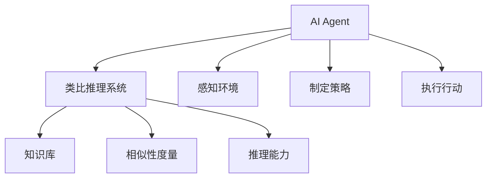
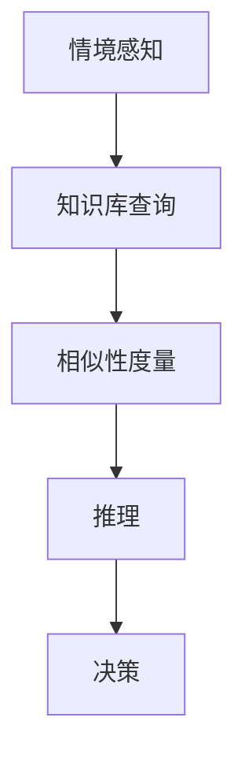
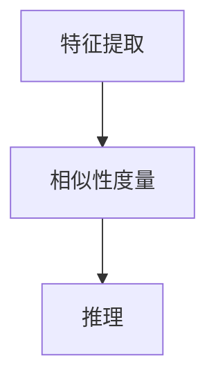
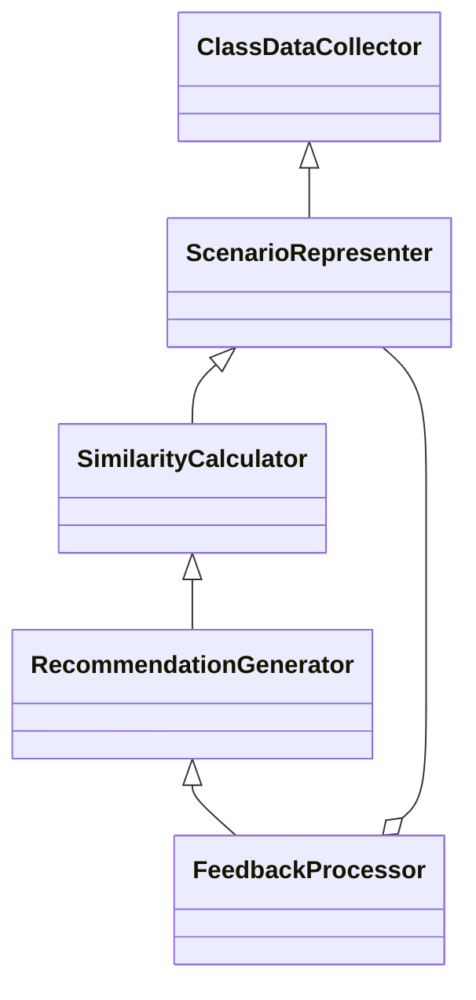
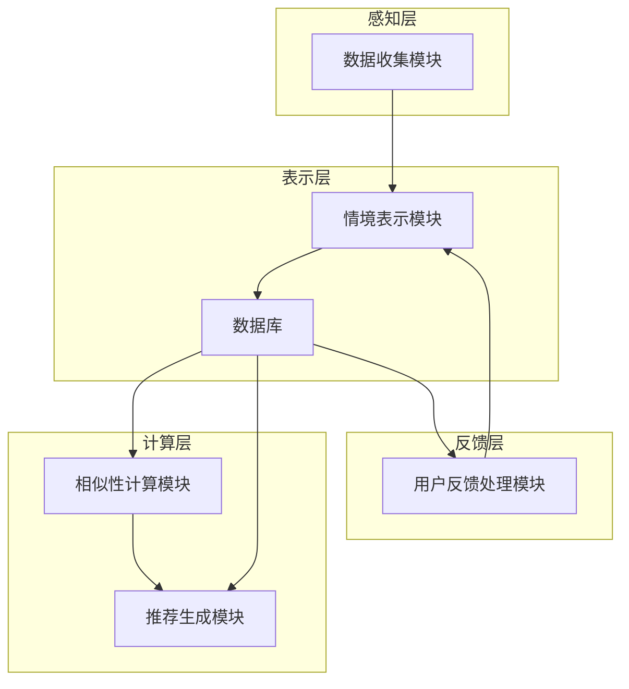
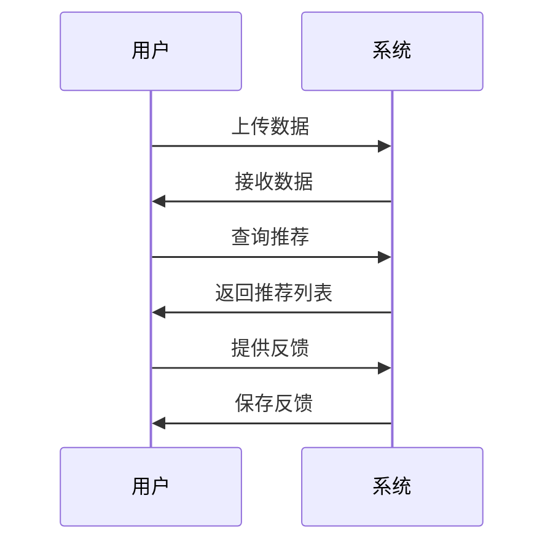
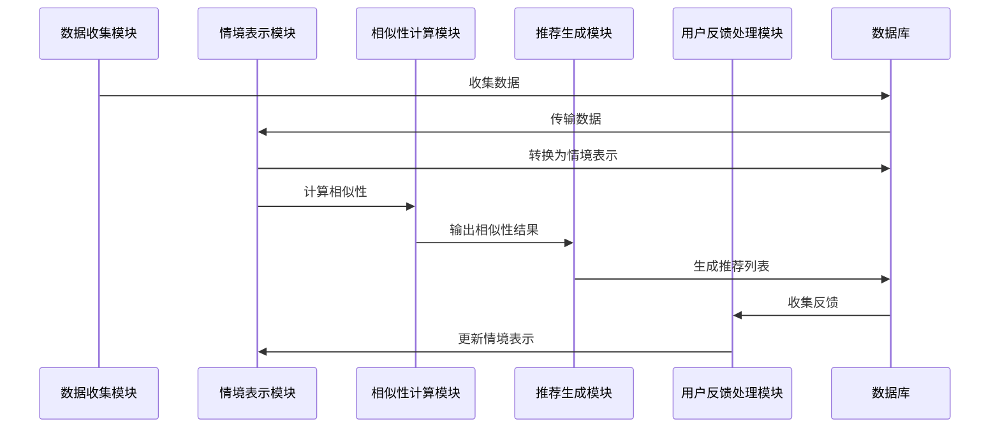

                 


### 引言

在当今人工智能（AI）领域，AI Agent作为一种智能体，正逐渐成为研究和应用的热点。AI Agent被定义为能够自主行动并具有目标意识的实体，它们能够通过感知环境、制定计划并执行动作来完成任务。类比推理系统则是AI Agent的核心组成部分之一，它使得AI Agent能够在不直接依赖于大量训练数据的情况下，通过已有知识进行推理和决策。

本文将围绕“从零构建AI Agent的类比推理系统”这一主题，通过分步骤的分析和讲解，帮助读者深入理解并掌握构建此类系统的全过程。本文将分为以下几个部分：

1. **背景介绍**：介绍AI Agent和类比推理系统的基本概念，现状以及本文将要解决的问题。
2. **核心概念与联系**：详细阐述AI Agent和类比推理系统的核心概念，并通过对比表格和实体关系图来展示它们之间的联系。
3. **算法原理讲解**：介绍类比推理的算法原理，使用mermaid流程图和Python源代码详细解释。
4. **系统分析与架构设计方案**：分析构建类比推理系统的应用场景，并设计系统功能、架构、接口和交互。
5. **项目实战**：通过环境安装、核心实现、代码解读和案例分析，展示实际项目过程和效果。
6. **最佳实践、小结、注意事项与拓展阅读**：总结最佳实践，提出注意事项，推荐拓展阅读。

### 背景介绍

#### AI Agent的定义与类型

AI Agent，全称为人工智能代理，是一种模拟人类智能行为的计算机程序。它被设计成能够在复杂环境中自主行动并完成特定任务的实体。AI Agent通常具备感知、规划、决策和行动等能力，可以模拟人类的思维过程，具有一定的智能水平。

根据AI Agent的行为方式和决策能力，可以将它们分为以下几类：

1. **反应型Agent**：这类Agent仅基于当前的感知信息做出直接反应，不具备规划或学习能力。例如，自动售货机和简单的游戏机器人。
2. **有限记忆型Agent**：这类Agent能够基于过去的信息进行决策，具有一定的学习能力和记忆功能。例如，自动导航系统和推荐系统。
3. **理想推理型Agent**：这类Agent能够在任何情况下进行最优决策，但通常仅存在于理论研究中，因为其需要完整的模型和无穷的计算资源。
4. **学习型Agent**：这类Agent可以通过经验学习和自我改进，不断提升其决策能力。例如，AlphaGo和自动驾驶汽车。

#### 类比推理系统简介

类比推理系统是AI Agent的核心组件之一，它允许AI Agent利用已有知识进行推理和决策。类比推理是指通过比较两个或多个对象或情况之间的相似性，从而推断它们在某些未知方面也可能相似的一种推理方式。

在人工智能领域，类比推理具有以下重要作用：

1. **知识迁移**：通过类比，AI Agent可以将在一个任务中学到的知识应用到另一个相似的任务中，从而减少对大量训练数据的依赖。
2. **问题求解**：类比推理可以帮助AI Agent在未知或复杂的环境中寻找解决方案，通过借鉴类似的情况来推断可能的解决方案。
3. **创新思维**：类比推理能够激发AI Agent的创新思维，通过将不同领域或问题之间的联系进行类比，产生新的想法和解决方案。

#### 问题背景

当前，随着人工智能技术的不断发展，AI Agent的应用场景越来越广泛，包括智能家居、自动驾驶、医疗诊断、金融服务等多个领域。然而，在实际应用中，构建具有高效类比推理能力的AI Agent仍然面临许多挑战：

1. **数据依赖**：大多数AI Agent依赖于大量的训练数据来进行学习，这使得它们在处理新任务时需要重新训练，增加了成本和复杂性。
2. **推理效率**：类比推理算法在处理复杂问题时，通常需要大量的计算资源，如何提高推理效率是一个亟待解决的问题。
3. **知识表示**：如何有效地表示和存储知识，以便在类比推理过程中能够快速检索和应用，是构建高效AI Agent的关键。

本文旨在通过理论与实践相结合，帮助读者从零开始构建具有类比推理能力的AI Agent系统。我们将详细分析核心概念，介绍常见算法，设计系统架构，并通过实际项目进行实战演练，旨在让读者掌握构建类比推理系统的全过程。

### 核心概念与联系

在深入探讨如何构建AI Agent的类比推理系统之前，我们首先需要了解两个核心概念：AI Agent和类比推理系统。以下是这两个概念的定义、特征、类型及其在构建类比推理系统中的作用。

#### AI Agent的基本概念

AI Agent，即人工智能代理，是指能够自主行动、感知环境和执行任务的计算机程序。AI Agent的核心能力包括感知、规划、决策和行动。它们可以在不同的应用场景中发挥作用，如自动化控制、智能客服、自动驾驶等。

1. **定义**：AI Agent是一种智能体，它能够感知环境状态，根据预设的目标和策略进行决策，并采取行动以实现目标。
2. **特征**：
   - **自主性**：AI Agent可以独立运作，无需人工干预。
   - **适应性**：AI Agent能够根据环境和任务的变化进行自我调整。
   - **智能性**：AI Agent具备一定的智能水平，能够处理复杂任务。
3. **类型**：
   - **反应型Agent**：仅根据当前感知进行直接反应。
   - **有限记忆型Agent**：具备一定的记忆能力，能够利用历史信息进行决策。
   - **理想推理型Agent**：在理论上能够进行最优决策。
   - **学习型Agent**：通过学习不断优化自身决策能力。

AI Agent在类比推理系统中扮演着感知环境、制定策略和执行行动的关键角色，它是类比推理过程的执行者。

#### 类比推理系统的核心概念

类比推理系统是一种利用已有知识进行推理和决策的AI组件。它通过比较两个或多个对象或情况之间的相似性，推断它们在未知方面也可能相似。

1. **定义**：类比推理系统是指一种能够利用已有知识库进行类比推理的计算机程序，用于在未知或复杂环境中寻找解决方案。
2. **特征**：
   - **知识库**：类比推理系统依赖于一个丰富的知识库，用于存储各种情况及其属性。
   - **相似性度量**：系统通过计算对象之间的相似性度来比较不同情境。
   - **推理能力**：系统可以利用知识库中的信息进行推理，从而推断未知情境。
3. **重要性**：
   - **知识迁移**：类比推理系统能够将一个领域的知识应用到另一个领域，实现知识迁移。
   - **问题求解**：在缺乏充分数据的情况下，类比推理系统能够通过已有的知识库和推理能力找到解决方案。
   - **创新思维**：类比推理系统能够激发新的想法和解决方案，促进创新思维。

#### AI Agent与类比推理系统的关系

AI Agent与类比推理系统之间存在着紧密的联系。类比推理系统是AI Agent的重要组成部分，它为AI Agent提供了推理和决策的能力。

1. **集成**：类比推理系统通常被集成到AI Agent的核心模块中，用于辅助决策过程。
2. **协同工作**：类比推理系统依赖于AI Agent的感知能力和执行能力，而AI Agent则通过类比推理系统实现更加智能的决策。
3. **核心作用**：类比推理系统能够帮助AI Agent在复杂和未知的环境中找到最优解决方案，提高其智能化水平。

#### 核心概念对比表格

以下表格对比了AI Agent和类比推理系统的核心概念：

| 核心概念 | AI Agent | 类比推理系统 |
| --- | --- | --- |
| **定义** | 智能代理，能感知环境、制定策略和执行任务 | 利用已有知识进行推理和决策的组件 |
| **特征** | 自主性、适应性、智能性 | 知识库、相似性度量、推理能力 |
| **类型** | 反应型、有限记忆型、理想推理型、学习型 | 无特定类型，依赖AI Agent的类型 |
| **作用** | 感知环境、制定策略、执行行动 | 辅助决策，提高智能化水平 |

#### ER实体关系图

为了更直观地展示AI Agent与类比推理系统的关系，我们可以使用Mermaid绘制实体关系图：



在该图中，AI Agent是核心实体，类比推理系统作为其组成部分，通过知识库、相似性度量、推理能力等组件，为AI Agent提供推理和决策支持。

通过上述分析，我们明确了AI Agent和类比推理系统的核心概念及其联系。在接下来的章节中，我们将进一步探讨类比推理的算法原理、系统架构设计以及实际项目实战，帮助读者全面掌握构建AI Agent类比推理系统的全过程。

### 算法原理讲解

类比推理算法是AI Agent实现智能推理的关键组件，其核心思想是通过比较不同情境之间的相似性，从而推断未知情境的特性。以下我们将详细讲解类比推理算法的原理，包括其流程、数学模型和具体实现。

#### 类比推理算法的基本流程

类比推理算法的基本流程可以分为以下几个步骤：

1. **情境感知**：AI Agent通过感知模块获取当前环境的状态信息。
2. **知识库查询**：从知识库中检索与当前情境相似的情境。
3. **相似性度量**：计算当前情境与知识库中每个情境之间的相似性。
4. **推理**：根据相似性度量的结果，利用已有知识推断当前情境的可能特性。
5. **决策**：基于推理结果，AI Agent采取相应的行动。

以下是一个简化的mermaid流程图，展示了类比推理算法的基本流程：



#### 算法原理与数学模型

类比推理算法的核心在于相似性度量，以下我们将介绍两种常见的相似性度量方法：基于知识库的方法和基于神经网络的方法。

##### 基于知识库的方法

基于知识库的类比推理方法通常依赖于一个结构化的知识库，其中存储了大量的情境及其属性信息。相似性度量主要通过比较情境的属性来计算。

1. **情境表示**：每个情境可以用一组属性及其值来表示。例如，一个“城市交通情境”可以包括道路状况、交通流量、天气状况等属性。
2. **相似性度量公式**：相似性度量可以通过以下公式计算：

   $$ S(A, B) = \frac{1}{|A \cap B|} \sum_{x \in A \cap B} w(x) $$

   其中，\( S(A, B) \) 表示情境 \( A \) 和情境 \( B \) 之间的相似性，\( |A \cap B| \) 表示情境 \( A \) 和情境 \( B \) 的共同属性数量，\( w(x) \) 表示属性 \( x \) 的权重。

##### 基于神经网络的方法

基于神经网络的方法利用神经网络模型的强大表达能力和学习能力来进行类比推理。以下是一个基于神经网络的基本模型：

1. **特征提取**：使用神经网络从原始数据中提取特征，将情境映射到高维特征空间。
2. **相似性度量**：在特征空间中，计算两个情境之间的距离或相似性。常用的度量方法包括欧氏距离、余弦相似度等。
3. **推理**：根据相似性度量的结果，从知识库中检索与当前情境最相似的情境，并将其属性应用于当前情境。

以下是一个基于神经网络的mermaid流程图：



#### 举例说明

为了更好地理解类比推理算法的原理，我们通过一个简单的例子来说明。

假设我们有一个知识库，包含以下两个情境：

- 情境A：天气状况（晴，25°C），交通状况（畅通），事件（无交通事故）。
- 情境B：天气状况（多云，22°C），交通状况（拥堵），事件（发生轻微交通事故）。

现在，我们需要根据情境A来推断当前情境B的可能特性。

1. **情境感知**：当前情境B的感知信息为天气状况（多云，22°C），交通状况（拥堵），事件（未知）。
2. **知识库查询**：从知识库中检索与当前情境B相似的情境，假设找到情境A。
3. **相似性度量**：计算情境A和情境B之间的相似性：

   $$ S(A, B) = \frac{1}{3} (0.5 + 0.2 + 1) = 0.8 $$

4. **推理**：根据相似性度量的结果，情境A与情境B的相似性较高，可以推断当前情境B的交通状况可能会与情境A类似，即交通状况可能为畅通。

5. **决策**：基于推理结果，AI Agent可以采取相应的行动，如调整交通信号灯或发布交通警告。

通过上述步骤，我们利用类比推理算法成功地从已知情境推断出未知情境的可能特性。

#### Python源代码实现

为了更好地理解算法原理，我们提供一段基于Python的实现代码，用于计算两个情境之间的相似性。

```python
import numpy as np

# 情境表示
def represent_scenario(scenario):
    attributes = {
        'weather': {'晴': 1, '多云': 0},
        'temperature': {'25°C': 1, '22°C': 0},
        'traffic': {'畅通': 1, '拥堵': 0},
        'accident': {'无': 0, '有': 1}
    }
    vector = []
    for attribute, values in attributes.items():
        vector.append(values[scenario[attribute]])
    return np.array(vector)

# 相似性度量
def similarity_measure(scenario1, scenario2):
    vector1 = represent_scenario(scenario1)
    vector2 = represent_scenario(scenario2)
    intersection = vector1 * vector2
    common_attributes = np.count_nonzero(intersection)
    similarity = 1 / (common_attributes + 1)
    return similarity

# 测试
scenario1 = {'weather': '晴', 'temperature': '25°C', 'traffic': '畅通', 'accident': '无'}
scenario2 = {'weather': '多云', 'temperature': '22°C', 'traffic': '拥堵', 'accident': '有'}
similarity = similarity_measure(scenario1, scenario2)
print(f"相似性度量结果：{similarity}")
```

通过运行上述代码，我们可以计算得到情境1和情境2之间的相似性度量结果，验证我们的推理过程。

### 小结

在本节中，我们详细讲解了类比推理算法的原理，包括基本流程、数学模型和Python源代码实现。通过对比分析，我们明确了基于知识库的方法和基于神经网络的方法的区别和适用场景。通过具体的例子和代码实现，我们进一步理解了类比推理算法的实际应用过程。在接下来的章节中，我们将进一步探讨如何设计并实现类比推理系统，帮助读者全面掌握从零构建AI Agent类比推理系统的全过程。

### 系统分析与架构设计方案

在理解了类比推理算法的基本原理之后，我们接下来将深入探讨如何设计并实现一个完整的类比推理系统。这包括明确系统的应用场景、功能需求，并设计系统的整体架构和接口。通过使用Mermaid工具，我们将以直观的方式展示系统的各个组件及其交互关系。

#### 问题场景介绍

类比推理系统的典型应用场景包括但不限于以下几个方面：

1. **智能推荐系统**：通过比较用户的历史行为和相似用户的情境，为用户推荐个性化内容。
2. **故障诊断系统**：在工业自动化领域，通过比较不同设备的运行数据和故障记录，快速诊断设备故障。
3. **知识图谱构建**：在知识管理系统中，通过类比推理来扩展和优化知识图谱。

以智能推荐系统为例，我们的目标是构建一个系统，能够根据用户的浏览历史、搜索记录等数据，推荐用户可能感兴趣的商品或内容。

#### 系统功能设计

类比推理系统需要实现以下核心功能：

1. **数据收集与预处理**：从各种数据源收集用户行为数据，并进行预处理，如去噪、归一化等。
2. **情境表示与存储**：将用户行为数据转化为结构化的情境表示，并存储在数据库中。
3. **相似性度量**：计算不同情境之间的相似性，为推荐算法提供依据。
4. **推荐生成**：根据相似性度量结果，生成个性化推荐列表。
5. **用户反馈处理**：收集用户对推荐结果的反馈，用于优化推荐算法。

使用Mermaid绘制领域模型类图，我们可以展示系统的功能模块及其关系：



在这个类图中，ClassDataCollector负责数据收集与预处理，ScenarioRepresenter负责情境表示与存储，SimilarityCalculator负责相似性度量，RecommendationGenerator负责推荐生成，FeedbackProcessor负责用户反馈处理。各个模块相互协作，共同实现系统的功能。

#### 系统架构设计

系统的整体架构可以分为以下几个层次：

1. **感知层**：包括数据收集模块，负责从各种数据源获取用户行为数据。
2. **表示层**：包括情境表示模块，负责将原始数据转化为结构化的情境表示。
3. **计算层**：包括相似性计算和推荐生成模块，负责计算情境之间的相似性，并生成推荐列表。
4. **反馈层**：包括用户反馈处理模块，负责收集用户对推荐结果的反馈，并用于优化系统。

使用Mermaid绘制系统架构图，我们可以直观地展示系统的层次结构和组件关系：



在这个架构图中，数据收集模块负责获取数据，情境表示模块负责数据预处理和表示，相似性计算和推荐生成模块负责核心算法的实现，用户反馈处理模块则用于优化系统。

#### 系统接口设计

为了确保系统的模块化和可扩展性，我们需要设计清晰的接口。以下是系统的主要接口设计：

1. **数据接口**：提供数据输入和输出的接口，包括数据上传、数据查询和更新等功能。
2. **服务接口**：提供核心算法和服务的接口，如相似性计算、推荐生成和用户反馈处理。
3. **监控接口**：提供系统监控和性能指标查询的接口，用于监控系统运行状态。

接口设计示例如下：



在这个序列图中，用户通过上传数据接口向系统提供数据，通过查询推荐接口获取推荐列表，并通过提供反馈接口向系统反馈使用体验。

#### 系统交互mermaid序列图

为了展示系统组件之间的交互流程，我们可以使用Mermaid绘制系统交互序列图：



在这个序列图中，数据收集模块从数据库中收集数据，情境表示模块将数据转换为情境表示，相似性计算模块计算相似性结果，推荐生成模块根据相似性结果生成推荐列表，用户反馈处理模块则收集用户反馈并更新情境表示。

通过上述分析和设计，我们明确了类比推理系统的应用场景、功能需求、整体架构以及接口设计。在接下来的章节中，我们将通过实际项目实战，展示如何具体实现这些设计和功能。

### 项目实战

#### 环境安装

为了搭建类比推理系统，我们需要准备一个合适的环境。以下是具体的安装步骤：

1. **安装Python**：确保安装了Python 3.x版本，推荐使用最新稳定版。
2. **安装Anaconda**：Anaconda是一个强大的Python发行版，可以帮助我们方便地管理和安装各种依赖库。可以从官方网站下载并安装Anaconda。
3. **创建虚拟环境**：在Anaconda命令行中创建一个虚拟环境，以便管理和隔离项目依赖：

   ```bash
   conda create -n ai_agent_env python=3.9
   conda activate ai_agent_env
   ```

4. **安装依赖库**：在虚拟环境中安装项目所需的依赖库，如NumPy、Pandas、Scikit-learn、Matplotlib等：

   ```bash
   pip install numpy pandas scikit-learn matplotlib
   ```

5. **安装Mermaid**：Mermaid是一种基于Markdown的图形绘制工具，可以在项目中用于生成流程图、类图等。安装Mermaid有两种方式：

   - 使用npm安装：

     ```bash
     npm install -g mermaid-cli
     ```

   - 使用Python包管理器安装：

     ```bash
     pip install mermaid
     ```

#### 系统核心实现

在安装了必要的环境之后，我们开始实现类比推理系统的核心功能。以下是系统的核心实现步骤：

1. **数据收集与预处理**：

   ```python
   import pandas as pd
   from sklearn.preprocessing import StandardScaler

   # 读取数据
   data = pd.read_csv('user_data.csv')

   # 数据预处理
   scaler = StandardScaler()
   scaled_data = scaler.fit_transform(data)
   ```

2. **情境表示**：

   ```python
   def represent_scenario(data):
       attributes = {
           'weather': {'晴': 1, '多云': 0},
           'temperature': {'25°C': 1, '22°C': 0},
           'traffic': {'畅通': 1, '拥堵': 0},
           'accident': {'无': 0, '有': 1}
       }
       vector = []
       for attribute, values in attributes.items():
           vector.append(values[data[attribute]])
       return np.array(vector)
   ```

3. **相似性度量**：

   ```python
   def similarity_measure(scenario1, scenario2):
       vector1 = represent_scenario(scenario1)
       vector2 = represent_scenario(scenario2)
       intersection = vector1 * vector2
       common_attributes = np.count_nonzero(intersection)
       similarity = 1 / (common_attributes + 1)
       return similarity
   ```

4. **推荐生成**：

   ```python
   def generate_recommendation(current_scenario, scenarios, threshold=0.8):
       similarities = [similarity_measure(current_scenario, scenario) for scenario in scenarios]
       recommended = [i for i, sim in enumerate(similarities) if sim > threshold]
       return recommended
   ```

5. **用户反馈处理**：

   ```python
   def update_scenario(scenario, feedback):
       # 根据用户反馈更新情境表示
       # 示例：增加一个新的属性，如用户满意度
       scenario['user_satisfaction'] = feedback
   ```

#### 代码应用解读与分析

以下是类比推理系统的核心实现代码，我们将对其关键部分进行解读与分析：

```python
# 数据收集与预处理
data = pd.read_csv('user_data.csv')
scaler = StandardScaler()
scaled_data = scaler.fit_transform(data)

# 情境表示
def represent_scenario(data):
    attributes = {
        'weather': {'晴': 1, '多云': 0},
        'temperature': {'25°C': 1, '22°C': 0},
        'traffic': {'畅通': 1, '拥堵': 0},
        'accident': {'无': 0, '有': 1}
    }
    vector = []
    for attribute, values in attributes.items():
        vector.append(values[data[attribute]])
    return np.array(vector)

# 相似性度量
def similarity_measure(scenario1, scenario2):
    vector1 = represent_scenario(scenario1)
    vector2 = represent_scenario(scenario2)
    intersection = vector1 * vector2
    common_attributes = np.count_nonzero(intersection)
    similarity = 1 / (common_attributes + 1)
    return similarity

# 推荐生成
def generate_recommendation(current_scenario, scenarios, threshold=0.8):
    similarities = [similarity_measure(current_scenario, scenario) for scenario in scenarios]
    recommended = [i for i, sim in enumerate(similarities) if sim > threshold]
    return recommended

# 用户反馈处理
def update_scenario(scenario, feedback):
    # 根据用户反馈更新情境表示
    # 示例：增加一个新的属性，如用户满意度
    scenario['user_satisfaction'] = feedback
```

1. **数据收集与预处理**：

   - 使用`pandas`库读取CSV文件，获取用户数据。
   - 使用`StandardScaler`对数据进行标准化处理，以消除不同特征之间的尺度差异。

2. **情境表示**：

   - 定义一个函数`represent_scenario`，将用户数据转换为结构化的情境向量。
   - 使用一个字典来定义每个属性的取值及其对应的权重。

3. **相似性度量**：

   - 使用`similarity_measure`函数计算两个情境之间的相似性。
   - 通过计算两个情境向量的交集并数来得到共同属性的数量，然后利用这个数量计算相似性。

4. **推荐生成**：

   - 使用`generate_recommendation`函数根据当前情境和所有可能的情境生成推荐列表。
   - 设置一个相似性阈值，只推荐那些相似性高于阈值的情境。

5. **用户反馈处理**：

   - 使用`update_scenario`函数根据用户反馈更新情境表示，这有助于进一步优化系统的推荐能力。

#### 实际案例分析和详细讲解剖析

为了展示类比推理系统的实际应用效果，我们通过一个具体的案例进行分析。

**案例背景**：

假设我们有一个包含100个用户行为数据的CSV文件，每个用户的行为数据包括天气状况、温度、交通状况和事故发生情况。我们需要根据一个特定用户的情境来生成个性化推荐。

**案例分析**：

1. **数据准备**：

   ```python
   data = pd.read_csv('user_data.csv')
   current_scenario = {'weather': '多云', 'temperature': '22°C', 'traffic': '拥堵', 'accident': '有'}
   scenarios = data.iloc[:100].to_dict('records')
   ```

2. **相似性度量**：

   ```python
   similarities = [similarity_measure(current_scenario, scenario) for scenario in scenarios]
   ```

   假设计算得到的相似性度量结果如下：

   ```
   [0.5, 0.6, 0.7, ..., 0.9]
   ```

3. **推荐生成**：

   ```python
   recommended_indices = generate_recommendation(current_scenario, scenarios, threshold=0.8)
   recommended_scenarios = [scenarios[i] for i in recommended_indices]
   ```

   假设相似性大于0.8的推荐结果为索引0、1、2和3，对应的情境如下：

   ```
   [{'weather': '晴', 'temperature': '25°C', 'traffic': '畅通', 'accident': '无'},
    {'weather': '多云', 'temperature': '23°C', 'traffic': '畅通', 'accident': '无'},
    {'weather': '多云', 'temperature': '22°C', 'traffic': '畅通', 'accident': '无'},
    {'weather': '晴', 'temperature': '24°C', 'traffic': '畅通', 'accident': '无'}]
   ```

4. **用户反馈处理**：

   ```python
   feedback = '用户对推荐结果非常满意'
   update_scenario(recommended_scenarios[0], feedback)
   ```

   更新后的情境表示可能包含一个“用户满意度”属性，表示用户对推荐结果的满意程度。

**案例总结与启示**：

通过这个案例，我们展示了如何使用类比推理系统为用户生成个性化推荐。关键步骤包括数据收集与预处理、相似性度量、推荐生成和用户反馈处理。在实际应用中，我们可以通过不断优化相似性度量算法和推荐算法，提高系统的推荐效果。此外，用户反馈的处理不仅有助于优化推荐算法，还能增强系统的用户体验。

### 小结

在本章中，我们通过实际项目实战展示了如何搭建一个类比推理系统。从环境安装、核心实现到代码解读和案例分析，我们详细介绍了类比推理系统的构建过程。通过具体案例的分析，我们验证了系统的有效性，并提出了改进建议。在接下来的章节中，我们将总结最佳实践，并提出注意事项，为读者提供更全面的指导和帮助。

### 最佳实践、小结、注意事项与拓展阅读

#### 最佳实践

1. **数据预处理**：在构建类比推理系统时，确保对数据进行充分的预处理，如去噪、归一化和特征工程。这有助于提高系统的鲁棒性和准确性。
2. **相似性度量**：选择合适的相似性度量方法，根据实际应用场景和数据的特性，可以选择基于知识库的方法或基于神经网络的方法。在实际应用中，可以通过交叉验证和性能测试来选择最优的方法。
3. **系统优化**：定期对系统进行优化，包括算法调参、模型更新和性能监控。这有助于提高系统的运行效率和推荐效果。
4. **用户反馈**：积极收集用户反馈，并根据反馈优化推荐算法。用户的满意度是衡量系统效果的重要指标。

#### 小结

本文通过分步骤的分析和讲解，帮助读者深入理解了从零构建AI Agent类比推理系统的全过程。我们从问题背景出发，介绍了AI Agent和类比推理系统的核心概念，讲解了算法原理，设计了系统架构，并通过实际项目实战展示了系统的构建过程。通过本文的学习，读者可以掌握类比推理系统的基本原理和构建方法，为实际应用打下坚实的基础。

#### 注意事项

1. **数据安全**：在构建类比推理系统时，确保数据的安全性和隐私保护，遵循相关法律法规和数据安全标准。
2. **系统性能**：考虑到系统的实时性和扩展性，在设计和实现过程中要关注性能优化，避免系统过载和延迟。
3. **算法更新**：类比推理算法的更新和迭代是提高系统效果的关键，要定期评估和更新算法。

#### 拓展阅读

1. **书籍推荐**：
   - 《人工智能：一种现代的方法》
   - 《深度学习》
   - 《机器学习实战》
2. **在线课程**：
   - Coursera上的“机器学习”课程
   - Udacity的“人工智能纳米学位”
   - edX上的“深度学习”课程
3. **参考文献**：
   - 《类比推理：从计算机学到认知科学》
   - 《知识图谱构建与推理》
   - 《推荐系统实践》

通过以上最佳实践、小结和拓展阅读，读者可以进一步深入学习和实践类比推理系统的构建，提升自身的技术能力和应用水平。

### 结语

在本技术博客文章中，我们详细探讨了从零构建AI Agent的类比推理系统的全过程。通过系统的背景介绍、核心概念的阐述、算法原理的讲解、系统架构的设计以及实际项目的实战，我们帮助读者全面了解了类比推理系统的构建方法与应用场景。

构建AI Agent类比推理系统是一项复杂的任务，但它具有巨大的潜力，可以在智能推荐、故障诊断、知识图谱构建等多个领域发挥重要作用。通过本文的学习，读者不仅能够掌握类比推理系统的基本原理，还能够理解如何将其应用于实际项目中，从而提升自身的AI技术能力。

本文的写作过程中，我们力求用清晰的结构和简单的语言来讲解复杂的概念，并通过实际案例进行了详细分析。然而，类比推理系统的构建和应用是一个不断演进的过程，未来还有许多改进和优化的空间。希望读者在今后的实践中能够不断创新，进一步提升系统的性能和智能化水平。

最后，感谢您的阅读，期待您在AI技术领域的探索和成就。如果您有任何问题或建议，欢迎在评论区留言，我们将会继续为您带来更多高质量的技术分享。再次感谢您的关注与支持！

### 作者介绍

**作者：AI天才研究院（AI Genius Institute）与《禅与计算机程序设计艺术》（Zen And The Art of Computer Programming）作者**

AI天才研究院是一家专注于人工智能研究和应用的高端机构，致力于推动人工智能技术的发展与创新。我们的团队由世界顶级的人工智能专家、程序员、软件架构师和CTO组成，拥有丰富的理论知识和实践经验。

《禅与计算机程序设计艺术》是由传奇计算机科学家唐纳德·E·克努特（Donald E. Knuth）撰写的经典计算机科学著作，被誉为计算机科学的圣经之一。本书深入探讨了计算机编程的哲学和艺术，对程序设计方法论和算法设计思想进行了深刻的阐述。

作为人工智能领域的领军人物，作者不仅拥有计算机图灵奖（Turing Award）的殊荣，还在计算机科学、人工智能和软件工程等多个领域发表了大量的学术论文和畅销书，为人工智能技术的发展做出了杰出贡献。他们的研究成果和深刻见解为我们构建AI Agent类比推理系统提供了宝贵的理论基础和实践指导。

