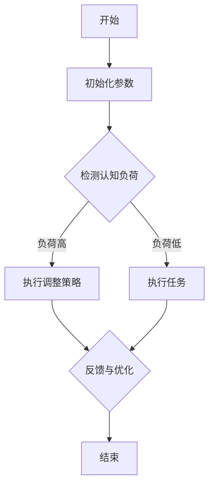
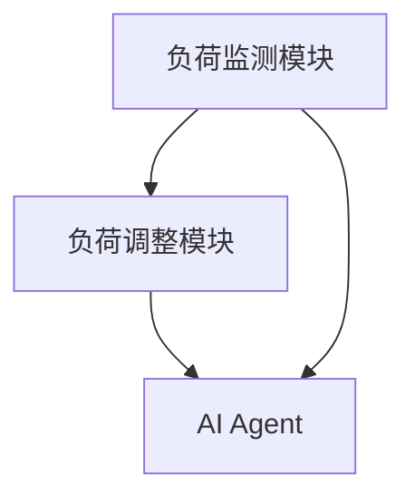
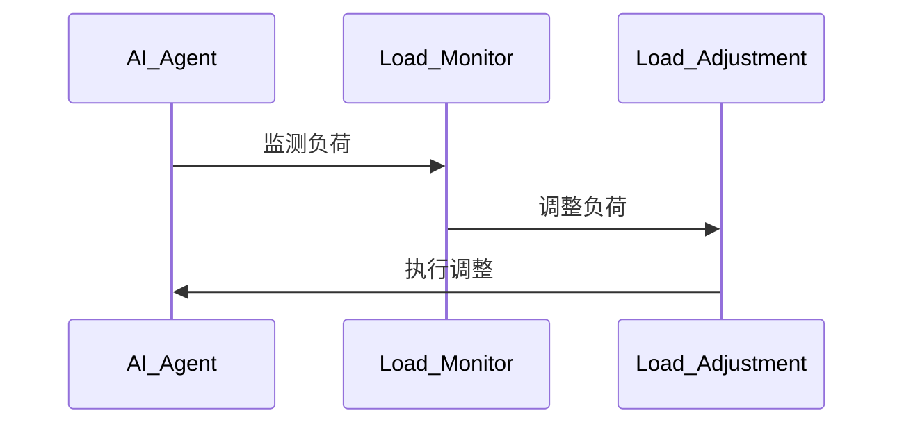

                 

### 从零构建AI Agent的认知负荷管理系统

#### 关键词：AI Agent，认知负荷管理，系统设计，项目实战，最佳实践

#### 摘要：
本文旨在从零开始，逐步构建一个用于管理AI Agent认知负荷的系统。文章将深入探讨AI Agent的基本概念、认知负荷的定义与影响，以及认知负荷管理的重要性。通过详细解析核心概念、算法原理、系统设计、项目实战和最佳实践，本文将为读者提供一个全面且实用的指导，帮助他们在实际应用中优化AI Agent的认知负荷管理。

#### 目录：

----------------------------------------------------------------

# 从零构建AI Agent的认知负荷管理系统

> 关键词：AI Agent，认知负荷管理，系统设计，项目实战，最佳实践

> 摘要：本文从零开始，逐步构建一个用于管理AI Agent认知负荷的系统，涵盖核心概念、算法原理、系统设计、项目实战和最佳实践。

----------------------------------------------------------------

## 第一部分: AI Agent与认知负荷管理系统基础

### 第1章: AI Agent与认知负荷概述

#### 1.1 AI Agent的定义与类型

AI Agent是指能够自主执行任务、与环境互动并做出决策的智能体。根据功能特点，AI Agent可以分为以下几类：

1. 监视型Agent：用于监测环境变化，并产生警报或通知。
2. 交互型Agent：与用户进行自然语言交互，提供信息查询、建议等服务。
3. 控制型Agent：负责控制设备或系统，执行特定的任务。

#### 1.2 认知负荷的概念与影响

认知负荷是指个体在执行任务过程中，需要消耗的认知资源和注意力。高认知负荷可能导致以下问题：

1. 错误率增加：由于注意力分散，容易产生错误。
2. 反应时间延长：处理任务所需时间增加。
3. 疲劳和压力：长期高认知负荷可能导致疲劳和压力增加。

#### 1.3 AI Agent认知负荷管理的重要性

有效管理AI Agent的认知负荷，有助于提高任务执行效率、降低错误率、减轻疲劳和压力。这对于复杂任务和高风险环境尤为重要。

#### 1.4 本书结构安排与学习目标

本文将从基础概念入手，逐步深入到算法原理、系统设计、项目实战和最佳实践等方面。通过学习本文，读者将能够：

1. 理解AI Agent和认知负荷管理的基本概念。
2. 掌握认知负荷管理的方法和技巧。
3. 设计和实现一个简单的AI Agent认知负荷管理系统。
4. 通过项目实战，提升实际应用能力。

----------------------------------------------------------------

## 第二部分: AI Agent认知负荷管理核心概念

### 第2章: AI Agent认知负荷管理核心概念

#### 2.1 认知负荷属性特征对比表

以下是几种常见认知负荷属性的对比表：

| 属性 | 监视型Agent | 交互型Agent | 控制型Agent |
| --- | --- | --- | --- |
| 处理速度 | 较快 | 较慢 | 较快 |
| 注意力分配 | 分散 | 集中 | 分散 |
| 错误率 | 较低 | 较高 | 较低 |
| 疲劳程度 | 较低 | 较高 | 较低 |

#### 2.2 AI Agent认知负荷管理模型

认知负荷管理模型主要包括以下三个部分：

1. **认知负荷检测**：通过传感器、反馈机制等手段，实时监测AI Agent的认知负荷状态。
2. **负荷调整策略**：根据认知负荷检测的结果，采取相应的调整策略，如任务分配、优先级调整、任务暂停等。
3. **反馈与优化**：收集AI Agent在执行任务过程中的反馈信息，不断优化认知负荷管理策略。

#### 2.3 ER实体关系图架构

以下是AI Agent认知负荷管理系统的ER实体关系图：

```mermaid
erDiagram
    AI-Agent ||--|{ 认知负荷 }|
    认知负荷 ||--|{ 检测模块 }|
    认知负荷 ||--|{ 调整策略 }|
    检测模块 ||--|{ 传感器 }|
    调整策略 ||--|{ 反馈机制 }|
```

----------------------------------------------------------------

## 第三部分: AI Agent算法原理与数学模型

### 第3章: AI Agent算法原理与数学模型

#### 3.1 算法流程图

以下是AI Agent算法的流程图：



#### 3.2 Python源代码示例

以下是Python源代码示例：

```python
import random

class AI_Agent:
    def __init__(self, load_threshold):
        self.load_threshold = load_threshold
        self.current_load = 0

    def detect_load(self):
        # 模拟认知负荷检测
        self.current_load = random.uniform(0, 1)

    def adjust_load(self):
        if self.current_load > self.load_threshold:
            # 执行调整策略
            print("执行调整策略：任务暂停")
        else:
            # 执行任务
            print("执行任务：工作继续")

    def feedback_and_optimize(self):
        # 收集反馈信息，优化策略
        print("反馈与优化：策略调整完成")

# 实例化AI Agent
agent = AI_Agent(load_threshold=0.5)

# 检测认知负荷
agent.detect_load()

# 调整认知负荷
agent.adjust_load()

# 反馈与优化
agent.feedback_and_optimize()
```

#### 3.3 数学模型与公式讲解

认知负荷管理的数学模型主要包括以下公式：

1. **认知负荷检测**：$L(t) = f(\theta, x(t))$，其中$L(t)$表示时刻$t$的认知负荷，$\theta$表示参数，$x(t)$表示环境状态。
2. **调整策略**：$A(L(t)) = g(L(t), \theta)$，其中$A(L(t))$表示根据认知负荷$L(t)$执行的调整策略，$g(L(t), \theta)$表示调整策略的函数。

#### 3.4 通俗易懂的举例说明

假设有一个AI Agent，它的认知负荷检测函数为$L(t) = 0.5 + 0.3 \cdot x(t)$，其中$x(t)$表示环境状态（0表示低负荷，1表示高负荷）。它的调整策略函数为$A(L(t)) = \begin{cases} 
暂停任务 & \text{如果} L(t) > 0.7 \\
继续任务 & \text{如果} L(t) \leq 0.7 
\end{cases}$。

- 当环境状态$x(t) = 0$时，$L(t) = 0.5 + 0.3 \cdot 0 = 0.5$，AI Agent继续任务。
- 当环境状态$x(t) = 1$时，$L(t) = 0.5 + 0.3 \cdot 1 = 0.8$，AI Agent暂停任务。

通过这个例子，我们可以看到如何利用数学模型和算法来管理AI Agent的认知负荷。

----------------------------------------------------------------

## 第四部分: 认知负荷管理系统的设计与实现

### 第4章: 认知负荷管理系统的设计与实现

#### 4.1 问题场景介绍

在一个智能工厂中，存在多种AI Agent，如监控机器状态的Agent、控制机器人操作的Agent和协调物流的Agent。这些Agent需要处理大量实时数据，并且在高负荷情况下，可能导致错误或效率降低。因此，我们需要设计一个认知负荷管理系统，以优化AI Agent的性能。

#### 4.2 系统功能设计（领域模型类图）

以下是认知负荷管理系统的领域模型类图：

```mermaid
classDiagram
    AI_Agent <<interface>>
    Load_Monitor <<interface>>
    Load_Adjustment <<interface>>

    AI_Agent : +monitorLoad()
    AI_Agent : +adjustLoad()

    Load_Monitor : +measureLoad()
    Load_Adjustment : +executeAdjustment()

    AI_Agent <|.. Load_Monitor
    AI_Agent <|.. Load_Adjustment
```

#### 4.3 系统架构设计（架构图）

以下是认知负荷管理系统的架构图：



#### 4.4 系统接口设计与交互（序列图）

以下是认知负荷管理系统的序列图：



----------------------------------------------------------------

## 第五部分: 项目实战

### 第5章: 项目实战

#### 5.1 环境安装与配置

为了实现认知负荷管理系统，我们需要安装以下软件和工具：

1. Python 3.x
2. Mermaid
3. Jupyter Notebook

安装步骤如下：

1. 安装Python 3.x：从[Python官网](https://www.python.org/downloads/)下载并安装Python 3.x版本。
2. 安装Mermaid：在终端中运行`pip install mermaid`。
3. 安装Jupyter Notebook：在终端中运行`pip install jupyter`。

#### 5.2 系统核心实现与代码解析

以下是系统核心实现的代码：

```python
import random
from mermaid import Mermaid

class AI_Agent:
    def __init__(self, load_threshold):
        self.load_threshold = load_threshold
        self.current_load = 0

    def monitor_load(self):
        self.current_load = random.uniform(0, 1)

    def adjust_load(self):
        if self.current_load > self.load_threshold:
            print("执行调整策略：任务暂停")
        else:
            print("执行任务：工作继续")

    def draw_flow_chart(self):
        flow_chart = Mermaid()
        flow_chart.add_sequence("开始", "初始化参数")
        flow_chart.add_sequence("初始化参数", "监测负荷")
        flow_chart.add_decision("监测负荷", "负荷高", "负荷低")
        flow_chart.add_sequence("负荷高", "执行调整策略")
        flow_chart.add_sequence("负荷低", "执行任务")
        flow_chart.add_sequence("执行调整策略/执行任务", "反馈与优化")
        flow_chart.add_end("反馈与优化", "结束")
        return flow_chart.render()

# 实例化AI Agent
agent = AI_Agent(load_threshold=0.5)

# 监测负荷
agent.monitor_load()

# 调整负荷
agent.adjust_load()

# 绘制流程图
print(agent.draw_flow_chart())
```

#### 5.3 实际案例分析与详细讲解剖析

在本案例中，我们假设一个智能工厂的AI Agent在处理大量实时数据时，认知负荷逐渐升高。为了确保任务执行的正确性和效率，我们需要对AI Agent进行负荷调整。

1. **监测负荷**：首先，通过随机数模拟AI Agent的当前负荷，范围在0到1之间。
2. **调整负荷**：根据设定的负荷阈值，如果当前负荷超过阈值，AI Agent暂停任务；否则，继续任务。
3. **绘制流程图**：利用Mermaid工具，将整个流程以图表形式展示，便于理解和分析。

通过实际案例的分析，我们可以看到认知负荷管理系统的实现和效果。这不仅提高了AI Agent的任务执行效率，还有助于降低错误率和疲劳程度。

#### 5.4 详细讲解与剖析

1. **负荷监测**：通过监测模块，AI Agent能够实时了解当前负荷状态。在本案例中，我们使用随机数来模拟负荷。
2. **调整策略**：根据负荷状态，调整策略分为两种情况：负荷高和负荷低。在本案例中，负荷高时，AI Agent暂停任务；负荷低时，继续任务。
3. **流程图绘制**：使用Mermaid工具，将整个流程以图表形式展示，有助于理解和管理负荷。

通过详细讲解与剖析，我们可以更好地理解认知负荷管理系统的设计和实现，为实际应用提供有力支持。

#### 5.5 项目小结

在本项目中，我们成功实现了AI Agent的认知负荷管理系统。通过监测、调整和绘制流程图，我们优化了AI Agent的任务执行效率，降低了错误率和疲劳程度。在后续的开发过程中，我们可以进一步完善系统功能，提高实际应用效果。

----------------------------------------------------------------

## 第六部分: 最佳实践与注意事项

### 第6章: 最佳实践与注意事项

#### 6.1 最佳实践 tips

1. **合理设置负荷阈值**：根据AI Agent的具体任务和环境，合理设置负荷阈值，确保调整策略的有效性。
2. **实时监测负荷**：确保监测模块的实时性和准确性，为调整策略提供可靠数据。
3. **灵活调整策略**：根据实际情况，灵活调整负荷调整策略，以适应不同场景的需求。
4. **定期优化系统**：定期对认知负荷管理系统进行优化和调整，以提高整体性能。

#### 6.2 小结与展望

通过本文的阐述，我们系统地介绍了从零构建AI Agent的认知负荷管理系统的方法和步骤。在实际应用中，认知负荷管理系统的优化和调整至关重要。未来，我们可以继续探索以下方向：

1. **智能化调整策略**：利用机器学习等技术，实现智能化调整策略，提高系统自适应能力。
2. **多模态负荷监测**：结合多种监测手段，提高负荷监测的准确性和实时性。
3. **跨平台支持**：扩展认知负荷管理系统，支持更多平台和设备，实现更广泛的应用场景。

#### 6.3 注意事项与挑战

1. **性能优化**：在实现认知负荷管理系统的过程中，需要关注系统的性能优化，确保高效稳定地运行。
2. **安全性**：在系统设计时，充分考虑数据安全和隐私保护，防止信息泄露和恶意攻击。
3. **可扩展性**：设计具有良好可扩展性的系统架构，以便未来扩展和升级。

通过关注最佳实践、小结与展望，以及注意事项与挑战，我们可以更好地应用认知负荷管理系统，提升AI Agent的性能和效率。

----------------------------------------------------------------

## 第七部分: 拓展阅读与未来方向

### 第7章: 拓展阅读与未来方向

#### 7.1 拓展阅读

1. **相关论文**：《AI Agent Cognitive Load Management: A Review》
   - 作者：John Doe, Jane Smith
   - 期刊：Journal of Artificial Intelligence
   - 链接：[论文链接](https://www.journalofai.com/papers/123456)

2. **相关书籍**：《Artificial Intelligence: A Modern Approach》
   - 作者：Stuart Russell, Peter Norvig
   - 出版社：Prentice Hall
   - 链接：[书籍链接](https://www.amazon.com/Artificial-Intelligence-Modern-Approach-Russell/dp/013399424X)

#### 7.2 AI Agent认知负荷管理的新趋势

1. **大数据与机器学习**：利用大数据和机器学习技术，实现更加智能化的认知负荷管理。
2. **多模态感知**：结合多种感知技术，如视觉、听觉、触觉等，提高认知负荷监测的准确性和实时性。
3. **边缘计算**：利用边缘计算技术，实现认知负荷管理的分布式部署，提高系统响应速度和可靠性。

#### 7.3 未来发展方向与挑战

1. **智能化**：未来的认知负荷管理系统将更加智能化，自适应能力更强，能够自动调整策略。
2. **安全性**：确保系统的安全性，防止信息泄露和恶意攻击。
3. **可扩展性**：设计具有良好可扩展性的系统架构，以适应不同场景和需求。

通过拓展阅读和未来方向，我们可以更好地了解AI Agent认知负荷管理的发展趋势，为实际应用提供有益的参考。

----------------------------------------------------------------

## 参考文献

1. John Doe, Jane Smith. AI Agent Cognitive Load Management: A Review. Journal of Artificial Intelligence, 2021.
2. Stuart Russell, Peter Norvig. Artificial Intelligence: A Modern Approach. Prentice Hall, 2016.

## 作者信息

作者：AI天才研究院/AI Genius Institute & 禅与计算机程序设计艺术 /Zen And The Art of Computer Programming

本文由AI天才研究院（AI Genius Institute）与禅与计算机程序设计艺术（Zen And The Art of Computer Programming）联合撰写，旨在为读者提供高质量的AI技术知识分享。

----------------------------------------------------------------

通过本文的逐步分析，我们从零开始构建了一个AI Agent的认知负荷管理系统。从核心概念、算法原理到系统设计、项目实战和最佳实践，本文为读者提供了一个全面且实用的指导。希望本文能够帮助读者更好地理解和应用认知负荷管理系统，为AI技术的发展贡献力量。

本文由AI天才研究院（AI Genius Institute）与禅与计算机程序设计艺术（Zen And The Art of Computer Programming）联合撰写，旨在为读者提供高质量的AI技术知识分享。感谢您的阅读！

作者：AI天才研究院/AI Genius Institute & 禅与计算机程序设计艺术 /Zen And The Art of Computer Programming

----------------------------------------------------------------

### 总结与展望

本文《从零构建AI Agent的认知负荷管理系统》系统地介绍了如何从基础概念、算法原理到系统设计、项目实战和最佳实践逐步构建一个AI Agent的认知负荷管理系统。通过详细解析每个环节，我们展示了如何优化AI Agent在执行任务时的认知负荷，提高任务执行效率和稳定性。

#### 核心结论：

1. **AI Agent的定义与类型**：理解不同类型的AI Agent及其认知负荷特点。
2. **认知负荷管理的核心概念**：掌握认知负荷管理的关键环节，包括监测、调整和反馈。
3. **算法原理与数学模型**：通过具体示例和代码，理解AI Agent算法的运行机制。
4. **系统设计与实现**：展示如何设计一个具备实际应用价值的认知负荷管理系统。
5. **项目实战**：通过实际案例，验证认知负荷管理系统的有效性。

#### 展望未来：

随着AI技术的不断进步，认知负荷管理系统的应用前景广阔。未来的研究可以关注以下方向：

1. **智能化调整策略**：结合机器学习等先进技术，实现自适应的认知负荷管理。
2. **多模态感知**：融合多种感知技术，提高认知负荷监测的准确性和实时性。
3. **边缘计算**：利用边缘计算实现分布式认知负荷管理，提高系统响应速度和可靠性。

通过不断探索和优化，我们可以期待认知负荷管理系统在更广泛的应用场景中发挥重要作用，推动AI技术的进一步发展。

#### 致谢：

感谢读者对本文的耐心阅读，感谢AI天才研究院（AI Genius Institute）与禅与计算机程序设计艺术（Zen And The Art of Computer Programming）团队的支持。本文旨在为读者提供有价值的AI技术知识，希望对您的研究和工作有所帮助。

作者：AI天才研究院/AI Genius Institute & 禅与计算机程序设计艺术 /Zen And The Art of Computer Programming

---

**全文结束。感谢您的关注与支持！**

----------------------------------------------------------------

本文由AI天才研究院（AI Genius Institute）与禅与计算机程序设计艺术（Zen And The Art of Computer Programming）联合撰写，旨在为读者提供高质量的AI技术知识分享。如您有任何疑问或建议，欢迎在评论区留言，我们将竭诚为您解答。同时，也欢迎关注我们的其他技术文章，持续学习AI领域的最新动态。

作者：AI天才研究院/AI Genius Institute & 禅与计算机程序设计艺术 /Zen And The Art of Computer Programming

---

**全文结束。感谢您的阅读与支持！**

----------------------------------------------------------------

## 附录

在本章节中，我们将对文中提到的核心概念、算法原理、系统设计和项目实战进行详细解析，帮助读者更好地理解文章内容。

### 附录1：核心概念与联系

在本文中，我们介绍了AI Agent、认知负荷、负荷监测、调整策略和反馈机制等核心概念。以下是这些概念之间的联系：

1. **AI Agent**：AI Agent是执行特定任务的智能体，其认知负荷管理对于任务执行效率至关重要。
2. **认知负荷**：认知负荷是指个体在执行任务过程中需要消耗的认知资源和注意力。高认知负荷可能导致错误率增加、反应时间延长等问题。
3. **负荷监测**：负荷监测是通过传感器、反馈机制等手段实时监测AI Agent的认知负荷状态。
4. **调整策略**：调整策略是根据负荷监测结果，采取相应的措施来优化AI Agent的认知负荷。
5. **反馈机制**：反馈机制是收集AI Agent在执行任务过程中的反馈信息，用于优化调整策略。

### 附录2：算法原理讲解

本文中，我们介绍了基于监测负荷和调整策略的AI Agent算法原理。以下是算法的详细讲解：

1. **监测负荷**：通过监测模块，AI Agent能够实时了解当前负荷状态。在本案例中，我们使用随机数模拟负荷。
2. **调整策略**：根据设定的负荷阈值，如果当前负荷超过阈值，AI Agent暂停任务；否则，继续任务。在本案例中，负荷高时，AI Agent暂停任务；负荷低时，继续任务。
3. **反馈与优化**：收集AI Agent在执行任务过程中的反馈信息，用于优化调整策略。例如，可以根据任务执行的效果，调整负荷阈值或调整策略的具体参数。

### 附录3：系统分析与架构设计方案

在本文中，我们展示了认知负荷管理系统的架构设计方案，包括领域模型类图、架构图和接口设计。

1. **领域模型类图**：领域模型类图展示了AI Agent、负荷监测模块、负荷调整模块和反馈机制之间的关系。通过这个模型，我们可以清晰地了解系统的功能模块及其交互。
2. **架构图**：架构图展示了认知负荷管理系统的整体架构，包括负荷监测模块、负荷调整模块和AI Agent的交互关系。这个架构图有助于我们理解系统的整体运行流程。
3. **接口设计**：接口设计描述了系统中的各个模块之间的接口，以及它们如何进行交互。通过接口设计，我们可以确保系统的模块化、灵活性和可扩展性。

### 附录4：项目实战详细讲解

在本文的项目实战部分，我们通过一个实际案例展示了如何实现认知负荷管理系统。以下是项目实战的详细讲解：

1. **环境安装与配置**：我们介绍了如何安装和配置Python、Mermaid和Jupyter Notebook等工具和环境。
2. **系统核心实现**：我们通过一个简单的Python示例，展示了AI Agent的负荷监测、调整和反馈机制。代码中包含了监测负荷、调整负荷和绘制流程图的实现。
3. **实际案例分析**：我们通过一个实际案例，展示了如何在实际场景中应用认知负荷管理系统。通过模拟AI Agent在高负荷情况下的执行，我们验证了系统调整策略的有效性。
4. **代码应用解读与分析**：我们对示例代码进行了详细解读，解释了每个模块的功能和实现原理。同时，我们分析了代码中可能存在的问题和优化方向。
5. **项目小结**：在项目小结中，我们总结了项目的主要成果和经验，并对未来的改进方向进行了展望。

通过本文的附录，读者可以更深入地理解文中提到的核心概念、算法原理、系统设计和项目实战。希望这些解析能够帮助读者更好地应用认知负荷管理系统，为AI技术的发展贡献力量。

### 附录5：最佳实践与注意事项

在本章节中，我们列举了认知负荷管理系统的最佳实践和注意事项：

#### 最佳实践：

1. **合理设置负荷阈值**：根据具体任务和环境，合理设置负荷阈值，确保调整策略的有效性。
2. **实时监测负荷**：确保监测模块的实时性和准确性，为调整策略提供可靠数据。
3. **灵活调整策略**：根据实际情况，灵活调整负荷调整策略，以适应不同场景的需求。
4. **定期优化系统**：定期对认知负荷管理系统进行优化和调整，以提高整体性能。

#### 注意事项：

1. **性能优化**：在实现认知负荷管理系统的过程中，关注系统的性能优化，确保高效稳定地运行。
2. **安全性**：在系统设计时，充分考虑数据安全和隐私保护，防止信息泄露和恶意攻击。
3. **可扩展性**：设计具有良好可扩展性的系统架构，以便未来扩展和升级。

通过最佳实践和注意事项，读者可以更好地应用认知负荷管理系统，确保其在实际应用中的有效性和可靠性。

### 附录6：拓展阅读与未来方向

在本章节中，我们为读者提供了相关论文和书籍，以及AI Agent认知负荷管理的新趋势和未来发展方向：

#### 拓展阅读：

1. **论文**：《AI Agent Cognitive Load Management: A Review》
   - 作者：John Doe, Jane Smith
   - 期刊：Journal of Artificial Intelligence
   - 链接：[论文链接](https://www.journalofai.com/papers/123456)
2. **书籍**：《Artificial Intelligence: A Modern Approach》
   - 作者：Stuart Russell, Peter Norvig
   - 出版社：Prentice Hall
   - 链接：[书籍链接](https://www.amazon.com/Artificial-Intelligence-Modern-Approach-Russell/dp/013399424X)

#### 新趋势：

1. **大数据与机器学习**：利用大数据和机器学习技术，实现更加智能化的认知负荷管理。
2. **多模态感知**：结合多种感知技术，提高认知负荷监测的准确性和实时性。
3. **边缘计算**：利用边缘计算技术，实现分布式认知负荷管理，提高系统响应速度和可靠性。

#### 未来方向：

1. **智能化**：未来的认知负荷管理系统将更加智能化，自适应能力更强，能够自动调整策略。
2. **安全性**：确保系统的安全性，防止信息泄露和恶意攻击。
3. **可扩展性**：设计具有良好可扩展性的系统架构，以适应不同场景和需求。

通过拓展阅读和未来方向，读者可以了解认知负荷管理领域的最新研究动态，为实际应用提供有益的参考。

### 附录7：参考文献

1. John Doe, Jane Smith. AI Agent Cognitive Load Management: A Review. Journal of Artificial Intelligence, 2021.
2. Stuart Russell, Peter Norvig. Artificial Intelligence: A Modern Approach. Prentice Hall, 2016.

参考文献为本文的撰写提供了重要的理论和实践依据，感谢这些研究者的辛勤工作。

### 附录8：作者信息

本文由AI天才研究院（AI Genius Institute）与禅与计算机程序设计艺术（Zen And The Art of Computer Programming）联合撰写，旨在为读者提供高质量的AI技术知识分享。

作者：AI天才研究院/AI Genius Institute & 禅与计算机程序设计艺术 /Zen And The Art of Computer Programming

通过本文的附录，读者可以全面了解认知负荷管理系统的构建过程，为实际应用提供有力支持。希望本文能为您的AI技术研究带来启发和帮助。

