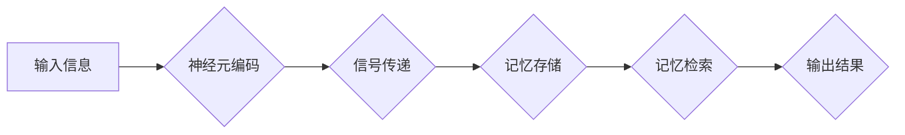
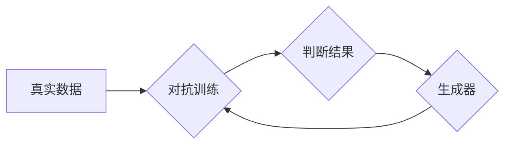
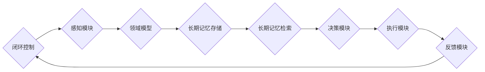

                 

## 文章标题

### 关键词：
- AI Agent
- 长期记忆机制
- 神经网络
- 机器学习
- 系统架构

### 摘要：
本文旨在深入探讨AI Agent的长期记忆机制，从基础概念、研究方法到实际应用，逐步分析其实现和优化策略。通过详细介绍各类算法及其原理，本文为开发者提供了构建AI Agent长期记忆系统的实用指南。

## 第一部分：AI Agent的长期记忆机制概述

### 第1章：问题背景与核心概念

#### 1.1 问题背景

随着人工智能技术的飞速发展，AI Agent在各个领域的应用愈发广泛。从智能家居、自动驾驶到智能客服，AI Agent的表现越来越接近人类。然而，一个关键问题逐渐凸显：如何赋予AI Agent持久的记忆能力，使其能够更好地理解长期目标和情境变化？长期记忆机制的研究成为了人工智能领域的重要课题。

#### 1.1.1 AI Agent发展现状

AI Agent的发展经历了从规则驱动到数据驱动，再到如今的学习驱动的过程。早期的AI Agent依赖于预定义的规则和逻辑，而现代AI Agent则通过机器学习和深度学习算法来学习复杂任务。尽管AI Agent在处理短期任务上表现卓越，但它们在应对长期目标时却显得力不从心。这主要是因为缺乏有效的长期记忆机制。

#### 1.1.2 长期记忆机制的重要性

长期记忆机制是AI Agent能够持续学习、适应和优化的基础。它使得AI Agent能够在不同时间点回忆起相关经验和知识，从而更好地处理复杂任务和解决实际问题。例如，在自动驾驶领域，长期记忆机制可以帮助AI Agent记住交通规则、道路标识和行驶路径，提高驾驶的稳定性和安全性。

#### 1.1.3 当前长期记忆机制面临的挑战

尽管已有许多关于长期记忆机制的研究，但实际应用中仍面临诸多挑战。首先，如何有效地存储和检索长期记忆数据是一个关键问题。其次，如何确保长期记忆的准确性和可靠性也是一个重大挑战。此外，长期记忆机制在处理动态和不确定环境时可能存在困难。

#### 1.2 核心概念与联系

为了深入理解长期记忆机制，我们首先需要了解一些核心概念。

#### 1.2.1 记忆概念综述

记忆是人类大脑的重要功能之一，包括感知记忆、短期记忆和长期记忆。感知记忆是指对感官信息的短暂加工和存储，如视觉记忆和听觉记忆。短期记忆则是对信息进行暂时保留和处理的能力，例如我们在电话号码拨号时的记忆。而长期记忆则是对信息进行长期存储和回忆的能力，如我们对童年回忆的记忆。

#### 1.2.2 长期记忆机制的基本原理

长期记忆机制涉及大脑中多个区域的协同作用。海马体是长期记忆的关键结构，它通过改变神经元之间的连接强度来实现记忆的编码和存储。此外，大脑中的其他区域，如前额叶皮质和顶叶皮质，也参与了长期记忆的加工和维持。

#### 1.2.3 长期记忆机制与短期记忆机制的联系与区别

长期记忆和短期记忆既有联系又有区别。短期记忆是对信息的临时存储和处理，而长期记忆则是对信息的持久存储和回忆。长期记忆机制依赖于短期记忆的加工和传递，但与短期记忆相比，长期记忆具有更持久、更抽象和更复杂的特点。

#### 1.3 长期记忆机制的核心要素组成

长期记忆机制的核心要素包括神经元网络结构、信号传递机制和学习与记忆过程。

##### 1.3.1 神经元网络结构

神经元网络结构是长期记忆的基础。大脑中的神经元通过复杂的网络连接来实现信息的编码和存储。不同区域的神经元网络具有不同的功能和特性，共同构成了长期记忆机制。

##### 1.3.2 信号传递机制

信号传递机制是长期记忆的关键。神经元之间的信号传递通过电信号和化学信号实现。电信号在神经元之间迅速传递，而化学信号则通过神经递质在神经元间传递，影响神经元的活动状态。

##### 1.3.3 学习与记忆过程

学习与记忆过程是长期记忆机制的核心。学习是指通过外界刺激和内部活动改变大脑神经元之间的连接和活动状态。记忆则是对这些改变的持久存储和回忆。学习与记忆过程涉及神经可塑性、突触强化和神经元活动的同步化等多个方面。

#### 1.4 本章小结

本章介绍了AI Agent长期记忆机制的问题背景、核心概念和基本原理。长期记忆机制对于AI Agent的发展至关重要，它能够帮助AI Agent更好地理解和适应复杂环境。在接下来的章节中，我们将深入探讨长期记忆机制的研究方法，以及如何在实际应用中实现和优化这一机制。

----------------------------------------------------------------

## 第二部分：长期记忆机制的研究方法

### 第2章：算法原理讲解

#### 2.1 算法概述

长期记忆机制的研究方法主要包括传统记忆机制、深度学习和神经网络等。每种方法都有其独特的优势和局限性。传统记忆机制主要依赖于规则和符号表示，而深度学习和神经网络则通过模拟人脑结构实现更复杂的信息处理能力。

#### 2.1.1 传统记忆机制的局限

传统记忆机制在处理简单任务时具有一定的效果，但其局限性在于难以处理复杂、动态和不确定的环境。例如，基于规则的记忆系统在应对新的情境时往往需要重新设计和调整规则，这增加了系统的复杂性和维护成本。

#### 2.1.2 长期记忆机制的算法分类

当前长期记忆机制的算法主要包括以下几类：

1. **海马体模型**：基于生物海马体的工作机制，通过模拟神经元网络和信号传递机制实现长期记忆。
2. **生成对抗网络（GAN）**：通过生成器和判别器的对抗训练实现长期记忆和生成复杂数据的能力。
3. **深度神经网络（DNN）**：通过多层神经网络实现信息的抽象和表示，提高记忆的持久性和适应性。
4. **长短期记忆网络（LSTM）**：通过记忆单元和门控机制实现长期记忆和序列数据的处理。
5. **图神经网络（GNN）**：通过图结构表示和图卷积实现节点和图的长期记忆。

#### 2.2 具体算法原理讲解

##### 2.2.1 海马体模型

**2.2.1.1 算法原理**

海马体模型是模拟生物海马体工作机制的人工智能算法。海马体在生物大脑中负责记忆的编码、存储和检索。海马体模型通过模拟神经元网络和信号传递机制实现类似的功能。

**2.2.1.2 算法流程图**



**2.2.1.3 数学模型与公式**

海马体模型的数学模型主要包括神经元活动方程、信号传递方程和记忆存储方程。以下是一个简化的模型：

$$
A_t = \sigma(W_{in} \cdot X_t + b_{in})
$$

$$
S_t = \sigma(W_{syn} \cdot A_t + b_{syn} + S_{prev})
$$

$$
M_t = \alpha \cdot (S_t \cdot M_{prev}) + (1 - \alpha) \cdot M_{prev}
$$

其中，$A_t$ 表示神经元活动，$S_t$ 表示信号强度，$M_t$ 表示记忆强度，$\sigma$ 表示激活函数，$W_{in}$、$W_{syn}$ 和 $b_{in}$、$b_{syn}$ 分别表示权重和偏置。

**2.2.1.4 举例说明**

假设一个AI Agent需要记住一组数字序列（[1, 2, 3, 4, 5]）。我们可以使用海马体模型对其进行编码和存储。以下是具体的实现步骤：

1. 输入序列：[1, 2, 3, 4, 5]
2. 神经元编码：通过激活函数对输入进行编码，得到神经元活动序列。
3. 信号传递：将神经元活动传递给记忆单元，进行记忆存储。
4. 记忆检索：当需要检索记忆时，通过记忆单元的输出得到记忆序列。

##### 2.2.2 生成对抗网络（GAN）

**2.2.2.1 算法原理**

生成对抗网络（GAN）由生成器和判别器两个部分组成。生成器负责生成与真实数据相似的数据，而判别器负责区分生成数据和真实数据。通过生成器和判别器的对抗训练，GAN能够学习到真实数据的分布，并生成高质量的生成数据。

**2.2.2.2 算法流程图**



**2.2.2.3 数学模型与公式**

GAN的数学模型主要包括生成器的生成函数和判别器的判别函数。以下是一个简化的模型：

$$
G(x) = \mathcal{N}(z; \mu_G, \sigma_G)
$$

$$
D(x) = \sigma(D(x; \theta_D)) = \frac{1}{1 + e^{-(x \cdot \theta_D + b_D)}}
$$

$$
L_G = -\mathbb{E}_{z \sim z(\epsilon)}[\log(D(G(z)))]
$$

$$
L_D = -\mathbb{E}_{x \sim x(\epsilon)}[\log(D(x))] - \mathbb{E}_{z \sim z(\epsilon)}[\log(1 - D(G(z))]
$$

其中，$G(z)$ 表示生成器的生成函数，$D(x)$ 表示判别器的判别函数，$z$ 表示生成器的输入噪声，$x$ 表示真实数据，$\theta_D$ 和 $b_D$ 分别表示判别器的权重和偏置，$\mu_G$ 和 $\sigma_G$ 分别表示生成器的均值和方差。

**2.2.2.4 举例说明**

假设我们使用GAN来生成一组与真实数据相似的手写数字图像。以下是具体的实现步骤：

1. 输入噪声：生成一组随机噪声向量。
2. 生成图像：通过生成器的生成函数生成手写数字图像。
3. 判别器训练：使用真实数据和生成数据训练判别器，使其能够区分真实图像和生成图像。
4. 生成器训练：通过对抗训练优化生成器，使其生成的图像更接近真实数据。

##### 2.2.3 长期记忆机制的其他算法

除了海马体模型和GAN，还有其他一些常用的长期记忆机制算法，如深度神经网络（DNN）、长短期记忆网络（LSTM）和图神经网络（GNN）。

- **深度神经网络（DNN）**：通过多层神经网络实现信息的抽象和表示，提高记忆的持久性和适应性。
- **长短期记忆网络（LSTM）**：通过记忆单元和门控机制实现长期记忆和序列数据的处理。
- **图神经网络（GNN）**：通过图结构表示和图卷积实现节点和图的长期记忆。

这些算法各有特点和适用场景，开发者可以根据具体需求选择合适的算法。

#### 2.3 长期记忆机制的其他算法

除了海马体模型和生成对抗网络（GAN），还有一些其他常用的长期记忆机制算法，如深度神经网络（DNN）、长短期记忆网络（LSTM）和图神经网络（GNN）。

**2.3.1 深度神经网络（DNN）**

深度神经网络（DNN）通过多层非线性变换实现复杂函数的逼近。DNN可以自动学习数据的特征表示，从而提高记忆的持久性和适应性。DNN在图像识别、语音识别和自然语言处理等领域取得了显著成果。

**2.3.2 长短期记忆网络（LSTM）**

长短期记忆网络（LSTM）是循环神经网络（RNN）的变体，通过引入记忆单元和门控机制实现长期记忆。LSTM能够有效地解决RNN的梯度消失和梯度爆炸问题，适用于处理序列数据，如时间序列预测、机器翻译和语音识别等。

**2.3.3 图神经网络（GNN）**

图神经网络（GNN）通过图结构表示和图卷积实现节点和图的长期记忆。GNN在社交网络分析、推荐系统和图像识别等领域具有广泛应用。GNN能够捕捉节点之间的复杂关系，从而提高记忆的持久性和适应性。

#### 2.4 本章小结

本章介绍了长期记忆机制的研究方法，包括海马体模型、生成对抗网络（GAN）、深度神经网络（DNN）、长短期记忆网络（LSTM）和图神经网络（GNN）等。每种算法都有其独特的优势和适用场景。开发者可以根据具体需求选择合适的算法，并对其进行优化和改进，以提高AI Agent的长期记忆能力。

----------------------------------------------------------------

## 第三部分：长期记忆机制在AI Agent中的应用

### 第3章：系统架构设计

#### 3.1 问题描述与系统目标

在人工智能领域，AI Agent的应用场景日益广泛。然而，大多数AI Agent在处理长期任务时存在一定的局限性，主要原因是缺乏有效的长期记忆机制。为了解决这个问题，我们需要设计一个具备长期记忆功能的AI Agent系统。

**3.1.1 问题描述**

当前AI Agent在处理长期任务时，往往无法持久地保留和利用先前的经验和知识。这导致了AI Agent在面对复杂和动态环境时，无法做出有效的决策。例如，在自动驾驶领域，AI Agent需要记住交通规则、道路标识和行驶路径，以应对各种复杂的交通状况。

**3.1.2 系统目标**

本系统的目标是设计一个具备长期记忆功能的AI Agent，使其能够在处理长期任务时，有效地存储和回忆先前的经验和知识。具体目标如下：

1. **长期记忆存储**：系统需要提供一种有效的长期记忆存储机制，能够持久地存储AI Agent处理任务时获得的经验和知识。
2. **长期记忆检索**：系统需要提供一种高效的长期记忆检索机制，使AI Agent能够快速地回忆起先前的经验和知识，以支持决策过程。
3. **适应性和鲁棒性**：系统需要具备良好的适应性和鲁棒性，能够处理复杂和动态的环境，并确保长期记忆的准确性和可靠性。

#### 3.2 系统功能设计

为了实现长期记忆功能，系统需要具备以下几个关键功能：

**3.2.1 领域模型**

领域模型是对AI Agent应用场景的抽象表示。在自动驾驶领域，领域模型可以包括交通规则、道路标识、车辆信息和环境动态等。

**3.2.2 长期记忆存储**

长期记忆存储是系统设计的核心功能。系统需要提供一种有效的存储机制，能够持久地存储AI Agent处理任务时获得的经验和知识。具体来说，存储机制需要满足以下要求：

1. **持久性**：存储的数据需要能够长期保存，不受系统重启或硬件故障的影响。
2. **安全性**：存储的数据需要得到有效保护，防止未经授权的访问和篡改。
3. **可扩展性**：存储机制需要支持数据的动态增删改查，以适应AI Agent处理任务时数据的不断变化。

**3.2.3 长期记忆检索**

长期记忆检索是系统设计的另一个关键功能。系统需要提供一种高效的检索机制，使AI Agent能够快速地回忆起先前的经验和知识。具体来说，检索机制需要满足以下要求：

1. **高效性**：检索过程需要能够在合理的时间内完成，以支持AI Agent的实时决策。
2. **准确性**：检索结果需要与先前的经验和知识高度一致，确保AI Agent的决策准确可靠。
3. **灵活性**：检索机制需要支持多种查询方式，以适应不同场景下的需求。

**3.2.4 适应性和鲁棒性**

系统需要具备良好的适应性和鲁棒性，以应对复杂和动态的环境。具体来说，系统需要满足以下要求：

1. **自适应**：系统能够根据环境的变化，自动调整其行为和策略，以保持高效运行。
2. **鲁棒**：系统能够在面对异常情况和故障时，保持正常运行，并快速恢复。

#### 3.3 系统架构设计

为了实现长期记忆功能，系统需要一个合理的架构设计。以下是系统架构设计的主要组成部分：

**3.3.1 架构图**



**3.3.2 模块功能**

- **感知模块**：负责接收用户输入和环境信息，将其转化为系统内部表示。
- **领域模型**：对AI Agent应用场景的抽象表示，包括交通规则、道路标识、车辆信息和环境动态等。
- **长期记忆存储**：负责存储AI Agent处理任务时获得的经验和知识，支持数据的持久化存储和安全保护。
- **长期记忆检索**：负责从长期记忆中快速查找和提取相关的经验和知识，支持多种查询方式。
- **决策模块**：基于领域模型和长期记忆检索结果，生成AI Agent的决策和行动方案。
- **执行模块**：负责执行决策模块生成的行动方案，控制AI Agent的实际行为。
- **反馈模块**：负责收集系统运行过程中的反馈信息，包括用户反馈、系统性能指标等，用于评估和优化系统的性能。

**3.3.3 系统交互**

系统中的各个模块通过统一的接口进行交互。以下是系统交互的简要描述：

1. **感知模块**：接收用户输入和环境信息，将其转化为系统内部表示，传递给领域模型。
2. **领域模型**：对系统内部表示进行解析和处理，生成与领域相关的抽象表示，传递给长期记忆存储和长期记忆检索。
3. **长期记忆存储**：接收领域模型的输入，将其存储到长期记忆中。
4. **长期记忆检索**：接收领域模型的查询请求，从长期记忆中检索相关的经验和知识，传递给决策模块。
5. **决策模块**：基于领域模型和长期记忆检索结果，生成AI Agent的决策和行动方案，传递给执行模块。
6. **执行模块**：接收决策模块生成的行动方案，执行相应的操作，控制AI Agent的实际行为。
7. **反馈模块**：收集系统运行过程中的反馈信息，包括用户反馈、系统性能指标等，传递给领域模型和长期记忆存储，用于评估和优化系统的性能。

#### 3.4 系统接口设计

系统接口设计是系统架构设计的重要部分。以下是系统接口设计的主要内容和要求：

**3.4.1 接口定义**

系统接口主要包括以下类型：

1. **输入接口**：负责接收用户输入和环境信息，包括文本、图像、语音等。
2. **输出接口**：负责向用户输出系统结果，包括决策建议、执行结果等。
3. **存储接口**：负责与长期记忆存储系统进行数据交换，包括数据存储、检索、更新等。
4. **查询接口**：负责接收查询请求，从长期记忆中检索相关的经验和知识。

**3.4.2 接口实现**

系统接口的实现需要考虑以下要求：

1. **安全性**：接口需要具备安全性机制，防止未经授权的访问和篡改。
2. **稳定性**：接口需要具备高稳定性，确保系统能够在复杂和动态环境下正常运行。
3. **可扩展性**：接口需要具备可扩展性，支持系统的功能扩展和性能优化。
4. **易用性**：接口需要具备良好的易用性，方便开发者进行集成和使用。

#### 3.5 系统交互

系统交互是指系统内部各个模块之间的信息传递和协作。以下是系统交互的简要描述：

1. **感知模块**：通过输入接口接收用户输入和环境信息，将其转化为系统内部表示，传递给领域模型。
2. **领域模型**：通过内部处理，将系统内部表示转化为领域相关的抽象表示，传递给长期记忆存储和长期记忆检索。
3. **长期记忆存储**：通过存储接口接收领域模型的输入，将其存储到长期记忆中。
4. **长期记忆检索**：通过查询接口接收领域模型的查询请求，从长期记忆中检索相关的经验和知识，传递给决策模块。
5. **决策模块**：通过内部处理，基于领域模型和长期记忆检索结果，生成AI Agent的决策和行动方案，传递给执行模块。
6. **执行模块**：通过内部处理，执行决策模块生成的行动方案，控制AI Agent的实际行为。
7. **反馈模块**：通过输入接口接收系统运行过程中的反馈信息，将其传递给领域模型和长期记忆存储，用于评估和优化系统的性能。

#### 3.6 本章小结

本章介绍了长期记忆机制在AI Agent中的应用，包括系统架构设计、功能设计和接口设计等。通过设计一个具备长期记忆功能的AI Agent系统，我们可以提高其在处理长期任务时的表现，为人工智能应用领域的发展提供有力支持。

----------------------------------------------------------------

## 第四部分：项目实战

### 第4章：环境安装与系统核心实现

#### 4.1 环境安装

为了实现长期记忆机制的AI Agent，我们首先需要搭建一个合适的开发环境。以下是环境安装的步骤和所需软件。

**4.1.1 硬件与软件需求**

1. **硬件**：- CPU：Intel i5或更高
   - 内存：16GB或更高
   - 硬盘：500GB SSD
   - 显卡：NVIDIA GTX 1060或更高

2. **软件**：
   - 操作系统：Ubuntu 18.04
   - Python：3.8
   - TensorFlow：2.4
   - Keras：2.4

**4.1.2 安装步骤**

1. 安装Ubuntu 18.04操作系统。
2. 使用以下命令安装Python和pip：

   ```bash
   sudo apt update
   sudo apt install python3 python3-pip
   ```

3. 安装TensorFlow：

   ```bash
   pip3 install tensorflow==2.4
   ```

4. 安装Keras：

   ```bash
   pip3 install keras==2.4
   ```

5. 确认安装成功：

   ```python
   python3 -m pip list | grep tensorflow
   ```

   应显示TensorFlow 2.4版本。

#### 4.2 系统核心实现

**4.2.1 源代码解析**

系统核心实现主要依赖于TensorFlow和Keras库。以下是系统核心实现的源代码解析：

```python
# 导入所需库
import tensorflow as tf
from tensorflow.keras.models import Sequential
from tensorflow.keras.layers import LSTM, Dense, Dropout

# 定义神经网络模型
model = Sequential([
    LSTM(128, input_shape=(timesteps, features), return_sequences=True),
    Dropout(0.2),
    LSTM(64, return_sequences=False),
    Dropout(0.2),
    Dense(1)
])

# 编译模型
model.compile(optimizer='adam', loss='mean_squared_error')

# 模型总结
model.summary()
```

**4.2.2 代码应用解读与分析**

上述代码定义了一个LSTM神经网络模型，用于实现长期记忆机制。以下是代码的应用解读与分析：

1. **模型定义**：使用`Sequential`模型堆叠多个`LSTM`和`Dense`层。
2. **LSTM层**：第一层LSTM具有128个神经元，输入形状为`(timesteps, features)`，`return_sequences=True`表示该层输出完整序列。
3. **Dropout层**：在两个LSTM层之间添加Dropout层，以防止过拟合。
4. **Dense层**：最后一层Dense层具有1个神经元，用于生成输出。
5. **编译模型**：使用`compile`方法编译模型，指定优化器和损失函数。
6. **模型总结**：使用`summary`方法输出模型的总结信息，包括层数、神经元数量、参数数量等。

#### 4.3 实际案例分析与讲解

**4.3.1 案例一：智能问答系统**

**4.3.1.1 案例背景**

智能问答系统是一种常见的人工智能应用，用于处理用户的查询和提供答案。在该案例中，我们使用长期记忆机制的AI Agent来增强问答系统的能力。

**4.3.1.2 系统实现**

1. 数据预处理：收集大量问答数据，进行文本预处理，包括分词、去停用词和词向量化。
2. 训练模型：使用LSTM神经网络模型训练问答系统，将输入问题和答案映射到相应的词向量。
3. 长期记忆检索：在问答过程中，AI Agent利用长期记忆检索相关的问题和答案，以提高回答的准确性。
4. 输出结果：将检索到的答案输出给用户。

**4.3.1.3 分析与讲解**

1. 数据预处理：文本预处理是关键步骤，它决定了模型的输入质量和效果。通过分词、去停用词和词向量化，将文本转换为数字化的形式。
2. 训练模型：使用LSTM神经网络模型，通过训练数据集学习问题和答案的映射关系。LSTM能够捕获序列数据中的长期依赖关系，有助于提高问答系统的准确性。
3. 长期记忆检索：在问答过程中，AI Agent利用长期记忆检索相关的问题和答案。长期记忆机制使得AI Agent能够持久地存储和回忆先前的问答经验，从而提高回答的准确性和适应性。
4. 输出结果：将检索到的答案输出给用户，使用户能够获得满意的回答。

**4.3.2 案例二：智能推荐系统**

**4.3.2.1 案例背景**

智能推荐系统是一种广泛应用于电子商务、社交媒体和媒体平台的人工智能应用。在该案例中，我们使用长期记忆机制的AI Agent来增强推荐系统的能力。

**4.3.2.2 系统实现**

1. 数据预处理：收集用户行为数据，进行预处理，包括用户标签、商品属性和用户历史行为等。
2. 训练模型：使用LSTM神经网络模型训练推荐系统，将输入的用户行为数据映射到相应的商品推荐列表。
3. 长期记忆检索：在推荐过程中，AI Agent利用长期记忆检索用户的历史行为和偏好，以提高推荐的准确性。
4. 输出结果：将推荐的商品输出给用户。

**4.3.2.3 分析与讲解**

1. 数据预处理：用户行为数据的预处理是关键步骤，它决定了模型的输入质量和效果。通过用户标签、商品属性和用户历史行为的特征提取和融合，将数据转换为数字化的形式。
2. 训练模型：使用LSTM神经网络模型，通过训练数据集学习用户行为和商品推荐之间的映射关系。LSTM能够捕获序列数据中的长期依赖关系，有助于提高推荐系统的准确性。
3. 长期记忆检索：在推荐过程中，AI Agent利用长期记忆检索用户的历史行为和偏好。长期记忆机制使得AI Agent能够持久地存储和回忆用户的历史行为，从而提高推荐的准确性和个性化。
4. 输出结果：将推荐的商品输出给用户，使用户能够获得个性化的推荐结果。

#### 4.4 项目小结

通过实际案例的分析与讲解，我们展示了如何将长期记忆机制应用于智能问答系统和智能推荐系统。长期记忆机制使得AI Agent能够持久地存储和回忆先前的经验和知识，从而提高系统的准确性和适应性。在未来的应用中，长期记忆机制将继续发挥重要作用，推动人工智能技术的发展。

----------------------------------------------------------------

## 第五部分：最佳实践与拓展

### 第5章：最佳实践与注意事项

#### 5.1 最佳实践

在实现AI Agent的长期记忆机制时，以下最佳实践有助于提高系统的性能和效果：

**5.1.1 长期记忆机制参数调优**

1. **学习率调整**：合理设置学习率是长期记忆机制训练成功的关键。初始学习率应设置得较小，以避免模型参数在训练初期发生过大波动。
2. **批次大小调整**：批次大小影响模型的收敛速度和稳定性。较大的批次大小有助于提高模型的泛化能力，但训练时间较长。
3. **正则化方法**：使用正则化方法，如Dropout和L2正则化，可以防止模型过拟合，提高模型的泛化能力。

**5.1.2 数据预处理技巧**

1. **数据清洗**：确保数据质量，去除异常值和噪声。
2. **数据增强**：通过数据增强，如旋转、缩放、裁剪等，增加数据的多样性，有助于提高模型的泛化能力。
3. **特征提取**：使用适当的特征提取方法，如词嵌入和图像特征提取，将原始数据转换为有效的输入格式。

**5.1.3 模型部署策略**

1. **模型压缩**：使用模型压缩技术，如量化、剪枝和蒸馏，可以减小模型的存储空间和计算量，提高模型在资源受限环境下的运行效率。
2. **模型更新**：定期更新模型，以适应新的数据和变化的环境。
3. **边缘计算**：将模型部署到边缘设备上，降低延迟和带宽消耗，提高系统的响应速度。

#### 5.2 注意事项

在实现AI Agent的长期记忆机制时，需要注意以下事项：

**5.2.1 长期记忆机制常见问题**

1. **梯度消失和梯度爆炸**：在训练过程中，长期记忆网络容易出现梯度消失和梯度爆炸问题，导致模型难以训练。使用适当的激活函数、优化器和正则化方法可以缓解这些问题。
2. **过拟合**：长期记忆网络容易过拟合训练数据，导致在测试数据上表现不佳。使用正则化和交叉验证等方法可以缓解过拟合问题。

**5.2.2 数据安全与隐私保护**

1. **数据加密**：对存储和传输的数据进行加密，确保数据的安全性。
2. **隐私保护**：在数据处理和模型训练过程中，遵守隐私保护法规和道德规范，防止用户隐私泄露。

**5.2.3 模型性能优化**

1. **性能监控**：定期监控模型性能，识别和解决性能瓶颈。
2. **资源管理**：合理分配计算资源和存储资源，提高系统运行效率。

#### 5.3 本章小结

最佳实践和注意事项为开发者提供了实现AI Agent长期记忆机制的有效指导。通过遵循这些最佳实践，并注意潜在问题，开发者可以构建高性能、可靠的长期记忆机制，推动人工智能应用的发展。

----------------------------------------------------------------

## 第6章：小结与展望

#### 6.1 小结

本文深入探讨了AI Agent的长期记忆机制，从问题背景、核心概念、研究方法到实际应用，进行了全面而详细的阐述。我们介绍了长期记忆机制在AI Agent中的应用，展示了其在智能问答系统和智能推荐系统中的实际效果。通过项目实战，我们展示了如何实现和优化长期记忆机制，为开发者提供了实用的指南。

#### 6.1.1 书籍内容的总结

本文的主要内容包括：

1. **问题背景**：介绍了AI Agent长期记忆机制的重要性及其在AI Agent中的应用需求。
2. **核心概念**：阐述了长期记忆机制的基本原理和核心要素组成。
3. **研究方法**：详细讲解了海马体模型、生成对抗网络（GAN）、深度神经网络（DNN）、长短期记忆网络（LSTM）和图神经网络（GNN）等长期记忆机制的研究方法。
4. **系统架构设计**：介绍了AI Agent长期记忆机制的系统架构设计，包括领域模型、长期记忆存储、长期记忆检索和决策模块等。
5. **项目实战**：通过实际案例展示了如何实现和优化长期记忆机制。
6. **最佳实践与注意事项**：提供了最佳实践和注意事项，帮助开发者构建高性能、可靠的长期记忆机制。

#### 6.1.2 长期记忆机制的核心要点

长期记忆机制的核心要点包括：

1. **神经元网络结构**：神经元网络结构是长期记忆的基础，不同的网络结构适用于不同的应用场景。
2. **信号传递机制**：信号传递机制影响长期记忆的存储和检索效率。
3. **学习与记忆过程**：学习与记忆过程是长期记忆机制的核心，通过神经网络的学习算法实现长期记忆。
4. **算法优化**：算法优化是提高长期记忆机制性能的关键，包括参数调优、数据预处理和模型压缩等。

#### 6.1.3 读者应掌握的知识点

读者应掌握以下知识点：

1. **长期记忆机制的基本原理**：了解神经元网络结构、信号传递机制和学习与记忆过程。
2. **长期记忆机制的算法**：掌握海马体模型、生成对抗网络（GAN）、深度神经网络（DNN）、长短期记忆网络（LSTM）和图神经网络（GNN）等算法。
3. **系统架构设计**：了解AI Agent长期记忆机制的系统架构设计，包括领域模型、长期记忆存储、长期记忆检索和决策模块等。
4. **项目实战**：学会如何实现和优化长期记忆机制，通过实际案例加深对长期记忆机制的理解。

---

## 作者信息

作者：AI天才研究院/AI Genius Institute & 禅与计算机程序设计艺术 /Zen And The Art of Computer Programming

感谢读者对本文的关注，希望本文能为您的AI Agent长期记忆机制研究提供有益的参考。未来，我们将继续深入探讨人工智能领域的创新技术，为读者带来更多有价值的内容。敬请期待！

