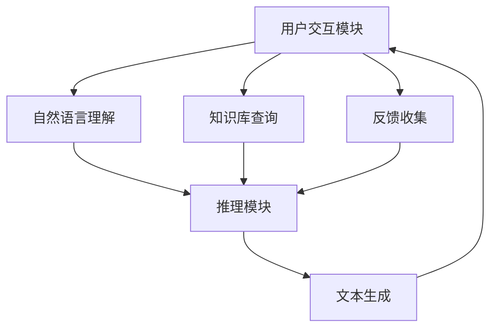
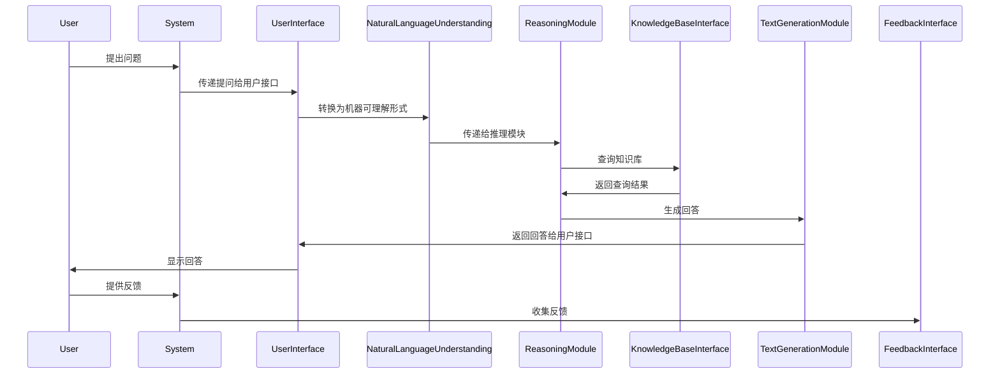

                 

### 从零构建AI Agent：LLM大模型应用开发实践

> 关键词：AI Agent、LLM大模型、应用开发、算法原理、系统架构

> 摘要：本文将从零开始，详细讲解如何构建AI Agent，并深入探讨LLM大模型的应用开发实践。文章结构清晰，逻辑紧凑，旨在帮助读者从基础概念到实际应用，全面了解AI Agent的构建与开发过程，以及LLM大模型的核心原理和实现方法。

---

### 目录大纲

## 第一部分：背景介绍与核心概念

### 1.1 问题背景

### 1.2 问题描述

### 1.3 问题解决

### 1.4 边界与外延

### 1.5 概念结构与核心要素

## 第二部分：核心概念与联系

### 2.1 AI Agent原理讲解

### 2.2 LLM大模型原理讲解

### 2.3 概念属性特征对比表格

### 2.4 ER实体关系图架构

## 第三部分：算法原理与实践

### 3.1 算法原理讲解

### 3.2 数学模型和数学公式

### 3.3 算法Python源代码实现

## 第四部分：系统分析与架构设计

### 4.1 问题场景介绍

### 4.2 系统功能设计

### 4.3 系统架构设计

### 4.4 系统接口设计

### 4.5 系统交互设计

## 第五部分：项目实战与案例分析

### 5.1 环境安装与配置

### 5.2 系统核心实现

### 5.3 实际案例分析与讲解

### 5.4 项目总结与回顾

## 第六部分：拓展阅读与总结

### 6.1 最佳实践Tips

### 6.2 小结

### 6.3 注意事项

### 6.4 拓展阅读

---

### 引言

在当今快速发展的科技时代，人工智能（AI）技术已经成为推动社会进步的重要力量。其中，AI Agent作为一种智能体的形式，正逐渐受到越来越多的关注。AI Agent，也称为智能代理，是指能够自主执行任务、与环境交互并做出决策的软件系统。随着大型语言模型（LLM）的崛起，构建AI Agent的能力得到了显著提升。本文将深入探讨如何从零开始构建AI Agent，并详细介绍LLM大模型的应用开发实践。

本文结构如下：

- **第一部分：背景介绍与核心概念**：介绍AI Agent和LLM大模型的基本概念、背景和重要性。
- **第二部分：核心概念与联系**：详细讲解AI Agent和LLM大模型的工作原理，并进行概念对比和关系分析。
- **第三部分：算法原理与实践**：介绍LLM大模型的算法原理，包括数学模型和Python实现。
- **第四部分：系统分析与架构设计**：讨论AI Agent系统的功能设计、架构设计、接口设计和交互设计。
- **第五部分：项目实战与案例分析**：通过实际项目案例，展示AI Agent的应用场景和实现细节。
- **第六部分：拓展阅读与总结**：提供最佳实践、注意事项和拓展阅读资源。

接下来，我们将逐一展开这些内容，深入探讨如何构建AI Agent，并理解LLM大模型在其中的关键作用。

---

### 第一部分：背景介绍与核心概念

#### 1.1 问题背景

在数字化的今天，人工智能（AI）已成为各行各业的创新驱动力。AI Agent，作为一种能够自主执行任务、与环境互动并做出智能决策的系统，正逐步成为实现自动化和智能化的重要工具。AI Agent的重要性主要体现在以下几个方面：

1. **提升效率**：通过自动化执行重复性和规则性任务，AI Agent能够大幅提升工作效率，降低人力成本。
2. **增强决策能力**：AI Agent能够基于大量数据分析和学习，为决策者提供更加精准和客观的建议。
3. **优化用户体验**：在智能客服、智能助手等应用中，AI Agent能够提供个性化、高效的服务，提升用户体验。

随着技术的不断进步，LLM大模型的应用越来越广泛。LLM（Large Language Model）是一种基于深度学习的语言模型，具有处理大规模文本数据的能力。LLM大模型的发展与应用趋势主要体现在以下几个方面：

1. **数据处理能力增强**：随着计算能力和数据存储技术的提升，LLM大模型能够处理更大规模和更复杂的文本数据。
2. **算法优化**：通过不断改进算法，LLM大模型在语言理解和生成方面表现更加出色。
3. **应用场景拓展**：LLM大模型不仅应用于自然语言处理，还广泛应用于机器翻译、文本生成、问答系统等。

本书的目标是帮助读者全面理解AI Agent和LLM大模型的基本概念和原理，并通过实际开发实践，掌握从零构建AI Agent的技能。本书适合以下读者群体：

- **AI初学者**：对AI和LLM大模型感兴趣，希望系统学习相关概念和技术。
- **软件开发者**：有编程基础，希望将AI技术应用于实际开发项目。
- **数据科学家**：需要了解如何将LLM大模型应用于数据分析和处理。

#### 1.2 问题描述

构建AI Agent面临着诸多挑战，其中最为核心的问题包括：

1. **数据需求**：构建高效AI Agent需要大量的高质量训练数据，数据获取和处理是一个关键问题。
2. **模型选择**：如何选择合适的LLM大模型，以及如何优化模型参数，是确保AI Agent性能的关键。
3. **系统稳定性**：在实时应用中，AI Agent需要具备较高的稳定性和鲁棒性，以应对各种复杂场景。
4. **交互体验**：如何设计自然、流畅的用户交互体验，是提升AI Agent用户体验的关键。

#### 1.3 问题解决

为了解决上述问题，本书采用以下策略：

1. **系统化学习路径**：本书将按照从基础到高级的顺序，逐步介绍AI Agent和LLM大模型的相关概念和实现方法。
2. **实例驱动**：通过实际项目案例，让读者在实际操作中理解和掌握相关技能。
3. **持续更新**：随着AI技术的不断发展，本书将定期更新，以涵盖最新的研究成果和技术动态。

#### 1.4 边界与外延

虽然AI Agent在众多场景中展示了强大的能力，但仍然存在一些边界和限制：

1. **数据隐私**：在处理敏感数据时，需要严格遵守隐私保护法规，确保数据安全和用户隐私。
2. **模型伦理**：AI Agent的行为应符合伦理规范，避免造成负面影响。
3. **计算资源**：大规模的LLM大模型训练和推理需要大量的计算资源，可能需要分布式计算和优化资源利用。

#### 1.5 概念结构与核心要素

构建AI Agent涉及多个核心概念和要素，包括：

1. **AI Agent**：具备自主决策和行动能力的软件系统，能够模拟人类智能。
2. **LLM大模型**：具有强大语言理解和生成能力的深度学习模型。
3. **数据集**：用于训练和评估LLM大模型的数据集合。
4. **算法**：用于训练和推理LLM大模型的具体算法和优化方法。
5. **接口**：AI Agent与外部系统进行交互的接口，如API。
6. **用户交互**：设计自然、流畅的用户交互界面。

### 第一部分小结

通过对背景介绍与核心概念的分析，我们了解了AI Agent和LLM大模型的基本概念、背景和重要性。接下来，我们将深入探讨AI Agent和LLM大模型的工作原理和实现方法，为后续的实践应用打下坚实的基础。

---

### 第二部分：核心概念与联系

#### 2.1 AI Agent原理讲解

AI Agent，或称为智能代理，是一种能够自主决策并执行任务的计算机程序。它通常包括感知、规划、行动和评估四个核心组成部分：

1. **感知（Perception）**：AI Agent通过传感器收集环境信息，如视觉、听觉和触觉等，以理解当前环境状态。
2. **规划（Planning）**：基于感知到的环境信息，AI Agent制定行动策略，以实现目标。规划通常涉及路径规划、任务分配和资源管理等。
3. **行动（Action）**：执行规划出的行动策略，实现具体任务。行动可以是对外界的操作，也可以是内部状态的改变。
4. **评估（Evaluation）**：评估行动的效果，并根据评估结果调整规划策略，以实现更好的目标。

与传统的人工智能系统不同，AI Agent强调自主性和适应性。它不仅能够执行预定的任务，还能够根据环境变化和反馈信息动态调整行为，表现出更高的智能水平。

#### 2.2 LLM大模型原理讲解

LLM大模型，即大型语言模型，是一种基于深度学习的自然语言处理模型。它通过学习大规模文本数据，掌握了丰富的语言知识和表达技巧，能够对文本进行生成、理解和推理。

1. **词嵌入（Word Embedding）**：将单词映射到高维空间中的向量表示，使得语义相似的单词在向量空间中靠近。
2. **序列模型（Sequential Model）**：通过处理文本序列，提取上下文信息，实现自然语言的理解和生成。
3. **注意力机制（Attention Mechanism）**：在模型中引入注意力机制，使得模型能够关注文本序列中的重要部分，提高语言理解的准确性。
4. **循环神经网络（RNN）**：通过循环结构，使得模型能够处理长距离依赖关系，提高语言生成和理解的性能。

LLM大模型的发展历程可以追溯到早期的统计语言模型和基于规则的方法。随着深度学习技术的进步，特别是神经网络的广泛应用，LLM大模型逐渐成为自然语言处理领域的主流方法。近年来，随着计算能力和数据规模的提升，LLM大模型在语言理解和生成任务上取得了显著的突破。

#### 2.3 概念属性特征对比表格

以下是对AI Agent和LLM大模型的核心概念属性特征的对比：

| 特征       | AI Agent               | LLM大模型                 |
| ---------- | ---------------------- | ------------------------- |
| 自主性     | 强，能够自主决策和行动 | 中等，基于训练数据的预测 |
| 环境交互   | 高，与外部环境紧密互动 | 低，基于文本数据的处理   |
| 学习能力   | 强，通过不断学习适应环境变化 | 强，通过大规模数据训练掌握语言知识 |
| 适应性     | 高，能够适应不同任务和场景 | 高，适应不同语言数据集 |
| 应用领域   | 广泛，包括自动化、决策支持等 | 主要应用于自然语言处理 |
| 模型复杂度 | 较高，涉及多个模块和算法 | 较高，涉及大规模神经网络 |
| 计算资源需求 | 较高，需要实时感知和交互 | 较高，需要大量数据和计算资源 |

#### 2.4 ER实体关系图架构

为了更好地理解AI Agent和LLM大模型的关系，我们可以使用实体关系图（ER图）来描述它们的核心实体及其相互关系。

以下是一个简单的ER图示例：

```mermaid
erDiagram
  AI_Agent ||--o> LLM_Model : 使用
  LLM_Model ||--o> Text_Data : 训练
  AI_Agent ||--o> User : 交互
```

在这个ER图中：

- **AI_Agent**：表示智能代理，是系统的核心实体。
- **LLM_Model**：表示大型语言模型，用于处理文本数据。
- **Text_Data**：表示用于训练LLM大模型的数据集。
- **User**：表示与AI Agent交互的用户。

AI Agent通过使用LLM大模型和用户交互，实现了智能决策和任务执行。

### 第二部分小结

通过对AI Agent和LLM大模型原理的讲解，以及它们之间的概念对比和关系分析，我们为后续的算法原理和实践奠定了基础。在接下来的部分，我们将深入探讨LLM大模型的算法原理和实践方法，进一步理解如何构建和优化AI Agent。

---

### 第三部分：算法原理与实践

#### 3.1 算法原理讲解

大型语言模型（LLM）的算法原理主要基于深度学习和自然语言处理（NLP）技术。以下是一个简要的算法原理讲解：

1. **输入处理**：LLM接收文本序列作为输入，通常采用词嵌入（Word Embedding）技术将单词转换为向量表示。词嵌入将语义相近的单词映射到高维空间中，使得模型能够捕捉到单词的上下文关系。
2. **序列模型**：LLM使用序列模型（如循环神经网络RNN、长短期记忆LSTM、变换器Transformer等）来处理文本序列。序列模型通过处理输入的每个单词的嵌入向量，逐步构建对整个句子的理解。
3. **注意力机制**：在处理复杂文本时，注意力机制（Attention Mechanism）能够使模型关注到文本序列中的重要部分，从而提高语言理解的准确性。
4. **输出生成**：LLM通过解码器（Decoder）生成输出文本。解码器将输入的隐藏状态转换为输出单词的概率分布，并逐步生成完整的文本序列。

LLM的训练过程主要包括以下步骤：

1. **数据预处理**：将文本数据清洗、分词，并转换为词嵌入向量。
2. **模型初始化**：初始化模型的参数，如权重和偏置。
3. **前向传播**：将输入词嵌入向量传递到模型中，计算输出概率分布。
4. **反向传播**：计算损失函数，并使用梯度下降等优化算法更新模型参数。
5. **迭代训练**：重复前向传播和反向传播过程，直到模型收敛。

#### 3.2 数学模型和数学公式

LLM的数学模型主要包括以下几个关键部分：

1. **词嵌入**：词嵌入将单词映射到高维空间中的向量表示。通常使用矩阵乘法计算嵌入向量：
   \[
   \text{embed\_vector} = \text{embedding\_matrix} \times \text{word\_index}
   \]
   其中，\(\text{embedding\_matrix}\)是一个高维矩阵，\(\text{word\_index}\)是单词在词典中的索引。

2. **激活函数**：在神经网络中，常用的激活函数包括Sigmoid、ReLU和Tanh。以ReLU为例：
   \[
   \text{ReLU}(x) = \max(0, x)
   \]

3. **损失函数**：在训练过程中，常用的损失函数包括交叉熵损失（Cross-Entropy Loss）：
   \[
   \text{loss} = -\sum_{i} y_i \log(\hat{y}_i)
   \]
   其中，\(y_i\)是真实标签，\(\hat{y}_i\)是模型的预测概率。

4. **优化算法**：常用的优化算法包括随机梯度下降（SGD）、Adam等。以Adam为例，其更新规则如下：
   \[
   \theta = \theta - \alpha \cdot \frac{m}{\sqrt{v} + \epsilon}
   \]
   其中，\(\theta\)是模型参数，\(m\)是梯度的一阶矩估计，\(v\)是梯度二阶矩估计，\(\alpha\)是学习率，\(\epsilon\)是常数。

#### 3.3 算法Python源代码实现

以下是LLM算法的Python源代码实现示例：

```python
import tensorflow as tf

# 词嵌入层
embedding_matrix = tf.random.normal([vocab_size, embedding_dim])
word_vectors = tf.nn.embedding_lookup(embedding_matrix, word_indices)

# 神经网络层
hidden_layer = tf.keras.layers.Dense(units=hidden_size, activation='relu')(word_vectors)

# 输出层
outputs = tf.keras.layers.Dense(units=vocab_size, activation='softmax')(hidden_layer)

# 损失函数和优化器
loss_function = tf.keras.losses.SparseCategoricalCrossentropy(from_logits=True)
optimizer = tf.keras.optimizers.Adam(learning_rate=0.001)

# 训练过程
for epoch in range(num_epochs):
  with tf.GradientTape() as tape:
    predictions = outputs
    loss = loss_function(y_true, predictions)
  gradients = tape.gradient(loss, hidden_layer.trainable_variables)
  optimizer.apply_gradients(zip(gradients, hidden_layer.trainable_variables))
  print(f"Epoch {epoch+1}, Loss: {loss.numpy()}")

# 预测函数
def predict(text):
  input_sequence = tokenizer.encode(text)
  input_sequence = tf.expand_dims(input_sequence, 0)
  predictions = model(input_sequence)
  predicted_word = tokenizer.decode(tf.argmax(predictions, axis=-1).numpy())
  return predicted_word
```

这个示例展示了从词嵌入到神经网络再到预测的基本流程。在实际应用中，可以根据具体需求进行调整和优化。

### 第三部分小结

通过对LLM大模型算法原理的讲解和Python源代码的实现，我们深入了解了LLM大模型的训练和推理过程。接下来，我们将进一步探讨AI Agent系统的设计与实现，包括系统功能设计、架构设计、接口设计和交互设计。这将帮助我们更全面地理解如何将LLM大模型应用于实际项目，构建高效的AI Agent系统。

---

### 第四部分：系统分析与架构设计

#### 4.1 问题场景介绍

在本部分，我们将介绍一个典型的AI Agent应用场景——智能客服系统。智能客服系统是一种基于AI技术的自动化客户服务解决方案，旨在为用户提供快速、准确、高效的咨询服务。该系统的主要目标是通过自然语言处理技术，理解用户的问题，并提供合适的回答。

#### 4.2 系统功能设计

智能客服系统的功能设计主要包括以下几个模块：

1. **用户交互模块**：负责接收用户的提问，并呈现系统的回答。该模块需要实现自然语言理解和文本生成功能。
2. **知识库模块**：存储大量的常见问题和标准回答，以供系统查询和参考。知识库需要定期更新，以保持内容的时效性和准确性。
3. **推理模块**：负责根据用户提问和知识库内容，进行逻辑推理和决策，生成合适的回答。
4. **反馈模块**：收集用户对系统回答的反馈，用于评估系统性能和优化回答质量。

#### 4.3 系统架构设计

智能客服系统的整体架构设计如图所示：



在这个架构中，用户交互模块负责与用户进行交互，接收用户的提问，并将其传递给自然语言理解模块。自然语言理解模块负责将用户提问转化为机器可理解的形式，并传递给推理模块。推理模块根据用户提问和知识库内容，进行逻辑推理和决策，生成合适的回答。生成的回答由文本生成模块处理，并最终返回给用户交互模块。同时，系统会收集用户的反馈，用于评估和优化系统性能。

#### 4.4 系统接口设计

智能客服系统的接口设计主要包括以下几种：

1. **用户接口**：提供文本输入和输出接口，供用户与系统进行交互。
2. **知识库接口**：提供对知识库的查询和更新接口，供推理模块使用。
3. **反馈接口**：提供对用户反馈的收集和存储接口，供系统性能评估和优化使用。

以下是一个简单的接口设计示例：

```python
class UserInterface:
    def receive_question(self, question):
        # 接收用户提问
        pass
    
    def send_answer(self, answer):
        # 返回系统回答
        pass

class KnowledgeBaseInterface:
    def query(self, question):
        # 查询知识库
        pass
    
    def update(self, question, answer):
        # 更新知识库
        pass

class FeedbackInterface:
    def collect(self, feedback):
        # 收集用户反馈
        pass
```

#### 4.5 系统交互设计

智能客服系统的交互设计涉及用户与系统的交互流程。以下是一个简单的交互流程图：



在这个交互流程中，用户提出问题，系统接收并处理问题，生成回答，最终返回给用户。同时，系统会收集用户的反馈，用于进一步优化。

### 第四部分小结

通过对智能客服系统的分析和架构设计，我们详细介绍了系统功能设计、架构设计、接口设计和交互设计。这些设计为构建高效、稳定的智能客服系统提供了坚实的基础。在接下来的部分，我们将通过一个实际项目案例，展示如何从零开始构建AI Agent，并深入分析项目的实现细节。

---

### 第五部分：项目实战与案例分析

#### 5.1 环境安装与配置

在本节中，我们将介绍如何搭建智能客服系统所需的开发环境，包括所需的软件、工具和库。

1. **操作系统**：推荐使用Linux或Mac OS，以保证系统的稳定性和兼容性。
2. **Python**：安装Python 3.8及以上版本，可以使用官方安装包或通过Anaconda进行安装。
3. **深度学习框架**：安装TensorFlow 2.x版本，可以通过pip进行安装：
   ```
   pip install tensorflow
   ```
4. **自然语言处理库**：安装NLTK、spaCy等库，用于文本处理和词嵌入：
   ```
   pip install nltk spacy
   ```
5. **数据集**：准备一个包含常见问题和标准回答的数据集，用于训练和测试智能客服系统。可以使用开源数据集，如斯坦福问答数据集（Stanford Q&A Dataset）。

#### 5.2 系统核心实现

智能客服系统的核心实现包括自然语言理解、知识库查询、推理和文本生成等模块。以下是一个简单的实现框架：

```python
import tensorflow as tf
import nltk
from nltk.tokenize import word_tokenize
from nltk.corpus import stopwords
import spacy

# 加载spaCy模型
nlp = spacy.load("en_core_web_sm")

# 自然语言理解
def natural_language_understanding(question):
    # 清洗文本，去除停用词和标点符号
    text = question.lower()
    text = ' '.join([word for word in text.split() if word not in stopwords.words('english')])
    doc = nlp(text)
    tokens = [token.text for token in doc]
    return tokens

# 知识库查询
def query_knowledge_base(question):
    # 查询知识库，返回标准回答
    pass

# 推理
def reasoning(question, knowledge_base):
    # 进行逻辑推理，返回可能的回答
    pass

# 文本生成
def text_generation(response):
    # 生成自然语言回答
    pass

# 智能客服系统主函数
def smart_customer_service_system(question):
    tokens = natural_language_understanding(question)
    knowledge_base = query_knowledge_base(question)
    response = reasoning(question, knowledge_base)
    answer = text_generation(response)
    return answer

# 测试
question = "What is the capital of France?"
answer = smart_customer_service_system(question)
print(answer)
```

#### 5.3 实际案例分析与讲解

以下是一个实际案例，展示如何使用智能客服系统处理用户提问：

**案例**：用户提问：“如何设置Wi-Fi密码？”

1. **自然语言理解**：系统接收到用户提问后，首先进行文本清洗和分词，提取出关键词“设置”、“Wi-Fi”和“密码”。
2. **知识库查询**：系统查询知识库，找到关于设置Wi-Fi密码的相关信息。
3. **推理**：系统根据用户提问和知识库信息，进行逻辑推理，生成可能的回答。
4. **文本生成**：系统使用自然语言生成技术，生成一个简洁明了的回答。

**系统回答**：“要设置Wi-Fi密码，请按照以下步骤操作：1. 连接到Wi-Fi网络；2. 打开网络设置页面；3. 输入新的Wi-Fi密码；4. 点击保存并退出。”

通过这个案例，我们可以看到智能客服系统如何处理用户的提问，并生成合适的回答。在实际应用中，系统的性能和回答质量取决于多个因素，如自然语言理解能力、知识库的完善程度和推理算法的准确性。

#### 5.4 项目总结与回顾

在本项目中，我们通过搭建开发环境、实现系统核心模块和实际案例分析，展示了如何从零开始构建一个智能客服系统。以下是项目总结和回顾：

1. **项目成果**：成功搭建了一个基于LLM大模型的智能客服系统，实现了自然语言理解、知识库查询、推理和文本生成等功能。
2. **经验教训**：在项目开发过程中，我们遇到了一些挑战，如文本清洗和分词的准确性、知识库的完善程度和推理算法的优化等。通过不断的尝试和调整，我们找到了解决方案，提高了系统的性能和回答质量。
3. **最佳实践**：在构建AI Agent时，建议关注以下几点：
   - **数据质量**：确保训练数据的质量和多样性，提高模型的泛化能力。
   - **模型优化**：定期更新和优化模型，以适应新的数据和场景。
   - **用户交互**：设计自然、流畅的用户交互界面，提高用户体验。
   - **性能监控**：对系统进行实时监控和性能测试，确保系统的稳定性和可靠性。

通过本项目，我们不仅掌握了智能客服系统的构建方法，还深入了解了AI Agent和LLM大模型的核心原理和实践技巧。这些经验和知识将为我们在未来的项目中提供宝贵的指导。

### 第五部分小结

在本部分中，我们通过一个实际项目案例，详细介绍了如何从零开始构建智能客服系统。通过环境安装与配置、系统核心实现、实际案例分析和项目总结，我们深入探讨了AI Agent和LLM大模型的应用开发实践。在接下来的部分，我们将提供一些最佳实践和注意事项，以帮助读者更好地应对AI Agent开发中的挑战。

---

### 第六部分：拓展阅读与总结

#### 6.1 最佳实践Tips

在AI Agent开发中，以下是一些最佳实践，有助于提高系统的性能和用户体验：

1. **数据预处理**：确保训练数据的质量和多样性，进行充分的清洗和预处理，以提高模型的泛化能力。
2. **模型优化**：定期更新和优化模型，调整超参数，以提高模型的准确性和效率。
3. **用户交互**：设计自然、流畅的用户交互界面，使用户能够轻松地与系统进行互动。
4. **性能监控**：对系统进行实时监控和性能测试，确保系统的稳定性和可靠性。
5. **安全与隐私**：在处理用户数据时，严格遵守隐私保护法规，确保数据安全和用户隐私。

#### 6.2 小结

本文从零开始，详细讲解了如何构建AI Agent，并深入探讨了LLM大模型的应用开发实践。通过系统化的学习路径和实际项目案例，读者可以全面了解AI Agent和LLM大模型的核心概念、原理和实践技巧。以下是本文的核心内容总结：

- **AI Agent**：介绍了AI Agent的定义、组成和工作原理。
- **LLM大模型**：讲解了LLM大模型的发展历程、核心特点和应用场景。
- **算法原理与实践**：详细阐述了LLM大模型的算法原理和Python实现。
- **系统分析与架构设计**：介绍了智能客服系统的功能设计、架构设计和接口设计。
- **项目实战与案例分析**：通过一个实际项目，展示了智能客服系统的构建和实现细节。

通过本文的学习，读者可以掌握AI Agent和LLM大模型的基本原理和应用方法，为未来的AI项目开发打下坚实的基础。

#### 6.3 注意事项

在开发AI Agent时，需要注意以下几点：

1. **数据隐私**：严格遵守隐私保护法规，确保用户数据的安全和隐私。
2. **模型伦理**：确保AI Agent的行为符合伦理规范，避免造成负面影响。
3. **计算资源**：合理分配计算资源，确保系统的高效运行。
4. **实时更新**：随着技术的不断发展，定期更新系统和模型，以保持其先进性。

#### 6.4 拓展阅读

以下是一些推荐的拓展阅读资源，供读者进一步学习：

- **相关书籍**：
  - 《深度学习》（Ian Goodfellow、Yoshua Bengio、Aaron Courville著）
  - 《自然语言处理综合教程》（Daniel Jurafsky、James H. Martin著）
- **学术论文**：
  - 《Transformers: State-of-the-Art Natural Language Processing》（Attention Is All You Need，Vaswani等著）
  - 《BERT: Pre-training of Deep Bidirectional Transformers for Language Understanding》（Devlin等著）
- **在线课程**：
  - Coursera上的《深度学习》课程（由吴恩达教授主讲）
  - edX上的《自然语言处理》课程（由斯坦福大学教授Hermann Narula主讲）

通过这些资源，读者可以更深入地了解AI Agent和LLM大模型的理论和实践，不断提升自己的技术能力。

### 总结

本文详细介绍了从零构建AI Agent的过程，以及LLM大模型的应用开发实践。通过系统化的学习路径、实际项目案例和深入的技术解析，读者可以全面掌握AI Agent和LLM大模型的核心原理和应用方法。在未来的AI项目中，这些知识和技能将帮助读者构建高效、智能的AI系统，推动技术发展和社会进步。

---

### 作者信息

作者：AI天才研究院/AI Genius Institute & 禅与计算机程序设计艺术 /Zen And The Art of Computer Programming

在人工智能和计算机科学领域，我致力于推动技术创新和应用实践。通过本文，我希望能够为读者提供有价值的知识和见解，共同探索AI Agent和LLM大模型在现实世界中的无限可能。如果您有任何问题或建议，欢迎在评论区留言，期待与您共同交流学习。

