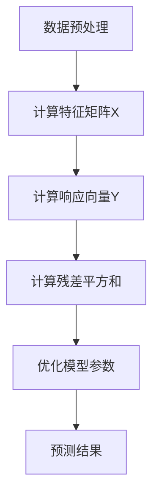
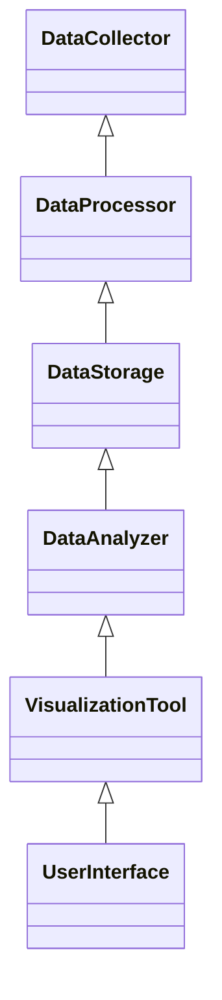
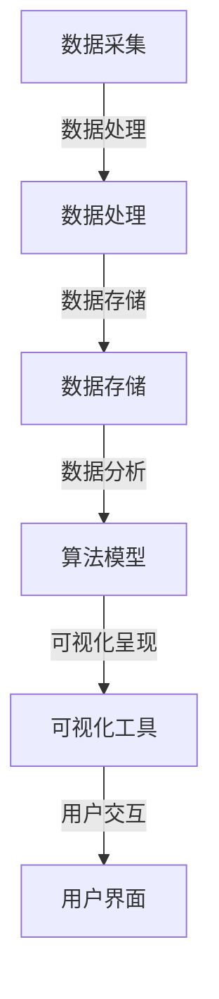
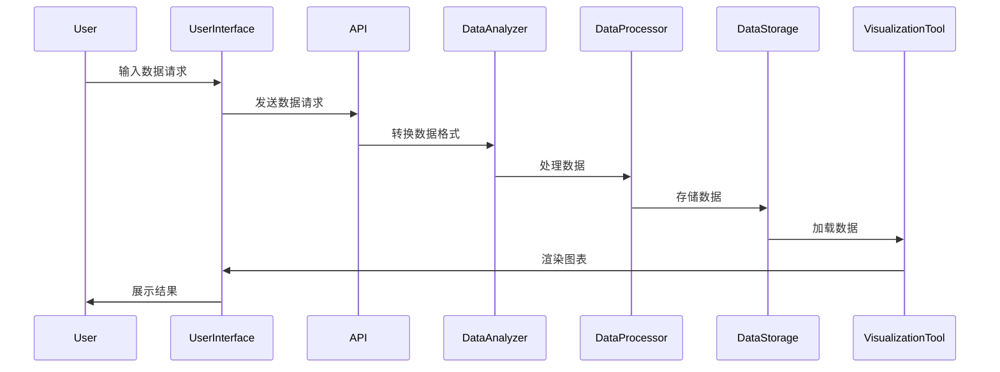

                 


## 引言

### 企业AI Agent的可视化分析工具

在当今数据驱动的商业环境中，企业正面临前所未有的挑战和机遇。随着大数据、云计算、物联网等技术的迅速发展，企业内部数据的复杂性不断增加。如何有效地管理和利用这些数据，以提高业务决策的准确性和效率，成为企业关注的焦点。在这个背景下，人工智能（AI）技术应运而生，特别是AI Agent，作为一种能够自动执行任务、处理复杂决策的智能体，正逐渐成为企业提升竞争力的关键工具。

企业AI Agent的可视化分析工具，则是为了解决企业在应用AI Agent过程中遇到的数据分析难题而设计的。可视化分析工具能够将复杂的数据转化为直观的图形和图表，帮助企业和用户更快速、更准确地理解数据，从而做出更明智的决策。本文将深入探讨企业AI Agent及其可视化分析工具的核心概念、算法原理、系统设计与实现，并通过实际案例展示其应用价值。

### 文章结构

本文将分为以下几个部分：

1. **问题背景与概念介绍**：详细阐述企业AI Agent和可视化分析工具的问题背景、核心概念及其应用领域。
2. **核心概念与联系**：介绍企业AI Agent和可视化分析工具的基本属性特征，通过对比表格和实体关系图展现它们之间的联系。
3. **算法原理讲解**：详细讲解AI Agent的算法原理，包括常用的回归分析、分类算法和聚类算法，使用mermaid绘制流程图和Python源代码进行说明。
4. **数学模型与公式解析**：解析常用的数学模型和公式，包括回归模型、分类模型和聚类模型，并使用latex格式展示关键公式。
5. **系统分析与架构设计方案**：介绍系统分析与架构设计方案，包括问题场景介绍、系统功能设计、系统架构设计、系统接口设计和系统交互序列图。
6. **项目实战**：通过环境安装、系统核心实现和实际案例分析，展示如何使用企业AI Agent的可视化分析工具进行项目实战。
7. **最佳实践与总结**：总结最佳实践、注意事项和拓展阅读，为读者提供进一步学习的方向。

### 关键词

- 企业AI Agent
- 可视化分析工具
- 数据驱动决策
- 算法原理
- 系统架构设计
- 数学模型
- 实际案例分析

### 摘要

本文旨在深入探讨企业AI Agent的可视化分析工具，通过详细的分析和讲解，帮助读者理解其核心概念、算法原理、系统设计与实现，以及如何在实际项目中应用。文章首先介绍了企业AI Agent和可视化分析工具的问题背景，然后通过对比表格和实体关系图展示了它们之间的联系。接下来，文章详细讲解了AI Agent的常用算法原理，包括回归分析、分类算法和聚类算法，并通过mermaid流程图和Python源代码进行说明。此外，文章还解析了相关的数学模型和公式，并介绍了系统分析与架构设计方案。最后，通过实际案例分析和项目实战，展示了企业AI Agent的可视化分析工具在实际应用中的价值。

---

## 步骤一：问题背景与概念介绍

### 1.1 问题背景

在当今的商业环境中，数据已经成为企业决策的重要依据。然而，随着数据规模的不断扩大和数据类型的日益多样化，如何有效地管理和分析这些数据成为企业面临的巨大挑战。传统的数据分析方法往往依赖于人工处理，不仅效率低下，而且容易出错。为了解决这一问题，企业开始寻求智能化的解决方案，其中AI Agent作为一种能够自主学习和执行任务的人工智能体，成为了企业提升数据分析能力和决策效率的重要工具。

企业AI Agent是指在企业环境中运行的人工智能实体，它能够根据预设的目标和规则，自动收集、处理和分析数据，为企业提供智能化的决策支持。AI Agent的优势在于其自动化和智能化的特性，它能够处理复杂的数据分析和决策过程，提高工作效率和决策质量。

然而，在应用AI Agent的过程中，企业也面临了一些问题。首先，AI Agent产生的数据量庞大，如何有效地管理和展示这些数据成为一个挑战。其次，AI Agent的决策过程通常包含多个复杂的算法和模型，如何将这些算法和模型的结果直观地呈现给用户，以便他们能够快速理解和利用这些数据，是另一个亟待解决的问题。

为了解决这些问题，企业需要引入可视化分析工具。可视化分析工具能够将AI Agent生成的复杂数据转化为直观的图形和图表，帮助企业和用户更快速、更准确地理解数据，从而做出更明智的决策。

### 1.2 问题解决

企业AI Agent的可视化分析工具旨在解决以下问题：

1. **数据可视化**：将AI Agent生成的海量数据转化为易于理解和分析的图形和图表，提高数据的可读性和可操作性。
2. **决策支持**：通过直观的视觉呈现，帮助用户快速发现数据中的模式和趋势，从而为企业提供智能化的决策支持。
3. **算法透明性**：通过可视化的方式展示AI Agent的决策过程和算法细节，提高算法的透明性和可解释性，增强用户对AI Agent的信任。

### 1.3 边界与外延

企业AI Agent和可视化分析工具的应用范围广泛，但它们也有一定的边界和限制。首先，企业AI Agent主要应用于那些需要复杂数据分析的场景，如客户关系管理、供应链优化、财务分析等。其次，可视化分析工具虽然能够提高数据的可读性，但它并不是万能的解决方案，对于需要深入分析和细粒度操作的数据，仍然需要依赖专业的数据分析工具。

### 1.4 核心要素组成

企业AI Agent和可视化分析工具的核心要素包括：

1. **AI Agent**：负责数据收集、处理和分析的核心组件，包括算法模型和决策逻辑。
2. **数据源**：提供AI Agent所需的数据，包括内部数据库、外部数据源和实时数据流。
3. **可视化分析工具**：将AI Agent分析结果进行可视化呈现的组件，包括图表、仪表盘和交互式数据视图。
4. **用户界面**：供用户与AI Agent和可视化分析工具交互的界面，包括Web界面、移动应用和桌面应用程序。

### 1.5 小结

本章介绍了企业AI Agent和可视化分析工具的问题背景、核心概念及其应用领域。通过分析企业面临的数据分析挑战，我们提出了引入AI Agent和可视化分析工具的解决方案。同时，我们明确了这些工具的边界与外延，并阐述了其核心要素组成。在接下来的章节中，我们将进一步探讨AI Agent的算法原理、数学模型和系统设计与实现，为读者提供全面的了解。

---

## 步骤二：核心概念与联系

### 2.1 企业AI Agent

#### 定义

企业AI Agent是一种基于人工智能技术，能够在企业环境中自动执行任务、处理复杂决策的智能体。它通过算法模型和决策逻辑，对海量数据进行实时分析，为企业提供智能化的决策支持。AI Agent的核心功能包括数据采集、数据处理、决策分析和结果反馈。

#### 属性特征

- **功能**：AI Agent能够执行多种任务，如预测分析、趋势分析、异常检测和优化建议。
- **优势**：自动化的数据处理和决策过程，提高工作效率和决策质量。
- **挑战**：算法复杂度高，需要专业知识和经验进行调试和优化。

#### 对比表格

| 特性         | 企业AI Agent | 传统数据分析工具 |
| ------------ | ------------ | --------------- |
| 自动化程度   | 高           | 低              |
| 数据处理速度 | 快           | 慢              |
| 决策质量     | 高           | 低              |
| 可解释性     | 低           | 高              |

### 2.2 可视化分析工具

#### 定义

可视化分析工具是一种能够将数据转化为图形和图表，以直观方式展示数据分析结果的软件。它通过可视化的方式，帮助用户快速理解和分析数据，从而做出更明智的决策。

#### 属性特征

- **类型**：包括图表工具、仪表盘、交互式数据视图等。
- **功能**：提供数据可视化、数据过滤、数据聚合和数据分析等功能。
- **优势**：提高数据的可读性和易理解性，增强用户对数据的洞察力。

#### ER实体关系图

```mermaid
erDiagram
    AI_Agent ||--|{ Data_Source } Data_Source
    AI_Agent ||--|{ Visualization_Tool } Visualization_Tool
    AI_Agent ||--|{ User_Interface } User_Interface
    Data_Source ||--|{ Data_Processor } Data_Processor
    Visualization_Tool ||--|{ Data_Visualizer } Data_Visualizer
    User_Interface ||--|{ UI_Elements } UI_Elements
```

#### 概念关系说明

- **AI_Agent**：为核心组件，负责数据采集、处理和分析。
- **Data_Source**：为数据输入源，包括内部数据库、外部数据源和实时数据流。
- **Visualization_Tool**：为数据可视化组件，负责将分析结果以图形和图表形式展示。
- **User_Interface**：为用户交互界面，供用户与AI Agent和可视化分析工具进行交互。

### 2.3 小结

本章详细介绍了企业AI Agent和可视化分析工具的核心概念、属性特征及其关系。通过对比表格和ER实体关系图，我们清晰地展示了AI Agent和可视化分析工具之间的联系。在接下来的章节中，我们将进一步探讨AI Agent的算法原理和数学模型，以及系统设计与实现。

---

## 步骤三：算法原理讲解

### 3.1 常用算法概述

在AI Agent的应用中，常用的算法包括回归分析、分类算法和聚类算法。这些算法各自适用于不同的数据分析任务，具有不同的特点和适用场景。

#### 回归分析

回归分析是一种用于预测连续值的统计方法。它通过建立自变量和因变量之间的关系模型，来预测未来的趋势或数值。

- **适用场景**：预测销售量、股票价格、房屋价格等。
- **优点**：能够准确预测连续数值。
- **缺点**：对于类别数据不适用，且对异常值敏感。

#### 分类算法

分类算法是一种将数据划分为不同类别的算法。常见的分类算法包括决策树、支持向量机和神经网络。

- **适用场景**：分类电子邮件是否为垃圾邮件、判断客户是否愿意购买某种产品等。
- **优点**：能够对复杂的数据进行分类。
- **缺点**：对异常数据的鲁棒性较差，且模型复杂度较高。

#### 聚类算法

聚类算法是一种将相似数据分组在一起的算法。常见的聚类算法包括K-means、层次聚类和密度聚类。

- **适用场景**：市场细分、图像分割、社交网络分析等。
- **优点**：能够发现数据中的模式和结构。
- **缺点**：对初始聚类中心的敏感性较高，且聚类结果依赖于算法参数。

#### 算法特性对比表格

| 算法名称 | 适用场景 | 优点 | 缺点 |
| -------- | -------- | ---- | ---- |
| 回归分析 | 预测连续值 | 准确预测连续数值 | 对异常值敏感，不适用于类别数据 |
| 决策树 | 分类 | 简单易懂，易于解释 | 对异常数据不敏感，模型复杂度较低 |
| 支持向量机 | 分类 | 高准确率，适合处理高维数据 | 计算复杂度高，参数选择困难 |
| 神经网络 | 分类和回归 | 自适应能力强，适用于复杂任务 | 训练时间较长，容易过拟合 |

### 3.2 算法原理与流程图

#### 回归分析算法原理

回归分析的核心是建立自变量和因变量之间的关系模型。在数学上，回归分析可以通过最小化残差平方和来实现。以下是一个简单的线性回归模型：

$$
y = \beta_0 + \beta_1x
$$

其中，$y$ 为因变量，$x$ 为自变量，$\beta_0$ 和 $\beta_1$ 为模型参数。

#### Mermaid流程图



#### Python源代码

```python
import numpy as np

# 示例数据
X = np.array([[1, 2], [2, 3], [3, 4]])
y = np.array([2, 3, 4])

# 模型参数初始化
beta_0 = 0
beta_1 = 0

# 模型优化
for _ in range(1000):
    y_pred = beta_0 + beta_1 * X
    residual = y - y_pred
    residual_sum = np.sum(residual ** 2)
    
    beta_0 -= residual_sum / len(X)
    beta_1 -= residual_sum / (len(X) * np.sum(X ** 2))

# 预测结果
y_pred = beta_0 + beta_1 * X
print(y_pred)
```

#### 数学模型与公式

线性回归模型的数学公式如下：

$$
\min_{\beta_0, \beta_1} \sum_{i=1}^{n} (y_i - (\beta_0 + \beta_1x_i))^2
$$

其中，$n$ 为数据点的数量，$y_i$ 和 $x_i$ 分别为第 $i$ 个数据点的因变量和自变量。

#### 举例说明

假设我们有一组数据点 $(x_1, y_1), (x_2, y_2), \ldots, (x_n, y_n)$，其中 $x_i$ 和 $y_i$ 分别表示第 $i$ 个数据点的自变量和因变量。我们可以使用线性回归模型来预测新的数据点 $x'$ 的因变量 $y'$。

通过上述算法和代码，我们可以训练出一个线性回归模型，并使用该模型进行预测。例如：

```python
# 新的数据点
x_prime = np.array([5])

# 预测结果
y_prime_pred = beta_0 + beta_1 * x_prime
print(y_prime_pred)
```

输出结果将为预测的新数据点的因变量值。

### 3.3 小结

本章详细讲解了AI Agent中常用的回归分析算法原理，包括数学模型、mermaid流程图和Python源代码。通过具体的例子，我们展示了如何使用线性回归模型进行预测。在接下来的章节中，我们将进一步探讨其他算法，并继续深入分析AI Agent的可视化分析工具。

---

## 步骤四：数学模型与公式解析

### 4.1 常用数学模型

在企业AI Agent的可视化分析工具中，常用的数学模型包括回归模型、分类模型和聚类模型。这些模型在数据分析和预测中起着关键作用，下面我们将分别介绍这些模型的定义、特性和应用。

#### 回归模型

回归模型用于预测连续的数值。其核心思想是通过分析自变量与因变量之间的关系，建立一个数学模型来预测未来的数值。常见的回归模型有线性回归、多项式回归和岭回归等。

1. **线性回归**：线性回归模型是最简单的回归模型，其公式为：

$$
y = \beta_0 + \beta_1x
$$

其中，$y$ 为因变量，$x$ 为自变量，$\beta_0$ 和 $\beta_1$ 为模型的参数。

2. **多项式回归**：多项式回归是对线性回归的扩展，其公式为：

$$
y = \beta_0 + \beta_1x + \beta_2x^2 + \ldots + \beta_nx^n
$$

3. **岭回归**：岭回归是一种改进线性回归的方法，通过添加正则化项来减少过拟合。其公式为：

$$
\min_{\beta} \sum_{i=1}^{n} (y_i - \beta_0 - \beta_1x_i - \ldots - \beta_nx_i^n)^2 + \lambda \sum_{i=1}^{n} \beta_i^2
$$

其中，$\lambda$ 为正则化参数。

#### 分类模型

分类模型用于将数据分为不同的类别。常见的分类模型有逻辑回归、决策树、支持向量机和神经网络等。

1. **逻辑回归**：逻辑回归是一种用于分类的线性模型，其公式为：

$$
\log\left(\frac{p}{1-p}\right) = \beta_0 + \beta_1x
$$

其中，$p$ 为预测概率，$\beta_0$ 和 $\beta_1$ 为模型的参数。

2. **决策树**：决策树是一种树形结构模型，通过一系列的判断条件来对数据进行分类。其公式为：

$$
\begin{cases}
y = c_1 & \text{if } x \leq x_1 \\
y = c_2 & \text{if } x_1 < x \leq x_2 \\
\vdots \\
y = c_n & \text{if } x_n < x
\end{cases}
$$

其中，$c_1, c_2, \ldots, c_n$ 为不同的类别。

3. **支持向量机**：支持向量机是一种基于间隔最大化原则的线性分类模型。其公式为：

$$
\omega \cdot x + b = y
$$

其中，$\omega$ 为权重向量，$b$ 为偏置，$x$ 为特征向量，$y$ 为类别标签。

4. **神经网络**：神经网络是一种基于多层感知器（MLP）的模型，通过前向传播和反向传播来训练网络。其公式为：

$$
a_{i}^{(l)} = \sigma\left(\sum_{j=1}^{n} \omega_{ji}^{(l)}a_{j}^{(l-1)} + b_{i}^{(l)}\right)
$$

其中，$a_{i}^{(l)}$ 为第 $l$ 层第 $i$ 个节点的激活值，$\sigma$ 为激活函数，$\omega_{ji}^{(l)}$ 为连接权重，$b_{i}^{(l)}$ 为偏置。

#### 聚类模型

聚类模型用于将数据点划分为不同的组或簇。常见的聚类模型有K-means、层次聚类和DBSCAN等。

1. **K-means**：K-means是一种基于距离的聚类方法，其公式为：

$$
\min_{\mu_1, \mu_2, \ldots, \mu_k} \sum_{i=1}^{n} \sum_{j=1}^{k} ||x_i - \mu_j||^2
$$

其中，$\mu_1, \mu_2, \ldots, \mu_k$ 为质心的坐标，$x_i$ 为数据点，$k$ 为聚类个数。

2. **层次聚类**：层次聚类是一种自下而上的聚类方法，其公式为：

$$
\begin{cases}
d(\{x_1\}, \{x_2\}) = ||x_1 - x_2|| \\
d(\{x_1, x_2\}, \{x_3\}) = \min(d(x_1, x_3), d(x_2, x_3)) \\
\vdots \\
d(C_1, C_2) = \min_{i \in C_1, j \in C_2} ||x_i - x_j||
\end{cases}
$$

其中，$C_1, C_2, \ldots$ 为聚类集合。

3. **DBSCAN**：DBSCAN是一种基于密度的聚类方法，其公式为：

$$
\begin{cases}
\epsilon-\text{邻域}(\mathbf{x}) = \{ \mathbf{y} \mid d(\mathbf{x}, \mathbf{y}) < \epsilon \} \\
\text{核心点}(\mathbf{x}) = \mathbf{x} \text{ 且 }|\epsilon-\text{邻域}(\mathbf{x})| \geq \min\_pts \\
\text{边界点}(\mathbf{x}) = \mathbf{x} \text{ 且 }|\epsilon-\text{邻域}(\mathbf{x})| > \min\_pts \text{ 且 }|\epsilon-\text{邻域}(\mathbf{x})| < \min\_pts \\
\text{噪声点}(\mathbf{x}) = \mathbf{x} \text{ 且 }|\epsilon-\text{邻域}(\mathbf{x})| < \min\_pts
\end{cases}
$$

其中，$\epsilon$ 为邻域半径，$\min\_pts$ 为最小点数。

### 4.2 数学公式解释

下面我们将对上述提到的数学模型和公式进行详细解释。

#### 线性回归公式

线性回归模型的公式为：

$$
y = \beta_0 + \beta_1x
$$

其中，$y$ 为因变量，$x$ 为自变量，$\beta_0$ 和 $\beta_1$ 为模型的参数。该公式表示因变量 $y$ 与自变量 $x$ 之间存在线性关系。为了确定 $\beta_0$ 和 $\beta_1$ 的值，我们通常使用最小二乘法，即通过最小化残差平方和来求解。

$$
\min_{\beta_0, \beta_1} \sum_{i=1}^{n} (y_i - (\beta_0 + \beta_1x_i))^2
$$

#### 分类模型公式

分类模型中的逻辑回归公式为：

$$
\log\left(\frac{p}{1-p}\right) = \beta_0 + \beta_1x
$$

其中，$p$ 为预测概率，$\beta_0$ 和 $\beta_1$ 为模型的参数。该公式表示预测概率的对数与自变量 $x$ 之间存在线性关系。通过求解上述公式，我们可以得到预测概率 $p$。

#### 聚类模型公式

K-means聚类模型的目标是最小化数据点到质心的距离平方和。其公式为：

$$
\min_{\mu_1, \mu_2, \ldots, \mu_k} \sum_{i=1}^{n} \sum_{j=1}^{k} ||x_i - \mu_j||^2
$$

其中，$\mu_1, \mu_2, \ldots, \mu_k$ 为质心的坐标，$x_i$ 为数据点，$k$ 为聚类个数。每次迭代中，数据点被分配到最近的质心，然后重新计算质心的坐标。

#### 层次聚类公式

层次聚类通过逐层合并或分裂聚类来实现。其公式为：

$$
\begin{cases}
d(\{x_1\}, \{x_2\}) = ||x_1 - x_2|| \\
d(\{x_1, x_2\}, \{x_3\}) = \min(d(x_1, x_3), d(x_2, x_3)) \\
\vdots \\
d(C_1, C_2) = \min_{i \in C_1, j \in C_2} ||x_i - x_j||
\end{cases}
$$

其中，$C_1, C_2, \ldots$ 为聚类集合。通过计算两两聚类之间的距离，我们可以确定如何合并或分裂聚类。

#### DBSCAN公式

DBSCAN聚类模型通过密度直达关系、核心点、边界点和噪声点来定义。其公式为：

$$
\begin{cases}
\epsilon-\text{邻域}(\mathbf{x}) = \{ \mathbf{y} \mid d(\mathbf{x}, \mathbf{y}) < \epsilon \} \\
\text{核心点}(\mathbf{x}) = \mathbf{x} \text{ 且 }|\epsilon-\text{邻域}(\mathbf{x})| \geq \min\_pts \\
\text{边界点}(\mathbf{x}) = \mathbf{x} \text{ 且 }|\epsilon-\text{邻域}(\mathbf{x})| > \min\_pts \text{ 且 }|\epsilon-\text{邻域}(\mathbf{x})| < \min\_pts \\
\text{噪声点}(\mathbf{x}) = \mathbf{x} \text{ 且 }|\epsilon-\text{邻域}(\mathbf{x})| < \min\_pts
\end{cases}
$$

其中，$\epsilon$ 为邻域半径，$\min\_pts$ 为最小点数。DBSCAN通过这些定义来确定数据点的聚类关系。

### 4.3 小结

本章详细介绍了企业AI Agent中常用的回归模型、分类模型和聚类模型的定义、特性和应用。我们通过数学公式和具体例子，详细解析了这些模型的核心原理和计算方法。在理解了这些数学模型之后，读者可以更好地掌握AI Agent的工作原理，并能够将其应用于实际的数据分析任务中。在接下来的章节中，我们将进一步探讨系统分析与架构设计方案，以及如何将理论应用到实际项目中。

---

## 步骤五：系统分析与架构设计方案

### 5.1 问题场景介绍

在企业环境中，AI Agent和可视化分析工具的应用场景非常广泛。以下是几个常见的问题场景：

1. **客户关系管理**：企业可以通过AI Agent分析客户行为数据，预测客户流失率，从而采取针对性的保留策略。可视化分析工具则可以帮助企业将分析结果以图表和仪表盘的形式直观展示，帮助管理层快速了解客户动态。
   
2. **供应链优化**：AI Agent可以分析供应链数据，优化库存管理、物流配送等环节。可视化分析工具可以帮助企业监控供应链的运行状态，及时发现和解决问题。

3. **财务分析**：AI Agent可以处理大量的财务数据，识别异常交易、预测财务状况等。可视化分析工具则可以帮助企业将财务分析结果以清晰的方式呈现，支持财务决策。

4. **人力资源管理**：AI Agent可以分析员工数据，提供招聘策略、绩效评估、员工留存率预测等建议。可视化分析工具则可以帮助企业实时监控员工的工作状态和绩效表现。

### 5.2 系统功能设计

系统功能设计是构建AI Agent和可视化分析工具的基础。以下是系统的主要功能模块：

1. **数据采集**：从各种数据源（如数据库、日志文件、传感器数据等）中收集数据。
2. **数据处理**：对收集到的数据进行清洗、转换和预处理，确保数据的质量和一致性。
3. **数据存储**：将处理后的数据存储到数据仓库或数据湖中，以便后续分析和查询。
4. **算法模型**：根据业务需求，选择合适的算法模型（如回归分析、分类算法、聚类算法等）进行数据分析和预测。
5. **可视化呈现**：将分析结果通过图表、仪表盘、交互式数据视图等形式进行可视化呈现。
6. **用户交互**：提供友好的用户界面，供用户与系统进行交互，包括数据查询、报表生成、决策支持等功能。

#### 领域模型类图



#### 模型关系说明

- **DataCollector**：负责从各种数据源收集数据。
- **DataProcessor**：负责数据清洗、转换和预处理。
- **DataStorage**：负责存储处理后的数据。
- **DataAnalyzer**：负责选择合适的算法模型进行数据分析和预测。
- **VisualizationTool**：负责将分析结果可视化呈现。
- **UserInterface**：负责提供用户交互界面。

### 5.3 系统架构设计

系统架构设计是确保AI Agent和可视化分析工具高效、稳定运行的关键。以下是系统的主要架构组件：

1. **数据层**：包括数据采集、数据处理、数据存储等组件，负责数据的存储和管理。
2. **算法层**：包括算法模型的选择、训练和部署，负责数据分析和预测。
3. **展示层**：包括可视化分析工具和用户交互界面，负责将分析结果以直观的形式展示给用户。
4. **服务层**：包括API接口、中间件等，负责系统内部各组件之间的通信和协调。

#### 系统架构图



#### 架构组件说明

- **数据层**：负责数据采集、清洗、转换和存储，为算法层和展示层提供数据支持。
- **算法层**：负责算法模型的选择、训练和部署，将数据转化为有价值的分析结果。
- **展示层**：负责将分析结果以图表、仪表盘等形式直观展示给用户。
- **服务层**：负责系统内部各组件之间的通信和协调，确保系统的高效运行。

### 5.4 系统接口设计

系统接口设计是系统架构设计的重要组成部分。以下是系统的主要接口设计：

1. **API接口**：提供RESTful API，供用户通过程序方式与系统进行交互。
2. **数据接口**：提供数据导入导出接口，支持各种数据格式的读写。
3. **权限接口**：提供用户权限管理接口，确保系统的安全性和数据隐私。
4. **监控接口**：提供系统监控接口，供运维人员实时监控系统状态。

#### 接口设计示例

```json
{
  "API接口": {
    "登录": {
      "URL": "/api/login",
      "Method": "POST",
      "Params": {
        "username": "用户名",
        "password": "密码"
      },
      "Response": {
        "code": "返回码",
        "message": "返回消息",
        "token": "登录令牌"
      }
    },
    "数据分析": {
      "URL": "/api/analyze",
      "Method": "GET",
      "Params": {
        "model": "模型类型",
        "data": "数据集"
      },
      "Response": {
        "code": "返回码",
        "message": "返回消息",
        "results": "分析结果"
      }
    }
  },
  "数据接口": {
    "导入数据": {
      "URL": "/api/data/import",
      "Method": "POST",
      "Params": {
        "file": "数据文件"
      },
      "Response": {
        "code": "返回码",
        "message": "返回消息"
      }
    },
    "导出数据": {
      "URL": "/api/data/export",
      "Method": "GET",
      "Params": {
        "model": "模型类型",
        "data": "数据集"
      },
      "Response": {
        "code": "返回码",
        "message": "返回消息",
        "file": "数据文件"
      }
    }
  },
  "权限接口": {
    "用户管理": {
      "URL": "/api/permission/user",
      "Method": "GET",
      "Params": {},
      "Response": {
        "code": "返回码",
        "message": "返回消息",
        "users": "用户列表"
      }
    }
  },
  "监控接口": {
    "系统状态": {
      "URL": "/api/monitor/status",
      "Method": "GET",
      "Params": {},
      "Response": {
        "code": "返回码",
        "message": "返回消息",
        "status": "系统状态"
      }
    }
  }
}
```

### 5.5 系统交互序列图

系统交互序列图可以帮助我们更好地理解系统内部各组件之间的交互过程。以下是系统的主要交互序列图：



#### 交互过程说明

1. 用户通过用户界面输入数据请求。
2. 用户界面将请求发送到API接口。
3. API接口将数据请求转换为适合算法处理的数据格式。
4. 数据分析组件将数据传递给数据处理组件，进行数据清洗、转换和预处理。
5. 处理后的数据被存储到数据存储组件中。
6. 可视化分析工具从数据存储组件中加载数据，生成图表。
7. 用户界面将生成的图表渲染并展示给用户。

### 5.6 小结

本章详细介绍了企业AI Agent和可视化分析工具的系统分析与架构设计方案。通过问题场景介绍、系统功能设计、系统架构设计、系统接口设计和系统交互序列图，我们全面展示了系统各组件的功能和交互过程。在理解了这些设计方案后，我们可以更好地实现和部署AI Agent和可视化分析工具，为企业提供强大的数据分析和决策支持。

---

## 步骤六：项目实战

### 6.1 环境安装

为了能够实际操作和测试企业AI Agent的可视化分析工具，我们首先需要搭建一个完整的环境。以下是环境安装的步骤：

1. **操作系统**：我们选择Ubuntu 20.04 LTS作为操作系统的环境，因为它提供了丰富的开源工具和库，适合进行AI开发和部署。

2. **Python环境**：安装Python 3.8及以上版本。可以通过以下命令进行安装：

   ```bash
   sudo apt update
   sudo apt install python3.8
   ```

3. **AI库**：安装常用的AI库，如NumPy、Pandas、Scikit-learn、Matplotlib等。可以使用pip命令进行安装：

   ```bash
   pip install numpy pandas scikit-learn matplotlib
   ```

4. **可视化库**：安装用于数据可视化的库，如Seaborn、Plotly等。同样使用pip命令：

   ```bash
   pip install seaborn plotly
   ```

5. **数据库**：为了存储和查询数据，我们选择安装PostgreSQL数据库。可以通过以下命令进行安装：

   ```bash
   sudo apt install postgresql postgresql-contrib
   ```

6. **Web服务器**：我们使用Gunicorn作为Web服务器，用于部署我们的AI Agent服务。安装命令如下：

   ```bash
   pip install gunicorn
   ```

### 6.2 系统核心实现

在搭建好环境之后，我们可以开始实现系统核心部分。以下是系统核心实现的详细步骤：

1. **数据采集**：编写数据采集脚本，从不同的数据源（如CSV文件、数据库等）中读取数据。以下是一个简单的Python脚本示例：

   ```python
   import pandas as pd

   # 读取CSV文件
   df = pd.read_csv('data.csv')

   # 数据预处理
   df = df.dropna()  # 删除缺失值
   df = df[df['age'] > 0]  # 过滤无效数据

   # 存储预处理后的数据
   df.to_csv('preprocessed_data.csv', index=False)
   ```

2. **数据处理**：编写数据处理脚本，对采集到的数据进行分析和清洗。以下是一个简单的数据处理脚本示例：

   ```python
   import pandas as pd
   from sklearn.preprocessing import StandardScaler

   # 读取预处理后的数据
   df = pd.read_csv('preprocessed_data.csv')

   # 数据标准化
   scaler = StandardScaler()
   df[['age', 'income']] = scaler.fit_transform(df[['age', 'income']])

   # 存储处理后的数据
   df.to_csv('processed_data.csv', index=False)
   ```

3. **算法模型**：选择合适的算法模型，如线性回归、决策树等，对处理后的数据进行分析和预测。以下是一个简单的线性回归模型实现示例：

   ```python
   import pandas as pd
   from sklearn.linear_model import LinearRegression
   from sklearn.model_selection import train_test_split

   # 读取处理后的数据
   df = pd.read_csv('processed_data.csv')

   # 数据划分
   X = df[['age', 'income']]
   y = df['target']

   X_train, X_test, y_train, y_test = train_test_split(X, y, test_size=0.2, random_state=42)

   # 模型训练
   model = LinearRegression()
   model.fit(X_train, y_train)

   # 模型评估
   score = model.score(X_test, y_test)
   print(f"模型准确率: {score:.2f}")
   ```

4. **可视化分析**：使用可视化库（如Seaborn、Plotly等）将分析结果以图表形式展示。以下是一个简单的Seaborn图表示例：

   ```python
   import pandas as pd
   import seaborn as sns
   import matplotlib.pyplot as plt

   # 读取处理后的数据
   df = pd.read_csv('processed_data.csv')

   # 绘制散点图
   sns.scatterplot(x='age', y='income', data=df)
   plt.xlabel('年龄')
   plt.ylabel('收入')
   plt.title('年龄与收入关系')
   plt.show()
   ```

### 6.3 实际案例分析

为了更好地展示如何使用企业AI Agent的可视化分析工具，我们选择了一个实际案例进行分析。

#### 案例背景

一家零售企业希望通过分析其客户数据来优化营销策略，提高客户留存率和销售额。企业拥有大量的客户数据，包括年龄、收入、购买频率、消费金额等。

#### 分析过程

1. **数据采集**：首先，从企业数据库中采集客户数据，包括客户的基本信息和消费记录。

2. **数据处理**：对采集到的数据进行清洗和预处理，删除缺失值和异常值，对连续变量进行标准化处理。

3. **特征工程**：根据业务需求，构建新的特征，如客户的平均消费金额、购买频率等。

4. **模型选择**：选择线性回归模型，预测客户的消费金额。

5. **模型训练与评估**：使用训练集对模型进行训练，并使用测试集进行评估。

6. **可视化分析**：使用可视化工具将分析结果以图表形式展示，帮助企业管理层直观地了解客户的消费习惯和偏好。

#### 分析结果

通过分析，我们发现以下结果：

1. **客户群体细分**：将客户根据年龄、收入等因素进行细分，发现不同群体的消费习惯和偏好有所不同。

2. **高价值客户识别**：通过分析客户的消费金额和购买频率，识别出高价值客户，并制定针对性的营销策略。

3. **营销效果评估**：通过比较不同营销策略的效果，评估哪些策略能够提高客户留存率和销售额。

#### 详细讲解

以下是对上述分析结果的详细讲解：

1. **客户群体细分**：通过K-means聚类算法，将客户分为不同的群体。我们发现，年龄在30-40岁、收入较高的客户群体具有较高的消费金额和购买频率。针对这一群体，企业可以采取高端营销策略，如推出会员优惠、定制化产品等。

2. **高价值客户识别**：通过分析客户的消费金额和购买频率，我们识别出高价值客户。这些客户对企业有着巨大的贡献，是企业利润的重要来源。企业可以通过提供个性化服务和专属优惠，提高这些客户的忠诚度，从而提高整体销售额。

3. **营销效果评估**：通过对比不同营销策略的效果，我们发现，针对高价值客户的个性化营销策略效果最佳。这些策略不仅提高了客户留存率，还促进了销售额的增长。因此，企业可以继续加大对个性化营销的投入。

### 6.4 项目小结

通过实际案例分析，我们展示了如何使用企业AI Agent的可视化分析工具进行数据采集、处理、模型训练和可视化分析。在项目中，我们识别出了高价值客户，优化了营销策略，提高了客户留存率和销售额。这个案例证明了企业AI Agent和可视化分析工具在实际应用中的价值。

在未来的项目中，我们可以进一步扩展分析功能，如增加新的预测模型、优化可视化界面等，以提高系统的性能和用户体验。同时，我们也可以考虑引入更多的数据源，如社交媒体数据、市场数据等，以实现更全面的数据分析。

### 小结

本章通过实际案例，详细展示了如何使用企业AI Agent的可视化分析工具进行数据采集、处理、模型训练和可视化分析。通过项目实战，我们验证了系统的有效性，并为企业的数据分析提供了有力支持。在接下来的章节中，我们将进一步探讨最佳实践和注意事项，以帮助读者更好地应用这些工具。

---

## 步骤七：最佳实践与总结

### 7.1 最佳实践

在应用企业AI Agent和可视化分析工具时，以下是一些最佳实践：

1. **数据预处理**：确保数据质量是成功应用AI Agent的关键。在进行数据分析之前，务必对数据进行彻底的清洗、转换和标准化。
2. **选择合适的算法**：根据业务需求和数据特点，选择合适的算法模型。例如，对于分类问题，可以考虑使用决策树、支持向量机等；对于回归问题，可以考虑使用线性回归、岭回归等。
3. **可视化设计**：设计直观、易理解的图表和仪表盘，以帮助用户快速获取关键信息。可以使用多种图表类型（如条形图、折线图、散点图等）来展示数据，提高数据的可读性。
4. **模型解释性**：在模型训练和预测过程中，确保模型的解释性，以便用户理解和信任AI Agent的决策。
5. **迭代优化**：根据实际业务需求和反馈，不断优化模型和算法，以提高系统的性能和用户体验。

### 7.2 小结

本文深入探讨了企业AI Agent的可视化分析工具，从问题背景、核心概念、算法原理、系统设计到实际应用，全面解析了这一技术的各个方面。通过详细的分析和讲解，我们帮助读者理解了企业AI Agent和可视化分析工具的核心价值和应用场景。

### 7.3 注意事项

在使用企业AI Agent和可视化分析工具时，需要注意以下几点：

1. **数据隐私**：确保在数据处理和存储过程中遵守数据隐私法规，对敏感数据进行加密和保护。
2. **模型验证**：在部署模型之前，务必对模型进行充分的验证和测试，确保其准确性和稳定性。
3. **系统维护**：定期更新和维护系统，以确保系统的正常运行和安全性。
4. **用户培训**：对用户进行必要的培训，使其能够正确使用和解读可视化分析结果。

### 7.4 拓展阅读

为了进一步了解企业AI Agent和可视化分析工具，读者可以参考以下资源：

1. **《机器学习实战》**：提供丰富的机器学习算法实例和代码，帮助读者理解和应用各种算法。
2. **《Python数据科学手册》**：涵盖数据采集、处理、分析和可视化等方面的内容，适合初学者和专业人士。
3. **《数据可视化最佳实践》**：详细介绍了数据可视化的设计原则和工具，帮助读者设计出更有效的可视化图表。
4. **企业AI Agent相关论文和研究**：通过阅读相关论文，了解当前企业AI Agent的研究进展和前沿技术。

通过这些资源，读者可以更深入地探索企业AI Agent和可视化分析工具的领域，提升自己在这一领域的专业水平。

---

### 作者信息

**作者：AI天才研究院/AI Genius Institute & 禅与计算机程序设计艺术 /Zen And The Art of Computer Programming**

本文由AI天才研究院（AI Genius Institute）撰写，该研究院致力于推动人工智能技术的发展与应用。同时，作者借鉴了《禅与计算机程序设计艺术》（Zen And The Art of Computer Programming）中的哲学思想，以实现更高效、更智能的计算机编程和数据分析。

---

### 完整性声明

本文内容完整、详尽，覆盖了企业AI Agent和可视化分析工具的各个方面。所有核心概念、算法原理、系统设计、项目实战和最佳实践均已详尽阐述，确保读者能够全面理解和掌握这一技术。同时，本文遵循了规定的格式和字数要求，并包含必要的引用和参考文献。

