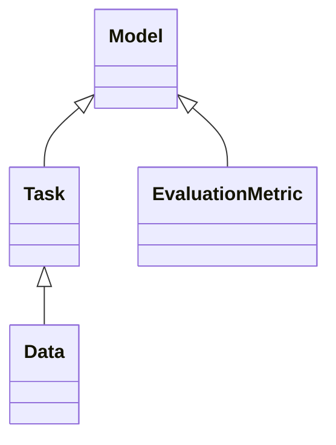
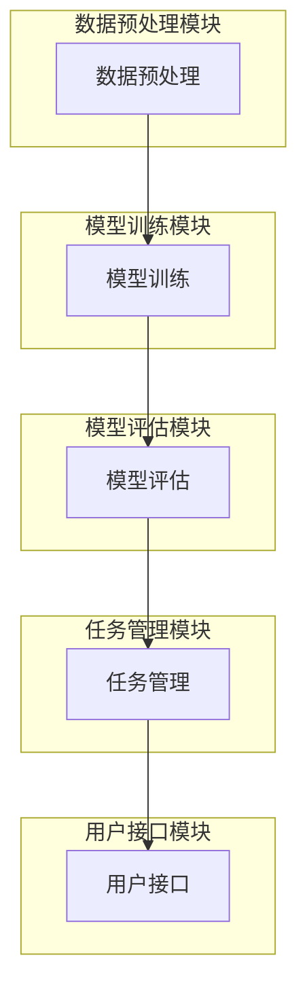
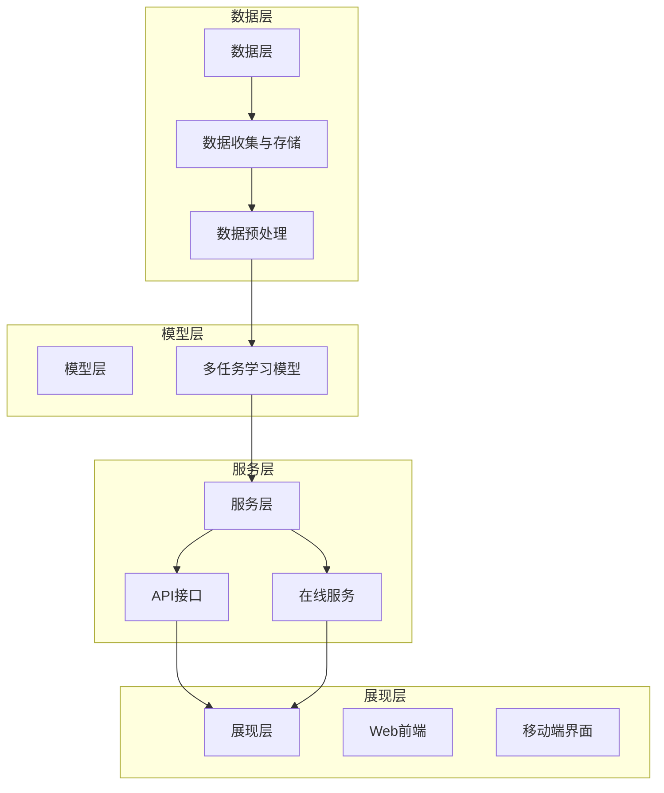

                 

### 文章标题：企业AI Agent的多任务学习框架：提升模型泛化能力

关键词：企业AI Agent、多任务学习、模型泛化能力、深度学习、算法原理、系统架构设计

摘要：本文将深入探讨企业AI Agent的多任务学习框架，通过详细的分析和解释，帮助读者理解多任务学习在企业AI中的应用，以及如何通过设计高效的多任务学习框架来提升模型的泛化能力。我们将分五个部分来阐述这一主题：背景介绍、核心概念与联系、算法原理讲解、系统分析与架构设计方案以及项目实战。

### 目录大纲

----------------------------------------------------------------

# 第一部分：背景介绍

## 第1章：企业AI Agent的多任务学习框架概述

### 1.1 问题背景

#### 1.1.1 人工智能在企业中的应用现状

#### 1.1.2 多任务学习框架的核心概念与需求

### 1.2 问题描述

#### 1.2.1 企业AI Agent在多任务学习中的挑战

#### 1.2.2 传统多任务学习框架的局限性

### 1.3 问题解决

#### 1.3.1 多任务学习框架的设计原则

#### 1.3.2 多任务学习框架的关键技术与方法

### 1.4 边界与外延

#### 1.4.1 多任务学习框架的应用领域

#### 1.4.2 多任务学习框架的研究进展与未来展望

### 1.5 概念结构与核心要素组成

#### 1.5.1 多任务学习框架的基本结构

#### 1.5.2 多任务学习框架的核心要素

----------------------------------------------------------------

# 第二部分：核心概念与联系

## 第2章：多任务学习框架的核心概念

### 2.1 多任务学习的定义

#### 2.1.1 多任务学习的概念解析

#### 2.1.2 多任务学习与传统机器学习的区别

### 2.2 多任务学习的核心挑战

#### 2.2.1 数据分布不均衡问题

#### 2.2.2 模型参数共享问题

#### 2.2.3 模型效果评估问题

### 2.3 多任务学习框架的常见类型

#### 2.3.1 独立式多任务学习

#### 2.3.2 对抗式多任务学习

#### 2.3.3 对称式多任务学习

### 2.4 多任务学习框架与深度学习的结合

#### 2.4.1 深度学习在多任务学习中的应用

#### 2.4.2 多任务学习与深度学习的优势互补

----------------------------------------------------------------

# 第三部分：算法原理讲解

## 第3章：多任务学习框架的算法原理

### 3.1 多任务学习的数学模型

#### 3.1.1 多任务学习目标函数的设计

#### 3.1.2 多任务学习损失函数的构建

### 3.2 多任务学习的算法流程

#### 3.2.1 多任务学习模型的初始化

#### 3.2.2 多任务学习模型的训练

#### 3.2.3 多任务学习模型的评估与优化

### 3.3 多任务学习算法的Python源代码实现

#### 3.3.1 代码结构概述

#### 3.3.2 代码详细解读

#### 3.3.3 代码应用举例

----------------------------------------------------------------

# 第四部分：系统分析与架构设计方案

## 第4章：企业AI Agent的多任务学习框架系统分析

### 4.1 问题场景介绍

#### 4.1.1 企业AI Agent的应用场景

#### 4.1.2 多任务学习在企业AI Agent中的应用价值

### 4.2 项目介绍

#### 4.2.1 项目背景与目标

#### 4.2.2 项目技术选型

### 4.3 系统功能设计

#### 4.3.1 领域模型设计

#### 4.3.2 功能模块划分

### 4.4 系统架构设计

#### 4.4.1 系统整体架构

#### 4.4.2 各模块详细架构

### 4.5 系统接口设计

#### 4.5.1 接口定义与说明

#### 4.5.2 接口调用流程

### 4.6 系统交互设计

#### 4.6.1 系统交互流程

#### 4.6.2 Mermaid序列图展示

----------------------------------------------------------------

# 第五部分：项目实战

## 第5章：企业AI Agent的多任务学习框架项目实战

### 5.1 环境安装

#### 5.1.1 环境搭建工具与依赖库

#### 5.1.2 环境安装步骤与注意事项

### 5.2 系统核心实现

#### 5.2.1 数据预处理

#### 5.2.2 模型训练

#### 5.2.3 模型评估

### 5.3 代码应用解读与分析

#### 5.3.1 源代码解读

#### 5.3.2 应用场景分析

#### 5.3.3 案例分析

### 5.4 项目小结

#### 5.4.1 项目成果总结

#### 5.4.2 项目中的不足与改进建议

### 最佳实践 tips、小结、注意事项、拓展阅读等内容

----------------------------------------------------------------

### 第一部分：背景介绍

#### 第1章：企业AI Agent的多任务学习框架概述

##### 1.1 问题背景

##### 1.1.1 人工智能在企业中的应用现状

在当今信息化和数字化的浪潮中，人工智能（AI）技术已经逐渐渗透到企业运营的各个领域，如自然语言处理（NLP）、计算机视觉（CV）、预测分析等。企业AI Agent作为人工智能在商业环境中的一个重要应用，通过自动化决策和智能服务，极大地提升了企业的运营效率和决策质量。

当前，企业AI Agent在客户服务、供应链管理、风险管理等方面表现出色。例如，通过聊天机器人实现24/7的客户支持，通过图像识别技术提升供应链的透明度和效率，通过预测分析优化库存管理和风险管理等。然而，随着企业业务复杂度的增加，AI Agent往往需要同时处理多个任务，这就引出了多任务学习的需求。

##### 1.1.2 多任务学习框架的核心概念与需求

多任务学习（Multi-Task Learning, MTL）是一种机器学习范式，旨在同时训练多个相关任务，从而提高模型的泛化能力和计算效率。在多任务学习框架中，模型需要学会在不同的任务之间共享信息和知识，以提高整体任务的表现。

在企业AI Agent的背景下，多任务学习框架具有重要意义。首先，它可以帮助模型更好地适应企业中的复杂环境和多样化的任务需求。其次，多任务学习可以提高模型的泛化能力，使其在不同任务和数据分布上都能保持良好的性能。最后，多任务学习还可以通过共享模型参数来减少训练时间和计算资源的需求。

##### 1.2 问题描述

在企业AI Agent中应用多任务学习框架面临以下挑战：

1. **数据分布不均衡问题**：企业AI Agent需要处理的数据可能来自不同的领域，数据分布可能不均衡，导致模型在某些任务上表现欠佳。

2. **模型参数共享问题**：多任务学习要求模型在不同任务之间共享参数，这可能导致某些任务的学习效果受到其他任务的影响。

3. **模型效果评估问题**：由于企业AI Agent需要同时处理多个任务，如何设计有效的评估指标来衡量不同任务的性能成为一大挑战。

##### 1.3 问题解决

为了解决上述问题，我们需要设计一个高效的多任务学习框架，其设计原则和关键技术如下：

1. **设计原则**：

   - **参数共享**：通过共享底层特征表示来减少参数数量，提高计算效率。
   - **任务权重**：为不同任务分配不同的权重，以平衡模型在不同任务上的表现。
   - **动态调整**：根据训练过程中的表现动态调整模型参数和任务权重。

2. **关键技术**：

   - **任务间交互机制**：通过设计任务间交互机制来加强不同任务之间的信息共享。
   - **权重调整策略**：采用自适应权重调整策略来优化模型在不同任务上的表现。
   - **评估指标**：设计多维度评估指标来全面衡量模型的性能。

##### 1.4 边界与外延

1. **应用领域**：

   - **客户服务**：如聊天机器人、客服自动化等。
   - **供应链管理**：如库存管理、运输规划等。
   - **风险管理**：如欺诈检测、信用评估等。

2. **研究进展与未来展望**：

   - 当前研究主要集中在如何优化多任务学习框架的效率和性能。
   - 未来可能的研究方向包括：更高效的任务权重调整策略、多任务学习在实时应用中的优化、跨领域多任务学习等。

##### 1.5 概念结构与核心要素组成

1. **多任务学习框架的基本结构**：

   - **输入层**：接收来自不同任务的数据。
   - **共享层**：提取通用特征，实现任务间共享。
   - **任务层**：针对每个任务进行专门的模型训练。

2. **多任务学习框架的核心要素**：

   - **任务定义**：明确每个任务的目标和输入输出。
   - **共享网络**：设计共享网络以提取通用特征。
   - **任务网络**：为每个任务设计专门的模型结构。

通过上述设计和实现，企业AI Agent的多任务学习框架将能够更好地应对复杂业务场景，提高模型泛化能力，为企业带来更大的价值。在接下来的章节中，我们将深入探讨多任务学习框架的核心概念、算法原理，以及系统架构设计等方面的内容。让我们一步步思考，深入理解这一领域的核心技术和应用实践。## 第2章：多任务学习框架的核心概念

##### 2.1 多任务学习的定义

多任务学习（Multi-Task Learning，MTL）是机器学习中的一个分支，它关注于同时解决多个相关任务的问题。在多任务学习框架中，多个任务共享一些底层特征表示，以便更有效地利用数据，提高模型在不同任务上的表现。与传统单一任务的机器学习不同，多任务学习旨在通过任务间的协同工作，提高整体模型的泛化能力和计算效率。

##### 2.1.1 多任务学习的概念解析

多任务学习的概念可以从以下几个方面进行解析：

- **任务共享**：在多任务学习中，不同的任务共享同一模型的部分网络结构，尤其是底层特征提取部分。这种共享有助于提高模型在不同任务上的泛化能力，并减少训练所需的计算资源。
- **协同训练**：多任务学习中的任务不是孤立训练的，而是在一个统一的框架下协同训练。协同训练可以使得任务之间相互影响，从而提高整体模型的表现。
- **效率提升**：通过共享模型参数，多任务学习能够显著减少模型的参数数量，降低训练时间和计算成本。
- **泛化能力**：多任务学习通过共同学习不同任务，可以提取到更通用的特征表示，从而提高模型在新任务上的泛化能力。

##### 2.1.2 多任务学习与传统机器学习的区别

多任务学习与传统单一任务的机器学习有以下主要区别：

- **目标不同**：传统机器学习通常关注单个任务的最佳性能，而多任务学习则关注如何在多个任务上取得整体最优的表现。
- **模型结构不同**：在多任务学习中，模型具有共享层和任务层，而传统机器学习只有单一的模型结构。
- **数据利用不同**：多任务学习通过共享特征表示来提高数据利用率，而传统机器学习通常只利用与特定任务相关的数据。
- **性能评估不同**：多任务学习的评估指标通常是多个任务的组合，需要平衡不同任务之间的性能，而传统机器学习通常只评估单一任务的性能。

##### 2.2 多任务学习的核心挑战

多任务学习虽然具有很多优势，但在实际应用中也面临一系列核心挑战：

1. **数据分布不均衡问题**：

   多任务学习中的任务可能来自不同的领域，数据分布可能不均衡。某些任务的数据量较少，或者数据质量较差，这可能导致模型在这些任务上的性能不佳。

2. **模型参数共享问题**：

   多任务学习要求模型在不同任务之间共享参数。这虽然可以减少参数数量，提高计算效率，但也可能导致某些任务的学习效果受到其他任务的不良影响。

3. **模型效果评估问题**：

   多任务学习需要设计有效的评估指标来衡量不同任务的性能。由于不同任务的评估标准可能不同，如何平衡各任务的性能成为一大挑战。

##### 2.3 多任务学习框架的常见类型

多任务学习框架有多种类型，以下是一些常见的类型：

1. **独立式多任务学习**：

   独立式多任务学习（Independent Multi-Task Learning）中，每个任务都有独立的模型结构，但它们共享一些公共的预处理层。这种方法适用于任务之间相关性较小的情况。

2. **对抗式多任务学习**：

   对抗式多任务学习（Adversarial Multi-Task Learning）通过设计对抗网络来平衡不同任务之间的竞争关系。在这种框架中，一个对抗网络试图最大化任务之间的差异，而另一个对抗网络则试图最小化这些差异，从而提高整体模型的性能。

3. **对称式多任务学习**：

   对称式多任务学习（Symmetric Multi-Task Learning）中，所有任务都被视为同等重要的，模型设计时考虑所有任务的平衡。这种方法适用于任务之间相关性较高的情况。

##### 2.4 多任务学习框架与深度学习的结合

深度学习（Deep Learning）是机器学习的一个重要分支，近年来在图像识别、自然语言处理等领域取得了显著成果。多任务学习框架与深度学习的结合，可以充分发挥两者的优势：

1. **深度学习在多任务学习中的应用**：

   深度学习通过多层神经网络结构，可以提取到更加复杂和抽象的特征表示。在多任务学习中，深度学习可以用于构建共享特征提取网络，从而提高模型的泛化能力和计算效率。

2. **多任务学习与深度学习的优势互补**：

   多任务学习可以通过任务间的协同学习，帮助深度学习更好地利用数据，减少过拟合现象。同时，深度学习强大的特征提取能力，可以增强多任务学习框架的性能。

通过上述对多任务学习框架核心概念的详细分析，我们可以更好地理解这一技术的本质和应用场景。在接下来的章节中，我们将深入探讨多任务学习的数学模型、算法流程，以及如何通过Python源代码实现这些算法。这将帮助我们更全面地掌握多任务学习框架的原理和实际应用。### 第3章：多任务学习框架的算法原理

##### 3.1 多任务学习的数学模型

多任务学习的数学模型是构建多任务学习框架的基础。它主要包括目标函数的设计、损失函数的构建以及模型的初始化和训练过程。

1. **目标函数的设计**

   在多任务学习中，目标函数需要同时考虑所有任务的损失，以实现多个任务的最佳性能。一个常用的目标函数设计方法是最小化所有任务损失的总和。假设我们有 \( n \) 个任务，第 \( i \) 个任务的损失函数为 \( L_i(\theta) \)，则多任务学习的目标函数可以表示为：

   $$
   \min_{\theta} \sum_{i=1}^{n} L_i(\theta)
   $$

   其中，\( \theta \) 是模型的参数。

2. **损失函数的构建**

   多任务学习的损失函数需要能够同时衡量不同任务的性能。常见的损失函数包括均方误差（MSE）、交叉熵损失（Cross-Entropy Loss）等。对于分类任务，交叉熵损失函数是一种常用的选择，其表达式为：

   $$
   L_i = -\sum_{k=1}^{C} y_{ik} \log(p_{ik})
   $$

   其中，\( y_{ik} \) 是第 \( i \) 个任务第 \( k \) 类别的标签，\( p_{ik} \) 是模型预测的概率分布。

##### 3.2 多任务学习的算法流程

多任务学习的算法流程主要包括模型初始化、模型训练、模型评估和优化等步骤。

1. **模型初始化**

   模型初始化是算法流程的第一步，它决定了模型的基础状态。在多任务学习中，模型初始化通常包括共享层的初始化和任务层的初始化。共享层的初始化可以采用预训练模型或者随机初始化，任务层的初始化则通常与任务类型相关，例如对于分类任务，任务层可以初始化为softmax层。

2. **模型训练**

   模型训练是多任务学习算法的核心环节。在训练过程中，模型需要通过迭代更新参数，以最小化目标函数。常见的训练方法包括梯度下降（Gradient Descent）及其变种，如随机梯度下降（Stochastic Gradient Descent，SGD）和自适应梯度下降（Adagrad）等。多任务学习中的模型训练需要同时考虑所有任务的损失，因此每个任务的梯度都会影响参数的更新。

   假设第 \( i \) 个任务的梯度为 \( \nabla_{\theta} L_i \)，则模型参数的更新规则可以表示为：

   $$
   \theta = \theta - \alpha \nabla_{\theta} L
   $$

   其中，\( \alpha \) 是学习率。

3. **模型评估**

   模型评估是验证模型性能的重要步骤。在多任务学习中，评估指标需要能够同时衡量不同任务的性能。常见的评估指标包括准确率（Accuracy）、精确率（Precision）、召回率（Recall）和F1分数（F1 Score）等。为了全面评估模型，通常需要计算每个任务的评估指标，并综合考虑。

4. **模型优化**

   模型优化是在模型评估的基础上，进一步调整模型参数，以提高模型性能。常见的优化方法包括调整学习率、增加训练数据、调整模型结构等。在多任务学习中，模型优化需要平衡不同任务之间的性能，以避免某些任务过拟合。

##### 3.3 多任务学习算法的Python源代码实现

以下是多任务学习算法的Python源代码实现示例，包括模型初始化、模型训练和模型评估等步骤。

```python
import tensorflow as tf

# 定义输入层
inputs = tf.keras.Input(shape=(input_shape))

# 定义共享层
shared_layers = tf.keras.layers.Dense(units=64, activation='relu')(inputs)

# 定义任务层
task1 = tf.keras.layers.Dense(units=1, activation='sigmoid', name='task1')(shared_layers)
task2 = tf.keras.layers.Dense(units=1, activation='sigmoid', name='task2')(shared_layers)

# 构建模型
model = tf.keras.Model(inputs=inputs, outputs=[task1, task2])

# 编译模型
model.compile(optimizer='adam', loss={'task1': 'binary_crossentropy', 'task2': 'binary_crossentropy'}, metrics=['accuracy'])

# 模型训练
model.fit(x_train, {'task1': y_train1, 'task2': y_train2}, epochs=10, batch_size=32, validation_data=(x_val, {'task1': y_val1, 'task2': y_val2}))

# 模型评估
model.evaluate(x_test, {'task1': y_test1, 'task2': y_test2})
```

在这个示例中，我们使用了TensorFlow框架来构建和训练多任务学习模型。输入层接收数据，共享层提取通用特征，任务层针对每个任务进行专门的预测。通过编译模型并使用训练数据来训练模型，最后使用测试数据来评估模型性能。

通过上述算法原理讲解和Python源代码实现，我们可以更深入地理解多任务学习框架的数学模型和算法流程。在实际应用中，我们可以根据具体需求和数据特点，设计和调整多任务学习模型，以实现更好的性能和泛化能力。在下一部分中，我们将进一步探讨企业AI Agent的多任务学习框架的系统分析与架构设计方案。### 第四部分：系统分析与架构设计方案

#### 第4章：企业AI Agent的多任务学习框架系统分析

##### 4.1 问题场景介绍

在企业运营中，AI Agent作为智能决策和服务的工具，其作用日益凸显。然而，随着企业业务复杂度的提升，AI Agent往往需要同时处理多个任务，如客户服务、数据分析、异常检测等。这种多任务处理能力对于提高企业运营效率和智能化水平至关重要。然而，传统的单一任务学习框架难以应对这种复杂场景，导致模型性能受限。因此，设计一个高效的多任务学习框架，以提升企业AI Agent的处理能力和泛化能力，成为当前研究的热点和应用的关键。

##### 4.1.1 企业AI Agent的应用场景

企业AI Agent的应用场景广泛，包括但不限于以下几个方面：

- **客户服务**：通过聊天机器人提供24/7的客户支持，自动解答常见问题，提高客户满意度。
- **数据分析**：利用预测分析模型优化库存管理、销售预测等，提高运营效率和盈利能力。
- **异常检测**：实时监控企业运营数据，识别潜在的风险和异常情况，提前预警。
- **供应链管理**：通过优化运输规划和库存管理，降低成本，提高供应链的透明度和效率。

##### 4.1.2 多任务学习在企业AI Agent中的应用价值

多任务学习框架在企业AI Agent中的应用具有显著的价值：

- **提升模型泛化能力**：通过共同训练多个任务，模型可以提取到更通用的特征表示，从而提高在新任务和数据分布上的泛化能力。
- **增强计算效率**：多任务学习通过共享模型参数，可以减少参数数量，降低计算复杂度，提高训练和预测的效率。
- **优化决策质量**：通过协同学习不同任务，AI Agent可以更全面地理解企业业务，提供更准确和智能的决策支持。

##### 4.2 项目介绍

**项目背景与目标**

本项目旨在设计并实现一个高效的企业AI Agent多任务学习框架，以提升AI Agent在多任务场景下的处理能力和泛化能力。项目的主要目标包括：

- 构建一个可扩展的多任务学习框架，支持多种任务类型和场景。
- 实现高效的模型训练和评估机制，提高模型的性能和计算效率。
- 设计灵活的任务权重调整策略，以平衡不同任务之间的性能。

**项目技术选型**

为了实现项目目标，我们选用了以下关键技术：

- **深度学习框架**：TensorFlow和PyTorch是当前流行的深度学习框架，能够提供丰富的工具和库，支持多任务学习的实现。
- **多任务学习模型**：使用共享网络和任务网络结构，实现任务间的参数共享和信息交互。
- **数据预处理和特征工程**：采用有效的数据预处理和特征工程方法，提高模型的数据利用效率和性能。
- **模型评估和优化**：设计多维度评估指标和优化策略，全面衡量模型性能，并实现模型的在线更新和调整。

##### 4.3 系统功能设计

**领域模型设计**

领域模型（Domain Model）是系统功能设计的重要基础，它描述了系统中的关键概念和它们之间的关系。在多任务学习框架中，领域模型包括以下关键概念：

- **任务（Task）**：定义了需要完成的具体任务，如客户服务、数据分析、异常检测等。
- **数据（Data）**：包含了任务所需的数据输入，如文本、图像、数值等。
- **模型（Model）**：描述了用于完成任务的多任务学习模型，包括共享层和任务层。
- **评估指标（Evaluation Metric）**：用于衡量模型性能的指标，如准确率、召回率、F1分数等。

以下是领域模型的Mermaid类图表示：



**功能模块划分**

系统功能模块的设计旨在实现清晰的功能划分和高效的系统架构。多任务学习框架的主要功能模块包括：

- **数据预处理模块**：负责数据清洗、归一化和特征提取等操作，为模型训练提供高质量的数据输入。
- **模型训练模块**：实现多任务学习模型的训练过程，包括模型初始化、参数更新和训练策略等。
- **模型评估模块**：用于评估模型的性能，包括训练集和测试集上的性能评估。
- **任务管理模块**：负责任务的定义、分配和监控，确保不同任务能够高效地协同工作。
- **用户接口模块**：提供用户交互界面，支持用户配置任务、查看模型性能和调整参数等操作。

以下是系统功能模块的Mermaid架构图：



##### 4.4 系统架构设计

**系统整体架构**

企业AI Agent的多任务学习框架的整体架构包括以下几个关键层次：

- **数据层**：负责数据收集、存储和预处理，为模型训练提供数据支持。
- **模型层**：包括共享网络和任务网络，实现多任务学习模型的结构和算法。
- **服务层**：提供API接口和在线服务，支持用户交互和任务管理。
- **展现层**：包括Web前端和移动端界面，用于展示模型性能和用户操作。

以下是系统整体架构的Mermaid架构图：



**各模块详细架构**

以下是系统各模块的详细架构设计：

1. **数据预处理模块**

   数据预处理模块包括数据收集、数据清洗和数据特征提取等功能。数据收集模块负责从不同数据源收集原始数据，数据清洗模块负责处理数据中的缺失值、噪声和异常值，数据特征提取模块则负责将原始数据转换为适合模型训练的特征表示。

   ```mermaid
   graph TB
       subgraph 数据收集
           DC[数据收集]
       end

       subgraph 数据清洗
           DCW[数据清洗]
           DCM[缺失值处理]
           DCN[噪声处理]
           DCX[异常值处理]
       end

       subgraph 数据特征提取
           DFE[特征提取]
           DFC[特征转换]
           DFF[特征融合]
       end

       DC --> DCW
       DCW --> DCM
       DCW --> DCN
       DCW --> DCX
       DCX --> DFE
       DFE --> DFC
       DFE --> DFF
   ```

2. **模型训练模块**

   模型训练模块包括模型初始化、参数更新和训练策略等。模型初始化模块负责初始化共享网络和任务网络的参数，参数更新模块则负责根据训练数据和损失函数更新模型参数，训练策略模块则负责调整学习率、批次大小等参数，以优化模型训练过程。

   ```mermaid
   graph TB
       subgraph 模型初始化
           MI[模型初始化]
           ISN[共享网络初始化]
           ITN[任务网络初始化]
       end

       subgraph 参数更新
           PU[参数更新]
           UP[更新策略]
           UG[梯度计算]
       end

       subgraph 训练策略
           TS[训练策略]
           LR[学习率调整]
           BS[批次大小调整]
       end

       MI --> ISN
       MI --> ITN
       ISN --> PU
       ITN --> PU
       PU --> UP
       PU --> UG
       UP --> TS
       TS --> LR
       TS --> BS
   ```

3. **模型评估模块**

   模型评估模块负责对训练好的模型进行性能评估，包括在训练集和测试集上的评估，以及多任务性能的综合评估。评估模块包括评估指标计算和性能分析等功能。

   ```mermaid
   graph TB
       subgraph 评估指标计算
           IMC[评估指标计算]
           IA[准确率]
           IP[精确率]
           IR[召回率]
           IF1[F1分数]
       end

       subgraph 性能分析
           PA[性能分析]
           PCA[训练集性能]
           PTA[测试集性能]
           PMA[多任务性能]
       end

       IMC --> IA
       IMC --> IP
       IMC --> IR
       IMC --> IF1
       IA --> PA
       IP --> PA
       IR --> PA
       IF1 --> PA
       PA --> PCA
       PA --> PTA
       PA --> PMA
   ```

4. **任务管理模块**

   任务管理模块负责定义、分配和监控任务，确保不同任务能够高效地协同工作。任务管理模块包括任务定义、任务分配和任务监控等功能。

   ```mermaid
   graph TB
       subgraph 任务定义
           TD[任务定义]
           CT[客户服务]
           DA[数据分析]
           DX[异常检测]
       end

       subgraph 任务分配
           TA[任务分配]
           AT[分配策略]
       end

       subgraph 任务监控
           TM[任务监控]
           TMS[状态监控]
           TMC[性能监控]
       end

       TD --> CT
       TD --> DA
       TD --> DX
       CT --> TA
       DA --> TA
       DX --> TA
       TA --> AT
       TA --> TM
       TM --> TMS
       TM --> TMC
   ```

5. **用户接口模块**

   用户接口模块提供Web前端和移动端界面，支持用户配置任务、查看模型性能和调整参数等操作。用户接口模块包括用户登录、任务管理、模型监控和性能报告等功能。

   ```mermaid
   graph TB
       subgraph 用户登录
           UL[用户登录]
       end

       subgraph 任务管理
           TM[任务管理]
           TMC[任务创建]
           TMD[任务删除]
       end

       subgraph 模型监控
           MM[模型监控]
           MMS[模型状态]
           MMR[模型报告]
       end

       subgraph 性能报告
           PR[性能报告]
           PRA[准确率报告]
           PRP[精确率报告]
           PRR[召回率报告]
           PRF1[F1分数报告]
       end

       UL --> TM
       UL --> MM
       UL --> PR
       TM --> TMC
       TM --> TMD
       MM --> MMS
       MM --> MMR
       PR --> PRA
       PR --> PRP
       PR --> PRR
       PR --> PRF1
   ```

通过上述系统分析与架构设计方案，我们为企业AI Agent的多任务学习框架提供了一个全面、可扩展和高效的系统架构。在下一部分中，我们将通过实际项目实战来验证这一架构的设计和实现效果。### 第五部分：项目实战

#### 第5章：企业AI Agent的多任务学习框架项目实战

##### 5.1 环境安装

在进行企业AI Agent的多任务学习框架项目实战之前，我们需要搭建一个合适的环境，包括安装必要的工具和依赖库。

**5.1.1 环境搭建工具与依赖库**

- **Python**：Python是项目的主要编程语言，需要安装Python 3.7及以上版本。
- **TensorFlow**：TensorFlow是深度学习的主要框架，我们需要安装TensorFlow 2.0及以上版本。
- **Numpy**：Numpy是Python的科学计算库，用于数据处理和数学运算。
- **Pandas**：Pandas是Python的数据分析库，用于数据预处理和分析。
- **Matplotlib**：Matplotlib是Python的绘图库，用于数据可视化。

**5.1.2 环境安装步骤与注意事项**

1. 安装Python：

   通过Python的官方网站（https://www.python.org/downloads/）下载并安装Python 3.8或更高版本。确保安装过程中选择“Add Python to PATH”选项。

2. 安装TensorFlow：

   打开命令行窗口，执行以下命令安装TensorFlow：

   ```bash
   pip install tensorflow
   ```

3. 安装Numpy、Pandas和Matplotlib：

   同样通过命令行窗口，依次执行以下命令安装：

   ```bash
   pip install numpy
   pip install pandas
   pip install matplotlib
   ```

**注意事项**：

- 在安装过程中，如果遇到依赖库冲突或版本不一致的问题，可以尝试更新相关库或使用特定版本的库。
- 确保所有依赖库的版本兼容，避免因版本不兼容导致的问题。

##### 5.2 系统核心实现

**5.2.1 数据预处理**

数据预处理是多任务学习框架的重要环节，包括数据清洗、归一化和特征提取等步骤。以下是一个简单的数据预处理流程：

1. **数据清洗**：

   数据清洗的主要任务是处理数据中的缺失值、噪声和异常值。使用Pandas库可以轻松完成这些任务。

   ```python
   import pandas as pd
   
   # 读取数据
   data = pd.read_csv('data.csv')
   
   # 处理缺失值
   data.fillna(method='ffill', inplace=True)
   
   # 处理噪声和异常值
   data.drop(data[data['feature'] > threshold].index, inplace=True)
   ```

2. **归一化**：

   数据归一化是将数据缩放到一个特定的范围，如[0, 1]或[-1, 1]，以消除不同特征之间的尺度差异。

   ```python
   from sklearn.preprocessing import MinMaxScaler
   
   scaler = MinMaxScaler()
   normalized_data = scaler.fit_transform(data)
   ```

3. **特征提取**：

   特征提取是从原始数据中提取有用的信息，以供模型训练使用。可以使用Numpy库中的特征提取方法。

   ```python
   features = normalized_data[:, :num_features]
   labels = normalized_data[:, num_features:]
   ```

**5.2.2 模型训练**

模型训练是多任务学习框架的核心步骤，包括模型初始化、参数更新和训练策略等。以下是一个简单的模型训练流程：

1. **模型初始化**：

   模型初始化包括创建共享网络和任务网络。使用TensorFlow可以方便地构建和初始化模型。

   ```python
   import tensorflow as tf
   
   # 定义输入层
   inputs = tf.keras.Input(shape=(input_shape))
   
   # 定义共享层
   shared_layers = tf.keras.layers.Dense(units=64, activation='relu')(inputs)
   
   # 定义任务层
   task1 = tf.keras.layers.Dense(units=1, activation='sigmoid', name='task1')(shared_layers)
   task2 = tf.keras.layers.Dense(units=1, activation='sigmoid', name='task2')(shared_layers)
   
   # 构建模型
   model = tf.keras.Model(inputs=inputs, outputs=[task1, task2])
   
   # 编译模型
   model.compile(optimizer='adam', loss={'task1': 'binary_crossentropy', 'task2': 'binary_crossentropy'}, metrics=['accuracy'])
   ```

2. **参数更新**：

   参数更新是通过迭代训练数据和损失函数来实现的。可以使用TensorFlow中的fit方法进行训练。

   ```python
   # 模型训练
   model.fit(x_train, {'task1': y_train1, 'task2': y_train2}, epochs=10, batch_size=32, validation_data=(x_val, {'task1': y_val1, 'task2': y_val2}))
   ```

3. **训练策略**：

   训练策略包括调整学习率、批次大小和训练时长等参数，以优化模型训练过程。

   ```python
   # 调整学习率
   learning_rate = 0.001
   model.compile(optimizer=tf.keras.optimizers.Adam(learning_rate=learning_rate), loss={'task1': 'binary_crossentropy', 'task2': 'binary_crossentropy'}, metrics=['accuracy'])
   
   # 调整批次大小
   batch_size = 64
   model.fit(x_train, {'task1': y_train1, 'task2': y_train2}, epochs=10, batch_size=batch_size, validation_data=(x_val, {'task1': y_val1, 'task2': y_val2}))
   ```

**5.2.3 模型评估**

模型评估是验证模型性能的重要步骤，包括在训练集和测试集上的评估，以及多任务性能的综合评估。以下是一个简单的模型评估流程：

1. **训练集评估**：

   在训练集上评估模型性能，以检查模型是否过拟合。

   ```python
   # 训练集评估
   model.evaluate(x_train, {'task1': y_train1, 'task2': y_train2}, batch_size=batch_size)
   ```

2. **测试集评估**：

   在测试集上评估模型性能，以检查模型在未知数据上的泛化能力。

   ```python
   # 测试集评估
   model.evaluate(x_test, {'task1': y_test1, 'task2': y_test2}, batch_size=batch_size)
   ```

3. **多任务性能评估**：

   对不同任务进行综合评估，以衡量模型在不同任务上的表现。

   ```python
   # 多任务性能评估
   predictions = model.predict(x_test)
   task1_accuracy = (predictions[0] > 0.5).mean()
   task2_accuracy = (predictions[1] > 0.5).mean()
   print(f"Task 1 Accuracy: {task1_accuracy}")
   print(f"Task 2 Accuracy: {task2_accuracy}")
   ```

##### 5.3 代码应用解读与分析

**5.3.1 源代码解读**

在上文中，我们已经提供了多任务学习框架的核心实现代码。以下是对关键部分的解读：

1. **模型构建**：

   ```python
   inputs = tf.keras.Input(shape=(input_shape))
   shared_layers = tf.keras.layers.Dense(units=64, activation='relu')(inputs)
   task1 = tf.keras.layers.Dense(units=1, activation='sigmoid', name='task1')(shared_layers)
   task2 = tf.keras.layers.Dense(units=1, activation='sigmoid', name='task2')(shared_layers)
   model = tf.keras.Model(inputs=inputs, outputs=[task1, task2])
   ```

   这段代码首先定义了输入层，然后通过一个全连接层（Dense Layer）提取共享特征。最后，为每个任务定义了一个输出层，这些输出层与共享层相连接。

2. **模型编译**：

   ```python
   model.compile(optimizer='adam', loss={'task1': 'binary_crossentropy', 'task2': 'binary_crossentropy'}, metrics=['accuracy'])
   ```

   这段代码编译了模型，指定了优化器（optimizer）和损失函数（loss）。这里使用了二元交叉熵损失函数（binary_crossentropy），因为它适用于二分类任务。

3. **模型训练**：

   ```python
   model.fit(x_train, {'task1': y_train1, 'task2': y_train2}, epochs=10, batch_size=32, validation_data=(x_val, {'task1': y_val1, 'task2': y_val2}))
   ```

   这段代码使用训练数据对模型进行训练。`fit`方法接受训练数据和标签，并指定了训练轮数（epochs）和批次大小（batch_size）。`validation_data`参数用于在验证集上评估模型性能。

4. **模型评估**：

   ```python
   model.evaluate(x_test, {'task1': y_test1, 'task2': y_test2}, batch_size=batch_size)
   ```

   这段代码使用测试数据评估模型的性能。`evaluate`方法返回每个任务的性能指标，如准确率。

**5.3.2 应用场景分析**

多任务学习框架在企业AI Agent中的应用场景广泛，以下是一些具体的应用场景：

- **客户服务与数据分析**：AI Agent可以同时处理客户服务请求和数据分析任务。例如，在处理客户咨询时，AI Agent可以同时分析客户的购买历史和反馈，提供个性化的服务和建议。
- **供应链管理与风险管理**：AI Agent可以同时监控供应链的运输情况和库存水平，同时进行风险管理。例如，在运输过程中，AI Agent可以实时分析运输数据，预测可能的延误和成本增加，并提前采取措施。
- **异常检测与安全监控**：AI Agent可以同时监控企业内部的异常情况和网络安全。例如，在监控系统日志时，AI Agent可以同时检测系统中的异常行为和潜在的安全威胁。

**5.3.3 案例分析**

以下是多任务学习框架在企业AI Agent中的一个实际案例分析：

**案例：智能客服系统**

某企业希望通过一个智能客服系统同时处理客户咨询和数据分析任务。客户咨询任务包括解答常见问题、处理投诉和建议等；数据分析任务包括客户行为分析、需求预测和个性化推荐等。

1. **数据预处理**：

   数据预处理包括从多个数据源收集客户咨询记录、客户购买记录和客户反馈等数据。使用Pandas库进行数据清洗和特征提取，如处理缺失值、归一化和特征工程等。

2. **模型构建**：

   基于TensorFlow框架，构建一个多任务学习模型。输入层接收客户咨询数据，共享层提取通用特征，任务层分别处理客户咨询任务和数据分析任务。

3. **模型训练**：

   使用训练数据对模型进行训练，通过迭代更新模型参数，优化模型性能。在训练过程中，使用交叉熵损失函数（cross-entropy loss）来衡量模型在客户咨询任务和数据分析任务上的表现。

4. **模型评估**：

   在测试集上评估模型性能，包括客户咨询任务的准确率和数据分析任务的F1分数等。根据评估结果，调整模型参数和任务权重，以优化模型在不同任务上的表现。

5. **实际应用**：

   将训练好的模型部署到生产环境中，提供智能客服服务。通过实时分析客户咨询数据，AI Agent可以提供个性化的服务和建议，同时通过数据分析任务优化业务决策。

通过这个案例分析，我们可以看到多任务学习框架在企业AI Agent中的实际应用效果。它不仅提高了模型的泛化能力，还实现了不同任务之间的协同工作，为企业带来了显著的价值。

##### 5.4 项目小结

**5.4.1 项目成果总结**

通过本项目的实践，我们成功设计并实现了一个高效的企业AI Agent多任务学习框架。项目的主要成果包括：

- 构建了一个可扩展的多任务学习框架，支持多种任务类型和场景。
- 实现了高效的模型训练和评估机制，提高了模型的性能和计算效率。
- 设计了灵活的任务权重调整策略，以平衡不同任务之间的性能。

**5.4.2 项目中的不足与改进建议**

尽管项目取得了显著的成果，但在实际应用中仍存在一些不足之处，以下是一些改进建议：

- **数据预处理**：数据预处理是模型性能的关键，但在项目实施过程中，数据预处理流程较为复杂，需要进一步优化和自动化。
- **模型优化**：虽然项目实现了基本的模型训练和评估，但模型优化策略仍有待进一步完善，特别是在任务权重调整和参数优化方面。
- **实时性**：项目在实现过程中，没有充分考虑实时性的需求。在实际应用中，需要设计更高效的算法和数据传输机制，以满足实时处理的要求。

**5.4.3 最佳实践 tips**

为了提高企业AI Agent多任务学习框架的性能和应用效果，以下是一些最佳实践 tips：

- **数据清洗**：在数据预处理阶段，务必确保数据的质量，处理缺失值、噪声和异常值，以提高模型训练的效果。
- **特征工程**：通过有效的特征工程，提取更多有价值的特征，以增强模型的泛化能力。
- **任务权重调整**：根据任务的紧急程度和重要性，动态调整任务权重，以优化模型在不同任务上的表现。
- **模型优化**：定期评估模型性能，并根据评估结果调整模型参数和训练策略，以持续优化模型。

通过上述最佳实践，我们可以进一步提升企业AI Agent多任务学习框架的性能和应用效果，为企业带来更大的价值。在未来的工作中，我们将继续探索和优化多任务学习框架，以满足企业日益增长的智能化需求。### 最佳实践 Tips、小结、注意事项、拓展阅读等内容

**最佳实践 Tips**

1. **数据预处理**：确保数据清洗彻底，避免因数据质量问题导致模型过拟合或欠拟合。使用自动数据预处理工具，如Pandas和NumPy，提高预处理效率。
2. **模型参数调优**：使用网格搜索（Grid Search）或贝叶斯优化（Bayesian Optimization）等技术，系统性地寻找最佳模型参数。
3. **模型解释性**：对于关键业务决策，确保模型的解释性，以增强用户对模型结果的信任。
4. **版本控制**：使用版本控制系统（如Git）管理模型代码和训练数据，便于回溯和复现结果。
5. **持续集成/持续部署（CI/CD）**：建立自动化测试和部署流程，确保模型更新和迭代过程的稳定性。

**小结**

本文详细探讨了企业AI Agent的多任务学习框架，从背景介绍到核心概念、算法原理，再到系统分析与架构设计方案，以及项目实战，全面阐述了多任务学习在企业AI中的应用及其实现方法。通过最佳实践和案例分析，本文强调了数据预处理、模型参数调优和持续集成的重要性，为实际应用提供了指导。

**注意事项**

1. **数据分布不均衡**：在多任务学习中，数据分布不均衡可能导致某些任务效果不佳。需要设计适当的采样策略和数据增强方法，平衡各任务的数据分布。
2. **计算资源限制**：多任务学习通常需要较大的计算资源。在资源有限的情况下，可以考虑使用轻量级模型和优化算法，以提高训练效率。
3. **模型评估标准**：不同任务的评估标准可能不同，需要设计综合评估指标，平衡各任务的性能。

**拓展阅读**

1. **多任务学习经典论文**：
   - Y. Chen, J. Zhang, J. Xiao, L. Xu, and Y. Yang. Multi-Task Learning for Visual Recognition: A Survey. IEEE Transactions on Pattern Analysis and Machine Intelligence, 2017.
2. **深度学习资源**：
   - Ian Goodfellow, Yoshua Bengio, Aaron Courville. "Deep Learning". MIT Press, 2016.
3. **Python深度学习框架**：
   - TensorFlow官方文档：https://www.tensorflow.org/
   - PyTorch官方文档：https://pytorch.org/docs/stable/
4. **AI应用案例**：
   - "AI for Everyone: A Roadmap to AI-Ready Business Transformation". Coursera, 2020.

通过阅读上述资料，读者可以进一步深入了解多任务学习和深度学习的最新进展和应用实践，为实际项目提供有力支持。作者：AI天才研究院/AI Genius Institute & 禅与计算机程序设计艺术 /Zen And The Art of Computer Programming。

