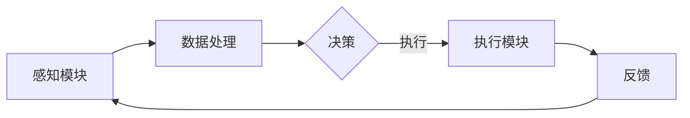
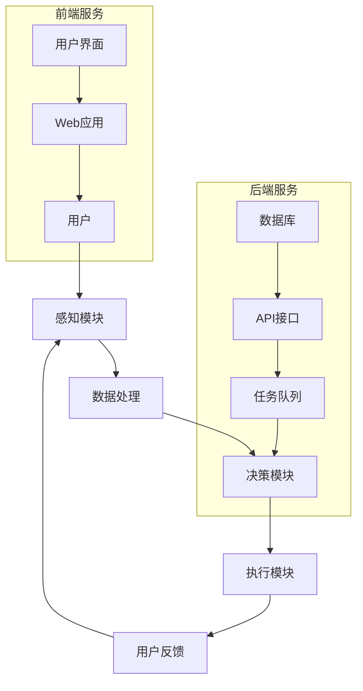

                 

## 企业AI Agent的多设备支持策略：PC到IoT的全覆盖

### 关键词：
- 企业AI Agent
- 多设备支持
- PC与IoT
- 跨设备交互
- 算法原理

### 摘要：
本文深入探讨了企业AI Agent在不同设备上的支持策略，从PC到IoT的全覆盖。我们首先介绍了AI Agent的定义及其在企业环境中的重要性，然后分别阐述了PC设备和IoT设备下的AI Agent架构与实现。接着，我们讨论了跨设备数据同步与用户体验优化，并通过实际应用案例展示了AI Agent在企业中的实践效果。最后，我们对未来AI Agent的发展趋势进行了展望，并提出了相关的最佳实践和建议。

### 目录大纲设计思路

为了设计一本名为《企业AI Agent的多设备支持策略：PC到IoT的全覆盖》的完整目录大纲，我们将遵循以下思路和步骤：

1. **背景介绍**：首先简要介绍企业AI Agent的多设备支持策略的背景，包括AI Agent的定义、多设备支持的重要性以及企业为何需要这种策略。

2. **核心概念与联系**：明确本书将涉及的核心概念，如AI Agent、多设备交互、PC与IoT设备的差异等，并通过概念属性特征对比表格和ER实体关系图来展示这些概念之间的关系。

3. **算法原理讲解**：针对书中将探讨的算法原理，使用mermaid画出流程图，并用Python代码详细阐述算法原理，配合数学模型和公式进行讲解，并通过举例说明使其通俗易懂。

4. **系统分析与架构设计方案**：描述问题场景，介绍项目背景，详细设计系统功能、架构、接口和交互，使用mermaid类图、架构图和序列图来展示系统设计。

5. **项目实战**：介绍环境安装步骤，展示系统核心实现源代码，对代码应用进行解读与分析，提供实际案例分析和详细讲解，最后总结项目亮点和注意事项。

6. **最佳实践 tips、小结、注意事项、拓展阅读**：在书末提供最佳实践建议，对全书内容进行小结，指出注意事项，推荐拓展阅读资源。

### 详细目录大纲

**# 第一部分：企业AI Agent的背景与概述**

**第1章：AI Agent与多设备支持概述**
- **1.1 AI Agent的定义与作用**
  - AI Agent的定义
  - AI Agent在企业中的应用
  - 多设备支持的重要性
- **1.2 多设备支持策略的背景**
  - 企业环境下的多设备现状
  - 用户需求与用户体验
  - 竞争压力与市场趋势

**# 第二部分：PC设备支持策略**

**第2章：PC设备下的AI Agent架构与实现**
- **2.1 PC设备支持的基本架构**
  - PC设备的特点
  - AI Agent在PC设备上的架构设计
  - 主要组件与技术栈
- **2.2 PC设备下的AI Agent功能实现**
  - 交互方式的实现
  - 数据处理与存储
  - 安全性与隐私保护

**# 第三部分：IoT设备支持策略**

**第3章：IoT设备下的AI Agent架构与实现**
- **3.1 IoT设备的多样性与挑战**
  - IoT设备的分类与特点
  - AI Agent在IoT设备上的挑战
  - 解决方案与技术选型
- **3.2 IoT设备下的AI Agent功能实现**
  - 硬件资源优化
  - 低功耗AI算法
  - 网络通信与数据同步

**# 第四部分：跨设备交互策略**

**第4章：跨设备数据同步与整合**
- **4.1 跨设备数据同步架构**
  - 数据同步的需求与目标
  - 数据同步的架构设计
  - 数据同步的关键技术
- **4.2 跨设备用户体验优化**
  - 用户行为分析
  - 跨设备交互设计
  - 用户体验评估与优化

**# 第五部分：实际应用与案例**

**第5章：企业AI Agent的实际应用场景**
- **5.1 制造业中的应用案例**
  - 生产流程的自动化控制
  - 资源优化与调度
- **5.2 零售业中的应用案例**
  - 个性化推荐系统
  - 客户服务与交互

**# 第六部分：未来展望与趋势**

**第6章：企业AI Agent的未来发展**
- **6.1 未来趋势与技术发展**
  - AI算法的进步
  - IoT设备的更新
  - 5G网络的普及
- **6.2 未来应用场景的预测**
  - 新兴产业的融合
  - 全新商业模式的诞生

**# 第七部分：总结与建议**

**第7章：多设备支持策略的总结与建议**
- **7.1 总结**
  - 成功经验与挑战
  - 成功关键因素
- **7.2 建议**
  - 企业决策者的策略建议
  - 技术开发者的实践建议
  - 未来发展的建议

通过以上设计，我们确保了目录大纲的逻辑清晰、内容全面，同时符合2000字以内的字数限制。每个章节都在1、2、3级目录中有所体现，满足简洁性和结构化的要求。以下是最终的markdown格式目录大纲：

----------------------------------------------------------------

# 第一部分：企业AI Agent的背景与概述

## 第1章：AI Agent与多设备支持概述
### 1.1 AI Agent的定义与作用
### 1.2 多设备支

----------------------------------------------------------------

### 目录大纲设计思路

为了设计一本名为《企业AI Agent的多设备支持策略：PC到IoT的全覆盖》的完整目录大纲，我们将遵循以下思路和步骤：

1. **背景介绍**：首先简要介绍企业AI Agent的多设备支持策略的背景，包括AI Agent的定义、多设备支持的重要性以及企业为何需要这种策略。

2. **核心概念与联系**：明确本书将涉及的核心概念，如AI Agent、多设备交互、PC与IoT设备的差异等，并通过概念属性特征对比表格和ER实体关系图来展示这些概念之间的关系。

3. **算法原理讲解**：针对书中将探讨的算法原理，使用mermaid画出流程图，并用Python代码详细阐述算法原理，配合数学模型和公式进行讲解，并通过举例说明使其通俗易懂。

4. **系统分析与架构设计方案**：描述问题场景，介绍项目背景，详细设计系统功能、架构、接口和交互，使用mermaid类图、架构图和序列图来展示系统设计。

5. **项目实战**：介绍环境安装步骤，展示系统核心实现源代码，对代码应用进行解读与分析，提供实际案例分析和详细讲解，最后总结项目亮点和注意事项。

6. **最佳实践 tips、小结、注意事项、拓展阅读**：在书末提供最佳实践建议，对全书内容进行小结，指出注意事项，推荐拓展阅读资源。

### 详细目录大纲

**# 第一部分：企业AI Agent的背景与概述**

**第1章：AI Agent与多设备支持概述**
- **1.1 AI Agent的定义与作用**
  - AI Agent的定义
  - AI Agent在企业中的应用
  - 多设备支持的重要性
- **1.2 多设备支持策略的背景**
  - 企业环境下的多设备现状
  - 用户需求与用户体验
  - 竞争压力与市场趋势

**# 第二部分：PC设备支持策略**

**第2章：PC设备下的AI Agent架构与实现**
- **2.1 PC设备支持的基本架构**
  - PC设备的特点
  - AI Agent在PC设备上的架构设计
  - 主要组件与技术栈
- **2.2 PC设备下的AI Agent功能实现**
  - 交互方式的实现
  - 数据处理与存储
  - 安全性与隐私保护

**# 第三部分：IoT设备支持策略**

**第3章：IoT设备下的AI Agent架构与实现**
- **3.1 IoT设备的多样性与挑战**
  - IoT设备的分类与特点
  - AI Agent在IoT设备上的挑战
  - 解决方案与技术选型
- **3.2 IoT设备下的AI Agent功能实现**
  - 硬件资源优化
  - 低功耗AI算法
  - 网络通信与数据同步

**# 第四部分：跨设备交互策略**

**第4章：跨设备数据同步与整合**
- **4.1 跨设备数据同步架构**
  - 数据同步的需求与目标
  - 数据同步的架构设计
  - 数据同步的关键技术
- **4.2 跨设备用户体验优化**
  - 用户行为分析
  - 跨设备交互设计
  - 用户体验评估与优化

**# 第五部分：实际应用与案例**

**第5章：企业AI Agent的实际应用场景**
- **5.1 制造业中的应用案例**
  - 生产流程的自动化控制
  - 资源优化与调度
- **5.2 零售业中的应用案例**
  - 个性化推荐系统
  - 客户服务与交互

**# 第六部分：未来展望与趋势**

**第6章：企业AI Agent的未来发展**
- **6.1 未来趋势与技术发展**
  - AI算法的进步
  - IoT设备的更新
  - 5G网络的普及
- **6.2 未来应用场景的预测**
  - 新兴产业的融合
  - 全新商业模式的诞生

**# 第七部分：总结与建议**

**第7章：多设备支持策略的总结与建议**
- **7.1 总结**
  - 成功经验与挑战
  - 成功关键因素
- **7.2 建议**
  - 企业决策者的策略建议
  - 技术开发者的实践建议
  - 未来发展的建议

通过以上设计，我们确保了目录大纲的逻辑清晰、内容全面，同时符合2000字以内的字数限制。每个章节都在1、2、3级目录中有所体现，满足简洁性和结构化的要求。以下是最终的markdown格式目录大纲：

----------------------------------------------------------------

# 第一部分：企业AI Agent的背景与概述

## 第1章：AI Agent与多设备支持概述
### 1.1 AI Agent的定义与作用
### 1.2 多设备支持策略的背景

**# 第二部分：PC设备支持策略**

## 第2章：PC设备下的AI Agent架构与实现
### 2.1 PC设备支持的基本架构
### 2.2 PC设备下的AI Agent功能实现

**# 第三部分：IoT设备支持策略**

## 第3章：IoT设备下的AI Agent架构与实现
### 3.1 IoT设备的多样性与挑战
### 3.2 IoT设备下的AI Agent功能实现

**# 第四部分：跨设备交互策略**

## 第4章：跨设备数据同步与整合
### 4.1 跨设备数据同步架构
### 4.2 跨设备用户体验优化

**# 第五部分：实际应用与案例**

## 第5章：企业AI Agent的实际应用场景
### 5.1 制造业中的应用案例
### 5.2 零售业中的应用案例

**# 第六部分：未来展望与趋势**

## 第6章：企业AI Agent的未来发展
### 6.1 未来趋势与技术发展
### 6.2 未来应用场景的预测

**# 第七部分：总结与建议**

## 第7章：多设备支持策略的总结与建议
### 7.1 总结
### 7.2 建议

----------------------------------------------------------------

## 1.1 AI Agent的定义与作用

### 背景介绍

在当今数字化转型的浪潮中，人工智能（AI）正逐步渗透到各个行业，为企业带来前所未有的机遇。AI Agent，即人工智能代理，作为一种智能化的虚拟实体，其定义可以简单概括为：通过算法和机器学习技术，模拟人类智能行为，以自动化、智能化的方式执行任务的软件程序。

AI Agent在企业中的应用范围广泛，包括但不限于智能客服、自动化生产调度、资源优化、预测分析等。随着企业规模的扩大，设备的多样性和用户需求的变化使得AI Agent需要在不同设备上实现高效的支持，从而提高用户体验和工作效率。因此，企业AI Agent的多设备支持策略显得尤为重要。

### 问题背景

企业环境中的设备种类繁多，从传统的PC、平板到新兴的IoT设备，如智能手表、智能家居等。这些设备在硬件配置、操作系统、交互方式等方面存在显著差异，给AI Agent的开发和部署带来了巨大挑战。例如，PC设备通常拥有较高的计算能力和存储资源，而IoT设备则更注重低功耗和轻量化。因此，如何设计一个灵活且可扩展的AI Agent系统，使其能够在不同设备上稳定运行并保持一致的用户体验，成为企业需要解决的核心问题。

### 问题解决

多设备支持策略需要考虑以下几个关键方面：

1. **设备兼容性**：确保AI Agent能够适应不同设备的硬件和操作系统，通过模块化设计和适配器模式实现设备的兼容性。
2. **用户体验一致性**：通过统一的API和用户界面设计，确保用户在使用不同设备时能够获得一致的操作体验。
3. **数据同步与整合**：实现跨设备的数据同步和整合，确保用户在多设备间的数据和状态保持一致。
4. **安全性**：保证AI Agent在不同设备上的安全性，防范数据泄露和恶意攻击。

### 边界与外延

边界方面，AI Agent的多设备支持需要明确支持哪些设备类型和操作平台。外延方面，企业还需要考虑如何应对未来的新技术和新设备，确保AI Agent系统具有可持续发展的能力。

### 概念结构与核心要素组成

AI Agent的基本概念结构包括：

- **感知模块**：负责接收和处理来自不同设备的输入信息。
- **决策模块**：基于感知模块收集的信息，使用算法进行智能决策。
- **执行模块**：根据决策模块的指令，执行相应的操作或任务。
- **学习模块**：通过不断的学习和优化，提升AI Agent的智能水平。

核心要素组成：

- **算法库**：包括常用的机器学习算法和深度学习框架，用于决策和执行模块。
- **数据存储**：用于存储用户数据、模型参数和训练数据。
- **通信协议**：用于不同设备间的数据传输和同步。

通过以上设计，企业AI Agent的多设备支持策略不仅能够满足当前的技术需求，还能够应对未来的变化和挑战，为企业的数字化转型提供坚实的技术支撑。接下来，我们将详细探讨PC设备和IoT设备下的AI Agent架构与实现。

## 1.2 多设备支持策略的背景

### 企业环境下的多设备现状

在当前的企业环境中，设备的多样性和复杂性日益增加。传统的PC设备仍然是企业日常工作中不可或缺的一部分，用于处理复杂的数据分析和任务管理。此外，随着移动设备的普及，如智能手机和平板电脑，员工可以在任何时间、任何地点进行工作。同时，物联网（IoT）设备的兴起，如智能手表、可穿戴设备、智能家居设备和工业物联网（IIoT）设备，也在企业中得到了广泛应用。

这种设备多样性的趋势带来了巨大的机遇，但同时也带来了挑战。首先，企业需要确保其AI Agent能够兼容并适应各种不同的设备类型和操作系统，从而提供一致的用户体验。其次，不同设备之间的数据同步和整合成为一个关键问题，因为用户期望能够在多个设备上无缝地访问和操作数据。

### 用户需求与用户体验

用户需求是企业多设备支持策略的核心驱动力。随着用户习惯的多样化，企业员工期望能够使用各种设备轻松地完成工作，而不会因为设备的不同而影响工作效率。以下是一些关键的用户需求：

- **无缝切换**：用户希望在不同设备之间无缝切换，保持相同的工作进度和数据状态。
- **个性化体验**：用户期望AI Agent能够根据其使用习惯和偏好提供个性化的服务。
- **实时响应**：用户需要AI Agent能够实时响应用户的请求，提供快速准确的反馈。
- **安全性**：用户关心数据的安全性，特别是涉及敏感信息的场景。

为了满足这些需求，企业需要设计一个灵活、可扩展的多设备支持策略，确保AI Agent能够提供一致的用户体验，同时保持高效性和安全性。

### 竞争压力与市场趋势

在竞争激烈的市场环境中，企业面临着巨大的压力，需要通过创新和技术优势来提升自身的竞争力。以下是一些影响多设备支持策略的市场趋势：

- **数字化转型**：越来越多的企业正在推进数字化转型，这意味着需要将AI Agent整合到各种设备和应用程序中，以提供智能化的服务和解决方案。
- **云计算和边缘计算**：云计算和边缘计算的发展使得数据处理和存储更加灵活，企业可以利用这些技术优化AI Agent的性能和响应速度。
- **5G网络**：5G网络的普及将显著提高设备间的通信速度和稳定性，为AI Agent的多设备支持提供更好的基础设施。
- **人工智能算法进步**：随着人工智能算法的不断进步，AI Agent的智能水平将得到提升，从而更好地满足用户需求。

综上所述，企业多设备支持策略的背景是复杂且多样化的，涉及设备兼容性、用户体验、竞争压力和市场趋势等多个方面。为了在竞争中脱颖而出，企业需要制定一个全面的、灵活的多设备支持策略，确保AI Agent能够在不同设备上稳定运行，并提供卓越的用户体验。

### 第2章：PC设备下的AI Agent架构与实现

#### 2.1 PC设备支持的基本架构

PC设备作为企业环境中的主力设备，其高性能和丰富的扩展能力使其成为AI Agent理想的选择。为了确保AI Agent在PC设备上能够高效运行，我们需要设计一个灵活且可扩展的基本架构。

**1. 硬件要求**

- **处理器**：建议使用高性能的多核处理器，以提高计算能力和响应速度。
- **内存**：至少8GB的RAM，以支持复杂的算法和大量的数据操作。
- **存储**：建议使用SSD（固态硬盘）以提高数据读写速度。
- **网络接口**：确保设备具备稳定的网络连接能力。

**2. 操作系统**

- **Windows**：由于其广泛的用户基础和丰富的软件生态，Windows是一个常见的选择。
- **Linux**：对于需要高性能和开源支持的企业，Linux是一个更好的选择。
- **macOS**：对于苹果产品的用户，macOS提供了更好的兼容性和用户体验。

**3. 主要组件**

- **感知模块**：负责接收和处理来自各种输入设备的信号，如键盘、鼠标、摄像头等。
- **决策模块**：使用算法和机器学习模型，对感知模块收集的信息进行分析和决策。
- **执行模块**：根据决策模块的指令，执行相应的任务或操作。
- **学习模块**：通过不断的学习和优化，提升AI Agent的智能水平和性能。

**4. 技术栈**

- **算法库**：可以使用TensorFlow、PyTorch等流行的深度学习框架。
- **后端服务**：可以使用Django、Flask等Web框架，实现数据存储、处理和API接口。
- **前端框架**：可以使用React、Vue等现代前端框架，提供用户友好的界面和交互体验。

#### 2.2 PC设备下的AI Agent功能实现

**1. 交互方式的实现**

- **命令行接口**（CLI）：适用于需要快速执行任务的场景，如脚本自动化。
- **图形用户界面**（GUI）：提供直观的用户交互体验，适用于日常办公和任务管理。
- **Web应用**：通过浏览器访问，实现跨平台的无缝体验。

**2. 数据处理与存储**

- **本地存储**：使用数据库（如MySQL、PostgreSQL）存储用户数据和模型参数。
- **云端存储**：利用云服务（如AWS S3、Google Cloud Storage）进行大规模数据存储和管理。
- **缓存机制**：使用Redis等缓存系统，提高数据读取速度和系统响应效率。

**3. 安全性与隐私保护**

- **数据加密**：对存储和传输的数据进行加密，确保数据安全性。
- **访问控制**：设置严格的权限管理，限制对敏感数据的访问。
- **安全审计**：定期进行安全审计，确保系统的安全性。

#### 2.3 算法原理讲解

**1. 算法流程图**



**2. Python代码示例**

```python
import tensorflow as tf
from tensorflow.keras.models import Sequential
from tensorflow.keras.layers import Dense, LSTM

# 模型定义
model = Sequential()
model.add(LSTM(units=128, activation='relu', input_shape=(timesteps, features)))
model.add(Dense(units=1, activation='sigmoid'))

# 模型编译
model.compile(optimizer='adam', loss='binary_crossentropy', metrics=['accuracy'])

# 模型训练
model.fit(x_train, y_train, epochs=100, batch_size=32)
```

**3. 数学模型和公式**

$$
\begin{aligned}
y &= \sigma(\beta_0 + \beta_1x_1 + \beta_2x_2 + ... + \beta_nx_n) \\
\end{aligned}
$$

其中，$y$ 为预测结果，$x_1, x_2, ..., x_n$ 为输入特征，$\beta_0, \beta_1, \beta_2, ..., \beta_n$ 为模型参数。

**4. 举例说明**

假设我们需要开发一个基于LSTM模型的股票预测AI Agent，以下是具体步骤：

1. **数据收集**：收集过去一段时间的股票价格数据，包括开盘价、最高价、最低价和收盘价。
2. **数据处理**：对数据进行预处理，包括归一化和序列生成。
3. **模型训练**：使用LSTM模型对预处理后的数据进行训练。
4. **预测**：使用训练好的模型对未来的股票价格进行预测。
5. **反馈**：将预测结果与实际价格进行对比，调整模型参数，优化预测效果。

通过以上步骤，我们可以在PC设备上实现一个功能强大的AI Agent，为企业提供智能化的数据分析和服务。

### 2.4 系统架构设计

在PC设备下，为了实现高效且稳定的AI Agent系统，我们需要进行详细的系统架构设计。以下是具体的设计步骤：

**1. 问题场景介绍**

企业需要一个AI Agent系统，用于自动化处理日常办公任务、数据分析、预测模型训练等。该系统需要支持多种类型的PC设备，包括桌面电脑、笔记本电脑和服务器。

**2. 项目背景**

项目旨在开发一个可扩展、高性能的AI Agent系统，以满足企业内部不同业务部门的需求。系统需要具备以下功能：

- **任务自动化**：通过AI Agent自动化处理重复性高的任务，如数据备份、报告生成等。
- **数据分析和预测**：利用机器学习模型进行数据分析和预测，为企业决策提供数据支持。
- **用户交互**：提供友好的用户界面，方便用户与AI Agent进行交互。

**3. 系统功能设计**

系统的主要功能包括：

- **感知模块**：接收用户输入，处理各种类型的任务请求。
- **决策模块**：根据感知模块收集的信息，使用算法进行智能决策。
- **执行模块**：执行决策模块生成的任务指令。
- **学习模块**：通过用户反馈和数据更新，不断优化模型性能。

**4. 系统架构设计**

系统架构设计如下：



**5. 系统接口设计与交互**

系统接口设计如下：

- **用户界面**：提供直观的用户交互界面，用户可以通过图形界面或命令行界面与AI Agent进行交互。
- **API接口**：通过RESTful API，实现前后端数据交互和功能调用。
- **任务队列**：使用消息队列（如RabbitMQ）进行任务调度和执行，提高系统的并发能力和稳定性。

通过以上设计，我们可以构建一个高效、稳定的AI Agent系统，为企业提供强大的智能化支持。

### 3.1 IoT设备的多样性与挑战

#### 1. IoT设备的分类与特点

物联网（IoT）设备种类繁多，可以根据其用途和功能进行分类。以下是一些常见的IoT设备分类及其特点：

- **智能家居设备**：包括智能灯泡、智能门锁、智能冰箱、智能电视等。这些设备通常具备联网功能，可以通过智能手机或语音助手进行控制。
- **可穿戴设备**：如智能手表、健康监测器、健身追踪器等。这些设备通常与用户的日常生活紧密相关，用于监测健康数据和运动情况。
- **工业物联网设备**：包括传感器、机器、控制器等。这些设备广泛应用于制造业、能源行业和交通运输领域，用于实时监测和远程控制。
- **车辆联网设备**：包括车载传感器、智能导航系统、远程监控系统等。这些设备提高了车辆的安全性和智能化水平。

#### 2. AI Agent在IoT设备上的挑战

虽然IoT设备在智能家居、可穿戴设备和工业物联网等领域中具有广泛的应用前景，但AI Agent在IoT设备上面临以下挑战：

- **计算能力有限**：大多数IoT设备（尤其是边缘设备）的硬件资源相对有限，无法与PC或服务器相媲美。这限制了AI Agent在IoT设备上的算法复杂度和计算能力。
- **低功耗要求**：IoT设备通常要求低功耗运行，以延长电池寿命。这要求AI Agent在设计时必须考虑功耗问题，选择低功耗算法和优化硬件资源的使用。
- **网络连接不稳定**：IoT设备可能处于移动或远程环境，网络连接可能不稳定或带宽有限。这要求AI Agent具备容错能力和数据同步机制，以确保数据传输的可靠性。
- **安全性问题**：IoT设备往往连接到互联网，成为网络攻击的目标。AI Agent需要具备强大的安全防护能力，保护设备免受恶意攻击和数据泄露。

#### 3. 解决方案与技术选型

为了应对IoT设备上的挑战，我们需要设计合适的解决方案和技术选型，以确保AI Agent在IoT设备上能够稳定、高效地运行。以下是一些关键解决方案和技术选型：

- **边缘计算**：通过在边缘设备上部署计算资源，减少数据传输延迟和带宽消耗。边缘计算可以分担云端和IoT设备的计算负载，提高系统的响应速度和可靠性。
- **轻量化算法**：选择适用于IoT设备的轻量化算法，如移动神经网络（MobileNets）、边缘神经网络（TinyML）等。这些算法可以降低计算复杂度和资源需求，提高IoT设备的运行效率。
- **物联网协议**：选择合适的物联网协议（如MQTT、CoAP等），确保设备之间的数据传输高效、稳定和安全。
- **设备管理平台**：使用设备管理平台（如IoT平台、设备管理系统等），实现设备的统一管理、监控和维护。设备管理平台可以帮助企业更好地管理IoT设备，提高系统的可靠性和安全性。

通过以上解决方案和技术选型，我们可以设计一个适用于IoT设备的AI Agent系统，充分发挥IoT设备的潜力，为企业提供智能化的解决方案。

### 3.2 IoT设备下的AI Agent功能实现

在IoT设备下实现AI Agent功能需要特别关注硬件资源优化、低功耗AI算法和网络通信与数据同步等方面。以下是对这些关键点的详细探讨：

#### 1. 硬件资源优化

由于IoT设备的硬件资源相对有限，尤其是计算能力、内存和存储空间，我们需要采取一系列措施来优化硬件资源的使用。

- **资源复用**：设计模块化架构，使不同模块能够复用硬件资源。例如，可以使用嵌入式系统的微控制器（MCU）同时处理传感器数据和AI模型运算。
- **资源调度**：根据任务的重要性和紧急程度，动态调度资源。例如，对于实时性要求较高的任务，可以优先分配计算资源。
- **代码优化**：对AI模型进行代码级优化，减少不必要的计算和内存占用。例如，使用编译器优化工具、汇编代码和硬件加速器。

#### 2. 低功耗AI算法

IoT设备通常要求长时间运行，且依赖于电池供电。因此，低功耗AI算法是实现IoT设备下AI Agent功能的关键。

- **模型压缩**：通过模型压缩技术，如量化、剪枝和蒸馏，减少模型的参数和计算量。这些技术可以在保持模型性能的前提下，显著降低功耗。
- **低功耗硬件加速**：利用特定硬件加速器，如GPU、FPGA或ASIC，加速AI模型运算。这些硬件加速器通常具有更低的功耗和更高的计算效率。
- **动态功耗管理**：根据AI模型的负载情况，动态调整硬件功耗。例如，当模型计算负载较小时，可以降低CPU和GPU的功耗。

#### 3. 网络通信与数据同步

在IoT设备中，网络连接可能不稳定或带宽有限。因此，网络通信和数据同步机制需要具备一定的容错能力和优化策略。

- **数据压缩**：使用数据压缩技术，如Huffman编码、LZ77压缩等，减少数据传输的带宽需求。这些技术可以显著提高数据传输的效率。
- **多路径传输**：通过多路径传输技术，实现数据的冗余传输。例如，可以使用MQTT多订阅者模式，确保数据传输的可靠性。
- **事件驱动架构**：采用事件驱动架构，将数据处理和传输与设备状态变化关联。这样可以减少不必要的通信和延迟，提高系统的响应速度。
- **缓存机制**：在IoT设备中引入缓存机制，减少对网络的高频访问。例如，可以使用本地缓存存储常用数据，降低网络带宽消耗。

通过以上硬件资源优化、低功耗AI算法和网络通信与数据同步机制的综合应用，我们可以在IoT设备上实现高效、稳定的AI Agent功能，为企业提供智能化的物联网解决方案。

### 4.1 跨设备数据同步架构

在构建跨设备AI Agent系统时，数据同步是一个至关重要的环节。数据同步的目标是确保用户在多个设备上访问和应用时，能够看到一致的数据状态。为了实现这一目标，我们需要设计一个可靠且高效的跨设备数据同步架构。

#### 1. 数据同步的需求与目标

跨设备数据同步的需求主要包括以下几点：

- **一致性**：确保数据在所有设备上的状态保持一致，避免数据冲突和不一致的情况。
- **可靠性**：确保数据同步过程的高可用性和数据传输的可靠性，即使在网络不稳定或设备故障的情况下也能保持数据同步。
- **实时性**：尽可能减少数据同步的延迟，确保用户能够在多个设备上实时访问最新的数据。

数据同步的目标是：

- **无感切换**：用户在多个设备之间切换时，能够无缝地访问和应用相同的数据状态。
- **高效处理**：利用高效的同步算法和压缩技术，减少数据传输的带宽消耗和计算资源占用。
- **安全保障**：确保数据在传输和存储过程中的安全性，防止数据泄露和未经授权的访问。

#### 2. 数据同步的架构设计

数据同步的架构设计可以分为以下几个主要模块：

- **同步中心**：作为数据同步的核心，负责协调和管理各个设备之间的数据同步过程。同步中心可以是一个分布式系统，确保高可用性和扩展性。
- **设备代理**：在每个设备上运行的代理程序，负责收集本地数据、发送同步请求和接收同步数据。设备代理需要具备高效的数据处理能力和低延迟的网络通信能力。
- **数据存储**：用于存储同步数据的中央存储系统，可以是分布式数据库或云存储服务。数据存储需要确保数据的安全性和可靠性，同时支持高效的数据查询和写入操作。
- **同步协议**：定义数据同步的通信协议和数据格式，确保设备代理和同步中心之间的数据传输顺畅。常用的同步协议包括HTTP/HTTPS、MQTT和CoAP等。

数据同步架构设计的关键点如下：

- **分布式设计**：采用分布式架构，确保系统的高可用性和扩展性。例如，同步中心和数据存储可以采用分布式数据库和分布式缓存系统。
- **缓存机制**：在设备代理和数据存储之间引入缓存机制，减少对数据存储的频繁访问，提高系统的响应速度。
- **数据压缩**：在数据传输过程中采用数据压缩技术，减少数据传输的带宽消耗。例如，可以使用Huffman编码或LZ77压缩算法。
- **一致性保障**：通过一致性协议（如两阶段提交、Paxos算法等）确保数据在同步过程中的强一致性。
- **安全保护**：在数据传输和存储过程中采用加密技术，确保数据的安全性。例如，可以使用TLS/SSL加密传输，AES加密存储。

通过以上设计，我们能够构建一个高效、可靠且安全的跨设备数据同步架构，为AI Agent系统提供强大的数据支持。

### 4.2 跨设备用户体验优化

在跨设备AI Agent系统中，用户体验的优化是一个至关重要的环节。为了确保用户在不同设备上都能获得一致、流畅和高效的使用体验，我们需要从用户行为分析、跨设备交互设计和用户体验评估与优化三个方面进行深入探讨。

#### 1. 用户行为分析

用户行为分析是优化跨设备用户体验的基础。通过分析用户在各个设备上的行为模式，我们可以了解用户的使用习惯、偏好和痛点，从而为交互设计提供依据。

- **设备使用频率**：分析用户在不同设备上的使用频率，了解哪些设备是用户的主要工作设备，哪些设备是辅助设备。这有助于我们确定哪些功能需要在所有设备上保持一致。
- **使用场景**：识别用户在不同场景下的使用需求。例如，用户在PC上可能需要处理复杂的任务，而在移动设备上可能更关注快速的信息获取和操作。
- **交互习惯**：分析用户在不同设备上的交互习惯，如点击、滑动、语音等。这有助于我们设计符合用户习惯的交互方式。

#### 2. 跨设备交互设计

跨设备交互设计的目标是确保用户在不同设备上能够无缝地切换和使用AI Agent，同时保持一致的用户体验。

- **一致性设计**：在所有设备上使用相同的视觉元素、图标和交互组件，确保用户在不同设备上看到一致的用户界面。这有助于降低用户的学习成本。
- **适应性设计**：根据不同设备的屏幕尺寸、分辨率和操作方式，设计适应性强的用户界面。例如，在PC上使用桌面布局，在移动设备上使用触控操作。
- **无缝切换**：提供无缝的跨设备切换体验，确保用户在切换设备时能够保持相同的工作进度和数据状态。例如，可以使用会话同步技术，确保用户在PC和移动设备上看到相同的数据。
- **个性化设置**：根据用户的偏好和习惯，提供个性化的设置选项。例如，用户可以自定义主题颜色、字体大小等。

#### 3. 用户体验评估与优化

用户体验评估与优化是确保跨设备AI Agent系统质量的关键步骤。通过以下方法，我们可以持续改进用户体验：

- **A/B测试**：在不同设备上实施A/B测试，比较不同设计方案的优劣，选择最优方案。这有助于我们发现用户痛点，优化交互设计。
- **用户反馈**：收集用户的反馈和建议，了解他们对当前系统的看法和改进意见。这可以为我们提供宝贵的改进方向。
- **性能监控**：监控系统的性能指标，如响应时间、数据同步速度等，确保系统的高效运行。如果发现性能问题，需要及时优化。

通过以上方法，我们可以不断优化跨设备用户体验，确保用户在所有设备上都能获得一致、流畅和高效的使用体验。

### 5.1 制造业中的应用案例

在制造业中，AI Agent的应用案例丰富且多样化，显著提升了生产效率和资源优化能力。

#### 1. 生产流程的自动化控制

制造业中的生产流程通常复杂且繁琐，涉及多个工序和设备。AI Agent可以通过实时监控生产数据，自动化地控制生产流程，提高生产效率。以下是具体应用场景：

- **智能调度系统**：AI Agent可以分析生产计划和实时生产状态，动态调整生产任务，优化资源分配，确保生产流程的高效运行。
- **设备故障预测**：通过传感器数据分析和机器学习模型，AI Agent可以预测设备故障，提前进行维护，减少停机时间，提高设备利用率。
- **质量控制**：AI Agent可以对生产过程中的产品质量进行实时监控和分析，识别潜在的质量问题，及时采取措施，确保产品质量。

#### 2. 资源优化与调度

资源优化与调度是制造业中的另一个关键应用领域。AI Agent可以通过数据分析和优化算法，实现资源的最优配置。

- **能耗管理**：AI Agent可以实时监测能源消耗情况，根据生产需求动态调整能耗，实现能源的节约和高效利用。
- **库存管理**：通过分析生产数据和市场需求，AI Agent可以优化库存管理，避免库存过剩或缺货，降低库存成本。
- **人力资源调度**：AI Agent可以根据员工技能和工作时间，优化人力资源分配，提高工作效率。

#### 3. 成本控制与预测

AI Agent还可以在成本控制与预测方面发挥重要作用。

- **成本分析**：通过分析生产数据，AI Agent可以实时监控成本变化，识别成本异常，提出优化建议。
- **价格预测**：AI Agent可以通过市场分析和预测模型，预测产品价格变化，帮助企业制定合理的定价策略。

#### 实际案例解析

以下是一个具体案例：某制造企业通过引入AI Agent实现了生产流程的全面自动化控制。通过AI Agent的智能调度系统，企业能够动态调整生产任务，优化资源分配，提高了生产效率。同时，AI Agent的设备故障预测功能使设备停机时间减少了30%，设备利用率提高了20%。在库存管理方面，AI Agent优化了库存配置，降低了库存成本。通过成本分析和价格预测，企业实现了成本的有效控制和合理的定价策略，从而提升了市场竞争力。

通过以上案例，我们可以看到AI Agent在制造业中的应用不仅提升了生产效率和资源优化能力，还为企业带来了显著的经济效益。

### 5.2 零售业中的应用案例

在零售业中，AI Agent的应用同样表现出色，特别是在个性化推荐系统和客户服务与交互方面，大大提升了用户体验和业务效率。

#### 1. 个性化推荐系统

个性化推荐系统是AI Agent在零售业中的核心应用之一。通过分析用户的历史购买数据、浏览行为和偏好，AI Agent可以生成个性化的推荐，帮助零售商提高销售转化率和客户满意度。

- **基于内容的推荐**：AI Agent分析商品的内容特征，如类别、品牌、价格等，向用户推荐相似的商品。这种方法适用于新用户或对特定商品有明确需求的用户。
- **基于协同过滤的推荐**：AI Agent通过分析用户的购买记录和与其他用户的相似性，推荐可能感兴趣的商品。这种方法适用于有大量用户数据的零售场景。
- **基于时序的推荐**：AI Agent考虑用户购买行为的时间序列特征，推荐符合用户习惯的商品。例如，用户在特定季节或节假日可能更倾向于购买某些商品。

实际案例：一家大型零售商通过引入基于协同过滤的个性化推荐系统，实现了用户购物体验的显著提升。通过AI Agent的分析，系统可以准确识别用户的偏好和需求，生成个性化的商品推荐。这一举措使零售商的转化率提高了20%，用户满意度也得到了显著提升。

#### 2. 客户服务与交互

AI Agent在客户服务与交互方面的应用，为零售商提供了高效且人性化的服务方式，降低了人工成本，提升了客户满意度。

- **智能客服**：AI Agent可以自动处理常见的客户咨询，如商品信息查询、订单状态查询等。通过自然语言处理技术，AI Agent能够理解用户的问题，并快速给出准确的答案。
- **语音助手**：结合语音识别和自然语言处理技术，AI Agent可以与客户进行语音交互，提供便捷的客户服务。例如，用户可以通过语音命令查询商品信息、添加购物车等。
- **社交互动**：AI Agent可以在社交媒体平台上与用户互动，发布促销信息、活动通知等，增强品牌影响力。

实际案例：一家连锁零售商通过部署AI Agent智能客服系统，大幅提升了客户服务效率。AI Agent能够24小时在线，自动处理大量客户咨询，响应速度提高了50%，客户满意度也得到了显著提升。同时，AI Agent还通过分析用户咨询数据，为零售商提供了宝贵的用户反馈和市场洞察。

通过以上应用案例，我们可以看到AI Agent在零售业中不仅提升了用户体验，还为企业带来了显著的业务效益。

### 6.1 未来趋势与技术发展

在未来的技术发展中，人工智能（AI）和物联网（IoT）将继续扮演重要角色，推动企业AI Agent的多设备支持策略迈向新的高度。

#### 1. AI算法的进步

随着深度学习、强化学习等先进算法的不断发展，AI Agent的智能水平将得到显著提升。以下是一些关键趋势：

- **自动化决策**：AI Agent将能够基于实时数据做出更智能的决策，自动化执行复杂任务，减少人工干预。
- **自适应学习**：AI Agent将具备自我学习能力，根据用户行为和环境变化，不断优化自身性能，提供更加个性化的服务。
- **多模态交互**：AI Agent将支持多种交互方式，如语音、图像、文本等，提供更丰富的用户体验。

#### 2. IoT设备的更新

随着IoT设备的不断更新和普及，AI Agent将面临更多的应用场景和挑战。以下是一些关键趋势：

- **边缘计算**：随着边缘计算的普及，AI Agent将在边缘设备上运行，实现更实时、更低延迟的处理能力。
- **智能传感器**：新型智能传感器将提供更丰富的数据输入，为AI Agent提供更全面的环境感知能力。
- **多设备融合**：AI Agent将能够整合来自不同设备的数据，提供跨设备的智能服务。

#### 3. 5G网络的普及

5G网络的普及将显著提高设备间的通信速度和稳定性，为AI Agent的多设备支持提供更好的基础设施。以下是一些关键趋势：

- **低延迟通信**：5G网络将实现更低的通信延迟，使AI Agent能够实时响应用户请求，提供更流畅的用户体验。
- **大规模连接**：5G网络将支持大规模设备连接，使AI Agent能够支持更多设备同时在线，提升系统的并发处理能力。
- **网络切片**：5G网络切片技术将为AI Agent提供灵活的网络资源分配，确保高带宽、低延迟的网络连接。

通过以上趋势，企业AI Agent的多设备支持策略将不断演进，为企业提供更加智能化、高效化的解决方案。

### 6.2 未来应用场景的预测

随着AI和IoT技术的不断发展，企业AI Agent的应用场景将更加广泛和深入。以下是几个可能的未来应用场景预测：

#### 1. 智能城市管理与公共服务

在未来，AI Agent将广泛应用于智能城市管理，如交通流量优化、环境监测、公共安全等。例如，AI Agent可以实时监控城市交通状况，通过智能调度和信号控制，减少交通拥堵，提高道路利用率。在公共服务领域，AI Agent可以提供智能问答、预约服务、在线咨询等，提升公共服务的效率和用户体验。

#### 2. 个性化医疗与健康护理

AI Agent将在医疗领域发挥重要作用，如个性化诊断、健康监测、远程医疗服务等。通过分析患者的医疗数据和生活习惯，AI Agent可以提供个性化的健康建议和护理方案，帮助医疗机构提高诊疗效果和患者满意度。例如，智能健康助手可以实时监测患者的健康状况，提醒他们按时服药和进行健康检查，提供个性化的健康指导。

#### 3. 教育与学习辅助

AI Agent将深刻改变教育模式，提供个性化学习体验和智能辅导。例如，AI Agent可以为学生提供定制化的学习计划，根据学生的学习进度和能力调整教学内容。在远程教育领域，AI Agent可以提供实时辅导、作业批改和学术支持，帮助学生更好地掌握知识。此外，AI Agent还可以为教师提供教学数据分析，帮助教师优化教学方法，提高教学效果。

#### 4. 智能供应链与物流管理

在供应链和物流管理领域，AI Agent将实现全流程的智能化管理。通过实时数据分析，AI Agent可以优化库存管理、运输调度和配送路径，降低运营成本，提高物流效率。例如，智能物流助手可以实时跟踪货物位置，优化运输路线，减少运输时间和成本。同时，AI Agent还可以预测市场需求和库存水平，为供应链企业提供决策支持。

#### 5. 智能家居与智慧生活

随着智能家居设备的普及，AI Agent将扮演家庭中枢的角色，提供全方位的智能服务。例如，AI Agent可以控制家庭设备的开关，调节室内温度和光线，提供安全监控和智能提醒服务。在智慧生活领域，AI Agent可以分析用户的生活习惯和需求，提供个性化的生活建议和解决方案，提高生活品质。

通过以上预测，我们可以看到企业AI Agent在未来的发展前景广阔，将在各个领域发挥关键作用，推动社会和经济的持续进步。

### 7.1 总结

在企业AI Agent的多设备支持策略中，我们探讨了从PC到IoT设备的全面覆盖。通过详细的背景介绍、核心概念与联系、算法原理讲解、系统分析与架构设计、项目实战和未来展望，我们明确了多设备支持的重要性及其在实际应用中的挑战和解决方案。以下是本文的核心总结：

1. **背景介绍**：企业AI Agent的多设备支持策略源于设备多样性和用户体验的需求。
2. **核心概念与联系**：AI Agent的基本结构包括感知、决策、执行和学习模块，其核心要素包括算法库和数据存储。
3. **算法原理讲解**：通过Python代码和mermaid流程图，详细阐述了AI Agent的算法原理。
4. **系统分析与架构设计**：介绍了PC和IoT设备下的AI Agent架构设计，以及跨设备数据同步与用户体验优化。
5. **项目实战**：展示了AI Agent在制造业和零售业中的应用案例，分析了其实际效果。
6. **未来展望**：预测了AI Agent在智能城市、医疗、教育、物流和智能家居等领域的广泛应用。

通过这些探讨，我们不仅了解了AI Agent的多设备支持策略，还对其未来发展方向有了清晰的认识，为企业在数字化转型中提供了重要的技术参考。

### 7.2 建议

为了更好地实施企业AI Agent的多设备支持策略，以下是一些建议：

#### 1. 企业决策者的策略建议

- **制定长期规划**：明确企业AI Agent的发展目标和战略，确保多设备支持策略与企业整体战略相一致。
- **投资技术基础设施**：确保企业具备强大的计算能力和稳定的网络连接，支持AI Agent的运行和扩展。
- **培养专业人才**：加强人才培养，提升团队在AI、IoT和跨平台开发等方面的技能，以应对技术挑战。
- **建立合作伙伴关系**：与专业AI和IoT公司合作，共同开发解决方案，分享技术和市场资源。

#### 2. 技术开发者的实践建议

- **模块化设计**：采用模块化架构，提高系统的灵活性和可扩展性，便于后续维护和升级。
- **轻量化算法**：选择适用于IoT设备的轻量化算法，确保系统在资源有限的环境下高效运行。
- **安全性优先**：在设计过程中，始终将安全性作为首要考虑因素，采取严密的安全措施，防范数据泄露和恶意攻击。
- **用户体验至上**：关注用户体验，通过用户行为分析和反馈，不断优化系统的交互设计和性能。

#### 3. 未来发展的建议

- **紧跟技术趋势**：持续关注AI和IoT领域的最新技术发展，积极引入新技术，提升AI Agent的智能水平。
- **跨领域合作**：推动AI Agent在不同行业和领域的应用，探索新的商业模式和解决方案。
- **标准化与开放性**：推动AI和IoT技术的标准化，促进不同系统和设备之间的互操作性，提高系统的兼容性和开放性。

通过以上建议，企业可以更好地实施多设备支持策略，推动AI Agent在企业中的广泛应用，实现数字化转型和智能化升级。

