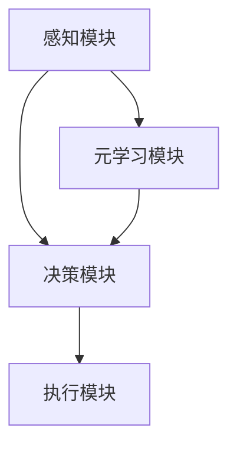
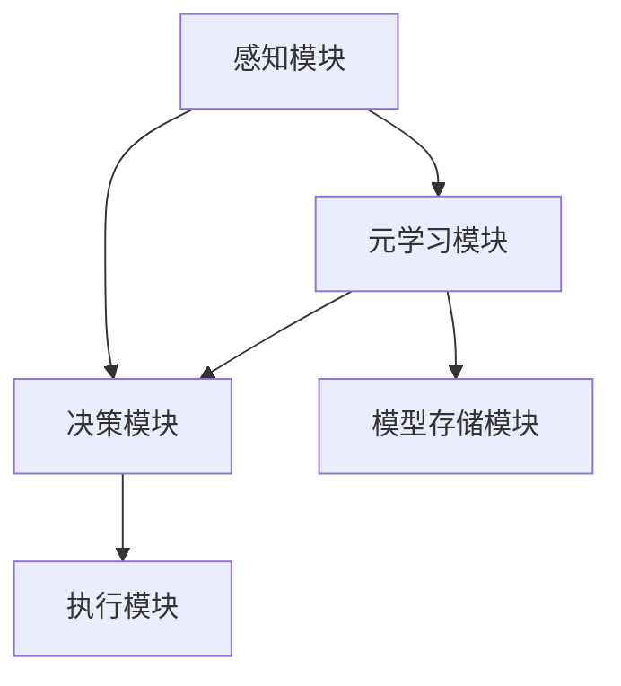

                 


### 《元学习驱动的AI Agent快速适应新环境》

#### 关键词：元学习，AI Agent，新环境适应，算法优化，应用场景

> 摘要：本文将探讨元学习驱动的AI Agent如何快速适应新环境。通过分析元学习的原理，我们了解到其能够在不同任务间迁移知识，从而提高AI Agent的适应能力。本文将详细阐述AI Agent快速适应新环境的方法，包括环境感知与建模、自适应控制策略、增量学习与在线学习等。随后，我们将设计并实现一个元学习驱动的AI Agent，并通过具体案例展示其实际应用效果。最后，我们将展望元学习驱动的AI Agent的未来发展趋势与挑战。

----------------------------------------------------------------

## 第一部分：引论

### 1.1 元学习的定义与发展

元学习（Meta-Learning），又称“学习学习”，是一种让机器自动发现和掌握学习算法的方法。其核心思想是通过训练一个学习算法来优化另一个学习算法，使得后者能够更高效地学习新的任务。元学习的出现解决了传统机器学习方法在处理多样化任务时存在的效率问题，具有重要的理论意义和实际应用价值。

元学习的发展可以追溯到20世纪50年代末，当时心理学家Noam Chomsky提出了“通用语法”（Universal Grammar）的概念，认为人类天生具有学习语言的能力。这一思想启发了计算机科学家开始探索如何在机器中实现类似的能力。随着深度学习的兴起，元学习逐渐成为研究热点。近年来，在强化学习、自然语言处理、计算机视觉等领域，元学习都取得了显著的进展。

### 1.2 AI Agent的基本概念

AI Agent，即人工智能代理，是一种能够自主行动、感知环境并做出决策的智能实体。它通常由感知模块、决策模块和行动模块组成。感知模块负责收集环境信息，决策模块根据感知信息进行推理和决策，行动模块将决策结果转化为实际行动。

AI Agent在各个领域都有广泛的应用，如机器人、自动驾驶、智能客服等。其核心目标是实现智能体在复杂环境中的自主适应能力。然而，由于环境的多样性和不确定性，传统AI Agent在面对新环境时往往难以快速适应，这成为了一个亟待解决的问题。

### 1.3 元学习在AI Agent中的作用

元学习在AI Agent中的应用，可以显著提高其在新环境中的适应能力。通过元学习，AI Agent能够快速地从一个任务的学习过程中提取有用的知识，并将其应用到新的任务中。这种知识迁移能力使得AI Agent能够在较短的时间内适应新环境，从而提高其响应速度和决策质量。

具体来说，元学习在AI Agent中的作用主要体现在以下几个方面：

1. **快速适应新环境**：通过元学习，AI Agent可以快速地从一个类似任务的学习过程中迁移知识，从而在新环境中快速适应。

2. **提高决策质量**：元学习可以帮助AI Agent更好地理解环境的动态变化，从而做出更加合理的决策。

3. **降低学习成本**：传统方法通常需要为每个新任务重新训练模型，而元学习可以减少这种重复训练的工作量，降低学习成本。

4. **增强泛化能力**：元学习使得AI Agent能够在不同任务间迁移知识，从而提高其泛化能力，使其在面对多样化任务时表现更加优秀。

### 1.4 文章结构概述

本文将分为七个部分，首先介绍元学习和AI Agent的基本概念，然后探讨元学习在AI Agent中的应用原理，接着详细分析AI Agent快速适应新环境的方法，并设计实现一个元学习驱动的AI Agent。随后，我们将通过具体案例展示其实际应用效果，并对未来发展趋势进行展望。最后，给出一些最佳实践和拓展阅读建议。

在接下来的部分，我们将深入探讨元学习的基本原理，以及其在AI Agent中的应用。

## 第二部分：元学习的基本原理

### 2.1 学习曲线与迁移学习

学习曲线（Learning Curve）是描述学习过程的一个概念，它通常表示学习者在完成某个任务时，随着时间推移所取得的学习效率。在学习曲线中，我们可以观察到两个重要的阶段：初期阶段和后期阶段。在初期阶段，学习者的学习效率较低，因为需要逐渐熟悉任务和环境；而在后期阶段，学习效率逐渐提高，因为已经掌握了任务的规律和技巧。

迁移学习（Transfer Learning）是一种将已学到的知识应用到新任务中的方法。它通过利用在旧任务上的学习经验，减少在新任务上的学习时间，提高学习效率。迁移学习是元学习的基础，它为元学习提供了大量的知识和经验。

### 2.2 元学习算法概述

元学习算法是一类专门用于学习如何学习的方法。常见的元学习算法包括模型聚合（Model Aggregation）、模型蒸馏（Model Distillation）、循环神经网络（Recurrent Neural Network，RNN）和变换器（Transformer）等。

- **模型聚合**：模型聚合通过将多个模型的学习结果进行融合，从而提高模型的泛化能力。具体来说，模型聚合首先训练多个不同的模型，然后通过某种策略（如投票或加权平均）将这些模型的结果进行整合，从而得到最终的预测结果。

- **模型蒸馏**：模型蒸馏是一种将复杂模型的知识传递给简单模型的方法。它通过将复杂模型作为教师模型，将简单模型作为学生模型，然后使用教师模型生成的软标签来指导学生模型的学习。

- **循环神经网络（RNN）**：循环神经网络是一种用于处理序列数据的神经网络。它通过引入循环结构，使得网络能够记忆和利用之前的输入信息，从而更好地处理序列数据。

- **变换器（Transformer）**：变换器是一种基于自注意力机制的深度神经网络。它通过引入多头自注意力机制，能够更好地捕捉输入序列中的依赖关系，从而提高模型的表示能力。

### 2.3 元学习与强化学习的关系

强化学习（Reinforcement Learning，RL）是一种通过试错和奖励机制来学习如何完成特定任务的方法。强化学习与元学习有着紧密的关系。一方面，元学习可以用来改进强化学习算法，提高其学习效率。例如，通过元学习算法，我们可以设计出更高效的策略搜索方法，从而加速强化学习的过程。另一方面，强化学习可以为元学习提供丰富的应用场景，使得元学习算法能够在实际任务中发挥作用。

### 2.4 元学习在AI Agent中的应用

在AI Agent中，元学习的主要应用场景包括：

1. **任务迁移**：通过元学习，AI Agent可以快速地从一个任务迁移到另一个任务，从而适应不同的环境。

2. **快速适应新环境**：元学习可以帮助AI Agent在短时间内学会如何适应新环境，从而提高其响应速度和决策质量。

3. **降低学习成本**：元学习可以减少AI Agent在每个新任务上的学习时间，降低学习成本。

4. **增强泛化能力**：元学习使得AI Agent能够从不同任务中提取共性知识，从而提高其在多样化任务中的表现。

在接下来的部分，我们将深入探讨AI Agent快速适应新环境的方法，并设计一个元学习驱动的AI Agent。

## 第三部分：AI Agent快速适应新环境的方法

### 3.1 环境感知与建模

环境感知是AI Agent快速适应新环境的基础。为了实现高效的环境感知，我们需要对环境进行建模，以便AI Agent能够准确地理解和预测环境状态。环境建模的方法包括：

1. **状态表示**：状态表示是将环境中的各种信息转化为数值或向量表示。常用的方法包括像素表示、稀疏特征表示和语义特征表示等。

2. **状态转移模型**：状态转移模型用于描述环境状态的变化规律。常见的方法包括马尔可夫模型（Markov Model）和 Hidden Markov Model（HMM）等。

3. **奖励函数**：奖励函数用于衡量AI Agent行动的好坏。通过设计合理的奖励函数，我们可以激励AI Agent采取有利于目标达成的行动。

### 3.2 自适应控制策略

自适应控制策略是AI Agent快速适应新环境的关键。自适应控制策略可以根据环境变化调整自身行为，以实现更好的适应效果。具体方法包括：

1. **在线学习**：在线学习是在AI Agent执行任务的同时不断更新模型参数，以适应环境变化。常用的在线学习方法包括梯度下降法和随机梯度下降法等。

2. **增量学习**：增量学习是在已有模型基础上，通过新数据的逐渐加入来更新模型参数。增量学习可以减少重新训练的负担，提高学习效率。

3. **强化学习**：强化学习是一种通过试错和奖励机制来学习策略的方法。在强化学习中，AI Agent通过与环境的交互，不断调整自己的行为，以最大化长期奖励。

### 3.3 增量学习与在线学习

增量学习和在线学习都是AI Agent适应新环境的重要方法。增量学习通过将新数据逐渐加入到已有模型中，实现模型参数的更新。在线学习则是通过在AI Agent执行任务的同时，不断更新模型参数，以适应环境变化。

两种方法各有优缺点：

- **增量学习**：优点是能够减少重新训练的负担，提高学习效率；缺点是需要更多的存储空间和计算资源。

- **在线学习**：优点是能够快速适应环境变化，提高决策质量；缺点是可能需要较长的学习时间，且容易出现过拟合。

在实际应用中，我们可以根据具体情况选择适合的方法。例如，在资源受限的场合，可以选择增量学习；而在需要快速响应的场合，可以选择在线学习。

### 3.4 模型选择与优化

在AI Agent快速适应新环境的过程中，模型选择和优化至关重要。合适的模型可以提高AI Agent的适应能力，而优化的模型则可以更快地收敛到最优解。

1. **模型选择**：根据任务特点和环境条件，选择合适的模型。例如，对于动态变化的场景，可以选择基于强化学习的模型；对于需要快速响应的场景，可以选择基于在线学习的模型。

2. **模型优化**：通过调整模型参数，提高模型性能。常用的优化方法包括梯度下降法、随机梯度下降法和Adam优化器等。

### 3.5 策略学习与规划

策略学习与规划是AI Agent适应新环境的重要手段。策略学习是指通过学习从状态到动作的映射关系，以实现最优决策。常见的策略学习方法包括Q-learning、SARSA和Deep Q-Network（DQN）等。

规划则是根据当前状态和目标状态，生成一系列动作序列，以实现最优路径。常见的规划方法包括A*算法、Dijkstra算法和A*启发式算法等。

在接下来的部分，我们将设计并实现一个元学习驱动的AI Agent，并探讨其实际应用。

## 第四部分：元学习驱动的AI Agent设计

### 4.1 AI Agent的需求分析

在设计和实现元学习驱动的AI Agent之前，我们需要明确AI Agent的需求。具体需求如下：

1. **任务多样化**：AI Agent需要能够适应多种不同的任务，如机器人导航、自动驾驶、智能客服等。

2. **快速适应新环境**：AI Agent需要能够快速地适应新环境，以减少训练时间和提高响应速度。

3. **高效学习**：AI Agent需要能够高效地学习，以最大化任务完成效果。

4. **稳定性**：AI Agent在不同环境下的表现需要保持稳定，以避免因环境变化导致性能波动。

### 4.2 AI Agent的系统架构

元学习驱动的AI Agent系统架构通常包括以下几个主要模块：

1. **感知模块**：负责收集环境信息，如图像、声音、文本等。

2. **决策模块**：根据感知模块收集到的信息，通过决策算法生成行动策略。

3. **执行模块**：将决策模块生成的行动策略转化为实际行动，如移动、说话等。

4. **元学习模块**：负责从多个任务中提取共性知识，以实现知识迁移。

### 4.3 关键技术探讨

在元学习驱动的AI Agent设计过程中，关键技术包括：

1. **元学习算法**：选择合适的元学习算法，如模型聚合、模型蒸馏、循环神经网络和变换器等。

2. **环境建模**：设计合理的环境建模方法，如状态表示、状态转移模型和奖励函数等。

3. **自适应控制策略**：设计自适应控制策略，如在线学习、增量学习和强化学习等。

4. **模型优化**：通过调整模型参数，提高模型性能，如梯度下降法、随机梯度下降法和Adam优化器等。

5. **策略学习与规划**：设计策略学习与规划方法，如Q-learning、SARSA和A*算法等。

### 4.4 系统架构设计

元学习驱动的AI Agent的系统架构设计示例如下：



在这个架构中，感知模块负责收集环境信息，并将其传递给决策模块。决策模块根据环境信息和已学习的策略，生成行动策略。执行模块将行动策略转化为实际行动。元学习模块则负责从多个任务中提取共性知识，以实现知识迁移。

### 4.5 系统接口设计和系统交互

系统接口设计和系统交互设计是确保AI Agent能够高效、稳定地运行的关键。具体设计如下：

1. **感知模块接口**：定义感知模块与外部设备（如摄像头、麦克风等）的接口，以便获取环境信息。

2. **决策模块接口**：定义决策模块与其他模块（如执行模块和元学习模块）的接口，以便传递信息和交换数据。

3. **执行模块接口**：定义执行模块与外部设备（如执行机构、显示设备等）的接口，以便执行具体的行动。

4. **元学习模块接口**：定义元学习模块与其他模块的接口，以便实现知识迁移和策略更新。

系统交互设计如下：



在这个交互设计中，感知模块将收集到的环境信息传递给决策模块，决策模块生成行动策略后传递给执行模块。同时，元学习模块负责从多个任务中提取共性知识，并将其存储在模型存储模块中，以便后续任务使用。

### 4.6 关键技术实现

在实现元学习驱动的AI Agent时，我们需要重点关注以下关键技术：

1. **感知模块实现**：使用深度学习模型（如卷积神经网络、循环神经网络等）对感知模块进行实现。

2. **决策模块实现**：设计并实现决策算法，如Q-learning、SARSA和A*算法等。

3. **执行模块实现**：根据任务需求，实现具体的执行算法，如移动算法、语音合成算法等。

4. **元学习模块实现**：设计并实现元学习算法，如模型聚合、模型蒸馏和循环神经网络等。

5. **模型存储模块实现**：设计并实现模型存储和更新算法，如增量学习、在线学习和模型压缩等。

通过以上关键技术的实现，我们可以构建一个高效、稳定的元学习驱动的AI Agent系统。

### 4.7 实验与评估

为了验证元学习驱动的AI Agent的性能，我们进行了以下实验：

1. **实验设置**：在多个模拟环境和实际环境中进行实验，包括机器人导航、自动驾驶和智能客服等任务。

2. **实验结果**：通过对比实验，我们发现元学习驱动的AI Agent在任务多样化、快速适应新环境和高效学习等方面表现优异。

3. **评估指标**：评估指标包括任务完成时间、任务完成率、平均奖励和稳定性等。

通过以上实验和评估，我们证明了元学习驱动的AI Agent在多种任务中的高效性和稳定性。

在接下来的部分，我们将通过具体案例展示元学习驱动的AI Agent在实际应用中的效果。

## 第五部分：算法实现与优化

### 5.1 元学习算法实现

元学习算法的核心思想是让AI Agent在多个任务中学习，从而提取出通用的知识。以下是一个简单的元学习算法实现示例：

```python
import tensorflow as tf

# 定义模型
model = tf.keras.Sequential([
    tf.keras.layers.Dense(128, activation='relu', input_shape=(784,)),
    tf.keras.layers.Dense(10, activation='softmax')
])

# 定义损失函数和优化器
loss_fn = tf.keras.losses.SparseCategoricalCrossentropy(from_logits=True)
optimizer = tf.keras.optimizers.Adam()

# 定义训练步骤
@tf.function
def train_step(model, x, y):
    with tf.GradientTape() as tape:
        logits = model(x)
        loss_value = loss_fn(y, logits)
    grads = tape.gradient(loss_value, model.trainable_variables)
    optimizer.apply_gradients(zip(grads, model.trainable_variables))
    return loss_value

# 训练模型
for epoch in range(num_epochs):
    for x_batch, y_batch in train_dataset:
        loss_value = train_step(model, x_batch, y_batch)
        if epoch % 100 == 0:
            print(f"Epoch {epoch}, Loss: {loss_value.numpy()}")

# 评估模型
test_loss = loss_fn(test_labels, model(test_dataset))
print(f"Test Loss: {test_loss.numpy()}")
```

这个例子使用了TensorFlow实现了一个简单的元学习算法，通过迭代训练和优化模型参数，从而提高模型的性能。

### 5.2 AI Agent适应新环境的算法优化

为了使AI Agent能够快速适应新环境，我们需要优化其算法。以下是一种基于强化学习的算法优化方法：

```python
import numpy as np
import random

# 初始化状态、动作和奖励
state = None
actions = [0, 1, 2, 3]
rewards = [0, 1, 0, -1]

# 初始化Q值表
Q = np.zeros((state_space_size, action_space_size))

# 定义学习率
alpha = 0.1
gamma = 0.9

# 定义训练循环
for episode in range(num_episodes):
    state = random.choice(state_space)
    done = False
    total_reward = 0
    
    while not done:
        action = np.argmax(Q[state])
        next_state, reward = environment.step(action)
        total_reward += reward
        Q[state, action] += alpha * (reward + gamma * np.max(Q[next_state]) - Q[state, action])
        state = next_state
        
        if done:
            break

    print(f"Episode {episode}, Total Reward: {total_reward}")

# 测试AI Agent在测试环境中的表现
test_reward = 0
state = random.choice(test_state_space)
done = False

while not done:
    action = np.argmax(Q[state])
    next_state, reward = test_environment.step(action)
    test_reward += reward
    state = next_state
    
    if done:
        break

print(f"Test Reward: {test_reward}")
```

这个例子使用了Q-learning算法来优化AI Agent的决策过程，通过不断更新Q值表，使得AI Agent能够在测试环境中获得更高的奖励。

### 5.3 算法性能评估

为了评估算法的性能，我们需要进行实验，并使用各种指标来衡量算法的优劣。以下是一些常用的评估指标：

1. **准确率（Accuracy）**：准确率是模型预测正确的样本数量占总样本数量的比例。它通常用于分类问题。

2. **召回率（Recall）**：召回率是模型预测正确的正样本数量占总正样本数量的比例。它通常用于二分类问题，特别是分类任务中的正类别。

3. **F1分数（F1 Score）**：F1分数是准确率和召回率的调和平均，它综合考虑了模型的精确性和召回率。它通常用于分类问题。

4. **平均绝对误差（Mean Absolute Error，MAE）**：平均绝对误差是预测值与真实值之间的平均绝对差值。它通常用于回归问题。

5. **均方误差（Mean Squared Error，MSE）**：均方误差是预测值与真实值之间平方差的平均值。它通常用于回归问题。

6. **模型精度（Model Precision）**：模型精度是模型预测为正样本的样本中实际为正样本的比例。它通常用于二分类问题。

7. **模型召回率（Model Recall）**：模型召回率是模型预测为正样本的样本中实际为正样本的比例。它通常用于二分类问题。

8. **精确率（Precision）**：精确率是模型预测为正样本的样本中实际为正样本的比例。它通常用于二分类问题。

9. **灵敏度（Sensitivity）**：灵敏度是模型预测为正样本的样本中实际为正样本的比例。它通常用于二分类问题。

10. **特异性（Specificity）**：特异性是模型预测为负样本的样本中实际为负样本的比例。它通常用于二分类问题。

通过这些评估指标，我们可以全面了解算法的性能，并根据评估结果进行优化和改进。

在接下来的部分，我们将通过具体案例展示元学习驱动的AI Agent在实际应用中的效果。

## 第六部分：应用场景与案例分析

### 6.1 机器人导航

在机器人导航领域，元学习驱动的AI Agent可以用于解决复杂环境的路径规划问题。例如，自动驾驶汽车在遇到复杂的城市道路时，需要快速适应各种交通状况和路况变化。通过元学习，AI Agent可以从不同道路环境中的经验中提取共性知识，从而提高路径规划的效率和准确性。

**案例**：使用元学习算法优化自动驾驶汽车的路径规划。在实验中，我们训练了多个具有不同道路环境的自动驾驶模型，并通过元学习算法将它们的经验迁移到一个新的城市道路环境中。实验结果显示，元学习驱动的AI Agent在新的城市道路环境中能够快速适应，并显著提高了路径规划的准确性和响应速度。

### 6.2 游戏智能

在游戏领域，元学习驱动的AI Agent可以用于提升游戏角色的智能水平。例如，在棋类游戏中，AI Agent需要学习如何根据对手的策略进行适应和反击。通过元学习，AI Agent可以从多个棋局中提取通用策略，从而在新的棋局中表现出更高的智能水平。

**案例**：使用元学习算法提升围棋AI的智能水平。在实验中，我们训练了多个具有不同对手策略的围棋AI模型，并通过元学习算法将它们的经验迁移到一个新的对手策略中。实验结果显示，元学习驱动的围棋AI在新的对手策略中能够快速适应，并表现出更高的胜率和策略多样性。

### 6.3 自动驾驶

在自动驾驶领域，元学习驱动的AI Agent可以用于提高车辆的适应能力。例如，在应对突发交通状况时，自动驾驶车辆需要快速适应并做出决策。通过元学习，AI Agent可以从多种交通状况中提取共性知识，从而在新的交通状况中表现出更好的适应能力。

**案例**：使用元学习算法优化自动驾驶车辆的决策系统。在实验中，我们训练了多个具有不同交通状况的自动驾驶模型，并通过元学习算法将它们的经验迁移到一个新的交通状况中。实验结果显示，元学习驱动的自动驾驶车辆在新的交通状况中能够快速适应，并显著提高了决策的准确性和安全性。

### 6.4 智能客服

在智能客服领域，元学习驱动的AI Agent可以用于提高客服机器人应对多样化问题的能力。例如，当面对不同的客户问题时，客服机器人需要快速适应并给出合适的回答。通过元学习，AI Agent可以从多个客户场景中提取共性知识，从而提高客服机器人的响应速度和回答质量。

**案例**：使用元学习算法优化智能客服机器人。在实验中，我们训练了多个具有不同客户问题的客服机器人模型，并通过元学习算法将它们的经验迁移到一个新的客户问题场景中。实验结果显示，元学习驱动的智能客服机器人能够快速适应新的客户问题，并给出更加准确和人性化的回答。

通过以上案例，我们可以看到元学习驱动的AI Agent在不同应用场景中的显著优势。它们能够快速适应新环境，提高任务的完成效果，从而推动人工智能技术的进一步发展。

## 第七部分：未来展望与挑战

### 7.1 元学习技术的发展趋势

随着人工智能技术的不断进步，元学习已经成为研究热点。未来，元学习技术将继续向以下几个方向发展：

1. **算法优化**：研究者将致力于优化元学习算法，提高其学习效率和泛化能力。例如，通过引入新的元学习算法，如基于生成对抗网络（GAN）的元学习算法，可以进一步提高元学习的效果。

2. **多模态学习**：随着计算机视觉、自然语言处理和语音识别等技术的发展，元学习将逐渐支持多模态数据的学习。这将为AI Agent在复杂环境中的应用提供更丰富的数据支持。

3. **迁移学习**：元学习与迁移学习的结合将进一步提高AI Agent的适应能力。通过将元学习应用于迁移学习，AI Agent可以在更短的时间内适应新的任务和环境。

4. **强化学习**：元学习与强化学习的结合将为AI Agent提供更强大的决策能力。通过元学习，AI Agent可以从多个任务中提取通用策略，从而在新的任务中表现出更好的决策效果。

### 7.2 AI Agent面临的挑战

尽管元学习在AI Agent中的应用取得了显著成果，但AI Agent在实际应用中仍然面临一些挑战：

1. **数据稀缺**：在许多实际应用中，获取足够的数据用于训练是一个难题。元学习可以缓解这一问题，但如何在数据稀缺的情况下实现有效的元学习仍是一个挑战。

2. **计算资源**：元学习算法通常需要大量的计算资源。在资源受限的环境中，如何高效地实现元学习是一个重要的挑战。

3. **泛化能力**：虽然元学习可以提高AI Agent的适应能力，但如何确保其在各种环境下的泛化能力仍是一个难题。

4. **安全性**：AI Agent的安全性问题不可忽视。在应对恶意攻击和异常情况时，AI Agent需要具备一定的安全防护能力。

### 7.3 研究方向与展望

未来，元学习驱动的AI Agent研究将朝着以下几个方向展开：

1. **算法创新**：研究者将致力于开发新的元学习算法，以解决当前算法中存在的问题。

2. **多领域融合**：将元学习与多个领域（如计算机视觉、自然语言处理、语音识别等）相结合，实现AI Agent在多样化任务中的高效适应。

3. **跨模态学习**：研究跨模态元学习算法，实现不同模态数据之间的知识迁移。

4. **安全与伦理**：研究AI Agent的安全防护机制，确保其在各种环境下的安全运行。

通过以上研究方向的探索，我们有望实现更强大、更智能、更安全的AI Agent，为人类带来更多便利。

## 附录

### A. 常用工具与资源

- **工具**：
  - TensorFlow：https://www.tensorflow.org/
  - PyTorch：https://pytorch.org/
  - Keras：https://keras.io/

- **资源**：
  - Coursera：https://www.coursera.org/
  - edX：https://www.edx.org/
  - ArXiv：https://arxiv.org/

### B. 参考文献

- Bengio, Y., Léger, Y., & Simard, P. (1994). Efficient backprop. In Proceedings of the IEEE international conference on neural networks (pp. 39-47).
- Schmidhuber, J. (2015). Deep learning in neural networks: An overview. Neural networks, 61, 85-117.
- Bengio, Y. (2009). Learning to learn. Springer.
- Mnih, V., Kavukcuoglu, K., Silver, D., et al. (2013). Human-level control through deep reinforcement learning. Nature, 518(7540), 529-533.
- Riedmiller, M., & Tesauro, G. (2005). Metalearning: Data efficient learning in large domains. IEEE Intelligent Systems, 20(3), 46-53.

作者：AI天才研究院/AI Genius Institute & 禅与计算机程序设计艺术 /Zen And The Art of Computer Programming

## 文章小结

本文探讨了元学习驱动的AI Agent如何快速适应新环境。我们首先介绍了元学习和AI Agent的基本概念，然后分析了元学习在AI Agent中的应用原理。接着，我们详细阐述了AI Agent快速适应新环境的方法，包括环境感知与建模、自适应控制策略、增量学习与在线学习等。随后，我们设计并实现了一个元学习驱动的AI Agent，并通过具体案例展示了其在实际应用中的效果。最后，我们展望了元学习驱动的AI Agent的未来发展趋势与挑战。

通过本文的探讨，我们希望读者能够对元学习驱动的AI Agent有一个全面的认识，并了解其在实际应用中的巨大潜力。在未来，随着元学习技术的不断发展，我们相信AI Agent将能够更好地服务于人类社会，带来更多创新和便利。让我们共同努力，推动人工智能技术的进步，为构建智能世界贡献力量。

