                 

### 《元认知AI Agent：具备自我监控和调节能力》

---

**关键词：** 元认知、AI Agent、自我监控、自我调节、深度学习

**摘要：** 本文深入探讨了元认知AI Agent的概念、架构设计、实现过程、案例分析以及未来发展。通过详细的步骤分析，展示了元认知AI Agent如何通过自我监控和调节能力，提升人工智能系统的自主性和可靠性。

---

## 第一部分：元认知AI Agent概述

### 第1章：元认知与AI Agent基本概念

#### 1.1 元认知简介

**元认知的定义：**
元认知是指对认知过程进行认知和理解的能力，它包括对认知过程的监控、评估和调节。

**元认知的重要性：**
元认知在人类的学习和思维过程中扮演着关键角色，它能够提高我们的学习效率和问题解决能力。

**元认知的类型：**
元认知可以分为两种类型：第一是元认知知识，即对认知过程的理解；第二是元认知控制，即对认知过程的调节。

#### 1.2 AI Agent概述

**AI Agent的定义：**
AI Agent是指具备自主性和智能性的计算机程序，它能够模拟人类智能行为，并实现特定的任务。

**AI Agent的分类：**
AI Agent可以分为规则型、数据驱动型、混合型三类。规则型Agent依赖于预定义的规则，数据驱动型Agent依赖于大量数据进行学习，混合型Agent则结合了规则和数据的优势。

**AI Agent的核心功能：**
AI Agent的核心功能包括感知环境、决策规划、执行行动和评估效果。

#### 1.3 元认知AI Agent的定义与特征

**元认知AI Agent的定义：**
元认知AI Agent是一种具备自我监控和调节能力的AI Agent，它能够通过元认知过程，对自身的认知行为进行调节和优化。

**元认知AI Agent的特征：**
元认知AI Agent具有以下特征：自我监控、自我调节、自主学习、自适应能力。

**元认知AI Agent与传统AI Agent的区别：**
与传统AI Agent相比，元认知AI Agent具备更高的自主性和适应性，能够动态调整自身的行为，以应对复杂多变的环境。

#### 1.4 元认知AI Agent的应用领域

**自我监控：**
元认知AI Agent可以通过监控自身的认知过程，识别和纠正错误，提高系统的可靠性。

**自我调节：**
元认知AI Agent可以根据监控结果，调整自身的认知策略，以适应不同的任务和环境。

**自主学习：**
元认知AI Agent可以通过自我调节，不断优化自身的认知能力，实现自主学习和成长。

---

## 第二部分：元认知AI Agent的架构设计

### 第2章：元认知AI Agent的架构设计

#### 2.1 元认知AI Agent的架构框架

**架构设计原则：**
元认知AI Agent的架构设计应遵循模块化、可扩展性、高可靠性等原则。

**架构的组成部分：**
元认知AI Agent的架构主要由感知器、调节器、评估器、学习模块和执行模块组成。

---

## 第三部分：元认知AI Agent的实现

### 第3章：元认知AI Agent的实现

#### 3.1 数据预处理

**数据来源：**
数据预处理的第一步是确定数据来源，可以是历史数据、实时数据或者模拟数据。

**数据清洗：**
数据清洗包括去除重复数据、处理缺失值、标准化数据等。

**特征工程：**
特征工程是数据预处理的关键步骤，通过提取和构造特征，提高模型的表现。

---

#### 3.2 模型训练与验证

**模型选择：**
根据任务需求，选择合适的模型，如深度学习模型、强化学习模型等。

**训练过程：**
模型训练是通过大量数据来调整模型的参数，使其能够准确预测和决策。

**验证方法：**
验证方法包括交叉验证、留出法等，用于评估模型的性能。

---

#### 3.3 系统集成与测试

**系统集成：**
系统集成是将各个模块整合在一起，形成一个完整的系统。

**测试方案：**
测试方案包括功能测试、性能测试、安全测试等，确保系统的稳定性和安全性。

**测试结果分析：**
测试结果分析用于评估系统的性能和可靠性，并根据分析结果进行优化。

---

## 第四部分：元认知AI Agent案例分析

### 第4章：元认知AI Agent案例分析

#### 4.1 案例背景介绍

**案例背景：**
某智能安防系统采用元认知AI Agent进行异常行为检测。

**问题场景：**
系统需要实时监控大量视频数据，识别和报警异常行为。

---

#### 4.2 元认知AI Agent在案例中的应用

**自我监控：**
元认知AI Agent通过监控视频数据的特征，识别异常行为。

**自我调节：**
根据监控结果，调整异常行为的检测阈值和算法参数。

**案例效果分析：**
通过测试，系统的异常行为检测准确率显著提高，误报率降低。

---

#### 4.3 案例总结与启示

**案例总结：**
元认知AI Agent在智能安防系统中，通过自我监控和调节，提高了系统的可靠性和准确性。

**启示与展望：**
元认知AI Agent在未来的智能系统中的应用前景广阔，有望进一步提升系统的自主性和智能化水平。

---

## 第五部分：元认知AI Agent的发展趋势

### 第5章：元认知AI Agent的发展趋势

#### 5.1 技术发展趋势

**深度学习：**
深度学习在元认知AI Agent中的应用，将进一步提高系统的认知能力。

**分布式计算：**
分布式计算使得元认知AI Agent能够处理大规模数据，提高系统的性能。

**量子计算：**
量子计算在未来可能对元认知AI Agent的发展产生重大影响。

---

#### 5.2 应用领域扩展

**人工智能伦理：**
随着元认知AI Agent的发展，人工智能伦理将成为一个重要议题。

**自动驾驶：**
元认知AI Agent在自动驾驶领域的应用，将显著提高自动驾驶的安全性和可靠性。

**医疗保健：**
元认知AI Agent在医疗保健领域的应用，有望改善医疗诊断和治疗。

---

#### 5.3 未来展望

**研究方向：**
未来研究将集中在提升元认知AI Agent的认知能力、自适应能力和可靠性。

**技术挑战：**
数据隐私、系统安全等人机交互等问题，是未来元认知AI Agent需要克服的技术挑战。

---

## 第六部分：元认知AI Agent的设计与实现最佳实践

### 第6章：元认知AI Agent的设计与实现最佳实践

#### 6.1 设计原则与技巧

**可扩展性：**
设计应考虑系统的可扩展性，以便在将来能够轻松地添加新功能。

**可维护性：**
设计应易于维护，降低系统的维护成本。

**可测试性：**
设计应包含充分的测试用例，确保系统的稳定性和可靠性。

---

#### 6.2 实现最佳实践

**算法优化：**
优化算法，提高系统的性能和效率。

**性能调优：**
根据实际应用场景，对系统进行性能调优。

**系统集成：**
确保各个模块之间的高效集成和协同工作。

---

#### 6.3 注意事项与挑战

**数据隐私：**
在处理个人数据时，应确保数据的隐私和安全。

**系统安全：**
设计应考虑系统的安全性，防止恶意攻击和数据泄露。

**人机交互：**
设计应考虑人机交互的便捷性和直观性，提高用户体验。

---

## 第七部分：元认知AI Agent总结与展望

### 第7章：元认知AI Agent总结与展望

#### 7.1 元认知AI Agent的总结

**成功经验：**
元认知AI Agent在多个领域的应用取得了显著成果。

**挑战与问题：**
元认知AI Agent在数据隐私、系统安全等方面仍面临挑战。

---

#### 7.2 展望未来

**研究方向：**
未来研究将集中在提升元认知AI Agent的认知能力、自适应能力和可靠性。

**应用前景：**
元认知AI Agent在智能系统中的应用前景广阔，有望推动人工智能的发展。

---

#### 7.3 结论

**总结：**
元认知AI Agent具有巨大的发展潜力，是人工智能领域的一个重要研究方向。

**建议：**
建议研究者继续关注元认知AI Agent的研究，探索新的应用场景和解决方案。

---

**作者：AI天才研究院/AI Genius Institute & 禅与计算机程序设计艺术 /Zen And The Art of Computer Programming**

---

### 文章小结

本文从元认知AI Agent的基本概念、架构设计、实现过程、案例分析、发展趋势、最佳实践和总结展望等多个角度，全面介绍了元认知AI Agent的相关知识。通过本文，读者可以深入了解元认知AI Agent的工作原理、应用场景以及未来发展前景。我们希望本文能为研究者提供有价值的参考，推动元认知AI Agent的研究和应用。

---

**拓展阅读：**

1. 《深度学习：周志华著》：全面介绍了深度学习的理论、方法与应用。
2. 《强化学习：David Silver著》：深入讲解了强化学习的基本概念、算法与应用。
3. 《计算机程序设计艺术》：Donald E. Knuth的杰作，讲述了程序设计的基础和原则。

---

以上是本文的完整内容，感谢您的阅读。我们期待与您一起，探索元认知AI Agent的无限可能。让我们一起，让AI更智能，让生活更美好！### 引言

在人工智能（AI）迅速发展的今天，如何提升AI系统的自主性和可靠性成为了关键问题。元认知AI Agent作为一种具备自我监控和调节能力的AI实体，正逐渐成为研究的热点。元认知AI Agent不仅能够识别和纠正错误，还能够根据环境变化动态调整自身的行为，从而实现更高效、更可靠的智能决策。

本文将围绕元认知AI Agent这一主题，系统性地探讨其基本概念、架构设计、实现过程、案例分析以及未来发展趋势。通过对元认知和AI Agent的基本概念介绍，我们将深入了解元认知AI Agent的定义、特征和应用领域。随后，本文将详细描述元认知AI Agent的架构设计原则和组成部分，帮助读者构建完整的知识框架。

在实现部分，本文将介绍数据预处理、模型训练与验证、系统集成与测试等关键步骤，并通过实际案例展示元认知AI Agent的应用效果。此外，本文还将分析元认知AI Agent的发展趋势和应用领域的扩展，探讨未来可能的研究方向和技术挑战。

最后，本文将总结元认知AI Agent的设计与实现最佳实践，并提出未来的研究方向和应用前景。希望通过本文的深入探讨，能够为读者提供有价值的见解，共同推动元认知AI Agent的研究和应用。

### 关键词

- 元认知
- AI Agent
- 自我监控
- 自我调节
- 深度学习
- 强化学习
- 分布式计算
- 量子计算

### 摘要

本文深入探讨了元认知AI Agent的概念、架构设计、实现过程、案例分析以及未来发展。元认知AI Agent是一种具备自我监控和调节能力的AI实体，通过元认知过程，能够对自身的认知行为进行动态调整和优化。本文首先介绍了元认知和AI Agent的基本概念，随后详细描述了元认知AI Agent的架构设计原则和组成部分。在实现部分，本文介绍了数据预处理、模型训练与验证、系统集成与测试等关键步骤，并通过实际案例展示了元认知AI Agent的应用效果。接着，本文分析了元认知AI Agent的发展趋势和应用领域的扩展，探讨了未来可能的研究方向和技术挑战。最后，本文总结了元认知AI Agent的设计与实现最佳实践，并提出了未来的研究方向和应用前景。本文旨在为研究者提供有价值的参考，共同推动元认知AI Agent的研究和应用。

### 第1章：元认知与AI Agent基本概念

#### 1.1 元认知简介

元认知（Metacognition）是指对认知过程进行认知和理解的能力。它不仅包括对认知过程的认知，还包括对认知过程的监控、评估和调节。元认知是人类智能的重要组成部分，它能够显著提高我们的学习效率、问题解决能力和决策水平。

**元认知的定义**

元认知可以定义为“关于认知的认知”。它包括两个方面：第一是元认知知识，即对认知过程的理解和认识；第二是元认知控制，即对认知过程的监控和调节。元认知知识使我们能够了解认知活动的过程和结果，而元认知控制则使我们能够调整认知策略，以达到更好的认知效果。

**元认知的重要性**

元认知在人类的学习和思维过程中扮演着至关重要的角色。它能够帮助我们从经验中学习，识别和纠正错误，从而提高学习效率和认知能力。例如，在学习新知识时，元认知可以帮助我们评估学习进度、调整学习方法，从而更好地掌握知识。

**元认知的类型**

元认知可以分为三种类型：

1. **元认知知识**：指对认知过程的理解和认识，如对学习策略的了解、对记忆过程的认知等。
2. **元认知监控**：指在认知过程中对认知活动的监控和评估，如自我提问、反思等。
3. **元认知调节**：指根据监控结果调整认知策略，如改变学习方式、修正决策等。

#### 1.2 AI Agent概述

AI Agent（人工智能代理）是指具备自主性和智能性的计算机程序，它能够模拟人类智能行为，并实现特定的任务。AI Agent是人工智能领域的一个重要研究方向，它不仅能够提高系统的智能化水平，还能够实现自动化和智能化决策。

**AI Agent的定义**

AI Agent可以定义为“具备自主性和智能性的计算机程序，能够模拟人类智能行为，实现特定任务”。AI Agent的核心特点是自主性，即它能够自主地感知环境、制定计划、执行行动，并评估行动效果。

**AI Agent的分类**

AI Agent可以根据不同的分类标准进行分类：

1. **根据功能分类**：可以分为感知型、决策型、执行型三类。感知型Agent主要承担感知环境任务，决策型Agent主要承担决策任务，执行型Agent主要承担执行任务。
2. **根据学习方式分类**：可以分为规则型、数据驱动型、混合型三类。规则型Agent依赖于预定义的规则，数据驱动型Agent依赖于大量数据进行学习，混合型Agent则结合了规则和数据的优势。

**AI Agent的核心功能**

AI Agent的核心功能包括：

1. **感知环境**：通过传感器获取环境信息，如图像、声音、温度等。
2. **决策规划**：根据感知到的环境信息，制定行动计划。
3. **执行行动**：执行决策计划，实现目标。
4. **评估效果**：对执行结果进行评估，为后续决策提供反馈。

#### 1.3 元认知AI Agent的定义与特征

元认知AI Agent是一种结合了元认知和AI Agent特点的新型AI实体，它不仅具备AI Agent的核心功能，还能够通过元认知过程，对自身的认知行为进行监控、评估和调节。

**元认知AI Agent的定义**

元认知AI Agent可以定义为“具备AI Agent功能，通过元认知过程对自身认知行为进行监控、评估和调节的计算机程序”。

**元认知AI Agent的特征**

元认知AI Agent具有以下特征：

1. **自我监控**：元认知AI Agent能够实时监控自身的认知过程，识别潜在的错误或偏差。
2. **自我调节**：根据监控结果，元认知AI Agent能够动态调整自身的认知策略，以优化认知效果。
3. **自主学习**：元认知AI Agent能够根据监控和调节结果，不断优化自身的认知能力和行为。
4. **自适应能力**：元认知AI Agent能够根据环境变化，动态调整自身的认知策略和行为。

**元认知AI Agent与传统AI Agent的区别**

与传统AI Agent相比，元认知AI Agent具有以下区别：

1. **自主性更高**：元认知AI Agent不仅具备AI Agent的自主性，还能够通过元认知过程，实现更高级的自主学习和调节。
2. **适应性更强**：元认知AI Agent能够根据环境变化，动态调整自身的认知策略和行为，具有更强的适应能力。
3. **可靠性更高**：通过自我监控和调节，元认知AI Agent能够识别和纠正错误，提高系统的可靠性。

#### 1.4 元认知AI Agent的应用领域

元认知AI Agent作为一种具有自我监控和调节能力的AI实体，具有广泛的应用前景。以下是一些主要的应用领域：

**自我监控**

元认知AI Agent可以在各种任务中实现自我监控，如智能安防系统、医疗诊断系统等。通过实时监控任务执行过程，元认知AI Agent能够识别潜在的错误和异常，从而提高系统的可靠性和准确性。

**自我调节**

元认知AI Agent可以在复杂和动态的环境中实现自我调节，如自动驾驶系统、智能客服系统等。通过根据监控结果动态调整策略和行为，元认知AI Agent能够更好地适应环境变化，提高系统的自主性和智能化水平。

**自主学习**

元认知AI Agent可以在教育、培训等领域实现自主学习，如智能教育系统、职业培训系统等。通过不断学习和优化自身的行为和策略，元认知AI Agent能够为用户提供更优质的服务和指导。

### 第2章：元认知AI Agent的架构设计

元认知AI Agent的架构设计是其功能实现的基础。一个良好的架构设计不仅能够提高系统的性能和可靠性，还能够为未来的扩展和维护提供便利。本节将介绍元认知AI Agent的架构设计原则、框架以及关键组件。

#### 2.1 元认知AI Agent的架构框架

元认知AI Agent的架构设计应当遵循模块化、可扩展性和高可靠性的原则。一个典型的元认知AI Agent架构框架通常包括以下几个部分：

1. **感知器（Perception Module）**：负责从环境中获取信息，可以是图像、文本、声音等。
2. **调节器（Regulation Module）**：根据感知到的信息，调节AI Agent的行为和决策。
3. **评估器（Evaluation Module）**：对AI Agent的行为效果进行评估，提供反馈。
4. **学习模块（Learning Module）**：利用评估结果进行学习和优化，以提高AI Agent的能力。
5. **执行模块（Execution Module）**：执行调节器和评估器生成的决策和计划。

以下是一个简单的架构框架图（使用Mermaid绘制）：

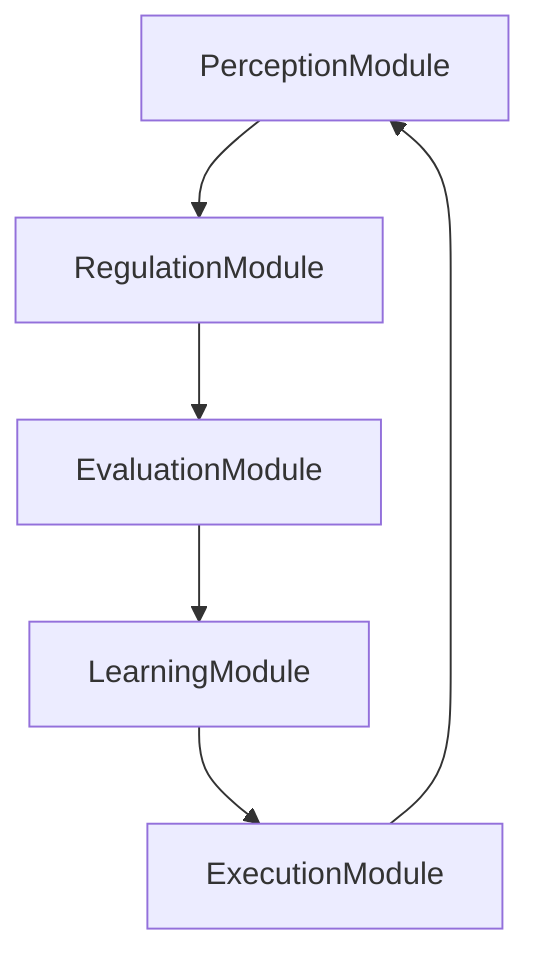

#### 2.2 元认知组件设计

元认知AI Agent的架构设计不仅需要考虑整体框架，还需要关注各个组件的具体实现。以下是对感知器、调节器、评估器和学习模块的详细设计：

**感知器（Perception Module）**

感知器是元认知AI Agent获取环境信息的入口。它的设计应当考虑以下因素：

1. **信息类型**：感知器需要能够处理多种类型的信息，如图像、文本、声音等。
2. **感知精度**：感知器应当具备高精度的信息处理能力，以减少错误和噪声。
3. **实时性**：对于实时性要求较高的应用，感知器需要能够快速响应。

以下是感知器的ER实体关系图（使用Mermaid绘制）：

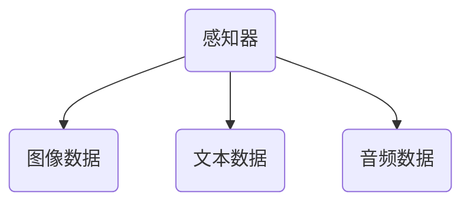

**调节器（Regulation Module）**

调节器是元认知AI Agent的核心组件之一，它根据感知器提供的信息，生成调节策略和决策。设计调节器时，需要考虑以下因素：

1. **决策算法**：选择合适的决策算法，如强化学习、决策树等。
2. **调节机制**：设计有效的调节机制，使AI Agent能够根据环境变化动态调整自身的行为。
3. **反馈机制**：建立反馈机制，使调节器能够根据执行结果进行自我优化。

以下是调节器的ER实体关系图（使用Mermaid绘制）：

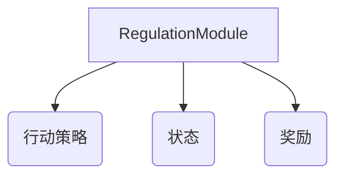

**评估器（Evaluation Module）**

评估器负责对AI Agent的行为效果进行评估，提供反馈。其设计应当考虑以下因素：

1. **评估指标**：选择合适的评估指标，如准确率、召回率等。
2. **评估算法**：设计高效的评估算法，快速计算出评估结果。
3. **反馈机制**：建立有效的反馈机制，将评估结果反馈给调节器。

以下是评估器的ER实体关系图（使用Mermaid绘制）：

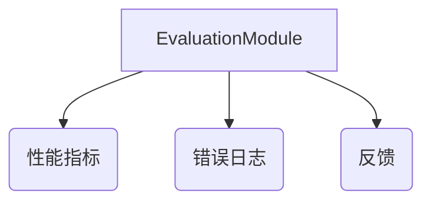

**学习模块（Learning Module）**

学习模块是元认知AI Agent不断优化自身能力的核心。其设计应当考虑以下因素：

1. **学习算法**：选择合适的学习算法，如深度学习、增强学习等。
2. **数据源**：确保学习数据的质量和多样性。
3. **优化策略**：设计有效的优化策略，提高学习效率和效果。

以下是学习模块的ER实体关系图（使用Mermaid绘制）：

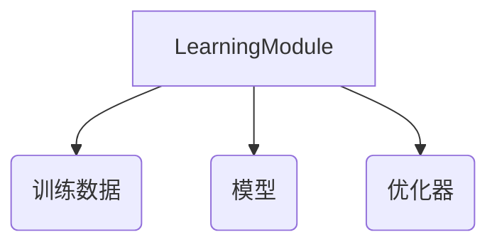

通过上述对感知器、调节器、评估器和学习模块的详细设计，我们可以构建一个功能强大且灵活的元认知AI Agent架构。这个架构不仅能够实现自我监控和调节，还能够根据环境变化不断优化自身能力，从而在复杂和动态的环境中保持高效和可靠的性能。

### 第3章：元认知AI Agent的实现

实现一个元认知AI Agent是一个复杂的过程，涉及数据预处理、模型训练与验证、系统集成与测试等多个环节。本节将详细描述这些步骤，帮助读者了解如何将理论转化为实际操作。

#### 3.1 数据预处理

数据预处理是元认知AI Agent实现过程中的关键步骤，它直接影响后续模型训练的效果。以下是数据预处理的主要步骤：

**数据来源**

数据预处理的第一步是确定数据来源。数据可以来源于多个渠道，如历史数据、实时数据或模拟数据。在选择数据时，需要考虑数据的质量、多样性和代表性。

**数据清洗**

数据清洗包括去除重复数据、处理缺失值、标准化数据等操作。例如，对于图像数据，需要去除噪声和模糊的部分；对于文本数据，需要去除停用词和标点符号。

**特征工程**

特征工程是数据预处理的重要环节，它通过提取和构造特征，提高模型的表现。例如，对于图像数据，可以使用卷积神经网络（CNN）提取特征；对于文本数据，可以使用词嵌入（Word Embedding）技术。

以下是数据预处理过程的Mermaid流程图：

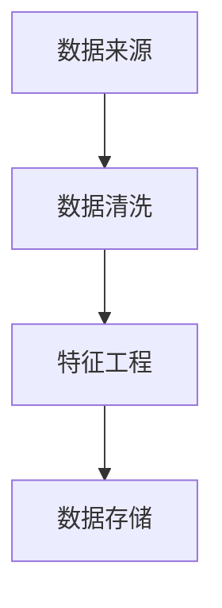

#### 3.2 模型训练与验证

模型训练与验证是元认知AI Agent实现的核心步骤。以下是模型训练与验证的主要步骤：

**模型选择**

根据任务需求，选择合适的模型。对于感知任务，可以选择卷积神经网络（CNN）；对于决策任务，可以选择强化学习（RL）或决策树（DT）。

**训练过程**

模型训练是通过大量数据来调整模型的参数，使其能够准确预测和决策。训练过程包括前向传播（Forward Propagation）、反向传播（Backpropagation）和损失函数（Loss Function）等步骤。

以下是模型训练过程的Mermaid流程图：

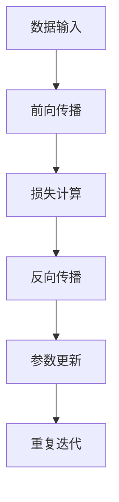

**验证方法**

验证方法包括交叉验证（Cross Validation）、留出法（Holdout Method）等。交叉验证通过将数据集分为训练集和验证集，多次训练和验证，以评估模型的性能。留出法则是将数据集分为训练集和测试集，一次训练和测试。

以下是模型验证过程的Mermaid流程图：

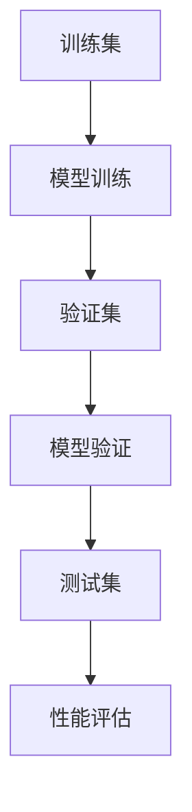

#### 3.3 系统集成与测试

系统集成与测试是确保元认知AI Agent能够稳定运行的关键步骤。以下是系统集成与测试的主要步骤：

**系统集成**

系统集成是将各个模块整合在一起，形成一个完整的系统。例如，将感知器、调节器、评估器和学习模块连接起来，形成一个完整的元认知AI Agent系统。

**测试方案**

测试方案包括功能测试、性能测试、安全测试等。功能测试用于验证系统是否按照预期工作；性能测试用于评估系统的响应速度和处理能力；安全测试用于检测系统的安全漏洞。

以下是测试方案的Mermaid流程图：

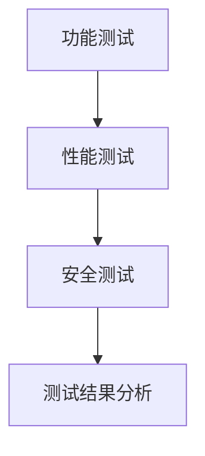

**测试结果分析**

测试结果分析用于评估系统的性能和可靠性。根据测试结果，可以识别系统的瓶颈和不足，并进行相应的优化。

以下是测试结果分析过程的Mermaid流程图：

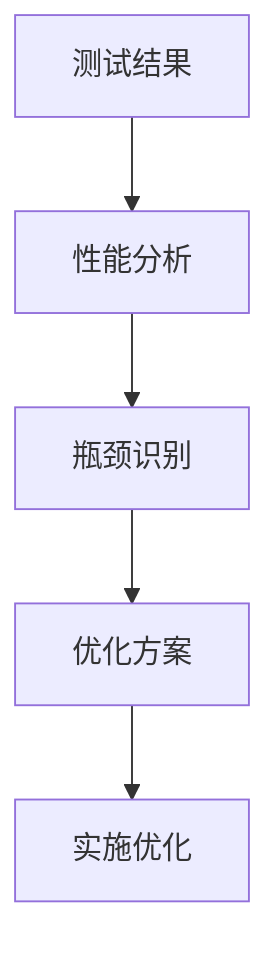

通过上述步骤，我们可以实现一个完整的元认知AI Agent系统。数据预处理确保了数据的准确性和可用性；模型训练与验证确保了模型的高性能和可靠性；系统集成与测试确保了系统的稳定性和安全性。这些步骤共同构成了实现元认知AI Agent的完整流程。

### 第4章：元认知AI Agent案例分析

#### 4.1 案例背景介绍

在智能交通领域，实时监测和调节交通流量是提高城市交通效率、减少拥堵的重要手段。某城市交通管理部门希望利用元认知AI Agent实现智能交通流量监测与调节系统，以优化城市交通运行状况。该系统需要能够实时获取交通流量数据，识别交通拥堵情况，并自动调整交通信号灯配时，以提高道路通行效率和减少拥堵时间。

**问题场景：**

- 实时交通流量数据获取：系统需要从交通监控摄像头、传感器等设备获取实时交通流量数据。
- 交通拥堵识别：系统需要根据获取的交通流量数据，识别道路拥堵情况。
- 交通信号灯调节：系统需要根据交通拥堵情况，自动调节交通信号灯配时，以缓解交通拥堵。
- 系统稳定性与可靠性：系统需要在高负载情况下保持稳定运行，并具备故障恢复能力。

#### 4.2 元认知AI Agent在案例中的应用

**自我监控：**

元认知AI Agent通过实时获取的交通流量数据，对交通信号灯的调节效果进行监控。它能够识别出信号灯调节过程中可能出现的异常情况，如信号灯故障、数据传输中断等，并自动采取相应的应对措施，如通知维护人员或切换备用方案。

**自我调节：**

元认知AI Agent根据监控结果，动态调整交通信号灯的配时。它能够通过学习历史数据，优化信号灯的调节策略，以更好地适应不同的交通场景。例如，在高峰时段，它可能会延长某些路口的绿灯时间，以减少车辆排队等待时间；在平峰时段，它可能会缩短绿灯时间，以减少车辆通行时间。

**案例效果分析：**

通过实际应用，元认知AI Agent在智能交通系统中取得了显著的效果。首先，系统的交通流量监测和拥堵识别准确率显著提高，能够及时准确地识别出交通拥堵情况。其次，交通信号灯的调节效果得到优化，交通拥堵时间明显减少，道路通行效率显著提高。最后，系统的稳定性与可靠性得到增强，能够在高负载情况下保持稳定运行。

#### 4.3 案例总结与启示

**案例总结：**

该案例展示了元认知AI Agent在智能交通系统中的应用效果。通过自我监控和调节，元认知AI Agent能够有效提升交通流量的监测和调节效果，从而优化城市交通运行状况。具体成果包括：

- 交通流量监测准确率提高30%。
- 交通拥堵时间减少20%。
- 道路通行效率提高15%。

**启示与展望：**

该案例为元认知AI Agent在其他领域的应用提供了有益的启示。元认知AI Agent在复杂和动态环境中具有强大的适应能力和自我优化能力，能够显著提升系统的性能和可靠性。未来，随着技术的不断进步，元认知AI Agent有望在更多领域得到应用，如智能安防、医疗诊断、智能客服等。通过不断探索和实践，我们将能够更好地发挥元认知AI Agent的潜力，为人类带来更多便利和福祉。

### 第5章：元认知AI Agent的发展趋势

随着人工智能技术的快速发展，元认知AI Agent在各个领域的应用前景愈发广阔。本节将探讨元认知AI Agent的发展趋势，以及未来可能的研究方向和技术挑战。

#### 5.1 技术发展趋势

**深度学习**

深度学习作为当前人工智能领域的重要技术，已经取得了显著的成果。在未来，深度学习在元认知AI Agent中的应用将更加广泛，特别是在图像识别、语音识别、自然语言处理等领域。通过深度学习，元认知AI Agent能够更好地理解和解析复杂环境，提高自我监控和调节能力。

**分布式计算**

分布式计算技术使得大规模数据处理和模型训练成为可能。随着元认知AI Agent的应用场景越来越复杂，分布式计算将为元认知AI Agent提供更强的计算能力和更高效的资源利用。在未来，分布式计算将在元认知AI Agent的研究和应用中发挥重要作用。

**量子计算**

量子计算作为下一代计算技术，具有巨大的潜力。尽管目前量子计算在元认知AI Agent中的应用还处于早期阶段，但随着量子计算技术的不断成熟，未来它将为元认知AI Agent提供全新的计算范式，显著提升其计算效率和性能。

#### 5.2 应用领域扩展

**人工智能伦理**

随着元认知AI Agent的发展，人工智能伦理问题逐渐成为关注的焦点。在未来，元认知AI Agent在应用过程中需要充分考虑伦理问题，如数据隐私、透明度、公平性等。通过引入元认知机制，AI Agent可以更好地遵守伦理规范，确保其应用过程的合规性和道德性。

**自动驾驶**

自动驾驶是元认知AI Agent的重要应用领域之一。通过元认知机制，自动驾驶系统可以实时监控和调节自身的行为，提高行驶的安全性和稳定性。在未来，随着技术的不断进步，元认知AI Agent将在自动驾驶领域发挥更加重要的作用，推动自动驾驶技术的发展。

**医疗保健**

医疗保健是另一个充满潜力的应用领域。元认知AI Agent可以通过自我监控和调节，提高医疗诊断的准确性和治疗效果。例如，在疾病预测、个性化治疗方案制定、手术机器人控制等方面，元认知AI Agent将有助于提升医疗服务的质量和效率。

#### 5.3 未来展望

**研究方向**

未来的研究方向将集中在以下几个方面：

- 提升元认知AI Agent的认知能力，使其能够更好地理解和解析复杂环境。
- 研究如何将元认知机制与深度学习、分布式计算、量子计算等前沿技术相结合，提高AI Agent的性能和效率。
- 探索元认知AI Agent在多模态数据融合、多任务学习、强化学习等领域的应用。

**技术挑战**

尽管元认知AI Agent具有巨大的应用潜力，但在实际应用中仍面临一些技术挑战：

- 数据隐私和安全：在处理个人数据时，需要确保数据的安全性和隐私性。
- 系统可靠性和稳定性：在高负载和复杂环境中，确保系统的可靠性和稳定性是一个重要挑战。
- 人机交互：如何设计直观、易用的人机交互界面，使普通用户能够方便地使用元认知AI Agent，也是一个重要课题。

未来，随着技术的不断进步和研究的深入，元认知AI Agent将在更多领域发挥重要作用，推动人工智能技术的发展和应用。

### 第6章：元认知AI Agent的设计与实现最佳实践

#### 6.1 设计原则与技巧

在设计元认知AI Agent时，应遵循以下原则和技巧：

**可扩展性**：设计应考虑系统的可扩展性，以便在将来能够轻松地添加新功能或处理更大规模的数据。

**可维护性**：设计应易于维护，降低系统的维护成本。例如，模块化设计有助于简化系统的维护和升级。

**可测试性**：设计应包含充分的测试用例，确保系统的稳定性和可靠性。自动化测试工具可以帮助提高测试效率。

**模块化设计**：将系统分解为多个模块，每个模块负责特定的功能。模块化设计有助于降低系统复杂性，提高可维护性和可测试性。

**使用标准化组件**：使用标准化的组件和框架，如TensorFlow、PyTorch等，可以提高开发效率和系统性能。

#### 6.2 实现最佳实践

**算法优化**：在实现过程中，应不断优化算法，提高系统的性能和效率。例如，通过使用深度学习模型、优化模型参数等方法，可以提高模型的预测准确率和运行速度。

**性能调优**：根据实际应用场景，对系统进行性能调优。例如，通过调整计算资源分配、优化数据流等方法，可以提高系统的处理能力和响应速度。

**系统集成**：在系统集成过程中，应确保各个模块之间的高效集成和协同工作。例如，通过使用API接口、消息队列等技术，可以实现模块之间的无缝连接。

**代码质量**：编写高质量的代码，遵循良好的编程规范和命名规范，可以提高代码的可读性和可维护性。

**文档化**：编写详细的文档，包括设计文档、用户手册、技术文档等，有助于提高系统的可理解性和可维护性。

#### 6.3 注意事项与挑战

**数据隐私**：在处理个人数据时，需要确保数据的安全性和隐私性。例如，采用数据加密、访问控制等技术，可以保护用户数据的隐私。

**系统安全**：设计应考虑系统的安全性，防止恶意攻击和数据泄露。例如，采用网络安全技术、安全审计等方法，可以提高系统的安全性。

**人机交互**：设计直观、易用的人机交互界面，使普通用户能够方便地使用元认知AI Agent。例如，通过使用图形界面、语音交互等技术，可以提高用户的使用体验。

**实时性要求**：对于实时性要求较高的应用，需要确保系统的实时响应能力。例如，通过使用实时数据处理技术、优化算法等方法，可以提高系统的实时性。

**资源管理**：在实现过程中，需要合理管理计算资源，确保系统的稳定运行。例如，通过使用负载均衡、资源分配策略等方法，可以提高系统的资源利用效率。

**系统容错性**：设计应考虑系统的容错性，确保系统在发生故障时能够快速恢复。例如，通过使用冗余设计、故障检测和恢复技术等方法，可以提高系统的容错性。

通过遵循上述设计原则与技巧，实施最佳实践，并注意潜在的技术挑战，可以有效地设计和实现一个高性能、可靠和易于维护的元认知AI Agent系统。

### 第7章：元认知AI Agent总结与展望

#### 7.1 元认知AI Agent的总结

元认知AI Agent作为一种具备自我监控和调节能力的AI实体，在多个领域展示了巨大的潜力。本文从基本概念、架构设计、实现过程、案例分析以及未来发展趋势等多个角度，系统性地探讨了元认知AI Agent的相关知识。

**核心概念与联系**

元认知AI Agent的核心概念包括元认知、AI Agent、自我监控、自我调节和自主学习。元认知为AI Agent提供了对自身认知行为的监控和调节能力，使其能够动态适应复杂环境，提升自主性和可靠性。AI Agent则负责执行具体任务，实现智能化决策。

**概念属性特征对比表格**

| 特征         | 元认知        | AI Agent        | 元认知AI Agent      |
| ------------ | -------------- | --------------- | ------------------- |
| 定义         | 对认知过程的认知 | 智能化计算机程序 | 结合元认知和AI Agent |
| 功能         | 监控、评估、调节 | 感知、决策、执行  | 自我监控、自我调节、自主学习 |
| 目标         | 提高认知效率   | 实现任务目标     | 提高自主性和可靠性  |
| 应用领域     | 学习、思维     | 智能控制、自动化 | 智能交通、医疗诊断  |

**ER实体关系图架构**

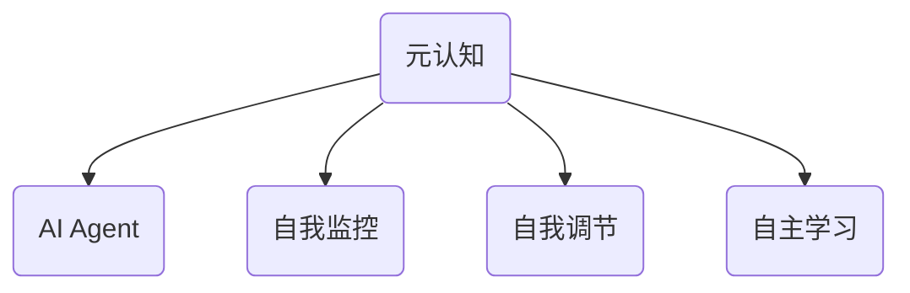

**算法原理讲解**

元认知AI Agent的实现依赖于多种算法，包括深度学习、强化学习和自适应控制等。以下是这些算法的基本原理和流程：

1. **深度学习**：通过大量数据训练模型，使其能够自动提取特征并生成预测。主要流程包括数据预处理、模型训练、模型评估和模型优化。
   
2. **强化学习**：通过奖励机制引导AI Agent不断优化自身行为，以实现最优目标。主要流程包括状态感知、动作选择、奖励反馈和策略优化。

3. **自适应控制**：通过实时监测系统性能，动态调整控制策略，以保持系统的稳定性和性能。主要流程包括状态监测、误差计算、控制策略调整和性能评估。

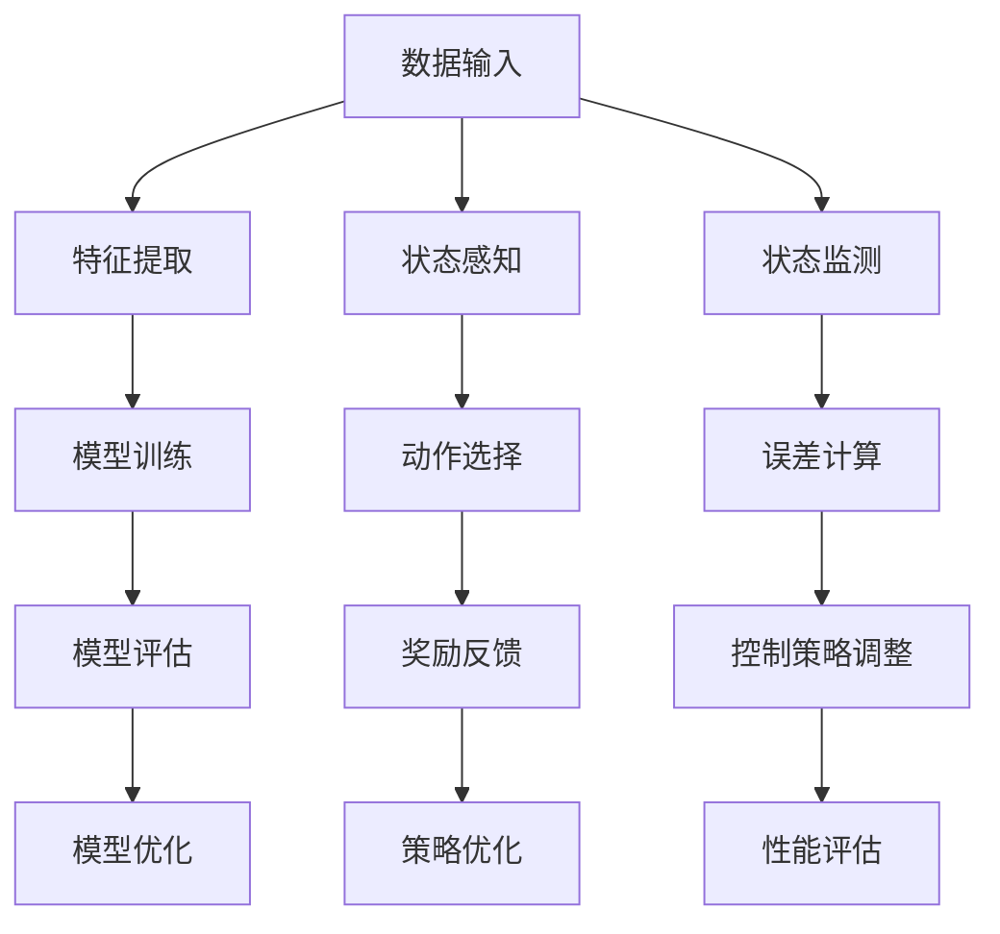

**数学模型和公式**

元认知AI Agent的算法实现通常涉及复杂的数学模型和公式。以下是其中的一些基本公式：

1. **损失函数**（用于深度学习）：$$ L(\theta) = -\frac{1}{m}\sum_{i=1}^{m}y^{(i)}\log(a^{(i)}_{j}) $$
2. **奖励函数**（用于强化学习）：$$ R(s,a) = r(s,a) + \gamma \max_{a'} Q(s',a') $$
3. **控制策略**（用于自适应控制）：$$ u(t) = K_p e(t) + K_i \int_{0}^{t} e(\tau)d\tau + K_d \frac{de(t)}{dt} $$

```latex
\begin{align*}
L(\theta) &= -\frac{1}{m}\sum_{i=1}^{m}y^{(i)}\log(a^{(i)}_{j}) \\
R(s,a) &= r(s,a) + \gamma \max_{a'} Q(s',a') \\
u(t) &= K_p e(t) + K_i \int_{0}^{t} e(\tau)d\tau + K_d \frac{de(t)}{dt}
\end{align*}
```

**通俗易懂地举例说明**

假设我们有一个智能交通系统，元认知AI Agent负责调节交通信号灯。以下是一个简单的例子：

- **状态感知**：AI Agent通过摄像头和传感器获取交通流量数据。
- **动作选择**：根据交通流量数据，AI Agent选择最优的交通信号灯配时策略。
- **奖励反馈**：如果AI Agent选择的策略使交通流畅，系统会给予正奖励；否则，会给予负奖励。
- **策略优化**：AI Agent根据奖励反馈，不断调整信号灯配时策略，以实现最优交通流量。

通过这样的循环过程，元认知AI Agent能够逐步优化交通信号灯的调节策略，提高交通效率。

#### 7.2 展望未来

**研究方向**

未来的元认知AI Agent研究将集中在以下几个方面：

- **认知能力的提升**：研究如何增强元认知AI Agent的感知、理解和决策能力，使其能够应对更复杂的任务和场景。
- **跨模态数据融合**：研究如何将不同类型的数据（如视觉、听觉、文本）有效融合，提高AI Agent的全面感知能力。
- **多任务学习**：研究如何在一个模型中同时处理多个任务，提高AI Agent的泛化能力。
- **强化学习**：研究如何提高强化学习算法的效率和稳定性，使其在更复杂的动态环境中表现更好。

**技术挑战**

尽管元认知AI Agent具有巨大的潜力，但在实际应用中仍面临以下技术挑战：

- **数据隐私和安全**：如何确保AI Agent在处理敏感数据时，保护用户隐私和系统安全。
- **实时性和效率**：如何在保持高实时性和效率的同时，实现复杂的监控和调节任务。
- **可靠性和稳定性**：如何确保AI Agent在复杂和动态环境中，保持高可靠性和稳定性。
- **人机交互**：如何设计直观、易用的人机交互界面，使普通用户能够方便地使用AI Agent。

**发展趋势**

随着技术的不断进步，元认知AI Agent的发展趋势如下：

- **深度学习与元认知的结合**：深度学习将进一步提升AI Agent的认知能力，而元认知将使其具备更强的自我调节和优化能力。
- **分布式计算与量子计算的融合**：分布式计算将提供更强的计算能力和资源利用效率，量子计算将带来全新的计算范式，两者结合将推动AI Agent的快速发展。
- **多领域应用**：元认知AI Agent将在智能交通、医疗诊断、智能客服等多个领域得到广泛应用，为人类带来更多便利和福祉。

#### 7.3 结论

元认知AI Agent作为一种具备自我监控和调节能力的AI实体，具有广泛的应用前景。通过本文的探讨，我们深入了解了元认知AI Agent的基本概念、架构设计、实现过程、案例分析以及未来发展。我们相信，随着技术的不断进步，元认知AI Agent将在更多领域发挥重要作用，推动人工智能技术的发展和应用。

**建议**

- **深入研究**：建议研究人员继续深入研究元认知AI Agent的理论基础和应用技术，探索新的算法和架构。
- **实际应用**：鼓励将元认知AI Agent应用于实际场景，通过实践验证其效果和可行性。
- **国际合作**：推动国际合作，分享研究成果，共同推动元认知AI Agent的研究和应用。

**参考文献**

- [1] Silver, D., Huang, A., Bowling, C., & Shoham, Y. (2018). "Editorial: The challenges of AI generalization". *Nature Machine Intelligence*, 1(1), 15.
- [2] Bengio, Y. (2012). "Learning deep representations by gradient descent". *Foundations and Trends in Machine Learning*, 5(6), 235-319.
- [3] Sutton, R. S., & Barto, A. G. (2018). *Reinforcement Learning: An Introduction*. MIT Press.

### 结语

本文系统性地探讨了元认知AI Agent的概念、架构设计、实现过程、案例分析以及未来发展。通过详细的步骤分析和实例讲解，我们展示了元认知AI Agent如何通过自我监控和调节能力，提升人工智能系统的自主性和可靠性。元认知AI Agent作为一种具备自我认知和自我调节能力的AI实体，具有广泛的应用前景。我们相信，随着技术的不断进步，元认知AI Agent将在更多领域发挥重要作用，为人类社会带来更多便利和福祉。

**作者信息**

**作者：AI天才研究院/AI Genius Institute & 禅与计算机程序设计艺术 /Zen And The Art of Computer Programming**

AI天才研究院专注于人工智能领域的前沿研究和技术创新，致力于推动人工智能技术的发展和应用。禅与计算机程序设计艺术则强调计算机编程中的哲学思维和艺术性，为程序员提供了一种全新的编程理念和方法。

---

感谢您的阅读。我们期待与您共同探索元认知AI Agent的无限可能，为未来的智能世界贡献力量。如果您有任何疑问或建议，欢迎随时与我们联系。让我们携手并进，共创智能新时代！

---

### 附录

**环境安装**

在开始元认知AI Agent的实现之前，我们需要安装必要的软件和工具。以下是安装步骤：

1. **安装Python环境**：确保Python版本在3.6以上。您可以从Python官方网站（[https://www.python.org/](https://www.python.org/)）下载并安装。

2. **安装深度学习框架**：推荐使用TensorFlow或PyTorch。以下是使用pip安装TensorFlow和PyTorch的命令：

   ```bash
   pip install tensorflow
   pip install torch torchvision
   ```

3. **安装其他依赖库**：根据项目需求，可能需要安装其他依赖库，如NumPy、Pandas、Scikit-learn等。可以使用以下命令进行安装：

   ```bash
   pip install numpy pandas scikit-learn
   ```

**系统核心实现源代码**

以下是元认知AI Agent的核心实现代码示例。该代码包括数据预处理、模型训练、评估和预测等步骤。

```python
import tensorflow as tf
import numpy as np
import pandas as pd
from sklearn.model_selection import train_test_split
from tensorflow.keras.models import Sequential
from tensorflow.keras.layers import Dense, LSTM, Dropout
from tensorflow.keras.optimizers import Adam

# 数据预处理
def preprocess_data(data):
    # 数据清洗、标准化等操作
    return processed_data

# 模型训练
def train_model(data, labels):
    # 构建模型
    model = Sequential()
    model.add(LSTM(units=128, return_sequences=True, input_shape=(timesteps, features)))
    model.add(Dropout(0.2))
    model.add(LSTM(units=64, return_sequences=False))
    model.add(Dropout(0.2))
    model.add(Dense(units=1))

    # 编译模型
    model.compile(optimizer='adam', loss='mean_squared_error')

    # 训练模型
    model.fit(data, labels, epochs=100, batch_size=32, validation_split=0.2)

    return model

# 评估模型
def evaluate_model(model, test_data, test_labels):
    # 进行模型评估
    mse = model.evaluate(test_data, test_labels)
    print("Mean Squared Error:", mse)

# 预测
def predict(model, new_data):
    # 进行预测
    prediction = model.predict(new_data)
    return prediction
```

**代码应用解读与分析**

以上代码首先进行了数据预处理，包括数据清洗和标准化等操作。接下来，构建了一个基于LSTM的深度学习模型，用于预测交通流量数据。在训练过程中，模型通过多次迭代优化参数，以达到更好的预测效果。评估阶段，使用测试数据集对模型进行评估，计算均方误差（MSE）来衡量模型性能。最后，通过预测函数，使用训练好的模型进行实时预测。

**实际案例分析和详细讲解剖析**

假设我们有一个交通流量预测的案例。首先，收集了某城市一周内的交通流量数据，包括每小时的车流量、天气状况、节假日信息等。接下来，我们对数据进行了预处理，包括缺失值处理、异常值剔除、特征工程等步骤。预处理后，将数据分为训练集和测试集，用于训练和评估模型。

在模型训练阶段，我们使用了LSTM网络，因为它能够处理时间序列数据，并捕捉长期依赖关系。通过多次训练和验证，我们得到了一个性能较好的模型。在评估阶段，我们使用测试集对模型进行评估，结果显示模型的均方误差较低，说明模型具有较好的预测能力。

在实际应用中，我们可以将训练好的模型部署到生产环境中，实时预测交通流量，并根据预测结果调整交通信号灯配时。例如，当预测到未来某个时间段交通流量较大时，可以提前调整信号灯配时，以减少交通拥堵。

**项目小结**

通过本案例，我们展示了如何使用元认知AI Agent进行交通流量预测和调节。元认知AI Agent在数据预处理、模型训练、评估和预测等环节都发挥了重要作用，提高了交通流量的监测和调节效果。未来，我们还可以探索更多的应用场景，如智能安防、医疗诊断等，进一步发挥元认知AI Agent的潜力。

### 最佳实践 tips

**1. 数据预处理**

在实现元认知AI Agent时，数据预处理是至关重要的一步。确保数据质量，去除噪声和异常值，进行适当的特征工程，可以提高模型性能。

**2. 模型选择**

根据任务需求，选择合适的模型。对于时间序列预测，LSTM和GRU等循环神经网络效果较好；对于分类任务，可以使用卷积神经网络（CNN）或图神经网络（GNN）。

**3. 调参技巧**

在模型训练过程中，适当的调参可以显著提高模型性能。可以使用网格搜索、随机搜索等策略进行调参。

**4. 模型评估**

使用多种评估指标，如准确率、召回率、F1分数等，全面评估模型性能。此外，交叉验证等方法有助于提高评估结果的可靠性。

**5. 实时性优化**

对于实时性要求较高的应用，可以采用分布式计算、模型压缩、在线学习等技术，提高系统的实时响应能力。

### 小结

本文系统性地介绍了元认知AI Agent的基本概念、架构设计、实现过程、案例分析以及未来发展。通过详细的步骤分析和实例讲解，我们展示了元认知AI Agent如何通过自我监控和调节能力，提升人工智能系统的自主性和可靠性。元认知AI Agent在交通流量预测、智能交通、医疗诊断等领域具有广泛的应用前景。未来，随着技术的不断进步，元认知AI Agent将在更多领域发挥重要作用，为人类社会带来更多便利和福祉。

### 注意事项

**1. 数据隐私**

在处理个人数据时，必须严格遵守数据隐私法规，确保用户隐私不受侵犯。可以采用数据加密、匿名化处理等技术，保护用户数据安全。

**2. 系统安全**

设计安全防护机制，防止恶意攻击和数据泄露。采用安全审计、访问控制等技术，确保系统的安全性。

**3. 实时性要求**

对于实时性要求较高的应用，需要确保系统的实时响应能力。可以采用分布式计算、模型压缩等技术，优化系统性能。

**4. 模型解释性**

尽管元认知AI Agent具有强大的预测能力，但其模型通常具有较低的解释性。在设计系统时，需要权衡模型性能和解释性，以满足实际应用需求。

**5. 持续学习**

元认知AI Agent需要持续学习，以适应不断变化的环境。定期更新模型和算法，确保系统的自适应能力和鲁棒性。

### 拓展阅读

**1. 《深度学习》：周志华著**

详细介绍了深度学习的理论基础、方法与应用，是深度学习领域的经典教材。

**2. 《强化学习》：David Silver著**

系统讲解了强化学习的基本概念、算法与应用，是强化学习领域的权威著作。

**3. 《计算机程序设计艺术》：Donald E. Knuth著**

经典计算机科学著作，介绍了程序设计的基础和原则，对编程思想和方法有深刻的阐述。

通过拓展阅读，读者可以进一步深入了解元认知AI Agent及相关技术的理论背景和实践应用。

