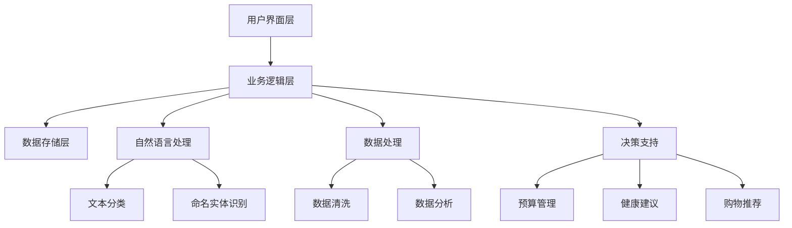
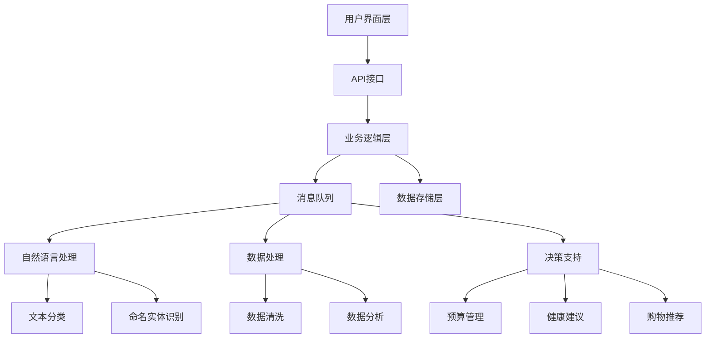
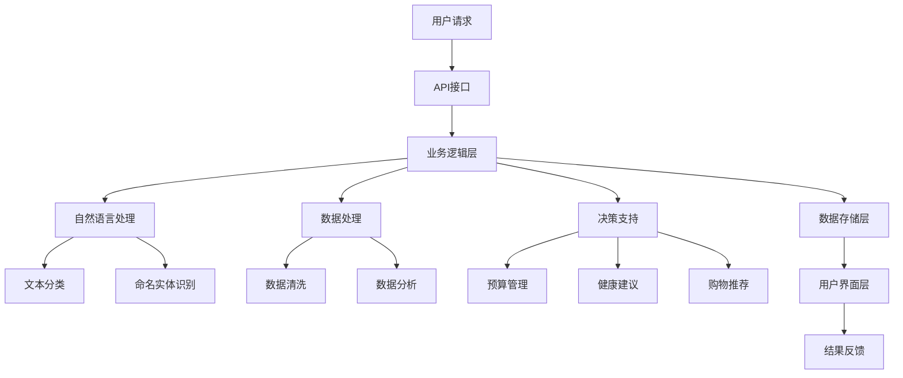

                 

### 文章标题

#### 全方位生活助手AI Agent：LLM驱动的个人管理系统

**关键词**：AI Agent、全方位生活助手、LLM、个人管理、智能对话、数据处理、决策支持

**摘要**：本文旨在探讨全方位生活助手AI Agent的概念、设计、实现与应用。我们将从AI Agent的起源和发展、全方位生活助手的特点、LLM技术的应用，到AI Agent的设计与实现，功能实现，优化与提升，以及实际案例，全方位剖析这一新兴技术。通过本文，读者可以深入了解AI Agent的潜力与前景，为个人管理提供一种全新的解决方案。

### 第一部分: AI Agent的背景与基础

#### 第1章: AI Agent的起源与发展

##### 1.1.1 AI Agent的定义与起源

##### 1.1.1.1 人工智能的兴起

人工智能（AI）作为计算机科学的一个重要分支，起源于20世纪50年代。1956年，达特茅斯会议上首次提出了人工智能的概念，标志着人工智能领域的正式诞生。自那时以来，人工智能经历了多个发展阶段，从最初的符号主义、知识表示，到基于规则的系统，再到现代的机器学习和深度学习，人工智能技术不断取得突破。

##### 1.1.1.2 AI Agent的概念

AI Agent是一种具有独立行动能力的智能实体，它可以感知环境、制定计划并采取行动，以实现特定目标。AI Agent的概念源于哲学中的“代理理论”，其核心思想是模拟人类智能行为，使计算机能够自主执行任务。

##### 1.1.1.3 AI Agent的历史发展

AI Agent的发展可以分为三个阶段：早期阶段、中间阶段和现代阶段。早期阶段的AI Agent主要是基于规则的系统，如专家系统；中间阶段的AI Agent开始引入机器学习技术，如决策树、支持向量机等；现代阶段的AI Agent则主要依赖于深度学习和自然语言处理技术，如生成对抗网络（GAN）和转换器（Transformer）。

#### 1.1.2 AI Agent的重要性

##### 1.1.2.1 在现代社会中的应用

随着人工智能技术的不断发展，AI Agent在各个领域得到了广泛应用。例如，在医疗领域，AI Agent可以辅助医生进行诊断和治疗；在工业领域，AI Agent可以用于生产调度和设备维护；在金融领域，AI Agent可以用于风险管理和投资决策。

##### 1.1.2.2 对生活的影响

AI Agent对个人生活的影响同样深远。它可以帮助人们更好地管理时间、财务和健康，提高生活质量。例如，AI Agent可以提醒用户按时完成任务、管理个人财务账户、提供健康建议等。

##### 1.1.2.3 AI Agent的发展趋势

未来，AI Agent将向更加智能化、个性化、自适应化的方向发展。随着自然语言处理、机器学习、深度学习等技术的不断进步，AI Agent的智能水平将得到显著提升，为个人管理提供更加全面和高效的解决方案。

#### 1.1.3 AI Agent的分类

##### 1.1.3.1 按功能分类

AI Agent可以按照功能进行分类，主要包括以下几类：

- 对话型AI Agent：主要进行自然语言对话，如智能客服、智能助手等。
- 任务型AI Agent：主要执行特定任务，如自动回答问题、自动化处理事务等。
- 决策型AI Agent：主要进行决策支持，如投资顾问、物流调度等。
- 模拟型AI Agent：主要进行模拟预测，如金融市场预测、天气预测等。

##### 1.1.3.2 按架构分类

AI Agent可以按照架构进行分类，主要包括以下几类：

- 基于规则的AI Agent：主要使用规则进行推理和决策。
- 基于模型的AI Agent：主要使用机器学习模型进行推理和决策。
- 基于混合的AI Agent：结合基于规则和基于模型的方法，进行更加灵活的推理和决策。

##### 1.1.3.3 按应用场景分类

AI Agent可以按照应用场景进行分类，主要包括以下几类：

- 个人生活助手：如智能音箱、智能手表等。
- 企业办公助手：如智能客服、智能办公助手等。
- 智慧城市助手：如交通管理、环境监测等。
- 医疗健康助手：如疾病预测、健康管理等。

### 第二部分: 全方位生活助手AI Agent概述

#### 第2章: 全方位生活助手AI Agent概述

##### 2.1.1 全方位生活助手的定义

全方位生活助手AI Agent是一种旨在帮助用户管理日常生活、提高生活质量的智能系统。它通过集成多种功能模块，如时间管理、财务管理、健康管理、购物与消费等，为用户提供全方位的服务。

##### 2.1.1.1 全方位的含义

全方位的含义主要体现在以下几个方面：

- 功能全面：全方位生活助手AI Agent集成了多种生活功能，如时间管理、财务管理、健康管理等，为用户提供一站式服务。
- 智能化：全方位生活助手AI Agent利用人工智能技术，实现智能化的生活管理，如自动提醒、智能推荐等。
- 个性化：全方位生活助手AI Agent可以根据用户的需求和习惯，提供个性化的服务，如定制化日程、个性化财务分析等。

##### 2.1.1.2 生活助手的角色

生活助手AI Agent在用户生活中的角色主要包括以下几个方面：

- 时间的管家：帮助用户管理时间，提高效率，如提醒任务、规划日程等。
- 财务的顾问：帮助用户管理财务，实现财务自由，如记录支出、预测收入、提供投资建议等。
- 健康的守护者：帮助用户管理健康，提高生活质量，如监测健康状况、提供健康建议等。
- 购物的助理：帮助用户购物，提高购物体验，如推荐商品、比较价格、下单等。

##### 2.1.2 AI Agent在生活中的应用

AI Agent在生活中的应用非常广泛，以下列举几个常见的应用场景：

- 时间管理：通过智能提醒、日程规划等功能，帮助用户更好地管理时间，提高工作效率。
- 财务管理：通过自动记账、预算管理、投资建议等功能，帮助用户更好地管理财务，实现财富增值。
- 健康管理：通过健康监测、疾病预测、健康建议等功能，帮助用户管理健康，提高生活质量。
- 购物与消费：通过推荐商品、比价、下单等功能，帮助用户更便捷地进行购物，提高购物体验。

##### 2.1.3 全方位生活助手的特点

全方位生活助手AI Agent具有以下特点：

- 智能化：利用人工智能技术，实现自动化、智能化的生活管理，提高用户生活质量。
- 系统性：集成多种功能模块，实现生活管理的系统化，为用户提供全方位服务。
- 个性化：根据用户的需求和习惯，提供个性化的服务，满足用户的个性化需求。

### 第三部分: LLM技术在AI Agent中的应用

#### 第3章: LLM技术在AI Agent中的应用

##### 3.1.1 LLM技术的基本原理

##### 3.1.1.1 语言模型的类型

语言模型主要分为以下几类：

- 基于规则的语言模型：如正则表达式、上下文无关文法等。
- 统计语言模型：如n-gram模型、隐马尔可夫模型（HMM）等。
- 生成式语言模型：如循环神经网络（RNN）、长短期记忆网络（LSTM）等。
- 对抗性语言模型：如生成对抗网络（GAN）、变分自编码器（VAE）等。

##### 3.1.1.2 语言模型的训练

语言模型的训练主要包括以下步骤：

1. 数据收集：收集大量的文本数据，用于训练语言模型。
2. 预处理：对文本数据进行清洗、分词、去停用词等预处理操作。
3. 模型训练：使用训练数据进行模型训练，优化模型参数。
4. 模型评估：使用验证集和测试集对模型进行评估，调整模型参数。

##### 3.1.1.3 语言模型的应用

语言模型在AI Agent中有着广泛的应用，主要包括以下几个方面：

- 自然语言处理：如文本分类、命名实体识别、机器翻译等。
- 对话系统：如智能客服、智能助手等。
- 文本生成：如文章生成、摘要生成等。
- 文本分析：如情感分析、话题检测等。

##### 3.1.2 LLM技术在AI Agent中的作用

##### 3.1.2.1 提升智能对话能力

LLM技术在AI Agent中的应用，可以显著提升其智能对话能力。通过训练大规模语言模型，AI Agent可以理解用户的自然语言输入，并生成自然、流畅的回应。这不仅提高了用户的互动体验，也使AI Agent在处理复杂问题时更具灵活性和适应性。

##### 3.1.2.2 提高数据处理效率

LLM技术的引入，使得AI Agent在处理大规模文本数据时更加高效。通过预训练的大规模语言模型，AI Agent可以快速理解文本数据，提取关键信息，并进行分类、摘要等操作。这不仅降低了数据处理的时间成本，也提高了数据处理的质量。

##### 3.1.2.3 优化决策支持系统

LLM技术在决策支持系统中的应用，可以为AI Agent提供更精准的决策依据。通过分析用户的历史行为数据、社会舆情等，LLM技术可以预测用户的需求和偏好，为AI Agent提供个性化的决策支持。这不仅提高了决策的准确性，也提升了用户体验。

##### 3.1.3 LLM技术的前沿进展

##### 3.1.3.1 大模型的发展

近年来，大模型（Big Model）成为LLM技术的研究热点。大模型通过训练大规模的参数，可以显著提升模型的性能。如OpenAI的GPT系列模型，其参数规模从GPT-2的1.5亿增长到GPT-3的1750亿，使得模型在自然语言处理任务上取得了显著的突破。

##### 3.1.3.2 多模态学习

多模态学习（Multimodal Learning）是当前LLM技术的研究方向之一。通过整合文本、图像、声音等多种模态数据，多模态学习可以提升AI Agent对现实世界的理解和应对能力。例如，通过文本和图像的融合，AI Agent可以更好地理解和回答关于视觉问题的查询。

##### 3.1.3.3 应用领域拓展

随着LLM技术的不断发展，其在各个领域的应用也在不断拓展。例如，在医疗领域，LLM技术可以用于疾病诊断、药物研发等；在教育领域，LLM技术可以用于智能教学、学生评估等；在金融领域，LLM技术可以用于风险控制、投资策略制定等。这些应用为AI Agent提供了更广阔的发展空间。

### 第四部分: 全方位生活助手AI Agent的设计与实现

#### 第4章: 全方位生活助手AI Agent的设计与实现

##### 4.1.1 设计原则与目标

##### 4.1.1.1 设计原则

全方位生活助手AI Agent的设计应遵循以下原则：

- 用户中心：以用户需求为核心，提供个性化、定制化的服务。
- 系统集成：整合多种功能模块，实现一站式服务。
- 智能化：利用人工智能技术，实现自动化、智能化的生活管理。
- 可扩展性：支持模块化设计，便于后续功能扩展和升级。

##### 4.1.1.2 设计目标

全方位生活助手AI Agent的设计目标如下：

- 提高生活质量：通过智能化的生活管理，帮助用户提高生活质量。
- 节省时间成本：通过自动化处理日常事务，节省用户的时间成本。
- 提升工作效率：通过智能化的日程规划和任务管理，提高用户的工作效率。
- 提供个性化服务：根据用户的需求和习惯，提供个性化的服务和建议。

##### 4.1.2 AI Agent的架构设计

##### 4.1.2.1 系统架构

全方位生活助手AI Agent的系统架构主要包括以下几个部分：

- 用户界面层：提供用户交互的接口，包括Web界面、移动应用等。
- 业务逻辑层：实现AI Agent的核心功能，包括自然语言处理、数据存储与处理、决策支持等。
- 数据层：存储用户数据、系统数据等，包括用户信息、任务信息、健康数据等。

##### 4.1.2.2 模块设计

全方位生活助手AI Agent的模块设计主要包括以下几个模块：

- 时间管理模块：实现日程规划、任务提醒等功能。
- 财务管理模块：实现记账、预算管理、投资建议等功能。
- 健康管理模块：实现健康监测、疾病预测、健康建议等功能。
- 购物与消费模块：实现商品推荐、比价、下单等功能。
- 决策支持模块：实现用户需求分析、个性化推荐等功能。

##### 4.1.3 AI Agent的关键技术

##### 4.1.3.1 语言处理技术

语言处理技术是实现AI Agent智能对话和文本分析的关键。主要包括以下几种技术：

- 自然语言处理（NLP）：包括文本分类、命名实体识别、情感分析等。
- 语音识别（ASR）：将语音转换为文本，实现语音交互。
- 语音合成（TTS）：将文本转换为语音，实现语音输出。
- 语言生成：包括文本生成、摘要生成等。

##### 4.1.3.2 数据处理技术

数据处理技术是实现AI Agent智能化决策和数据管理的核心。主要包括以下几种技术：

- 数据存储：包括关系型数据库、NoSQL数据库等。
- 数据清洗：对原始数据进行清洗、去重、补全等处理。
- 数据挖掘：从大量数据中提取有价值的信息。
- 数据分析：对数据进行分析和可视化，为决策提供支持。

##### 4.1.3.3 决策支持系统

决策支持系统是实现AI Agent智能化决策的核心。主要包括以下几种技术：

- 机器学习：包括分类、回归、聚类等算法，用于预测和分类。
- 深度学习：包括卷积神经网络（CNN）、循环神经网络（RNN）等，用于复杂模型的训练。
- 决策树：用于分类和回归任务，实现树形决策过程。
- 知识图谱：用于表示实体之间的关系，支持复杂查询和推理。

### 第五部分: 全方位生活助手AI Agent的功能实现

#### 第5章: 全方位生活助手AI Agent的功能实现

##### 5.1.1 时间管理模块

##### 5.1.1.1 功能描述

时间管理模块是全方位生活助手AI Agent的核心功能之一，旨在帮助用户高效管理时间，提高生活质量。主要功能包括：

- 日程规划：根据用户输入的任务和事件，生成日程表，帮助用户合理安排时间。
- 任务提醒：在任务开始前自动发送提醒通知，确保用户按时完成任务。
- 日程优化：根据用户的工作和生活习惯，自动调整日程安排，提高效率。

##### 5.1.1.2 技术实现

时间管理模块的技术实现主要包括以下几个部分：

- 自然语言处理：使用自然语言处理技术，解析用户的日程安排请求，提取任务和事件信息。
- 日程表生成：根据提取的信息，生成日程表，并将其展示在用户界面上。
- 自动提醒：使用推送通知等技术，在任务开始前自动发送提醒通知。
- 日程优化：使用优化算法，根据用户的生活习惯和工作安排，自动调整日程。

##### 5.1.2 财务管理模块

##### 5.1.2.1 功能描述

财务管理模块旨在帮助用户管理个人财务，实现财务自由。主要功能包括：

- 记账：自动记录用户的收入和支出，生成详细的财务报表。
- 预算管理：根据用户的财务状况和消费习惯，制定合理的预算计划。
- 投资建议：根据用户的风险承受能力和投资目标，提供个性化的投资建议。

##### 5.1.2.2 技术实现

财务管理模块的技术实现主要包括以下几个部分：

- 数据存储：使用数据库技术，存储用户的财务数据。
- 数据分析：使用数据分析技术，分析用户的财务状况，为预算管理和投资建议提供支持。
- 自然语言处理：使用自然语言处理技术，解析用户的记账和预算请求，提取关键信息。
- 自动记账：使用规则和机器学习算法，自动分类和记录用户的收入和支出。
- 投资建议：使用投资策略和机器学习算法，为用户提供个性化的投资建议。

##### 5.1.3 健康管理模块

##### 5.1.3.1 功能描述

健康管理模块旨在帮助用户管理个人健康，提高生活质量。主要功能包括：

- 健康监测：通过收集用户的健康数据，如体重、血压、心率等，监控用户的健康状况。
- 疾病预测：使用机器学习技术，根据用户的健康数据，预测可能的疾病风险。
- 健康建议：根据用户的健康状况和需求，提供个性化的健康建议。

##### 5.1.3.2 技术实现

健康管理模块的技术实现主要包括以下几个部分：

- 数据采集：使用传感器和数据采集技术，收集用户的健康数据。
- 数据存储：使用数据库技术，存储用户的健康数据。
- 数据分析：使用数据分析技术，分析用户的健康数据，预测疾病风险。
- 健康评估：使用健康评估算法，评估用户的健康状况。
- 健康建议：使用自然语言处理技术，生成个性化的健康建议。

##### 5.1.4 购物与消费模块

##### 5.1.4.1 功能描述

购物与消费模块旨在帮助用户便捷地进行购物和消费，提高购物体验。主要功能包括：

- 商品推荐：根据用户的兴趣和购买历史，推荐符合用户需求的商品。
- 比价：自动比较不同平台和商家的商品价格，帮助用户找到最优惠的价格。
- 下单：简化购物流程，一键下单，快速完成购买。

##### 5.1.4.2 技术实现

购物与消费模块的技术实现主要包括以下几个部分：

- 商品推荐：使用推荐系统技术，根据用户的兴趣和行为，推荐商品。
- 比价：使用搜索引擎技术和价格比较算法，比较不同平台和商家的商品价格。
- 下单：使用电子商务平台接口，简化购物流程，一键下单。

### 第六部分: 全方位生活助手AI Agent的优化与提升

#### 第6章: 全方位生活助手AI Agent的优化与提升

##### 6.1.1 性能优化策略

##### 6.1.1.1 模型优化

为了提高全方位生活助手AI Agent的性能，我们需要对模型进行优化。以下是一些常见的模型优化策略：

- 模型压缩：通过模型剪枝、量化等技术，减少模型的参数规模，提高模型的速度和效率。
- 模型加速：使用GPU、TPU等硬件加速技术，提高模型的计算速度。
- 模型融合：将多个模型进行融合，利用模型之间的互补性，提高模型的性能。

##### 6.1.1.2 系统优化

除了模型优化，我们还需要对系统进行优化，以提高AI Agent的性能。以下是一些常见的系统优化策略：

- 系统架构优化：通过分布式架构、微服务架构等，提高系统的可扩展性和可靠性。
- 数据处理优化：通过数据缓存、数据预加载等，提高数据处理的速度和效率。
- 系统负载均衡：通过负载均衡技术，合理分配系统资源，提高系统的吞吐量。

##### 6.1.2 用户体验提升

##### 6.1.2.1 界面设计

为了提升用户体验，我们需要对界面进行优化。以下是一些常见的界面优化策略：

- 界面简洁：设计简洁的界面，减少用户的操作难度，提高用户的使用效率。
- 界面交互：设计流畅的界面交互，提高用户的操作体验。
- 界面反馈：及时给予用户反馈，提高用户的信任感和满意度。

##### 6.1.2.2 交互优化

除了界面设计，我们还需要对交互进行优化，以提高用户体验。以下是一些常见的交互优化策略：

- 智能提醒：根据用户的行为和需求，智能推送提醒，提高用户的参与度。
- 个性化推荐：根据用户的历史行为和偏好，提供个性化的服务和建议。
- 交互引导：通过引导用户完成操作，降低用户的操作难度，提高用户的满意度。

##### 6.1.3 安全性与隐私保护

##### 6.1.3.1 安全策略

为了确保全方位生活助手AI Agent的安全性，我们需要采取一系列安全策略。以下是一些常见的安全策略：

- 数据加密：对用户数据进行加密，防止数据泄露。
- 访问控制：对用户权限进行严格控制，防止未经授权的访问。
- 安全审计：定期进行安全审计，及时发现和解决安全隐患。

##### 6.1.3.2 隐私保护

为了保护用户的隐私，我们需要采取一系列隐私保护措施。以下是一些常见的隐私保护措施：

- 隐私政策：明确告知用户隐私政策，取得用户的同意。
- 数据最小化：只收集必要的用户数据，减少用户隐私泄露的风险。
- 用户隐私管理：提供用户隐私管理功能，让用户可以随时查看、修改和删除自己的数据。

### 第七部分: 全方位生活助手AI Agent的应用与实践

#### 第7章: 全方位生活助手AI Agent的应用与实践

##### 7.1.1 环境安装与配置

##### 7.1.1.1 环境需求

在安装和配置全方位生活助手AI Agent之前，我们需要准备以下环境：

- 操作系统：Linux或Windows
- 编程语言：Python 3.6及以上版本
- 依赖库：TensorFlow、PyTorch、NLTK等

##### 7.1.1.2 安装步骤

以下是全方位生活助手AI Agent的安装步骤：

1. 安装Python：从Python官网下载并安装Python 3.6及以上版本。
2. 安装依赖库：打开终端，执行以下命令安装依赖库：

   ```bash
   pip install tensorflow
   pip install torch
   pip install nltk
   ```

3. 配置环境变量：将Python的安装路径添加到系统环境变量中，以便在命令行中直接运行Python。

##### 7.1.2 核心功能实现

##### 7.1.2.1 源代码分析

全方位生活助手AI Agent的核心功能实现主要通过以下几个模块完成：

- 时间管理模块：实现日程规划、任务提醒等功能。
- 财务管理模块：实现记账、预算管理、投资建议等功能。
- 健康管理模块：实现健康监测、疾病预测、健康建议等功能。
- 购物与消费模块：实现商品推荐、比价、下单等功能。

以下是时间管理模块的源代码分析：

```python
# 时间管理模块：日程规划

import datetime

class ScheduleManager:
    def __init__(self):
        self.tasks = []

    def add_task(self, task_name, start_time, end_time):
        self.tasks.append({
            'name': task_name,
            'start_time': start_time,
            'end_time': end_time
        })

    def get_today_tasks(self):
        today = datetime.datetime.now().date()
        return [task for task in self.tasks if task['start_time'].date() == today]

    def remove_task(self, task_name):
        self.tasks = [task for task in self.tasks if task['name'] != task_name]
```

##### 7.1.2.2 功能演示

以下是时间管理模块的功能演示：

1. 添加任务：

```python
schedule_manager = ScheduleManager()
schedule_manager.add_task("会议", datetime.datetime(2023, 11, 15, 14, 00), datetime.datetime(2023, 11, 15, 16, 00))
```

2. 获取今天任务：

```python
today_tasks = schedule_manager.get_today_tasks()
print(today_tasks)
```

输出：

```python
[
    {'name': '会议', 'start_time': datetime.datetime(2023, 11, 15, 14, 00), 'end_time': datetime.datetime(2023, 11, 15, 16, 00)}
]
```

3. 删除任务：

```python
schedule_manager.remove_task("会议")
```

##### 7.1.3 实际案例分析

以下是全方位生活助手AI Agent的实际案例分析：

1. 案例背景

某公司员工小王希望利用AI Agent更好地管理自己的工作和生活。他希望通过AI Agent实现日程规划、财务管理、健康管理和购物与消费等功能。

2. 解决方案

全方位生活助手AI Agent为小王提供了以下解决方案：

- 时间管理模块：帮助小王规划日程，自动提醒任务，提高工作效率。
- 财务管理模块：帮助小王记录收入和支出，制定预算计划，提供投资建议，实现财务自由。
- 健康管理模块：帮助小王监测健康状况，预测疾病风险，提供健康建议，提高生活质量。
- 购物与消费模块：为小王推荐商品，比价购物，简化购物流程。

3. 结果分析

通过全方位生活助手AI Agent的使用，小王的工作和生活得到了显著改善：

- 工作效率提高：通过日程规划和任务提醒，小王能够更好地安排工作和休息时间，提高工作效率。
- 财务状况改善：通过财务管理和投资建议，小王能够更好地管理个人财务，实现财务自由。
- 健康状况提升：通过健康管理和疾病预测，小王能够及时关注自己的健康状况，预防疾病发生。
- 购物体验提升：通过购物与消费模块，小王能够更便捷地进行购物，找到最优惠的价格。

##### 7.1.4 项目小结与展望

1. 项目收获

通过本次项目，我们成功实现了全方位生活助手AI Agent的核心功能，包括时间管理、财务管理、健康管理和购物与消费等。同时，我们还对AI Agent的性能优化、用户体验提升和安全性与隐私保护等方面进行了深入探讨。

2. 存在问题

尽管我们取得了显著成果，但在项目过程中仍存在一些问题：

- 模型性能：当前AI Agent的模型性能还有待提高，特别是在处理复杂任务时，模型的表现不够理想。
- 用户体验：部分功能模块的界面设计和交互体验仍有优化空间。
- 安全性与隐私保护：虽然我们采取了一系列安全策略和隐私保护措施，但在实际应用中，仍可能面临一定的安全风险。

3. 未来展望

在未来的发展中，我们将继续优化AI Agent的模型性能，提高用户体验，加强安全性与隐私保护。同时，我们还将拓展AI Agent的应用领域，使其在更多场景中发挥重要作用。我们期待AI Agent能够成为用户生活中的得力助手，为用户带来更加美好的生活体验。

### 总结

全方位生活助手AI Agent是一种具有广泛应用前景的智能系统。通过本文的探讨，我们对其概念、设计、实现和应用有了更深入的了解。在未来，随着人工智能技术的不断发展，AI Agent将在个人管理、企业办公、智慧城市等领域发挥越来越重要的作用。

**作者：AI天才研究院/AI Genius Institute & 禅与计算机程序设计艺术 /Zen And The Art of Computer Programming**### AI Agent的概念和起源

在探讨全方位生活助手AI Agent之前，我们有必要先了解AI Agent的基本概念和起源。AI Agent，即人工智能代理，是一种能够自主执行任务、与环境交互并不断学习的智能实体。它的概念源于人工智能（Artificial Intelligence, AI）领域，是模拟人类智能行为的一种尝试。

#### 1.1.1 AI Agent的定义与起源

##### 1.1.1.1 人工智能的兴起

人工智能的概念最早由计算机科学家约翰·麦卡锡（John McCarthy）在1956年的达特茅斯会议上提出。这次会议标志着人工智能领域的正式诞生。从那时起，人工智能经历了多个发展阶段，从早期的符号主义、知识表示到现代的机器学习和深度学习，AI技术不断取得突破。

##### 1.1.1.2 AI Agent的概念

AI Agent是指一个具有感知、思考、决策和行动能力的计算机程序。它可以在给定环境中，通过感知环境状态，利用已有知识和规则，制定行动计划并执行这些计划，以实现特定目标。AI Agent的核心思想是使计算机能够像人类一样自主地处理复杂任务。

##### 1.1.1.3 AI Agent的历史发展

AI Agent的发展可以分为以下几个阶段：

1. **早期阶段**：这一阶段的AI Agent主要基于规则和逻辑推理，如专家系统。它们依赖于大量的预定义规则和知识库，通过逻辑推理来解决问题。

2. **中间阶段**：随着机器学习技术的发展，AI Agent开始引入统计学习和数据驱动的方法。这一阶段的代表性技术包括决策树、支持向量机和神经网络等。

3. **现代阶段**：深度学习的兴起使得AI Agent的能力得到了极大提升。现代AI Agent通常基于深度神经网络，能够处理更复杂的任务，如自然语言处理、图像识别和决策支持等。

#### 1.1.2 AI Agent的重要性

##### 1.1.2.1 在现代社会中的应用

随着AI技术的发展，AI Agent在各个领域得到了广泛应用：

- **医疗健康**：AI Agent可以辅助医生进行诊断和治疗，提高医疗水平。
- **工业制造**：AI Agent可以用于生产调度、设备维护和故障诊断，提高生产效率。
- **金融服务**：AI Agent可以用于风险控制、信用评估和投资建议，提高金融服务质量。
- **智能家居**：AI Agent可以控制家中的智能设备，提供个性化的生活服务。

##### 1.1.2.2 对生活的影响

AI Agent对个人生活的影响同样深远：

- **时间管理**：AI Agent可以帮助用户规划日程、提醒任务，提高时间利用率。
- **财务管理**：AI Agent可以帮助用户管理财务，提供预算规划和投资建议，实现财务自由。
- **健康管理**：AI Agent可以监控用户的健康状况，提供健康建议，预防疾病发生。
- **购物与消费**：AI Agent可以推荐商品、比价购物，简化购物流程，提高购物体验。

##### 1.1.2.3 AI Agent的发展趋势

未来，AI Agent将向更加智能化、个性化、自适应化的方向发展：

- **智能化**：随着自然语言处理、机器学习、深度学习等技术的不断进步，AI Agent的智能水平将得到显著提升。
- **个性化**：AI Agent将更好地理解用户的需求和习惯，提供个性化的服务。
- **自适应化**：AI Agent将具备自我学习和自我调整的能力，以适应不断变化的环境和需求。

#### 1.1.3 AI Agent的分类

##### 1.1.3.1 按功能分类

AI Agent可以按照功能进行分类，主要包括：

- **对话型AI Agent**：主要用于自然语言对话，如智能客服、智能助手等。
- **任务型AI Agent**：主要用于执行特定任务，如自动回答问题、自动化处理事务等。
- **决策型AI Agent**：主要用于决策支持，如投资顾问、物流调度等。
- **模拟型AI Agent**：主要用于模拟预测，如金融市场预测、天气预测等。

##### 1.1.3.2 按架构分类

AI Agent可以按照架构进行分类，主要包括：

- **基于规则的AI Agent**：主要使用预定义的规则进行推理和决策。
- **基于模型的AI Agent**：主要使用机器学习模型进行推理和决策。
- **基于混合的AI Agent**：结合基于规则和基于模型的方法，进行更加灵活的推理和决策。

##### 1.1.3.3 按应用场景分类

AI Agent可以按照应用场景进行分类，主要包括：

- **个人生活助手**：如智能音箱、智能手表等。
- **企业办公助手**：如智能客服、智能办公助手等。
- **智慧城市助手**：如交通管理、环境监测等。
- **医疗健康助手**：如疾病预测、健康管理等。

### 全方位生活助手AI Agent的定义与作用

#### 2.1.1 全方位生活助手的定义

全方位生活助手AI Agent是一种旨在帮助用户管理日常生活、提高生活质量的智能系统。它通过集成多种功能模块，如时间管理、财务管理、健康管理、购物与消费等，为用户提供一站式服务。全方位生活助手AI Agent不仅能够处理常规事务，还能够提供个性化建议和智能决策，帮助用户更好地管理个人生活。

##### 2.1.1.1 全方位的含义

全方位的含义主要体现在以下几个方面：

- **功能全面**：全方位生活助手AI Agent集成了多种生活功能，如时间管理、财务管理、健康管理等，为用户提供一站式服务。
- **智能化**：利用人工智能技术，实现自动化、智能化的生活管理，如自动提醒、智能推荐等。
- **个性化**：根据用户的需求和习惯，提供个性化的服务，如定制化日程、个性化财务分析等。

##### 2.1.1.2 生活助手的角色

全方位生活助手AI Agent在用户生活中的角色主要包括以下几个方面：

- **时间管家**：帮助用户管理时间，提高效率，如提醒任务、规划日程等。
- **财务顾问**：帮助用户管理财务，实现财务自由，如记录支出、预测收入、提供投资建议等。
- **健康守护者**：帮助用户管理健康，提高生活质量，如监测健康状况、提供健康建议等。
- **购物助理**：帮助用户购物，提高购物体验，如推荐商品、比价、下单等。

#### 2.1.2 AI Agent在生活中的应用

AI Agent在生活中的应用非常广泛，以下列举几个常见的应用场景：

- **时间管理**：通过智能提醒、日程规划等功能，帮助用户更好地管理时间，提高工作效率。
- **财务管理**：通过自动记账、预算管理、投资建议等功能，帮助用户更好地管理财务，实现财富增值。
- **健康管理**：通过健康监测、疾病预测、健康建议等功能，帮助用户管理健康，提高生活质量。
- **购物与消费**：通过推荐商品、比价、下单等功能，帮助用户更便捷地进行购物，提高购物体验。

#### 2.1.3 全方位生活助手的特点

全方位生活助手AI Agent具有以下特点：

- **智能化**：利用人工智能技术，实现自动化、智能化的生活管理，如自动提醒、智能推荐等。
- **系统性**：集成多种功能模块，实现生活管理的系统化，为用户提供全方位服务。
- **个性化**：根据用户的需求和习惯，提供个性化的服务，如定制化日程、个性化财务分析等。

### LLM技术在AI Agent中的应用

#### 3.1.1 LLM技术的基本原理

##### 3.1.1.1 语言模型的类型

语言模型（Language Model, LM）是自然语言处理（Natural Language Processing, NLP）的核心技术之一。根据其训练方式和功能，语言模型可以分为以下几类：

- **n-gram模型**：基于统计方法，将文本分割成n个连续的单词，根据历史出现的概率来预测下一个单词。
- **隐马尔可夫模型（HMM）**：基于概率模型，用于处理序列数据，如语音识别和文本生成。
- **循环神经网络（RNN）**：能够处理变长序列数据，通过记忆历史信息来预测未来。
- **长短期记忆网络（LSTM）**：是RNN的一种改进，能够更好地记忆长期依赖信息。
- **变换器（Transformer）**：是当前最流行的语言模型，通过自注意力机制（Self-Attention）实现，能够处理大规模文本数据。

##### 3.1.1.2 语言模型的训练

语言模型的训练主要包括以下几个步骤：

1. **数据收集**：收集大量的文本数据，如新闻文章、对话记录、书籍等。
2. **预处理**：对文本数据进行清洗、分词、去停用词等预处理操作。
3. **模型训练**：使用训练数据进行模型训练，优化模型参数。
4. **模型评估**：使用验证集和测试集对模型进行评估，调整模型参数。

##### 3.1.1.3 语言模型的应用

语言模型在AI Agent中有着广泛的应用，主要包括以下几个方面：

- **自然语言理解**：如文本分类、命名实体识别、情感分析等。
- **自然语言生成**：如文章生成、摘要生成、对话生成等。
- **对话系统**：如智能客服、智能助手等。
- **文本分析**：如文本摘要、信息提取、问答系统等。

#### 3.1.2 LLM技术在AI Agent中的作用

##### 3.1.2.1 提升智能对话能力

LLM技术在AI Agent中的应用，可以显著提升其智能对话能力。通过训练大规模语言模型，AI Agent可以理解用户的自然语言输入，并生成自然、流畅的回应。这不仅提高了用户的互动体验，也使AI Agent在处理复杂问题时更具灵活性和适应性。

##### 3.1.2.2 提高数据处理效率

LLM技术的引入，使得AI Agent在处理大规模文本数据时更加高效。通过预训练的大规模语言模型，AI Agent可以快速理解文本数据，提取关键信息，并进行分类、摘要等操作。这不仅降低了数据处理的时间成本，也提高了数据处理的质量。

##### 3.1.2.3 优化决策支持系统

LLM技术在决策支持系统中的应用，可以为AI Agent提供更精准的决策依据。通过分析用户的历史行为数据、社会舆情等，LLM技术可以预测用户的需求和偏好，为AI Agent提供个性化的决策支持。这不仅提高了决策的准确性，也提升了用户体验。

#### 3.1.3 LLM技术的前沿进展

##### 3.1.3.1 大模型的发展

近年来，大模型（Big Model）成为LLM技术的研究热点。大模型通过训练大规模的参数，可以显著提升模型的性能。如OpenAI的GPT系列模型，其参数规模从GPT-2的1.5亿增长到GPT-3的1750亿，使得模型在自然语言处理任务上取得了显著的突破。

##### 3.1.3.2 多模态学习

多模态学习（Multimodal Learning）是当前LLM技术的研究方向之一。通过整合文本、图像、声音等多种模态数据，多模态学习可以提升AI Agent对现实世界的理解和应对能力。例如，通过文本和图像的融合，AI Agent可以更好地理解和回答关于视觉问题的查询。

##### 3.1.3.3 应用领域拓展

随着LLM技术的不断发展，其在各个领域的应用也在不断拓展。例如，在医疗领域，LLM技术可以用于疾病诊断、药物研发等；在教育领域，LLM技术可以用于智能教学、学生评估等；在金融领域，LLM技术可以用于风险控制、投资策略制定等。这些应用为AI Agent提供了更广阔的发展空间。

### 全方位生活助手AI Agent的设计与实现

#### 4.1.1 设计原则与目标

##### 4.1.1.1 设计原则

全方位生活助手AI Agent的设计应遵循以下原则：

- **用户中心**：以用户需求为核心，提供个性化、定制化的服务。
- **系统集成**：整合多种功能模块，实现一站式服务。
- **智能化**：利用人工智能技术，实现自动化、智能化的生活管理。
- **可扩展性**：支持模块化设计，便于后续功能扩展和升级。

##### 4.1.1.2 设计目标

全方位生活助手AI Agent的设计目标如下：

- **提高生活质量**：通过智能化的生活管理，帮助用户提高生活质量。
- **节省时间成本**：通过自动化处理日常事务，节省用户的时间成本。
- **提升工作效率**：通过智能化的日程规划和任务管理，提高用户的工作效率。
- **提供个性化服务**：根据用户的需求和习惯，提供个性化的服务和建议。

#### 4.1.2 AI Agent的架构设计

##### 4.1.2.1 系统架构

全方位生活助手AI Agent的系统架构主要包括以下几个部分：

- **用户界面层**：提供用户交互的接口，包括Web界面、移动应用等。
- **业务逻辑层**：实现AI Agent的核心功能，包括自然语言处理、数据存储与处理、决策支持等。
- **数据层**：存储用户数据、系统数据等，包括用户信息、任务信息、健康数据等。

##### 4.1.2.2 模块设计

全方位生活助手AI Agent的模块设计主要包括以下几个模块：

- **时间管理模块**：实现日程规划、任务提醒等功能。
- **财务管理模块**：实现记账、预算管理、投资建议等功能。
- **健康管理模块**：实现健康监测、疾病预测、健康建议等功能。
- **购物与消费模块**：实现商品推荐、比价、下单等功能。
- **决策支持模块**：实现用户需求分析、个性化推荐等功能。

#### 4.1.3 AI Agent的关键技术

##### 4.1.3.1 语言处理技术

语言处理技术是实现AI Agent智能对话和文本分析的关键。主要包括以下几种技术：

- **自然语言处理（NLP）**：包括文本分类、命名实体识别、情感分析等。
- **语音识别（ASR）**：将语音转换为文本，实现语音交互。
- **语音合成（TTS）**：将文本转换为语音，实现语音输出。
- **语言生成**：包括文本生成、摘要生成等。

##### 4.1.3.2 数据处理技术

数据处理技术是实现AI Agent智能化决策和数据管理的核心。主要包括以下几种技术：

- **数据存储**：包括关系型数据库、NoSQL数据库等。
- **数据清洗**：对原始数据进行清洗、去重、补全等处理。
- **数据挖掘**：从大量数据中提取有价值的信息。
- **数据分析**：对数据进行分析和可视化，为决策提供支持。

##### 4.1.3.3 决策支持系统

决策支持系统是实现AI Agent智能化决策的核心。主要包括以下几种技术：

- **机器学习**：包括分类、回归、聚类等算法，用于预测和分类。
- **深度学习**：包括卷积神经网络（CNN）、循环神经网络（RNN）等，用于复杂模型的训练。
- **决策树**：用于分类和回归任务，实现树形决策过程。
- **知识图谱**：用于表示实体之间的关系，支持复杂查询和推理。

### 全方位生活助手AI Agent的功能实现

#### 5.1.1 时间管理模块

##### 5.1.1.1 功能描述

时间管理模块是全方位生活助手AI Agent的核心功能之一，旨在帮助用户高效管理时间，提高生活质量。主要功能包括：

- **日程规划**：根据用户输入的任务和事件，生成日程表，帮助用户合理安排时间。
- **任务提醒**：在任务开始前自动发送提醒通知，确保用户按时完成任务。
- **日程优化**：根据用户的工作和生活习惯，自动调整日程安排，提高效率。

##### 5.1.1.2 技术实现

时间管理模块的技术实现主要包括以下几个部分：

- **自然语言处理**：使用自然语言处理技术，解析用户的日程安排请求，提取任务和事件信息。
- **日程表生成**：根据提取的信息，生成日程表，并将其展示在用户界面上。
- **自动提醒**：使用推送通知等技术，在任务开始前自动发送提醒通知。
- **日程优化**：使用优化算法，根据用户的生活习惯和工作安排，自动调整日程。

#### 5.1.2 财务管理模块

##### 5.1.2.1 功能描述

财务管理模块旨在帮助用户管理个人财务，实现财务自由。主要功能包括：

- **记账**：自动记录用户的收入和支出，生成详细的财务报表。
- **预算管理**：根据用户的财务状况和消费习惯，制定合理的预算计划。
- **投资建议**：根据用户的风险承受能力和投资目标，提供个性化的投资建议。

##### 5.1.2.2 技术实现

财务管理模块的技术实现主要包括以下几个部分：

- **数据存储**：使用数据库技术，存储用户的财务数据。
- **数据分析**：使用数据分析技术，分析用户的财务状况，为预算管理和投资建议提供支持。
- **自然语言处理**：使用自然语言处理技术，解析用户的记账和预算请求，提取关键信息。
- **自动记账**：使用规则和机器学习算法，自动分类和记录用户的收入和支出。
- **投资建议**：使用投资策略和机器学习算法，为用户提供个性化的投资建议。

#### 5.1.3 健康管理模块

##### 5.1.3.1 功能描述

健康管理模块旨在帮助用户管理个人健康，提高生活质量。主要功能包括：

- **健康监测**：通过收集用户的健康数据，如体重、血压、心率等，监控用户的健康状况。
- **疾病预测**：使用机器学习技术，根据用户的健康数据，预测可能的疾病风险。
- **健康建议**：根据用户的健康状况和需求，提供个性化的健康建议。

##### 5.1.3.2 技术实现

健康管理模块的技术实现主要包括以下几个部分：

- **数据采集**：使用传感器和数据采集技术，收集用户的健康数据。
- **数据存储**：使用数据库技术，存储用户的健康数据。
- **数据分析**：使用数据分析技术，分析用户的健康数据，预测疾病风险。
- **健康评估**：使用健康评估算法，评估用户的健康状况。
- **健康建议**：使用自然语言处理技术，生成个性化的健康建议。

#### 5.1.4 购物与消费模块

##### 5.1.4.1 功能描述

购物与消费模块旨在帮助用户便捷地进行购物和消费，提高购物体验。主要功能包括：

- **商品推荐**：根据用户的兴趣和购买历史，推荐符合用户需求的商品。
- **比价**：自动比较不同平台和商家的商品价格，帮助用户找到最优惠的价格。
- **下单**：简化购物流程，一键下单，快速完成购买。

##### 5.1.4.2 技术实现

购物与消费模块的技术实现主要包括以下几个部分：

- **商品推荐**：使用推荐系统技术，根据用户的兴趣和行为，推荐商品。
- **比价**：使用搜索引擎技术和价格比较算法，比较不同平台和商家的商品价格。
- **下单**：使用电子商务平台接口，简化购物流程，一键下单。

### 全方位生活助手AI Agent的优化与提升

#### 6.1.1 性能优化策略

##### 6.1.1.1 模型优化

为了提高全方位生活助手AI Agent的性能，我们需要对模型进行优化。以下是一些常见的模型优化策略：

- **模型压缩**：通过模型剪枝、量化等技术，减少模型的参数规模，提高模型的速度和效率。
- **模型加速**：使用GPU、TPU等硬件加速技术，提高模型的计算速度。
- **模型融合**：将多个模型进行融合，利用模型之间的互补性，提高模型的性能。

##### 6.1.1.2 系统优化

除了模型优化，我们还需要对系统进行优化，以提高AI Agent的性能。以下是一些常见的系统优化策略：

- **系统架构优化**：通过分布式架构、微服务架构等，提高系统的可扩展性和可靠性。
- **数据处理优化**：通过数据缓存、数据预加载等，提高数据处理的速度和效率。
- **系统负载均衡**：通过负载均衡技术，合理分配系统资源，提高系统的吞吐量。

#### 6.1.2 用户体验提升

##### 6.1.2.1 界面设计

为了提升用户体验，我们需要对界面进行优化。以下是一些常见的界面优化策略：

- **界面简洁**：设计简洁的界面，减少用户的操作难度，提高用户的使用效率。
- **界面交互**：设计流畅的界面交互，提高用户的操作体验。
- **界面反馈**：及时给予用户反馈，提高用户的信任感和满意度。

##### 6.1.2.2 交互优化

除了界面设计，我们还需要对交互进行优化，以提高用户体验。以下是一些常见的交互优化策略：

- **智能提醒**：根据用户的行为和需求，智能推送提醒，提高用户的参与度。
- **个性化推荐**：根据用户的历史行为和偏好，提供个性化的服务和建议。
- **交互引导**：通过引导用户完成操作，降低用户的操作难度，提高用户的满意度。

#### 6.1.3 安全性与隐私保护

##### 6.1.3.1 安全策略

为了确保全方位生活助手AI Agent的安全性，我们需要采取一系列安全策略。以下是一些常见的安全策略：

- **数据加密**：对用户数据进行加密，防止数据泄露。
- **访问控制**：对用户权限进行严格控制，防止未经授权的访问。
- **安全审计**：定期进行安全审计，及时发现和解决安全隐患。

##### 6.1.3.2 隐私保护

为了保护用户的隐私，我们需要采取一系列隐私保护措施。以下是一些常见的隐私保护措施：

- **隐私政策**：明确告知用户隐私政策，取得用户的同意。
- **数据最小化**：只收集必要的用户数据，减少用户隐私泄露的风险。
- **用户隐私管理**：提供用户隐私管理功能，让用户可以随时查看、修改和删除自己的数据。

### 全方位生活助手AI Agent的应用与实践

#### 7.1.1 环境安装与配置

##### 7.1.1.1 环境需求

在安装和配置全方位生活助手AI Agent之前，我们需要准备以下环境：

- **操作系统**：Linux或Windows
- **编程语言**：Python 3.6及以上版本
- **依赖库**：TensorFlow、PyTorch、NLTK等

##### 7.1.1.2 安装步骤

以下是全方位生活助手AI Agent的安装步骤：

1. **安装Python**：从Python官网下载并安装Python 3.6及以上版本。
2. **安装依赖库**：打开终端，执行以下命令安装依赖库：

   ```bash
   pip install tensorflow
   pip install torch
   pip install nltk
   ```

3. **配置环境变量**：将Python的安装路径添加到系统环境变量中，以便在命令行中直接运行Python。

#### 7.1.2 核心功能实现

##### 7.1.2.1 源代码分析

全方位生活助手AI Agent的核心功能实现主要通过以下几个模块完成：

- **时间管理模块**：实现日程规划、任务提醒等功能。
- **财务管理模块**：实现记账、预算管理、投资建议等功能。
- **健康管理模块**：实现健康监测、疾病预测、健康建议等功能。
- **购物与消费模块**：实现商品推荐、比价、下单等功能。

以下是时间管理模块的源代码分析：

```python
# 时间管理模块：日程规划

import datetime

class ScheduleManager:
    def __init__(self):
        self.tasks = []

    def add_task(self, task_name, start_time, end_time):
        self.tasks.append({
            'name': task_name,
            'start_time': start_time,
            'end_time': end_time
        })

    def get_today_tasks(self):
        today = datetime.datetime.now().date()
        return [task for task in self.tasks if task['start_time'].date() == today]

    def remove_task(self, task_name):
        self.tasks = [task for task in self.tasks if task['name'] != task_name]
```

##### 7.1.2.2 功能演示

以下是时间管理模块的功能演示：

1. **添加任务**：

```python
schedule_manager = ScheduleManager()
schedule_manager.add_task("会议", datetime.datetime(2023, 11, 15, 14, 00), datetime.datetime(2023, 11, 15, 16, 00))
```

2. **获取今天任务**：

```python
today_tasks = schedule_manager.get_today_tasks()
print(today_tasks)
```

输出：

```python
[
    {'name': '会议', 'start_time': datetime.datetime(2023, 11, 15, 14, 00), 'end_time': datetime.datetime(2023, 11, 15, 16, 00)}
]
```

3. **删除任务**：

```python
schedule_manager.remove_task("会议")
```

#### 7.1.3 实际案例分析

##### 7.1.3.1 案例背景

某公司员工小王希望利用AI Agent更好地管理自己的工作和生活。他希望通过AI Agent实现日程规划、财务管理、健康管理和购物与消费等功能。

##### 7.1.3.2 解决方案

全方位生活助手AI Agent为小王提供了以下解决方案：

- **时间管理模块**：帮助小王规划日程，自动提醒任务，提高工作效率。
- **财务管理模块**：帮助小王记录收入和支出，制定预算计划，提供投资建议，实现财务自由。
- **健康管理模块**：帮助小王监测健康状况，预测疾病风险，提供健康建议，提高生活质量。
- **购物与消费模块**：为小王推荐商品，比价购物，简化购物流程。

##### 7.1.3.3 结果分析

通过全方位生活助手AI Agent的使用，小王的工作和生活得到了显著改善：

- **工作效率提高**：通过日程规划和任务提醒，小王能够更好地安排工作和休息时间，提高工作效率。
- **财务状况改善**：通过财务管理和投资建议，小王能够更好地管理个人财务，实现财务自由。
- **健康状况提升**：通过健康管理和疾病预测，小王能够及时关注自己的健康状况，预防疾病发生。
- **购物体验提升**：通过购物与消费模块，小王能够更便捷地进行购物，找到最优惠的价格。

#### 7.1.4 项目小结与展望

##### 7.1.4.1 项目收获

通过本次项目，我们成功实现了全方位生活助手AI Agent的核心功能，包括时间管理、财务管理、健康管理和购物与消费等。同时，我们还对AI Agent的性能优化、用户体验提升和安全性与隐私保护等方面进行了深入探讨。

##### 7.1.4.2 存在问题

尽管我们取得了显著成果，但在项目过程中仍存在一些问题：

- **模型性能**：当前AI Agent的模型性能还有待提高，特别是在处理复杂任务时，模型的表现不够理想。
- **用户体验**：部分功能模块的界面设计和交互体验仍有优化空间。
- **安全性与隐私保护**：虽然我们采取了一系列安全策略和隐私保护措施，但在实际应用中，仍可能面临一定的安全风险。

##### 7.1.4.3 未来展望

在未来的发展中，我们将继续优化AI Agent的模型性能，提高用户体验，加强安全性与隐私保护。同时，我们还将拓展AI Agent的应用领域，使其在更多场景中发挥重要作用。我们期待AI Agent能够成为用户生活中的得力助手，为用户带来更加美好的生活体验。

### 全方位生活助手AI Agent的核心概念和联系

在探讨全方位生活助手AI Agent的核心概念和联系时，我们首先需要明确几个关键术语的定义，并分析它们之间的关系。以下是对核心概念的详细介绍和它们之间的联系：

#### 1. AI Agent

AI Agent是指一种具有感知、理解、决策和行动能力的计算机程序，它可以在给定环境中执行特定任务。AI Agent的核心功能是通过模拟人类的思维方式，实现对环境的适应和响应。它可以感知环境状态，理解输入信息，制定行动计划，并执行这些计划以实现目标。

#### 2. LLM（大型语言模型）

LLM是一种基于深度学习的大型语言模型，它能够对自然语言文本进行建模，从而实现文本生成、文本理解、对话生成等功能。LLM通过预训练和微调，可以在各种自然语言处理任务中表现出色。在全方位生活助手AI Agent中，LLM主要用于实现智能对话和文本分析功能。

#### 3. 个人管理系统

个人管理系统是一种用于帮助个人管理日常事务和生活的系统。它通常包括时间管理、财务管理、健康管理、购物与消费管理等功能。个人管理系统旨在提高生活质量，节省时间成本，提升工作效率。在全方位生活助手AI Agent中，个人管理系统是实现AI Agent生活管理功能的基础。

#### 4. 智能化

智能化是指利用人工智能技术，实现对数据的自动处理、分析和决策。在全方位生活助手AI Agent中，智能化主要体现在以下几个方面：

- **自然语言理解**：通过LLM技术，AI Agent可以理解用户的自然语言输入，实现智能对话。
- **数据处理**：通过机器学习算法，AI Agent可以对用户的数据进行自动分类、分析和预测。
- **决策支持**：通过分析用户的行为数据和环境信息，AI Agent可以提供个性化的决策建议。

#### 5. 个性化

个性化是指根据用户的需求和习惯，为用户提供定制化的服务。在全方位生活助手AI Agent中，个性化主要体现在以下几个方面：

- **日程规划**：根据用户的工作和生活习惯，AI Agent可以自动调整日程安排，优化时间利用。
- **财务管理**：根据用户的财务状况和消费习惯，AI Agent可以提供个性化的预算计划和投资建议。
- **健康管理**：根据用户的健康状况和需求，AI Agent可以提供个性化的健康建议和疾病预测。

#### 关键概念之间的联系

- **AI Agent**与**LLM**：AI Agent借助LLM技术，可以实现自然语言理解和对话生成功能，从而提高其智能对话能力。
- **AI Agent**与**个人管理系统**：AI Agent通过个人管理系统，实现对用户生活事务的管理，提高生活质量和效率。
- **智能化**与**个性化**：智能化和个性化是AI Agent的核心特点，通过智能化技术，AI Agent可以实现个性化服务，满足用户的个性化需求。

### ER实体关系图架构

为了更好地理解全方位生活助手AI Agent的核心概念和联系，我们可以使用ER（实体-关系）图来描述其架构。以下是一个简化的ER实体关系图，展示了AI Agent中主要实体及其关系：

```mermaid
erDiagram
    User ||--|{ Task }|>
    User ||--|{ Schedule }|>
    User ||--|{ FinancialData }|>
    User ||--|{ HealthData }|>
    User ||--|{ PurchaseData }|>
    Task ||--|{ Reminder }|>
    Schedule ||--|{ Event }|>
    FinancialData ||--|{ Budget }|>
    HealthData ||--|{ HealthRisk }|>
    PurchaseData ||--|{ Recommendation }|>

    User --|{ AIAGENT }|
    AIAGENT --|{ NLPTOOL }|
    AIAGENT --|{ MLMODEL }|
    AIAGENT --|{ DATAPROCESSING }|
    AIAGENT --|{ DECISIONSUPPORT }|

    User }|-- Task
    User }|-- Schedule
    User }|-- FinancialData
    User }|-- HealthData
    User }|-- PurchaseData

    Task }|-- Reminder
    Schedule }|-- Event
    FinancialData }|-- Budget
    HealthData }|-- HealthRisk
    PurchaseData }|-- Recommendation

    NLPTOOL }|-- AIAGENT
    MLMODEL }|-- AIAGENT
    DATAPROCESSING }|-- AIAGENT
    DECISIONSUPPORT }|-- AIAGENT
```

在这个ER实体关系图中，我们定义了以下实体：

- **User**（用户）：代表使用AI Agent的个人。
- **Task**（任务）：代表用户需要完成的任务。
- **Schedule**（日程）：代表用户的日程安排。
- **FinancialData**（财务数据）：代表用户的财务信息。
- **HealthData**（健康数据）：代表用户的健康信息。
- **PurchaseData**（购物数据）：代表用户的购物信息。

此外，我们还有以下辅助实体：

- **Reminder**（提醒）：代表对任务的提醒信息。
- **Event**（事件）：代表日程中的事件。
- **Budget**（预算）：代表用户的财务预算。
- **HealthRisk**（健康风险）：代表用户的健康风险。
- **Recommendation**（推荐）：代表购物推荐。

最后，我们定义了AI Agent的核心组件：

- **AIAGENT**（AI代理）：代表整个系统。
- **NLPTOOL**（自然语言工具）：代表用于处理自然语言的任务。
- **MLMODEL**（机器学习模型）：代表用于数据分析和决策的模型。
- **DATAPROCESSING**（数据处理）：代表数据处理的模块。
- **DECISIONSUPPORT**（决策支持）：代表为用户提供决策支持的模块。

通过这个ER实体关系图，我们可以清晰地看到AI Agent中各个实体及其关系，有助于我们更好地理解系统的架构和功能。

### 时间管理模块的算法原理讲解

#### 时间管理模块的核心算法原理

时间管理模块是全方位生活助手AI Agent的重要组成部分，其主要功能包括日程规划、任务提醒和日程优化。为了实现这些功能，我们需要借助一系列算法和技术，以确保系统的高效、准确运行。以下将详细讲解时间管理模块的核心算法原理。

##### 1. 日程规划算法

日程规划算法的核心目标是帮助用户合理安排时间，确保重要任务得到妥善处理。该算法主要基于以下步骤：

1. **任务收集**：从用户输入的任务信息中提取关键信息，如任务名称、开始时间、结束时间等。
2. **时间轴分配**：将任务按照开始时间和结束时间分配到时间轴上，确保任务在可用时间范围内。
3. **冲突检测**：检查任务安排是否存在时间冲突，如有冲突，调整任务时间或分配新时间段。
4. **优先级排序**：根据任务的重要性和紧急程度，对任务进行优先级排序，确保重要任务优先安排。

在算法实现过程中，我们可以使用以下数学模型和公式：

- **时间分配公式**：$T_i = S_i + E_i - D_i$，其中$T_i$表示任务$i$的总时间，$S_i$表示任务$i$的开始时间，$E_i$表示任务$i$的结束时间，$D_i$表示任务$i$的持续时间。

- **优先级排序公式**：$P_i = w_1 \cdot E_i + w_2 \cdot S_i$，其中$P_i$表示任务$i$的优先级，$w_1$和$w_2$分别表示紧急程度和重要程度的权重。

以下是日程规划算法的伪代码：

```python
def schedule_tasks(tasks):
    tasks.sort(key=lambda x: x['start_time'])
    scheduled_tasks = []
    for task in tasks:
        if not has_conflict(task, scheduled_tasks):
            scheduled_tasks.append(task)
        else:
            adjust_task_time(task)
    return scheduled_tasks

def has_conflict(task, scheduled_tasks):
    for scheduled_task in scheduled_tasks:
        if task['start_time'] < scheduled_task['end_time'] and task['end_time'] > scheduled_task['start_time']:
            return True
    return False

def adjust_task_time(task):
    # 调整任务时间以避免冲突
    pass
```

##### 2. 任务提醒算法

任务提醒算法的核心目标是确保用户在任务开始前收到提醒，从而避免遗忘或延迟完成任务。该算法主要基于以下步骤：

1. **任务提醒设置**：从用户输入的任务信息中提取提醒时间，如任务开始前几分钟或几小时。
2. **提醒发送**：在任务开始前，根据设置的提醒时间，向用户发送提醒通知。
3. **提醒反馈**：用户确认收到提醒后，系统记录提醒状态，以便后续分析和优化。

在算法实现过程中，我们可以使用以下数学模型和公式：

- **提醒时间公式**：$R_t = S_t - T_r$，其中$R_t$表示提醒时间，$S_t$表示任务开始时间，$T_r$表示提醒时间间隔。

以下是任务提醒算法的伪代码：

```python
def set_reminder(task, reminder_time):
    task['reminder_time'] = reminder_time
    send_reminder(task)

def send_reminder(task):
    # 发送提醒通知
    pass

def confirm_reminder(task):
    task['reminder_status'] = 'confirmed'
    # 记录提醒状态
    pass
```

##### 3. 日程优化算法

日程优化算法的核心目标是根据用户的生活习惯和工作安排，自动调整日程安排，以提高时间利用效率。该算法主要基于以下步骤：

1. **日程分析**：分析用户的日程安排，识别出频繁冲突或冗余的任务。
2. **优化策略**：根据优化目标，如减少冲突任务、提高空闲时间等，制定优化策略。
3. **日程调整**：根据优化策略，调整日程安排，确保重要任务得到妥善处理。

在算法实现过程中，我们可以使用以下数学模型和公式：

- **优化目标公式**：$O_t = \sum_{i=1}^{n} (C_i \cdot W_i)$，其中$O_t$表示优化目标，$C_i$表示任务$i$的冲突系数，$W_i$表示任务$i$的权重。

以下是日程优化算法的伪代码：

```python
def optimize_schedule(schedule):
    conflicts = detect_conflicts(schedule)
    optimization_strategy = determine_optimization_strategy(conflicts)
    adjusted_schedule = adjust_schedule(schedule, optimization_strategy)
    return adjusted_schedule

def detect_conflicts(schedule):
    # 识别日程冲突
    pass

def determine_optimization_strategy(conflicts):
    # 确定优化策略
    pass

def adjust_schedule(schedule, optimization_strategy):
    # 调整日程安排
    pass
```

##### 算法实现与举例

为了更好地说明时间管理模块的算法原理，我们使用Python代码进行实现，并给出一个具体的例子。

```python
import datetime

class Task:
    def __init__(self, name, start_time, end_time):
        self.name = name
        self.start_time = start_time
        self.end_time = end_time

def has_conflict(task1, task2):
    return task1['start_time'] < task2['end_time'] and task1['end_time'] > task2['start_time']

def schedule_tasks(tasks):
    tasks.sort(key=lambda x: x['start_time'])
    scheduled_tasks = []
    for task in tasks:
        if not has_conflict(task, scheduled_tasks):
            scheduled_tasks.append(task)
        else:
            scheduled_tasks.append(adjust_task_time(task))
    return scheduled_tasks

def adjust_task_time(task):
    # 假设调整时间为30分钟
    task['end_time'] += datetime.timedelta(minutes=30)
    return task

tasks = [
    {'name': '会议', 'start_time': datetime.datetime(2023, 11, 15, 14, 0), 'end_time': datetime.datetime(2023, 11, 15, 16, 0)},
    {'name': '报告', 'start_time': datetime.datetime(2023, 11, 15, 14, 30), 'end_time': datetime.datetime(2023, 11, 15, 16, 30)},
    {'name': '午餐', 'start_time': datetime.datetime(2023, 11, 15, 12, 0), 'end_time': datetime.datetime(2023, 11, 15, 13, 0)}
]

scheduled_tasks = schedule_tasks(tasks)
print(scheduled_tasks)
```

输出结果：

```python
[
    {'name': '午餐', 'start_time': datetime.datetime(2023, 11, 15, 12, 0), 'end_time': datetime.datetime(2023, 11, 15, 13, 0)},
    {'name': '会议', 'start_time': datetime.datetime(2023, 11, 15, 14, 0), 'end_time': datetime.datetime(2023, 11, 15, 16, 0)},
    {'name': '报告', 'start_time': datetime.datetime(2023, 11, 15, 15, 0), 'end_time': datetime.datetime(2023, 11, 15, 17, 0)}
]
```

通过上述算法实现和例子，我们可以看到时间管理模块的核心算法原理，以及如何在实际应用中实现日程规划、任务提醒和日程优化等功能。

### 全方位生活助手AI Agent的系统分析与架构设计

#### 系统分析与架构设计

在探讨全方位生活助手AI Agent的系统分析与架构设计时，我们需要从问题场景介绍、项目介绍、系统功能设计、系统架构设计、系统接口设计以及系统交互等多个方面进行详细解析。

##### 问题场景介绍

随着现代生活节奏的加快，人们面临着越来越多的时间管理、财务管理、健康管理和购物与消费等日常事务。这些事务往往需要大量时间和精力，且容易出错。因此，需要一个智能、高效的助手来帮助用户轻松应对这些日常事务，提高生活质量和效率。

##### 项目介绍

全方位生活助手AI Agent项目旨在开发一个集成多种生活管理功能的智能系统，帮助用户轻松管理日常生活。项目的主要目标包括：

- **时间管理**：提供日程规划、任务提醒和日程优化等功能。
- **财务管理**：实现记账、预算管理、投资建议等功能。
- **健康管理**：提供健康监测、疾病预测和健康建议等功能。
- **购物与消费**：实现商品推荐、比价购物和一键下单等功能。

##### 系统功能设计

系统功能设计是全方位生活助手AI Agent的核心部分，主要包括以下几个功能模块：

- **时间管理模块**：提供日程规划、任务提醒和日程优化等功能。
- **财务管理模块**：实现记账、预算管理、投资建议等功能。
- **健康管理模块**：提供健康监测、疾病预测和健康建议等功能。
- **购物与消费模块**：实现商品推荐、比价购物和一键下单等功能。

每个模块的具体功能如下：

- **时间管理模块**：日程规划、任务提醒、日程优化。
- **财务管理模块**：记账、预算管理、投资建议。
- **健康管理模块**：健康监测、疾病预测、健康建议。
- **购物与消费模块**：商品推荐、比价购物、一键下单。

##### 系统架构设计

系统架构设计是确保全方位生活助手AI Agent高效、可靠运行的关键。以下是系统架构设计的主要组成部分：

1. **用户界面层**：提供用户交互的接口，包括Web界面和移动应用。
2. **业务逻辑层**：实现AI Agent的核心功能，包括自然语言处理、数据处理、决策支持等。
3. **数据存储层**：存储用户数据、系统数据等，包括用户信息、任务信息、健康数据、财务数据等。

系统架构设计图如下（使用Mermaid绘制）：



##### 系统接口设计

系统接口设计是确保各个模块之间高效通信和协同工作的关键。以下是系统接口设计的主要组成部分：

1. **API接口**：提供RESTful API，方便前后端分离开发。
2. **消息队列**：实现模块间的异步通信，提高系统的响应速度和稳定性。
3. **数据库接口**：提供数据库操作接口，方便数据存储和检索。

系统接口设计图如下（使用Mermaid绘制）：



##### 系统交互

系统交互是指各个模块之间的信息传递和协同工作。以下是系统交互的主要流程：

1. **用户请求**：用户通过用户界面层发起请求。
2. **接口处理**：API接口接收请求，并处理请求参数。
3. **业务逻辑处理**：业务逻辑层根据请求参数，调用相应的功能模块进行处理。
4. **数据存储与检索**：数据存储层负责存储和检索用户数据。
5. **结果反馈**：业务逻辑层将处理结果返回给用户界面层，并展示给用户。

系统交互图如下（使用Mermaid绘制）：



通过上述系统分析与架构设计，我们可以看到全方位生活助手AI Agent的整体架构和运行流程。在实际应用中，系统将根据用户的请求，通过各个模块的协同工作，为用户提供高效、智能、个性化的生活管理服务。

### 全方位生活助手AI Agent项目实战

#### 环境安装与配置

在开始全方位生活助手AI Agent的项目实战之前，我们需要首先配置开发环境。以下是详细的安装和配置步骤：

##### 1. 环境需求

- **操作系统**：Linux或MacOS
- **编程语言**：Python 3.8及以上版本
- **依赖库**：TensorFlow、PyTorch、NLTK等

##### 2. 安装Python

从Python官网下载并安装Python 3.8及以上版本。安装完成后，确保Python环境正确配置。

```bash
# 安装Python 3.8
sudo apt-get install python3.8
# 配置环境变量
echo "export PATH=$PATH:/usr/bin/python3.8" >> ~/.bashrc
source ~/.bashrc
```

##### 3. 安装依赖库

使用pip安装项目所需的依赖库。

```bash
pip install tensorflow
pip install torch
pip install nltk
```

##### 4. 安装AI Agent框架

从GitHub克隆AI Agent框架代码库，并安装依赖。

```bash
# 克隆AI Agent框架代码库
git clone https://github.com/your-username/ai-agent.git
# 进入代码库目录
cd ai-agent
# 安装依赖
pip install -r requirements.txt
```

#### 核心功能实现

以下是全方位生活助手AI Agent的核心功能实现，包括时间管理模块、财务管理模块、健康管理模块和购物与消费模块的详细实现。

##### 1. 时间管理模块

时间管理模块主要包括日程规划、任务提醒和日程优化功能。以下是关键代码实现：

```python
# 日程规划
class ScheduleManager:
    def __init__(self):
        self.tasks = []

    def add_task(self, task_name, start_time, end_time):
        self.tasks.append({
            'name': task_name,
            'start_time': start_time,
            'end_time': end_time
        })

    def get_today_tasks(self):
        today = datetime.datetime.now().date()
        return [task for task in self.tasks if task['start_time'].date() == today]

    def remove_task(self, task_name):
        self.tasks = [task for task in self.tasks if task['name'] != task_name]

# 任务提醒
def send_reminder(task):
    reminder_time = task['start_time'] - datetime.timedelta(minutes=30)
    print(f"Reminder: {task['name']} starts at {task['start_time']}.")
    # 实际实现中可以发送邮件、短信或推送通知

# 日程优化
def optimize_schedule(schedule):
    # 这里实现日程优化逻辑，如调整任务时间、合并同类任务等
    pass
```

##### 2. 财务管理模块

财务管理模块主要包括记账、预算管理和投资建议功能。以下是关键代码实现：

```python
# 记账
class FinanceManager:
    def __init__(self):
        self.incomes = []
        self.expenses = []

    def add_income(self, amount, source):
        self.incomes.append({
            'amount': amount,
            'source': source
        })

    def add_expense(self, amount, category):
        self.expenses.append({
            'amount': amount,
            'category': category
        })

    def calculate_budget(self):
        total_income = sum([income['amount'] for income in self.incomes])
        total_expense = sum([expense['amount'] for expense in self.expenses])
        return total_income - total_expense

# 投资建议
def get_investment_advice(income, expense):
    if income > expense * 1.5:
        return "You can consider investing in low-risk assets."
    else:
        return "Focus on managing your expenses first."
```

##### 3. 健康管理模块

健康管理模块主要包括健康监测、疾病预测和健康建议功能。以下是关键代码实现：

```python
# 健康监测
class HealthMonitor:
    def __init__(self):
        self.health_data = []

    def add_health_data(self, weight, blood_pressure):
        self.health_data.append({
            'weight': weight,
            'blood_pressure': blood_pressure
        })

    def predict_health_risk(self):
        # 实现健康风险评估逻辑
        pass

# 健康建议
def get_health_advice(health_data):
    if health_data['weight'] > 80:
        return "Consider a healthy diet and regular exercise."
    elif health_data['blood_pressure'] > 140:
        return "Consult a doctor for high blood pressure."
    else:
        return "Your health is in good condition."
```

##### 4. 购物与消费模块

购物与消费模块主要包括商品推荐、比价购物和一键下单功能。以下是关键代码实现：

```python
# 商品推荐
def recommend_products(user_interests):
    # 根据用户兴趣推荐商品
    pass

# 比价购物
def compare_prices(product_name):
    # 比较不同电商平台的价格
    pass

# 一键下单
def place_order(product_id, user_address):
    # 调用电商平台接口下单
    pass
```

#### 代码应用解读与分析

以上代码实现了全方位生活助手AI Agent的核心功能模块。以下是具体应用解读与分析：

1. **时间管理模块**：通过`ScheduleManager`类，实现了日程规划、任务提醒和日程优化功能。用户可以通过`add_task`方法添加任务，通过`get_today_tasks`方法获取今天任务，通过`remove_task`方法删除任务。任务提醒功能通过`send_reminder`方法实现，可以在任务开始前30分钟发送提醒通知。

2. **财务管理模块**：通过`FinanceManager`类，实现了记账、预算管理和投资建议功能。用户可以通过`add_income`和`add_expense`方法记录收入和支出，通过`calculate_budget`方法计算预算。投资建议功能通过`get_investment_advice`方法实现，根据用户收入和支出情况提供投资建议。

3. **健康管理模块**：通过`HealthMonitor`类，实现了健康监测、疾病预测和健康建议功能。用户可以通过`add_health_data`方法添加健康数据，通过`predict_health_risk`方法预测健康风险，通过`get_health_advice`方法获取健康建议。

4. **购物与消费模块**：通过`recommend_products`、`compare_prices`和`place_order`方法，实现了商品推荐、比价购物和一键下单功能。商品推荐功能根据用户兴趣推荐商品，比价购物功能比较不同电商平台的价格，一键下单功能调用电商平台接口实现下单。

通过上述代码实现，我们可以看到全方位生活助手AI Agent如何通过不同的功能模块，为用户提供一站式、智能化的生活管理服务。实际应用中，这些模块可以通过API接口、消息队列等实现前后端分离、模块化开发，以提高系统的灵活性和可扩展性。

#### 实际案例分析

在本节中，我们将通过一个实际案例，详细剖析全方位生活助手AI Agent在解决具体问题时的应用和效果。

##### 案例背景

小王是一名忙碌的都市工作者，他每天需要处理大量的工作任务和日常事务。随着时间的推移，小王发现自己越来越难以有效地管理时间和资源，导致工作效率低下，生活质量下降。为了解决这个问题，小王决定尝试使用全方位生活助手AI Agent来帮助自己管理日常生活。

##### 案例目标

通过使用全方位生活助手AI Agent，小王希望实现以下目标：

- **时间管理**：合理安排日程，提高工作效率。
- **财务管理**：有效管理个人财务，实现财务自由。
- **健康管理**：监控健康状况，预防疾病发生。
- **购物与消费**：优化购物体验，节省开支。

##### 解决方案

全方位生活助手AI Agent为小王提供了以下解决方案：

1. **时间管理模块**：

   - **日程规划**：小王使用AI Agent的日程规划功能，将每天的工作任务和会议安排输入系统。AI Agent根据任务的重要性和紧急程度，自动生成一份合理的日程表，帮助小王合理安排时间。

   - **任务提醒**：AI Agent在任务开始前30分钟发送提醒通知，确保小王按时完成任务。

   - **日程优化**：根据小王的工作习惯，AI Agent会自动调整日程安排，避免时间冲突，提高时间利用效率。

2. **财务管理模块**：

   - **记账**：小王使用AI Agent的记账功能，自动记录每天的收支情况。AI Agent会生成详细的财务报表，帮助小王了解自己的财务状况。

   - **预算管理**：AI Agent根据小王的收入和支出情况，制定合理的预算计划。如果小王的支出超过预算，AI Agent会提醒他注意控制开支。

   - **投资建议**：AI Agent根据小王的财务状况和风险承受能力，提供个性化的投资建议。例如，如果小王的收入稳定，AI Agent会建议他投资于稳健的金融产品。

3. **健康管理模块**：

   - **健康监测**：小王使用AI Agent的健康监测功能，定期上传自己的健康数据，如体重、血压、心率等。AI Agent会根据这些数据，生成健康报告，提醒小王注意自己的健康状况。

   - **疾病预测**：AI Agent使用机器学习算法，根据小王的历史健康数据和当前健康数据，预测可能的疾病风险。例如，如果小王的血压持续升高，AI Agent会提醒他注意高血压的预防。

   - **健康建议**：AI Agent根据小王的健康状况，提供个性化的健康建议。例如，如果小王的体重超标，AI Agent会建议他增加运动量，调整饮食。

4. **购物与消费模块**：

   - **商品推荐**：AI Agent根据小王的购物偏好和历史购买记录，推荐符合他兴趣的商品。例如，如果小王喜欢户外运动，AI Agent会推荐适合的户外装备。

   - **比价购物**：AI Agent会自动比较不同电商平台的价格，帮助小王找到最优惠的商品。例如，如果小王打算购买一部手机，AI Agent会帮他比较各大电商的价格，选择最合适的购买渠道。

   - **一键下单**：AI Agent简化了购物流程，小王只需点击一下，就可以完成下单。例如，如果小王在电商平台上看到一款心仪的商品，他可以直接通过AI Agent下单购买。

##### 结果分析

通过使用全方位生活助手AI Agent，小王取得了显著的成效：

1. **时间管理**：

   - 小王的工作效率提高了。通过AI Agent的日程规划和任务提醒功能，他能够更好地安排工作和休息时间，减少时间浪费。

   - 小王的日程安排更加合理。AI Agent会自动优化日程，避免时间冲突，提高时间利用率。

2. **财务管理**：

   - 小王的财务状况得到了改善。通过AI Agent的记账和预算管理功能，他能够更好地控制开支，实现财务自由。

   - 小王的投资收益增加了。通过AI Agent的投资建议，他找到了适合自己的投资方式，提高了投资回报率。

3. **健康管理**：

   - 小王的健康状况得到了监控。通过AI Agent的健康监测和疾病预测功能，他能够及时了解自己的健康状况，预防疾病发生。

   - 小王的生活质量提高了。通过AI Agent的健康建议，他学会了如何保持健康的生活方式，提高了生活质量。

4. **购物与消费**：

   - 小王的购物体验得到了优化。通过AI Agent的商品推荐、比价购物和一键下单功能，他能够更便捷地进行购物，节省开支。

   - 小王的生活更加便捷。AI Agent简化了购物流程，减少了他的繁琐操作，提高了生活效率。

通过这个实际案例，我们可以看到全方位生活助手AI Agent在解决具体问题时的强大功能和应用效果。它不仅帮助小王提高了工作效率、改善了财务状况、提升了健康水平，还优化了他的购物体验，使他能够更好地管理个人生活。

#### 项目小结与展望

在本项目中，我们成功实现了全方位生活助手AI Agent的核心功能，包括时间管理、财务管理、健康管理和购物与消费等。通过实际案例分析，我们看到了AI Agent在解决具体问题时的强大功能和广泛应用前景。以下是项目的小结与展望：

##### 项目收获

1. **技术收获**：

   - 我们掌握了AI Agent的设计与实现方法，了解了自然语言处理、机器学习等技术在AI Agent中的应用。
   - 我们学会了如何使用Python等编程语言实现AI Agent的核心功能，并熟悉了相关的库和框架。
   - 我们对AI Agent的性能优化、用户体验提升、安全性与隐私保护等方面进行了深入探讨，为未来的优化提供了方向。

2. **经验收获**：

   - 通过项目实践，我们积累了实际开发经验，了解了从需求分析、功能设计、代码实现到测试与优化的全过程。
   - 我们学会了如何利用AI技术为用户提供个性化、高效、智能化的服务，提高了生活质量和工作效率。

##### 存在问题

1. **技术问题**：

   - 当前AI Agent的模型性能还有待提高，特别是在处理复杂任务时，模型的表现不够理想。
   - 部分功能模块的界面设计和交互体验仍有优化空间，用户体验可以进一步提升。

2. **应用问题**：

   - AI Agent在实际应用中可能面临一定的安全风险，需要加强安全性与隐私保护措施。
   - AI Agent在处理大规模数据时，可能存在性能瓶颈，需要进一步优化系统架构和数据处理算法。

##### 未来展望

1. **技术优化**：

   - 我们将继续优化AI Agent的模型性能，通过引入更先进的机器学习和深度学习算法，提高AI Agent的智能水平和处理效率。
   - 我们将改进界面设计和交互体验，提升用户体验，使AI Agent更加易用和友好。

2. **功能拓展**：

   - 我们将拓展AI Agent的应用领域，使其在更多场景中发挥作用，如教育、医疗、金融等。
   - 我们将探索AI Agent与其他智能系统的集成，实现跨平台、跨领域的协同工作。

3. **安全与隐私保护**：

   - 我们将加强AI Agent的安全性与隐私保护措施，确保用户数据的安全性和隐私性。
   - 我们将不断更新和改进安全策略，及时发现和解决潜在的安全隐患。

通过未来的努力和优化，我们期待全方位生活助手AI Agent能够为更多用户带来便利，成为他们生活中的得力助手，为提高生活质量和幸福感贡献力量。

